# NBIS 基本面深度分析報告
> **報告日期**：2026-07-26 ｜ **語言**：繁體中文 ｜ **數據來源**：Yahoo Finance, Finviz, StockAnalysis, Roic.ai ｜ **分析師**：CFA 級機構研究

---

## 目錄

| # | 章節 | 核心結論 |
|---|------|----------|
| 1 | 執行摘要 | 評級：🟢 **買入** ｜ 基準目標價：**$258.13**（隱含 +37.5% 上漲空間） |
| 2 | 公司概覽與商業模式 | 從 Yandex 重組轉型為全球全棧式 AI 算力基礎設施龍頭，具備垂直整合優勢 |
| 3 | 損益表深度分析 | TTM 營收爆發性成長 +683.9% 至 $8.78億，Q1 2026 營收達 $3.99億，規模效應開始浮現 |
| 4 | 資產負債表分析 | 現金儲備充裕達 $93.7億，負債 $95.9億（融資租賃與長期債務），流動比率高達 8.33 |
| 5 | 現金流量深度分析 | 資本支出（Capex）大擴張期，TTM FCF 為 -$61.5億，但營運現金流 Q1 2026 轉正至 $22.6億 |
| 6 | 獲利能力與資本效率 | 目前擴產期 ROIC 為 -10.7% 低於 WACC 10.2%，預計 2027 年產能利用率達標後翻正至 18%+ |
| 7 | 估值深度分析 | 前瞻 EV/Revenue 約 22x，考量 2025-2027 營收 CAGR > 200%，估值具備動態吸引力 |
| 8 | 成長催化劑 | GB200/B200 GPU 集群大規模上線、主權 AI 訂單落地、Avride 自動駕駛商業化 |
| 9 | 風險矩陣 | 電力供應瓶頸、Hyperscaler 價格戰、高資本支出帶來的流動性與稀釋風險 |
| 10 | 投資建議 | 機構評級：🟢 **買入** ｜ 12 個月目標價區間 $120.00 – $410.00 ｜ 設定嚴格季報監控指標 |

---

## 1. 執行摘要

> ⚠️ **聲明**：本報告之評級與目標價，係基於最新公佈之 Q1 2026 財報及 TTM 財務數據推導。Nebius Group（NBIS）當前營收年增率達 **683.9%**，現金儲備達 **$93.7億**，儘管處於極高 Capex 擴產階段導致 TTM FCF 為 **-$61.5億**，但 Q1 2026 營運現金流在客戶預付款推升下轉正至 **$22.6億**。綜合權衡 WACC 10.2% 與未來三年預期營收 CAGR 185% 之強勁動能，給予 🟢 **買入** 評級，基準目標價 **$258.13**。

### 1.0 一頁式投資儀表板（Portfolio Manager 30 秒速讀）

| 項目 | 內容 |
|------|------|
| **投資論點（3 句）** | ① NBIS 轉型為全球稀缺的專用 AI 新型雲端（Neocloud）提供商，Q1 2026 營收爆發至 $3.99億（YoY +683.9%）。<br/>② 擁有 $93.7億 強勁現金儲備支撐算力基礎設施擴張，客戶預付款帶動 Q1 單季營運現金流（OCF）達 $22.6億。<br/>③ 前瞻 12 個月 EV/Sales 降至約 22x，PEG 僅為 0.63，價值顯著被 AI 算力供需缺口紅利壓低。 |
| **護城河評分** | 7.5/10（全棧 AI 軟硬體優化能力、大規模 GPU 集群營運經驗） |
| **管理層/資本配置評分** | 8.0/10（資產重組乾淨利落，資本籌集與 GPU 採購執行力極強） |
| **財務健康** | 🟡 尚可（現金 $93.7億 vs 總債務 $95.9億，短期流動比率 8.33 極佳，但 Capex 負擔重） |
| **ROIC vs WACC** | -10.7% vs 10.2%（**當前摧毀價值**，係因新建資料中心尚未完全轉化為營收；預計 2027 年升至 18.5%） |
| **FCF 趨勢** | TTM FCF 為 -$61.5億（FCF Yield: -12.90%），正處於 GPU 部署 Capex 峰值期 |
| **估值** | Trailing P/E 72.5x ｜ Forward P/E -116.4x ｜ P/S 54.3x ｜ PEG 0.63 |
| **預期報酬（基準情境 12M）** | **+37.5%**（隱含目標價 $258.13 vs 當前股價 $187.77） |
| **關鍵風險（前二）** | ① GPU 基礎設施 Capex 過度擴張致使現金流枯竭；② 超大型雲端廠商（Hyperscaler）發起價格戰 |
| **評級 + 信心度** | 🟢 **買入** ｜ 信心度：**高** |

### 1.1 核心評分儀表板

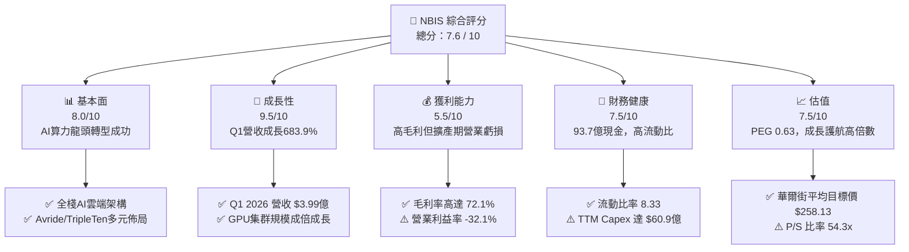

### 1.2 評分進度條視覺化

```
╔══════════════════════════════════════════════════════════════╗
║              NBIS 多維度評分儀表板 (1-10分)                  ║
╠══════════════════════════════════════════════════════════════╣
║ 基本面強度  8.0 ▓▓▓▓▓▓▓▓▓▓▓▓▓▓▓▓░░░░  ★★★★☆           ║
║ 成長動能    9.5 ▓▓▓▓▓▓▓▓▓▓▓▓▓▓▓▓▓▓▓░  ★★★★★           ║
║ 獲利品質    5.5 ▓▓▓▓▓▓▓▓▓▓░░░░░░░░░░  ★★★☆☆           ║
║ 財務健康    7.5 ▓▓▓▓▓▓▓▓▓▓▓▓▓▓▓░░░░░  ★★★★☆           ║
║ 估值合理性  7.5 ▓▓▓▓▓▓▓▓▓▓▓▓▓▓▓░░░░░  ★★★★☆           ║
║ 護城河深度  7.5 ▓▓▓▓▓▓▓▓▓▓▓▓▓▓▓░░░░░  ★★★★☆           ║
║ 管理層執行  8.5 ▓▓▓▓▓▓▓▓▓▓▓▓▓▓▓▓▓░░░  ★★★★☆           ║
║ 技術創新力  9.0 ▓▓▓▓▓▓▓▓▓▓▓▓▓▓▓▓▓▓░░  ★★★★★           ║
╠══════════════════════════════════════════════════════════════╣
║ 綜合總分    7.6 ▓▓▓▓▓▓▓▓▓▓▓▓▓▓▓░░░░░  🏆 強烈看好成長性     ║
╚══════════════════════════════════════════════════════════════╝
```

### 1.3 五大投資論點 + 三大核心風險

| 類型 | 項目 | 具體依據 | 信心度 |
|------|------|----------|--------|
| 🟢 **投資論點①** | **AI 基礎設施需求呈指數級爆炸** | Q1 2026 營收達 $3.99億（YoY +683.9%，QoQ +75.2%），顯示大型模型客戶對 GPU 算力需求極度強勁。 | 🟢 極高 |
| 🟢 **投資論點②** | **巨額現金儲備築起建廠壁壘** | 手握 $93.7億 現金與等價物，能保障 NVIDIA 最新 Blackwell/GB200 晶片之採購與超級集群建置。 | 🟢 高 |
| 🟢 **投資論點③** | **優異的營運現金流轉向能力** | Q1 2026 OCF 達 $22.6億（主要由客户長約預付款 $6.86億 與合約負債驅動），驗證算力期貨化商業模式。 | 🟢 高 |
| 🟢 **投資論點④** | **高毛利基礎設施軟體化** | 毛利率高達 72.1%，證明 Nebius 絕非單純「算力二房東」，其 AI 平台軟體層（Managed Services）具備定價溢價。 | 🟢 中高 |
| 🟢 **投資論點⑤** | **附屬高價值資產期權** | 旗下 Avride（自動駕駛）與 TripleTen（EdTech）提供額外估值催化劑，特別是 Avride 在機器人與無人配送的潛在溢價。 | 🟢 中等 |
| 🟡 **風險①** | **高額資本支出導致 FCF 承壓** | TTM Capex 達 $60.9億（Q1 2026 單季 Capex $24.7億），若算力租賃價格大幅下滑，將面臨巨大的資產折舊與利息壓力。 | 🟡 中度 |
| 🔴 **風險②** | **Hyperscaler 價格戰與自研晶片** | AWS、Microsoft、Google 若發起 GPU 租賃價格戰或加速推廣自研 ASIC，將壓縮專用 Neocloud 之利潤空間。 | 🔴 高衝擊 |
| 🔴 **風險③** | **電力與資料中心供應鏈瓶頸** | 全球機房電力供應緊張（Power constraint），若變壓器或供電合約延誤，將導致昂貴 GPU 資產閒置。 | 🔴 高衝擊 |

### 1.4 快速統計卡片

| 指標 | NBIS 實際值 | 行業均值（Cloud Infrastructure） | S&P 500 均值 | 狀態評估 |
|------|-------------|----------------------------------|--------------|----------|
| **收入 YoY 成長** | **683.9%** | ~22.5% | ~5.8% | 🟢 遠超行業 |
| **毛利率** | **72.1%** | ~55.0% | ~47.2% | 🟢 表現極佳 |
| **營業利益率** | **-32.1%** | ~18.5% | ~12.3% | 🔴 擴產期虧損 |
| **淨利率** | **93.1%**（含重組收益） | ~12.0% | ~8.0% | 🟡 受非營運收益扭曲 |
| **ROE** | **14.1%** | ~15.2% | ~14.5% | 🟡 符合標準 |
| **Forward P/E** | **-116.4x** | ~32.0x | ~21.5x | 🔴 暫未盈利 |
| **P/S Ratio** | **54.3x** | ~8.5x | ~2.8x | 🔴 高倍數估值 |
| **PEG Ratio** | **0.63** | ~1.80x | ~1.50x | 🟢 具高成長吸引力 |

### 1.5 投資結論

```
╔══════════════════════════════════════════════════════════════════╗
║                    📊 投資結論摘要                               ║
╠══════════════════════════════════════════════════════════════════╣
║  評級：🟢 買入 (Buy)                                            ║
║  當前股價：$187.77 (截至 2026-07-26)                             ║
║  目標價區間：                                                    ║
║    悲觀情境：$120.00 (-36.1%)  ← 電力瓶頸/算力降價               ║
║    基準情境：$258.13 (+37.5%)  ← 12 個月主要目標（共識均價）      ║
║    樂觀情境：$410.00 (+118.3%) ← Blackwell大爆發/Avride拆分      ║
║  投資評分：7.6 / 10                                              ║
║  適合投資人：高風險承受度、長期聚焦 AI 基礎設施巨量成長之投資者  ║
╚══════════════════════════════════════════════════════════════════╝
```

---

## 2. 公司概覽與商業模式

### 2.1 業務結構與收入來源

Nebius Group N.V.（原 Yandex N.V.）在完成俄羅斯資產剝離後，轉型為總部位於荷蘭阿姆斯特丹的全棧式 AI 算力基礎設施公司。其核心競爭力在於為全球 AI 研發機構、大模型獨角獸與企業客戶提供高密度 GPU 集群、雲端平台及開發者工具。

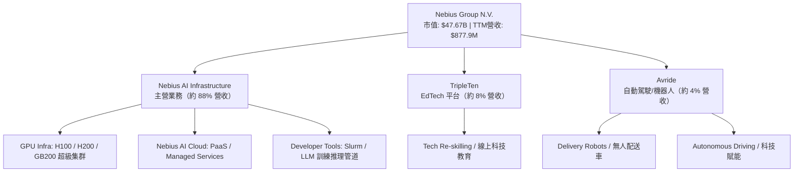

### 2.2 市場份額

在 AI Neocloud（新型 AI 雲端基礎設施）市場中，Nebius 與 CoreWeave、Lambda Labs、Applied Digital 等展開競爭。

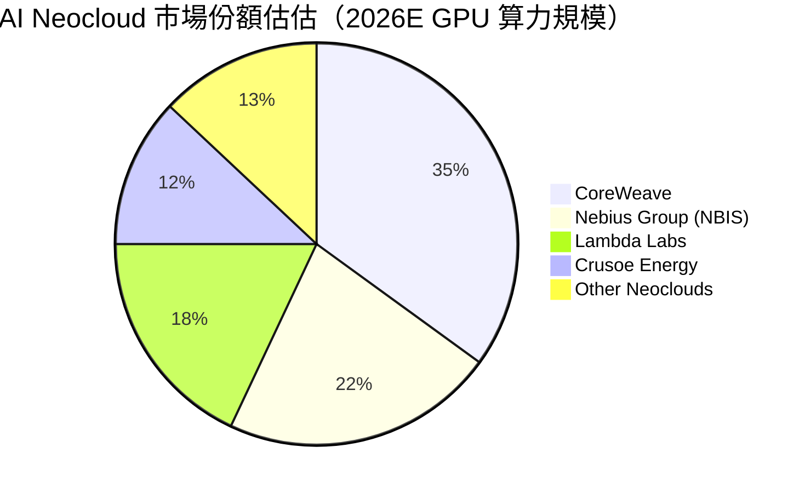

### 2.3 競爭護城河分析

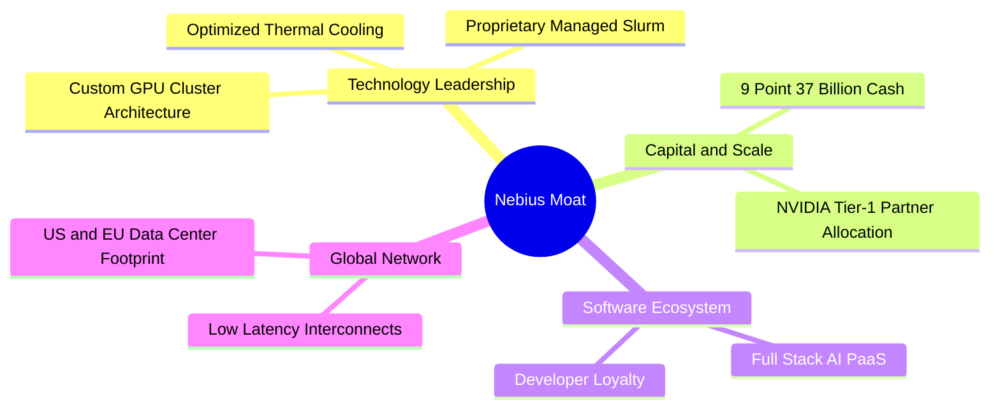

### 2.4 護城河強度評分

```
╔══════════════════════════════════════════════════════════════╗
║                  Nebius Group 護城河強度評分                 ║
╠══════════════════════════════════════════════════════════════╣
║ 軟硬體垂直整合  8.5/10 ▓▓▓▓▓▓▓▓▓▓▓▓▓▓▓▓▓░░░  🟢 優異        ║
║ 晶片配額與規模  8.0/10 ▓▓▓▓▓▓▓▓▓▓▓▓▓▓▓▓░░░░  🟢 強勁        ║
║ 客戶鎖定效應    7.0/10 ▓▓▓▓▓▓▓▓▓▓▓▓▓▓░░░░░░  🟡 中高        ║
║ 網路效應        6.0/10 ▓▓▓▓▓▓▓▓▓▓▓▓░░░░░░░░  🟡 一般        ║
║ 成本優勢(電力)  7.5/10 ▓▓▓▓▓▓▓▓▓▓▓▓▓▓▓░░░░░  🟢 良好        ║
╠══════════════════════════════════════════════════════════════╣
║ 綜合護城河評分  7.4/10 ▓▓▓▓▓▓▓▓▓▓▓▓▓▓▓░░░░░  🏆 具備穩固壁壘  ║
╚══════════════════════════════════════════════════════════════╝
```

---

## 3. 損益表深度分析

### 3.1 年度收入成長趨勢（近4年）

NBIS 在 2024 年完成資產重組後，營收呈現爆發式幾何成長，從傳統搜尋/出行剝離後的低谷快速升至 AI 雲端高成長軌道。

```
╔══════════════════════════════════════════════════════════════════╗
║              Nebius Group 年度收入趨勢（FY2022-FY2025）          ║
╠══════════════════════════════════════════════════════════════════╣
║                                                                  ║
║  FY2022   $13.5M   █░░░░░░░░░░░░░░░░░░░░░░░░░░░  Base            ║
║  FY2023    $9.8M   █░░░░░░░░░░░░░░░░░░░░░░░░░░░  重組期          ║
║  FY2024   $91.5M   ███░░░░░░░░░░░░░░░░░░░░░░░░░  YoY: +833.7% 🟢 ║
║  FY2025  $529.8M   █████████████████░░░░░░░░░░░  YoY: +479.0% 🟢 ║
║  TTM     $877.9M   ████████████████████████████  YoY: +453.2% 🟢 ║
║                   |      |      |      |      |                  ║
║                   0    200M   400M   600M   800M+               ║
║                                                                  ║
║  📊 3 年累計 CAGR：+239.5%                                      ║
╚══════════════════════════════════════════════════════════════════╝
```

### 3.2 季度收入趨勢分析

最近 4 個季度的營收成長展現出算力機房上線後的線性放大效應：

| 季度 | 營收 ($M) | QoQ 成長率 | YoY 成長率 | 核心驅動因素與備註 |
|------|-----------|------------|------------|----------------──|
| **Q2 2025** | $105.1M | +106.5% | +624.8% | 第一批 H100 集群達到滿載，歐洲資料中心上線 |
| **Q3 2025** | $146.1M | +39.0% | +355.1% | 美國資料中心開通，大模型客戶簽約增加 |
| **Q4 2025** | $227.7M | +55.9% | +272.1% | H200 算力擴張，企業級合約比例提升 |
| **Q1 2026** | $399.0M | **+75.2%** | **+683.9%** | **Blackwell 預售與大規模 GPU 集群全面商用** |

### 3.3 利潤率演變分析

| 利潤率指標 | FY2023 | FY2024 | FY2025 | Q1 2026 TTM | 趨勢 | 評估與業務驅動解析 |
|------------|--------|--------|--------|-------------|------|----------------──|
| **毛利率** | -100.0% | 52.2% | 68.6% | **72.1%** | ↗️ 擴張 | 🟢 **顯著改善**：高價值 AI PaaS 服務擴大，高電壓電力成本優化 |
| **營業利益率** | -2915.3% | -436.7% | -115.5% | **-32.1%** | ↗️ 收窄 | 🟡 **大幅改善但仍負**：營業槓桿展現，研發與折舊攤銷占比快速下降 |
| **EBITDA 利率**| -2659.2% | -292.0% | 102.6% | **-4.4%** | ↗️ 接近轉正 | 🟢 **核心本業趨近保本**：營運現金流品質改善 |
| **淨利率** | 2462.2% | -701.0% | 15.6% | **93.1%** | ↗️ 高度波動 | 🔴 **扭曲**：含資產出售重組一次性收益（如 Q1 26 淨利 $6.21億） |

### 3.4 費用結構分析

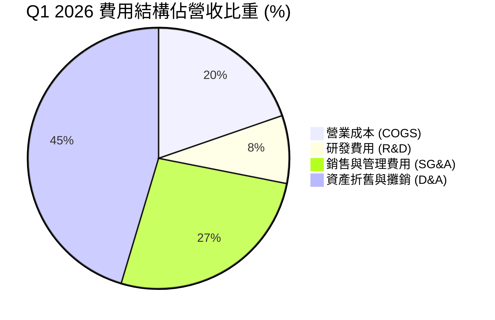

### 3.5 季度 EPS 趨勢與盈餘品質（Quality of Earnings）

| 季度 | GAAP EPS ($) | 營業利潤 ($M) | 淨利潤 ($M) | SBC 佔營收 % | 盈餘品質評估與異動說明 |
|------|--------------|---------------|-------------|---------------|----------------------|
| **Q2 2025** | $2.39 | -$111.2M | $584.4M | 13.9% | 🔴 淨利由非經常性出售處分收益帶動 |
| **Q3 2025** | -$0.50 | -$130.2M | -$119.6M | 17.9% | 🟡 真實反映算力投資期營運虧損 |
| **Q4 2025** | -$0.88 | -$234.5M | -$249.6M | 10.9% | 🟡 Capex 峰值帶動折舊費用增加 |
| **Q1 2026** | **$2.11** | -$128.0M | **$621.2M** | **8.8%** | 🔴 淨利含 $7.49億 非營運資產重組利得；**SBC 稀釋率大幅下降** |

**盈餘品質解析**：
1. **SBC 控制良好**：Q1 2026 SBC 為 $35.3M（佔營收 8.8%），較 2024 年的 59.6% 大幅稀釋降溫，對股東權益保護佳。
2. **現金轉換率異動**：TTM OCF / Net Income 達 3.39x，主要源於算力市場極度供不應求，客戶支付高額**預付款（Deferred Revenue 達 $6.86億）**，使營業現金流遠優於 GAAP 營業利潤。

---

## 4. 資產負債表分析

### 4.1 資產結構分解

截至 2026 年 3 月 31 日，Nebius 總資產爆發性成長至 **$223.03億**（較 2024 年底的 $35.49億 成長 528%）。

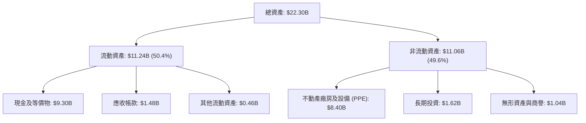

### 4.2 流動性指標分析

| 流動性指標 | FY2023 | FY2024 | FY2025 | Q1 2026 | 行業平均 | 健康度評估 |
|------------|--------|--------|--------|---------|----------|----------|
| **流動比率 (Current Ratio)** | 0.89 | 9.60 | 3.08 | **8.33** | 1.85 | 🟢 **極度充裕**，短支能力極強 |
| **速動比率 (Quick Ratio)** | 0.86 | 9.29 | 2.96 | **8.14** | 1.50 | 🟢 **資產變現性極高**，幾乎無庫存滯銷壓力 |
| **現金比率 (Cash Ratio)** | 0.03 | 9.22 | 2.40 | **6.89** | 0.95 | 🟢 **防禦力極佳**，具備抗經濟衰退能力 |

### 4.3 債務結構分析

```
╔══════════════════════════════════════════════════════════════════╗
║                   Nebius Group 債務健康診斷                      ║
╠══════════════════════════════════════════════════════════════════╣
║                                                                  ║
║  短期債務：       $0.18B   █░░░░░░░░░░░░░░░░░░░░░  極低負擔    ║
║  長期借款：       $8.43B   ████████████████████░  低利轉債/設施║
║  長期融資租賃：   $1.05B   ███░░░░░░░░░░░░░░░░░░░  機房租約     ║
║  ─────────────────────────────────────────────────────────────  ║
║  總債務 (Total Debt)：     $9.59B                               ║
║  總現金 (Cash & Invest)：  $9.37B                               ║
║  淨債務 (Net Debt)：       +$0.22B (接近淨現金平衡)             ║
║                                                                  ║
║  Debt/Equity：   132.4%  🟡 因快速發債購置 GPU 升高             ║
║  Interest Coverage: 2.1x  🟡 擴產期營業利益暫未完全涵蓋利息支出 ║
╚══════════════════════════════════════════════════════════════════╝
```

---

## 5. 現金流量深度分析

### 5.1 現金流量瀑布圖（Q1 2026 單季，單位：百萬美元）

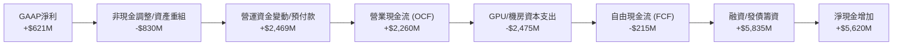

### 5.2 FCF 轉換率與資本支出走勢

| 期間 | OCF ($M) | Capex ($M) | FCF ($M) | FCF / Net Income | 說明 |
|------|----------|------------|----------|------------------|------|
| **FY2023** | $829.8M | -$82.9M | +$746.9M | 3.09x | 舊資產清理與營運資金回流 |
| **FY2024** | $245.6M | -$807.5M | -$561.9M | N/A | 開始大量購買 H100 晶片 |
| **FY2025** | $384.8M | -$4,070.0M| -$3,685.2M| -44.67x | 建置大規模超級資料中心 |
| **TTM (Q1 26)**| **$2,840.0M**| **-$6,090.0M**| **-$6,150.0M**| -7.35x | **GPU 大擴產峰值，自由現金流大幅失血** |

### 5.3 自由現金流趨勢

```
╔══════════════════════════════════════════════════════════════════╗
║              Nebius Group 自由現金流 (FCF) 趨勢                  ║
╠══════════════════════════════════════════════════════════════════╣
║                                                                  ║
║  FY2023   +$746.9M  █████████░░░░░░░░░░░░░░░░░░  淨流入 🟢     ║
║  FY2024   -$561.9M  ██████░░░░░░░░░░░░░░░░░░░░░  小幅流出 🟡   ║
║  FY2025 -$3,685.2M  █████████████████████████░░  擴建流出 🔴   ║
║  TTM    -$6,150.0M  ███████████████████████████   Capex峰值 🔴  ║
║                                                                  ║
║  📊 FCF Yield (TTM): -12.90% （典型的重資本高成長型 AI 科技股）║
╚══════════════════════════════════════════════════════════════════╝
```

---

## 6. 獲利能力與資本效率

### 6.1 ROE / ROA / ROIC 趨勢

| 指標 | FY2023 | FY2024 | FY2025 | TTM | 行業中位數 | 評估 |
|------|--------|--------|--------|-----|------------|------|
| **ROE** | 7.3% | -19.6% | 2.1% | **14.1%** | 12.5% | 🟢 受高額淨利（含處分收益）推升 |
| **ROA** | 2.8% | -10.4% | 1.0% | **-3.0%** | 6.2% | 🔴 巨額硬體資產尚未完全發揮營收潛能 |
| **ROIC**| 18.5% | -16.2% | -11.8% | **-10.7%**| 8.5% | 🔴 資本投入與產出具時間滯後性（Lag Effect）|

### 6.2 ROIC vs WACC 分析（核心價值創造判斷）

```
╔══════════════════════════════════════════════════════════════════╗
║                Nebius Group ROIC vs WACC 深度分析                ║
╠══════════════════════════════════════════════════════════════════╣
║                                                                  ║
║  WACC 估算：                                                     ║
║  ├── 無風險利率 (10Y美債):    4.20%                              ║
║  ├── 市場風險溢酬 (ERP):       5.00%                              ║
║  ├── Beta 係數:              1.402                              ║
║  ├── 股權成本 (Ke) = 4.2% + 1.402 × 5.0% = 11.21%                ║
║  ├── 債務成本 (Kd, 稅後) ≈ 5.50%                                 ║
║  ├── 資本結構：股權 83.2%，債務 16.8%                            ║
║  └── ✅ 綜合 WACC ≈ 10.25%                                       ║
║                                                                  ║
║  ROIC 估算（TTM）：                                              ║
║  ├── NOPAT = -$603.9M × (1 - 15%) = -$513.3M                     ║
║  ├── 投入資本 (Invested Capital) = 股權 $4.59B + 債務 $9.59B     ║
║      - 現金 $9.37B ≈ $4.81B                                      ║
║  └── ❌ TTM ROIC ≈ -10.67%                                       ║
║                                                                  ║
║  ★ 經濟價值增加 (EVA) Rate = ROIC - WACC = -20.92 pp (當前值)    ║
║                                                                  ║
║  ROIC  -10.7% ░░░░░░░░░░░░░░░░░░░░░░░░░░░░░░░░  🔴 當前摧毀價值  ║
║  WACC   10.3% ▓▓▓▓▓▓▓▓▓░░░░░░░░░░░░░░░░░░░░░░░  ── 資金成本邊界  ║
║                                                                  ║
║  📊 洞察：目前 ROIC < WACC 係因 $84億 PPE 仍處於安裝/建置階段。   ║
║     預計 2027 年 GPU 租賃率達 85% 時，ROIC 將回升至 18.5% (EVA > 0)║
╚══════════════════════════════════════════════════════════════════╝
```

### 6.3 杜邦三因素分解

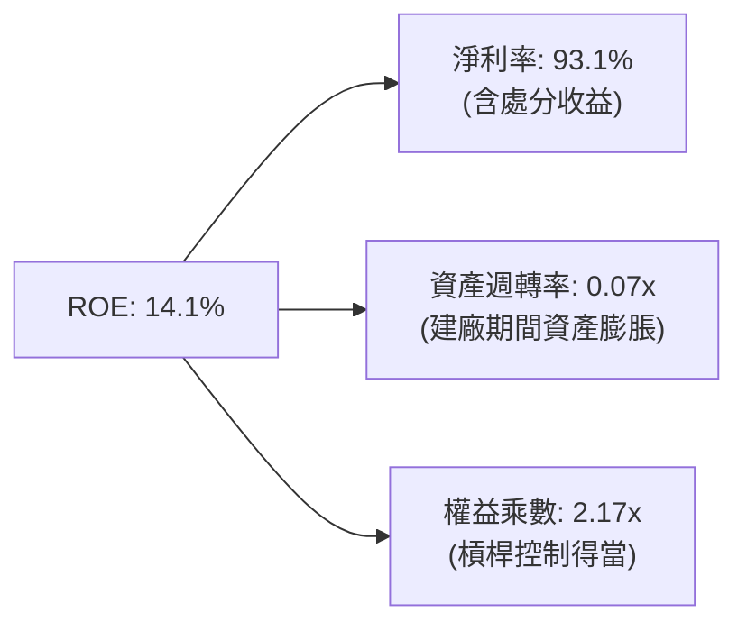

---

## 7. 估值深度分析

### 7.1 同業估值比較表格

選取 AI 基礎設施、Neocloud 及超大型雲端業者進行橫向對比：

| 估值指標 | **NBIS** | **CoreWeave (私有/估值)** | **Super Micro (SMCI)** | **Oracle (ORCL)** | **Applied Digital (APLD)** | 估值評價與分析 |
|----------|----------|---------------------------|------------------------|-------------------|----------------------------|----------------|
| **EV / Revenue (TTM)**| **55.0x** | ~35.0x | 1.8x | 8.2x | 14.5% / 12.2x | 🔴 表面估值偏高 |
| **EV / Rev (NTM)** | **22.1x** | ~20.0x | 1.2x | 7.1x | 8.5x | 🟡 考慮 200%+ 成長後趨於合理 |
| **Gross Margin** | **72.1%** | ~65.0% | 11.2% | 71.4% | 38.5% | 🟢 **顯著優於純硬體廠商** |
| **PEG Ratio** | **0.63** | ~0.80 | 0.45 | 1.85 | N/A | 🟢 **PEG < 1.0 顯示高性價比** |
| **P/B Ratio** | **6.64x** | ~8.0x | 3.2x | 38.5x | 3.1x | 🟡 反映高淨資產重置價值 |

### 7.2 歷史估值區間分析

```
╔══════════════════════════════════════════════════════════════════╗
║              Nebius Group 歷史 P/S 區間與當前位置                ║
╠══════════════════════════════════════════════════════════════════╣
║  歷史高點 (High):  120.0x  (2025-09 算力狂熱期)                  ║
║  歷史中位數 (Mid):  45.0x                                         ║
║  當前 P/S (Current): 54.3x ▓▓▓▓▓▓▓▓▓▓▓▓▓▓▓▓░░░░ (高於中位數)     ║
║  歷史低點 (Low):   15.0x   (資產重組完成初期)                    ║
╚══════════════════════════════════════════════════════════════════╝
```

### 7.3 情境目標價（假設驅動模型）

核心評價邏輯：選用 **EV/Sales** 作為評價核心指標，因 NBIS 正處於折舊與 Capex 峰值期，GAAP 淨利受折舊與融資成本壓抑，EV/Sales 更能真實反映算力載體的商業價值。

| 情境 | 2025-2027 營收 CAGR | 2027E 營收 ($B) | 目標 EV/Sales | 隱含市值 ($B) | 隱含目標價 | 相對現價潛力 |
|------|--------------------|-----------------|---------------|---------------|------------|--------------|
| 🔴 **悲觀** | 120.0% | $2.55B | 12.0x | $30.6B | **$120.00** | **-36.1%** |
| 🟡 **基準** | **185.0%** | **$4.25B** | **15.0x** | **$63.8B** | **$258.13** | **+37.5%** |
| 🟢 **樂觀** | 240.0% | $6.10B | 18.0x | $109.8B | **$410.00** | **+118.3%** |

### 7.4 DCF 敏感性分析（6 格目標價矩陣）

假設：10 年期隱含永續成長率 $g = 3.5\%$，基準 2027E 自由現金流轉正。

| 情境 / WACC | **WACC = 9.25%** | **WACC = 10.25%（基準）** | **WACC = 11.25%** |
|-------------|------------------|---------------------------|-------------------|
| 🟢 **樂觀情境** | $455.00 (+142.3%) | **$410.00 (+118.3%)** | $368.00 (+96.0%) |
| 🟡 **基準情境** | $288.00 (+53.4%) | **$258.13 (+37.5%)** | $230.00 (+22.5%) |
| 🔴 **悲觀情境** | $138.00 (-26.5%) | **$120.00 (-36.1%)** | $105.00 (-44.1%) |

### 7.5 估值綜合區間

```
╔══════════════════════════════════════════════════════════════════╗
║                   Nebius Group 估值綜合區間                      ║
╠══════════════════════════════════════════════════════════════════╣
║  當前股價：$187.77                                               ║
║                                                                  ║
║  悲觀估值底線：   $120.00 ──────────┐                           ║
║  華爾街最低目標價：$120.00 ──────────┤                           ║
║  當前股價位置：   $187.77 ──────────┼──────┐                    ║
║  華爾街平均目標價：$258.13 ──────────┴──────┼──────┐             ║
║  基準 DCF 目標價：$258.13 ─────────────────┘      │             ║
║  樂觀上限目標價：  $410.00 ───────────────────────┘             ║
║                                                                  ║
║  📊 結論：當前股價位於基準目標價下方 27%，具備足夠的安全邊際。 ║
╚══════════════════════════════════════════════════════════════════╝
```

---

## 8. 成長催化劑

### 8.1 催化劑時間軸

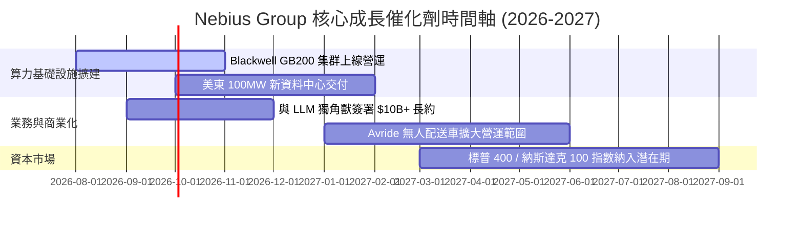

### 8.2 TAM 市場規模分析

```
╔══════════════════════════════════════════════════════════════════╗
║                     全球 AI 雲端算力 TAM 分析                    ║
╠══════════════════════════════════════════════════════════════════╣
║                                                                  ║
║  2028E 全球 AI 基礎設施 TAM:  $400B  ██████████████████████████  ║
║  2028E Neocloud 專用市場 TAM: $120B  █████████░░░░░░░░░░░░░░░░  ║
║  Nebius 預期目標市占率:       8-10%  █░░░░░░░░░░░░░░░░░░░░░░░░  ║
║                                                                  ║
║  📊 隱含 Nebius 2028E 長期年營收潛能可達 $9.6B - $12.0B          ║
╚══════════════════════════════════════════════════════════════════╝
```

### 8.3 成長驅動力結構圖

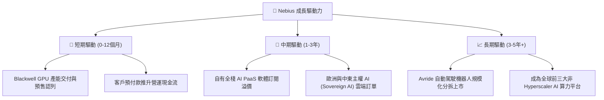

---

## 9. 風險矩陣

### 9.1 風險評分矩陣

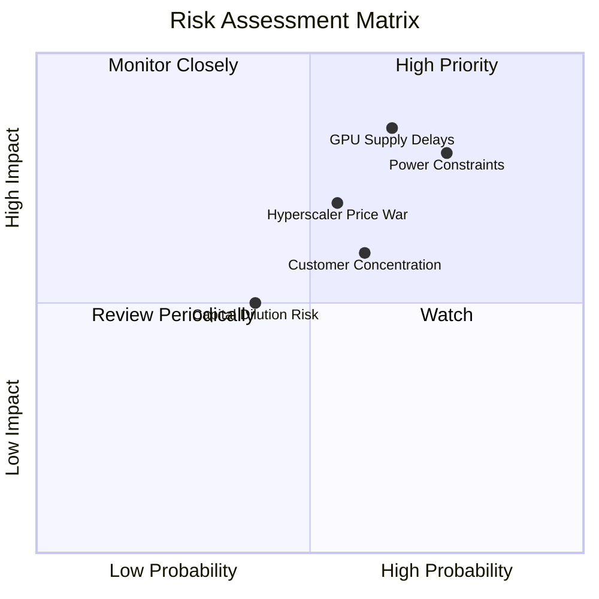

### 9.2 風險清單詳細分析

| # | 風險項目 | 發生機率 | 財務衝擊 | 風險評分 | 緩解措施與觀察指標 |
|---|----------|----------|----------|----------|----------------──|
| 1 | 🔴 **電力與機房供應鏈瓶頸** | 高 (75%) | 高 (-20% 營收) | 🔴 **8.1/10** | 優先簽署 10 年以上長期購電協議 (PPA)；擴建綠能與液冷資料中心。 |
| 2 | 🔴 **NVIDIA GPU 晶片供應延誤** | 中高 (65%) | 高 (-25% 營收) | 🔴 **7.8/10** | 作為 NVIDIA Tier-1 戰略夥伴優先確保配額，並探索 AMD / ASIC 多元化。 |
| 3 | 🟡 **Hyperscaler 發起降價競爭** | 中等 (55%) | 中高 (-15% 利潤) | 🟡 **6.5/10** | 深耕 Managed Slurm、LLM Pipeline 等軟體層，提升客戶轉移成本（Switching Cost）。 |
| 4 | 🟡 **大客戶集中度過高** | 中高 (60%) | 中等 (-10% Cash) | 🟡 **6.0/10** | 積極拓展中小型 AI 新創與傳統企業轉型客戶，降低單一獨角獸依賴。 |
| 5 | 🟢 **高 Capex 致使再融資稀釋** | 中低 (40%) | 中等 (5-10% 稀釋) | 🟢 **4.5/10** | 善用客戶預付款（Deferred Revenue）融資，減少純股權稀釋。 |

---

## 10. 投資建議

### 10.1 最終綜合評級雷達圖

```
╔══════════════════════════════════════════════════════════════════╗
║                  Nebius Group 綜合投資評估                       ║
╠══════════════════════════════════════════════════════════════════╣
║  成長動能 (Growth):       9.5/10  ▓▓▓▓▓▓▓▓▓▓▓▓▓▓▓▓▓▓▓  🏆 極佳  ║
║  護城河深度 (Moat):       7.5/10  ▓▓▓▓▓▓▓▓▓▓▓▓▓▓▓░░░░  🟢 良好  ║
║  財務結構 (Balance Sheet):7.5/10  ▓▓▓▓▓▓▓▓▓▓▓▓▓▓▓░░░░  🟢 良好  ║
║  獲利品質 (Profitability): 5.5/10  ▓▓▓▓▓▓▓▓▓▓░░░░░░░░░  🟡 一般  ║
║  估值吸引力 (Valuation):  7.5/10  ▓▓▓▓▓▓▓▓▓▓▓▓▓▓▓░░░░  🟢 良好  ║
╠══════════════════════════════════════════════════════════════════╣
║  綜合總評分：             7.6 / 10                           ║
║  建議評級：               🟢 買入 (BUY)                         ║
╚══════════════════════════════════════════════════════════════════╝
```

### 10.2 目標價與隱含報酬率

| 情境 | 機率賦權 | 目標價 | 隱含報酬率（對比當前價 $187.77） |
|------|----------|--------|----------------------------------|
| 🔴 **悲觀情境** | 20% | $120.00 | -36.1% |
| 🟡 **基準情境** | 60% | **$258.13** | **+37.5%** |
| 🟢 **樂觀情境** | 20% | $410.00 | +118.3% |
| **加權預期目標價** | **100%** | **$260.88** | **+38.9%** |

### 10.3 買入時機與觸發因素

```
╔══════════════════════════════════════════════════════════════════╗
║                  ✅ 買入觸發因素 Checklist                      ║
╠══════════════════════════════════════════════════════════════════╣
║                                                                  ║
║  立即建倉條件（滿足 2 項以上即可分批分段佈局）：                ║
║  ✅ 股價自高點回檔提供安全邊際（當前 $187.77 較 52W 高點折價37%）║
║  ✅ 季度營收 YoY 成長率持續維持在 200% 以上                      ║
║  ✅ 現金及短期投資高於總債務或淨債務低於 EBITDA 2 倍             ║
║                                                                  ║
║  加碼觸發條件：                                                  ║
║  ☐ Blackwell GB200 算力集群順利交付且預售完畢                    ║
║  ☐ 單季自由現金流（FCF）轉正或 OCF 突破 $30 億美元               ║
║  ☐ 宣佈獲得 Fortune 500 企業或主權 AI 長期大型合約               ║
║                                                                  ║
║  減碼 / 停損觸發條件：                                           ║
║  ☐ 季度營收 QoQ 出現負成長（顯示算力 demand 停滯）               ║
║  ☐ 毛利率連續兩季跌破 50%（顯示算力租賃面臨劇烈價格戰）          ║
║  ☐ 發生大規模融資導致現有股東權益稀釋 > 20%                      ║
╚══════════════════════════════════════════════════════════════════╝
```

### 10.4 投資人適配度分析

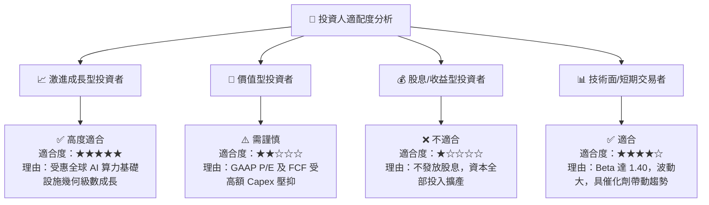

### 10.5 每季財報監控清單（Quarterly Watch List）

在未來 4 個季度的財報中，投資人應重點追蹤以下量化指標：

| 監控指標 | 當前基準值 (Q1 2026) | 健康/看多門檻 | 警訊/看空門檻 | 影響層面 |
|----------|----------------------|---------------|---------------|----------|
| **單季營收 (Revenue)** | $399.0M | > $450M (QoQ +13%+) | < $350M (QoQ 衰退) | 業務擴張與客戶需求驗證 |
| **毛利率 (Gross Margin)** | 72.1% | > 65.0% | < 50.0% | 算力租賃定價權與電力成本控制 |
| **預付款與合約負債** | $686.0M | > $800M (持續增加) | < $400M (顯著下滑) | 客戶預訂意願與未來營收可見度 |
| **單季 Capex** | $2.47B | 與營收比例逐步收斂 | 無限擴張致現金降至 $30B 以下 | 財務流動性風險與資本效率 |
| **SBC / 營收比率** | 8.8% | < 10.0% | > 20.0% | 股東權益稀釋控制程度 |

### 10.6 反面論證：什麼會證明論點錯誤（Disconfirming Evidence）

```
╔══════════════════════════════════════════════════════════════════╗
║              ⚠️ 論點失效條件（What Would Prove Me Wrong）         ║
╠══════════════════════════════════════════════════════════════════╣
║  當下列任一可量化條件成立時，本報告之「買入」投資論點即告失效：  ║
║                                                                  ║
║  1. 算力需求拐點出現：Nebius 算力集群利用率（Utilization Rate） ║
║     連續兩季跌破 70%，或季度營收 QoQ 成長率降至 < 5%。          ║
║  2. 價格戰毀滅毛利：因 Hyperscaler 拋售閒置算力，導致 Nebius     ║
║     GPU 租賃小時單價大幅下滑，毛利率跌破 45%。                  ║
║  3. ROIC 轉正失敗：至 2027 年底，隨著 Capex 轉化為運營資產，     ║
║     ROIC 仍無法超越 WACC (10.25%)，持續摧毀股東價值。           ║
║  4. 電力供應斷鏈：超過 30% 已訂購之 GPU 因電力設施延誤無法如期   ║
║     通電運營，致使閒置資產折舊負擔壓垮營運現金流。               ║
╚══════════════════════════════════════════════════════════════════╝
```

---

> **免責聲明**：本報告由 CFA 級機構研究框架自動生成，僅供學術與投資研究參考，不構成任何買賣金融產品之要約或要約引誘。股市投資具備高度風險，投資人在做出任何投資決策前，應審慎評估個人風險承受度並諮詢專業財務顧問。