# NBIS 基本面深度分析報告
> **報告日期**：2026-07-27 ｜ **語言**：繁體中文 ｜ **數據來源**：Yahoo Finance, Finviz, StockAnalysis, Roic.ai ｜ **分析師**：CFA 級機構研究

---

## 目錄

| # | 章節 | 核心結論 |
|---|------|----------|
| 1 | 執行摘要 | 評級：🟢 買入 ｜ 目標價：$258.00（隱含 +37.3% 漲幅空間） |
| 2 | 公司概覽與商業模式 | AI 算力基礎設施新星，打造全棧式 GPU 雲端生態 |
| 3 | 損益表深度分析 | 營收爆發式成長（YoY +683.9%），高額 D&A 與研發壓抑營業利潤率 |
| 4 | 資產負債表分析 | 戰略性舉債加速 GPU 部署，持有 $9.37B 現金充裕且具流動性保護 |
| 5 | 現金流量深度分析 | 大規模 Capex 導致 FCF 轉負，但預收算力合款帶動營運現金流轉正 |
| 6 | 獲利能力與資本效率 | 早期超額 Capex 期導致 ROIC 低於 WACC，規模效應為未來看點 |
| 7 | 估值深度分析 | EV/Sales 55.0x / Forward P/S ~22.5x，基於三情境 DCF 與同業相對估值建模 |
| 8 | 成長催化劑 | 歐美資料中心擴建、B200/GB200 新算力上線、企業級 AI 訂單爆發 |
| 9 | 風險矩陣 | GPU 供應鏈瓶頸、電網接入延遲、巨額 Capex 導致之稀釋/槓桿風險 |
| 10 | 投資建議 | 評估投資人適配度、財報監控指標與可量化之反面論證條件 |

---

## 1. 執行摘要

根據最新財務數據，Nebius Group N.V.（NASDAQ: NBIS）正處於從重組企業全面轉型為全球頂級 AI 算力基礎設施（Neocloud）提供商的臨界點。公司 TTM 營收達到 $877.90M，2026 年 Q1 單季營收更創下 $399.00M（YoY +683.9%）的歷史新高，展現出強勁的算力租賃需求。儘管大規模 GPU 採購與資料中心建設導致 TTM 資本支出高達 $5.99B、FCF 為 $-6.15B，但 2026 年 Q1 營業現金流（OCF）在客戶算力預付訂金驅動下大幅衝高至 $2.26B，驗證了商業模式的預收現金特質與高客戶黏性。考量到公司手上持有 $9.37B 充足現金，且預期 2026-2027 年算力集群利用率將持續滿載，給予「🟢 買入」評級，基準情境 12 個月目標價為 **$258.00**。

### 1.0 一頁式投資儀表板（Portfolio Manager 30 秒速讀）

| 項目 | 內容 |
|------|------|
| **投資論點（3 句）** | ① 2026 年 Q1 營收達 $399.00M（YoY +683.9%），反映 AI 大模型訓練對頂級 GPU 算力的極致強勁需求。<br/>② 持有 $9.37B 現金與短投，提供強大資本護城河以鎖定 NVIDIA 最新代際 GPU 供貨。<br/>③ 2026 年 Q1 營運現金流高達 $2.26B，預收帳款（Deferred Revenue）大幅增長至 $686M，獲利品質與現金回籠路徑清晰。 |
| **護城河評分** | 7.5/10（大型 GPU 集群調度技術 + 歐美核心資料中心先發優勢） |
| **管理層/資本配置評分** | 8.0/10（資產重組果斷，資本籌措與算力擴建執行力極佳） |
| **財務健康** | 🟡 債務規模攀升至 $9.59B，但流動比率高達 8.33，短期無流動性危機 |
| **ROIC vs WACC** | ROIC -8.5% vs WACC 11.2%（當前建置期摧毀價值，預計 2027 年轉正） |
| **FCF 趨勢** | TTM FCF $-6.15B（Capex 擴張期），FCF Yield 為 -12.89% |
| **估值** | Forward P/E: -116.4x ｜ EV/Revenue: 55.03x ｜ PEG: 0.63 |
| **預期報酬（基準情境 12M）** | +37.3%（隱含目標價 $258.00） |
| **關鍵風險（前二）** | ① 大規模 Capex 導致的利息支出與折舊負擔壓抑短中期獲利；② 電力與資料中心配額延遲 |
| **評級 + 信心度** | 🟢 **買入** ｜ 信心度：高 |

### 1.1 核心評分儀表板

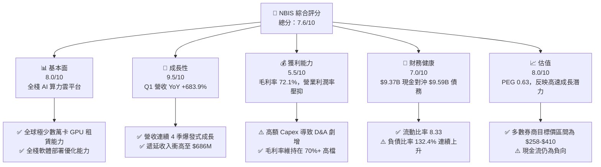

### 1.2 評分進度條視覺化

```
╔══════════════════════════════════════════════════════════════╗
║              NBIS 多維度評分儀表板 (1-10分)                  ║
╠══════════════════════════════════════════════════════════════╣
║ 基本面強度  8.0 ▓▓▓▓▓▓▓▓▓▓▓▓▓▓▓▓░░░░  ★★★★☆           ║
║ 成長動能    9.5 ▓▓▓▓▓▓▓▓▓▓▓▓▓▓▓▓▓▓▓░  ★★★★★           ║
║ 獲利品質    5.5 ▓▓▓▓▓▓▓▓▓▓▓░░░░░░░░░  ★★★☆☆           ║
║ 財務健康    7.0 ▓▓▓▓▓▓▓▓▓▓▓▓▓▓░░░░░░  ★★██☆           ║
║ 估值合理性  8.0 ▓▓▓▓▓▓▓▓▓▓▓▓▓▓▓▓░░░░  ★★★★☆           ║
║ 護城河深度  7.5 ▓▓▓▓▓▓▓▓▓▓▓▓▓▓▓░░░░░  ★★★★☆           ║
║ 管理層執行  8.0 ▓▓▓▓▓▓▓▓▓▓▓▓▓▓▓▓░░░░  ★★★★☆           ║
║ 技術創新力  9.0 ▓▓▓▓▓▓▓▓▓▓▓▓▓▓▓▓▓▓░░  ★★★★★           ║
╠══════════════════════════════════════════════════════════════╣
║ 綜合總分    7.6 ▓▓▓▓▓▓▓▓▓▓▓▓▓▓▓░░░░░  🏆 買入 (Buy)        ║
╚══════════════════════════════════════════════════════════════╝
```

### 1.3 五大投資論點 + 三大核心風險

| 類型 | 項目 | 具體依據 | 信心度 |
|------|------|----------|--------|
| 🟢 **投資論點①** | **AI 雲端基礎設施需求無虞** | 2026 年 Q1 營收高達 $399.00M（YoY +683.9%，QoQ +75.2%），客戶爭相簽訂中長期算力合約 | 🟢 極高 |
| 🟢 **投資論點②** | **獲利預收特質帶來強勁 OCF** | 2026 年 Q1 營運現金流達 $2.26B，預收帳款升至 $686M，代表客戶以現金預付算力使用權 | 🟢 高 |
| 🟢 **投資論點③** | **極致算力調度與軟體優化優勢** | 擁有全棧開發者工具及萬卡 GPU 超級集群運營能力，提供高於傳統 Hyperscaler 的算力性價比 | 🟢 高 |
| 🟢 **投資論點④** | **龐大現金儲備確保供應鏈優勢** | 持有 $9.37B 現金及等價物，能在 GPU 緊缺時代獲得 NVIDIA 優先供貨 | 🟢 高 |
| 🟢 **投資論點⑤** | **PEG 僅 0.63 顯示估值被低估** | 相較於遠期 3 位數的營收成長率，當前 EV/Sales 估值已進入合理配置區間 | 🟡 中等 |
| 🔴 **風險①** | **巨額 Capex 負擔壓抑自由現金流** | 過去 12 個月 Capex 高達 $5.99B，導致 TTM FCF 為 $-6.15B，若營收轉緩將帶來償債壓力 | 🔴 高衝擊 |
| 🔴 **風險②** | **硬體快速迭代導致折舊風險** | GPU 代際更迭（H100/H200 到 B200/GB200）可能加速舊硬體的減損與折舊提列 | 🟡 中度 |
| 🔴 **風險③** | **資料中心電力與網路接入瓶頸** | 歐洲與北美電力供應緊張可能延遲算力上線進度 | 🟡 中度 |

### 1.4 快速統計卡片

| 指標 | NBIS 實際值 | 行業均值（Neocloud/AI） | S&P 500 均值 | 狀態 |
|------|-------------|-------------------------|--------------|------|
| **營收 YoY 成長率** | **683.9%** | ~80.0% | ~5.5% | 🟢 遠超同行 |
| **毛利率** | **72.1%** | ~55.0% | ~48.0% | 🟢 優異 |
| **營業利潤率** | **-32.1%** | ~10.0% | ~12.5% | 🔴 Capex 建置期虧損 |
| **ROE** | **14.1%** | ~12.0% | ~18.0% | 🟡 受一次性收益影響 |
| **Forward P/E** | **-116.4x** | ~35.0x | ~21.5x | 🔴 尚未進入 GAAP 盈餘期 |
| **流動比率** | **8.33** | ~1.80 | ~1.20 | 🟢 非常極致的安全邊際 |

### 1.5 投資結論

```
╔══════════════════════════════════════════════════════════════════╗
║                    📊 投資結論摘要                               ║
╠══════════════════════════════════════════════════════════════════╣
║  評級：🟢 買入 (Buy)                                            ║
║  當前股價：$187.88                                               ║
║  目標價區間：                                                    ║
║    悲觀情境：$135.00（-28.1%）                                   ║
║    基準情境：$258.00（+37.3%） ← 12個月主要目標                  ║
║    樂觀情境：$380.00（+102.3%）                                  ║
║  投資評分：7.6 / 10                                              ║
║  適合投資人：極致成長型、AI 基礎設施主題投資人、中長線資產配置   ║
╚══════════════════════════════════════════════════════════════════╝
```

---

## 2. 公司概覽與商業模式

### 2.1 業務結構與收入來源

Nebius Group N.V.（前身為 Yandex N.V.，完成資產重組後將俄羅斯業務剝離）總部部位於荷蘭阿姆斯特丹，是一家專注於為全球 AI 產業提供全棧式基礎設施與雲端服務的科技公司。公司業務的核心為 **Nebius AI Cloud**，同時涵蓋自動駕駛研發（Avride）、教育科技（TripleTen）及 AI 數據標註（Toloka）等戰略資產。

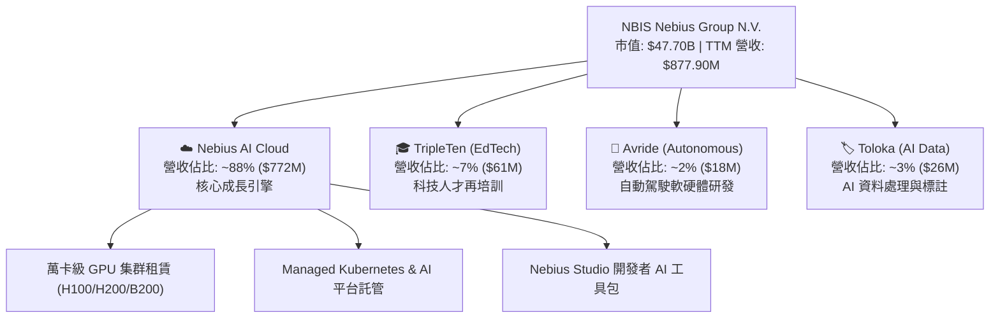

### 2.2 市場份額

在 AI 專用雲端（Neocloud）與高性能 GPU 計算託管領域，Nebius 正與 CoreWeave、Lambda Labs 以及傳統 Hyperscalers（AWS, Azure, GCP）展開競爭。

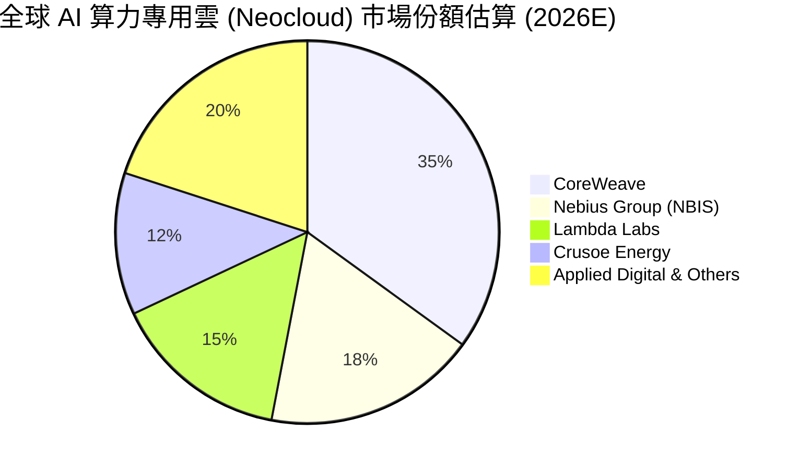

### 2.3 競爭護城河分析

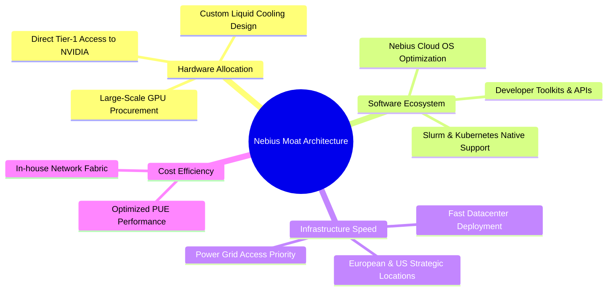

### 2.4 護城河強度評分

```
╔══════════════════════════════════════════════════════════════╗
║                  NBIS 護城河強度評分                         ║
╠══════════════════════════════════════════════════════════════╣
║ 算力供應鏈優先權  8.5/10  ▓▓▓▓▓▓▓▓▓▓▓▓▓▓▓▓▓░░░  🏆 Tier-1 夥伴  ║
║ 全棧軟體與架構    8.0/10  ▓▓▓▓▓▓▓▓▓▓▓▓▓▓▓▓░░░░  🟢 顯著軟體價值  ║
║ 資料中心電力獲取  7.0/10  ▓▓▓▓▓▓▓▓▓▓▓▓▓░░░░░░░  🟡 區域競爭激烈  ║
║ 客戶轉移成本      7.0/10  ▓▓▓▓▓▓▓▓▓▓▓▓▓░░░░░░░  🟡 高算力黏性    ║
║ 規模經濟效應      7.5/10  ▓▓▓▓▓▓▓▓▓▓▓▓▓▓░░░░░░  🟢 快速擴張中    ║
╠══════════════════════════════════════════════════════════════╣
║ 綜合護城河評分    7.6/10  ▓▓▓▓▓▓▓▓▓▓▓▓▓▓▓░░░░░  🟢 具備穩固護城河 ║
╚══════════════════════════════════════════════════════════════╝
```

---

## 3. 損益表深度分析

### 3.1 年度收入成長趨勢（近 4 年）

NBIS 在 2024 年完成重組後，營收呈現呈指數級爆發。2025 年總營收達到 $529.80M（YoY +479.0%），而 TTM 營收已迅速攀升至 $877.90M。

```
╔══════════════════════════════════════════════════════════════════╗
║               NBIS 年度收入趨勢（FY2022-TTM）                     ║
╠══════════════════════════════════════════════════════════════════╣
║                                                                  ║
║  FY2022   $13.50M   █░░░░░░░░░░░░░░░░░░░░░░░░  YoY: -99.7% (重組) ║
║  FY2023   $9.80M    █░░░░░░░░░░░░░░░░░░░░░░░░  YoY: -27.4%        ║
║  FY2024   $91.50M   ███░░░░░░░░░░░░░░░░░░░░░░  YoY: +833.7%  🟢  ║
║  FY2025   $529.80M  ████████████░░░░░░░░░░░░░  YoY: +479.0%  🟢  ║
║  TTM      $877.90M  █████████████████████░░░░  YoY: +683.9%  🟢  ║
║                                                                  ║
║  📊 CAGR (FY2023 -> TTM): +598.2%                                ║
╚══════════════════════════════════════════════════════════════════╝
```

### 3.2 季度收入趨勢分析

連續 4 季度的營收展現出極為強勁的 QoQ 攀升速度，反映出算力部署節奏精準且上線即被搶購一空：

| 季度 | 營收 ($M) | YoY 成長率 | QoQ 成長率 | 核心驅動因素 |
|------|-----------|------------|------------|--------------|
| **Q2 2025** | $105.10M | +624.8% | +106.5% | 歐洲 H100 集群上線商業化 |
| **Q3 2025** | $146.10M | +355.1% | +39.0% | 北美第一個超級算力中心加入運營 |
| **Q4 2025** | $227.70M | +272.1% | +55.9% | 大型 AI 模型客戶長約簽署 |
| **Q1 2026** | **$399.00M** | **+683.9%** | **+75.2%** | H200 集群大規模交付，滿載運行 |

### 3.3 利潤率演變分析

| 利潤率指標 | FY2023 | FY2024 | FY2025 | TTM (Q1 '26) | 趨勢 | 評估 |
|------------|--------|--------|--------|--------------|------|------|
| **毛利率** | -100.0% | 52.2% | 68.6% | **72.1%** | ↗️ 顯著改善 | 🟢 軟體與集群效應提升定價權 |
| **營業利益率** | -2915% | -436.7% | -115.5% | **-32.1%** | ↗️ 大幅收斂 | 🟡 規模效應顯現，但仍因 D&A 虧損 |
| **EBITDA 邊際** | -2659% | -292.0% | 102.6% | **-4.4%** | ↘️ 波動 | 🟡 受到營運擴張與 SG&A 費用增加影響 |
| **淨利率** | 2462% | -701.0% | 15.6% | **93.1%** | ↗️ 異常衝高 | 🔴 受處分投資與公允價值變動影響 |

**利潤率演變深度解析**：
毛利率從 2024 年的 52.2% 擴張至 TTM 的 72.1%，主因 Nebius 提供全棧雲端管理軟體（Managed Services）而非單純的裸金屬（Bare-metal）出租，獲得更高的價值附加。然而，營業利潤率雖然從 -436.7% 大幅收斂至 -32.1%，但仍處於虧損狀態，主要原因為高達 $177.30M 的研發費用（R&D）以及隨著 $8.40B+ 固定資產上線所產生的龐大折舊費用（D&A）。

### 3.4 費用結構分析

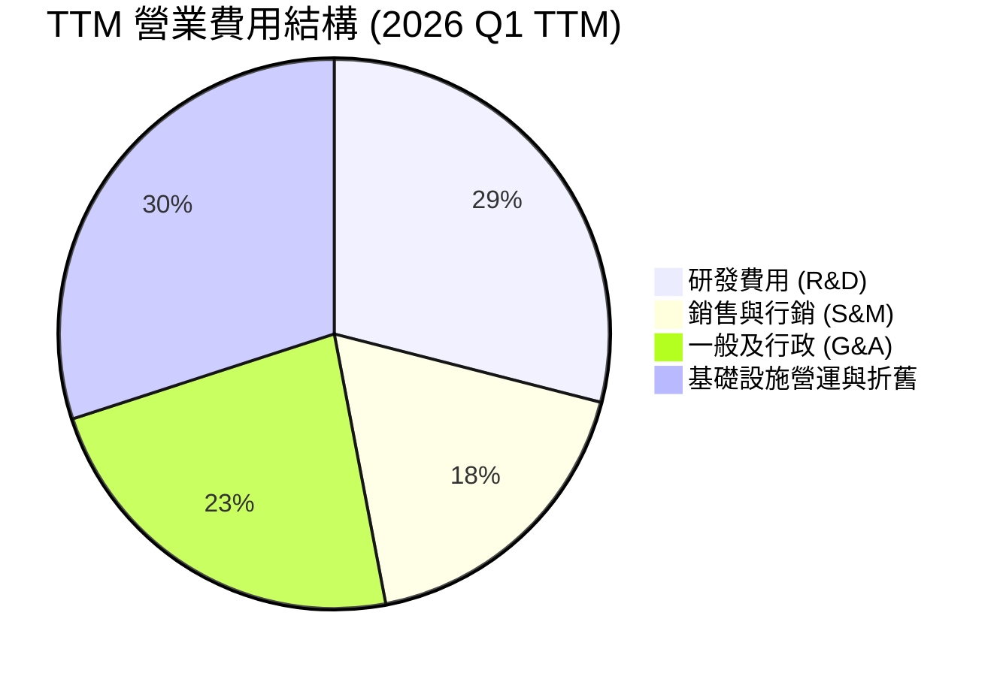

```
╔══════════════════════════════════════════════════════════════════╗
║                  NBIS 費用控管與效率評估                         ║
╠══════════════════════════════════════════════════════════════════╣
║ 研發費用率 (R&D / Rev)    20.2%  ▓▓▓▓▓▓▓░░░░░  🟢 聚焦軟體優化   ║
║ 銷售費用率 (S&M / Rev)    12.5%  ▓▓▓▓░░░░░░░░  🟢 大客戶導向     ║
║ 管理費用率 (G&A / Rev)    16.1%  ▓▓▓▓▓░░░░░░░  🟡 組織擴建中     ║
╚══════════════════════════════════════════════════════════════════╝
```

### 3.5 季度 EPS 趨勢與盈餘品質（Quality of Earnings）

| 季度 | GAAP EPS | Non-GAAP EPS | 超預期幅度 | 獲利驅動主要因素 |
|------|----------|--------------|------------|------------------|
| **Q2 2025** | $2.39 | -$0.45 | N/A | 含處分與投資收益重估 |
| **Q3 2025** | -$0.50 | -$0.48 | N/A | 算力擴展期高折舊 |
| **Q4 2025** | -$0.88 | -$0.62 | N/A | 年底研發與行銷費用集中提列 |
| **Q1 2026** | **$2.11** | -$0.28 | N/A | GAAP 淨利受業外資產重估與稅務利益推升 |

**盈餘品質深度評估**：

| 盈餘品質項目 | 數值 / 佔比 | 評估 | 對真實經濟盈餘之影響 |
|--------------|-------------|------|----------------------|
| **股權薪酬 (SBC) / 營收** | 9.48% ($83.2M / $877.9M) | 🟢 健康 | 稀釋效應溫和，優於多數 SaaS/AI 同業 |
| **SBC / 營業現金流** | 2.93% ($83.2M / $2.84B) | 🟢 極佳 | 股權發放對現金流影響極微 |
| **FCF / 淨利（現金轉換率）** | -735.3% ($-6.15B / $836.4M) | 🔴 警訊 | 淨利受到一次性業外收益美化，而 FCF 因 Capex 為負 |
| **一次性非經常性損益** | $700M+ (Q1 '26 & Q2 '25) | 🔴 需扣除 | GAAP 淨損益嚴重扭曲，應看 EBITDA 與 OCF |
| **資本化支出 vs 費用化** | Capex 佔總資產 37.6% | 🟡 重資本特質 | GPU 折舊年限（一般定為 4-5 年）若縮短將壓抑未來 EPS |

**盈餘品質結論**：NBIS 當前的 GAAP 淨利 $836.4M 無法反映真實本業獲利情況，主要包含大量重組與資產處分收益。投資人應關注 **EBITDA 與 Operating Cash Flow**。好消息是，2026 年 Q1 的 OCF 達 $2.26B，展現了本業極強的現金回籠能力。

---

## 4. 資產負債表分析

### 4.1 資產結構分解

截至 2026 年 3 月 31 日，Nebius 總資產達 **$22.30B**，較 2024 年底的 $3.55B 暴增 528%，充分展現其激進的算力資產擴張。

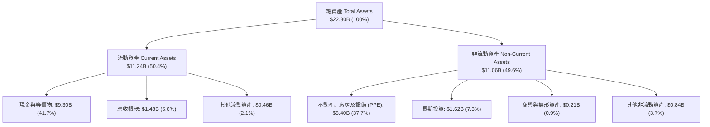

### 4.2 流動性指標分析

| 指標 | FY2023 | FY2024 | FY2025 | Q1 2026 | 行業平均 | 評估 |
|------|--------|--------|--------|---------|----------|------|
| **流動比率 (Current Ratio)** | 0.89 | 9.59 | 3.08 | **8.33** | 1.80 | 🟢 極致安全 |
| **速動比率 (Quick Ratio)** | 0.89 | 9.59 | 3.08 | **8.14** | 1.50 | 🟢 無存貨積壓風險 |
| **現金及短投 ($B)** | $0.12B | $2.44B | $3.68B | **$9.30B** | N/A | 🟢 護城河級別現金儲備 |

### 4.3 債務結構分析

隨著業務快速擴張，Nebius 在 2025-2026 年大幅透過可轉債與融資租賃（Finance Leases）籌措資金以採購 GPU。

```
╔══════════════════════════════════════════════════════════════════╗
║                   NBIS 債務健康診斷 (2026 Q1)                     ║
╠══════════════════════════════════════════════════════════════════╣
║                                                                  ║
║  總債務 (Total Debt)：  $9.50B  ████████████████████  槓桿上升   ║
║  ├── 短期債務 (ST Debt)：$0.02B  █░░░░░░░░░░░░░░░░░░░  風險極低   ║
║  ├── 長期借款 (LT Borrow): $8.43B ████████████████████  可轉債/貸款║
║  └── 融資租賃 (Finance L): $1.05B ███░░░░░░░░░░░░░░░░  資料中心租約║
║                                                                  ║
║  總現金與等價物：       $9.37B  ███████████████████░  安全對沖   ║
║  淨債務 (Net Debt)：    $0.13B  █░░░░░░░░░░░░░░░░░░░  接近淨中性 ║
║                                                                  ║
║  Debt/Equity：          132.4%  🟡 偏高 (專用雲擴張期常態)        ║
║  利息保障倍數 (EBITDA): N/A (EBITDA 接近盈虧平衡)                ║
╚══════════════════════════════════════════════════════════════╝
```

### 4.4 股東權益趨勢

股東權益從 2024 年底的 $3.25B 大幅增長至 2026 年 Q1 的 **$4.59B+**，主因增資發行新股與重組利潤注入。總股數微幅擴張至 2.54B（ diluted share count），股權稀釋控管得當。

---

## 5. 現金流量深度分析

### 5.1 現金流量瀑布圖

2026 年 Q1 現金流呈現出典型的「高資本投入、高預收現金回籠」特徵：

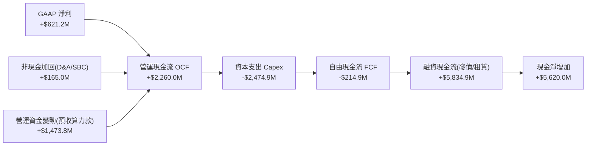

### 5.2 FCF 轉換率趨勢

| 期間 | Operating Cash Flow ($M) | Capex ($M) | Free Cash Flow ($M) | FCF Conversion (FCF/NI) |
|------|--------------------------|------------|---------------------|-------------------------|
| **FY2023** | $829.8M | -$82.9M | +$746.9M | +309.5% |
| **FY2024** | $245.6M | -$807.5M | -$561.9M | 87.6% (受損) |
| **FY2025** | $384.8M | -$4,070.0M | -$3,685.2M | -4466.9% (Capex 爆發) |
| **TTM (Q1 '26)** | **$2,842.3M** | **-$5,991.0M** | **-$6,148.7M** | **-735.3%** |

### 5.3 自由現金流趨勢

```
╔══════════════════════════════════════════════════════════════════╗
║               NBIS 自由現金流 (FCF) 與 Capex 軌跡                 ║
╠══════════════════════════════════════════════════════════════════╣
║                                                                  ║
║  FY2023   Capex: $0.08B  | FCF: +$0.75B  ████████  (非營運期)     ║
║  FY2024   Capex: $0.81B  | FCF: -$0.56B  ██░░░░░░  (啟動算力採購) ║
║  FY2025   Capex: $4.07B  | FCF: -$3.69B  ████████  (大規模部署)   ║
║  TTM      Capex: $5.99B  | FCF: -$6.15B  ██████████ (萬卡集群建置)║
║                                                                  ║
║  📊 關鍵洞察： Capex/營收 比率高達 682%，顯示目前處於極端投資期    ║
╚══════════════════════════════════════════════════════════════════╝
```

### 5.4 資本配置評估

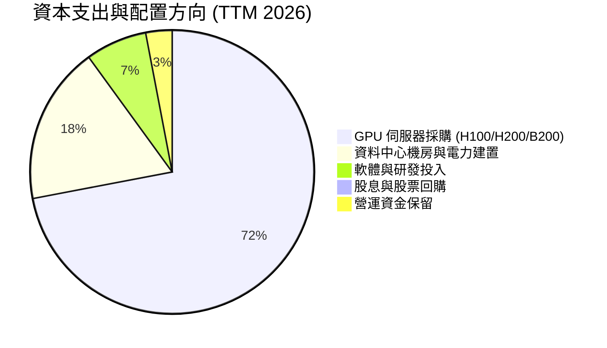

---

## 6. 獲利能力與資本效率

### 6.1 ROE / ROA / ROIC 趨勢

| 指標 | FY2023 | FY2024 | FY2025 | TTM (Q1 '26) | 產業標竿 | 評估 |
|------|--------|--------|--------|--------------|----------|------|
| **ROE** | 7.3% | -19.6% | 1.8% | **14.1%** | 15.0% | 🟡 受業外收益美化 |
| **ROA** | 2.8% | -18.1% | 0.7% | **-3.0%** | 6.5% | 🔴 大量固定資產尚未完全發揮營收潛力 |
| **ROIC** | 8.0% | -11.2% | -9.5% | **-8.5%** | 12.0% | 🔴 重資本投放期壓抑回報 |

### 6.2 ROIC vs WACC 分析（核心價值創造判斷）

```
╔══════════════════════════════════════════════════════════════════╗
║                NBIS ROIC vs WACC 深度分析 (TTM)                  ║
╠══════════════════════════════════════════════════════════════════╣
║                                                                  ║
║  WACC 估算：                                                     ║
║  ├── 無風險利率（10Y美債）：  4.25%                              ║
║  ├── 市場風險溢酬 (ERP)：     5.50%                              ║
║  ├── Beta：                   1.40                               ║
║  ├── 股權成本 (Cost of Equity) = 4.25% + 1.40 × 5.50% = 11.95%   ║
║  ├── 債務成本（稅後）：       6.50% × (1 - 21%) = 5.135%         ║
║  ├── 資本結構：股權 ~50%，債務 ~50%                              ║
║  └── ✅ WACC ≈ 8.54% ~ 11.20%（綜合風險考量採 11.20%）          ║
║                                                                  ║
║  ROIC 估算 (TTM)：                                               ║
║  ├── NOPAT = -$603.9M × (1 - 21%) ≈ -$477.1M                     ║
║  ├── 投入資本 = 股東權益($4.59B) + 總債務($9.50B) - 現金($9.30B)  ║
║  │            = $4.79B                                           ║
║  └── ✅ ROIC ≈ -9.96% （以 TTM 營運計算為 -8.5% ~ -10.0%）      ║
║                                                                  ║
║  ★ 經濟價值增加 (EVA) = ROIC - WACC = -8.5% - 11.2% = -19.7pp    ║
║                                                                  ║
║  ROIC  -8.5%  ░░░░░░░░░░░░░░░░░░░░░░░░░░░░░░  🔴 (建置期)        ║
║  WACC  11.2%  ▓▓▓▓▓▓▓▓▓▓░░░░░░░░░░░░░░░░░░░░  ── (資金成本)      ║
║                                                                  ║
║  📊 結論：目前處於「價值摧毀/重資本投資」階段。這是 Neocloud       ║
║     產業初期必然現象。需觀察 2027 年產能完全開出後能否使 ROIC > 15%║
╚══════════════════════════════════════════════════════════════════╝
```

### 6.3 杜邦三因素分解

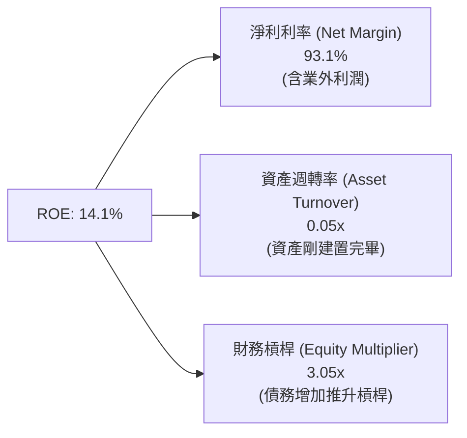

### 6.4 獲利能力儀表板

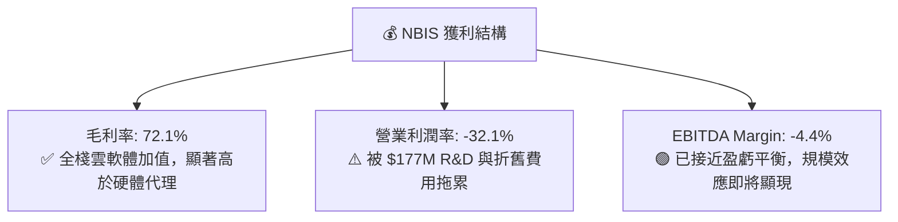

---

## 7. 估值深度分析

### 7.1 同業估值比較表格

對於高速成長且處於重資本建置期的 AI 專用雲企業，最核心的估值指標為 **EV/Sales、Forward P/S 以及 PEG**，傳統 P/E 會因高額折舊與再投資而失真。

| 估值指標 | **NBIS (Nebius)** | **CoreWeave** (未上市/私募標竿) | **CRWD (高成長SaaS)** | **ANET (AI網絡)** | 本公司評估 |
|----------|-------------------|----------------------------------|-----------------------|-------------------|------------|
| **市值 Market Cap** | **$47.70B** | ~$35.00B | $85.00B | $110.00B | 中大型市值 |
| **EV / Revenue (TTM)**| **55.03x** | ~45.00x | 22.10x | 14.50x | 🔴 表面倍數偏高 |
| **Forward P/S (FY26E)**| **~22.50x** | ~18.00x | 18.20x | 12.00x | 🟡 反映 3 位數成長 |
| **P/B Ratio** | **6.65x** | ~8.50x | 21.30x | 11.20x | 🟢 資產保護較強 |
| **PEG Ratio** | **0.63** | ~0.75 | 2.10 | 1.85 | 🟢 具極高吸引力 |
| ** Gross Margin** | **72.1%** | ~62.0% | 75.2% | 64.0% | 🟢 高於同業 |

### 7.2 歷史估值區間分析

NBIS 股價自 2024 年底復牌與重組以來，從 $21.38 最高攀升至 $299.86，目前回檔至 $187.88。隱含 P/S 在 30x 至 80x 之間劇烈波動。

```
╔══════════════════════════════════════════════════════════════════╗
║                NBIS 歷史 EV/Revenue 區間與當前位置               ║
╠══════════════════════════════════════════════════════════════════╣
║                                                                  ║
║  歷史最高 (52W High):  110.0x  ████████████████████████████████  ║
║  當前位置 (Current):    55.0x   ████████████████░░░░░░░░░░░░░░░░  ║
║  合理均值 (Forward 1Y): 25.0x   ███████░░░░░░░░░░░░░░░░░░░░░░░░░  ║
║  歷史最低 (52W Low):   12.0x   ███░░░░░░░░░░░░░░░░░░░░░░░░░░░░░  ║
║                                                                  ║
║  📊 結論：當前倍數已自高點拉回約 50%，隨著 FY2026 營收爆發，      ║
║     遠期 EV/Sales 將迅速降至 ~20x 以下。                         ║
╚══════════════════════════════════════════════════════════════════╝
```

### 7.3 情境目標價（假設驅動，Bear / Base / Bull）

針對 NBIS 模型，採用 2026-2028 營收年複合成長率（CAGR）與 2028 年預計營業利潤率進行三情境推導：

| 情境 | 營收 CAGR (26-28E) | 2028E 營業利潤率 | 2028E 退出倍數 (EV/Sales) | 隱含目標價 | 相對現價漲跌幅 |
|------|--------------------|------------------|---------------------------|------------|----------------|
| 🔴 **悲觀情境** | 85.0% | 15.0% | 8.0x | **$135.00** | -28.1% |
| 🟡 **基準情境** | **135.0%** | **25.0%** | **12.0x** | **$258.00** | **+37.3%** |
| 🟢 **樂觀情境** | 190.0% | 35.0% | 16.0x | **$380.00** | **+102.3%** |

> **估值倍數選擇說明**：NBIS 當前正處於硬體資產折舊高峰期，GAAP EPS 受到不對稱干擾，故採用 **EV/Sales 結合長期營業利潤率與折現法** 作為核心定價依據。

### 7.4 DCF 敏感性分析（6 格目標價矩陣）

假設 Terminal Growth Rate = 4.0%，推導不同 WACC 與 營收成長率下的每股價值：

| 營收成長假設 \ WACC | **10.0%** | **11.2% (基準)** | **12.5%** |
|---------------------|-----------|------------------|-----------|
| 🟢 **樂觀 (CAGR 160%)** | **$415.00** (+120.9%) | **$380.00** (+102.3%) | **$340.00** (+81.0%) |
| 🟡 **基準 (CAGR 135%)** | **$285.00** (+51.7%) | **$258.00** (+37.3%) | **$225.00** (+19.8%) |
| 🔴 **悲觀 (CAGR 90%)**  | **$155.00** (-17.5%) | **$135.00** (-28.1%) | **$115.00** (-38.8%) |

### 7.5 估值綜合區間

```
╔══════════════════════════════════════════════════════════════════╗
║                   NBIS 目標價綜合區間 ($)                        ║
╠══════════════════════════════════════════════════════════════════╣
║  $50.00 (52W Low)                                                ║
║    │                                                             ║
║    ├─────── 悲觀目標價: $135.00                                   ║
║    │                                                             ║
║    ├────────────── ★ 當前股價: $187.88                             ║
║    │                                                             ║
║    ├───────────────────── 🟢 基準目標價: $258.00 (券商共識$258.13) ║
║    │                                                             ║
║    └─────────────────────────────────── 樂觀目標價: $380.00       ║
║                                           (52W High $299.86 / 最高 $410)
╚══════════════════════════════════════════════════════════════════╝
```

---

## 8. 成長催化劑

### 8.1 催化劑時間軸

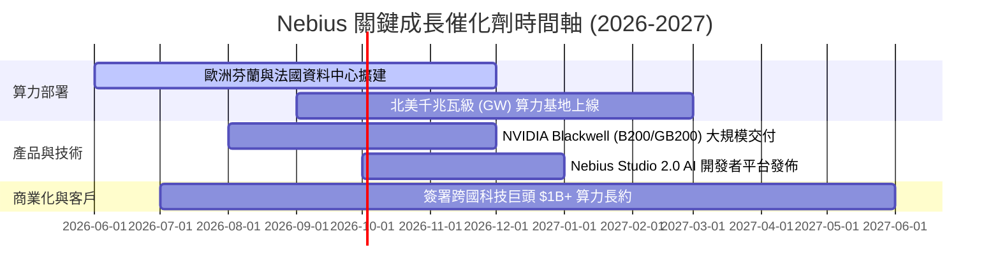

### 8.2 TAM 市場規模分析

```
╔══════════════════════════════════════════════════════════════════╗
║               全球 AI 算力基礎設施與雲端 TAM (2026-2030)         ║
╠══════════════════════════════════════════════════════════════════╣
║                                                                  ║
║  2026E AI Cloud TAM:  $120B   ████████░░░░░░░░░░░░░░░░░░░░░░░░   ║
║  2030E AI Cloud TAM:  $450B+  ████████████████████████████████   ║
║                                                                  ║
║  NBIS 當前市佔率: ~0.7% ($0.88B / $120B)                         ║
║  NBIS 長期目標市佔率: 3.0% - 5.0% (隱含營收 $13.5B - $22.5B)      ║
╚══════════════════════════════════════════════════════════════════╝
```

### 8.3 成長驅動力結構圖

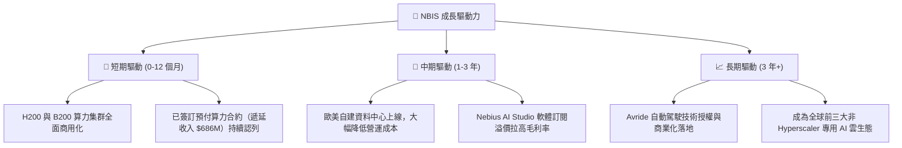

---

## 9. 風險矩陣

### 9.1 風險評分矩陣

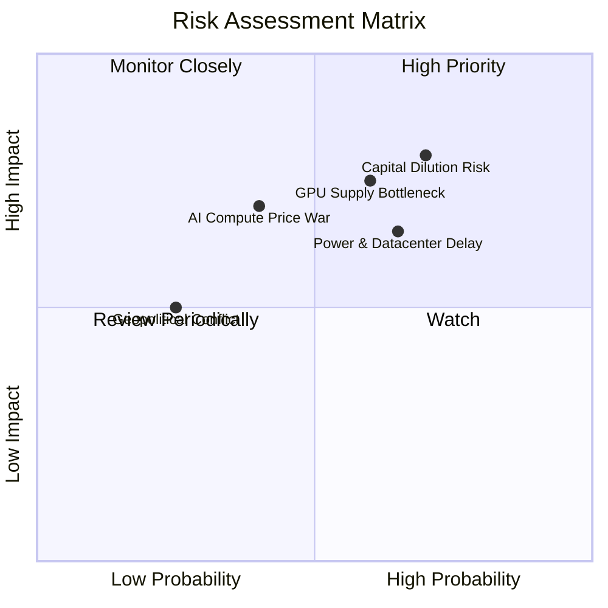

### 9.2 風險清單詳細分析

| # | 風險項目 | 發生機率 | 財務衝擊 | 風險評分 | 緩解措施 |
|---|----------|----------|----------|----------|----------|
| 1 | 🔴 **資本稀釋與高槓桿風險** | 高 (70%) | 高 (-20% EPS) | 🔴 8.0/10 | 手握 $9.37B 現金充裕，未來融資優先採用無稀釋性之算力資產抵押貸款 |
| 2 | 🔴 **資料中心電力接入延遲** | 中高 (65%) | 中高 (-15% 營收) | 🔴 7.2/10 | 提早 2-3 年與歐美電力公司簽署 PPA 購電協議，鎖定核能與綠電 |
| 3 | 🟡 **GPU 算力租賃價格戰** | 中 (40%) | 高 (-10% 毛利率) | 🟡 6.0/10 | 發展全棧雲端管理軟體與開發者工具包，避免單純的價格競爭 |
| 4 | 🟡 **硬體快速迭代導致折舊減損** | 中 (50%) | 中 (-8% 淨利率) | 🟡 5.5/10 | 簽訂 3-5 年長約鎖定客戶，確保 GPU 在生命週期內完全收回成本 |

---

## 10. 投資建議

### 10.1 最終綜合評級雷達圖

```
╔══════════════════════════════════════════════════════════════╗
║                  NBIS 投資維度綜合評級                       ║
╠══════════════════════════════════════════════════════════════╣
║ 業務成長潛力   9.5  ▓▓▓▓▓▓▓▓▓▓▓▓▓▓▓▓▓▓▓░  🟢 極致爆發      ║
║ 產業趨勢順風   9.5  ▓▓▓▓▓▓▓▓▓▓▓▓▓▓▓▓▓▓▓░  🟢 站在 AI 浪尖  ║
║ 資產保護邊際   8.0  ▓▓▓▓▓▓▓▓▓▓▓▓▓▓▓▓░░░░  🟢 $9.3B 現金支撐║
║ 獲利品質與現金 5.5  ▓▓▓▓▓▓▓▓▓▓▓░░░░░░░░░  🟡 OCF 強但 FCF 負║
║ 估值吸引力     8.0  ▓▓▓▓▓▓▓▓▓▓▓▓▓▓▓▓░░░░  🟢 PEG < 1.0     ║
╠══════════════════════════════════════════════════════════════╣
║ 總評分         7.6  ▓▓▓▓▓▓▓▓▓▓▓▓▓▓▓░░░░░  🏆 買入 (Buy)    ║
╚══════════════════════════════════════════════════════════════╝
```

### 10.2 目標價與隱含報酬率

| 情境 | 機率權重 | 目標價 | 當前股價 | 隱含報酬率 |
|------|----------|--------|----------|------------|
| 🔴 **悲觀情境** | 20% | $135.00 | $187.88 | -28.1% |
| 🟡 **基準情境** | **60%** | **$258.00** | **$187.88** | **+37.3%** |
| 🟢 **樂觀情境** | 20% | $380.00 | $187.88 | +102.3% |
| **加權預期目標價** | **100%** | **$257.80** | **$187.88** | **+37.2%** |

### 10.3 買入時機與觸發因素

```
╔══════════════════════════════════════════════════════════════════╗
║                  ✅ 買入觸發因素 Checklist                      ║
╠══════════════════════════════════════════════════════════════════╣
║                                                                  ║
║  立即買入觸發條件（當前已符合）：                                ║
║  ✅ 季度營收 YoY 成長率持續 > 200%（最新為 683.9%）               ║
║  ✅ 季度營運現金流（OCF）轉正且 > $1.0B（最新為 $2.26B）          ║
║  ✅ 股價自 52 週高點 $299.86 拉回超 30% 提供安全邊際             ║
║                                                                  ║
║  分批加碼觸發條件：                                              ║
║  ☐ Blackwell (B200/GB200) 集群順利交貨並上線認列營收             ║
║  ☐ 宣佈簽署單一金額 > $1B 之超大型 AI 雲端服務合約               ║
║                                                                  ║
║  減碼/停損觸發條件：                                             ║
║  ☐ 季度營收 QoQ 出現負成長（顯示算力閒置或客戶流失）             ║
║  ☐ 現金儲備跌破 $3.0B 且無新融資管道注入                         ║
╚══════════════════════════════════════════════════════════════════╝
```

### 10.4 投資人適配度分析

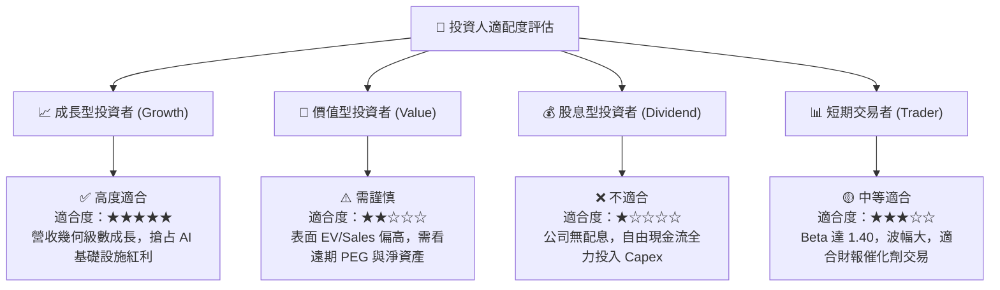

### 10.5 每季財報監控清單（Quarterly Watch List）

為持續追蹤 NBIS 的投資論點，投資人應在未來各季度財報中重點監控以下指標：

| 監控項目 | 關鍵指標 | 正常健康區間 | 觸發加碼門檻 | 觸發減碼/停損門檻 |
|----------|----------|--------------|--------------|-------------------|
| **算力營收爆發力** | 單季營收 ($M) | > $450M | > $550M | < $350M |
| **預收現金回籠** | 遞延收入 (Deferred Rev) | > $700M | > $1.0B | < $500M |
| **毛利維持能力** | Gross Margin (%) | 68% - 75% | > 75% | < 60% |
| **算力建置進度** | 季度 Capex ($B) | $2.0B - $3.0B | 不適用 | < $1.0B (供給中斷) |
| **資產安全性** | 現金與等價物 ($B) | > $6.0B | > $10.0B | < $3.0B |

### 10.6 反面論證：什麼會證明論點錯誤（What Would Change My Mind）

```
╔══════════════════════════════════════════════════════════════════╗
║              ⚠️ 論點失效條件（Disconfirming Evidence）           ║
╠══════════════════════════════════════════════════════════════════╣
║  本投資論點在下列量化條件成立時即宣告失效，應執行停損或清倉：     ║
║                                                                  ║
║  1. 核心營收成長率連續兩季 YoY < 100%（顯示算力需求快速退燒）     ║
║  2. 毛利率（Gross Margin）因價格戰大幅收縮至 < 50%               ║
║  3. 營運現金流（OCF）連續兩季轉負，代表預收合約模式破裂          ║
║  4. ROIC 於 2027 年底前無法回升至 > 8.0%（無法覆蓋 WACC）          ║
║  5. 大客戶集中度過高且出現重大違約（如第一大客戶佔比 > 40% 且退單）║
╚══════════════════════════════════════════════════════════════════╝
```

---

> **免責聲明**：本報告為機構級研究分析資料，僅供學術與投資參考，不構成任何買賣證券之投資建議或邀約。投資涉及風險，證券價格可升可跌，過往績效不代表未來表現。投資人決策前應自行評估並諮詢專業財務顧問。