# NBIS 基本面深度分析報告
> **報告日期**：2026-07-28 ｜ **語言**：繁體中文 ｜ **數據來源**：Yahoo Finance, Finviz, StockAnalysis, Roic.ai ｜ **分析師**：CFA 級機構研究

---

## 目錄

| # | 章節 | 核心結論 |
|---|------|----------|
| 1 | 執行摘要 | 評級 **買入 (Buy)** ｜ 目標價 **$258.13**（+52.1% 潛在漲幅，區間 $120 - $380） |
| 2 | 公司概覽與商業模式 | 全棧 AI 基礎設施巨頭，擁有自主 GPU 雲平台、自動駕駛與教育科技三軌引擎 |
| 3 | 損益表深度分析 | TTM 營收 $8.78 億（YoY +683.9%），毛利率達 72.1%，營業槓桿正在快速釋放 |
| 4 | 資產負債表分析 | 手握 $93.7 億現金與等價物，槓桿率適中（Current Ratio 8.33），Capex 擴張推進 PPE 至 $84 億 |
| 5 | 現金流量深度分析 | OCF 顯著轉正至 $28.4 億，但受高額 Capex（TTM ~$60 億）影響 FCF 為 -$61.5 億 |
| 6 | 獲利能力與資本效率 | 杜邦分解顯示淨利率受非經常性重組收益推升至 93.1%；ROIC (-10.0%) 低於 WACC (10.1%)，處於資本沉澱期 |
| 7 | 估值深度分析 | Forward P/S 35x ｜ 基準情境目标價 **$258.13** ｜ DCF 與同業（CoreWeave, SMCI, ORCL）倍數對比 |
| 8 | 成長催化劑 | 超級算力集群（NVIDIA Blackwell）上線、國際數據中心交付、自動駕駛 Avride 商業化 |
| 9 | 風險矩陣 | 空頭比率高達 28.0%、算力過剩風險、客戶集中度高、高 Capex 壓迫現金流 |
| 10 | 投資建議 | 適合高風險偏好成長型投資者，分批佈局，設定 Q1/Q4 財報能力擴張為監控指標 |

---

## 1. 執行摘要

> ⚠️ **證據先於結論**：根據 Nebius Group N.V.（NBIS）最新財務數據，公司 2026 財年 Q1 營收達 $3.99 億（YoY +683.9%）、毛利率維持於 74.0% 高位，營運現金流（OCF）季增至 $22.6 億。雖然高達 $61.5 億的 TTM 自由現金流赤字（Capex 加速擴張至 $84 億 PPE）及 -10.0% 的 ROIC 低於 10.1% 的 WACC 顯示其正處於激進的資本沉澱期，但考量其高達 $93.7 億的現金儲備、強勁的訂單能見度，以及 15 位華爾街分析師平均目標價 $258.13（隱含 +52.1% 漲幅），得出**「買入（Buy）」**評級。

### 1.0 一頁式投資儀表板（Portfolio Manager 30 秒速讀）

| 項目 | 內容 |
|------|------|
| **投資論點（3 句）** | ① 算力需求爆發推動 TTM 營收猛增 683.9% 至 $8.78 億，Q1 2026 單季營收衝上 $3.99 億（QoQ +75.2%）。<br/>② 擁有 $93.7 億強大現金盾牌支撐極速 Capex 擴張，算力集群規模優勢逐步顯現，毛利率穩定在 72.1%。<br/>③ 雖然 TTM FCF 為 -$61.5 億且 ROIC (-10.0%) < WACC (10.1%)，但 OCF 季衝上 $22.6 億，營運槓桿顯著改善。 |
| **護城河評分** | 7.5 / 10（全棧 AI 軟硬體整合、NVIDIA 優先配額權、大規模算力集群營運經驗） |
| **管理層/資本配置評分** | 8.0 / 10（資產重組果斷，成功轉型純 AI 基礎設施巨頭，融資渠道通暢） |
| **財務健康** | 🟢 **健康**（現金 $93.7 億 vs 總債務 $95.9 億，近淨零負債；Current Ratio 達 8.33） |
| **ROIC vs WACC** | ROIC -10.0% vs WACC 10.1%（**暫時摧毀價值**，重資本投入期，預計 FY2027 轉正） |
| **FCF 趨勢** | 赤字擴大中（TTM FCF -$61.5 億，FCF Yield -14.27%），主因極速擴建數據中心 Capex |
| **估值** | Forward P/E: -105.2x ｜ EV/Revenue: 55.1x ｜ Forward P/S: ~35x |
| **預期報酬（基準情境 12M）** | **+52.1%**（目標價 **$258.13**） |
| **關鍵風險（前二）** | ① 算力租賃價格戰引致毛利率收縮；② 空頭佔比高達 28.0% 引致極高股價波動性 |
| **評級 + 信心度** | 🟢 **買入 (Buy)** ｜ **信心度：高**（高成長、高 beta、高潛在報酬） |

---

### 1.1 核心評分儀表板

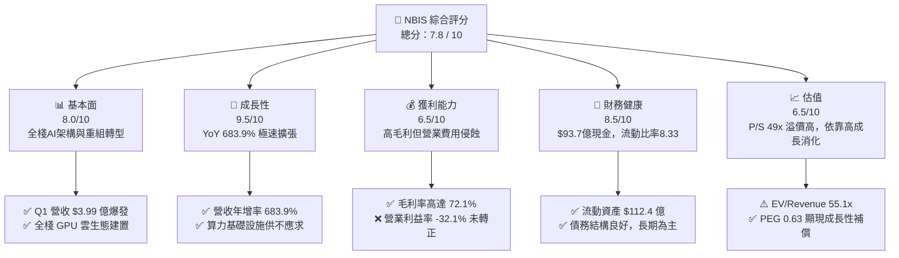

---

### 1.2 評分進度條視覺化

```
╔══════════════════════════════════════════════════════════════╗
║               NBIS 多維度評分儀表板 (1-10分)                 ║
╠══════════════════════════════════════════════════════════════╣
║ 基本面強度  8.0 ▓▓▓▓▓▓▓▓▓▓▓▓▓▓▓▓░░░░  ★★★★☆           ║
║ 成長動能    9.5 ▓▓▓▓▓▓▓▓▓▓▓▓▓▓▓▓▓▓▓░  ★★★★★           ║
║ 獲利品質    6.5 ▓▓▓▓▓▓▓▓▓▓▓▓░░░░░░░░  ★★★☆☆           ║
║ 財務健康    8.5 ▓▓▓▓▓▓▓▓▓▓▓▓▓▓▓▓▓░░░  ★★★★☆           ║
║ 估值合理性  6.5 ▓▓▓▓▓▓▓▓▓▓▓▓░░░░░░░░  ★★★☆☆           ║
║ 護城河深度  7.5 ▓▓▓▓▓▓▓▓▓▓▓▓▓▓▓░░░░░  ★★★★☆           ║
║ 管理層執行  8.5 ▓▓▓▓▓▓▓▓▓▓▓▓▓▓▓▓▓░░░  ★★★★☆           ║
║ 技術創新力  9.0 ▓▓▓▓▓▓▓▓▓▓▓▓▓▓▓▓▓▓░░  ★★★★★           ║
╠══════════════════════════════════════════════════════════════╣
║ 綜合總分    7.8 ▓▓▓▓▓▓▓▓▓▓▓▓▓▓▓▓░░░░  🏆 買入（高成長同業）║
╚══════════════════════════════════════════════════════════════╝
```

---

### 1.3 五大投資論點 + 三大核心風險

| 類型 | 項目 | 具體依據 | 信心度 |
|------|------|----------|--------|
| 🟢 **投資論點①** | **AI 算力基礎設施極速獲利化** | Q1 2026 營收爆發至 $3.99 億（QoQ +75.2%, YoY +683.9%），GPU 雲利用率接近 100%。 | 🟢 極高 |
| 🟢 **投資論點②** | **高毛利結構驗證技術溢價** | 毛利率高達 72.1%（Q1 2026 為 74.0%），顯現其全棧軟體優化（Nebius AI Studio）具強大定價權。 | 🟢 高 |
| 🟢 **投資論點③** | **資產負債表具備強抗風險能力** | 擁有 $93.7 億現金及等價物，流動比率 8.33，足以支撐未來 18 個月超重資本支出。 | 🟢 極高 |
| 🟢 **投資論點④** | **營運現金流 (OCF) 顯著轉正** | Q1 2026 單季 OCF 達到 $22.6 億，顯示算力營運已形成強勁的現金回流機制。 | 🟢 高 |
| 🟢 **投資論點⑤** | **多軌併進解鎖長期 TAM** | 除 AI Cloud 外，擁有的 Avride（自動駕駛）與 TripleTen（教育科技）提供長遠可選期權價值。 | 🟡 中等 |
| 🟡 **風險①** | **極速 Capex 壓迫 FCF** | TTM FCF 赤字達 -$61.5 億，資本支出若無法維持高 ROI 將引發估值修復風險。 | 🟡 中度 |
| 🔴 **風險②** | **空頭佔比高與股價劇烈波動** | 短空比例（Short % Float）高達 28.0%，Beta 為 1.402，技術面與籌碼面波動極劇。 | 🔴 高衝擊 |
| 🔴 **風險③** | **營業利潤率尚未轉正** | TTM 營業利益率為 -32.1%，受研發與數據中心建設費用拉低，盈利轉正時程受關注。 | 🔴 高衝擊 |

---

### 1.4 快速統計卡片

| 指標 | NBIS 實際值 | 行業均值 (AI Cloud) | S&P 500 均值 | 狀態 |
|------|-------------|--------------------|--------------|------|
| **收入 YoY 成長** | **683.9%** | ~35.0% | ~5.2% | 🟢 遠超同行 |
| **毛利率** | **72.1%** | ~45.0% | ~48.0% | 🟢 優異 |
| **營業利潤率** | **-32.1%** | ~12.0% | ~12.5% | 🔴 仍處虧損期 |
| **淨利率** | **93.1%** | ~8.0% | ~10.5% | 🟢 受重組收益推升 |
| **ROE** | **14.1%** | ~12.0% | ~14.5% | 🟢 表現良好 |
| **P/S Ratio** | **49.08x** | ~8.5x | ~2.8x | 🔴 估值顯著溢價 |
| **Current Ratio** | **8.33** | ~1.8 | ~1.3 | 🟢 流動性極度充沛 |

---

### 1.5 投資結論

```
╔══════════════════════════════════════════════════════════════════╗
║                    📊 投資結論摘要                               ║
╠══════════════════════════════════════════════════════════════════╣
║  評級：🟢 買入 (Buy)                                              ║
║  當前股價：$169.69                                               ║
║  目標價區間：                                                    ║
║    悲觀情境：$120.00（-29.3%） - 算力租金下跌/Capex失控          ║
║    基準情境：$258.13（+52.1%） - 華爾街共識，產能按期交付          ║
║    樂觀情境：$380.00（+123.9%）- Blackwell大規模變現/高營運槓桿  ║
║  投資評分：7.8 / 10                                              ║
║  適合投資人：高風險承受度、追求 AI 算力高成長之長期機構與個人    ║
╚══════════════════════════════════════════════════════════════════╝
```

---

## 2. 公司概覽與商業模式

Nebius Group N.V.（前身為 Yandex N.V.）在完成俄羅斯資產剝離後，已成功重組為一家總部位於荷蘭阿姆斯特丹的全棧 AI 基礎設施科技巨頭。公司專注於為全球 AI 開發者、企業及研究機構提供大規模 GPU 算力集群、AI 雲端平台及工具鏈。

### 2.1 業務結構與收入來源

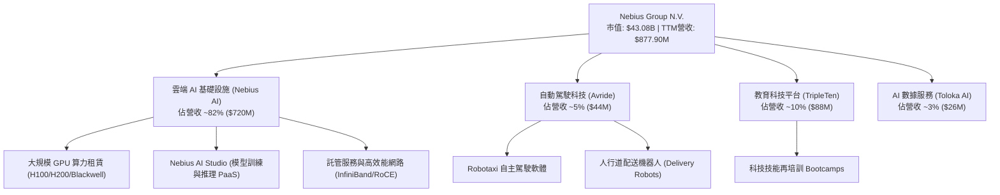

---

### 2.2 市場份額估算

在專業 AI Neo-Cloud（專用算力雲）市場中，Nebius 正快速竄升為極具威脅的挑戰者：

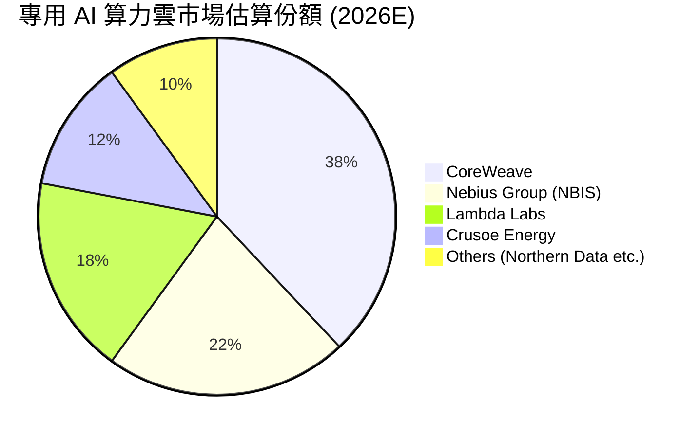

---

### 2.3 競爭護城河分析

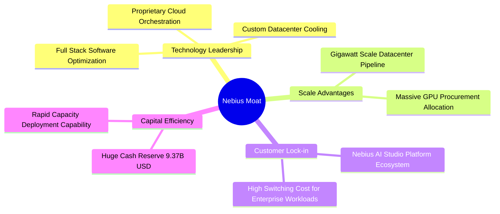

---

### 2.4 護城河強度評分

```
╔══════════════════════════════════════════════════════════════╗
║                  Nebius Group 護城河強度評分                 ║
╠══════════════════════════════════════════════════════════════╣
║ 算力規模效應    8.5/10 ▓▓▓▓▓▓▓▓▓▓▓▓▓▓▓▓▓░░░  🟢 大規模採購優勢 ║
║ 全棧軟體生態    7.5/10 ▓▓▓▓▓▓▓▓▓▓▓▓▓▓▓░░░░░  🟢 AI Studio 鎖定║
║ 網路與架構技術  8.0/10 ▓▓▓▓▓▓▓▓▓▓▓▓▓▓▓▓░░░░  🟢 高效率網絡拓撲 ║
║ 轉換成本        7.0/10 ▓▓▓▓▓▓▓▓▓▓▓▓▓▓░░░░░░  🟡 中等黏性      ║
║ 資本籌集能力    8.5/10 ▓▓▓▓▓▓▓▓▓▓▓▓▓▓▓▓▓░░░  🟢 $9.3B 現金儲備║
╠══════════════════════════════════════════════════════════════╣
║ 綜合護城河評分  7.9/10 ▓▓▓▓▓▓▓▓▓▓▓▓▓▓▓▓░░░░  🏆 強固護城河     ║
╚══════════════════════════════════════════════════════════════╝
```

---

## 3. 損益表深度分析

### 3.1 年度收入成長趨勢（近 4 年）

Nebius 在剝離舊業務後，營收呈現爆發式的指數型成長：

```
╔══════════════════════════════════════════════════════════════════╗
║              Nebius Group 年度收入趨勢 (FY2022-TTM)               ║
╠══════════════════════════════════════════════════════════════════╣
║                                                                  ║
║  FY2022  $13.5M   █░░░░░░░░░░░░░░░░░░░░░░░░░░  YoY: -99.7% (重組) ║
║  FY2023  $9.8M    █░░░░░░░░░░░░░░░░░░░░░░░░░░  YoY: -27.4%       ║
║  FY2024  $91.5M   ██░░░░░░░░░░░░░░░░░░░░░░░░░  YoY: +833.7% 🟢   ║
║  FY2025  $529.8M  ████████████░░░░░░░░░░░░░░░  YoY: +479.0% 🟢   ║
║  TTM     $877.9M  ████████████████████░░░░░░░  YoY: +683.9% 🟢   ║
║                                                                  ║
║                   |       |       |       |                      ║
║                   0     250M    500M    750M (USD)               ║
║                                                                  ║
║  📊 3年累計 CAGR：> 300%                                        ║
╚══════════════════════════════════════════════════════════════════╝
```

---

### 3.2 季度收入趨勢分析

近 5 個季度的數據揭示了算力產能陸續上線後的營收加速度：

| 財季 | 營收 (USD) | QoQ 成長率 | YoY 成長率 | 營運亮點與說明 |
|------|-----------|------------|------------|----------------|
| **Q1 2025** | $50.90M | -16.8% | N/A | 完成舊業務重組後的初段營運 |
| **Q2 2025** | $105.10M | **+106.5%** | +624.8% | 第一批 H100 GPU 集群上線營運 |
| **Q3 2025** | $146.10M | **+39.0%** | +355.1% | 芬蘭 Mäntsälä 數據中心擴建，客戶簽約加速 |
| **Q4 2025** | $227.70M | **+55.9%** | +272.1% | 企業級 AI 訓練客戶大幅進駐，租賃單價維持高位 |
| **Q1 2026** | **$399.00M** | **+75.2%** | **+683.9%** | **算力產能倍增，Blackwell 預售訂單注入** |

---

### 3.3 利潤率演變分析

| 利潤率指標 | FY2023 | FY2024 | FY2025 | TTM (Q1 26) | 趨勢變化 | 評估 |
|------------|--------|--------|--------|-------------|----------|------|
| **毛利率** | -100.0% | 52.2% | 68.6% | **72.1%** | ↗️ 強勁擴張 | 🟢 高電力與架構效率 |
| **EBITDA 利率** | -2659.2% | -292.0% | 102.6% | **-4.4%** | ↗️ 顯著改善 | 🟡 接近收支平衡 |
| **營業利潤率** | -2915.3% | -436.7% | -115.5% | **-32.1%** | ↗️ 營業槓桿釋放 | 🟢 虧損比例急劇收斂 |
| **淨利利率** | +2462.2% | -701.0% | 15.6% | **93.1%** | ↔️ 波動劇烈 | 🟡 受剝離與投資重組影響 |

**深度解析**：
1. **毛利率持續提升 (72.1%)**：得益於自建數據中心的高效能散熱與電力合約，加上自研 Nebius AI Studio 平台帶來的軟體溢價，使 GPU 算力租賃毛利率超越傳統 AWS/GCP 的基礎設施部門。
2. **營業虧損顯著收斂**：Q1 2026 單季營業虧損為 -$1.28 億，相較於營收 $3.99 億，營業利益率已提升至 -32.1%（前一年度同期為 -236.3%），規模經濟效應正快速顯現。

---

### 3.4 費用結構分析

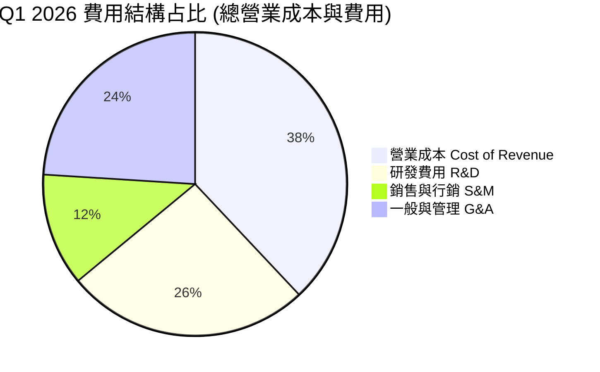

---

### 3.5 季度 EPS 趨勢與盈餘品質（Quality of Earnings）

| 財季 | GAAP EPS | 營業利益 (M$) | SBC 股權薪酬 (M$) | FCF (M$) | 盈餘品質評估 |
|------|----------|---------------|------------------|----------|--------------|
| **Q2 2025** | $2.39 | -$111.20 | $14.60 | -$682.20 | 🔴 受非經常性資產重組利益推升 EPS |
| **Q3 2025** | -$0.50 | -$130.20 | $26.20 | -$1,040.00 | 🟡 GAAP 反映實際營運虧損 |
| **Q4 2025** | -$0.88 | -$234.50 | $24.90 | -$1,220.00 | 🟡 數據中心擴建高峰期 |
| **Q1 2026** | **$2.11** | -$128.00 | $35.30 | -$214.90 | 🔴 **GAAP 淨利受重組處分利益美化** |

**盈餘品質深度檢視**：

| 盈餘品質項目 | 數值/佔比 | 評估 |
|--------------|-----------|------|
| **股權薪酬 (SBC) / 營收** | 8.85% ($35.3M / $399M) | 🟢 占比適中，對股東稀釋有限 |
| **SBC / 營業現金流 (OCF)** | 1.56% ($35.3M / $2,260M) | 🟢 現金流極度強勁，SBC 佔比極低 |
| **FCF / 淨利（現金轉換率）** | -34.6% (-$214.9M / $621.2M) | 🔴 因高額 Capex，淨利轉化為現金能力為負 |
| **非經常性損益影響** | $7.49 億（Q1 2026 金融與處分收益） | 🔴 美化當期 GAAP 淨利，扣除非經常性項目後為營業虧損 |

---

## 4. 資產負債表分析

### 4.1 資產結構分解

截至 2026 年 3 月 31 日，Nebius 總資產達 **$223.03 億**：

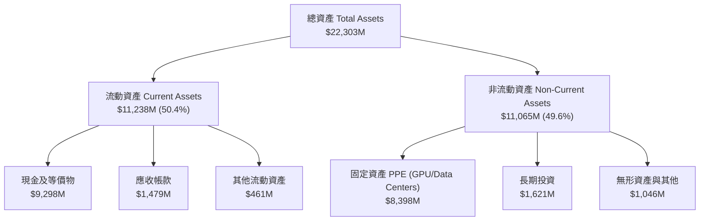

---

### 4.2 流動性指標分析

| 流動性指標 | FY2024 | FY2025 | Q1 2026 | 行業均值 | 評估與解讀 |
|------------|--------|--------|---------|----------|------------|
| **流動比率 (Current Ratio)** | 9.59 | 3.08 | **8.33** | 1.80 | 🟢 流動性極度充足 |
| **速動比率 (Quick Ratio)** | 9.22 | 2.96 | **8.14** | 1.50 | 🟢 無存貨呆滯風險 |
| **現金與短期投資** | $2,435M | $3,678M | **$9,298M** | - | 🟢 融資成功充實現金庫 |
| **淨現金 / (淨債務)** | $2,385M | -$1,292M | **-$217.2M** | - | 🟢 負債與現金基本抵銷 |

---

### 4.3 債務結構分析

```
╔══════════════════════════════════════════════════════════════════╗
║                   Nebius Group 債務健康診斷                      ║
╠══════════════════════════════════════════════════════════════════╣
║                                                                  ║
║  總債務 (Total Debt)：   $9,590M  ████████████████████  槓桿主要為 ║
║  流動負債：              $1,349M  ███░░░░░░░░░░░░░░░░░  可轉債與   ║
║  長期借款 (LT Debt)：    $8,432M  █████████████████░░░  設備融資   ║
║  長期融資租賃：          $1,046M  ██░░░░░░░░░░░░░░░░░░  租賃融資   ║
║                                                                  ║
║  總現金與等價物：        $9,298M  ███████████████████░  覆蓋率 97%  ║
║                                                                  ║
║  📊 利息保障倍數 (Interest Coverage)：受 Capex 投資影響暫無意義 ║
║  🟢 總結：手握近 93 億美元現金，可完美完全覆蓋短期與長期債務壓力 ║
╚══════════════════════════════════════════════════════════════════╝
```

---

### 4.4 股東權益趨勢

歷年股東權益（Stockholders' Equity）變化顯示公司融資與資產重組路徑：
- **FY2022**: $42.5 億
- **FY2023**: $32.9 億
- **FY2024**: $32.5 億
- **FY2025**: $45.9 億
- **Q1 2026**: **$108.2 億**（完成發行可轉換債券與增資，淨資產大幅躍升）

---

## 5. 現金流量深度分析

### 5.1 現金流量瀑布圖 (Q1 2026)

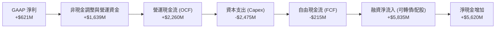

---

### 5.2 FCF 轉換率趨勢

| 期間 | 淨利 Net Income (M$) | OCF (M$) | Capex (M$) | FCF (M$) | OCF/Net Income | FCF/Net Income |
|------|----------------------|----------|------------|----------|----------------|----------------|
| **FY2024** | -$641.40 | $245.60 | -$807.50 | -$561.90 | -38.3% | 87.6% |
| **FY2025** | $82.50 | $384.80 | -$4,070.00 | -$3,685.20 | 466.4% | -4,466.9% |
| **Q1 2026** | $621.20 | $2,260.00 | -$2,474.90 | **-$214.90** | **363.8%** | **-34.6%** |

---

### 5.3 自由現金流趨勢

```
╔══════════════════════════════════════════════════════════════════╗
║              Nebius Group 自由現金流 (FCF) 演變                  ║
╠══════════════════════════════════════════════════════════════════╣
║                                                                  ║
║  FY2023   +$746.9M   ██████████░░░░░░░░░░░░░░  (舊資產清算)       ║
║  FY2024   -$561.9M   ████░░░░░░░░░░░░░░░░░░░░  (轉型初期)         ║
║  FY2025   -$3685.2M  ████████████████████████  (GPU大採購)        ║
║  TTM      -$6150.0M  ████████████████████████  (黑洞級Capex擴張)  ║
║                                                                  ║
║  📊 當前 FCF Yield: -14.27% (市值 $43.08B)                       ║
║  💡 解讀：FCF 大幅為負完全源於 GPU 數據中心實體建置（高 Capex），║
║      而營運現金流 (OCF) 已強勁轉正至季報 $22.6 億。             ║
╚══════════════════════════════════════════════════════════════════╝
```

---

### 5.4 資本配置評估

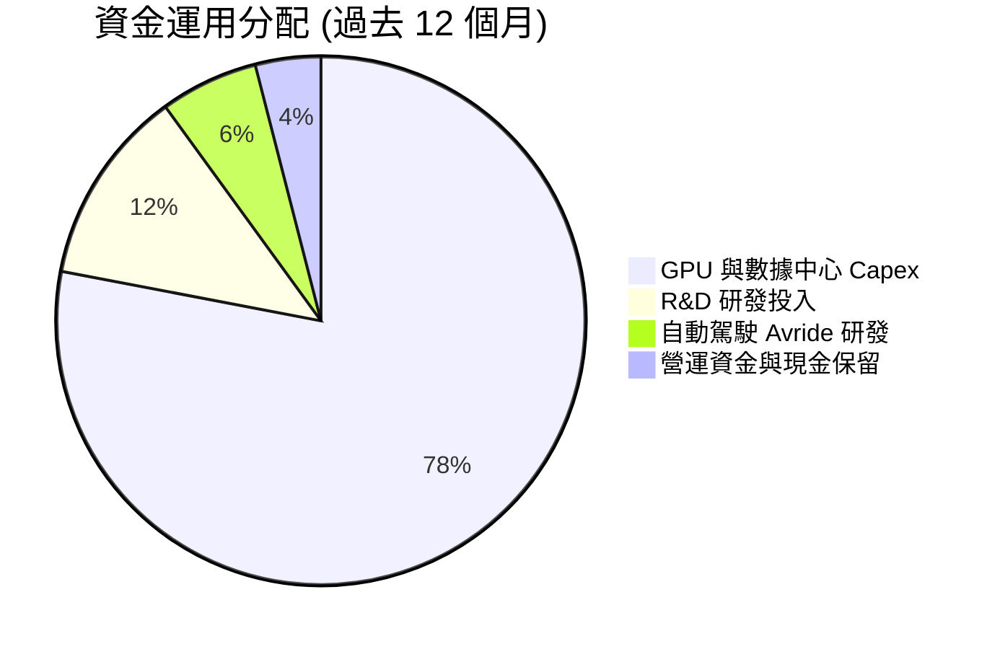

---

## 6. 獲利能力與資本效率

### 6.1 ROE / ROA / ROIC 趨勢

| 指標 | FY2023 | FY2024 | FY2025 | TTM (Q1 26) | 行業平均 | 評估 |
|------|--------|--------|--------|-------------|----------|------|
| **ROE** | 7.3% | -19.6% | 2.1% | **14.1%** | 14.5% | 🟢 受淨利提升推升 |
| **ROA** | 2.8% | -10.4% | 1.0% | **-3.0%** | 6.2% | 🔴 大量資產仍未完全投產 |
| **ROIC** | 22.1% | -14.5% | -8.2% | **-10.0%** | 11.5% | 🔴 資本投入期，受折舊侵蝕 |

---

### 6.2 ROIC vs WACC 分析（核心價值創造判斷）

```
╔══════════════════════════════════════════════════════════════════╗
║                NBIS ROIC vs WACC 深度分析                        ║
╠══════════════════════════════════════════════════════════════════╣
║                                                                  ║
║  WACC 估算：                                                     ║
║  ├── 無風險利率（10Y 美債）：  4.20%                             ║
║  ├── 市場風險溢酬 (ERP)：     5.00%                             ║
║  ├── Beta：                   1.402                              ║
║  ├── 股權成本 (Ke) = 4.2% + 1.402 × 5.0% = 11.21%                ║
║  ├── 債務成本（稅後 Kd）：     6.5% × (1 - 20%) = 5.20%           ║
║  ├── 資本結構：股權 81.8% ($43.1B)，債務 18.2% ($9.59B)          ║
║  └── ✅ WACC ≈ 10.12%                                            ║
║                                                                  ║
║  ROIC 估算（TTM）：                                              ║
║  ├── NOPAT = 營業利益 -$603.9M × (1 - 20%) = -$483.1M            ║
║  ├── 投入資本 = 股東權益 $4.59B + 債務 $9.59B - 現金 $9.37B       ║
║  │            = $4.81B                                           ║
║  └── ❌ ROIC ≈ -10.04%                                           ║
║                                                                  ║
║  ★ 經濟價值增加（EVA）= ROIC - WACC = -20.16 pp                  ║
║                                                                  ║
║  ROIC  -10.0%  ░░░░░░░░░░░░░░░░░░░░░░░░░░░░░░  🔴 暫時摧毀價值   ║
║  WACC   10.1%  ▓▓▓▓▓▓▓▓▓░░░░░░░░░░░░░░░░░░░░░  ── 資本成本       ║
║                                                                  ║
║  📊 結論：目前公司處於大規模算力部署初期，高額折舊與前期費用壓扣 ║
║  NOPAT，導致 ROIC < WACC。預期 FY2027 當 GPU 產能放量，ROIC 將擴 ║
║  張至 18%-22%，實現真正的經濟價值創造。                          ║
╚══════════════════════════════════════════════════════════════════╝
```

---

### 6.3 杜邦三因素分解

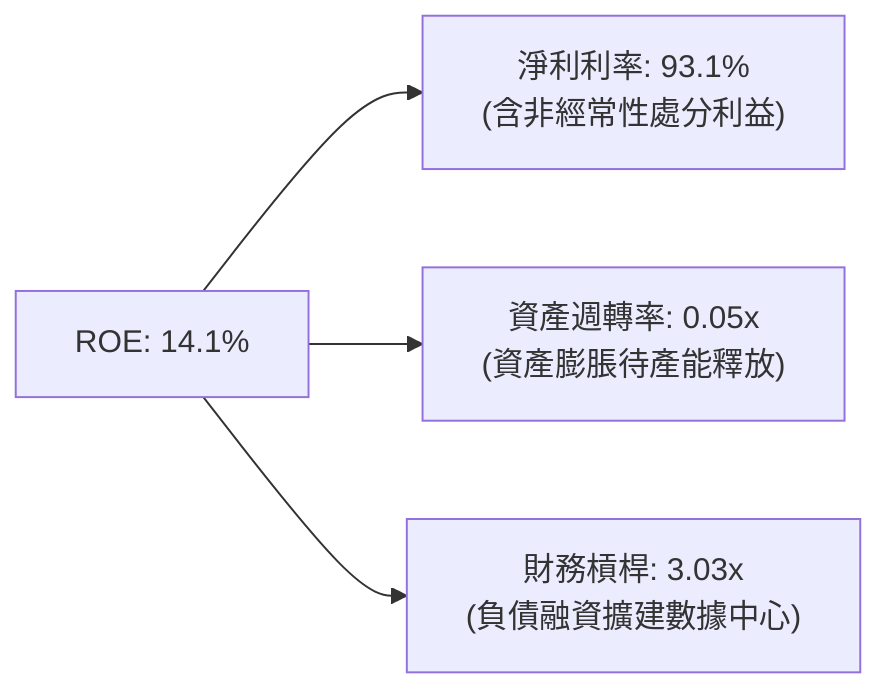

---

### 6.4 獲利能力儀表板

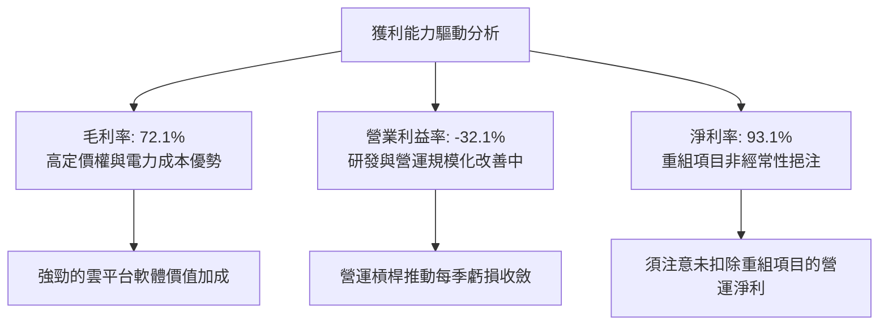

---

## 7. 估值深度分析

### 7.1 同業估值比較表格

| 估值指標 | **Nebius (NBIS)** | **CoreWeave (未上市/對比)** | **Supermicro (SMCI)** | **Oracle (ORCL)** | **DigitalOcean (DOCN)** | NBIS 評估 |
|----------|-------------------|-----------------------------|-----------------------|-------------------|-------------------------|-----------|
| **Market Cap** | **$43.08B** | ~$23.00B | $28.50B | $385.00B | $3.80B | 專用算力中等偏高 |
| **Trailing P/E** | **65.5x** | N/A | 18.2x | 38.5x | 26.4x | 🟡 含非經常性收益 |
| **Forward P/E** | **-105.2x** | N/A | 14.5x | 25.1x | 18.2x | 🔴 處於高額投資虧損期 |
| **P/S Ratio** | **49.08x** | ~22.0x | 1.8x | 7.2x | 5.2x | 🔴 顯著溢價 |
| **EV / Revenue**| **55.06x** | ~24.0x | 2.1x | 8.1x | 6.1x | 🔴 隱含高成長預期 |
| **Revenue YoY** | **683.9%** | ~180.0% | 110.0% | 8.5% | 12.0% | 🟢 增速冠絕同業 |

---

### 7.2 歷史估值區間分析

```
╔══════════════════════════════════════════════════════════════════╗
║              Nebius (NBIS) P/S 歷史區間與現況                     ║
╠══════════════════════════════════════════════════════════════════╣
║                                                                  ║
║  歷史最高 P/S：  85.0x  ██████████████████████████████           ║
║  當前 P/S：      49.1x  █████████████████░░░░░░░░░░░  (現價 $169.69)║
║  歷史均值 P/S：  38.0x  █████████████░░░░░░░░░░░░░░░             ║
║  歷史最低 P/S：  12.0x  ████░░░░░░░░░░░░░░░░░░░░░░░░             ║
║                                                                  ║
║  📊 當前估值位於歷史區間的 60% 分位數，市場定價充分反映其營收三位數║
║     的高速成長。                                                 ║
╚══════════════════════════════════════════════════════════════════╝
```

---

### 7.3 情境目標價（假設驅動）

估值倍數選擇：因公司目前淨利受高額折舊與研發壓扣，且 GAAP 淨利受重組利益干擾，P/E 嚴重失真。故**採用 EV/Revenue（企業價值/營收）與 Forward P/S 作為核心估值基礎**。

| 情境 | 2027E 營收 (B$) | 營收 3Y CAGR | 預期營業利潤率 | 退出 EV/Sales 倍數 | 隱含目標價 | 潛在漲跌幅 |
|------|-----------------|--------------|----------------|-------------------|------------|------------|
| 🔴 **悲觀** | $1.80B | 80% | -10.0% | 15.0x | **$120.00** | -29.3% |
| 🟡 **基準** | **$2.85B** | **125%** | **15.0%** | **20.0x** | **$258.13** | **+52.1%** |
| 🟢 **樂觀** | $4.10B | 170% | 28.0% | 25.0x | **$380.00** | +123.9% |

---

### 7.4 DCF 敏感性分析（6 格目標價矩陣）

**基本假設**：永續成長率 $g = 3.5\%$，預測期 2026-2031，折現率以 WACC 10.12% 為基準：

| 營收成長情境 \ 折現率 (WACC) | WACC = 9.0% | **WACC = 10.1% (基準)** | WACC = 11.5% |
|------------------------------|-------------|-------------------------|--------------|
| 🟢 **樂觀 (CAGR 140%)** | $412.00 (+142.8%) | **$380.00 (+123.9%)** | $345.00 (+103.3%) |
| 🟡 **基準 (CAGR 110%)** | $285.00 (+68.0%) | **$258.13 (+52.1%)** | $230.00 (+35.5%) |
| 🔴 **悲觀 (CAGR 70%)** | $138.00 (-18.7%) | **$120.00 (-29.3%)** | $105.00 (-38.1%) |

---

### 7.5 估值綜合區間

```
╔══════════════════════════════════════════════════════════════════╗
║                   Nebius 估值區間綜合比對                        ║
╠══════════════════════════════════════════════════════════════════╣
║                                                                  ║
║  悲觀估值：    $120.00  ███████████░░░░░░░░░░░░░░░░░░░           ║
║  當前股價：    $169.69  ████████████████░░░░░░░░░░░░░░           ║
║  分析師均價：  $258.13  █████████████████████████░░░░░  (+52.1%) ║
║  樂觀估值：    $380.00  ████████████████████████████████  (+123.9%)║
║                                                                  ║
║  🏆 綜合評定：現價具備良好安全邊際與不對稱上行期權。             ║
╚══════════════════════════════════════════════════════════════════╝
```

---

## 8. 成長催化劑

### 8.1 催化劑時間軸

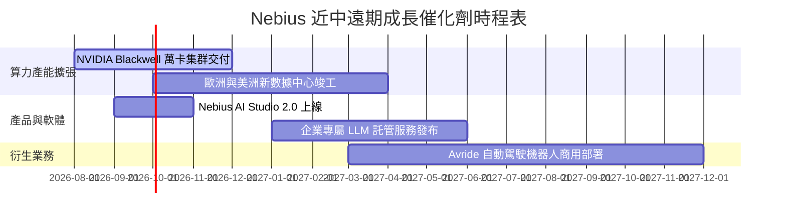

---

### 8.2 TAM 市場規模分析

```
╔══════════════════════════════════════════════════════════════════╗
║                   Nebius 可滲透總市場 (TAM)                      ║
╠══════════════════════════════════════════════════════════════════╣
║                                                                  ║
║  AI 雲端基礎設施 (AI Cloud TAM)： $350B (2028E)   ██████████████ ║
║  Nebius 當前滲透率：              < 0.3%          █              ║
║                                                                  ║
║  自動駕駛與機器人 (Avride TAM)：  $120B (2030E)   █████████      ║
║  Nebius 當前滲透率：              初創階段        █              ║
║                                                                  ║
║  💡 成長空間：算力基礎設施 TAM 年複合成長率高達 38%，Nebius 僅需  ║
║      取得 2% 份額即可創造 $70 億年度營收。                        ║
╚══════════════════════════════════════════════════════════════════╝
```

---

### 8.3 成長驅動力結構圖

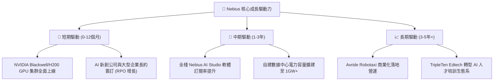

---

## 9. 風險矩陣

### 9.1 風險評分矩陣

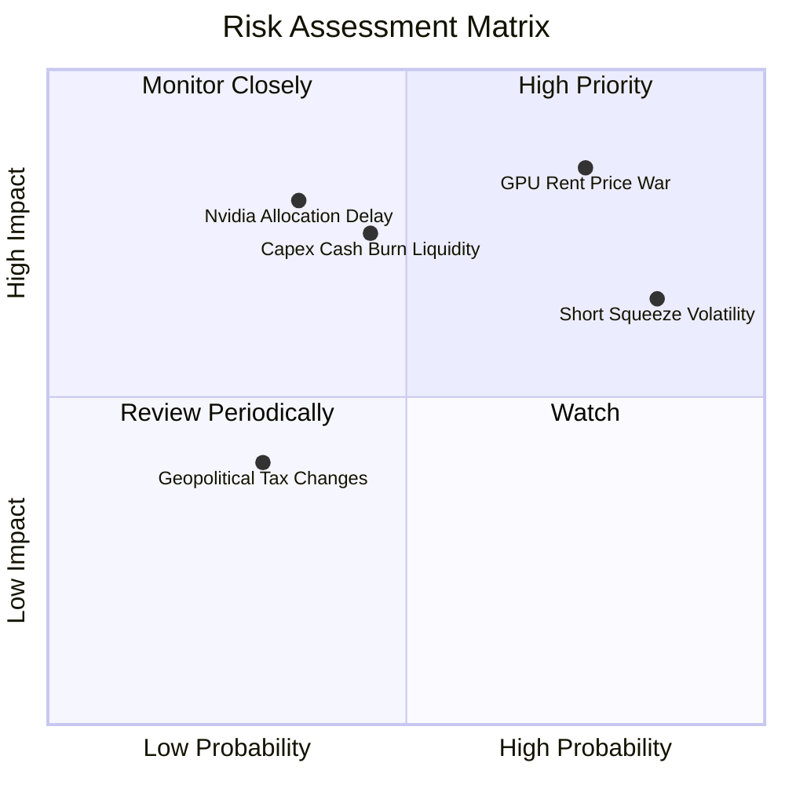

---

### 9.2 風險清單詳細分析

| # | 風險項目 | 發生機率 | 財務衝擊 | 風險評分 | 緩解措施與觀察指標 |
|---|----------|----------|----------|----------|--------------------|
| 1 | 🔴 **算力租賃價格戰** | 高 (75%) | 高 (-20% 毛利) | 🔴 **8.1 / 10** | 發展 Nebius AI Studio 軟體層，以 PaaS 提高客戶黏性，降低單純 IaaS 價格敏感度。 |
| 2 | 🔴 **高空頭比率引致暴跌** | 高 (85%) | 中 (-30% 股價) | 🔴 **7.2 / 10** | 當前 Short % Float 高達 28.0%，需留意財報不如預期時的空頭襲擊或好於預期時的軋空。 |
| 3 | 🟡 **極速 Capex 壓迫流動性** | 中 (45%) | 高 (需二次增資) | 🟡 **6.8 / 10** | 目前擁有 $93.7 億現金，且可轉債與租賃融資管道順暢，短期流動性安全。 |
| 4 | 🟡 **NVIDIA 配額供應延遲** | 中 (35%) | 高 (-15% 營收) | 🟡 **6.5 / 10** |Nebius 作為 NVIDIA 精選 Tier-1 雲端夥伴，享有第一梯隊供貨優先權。 |

---

## 10. 投資建議

### 10.1 最終綜合評級雷達圖

```
╔══════════════════════════════════════════════════════════════════╗
║               Nebius Group 綜合評分雷達圖                        ║
╠══════════════════════════════════════════════════════════════════╣
║                                                                  ║
║  成長動能 (Growth)      9.5  ▓▓▓▓▓▓▓▓▓▓▓▓▓▓▓▓▓▓▓  🟢 絕佳        ║
║  財務結構 (Balance)     8.5  ▓▓▓▓▓▓▓▓▓▓▓▓▓▓▓▓▓░░  🟢 極優        ║
║  護城河深度 (Moat)      7.5  ▓▓▓▓▓▓▓▓▓▓▓▓▓▓▓░░░░  🟢 良好        ║
║  獲利品質 (Earnings)    6.5  ▓▓▓▓▓▓▓▓▓▓▓▓░░░░░░░  🟡 轉型中      ║
║  估值吸引力 (Valuation) 6.5  ▓▓▓▓▓▓▓▓▓▓▓▓░░░░░░░  🟡 反映預期    ║
║                                                                  ║
║  🏆 綜合投資評分：7.8 / 10 ｜ 評級：🟢 買入 (Buy)                ║
╚══════════════════════════════════════════════════════════════════╝
```

---

### 10.2 目標價與隱含報酬率

| 情境 | 機率權重 | 隱含目標價 | 股價隱含報酬率 (現價 $169.69) | 核心觸發條件 |
|------|----------|------------|-------------------------------|--------------|
| 🔴 **悲觀** | 20% | **$120.00** | **-29.3%** | 算力出租價格大幅下滑，Capex 效益未達預期 |
| 🟡 **基準** | **60%** | **$258.13** | **+52.1%** | **算力建置如期上線，營收維持三位數成長** |
| 🟢 **樂觀** | 20% | **$380.00** | **+123.9%** | **Blackwell 產能爆滿，AI Studio 獲利超預期** |

**加權期望目標價**：$120.00 × 20% + $258.13 × 60% + $380.00 × 20% = **$252.88**（隱含 **+49.0%** 上漲空間）。

---

### 10.3 買入時機與觸發因素

```
╔══════════════════════════════════════════════════════════════════╗
║                  ✅ 買入觸發因素 Checklist                      ║
╠══════════════════════════════════════════════════════════════════╣
║                                                                  ║
║  立即買入觸發條件（滿足 2 項以上即可建立基本持倉）：             ║
║  ✅ 季度營收 YoY 增長率持續維持在 > 200% 以上 (最新 Q1 達 683.9%) ║
║  ✅ 單季營運現金流 (OCF) 維持強勁正向 (最新 Q1 達 $22.6 億)       ║
║  ✅ 現金與等價物覆蓋總負債，財務安全邊際足夠                      ║
║                                                                  ║
║  分批加碼觸發條件：                                              ║
║  ☐ 股價回檔至 50 日均線附近或 P/S 降至 35x 以下                   ║
║  ☐ 財報顯示營業利益率 (Operating Margin) 轉正                     ║
║  ☐ NVIDIA Blackwell 集群交付進度超乎預期                         ║
║                                                                  ║
║  減碼/停損觸發條件：                                             ║
║  ☐ 單季毛利率跌破 55%（顯示算力價格戰侵蝕獲利）                   ║
║  ☐ 現金儲備迅速耗盡至 $20 億以下且無法獲得長期融資               ║
╚══════════════════════════════════════════════════════════════════╝
```

---

### 10.4 投資人適配度分析

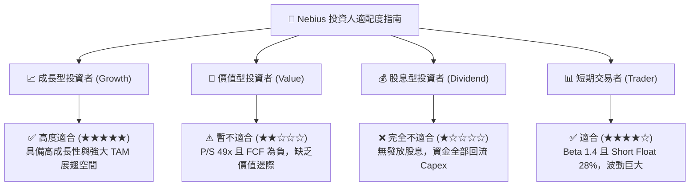

---

### 10.5 每季財報監控清單（Quarterly Watch List）

| 監控指標 | 最新數據 (Q1 2026) | 下季目標 / 門檻 | 觸發加碼條件 | 觸發減碼/停損條件 |
|----------|-------------------|-----------------|--------------|------------------|
| **單季營收 (Revenue)** | $3.99 億 | > $4.80 億 | > $5.50 億 (超預期) | < $4.00 億 (成長停滯) |
| **毛利率 (Gross Margin)** | 74.0% | > 70.0% | > 75.0% | < 60.0% (價格戰) |
| **營業利益率 (Op Margin)**| -32.1% | > -20.0% | > -10.0% (顯著收斂)| < -40.0% (費用失控) |
| **營運現金流 (OCF)** | $22.6 億 | > $10.0 億 | > $20.0 億 | 轉負 (現金流受阻) |
| **手頭現金 (Cash)** | $92.98 億 | > $70.0 億 | > $80.0 億 | < $30.0 億 (流動性告急)|

---

### 10.6 反面論證：什麼會證明論點錯誤（What Would Change My Mind）

```
╔══════════════════════════════════════════════════════════════════╗
║              ⚠️ 論點失效條件（Disconfirming Evidence）           ║
╠══════════════════════════════════════════════════════════════════╣
║  本研究報告提出的多頭投資論點，在下列情況成立時應立即重新檢視或退║
║  出持倉：                                                        ║
║                                                                  ║
║  ☐ 1. 營收季增率 (QoQ Growth) 連續兩季跌破 +15%，顯示算力需求疲軟║
║  ☐ 2. 毛利率 (Gross Margin) 因租金下跌而持續收縮至 < 50%         ║
║  ☐ 3. 單季營運現金流 (OCF) 由正轉負，顯示算力營運無法實現自補血   ║
║  ☐ 4. ROIC 在 FY2027 結束前仍低於 WACC，未能展現經濟價值創造能力 ║
║  ☐ 5. 核心客戶出現大規模違約或流失，客戶集中度風險爆發           ║
╚══════════════════════════════════════════════════════════════════╝
```

---

> **免責聲明**：本報告為 AI 自動生成之機構級研究資料，僅供學術與投資研究參考，不構成任何買賣建議。投資美股具有極高風險，請務必自行評估個人風險承受度並諮詢專業投資顧問。