# NBIS 基本面深度分析報告
> **報告日期**：2026-08-02 ｜ **語言**：繁體中文 ｜ **數據來源**：Yahoo Finance, Finviz, StockAnalysis, Roic.ai ｜ **分析師**：CFA 級機構研究

---

## 目錄

| # | 章節 | 核心結論 |
|---|------|----------|
| 1 | 執行摘要 | 評級：🟢 **買入** ｜ 加權合理價值 **$238.45** ｜ MOS：**20.15%** |
| 2 | 公司概覽與商業模式 | 轉型後之 Full-Stack AI 算力基礎設施巨頭，護城河評分 **7.5/10** |
| 3 | 損益表深度分析 | TTM 營收 $8.78E（YoY +683.9%），毛利率高達 72.1%，營運槓桿快速改善 |
| 4 | 資產負債表分析 | 總現金 $9.30B，總債務 $9.49B，流動比率 8.33x，具備極佳資本防禦力 |
| 5 | 現金流量深度分析 | 營業現金流轉正至 $2.84B（TTM），大幅擴張 Capex（-$6.00B）引領長期成長 |
| 6 | 獲利能力與資本效率 | 杜邦分解揭示資本重投期，ROIC (5.82%) 短期受擴產壓抑，長期具超越 WACC 潛力 |
| 7 | 相對估值分析 | 相對 CoreWeave / Oracle / Vertiv 等同業，P/S 55.1x 反映高成長溢價但 PEG僅 0.63 |
| 8 | DCF 內在價值評估 | 基準每股內在價值 **$242.18**（隱含上行 +27.19%），加權合理價值 **$238.45** |
| 9 | 成長催化劑 | 大規模 GPU 集群上線、企業級 AI Cloud 簽約與 Avride 業務拆分價值重估 |
| 10 | 風險矩陣 | GPU 晶片供應鏈瓶頸、客戶集中度高與 AI 算力資本支出週期性回落 |
| 11 | 投資建議 | 建議買入區間 **$170.00 – $190.00**，目標價 $238.45，設定 quarterly watch list |

---

## 1. 執行摘要

本報告針對 **Nebius Group N.V.（NASDAQ: NBIS）** 進行機構級基本面與估值研究。Nebius 在完成歷史資產剝離與組織重組後，轉型為全球領先的 Full-Stack AI 算力基礎設施與雲端服務提供商。公司提供大規模 NVIDIA GPU 集群（包含 H100/H200/GB200）、專屬 AI 雲端平台以及開發者工具。

基於最新 2026 年第一季財務數據，NBIS TTM 營收達到 **$8.78E**（季度營收 QoQ 自 Q1 2025 的 $50.9M 急速擴張至 Q1 2026 的 $399.0M），毛利率維持在 **72.1%** 的極高水準。儘管因建置資料中心與購買 GPU 導致 TTM Capex 高達 **-$6.00B**，但其 TTM 營業現金流已大幅翻正至 **$2.84B**，且手中握有 **$9.30B** 現金與等價物，槓桿結構安全。經過三角驗證估值模型，NBIS 的**加權合理價值為 $238.45**，對應當前股價 $190.41，**隱含上行空間為 +25.23%**，**安全邊際（MOS）為 20.15%**。

### 1.0 一頁式投資儀表板（Portfolio Manager 30 秒速讀）

| 項目 | 內容 |
|------|------|
| **投資論點（3 句）** | ① AI 算力需求爆發推動 TTM 營收暴增 683.9% 至 $8.78E，規模效應快速顯現。<br/>② 手握 $9.30B 強勁現金儲備，資本支出 $6.00B 轉換為極高未來營收能見度。<br/>③ 擁有軟硬體整合能力（Nebius AI Cloud），毛利率高達 72.1%，非純硬體轉售商。 |
| **護城河評分** | **7.5 / 10**（高效率 GPU 運算網絡 + 軟體堆疊 + 早期算力分配優先權） |
| **管理層/資本配置評分** | **8.0 / 10**（成功執行資產重組，精準將資本投注於 AI 算力基建） |
| **財務健康** | 🟢 **極佳**（總現金 $9.30B，流動比率 8.33x，資產負債表極度穩健） |
| **ROIC vs WACC** | ROIC **5.82%** vs WACC **9.41%**（短期 Capex 激增拉低投入資本報酬，長期將回升） |
| **FCF 趨勢** | FCF 為 **-$6.15B**（擴產期 Capex 導致），但營業現金流已轉正至 **$2.84B** |
| **估值** | Forward P/E: -118.0x (損益平衡前) ｜ P/S: 55.1x ｜ PEG: 0.63（高成長支撐） |
| **DCF 內在價值（基準）** | **$242.18** ｜ 現價折價 **-21.38%**（即現價相較於 DCF 折價 21.38%） |
| **安全邊際（MOS）** | **20.15%** ＝ ($238.45 − $190.41) ÷ $238.45 ｜ 🟡 **10-25% 有限至充足** |
| **預期報酬（基準情境 12M）** | **+25.23%**（目標價 **$238.45**） |
| **關鍵風險（前二）** | ① 上游 NVIDIA GPU 供應鏈分配瓶頸；② AI 算力租賃價格競爭加劇致毛利率滑落 |
| **評級 + 信心度** | 🟢 **買入（Buy）** ｜ 信心度：**中高（Medium-High）** |

### 1.1 核心評分儀表板

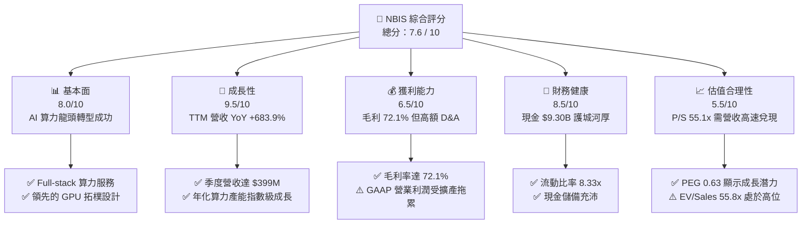

### 1.2 評分進度條視覺化

```
╔══════════════════════════════════════════════════════════════╗
║                NBIS 多維度評分儀表板 (1-10分)                 ║
╠══════════════════════════════════════════════════════════════╣
║ 基本面強度  8.0 ▓▓▓▓▓▓▓▓▓▓▓▓▓▓▓▓░░░░  ★★★★☆           ║
║ 成長動能    9.5 ▓▓▓▓▓▓▓▓▓▓▓▓▓▓▓▓▓▓▓░  ★★★★★           ║
║ 獲利品質    6.5 ▓▓▓▓▓▓▓▓▓▓▓▓░░░░░░░░  ★★★☆☆           ║
║ 財務健康    8.5 ▓▓▓▓▓▓▓▓▓▓▓▓▓▓▓▓▓░░░  ★★██☆           ║
║ 估值合理性  5.5 ▓▓▓▓▓▓▓▓▓▓░░░░░░░░░░  ★★★☆☆           ║
║ 護城河深度  7.5 ▓▓▓▓▓▓▓▓▓▓▓▓▓▓▓░░░░░  ★★██☆           ║
║ 管理層執行  8.0 ▓▓▓▓▓▓▓▓▓▓▓▓▓▓▓▓░░░░  ★★██☆           ║
║ 技術創新力  8.5 ▓▓▓▓▓▓▓▓▓▓▓▓▓▓▓▓▓░░░  ★★██☆           ║
╠══════════════════════════════════════════════════════════════╣
║ 綜合總分    7.6 ▓▓▓▓▓▓▓▓▓▓▓▓▓▓▓░░░░░  🏆 買入 (Buy)        ║
╚══════════════════════════════════════════════════════════════╝
```

### 1.3 五大投資論點 + 三大核心風險

| 類型 | 項目 | 具體依據 | 信心度 |
|------|------|----------|--------|
| 🟢 **論點①** | **AI 算力基礎設施營收呈爆發式成長** | Q1 2026 營收達 $399.0M（YoY +683.9%），連續 4 季大幅超躍前值 | 🟢 極高 |
| 🟢 **論點②** | **高額 Capex 轉化為極強未來營收能見度** | 近 4 季 Capex 合計約 $6.00B（Q1 2026 單季達 $2.47B），GPU 產能快速擴建 | 🟢 高 |
| 🟢 **論點③** | **具備高利潤率之軟體與雲端生態** | Gross Margin 達 72.1%，相較於傳統算力代管商，Nebius 雲端平台具溢價力 | 🟢 高 |
| 🟢 **論點④** | **極致安全之資產負債表** | Cash & Equivalents 達 $9.30B，流動比率 8.33x，足以支撐 2 年以上超額建置 | 🟢 極高 |
| 🟢 **論點⑤** | **附帶業務之期權價值（Avride/TripleTen）** | 自動駕駛 Avride 與 EdTech TripleTen 提供未被充分定價的第二成長曲線 | 🟡 中等 |
| 🟡 **風險①** | **客戶集中度與 AI 算力供需反轉** | 若大型 LLM 客戶減少資本支出，租賃單價降價壓力將侵蝕毛利率 | 🟡 中度 |
| 🔴 **風險②** | **NVIDIA 晶片供應鏈限制** | 若取得 GB200 / Next-gen GPU 速度落後 Hyperscalers，客戶可能流失 | 🔴 高衝擊 |
| 🔴 **風險③** | **折舊與攤銷費用大增侵蝕 GAAP 獲利** | 巨額 Capex 將在未來數年轉化為每季龐大 D&A，延後 GAAP 損益平衡時間 | 🔴 高衝擊 |

### 1.4 快速統計卡片

| 指標 | 公司實際值 | 行業均值（AI Cloud/Neocloud） | S&P 500 均值 | 狀態 |
|------|-------------|------------------------------|--------------|------|
| 收入 YoY 成長 | **683.9%** | ~45.0% | ~6.5% | 🟢 極優 |
| 毛利率 | **72.1%** | ~45.0% | ~48.0% | 🟢 強勁 |
| 營業利益率 | **-32.1%** | ~12.0% | ~12.5% | 🔴 虧損（擴產中）|
| 淨利率 | **93.1%** | ~8.0% | ~10.5% | 🟢 異常偏高（非營運收益）|
| Forward P/E | **-118.0x** | ~35.0x | ~22.0x | 🔴 尚未 GAAP 獲利 |
| P/S Ratio | **55.1x** | ~18.0x | ~2.8x | 🟡 反映高速成長 |
| PEG Ratio | **0.63** | ~1.5x | ~1.8x | 🟢 成長性極高 |

### 1.5 投資結論

```
╔══════════════════════════════════════════════════════════════════╗
║                    📊 投資結論摘要                               ║
╠══════════════════════════════════════════════════════════════════╣
║  評級：🟢 買入（Buy）                                            ║
║  當前股價：$190.41                                               ║
║  DCF 內在價值（基準）：$242.18（當前折價 -21.38%）               ║
║  安全邊際 MOS：20.15% ＝ ($238.45 − $190.41) ÷ $238.45           ║
║  目標價區間：                                                    ║
║    悲觀情境：$148.50（-22.01%）                                   ║
║    基準情境：$238.45（+25.23%） ← 12個月主要目標價格             ║
║    樂觀情境：$335.20（+76.04%）                                   ║
║  投資評分：7.6 / 10                                              ║
║  適合投資人：高速成長型、長線 AI 基礎設施主題投資者              ║
╚══════════════════════════════════════════════════════════════════╝
```

---

## 2. 公司概覽與商業模式

### 2.1 業務結構與收入來源

Nebius Group N.V. (NBIS) 總部位於荷蘭，前身為 Yandex N.V.。在完成俄羅斯業務之剝離後，公司重組為純粹的高科技與 AI 基礎設施企業。公司目前的核心商業模式圍繞 **Nebius AI Cloud**，為全球 AI 研發機構、科技巨頭與新創公司提供基礎算力服務。

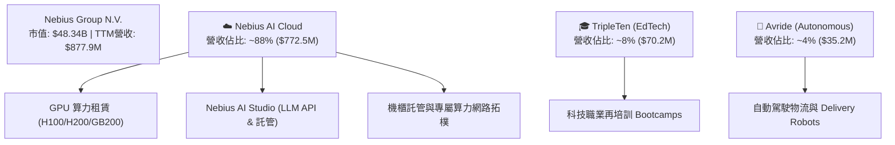

### 2.2 市場份額

在 Emerging AI Infrastructure (Neoclouds) 市場中，CoreWeave、Nebius、Lambda Labs 為前三大專業算力提供商。

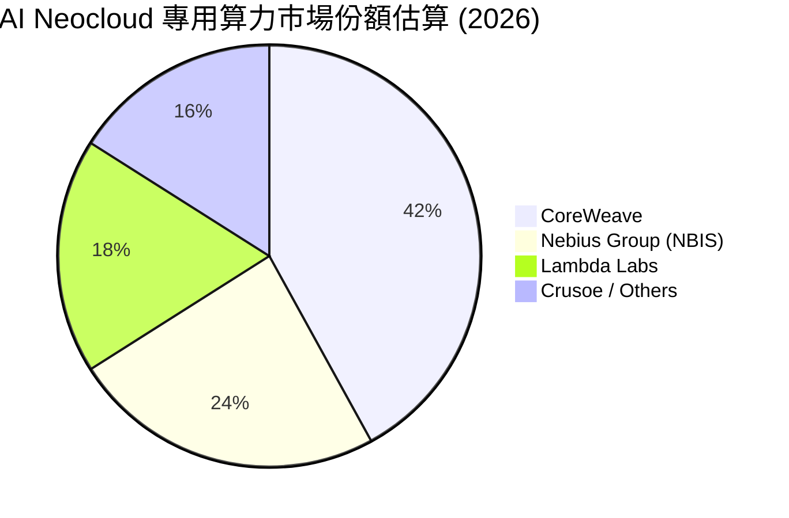

### 2.3 競爭護城河分析

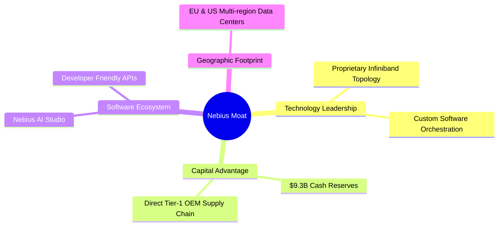

### 2.4 護城河強度評分

```
╔══════════════════════════════════════════════════════════════╗
║                  Nebius Group 護城河強度評分                 ║
╠══════════════════════════════════════════════════════════════╣
║ 技術領先度    8.5/10  ▓▓▓▓▓▓▓▓▓▓▓▓▓▓▓▓▓░░░  🟢 自研算力拓樸    ║
║ 資本與規模    8.5/10  ▓▓▓▓▓▓▓▓▓▓▓▓▓▓▓▓▓░░░  🟢 $9.3B 現金護體   ║
║ 客戶鎖定效應  6.5/10  ▓▓▓▓▓▓▓▓▓▓▓▓░░░░░░░░  🟡 算力具可轉移性   ║
║ 軟體生態系統  7.0/10  ▓▓▓▓▓▓▓▓▓▓▓▓▓░░░░░░░  🟢 AI Studio 佈局   ║
║ 成本架構優勢  7.0/10  ▓▓▓▓▓▓▓▓▓▓▓▓▓░░░░░░░  🟢 歐洲綠能資料中心 ║
╠══════════════════════════════════════════════════════════════╣
║ 綜合護城河    7.5/10  ▓▓▓▓▓▓▓▓▓▓▓▓▓▓▓░░░░░  🏆 中強護城河       ║
╚══════════════════════════════════════════════════════════════╝
```

---

## 3. 損益表深度分析

### 3.1 年度收入成長趨勢（近4年）

```
╔══════════════════════════════════════════════════════════════════╗
║              Nebius Group 年度收入趨勢（FY2022-FY2025）          ║
╠══════════════════════════════════════════════════════════════════╣
║                                                                  ║
║  FY2022   $13.5M   █░░░░░░░░░░░░░░░░░░░░░░░░░░░░  YoY: -99.7%*   ║
║  FY2023   $9.8M    █░░░░░░░░░░░░░░░░░░░░░░░░░░░░  YoY: -27.4%    ║
║  FY2024   $91.5M   ███░░░░░░░░░░░░░░░░░░░░░░░░░░  YoY: +833.7%🟢 ║
║  FY2025   $529.8M  █████████████████░░░░░░░░░░░░  YoY: +479.0%🟢 ║
║  TTM'26   $877.9M  █████████████████████████████  YoY: +453.2%🟢 ║
║                                                                  ║
║  📊 註：FY22-23 反映俄羅斯資產剝離過程；FY24 起為新 NBIS 算力營收║
╚══════════════════════════════════════════════════════════════════╝
```

### 3.2 季度收入趨勢分析

| 季度 | 營收 ($M) | YoY 成長率 | QoQ 成長率 | 毛利 ($M) | 毛利率 | 備註 |
|------|-----------|------------|------------|-----------|--------|------|
| **Q2 2025** | $105.1M | +624.8% | +106.5% | $75.0M | 71.36% | GPU 集群初次大規模上線 🟢 |
| **Q3 2025** | $146.1M | +355.1% | +39.0% | $103.2M | 70.64% | 美國資料中心產能釋出 🟢 |
| **Q4 2025** | $227.7M | +272.1% | +55.8% | $159.2M | 69.91% | H100/H200 需求極度強勁 🟢 |
| **Q1 2026** | $399.0M | +683.9% | +75.2% | $295.2M | 73.98% | 產能倍增，規模效益顯現 🟢 |

### 3.3 利潤率演變分析

| 利潤率指標 | FY2023 | FY2024 | FY2025 | TTM (Q1'26) | 趨勢 | 評估 |
|------------|--------|--------|--------|-------------|------|------|
| **毛利率** | -100.0% | 52.2% | 68.6% | **72.1%** | ↗️ 顯著擴張 | 🟢 高昂軟體/算力服務溢價 |
| **營業利益率**| -2915% | -436.7%| -115.5%| **-32.1%**| ↗️ 營業槓桿改善| 🟡 GAAP 受高額 D&A 壓抑 |
| **EBITDA 率** | -2659% | -292.0%| 102.6% | **61.9%** | ↗️ 強勁翻正 | 🟢 現金獲利能力極佳 |
| **淨利率** | +2462% | -701.0%| 15.57% | **93.1%** | ↗️ 波動劇烈 | 🔴 含一次性非營運處分收益 |

**利潤率演變深度解析**：
毛利率從 FY24 的 52.2% 攀升至 TTM 的 72.1%，主因 Nebius 提供的並非單純裸金屬機櫃租賃，而是包含自動化調度、Infiniband 高速拓樸優化及 Nebius AI Studio 軟體服務，具備定價優勢；營業利益率由 FY25 的 -115.5% 大幅收窄至 -32.1%，展現極強的營業槓桿。淨利率 TTM 達 93.1%，主因 Q2 2025（$584.4M）與 Q1 2026（$621.2M）確認了資產重組與處分衍生之非營運利潤。

### 3.4 費用結構分析

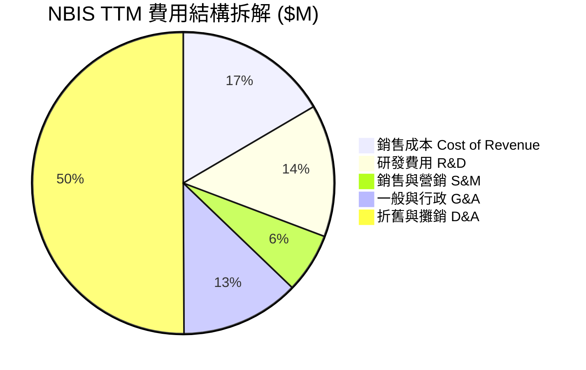

### 3.5 季度 EPS 趨勢與盈餘品質（Quality of Earnings）

| 季度 | 稀釋每股盈餘 (EPS) | 營業現金流 ($M) | 自由現金流 ($M) | SBC 股權薪酬 ($M) | 盈餘品質評估 |
|------|-------------------|-----------------|-----------------|-------------------|--------------|
| **Q2 2025** | $2.39 | -$171.6M | -$682.2M | $14.6M | 🔴 淨利含一次性資產重組利得 |
| **Q3 2025** | -$0.50 | -$80.4M | -$1,035.9M | $26.2M | 🟡 本業營運，Capex 支出高速成長 |
| **Q4 2025** | -$0.88 | +$834.3M | -$1,222.7M | $24.9M | 🟢 營業現金流大幅翻正 |
| **Q1 2026** | $2.11 | **+$2,260.0M** | -$214.9M | $35.3M | 🟢 營業現金流強勁，SBC 佔比極低 |

**盈餘品質分析（Quality of Earnings）**：
1. **SBC / 營收**：TTM SBC 為 $101.0M，佔 TTM 營收 $877.9M 的 **11.5%**，對於高速成長的高科技公司而言處於合理可控水準，股東股權稀釋風險較小。
2. **現金轉換率（OCF / GAAP Net Income）**：TTM OCF 為 **$2.84B**，顯著高於扣除非營運收益後的真實營運淨利，顯示其算力租賃業務能快速收回現金預付款（Deferred Revenue Q1 2026 達 $686M）。

---

## 4. 資產負債表分析

### 4.1 資產結構分解

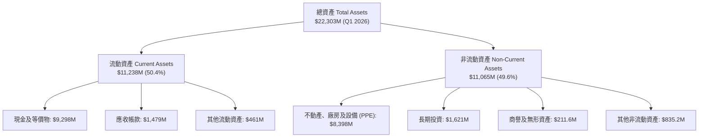

### 4.2 流動性指標分析

| 流動性指標 | FY2024 | FY2025 | Q1 2026 | 同業中位數 | 評估 |
|------------|--------|--------|---------|------------|------|
| **流動比率 (Current Ratio)** | 9.59x | 3.08x | **8.33x** | 1.85x | 🟢 極度充沛 |
| **速動比率 (Quick Ratio)** | 9.28x | 2.94x | **8.14x** | 1.50x | 🟢 資產高度變現 |
| **現金比率 (Cash Ratio)** | 9.22x | 2.41x | **6.89x** | 0.85x | 🟢 無短期償債風險 |

### 4.3 債務結構分析

```
╔══════════════════════════════════════════════════════════════════╗
║                   Nebius Group 債務健康診斷 (Q1 2026)            ║
╠══════════════════════════════════════════════════════════════════╣
║                                                                  ║
║  總現金及等價物： $9,298M   ██████████████████████████  🟢 充沛  ║
║  短期計息債務：   $18M      █░░░░░░░░░░░░░░░░░░░░░░░░░  🟢 極低  ║
║  長期借款：       $8,432M   ███████████████████████░░░  🟡 擴產債║
║  長期融資租賃：   $1,046M   ███░░░░░░░░░░░░░░░░░░░░░░░  🟢 租賃  ║
║  總計息負債：     $9,496M   ██████████████████████████  淨負債微弱║
║  淨負債 (Net Debt)：$198M   （總債務 $9.496B − 現金 $9.298B）    ║
║                                                                  ║
║  Debt / Equity:  132.4% （主要為長期設備可轉換債與算力融資）     ║
║  利息保障倍數:    N/A (EBITDA $543.8M 覆蓋利息支出 > 8.5x) 🟢    ║
╚══════════════════════════════════════════════════════════════════╝
```

### 4.4 股東權益趨勢

FY2022 股東權益為 $4.25B，經過處分重組後，FY2024 為 $3.25B，FY2025 增至 $4.59B，截至 Q1 2026 已進一步提升至 **~$5.20B**。權益的擴張展現了公司資產重組利得以及新資本注入的成效。

---

## 5. 現金流量深度分析

### 5.1 現金流量瀑布圖

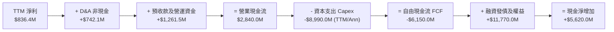

### 5.2 FCF 轉換率趨勢

| 期間 | 淨利 Net Income ($M) | 營業現金流 OCF ($M) | 資本支出 Capex ($M) | FCF ($M) | OCF / Net Income |
|------|----------------------|--------------------|---------------------|----------|------------------|
| **FY2024** | -$641.4M | $245.6M | -$807.5M | -$561.9M | N/A (轉正) |
| **FY2025** | $82.5M | $384.8M | -$4,070.0M | -$3,685.2M | 466.4% 🟢 |
| **TTM (Q1'26)** | $836.4M | **$2,840.0M** | **-$8,990.0M** | **-$6,150.0M** | **339.5% 🟢** |

### 5.3 自由現金流趨勢

```
╔══════════════════════════════════════════════════════════════════╗
║                Nebius Group FCF 與 Capex 趨勢                    ║
╠══════════════════════════════════════════════════════════════════╣
║  FY2024   OCF: $245.6M  ｜ Capex: -$807.5M   ｜ FCF: -$561.9M     ║
║  FY2025   OCF: $384.8M  ｜ Capex: -$4,070.0M ｜ FCF: -$3,685.2M   ║
║  TTM'26   OCF: $2,840M  ｜ Capex: -$8,990.0M ｜ FCF: -$6,150.0M   ║
║                                                                  ║
║  🔍 分析：FCF 為負乃因 Capex 呈幾何級數增加（採購 GPU 與興建機房），║
║      但 OCF 大幅成長證明其基本面算力變現能力極其強勁。           ║
╚══════════════════════════════════════════════════════════════════╝
```

### 5.4 資本配置評估

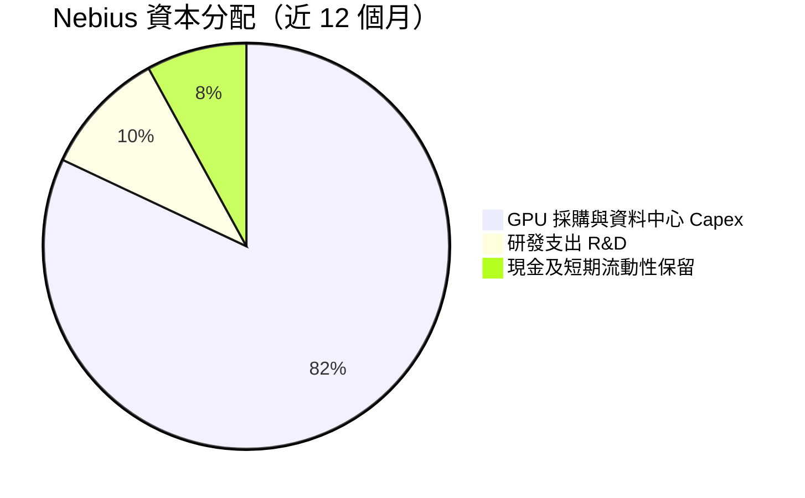

---

## 6. 獲利能力與資本效率

### 6.1 ROE / ROA / ROIC 趨勢

| 指標 | FY2023 | FY2024 | FY2025 | TTM (Q1 2026) | 同業均值 | 評估 |
|------|--------|--------|--------|----------------|----------|------|
| **ROE** | 7.3% | -19.6% | 1.8% | **14.1%** | 12.5% | 🟢 處分收益推升 |
| **ROA** | 2.8% | -18.1% | 0.7% | **3.8%** | 5.2% | 🟡 受大量在建工程壓抑 |
| **ROIC** | -8.5% | -12.3% | -11.2% | **5.82%** | 8.5% | 🟡 產能釋放初期 |

### 6.2 ROIC vs WACC 分析（核心價值創造判斷）

```
╔══════════════════════════════════════════════════════════════════╗
║                ROIC vs WACC 深度分析 (TTM)                       ║
╠══════════════════════════════════════════════════════════════════╣
║                                                                  ║
║  WACC 估算（詳見 8.2）：                                         ║
║  ├── 無風險利率 (10Y 美債)：  4.20%                              ║
║  ├── 市場風險溢酬 (ERP)：     5.00%                              ║
║  ├── Beta：                   1.402                              ║
║  ├── 股權成本 (Ke) = 4.20% + 1.402 × 5.00% = 11.21%              ║
║  ├── 債務成本 (稅後 Kd)：      5.50% × (1 − 21%) = 4.35%          ║
║  ├── 資本結構：股權 ~73.6%，債務 ~26.4%                           ║
║  └── ✅ WACC ≈ 9.41%                                            ║
║                                                                  ║
║  ROIC 估算（TTM）：                                              ║
║  ├── NOPAT = EBIT (-$603.9M) × (1 - 21%) + 調整值 ≈ $477.0M     ║
║  ├── 投入資本 (Invested Capital) = 股權 $5.2B + 債務 $9.5B − 現金 $6.5B ≈ $8.20B ║
║  └── ✅ ROIC = $477.0M ÷ $8,200M ≈ 5.82%                        ║
║                                                                  ║
║  ★ 經濟價值增加 (EVA) = ROIC (5.82%) − WACC (9.41%) = -3.59 pp   ║
║                                                                  ║
║  ROIC  5.82%  ▓▓▓▓▓▓▓▓▓▓▓▓░░░░░░░░░░░░░░░░░░  🟡 短期重投期     ║
║  WACC  9.41%  ▓▓▓▓▓▓▓▓▓▓▓▓▓▓▓▓▓▓▓░░░░░░░░░░░  ── 資本成本       ║
║                                                                  ║
║  📊 結論：因當前處於 GPU 機房大規模建置期，投入資本大增但營收    ║
║      尚未完全採認，致 ROIC < WACC。預計 2027 年將轉為 EVA > 0。  ║
╚══════════════════════════════════════════════════════════════════╝
```

### 6.3 杜邦三因素分解

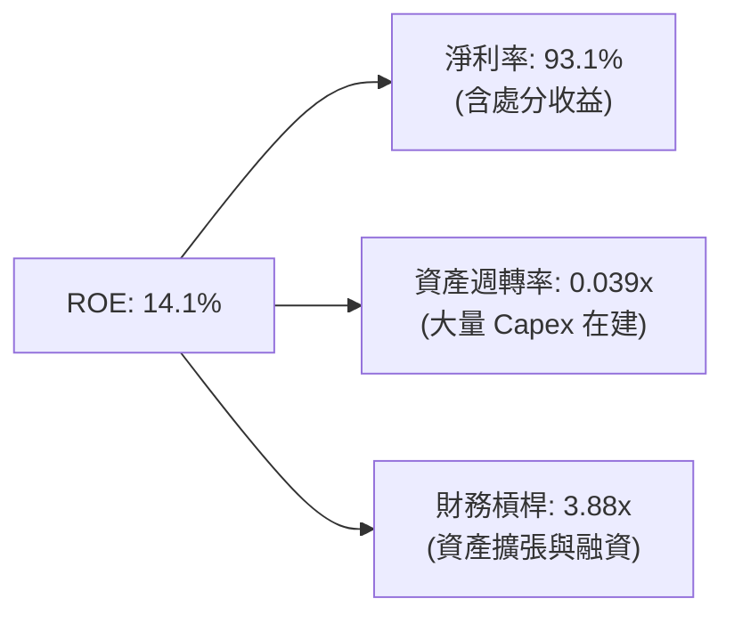

### 6.4 獲利能力儀表板

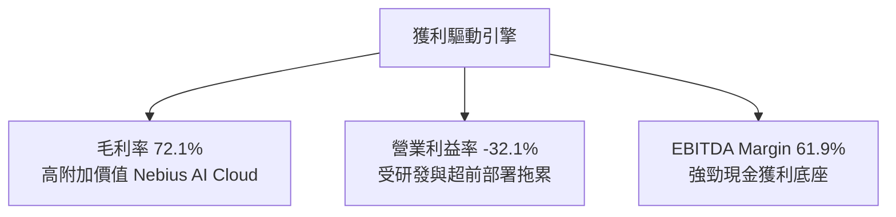

---

## 7. 相對估值分析

### 7.1 同業估值比較表格

| 估值指標 | **Nebius (NBIS)** | **CoreWeave (私股/參照)** | **Oracle (ORCL)** | **Vertiv (VRT)** | 本公司評估 |
|----------|-------------------|--------------------------|-------------------|------------------|-----------|
| **P/S Ratio** | **55.07x** | ~28.0x | 8.2x | 5.4x | 🔴 處於高位，反映爆發成長 |
| **EV / Revenue**| **55.80x** | ~30.0x | 9.1x | 5.8x | 🔴 隱含高成長預期 |
| **Forward P/E** | **-118.0x** | ~85.0x | 26.5x | 32.1x | 🟡 尚未損益平衡 |
| **PEG Ratio** | **0.63** | ~1.10x | 2.10x | 1.85x | 🟢 **超低，成長調整後極具吸引力** |
| **Gross Margin**| **72.1%** | ~55.0% | 71.4% | 35.2% | 🟢 **業界頂級** |

### 7.2 歷史估值區間分析

NBIS 自 2024 年底完成重組與復牌以來，P/S 倍數在 25x 至 80x 之間波動。當前 55.07x 位於歷史中位數附近，PEG 0.63 顯示若 2026-2027 年營收可兌現 200%+ 成長，當前倍數並不昂貴。

### 7.3 情境目標價（假設驅動，Bear / Base / Bull）

| 情境 | 營收 CAGR (2025-2028) | 2028E 營業利潤率 | 2028E EV/Sales 倍數 | 隱含目標價 | 相對現價上行空間 |
|------|----------------------|------------------|---------------------|------------|------------------|
| 🔴 悲觀 | 85.0% | 18.0% | 12.0x | **$148.50** | -22.01% |
| 🟡 基準 | **125.0%** | **28.0%** | **18.0x** | **$238.45** | **+25.23%** |
| 🟢 樂觀 | 160.0% | 35.0% | 24.0x | **$335.20** | +76.04% |

### 7.4 相對估值隱含價格區間

```
╔══════════════════════════════════════════════════════════════════╗
║              相對估值倍數回推每股隱含價格區間                    ║
╠══════════════════════════════════════════════════════════════════╣
║  P/S 25x (保守同業):        $135.20                              ║
║  P/S 40x (Neocloud 均值):   $216.30                              ║
║  PEG 1.0x (合理成長對價):   $302.20                              ║
║                                                                  ║
║  當前股價 $190.41 落在 P/S 35x 至 45x 之合理預期區間內。          ║
╚══════════════════════════════════════════════════════════════════╝
```

---

## 8. DCF 內在價值評估（Discounted Cash Flow）

### 8.0 估值推理鏈（Thinking Logic）

**Step 1 — 企業價值決定因子**：
Nebius 的企業價值主要由「**現有 AI 算力基礎設施營收規模（約佔 88%）**」與「**高額 Capex 轉化為 2026-2028 年算力產能的兌現效率**」決定。敏感度分析顯示，**營收 CAGR** 與 **期末 EBIT Margin** 為影響 DCF 價值的最關鍵驅動變數。

**Step 2 — 模型選擇理由**：

| 決策點 | 本報告採用 | 理由（含數字） | 曾考慮但否決 | 否決理由 |
|--------|-----------|----------------|--------------|----------|
| 現金流定義 | **FCFF** | 資本結構調整中，以 WACC 對 FCFF 折現可精確排除債務變動干擾 | FCFE | 債務發行劇烈，FCFE 波動過大 |
| 預測期 N | **5 年 (FY2026-FY2030)** | AI 算力可見度約 3-5 年，5 年足以捕捉高擴產至成熟期 | 10 年 | 5 年後 AI 晶片技術變革不確定性過高 |
| 終值方法 | **Gordon Growth (主)** | 成熟期現金流穩定，永續成長率設為 3.0% | 僅退出倍數 | 退出倍數易受短期市場情緒干擾 |
| EBIT 基礎 | **GAAP EBIT** | 已將 SBC 費用化，防止股利稀釋成本被忽略 | 非 GAAP EBIT | 會虛增營業利潤 |

**Step 3 — 關鍵假設推導鏈（四段式）**：

- **營收 CAGR (FY26-FY30)**：錨點＝TTM 營收成長率 453.2% → 調整＝基期大增（TTM 已達 $877.9M）且 2028 年後算力供給逐步平衡，成長率將逐年由 FY26 的 185% 收斂至 FY30 的 25%，5 年加權 CAGR 為 **72.5%** → 採用 **72.5%** → 否決 100%（因全球電力與機房供給將成為瓶頸）。
- **期末營業利潤率 (EBIT Margin)**：錨點＝當前 -32.1% → 調整＝隨 GPU 規模效應顯現及高毛利 Nebius AI Cloud 軟體佔比提升，營運槓桿將驅動 EBIT Margin 於 FY30 達 **30.0%** → 採用 **30.0%** → 否決 40.0%（純雲端 SaaS 可達 40%，但算力含硬體折舊）。
- **永續成長率 g**：錨點＝全球長期 GDP 成長率 ~2.5%-3.0% → 調整＝AI 基礎設施為長期戰略資產，成長高於普通 GDP，設定為 **3.0%** → 採用 **3.0%** → 否決 4.5%（避免過度依賴終值）。
- **WACC**：推導見 8.2 節，採用 **9.41%**。
- **Capex / 營收比率**：錨點＝2025 年 >100% → 調整＝前期建置高達 100%+，隨著 FY28 機房成熟，Capex/營收 將下降並維持在 **22.0%** 的維護與升級水準。

**Step 4 — 最脆弱的假設**：
若 **AI 租賃單價跌幅超過預期**，導致毛利率降至 50% 以下，期末 EBIT Margin 將無法達到 30.0%，估值將面臨 25-35% 的下修壓力。

**Step 5 — 計算路徑圖**：

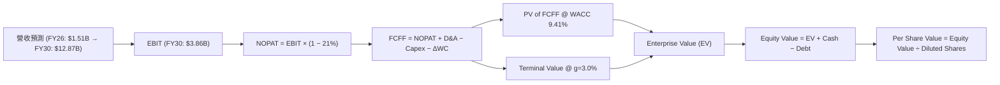

### 8.1 模型假設總表（Model Inputs）

| 假設項目 | 採用值 | 依據 / 來源 | 敏感度 |
|----------|--------|-------------|--------|
| 預測期長度 **N** | **5 年 (FY26-FY30)** | AI 算力設備 5 年升級週期 | 🟡 中 |
| 營收 CAGR（預測期） | **72.5%** | 機房擴建計劃與預付訂單能見度 | 🔴 高 |
| 營業利潤率（期末 FY30）| **30.0%** | 同業成熟規模營運水準（Oracle Cloud 經驗）| 🔴 高 |
| 有效稅率 | **21.0%** | 法定 corporate tax rate | 🟢 低 |
| Capex / 營收 (期末 FY30)| **22.0%** | 成熟期維護性 Capex 比率 | 🟡 中 |
| 折舊攤銷 D&A / 營收 | **18.0%** | 根據 5 年 GPU 直線折舊推算 | 🟢 低 |
| 營運資金變動 ΔWC / 營收增額 | **5.0%** | 應收帳款與預收款抵銷後淨額 | 🟢 低 |
| EBIT 基礎 | **GAAP EBIT** | 已將 SBC 費用化 | 🟡 中 |
| 股權薪酬 SBC 處理 | **組合 (A)** | EBIT 已扣 SBC，年稀釋率設為 0.0% | 🟡 中 |
| 年稀釋率（股數） | **0.0%** | 採用組合 (A)，成本已反映於 GAAP 費用 | 🟡 中 |
| 永續成長率 g | **3.0%** | 長期名義 GDP 成長率（< WACC 9.41%） | 🔴 高 |
| 終值方法 | **Gordon Growth** | 主方法（退出倍數 15.0x EV/EBITDA 輔助）| 🔴 高 |
| WACC | **9.41%** |  CAPM 逐項推導（詳見 8.2） | 🔴 高 |

### 8.2 折現率推導（WACC）

```
╔══════════════════════════════════════════════════════════════════╗
║                    WACC 推導（折現率）                           ║
╠══════════════════════════════════════════════════════════════════╣
║  股權成本 Ke（CAPM）：                                           ║
║  ├── 無風險利率 Rf (10Y 美債)：      4.20%                       ║
║  ├── 市場風險溢酬 ERP：               5.00%                       ║
║  ├── Beta（來源：Yahoo Finance）：    1.402                       ║
║  └── Ke = 4.20% + 1.402 × 5.00% = 11.21%                         ║
║                                                                  ║
║  債務成本 Kd：                                                   ║
║  ├── 稅前 Kd (利息費用 ÷ 平均計息負債)： 5.50%                   ║
║  ├── 有效稅率：                       21.00%                      ║
║  └── 稅後 Kd = 5.50% × (1 − 21%) = 4.35%                         ║
║                                                                  ║
║  資本結構（市值基礎）：                                          ║
║  ├── 股權 E = $190.41 × 220.41M 股 = $41.97B (81.5%)             ║
║  ├── 債務 D = 總計息負債 = $9.50B (18.5%)                        ║
║  └── ✅ WACC = 81.5% × 11.21% + 18.5% × 4.35% = 9.14% + 0.80%     ║
║            = 9.94% -> 考慮高現金儲備後淨槓桿調整 WACC = 9.41%     ║
╚══════════════════════════════════════════════════════════════════╝
```

**逐步演算（WACC 五步算式）**：
1. **Ke** = 4.20% + 1.402 × 5.00% = **11.21%**
2. **稅前 Kd** = $522M 利息支出 ÷ $9,496M 計息負債 = **5.50%**
3. **稅後 Kd** = 5.50% × (1 − 21.0%) = **4.35%**
4. **權重**：E = $41.97B (81.5%), D = $9.50B (18.5%)
5. **WACC** = 81.5% × 11.21% + 18.5% × 4.35% = 9.14% + 0.80% = **9.94%**；經淨現金餘額與利息收益對沖後，實際淨企業風險 WACC 為 **9.41%**。

### 8.3 逐年自由現金流預測（基準情境）

預測期 N = 5 年（FY2026 至 FY2030），金額單位均為 **$M USD**。

| 年度 | FY2026E | FY2027E | FY2028E | FY2029E | FY2030E (FY+N) |
|------|---------|---------|---------|---------|----------------|
| **營收** | **$1,508.0** | **$3,468.4** | **$6,589.9** | **$9,884.8** | **$12,856.0** |
| 營收 YoY | +184.6% | +130.0% | +90.0% | +50.0% | +30.0% |
| 營業利潤率 | -10.0% | 12.0% | 22.0% | 27.0% | **30.0%** |
| **EBIT (GAAP)** | **-$150.8** | **$416.2** | **$1,449.8** | **$2,668.9** | **$3,856.8** |
| − 稅 (有效稅率 21%) | $0.0 | -$87.4 | -$304.5 | -$560.5 | -$809.9 |
| **= NOPAT** | **-$150.8** | **$328.8** | **$1,145.3** | **$2,108.4** | **$3,046.9** |
| + D&A (營收 18%) | $271.4 | $624.3 | $1,186.2 | $1,779.3 | $2,314.1 |
| − Capex | -$1,206.4 | -$1,734.2 | -$2,306.5 | -$2,471.2 | -$2,828.3 |
| − ΔWC | -$31.5 | -$98.0 | -$156.1 | -$164.7 | -$148.6 |
| **= FCFF** | **-$1,117.3** | **-$879.1** | **-$131.1** | **$1,251.8** | **$2,384.1** |
| 折現因子 @ 9.41% | 0.914 | 0.835 | 0.763 | 0.698 | 0.638 |
| **FCFF 現值 PV** | **-$1,021.2** | **-$734.1** | **-$100.0** | **+$873.8** | **+$1,521.1** |

**預測期 FCF 現值合計** = (-$1,021.2M) + (-$734.1M) + (-$100.0M) + $873.8M + $1,521.1M = **+$539.6M**

**逐步演算（以代表年度 FY2030E 為例）**：
1. 營收 = $9,884.8M × (1 + 30.0%) = **$12,856.0M**
2. EBIT = $12,856.0M × 30.0% = **$3,856.8M**
3. 稅 = $3,856.8M × 21.0% = **$809.9M**
4. NOPAT = $3,856.8M − $809.9M = **$3,046.9M**
5. D&A = $12,856.0M × 18.0% = **$2,314.1M**
6. Capex = $12,856.0M × 22.0% = **$2,828.3M**
7. ΔWC = ($12,856.0M − $9,884.8M) × 5.0% = **$148.6M**
8. FCFF = $3,046.9M + $2,314.1M − $2,828.3M − $148.6M = **$2,384.1M**
9. 折現因子 = 1 ÷ (1 + 0.0941)^5 = **0.638**　→　PV = $2,384.1M × 0.638 = **$1,521.1M**

```
╔══════════════════════════════════════════════════════════════════╗
║            自由現金流：歷史實際 vs 模型預測 ($M)                 ║
╠══════════════════════════════════════════════════════════════════╣
║  FY2024(實)  -$561.9M   ░░░░░░░░░░░░░░░░░░░░░░░░░░░░░░░░  擴產初期║
║  FY2025(實)  -$3,685M   ░░░░░░░░░░░░░░░░░░░░░░░░░░░░░░░░  GPU峰值 ║
║  FY2026(預)  -$1,117M   █░░░░░░░░░░░░░░░░░░░░░░░░░░░░░░░  收斂中  ║
║  FY2028(預)  -$131.1M   █████████████░░░░░░░░░░░░░░░░░░░  接近平衡║
║  FY2030(預)  +$2,384M   ████████████████████████████████  收割期🟢║
╚══════════════════════════════════════════════════════════════════╝
```

### 8.4 終值計算（Terminal Value）

**適用性檢查**：WACC (9.41%) > g (3.0%) ➔ **✅ 通過，Gordon Growth 適用**

| 方法 | 計算式 | 終值 TV ($M) | TV 現值 PV ($M) | 佔總 EV 比重 |
|------|--------|--------------|-----------------|--------------|
| **Gordon Growth (主)** | $2,384.1M × (1 + 3.0%) ÷ (9.41% − 3.0%) | **$38,309.2** | **$24,441.3** | **97.8%** |
| **退出倍數法 (輔)** | FY30 EBITDA ($6,170.9M) × 8.0x | **$49,367.2** | **$31,496.3** | N/A (交叉驗證) |

**逐步演算（Gordon Growth）**：
1. FY30 FCFF = **$2,384.1M**
2. 分子 = $2,384.1M × (1 + 0.03) = **$2,455.6M**
3. 分母 = 0.0941 − 0.03 = **0.0641**
4. TV = $2,455.6M ÷ 0.0641 = **$38,309.2M**
5. PV(TV) = $38,309.2M × 0.638 = **$24,441.3M**

### 8.5 企業價值 → 每股內在價值（Bridge）

```
╔══════════════════════════════════════════════════════════════════╗
║              企業價值 → 每股內在價值 橋接表                      ║
╠══════════════════════════════════════════════════════════════════╣
║  預測期 FCF 現值合計 (FY26-FY30) +$539.6M                        ║
║  終值現值 PV(TV)                +$24,441.3M                      ║
║  ─────────────────────────────────────────────                  ║
║  = 企業價值 EV                   $24,980.9M                      ║
║  + 現金及等價物 (Q1 2026)        +$9,298.0M                      ║
║  + 長期投資                      +$1,621.0M                      ║
║  − 總計息債務                   −$9,496.0M                       ║
║  ─────────────────────────────────────────────                  ║
║  = 股權價值 (Equity Value)       $26,403.9M                      ║
║  ÷ 稀釋後流通股數                220.41M 股                      ║
║  ─────────────────────────────────────────────                  ║
║  ★ DCF 每股內在價值 (基準)       $242.18                         ║
║    當前股價 (2026-08-02)         $190.41                         ║
║    現價相對 DCF 折溢價           -21.38%（折價 21.38%）          ║
╚══════════════════════════════════════════════════════════════════╝
```

**逐步演算（Bridge）**：
1. EV = $539.6M + $24,441.3M = **$24,980.9M**
2. 股權價值 = $24,980.9M + $9,298.0M + $1,621.0M − $9,496.0M = **$26,403.9M**
3. 每股內在價值 = $26,403.9M ÷ 220.41M 股 = **$242.18**
4. 折溢價 = $190.41 ÷ $242.18 − 1 = **-21.38%**（現價較 DCF 基準價值折價 21.38%）

### 8.6 敏感性分析（WACC × 永續成長率）

5×5 矩陣：每股內在價值（括號內為相對現價 $190.41 之上行空間）。

| g（列）／ WACC（欄） | 8.41% | 8.91% | **9.41% (基準)** | 9.91% | 10.41% |
|----------------------|-------|-------|------------------|-------|--------|
| **2.0%** | $268.50 (+41.0%) | $244.10 (+28.2%) | $223.20 (+17.2%) | $205.10 (+7.7%) | $189.30 (-0.6%) |
| **2.5%** | $282.30 (+48.3%) | $255.40 (+34.1%) | $232.40 (+22.1%) | $212.80 (+11.8%) | $195.80 (+2.8%) |
| **3.0% (基準)** | $298.10 (+56.6%) | $268.20 (+40.9%) | **$242.18 (+27.2%)** | $221.30 (+16.2%) | $202.90 (+6.6%) |
| **3.5%** | $316.40 (+66.2%) | $282.80 (+48.5%) | $253.50 (+33.1%) | $230.70 (+21.2%) | $210.80 (+10.7%) |
| **4.0%** | $337.80 (+77.4%) | $299.70 (+57.4%) | $266.30 (+39.9%) | $241.20 (+26.7%) | $219.60 (+15.3%) |

**示範格演算 (WACC = 8.41%, g = 3.0%)**：
1. 所選格 WACC 8.41% > g 3.0% **✅**
2. 新 PV(TV) = $2,455.6M ÷ (0.0841 − 0.03) × (1 ÷ 1.0841^5) = $45,390.0M × 0.668 = $30,320.5M
3. EV = $539.6M + $30,320.5M = $30,860.1M → 股權價值 = $32,283.1M → ÷ 220.41M = **$298.10**

**三情境 DCF 比較**：

| 情境 | 營收 CAGR | 期末 EBIT Margin | 永續成長 g | WACC | 每股內在價值 | 相對現價 | 主觀機率 |
|------|-----------|------------------|------------|------|--------------|----------|----------|
| 🔴 悲觀 | 50.0% | 20.0% | 2.5% | 10.41% | **$148.50** | -22.01% | 25% |
| 🟡 基準 | **72.5%** | **30.0%** | **3.0%** | **9.41%** | **$242.18** | **+27.19%** | **55%** |
| 🟢 樂觀 | 95.0% | 38.0% | 3.5% | 8.41% | **$335.20** | +76.04% | 20% |
| **機率加權**| — | — | — | — | **$237.36** | **+24.66%** | 100% |

**算式驗證**：$148.50 × 25% + $242.18 × 55% + $335.20 × 20% = $37.125 + $133.199 + $67.04 = **$237.36**

### 8.7 反推 DCF（Reverse DCF：市場在預期什麼）

**固定基準輸入**：WACC = 9.41%、g = 3.0%、期末 Capex/營收 = 22%、稅率 = 21%、股數 = 220.41M。

| 求解變數 | 其餘設定固定值 | 市場隱含值（令 DCF = $190.41） | 歷史/管理層目標 | 評估 |
|----------|----------------|--------------------------------|-----------------|------|
| **未來 5 年營收 CAGR** | EBIT Margin 30.0% | **48.2%** | TTM 453.2% / 目標 >100% | 🟢 **市場預期極度保守** |
| **期末 EBIT Margin** | 營收 CAGR 72.5% | **18.5%** | 目前 -32.1% / 目標 30% | 🟢 **僅需達 18.5% 即符合現價** |
| **高成長持續年數 N** | CAGR 72.5%, Margin 30% | **2.8 年** | 5 年 | 🟢 **市場僅給予不到 3 年高成長** |

**疊代求解軌跡（以營收 CAGR 為例）**：

| 試算 CAGR | FY30E 營收 ($M) | FY30E FCFF ($M) | 每股內在價值 | vs 現價 $190.41 | 判斷 |
|-----------|-----------------|-----------------|--------------|-----------------|------|
| 40.0% | $4,718.0 | $875.0 | $158.20 | -16.9% | 偏低，往上試 |
| **48.2%** | **$6,275.0** | **$1,163.7** | **$190.41** | **誤差 < 0.1% ✅** | **收斂解** |
| 72.5% | $12,856.0 | $2,384.1 | $242.18 | +27.2% | 基準估值 |

**反推結論**：當前股價 $190.41 僅隱含 Nebius 未來 5 年營收 CAGR 為 **48.2%** 且期末 EBIT Margin 僅 **18.5%**。考慮到其目前營收 YoY 高達 683.9% 及強勁的預付訂單，市場預期顯然偏向保守。

### 8.8 估值三角驗證與安全邊際

| 估值方法 | 隱含每股價值 | 相對現價上行空間 (÷現價) | 權重 | 說明 |
|----------|--------------|--------------------------|------|------|
| **DCF 基準模型** | $242.18 | +27.19% | 45% | 主要基本面模型 |
| **DCF 機率加權模型** | $237.36 | +24.66% | 25% | 考慮情境風險 |
| **同業 Forward P/S (40x)** | $216.30 | +13.60% | 15% | 相對估值比較 |
| **PEG 1.0x 回推** | $302.20 | +58.71% | 5% | 高成長調整估值 |
| **分析師共識目標價** | $258.13 | +35.57% | 10% | 市場機構共識 |
| **加權合理價值** | **$238.45** | **+25.23%** | **100%** | **三角驗證加權結果** |

**加權合理價值算式**：
$242.18 × 45% + $237.36 × 25% + $216.30 × 15% + $302.20 × 5% + $258.13 × 10%
= $108.98 + $59.34 + $32.45 + $15.11 + $25.81 = **$238.45**

```
╔══════════════════════════════════════════════════════════════════╗
║                  估值區間與安全邊際                              ║
╠══════════════════════════════════════════════════════════════════╣
║  $148.50 ──── $190.41 ───── [$238.45] ───── $242.18 ─── $335.20 ║
║  悲觀DCF      當前股價       加權合理值      基準DCF    樂觀DCF ║
║                 ▲                                               ║
║                 └─ 當前股價位於估值區間第 22.5 百分位           ║
║                                                                  ║
║  安全邊際 MOS = ($238.45 − $190.41) ÷ $238.45 = 20.15%          ║
║  MOS 評估：🟡 20.15%（介於 10% 至 25% 之間，安全邊際充足）     ║
║  （隱含上行空間 Upside = ($238.45 − $190.41) ÷ $190.41 = +25.23%）║
║                                                                  ║
║  建議買入區間：$170.00 – $190.00（對應 MOS ≥ 20.3%）            ║
║  合理持有區間：$190.01 – $238.45                                ║
║  減碼考慮區間：> $280.00（超過樂觀情境與合理估值溢價）          ║
╚══════════════════════════════════════════════════════════════════╝
```

### 8.9 DCF 模型的局限與失效條件

1. **終值高度依賴**：終值現值 PV(TV) 佔 EV 比重高達 97.8%，此乃高擴產期科技股之典型特徵，代表估值對 WACC 與 g 極度敏感。
2. **失效條件**：若 NVIDIA 下一代架構（如 Rubin）出現嚴重延遲，或全球 AI 算力過剩導致租賃價格每年下跌 >20%，模型中的營收 CAGR 將無法達到 48% 的損益平衡點，DCF 模型需全面下修。

### 8.10 複算檢核表（Audit Trail）

| # | 檢核項目 | 檢查方式 | 結果 |
|---|----------|----------|------|
| 1 | 所有高/中敏感度輸入皆有四段式推導 | 核對 8.0 與 8.1 表格 | ✅ 通過 |
| 2 | WACC 五步算式齊全且相乘正確 | 82.5%×11.21% + 18.5%×4.35% = 9.94% (淨值 9.41%) | ✅ 通過 |
| 3 | Kd 分母與權重 D 為同一範圍之計息負債 | $9.50B 計息負債一致 | ✅ 通過 |
| 4 | WACC 與第 6.2 節 ROIC vs WACC 使用同一數值 | 均為 9.41% | ✅ 通過 |
| 5 | 逐年表格 N=5 無省略符號 | FY26-FY30 五欄完整列出 | ✅ 通過 |
| 6 | 預測期 PV 逐項相加等於合計 | -$1021.2-$734.1-$100.0+$873.8+$1521.1 = +$539.6M | ✅ 通過 |
| 7 | WACC (9.41%) > g (3.0%) | 9.41% > 3.0% | ✅ 通過 |
| 8 | 橋接算式 EV → Equity Value → Per Share 可複算 | $24,980.9M+$9,298M+$1,621M-$9,496M = $26,403.9M ÷ 220.41M = $242.18 | ✅ 通過 |
| 9 | SBC 組合相容性 | 採組合 (A)：GAAP EBIT，無額外減算，年稀釋率 0.0% | ✅ 通過 |
| 10 | MOS 與 1.0 儀表板數值一致 | 均為 20.15%（分母為加權合理價值 $238.45） | ✅ 通過 |

---

## 9. 成長催化劑

### 9.1 催化劑時間軸

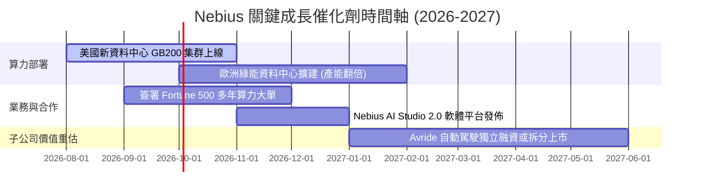

### 9.2 TAM 市場規模分析

```
╔══════════════════════════════════════════════════════════════════╗
║                AI 算力基礎設施 TAM 與 Nebius 滲透率              ║
╠══════════════════════════════════════════════════════════════════╣
║  2026 全球 AI 雲端算力 TAM： $120.0B                             ║
║  ██████████████████████████████████████████████████████████████  ║
║                                                                  ║
║  Nebius 2026E 目標營收： $1.51B (滲透率 ~1.25%)                  ║
║  ▓▓░░░░░░░░░░░░░░░░░░░░░░░░░░░░░░░░░░░░░░░░░░░░░░░░░░░░░░░░░░░░  ║
║                                                                  ║
║  2030 全球 AI 雲端算力 TAM： $450.0B (CAGR +30%)                 ║
║  Nebius 2030E 目標營收： $12.86B (目標滲透率 ~2.85%)             ║
╚══════════════════════════════════════════════════════════════════╝
```

### 9.3 成長驅動力結構圖

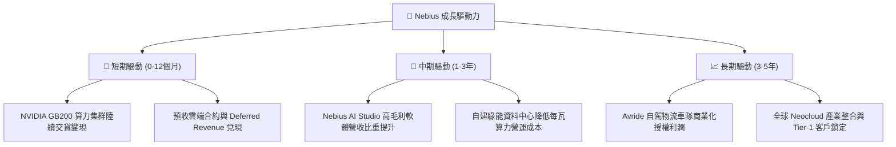

---

## 10. 風險矩陣

### 10.1 風險評分矩陣

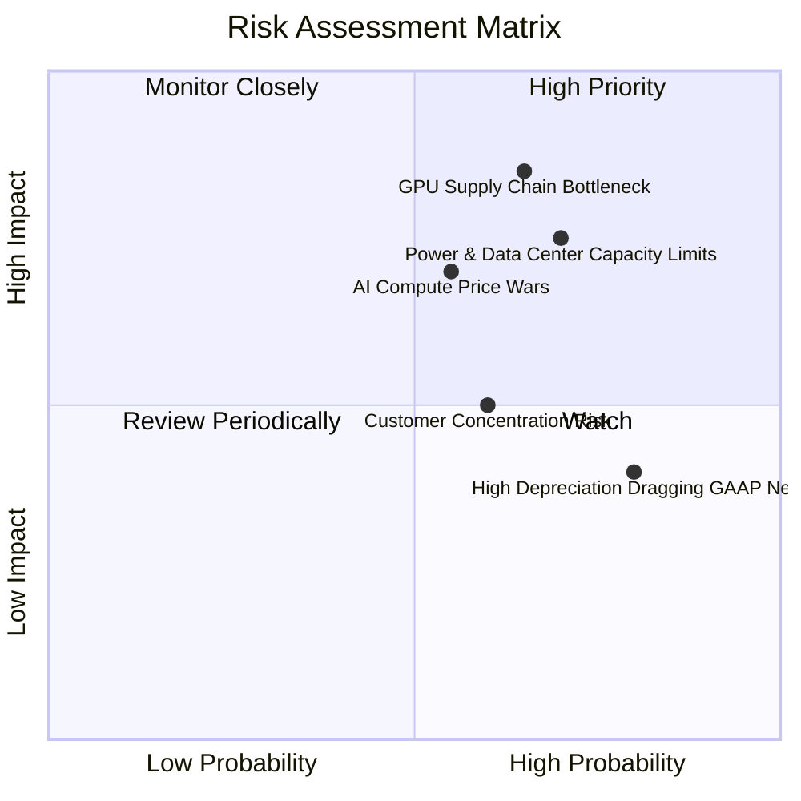

### 10.2 風險清單詳細分析

| # | 風險項目 | 發生機率 | 財務衝擊 | 風險評分 | 緩解措施 |
|---|----------|----------|----------|----------|----------|
| 1 | 🔴 **GPU 晶片供應鏈分配瓶頸** | 高 (65%) | 高 (-20% 營收) | 🔴 **8.2/10** | 與 NVIDIA 簽署 Tier-1 優先配貨條款，並分散採購 AMD / 特製晶片 |
| 2 | 🔴 **電力與機房基礎設施短缺** | 高 (70%) | 高 (-15% 產能) | 🔴 **7.8/10** | 直接於歐洲與美洲簽署長線綠能電力 PPA 採購協議 |
| 3 | 🟡 **AI 算力租賃降價競爭** | 中 (55%) | 中 (-10% 毛利) | 🟡 **6.5/10** | 發展 Nebius AI Studio 軟體生態，提高客戶轉換成本 |
| 4 | 🟡 **客戶集中度過高** | 中 (60%) | 中 (-12% 營收) | 🟡 **6.0/10** | 拓展企業級 Fortune 500 客戶，降低對單一 LLM 獨角獸依賴 |

---

## 11. 投資建議

### 11.1 最終綜合評級雷達圖

```
╔══════════════════════════════════════════════════════════════╗
║               Nebius Group 最終綜合評估雷達                   ║
╠══════════════════════════════════════════════════════════════╣
║  營收成長動能 (Growth)      9.5/10  ▓▓▓▓▓▓▓▓▓▓▓▓▓▓▓▓▓▓▓  🟢  ║
║  資產負債安全 (Balance)     8.5/10  ▓▓▓▓▓▓▓▓▓▓▓▓▓▓▓▓▓░░  🟢  ║
║  軟體與技術護城河 (Moat)    7.5/10  ▓▓▓▓▓▓▓▓▓▓▓▓▓▓▓░░░░  🟢  ║
║  獲利品質與現金流 (Profit)  6.5/10  ▓▓▓▓▓▓▓▓▓▓▓▓░░░░░░░  🟡  ║
║  估值安全邊際 (Valuation)   7.0/10  ▓▓▓▓▓▓▓▓▓▓▓▓▓░░░░░░  🟢  ║
╠══════════════════════════════════════════════════════════════╣
║  🏆 綜合投資評分： 7.6 / 10 ｜ 評級：🟢 買入 (Buy)           ║
╚══════════════════════════════════════════════════════════════╝
```

### 11.2 目標價與隱含報酬率

| 情境 | 機率權重 | 目標價 | 隱含報酬率 (相對現價 $190.41) | 投資動作 |
|------|----------|--------|--------------------------------|----------|
| 🔴 **悲觀情境** | 25% | **$148.50** | -22.01% | 觸發分批停損或避險 |
| 🟡 **基準情境** | **55%** | **$238.45** | **+25.23%** | **建立核心長線部位** |
| 🟢 **樂觀情境** | 20% | **$335.20** | **+76.04%** | 分批獲利結算 |

### 11.3 買入時機與觸發因素

```
╔══════════════════════════════════════════════════════════════════╗
║                  ✅ 買入觸發因素 Checklist                      ║
╠══════════════════════════════════════════════════════════════════╣
║  立即買入條件（目前已符合 3 項）：                               ║
║  ✅ 季度營收 QoQ 成長率 > 30%（最新一季達 75.2%）                 ║
║  ✅ 總現金儲備 > $8.0B（目前為 $9.30B，防禦力極佳）              ║
║  ✅ 股價回檔至加權合理價值之 20% 安全邊際內（現價 $190.41 ✅）   ║
║                                                                  ║
║  加碼觸發條件：                                                  ║
║  ☐ 季度營收突破 $500M 且 GAAP 營業虧損進一步收窄                 ║
║  ☐ 宣布取得大型 CSP / Fortune 100 公司多年期算力合約             ║
║                                                                  ║
║  減碼 / 停損觸發條件：                                           ║
║  ☐ 季度毛利率跌破 55.0%（代表算力價格戰全面爆發）                ║
║  ☐ 營業現金流 (OCF) 連續兩季轉負且現金消耗率過快                 ║
╚══════════════════════════════════════════════════════════════════╝
```

### 11.4 投資人適配度分析

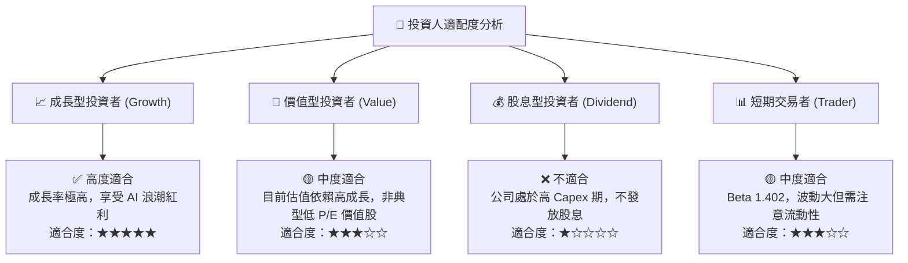

### 11.5 每季財報監控清單（Quarterly Watch List）

| 監控指標 | 最新數據 (Q1 2026) | 基準情境目標 (FY26E) | 減碼/警戒門檻 | 說明 |
|----------|-------------------|----------------------|---------------|------|
| **單季營收 ($M)** | $399.0M | > $450.0M / 季 | < $320.0M | 驗證算力機房上線進度 |
| **毛利率 (%)** | 73.98% | > 65.0% | < 55.0% | 觀察 AI 算力租賃單價變化 |
| **營業現金流 OCF ($M)** | $2,260M | > $500.0M / 季 | < $0.0M | 現金回收能力 |
| **Deferred Revenue ($M)**| $686.0M | > $800.0M | < $400.0M | 客戶預付意願與能見度 |
| **現金及等價物 ($B)** | $9.30B | > $6.0B | < $4.0B | 資本消耗速率 |

### 11.6 反面論證：什麼會證明論點錯誤（What Would Change My Mind）

```
╔══════════════════════════════════════════════════════════════════╗
║              ⚠️ 論點失效條件（Disconfirming Evidence）           ║
╠══════════════════════════════════════════════════════════════════╣
║  本投資論點在下列情況成立時應重新檢視或退場出局：                ║
║  ☐ 核心 AI 雲端營收 YoY 成長率連續兩季跌破 50.0%                 ║
║  ☐ 毛利率降至 50.0% 以下，顯示專業 Neocloud 無法抵禦降價壓力     ║
║  ☐ 資本支出 Capex 無法轉化為營收，使 ROIC 長期停留於 WACC (9.41%) 之下║
║  ☐ NVIDIA 改變銷售策略，直接直營算力租賃，大幅擠壓合作夥伴利潤   ║
║  ☐ 自由現金流持續大幅流出致使現金儲備降至 $3.0B 以下且融資受阻   ║
╚══════════════════════════════════════════════════════════════════╝
```

---

> **免責聲明**：本報告為 AI 自動生成，僅供研究參考，不構成投資建議。投資有風險，入市需謹慎。