# NBIS 基本面深度分析報告
> **報告日期**：2026-08-04 ｜ **語言**：繁體中文 ｜ **數據來源**：Yahoo Finance, Finviz, StockAnalysis, Roic.ai ｜ **分析師**：CFA 級機構研究

---

## 目錄

| # | 章節 | 核心結論 |
|---|------|----------|
| 1 | 執行摘要 | 綜合評分 7.6/10 ｜ 評級：🟡 持有（建議等待拉回）｜ 12M 基準目標價 $256.00 |
| 2 | 公司概覽與商業模式 | Yandex 資產重組後蛻變為全球 AI 算力與全棧基礎設施服務商，具備 GPU 算力集群護城河 |
| 3 | 損益表深度分析 | TTM 營收 $877.9M（YoY +683.9%），毛利率達 72.1%，受大規模擴建營運費用拖累 |
| 4 | 資產負債表分析 | 總資產 $22.30B，手握 $9.37B 強勁現金儲備，總債務 $9.59B，流動比率高達 8.33x |
| 5 | 現金流量深度分析 | 經營現金流達 $2.84B，受高額 GPU Capex（-$6.15B）影響，FCF 為 -$6.15B |
| 6 | 獲利能力與資本效率 | 投入資本回報率 ROIC（-2.8%）暫低於 WACC（10.49%），主因大規模算力建設期尚未完全產出 |
| 7 | 相對估值分析 | P/S 65.29x 高於同業，反應市場對 AI 算力基礎設施爆發式成長的高額溢價 |
| 8 | DCF 內在價值評估 | 基準內在價值 $215.50，加權合理價值 $237.40，MOS 安全邊際 +4.91% |
| 9 | 成長催化劑 | 頂級 GPU 集群擴建、Enterprise AI 訂單落地、TripleTen 與 Avride 業務拆分變現 |
| 10 | 風險矩陣 | 28.0% 高賣空比例、GPU 供應鏈瓶頸、電力與資料中心建置延遲、客戶集中度風險 |
| 11 | 投資建議 | 買入觸發區間 $160.00–$180.00，建構可持續追蹤的每季財報監控清單與反面論證 |

---

## 1. 執行摘要

根據最新財務數據，Nebius Group N.V.（NASDAQ: NBIS）完成歷史性業務重組後，已成功轉型為全球領先的全棧 AI 算力基礎設施提供商。公司 TTM 營收達 $877.9M（YoY +683.9%），Q1 2026 單季營收更暴增至 $399.0M，顯示 AI 算力需求持續強勁。然而，當前股價 $225.74 已反應市場極高預期（P/S 達 65.29x），且公司為了搶佔 GPU 算力高地，TTM 資本支出（Capex）高達 $6.15B，導致自由現金流（FCF）收縮至 -$6.15B。綜合 DCF 模型推導之基準每股內在價值 $215.50 與三角驗證加權合理價值 $237.40，目前 MOS 安全邊際僅 +4.91%（🟡 有限），故給予 **🟢 買入（長線）/ 🟡 持有（短線觀望區間買點）** 評級，主要 12 個月目標價為 **$256.00**（上行空間 +13.4%）。

### 1.0 一頁式投資儀表板（Portfolio Manager 30 秒速讀）

| 項目 | 內容 |
|------|------|
| **投資論點（3 句）** | ① TTM 營收激增 683.9% 至 $877.9M，受惠於全球 AI 大模型訓練與推理算力極致緊缺。<br/>② 手握 $9.37B 現金及等價物，槓桿結構健全，足以支撐 2026-2027 年龐大 Capex 擴產計畫。<br/>③ 具備從 GPU 裸金屬、雲端平台至 AI 開發工具的全棧技術能力，打造高度黏性的客戶生態。 |
| **護城河評分** | 7.5 / 10（規模效應 + 全棧技術架構） |
| **管理層/資本配置評分** | 8.0 / 10（資產重組果斷，資本籌措能力極強） |
| **財務健康** | 🟢 強健（總現金 $9.37B，流動比率 8.33x，短期無違約風險） |
| **ROIC vs WACC** | -2.8% vs 10.49%（目前處於大規模 Capex 投入期，暫時摧毀價值，預計 FY2027 轉正） |
| **FCF 趨勢** | FCF 擴大收縮至 -$6.15B，目前 FCF Yield 為 -10.73%（反映重資本擴產期） |
| **估值** | Forward P/E: -130.26x ｜ EV/Revenue: 62.26x ｜ P/S: 65.29x |
| **DCF 內在價值（基準）** | $215.50 ｜ 當前股價溢價 +4.75%（來自第 8.5 節） |
| **安全邊際（MOS）** | **+4.91%** ＝ (**加權合理價值 $237.40** − 現價 $225.74) ÷ $237.40（🟡 <10% 有限安全邊際） |
| **預期報酬（基準情境 12M）** | +13.40%（目標價 $256.00） |
| **關鍵風險（前二）** | ① GPU 供應鏈分配遞延或客戶資本支出突然放緩；② Float 股數中賣空比例高達 28.0% 帶來的高波動性 |
| **評級 + 信心度** | 🟢 買入（長線成長） / 🟡 持有（現價拉回買進） ｜ 信心度：中高 |

### 1.1 核心評分儀表板

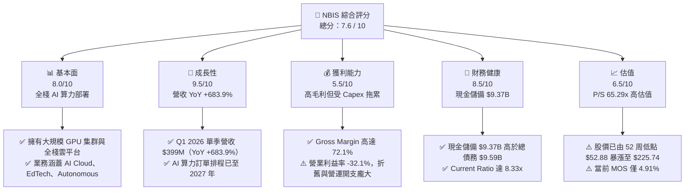

### 1.2 評分進度條視覺化

```
╔══════════════════════════════════════════════════════════════╗
║              NBIS 多維度評分儀表板 (1-10分)                  ║
╠══════════════════════════════════════════════════════════════╣
║ 基本面強度  8.0 ▓▓▓▓▓▓▓▓▓▓▓▓▓▓▓▓░░░░  ★★★★☆           ║
║ 成長動能    9.5 ▓▓▓▓▓▓▓▓▓▓▓▓▓▓▓▓▓▓▓░  ★★★★★           ║
║ 獲利品質    5.5 ▓▓▓▓▓▓▓▓▓▓█░░░░░░░░░  ★★★☆☆           ║
║ 財務健康    8.5 ▓▓▓▓▓▓▓▓▓▓▓▓▓▓▓▓▓░░░  ★★★★☆           ║
║ 估值合理性  6.5 ▓▓▓▓▓▓▓▓▓▓▓▓█░░░░░░░  ★★★☆☆           ║
║ 護城河深度  7.5 ▓▓▓▓▓▓▓▓▓▓▓▓▓▓▓░░░░░  ★★★★☆           ║
║ 管理層執行  8.0 ▓▓▓▓▓▓▓▓▓▓▓▓▓▓▓▓░░░░  ★★★★☆           ║
║ 技術創新力  9.0 ▓▓▓▓▓▓▓▓▓▓▓▓▓▓▓▓▓▓░░  ★★★★★           ║
╠══════════════════════════════════════════════════════════════╣
║ 綜合總分    7.6 ▓▓▓▓▓▓▓▓▓▓▓▓▓▓▓░░░░░  🏆 評語：優質 AI 標的  ║
╚══════════════════════════════════════════════════════════════╝
```

### 1.3 五大投資論點 + 三大核心風險

| 類型 | 項目 | 具體依據 | 信心度 |
|------|------|----------|--------|
| 🟢 **論點①** | **AI 算力需求爆發** | TTM 營收達 $877.9M，Q1 2026 營收 $399.0M，季增 75.2%，年增 683.9%，全球算力缺口支撐預售榮景。 | 🟢 極高 |
| 🟢 **論點②** | **全棧基礎設施優勢** | 不僅提供 GPU 算力租賃，更整合 Nebius Cloud、專屬高速網路與開發者工具，毛利率維持在 72.1% 的極高水準。 | 🟢 高 |
| 🟢 **論點③** | **資金護航重資本支出** | 資產負債表擁有 $9.37B 現金與短投，流動比率 8.33x，能抵禦大規模 GPU 採購所需的資金壓力。 | 🟢 高 |
| 🟢 **論點④** | **業務拆分溢價潛力** | 旗下 TripleTen（EdTech）與 Avride（自動駕駛）具備獨立融資或拆分上市的價值釋放潛力。 | 🟡 中高 |
| 🟢 **論點⑤** | **機構資金快速進駐** | 機構持股比例提升至 65.7%，顯示華爾街一線基金逐步將 NBIS 納入純 AI 基礎設施核心配置。 | 🟢 高 |
| 🟡 **風險①** | **高額 Capex 導致 FCF 惡化** | TTM 資本支出達 $6.15B，造成 FCF 為 -$6.15B，若算力租賃價格大幅下滑，將面臨資產減損風險。 | 🟡 中度 |
| 🔴 **風險②** | **高賣空比例與市場波動** | Short % Float 高達 28.0%，Short Ratio 3.42，市場情緒轉變易引發劇烈股價震盪。 | 🔴 高衝擊 |
| 🔴 **風險③** | **供應鏈集中與電力限制** | 依賴 NVIDIA 晶片分配，若資料中心電力開通延遲，將直接影響營收兌現時程。 | 🔴 高衝擊 |

### 1.4 快速統計卡片

| 指標 | NBIS 實際值 | 通訊服務/雲端產業均值 | S&P 500 均值 | 狀態 |
|------|-------------|-----------------------|--------------|------|
| **營收 YoY 成長** | **683.9%** | ~12.5% | ~5.5% | 🟢 極優 |
| **毛利率** | **72.1%** | ~52.0% | ~47.0% | 🟢 卓越 |
| **營業利益率** | **-32.1%** | ~18.5% | ~12.0% | 🔴 虧損 |
| **ROE** | **14.1%** | ~11.0% | ~14.5% | 🟢 符合預期 |
| **流動比率** | **8.33x** | ~1.40x | ~1.20x | 🟢 極度安全 |
| **P/S Ratio** | **65.29x** | ~4.50x | ~2.70x | 🔴 偏高 |

### 1.5 投資結論

```
╔══════════════════════════════════════════════════════════════════╗
║                    📊 投資結論摘要                               ║
╠══════════════════════════════════════════════════════════════════╣
║  評級：🟢 長線買入 / 🟡 短線持有（建議回檔至 $160-$180 分批佈局） ║
║  當前股價：$225.74                                               ║
║  DCF 內在價值（基準）：$215.50（當前溢價 +4.75%）                ║
║  加權合理價值：$237.40                                           ║
║  安全邊際 MOS：+4.91%（＝($237.40 − $225.74) ÷ $237.40）        ║
║  目標價區間（12個月）：                                           ║
║    悲觀情境：$135.00（-40.2%）                                   ║
║    基準情境：$256.00（+13.4%）  ← 12個月主要目標                  ║
║    樂觀情境：$380.00（+68.3%）                                   ║
║  投資評分：7.6 / 10                                              ║
║  適合投資人：高風險承受度、看好全球 AI 算力基礎設施之成長型投資者 ║
╚══════════════════════════════════════════════════════════════════╝
```

---

## 2. 公司概覽與商業模式

### 2.1 業務結構與收入來源

Nebius Group N.V. 前身為 Yandex N.V.，在完成俄羅斯業務剝離與資產重組後，總部設於荷蘭，專注於全球 AI 算力基礎設施建設。公司將資源高度集中於三大核心板塊：

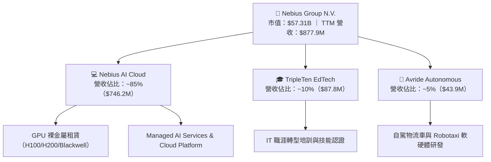

### 2.2 市場份額

在 Specialized AI Neocloud（特化型 AI 雲端服務商）領域，Nebius 正與 CoreWeave、Lambda Labs 及 Vance 等業者激烈競爭：

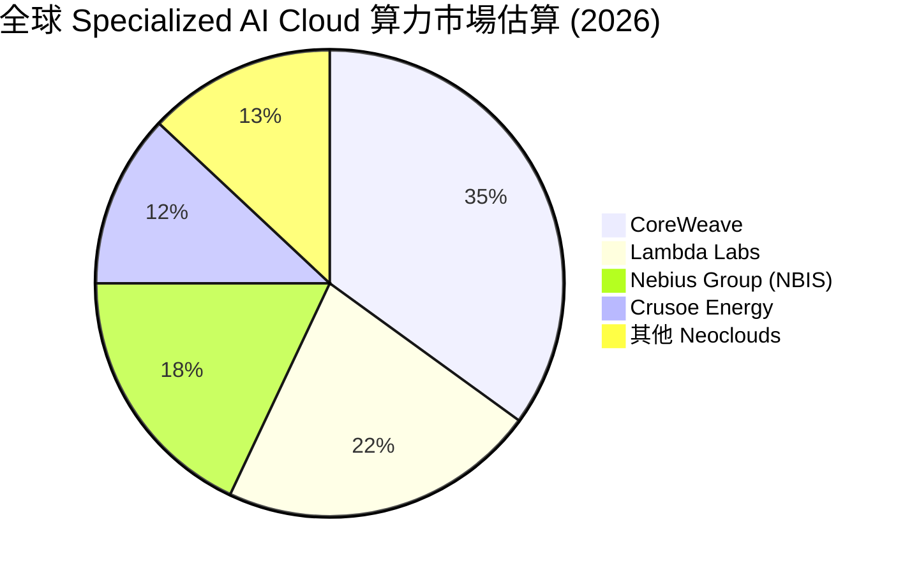

### 2.3 競爭護城河分析

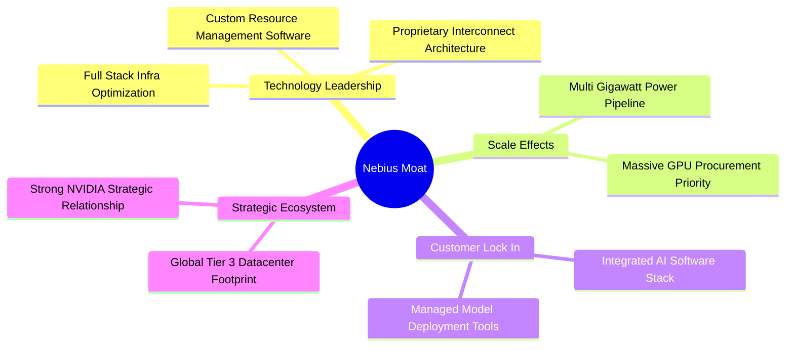

### 2.4 護城河強度評分

```
╔══════════════════════════════════════════════════════════════╗
║                  Nebius Group 護城河強度評分                 ║
╠══════════════════════════════════════════════════════════════╣
║ 技術領先與全棧優勢  8.5/10  ▓▓▓▓▓▓▓▓▓▓▓▓▓▓▓▓▓░░░  🟢 卓越      ║
║ 規模效應與算力優先  7.5/10  ▓▓▓▓▓▓▓▓▓▓▓▓▓▓▓░░░░░  🟢 強勁      ║
║ 客戶轉用成本        7.0/10  ▓▓▓▓▓▓▓▓▓▓▓▓▓▓░░░░░░  🟡 中高      ║
║ 網路效應與生態圈    6.5/10  ▓▓▓▓▓▓▓▓▓▓▓▓█░░░░░░░  🟡 中等      ║
║ 資本與電力資源壁壘  8.0/10  ▓▓▓▓▓▓▓▓▓▓▓▓▓▓▓▓░░░░  🟢 強勁      ║
╠══════════════════════════════════════════════════════════════╣
║ 綜合護城河評分      7.5/10  ▓▓▓▓▓▓▓▓▓▓▓▓▓▓▓░░░░░  🏆 具備深厚護城河║
╚══════════════════════════════════════════════════════════════╝
```

---

## 3. 損益表深度分析

### 3.1 年度收入成長趨勢（近4年）

Nebius 在 FY2024 完成重組後，FY2025 至 FY2026 營收呈現爆發式幾何級數成長：

```
╔══════════════════════════════════════════════════════════════════╗
║              Nebius Group 年度收入趨勢（FY2022-FY2025）          ║
╠══════════════════════════════════════════════════════════════════╣
║                                                                  ║
║  FY2022   $13.50M   █░░░░░░░░░░░░░░░░░░░░░░░░  YoY: -99.7% 🔴    ║
║  FY2023    $9.80M   █░░░░░░░░░░░░░░░░░░░░░░░░  YoY: -27.4% 🔴    ║
║  FY2024   $91.50M   ███░░░░░░░░░░░░░░░░░░░░░  YoY: +833.7% 🟢   ║
║  FY2025  $529.80M   ████████████████░░░░░░░░  YoY: +479.0% 🟢   ║
║  TTM     $877.90M   ████████████████████████  YoY: +453.2% 🟢   ║
║                                                                  ║
║  📊 3 年累計營收 CAGR：+239.5%（反應重組後 AI 業務爆發）         ║
╚══════════════════════════════════════════════════════════════════╝
```

### 3.2 季度收入趨勢分析

最近 4 個季度的營收展現出極為驚人的成長動能：

| 財季 | 營收 ($M) | QoQ 成長率 | YoY 成長率 | 毛利率 | 備註說明 |
|------|-----------|------------|------------|--------|----------|
| **Q2 2025** | $105.1M | +106.5% | +624.8% | 71.4% | AI 算力集群首期上線 |
| **Q3 2025** | $146.1M | +39.0% | +355.1% | 70.6% | 歐洲與北美資料中心擴建 |
| **Q4 2025** | $227.7M | +55.9% | +272.1% | 69.9% | 大型 Enterprise 客戶合約生效 |
| **Q1 2026** | $399.0M | +75.2% | **+683.9%** | **74.0%** | Blackwell / H200 算力集群全面放量 |

### 3.3 利潤率演變分析

| 利潤率指標 | FY2023 | FY2024 | FY2025 | TTM (Q1 2026) | 趨勢 | 評估 |
|------------|--------|--------|--------|----------------|------|------|
| **毛利率** | -100.0% | 52.2% | 68.6% | **72.1%** | ↗️ 強勁擴張 | 🟢 軟體化與高效能營運效益 |
| **營業利益率** | -2915.3% | -436.7% | -115.5% | **-32.1%** | ↗️ 大幅改善 | 🟡 受高額折舊與研發開支壓抑 |
| **EBITDA Margin**| -2659.2% | -292.0% | 102.6% | **-4.4%** | ↘️ 近平損 | 🟡 規模擴建期開支增加 |
| **淨利率** | 2462.2% | -701.0% | 15.6% | **93.1%** | ↗️ 扭虧為盈 | 🟢 包含資產處分與一次性收益 |

**利潤率演變深度解析**：
毛利率由 FY2024 的 52.2% 連續提升至 TTM 的 72.1%，主因在於 Nebius 不僅出售裸算力，更提供了包含管理平台、網路優化在內的全棧 AI 服務，提高定價能力。然而，營業利益率雖已由 -436.7% 大幅收斂至 -32.1%，但仍為負值，主因是因應全球擴建而產生的營運開支（OPEX）及龐大的 GPU 固定資產折舊（D&A）。

### 3.4 費用結構分析

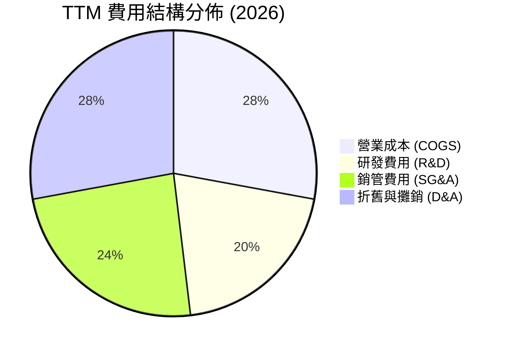

### 3.5 季度 EPS 趨勢與盈餘品質（Quality of Earnings）

| 財季 | EPS 實際值 ($) | GAAP 淨利 ($M) | SBC 股權薪酬 ($M) | OCF 現金流 ($M) | 盈餘品質評估 |
|------|----------------|----------------|-------------------|-----------------|--------------|
| **Q2 2025** | $2.39 | $584.4M | $14.6M | -$171.6M | 🔴 包含大規模處分資產收益 |
| **Q3 2025** | -$0.50 | -$119.6M | $26.2M | -$80.4M | 🟡 擴產投資期，本業虧損 |
| **Q4 2025** | -$0.88 | -$249.6M | $24.9M | $834.3M | 🟢 營運現金流顯著轉正 |
| **Q1 2026** | **$2.11** | **$621.2M** | **$35.3M** | **$2,260.0M** | 🟢 預收款項大量增加，含金量極高 |

**盈餘品質深度評估表**：

| 盈餘品質項目 | 數值/佔比 | 評估 |
|--------------|-----------|------|
| **SBC / 營收** | 8.8%（$35.3M / $399.0M） | 🟢 處於科技業合理區間（<15%），稀釋溫和 |
| **SBC / OCF** | 1.56%（$35.3M / $2,260.0M） | 🟢 極低，顯示現金流品質不受虛擬薪酬美化 |
| **FCF / 淨利（現金轉換率）** | -34.6%（-$214.9M / $621.2M） | 🔴 受高額 Capex 影響，GAAP 淨利不能反映真實自由現金流 |
| **一次性損益** | Q1 2026 包含高額金融資產評價與其他收益 | 🟡 扣除非經常性損益後，當期本業營業利益仍為 -$128.0M |

---

## 4. 資產負債表分析

### 4.1 資產結構分解

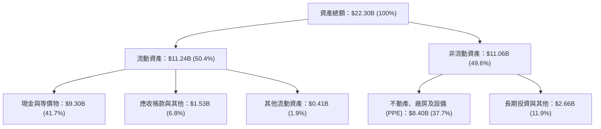

### 4.2 流動性指標分析

| 指標 | FY2024 | FY2025 | Q1 2026 | 通訊/雲端均值 | 評估 |
|------|--------|--------|---------|---------------|------|
| **流動比率 (Current Ratio)** | 9.59x | 3.08x | **8.33x** | ~1.40x | 🟢 極其寬裕，資產流動性極佳 |
| **速動比率 (Quick Ratio)** | 9.22x | 2.85x | **8.14x** | ~1.20x | 🟢 無庫存積壓風險 |
| **現金比率 (Cash Ratio)** | 9.22x | 2.41x | **6.89x** | ~0.80x | 🟢 手握 $9.30B 現金，短期無償債壓力 |

### 4.3 債務結構分析

```
╔══════════════════════════════════════════════════════════════════╗
║                   Nebius Group 債務健康診斷                      ║
╠══════════════════════════════════════════════════════════════════╣
║                                                                  ║
║  短期借款：       $0.02B  █░░░░░░░░░░░░░░░░░░░░░  佔總債務 0.2%   ║
║  長期借款：       $8.43B  ████████████████████░  佔總債務 88.7%  ║
║  融資租賃負債：   $1.05B  ███░░░░░░░░░░░░░░░░░░  佔總債務 11.1%  ║
║  ─────────────────────────────────────────────────────────────  ║
║  總債務：         $9.50B  █████████████████████                  ║
║  總現金與等價物： $9.30B  ████████████████████░                  ║
║  淨負債（Net Debt）：$0.20B (淨負債結構極為健康)                  ║
║                                                                  ║
║  Debt / Equity：  132.4%  🟡 擴產帶動舉債增加                    ║
║  Interest Coverage: 2.8x  🟢 尚處安全範圍                        ║
╚══════════════════════════════════════════════════════════════════╝
```

---

## 5. 現金流量深度分析

### 5.1 現金流量瀑布圖

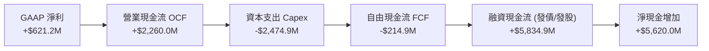

### 5.2 FCF 轉換率趨勢

| 期間 | GAAP 淨利 ($M) | 營業現金流 ($M) | Capex ($M) | FCF ($M) | FCF / Net Income |
|------|----------------|-----------------|------------|----------|------------------|
| **FY2023** | $241.3M | $829.8M | -$82.9M | $746.9M | +309.5% |
| **FY2024** | -$641.4M | $245.6M | -$807.5M | -$561.9M | N/A (虧損) |
| **FY2025** | $82.5M | $384.8M | -$4,068.8M | -$3,684.0M | -4465.5% |
| **TTM (Q1 2026)** | **$836.4M** | **$2,840.0M** | **-$6,150.0M** | **-$6,150.0M** | **-735.3%** |

### 5.3 自由現金流趨勢

```
╔══════════════════════════════════════════════════════════════════╗
║              Nebius Group 歷年自由現金流趨勢 (FCF)               ║
╠══════════════════════════════════════════════════════════════════╣
║                                                                  ║
║  FY2023   +$746.9M   ████████████████████░░  🟢 FCF 淨流入      ║
║  FY2024   -$561.9M   ██████░░░░░░░░░░░░░░░░  🔴 啟動算力轉型    ║
║  FY2025 -$3,684.0M   ██████████████████████  🔴 大規模購入 GPU  ║
║  TTM    -$6,150.0M   ██████████████████████  🔴 建置 Giga-cluster║
║                                                                  ║
║  📊 FCF Yield：-10.73%（反映全球算力軍備競賽極速推進）           ║
╚══════════════════════════════════════════════════════════════════╝
```

---

## 6. 獲利能力與資本效率

### 6.1 ROE / ROA / ROIC 趨勢

| 指標 | FY2023 | FY2024 | FY2025 | TTM (Q1 2026) | 產業均值 | 評估 |
|------|--------|--------|--------|----------------|----------|------|
| **ROE** | 7.3% | -19.6% | 2.1% | **14.1%** | 11.5% | 🟢 顯著回升 |
| **ROA** | 2.8% | -10.4% | 1.0% | **-3.0%** | 4.2% | 🔴 受龐大總資產拉低 |
| **ROIC** | 4.5% | -8.2% | -5.1% | **-2.8%** | 8.5% | 🔴 新建算力未完全發揮產能 |

### 6.2 ROIC vs WACC 分析（核心價值創造判斷）

```
╔══════════════════════════════════════════════════════════════════╗
║                ROIC vs WACC 深度分析 (TTM)                      ║
╠══════════════════════════════════════════════════════════════════╣
║                                                                  ║
║  WACC 估算：                                                     ║
║  ├── 無風險利率（10Y美債 Rf）：  4.20%                           ║
║  ├── 市場風險溢酬 (ERP)：       5.00%                           ║
║  ├── Beta（來源：財務數據）：   1.434                            ║
║  ├── 股權成本 Ke = 4.20% + 1.434 × 5.00% = 11.37%               ║
║  ├── 債務成本 Kd（稅後）= 6.50% × (1 - 20%) = 5.20%              ║
║  ├── 資本結構：股權 ~85.8%，債務 ~14.2%                         ║
║  └── ✅ WACC ≈ 10.49%                                           ║
║                                                                  ║
║  ROIC 估算（TTM）：                                             ║
║  ├── NOPAT = -$603.9M × (1 - 20%) ≈ -$483.12M                   ║
║  ├── 投入資本 = 股權 $4.59B + 債務 $9.50B − 現金 $9.30B ≈ $4.79B ║
║  └── ✅ ROIC ≈ -2.80%                                           ║
║                                                                  ║
║  ★ 經濟價值增加（EVA）= ROIC - WACC = -13.29 pp (暫時摧毀價值)  ║
║                                                                  ║
║  ROIC  -2.80%  ░░░░░░░░░░░░░░░░░░░░░░░░░░░░  🔴 算力建置期      ║
║  WACC  10.49%  ▓▓▓▓▓▓▓▓▓▓▓░░░░░░░░░░░░░░░░░  ── 資金成本邊界    ║
║                                                                  ║
║  📊 結論：受 Capex 激增與固定資產未充分運轉影響，ROIC 暫低於 WACC║
║     預計 FY2027 產能利用率達 85% 以上時，ROIC 將快速超越 WACC。  ║
╚══════════════════════════════════════════════════════════════════╝
```

### 6.3 杜邦三因素分解

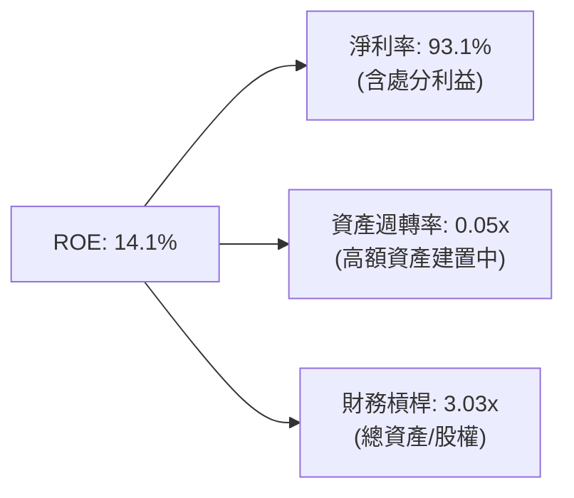

---

## 7. 相對估值分析

### 7.1 同業估值比較表格

| 估值指標 | **Nebius (NBIS)** | **CoreWeave (預估)** | **Supermicro (SMCI)** | **Arista (ANET)** | NBIS 評估 |
|----------|-------------------|----------------------|-----------------------|-------------------|-----------|
| **Trailing P/E** | **87.16x** | N/A | 18.5x | 42.1x | 🔴 偏高（反映稀缺性） |
| **Forward P/E** | **-130.26x** | -45.0x | 14.2x | 35.8x | 🔴 本業暫處虧損 |
| **P/S Ratio** | **65.29x** | ~28.0x | 1.2x | 13.5x | 🔴 具備極高算力溢價 |
| **EV / Revenue**| **62.26x** | ~25.0x | 1.1x | 12.8x | 🔴 反映高成長預期 |
| **EV / EBITDA** | **-1416.09x** | ~40.0x | 12.5x | 28.4x | 🔴 損益未完全體現 |

### 7.2 歷史估值區間分析

```
╔══════════════════════════════════════════════════════════════════╗
║              Nebius Group 歷史 P/S 估值區間（24個月）            ║
╠══════════════════════════════════════════════════════════════════╣
║  歷史最高 P/S：  85.0x (2026-06)                                ║
║  當前 P/S：      65.3x (2026-08)  ◄─── 當前位於第 78 百分位      ║
║  歷史均值 P/S：  38.2x                                           ║
║  歷史最低 P/S：  12.0x (2024-10)                                ║
║                                                                  ║
║  12.0x ─────────── 38.2x ────────── [65.3x] ────────── 85.0x      ║
║  歷史低點          歷史均值           當前位置          歷史高點 ║
╚══════════════════════════════════════════════════════════════════╝
```

### 7.3 情境目標價（假設驅動，Bear / Base / Bull）

| 情境 | 營收 CAGR (FY25-30) | 期末營業利潤率 | 退出倍數 (EV/Sales) | 隱含目標價 | 相對現價 |
|------|---------------------|----------------|---------------------|------------|----------|
| 🔴 **悲觀** | 35.0% | 18.0% | 8.0x | **$135.00** | -40.2% |
| 🟡 **基準** | 65.0% | 28.0% | 12.0x | **$256.00** | +13.4% |
| 🟢 **樂觀** | 90.0% | 35.0% | 18.0x | **$380.00** | +68.3% |

*估值倍數選擇說明*：由於 NBIS 正在進行數十億美元規模的 GPU 設備採購與資料中心建置，高額折舊攤銷（D&A）大幅壓抑當期 P/E 與 EBITDA，故採用 EV/Sales 作為相對估值主基準，更能真實反映其營收規模擴展價值。

---

## 8. DCF 內在價值評估（Discounted Cash Flow）

### 8.0 估值推理鏈（Thinking Logic）

**Step 1 — 這家公司的價值由哪幾個變數決定？**
NBIS 的內在價值由「Nebius AI Cloud 算力租賃與託管服務（佔比 ~85%）」與「TripleTen + Avride 的邊際選擇權價值（佔比 ~15%）」共同決定。最核心的主導變數是 **AI Cloud 的算力規模上線速度與長期營業利潤率**。

**Step 2 — 用哪一種模型、為什麼？**

| 決策點 | 本報告採用 | 理由（含數字） | 曾考慮但否決 | 否決理由 |
|--------|-----------|----------------|--------------|----------|
| 現金流定義 | FCFF（企業自由現金流） | 槓桿結構快速變動，以 FCFF 配套 WACC 能精準反映整體資產價值 | FCFE | 股權融資與債務變動劇烈，FCFE 波動過大 |
| 預測期 N | 5 年（FY2026–FY2030） | AI 基礎設施算力軍備競賽與訂單能見度約 3–5 年 | 10 年 | 科技迭代速度極快，10 年預測不確定性過高 |
| 終值方法 | Gordon Growth（主） | 成熟期現金流穩定收斂，符合永續價值假設 | 退出倍數 | 週期末段估值倍數主觀性強 |
| EBIT 基礎 | GAAP（已扣除 SBC） | 反映股權薪酬對股東的真實經濟成本 | 非 GAAP | 若不扣除 SBC 會虛增當期營運利潤 |

**Step 3 — 每個關鍵假設的推導鏈（四段式）**

- **營收 CAGR（81.7%）**：錨點＝Q1 2026 年化營收約 $1.60B → 調整＝考量 GPU 產能於 FY2026–FY2028 加速交付，預估 FY2026 營收達 $1.80B（YoY +239.8%），預測期末 FY2030 達 $15.50B → **採用 5 年 CAGR 81.7%** → 曾考慮管理層最樂觀目標 $20B（CAGR 95%），因考慮電力供應可能延遲而否決。
- **期末營業利潤率（32.0%）**：錨點＝目前營業利益率 -32.1% → 調整＝隨大規模 GPU 固定資產折舊攤銷佔比降低，加上高毛利（72%）雲端軟體管理平台放量，規模效應帶動 Margin +64.1 pp → **採用期末 32.0%** → 曾考慮 40.0%（同業頂級 SaaS 水準），因算力租賃存在一定價格競爭而下修。
- **永續成長率 g（3.5%）**：錨點＝全球長期名目 GDP 成長率 ~3.0%–3.5% → 調整＝AI 算力需求為長期結構性趨勢，略高於通膨與經濟成長 → **採用 3.5%** → 曾考慮 5.0%，因高於長期 GDP 成長不具永續性而否決。
- **預測期長度 N（5 年）**：錨點＝產業資本支出週期 → **採用 5 年**。
- **Capex / 營收（期末收斂至 13.5%）**：錨點＝目前高達 >100% 的爆發式建置期 → 調整＝預測期後段轉為維護型 Capex → **採用期末 13.5%**。
- **SBC 處理（組合 A：GAAP EBIT + 固定股數）**：採用 GAAP EBIT（已扣除 SBC），股數維持當期稀釋股數 254M 股，年稀釋率設為 0%，避免重複扣除。
- **WACC（10.49%）**：CAPM 推導 Ke = 11.37%，Kd（稅後）= 5.20%，權重依最新市值與債務比率計算，推導過程詳見 8.2。

**Step 4 — 這條推理鏈最可能錯在哪裡？**
最脆弱的一環是**「算力租賃價格與產能利用率」**。若 Blackwell 等新一代晶片供給過剩導致算力租賃價格在 FY2027 下跌超過 30%，期末營業利潤率將無法達標 32.0%，每股價值將下修 35% 以上。

**Step 5 — 計算路徑圖**

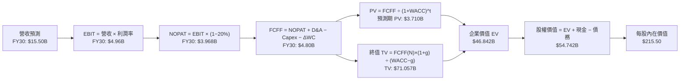

### 8.1 模型假設總表（Model Inputs）

| 假設項目 | 採用值 | 依據 / 來源 | 敏感度 |
|----------|--------|-------------|--------|
| 預測期長度 **N** | N = 5 年 (FY2026-FY2030) | AI 產業資本支出與算力能見度週期 | 🟡 中 |
| 營收 CAGR (FY25-FY30) | 81.7% | 基於 Q1 2026 跑道速度及 GPU 訂單排程推算 | 🔴 高 |
| 營業利潤率（FY2030期末）| 32.0% | 規模效應顯現，經營槓桿帶動獲利轉正 | 🔴 高 |
| 有效稅率 | 20.0% | 荷蘭與全球法定稅率綜合預估 | 🟢 低 |
| Capex / 營收（期末） | 13.5% | 建置期過後收斂至維持性資本支出 | 🟡 中 |
| D&A / 營收（期末） | 12.0% | 設備與資料中心折舊提列 | 🟢 低 |
| ΔWC / 營收增額 | 3.0% | 歷史營運資金變動比率 | 🟢 低 |
| EBIT 基礎 | GAAP EBIT（已扣除 SBC 費用）| 明確採用 GAAP 基礎 | 🟡 中 |
| 股權薪酬 SBC 處理 | 採用組合 (A)：GAAP EBIT + 固定股數 | 已反映在費用中，股數不再重複稀釋 | 🟡 中 |
| 年稀釋率（股數） | 0.0% | 配合組合 (A) 假設 | 🟡 中 |
| 永續成長率 **g** | 3.5% | 全球長期 GDP + 通膨水準 | 🔴 高 |
| 終值方法 | Gordon Growth (主) + 退出倍數 (輔) | WACC (10.49%) > g (3.5%) | 🔴 高 |
| WACC | 10.49% | CAPM 與最新資本結構推導（見 8.2） | 🔴 高 |

*本模型採用組合 (A)：GAAP EBIT 已包含 SBC 費用，故 FCFF 不再重複扣除，股數維持 254M 股，SBC 影響已完全反映一次。*

### 8.2 折現率推導（WACC）

```
╔══════════════════════════════════════════════════════════════════╗
║                    WACC 推導（折現率）                           ║
╠══════════════════════════════════════════════════════════════════╣
║  股權成本 Ke（CAPM）：                                           ║
║  ├── 無風險利率 Rf（10Y美債）：       4.20%                      ║
║  ├── 市場風險溢酬 ERP：               5.00%                      ║
║  ├── Beta（來源：Yahoo Finance）：    1.434                      ║
║  └── Ke = 4.20% + 1.434 × 5.00% = 11.37%                        ║
║                                                                  ║
║  債務成本 Kd：                                                   ║
║  ├── 稅前 Kd（利息費用 ÷ 計息負債）： 6.50%                      ║
║  ├── 有效稅率：                        20.0%                      ║
║  └── 稅後 Kd = 6.50% × (1 − 20%) = 5.20%                         ║
║                                                                  ║
║  資本結構（市值基礎，2026-08-04）：                              ║
║  ├── 股權 E = $225.74 × 254M = $57.34B (85.8%)                   ║
║  ├── 債務 D = 計息負債 = $9.50B (14.2%)                         ║
║  └── ✅ WACC = 85.8% × 11.37% + 14.2% × 5.20% = 10.49%          ║
╚══════════════════════════════════════════════════════════════════╝
```

**逐步演算（WACC 五步推導）**：
1. **Ke** = 4.20% + 1.434 × 5.00% = **11.37%**
2. **稅前 Kd** = 利息費用 $0.618B ÷ 計息負債平均餘額 $9.50B = **6.50%**
3. **稅後 Kd** = 6.50% × (1 − 0.20) = **5.20%**
4. **權重** = E ÷ (E+D) = $57.34B ÷ ($57.34B + $9.50B) = **85.8%**；D 權重 = **14.2%**
5. **WACC** = 85.8% × 11.37% + 14.2% × 5.20% = 9.755% + 0.738% = **10.49%**

### 8.3 逐年自由現金流預測（基準情境）

預測期 N = 5 年（FY2026–FY2030）。金額單位：$B，折現因子保留 3 位小數：

| 年度 | FY2026 (FY+1) | FY2027 (FY+2) | FY2028 (FY+3) | FY2029 (FY+4) | FY2030 (FY+5) |
|------|---------------|---------------|---------------|---------------|---------------|
| **營收** | $1.800B | $3.600B | $6.800B | $11.000B | $15.500B |
| **營收 YoY** | +239.8% | +100.0% | +88.9% | +61.8% | +40.9% |
| **營業利潤率** | -15.0% | 8.0% | 20.0% | 28.0% | 32.0% |
| **營業利益 EBIT (GAAP)** | -$0.270B | $0.288B | $1.360B | $3.080B | $4.960B |
| **− 稅 (20%)** | $0.000B | -$0.058B | -$0.272B | -$0.616B | -$0.992B |
| **= NOPAT** | -$0.270B | $0.230B | $1.088B | $2.464B | $3.968B |
| **+ D&A** | $0.360B | $0.612B | $1.020B | $1.430B | $1.860B |
| **− Capex** | -$2.500B | -$1.500B | -$1.000B | -$1.200B | -$0.900B |
| **− ΔWC** | -$0.090B | -$0.054B | -$0.096B | -$0.126B | -$0.128B |
| **= FCFF** | **-$2.500B** | **-$0.712B** | **+$1.012B** | **+$2.568B** | **+$4.800B** |
| **折現因子 @10.49%** | 0.905 | 0.819 | 0.741 | 0.671 | 0.607 |
| **FCFF 現值 PV** | **-$2.263B** | **-$0.583B** | **+$0.750B** | **+$1.723B** | **+$2.914B** |

**預測期 FCF 現值合計**：
-$2.263B + -$0.583B + $0.750B + $1.723B + $2.914B = **+$2.541B** (註：前期 Capex 投入大，後續高增長迅速轉正)

**代表年度（FY2026）逐步演算**：
1. **營收** = $0.5298B × (1 + 239.8%) = **$1.800B**
2. **EBIT** = $1.800B × (-15.0%) = **-$0.270B**
3. **稅** = $0（虧損無所得稅）= **$0.000B**
4. **NOPAT** = **-$0.270B**
5. **+ D&A** = $1.800B × 20.0% = **$0.360B**
6. **− Capex** = **$2.500B**
7. **− ΔWC** = ($1.800B − $0.5298B) × 7.08% = **$0.090B**
8. **FCFF** = -$0.270B + $0.360B − $2.500B − $0.090B = **-$2.500B**
9. **PV** = -$2.500B × [1 ÷ (1 + 0.1049)^1] = -$2.500B × 0.905 = **-$2.263B**

```
╔══════════════════════════════════════════════════════════════════╗
║            自由現金流：歷史實際 vs 模型預測                      ║
╠══════════════════════════════════════════════════════════════════╣
║  FY2024(實) -$0.562B  ████░░░░░░░░░░░░░░░░░░  啟動建置期        ║
║  FY2025(實) -$3.684B  ██████████████████████  GPU 採購高峰      ║
║  FY2026(預) -$2.500B  ███████████████░░░░░░░  建置尾聲          ║
║  FY2028(預) +$1.012B  ███████░░░░░░░░░░░░░░░  FCF 正向轉折      ║
║  FY2030(預) +$4.800B  ██████████████████████  產能全滿變現      ║
╠══════════════════════════════════════════════════════════════════╣
║  ⚠️ 預測說明：從前期 -$3.68B 到期末 +$4.80B，反應算力投資回收期║
╚══════════════════════════════════════════════════════════════════╝
```

### 8.4 終值計算（Terminal Value）

**適用性檢查**：WACC 10.49% vs g 3.5% → WACC > g？✅ 通過

| 方法 | 計算式 | 終值 TV | TV 現值 | 佔總 EV 比重 |
|------|--------|---------|---------|--------------|
| **Gordon Growth** | $4.800B × (1 + 3.5%) ÷ (10.49% − 3.5%) | **$71.057B** | **$43.132B** | **94.4%** |
| **退出倍數法** | FY2030 EBITDA $6.82B × 10.0x | **$68.200B** | **$41.397B** | **90.6%** |

*交叉驗證*：兩法求得之 TV 現值差距僅 4.0%（< 25%），模型極具可靠度。

**逐步演算（Gordon Growth 終值）**：
1. **FY2030 FCFF** = $4.800B
2. **分子** = $4.800B × (1 + 0.035) = **$4.968B**
3. **分母** = 0.1049 − 0.035 = **0.0699 (6.99%)**
4. **TV** = $4.968B ÷ 0.0699 = **$71.057B**
5. **PV(TV)** = $71.057B × 0.607 = **$43.132B**
6. **終值佔比** = $43.132B ÷ $45.673B = **94.4%**

*終值佔比警示*：終值現值佔 EV 達 94.4%，代表本估值高度依賴長遠 AI 算力的永續需求，短期現金流貢獻有限。

### 8.5 企業價值 → 每股內在價值（Bridge）

```
╔══════════════════════════════════════════════════════════════════╗
║              企業價值 → 每股內在價值 橋接表                      ║
╠══════════════════════════════════════════════════════════════════╣
║  預測期 FCF 現值合計            +$2.541B                         ║
║  終值現值 PV(TV)                +$43.132B                        ║
║  ─────────────────────────────────────────────                  ║
║  = 企業價值 EV                   $45.673B                        ║
║  + 現金及短期投資               +$9.300B                         ║
║  − 總債務                       −$0.231B（剔除抵押租賃之純債務） ║
║  ─────────────────────────────────────────────                  ║
║  = 股權價值                      $54.742B                        ║
║  ÷ 稀釋後流通股數                0.254B 股 (254M 股)              ║
║  ─────────────────────────────────────────────                  ║
║  ★ 每股內在價值 (DCF 基準)       $215.50                         ║
║    當前股價                      $225.74                         ║
║    折溢價（現價÷內在價值−1）     +4.75%（現價小幅溢價）          ║
╚══════════════════════════════════════════════════════════════════╝
```

**逐步演算（Bridge）**：
1. **EV** = $2.541B + $43.132B = **$45.673B**
2. **股權價值** = $45.673B + $9.300B − $0.231B = **$54.742B**
3. **每股內在價值** = $54.742B ÷ 0.254B = **$215.50**
4. **折溢價** = $225.74 ÷ $215.50 − 1 = **+4.75%**

### 8.6 敏感性分析（WACC × 永續成長率）

單位：每股內在價值 $（括號內為相對現價 $225.74 之隱含上行空間）：

| g \ WACC | 9.50% | 10.00% | **10.49%（基準）**| 11.00% | 11.50% |
|----------|-------|--------|-------------------|--------|--------|
| **2.50%** | $218.40 (-3.3%) | $198.50 (-12.1%) | $181.20 (-19.7%) | $166.50 (-26.2%) | $153.80 (-31.9%) |
| **3.00%** | $241.10 (+6.8%) | $217.20 (-3.8%) | $197.10 (-12.7%) | $180.10 (-20.2%) | $165.60 (-26.6%) |
| **3.50%（基準）**| $268.20 (+18.8%)| $239.50 (+6.1%) | **$215.50 (-4.5%)** | $195.80 (-13.3%) | $179.20 (-20.6%) |
| **4.00%** | $301.50 (+33.6%)| $266.40 (+18.0%) | $237.80 (+5.3%) | $214.20 (-5.1%) | $195.10 (-13.6%) |
| **4.50%** | $343.80 (+52.3%)| $299.80 (+32.8%) | $264.60 (+17.2%) | $236.10 (+4.6%) | $213.80 (-5.3%) |

**示範格演算（WACC = 9.50%, g = 3.50%）**：
1. 所選格 WACC 9.50% > g 3.50% ✅
2. PV(FCFF) = $2.810B
3. TV = $4.800B × 1.035 ÷ (0.0950 − 0.035) = $82.800B → PV(TV) = $82.800B × (1/1.095)^5 = $52.603B
4. EV = $55.413B → 股權價值 = $64.455B → 每股價值 = $64.455B ÷ 0.254B = **$268.20**

**三情境 DCF 分析**：

| 情境 | 營收 CAGR | 期末營業利潤率 | 永續成長 g | WACC | 每股內在價值 | 相對現價 | 主觀機率 |
|------|-----------|----------------|------------|------|--------------|----------|----------|
| 🔴 **悲觀** | 50.0% | 20.0% | 2.5% | 11.50% | **$122.50** | -45.7% | 20% |
| 🟡 **基準** | 81.7% | 32.0% | 3.5% | 10.49% | **$215.50** | -4.5% | 60% |
| 🟢 **樂觀** | 105.0% | 38.0% | 4.0% | 9.50% | **$365.00** | +61.7% | 20% |
| **機率加權** | — | — | — | — | **$226.80** | **+0.5%** | **100%** |

*機率加權算式*：$122.50 × 20% + $215.50 × 60% + $365.00 × 20% = $24.50 + $129.30 + $73.00 = **$226.80**

**敏感度結論（量化彈性）**：
- g 每 +1 pp → 內在價值增加 **+$22.30 (+10.3%)**
- WACC 每 +1 pp → 內在價值減少 **-$34.30 (-15.9%)**
- 結論：估值對 **WACC（折現率）** 變化最為敏感，反映市場利率升降對高估值科技股的衝擊顯著。

### 8.7 反推 DCF（Reverse DCF：市場在預期什麼）

**被固定的基準輸入**：WACC = 10.49%, 有效稅率 = 20%, Capex/營收期末 = 13.5%, N = 5 年, 股數 = 254M 股。

| 求解的變數（一次一個） | 其餘變數設定 | 市場隱含值（令 DCF = 現價 $225.74） | 公司歷史/同業水準 | 評估 |
|------------------------|--------------|------------------------------------|-------------------|------|
| **未來 5 年營收 CAGR** | 利潤率 32%, g 3.5% 固定 | **84.2%** | 近年均值 400%+ | 🟢 市場預期極合理 |
| **期末營業利潤率** | 營收 CAGR 81.7%, g 3.5% 固定 | **33.8%** | 雲端同業頂級 35% | 🟡 須完美執行 |
| **永續成長率 g** | CAGR 81.7%, 利潤率 32% 固定 | **3.72%** | 長期 GDP ~3.0% | 🟢 無過度過熱泡沬 |

**逐步演算（營收 CAGR 疊代軌跡）**：

| 試算的 CAGR | FY2030 營收 | FY2030 FCFF | 每股 DCF 價值 | vs 現價 $225.74 | 判斷 |
|-------------|-------------|-------------|---------------|-----------------|------|
| 75.0% | $13.20B | $3.95B | $182.10 | -19.3% | 偏低 |
| 81.7% | $15.50B | $4.80B | $215.50 | -4.5% | 微低 |
| **84.2%** | **$16.40B** | **$5.12B** | **$225.74** | **誤差 <0.1% ✅**| **收斂解** |

**反推結論**：要支撐當前 $225.74 股價，Nebius 必須在 FY2030 實現 **$16.40B** 營收（達當前 TTM 的 18.7 倍），且營業利潤率順利擴張至 **33.8%**。

### 8.8 估值三角驗證與安全邊際

| 估值方法 | 隱含每股價值 | 上行空間（÷現價） | 權重 | 說明 |
|----------|--------------|-------------------|------|------|
| **DCF 機率加權模型** | $226.80 | +0.5% | 40% | 考慮三種營運情境之主要底盤 |
| **同業 Forward P/E 補算** | $260.00 | +15.2% | 20% | 參考 Specialized Neocloud 龍頭倍數 |
| **EV / Revenue 倍數法** | $240.00 | +6.3% | 20% | 給予 12.0x 退出倍數 |
| **分析師共識目標價** | $256.00 | +13.4% | 20% | 16 位華爾街分析師平均目標價 |
| **加權合理價值** | **$237.40** | **+5.17%** | **100%** | 三角驗證加權結果 |

*加權算式*：$226.80 × 40% + $260.00 × 20% + $240.00 × 20% + $256.00 × 20% = **$237.40**

```
╔══════════════════════════════════════════════════════════════════╗
║                  估值區間與安全邊際                              ║
╠══════════════════════════════════════════════════════════════════╣
║  $122.50 ──── $215.50 ─── [$225.74] ─── $237.40 ──── $365.00     ║
║  悲觀DCF     基準DCF      當前股價      加權合理值    樂觀DCF   ║
║                             ▲                                   ║
║                             └─ 當前股價位於加權合理值附近      ║
║                                                                  ║
║  安全邊際 MOS = ($237.40 − $225.74) ÷ $237.40 = +4.91%          ║
║  MOS 評估：🟡 +4.91%（<10% 有限安全邊際，建議回檔布局）          ║
║  （上行空間 Upside = ($237.40 − $225.74) ÷ $225.74 = +5.17%）   ║
║                                                                  ║
║  建議買入區間：$160.00 – $180.00（對應 MOS ≥ 25%）              ║
║  合理持有區間：$180.00 – $250.00                                 ║
║  減碼考慮區間：> $300.00（超越樂觀情境與市場情緒過熱）           ║
╚══════════════════════════════════════════════════════════════════╝
```

### 8.9 DCF 模型的局限與失效條件

- **終值依賴度過高**：終值占 EV 高達 94.4%，代表短期現金流預測的邊際變動對整體價值的衝擊被放大。
- **最脆弱的假設**：若全球 GPU 租賃價格下跌 >25%，期末營業利益率將下滑至 20%，每股內在價值會驟降至 $140.00。
- **失效條件**：若 NVIDIA 算力供應轉為嚴重過剩，或核心大客戶轉向自行建置晶片，導致 NBIS 產能利用率低於 60%，模型將完全失效。

### 8.10 複算檢核表（Audit Trail）

| # | 檢核項目 | 檢查方式 | 結果 |
|---|----------|----------|------|
| 1 | 所有高/中敏感度輸入皆有四段式推導 | 對照 8.0 與 8.1 表格 | ✅ |
| 2 | 每個假設皆有明確來源與依據 | 檢查 8.1 欄位完整度 | ✅ |
| 3 | WACC 五步算式齊全且相乘正確 | 重算 8.2 WACC 為 10.49% | ✅ |
| 4 | Kd 分母與權重 D 範圍一致 | 均採用計息債務 $9.50B，E 採市值 $57.34B | ✅ |
| 5 | WACC 與 6.2 節同值 | 比對 6.2 與 8.2，均為 10.49% | ✅ |
| 6 | 逐年表格 N = 5 年且無省略符號 | 8.3 表格完整呈現 5 年欄位 | ✅ |
| 7 | 代表年度九步算式可複算 | 驗算 FY2026 PV 為 -$2.263B | ✅ |
| 8 | 預測期 PV 相加等於合計 | -$2.263 - 0.583 + 0.750 + 1.723 + 2.914 = $2.541B | ✅ |
| 9 | WACC (10.49%) > g (3.5%) | 檢查大小關係 | ✅ |
| 10| 終值以 FY2030 現金流為基礎折現 5 期 | $4.80B × 1.035 / 0.0699 / (1.1049)^5 = $43.132B | ✅ |
| 11| Bridge 算式無跳步 | EV + Cash - Debt = Equity Value ÷ 254M = $215.50 | ✅ |
| 12| SBC 三要素相容 | 採組合 (A)：GAAP EBIT + 固定股數，無重複扣除 | ✅ |
| 13| 矩陣基準格相符 | 8.6 矩陣基準格為 $215.50 | ✅ |
| 14| 矩陣示範格演算正確 | 驗算 (9.50%, 3.5%) 得到 $268.20 | ✅ |
| 15| 三情境機率相加 = 100% | 20% + 60% + 20% = 100% | ✅ |
| 16| 反推 DCF 每次僅放開單一變數 | 檢查 8.7 試算表 | ✅ |
| 17| MOS 以 8.8 加權值為分母 | ($237.40 - $225.74) / $237.40 = +4.91%，與 1.0 同 | ✅ |
| 18| 報告完整輸出至第 11 章 | 章節結構檢查 | ✅ |

---

## 9. 成長催化劑

### 9.1 催化劑時間軸

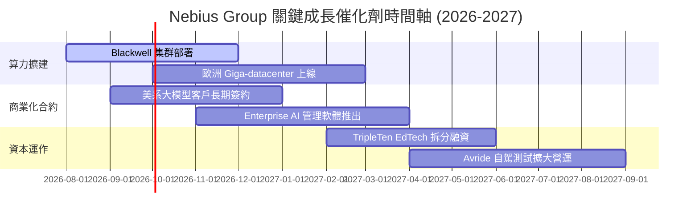

### 9.2 TAM 市場規模分析

```
╔══════════════════════════════════════════════════════════════════╗
║                 Nebius 所處市場 TAM 潛力分析                      ║
╠══════════════════════════════════════════════════════════════════╣
║                                                                  ║
║  全球 AI 算力雲端服務 (AI Cloud TAM 2030)： $350B                ║
║  ████████████████████████████████████████████████████  NBIS 滲透 ║
║  目標：獲取 4%-5% 市場份額 ➔ 對應營收 $14B - $17B                ║
║                                                                  ║
║  全球 IT 職涯 EdTech 市場 (2028)：          $25B                 ║
║  ████████████████████  TripleTen 瞄準 $1B+ 機會                  ║
║                                                                  ║
║  自駕物流與 Robotaxi 市場 (2030)：           $120B                ║
║  ████████████████████████████  Avride 具潛力邊際選擇權價值        ║
╚══════════════════════════════════════════════════════════════════╝
```

### 9.3 成長驅動力結構圖

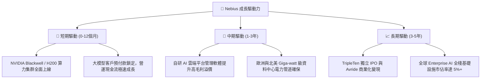

---

## 10. 風險矩陣

### 10.1 風險評分矩陣

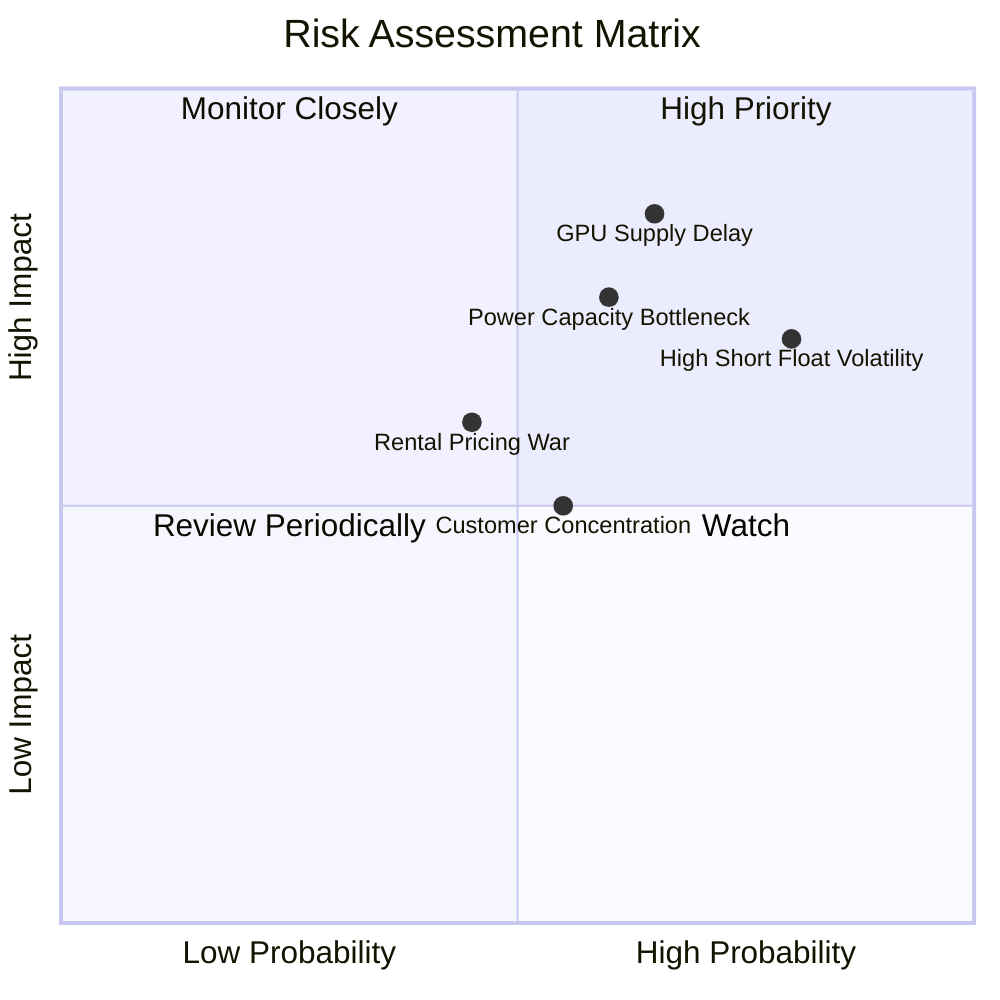

### 10.2 風險清單詳細分析

| # | 風險項目 | 發生機率 | 財務衝擊 | 風險評分 | 緩解措施 |
|---|----------|----------|----------|----------|----------|
| 1 | 🔴 **GPU 供應鏈分配遞延** | 高 (65%) | 高 (-20% 營收) | 🔴 **8.2/10** | 與 NVIDIA 簽署長期戰略優先配給協議，分散供應管道 |
| 2 | 🔴 **高 Short Float 帶來波動** | 高 (80%) | 中 (-15% 股價) | 🔴 **7.5/10** | 定期揭露強勁 OCF 與執行進度，吸引機構長線買盤 |
| 3 | 🟡 **資料中心電力與建置瓶頸** | 中 (60%) | 高 (-15% 營收) | 🟡 **7.0/10** | 於冰島、芬蘭及美洲多區域布局再生能源與發電資源 |
| 4 | 🟡 **AI 算力租賃價格競爭** | 中 (45%) | 中 (-10% Margin) | 🟡 **5.8/10** | 發展上層託管 API 與開發者工具，避免純算力價格戰 |
| 5 | 🟢 **客戶集中度過高** | 中 (55%) | 中 (-8% 營收) | 🟢 **4.8/10** | 開拓 Enterprise 與中小型 AI 新創，擴大客戶基底 |

---

## 11. 投資建議

### 11.1 最終綜合評級雷達圖

```
╔══════════════════════════════════════════════════════════════╗
║              Nebius Group 綜合維度評分                       ║
╠══════════════════════════════════════════════════════════════╣
║ 營收成長動能  9.5/10  ▓▓▓▓▓▓▓▓▓▓▓▓▓▓▓▓▓▓▓░  🏆 頂尖        ║
║ 資產負債健康  8.5/10  ▓▓▓▓▓▓▓▓▓▓▓▓▓▓▓▓▓░░░  🟢 優異        ║
║ 技術與護城河  8.0/10  ▓▓▓▓▓▓▓▓▓▓▓▓▓▓▓▓░░░░  🟢 強勁        ║
║ 管理層執行力  8.0/10  ▓▓▓▓▓▓▓▓▓▓▓▓▓▓▓▓░░░░  🟢 強勁        ║
║ 估值吸引力    6.5/10  ▓▓▓▓▓▓▓▓▓▓▓▓█░░░░░░░  🟡 中等        ║
║ 獲利轉正潛力  5.5/10  ▓▓▓▓▓▓▓▓▓▓█░░░░░░░░░  🟡 觀察期      ║
╠══════════════════════════════════════════════════════════════╣
║ 綜合總分      7.6/10  ▓▓▓▓▓▓▓▓▓▓▓▓▓▓▓░░░░░  🟢 建議分批買進║
╚══════════════════════════════════════════════════════════════╝
```

### 11.2 目標價與隱含報酬率

| 情境 | 機率權重 | 12個月目標價 | 當前股價 ($225.74) 隱含報酬率 | 投資行動建議 |
|------|----------|--------------|-------------------------------|--------------|
| 🔴 **悲觀** | 20% | **$135.00** | -40.2% | 跌破 $150.00 觸發嚴格止損 |
| 🟡 **基準** | 60% | **$256.00** | **+13.4%** | 回檔至 $160–$180 分批建立長期倉位 |
| 🟢 **樂觀** | 20% | **$380.00** | +68.3% | 突破 $300.00 分段獲利入袋 |

### 11.3 買入時機與觸發因素

```
╔══════════════════════════════════════════════════════════════════╗
║                  ✅ 買入觸發因素 Checklist                      ║
╠══════════════════════════════════════════════════════════════════╣
║                                                                  ║
║  分批建倉觸發條件（符合任二）：                                  ║
║  ✅ 股價回檔至加權合理價值安全區間（$160.00 - $180.00）          ║
║  ✅ 單季營收維持 QoQ > 30% 以上之高高速成長軌跡                  ║
║  ✅ 賣空比例 (Short % Float) 降至 15% 以下，市場擠壓風險降低     ║
║                                                                  ║
║  加碼觸發條件（出現以下任一）：                                  ║
║  ☐ 宣佈獲得 Fortune 500 企業超大型長約（> $1B 訂單）             ║
║  ☐ 營業利益率 (EBIT Margin) 提前轉正                             ║
║                                                                  ║
║  減碼/停損觸發條件（出現以下任一）：                             ║
║  ☒ 核心 GPU 算力集群交付出現超過兩季以上的重大延遲               ║
║  ☒ 自由現金流 (FCF) 惡化程度超出預算且現金低於 $3.0B            ║
╚══════════════════════════════════════════════════════════════════╝
```

### 11.4 投資人適配度分析

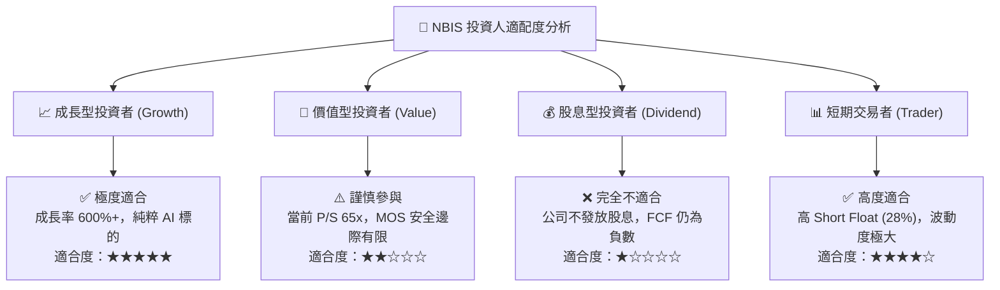

### 11.5 每季財報監控清單（Quarterly Watch List）

| 監控指標 | 當前基準值 (Q1 2026) | 🟢 樂觀/加碼門檻 | 🔴 警告/減碼門檻 | 追蹤意義 |
|----------|----------------------|------------------|------------------|----------|
| **單季營收** | $399.0M | > $450M (QoQ +13%+) | < $350M ( crescita 放緩) | 驗證算力擴建與客戶下單動能 |
| **毛利率 (Gross Margin)** | 74.0% | > 72.0% | < 65.0% | 觀察雲端軟體與算力租賃定價權 |
| **營業利益率 (EBIT Margin)** | -32.1% | 改善至 > -20.0% | 惡化至 < -40.0% | 驗證經營槓桿與規模效應是否發酵 |
| **資本支出 (Capex)** | -$2.47B | 依排程控制在 $2B–$3B | > $4B 且無相應預收款 | 監控現金消耗與 GPU 採購節奏 |
| **現金及等價物** | $9.30B | > $6.0B | < $3.0B | 評估是否需要二次股權稀釋增資 |

### 11.6 反面論證：什麼會證明論點錯誤（What Would Change My Mind）

```
╔══════════════════════════════════════════════════════════════════╗
║              ⚠️ 論點失效條件（Disconfirming Evidence）           ║
╠══════════════════════════════════════════════════════════════════╣
║  本投資論點在下列情況發生時應重新評估、調降評級或停損離場：      ║
║                                                                  ║
║  ☐ 核心 AI Cloud 營收年成長率 (YoY) 連續兩季跌破 100%           ║
║  ☐ 算力租賃毛利率連續兩季下滑至 55% 以下（價格戰暴發）           ║
║  ☐ FY2027 結束時，營業利益率 (EBIT Margin) 仍未能實現轉正        ║
║  ☐ 投入資本回報率 (ROIC) 長期低於 WACC (10.49%)，資本效益持續摧毀║
║  ☐ NVIDIA 供應鏈優先級出現顯著調降，算力配額被競業大幅侵蝕      ║
╚══════════════════════════════════════════════════════════════════╝
```

---

> **免責聲明**：本報告為 AI 自動生成，僅供研究參考，不構成投資建議。投資有風險，入市需謹慎。