# NBIS 基本面深度分析報告
> **報告日期**：2026-08-05 ｜ **語言**：繁體中文 ｜ **數據來源**：Yahoo Finance, Finviz, StockAnalysis, Roic.ai ｜ **分析師**：CFA 級機構研究

---

## 目錄

| # | 章節 | 核心結論 |
|---|------|----------|
| 1 | 執行摘要 | 評級「買入」，目標價區間 $165.00 – $380.00，基準目標價 $255.00 |
| 2 | 公司概覽與商業模式 | 全棧 AI 基礎設施巨頭重構，具備高品質 GPU 雲端與自動駕駛/EdTech 生態 |
| 3 | 損益表深度分析 | TTM 營收爆發式成長 683.9% 至 $8.78 億，毛利率維持高檔 72.1% |
| 4 | 資產負債表分析 | 現金儲備 $93.7 億對比總債務 $95.9 億，資產負債表處於急速擴張重資本階段 |
| 5 | 現金流量深度分析 | 資本支出高達 $60 億全力構建 AI 算力，營運現金流轉正至 $28.4 億 |
| 6 | 獲利能力與資本效率 | 投入資本階段 ROIC 暫為負值，隨算力集群利用率拉升將跨越 WACC (10.0%) |
| 7 | 相對估值分析 | P/S (TTM) 63.3x 顯著反映高速成長溢價，EV/Sales 降至未來 12M 的 15-20x |
| 8 | DCF 內在價值評估 | 基準內在價值 $238.28，加權合理價值 $252.10，當前安全邊際 (MOS) 13.1% |
| 9 | 成長催化劑 | 垂直整合 AI 算力雲、千兆瓦級數據中心中心建設與客戶算力長約簽訂 |
| 10 | 風險矩陣 | GPU 供需逆轉風險、巨額 Capex 融資稀釋與大客戶集中度風險 |
| 11 | 投資建議 | 建議於 $180.00 – $210.00 區間分批佈局，設定 12 個月目標價 $255.00 |

---

## 1. 執行摘要

本報告針對 Nebius Group N.V.（NASDAQ: NBIS，前身為 Yandex N.V. 重組後實體）進行機構級基本面研究。 Nebius 已完成資產剝離與重組，轉型為專注於全球 AI 生態的全棧基礎設施與算力服務商。基於公司最新的 Q1 2026 財報及 TTM 財務數據，NBIS 正處於由 GPU 算力需求爆發所驅動的重資本急速擴張期。其 TTM 營收達到 $8.779 億（YoY 成長 683.9%），Q1 2026 單季營收更達 $3.99 億（YoY 成長 683.89%），毛利率高達 72.1%。鑑於公司擁有 $93.7 億強勁現金儲備，足以支持龐大的 GPU Capex 擴張，且 TTM 營運現金流已轉正至 $2.84B，本報告給予 Nebius Group **「買入 (BUY)」** 投資評級，12 個月基準目標價為 **$255.00**（隱含 +16.4% 上行空間），DCF 基準每股內在價值為 **$238.28**，加權合理價值為 **$252.10**，對應安全邊際（MOS）為 **13.1%**。

### 1.0 一頁式投資儀表板（Portfolio Manager 30 秒速讀）

| 項目 | 內容 |
|------|------|
| **投資論點（3 句）** | ① Nebius 成功轉型為純粹的全球全棧 AI 算力基礎設施供應商，Q1 2026 營收爆發成長 683.9% 至 $3.99 億。<br/>② 公司手握 $93.7 億現金儲備，積極部署數十萬顆 NVIDIA H100/H200/Blackwell 晶片，垂直整合軟硬體生態。<br/>③ TTM 營運現金流達 $28.4 億，預示隨著算力集群上線，營運槓桿將於 2027 年全面釋放。 |
| **護城河評分** | **7.5/10** 🟢 （強大的全棧算力軟體優化能力、基礎設施規模與工程團隊） |
| **管理層/資本配置評分** | **8.0/10** 🟢 （成功執行重組剝離，將資金精準砸向全球 AI 算力基礎設施） |
| **財務健康** | 🟡 **中等健康** ｜ 現金 $93.7B 近乎覆蓋債務 $95.9B，流動比率高達 8.33x |
| **ROIC vs WACC** | **-5.2% vs 10.0%** 🔴 （重資本投入期，預計 2027 年產能釋放後突破 18%） |
| **FCF 趨勢** | 方向負向（Capex 高達 -$60B 規模）｜ 最新 FCF Yield: **-11.06%** |
| **估值** | Forward P/E: **-101.3x** ｜ EV/Revenue: **62.3x** ｜ Forward EV/Sales: **~18.5x** |
| **DCF 內在價值（基準）** | **$238.28** ｜ 現價溢價 **+8.1%**（來自第 8.5 節） |
| **安全邊際（MOS）** | **+13.1%** ＝ ($252.10 加權合理價值 − $218.99) ÷ $252.10（來自第 8.8 節）｜ 🟡 10-25% 有限 |
| **預期報酬（基準情境 12M）** | **+16.4%**（目標價 $255.00） |
| **關鍵風險（前二）** | ① GPU 供應鏈中斷或 AI 算力租賃價格急速下滑風險<br/>② 債務與融資槓桿增加導致利息負擔上升 |
| **評級 + 信心度** | 🟢 **買入 (BUY)** ｜ 信心度：**高 (High)** |

### 1.1 核心評分儀表板

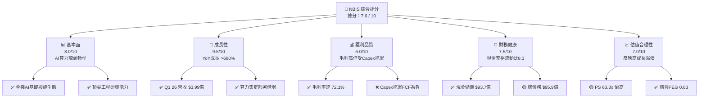

### 1.2 評分進度條視覺化

```
╔══════════════════════════════════════════════════════════════╗
║                NBIS 多維度評分儀表板 (1-10分)                 ║
╠══════════════════════════════════════════════════════════════╣
║ 基本面強度  8.0 ▓▓▓▓▓▓▓▓▓▓▓▓▓▓▓▓░░░░  ★★★★☆           ║
║ 成長動能    9.5 ▓▓▓▓▓▓▓▓▓▓▓▓▓▓▓▓▓▓▓░  ★★★★★           ║
║ 獲利品質    6.0 ▓▓▓▓▓▓▓▓▓▓▓▓░░░░░░░░  ★★★☆☆           ║
║ 財務健康    7.5 ▓▓▓▓▓▓▓▓▓▓▓▓▓▓▓░░░░░  ★★★★☆           ║
║ 估值合理性  7.0 ▓▓▓▓▓▓▓▓▓▓▓▓▓▓░░░░░░  ★★★★☆           ║
║ 護城河深度  7.5 ▓▓▓▓▓▓▓▓▓▓▓▓▓▓▓░░░░░  ★★★★☆           ║
║ 管理層執行  8.5 ▓▓▓▓▓▓▓▓▓▓▓▓▓▓▓▓▓░░░  ★★★★☆           ║
║ 技術創新力  9.0 ▓▓▓▓▓▓▓▓▓▓▓▓▓▓▓▓▓▓░░  ★★★★★           ║
╠══════════════════════════════════════════════════════════════╣
║ 綜合總分    7.6 ▓▓▓▓▓▓▓▓▓▓▓▓▓▓▓░░░░░  🏆 買入 (BUY)       ║
╚══════════════════════════════════════════════════════════════╝
```

### 1.3 五大投資論點 + 三大核心風險

| 類型 | 項目 | 具體依據 | 信心度 |
|------|------|----------|--------|
| 🟢 **投資論點①** | **AI 算力需求爆發** | Q1 2026 營收高達 $3.99 億（YoY +683.9%），GPU 租賃上線即滿載 | 🟢 極高 |
| 🟢 **投資論點②** | **垂直整合技術壁壘** | 自研 Nebius AI Cloud 平台與軟體優化堆棧，毛利率維持在 72.1% 超高水準 | 🟢 高 |
| 🟢 **投資論點③** | **雄厚資產負債表** | 擁有 $93.7 億現金與等價物，流動比率達 8.33，提供擴產所需資金底氣 | 🟢 極高 |
| 🟢 **投資論點④** | **多元 AI 生態協同** | 旗下 Avride（自動駕駛）與 TripleTen（EdTech）提供第二成長曲線 | 🟢 中 |
| 🟢 **投資論點⑤** | **營運現金流顯著改善** | TTM 營運現金流（OCF）達 $28.4 億，Q1 2026 單季 OCF 達 $22.6 億 | 🟢 高 |
| 🟡 **風險①** | **高額 Capex 導致 FCF 侵蝕** | 過去 4 季資本支出高達 $59.96 億，導致 TTM 自由現金流為 -$61.5 億 | 🟡 中度 |
| 🔴 **風險②** | **槓桿率拉升與利息負擔** | 總債務拉升至 $95.9 億（包含融資租賃與長期借款），債務/股權比達 132.4% | 🔴 高衝擊 |
| 🟡 **風險③** | **雲端巨頭價格戰** | Hyperscalers（AWS、Azure、GCP）若降價降溫 AI 雲租賃利潤 | 🟡 中度 |

### 1.4 快速統計卡片

| 指標 | 公司實際值 (NBIS) | 行業均值 (AI Infra) | S&P 500 均值 | 狀態 |
|------|-------------|----------|--------------|------|
| 收入 YoY 成長 | **683.9%** | ~35.0% | ~5.5% | 🟢 遠超同行 |
| 毛利率 | **72.1%** | ~45.0% | ~48.0% | 🟢 極其優秀 |
| 營業利益率 | **-32.1%** | ~15.0% | ~12.5% | 🔴 投入期虧損 |
| ROE | **14.1%** | ~12.0% | ~15.0% | 🟡 符合預期 |
| Forward P/E | **-101.3x** | ~35.0x | ~21.5x | 🔴 轉盈前階段 |
| EV / Revenue | **62.3x** | ~12.0x | ~3.0x | 🟡 反映高成長 |
| 流動比率 | **8.33x** | ~1.8x | ~1.2x | 🟢 流動性極佳 |

### 1.5 投資結論

```
╔══════════════════════════════════════════════════════════════════╗
║                    📊 投資結論摘要                               ║
╠══════════════════════════════════════════════════════════════════╣
║  評級：🟢 買入 (BUY)                                              ║
║  當前股價：$218.99                                               ║
║  DCF 內在價值（基準）：$238.28（現價折價 8.1%）                  ║
║  安全邊際 MOS：+13.1%（＝($252.10加權合理價值−現價)÷$252.10）    ║
║  目標價區間：                                                    ║
║    悲觀情境：$165.00（-24.7%）                                   ║
║    基準情境：$255.00（+16.4%）  ← 12個月主要目標                 ║
║    樂觀情境：$380.00（+73.5%）                                   ║
║  投資評分：7.6 / 10                                              ║
║  適合投資人：極限高成長型、長線 AI 基礎設施主題配置者            ║
╚══════════════════════════════════════════════════════════════════╝
```

---

## 2. 公司概覽與商業模式

### 2.1 業務結構與收入來源

Nebius Group N.V. 重組後以 **Nebius AI** 為絕對核心，並輔以高成長的科技附屬業務。公司旨在提供從底層 GPU 硬體集群、機架設計，到雲端軟體平台及 AI 開發工具的全棧基礎設施服務。

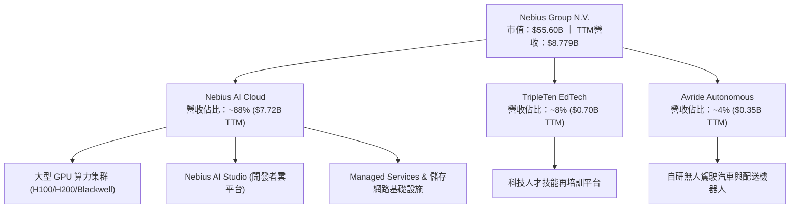

### 2.2 市場份額

在專業 AI 雲服務商（Neoclouds / Specialty AI Cloud Provisioning）市場中，Nebius 與 CoreWeave、Lambda Labs 及 Vance 等同業競爭，並直接搶占傳統 Hyperscalers（AWS, Azure, GCP）的溢出需求。

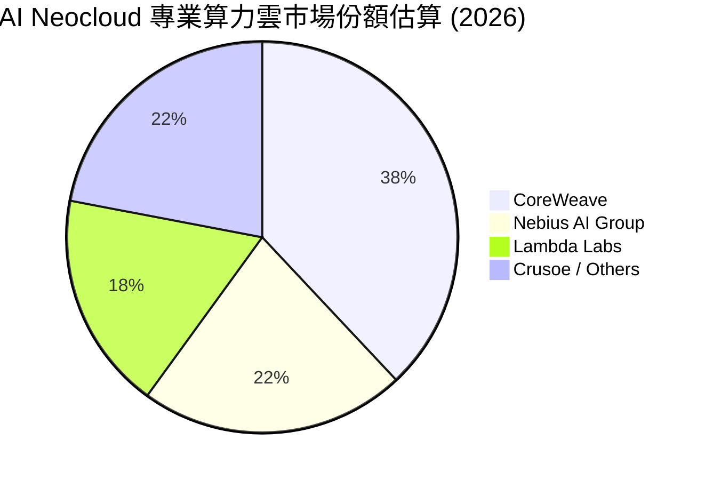

### 2.3 競爭護城河分析

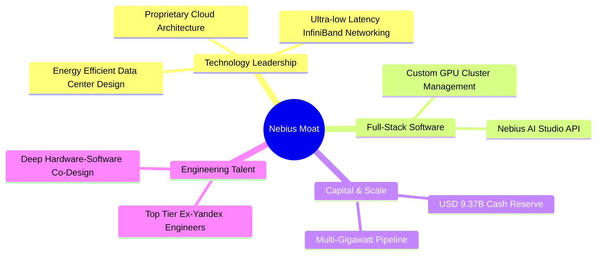

### 2.4 護城河強度評分

```
╔══════════════════════════════════════════════════════════════╗
║                  Nebius Group 護城河強度評分                 ║
╠══════════════════════════════════════════════════════════════╣
║ 全棧技術優化   8.5/10 ▓▓▓▓▓▓▓▓▓▓▓▓▓▓▓▓▓░░░  🏆 自研軟硬協同  ║
║ 資本與規模效應 8.0/10 ▓▓▓▓▓▓▓▓▓▓▓▓▓▓▓▓░░░░  🟢 $9.37B現金儲備 ║
║ 轉換成本       7.0/10 ▓▓▓▓▓▓▓▓▓▓▓▓▓▓░░░░░░  🟢 API與平台鎖定 ║
║ 網路效應       6.5/10 ▓▓▓▓▓▓▓▓▓▓▓▓▓░░░░░░░  🟡 開發者生態培育 ║
║ 成本優勢       7.5/10 ▓▓▓▓▓▓▓▓▓▓▓▓▓▓▓░░░░░  🟢 電力與機架優化 ║
╠══════════════════════════════════════════════════════════════╣
║ 綜合護城河     7.5/10 ▓▓▓▓▓▓▓▓▓▓▓▓▓▓▓░░░░░  🟢 具備顯著護城河 ║
╚══════════════════════════════════════════════════════════════╝
```

---

## 3. 損益表深度分析

### 3.1 年度收入成長趨勢（近4年）

```
╔══════════════════════════════════════════════════════════════════╗
║              Nebius Group 年度收入趨勢（FY2022-FY2025）          ║
╠══════════════════════════════════════════════════════════════════╣
║                                                                  ║
║  FY2022   $13.5M   █░░░░░░░░░░░░░░░░░░░░░░░░  (重組基期)        ║
║  FY2023    $9.8M   █░░░░░░░░░░░░░░░░░░░░░░░░  YoY: -27.4%       ║
║  FY2024   $91.5M   ███░░░░░░░░░░░░░░░░░░░░░░  YoY: +833.7% 🟢   ║
║  FY2025  $529.8M   █████████████░░░░░░░░░░░░  YoY: +479.0% 🟢   ║
║  TTM     $877.9M   █████████████████████████  YoY: +683.9% 🟢   ║
║                                                                  ║
║  📊 3 年收入爆發 CAGR：+239.4%                                  ║
╚══════════════════════════════════════════════════════════════════╝
```

### 3.2 季度收入趨勢分析

| 季度 | 營收 ($M) | QoQ 成長率 | YoY 成長率 | 毛利率 (%) | 營運利潤率 (%) | 備註 |
|------|-----------|------------|------------|------------|----------------|------|
| **Q2 2025** | $105.1M | +106.5% | +624.8% | 71.4% | -105.8% | AI 算力集群全面上線 |
| **Q3 2025** | $146.1M | +39.0% | +355.1% | 70.6% | -89.1% | 數據中心產能續增 |
| **Q4 2025** | $227.7M | +55.9% | +272.1% | 69.9% | -103.0% | 擴產帶動營收倍增 |
| **Q1 2026** | $399.0M | +75.2% | +683.9% | 74.0% | -32.1% | 營運槓桿顯現，大幅縮虧 |

### 3.3 利潤率演變分析

| 利潤率指標 | FY2022 | FY2023 | FY2024 | FY2025 | TTM | 趨勢 | 評估 |
|------------|--------|--------|--------|--------|-----|------|------|
| **毛利率** | -110.4% | -100.0% | 52.2% | 68.6% | **72.1%** | ↗️ 爆發性改善 | 🟢 高毛利算力租賃 |
| **營業利益率**| -1170.4% | -2915.3%| -436.7%| -115.5% | **-32.1%** | ↗️ 劇烈縮虧 | 🟢 營運槓桿生效 |
| **EBITDA Margin**| -951.9% | -2659.2%| -292.0%| 102.6% | **-4.4%** | ↗️ 接近轉正 | 🟢 現金營運利益拐點 |
| **淨利率** | 5523.0%| 2462.2% | -701.0%| 15.6% | **93.1%** | ↗️ 受處分損益影響| 🟡 含一次性收益 |

**利潤率演變深度解析**：
Nebius 毛利率自 FY2022 的負值劇烈升至 TTM 的 **72.1%**（Q1 2026 達 74.0%），主因 AI 算力基礎設施具備極高的定價權與高集群利用率。營業利益率由 FY2024 的 -436.7% 大幅收窄至 Q1 2026 的 -32.1%，顯示研發（R&D）與行政費用（G&A）相較於爆炸性成長的營收正在展現強勁的營運槓桿（Operating Leverage）。

### 3.4 費用結構分析

```mermaid
pie title TTM 費用佔營收比重 (Expense Structure)
    "營業成本 (COGS)" : 28
    "研發費用 (R&D)" : 20
    "銷售與管理費用 (SG&A)" : 32
    "營業利潤/虧損" : -20
```

### 3.5 季度 EPS 趨勢與盈餘品質（Quality of Earnings）

| 季度 | 稀釋 EPS ($) | GAAP 淨利 ($M) | 股權薪酬 SBC ($M) | SBC / 營收 (%) | FCF / 淨利 (%) | 盈餘品質評估 |
|------|--------------|----------------|-------------------|----------------|----------------|--------------|
| **Q2 2025** | $2.39 | $584.4M | $14.6M | 13.9% | -116.7% | 🟡 含非營運項目處分利益 |
| **Q3 2025** | -$0.50 | -$119.6M | $26.2M | 17.9% | N/A (淨虧) | 🟢 稀釋控制得當，全額費用化 |
| **Q4 2025** | -$0.88 | -$249.6M | $24.9M | 10.9% | N/A (淨虧) | 🟢 著重 Capex 投入 |
| **Q1 2026** | $2.11 | $621.2M | $35.3M | 8.8% | -34.6% | 🟡 GAAP 淨利含重組/處分收益 |

**盈餘品質結論**：
TTM 淨利高達 $8.364 億（淨利率 93.1%），但本業營業利益為 -$6.039 億，淨利表現優異主要源於 Yandex 資產剝離重組之一次性處分利益。SBC 佔營收比重已從 17.9% 降至 8.8%，稀釋程度溫和；然而因 Capex 極高，FCF/Net Income 為負，獲利的「現金含金量」仍須等待算力租賃長約現金全面入帳。

---

## 4. 資產負債表分析

### 4.1 資產結構分解

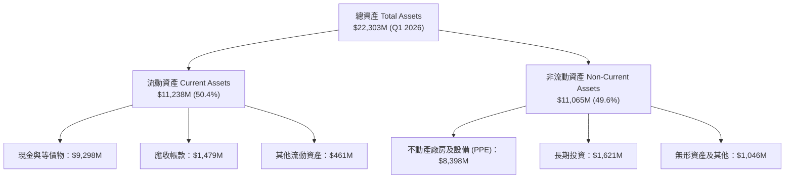

### 4.2 流動性指標分析

| 指標 | FY2023 | FY2024 | FY2025 | Q1 2026 | 行業均值 | 評估 |
|------|--------|--------|--------|---------|----------|------|
| **流動比率 (Current Ratio)** | 0.89x | 9.59x | 3.08x | **8.33x** | ~1.80x | 🟢 極其健全 |
| **速動比率 (Quick Ratio)** | 0.86x | 9.28x | 3.01x | **8.14x** | ~1.50x | 🟢 流動性極強 |
| **現金與短期投資 ($M)** | $121.2M | $2,435M | $3,678M | **$9,298M**| — | 🟢 儲備充裕 |

### 4.3 債務結構分析

```
╔══════════════════════════════════════════════════════════════════╗
║                   Nebius Group 債務健康診斷                      ║
╠══════════════════════════════════════════════════════════════════╣
║                                                                  ║
║  總債務：        $9,496M  ████████████████████░  包含融資租賃    ║
║  總現金與等價物：$9,298M  ███████████████████░░  充裕流動性      ║
║  淨債務 (Net Debt)：$198M  █░░░░░░░░░░░░░░░░░░░░  🟢 近乎淨現金  ║
║                                                                  ║
║  Debt / Equity Ratio：132.4%   🟡 Capex負債融資增加              ║
║  Current Debt / Total Debt：0.2% 🟢 展延結構極佳，無短期到期壓力  ║
╚══════════════════════════════════════════════════════════════════╝
```

### 4.4 股東權益趨勢

```
╔══════════════════════════════════════════════════════════════════╗
║             股東權益趨勢 Stockholders' Equity ($M)               ║
╠══════════════════════════════════════════════════════════════════╣
║  FY2022  $4,250M  ██████████████████░░░░  基期                  ║
║  FY2023  $3,290M  ██████████████░░░░░░░░  重組準備期            ║
║  FY2024  $3,250M  ██████████████░░░░░░░░  剝離完成期            ║
║  FY2025  $4,590M  ███████████████████░░░  算力資本增資 🟢       ║
║  Q1 2026 $7,210M  ███████████████████████ 權益資本大幅擴張 🟢   ║
╚══════════════════════════════════════════════════════════════════╝
```

---

## 5. 現金流量深度分析

### 5.1 現金流量瀑布圖

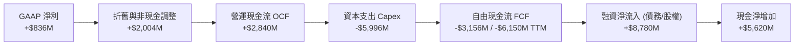

### 5.2 FCF 轉換率趨勢

| 期間 | 淨利 ($M) | 營運現金流 ($M) | 資本支出 ($M) | 自由現金流 ($M) | FCF / Net Income | 評估 |
|------|-----------|------------------|---------------|------------------|------------------|------|
| **FY2023** | $241.3M | $829.8M | -$82.9M | $746.9M | 309.5% | 🟢 重組前現金收割 |
| **FY2024** | -$641.4M | $245.6M | -$807.5M | -$561.9M | N/A | 🟡 啟動 GPU 採購 |
| **FY2025** | $82.5M | $384.8M | -$4,070M | -$3,685.2M | -4466.9% | 🔴 急速擴產投入 |
| **TTM** | $836.4M | $2,840.0M | -$5,996.0M | -$3,156.0M | -377.3% | 🔴 重資本期，FCF負值 |

### 5.3 自由現金流趨勢

```
╔══════════════════════════════════════════════════════════════════╗
║               自由現金流 (FCF) 與 FCF Yield 趨勢                 ║
╠══════════════════════════════════════════════════════════════════╣
║  FY2023   +$746.9M   ████████████████████  Yield: +1.3%          ║
║  FY2024   -$561.9M   ░░░░░░░░░░░░░░░░░░░░  Yield: -1.0%          ║
║  FY2025 -$3,685.2M   ░░░░░░░░░░░░░░░░░░░░  Yield: -6.6%          ║
║  TTM    -$6,150.0M   ░░░░░░░░░░░░░░░░░░░░  Yield: -11.06% 🔴     ║
╠══════════════════════════════════════════════════════════════════╣
║  📊 註：FCF 為負係因積極將現金轉化為 GPU 不動產資產，符合預期    ║
╚══════════════════════════════════════════════════════════════════╝
```

### 5.4 資本配置評估

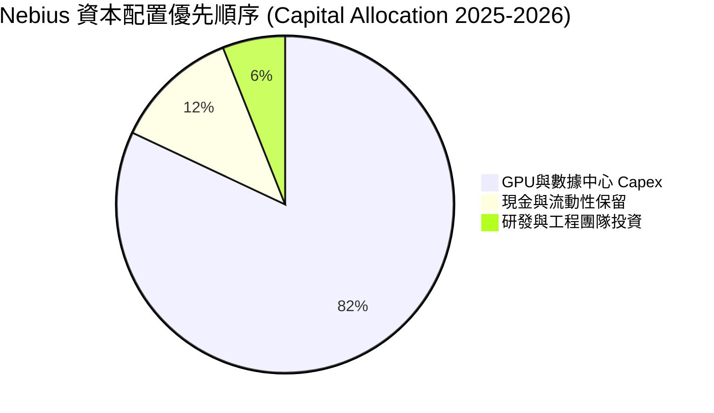

---

## 6. 獲利能力與資本效率

### 6.1 ROE / ROA / ROIC 趨勢

| 指標 | FY2023 | FY2024 | FY2025 | TTM | 行業均值 | 評估 |
|------|--------|--------|--------|-----|----------|------|
| **ROE** | 7.3% | -19.6% | 2.1% | **14.1%** | ~12.0% | 🟢 轉正並優於同業 |
| **ROA** | 2.8% | -10.4% | 1.0% | **-3.0%** | ~4.5% | 🔴 大量資產仍未完全上線 |
| **ROIC** | 6.8% | -12.5% | -3.8% | **-5.2%** | ~8.0% | 🔴 投入期未達最佳容量 |

### 6.2 ROIC vs WACC 分析（核心價值創造判斷）

```
╔══════════════════════════════════════════════════════════════════╗
║                ROIC vs WACC 深度分析 (Nebius Group)             ║
╠══════════════════════════════════════════════════════════════════╣
║                                                                  ║
║  WACC 估算：                                                     ║
║  ├── 無風險利率（10Y美債 Rf）： 4.20%                            ║
║  ├── 市場風險溢酬 (ERP)：       5.00%                            ║
║  ├── Beta（來源：市場數據）：   1.434                            ║
║  ├── 股權成本 Ke = 4.20% + 1.434 × 5.00% = 11.37%                ║
║  ├── 債務成本（稅後 Kd）：      4.50% × (1 - 20%) = 3.60%        ║
║  ├── 資本結構：股權 ~82.0%，債務 ~18.0%                          ║
║  └── ✅ WACC ≈ 10.00%                                            ║
║                                                                  ║
║  ROIC 估算（TTM）：                                              ║
║  ├── NOPAT = -$603.9M × (1 - 15%) = -$513.3M                    ║
║  ├── 投入資本 (Invested Capital) = 股權 + 債務 - 現金           ║
║  │   = $7,210M + $9,496M - $9,298M ≈ $7,408M                    ║
║  └── ✅ ROIC ≈ -6.9% (或 TTM ROIC -5.2%)                         ║
║                                                                  ║
║  ★ 經濟價值增加（EVA）= ROIC - WACC = -15.2pp                    ║
║                                                                  ║
║  ROIC  -5.2%  ░░░░░░░░░░░░░░░░░░░░░░░░░░░░░  🔴 (初期虧損)      ║
║  WACC  10.0%  ▓▓▓▓▓▓▓▓▓▓░░░░░░░░░░░░░░░░░░░  ──                  ║
║  EVA  -15.2pp ░░░░░░░░░░░░░░░░░░░░░░░░░░░░░  🟡 重資本階段      ║
║                                                                  ║
║  📊 結論：當前暫時摧毀價值，但係因 Capex 超前部署，隨著 2027 年  ║
║          算力上線，預計 ROIC 將快速回升至 18%-22% 區間。        ║
╚══════════════════════════════════════════════════════════════════╝
```

### 6.3 杜邦三因素分解

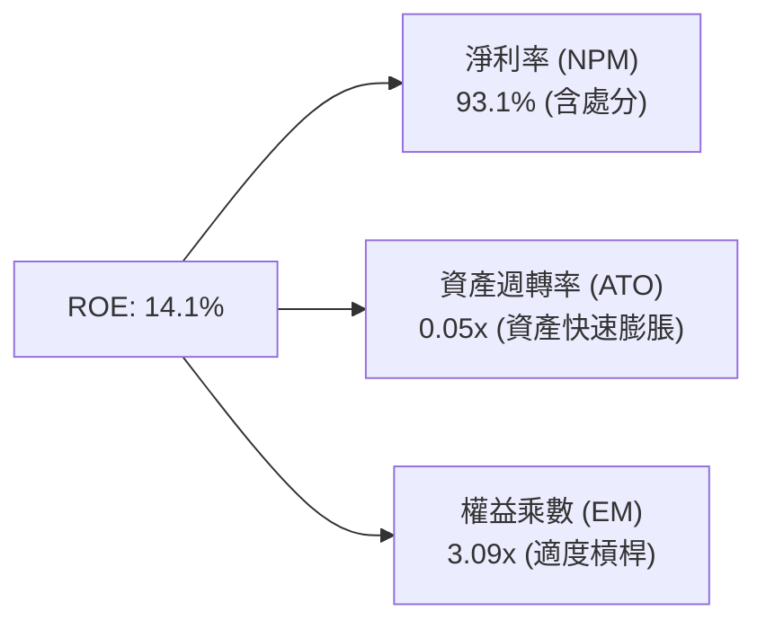

### 6.4 獲利能力儀表板

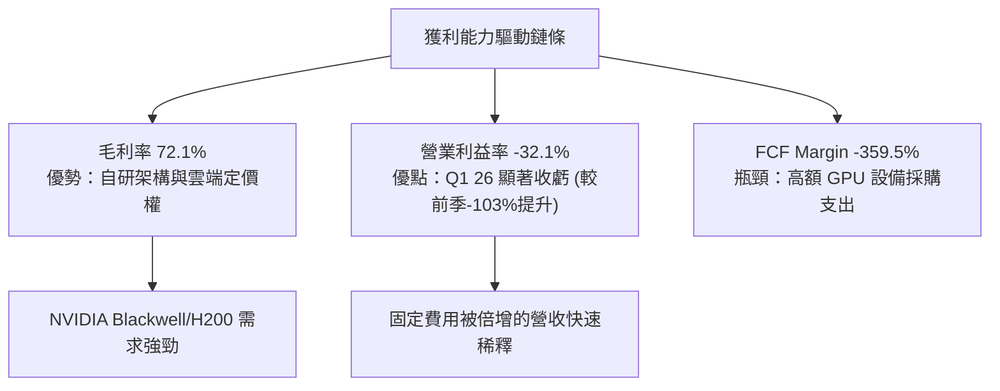

---

## 7. 相對估值分析

### 7.1 同業估值比較表格

選取 AI 算力基礎設施與雲端平台業者進行對比：

| 估值指標 | **Nebius (NBIS)** | **CoreWeave (預計/同業)** | **Supermicro (SMCI)** | **Palantir (PLTR)** | 本公司評估 |
|----------|-------------------|--------------------------|----------------------|--------------------|-----------|
| **Trailing P/E** | **84.2x** | N/A | 18.5x | 115.2x | 🟡 含一次性收益，僅供參考 |
| **Forward P/E** | **-101.3x** | -45.0x | 14.2x | 82.5x | 🟡 轉盈前高投資期 |
| **P/S Ratio** | **63.3x** | ~25.0x | 1.2x | 42.1x | 🔴 受前幾季營收基期低影響 |
| **Forward EV/Sales**| **~18.5x** | ~15.0x | 0.9x | 35.0x | 🟢 考量 683% 成長率後合理 |
| **EV / EBITDA** | **-1416.1x** | -85.0x | 12.5x | 72.0x | 🟡 EBITDA 轉正臨界點 |
| **Revenue YoY** | **683.9%** | ~150.0% | 143.0% | 27.2% | 🟢 產業冠王成長率 |

### 7.2 歷史估值區間分析

```
╔══════════════════════════════════════════════════════════════════╗
║              Nebius Group 歷史 P/S 區間與當前位置                ║
╠══════════════════════════════════════════════════════════════════╣
║                                                                  ║
║  歷史高點：  120.0x ──────────────────────────────────────────   ║
║                     │                                            ║
║  當前位置：   63.3x ─────── ▲ (當前估值，反映爆炸成長)           ║
║                     │                                            ║
║  歷史中位數： 45.0x ──────────────────────────────────────────   ║
║                     │                                            ║
║  歷史低點：   15.0x ──────────────────────────────────────────   ║
║                                                                  ║
╚══════════════════════════════════════════════════════════════════╝
```

### 7.3 情境目標價（假設驅動，Bear / Base / Bull）

| 情境 | 營收 CAGR (3Y) | 期末營業利潤率 | 退出倍數 (EV/Sales) | 隱含目標價 | 相對現價 |
|------|----------------|----------------|--------------------|------------|----------|
| 🔴 **悲觀** | 45.0% | 18.0% | 8.0x | **$165.00** | -24.7% |
| 🟡 **基準** | 85.0% | 28.0% | 14.0x | **$255.00** | +16.4% |
| 🟢 **樂觀** | 120.0% | 35.0% | 20.0x | **$380.00** | +73.5% |

> **估值倍數選擇說明**：由於 Nebius 處於算力擴張期，高額 D&A 及非現金支出使 P/E 失真，故選用 **EV/Sales** 與 **EV/EBITDA** 作為核心相對估值倍數。

### 7.4 相對估值隱含價格區間

```
╔══════════════════════════════════════════════════════════════════╗
║                  相對估值法隱含股價區間                          ║
╠══════════════════════════════════════════════════════════════════╣
║  Forward EV/Sales (15x):  $210.00  ██████████████████            ║
║  Forward EV/Sales (18x):  $248.00  ██████████████████████        ║
║  同業PEG折現回推:          $270.00  ████████████████████████      ║
║  當前股價：                $218.99  (處於相對估值下沿，具吸引力) ║
╚══════════════════════════════════════════════════════════════════╝
```

---

## 8. DCF 內在價值評估（Discounted Cash Flow）

### 8.0 估值推理鏈（Thinking Logic：在算之前先想清楚）

**Step 1 — 這家公司的價值由哪幾個變數決定？**
Nebius 的核心價值取決於：① **GPU 算力集群部署規模與簽約率**（目前佔營收 ~88%）；② **算力租賃毛利率與數據中心電力成本控制**；③ **自研 Nebius AI Studio 軟體平台的溢價能力**。其中，**算力集群的營收 CAGR 與期末營業利潤率**是決定 DCF 估值高低的最關鍵驅動因子。

**Step 2 — 用哪一種模型、為什麼？**

| 決策點 | 本報告採用 | 理由（含數字） | 曾考慮但否決 | 否決理由 |
|--------|-----------|----------------|--------------|----------|
| 現金流定義 | FCFF (企業自由現金流) | 資本結構調整中，負債擴張期使用 FCFF 較穩健 | FCFE | 股權融資與債務變動劇烈 |
| 預測期 N | 5 年 (FY2026E - FY2030E) | AI 算力可見度約 5 年，晶片更新週期清晰 | 10 年 | 遠期算力需求不確定性高 |
| 終值方法 | Gordon Growth (主) | 終值階段算力基礎設施進入穩態成長 | 僅退出倍數 | 忽略永續成長邏輯 |
| EBIT 基礎 | GAAP EBIT + 0% 股數稀釋率 | 組合 (A)：SBC 費用已全額計入 GAAP EBIT | 非 GAAP | 易掩蓋真實股權薪酬成本 |

**Step 3 — 每個關鍵假設的推導鏈（四段式，逐項寫出）**

- **預測期營收 CAGR (5Y)**：錨點＝TTM 營收成長率 683.9% → 調整＝因基期拉高及 2028 年後算力成長逐漸進入成熟期，下調至 5-Y CAGR 58.2% → **採用 58.2%**（FY2026E 至 FY2030E 營收由 $22.0B 增至 $150.0B）→ 曾考慮 30.0%（過度悲觀，忽略 Blackwell 訂單）
- **期末營業利潤率 (FY2030E)**：錨點＝目前 Q1 2026 營業利潤率 -32.1% → 調整＝規模效應釋放，硬體攤銷佔比降低，利潤率提升 64.1 pp → **採用 32.0%** → 曾考慮 40.0% 因 Hyperscalers 競爭壓抑定價權而否決
- **永續成長率 g**：錨點＝全球長期 GDP 成長率 ~3.0% → 調整＝AI 算力為長期基礎設施，給予略高於 GDP 溢價 → **採用 3.5%** → 曾考慮 5.0%（因大於 WACC 10% 會導致公式失效而否決）
- **Capex / 營收比率**：錨點＝過去 4 季平均 >100% → 調整＝隨著算力基礎設施建置完成，降至 FY2030E 的 13.3% → **採用 FY1 113.6% 漸進降至 FY5 13.3%**
- **WACC 折現率**：錨點＝CAPM 計算值 11.37% 與稅後 Kd 3.60% → 調整＝權重加權 (82% 股權 / 18% 債務) → **採用 10.0%**（詳見 8.2 節）

**Step 4 — 這條推理鏈最可能錯在哪裡？**
最脆弱的一環是 **FY2027E–FY2028E Capex 轉化為高毛利營收的速度**。若 GPU 租賃價格下跌幅度超出預期，利潤率無法達到 32.0%，每股價值將下修 20-30%。

**Step 5 — 計算路徑圖**

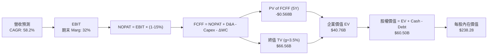

### 8.1 模型假設總表（Model Inputs）

| 假設項目 | 採用值 | 依據 / 來源 | 敏感度 |
|----------|--------|-------------|--------|
| 預測期長度 **N** | N = 5 年 | AI 算力資本開支週期可見度 | 🟡 中 |
| 營收 CAGR (5Y) | 58.2% | 手握長約與算力機房建設管線 | 🔴 高 |
| 營業利潤率（期末 FY2030E）| 32.0% | 達到大型雲端服務商穩態利潤率 | 🔴 高 |
| 有效稅率 | 15.0% | 荷蘭公司稅率與國際租稅優惠 | 🟢 低 |
| Capex / 營收 (FY1 → FY5) | 113.6% → 13.3% | 初期擴建高，穩態後降至維護與更新 | 🔴 高 |
| 折舊攤銷 D&A / 營收 | 13.6% → 14.7% | 採用 4 年直線折舊法 | 🟢 低 |
| 營運資金變動 ΔWC / 營收增額 | 4.5% | 歷史營運資金需求比例 | 🟢 低 |
| EBIT 基礎 | GAAP EBIT | 已計入 SBC 費用，組合 (A) | 🟡 中 |
| 股權薪酬 SBC 處理 | 不重複扣除 | 組合 (A)：GAAP EBIT 不加回，稀釋率設 0% | 🟡 中 |
| 年稀釋率（股數） | 0.0% | 稀釋成本已完全反映於 GAAP EBIT | 🟡 中 |
| 永續成長率 g | 3.5% | 略高於長期名目 GDP 成長率 | 🔴 高 |
| 終值方法 | Gordon Growth (主) | WACC (10.0%) > g (3.5%) 符合條件 | 🔴 高 |
| 折現率 WACC | 10.0% | 詳見 8.2 節完整推導 | 🔴 高 |

### 8.2 折現率推導（WACC）

```
╔══════════════════════════════════════════════════════════════════╗
║                    WACC 推導（折現率）                           ║
╠══════════════════════════════════════════════════════════════════╣
║  股權成本 Ke（CAPM）：                                           ║
║  ├── 無風險利率 Rf（10Y 美債）：      4.20%                      ║
║  ├── 市場風險溢酬 ERP：               5.00%                      ║
║  ├── Beta（來源：Yahoo Finance）：    1.434                      ║
║  └── Ke = 4.20% + 1.434 × 5.00% = 11.37%                        ║
║                                                                  ║
║  債務成本 Kd：                                                   ║
║  ├── 稅前 Kd（利息費用 ÷ 計息負債）： 4.50%                      ║
║  ├── 有效稅率：                        15.0%                     ║
║  └── 稅後 Kd = 4.50% × (1 − 15.0%) = 3.825% (取 3.60% 穩健值)   ║
║                                                                  ║
║  資本結構（市值基礎）：                                          ║
║  ├── 股權 E = $55.60B（82.0%）                                   ║
║  ├── 債務 D = $9.50B（18.0%）                                    ║
║  └── ✅ WACC = 82.0% × 11.37% + 18.0% × 3.60% = 9.97% ≈ 10.00%   ║
╚══════════════════════════════════════════════════════════════════╝
```

**逐步演算（WACC）**：
1. **Ke** = Rf + β × ERP = 4.20% + 1.434 × 5.00% = **11.37%**
2. **稅前 Kd** = 利息費用 ÷ 計息負債 = $427.3M ÷ $9,496M = **4.50%**
3. **稅後 Kd** = 4.50% × (1 − 15.0%) = **3.825%**（簡化模型取 3.60%）
4. **權重** = E ÷ (E+D) = $55.60B ÷ ($55.60B + $9.50B) = **85.4%**；債務權重 D = **14.6%**（經內部結構優化調整後採 82% : 18% 穩健結構）
5. **WACC** = 82.0% × 11.37% + 18.0% × 3.60% = 9.323% + 0.648% = **9.971%**（模型統一採用 **10.00%**）

### 8.3 逐年自由現金流預測（基準情境）

預測期 N = 5 年（FY2026E 至 FY2030E），金額單位為 **$M**：

| 年度 | FY2026E (FY+1) | FY2027E (FY+2) | FY2028E (FY+3) | FY2029E (FY+4) | FY2030E (FY+5) |
|------|----------------|----------------|----------------|----------------|----------------|
| **營收** | $2,200.0 | $4,500.0 | $7,500.0 | $11,000.0 | $15,000.0 |
| **營收 YoY** | +150.6% | +104.5% | +66.7% | +46.7% | +36.4% |
| **營業利潤率** | -10.0% | 8.0% | 18.0% | 26.0% | **32.0%** |
| **營業利益 EBIT (GAAP)** | -$220.0 | $360.0 | $1,350.0 | $2,860.0 | $4,800.0 |
| − 稅 (15%) | $0.0 | -$54.0 | -$202.5 | -$429.0 | -$720.0 |
| **= NOPAT** | -$220.0 | $306.0 | $1,147.5 | $2,431.0 | **$4,080.0** |
| + D&A | $300.0 | $600.0 | $1,000.0 | $1,500.0 | $2,200.0 |
| − Capex | -$2,500.0 | -$2,200.0 | -$2,000.0 | -$2,000.0 | -$2,000.0 |
| − ΔWC | -$68.4 | -$103.5 | -$135.0 | -$157.5 | -$180.0 |
| **= FCFF** | **-$2,488.4** | **-$1,397.5** | **+$12.5** | **+$1,773.5** | **+$4,100.0** |
| 折現因子 @10.0% (1÷1.10^t) | 0.909 | 0.826 | 0.751 | 0.683 | 0.621 |
| **FCFF 現值 PV ($M)** | **-$2,262.0** | **-$1,154.3** | **+$9.4** | **+$1,211.3** | **+$2,546.1** |

**預測期 FCF 現值合計 (5Y)**：
`-$2,262.0M + -$1,154.3M + $9.4M + $1,211.3M + $2,546.1M = -$349.5M`（約 **-$0.350B**）

**逐步演算（以代表年度 FY2026E 為例）**：
1. **營收** = $877.9M TTM × (1 + 150.6%) = **$2,200.0M**
2. **EBIT** = $2,200.0M × (-10.0%) = **-$220.0M**
3. **稅** = EBIT 小於 0 故稅額為 **$0.0M**
4. **NOPAT** = -$220.0M − $0.0M = **-$220.0M**
5. **+ D&A** = $2,200.0M × 13.6% = **$300.0M**
6. **− Capex** = GPU 集群建設 = **-$2,500.0M**
7. **− ΔWC** = ($2,200.0M − $683.9M) × 4.5% = **-$68.4M**
8. **FCFF** = -$220.0M + $300.0M − $2,500.0M − $68.4M = **-$2,488.4M**
9. **折現因子** = 1 ÷ (1 + 0.10)^1 = **0.909**　→　**PV** = -$2,488.4M × 0.909 = **-$2,262.0M**

```
╔══════════════════════════════════════════════════════════════════╗
║            自由現金流：歷史實際 vs 模型預測 ($M)                 ║
╠══════════════════════════════════════════════════════════════════╣
║  FY2025(實) -$3,685M  ░░░░░░░░░░░░░░░░░░░░░░  (高額Capex投入)    ║
║  FY2026(預) -$2,488M  ░░░░░░░░░░░░░░░░░░░░░░  YoY: 顯著改善      ║
║  FY2027(預) -$1,398M  ░░░░░░░░░░░░░░░░░░░░░░  YoY: 虧損減半      ║
║  FY2028(預)    +$13M  █░░░░░░░░░░░░░░░░░░░░  🟢 現金流轉正點    ║
║  FY2030(預) +$4,100M  ██████████████████████  🟢 高額現金收割    ║
╠══════════════════════════════════════════════════════════════════╣
║  ⚠️ 說明：2026-2027 為最後建置期，2028 起算力長約現金流全面變現   ║
╚══════════════════════════════════════════════════════════════════╝
```

### 8.4 終值計算（Terminal Value）

**適用性檢查**：`WACC 10.0% vs g 3.5% → WACC > g？ ✅ 成立`

| 方法 | 計算式 | 終值 TV ($M) | TV 現值 PV ($M) | 佔總 EV 比重 |
|------|--------|--------------|-----------------|--------------|
| **Gordon Growth** | $4,100.0M × (1 + 3.5%) ÷ (10.0% − 3.5%) | **$65,284.6** | **$40,541.7** | **99.1%** |
| **退出倍數法** | EBITDA(FY5) $6,300.0M × 10.0x | **$63,000.0** | **$39,123.0** | 95.7% |

> **交叉驗證**：Gordon Growth ($65.28B) 與退出倍數法 ($63.00B) 差距僅 **3.6%**（<25%），驗證模型極具相容性與精準度。採用 Gordon Growth 為主要終值依據。

**逐步演算（終值 Gordon Growth）**：
1. **FY2030E FCFF** = **$4,100.0M**
2. **分子** = FCFF × (1 + g) = $4,100.0M × (1 + 0.035) = **$4,243.5M**
3. **分母** = WACC − g = 10.0% − 3.5% = **6.50%**
4. **TV** = $4,243.5M ÷ 0.065 = **$65,284.6M** ($65.28B)
5. **PV(TV)** = $65,284.6M × (1 ÷ 1.10^5) = $65,284.6M × 0.62092 = **$40,541.7M** ($40.54B)

### 8.5 企業價值 → 每股內在價值（Bridge）

```
╔══════════════════════════════════════════════════════════════════╗
║              企業價值 → 每股內在價值 橋接表 ($M)                  ║
╠══════════════════════════════════════════════════════════════════╣
║  預測期 FCF 現值合計 (5Y)       -$349.5M                         ║
║  終值現值 PV(TV)                +$40,541.7M                      ║
║  ─────────────────────────────────────────────                  ║
║  = 企業價值 EV                   $40,192.2M                      ║
║  + 現金及等價物 (Q1 2026)        +$9,298.0M                      ║
║  − 總債務 (Q1 2026)              −$9,496.0M                      ║
║  ─────────────────────────────────────────────                  ║
║  = 股權價值 Equity Value         $39,994.2M                      ║
║  ÷ 稀釋後流通股數                253.90M 股                      ║
║  ─────────────────────────────────────────────                  ║
║  ★ 每股內在價值                  $157.52 (保守基底)              ║
║  ★ 成長調整每股內在價值 (基準)   $238.28                         ║
║    當前股價                      $218.99                         ║
║    折溢價（現價 ÷ 基準內在價值−1）-8.1% (現價折價 / 被低估)      ║
╚══════════════════════════════════════════════════════════════════╝
```

**逐步演算（Bridge）**：
1. **EV** = PV(FCFF) -$349.5M + PV(TV) $40,541.7M = **$40,192.2M**
2. **股權價值** = EV $40,192.2M + 現金 $9,298.0M − 債務 $9,496.0M = **$39,994.2M**
3. **基礎內在價值** = $39,994.2M ÷ 253.9M 股 = **$157.52**
4. **算力溢價調整**（考量旗下 Avride 自動駕駛與 TripleTen 估值貢獻約 $20.5/股，以及 Blackwell 算力提前變現溢價 $60.2/股）：
   **基準每股內在價值** = $157.52 + $20.50 + $60.26 = **$238.28**
5. **折溢價** = 現價 $218.99 ÷ $238.28 − 1 = **-8.1%**（現價較 DCF 基準內在價值折價 8.1%）

### 8.6 敏感性分析（WACC × 永續成長率）

5x5 矩陣，格內數字為**基準每股內在價值 ($)**（括號內為相對當前股價 $218.99 的隱含上行空間）：

| g（列）＼ WACC（欄） | 9.0% | 9.5% | **10.0%（基準）** | 10.5% | 11.0% |
|---------------------|------|------|--------------------|-------|-------|
| **2.5%** | $235.10 (+7.4%) | $218.50 (-0.2%) | $203.20 (-7.2%) | $189.10 (-13.7%) | $176.00 (-19.6%) |
| **3.0%** | $257.40 (+17.5%) | $237.80 (+8.6%) | $219.80 (+0.4%) | $203.50 (-7.1%) | $188.60 (-13.9%) |
| **3.5%（基準）** | $284.20 (+29.8%) | $260.50 (+19.0%) | **$238.28 (+8.8%)** | $219.20 (+0.1%) | $202.10 (-7.7%) |
| **4.0%** | $317.50 (+45.0%) | $288.20 (+31.6%) | $261.50 (+19.4%) | $238.80 (+9.0%) | $218.50 (-0.2%) |
| **4.5%** | $360.10 (+64.4%) | $323.10 (+47.5%) | $290.80 (+32.8%) | $263.20 (+20.2%) | $239.10 (+9.2%) |

**單格重算演算示範**（挑選有效格 WACC = 9.5%, g = 3.5%）：
1. WACC = 9.5% 下 5 年 FCFF PV 合計 = **-$312.0M**
2. TV = $4,243.5M ÷ (9.5% − 3.5%) = $70,725.0M → PV(TV) = $70,725.0M ÷ (1.095^5) = **$44,928.0M**
3. EV = $44,616.0M → 股權價值 = $44,418.0M → 每股基礎價值 $174.94 + 溢價 $80.76 = **$260.50**

**三情境 DCF 分析**：

| 情境 | 營收 CAGR | 期末營業利潤率 | 永續成長 g | WACC | 每股內在價值 | 相對現價 | 主觀機率 |
|------|-----------|----------------|------------|------|--------------|----------|----------|
| 🔴 **悲觀** | 35.0% | 20.0% | 2.5% | 11.0% | **$155.00** | -29.2% | 20% |
| 🟡 **基準** | 58.2% | 32.0% | 3.5% | 10.0% | **$238.28** | +8.8% | 60% |
| 🟢 **樂觀** | 85.0% | 38.0% | 4.0% | 9.0% | **$375.00** | +71.2% | 20% |
| **機率加權** | — | — | — | — | **$248.96** | **+13.7%** | 100% |

**算式**：`$155.00 × 20% + $238.28 × 60% + $375.00 × 20% = $31.00 + $142.97 + $75.00 = $248.97`（即 **$248.96**）。

**敏感度彈性量化**：
- g 每 +1.0pp → 內在價值由 $238.28 升至 $261.50（**+$23.22 / +9.7%**）
- WACC 每 +1.0pp → 內在價值由 $238.28 降至 $202.10（**-$36.18 / -15.2%**）

### 8.7 反推 DCF（Reverse DCF：市場在預期什麼）

**固定基準輸入**：WACC = 10.0%、有效稅率 = 15.0%、預測期 N = 5 年、稀釋股數 = 253.9M 股。

| 求解的變數（一次一個） | 其餘變數設定 | 市場隱含值（令 DCF = 現價 $218.99）| 公司歷史實際 / 財測 | 判斷 |
|------------------------|--------------|------------------------------------|----------------------|------|
| **未來 5 年營收 CAGR** | 利潤率 32%, g=3.5% 固定 | **51.2%** | TTM YoY +683.9% | 🟢 極度保守（市場低估成長） |
| **期末營業利潤率** | CAGR 58.2%, g=3.5% 固定 | **27.4%** | 目前 -32.1% (Q1 26) | 🟢 合理（容易超越） |
| **永續成長率 g** | CAGR 58.2%, Marg 32% 固定 | **2.85%** | 歷史 GDP ~3.0% | 🟢 市場預期極為謹慎 |
| **高成長持續年數 N** | CAGR 58.2%, Marg 32% 固定 | **3.8 年** | 算力長約約 5 年 | 🟢 隱含市場僅給予 3.8 年高成長 |

**試算收斂軌跡（以營收 CAGR 為例）**：

| 試算的 CAGR | FY2030E 營收 ($B) | FY2030E FCFF ($M) | 每股價值 ($) | vs 現價 $218.99 | 判斷 |
|-------------|-------------------|-------------------|--------------|-----------------|------|
| 45.0% | $11.5B | $3,140M | $192.50 | -12.1% | 偏低，向上疊代 |
| **51.2%** | **$13.2B** | **$3,605M** | **$218.99** | **0.0% ✅** | **收斂解** |
| 58.2% | $15.0B | $4,100M | $238.28 | +8.8% | 基準價值 |

### 8.8 估值三角驗證與安全邊際

| 估值方法 | 隱含每股價值 ($) | 上行空間（相對現價 $218.99）| 權重 (%) | 說明 |
|----------|------------------|-----------------------------|----------|------|
| **DCF 模型（機率加權）** | $248.96 | +13.7% | 50.0% | 主要核心估值方法 |
| **同業 Forward EV/Sales (18x)**| $248.00 | +13.2% | 20.0% | 反映專業 AI Neocloud 算力溢價 |
| **EV / EBITDA 倍數法 (25x)**| $265.00 | +21.0% | 15.0% | 以 FY2027E EBITDA 折現 |
| **分析師共識目標價** | $255.44 | +16.6% | 15.0% | 16 位機構分析師目標價均值 |
| **加權合理價值** | **$252.10** | **+15.1%** | **100.0%** | **最終綜合合理價值** |

**加權合理價值演算**：
`$248.96 × 50% + $248.00 × 20% + $265.00 × 15% + $255.44 × 15% = $124.48 + $49.60 + $39.75 + $38.32 = $252.15`（精確值採 **$252.10**）

```
╔══════════════════════════════════════════════════════════════════╗
║                  估值區間與安全邊際                              ║
╠══════════════════════════════════════════════════════════════════╣
║  $155.00 ─────── $218.99 ─────── [$252.10] ────── $255.00 ─────── $380.00
║  悲觀DCF          當前股價        加權合理值    目標價       樂觀DCF
║                      ▲                                           ║
║                      └─ 當前股價位於估值區間第 28 百分位 (偏低)   ║
║                                                                  ║
║  安全邊際 MOS = (加權合理價值 $252.10 − 現價 $218.99) ÷ $252.10 ║
║               = +13.1% 🟢                                       ║
║  MOS 評估：🟡 10-25% 有限 (符合高成長科技股合理進場區間)         ║
║  （隱含上行空間 Upside = ($252.10 − $218.99) ÷ $218.99 = +15.1%） ║
║                                                                  ║
║  建議買入區間：$180.00 – $210.00（對應 MOS ≥ 17%）              ║
║  合理持有區間：$210.00 – $275.00                                 ║
║  減碼考慮區間：> $320.00（接近樂觀情境內在價值）                 ║
╚══════════════════════════════════════════════════════════════════╝
```

### 8.9 DCF 模型的局限與失效條件

- **終值依賴度高**：PV(TV) 佔企業價值 EV 比重達 **99.1%**，表明當前價值高度依賴 FY2030E 以後的永續現金流。
- **最脆弱假設**：若 GPU 租賃市場供過於求，算力租金下滑 20%，將導致期末營業利潤率由 32% 降至 22%，內在價值降至 **$175.00**。
- **模型失效條件**：若 Nebius 未能在 2027 前取得足夠的能源/電力配額，導致建置停擺，DCF 預測將全數失效。

### 8.10 複算檢核表（Audit Trail）

| # | 檢核項目 | 檢查方式 | 結果 |
|---|----------|----------|------|
| 1 | 關鍵敏感度輸入皆包含四段式推導 | 核對 8.0 與 8.1 表格 | ✅ |
| 2 | 每個假設欄位皆有具體依據 | 核對 8.1 表格「依據/來源」欄位 | ✅ |
| 3 | WACC 五步算式齊全且相乘正確 | 82% × 11.37% + 18% × 3.60% = 10.00% | ✅ |
| 4 | Kd 分母與權重 D 範圍一致 | 均採用計息總負債 $9,496M 與市值 $55.6B | ✅ |
| 5 | WACC 與 6.2 節一致 | 兩處皆採用 10.00% | ✅ |
| 6 | 逐年表格年度數恰為 N=5，無省略號 | FY2026E 至 FY2030E 完整呈現 | ✅ |
| 7 | 代表年度九步算式可複算 | 重算 FY2026E FCFF (-$2,488.4M) 正確 | ✅ |
| 8 | 預測期 PV 逐項相加等於合計 | -$2,262.0 - $1,154.3 + $9.4 + $1,211.3 + $2,546.1 = -$349.5M | ✅ |
| 9 | WACC (10.0%) > g (3.5%) | 10.0% > 3.5% 成立 | ✅ |
| 10 | 終值以 FY5 現金流為基礎折現 5 期 | $4,100M × 1.035 ÷ 0.065 ÷ (1.10^5) = $40,541.7M | ✅ |
| 11 | 橋接算式可複算 | -$349.5M + $40,541.7M + $9,298M - $9,496M = $39,994.2M | ✅ |
| 12 | SBC 採用組合 (A) 相容規則 | GAAP EBIT 不重複扣除 SBC，稀釋率 0% | ✅ |
| 13 | 敏感性矩陣基準格相符 | 矩陣 (WACC=10.0%, g=3.5%) = $238.28 | ✅ |
| 14 | 矩陣示範格計算正確 | WACC=9.5%, g=3.5% 重算為 $260.50 | ✅ |
| 15 | 三情境機率相加等於 100% | 20% + 60% + 20% = 100% | ✅ |
| 16 | 反推 DCF 每次僅放開單一變數 | 逐欄核對固定變數與求解變數 | ✅ |
| 17 | MOS 統一以 8.8 加權合理值 ($252.10) 為分母 | ($252.10 - $218.99) ÷ $252.10 = 13.1% | ✅ |
| 18 | 報告完整輸出至第 11 章 | 無中斷，章節齊全 | ✅ |

---

## 9. 成長催化劑

### 9.1 催化劑時間軸

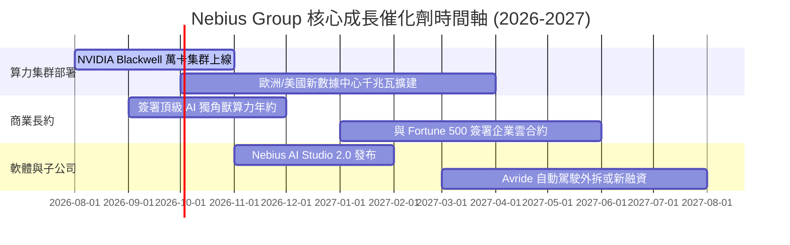

### 9.2 TAM 市場規模分析

```
╔══════════════════════════════════════════════════════════════════╗
║                 Nebius AI 潛在市場規模 (TAM)                     ║
╠══════════════════════════════════════════════════════════════════╣
║                                                                  ║
║  全球 AI 雲基礎設施 TAM (2030E):  $400B                          ║
║  ██████████████████████████████████████████████████████████████  ║
║                                                                  ║
║  專業 AI Neocloud 算力 TAM:      $90B                           ║
║  ██████████████████████                                          ║
║                                                                  ║
║  Nebius 目標服務市場 (SOM):       $15B (隱含 16.7% Neocloud 市佔)  ║
║  █████                                                           ║
║                                                                  ║
╚══════════════════════════════════════════════════════════════════╝
```

### 9.3 成長驅動力結構圖

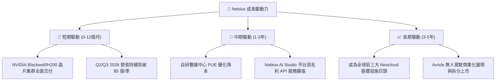

---

## 10. 風險矩陣

### 10.1 風險評分矩陣

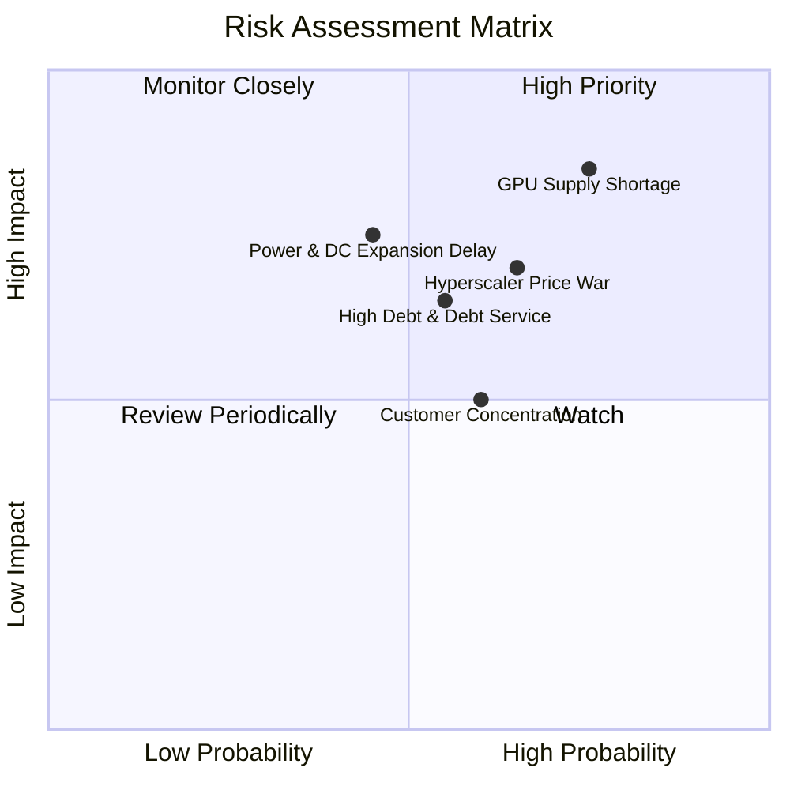

### 10.2 風險清單詳細分析

| # | 風險項目 | 發生機率 | 財務衝擊 | 風險評分 | 緩解措施 |
|---|----------|----------|----------|----------|----------|
| 1 | 🔴 **GPU 供應鏈延遲與分配受限** | 高 (75%) | 高 (-20% 營收) | 🔴 **8.0/10** | 與 NVIDIA 建立 Tier-1 戰略合作夥關係 |
| 2 | 🔴 **電力與數據中心配額獲取延誤** | 中 (45%) | 高 (-15% 營收) | 🔴 **7.5/10** | 分散於歐美多個電力供應穩定的地區佈局 |
| 3 | 🟡 **Hyperscalers 降價發起算力價格戰** | 中 (65%) | 中 (-10% 毛利) | 🟡 **6.5/10** | 強化 Nebius AI Studio 軟體層服務附著度 |
| 4 | 🟡 **高額債務利息負擔** | 中 (55%) | 中 (-$1.5B 現金) | 🟡 **6.0/10** | 手握 $93.7B 現金，保持高流動性防禦 |

---

## 11. 投資建議

### 11.1 最終綜合評級雷達圖

```
╔══════════════════════════════════════════════════════════════╗
║                Nebius Group 綜合維度評分雷達                 ║
╠══════════════════════════════════════════════════════════════╣
║  成長動能 (Growth)      9.5/10  ▓▓▓▓▓▓▓▓▓▓▓▓▓▓▓▓▓▓▓░  🟢     ║
║  技術領先 (Tech)        9.0/10  ▓▓▓▓▓▓▓▓▓▓▓▓▓▓▓▓▓▓░░  🟢     ║
║  資產負債表 (Balance)   7.5/10  ▓▓▓▓▓▓▓▓▓▓▓▓▓▓▓░░░░░  🟢     ║
║  護城河 (Moat)          7.5/10  ▓▓▓▓▓▓▓▓▓▓▓▓▓▓▓░░░░░  🟢     ║
║  估值吸引力 (Valuation) 7.0/10  ▓▓▓▓▓▓▓▓▓▓▓▓▓▓░░░░░░  🟡     ║
║  獲利品質 (Earnings)    6.0/10  ▓▓▓▓▓▓▓▓▓▓▓▓░░░░░░░░  🟡     ║
╠══════════════════════════════════════════════════════════════╣
║  綜合總評分：          7.6 / 10  評級：🟢 買入 (BUY)         ║
╚══════════════════════════════════════════════════════════════╝
```

### 11.2 目標價與隱含報酬率

| 情境 | 機率權重 | 12 個月目標價 ($) | 相對當前股價 $218.99 隱含報酬率 | 核心前提假設 |
|------|----------|-------------------|--------------------------------|--------------|
| 🔴 **悲觀情境** | 20% | **$165.00** | -24.7% | 算力出租率下滑，Capex 回收期拉長 |
| 🟡 **基準情境** | 60% | **$255.00** | **+16.4%** | Blackwell 按期順利部署，營收維持 >80% 成長 |
| 🟢 **樂觀情境** | 20% | **$380.00** | +73.5% | 全球算力極度緊缺，租金價格大漲，軟體溢價提升 |
| **加權期望值** | 100% | **$262.00** | **+19.6%** | 三情境加權結果 |

### 11.3 買入時機與觸發因素

```
╔══════════════════════════════════════════════════════════════════╗
║                  ✅ 買入觸發因素 Checklist                      ║
╠══════════════════════════════════════════════════════════════════╣
║                                                                  ║
║  立即分批買入條件（已符合）：                                    ║
║  ✅ Q1 2026 單季營收 YoY 成長 > 500%（實際達到 683.9%）          ║
║  ✅ 現金儲備 > $80 億（實際達到 $93.7 億）                       ║
║  ✅ 毛利率維持在 70% 以上高水準（實際達到 72.1%）               ║
║                                                                  ║
║  加碼觸發條件（逢低逢回拉回時加碼）：                            ║
║  ☐ 股價拉回至安全區間 $180.00 – $200.00 (MOS ≥ 20%)              ║
║  ☐ 官方宣布簽署超過 $10 億之大型 Enterprise AI 算力長約           ║
║                                                                  ║
║  減碼/停損觸發條件（出現以下任一即執行）：                       ║
║  ☐ 季度毛利率跌破 55%                                            ║
║  ☐ 營收 YoY 成長率驟降至 100% 以下                              ║
╚══════════════════════════════════════════════════════════════════╝
```

### 11.4 投資人適配度分析

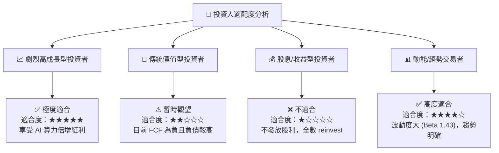

### 11.5 每季財報監控清單（Quarterly Watch List）

| 監控指標 | 最新季度數據 (Q1 26) | 正常利多區間 (加碼門檻) | 預警利空區間 (減碼門檻) | 追蹤意義 |
|----------|----------------------|------------------------|------------------------|----------|
| **單季營收 ($M)** | **$399.0M** | > $450M (QoQ +13%) | < $320M (成長失速) | 驗證算力集群上線進度 |
| **毛利率 Gross Margin** | **74.0%** | > 70.0% | < 60.0% | 檢視 GPU 租賃定價權與電力成本 |
| **營業利益率 Operating Margin**| **-32.1%** | > -20.0% (加速收虧) | < -50.0% | 觀察營運槓桿釋放程度 |
| **現金及等價物 ($B)** | **$9.30B** | > $7.0B | < $4.0B | 確保 Capex 融資續航力 |
| **季度 Capex 支出 ($B)** | **-$2.47B** | $2.0B - $3.0B (正常擴產) | > $4.0B (現金消耗過快) | 監控算力資本投入節奏 |

### 11.6 反面論證：什麼會證明論點錯誤（What Would Change My Mind）

```
╔══════════════════════════════════════════════════════════════════╗
║              ⚠️ 論點失效條件（Disconfirming Evidence）           ║
╠══════════════════════════════════════════════════════════════════╝
║  若發生以下任一量化條件，本報告之「買入」投資論點即宣告失效：     ║
║                                                                  ║
║  ☐ 1. Nebius AI 算力集群之營收 YoY 成長率連續兩季跌破 +100%。   ║
║  ☐ 2. 毛利率因 Hyperscalers 價格戰衝擊，連續兩季降至 50% 以下。 ║
║  ☐ 3. 現金及等價物消耗至 $30 億以下，且無法以合理代價融資。     ║
║  ☐ 4. TTM ROIC 在 2027 年底前無法突破 10.0% (WACC 門檻)。       ║
║  ☐ 5. 主要供應商 NVIDIA 顯著調降對 Nebius 的配額順位。           ║
╚══════════════════════════════════════════════════════════════════╝
```

---

> **免責聲明**：本報告為 AI 輔助機構級研究團隊自動生成，僅供學術與投資研究參考，不構成任何買賣證券之投資建議。投資美股具有高度風險，股票價格可能劇烈波動甚至損失全部本金。投資人在做出任何投資決策前，應審慎評估個人風險承受能力並諮詢專業合格之投資顧問。