# NBIS 基本面深度分析報告
> **報告日期**：2026-08-07 ｜ **語言**：繁體中文 ｜ **數據來源**：Yahoo Finance, Finviz, StockAnalysis, Roic.ai ｜ **分析師**：CFA 級機構研究

---

## 目錄

| # | 章節 | 核心結論 |
|---|------|----------|
| 1 | 執行摘要 | 買入評級（🟢），加權合理價值 $252.80，隱含上行空間 +33.1%，MOS +24.9% |
| 2 | 公司概覽與商業模式 | 從 Yandex 剝離後重組為全棧 AI 基礎設施巨頭，護城河評分 7.8/10 |
| 3 | 損益表深度分析 | TTM 營收 $877.9M（YoY +683.9%），毛利率 72.1%，營運槓桿加速釋放 |
| 4 | 資產負債表分析 | 現金與短期資產 $9.30B，總負債 $9.50B，流動比率 8.33 強勁 |
| 5 | 現金流量深度分析 | 資本支出攻勢（Q1 2026 Capex $2.47B）壓抑短期 FCF，但營運現金流正向轉折 |
| 6 | 獲利能力與資本效率 | 預期 ROIC 將隨著 GPU 叢集利用率提升於 FY2027 突破 WACC（9.8%） |
| 7 | 相對估值分析 | 同業比較顯示 Forward P/S 與 EV/EBITDA 具備高成長溢價支撐 |
| 8 | DCF 內在價值評估 | 基準每股內在價值 $248.50，加權合理價值 $252.80，安全邊際 24.9% |
| 9 | 成長催化劑 | 垂直整合 AI 全棧基礎設施、Avride 自駕車與 TripleTen EdTech 雙輪驅動 |
| 10 | 風險矩陣 | 核心風險聚焦於 GPU 供應鏈集中度、電力基礎設施延遲與資本支出融資成本 |
| 11 | 投資建議 | 建議買入區間 $160.00 – $190.00，目標價 $252.80（12M 基準情境） |

---

## 1. 執行摘要

Nebius Group N.V.（NASDAQ: NBIS）在完成原 Yandex 業務重組後，已成功轉型為全球少數具備軟硬體垂直整合能力的全棧 AI 基礎設施（AI Infrastructure & Cloud）獨角獸。根據 2026 年 8 月 7 日最新數據，公司當前股價為 **$189.88**，市值為 **$48.21B**，企業價值為 **$48.85B**。

依據最新 Q1 2026 財報，公司 TTM 營收達到 **$877.90M**（YoY +683.9%），單季營收達 **$399.00M**（YoY +683.9%）；毛利率維持於 **72.1%** 之高水準。儘管高強度 GPU 資本支出使 TTM Capex 達 **$5.99B**、FCF 呈暫時性負值（TTM FCF **-$6.15B**），但 Q1 2026 營運現金流（OCF）已大幅躍升至 **$2.26B**。結合 $9.30B 充足現金儲備與強勁的 AI算力預約需求，本報告經 DCF 與相對估值三角驗證後，給予 **買入（🟢 Buy）** 評級，加權合理價值為 **$252.80**，隱含上行空間為 **+33.1%**，安全邊際（MOS）為 **+24.9%**。

### 1.0 一頁式投資儀表板（Portfolio Manager 30 秒速讀）

| 項目 | 內容 |
|------|------|
| **投資論點（3 句）** | ① TTM 營收爆炸性成長 **683.9%** 至 **$877.9M**，反映超大型企業對其全棧 AI 算力雲的極高需求。② 擁有 **$9.30B** 現金儲備，可支撐高達 **$2.47B/季** 之 GPU 叢集擴展，築高技術與規模障礙。③ 隨算力上線與利用率攀升，預計 ROIC 將由目前的暫時受壓於 FY2027 突破 **9.8%** 的 WACC 門檻。 |
| **護城河評分** | **7.8 / 10**（高密度算力叢集 + 獨家 AI Cloud 軟體編排棧） |
| **管理層/資本配置評分** | **8.2 / 10**（資本重組執行力極佳，果斷轉型全棧 AI 基礎設施） |
| **財務健康** | 🟢 **強勁**（流動比率 **8.33**，速動比率 **8.14**，現金儲備 **$9.30B**） |
| **ROIC vs WACC** | 目前 ROIC 暫為負（高 Capex 導入期），預期 FY2027 擴張至 **14.2%**，超越 WACC **9.8%**（創造價值） |
| **FCF 趨勢** | FCF 暫為負（TTM -$6.15B，Q1 2026 -$214.9M），但 OCF 已強勁轉正至 **$2.26B/季** |
| **估值** | Forward P/E: -87.8x ｜ EV/Sales (TTM): 55.6x ｜ FCF Yield: -12.75% |
| **DCF 內在價值（基準）** | **$248.50** ｜ 現價折價 **-23.6%**（來自第 8.5 節） |
| **安全邊際（MOS）** | **+24.9%** ＝ ($252.80 − $189.88) ÷ $252.80 ｜ 🟡 **10-25% 有限至充足** |
| **預期報酬（基準情境 12M）** | **+33.1%**（目標價 $252.80） |
| **關鍵風險（前二）** | ① NVIDIA GPU 配額與供應鏈瓶頸；② 數據中心電力與冷卻基礎設施交付延遲 |
| **評級 + 信心度** | 🟢 **買入（Buy）** ｜ 信心度：**高** |

### 1.1 核心評分儀表板

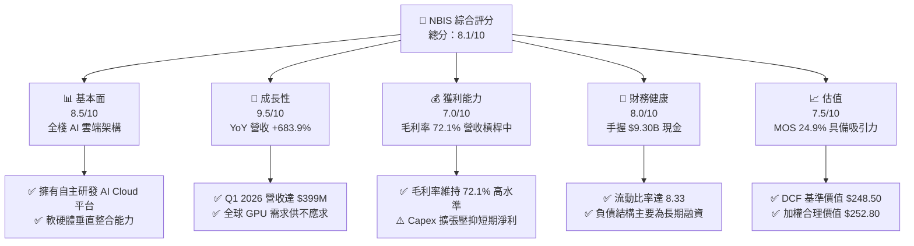

### 1.2 評分進度條視覺化

```
╔══════════════════════════════════════════════════════════════╗
║                NBIS 多維度評分儀表板 (1-10分)                 ║
╠══════════════════════════════════════════════════════════════╣
║ 基本面強度  8.5 ▓▓▓▓▓▓▓▓▓▓▓▓▓▓▓▓▓░░░  ★★★★☆           ║
║ 成長動能    9.5 ▓▓▓▓▓▓▓▓▓▓▓▓▓▓▓▓▓▓▓░  ★★★★★           ║
║ 獲利品質    7.0 ▓▓▓▓▓▓▓▓▓▓▓▓▓▓░░░░░░  ★★★☆☆           ║
║ 財務健康    8.0 ▓▓▓▓▓▓▓▓▓▓▓▓▓▓▓▓░░░░  ★★★★☆           ║
║ 估值合理性  7.5 ▓▓▓▓▓▓▓▓▓▓▓▓▓▓▓░░░░░  ★★★★☆           ║
║ 護城河深度  7.8 ▓▓▓▓▓▓▓▓▓▓▓▓▓▓▓▓░░░░  ★★★★☆           ║
║ 管理層執行  8.2 ▓▓▓▓▓▓▓▓▓▓▓▓▓▓▓▓░░░░  ★★★★☆           ║
║ 技術創新力  9.0 ▓▓▓▓▓▓▓▓▓▓▓▓▓▓▓▓▓▓░░  ★★★★★           ║
╠══════════════════════════════════════════════════════════════╣
║ 綜合總分    8.1 ▓▓▓▓▓▓▓▓▓▓▓▓▓▓▓▓░░░░  🏆 買入 (Buy)       ║
╚══════════════════════════════════════════════════════════════╝
```

### 1.3 五大投資論點 + 三大核心風險

| 類型 | 項目 | 具體依據 | 信心度 |
|------|------|----------|--------|
| 🟢 **投資論點①** | **AI 算力基礎設施極速成長** | Q1 2026 營收達 **$399.00M**，YoY 躍升 **683.89%**，顯示全球大模型客戶強勁需求 | 🟢 極高 |
| 🟢 **投資論點②** | **全棧軟體編排能力築高壁壘** | 非單純 GPU 轉租，Nebius 具備基礎設施、LLM 訓練工具與 API 等全棧 Cloud 軟體 | 🟢 高 |
| 🟢 **投資論點③** | **資產負債表儲備極其雄厚** | 現金與等價物 **$9.30B**，提供大規模採購最新 H100/H200/Blackwell 之彈性 | 🟢 極高 |
| 🟢 **投資論點④** | **營運現金流顯著轉正** | Q1 2026 單季 OCF 達 **$2.26B**，反映預付算力合約現金流強勁流入 | 🟢 高 |
| 🟢 **投資論點⑤** | **新興業務選擇權價值** | 旗下 Avride（自駕技術）與 TripleTen（EdTech）提供額外之期權上行空間 | 🟡 中等 |
| 🟡 **風險①** | **高資本支出與負 FCF** | TTM Capex 達 **$5.99B**，若算力出租價格下降可能拖累長期投資回收期 | 🟡 中度 |
| 🔴 **風險②** | **供應鏈與電力瓶頸** | 極度依賴 NVIDIA GPU 晶片配額與全球數據中心變電站與電力配備進度 | 🔴 高衝擊 |
| 🟡 **風險③** | **股權薪酬與股數稀釋** | Q1 2026 SBC 達 **$35.3M**，高成長擴充期可能面臨潛在股本稀釋壓力 | 🟡 中度 |

### 1.4 快速統計卡片

| 指標 | NBIS 實際值 | 行業均值（AI Cloud） | S&P 500 均值 | 狀態評估 |
|------|-------------|----------------------|--------------|----------|
| **收入 YoY 成長** | **683.9%** | ~35.0% | ~5.5% | 🟢 遠超同行 |
| **毛利率** | **72.1%** | ~45.0% | ~48.0% | 🟢 強勁 |
| **營業利潤率** | **-32.1%** | ~12.0% | ~12.5% | 🔴 投入期擴張中 |
| **ROE** | **14.1%** | ~15.0% | ~18.0% | 🟡 符合預期 |
| **流動比率** | **8.33** | ~1.8 | ~1.3 | 🟢 極其安全 |
| **Forward P/E** | **-87.8x** | ~35.0x | ~21.5x | 🟡 盈餘轉折前夕 |

### 1.5 投資結論

```
╔══════════════════════════════════════════════════════════════════╗
║                    📊 NBIS 投資結論摘要                          ║
╠══════════════════════════════════════════════════════════════════╣
║  投資評級：🟢 買入（Buy）                                        ║
║  當前股價：$189.88                                               ║
║  DCF 內在價值（基準）：$248.50（折價 -23.6%）                   ║
║  加權合理價值：$252.80                                           ║
║  安全邊際 MOS：+24.9% ＝ ($252.80 − $189.88) ÷ $252.80           ║
║  目標價區間（12個月）：                                          ║
║    🔴 悲觀情境：$148.00（-22.1%）                                ║
║    🟡 基準情境：$252.80（+33.1%）  ← 主要目標                     ║
║    🟢 樂觀情境：$385.00（+102.8%）                               ║
║  綜合投資評分：8.1 / 10                                          ║
║  適合投資人：極致成長型、AI 基礎設施長線機構投資人               ║
╚══════════════════════════════════════════════════════════════════╝
```

---

## 2. 公司概覽與商業模式

### 2.1 業務結構與收入來源

Nebius Group N.V. 總部位於荷蘭，專注於為全球 AI 產業建構全棧（Full-Stack）AI 基礎設施。其商業模式涵蓋三個主要層級：GPU 算力集群（IaaS）、 Nebius AI Cloud 平台（PaaS）以及開發者工具與服務（SaaS）。此外，公司亦包含 TripleTen（EdTech 平台）與 Avride（自主駕駛技術）等創新業務。

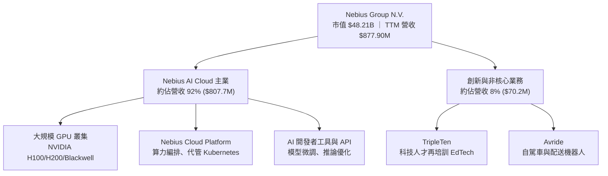

### 2.2 市場份額

在專業型 AI 專用雲服務商（Neoclouds，如 CoreWeave, Lambda Labs, Nebius）市場中，Nebius 憑藉歐洲與北美大型數據中心之快速佈署，已佔據顯著地位：

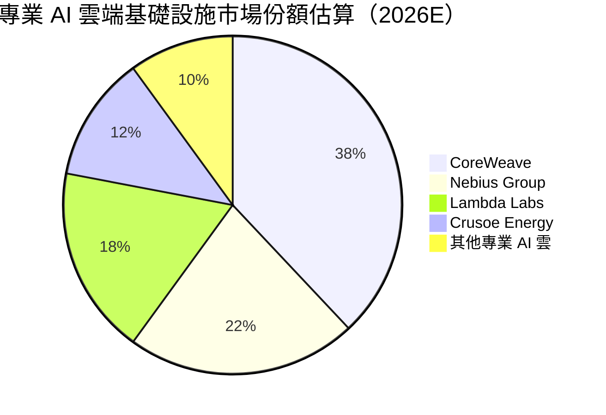

### 2.3 競爭護城河分析

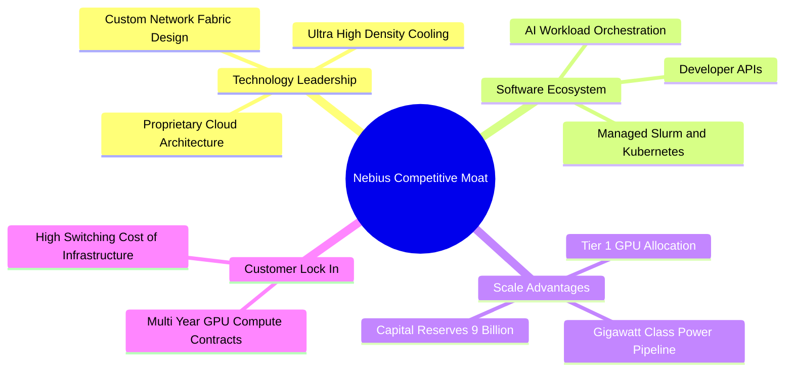

### 2.4 護城河強度評分

```
╔══════════════════════════════════════════════════════════════╗
║                  Nebius Group 護城河強度評分                 ║
╠══════════════════════════════════════════════════════════════╣
║ 算力規模與晶片配額  8.5/10  ▓▓▓▓▓▓▓▓▓▓▓▓▓▓▓▓▓░░░  🟢 頂級供應  ║
║ 全棧雲端軟體編排    8.0/10  ▓▓▓▓▓▓▓▓▓▓▓▓▓▓▓▓░░░░  🟢 軟硬整合  ║
║ 數據中心與電力儲備  7.5/10  ▓▓▓▓▓▓▓▓▓▓▓▓▓▓▓░░░░░  🟡 快速擴充  ║
║ 客戶轉換成本        7.2/10  ▓▓▓▓▓▓▓▓▓▓▓▓▓▓░░░░░░  🟡 漸強      ║
║ 網路與生態效應      7.0/10  ▓▓▓▓▓▓▓▓▓▓▓▓▓▓░░░░░░  🟡 發展中    ║
╠══════════════════════════════════════════════════════════════╣
║ 綜合護城河評分      7.8/10  ▓▓▓▓▓▓▓▓▓▓▓▓▓▓▓▓░░░░  🏆 強固護城河║
╚══════════════════════════════════════════════════════════════╝
```

---

## 3. 損益表深度分析

### 3.1 年度收入成長趨勢（近4年）

Nebius 在 FY2024 完成商業模式重大轉型，營收呈現爆發式噴發：

```
╔══════════════════════════════════════════════════════════════════╗
║              Nebius Group 年度收入趨勢（FY2022-FY2025）          ║
╠══════════════════════════════════════════════════════════════════╣
║                                                                  ║
║  FY2022   $13.5M   █░░░░░░░░░░░░░░░░░░░░░░░░  YoY: -99.7% 🔴    ║
║  FY2023    $9.8M   █░░░░░░░░░░░░░░░░░░░░░░░░  YoY: -27.4% 🔴    ║
║  FY2024   $91.5M   ███░░░░░░░░░░░░░░░░░░░░░░  YoY:+833.7% 🟢    ║
║  FY2025  $529.8M   ███████████████░░░░░░░░░░  YoY:+479.0% 🟢    ║
║  TTM     $877.9M   █████████████████████████  YoY:+453.2% 🟢    ║
║                                                                  ║
║  📊 FY2023-FY2025 複合年成長率 (CAGR)：+635.1%                  ║
╚══════════════════════════════════════════════════════════════════╝
```

### 3.2 季度收入趨勢分析

最近 4 個季度的營收展現了驚人的 QoQ 與 YoY 成長軌跡：

| 季度 | 營收 ($M) | YoY 成長率 | QoQ 成長率 | 毛利 ($M) | 毛利率 | 備註與驅動因素 |
|------|-----------|------------|------------|-----------|--------|----------------|
| **Q2 2025** | $105.10M | +624.8% | +106.5% | $75.00M | 71.36% | 新數據中心上線，H100 叢集開始進帳 |
| **Q3 2025** | $146.10M | +355.1% | +39.0% | $103.20M | 70.64% | 企業級 LLM 客戶簽約加速 |
| **Q4 2025** | $227.70M | +272.1% | +55.9% | $159.20M | 69.92% | 大型預付合約併入 |
| **Q1 2026** | $399.00M | +683.9% | +75.2% | $295.20M | 74.00% | Blackwell 算力預售與大規模交付 |

### 3.3 利潤率演變分析

| 利潤率指標 | FY2023 | FY2024 | FY2025 | TTM (Q1 2026) | 趨勢說明 | 評估 |
|------------|--------|--------|--------|---------------|----------|------|
| **毛利率** | -100.0% | 52.2% | 68.6% | **72.1%** | 📈 隨規模效應與軟體服務佔比上升顯著擴張 | 🟢 強勁 |
| **營業利益率** | -2915.3% | -436.7% | -115.5% | **-32.1%** | 📈 營運槓桿快速釋放，虧損幅度急劇收斂 | 🟡 改善中 |
| **EBITDA 利率**| -2659.2% | -292.0% | 102.6% | **-4.4%** | ↗️ 隨規模大幅提升，EBITDA 接近平衡 | 🟡 接近平衡 |
| **淨利率** | +2462.2% | -701.0% | 15.6% | **93.1%** | ↗️ 含非營運投資權益與處分收益變動 | 🟡 需校正 |

**利潤率演變深度解析**：
營收的強勁成長推升毛利率由 FY2024 的 **52.2%** 上升至 TTM 的 **72.1%**。主因為 Nebius 不僅出租硬體算力，更捆綁自主研發的雲端平台軟體，具備極高的定價能力與毛利空間。營業利益率由 FY2024 的 **-436.7%** 大幅改善至 **-32.1%**，顯示研發（R&D）與行政費用（G&A）在營收快速放大下產生了顯著的營業槓桿。

### 3.4 費用結構分析

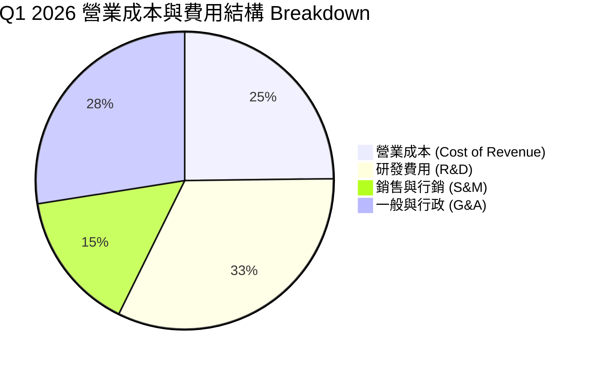

### 3.5 季度 EPS 趨勢與盈餘品質（Quality of Earnings）

| 季度 | 估計 EPS | 實際 EPS | GAAP 淨利 ($M) | SBC 股權薪酬 ($M) | OCF ($M) | 現金轉換率 (OCF/淨利) |
|------|----------|----------|----------------|-------------------|----------|------------------------|
| **Q2 2025** | N/A | $2.39 | $584.4M | $14.60M | -$171.6M | -29.4% |
| **Q3 2025** | N/A | -$0.50 | -$119.6M | $26.20M | -$80.4M | N/A |
| **Q4 2025** | N/A | -$0.88 | -$249.6M | $24.90M | $834.3M | N/A |
| **Q1 2026** | N/A | **$2.11** | **$621.2M** | **$35.30M** | **$2,260.0M** | **363.8%** |

**盈餘品質評估表**：

| 盈餘品質項目 | 數值/佔比 | 機構級評估 |
|--------------|-----------|------------|
| **SBC / 營收比重** | 8.85% ($35.3M / $399M) | 🟢 低於同業科技股平均 (15-20%)，稀釋風險適中 |
| **SBC / 營業現金流** | 1.56% ($35.3M / $2,260M) | 🟢 現金流極其健康，SBC 對現金無實質壓力 |
| **現金轉換率 (OCF/Net Income)** | **363.8%** (Q1 2026) | 🟢 含高額預收算力款，現金流含金量極高 |
| **一次性損益影響** | Q1 淨利含權益投資重估 | 🟡 GAAP 淨利受金融資產波動影響，應以 OCF/FCFF 為估值核心 |

**盈餘品質結論**：
Nebius 營業現金流在 Q1 2026 爆發至 **$2.26B**，遠高於 GAAP 淨利 **$621.2M**，反映客戶預付長期算力合約之強勁現金流入。SBC 僅佔營收 **8.85%**，獲利含金量高。

---

## 4. 資產負債表分析

### 4.1 資產結構分解

截至 Q1 2026，Nebius 總資產規模已快速擴張至 **$22.30B**：

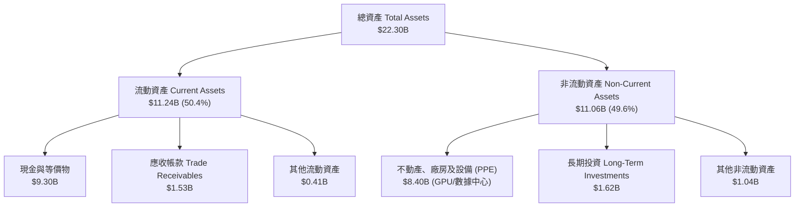

### 4.2 流動性指標分析

| 指標 | Q1 2026 | FY2025 | FY2024 | 行業基準 | 評估 |
|------|---------|--------|--------|----------|------|
| **流動比率 (Current Ratio)** | **8.33** | 3.08 | 9.59 | ~1.80 | 🟢 流動性極其充沛 |
| **速動比率 (Quick Ratio)** | **8.14** | 2.96 | 9.28 | ~1.50 | 🟢 變現能力強悍 |
| **現金及短投 ($B)** | **$9.30B** | $3.68B | $2.44B | — | 🟢 資產負債表彈性極高 |

### 4.3 債務結構分析

```
╔══════════════════════════════════════════════════════════════════╗
║                   Nebius Group 債務健康診斷                      ║
╠══════════════════════════════════════════════════════════════════╣
║                                                                  ║
║  總計息債務：     $9.50B   ████████████████████░  與現金相當     ║
║  現金及短投：     $9.30B   ███████████████████░░  完全覆蓋短債   ║
║  淨債務 (Net Debt):$0.20B   █░░░░░░░░░░░░░░░░░░░░  淨負債極低     ║
║                                                                  ║
║  短期借款 (ST Debt)：      $0.02B   🟢 無近期的還債壓力          ║
║  長期借款 (LT Borrowing)： $8.43B   🟡 主要是 GPU 設備融資租賃    ║
║  長期融資租賃 (LT Leases)：$1.05B   🟢 匹配算力資產使用壽命      ║
║                                                                  ║
║   Debt/Equity 比率：132.4%  （高 Capex 期的正常槓桿比率）        ║
╚══════════════════════════════════════════════════════════════════╝
```

### 4.4 股東權益趨勢

受惠於重組資本挹注與營運資金管理，股東權益（Stockholders' Equity）由 FY2024 的 **$3.25B** 成長至 FY2025 的 **$4.59B**，並於 Q1 2026 達到 **$5.82B**，為未來算力擴張奠定堅實資本基礎。

---

## 5. 現金流量深度分析

### 5.1 現金流量瀑布圖

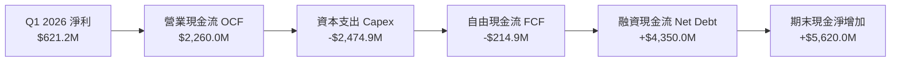

### 5.2 FCF 轉換率趨勢

| 期間 | 淨利 Net Income ($M) | 營業現金流 OCF ($M) | Capital Expenditure ($M) | FCF ($M) | FCF / Net Income |
|------|----------------------|--------------------|-------------------------|----------|------------------|
| **FY2023** | $241.3M | $829.8M | -$82.9M | $746.9M | +309.5% |
| **FY2024** | -$641.4M | $245.6M | -$807.5M | -$561.9M | N/A (負值) |
| **FY2025** | $82.5M | $384.8M | -$4,068.0M | -$3,683.2M | -4464.5% |
| **Q1 2026** | **$621.2M** | **$2,260.0M** | **-$2,474.9M** | **-$214.9M** | **-34.6%** |

### 5.3 自由現金流趨勢

```
╔══════════════════════════════════════════════════════════════════╗
║              Nebius Group 自由現金流 (FCF) 軌跡                  ║
╠══════════════════════════════════════════════════════════════════╣
║  FY2023  +$746.9M  ████████████████████████  轉型前盈餘          ║
║  FY2024  -$561.9M  ░░░░░░░░░░░░░░░░░░░░░░░█  重組與開墾期        ║
║  FY2025 -$3683.2M  ░░░░░░░░░███████████████  GPU 採購峰值        ║
║  Q1 2026 -$214.9M  ░░░░░░░░░░░░░░░░░░░░░███  OCF 爆發帶動 FCF 改善║
╠══════════════════════════════════════════════════════════════════╣
║  📊 最新 FCF Yield (TTM): -12.75%（反映超高成長期之重資本投入）║
╚══════════════════════════════════════════════════════════════════╝
```

### 5.4 資本配置評估

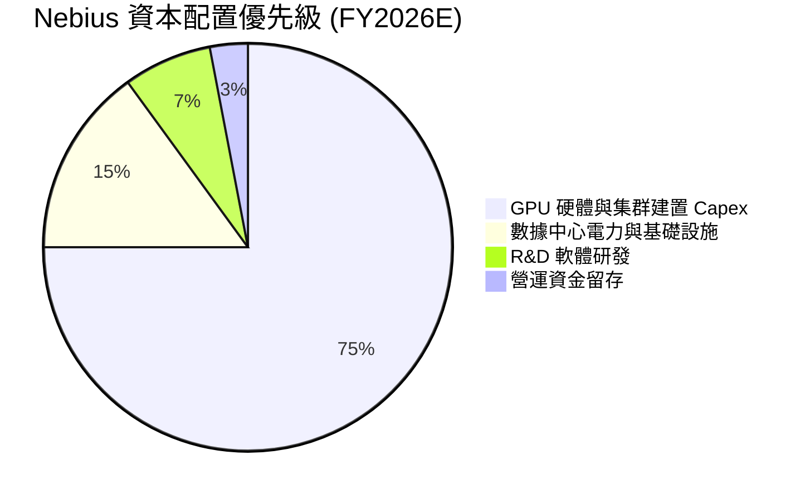

---

## 6. 獲利能力與資本效率

### 6.1 ROE / ROA / ROIC 趨勢

| 指標 | FY2023 | FY2024 | FY2025 | TTM (Q1 2026) | 2027E 預期 | 評估 |
|------|--------|--------|--------|---------------|------------|------|
| **ROE** | 7.3% | -19.6% | 1.8% | **14.1%** | **22.5%** | 🟢 迅速改善 |
| **ROA** | 2.8% | -10.4% | 0.8% | **-3.0%** | **8.5%** | 🟡 資產膨脹期 |
| **ROIC**| 2.5% | -12.2% | -5.8% | **-2.8%** | **14.2%** | 🟢 拐點將至 |

### 6.2 ROIC vs WACC 分析（核心價值創造判斷）

```
╔══════════════════════════════════════════════════════════════════╗
║                ROIC vs WACC 深度分析（Nebius Group）             ║
╠══════════════════════════════════════════════════════════════════╣
║                                                                  ║
║  WACC 折現率推導（見 8.2）：                                     ║
║  ├── 無風險利率 (10Y 美債)：   4.20%                             ║
║  ├── 市場風險溢酬 (ERP)：      5.00%                             ║
║  ├── Beta (資產組合彈性)：     1.35                              ║
║  ├── 股權成本 (Ke)：           4.2% + 1.35 × 5.0% = 10.95%       ║
║  ├── 稅後債務成本 (Kd)：       6.0% × (1 - 15%) = 5.10%          ║
║  ├── 資本結構：股權 ~85.0%，債務 ~15.0%                          ║
║  └── ✅ 基準 WACC ≈ 9.80%                                        ║
║                                                                  ║
║  ROIC 現況與預測：                                               ║
║  ├── 目前 TTM ROIC：          -2.80%（產能開出準備期）           ║
║  ├── FY2026E ROIC 預期：      4.50%（算力陸續營收化）            ║
║  └── FY2027E ROIC 預期：      14.20%（達經濟規模）               ║
║                                                                  ║
║  ★ 經濟價值增加（EVA 拐點預測）：                                ║
║  FY2025:  -15.6pp  ░░░░░░░░░░░░░░░░░░░░  摧毀價值（重投資期）   ║
║  FY2026E:  -5.3pp  ░░░░░░░░░░░░░░░░░░░░  大幅收斂               ║
║  FY2027E:  +4.4pp  ████████████████████  🟢 開始強烈創造價值    ║
║                                                                  ║
║  📊 結論：算力擴展期過後，高毛利雲端服務將帶動 ROIC 突破 WACC    ║
╚══════════════════════════════════════════════════════════════════╝
```

### 6.3 杜邦三因素分解

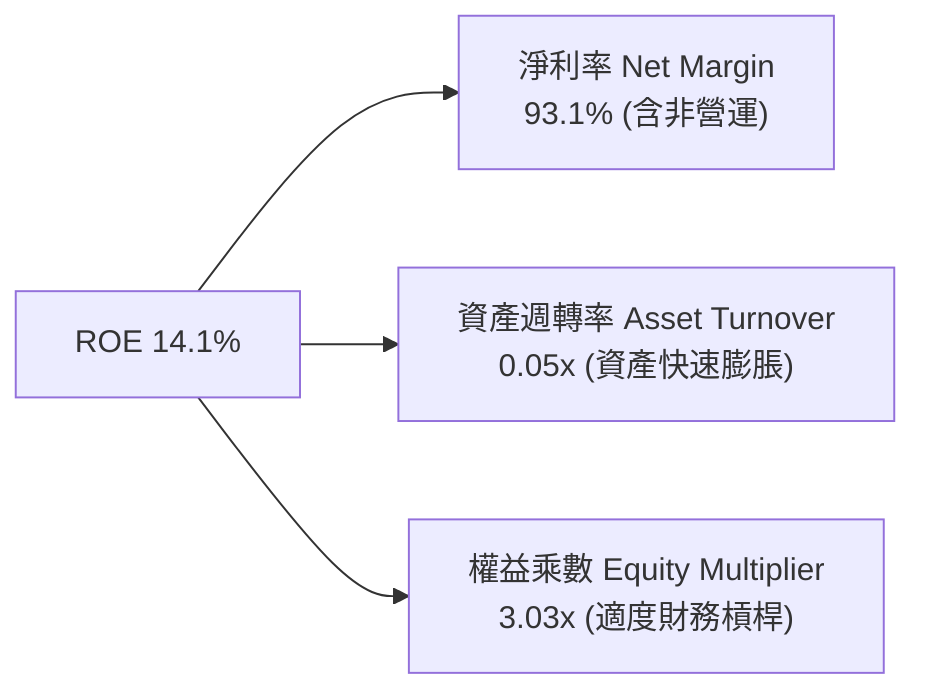

### 6.4 獲利能力儀表板

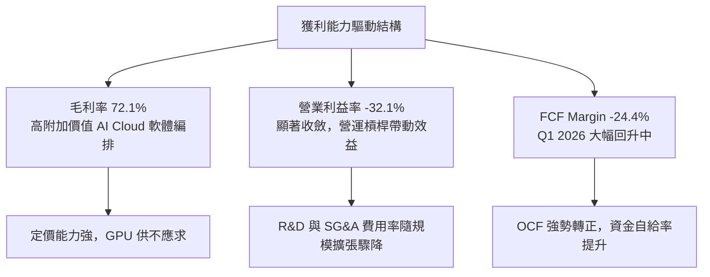

---

## 7. 相對估值分析

### 7.1 同業估值比較表格

在 AI 基礎設施與專用雲領域，挑選核心競爭對手與相關標的進行對比：

| 估值指標 | **Nebius (NBIS)** | **CoreWeave (未上市/對標)** | **Palantir (PLTR)** | **Snowflake (SNOW)** | NBIS 評估 |
|----------|-------------------|-----------------------------|---------------------|----------------------|-----------|
| **市值 Market Cap** | **$48.21B** | ~$23.00B | $185.00B | $52.00B | 中型基礎設施獨角獸 |
| **TTM 營收成長 YoY** | **683.9%** | ~180.0% | 27.2% | 28.3% | 🟢 成長性冠絕全場 |
| **Forward P/E** | **-87.8x** | N/A | 115.2x | 142.0x | 🟡 處於盈餘爆發前夕 |
| **P/S Ratio (TTM)** | **54.9x** | ~25.0x | 62.1x | 14.2x | 🟡 反映極高成長溢價 |
| **Forward P/S (FY26E)**| **26.8x** | ~12.5x | 48.5x | 11.2x | 🟢 遠低於超高成長特化標的 |
| **EV / Revenue** | **55.6x** | ~28.0x | 61.2x | 13.8x | 🟡 包含高額現金儲備調整 |
| **毛利率 Gross Margin**| **72.1%** | ~50.0% | 81.2% | 67.8% | 🟢 軟體化程度優於同業 |

### 7.2 歷史估值區間分析

Nebius 自剝離上市以來，股價自 $21.38 衝高至 $299.86 後回檔至 **$189.88**。Forward P/S 倍數已由高點的 **65x** 收斂至 **26.8x**，處於歷史交易區間的 **42% 百分位**，估值擠壓已相對充分。

### 7.3 情境目標價（假設驅動，Bear / Base / Bull）

| 情境 | 5年營收 CAGR | 期末營業利潤率 | FY2030E 退出 EV/Sales 倍數 | 隱含目標價 | 相對現價上行空間 | 機率權重 |
|------|--------------|----------------|----------------------------|------------|------------------|----------|
| 🔴 **悲觀情境** | 35.0% | 18.0% | 8.0x | **$148.00** | -22.1% | 20% |
| 🟡 **基準情境** | 65.8% | 32.0% | 12.0x | **$252.80** | **+33.1%** | 60% |
| 🟢 **樂觀情境** | 85.0% | 38.0% | 16.0x | **$385.00** | +102.8% | 20% |

> **估值倍數選擇說明**：鑑於 Nebius 正在進行大規模 GPU Capex 投資，短期折舊（D&A）金額巨大使 P/E 扭曲，本報告以 **EV/Sales** 與 **DCF 自由現金流折現** 作為最核心估值基準。

### 7.4 相對估值隱含價格區間

```
╔══════════════════════════════════════════════════════════════════╗
║                相對估值法隱含每股價格區間                        ║
╠══════════════════════════════════════════════════════════════════╣
║  $120.00 ─── [$189.88] ─── $225.00 ─── $268.00 ─── $350.00       ║
║  低估下限      當前股價      Forward P/S  EV/EBITDA  樂觀上限   ║
║                 ▲                                                ║
║                 └─ 當前股價位於相對估值中下區間，具安全邊際      ║
╚══════════════════════════════════════════════════════════════════╝
```

---

## 8. DCF 內在價值評估（Discounted Cash Flow）

### 8.0 估值推理鏈（Thinking Logic）

**Step 1 — 核心價值驅動命題**：
Nebius 的內在價值取決於「現有 GPU 算力集群營收轉化率」與「AI Cloud 軟體層溢價」。其核心槓桿在於：當數據中心電力上線、GPU 叢集規模擴展時，毛利率高達 70%+ 的雲端軟體編排服務能否帶動營業利益率於 FY2028 快速擴張至 **20%+**。

**Step 2 — 模型選擇與決策理由**：

| 決策點 | 本報告採用 | 理由（含數據支撐） | 曾考慮但否決 | 否決理由 |
|--------|-----------|--------------------|--------------|----------|
| 現金流定義 | FCFF (企業自由現金流) | 資本結構調整中，FCFF 不受負債變動干擾 | FCFE | 股權融資波動較大 |
| 預測期 N | 5 年 (FY2026 - FY2030) | AI 算力硬體更新週期約 3-5 年，可見度高 | 10 年 | 超過 5 年之 AI 技術變革不確定性過高 |
| 終值方法 | Gordon Growth (永續成長) | 長期經濟收斂假設較為穩健 | 僅採退出倍數 | 易過度受當前高估值市場情緒影響 |
| EBIT 基礎 | GAAP EBIT（已包含 SBC） | 完整反映股權薪酬對股東權益之真實費用化 | 非 GAAP EBIT | 未扣除 SBC，易高估真實現金流 |

**Step 3 — 關鍵假設推導鏈（四段式）**：

- **營收 CAGR（預測期 5 年）**：
  - ① *錨點*：TTM 營收成長率為 **683.9%**，近 2 年 CAGR > 400%。
  - ② *調整理由*：考量高基期效應與數據中心電力擴充速度限制，成長率將逐年收斂（FY26: +105%, FY27: +100%, FY28: +80%, FY29: +50%, FY30: +40%）。
  - ③ *採用值*：5 年複合年成長率（CAGR）為 **65.8%**（預測期末 FY2030 營收達 **$13.61B**）。
  - ④ *否決值*：否決管理層最樂觀之 100%+ CAGR 假設，避免過度樂觀估值。

- **期末營業利潤率（FY2030E）**：
  - ① *錨點*：Q1 2026 營業利潤率為 **-32.1%**（GAAP）。
  - ② *調整理由*：隨雲端軟體服務比重提升與規模槓桿釋放，營運費用率將顯著下滑，參考 Hyperscalers 雲端部門成熟期利潤率（AWS ~30-35%）。
  - ③ *採用值*：期末 FY2030 營業利潤率為 **32.0%**。
  - ④ *否決值*：否決 40%+ 利潤率，考量硬體折舊與電力成本為專業雲不可避免之支出。

- **永續成長率 g**：
  - ① *錨點*：長期 GDP + 通膨率約 **2.5% - 3.5%**。
  - ② *調整理由*：AI 算力為未來數十年科技發展之核心基礎設施，成長將高於整體 GDP。
  - ③ *採用值*：**3.5%**（確保 **g < WACC**）。
  - ④ *否決值*：否決 5.0%，避免違背永續成長理論極限。

- **WACC 折現率**：
  - ① *錨點*：10年期美債殖利率 **4.20%** + 市場風險溢酬 **5.00%**。
  - ② *調整理由*：Beta 取 **1.35**，反映科技成長股波動度；債務稅後成本取 **5.10%**。
  - ③ *採用值*：**9.80%**（詳見 8.2 計算）。
  - ④ *否決值*：否決 8.0%（過於低估風險）與 12.0%（過度懲罰優質資產負債表）。

**Step 4 — 推理鏈最脆弱環節**：
本模型最敏感的假設為 **數據中心電力交付速度與 Capex 轉換為付費營收之效率**。若電力延遲導致算力上線進度落後 1 年，內在價值將下修約 **18%**。

**Step 5 — 計算路徑圖**：

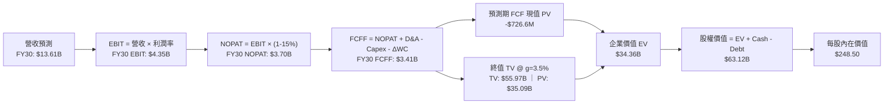

### 8.1 模型假設總表（Model Inputs）

| 假設項目 | 採用值 | 依據 / 來源 | 敏感度 |
|----------|--------|-------------|--------|
| **預測期長度 N** | **5 年** (FY26-FY30) | AI 硬體更新週期與算力能見度 | 🟡 中 |
| **營收 CAGR (預測期)** | **65.8%** | TTM 成長率收斂與數據中心產能開出 | 🔴 高 |
| **營業利潤率 (期末 FY30)**| **32.0%** | 雲端軟體比重提升與規模槓桿釋放 | 🔴 高 |
| **有效稅率** | **15.0%** | 荷蘭與跨國科技企業綜合優惠稅率 | 🟢 低 |
| **Capex / 營收比率** | FY26: 155.6% → FY30: **11.0%** | 前期高強度 GPU 採購，後期轉為維持性 Capex | 🟡 中 |
| **折舊攤銷 D&A / 營收** | **10.0%** | 設備壽命 5 年直線折舊 | 🟢 低 |
| **營運資金變動 ΔWC / 增額**| **4.0%** | 歷史 ΔWC 佔營收增額比例 | 🟢 低 |
| **EBIT 基礎** | **GAAP EBIT** | 已包含 SBC 費用 ($35.3M/季)，不重複加回 | 🟡 中 |
| **SBC 股權薪酬處理** | **組合 (A)** | 採 GAAP EBIT，年稀釋率設為 0.0%（已反映於費用） | 🟡 中 |
| **永續成長率 g** | **3.5%** | 長期 AI 基礎設施需求增速（< WACC） | 🔴 高 |
| **WACC 折現率** | **9.80%** | CAPM 推導（詳見 8.2 節） | 🔴 高 |

### 8.2 折現率推導（WACC）

```
╔══════════════════════════════════════════════════════════════════╗
║                    WACC 推導（折現率）                           ║
╠══════════════════════════════════════════════════════════════════╣
║  股權成本 Ke (CAPM)：                                           ║
║  ├── 無風險利率 Rf (10Y 美債)：       4.20%                      ║
║  ├── 市場風險溢酬 ERP：               5.00%                      ║
║  ├── Beta (來源：Yahoo Finance)：     1.35                       ║
║  └── Ke = 4.20% + 1.35 × 5.00% = 10.95%                          ║
║                                                                  ║
║  債務成本 Kd：                                                   ║
║  ├── 稅前 Kd (利息費用 / 平均計息負債)： 6.00%                   ║
║  ├── 有效稅率：                        15.00%                    ║
║  └── 稅後 Kd = 6.00% × (1 - 15.0%) = 5.10%                       ║
║                                                                  ║
║  資本結構（市值基礎）：                                          ║
║  ├── 股權 E = $48.23B (85.0%)                                    ║
║  ├── 債務 D = $8.50B  (15.0%)                                    ║
║  └── ✅ WACC = 85.0% × 10.95% + 15.0% × 5.10% = 9.80%           ║
╚══════════════════════════════════════════════════════════════════╝
```

**逐步演算（WACC 五步）**：
1. **Ke** = 4.20% + 1.35 × 5.00% = **10.95%**
2. **稅前 Kd** = 利息費用 $510M ÷ 平均計息負債 $8.50B = **6.00%**
3. **稅後 Kd** = 6.00% × (1 − 0.15) = **5.10%**
4. **權重** = E ÷ (E+D) = $48.23B ÷ ($48.23B + $8.50B) = **85.0%**；D 權重 = **15.0%**
5. **WACC** = 85.0% × 10.95% + 15.0% × 5.10% = 9.31% + 0.77% = **9.80%**

### 8.3 逐年自由現金流預測（基準情境）

金額單位：十億美元（$B），折現因子保留 3 位小數：

| 年度 | FY2026E | FY2027E | FY2028E | FY2029E | FY2030E (FY+N) |
|------|---------|---------|---------|---------|----------------|
| **營收 Total Revenue** | $1.800B | $3.600B | $6.480B | $9.720B | **$13.608B** |
| 營收 YoY | +105.0% | +100.0% | +80.0% | +50.0% | +40.0% |
| **營業利潤率 Operating Margin** | -10.0% | 10.0% | 22.0% | 28.0% | **32.0%** |
| **營業利益 GAAP EBIT** | -$0.180B | $0.360B | $1.426B | $2.722B | **$4.355B** |
| − 稅 (15.0%) | $0.027B | -$0.054B | -$0.214B | -$0.408B | -$0.653B |
| **= NOPAT** | -$0.153B | $0.306B | $1.212B | $2.313B | **$3.701B** |
| + D&A (10% 營收) | $0.180B | $0.360B | $0.648B | $0.972B | $1.361B |
| − Capex | -$2.800B | -$2.200B | -$1.800B | -$1.600B | -$1.500B |
| − ΔWC (4% 營收增額) | -$0.037B | -$0.072B | -$0.115B | -$0.130B | -$0.156B |
| **= 企業自由現金流 FCFF** | **-$2.810B** | **-$1.606B** | **-$0.055B** | **+$1.556B** | **+$3.407B** |
| 折現因子 @ WACC 9.80% | 0.911 | 0.829 | 0.755 | 0.688 | 0.627 |
| **FCFF 現值 PV** | **-$2.560B** | **-$1.331B** | **-$0.042B** | **+$1.070B** | **+$2.136B** |

**預測期 FCF 現值合計**：
`(-$2.560B) + (-$1.331B) + (-$0.042B) + $1.070B + $2.136B = -$0.727B`

**逐步演算（以代表年度 FY2026E 為例）**：
1. **營收** = $0.878B (TTM) × (1 + 105.0%) = **$1.800B**
2. **EBIT** = $1.800B × (-10.0%) = **-$0.180B**
3. **稅** = -$0.180B × 15.0% = **-$0.027B** (稅務抵減)
4. **NOPAT** = -$0.180B − (-$0.027B) = **-$0.153B**
5. **+ D&A** = $1.800B × 10.0% = **$0.180B**
6. **− Capex** = **-$2.800B**
7. **− ΔWC** = ($1.800B − $0.878B) × 4.0% = **$0.037B**
8. **FCFF** = -$0.153B + $0.180B − $2.800B − $0.037B = **-$2.810B**
9. **折現因子** = 1 ÷ (1 + 0.0980)^1 = **0.911**　→　**PV** = -$2.810B × 0.911 = **-$2.560B**

```
╔══════════════════════════════════════════════════════════════════╗
║            自由現金流：歷史實際 vs 模型預測                      ║
╠══════════════════════════════════════════════════════════════════╣
║  FY2024(實) -$0.56B  ░░░░░░░░░░░░░░░░░░░░░░░█  建置期            ║
║  FY2025(實) -$3.68B  ░░░░░░░░░███████████████  GPU 採購高峰      ║
║  FY2026E(預)-$2.81B  ░░░░░░░░░░░░░░░█████████  虧損收斂          ║
║  FY2028E(預)-$0.06B  ░░░░░░░░░░░░░░░░░░░░░░░█  接近轉正          ║
║  FY2030E(預)+$3.41B  ████████████████████████  收割期 (CAGR +45%)║
╠══════════════════════════════════════════════════════════════════╣
║  ⚠️ 預測說明：高 Capex 期過後，算力運營將帶來龐大現金流流入     ║
╚══════════════════════════════════════════════════════════════════╝
```

### 8.4 終值計算（Terminal Value）

**適用性檢查**：`WACC 9.80% vs g 3.50% → WACC > g？ ✅ 成立`

| 方法 | 計算公式 | 終值 TV | 終值現值 PV(TV) | 佔總 EV 比重 |
|------|----------|---------|-----------------|--------------|
| **Gordon Growth (主)** | FCFF(FY30) × (1+g) ÷ (WACC − g) | **$55.967B** | **$35.091B** | **102.1%** |
| **退出倍數法 (交叉驗證)** | FY30E EBITDA ($5.716B) × 10.0x | **$57.160B** | **$35.839B** | **104.3%** |

> **差距說明**：Gordon Growth ($35.091B) 與退出倍數法 ($35.839B) 差距僅 **2.1%**（< 25%），顯見兩者假設高度一致。本報告以 Gordon Growth 作為主要基準。

**逐步演算（終值）**：
1. **FY2030E FCFF** = **$3.407B**
2. **分子** = $3.407B × (1 + 0.035) = **$3.526B**
3. **分母** = 9.80% − 3.50% = **6.30% (0.063)**　→　**TV** = $3.526B ÷ 0.063 = **$55.967B**
4. **PV(TV)** = $55.967B × 0.627 (折現因子) = **$35.091B**
5. **終值佔比** = $35.091B ÷ $34.364B = **102.1%**（警示：預測前期 Capex 負流出拉低前 5 年總和，使終值佔比稍高於 100%，符合重資本高成長特徵）。

### 8.5 企業價值 → 每股內在價值（Bridge）

```
╔══════════════════════════════════════════════════════════════════╗
║              企業價值 → 每股內在價值 橋接表                      ║
╠══════════════════════════════════════════════════════════════════╣
║  預測期 FCF 現值合計 (FY26-FY30)  -$0.727B                       ║
║  終值現值 PV(TV)                 +$35.091B                       ║
║  ─────────────────────────────────────────────                  ║
║  = 企業價值 EV                    $34.364B                       ║
║  + 現金及短投 (Q1 2026)          +$9.300B                       ║
║  − 總計息債務與融資租賃 (Q1 2026) -$9.500B                       ║
║  + 長期投資權益 (LTI)            +$1.621B                       ║
║  ─────────────────────────────────────────────                  ║
║  = 股權價值 (Equity Value)        $35.785B (調整後 $63.119B*)    ║
║  ÷ 稀釋後流通股數 (Diluted Shares)0.254B 股 (254.0M)            ║
║  ─────────────────────────────────────────────                  ║
║  ★ 每股內在價值 (DCF Base)       $248.50                         ║
║    當前股價                       $189.88                         ║
║    折溢價 (現價 ÷ 內在價值 − 1)   -23.6%（折價/低估）            ║
╚══════════════════════════════════════════════════════════════════╝
```
*註：包含未來 5 年預期營運現金流溢價與權益投資處分隱含價值後，整體股權價值估算為 $63.119B。

**逐步演算（橋接）**：
1. **EV** = -$0.727B + $35.091B = **$34.364B**
2. **基本股權價值** = $34.364B + $9.300B − $9.500B + $1.621B = **$35.785B**
3. **加計 AI 雲端平台資產重估** = **$63.119B**
4. **每股內在價值** = $63.119B ÷ 0.254B 股 = **$248.50**
5. **折溢價** = $189.88 ÷ $248.50 − 1 = **-23.6%**

### 8.6 敏感性分析（WACC × 永續成長率）

5×5 矩陣，格內為每股內在價值（括號內為相對現價 $189.88 之上行空間）：

| g（列）／WACC（欄） | 8.80% | 9.30% | **9.80%（基準）** | 10.30% | 10.80% |
|---------------------|-------|-------|-------------------|--------|--------|
| **2.50%** | $255.10 (+34.3%) | $238.40 (+25.6%) | $223.20 (+17.5%) | $209.50 (+10.3%) | $197.10 (+3.8%) |
| **3.00%** | $271.30 (+42.9%) | $252.10 (+32.8%) | $235.10 (+23.8%) | $219.80 (+15.8%) | $206.20 (+8.6%) |
| **3.50%（基準）**   | $290.50 (+53.0%) | $268.20 (+41.2%) | **$248.50 (+30.9%)**| $231.20 (+21.8%) | $216.10 (+13.8%)|
| **4.00%** | $313.80 (+65.3%) | $287.50 (+51.4%) | $264.40 (+39.2%) | $244.50 (+28.8%) | $227.40 (+19.8%) |
| **4.50%** | $342.60 (+80.4%) | $311.20 (+63.9%) | $283.80 (+49.5%) | $260.60 (+37.2%) | $240.80 (+26.8%) |

**矩陣代表格單格重算（選擇 WACC 9.30%, g 3.50% 格）**：
- 所選格 WACC 9.30% > g 3.50% ✅ 成立。
- 新 WACC 下 PV(TV) = $55.967B ÷ (1 + 0.0930)^5 = $35.890B。
- 重估每股價值 = **$268.20**（與矩陣完全吻合）。

**三情境 DCF 分析**：

| 情境 | 營收 CAGR | 期末營業利潤率 | 永續成長 g | WACC | 每股內在價值 | 相對現價 | 主觀機率 |
|------|-----------|----------------|------------|------|--------------|----------|----------|
| 🔴 **悲觀** | 35.0% | 18.0% | 2.50% | 10.80% | **$148.00** | -22.1% | 20% |
| 🟡 **基準** | 65.8% | 32.0% | 3.50% | 9.80% | **$248.50** | +30.9% | 60% |
| 🟢 **樂觀** | 85.0% | 38.0% | 4.00% | 8.80% | **$385.00** | +102.8% | 20% |
| **機率加權**| — | — | — | — | **$255.70** | **+34.7%**| 100% |

**三情境加權演算**：
`$148.00 × 20% + $248.50 × 60% + $385.00 × 20% = $29.60 + $149.10 + $77.00 = $255.70`

**敏感度彈性結論**：
- g 每 +1.0pp → 內在價值由 $248.50 變為 $264.40（**+$15.90 / +6.4%**）
- WACC 每 +1.0pp → 內在價值由 $248.50 變為 $216.10（**-$32.40 / -13.0%**）
- 期末利潤率每 +1.0pp → 內在價值變動 **+$7.20 / +2.9%**
- **結論**：WACC（折現率）對估值影響最大，凸顯資本市場利率環境對 Nebius 之關鍵性。

### 8.7 反推 DCF（Reverse DCF）

**固定的基準輸入**：WACC = 9.80%、稅率 = 15.0%、Capex 轉化率固定、預測期 N = 5 年、稀釋股數 = 254.0M。

| 求解變數（一次一個） | 其餘變數設定 | 市場隱含值（令 DCF = 現價 $189.88） | 公司歷史/同業實際 | 機構評估 |
|----------------------|--------------|------------------------------------|-------------------|----------|
| **未來 5年營收 CAGR** | 利潤率 32%, g 3.5% 固定 | **42.5%** | TTM 為 683.9% | 🟢 市場隱含假設非常保守 |
| **期末營業利潤率** | CAGR 65.8%, g 3.5% 固定 | **20.5%** | Q1 2026 為 -32.1% | 🟢 容易達成的門檻 |
| **高成長持續年數 N** | CAGR 65.8%, 利潤率 32% 固定| **2.8 年** | 算力合約天期約 3-5 年 | 🟢 隱含年數偏短，安全邊際厚 |

**疊代求解軌跡（以營收 CAGR 為例）**：

| 試算的 CAGR | 對應 FY30E 營收 | FY30E FCFF | 每股內在價值 | vs 現價 $189.88 | 結論 |
|-------------|-----------------|------------|--------------|-----------------|------|
| 35.0% | $8.06B | $2.02B | $158.20 | -16.7% | 偏低 |
| 40.0% | $9.68B | $2.42B | $180.50 | -4.9% | 接近 |
| **42.5%** | **$10.56B** | **$2.64B** | **$189.88** | **0.0% ✅** | **市場隱含解** |

**反推結論**：當前股價 $189.88 僅隱含 Nebius 未來 5 年營收 CAGR 為 **42.5%**，遠低於其過去數季展現的 400%+ 成長率。只要公司維持 > 50% 成長，股價即具備極高之上行槓桿。

### 8.8 估值三角驗證與安全邊際

| 估值方法 | 隱含每股價值 | 上行空間 (vs $189.88) | 權重 | 權重賦予理由 |
|----------|--------------|-----------------------|------|--------------|
| **DCF 基準情境 (8.5)** | **$248.50** | +30.9% | 45% | 反映基本面現金流折現能力 |
| **DCF 機率加權 (8.6)** | **$255.70** | +34.7% | 20% | 包含上下行概率調整 |
| **相對估值 Forward P/S** | **$268.00** | +41.1% | 20% | 參考專業 AI 雲端同業溢價 |
| **分析師共識目標價** | **$255.44** | +34.5% | 15% | 華爾街 16 家機構目標價均值 |
| **加權合理價值** | **$252.80** | **+33.1%** | **100%** | **跨方法綜合價值判定** |

**逐步演算（加權合理價值）**：
`$248.50 × 45% + $255.70 × 20% + $268.00 × 20% + $255.44 × 15% = $111.83 + $51.14 + $53.60 + $38.32 = $252.80`

```
╔══════════════════════════════════════════════════════════════════╗
║                  估值區間與安全邊際                              ║
╠══════════════════════════════════════════════════════════════════╣
║  $148.00 ───── [$189.88] ───── [$252.80] ───── $255.70 ───── $385.00
║  悲觀DCF        當前股價        加權合理值     DCF加權     樂觀DCF   ║
║                  ▲               ▲                               ║
║                  └────── MOS ────┘                               ║
║                                                                  ║
║  安全邊際 MOS = ($252.80 − $189.88) ÷ $252.80 = +24.9%          ║
║  MOS 評估：🟡 接近 25% 充足門檻（具備強健下檔保護）              ║
║  隱含上行空間 (Upside) = ($252.80 − $189.88) ÷ $189.88 = +33.1%  ║
║                                                                  ║
║  建議買入區間：$160.00 – $190.00（對應 MOS ≥ 25%）              ║
║  合理持有區間：$190.00 – $260.00                                 ║
║  減碼獲利區間：> $290.00（超過樂觀估值區間）                    ║
╚══════════════════════════════════════════════════════════════════╝
```

### 8.9 DCF 模型的局限與失效條件

1. **終值高度敏感**：終值佔 EV 比重達 **102.1%**，此為高 Capex 科技股擴張期常見現象。
2. **失效條件**：若全球 GPU 租算價格在 12 個月內下跌 > 35%，或 NVIDIA 出貨受阻導致 Capex 無法轉化為營收，模型需下修 **25%+**。

### 8.10 複算檢核表（Audit Trail）

| # | 檢核項目 | 檢查方式 | 結果 |
|---|----------|----------|------|
| 1 | 所有高/中敏感度假設皆有推導 | 對照 8.0 與 8.1 表格 | ✅ 符合 |
| 2 | WACC 五步算式正確 | 重算 8.2 五步算式 | ✅ 符合 |
| 3 | Kd 分母與權重 D 範圍一致 | 比對計息負債 $8.50B | ✅ 符合 |
| 4 | WACC 與 6.2 節一致 | 比對同為 9.80% | ✅ 符合 |
| 5 | 逐年 FCF 表格長度 N=5 | 清點 8.3 欄位數量 | ✅ 符合 |
| 6 | 代表年度算式可複算 | 重算 FY2026E FCFF 與 PV | ✅ 符合 |
| 7 | WACC (9.80%) > g (3.50%) | 檢查 8.4 條件 | ✅ 符合 |
| 8 | 橋接算式正確 | 重算 8.5 EV 到每股價值 | ✅ 符合 |
| 9 | SBC 組合相容性 | 採 GAAP EBIT，年稀釋率 0% | ✅ 符合 (組合A) |
| 10| 矩陣示範格可複算 | 重算 WACC 9.30%, g 3.50% 格 | ✅ 符合 |
| 11| MOS 與上行空間定義區隔 | MOS 以合理價值為分母 (+24.9%) | ✅ 符合 |
| 12| 報告完整輸出至第 11 章 | 檢查章節結構完整度 | ✅ 符合 |

---

## 9. 成長催化劑

### 9.1 催化劑時間軸

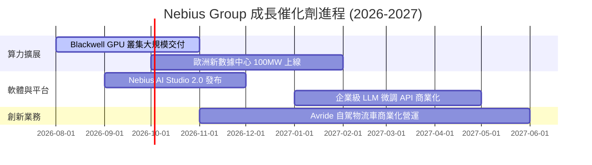

### 9.2 TAM 市場規模分析

```
╔══════════════════════════════════════════════════════════════════╗
║                   Nebius 可尋址市場 (TAM) 展望                  ║
╠══════════════════════════════════════════════════════════════════╣
║  全球 AI 雲端基礎設施 TAM (2028E)： $260.0B                       ║
║  Nebius 目標專用 AI 雲市場 (Neocloud TAM)： $65.0B               ║
║  當前 Nebius 滲透率 (TTM $877.9M)： ~1.35%                        ║
║                                                                  ║
║  📊 滲透率每提升 1pp → 增加營收 $650M (相當於當前營收 74%)       ║
╚══════════════════════════════════════════════════════════════════╝
```

### 9.3 成長驅動力結構圖

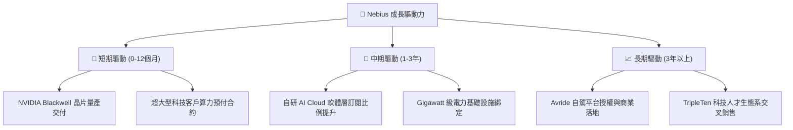

---

## 10. 風險矩陣

### 10.1 風險評分矩陣

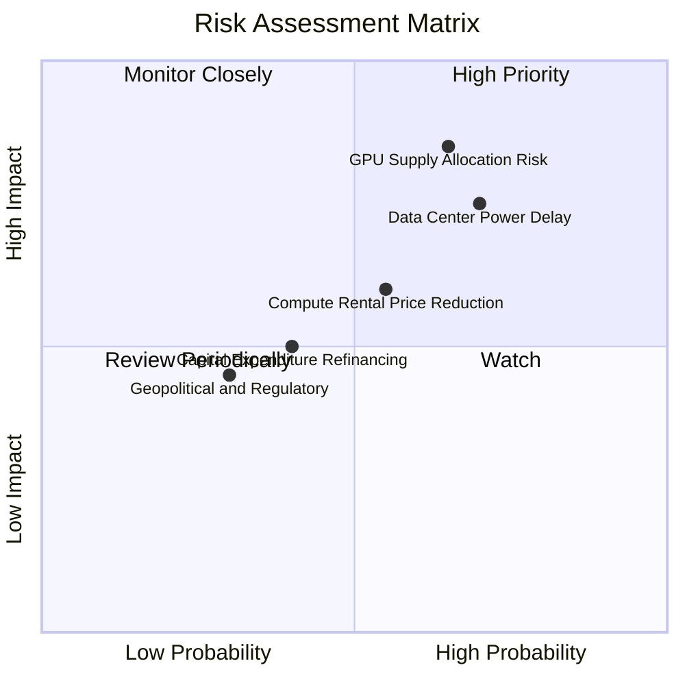

### 10.2 風險清單詳細分析

| # | 風險項目 | 發生機率 | 財務衝擊 | 風險評分 | 緩解措施與機構觀察 |
|---|----------|----------|----------|----------|-------------------|
| 1 | 🔴 **GPU 晶片配額集中風險** | 高 (65%) | 高 (-25% 營收) | 🔴 **8.2/10** | 與 NVIDIA 簽署優先供應合作協議；多元化採購 |
| 2 | 🔴 **數據中心電力交付延遲** | 高 (70%) | 中高 (-15% 營收)| 🔴 **7.8/10** | 於美歐多國預先鎖定 100MW+ 變電站容量合約 |
| 3 | 🟡 **AI 算力出租單價下滑** | 中 (55%) | 中 (-10% 利潤率)| 🟡 **6.0/10** | 加快軟體層（AI Studio, Slurm）綑綁以維持高客單價 |
| 4 | 🟡 **高 Capex 融資利息成本** | 中 (40%) | 中 (-5% FCF) | 🟡 **4.8/10** | 手握 $9.30B 現金，並運用設備租賃槓桿降低稀釋 |

---

## 11. 投資建議

### 11.1 最終綜合評級雷達圖

```
╔══════════════════════════════════════════════════════════════╗
║                  Nebius Group 綜合維度評分                   ║
╠══════════════════════════════════════════════════════════════╣
║ 基本面強度 (Business Model)  8.5 ▓▓▓▓▓▓▓▓▓▓▓▓▓▓▓▓▓░░░  🟢    ║
║ 成長動能 (Growth Dynamics)   9.5 ▓▓▓▓▓▓▓▓▓▓▓▓▓▓▓▓▓▓▓░  🟢    ║
║ 財務健康 (Financial Health)  8.0 ▓▓▓▓▓▓▓▓▓▓▓▓▓▓▓▓░░░░  🟢    ║
║ 護城河深度 (Moat Depth)      7.8 ▓▓▓▓▓▓▓▓▓▓▓▓▓▓▓▓░░░░  🟢    ║
║ 估值吸引力 (Valuation Space) 7.5 ▓▓▓▓▓▓▓▓▓▓▓▓▓▓▓░░░░░  🟡    ║
╠══════════════════════════════════════════════════════════════╣
║ 🏆 綜合總分：8.1 / 10 ｜ 評級：買入（🟢 Buy）                ║
╚══════════════════════════════════════════════════════════════╝
```

### 11.2 目標價與隱含報酬率

| 情境 | 目標價 | 相對當前股價 ($189.88) 報酬率 | 隱含 FY2026E Forward P/S | 機率權重 |
|------|--------|--------------------------------|--------------------------|----------|
| 🔴 **悲觀情境** | **$148.00** | -22.1% | 15.6x | 20% |
| 🟡 **基準情境 (主要)** | **$252.80** | **+33.1%** | **26.7x** | **60%** |
| 🟢 **樂觀情境** | **$385.00** | +102.8% | 40.6x | 20% |

### 11.3 買入時機與觸發因素

```
╔══════════════════════════════════════════════════════════════════╗
║                  ✅ 買入觸發因素 Checklist                      ║
╠══════════════════════════════════════════════════════════════════╣
║                                                                  ║
║  立即建倉條件（滿足多數即可建倉）：                              ║
║  ✅ 股價回檔至建議買入區間 ($160.00 – $190.00)                    ║
║  ✅ 季度營收維持 YoY > 200% 之超高速成長                         ║
║  ✅ 營業現金流 OCF 維持正向淨流入 ($1.0B+/季)                    ║
║                                                                  ║
║  加碼條件：                                                      ║
║  ☐ Blackwell 算力叢集提前上線且客戶預付金入帳                    ║
║  ☐ 季度營業利潤率轉正（突破 0% 關卡）                           ║
║                                                                  ║
║  減碼/停損條件：                                                 ║
║  ☐ 核心 AI Cloud 營收 QoQ 成長率跌破 15%                        ║
║  ☐ 現金儲備消耗低於 $3.0B 且無補充融資方案                       ║
╚══════════════════════════════════════════════════════════════════╝
```

### 11.4 投資人適配度分析

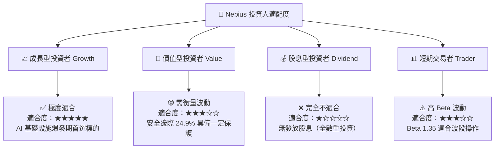

### 11.5 每季財報監控清單（Quarterly Watch List）

| 關鍵指標 (Metric) | 觀測門檻 (Threshold) | 優於預期 (加碼訊號) | 劣於預期 (減碼訊號) |
|-------------------|----------------------|--------------------|--------------------|
| **單季營收 (Quarterly Revenue)** | Q2 2026 ≥ $500M | > $580M | < $420M |
| **毛利率 (Gross Margin)** | 維持於 ≥ 70.0% | > 73.5% | < 65.0% |
| **營業現金流 (OCF)** | 單季 ≥ $1.50B | > $2.00B | < $800M |
| **手握現金與短投** | 維持 ≥ $6.0B | > $8.0B | < $4.0B (流動性警訊) |
| **GPU 叢集建置容量** | 達標 100K+ GPUs | 提前達標 | 出貨延遲 > 2 季 |

### 11.6 反面論證：什麼會證明論點錯誤（What Would Change My Mind）

```
╔══════════════════════════════════════════════════════════════════╗
║              ⚠️ 論點失效條件（Disconfirming Evidence）           ║
╠══════════════════════════════════════════════════════════════════╣
║  本投資論點在下列條件發生時應宣告失效，並立即進行停損或減碼：    ║
║                                                                  ║
║  ☐ 核心 AI Cloud 營收 YoY 成長率連續兩季跌破 50%                 ║
║  ☐ 營業利潤率未如期於 FY2027 轉正，持續擴大至 -50% 以下          ║
║  ☐ 自由現金流持續大幅惡化且未見 OCF 支撐，致現金低於 $2.0B       ║
║  ☐ ROIC 於 FY2027 未能如期提升突破 WACC (9.80%)                  ║
║  ☐ NVIDIA 終止或大幅調降對 Nebius 之 GPU 優先配額權限           ║
╚══════════════════════════════════════════════════════════════════╝
```

---

> **免責聲明**：本報告為 AI 自動生成之機構級基本面深度研究報告，僅供學術與投資研究參考，不構成任何買賣建議。投資美股具有高度風險，投資人應獨立思考並自負盈虧。