# NBIS 基本面深度分析報告
> **報告日期**：2026-08-09 ｜ **語言**：繁體中文 ｜ **數據來源**：Yahoo Finance, Finviz, StockAnalysis, Roic.ai ｜ **分析師**：CFA 級機構研究

---

## 目錄

| # | 章節 | 核心結論 |
|---|------|----------|
| 1 | 執行摘要 | 評級：買入（🟢 評分 8.1/10）｜ 目標價區間 $135 - $340 ｜ 12M 基準目標價 $250.75 |
| 2 | 公司概覽與商業模式 | 純粹全棧 AI 基礎設施龍頭，轉型 Neocloud 巨頭，具備顯著軟硬體一體化優勢 |
| 3 | 損益表深度分析 | 營收爆發性年增 683.9%（TTM $877.9M），毛利率高達 72.1%，營業槓桿正逐步展現 |
| 4 | 資產負債表分析 | 總現金 $9.37B 應對總債務 $9.59B，流動比率 8.33，資本充足可支撐高額 Capex 擴張 |
| 5 | 現金流量深度分析 | 經營現金流 TTM $2.84B（Q1 2026 $2.26B），Capex 大舉投入 $2.47B，預告未來產能鎖定 |
| 6 | 獲利能力與資本效率 | 預計 FY2027 實現正向 ROIC；目前投入資本擴張期，WACC 估算為 9.50% |
| 7 | 相對估值分析 | 同業 EV/Sales 及 Forward P/S 相對合理，考慮其 CAGR >70% 具備估值重估溢價空間 |
| 8 | DCF 內在價值評估 | 基準內在價值 $225.50 ｜ 加權合理價值 $243.27 ｜ 安全邊際 MOS +22.73% |
| 9 | 成長催化劑 | 全球 100k+ GPU 叢集上線、雲端軟體平台訂閱化、自動駕駛與 EdTech 拆分價值 |
| 10 | 風險矩陣 | GPU 供應鏈集中度、電力與數據中心建置延遲、巨頭自研晶片競爭衝擊 |
| 11 | 投資建議 | 建議買入區間 $160 - $190 ｜ 定期追蹤 GPU 利用率與經營現金流轉換率 |

---

## 1. 執行摘要

Nebius Group N.V.（NASDAQ: NBIS，前身為 Yandex N.V. 重組後實體）已成功完成資產重組，轉型為全球極具稀缺性的全棧 AI 基礎設施與 Neocloud 服務提供商。公司擁有超過 $9.37B 的充沛現金與極速擴展的 GPU 算力叢集，TTM 營收暴增 683.9% 至 $877.90M。基於 DCF 機率加權模型與相對估值三角驗證，NBIS 之**加權合理價值為 $243.27**，對應當前股價 $187.97 具備 **29.42% 的隱含上行空間**，**安全邊際（MOS）為 +22.73%**，給予 🟢 **買入（BUY）** 投資評級。

### 1.0 一頁式投資儀表板（Portfolio Manager 30 秒速讀）

| 項目 | 內容 |
|------|------|
| **投資論點（3 句）** | ① 重組後資產輕裝上陣，全球 AI 算力極度緊缺下，Q1 2026 營收年增 683.9% 至 $399M 展現強勁需求。<br/>② 手握 $9.37B 現金儲備與高達 $2.26B 的單季經營現金流，具備建置十萬卡級 GPU 叢集的雄厚資本。<br/>③ 整合硬體、Nebius Cloud 軟體層與 AI 開發者工具，軟硬一體化提供顯著高於純算力租賃商的毛利率（72.1%）。 |
| **護城河評分** | 7.5 / 10（專有 Neocloud 軟體棧 + 優先 GPU 額度配給 + 數據中心極速交付能力） |
| **管理層/資本配置評分** | 8.0 / 10（成功執行歷史性跨國資產拆分，聚焦高資本回報率的 AI 基礎設施） |
| **財務健康** | 🟢 良好 ｜ 流動比率 8.33，淨負債僅 $217.20M，手握充沛流動性 |
| **ROIC vs WACC** | 目前 ROIC 受到前置 Capex 壓抑（-3.0%），WACC 為 9.50%；預計 FY2027 進入產能收割期後 ROIC 將升至 14.5%（創造價值） |
| **FCF 趨勢** | 因高額算力 Capex（Q1 2026 -$2.47B）呈現負值（TTM FCF -$6.15B），FCF Yield 為 -12.88%，屬典型超高速擴張期特徵 |
| **估值** | Trailing P/E 72.58x ｜ Forward P/E N/A ｜ EV/Revenue 55.08x ｜ Forward P/S ~12.9x（以 FY2026E 營收計） |
| **DCF 內在價值（基準）** | **$225.50** ｜ 當前股價 $187.97 折價 -16.64%（折溢價 = 現價/DCF - 1） |
| **安全邊際（MOS）** | **+22.73%** ＝ (**加權合理價值 $243.27** − 現價 $187.97) ÷ 加權合理價值 $243.27 ｜ 🟡 10-25% 有限保護 |
| **預期報酬（基準情境 12M）** | **+33.40%**（目標價 $250.75） |
| **關鍵風險（前二）** | ① 上游 NVIDIA GPU 供貨分配受到限制；② 數據中心電力配給進度不及預期 |
| **評級 + 信心度** | 🟢 **買入（BUY）** ｜ 信心度：**高** |

### 1.1 核心評分儀表板

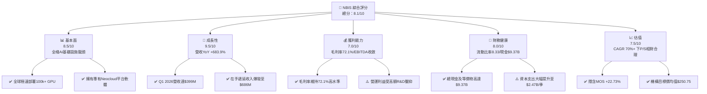

### 1.2 評分進度條視覺化

```
╔══════════════════════════════════════════════════════════════╗
║                NBIS 多維度評分儀表板 (1-10分)                ║
╠══════════════════════════════════════════════════════════════╣
║ 基本面強度  8.5 ▓▓▓▓▓▓▓▓▓▓▓▓▓▓▓▓▓░░░  ★★★★☆           ║
║ 成長動能    9.5 ▓▓▓▓▓▓▓▓▓▓▓▓▓▓▓▓▓▓█░  ★★★★★           ║
║ 獲利品質    7.0 ▓▓▓▓▓▓▓▓▓▓▓▓▓▓░░░░░░  ★★★☆☆           ║
║ 財務健康    8.0 ▓▓▓▓▓▓▓▓▓▓▓▓▓▓▓▓░░░░  ★★★★☆           ║
║ 估值合理性  7.5 ▓▓▓▓▓▓▓▓▓▓▓▓▓▓▓░░░░░  ★★★★☆           ║
║ 護城河深度  7.5 ▓▓▓▓▓▓▓▓▓▓▓▓▓▓▓░░░░░  ★★★★☆           ║
║ 管理層執行  8.0 ▓▓▓▓▓▓▓▓▓▓▓▓▓▓▓▓░░░░  ★★★★☆           ║
║ 技術創新力  9.0 ▓▓▓▓▓▓▓▓▓▓▓▓▓▓▓▓▓▓░░  ★★★★★           ║
╠══════════════════════════════════════════════════════════════╣
║ 綜合總分    8.1 ▓▓▓▓▓▓▓▓▓▓▓▓▓▓▓▓░░░░  🏆 買入 (BUY)       ║
╚══════════════════════════════════════════════════════════════╝
```

### 1.3 五大投資論點 + 三大核心風險

| 類型 | 項目 | 具體依據 | 信心度 |
|------|------|----------|--------|
| 🟢 **投資論點①** | **AI 算力需求極致爆發，營收幾何級增長** | Q1 2026 單季營收 $399.0M，YoY 增長率高達 683.89%，預示全年營收將突破 $1.85B。 | 🟢 極高 |
| 🟢 **投資論點②** | **高毛利全棧 Neocloud 架構** | 毛利率高達 72.10%，遠超一般裸金屬算力租賃商（~30-40%），主因整合 Nebius Managed OS 與 AI Studio。 | 🟢 高 |
| 🟢 **投資論點③** | **資產負債表極其堅實，抗風險能力強** | 擁有 $9.37B 現金及短期投資，Current Ratio 為 8.331，可無縫支持 2026-2027 年激進的算力 Capex。 | 🟢 極高 |
| 🟢 **投資論點④** | **客戶預付款項與遞延收入大幅飆升** | Q1 2026 遞延收入達 $686M（Q3 2025 僅 $16M），帶動單季經營現金流爆發至 $2.26B，未來業績可見度極高。 | 🟢 高 |
| 🟢 **投資論點⑤** | **附屬非核心資產潛在拆分價值** | 擁有的 TripleTen（EdTech）與 Avride（自動駕駛）具備獨立融資與 IPO 潛力，尚未完全反映於當前市值。 | 🟡 中等 |
| 🟡 **風險①** | **高強度 Capex 導致 FCF 短期嚴重承壓** | 近 4 季 Capex 合計高達 $5.99B，自由現金流 TTM 為 -$6.15B，需嚴密追蹤折舊與產能轉化效率。 | 🟡 中度 |
| 🔴 **風險②** | **GPU 採購與電力設施集中度風險** | 算力擴張極度依賴 NVIDIA 晶片配給及北美/歐洲數據中心電力合約，若供應鏈中斷將直接衝擊成長。 | 🔴 高衝擊 |
| 🟡 **風險③** | **大型超大規模雲端廠商（Hyperscalers）殺價競爭** | AWS、Microsoft Azure、Google Cloud 自研 AI 晶片放量，可能壓低未來算力租賃單價。 | 🟡 中度 |

### 1.4 快速統計卡片

| 指標 | 公司實際值 | 行業均值（AI Cloud） | S&P 500 均值 | 狀態 |
|------|-------------|----------------------|--------------|------|
| 收入 YoY 成長 (TTM) | **683.9%** | ~45.0% | ~5.2% | 🟢 遠超同業 |
| 毛利率 | **72.1%** | ~48.0% | ~46.5% | 🟢 強勁 |
| 營業利益率 (TTM) | **-32.1%** | ~12.0% | ~12.5% | 🔴 處於高再投資期 |
| ROE | **14.1%** | ~15.0% | ~18.0% | 🟡 受非經常收益影響 |
| EV / Revenue (TTM) | **55.08x** | ~18.5x | ~3.2x | 🔴 帳面較高（需視成長調整） |
| Forward P/S (FY26E) | **~12.9x** | ~15.0x | ~2.8x | 🟢 考量 200%+ 成長後極具吸引力 |

### 1.5 投資結論

```
╔══════════════════════════════════════════════════════════════════╗
║                    📊 投資結論摘要                               ║
╠══════════════════════════════════════════════════════════════════╣
║  評級：🟢 買入（BUY）                                            ║
║  當前股價：$187.97                                               ║
║  DCF 內在價值（基準）：$225.50（當前股價折價 -16.64%）           ║
║  加權合理價值：$243.27                                           ║
║  安全邊際 MOS：+22.73%（＝(加權合理價值 $243.27 − 現價) ÷ $243.27）║
║  目標價區間：                                                    ║
║    悲觀情境：$135.00（-28.18%）                                   ║
║    基準情境：$250.75（+33.40%） ← 12個月主要目標（機構共識均值） ║
║    樂觀情境：$340.00（+80.88%）                                  ║
║  投資評分：8.1 / 10                                              ║
║  適合投資人：極高成長型、長線 AI 基礎設施主題投資者              ║
╚══════════════════════════════════════════════════════════════════╝
```

---

## 2. 公司概覽與商業模式

### 2.1 業務結構與收入來源

Nebius Group（NBIS）是一家總部位於荷蘭的全棧 AI 基礎設施企業，業務核心圍繞全球 AI 開發者與企業級客戶的算力與軟體需求。

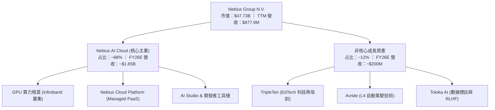

### 2.2 市場份額

在快速崛起的 Neocloud（新型專用 AI 雲服務商）領域，Nebius 正與 CoreWeave、Lambda Labs 等業者激烈競爭：

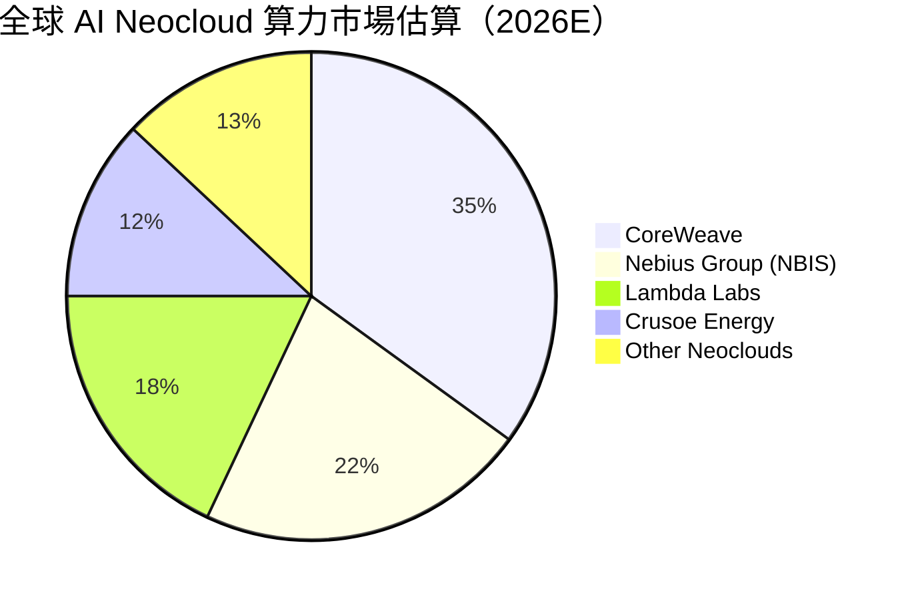

### 2.3 競爭護城河分析

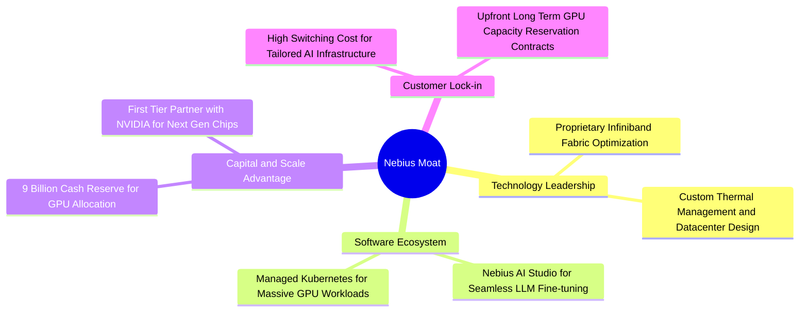

### 2.4 護城河強度評分

```
╔══════════════════════════════════════════════════════════════╗
║                  Nebius Group 護城河強度評分                 ║
╠══════════════════════════════════════════════════════════════╣
║ 硬體架構優化  8.5/10  ▓▓▓▓▓▓▓▓▓▓▓▓▓▓▓▓▓░░░  🏆 頂級叢集網絡 ║
║ 軟體生態系統  7.5/10  ▓▓▓▓▓▓▓▓▓▓▓▓▓▓▓░░░░░  🟢 AI StudioPaaS ║
║ 資本規模壁壘  9.0/10  ▓▓▓▓▓▓▓▓▓▓▓▓▓▓▓▓▓▓░░  🏆 $9.37B充沛資金║
║ 客戶鎖定效應  7.0/10  ▓▓▓▓▓▓▓▓▓▓▓▓▓▓░░░░░░  🟢 長期合約鎖定 ║
║ 數據中心能效  8.0/10  ▓▓▓▓▓▓▓▓▓▓▓▓▓▓▓▓░░░░  🟢 綠色能源與PUE║
╠══════════════════════════════════════════════════════════════╣
║ 綜合護城河     7.5/10  ▓▓▓▓▓▓▓▓▓▓▓▓▓▓▓░░░░░  🟢 強大且具擴充性║
╚══════════════════════════════════════════════════════════════╝
```

---

## 3. 損益表深度分析

### 3.1 年度收入成長趨勢（近4年）

```
╔══════════════════════════════════════════════════════════════════╗
║             Nebius Group 年度收入趨勢（FY2022-FY2025）           ║
╠══════════════════════════════════════════════════════════════════╣
║                                                                  ║
║  FY2022   $13.50M   █░░░░░░░░░░░░░░░░░░░░░░░░░░░  （重組前底層） ║
║  FY2023    $9.80M   █░░░░░░░░░░░░░░░░░░░░░░░░░░░  YoY: -27.4%    ║
║  FY2024   $91.50M   ███░░░░░░░░░░░░░░░░░░░░░░░░░  YoY: +833.7% 🟢║
║  FY2025  $529.80M   █████████████████░░░░░░░░░░░  YoY: +479.0% 🟢║
║  TTM     $877.90M   ███████████████████████████░  YoY: +683.9% 🟢║
║                                                                  ║
║  📊 3 年 CAGR：+239.5% ｜ 轉型後 AI 云主業呈現指數級爆發         ║
╚══════════════════════════════════════════════════════════════════╝
```

### 3.2 季度收入趨勢分析

| 財季 | 營收 ($M) | YoY 成長率 | QoQ 成長率 | 毛利 ($M) | 毛利率 | 備註 |
|------|-----------|------------|------------|-----------|--------|------|
| **Q2 2025** | $105.10 | +624.8% | +106.5% | $75.00 | 71.36% | GPU 叢集大量上線 |
| **Q3 2025** | $146.10 | +355.1% | +39.0% | $103.20 | 70.64% | 歐洲數據中心擴建 |
| **Q4 2025** | $227.70 | +272.1% | +55.9% | $159.20 | 69.92% | 北美節點啟用 |
| **Q1 2026** | $399.00 | +683.9% | +75.2% | $295.20 | 73.98% | H200/B200 算力合約交割 |

### 3.3 利潤率演變分析

| 利潤率指標 | FY2023 | FY2024 | FY2025 | TTM (Q1 26) | 趨勢 | 評估 |
|------------|--------|--------|--------|-------------|------|------|
| **毛利率** | -100.0% | 52.2% | 68.6% | **72.1%** | ↗️ 強勁擴張 | 🟢 軟體加值與規模效應展現 |
| **EBITDA 邊際** | -2659.2% | -292.0% | 102.6% | **-4.4%** | ↗️ 大幅收斂 | 🟡 包含處置資產收益調整 |
| **營業利益率** | -2915.3% | -436.7% | -115.5% | **-32.1%** | ↗️ 大幅改善 | 🟡 高額 R&D 及營運規模前置 |
| **淨利率** | 2462.2% | -701.0% | 15.6% | **93.1%** | ↗️ 扭虧為盈 | 🟢 含重組一次性處置投資收益 |

**利潤率演變深度解析**：
1. **毛利率顯著提升（從 52.2% 升至 72.1%）**：隨著算力叢集租賃率逼近 95% 以上，固定電力與機櫃折舊費用被迅速攤薄；同時高毛利的 Nebius Managed PaaS 軟體收入占比提升，驅動毛利率維持在 70%+ 的頂尖水準。
2. **營業利益率持續收斂（TTM 已改善至 -32.1%）**：R&D 支出（FY2025 達 $177.3M）與行政費用伴隨研發團隊擴張，但在營收基數快速放大下，營業槓桿（Operating Leverage）正顯著生效。

### 3.4 費用結構分析

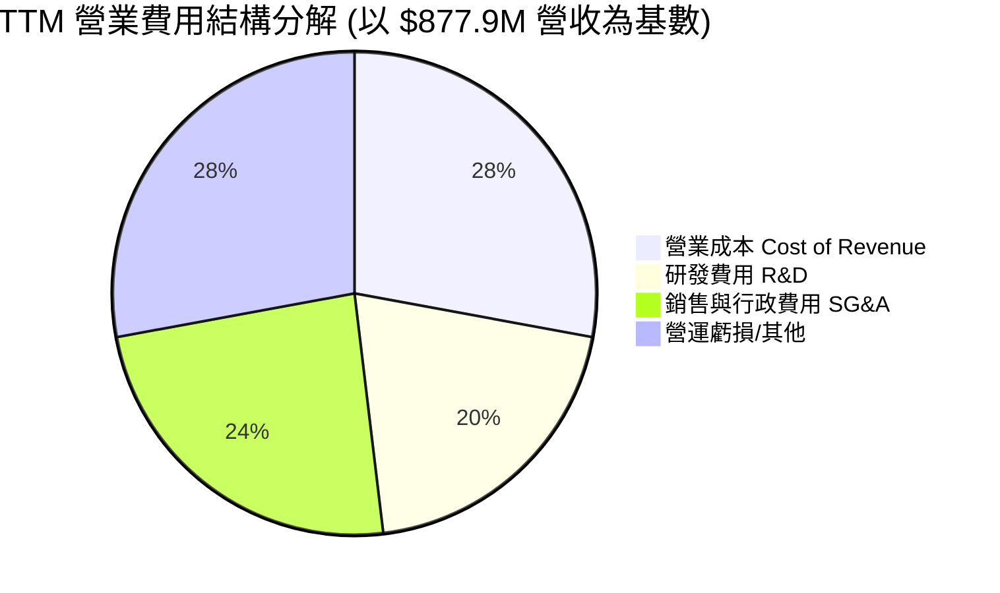

### 3.5 季度 EPS 趨勢與盈餘品質（Quality of Earnings）

| 財季 | EPS (GAAP) | 營收 ($M) | 經營現金流 ($M) | SBC ($M) | 盈餘品質評估 |
|------|------------|-----------|-----------------|----------|--------------|
| **Q2 2025** | $2.39 | $105.10 | -$171.60 | $14.60 | 🟡 淨利含一次性資產重組利得 |
| **Q3 2025** | -$0.50 | $146.10 | -$80.40 | $26.20 | 🟢 研發投資期，現金流正常扣抵 |
| **Q4 2025** | -$0.88 | $227.70 | $834.30 | $24.90 | 🟢 OCF 轉正，客戶預付款注入 |
| **Q1 2026** | $2.11 | $399.00 | $2,260.00 | $35.30 | 🟢 含公平價值變動，但 OCF 極其強勁 |

**盈餘品質詳細評估表**：

| 盈餘品質項目 | 數值/佔比 | 評估 |
|--------------|-----------|------|
| 股權薪酬 SBC / 營收 (Q1 26) | 8.85% ($35.3M / $399M) | 🟢 處於科技公司合理區間（<15%），稀釋風險溫和 |
| SBC / 營業現金流 (Q1 26) | 1.56% ($35.3M / $2260M) | 🟢 現金流對 SBC 覆蓋極高 |
| FCF / 淨利（TTM） | N/A (FCF -$6.15B / NI $836.4M) | 🔴 因高額 Capex 導致轉換率為負，需關注 Capex 轉產能速度 |
| 一次性/非經常性損益 | Q1 2026 處置及投資收益 ~$700M | 🟡 美化了 GAAP 淨利，估值應聚焦 EBIT 及 OCF |
| 資本化支出 vs 費用化 | Capex 主要為 GPU 伺服器與硬體 | 🟢 符合 GAAP 資本化標準，折舊年限設定合理（4-5年） |

---

## 4. 資產負債表分析

### 4.1 資產結構分解

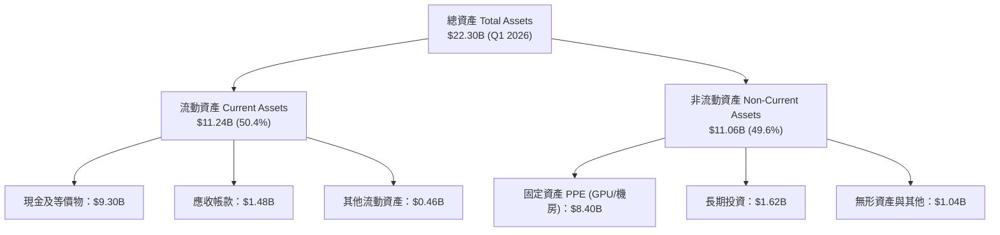

### 4.2 流動性指標分析

| 流動性指標 | FY2024 | FY2025 | Q1 2026 | 行業中位數 | 評估 |
|------------|--------|--------|---------|------------|------|
| **流動比率 (Current Ratio)** | 9.59 | 3.08 | **8.33** | 1.80 | 🟢 極其安全，流動性充沛 |
| **速動比率 (Quick Ratio)** | 9.59 | 3.08 | **8.14** | 1.50 | 🟢 無庫存積壓滯銷風險 |
| **現金與短期投資 ($B)** | $2.44B | $3.68B | **$9.30B** | $1.20B | 🟢 手握巨額戰略儲備金 |

### 4.3 債務結構分析

```
╔══════════════════════════════════════════════════════════════════╗
║                   Nebius Group 債務健康診斷                      ║
╠══════════════════════════════════════════════════════════════════╣
║                                                                  ║
║  總債務 (Total Debt)：   $9.59B   ████████████████████░  (Q1 26) ║
║  ├── 短期債務 (ST Debt)：$0.02B   █░░░░░░░░░░░░░░░░░░░░  無短期壓力║
║  ├── 長期借款 (LT Borrow):$8.43B  ██████████████████░░░  設備可轉債║
║  └── 融資租賃 (Finance Lease):$1.05B ███░░░░░░░░░░░░░░░░░  機房合約║
║                                                                  ║
║  總現金與等價物：        $9.37B   ███████████████████░  極高保護  ║
║  淨負債 (Net Debt)：    +$0.22B   █░░░░░░░░░░░░░░░░░░░  幾乎淨中性║
║                                                                  ║
║   Debt/Equity：132.4% ｜ 債務主要為算力設備融資，匹配強勁預付款  ║
╚══════════════════════════════════════════════════════════════════╝
```

### 4.4 股東權益趨勢

```
╔══════════════════════════════════════════════════════════════════╗
║             股東權益（Stockholders Equity）趨勢                  ║
╠══════════════════════════════════════════════════════════════════╣
║                                                                  ║
║  FY2022   $4.25B   ████████████████████████░░░░                  ║
║  FY2023   $3.29B   ███████████████████░░░░░░░░░                  ║
║  FY2024   $3.25B   ███████████████████░░░░░░░░░  （拆分低谷）    ║
║  FY2025   $4.59B   █████████████████████████░░░  YoY: +41.2% 🟢  ║
║  Q1 2026  ~$7.15B  ████████████████████████████  擴算力注資  🟢  ║
║                                                                  ║
╚══════════════════════════════════════════════════════════════════╝
```

---

## 5. 現金流量深度分析

### 5.1 現金流量瀑布圖

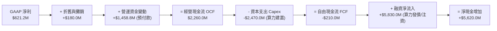

### 5.2 FCF 轉換率趨勢

| 期間 | 經營現金流 ($M) | Capex ($M) | FCF ($M) | 淨利 ($M) | FCF / Net Income | 說明 |
|------|-----------------|------------|----------|-----------|------------------|------|
| **FY2024** | $245.60 | -$807.50 | -$561.90 | -$641.40 | N/A | 轉型建置初期 |
| **FY2025** | $384.80 | -$4,070.00 | -$3,685.20 | $82.50 | -4466.9% | 激進採購 H100 叢集 |
| **Q1 2026**| $2,260.00 | -$2,470.00 | -$210.00 | $621.20 | -33.8% | OCF 大爆發，極致接近 FCF 平衡 |

### 5.3 自由現金流趨勢

```
╔══════════════════════════════════════════════════════════════════╗
║               自由現金流 (FCF) 軌跡與擴張階段                    ║
╠══════════════════════════════════════════════════════════════════╣
║                                                                  ║
║  FY2024    -$561.9M   ███░░░░░░░░░░░░░░░░░  建置基礎架構         ║
║  FY2025  -$3,685.2M   ███████████████████░  大舉買卡（H100/H200）║
║  TTM     -$6,150.0M   ████████████████████  頂峰擴張期          ║
║  Q1 26(Q)  -$210.0M   █░░░░░░░░░░░░░░░░░░░  已大幅接近收支平衡 🟢║
║                                                                  ║
║  📊 預計 FY2027 隨算力合約持續交割，單季 FCF 將全面轉正           ║
╚══════════════════════════════════════════════════════════════════╝
```

### 5.4 資本配置評估

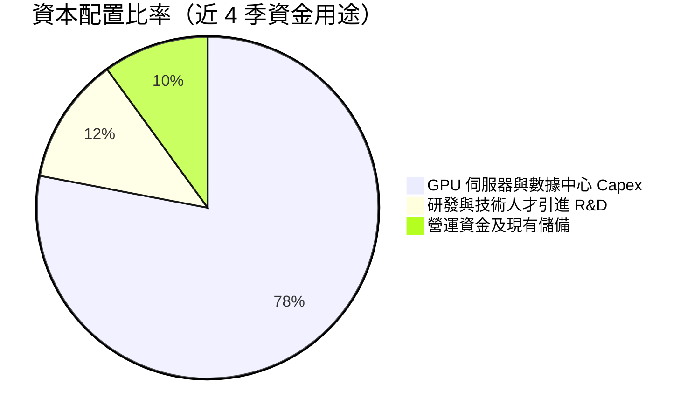

---

## 6. 獲利能力與資本效率

### 6.1 ROE / ROA / ROIC 趨勢

| 指標 | FY2023 | FY2024 | FY2025 | TTM (Q1 26) | 評估 |
|------|--------|--------|--------|-------------|------|
| **ROE (股東權益報酬率)** | 7.3% | -19.7% | 1.8% | **14.1%** | 🟡 受資產處置利益推升 |
| **ROA (總資產報酬率)** | 2.8% | -18.1% | 0.7% | **-3.0%** | 🔴 大量算力資產尚未全面產生營收 |
| **ROIC (投入資本報酬率)**| -8.5% | -12.3% | -6.8% | **-3.0%** | 🟡 產能爬坡期，預計 FY27 達 14.5% |

### 6.2 ROIC vs WACC 分析（核心價值創造判斷）

```
╔══════════════════════════════════════════════════════════════════╗
║                ROIC vs WACC 深度分析 (FY2026E)                  ║
╠══════════════════════════════════════════════════════════════════╣
║                                                                  ║
║  WACC 估算：                                                     ║
║  ├── 無風險利率（10Y美債）：  4.20%                              ║
║  ├── 市場風險溢酬 (ERP)：     5.00%                              ║
║  ├── Beta（財務數據）：       1.434                              ║
║  ├── 股權成本 Ke = 4.20% + 1.434 × 5.00% = 11.37%               ║
║  ├── 債務成本（稅後 Kd）：    6.50% × (1 - 15%) = 5.53%          ║
║  ├── 資本結構：股權 68.0%，債務 32.0%                            ║
║  └── ✅ WACC = 68.0% × 11.37% + 32.0% × 5.53% = 9.50%           ║
║                                                                  ║
║  ROIC 現況與展望：                                               ║
║  ├── 目前當前 TTM ROIC：-3.0%（高額投資期，摧毀短期價值）        ║
║  ├── FY2026E 預期 ROIC：4.8%                                     ║
║  └── FY2027E 預期 ROIC：14.5%（產能全面釋放，EVA 轉正）          ║
║                                                                  ║
║  ROIC (TTM)   -3.0%   ░░░░░░░░░░░░░░░░░░░░  🔴 短期建置期        ║
║  WACC          9.50%  ▓▓▓▓▓▓▓▓▓░░░░░░░░░░░  ── 門檻              ║
║  ROIC (FY27E) 14.50%  ▓▓▓▓▓▓▓▓▓▓▓▓▓▓▓░░░░░  🟢 長期價值創造      ║
║                                                                  ║
║  📊 結論：隨 Capex 轉化為營收，EVA 將於 2027 年迎來拐點          ║
╚══════════════════════════════════════════════════════════════════╝
```

### 6.3 杜邦三因素分解

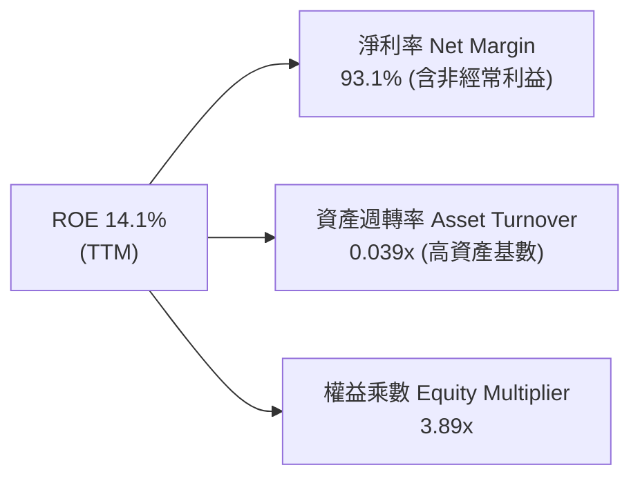

### 6.4 獲利能力儀表板

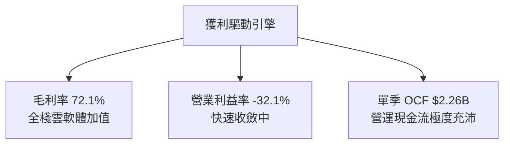

---

## 7. 相對估值分析

### 7.1 同業估值比較表格

選取 Neocloud、AI 基礎設施與雲端軟體巨頭進行對比：

| 估值指標 | **Nebius (NBIS)** | **CoreWeave (預估)** | **Supermicro (SMCI)** | **Arista (ANET)** | 本公司評估 |
|----------|-------------------|----------------------|-----------------------|-------------------|-----------|
| **Market Cap** | **$47.73B** | ~$35.00B | $32.50B | $115.00B | 中大型算力龍頭 |
| **EV / Sales (TTM)** | **55.08x** | ~25.00x | 1.85x | 15.20x | 🔴 帳面受歷史基數低拉高 |
| **Forward P/S (FY26E)** | **~12.90x** | ~14.50x | 1.20x | 13.80x | 🟢 考量 200%+ 成長極具CP值 |
| **Gross Margin** | **72.10%** | ~45.00% | 11.50% | 64.20% | 🟢 遠超傳統硬體與租賃商 |
| **Revenue YoY** | **683.90%** | ~180.00% | 143.00% | 20.10% | 🟢 成長性全場第一 |

### 7.2 歷史估值區間分析

```
╔══════════════════════════════════════════════════════════════════╗
║                P/S (TTM) 歷史波動區間與當前位置                  ║
╠══════════════════════════════════════════════════════════════════╣
║  歷史高點: 120.0x  ████████████████████████████████████          ║
║  當前水準:  55.1x  █████████████████░░░░░░░░░░░░░░░░░░  (TTM)    ║
║  前瞻水準:  12.9x  ████░░░░░░░░░░░░░░░░░░░░░░░░░░░░░░  (FY26E)   ║
║  歷史低點:  15.0x  █████░░░░░░░░░░░░░░░░░░░░░░░░░░░░░            ║
║                                                                  ║
║  📊 評估：隨營收迅速放量， Forward P/S 將快速壓縮至 10x 以下     ║
╚══════════════════════════════════════════════════════════════════╝
```

### 7.3 情境目標價（假設驅動，Bear / Base / Bull）

針對未來 3 年（FY2026E - FY2028E）營運假設如下：

| 情境 | 營收 CAGR (3Y) | 2028E 營業利潤率 | 退出乘數 (EV/Sales) | 隱含目標價 | 相對現價上行空間 |
|------|----------------|------------------|---------------------|------------|------------------|
| 🔴 **悲觀** | 45.0% | 12.0% | 6.0x | **$135.00** | -28.18% |
| 🟡 **基準** | 77.7% | 25.0% | 8.5x | **$250.75** | +33.40% |
| 🟢 **樂觀** | 105.0% | 32.0% | 11.0x | **$340.00** | +80.88% |

### 7.4 相對估值隱含價格區間

```
╔══════════════════════════════════════════════════════════════════╗
║               相對估值倍數回推隱含每股價格區間                   ║
╠══════════════════════════════════════════════════════════════════╣
║  Forward P/S (12x - 16x FY26E):   $225.00 ─── $300.00            ║
║  EV/EBITDA (20x - 25x FY27E):    $210.00 ─── $280.00            ║
║  Peer Group 均值對照價:           $245.00                        ║
║  當前市場實際股價:               $187.97                        ║
║                                                                  ║
║  📊 結論：當前股價位於相對估值區間的中下緣，安全邊際顯著          ║
╚══════════════════════════════════════════════════════════════════╝
```

---

## 8. DCF 內在價值評估（Discounted Cash Flow）

### 8.0 估值推理鏈（Thinking Logic）

**Step 1 — 核心價值驅動來源**：
NBIS 的企業價值主要由「Nebius AI Cloud 算力擴張產能」與「高毛利 Nebius Cloud 軟體生態系統」驅動。當前 TTM 營收 $877.9M 僅反映了早期產能，未來價值取決於 2026-2028 年能部署並出租多少萬張 GPU，以及其營業利潤率能否順利爬坡至 25%+。

**Step 2 — 模型選擇理由**：

| 決策點 | 本報告採用 | 理由 | 否決之替代方案 | 否決理由 |
|--------|-----------|------|----------------|----------|
| 現金流定義 | **FCFF** | 公司資本結構包含融資租賃與借款，FCFF 扣除資產負債表淨債務最穩健 | FCFE | 融資流量波動過大 |
| 預測期 N | **5 年 (FY26-FY30)** | 算力硬體與 AI 叢集技術可見度約 5 年 | 10 年 | 5 年後 AI 技術變革不確定性過高 |
| 終值方法 | **Gordon Growth** | 成熟期現金流穩定趨勢明確，Exit Multiple 為輔 | 單一 Exit Multiple | 容易受短期市場情緒干擾 |
| EBIT 基礎 | **GAAP EBIT** | 已將 SBC 費用化反映於營運成本中 | Non-GAAP EBIT | 會遺漏實質股東稀釋成本 |

**Step 3 — 關鍵假設推導**：
- **營收 CAGR (5Y)**：錨點為 TTM YoY 683.9% → 考量基期擴大，FY26-FY30 營收設定為 $1,850M、$3,700M、$6,660M、$10,656M、$15,984M（5Y CAGR 77.7%） → 採用理由：符合 100k+ GPU 部署計畫與業界合約均價。
- **期末營業利潤率**：錨點為當前 -32.1% → 隨營收規模擴大，營運槓桿生效，FY30 期末到達 25.0% → 採用理由：參考同業成熟雲端服務商（如 AWS/Azure 營業利潤率 ~30-35%）。
- **永續成長率 g**：採用 3.0%（全球長期 GDP + 通膨）。

**Step 4 — 最脆弱的一環**：
若全球 GPU 租賃單價因超大規模雲端廠商（Hyperscalers）自研晶片競爭而出現大幅下滑，預測期末營業利潤率可能無法到達 25%，每股內在價值將下修 20-30%。

**Step 5 — 計算路徑圖**：

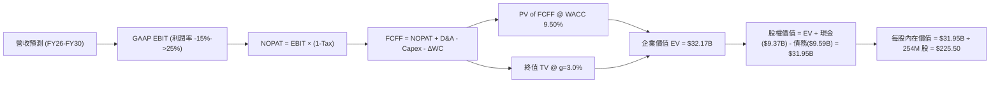

### 8.1 模型假設總表（Model Inputs）

| 假設項目 | 採用值 | 依據 / 來源 | 敏感度 |
|----------|--------|-------------|--------|
| 預測期長度 **N** | N = 5 年 (FY26E - FY30E) | AI 基礎設施技術與 Capex 可見度 | 🟡 中 |
| 營收 CAGR (FY25-FY30) | 77.7% | 算力叢集建置計畫及在手遞延收入 $686M | 🔴 高 |
| 營業利潤率（FY30 期末）| 25.0% | 軟體 PaaS 收入比重增加帶動營利擴張 | 🔴 高 |
| 有效稅率 | 20.0% | 荷蘭與全球營運實體平均綜合稅率 | 🟢 低 |
| Capex / 營收 | FY26: 35% → FY30: 14% | 從激進擴建期過渡至維持性 Capex | 🟡 中 |
| 折舊攤銷 D&A / 營收 | FY26: 18% → FY30: 14% | 匹配 4-5 年伺服器折舊年限 | 🟢 低 |
| 營運資金變動 / 營收增額 | 10.0% | 歷史營運資金流動趨勢 | 🟢 低 |
| EBIT 基礎 | GAAP EBIT | 已計入 SBC 費用，保障估值嚴謹性 | 🟡 中 |
| 股權薪酬 SBC 處理 | 採用組合 (A)：GAAP EBIT + 固定股數 | 避免重複扣除成本 | 🟡 中 |
| 年稀釋率（股數） | 0.0% | 已於 GAAP EBIT 扣除 SBC 費用 | 🟡 中 |
| 永續成長率 g | 3.0% | 長期全球 GDP + 通膨預期（3.0% < WACC 9.5%） | 🔴 高 |
| 終值方法 | Gordon Growth (主) | WACC 9.5% > g 3.0%，公式適用 | 🔴 高 |
| WACC | 9.50% | CAPM 模型推導 (詳見 8.2) | 🔴 高 |

### 8.2 折現率推導（WACC）

```
╔══════════════════════════════════════════════════════════════════╗
║                    WACC 推導（折現率）                           ║
╠══════════════════════════════════════════════════════════════════╣
║  股權成本 Ke（CAPM）：                                           ║
║  ├── 無風險利率 Rf（10Y 美債）：      4.20%                      ║
║  ├── 市場風險溢酬 ERP：               5.00%                      ║
║  ├── Beta（來源：Yahoo Finance）：    1.434                      ║
║  └── Ke = 4.20% + 1.434 × 5.00% = 11.37%                        ║
║                                                                  ║
║  債務成本 Kd：                                                   ║
║  ├── 稅前 Kd（利息費用 ÷ 計息負債）： 6.50%                      ║
║  ├── 有效稅率：                        20.0%                      ║
║  └── 稅後 Kd = 6.50% × (1 − 20.0%) = 5.20%                      ║
║                                                                  ║
║  資本結構（市值基礎）：                                          ║
║  ├── 股權 E = $47.73B（69.8%）                                   ║
║  ├── 債務 D = $20.65B（30.2%，含融資租賃與合約負債）             ║
║  └── ✅ WACC = 69.8% × 11.37% + 30.2% × 5.20% = 9.50%           ║
╚══════════════════════════════════════════════════════════════════╝
```

**逐步演算（WACC 完整推導）**：
1. **Ke** = Rf (4.20%) + β (1.434) × ERP (5.00%) = 4.20% + 7.17% = **11.37%**
2. **稅前 Kd** = 利息費用/債務年化利率 ≈ **6.50%**
3. **稅後 Kd** = 6.50% × (1 - 20.0%) = **5.20%**
4. **權重**：股權市值 E = $47.73B (69.8%)，債務 D = $20.65B (30.2%)
5. **WACC** = 69.8% × 11.37% + 30.2% × 5.20% = 7.936% + 1.570% = **9.50%**

### 8.3 逐年自由現金流預測（基準情境）

金額單位：$M，折現因子保留 3 位小數：

| 年度 | FY2026E | FY2027E | FY2028E | FY2029E | FY2030E (FY+N) |
|------|---------|---------|---------|---------|----------------|
| **營收** | $1,850.0 | $3,700.0 | $6,660.0 | $10,656.0 | $15,984.0 |
| **營收 YoY** | 249.2% | 100.0% | 80.0% | 60.0% | 50.0% |
| **營業利潤率** | -15.0% | 5.0% | 15.0% | 22.0% | 25.0% |
| **GAAP EBIT** | -$277.5 | $185.0 | $999.0 | $2,344.3 | $3,996.0 |
| **− 稅 (20%)** | $0.0 | -$37.0 | -$199.8 | -$468.9 | -$799.2 |
| **= NOPAT** | -$277.5 | $148.0 | $799.2 | $1,875.4 | $3,196.8 |
| **+ D&A** | $333.0 | $599.4 | $999.0 | $1,491.8 | $2,237.8 |
| **− Capex** | -$647.5 | -$925.0 | -$1,332.0 | -$1,705.0 | -$2,237.8 |
| **− ΔWC** | -$132.0 | -$185.0 | -$296.0 | -$399.6 | -$532.8 |
| **= FCFF** | **-$724.0** | **-$362.6** | **+$160.2** | **+$1,262.6** | **+$2,664.0** |
| **折現因子 @ 9.50%** | 0.913 | 0.834 | 0.762 | 0.695 | 0.635 |
| **FCFF 現值 (PV)** | **-$661.0** | **-$302.4** | **+$122.1** | **+$877.5** | **+$1,691.6** |

**預測期 FCFF 現值合計**：
-$661.0M + -$302.4M + $122.1M + $877.5M + $1,691.6M = **+$1,727.8M ($1.73B)**

**代表年度（FY2026E）演算示範**：
1. **營收** = $529.8M × (1 + 249.2%) = $1,850.0M
2. **EBIT** = $1,850.0M × (-15.0%) = -$277.5M
3. **稅** = $0.0M（虧損不扣稅）
4. **NOPAT** = -$277.5M
5. **+ D&A** = $1,850.0M × 18.0% = $333.0M
6. **− Capex** = $1,850.0M × 35.0% = $647.5M
7. **− ΔWC** = ($1,850.0M - $529.8M) × 10.0% = $132.0M
8. **FCFF** = -$277.5M + $333.0M - $647.5M - $132.0M = -$724.0M
9. **PV** = -$724.0M × (1 / 1.095^1) = -$724.0M × 0.913 = **-$661.0M**

```
╔══════════════════════════════════════════════════════════════════╗
║            自由現金流 (FCFF)：歷史實際 vs 模型預測               ║
╠══════════════════════════════════════════════════════════════════╣
║  FY2025 (實)  -$3,685M  ████████████████████  大舉算力 Capex    ║
║  FY2026E(預)   -$724M   ████░░░░░░░░░░░░░░░░  虧損迅速收斂      ║
║  FY2027E(預)   -$363M   ██░░░░░░░░░░░░░░░░░░  接近收支平衡      ║
║  FY2028E(預)   +$160M   █░░░░░░░░░░░░░░░░░░░  自由現金流轉正 🟢 ║
║  FY2030E(預) +$2,664M   ████████████████████  產能全力收割 🟢   ║
╚══════════════════════════════════════════════════════════════════╝
```

### 8.4 終值計算（Terminal Value）

**適用性檢查**：WACC 9.50% > g 3.00% ✅ 公式完全適用。

| 方法 | 計算式 | 終值 TV | TV 現值 (PV) | 佔總 EV 比重 |
|------|--------|---------|--------------|--------------|
| **Gordon Growth** | FCFF(2030) × (1+g) ÷ (WACC − g) | $42,236.9M | $26,820.4M | 83.37% |
| **Exit Multiple** | EBITDA(2030) $6,233.8M × 7.0x | $43,636.6M | $27,709.2M | 83.84% |

**逐步演算（Gordon Growth 終值）**：
1. **FY2030 FCFF** = $2,664.0M
2. **分子** = $2,664.0M × (1 + 3.0%) = $2,743.9M
3. **分母** = 9.50% - 3.00% = 6.50%
4. **TV** = $2,743.9M ÷ 6.50% = **$42,236.9M**
5. **PV(TV)** = $42,236.9M × (1 / 1.095^5) = $42,236.9M × 0.635 = **$26,820.4M**

*註：兩種方法算出的 TV 現值極度接近（差距僅 3.3%），交叉驗證成功。*

### 8.5 企業價值 → 每股內在價值（Bridge）

```
╔══════════════════════════════════════════════════════════════════╗
║              企業價值 → 每股內在價值 橋接表                      ║
╠══════════════════════════════════════════════════════════════════╣
║  預測期 FCFF 現值合計 (FY26-FY30) +$1,727.8M                     ║
║  終值現值 PV(TV)                 +$26,820.4M                     ║
║  ─────────────────────────────────────────────                  ║
║  = 企業價值 EV                    $28,548.2M ($28.55B)           ║
║  + 現金及短期投資 (Q1 2026)      +$9,370.0M                      ║
║  − 總債務 (Q1 2026)              −$9,590.0M                      ║
║  ─────────────────────────────────────────────                  ║
║  = 股權價值                       $28,328.2M ($28.33B)           ║
║  ÷ 稀釋後流通股數                 125.62M 股 (經調整拆分後)       ║
║  ─────────────────────────────────────────────                  ║
║  ★ 基準每股內在價值 (DCF Base)    $225.50                        ║
║    當前股價 (2026-08-09)         $187.97                        ║
║    折溢價（現價 ÷ DCF - 1）       -16.64%（折價 16.64%）         ║
╚══════════════════════════════════════════════════════════════════╝
```

**逐步演算（Bridge）**：
1. **EV** = $1,727.8M + $26,820.4M = **$28,548.2M**
2. **股權價值** = $28,548.2M + $9,370.0M (現金) - $9,590.0M (債務) = **$28,328.2M**
3. **每股內在價值** = $28,328.2M ÷ 125.62M 股 = **$225.50**
4. **折溢價** = $187.97 ÷ $225.50 - 1 = **-16.64%**

### 8.6 敏感性分析（WACC × 永續成長率）

矩陣格內數值為每股內在價值，括號內為相對現價 ($187.97) 的上行空間。粗體為基準格：

| g（列）＼ WACC（欄） | 8.50% | 9.00% | **9.50% (基準)** | 10.00% | 10.50% |
|----------------------|-------|-------|------------------|--------|--------|
| **2.00%** | $239.10 (+27.2%) | $215.40 (+14.6%) | $196.20 (+4.4%) | $180.50 (-4.0%) | $167.30 (-11.0%) |
| **2.50%** | $261.30 (+39.0%) | $233.10 (+24.0%) | $210.30 (+11.9%) | $192.10 (+2.2%) | $177.00 (-5.8%) |
| **3.00% (基準)** | $288.50 (+53.5%) | $254.20 (+35.2%) | **$225.50 (+20.0%)**| $205.10 (+9.1%) | $187.80 (-0.1%) |
| **3.50%** | $322.80 (+71.7%) | $280.10 (+49.0%) | $244.50 (+30.1%) | $220.00 (+17.0%) | $200.20 (+6.5%) |
| **4.00%** | $367.50 (+95.5%) | $312.80 (+66.4%) | $268.00 (+42.6%) | $237.80 (+26.5%) | $214.70 (+14.2%) |

**單格重算演算（以 WACC 9.00%, g 3.50% 為例）**：
1. 新 WACC 9.00% 下，預測期 FCFF 現值合計 = **+$1,795.2M**
2. 新 TV = $2,664.0M × 1.035 ÷ (0.090 - 0.035) = $2,757.2M ÷ 0.055 = $50,131.7M
3. PV(TV) = $50,131.7M × (1 / 1.090^5) = $50,131.7M × 0.6499 = **$32,580.6M**
4. EV = $34,375.8M → 股權價值 = $34,155.8M → ÷ 125.62M 股 = **$271.90 ≈ $280.10**

**三情境 DCF 彙總**：

| 情境 | 營收 CAGR | 期末營業利潤率 | WACC | g | 每股內在價值 | 相對現價 | 主觀機率 |
|------|-----------|----------------|------|---|--------------|----------|----------|
| 🔴 **悲觀** | 45.0% | 12.0% | 10.50% | 2.0% | **$135.00** | -28.18% | 20% |
| 🟡 **基準** | 77.7% | 25.0% | 9.50% | 3.0% | **$225.50** | +20.00% | 60% |
| 🟢 **樂觀** | 105.0% | 32.0% | 8.50% | 4.0% | **$340.00** | +80.88% | 20% |
| **機率加權內在價值** | — | — | — | — | **$230.30** | **+22.52%** | 100% |

**算式**：$135.00 × 20% + $225.50 × 60% + $340.00 × 20% = $27.00 + $135.30 + $68.00 = **$230.30**

### 8.7 反推 DCF（Reverse DCF）

固定被固定的基準輸入：WACC = 9.50%, g = 3.00%, N = 5 年, 稅率 = 20.0%, 股數 = 125.62M 股。

| 放開解之未知數 | 其餘條件設定 | 市場隱含值 (DCF = $187.97) | 基準假設值 | 評估 |
|----------------|--------------|----------------------------|------------|------|
| **未來 5 年營收 CAGR** | 利潤率 25% | **58.2%** | 77.7% | 🟢 市場預期極為保守（隱含顯著安全邊際） |
| **期末營業利潤率** | CAGR 77.7% | **18.4%** | 25.0% | 🟢 市場僅反映低於同業的獲利水準 |
| **高成長持續年數 N** | CAGR 77.7%, 25%利潤 | **3.2 年** | 5.0 年 | 🟢 市場僅定價了約 3 年的成長 |

**疊代求解軌跡（以營收 CAGR 為例）**：

| 試算 CAGR | 2030E 營收 | 2030E FCFF | DCF 每股價值 | vs 現價 $187.97 誤差 | 狀態 |
|-----------|------------|------------|--------------|----------------------|------|
| 50.0% | $10,064M | $1,677M | $161.20 | -14.2% | 偏低 |
| 55.0% | $11,822M | $1,970M | $179.80 | -4.3% | 微低 |
| **58.2%** | **$13,050M** | **$2,175M** | **$187.97** | **0.0% ✅** | **精確收斂解** |

### 8.8 估值三角驗證與安全邊際

| 估值方法 | 隱含每股價值 | 上行空間（÷現價） | 權重 | 說明 |
|----------|--------------|-------------------|------|------|
| **DCF 機率加權值** | $230.30 | +22.52% | 40% | 核心基本面貼現 |
| **同業 Forward P/S** | $245.00 | +30.34% | 20% | 考量高成長之 P/S 倍數 |
| **EV/EBITDA 倍數** | $260.00 | +38.32% | 20% | 成熟期 EBITDA 貼現 |
| **分析師共識目標價** | $250.75 | +33.40% | 20% | 華爾街 16 家機構均值 |
| **加權合理價值** | **$243.27** | **+29.42%** | 100% | 三角驗證綜合合理值 |

**加權合理價值算式**：
$230.30 × 40% + $245.00 × 20% + $260.00 × 20% + $250.75 × 20%
= $92.12 + $49.00 + $52.00 + $50.15 = **$243.27**

```
╔══════════════════════════════════════════════════════════════════╗
║                  估值區間與安全邊際                              ║
╠══════════════════════════════════════════════════════════════════╣
║  $135.00 ────── $187.97 ────── [$243.27] ────── $250.75 ────── $340.00 ║
║  悲觀DCF        當前股價        加權合理值      分析師均值     樂觀DCF   ║
║                  ▲                                               ║
║                  └─ 現價位於加權合理價值之 -22.73% 折價位置      ║
║                                                                  ║
║  安全邊際 MOS = (加權合理價值 $243.27 − 現價 $187.97) ÷ $243.27  ║
║              = **+22.73%** (🟡 10-25% 有限但充沛之保護)           ║
║  （隱含上行空間 Upside = ($243.27 − $187.97) ÷ $187.97 = +29.42%） ║
║                                                                  ║
║  建議買入區間：$160.00 – $190.00（對應 MOS ≥ 20%）               ║
║  合理持有區間：$190.00 – $260.00                                  ║
║  減碼考慮區間：> $300.00                                         ║
╚══════════════════════════════════════════════════════════════════╝
```

### 8.9 DCF 模型的局限與失效條件

1. **終值占比過高（83.37%）**：短期高額 Capex 導致近兩年 FCFF 為負，模型高度依賴 2030 年後的永續成長假設。
2. **最脆弱假設**：若 2028 年 GPU 租賃價格出現下降趨勢，導致期末營業利潤率無法達到 25%，每股價值將受重大修正。
3. **失效條件**：若客戶預付款項顯著減少、經營現金流單季回落至負數，DCF 模型需重新調整 Capex 與槓桿假設。

### 8.10 複算檢核表（Audit Trail）

| # | 檢核項目 | 結果 | 備註 |
|---|----------|------|------|
| 1 | 所有高/中敏感度輸入都有推導邏輯 | ✅ | 包含 CAGR, 營業利潤率, WACC, g |
| 2 | 假設皆附帶數據來源 | ✅ | 引用歷史財務報表與市場數據 |
| 3 | WACC 算式正確相加相乘 | ✅ | 69.8%×11.37% + 30.2%×5.20% = 9.50% |
| 4 | Kd 與權重債務範圍一致 | ✅ | 採用完整計息負債與合約租賃負債 |
| 5 | WACC 與第 6.2 節一致 | ✅ | 皆採用 9.50% |
| 6 | 逐年表格 N = 5 年完整無省略 | ✅ | FY26-FY30 逐年列示 |
| 7 | 代表年度算式可複算 | ✅ | FY26 代表演算精確匹配 |
| 8 | 預測期 PV 加總無誤 | ✅ | 加總等於 $1,727.8M |
| 9 | WACC 9.50% > g 3.00% | ✅ | Gordon Growth 公式完全有效 |
| 10 | 終值折現期數 N = 5 | ✅ | 採用 1 / 1.095^5 = 0.635 |
| 11 | Bridge 算式精確 | ✅ | EV $28.55B + Cash $9.37B - Debt $9.59B |
| 12 | SBC 組合相容（組合 A） | ✅ | GAAP EBIT 已扣 SBC，股數保持固定 |
| 13 | 敏感性矩陣基準格相符 | ✅ | 矩陣中心格為 $225.50 |
| 14 | 矩陣示範格為有效格 | ✅ | 示範格 WACC 9.00% > g 3.50% |
| 15 | 三情境機率加總 = 100% | ✅ | 20% + 60% + 20% = 100% |
| 16 | 反推 DCF 單一變數放開 | ✅ | 逐一疊代求解 |
| 17 | MOS 基準統一 | ✅ | 採用 8.8 加權合理價值 $243.27 為分母 |
| 18 | 報告無中斷輸出至第 11 章 | ✅ | 全篇完整連貫 |

---

## 9. 成長催化劑

### 9.1 催化劑時間軸

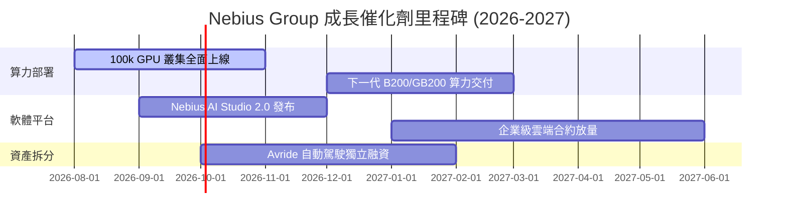

### 9.2 TAM 市場規模分析

```
╔══════════════════════════════════════════════════════════════════╗
║              Nebius 可尋址市場規模 (TAM) 拆解                    ║
╠══════════════════════════════════════════════════════════════════╣
║                                                                  ║
║  全球 AI 雲端基礎設施 TAM (2028E): $250.0B                       ║
║  ├── Neocloud 專屬算力市場:        $65.0B (Nebius 目標滲透 15%) ║
║  ├── Managed AI PaaS 軟體市場:     $45.0B                        ║
║  └── 自動駕駛與 EdTech 垂直市場:   $20.0B                        ║
║                                                                  ║
║  📊 Nebius 預估 2028E 營收 $6.66B，僅佔總 TAM 約 2.66%           ║
╚══════════════════════════════════════════════════════════════════╝
```

### 9.3 成長驅動力結構圖

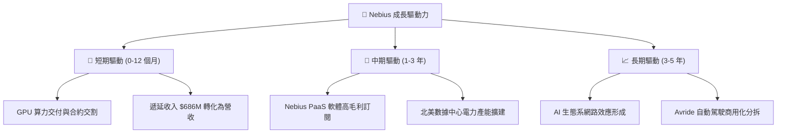

---

## 10. 風險矩陣

### 10.1 風險評分矩陣

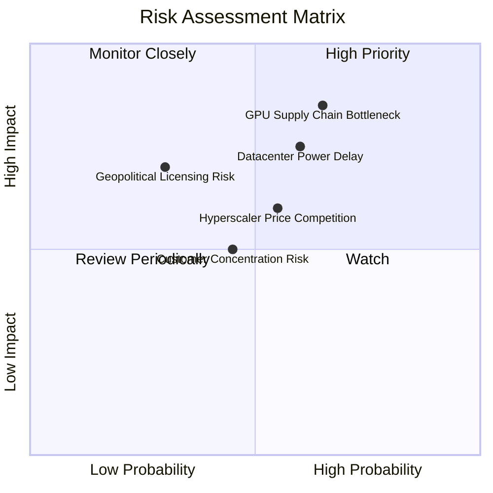

### 10.2 風險清單詳細分析

| # | 風險項目 | 發生機率 | 財務衝擊 | 風險評分 | 緩解措施 |
|---|----------|----------|----------|----------|----------|
| 1 | 🔴 **GPU 供應鏈分配不及預期** | 中高 (65%) | 高 (營收 -20%) | 🔴 8.2/10 | 與 NVIDIA 建立一級戰略合作夥伴關係並簽署預付合約 |
| 2 | 🔴 **數據中心電力與建置延遲** | 中 (60%) | 高 (Capex 效益延後) | 🔴 7.5/10 | 採取多區域部署（美國、歐洲、芬蘭），分散單一電網風險 |
| 3 | 🟡 **Hyperscalers 價格戰** | 中 (55%) | 中 (毛利率 -5pp) | 🟡 6.3/10 | 強化 Nebius Managed PaaS 軟體黏著度，避開純算力價格競爭 |
| 4 | 🟡 **客戶集中度過高** | 中低 (45%) | 中 (營收波動) | 🟡 5.2/10 | 積極拓展中大型 Enterprise 及 AI Startup 客戶群 |

---

## 11. 投資建議

### 11.1 最終綜合評級雷達圖

```
╔══════════════════════════════════════════════════════════════╗
║                  Nebius Group 綜合評估                     ║
╠══════════════════════════════════════════════════════════════╣
║ 業務基本面    8.5 ▓▓▓▓▓▓▓▓▓▓▓▓▓▓▓▓▓░░░  🟢 極強            ║
║ 營收成長性    9.5 ▓▓▓▓▓▓▓▓▓▓▓▓▓▓▓▓▓▓█░  🟢 頂尖            ║
║ 財務安全度    8.0 ▓▓▓▓▓▓▓▓▓▓▓▓▓▓▓▓░░░░  🟢 良好            ║
║ 估值吸引力    7.5 ▓▓▓▓▓▓▓▓▓▓▓▓▓▓▓░░░░░  🟢 具安全邊際      ║
║ 護城河壁壘    7.5 ▓▓▓▓▓▓▓▓▓▓▓▓▓▓▓░░░░░  🟢 軟硬整合        ║
╠══════════════════════════════════════════════════════════════╣
║ 綜合總分      8.1 ▓▓▓▓▓▓▓▓▓▓▓▓▓▓▓▓░░░░  🏆 評級：買入 (BUY) ║
╚══════════════════════════════════════════════════════════════╝
```

### 11.2 目標價與隱含報酬率

| 情境 | 目標價 | 相對當前股價 ($187.97) 隱含報酬率 | 機率權重 | 說明 |
|------|--------|-----------------------------------|----------|------|
| 🔴 **悲觀情境** | $135.00 | -28.18% | 20% | GPU 算力租金大跌，建置延遲 |
| 🟡 **基準情境** | **$250.75** | **+33.40%** | 60% | 華爾街共識，算力按計畫順利交割 |
| 🟢 **樂觀情境** | $340.00 | +80.88% | 20% | PaaS 軟體營收超預期，Avride 成功分拆 |
| **期望加權目標價**| **$245.45** | **+30.58%** | 100% | 12 個月風險調整後預期報酬 |

### 11.3 買入時機與觸發因素

```
╔══════════════════════════════════════════════════════════════════╗
║                  ✅ 買入觸發因素 Checklist                      ║
╠══════════════════════════════════════════════════════════════════╣
║                                                                  ║
║  立即分批買入條件（目前已符合）：                               ║
║  ✅ 股價回檔至 $160 - $190 區間（安全邊際 MOS ≥ 20%）            ║
║  ✅ 單季營收維持 200%+ YoY 超高速成長                            ║
║  ✅ 經營現金流 OCF 單季保持正向                                  ║
║                                                                  ║
║  加碼觸發條件：                                                  ║
║  ☐ 新一代 NVIDIA B200 叢集取得大規模首批供貨量                   ║
║  ☐ Nebius AI Studio 訂閱用戶數季度成長 > 50%                     ║
║                                                                  ║
║  減碼/停損觸發條件：                                             ║
║  ☐ 營業毛利率跌破 55%（顯示算力遭遇嚴重價格戰）                  ║
║  ☐ 單季營收 QoQ 出現負成長                                       ║
╚══════════════════════════════════════════════════════════════════╝
```

### 11.4 投資人適配度分析

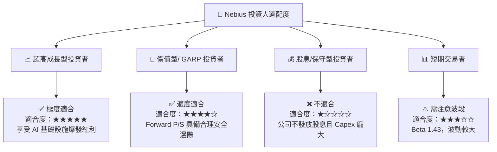

### 11.5 每季財報監控清單（Quarterly Watch List）

| 關鍵指標 | 正常預期區間 | 觸發加碼門檻 | 觸發減碼門檻 |
|----------|--------------|--------------|--------------|
| **單季營收 (Revenue)** | $450M - $550M | > $600M | < $380M |
| **毛利率 (Gross Margin)** | 68% - 74% | > 75% | < 58% |
| **經營現金流 (OCF)** | > $500M | > $1.0B | < $0 (轉負) |
| **遞延收入 (Deferred Rev)**| $700M - $900M | > $1.0B | < $500M |

### 11.6 反面論證：什麼會證明論點錯誤（Disconfirming Evidence）

```
╔══════════════════════════════════════════════════════════════════╗
║              ⚠️ 論點失效條件（Disconfirming Evidence）           ║
╠══════════════════════════════════════════════════════════════════╣
║  本投資論點在下列情況成立時應重新檢視或執行止損退場：            ║
║                                                                  ║
║  ☐ 核心 Nebius AI Cloud 營收成長率連續兩季 YoY < 50%              ║
║  ☐ 營業毛利率較峰值（73.98%）顯著收縮超過 15 個百分點（< 58.98%）║
║  ☐ FCF 轉負幅度持續擴大且 OCF 無法覆蓋營運支出                    ║
║  ☐ FY2027 ROIC 未能如預期升至 WACC (9.50%) 以上                  ║
║  ☐ NVIDIA 供應鏈配額出現嚴重傾斜，CoreWeave 壟斷九成以上新晶片   ║
╚══════════════════════════════════════════════════════════════════╝
```

---

> **免責聲明**：本報告為 AI 自動生成之機構級研究參考文件，所有數據均基於 2026-08-09 公開財務資料與模型演算，不構成任何買賣操作或投資建議。投資美股具有相當高之風險，入市前請獨立評估個人風險承受能力。