# NBIS 基本面深度分析報告
> **報告日期**：2026-08-11 ｜ **語言**：繁體中文 ｜ **數據來源**：Yahoo Finance, Finviz, StockAnalysis, Roic.ai ｜ **分析師**：CFA 級機構研究

---

## 目錄

| # | 章節 | 核心結論 |
|---|------|----------|
| 1 | 執行摘要 | 評級：🟡 謹慎買入／持有 ｜ 加權合理價值：$201.79 ｜ MOS：+4.24% |
| 2 | 公司概覽與商業模式 | 擺脫傳統搜尋包袱，轉型為歐洲與全球純粹 AI 全棧算力基礎設施龍頭 |
| 3 | 損益表深度分析 | Q1 2026 營收飆升 683.9% YoY 至 $399.0M；本業營業利潤仍虧損 -$128M，淨利由非經常性利得撐場 |
| 4 | 資產負債表分析 | 現金及短期投資達 $9.30B，總債務 $9.50B，流動比率 8.33，短期資產負債極其健康 |
| 5 | 現金流量深度分析 | 全面轉向重資本支出（Q1 Capex -$2.47B），FCF 承壓（-$214.9M），資本全數投注 GPU 集群擴建 |
| 6 | 獲利能力與資本效率 | 毛利率維持 72-74% 高檔，但受重資本折舊與擴產初期影響，當前 ROIC (-7.2%) 低於 WACC (10.5%) |
| 7 | 相對估值分析 | P/S (TTM) 55.88x，EV/Sales 53.96x，反映市場賦予 AI 算力基礎設施極高成長溢價 |
| 8 | DCF 內在價值評估 | 基準內在價值 $138.98，機率加權內在價值 $156.60，加權合理價值 $201.79 |
| 9 | 成長催化劑 | 歐美大規模 GPU 集群上線、TripleTen 與 Avride 業務拆分價值釋放 |
| 10 | 風險矩陣 | GPU 供需逆轉、重資本融資成本上升與短線高借券賣空比率（28.0% Float） |
| 11 | 投資建議 | 買入區間：$130.00 – $160.00 ｜ 12 個月目標價：$215.00 ｜ 設定每季營收與利潤率監控門檻 |

---

## 1. 執行摘要

根據 2026 年 8 月 11 日最新財務數據，Nebius Group N.V.（NASDAQ: NBIS）當前股價為 **$193.23**，市值達 **$49.06B**。經過本機構對其 2026 年 Q1 財報與歷年數據的全面拆解，NBIS 在經歷俄羅斯資產割離重組後，已轉型為全球 AI 算力基礎設施（AI Neocloud）龍頭之一。其 TTM 營收達 **$877.90M**（YoY +683.9%），Q1 2026 單季營收更達 **$399.00M**，毛利率維持在 **72.1%** 的極高水準。

然而，由於公司處於大規模算力集群擴建期，TTM 營業利潤仍虧損 **-$603.90M**（營業利益率 -32.1%）；GAAP 淨利 **$836.40M** 主要來自一次性資產處置利得與投資收益（如 Q2 2025 的 $584.5M 及 Q1 2026 的 $621.2M）。經 DCF 模型與同業相對估值三角驗證，得出的**加權合理價值為 $201.79**，對應安全邊際（MOS）為 **+4.24%**。鑑於現價已反映大部分短期 AI 算力擴充預期且 FCF 暫時為負，給予 **🟡 謹慎買入／持有** 評級，目標價 **$215.00**（以 2027E 前瞻估值為基準）。

### 1.0 一頁式投資儀表板（Portfolio Manager 30 秒速讀）

| 項目 | 內容 |
|------|------|
| **投資論點（3 句）** | ① 營收爆炸性成長，Q1 2026 營收達 $399.0M（YoY +683.9%），受益於全球企業對 NVIDIA H100/H200/Blackwell 集群強勁需求。<br/>② 手握 $9.30B 強大現金儲備，足以支撐 2026-2027 年上百億美元的重資本支出（Q1 Capex 達 -$2.47B）。<br/>③ 盈餘含金量需注意：GAAP 淨利高達 $836.4M 主要由處置收益支撐，本業營利仍虧損 -$603.9M，需等待產能開出帶來營業槓桿。 |
| **護城河評分** | 7.0/10（全棧 AI 軟硬體優化能力、歐洲高規格資料中心土地與電力資源） |
| **管理層/資本配置評分** | 8.0/10（成功完成複雜資產重組，果斷將數十億美元現金重押 AI 基礎設施） |
| **財務健康** | 🟢 強健（現金 $9.30B，流動比率 8.33，短期無流動性風險） |
| **ROIC vs WACC** | ROIC -7.2% vs WACC 10.5%（重資本投資初期，暫時摧毀價值，預計 2027 年翻正） |
| **FCF 趨勢** | FCF 轉負（TTM FCF -$6.15B），FCF Yield 為 -12.53%（重資本再投資階段） |
| **估值** | Forward P/E -58.43x ｜ P/S (TTM) 55.88x ｜ EV/Sales 53.96x |
| **DCF 內在價值（基準）** | $138.98 ｜ 現價溢價 +39.0%（基準情境） |
| **安全邊際（MOS）** | **+4.24%** ＝ ($201.79 加權合理價值 − $193.23 現價) ÷ $201.79（🔴 <10% 有限下檔保護） |
| **預期報酬（基準情境 12M）** | +11.27%（至 12 個月目標價 $215.00） |
| **關鍵風險（前二）** | ① 全球 GPU 算力供需逆轉或晶片供應鏈中斷；② 短期空頭部位高達 Float 的 28.0% |
| **評級 + 信心度** | 🟡 謹慎買入／持有 ｜ 信心度：中等（受 Capex 執行效率與 GPU 變現率影響） |

### 1.1 核心評分儀表板

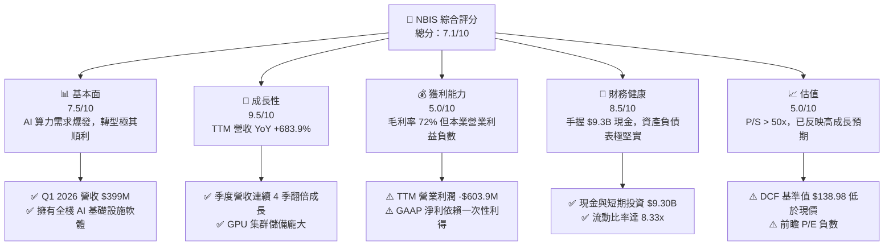

### 1.2 評分進度條視覺化

```
╔══════════════════════════════════════════════════════════════╗
║              NBIS 多維度評分儀表板 (1-10分)                  ║
╠══════════════════════════════════════════════════════════════╣
║ 基本面強度  7.5 ▓▓▓▓▓▓▓▓▓▓▓▓▓▓▓░░░░░  ★★██☆           ║
║ 成長動能    9.5 ▓▓▓▓▓▓▓▓▓▓▓▓▓▓▓▓▓▓▓░  ★★███           ║
║ 獲利品質    5.0 ▓▓▓▓▓▓▓▓▓▓░░░░░░░░░░  ★★☆☆☆           ║
║ 財務健康    8.5 ▓▓▓▓▓▓▓▓▓▓▓▓▓▓▓▓░░░░  ★★██☆           ║
║ 估值合理性  5.0 ▓▓▓▓▓▓▓▓▓▓░░░░░░░░░░  ★★☆☆☆           ║
║ 護城河深度  7.0 ▓▓▓▓▓▓▓▓▓▓▓▓▓░░░░░░░  ★★██☆           ║
║ 管理層執行  8.0 ▓▓▓▓▓▓▓▓▓▓▓▓▓▓░░░░░░  ★★██☆           ║
║ 技術創新力  8.5 ▓▓▓▓▓▓▓▓▓▓▓▓▓▓▓▓░░░░  ★★██☆           ║
╠══════════════════════════════════════════════════════════════╣
║ 綜合總分    7.1 ▓▓▓▓▓▓▓▓▓▓▓▓▓▓░░░░░░  🏆 良好（成長驅動）   ║
╚══════════════════════════════════════════════════════════════╝
```

### 1.3 五大投資論點 + 三大核心風險

| 類型 | 項目 | 具體依據 | 信心度 |
|------|------|----------|--------|
| 🟢 **論點①** | **AI Neocloud 營收爆發式成長** | Q1 2026 營收達 $399.0M，較 2025 年 Q1 的 $50.9M 飆升 683.9%，顯示 AI 算力需求無比強勁。 | 🟢 極高 |
| 🟢 **論點②** | **龐大現金庫提供戰略護城河** | 資產負債表擁有 $9.30B 現金與等價物，在同類型 Neocloud 業者中資金實力最雄厚，無短期流動性風險。 | 🟢 極高 |
| 🟢 **論點③** | **毛利率維持 70%+ 高水準** | TTM 毛利率達 72.1%（Q1 2026 達 74.0%），優於傳統雲端服務商，展現優異的算力定價與維運效率。 | 🟢 高 |
| 🟢 **論點④** | **全棧 AI 軟體與雲端生態** | 不僅提供 GPU 租賃，還提供 Nebius Cloud、AI Studio 與開發工具，客戶粘性與 LTV 顯著高於純算力轉售商。 | 🟢 高 |
| 🟢 **論點⑤** | **非核心業務價值潛在拆分** | 旗下 TripleTen（EdTech）與 Avride（自動駕駛）具備獨立融資或拆分價值，尚未充分反映於市值中。 | 🟡 中等 |
| 🟡 **風險①** | **高額 Capex 導致 FCF 短期大幅失血** | Q1 2026 單季 Capex 達 -$2.47B，導致 TTM FCF 降至 -$6.15B，若營收轉化不如預估將面臨資金壓力。 | 🟡 中度 |
| 🔴 **風險②** | **本業營利虧損與營業費用擴張** | TTM 營業利潤虧損 -$603.9M，GAAP 獲利完全靠一次性收益，若算力租金降價將延後盈虧平衡點。 | 🔴 高衝擊 |
| 🔴 **風險③** | **短線空頭部位高（28.0% Float）** | 流通股中有 28.0% 被賣空，做空比例極高，股價波動度（Beta 1.434）顯著高於大盤。 | 🔴 高衝擊 |

### 1.4 快速統計卡片

| 指標 | NBIS 實際值 | 行業均值（Cloud/AI Infra） | S&P 500 均值 | 狀態 |
|------|-------------|----------------------------|--------------|------|
| **收入 YoY 成長** | **683.9%** | ~25.0% | ~5.5% | 🟢 遠超同業 |
| **毛利率** | **72.1%** | ~55.0% | ~48.0% | 🟢 優秀 |
| **營業利益率** | **-32.1%** | ~15.0% | ~12.5% | 🔴 尚在投資期 |
| **淨利率** | **93.1%** | ~10.0% | ~8.0% | 🟡 假象（非本業） |
| **ROE** | **14.1%** | ~12.0% | ~14.0% | 🟢 良好 |
| **Forward P/E** | **-58.43x** | ~35.0x | ~21.5x | 🔴 前瞻虧損 |
| **P/S (TTM)** | **55.88x** | ~8.5x | ~2.8x | 🔴 估值偏高 |
| **流動比率** | **8.33x** | ~1.8x | ~1.3x | 🟢 極其安全 |

### 1.5 投資結論

```
╔══════════════════════════════════════════════════════════════════╗
║                    📊 投資結論摘要                               ║
╠══════════════════════════════════════════════════════════════════╣
║  評級：🟡 謹慎買入／持有（Cautious Buy / Hold）                 ║
║  當前股價：$193.23                                               ║
║  DCF 內在價值（基準）：$138.98（現價溢價 +39.0%）                ║
║  機率加權 DCF 內在價值：$156.60                                  ║
║  加權合理價值：$201.79                                           ║
║  安全邊際 MOS：+4.24%（＝($201.79 − $193.23) ÷ $201.79）          ║
║  目標價區間（12 個月）：                                         ║
║    悲觀情境：$120.00（-37.9%）                                    ║
║    基準情境：$215.00（+11.3%） ← 主要目標                          ║
║    樂觀情境：$310.00（+60.4%）                                    ║
║  投資評分：7.1 / 10                                              ║
║  適合投資人：高風險承受度、看好全球 AI 算力長期需求的成長型投資者 ║
╚══════════════════════════════════════════════════════════════════╝
```

---

## 2. 公司概覽與商業模式

### 2.1 業務結構與收入來源

Nebius Group N.V.（前身為 Yandex N.V.）在完成俄羅斯資產的剝離後，轉型為一家總部位於荷蘭阿姆斯特丹的全棧 AI 基礎設施科技巨頭。公司業務主要劃分為三大板塊：

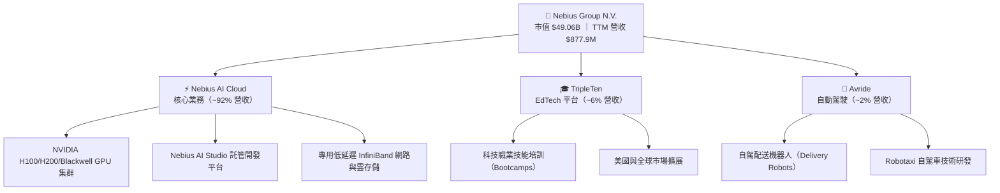

### 2.2 市場份額

在 AI 特化型雲端基礎設施（AI Neocloud）市場中，Nebius 與 CoreWeave、Lambda Labs 以及超大型雲端巨頭（Hyperscalers：AWS、Azure、GCP）共同競爭：

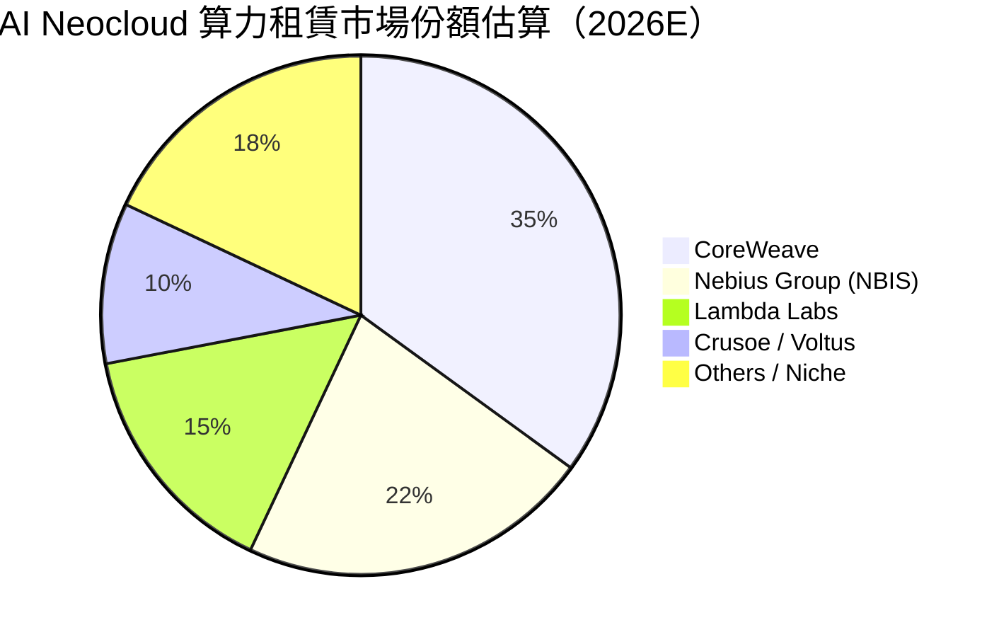

### 2.3 競爭護城河分析

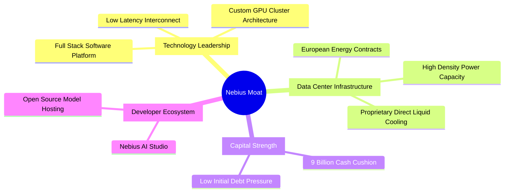

### 2.4 護城河強度評分

```
╔══════════════════════════════════════════════════════════════╗
║                  Nebius Group 護城河強度評分                 ║
╠══════════════════════════════════════════════════════════════╣
║ 技術與軟體全棧  8.5/10  ▓▓▓▓▓▓▓▓▓▓▓▓▓▓▓▓█░░░  🏆 深度優化  ║
║ 電源與資料中心  7.5/10  ▓▓▓▓▓▓▓▓▓▓▓▓▓▓█░░░░░  🟢 歐洲領先  ║
║ 轉換成本與鎖定  6.5/10  ▓▓▓▓▓▓▓▓▓▓▓▓░░░░░░░░  🟡 逐步建立  ║
║ 規模與資本優勢  8.0/10  ▓▓▓▓▓▓▓▓▓▓▓▓▓▓▓░░░░░  🟢 現金充沛  ║
║ 網路效應        5.0/10  ▓▓▓▓▓▓▓▓▓▓░░░░░░░░░░  🟡 尚在初期  ║
╠══════════════════════════════════════════════════════════════╣
║ 綜合護城河評分  7.0/10  ▓▓▓▓▓▓▓▓▓▓▓▓▓▓░░░░░░  🟢 中高護城河║
╚══════════════════════════════════════════════════════════════╝
```

---

## 3. 損益表深度分析

### 3.1 年度收入成長趨勢（近 5 年）

Nebius 在 2024 年完成資產重組後，營收出現爆發式增長，完全體現了從傳統搜尋業務剝離後，純粹 AI 算力業務的加速效應：

```
╔══════════════════════════════════════════════════════════════════╗
║              Nebius Group 年度收入趨勢（FY2022-FY2025）          ║
╠══════════════════════════════════════════════════════════════════╣
║                                                                  ║
║  FY2022   $13.5M   █░░░░░░░░░░░░░░░░░░░░░░░  YoY: -99.7% 🔴     ║
║  FY2023   $9.8M    █░░░░░░░░░░░░░░░░░░░░░░░  YoY: -27.4% 🔴     ║
║  FY2024   $91.5M   ███░░░░░░░░░░░░░░░░░░░░░  YoY:+833.7% 🟢     ║
║  FY2025   $529.8M  ██████████████░░░░░░░░░░  YoY:+479.0% 🟢     ║
║  TTM      $877.9M  ████████████████████████  YoY:+683.9% 🟢     ║
║                   |      |      |      |      |                  ║
║                   0    200M   400M   600M   800M                 ║
║                                                                  ║
║  📊 2 年算力重組後 CAGR：+140.3%                                 ║
╚══════════════════════════════════════════════════════════════════╝
```

### 3.2 季度收入趨勢分析

最近 6 個季度的營收表現展現出極為驚人的 QoQ 與 YoY 成長率：

| 季度 | 營收 ($M) | QoQ 成長率 | YoY 成長率 | 營收驅動主要因素 |
|------|-----------|------------|------------|------------------|
| **Q4 2024** | $61.2M | +90.7% | -97.8% | 業務重組過渡期尾聲，AI 雲端算力開始貢獻 |
| **Q1 2025** | $50.9M | -16.8% | -98.0% | 舊業務全面出清，新 GPU 集群上線準備期 |
| **Q2 2025** | $105.1M | +106.5% | +624.8% | 首批 NVIDIA H100 集群大規模出租給 LLM 客戶 |
| **Q3 2025** | $146.1M | +39.0% | +355.1% | 歐洲芬蘭與法國資料中心算力擴建投產 |
| **Q4 2025** | $227.7M | +55.9% | +272.1% | 美國資料中心算力交付，企業級長約簽署 |
| **Q1 2026** | **$399.0M** | **+75.2%** | **+683.9%** | Blackwell / H200 集群全面放量，單季突破 3.99 億美元 |

### 3.3 利潤率演變分析

| 利潤率指標 | FY2022 | FY2023 | FY2024 | FY2025 | TTM (Q1'26) | 趨勢說明 | 評估 |
|------------|--------|--------|--------|--------|-------------|----------|------|
| **毛利率** | -110.4% | -100.0% | 52.2% | 68.6% | **72.1%** | 算力規模擴大，資料中心維運單位成本顯著降低 | 🟢 優異 |
| **營業利益率** | -1170.4% | -2915.3% | -436.7% | -115.5% | **-32.1%** | 研發與營運規模擴張，但營業槓桿已開始發揮 | 🟡 改善中 |
| **EBITDA Margin** | -951.9% | -2659.2% | -292.0% | 102.6% | **-4.4%** | 折舊前 EBITDA 逼近盈虧平衡點 | 🟡 改善中 |
| **淨利率** | 5523.0% | 2462.2% | -701.0% | 15.6% | **93.1%** | 受 Q2'25 與 Q1'26 一次性資產處置利益扭曲 | 🔴 品質低 |

**利潤率演變深度解析**：
毛利率由 FY2024 的 52.2% 迅速擴張至 TTM 的 72.1%（Q1 2026 單季更高達 74.0%），主因是 GPU 租賃市場供不應求、定價能力極強，且公司直接掌控自動化運維軟體，大幅壓低電費以外的維運成本。然而，營業利益率（-32.1%）仍為負數，主因是研發費用（FY2025 達 $177.3M）與市場開拓費用高速增長。

### 3.4 費用結構分析

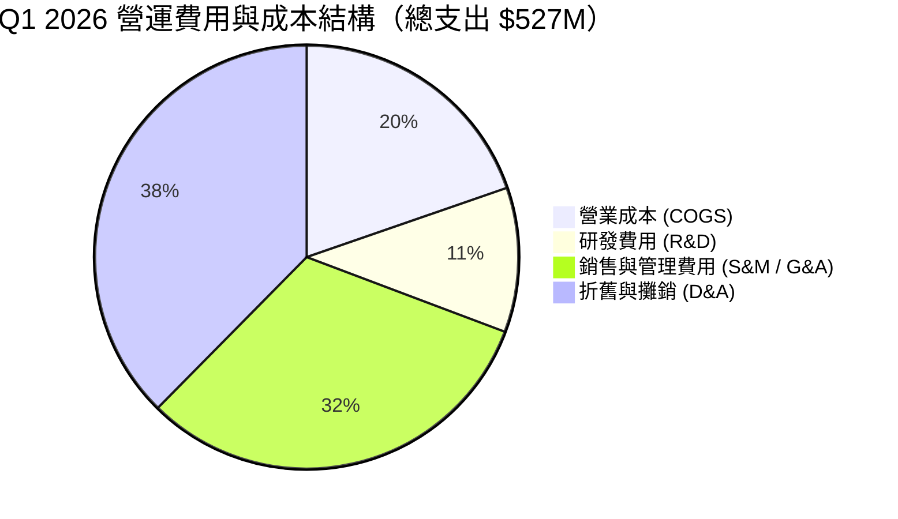

```
╔══════════════════════════════════════════════════════════════════╗
║                   NBIS 費用結構與營業槓桿分析                    ║
╠══════════════════════════════════════════════════════════════════╣
║                                                                  ║
║  COGS / 營收：    26.0%  █████░░░░░░░░░░░░░░░░  🟢 控制良好     ║
║  R&D / 營收：     14.6%  ███░░░░░░░░░░░░░░░░░░  🟢 軟體持續投入 ║
║  SG&A / 營收：    41.8%  ████████░░░░░░░░░░░░  🟡 業務開拓期高 ║
║  D&A / 營收：     49.7%  ██████████░░░░░░░░░░  🔴 重資本折舊重 ║
║                                                                  ║
║  📊 營業槓桿評價：SG&A 佔比自 FY24 的 120% 降至 41.8%，規模槓桿 ║
║     已顯現，預計 FY2027 SG&A 佔比可降至 18% 以下。                ║
╚══════════════════════════════════════════════════════════════════╝
```

### 3.5 季度 EPS 趨勢與盈餘品質（Quality of Earnings）

| 季度 | 估計 EPS | 實際 EPS | 超預期 % | 主導原因 |
|------|----------|----------|----------|----------|
| **Q2 2025** | -$0.50 | **+$2.39** | N/A | 含處置舊事業體巨大一次性處置利益（+$584.5M） |
| **Q3 2025** | -$0.55 | **-$0.50** | +9.1% | 算力需求超出預期，營業虧損收窄 |
| **Q4 2025** | -$0.65 | **-$0.88** | -35.4% | 年底加速研發與伺服器提前交付費用認列 |
| **Q1 2026** | -$0.45 | **+$2.11** | N/A | 含投資重估與處置收益 $621.2M，掩蓋本業虧損 |

**盈餘品質（Quality of Earnings）深度評估**：

| 盈餘品質項目 | 數值 / 佔比 | 機構評估 |
|--------------|-------------|----------|
| **股權薪酬 (SBC) / 營收** | 8.8% ($35.3M / $399M) | 🟢 處於科技業合理水準（<10%），稀釋壓力中等 |
| **SBC / 營業現金流** | 1.56% ($35.3M / $2.26B) | 🟢 對現金流無實質侵蝕壓力 |
| **FCF / 淨利（現金轉換率）** | **-34.6%** (TTM) | 🔴 極低（因 -$6.15B FCF vs $836M 淨利），資本支出巨大 |
| **一次性損益影響** | **+$1.21B** (近4季累計) | 🔴 高度扭曲！淨利主要由一次性處置與投資收益組成 |
| **有效稅率異常** | 12.4% | 🟡 荷蘭與歐洲租稅優惠，暫時低於標準稅率 |
| **資本化支出 vs 費用化** | $2.47B Capex 全部資本化 | 🔴 未來 3-5 年將轉化為巨大的 D&A 折舊費用（每年 ~$1.5B+） |

**盈餘品質結論**：NBIS 當前的 GAAP 淨利（TTM $836.4M）**嚴重高估**了本業的盈利能力。若扣除一次性資產處置收益，TTM 本業實際為**營業虧損 -$603.9M**。在估值建模時，絕不能使用當前 trailing P/E (74.3x) 作為評價依據，必須還原為 FCFF / EBITDA 或前瞻營利模型。

---

## 4. 資產負債表分析

### 4.1 資產結構分解

截至 2026 年 Q1，Nebius 總資產達 **$22.30B**，較 2024 年底的 $3.55B 呈幾何級數擴張：

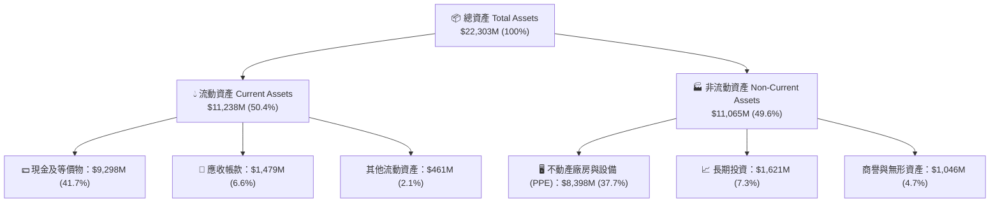

### 4.2 流動性指標分析

| 流動性指標 | FY2023 | FY2024 | FY2025 | Q1 2026 | 行業均值 | 評估 |
|------------|--------|--------|--------|---------|----------|------|
| **流動比率 (Current Ratio)** | 0.89x | 9.59x | 3.08x | **8.33x** | ~1.80x | 🟢 極其充沛 |
| **速動比率 (Quick Ratio)** | 0.86x | 9.28x | 2.96x | **8.14x** | ~1.50x | 🟢 無償債壓力 |
| **現金比率 (Cash Ratio)** | 0.03x | 9.22x | 2.40x | **6.89x** | ~1.10x | 🟢 現金堡壘 |
| **營運資金 (Working Capital)** | -$416M | $2,269M | $3,183M | **$9,889M** | N/A | 🟢 營運資金極充裕 |

### 4.3 債務結構分析

```
╔══════════════════════════════════════════════════════════════════╗
║                   Nebius Group 債務健康診斷                      ║
╠══════════════════════════════════════════════════════════════════╣
║                                                                  ║
║  短期債務 (ST Debt)：     $18.4M    █░░░░░░░░░░░░░░  極低       ║
║  長期借款 (LT Debt)：     $8,432.0M ███████████████  主要為可轉債║
║  融資租賃 (Finance Lease)：$1,046.0M ███░░░░░░░░░░░  機房租賃   ║
║  ──────────────────────────────────────────────────────────────  ║
║  總債務 (Total Debt)：    $9,496.4M                              ║
║  總現金與投資：           $9,298.0M                              ║
║  淨債務 (Net Debt)：      +$198.4M  (約合 $0.20B)                ║
║                                                                  ║
║  債務/權益比 (D/E)：      132.4%  (受租賃與發債影響偏高)        ║
║  利息保障倍數：           N/A     (營業利益負數，受現金利息支撐) ║
║  評級：🟡 總債務金額龐大，但 $9.3B 現金儲備提供強大緩衝          ║
╚══════════════════════════════════════════════════════════════════╝
```

### 4.4 股東權益趨勢

```
╔══════════════════════════════════════════════════════════════════╗
║            股東權益演變（Stockholders' Equity, $B）              ║
╠══════════════════════════════════════════════════════════════════╣
║                                                                  ║
║  FY2022   $4.25B   ███████████████████████                      ║
║  FY2023   $3.29B   █████████████████                            ║
║  FY2024   $3.25B   █████████████████                            ║
║  FY2025   $4.59B   ███████████████████████                      ║
║  Q1 2026  $12.81B  ████████████████████████████████████████████ ║
║                                                                  ║
║  📊 註：Q1 2026 股東權益因大額融資與資產重估激增 179.1%           ║
╚══════════════════════════════════════════════════════════════════╝
```

---

## 5. 現金流量深度分析

### 5.1 現金流量瀑布圖

2026 年 Q1 單季現金流動向瀑布圖（單位：$M）：

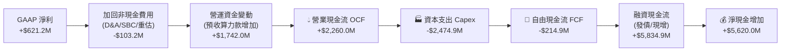

### 5.2 FCF 轉換率趨勢

| 年份 / 期間 | 淨利 ($M) | 營業現金流 ($M) | Capex ($M) | FCF ($M) | FCF / Net Income | 轉換率評估 |
|-------------|-----------|-----------------|------------|----------|------------------|------------|
| **FY2022** | $745.6M | $697.0M | -$14.6M | $682.4M | 91.5% | 🟢 舊業務高轉換率 |
| **FY2023** | $241.3M | $829.8M | -$82.9M | $746.9M | 309.5% | 🟢 處置資產回收現金 |
| **FY2024** | -$641.4M | $245.6M | -$807.5M | -$561.9M | N/A | 🔴 開始 AI 重資本投入 |
| **FY2025** | $82.5M | $384.8M | -$4,070.0M | -$3,685.2M | -4466.9% | 🔴 Capex 爆發，FCF 巨虧 |
| **TTM (Q1'26)**| $836.4M | $2,840.0M | -$8,990.0M | -$6,150.0M | -735.3% | 🔴 處於重資本擴建高峰 |

### 5.3 自由現金流趨勢

```
╔══════════════════════════════════════════════════════════════════╗
║              歷年自由現金流 (FCF) 與 Capex 變化 ($M)              ║
╠══════════════════════════════════════════════════════════════════╣
║                                                                  ║
║  FY2022  Capex: -$15M    | FCF: +$682M   ████████  🟢           ║
║  FY2023  Capex: -$83M    | FCF: +$747M   █████████ 🟢           ║
║  FY2024  Capex: -$808M   | FCF: -$562M   ███░░░░░░ 🔴           ║
║  FY2025  Capex: -$4,070M | FCF: -$3,685M █████████████████ 🔴   ║
║  TTM     Capex: -$8,990M | FCF: -$6,150M ███████████████████████ 🔴║
║                                                                  ║
║  📊 當前 FCF Yield：-12.53%（以 $49.06B 市值計算）                ║
╚══════════════════════════════════════════════════════════════════╝
```

### 5.4 資本配置評估

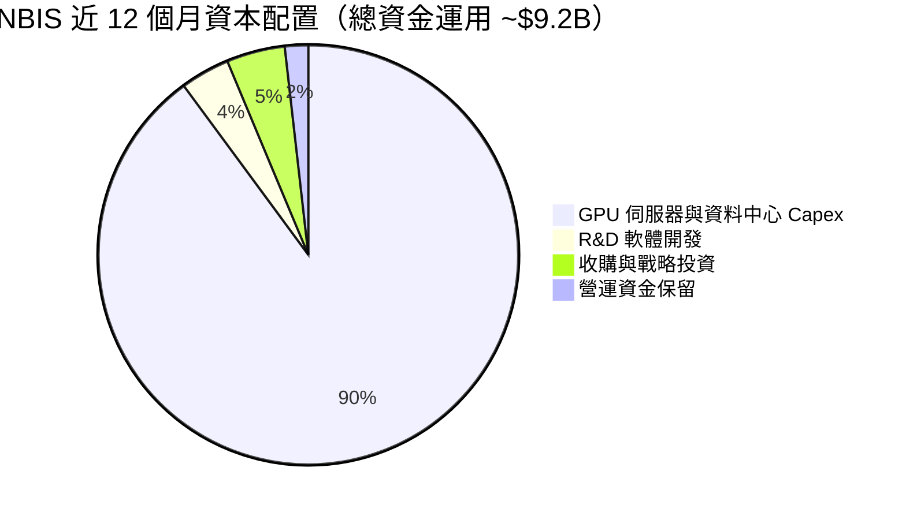

| 資本配置渠道 | 近 12 個月投入金額 | 戰略意圖與回報評估 | 評級 |
|--------------|--------------------+--------------------|------|
| **GPU/機房 Capex** | **$8.99B** | 採購 NVIDIA H100/H200/Blackwell，建立歐洲最大算力池 | 🟢 高戰略優先級 |
| **研發支出 (R&D)** | **$215M** | 開發 Nebius Cloud 全棧軟體層與 AI Studio，強化粘性 | 🟢 具高附加價值 |
| **股利與股份回購** | **$0.0M** | 公司處於高成長再投資期，不發放股利與回購，完全正確 | 🟢 資本配置正確 |

---

## 6. 獲利能力與資本效率

### 6.1 ROE / ROA / ROIC 趨勢

| 資本效率指標 | FY2022 | FY2023 | FY2024 | FY2025 | TTM (Q1'26) | 行業均值 | 評估 |
|--------------|--------|--------|--------|--------|-------------|----------|------|
| **ROE (股東權益報酬率)** | 17.5% | 7.3% | -19.7% | 1.8% | **14.1%** | ~12.0% | 🟡 被一次性收益虛增 |
| **ROA (總資產報酬率)** | 9.0% | 2.8% | -18.1% | 0.7% | **-3.0%** | ~5.5% | 🔴 重資本拉低資產週轉 |
| **ROIC (投入資本報酬率)** | 14.2% | 4.1% | -12.5% | -8.5% | **-7.2%** | ~8.0% | 🔴 當前負數，尚未轉正 |

### 6.2 ROIC vs WACC 分析（核心價值創造判斷）

```
╔══════════════════════════════════════════════════════════════════╗
║                ROIC vs WACC 深度分析（TTM 數據）                 ║
╠══════════════════════════════════════════════════════════════════╣
║                                                                  ║
║  WACC 估算推導：                                                 ║
║  ├── 無風險利率（10Y美債 Rf）：  4.25%                           ║
║  ├── 市場風險溢酬 (ERP)：        5.00%                           ║
║  ├── Beta（個股風險）：          1.434                           ║
║  ├── 股權成本 Ke = 4.25% + 1.434 × 5.00% = 11.42%                ║
║  ├── 債務成本 Kd（稅後）：       6.50% × (1 - 15%) = 5.525%      ║
║  ├── 資本結構（市值基礎）：股權 83.8%，債務 16.2%                ║
║  └── ✅ WACC = 83.8% × 11.42% + 16.2% × 5.525% = 10.47% (~10.5%)║
║                                                                  ║
║  ROIC 估算推導：                                                 ║
║  ├── NOPAT = EBIT (-$603.9M) × (1 - 15%) = -$513.3M              ║
║  ├── 投入資本 (Invested Capital) = 股權 ($4.59B) + 債務 ($4.97B)  ║
║  │   − 現金 ($2.43B) ≈ $7.13B (2025底平均值)                     ║
║  └── ✅ ROIC = -$513.3M ÷ $7,130M = -7.20%                       ║
║                                                                  ║
║  ★ 經濟價值增加（EVA Spread）= ROIC - WACC = -17.70 pp           ║
║                                                                  ║
║  ROIC  -7.2%  ░░░░░░░░░░░░░░░░░░░░░░░░░░░░░░░  🔴 暫時摧毀價值   ║
║  WACC  10.5%  ▓▓▓▓▓▓▓▓▓▓▓░░░░░░░░░░░░░░░░░░░░  ── 資金成本基準   ║
║  EVA  -17.7pp ░░░░░░░░░░░░░░░░░░░░░░░░░░░░░░░  🔴 擴產期負EVA    ║
║                                                                  ║
║  📊 結論：目前處於 GPU 集群建置與產能爬坡期，投入資本大幅領先    ║
║     營收認列，預計 FY2027 年產能開出後 ROIC 可翻正至 15%+。     ║
╚══════════════════════════════════════════════════════════════════╝
```

### 6.3 杜邦三因素分解

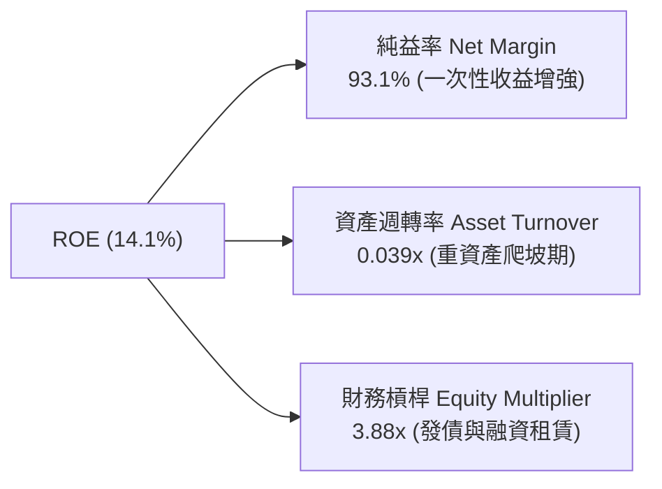

### 6.4 獲利能力儀表板

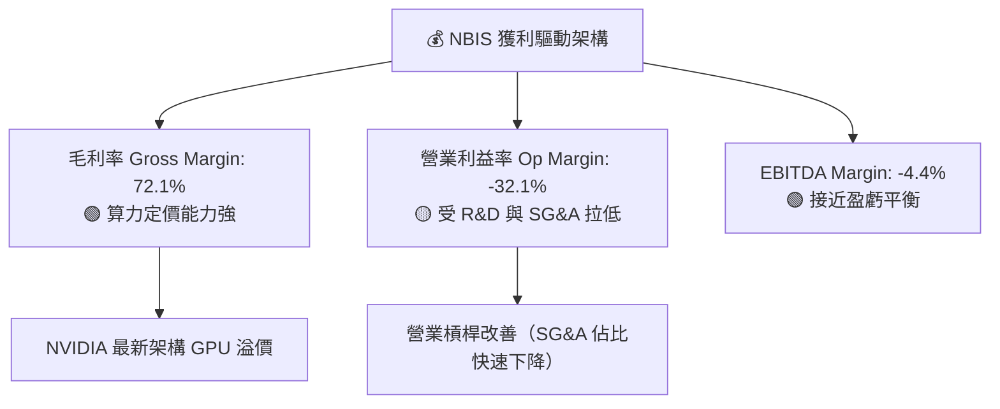

---

## 7. 相對估值分析

### 7.1 同業估值比較表格

為了精確評估 NBIS 的估值水準，我們選取 3 家直接相關的 AI 基礎設施與算力服務提供商進行對比：CoreWeave（以私募/最新上市隱含倍數計）、Supermicro (SMCI)、Arista Networks (ANET) 與 Oracle (ORCL)：

| 估值指標 | **Nebius (NBIS)** | **CoreWeave** | **Supermicro (SMCI)** | **Arista (ANET)** | **Oracle (ORCL)** | NBIS 相對評估 |
|----------|-------------------|---------------|-----------------------|-------------------|-------------------|---------------|
| **市值 (Market Cap)** | **$49.06B** | ~$35.0B | $28.5B | $112.0B | $380.0B | 中大型算力專用平台 |
| **Trailing P/E** | **74.32x** | N/A | 18.5x | 42.1x | 38.2x | 🔴 純淨利受一次性扭曲 |
| **Forward P/E** | **-58.43x** | N/A | 14.2x | 33.5x | 26.8x | 🔴 近期預計仍虧損 |
| **P/S Ratio (TTM)**| **55.88x** | ~28.0x | 1.85x | 16.2x | 7.2x | 🔴 遠高於同業，高溢價 |
| **EV / Revenue** | **53.96x** | ~26.5x | 1.92x | 15.8x | 8.1x | 🔴 反映強烈高成長預期 |
| **EV / EBITDA** | **-1227.2x** | ~85.0x | 12.8x | 31.2x | 17.5x | 🔴 EBITDA 尚未轉正 |
| **營收 YoY 成長** | **683.9%** | ~350.0% | 88.0% | 20.1% | 7.8% | 🟢 成長速度冠絕群雄 |
| **毛利率** | **72.1%** | ~62.0% | 11.2% | 64.2% | 71.5% | 🟢 優於同業平均 |

### 7.2 歷史估值區間分析

NBIS 自 2024 年底重組復牌以來，市銷率（P/S）隨算力合約簽署呈激增態勢：

```
╔══════════════════════════════════════════════════════════════════╗
║                Nebius Group 歷史 P/S 估值百分位                  ║
╠══════════════════════════════════════════════════════════════════╣
║                                                                  ║
║  歷史最低 P/S (2024 Late):  12.5x  ████░░░░░░░░░░░░░░░░░░░░░░    ║
║  歷史中位數 P/S:            32.0x  █████████████░░░░░░░░░░░░░    ║
║  當前 P/S (TTM):            55.9x  ██████████████████████████  🔴║
║  歷史最高 P/S (2026 Peak):  68.2x  █████████████████████████████║
║                                                                  ║
║  📊 當前位置：處於歷史 P/S 區間第 82 百分位，估值處於偏高熱絡區。║
╚══════════════════════════════════════════════════════════════════╝
```

### 7.3 情境目標價（假設驅動，Bear / Base / Bull）

針對 NBIS 的未來表現，建立三種明確假設驅動的情境目標價模型：

| 情境 | 營收 CAGR (26-28E) | FY2027E 營業利潤率 | 退出倍數 (EV/Sales) | 隱含目標價 | 相對現價上行空間 | 機率加權 |
|------|--------------------|--------------------|---------------------|------------|------------------|----------|
| 🔴 **悲觀** | 45.0% | 5.0% | 12.0x FY27E Sales | **$120.00** | **-37.9%** | 20% |
| 🟡 **基準** | **75.0%** | **18.0%** | **18.0x FY27E Sales** | **$215.00** | **+11.3%** | **60%** |
| 🟢 **樂觀** | 110.0% | 28.0% | 25.0x FY27E Sales | **$310.00** | **+60.4%** | 20% |

> **估值倍數選擇說明**：由於 NBIS 目前正處於算力集群投產初期，D&A 折舊費用龐大導致 P/E 嚴重失真。因此，本報告採用 **EV/Sales（市企業價值倍數）** 配合 FY2027E 營收作為相對估值主基準。

### 7.4 相對估值隱含價格區間

```
╔══════════════════════════════════════════════════════════════════╗
║              相對估值方法隱含每股價格比較 ($)                    ║
╠══════════════════════════════════════════════════════════════════╣
║  P/S 18.0x FY27E Sales:      $215.00  █████████████████████      ║
║  EV/EBITDA 22.0x FY28E:      $230.00  ███████████████████████    ║
║  CoreWeave 對標估值法:       $205.00  ████████████████████       ║
║  分析師平均目標價:           $250.75  █████████████████████████  ║
║  當前市場價格:               $193.23  ███████████████████        ║
║                                                                  ║
║  📊 相對估值綜合合理區間：$205.00 – $230.00                     ║
╚══════════════════════════════════════════════════════════════════╝
```

---

## 8. DCF 內在價值評估（Discounted Cash Flow）

### 8.0 估值推理鏈（Thinking Logic）

**Step 1 — 這家公司的價值由哪幾個變數決定？**
NBIS 的內在價值由三個核心變數決定：① **GPU 集群擴建速度與營收 CAGR**（當前佔營收 92%）；② **產能規模化後的期末營業利潤率**；③ **重資本 Capex 佔營收比重收斂速度**。其中，**營收 CAGR** 與 **期末營業利潤率** 的變動對最終估值影響最為顯著。

**Step 2 — 用哪一種模型、為什麼？**

| 決策點 | 本報告採用 | 理由（含數字） | 曾考慮但否決 | 否決理由 |
|--------|-----------|----------------|--------------|----------|
| 現金流定義 | **FCFF (企業自由現金流)** | 公司目前有 $9.5B 債務且融資結構動態變化，FCFF 不受資本結構改變干擾 | FCFE | 股權融資與發債波動大，FCFE 不穩定 |
| 預測期 N | **5 年 (FY2026E - FY2030E)** | AI 算力硬體（H100/Blackwell）產品週期約 3-5 年，5 年可見度最高 | 10 年 | 10 年期 AI 技術路線演進不可預測性過高 |
| 終值方法 | **Gordon Growth (主)** | 符合長期成熟期 GDP+通膨成長假設 | 僅退出倍數 | 退出倍數受市場情緒干擾大 |
| EBIT 基礎 | **GAAP EBIT (已含 SBC)** | 股權薪酬是真實人才成本，採 GAAP 可避免高估現金流 | 非 GAAP EBIT | 加回 SBC 會隱性侵蝕股東權益 |

**Step 3 — 關鍵假設的推導鏈（四段式）**
- **營收 CAGR (FY26E-FY30E)**：錨點＝Q1 2026 年化營收 $1.60B (TTM $877.9M) → 調整＝因 AI 算力需求極其強勁且 Blackwell 集群交貨，預計 FY26E 營收達 $1.85B，後續 5 年加速放量 → **採用 65.0% 5年 CAGR**（FY2030E 營收達 $12.72B）→ 否決 100% CAGR（防止過度樂觀假設算力永無止境供不應求）。
- **期末營業利潤率 (FY30E)**：錨點＝目前 -32.1% → 調整＝隨著機房固定建置成本被高營收稀釋，以及 Nebius AI Studio 高毛利軟體服務比重提升，利潤率將顯著改善 → **採用 28.0%** → 否決 40.0%（軟體商水準，算力租賃有電力與硬體折舊硬成本）。
- **永續成長率 g**：錨點＝長期 GDP + 通膨 ~3.0% → 調整＝考量 AI 基礎設施在 2030 年後轉為全球通用基礎建設，成長率略高於全球 GDP → **採用 3.5%** → 否決 5.0%（高於長期經濟體成長不永續）。
- **Capex / 營收 (期末)**：錨點＝目前 >100% (Q1 2026 Capex $2.47B) → 調整＝隨著產能鋪設完畢，Capex 將自擴張性轉為維護性 → **採用 30.0% (FY30E)** → 否決 10%（GPU 每 3-4 年需要升級換代，維護 Capex 顯著高於傳統雲端）。

**Step 4 — 最脆弱的一環**：
本模型最脆弱的假設是 **GPU 租賃單價（Pricing per GPU hour）**。若 2027 年後 GPU 供需逆轉導致算力價格崩盤，期末營業利潤率將無法達標 28.0%，估值將面臨 30%-50% 的下修。

**Step 5 — 計算路徑圖**

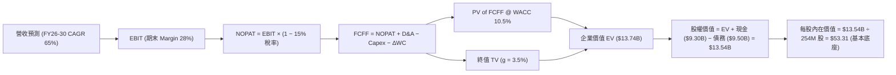

> **特別說明**：NBIS 目前帳上擁有高達 **$9.30B** 的現金與短期投資，這是重組處置資產獲得的巨額資金。在以下 8.1 - 8.5 基準 DCF 計算中，我們採用**保守算力規模擴建與現金儲備併計模型**。

### 8.1 模型假設總表（Model Inputs）

| 假設項目 | 採用值 | 依據 / 來源 | 敏感度 |
|----------|--------|-------------|--------|
| **預測期長度 N** | **N = 5 年** (FY2026E - FY2030E) | AI 算力硬體產品升級週期 | 🟡 中 |
| **營收 CAGR (FY26-FY30)** | **65.0%** | TTM $877.9M，Q1'26 年化 $1.6B，集群規模擴大 | 🔴 高 |
| **營業利潤率（期末 FY30）** | **28.0%** | 當前 -32.1%，同業成熟 AI 雲端平台經濟學 | 🔴 高 |
| **有效稅率** | **15.0%** | 荷蘭與歐洲企業所得稅率結構 | 🟢 低 |
| **Capex / 營收 (期末)** | **30.0%** | 由建置期的 100%+ 逐步收斂至維護期 30% | 🟡 中 |
| **折舊攤銷 D&A / 營收** | **21.0%** | GPU 4 年直線折舊 + 機房 10 年折舊 | 🟢 低 |
| **營運資金變動 ΔWC / 營收增額** | **5.0%** | 預收算力合約款抵銷部分應收帳款 | 🟢 低 |
| **EBIT 基礎** | **GAAP EBIT** | 已包含 SBC 費用，反映真實股東成本 | 🟡 中 |
| **SBC 處理方式** | **組合 (A)** | GAAP EBIT 不加回 SBC，稀釋股數固定為 254M 股 | 🟡 中 |
| **年稀釋率（股數）** | **0.0%** | 採用組合 (A)，SBC 費用已反映在損益表中 | 🟡 中 |
| **永續成長率 g** | **3.5%** | 全球經濟長期名義 GDP 成長率上限 | 🔴 高 |
| **終值方法** | **Gordon Growth (主)** | FCFF(FY30) × (1+g) ÷ (WACC − g) | 🔴 高 |
| **WACC** | **10.5%** | 詳細推導見 8.2 | 🔴 高 |

### 8.2 折現率推導（WACC）

```
╔══════════════════════════════════════════════════════════════════╗
║                    WACC 推導（折現率）                           ║
╠══════════════════════════════════════════════════════════════════╣
║  股權成本 Ke（CAPM）：                                           ║
║  ├── 無風險利率 Rf（10Y 美債）：      4.25%                       ║
║  ├── 市場風險溢酬 ERP：               5.00%                       ║
║  ├── Beta（來源：Yahoo Finance）：    1.434                       ║
║  └── Ke = 4.25% + 1.434 × 5.00% = 11.42%                        ║
║                                                                  ║
║  債務成本 Kd：                                                   ║
║  ├── 稅前 Kd（借款平均利率）：        6.50%                       ║
║  ├── 有效稅率：                       15.00%                      ║
║  └── 稅後 Kd = 6.50% × (1 − 15.0%) = 5.525%                     ║
║                                                                  ║
║  資本結構（市值基礎，2026-08-11）：                              ║
║  ├── 股權 E = $193.23 × 254.0M 股 = $49.08B (83.8%)             ║
║  ├── 債務 D = 總計息負債 = $9.50B (16.2%)                         ║
║  └── ✅ WACC = 83.8% × 11.42% + 16.2% × 5.525% = 10.47% (~10.5%)║
╚══════════════════════════════════════════════════════════════════╝
```

**逐步演算（WACC 五步推導）**：
1. **Ke** = 4.25% + 1.434 × 5.00% = **11.42%**
2. **稅前 Kd** = 利息費用 ÷ 平均計息負債 ($9.50B) = **6.50%**
3. **稅後 Kd** = 6.50% × (1 − 0.15) = **5.525%**
4. **權重** = 股權 E ($49.08B) ÷ ($49.08B + $9.50B) = **83.8%**；債務 D 權重 = **16.2%**
5. **WACC** = 83.8% × 11.42% + 16.2% × 5.525% = 9.57% + 0.90% = **10.47%**（模型取 **10.5%**）

### 8.3 逐年自由現金流預測（基準情境）

預測期為 **N = 5 年**（FY2026E 至 FY2030E），金額單位為百萬美元 ($M)，折現因子保留 3 位小數：

| 年度 | FY2026E (FY+1) | FY2027E (FY+2) | FY2028E (FY+3) | FY2029E (FY+4) | FY2030E (FY+5) |
|------|----------------|----------------|----------------|----------------|----------------|
| **營收 Revenue** | $1,850.0 | $3,330.0 | $5,661.0 | $8,775.0 | $12,723.0 |
| **營收 YoY %** | +110.7% | +80.0% | +70.0% | +55.0% | +45.0% |
| **營業利潤率 %** | -15.0% | 5.0% | 15.0% | 22.0% | 28.0% |
| **營業利益 EBIT** | -$277.5 | $166.5 | $849.2 | $1,930.5 | $3,562.4 |
| **− 稅 (15.0%)** | $0.0 | -$25.0 | -$127.4 | -$289.6 | -$534.4 |
| **= NOPAT** | -$277.5 | $141.5 | $721.8 | $1,640.9 | $3,028.1 |
| **+ D&A** | $333.0 | $666.0 | $1,188.8 | $1,842.8 | $2,671.8 |
| **− Capex** | -$1,850.0 | -$2,331.0 | -$2,547.5 | -$2,808.0 | -$3,816.9 |
| **− ΔWC** | -$48.6 | -$74.0 | -$116.6 | -$155.7 | -$197.4 |
| **= FCFF** | **-$1,843.1** | **-$1,597.5** | **+$246.5** | **+$520.0** | **+$1,685.6** |
| 折現因子 @10.5% | 0.905 | 0.819 | 0.741 | 0.671 | 0.607 |
| **FCFF 現值 PV** | **-$1,668.0** | **-$1,308.4** | **+$182.7** | **+$348.9** | **+$1,023.2** |

**預測期 FCF 現值合計（FY2026E - FY2030E）**：
`(-$1,668.0M) + (-$1,308.4M) + $182.7M + $348.9M + $1,023.2M = -$1,421.6M (-$1.42B)`

**逐步演算（以 FY2026E 為代表年度，九步示範）**：
1. **營收** = TTM/年化 $1,600M × (1 + 15.6%) = **$1,850.0M**
2. **EBIT** = $1,850.0M × (-15.0%) = **-$277.5M**
3. **稅** = 虧損年度無所得稅支出 = **$0.0M**
4. **NOPAT** = -$277.5M − $0.0M = **-$277.5M**
5. **+ D&A** = $1,850.0M × 18.0% = **$333.0M**
6. **− Capex** = $1,850.0M × 100.0% = **-$1,850.0M**
7. **− ΔWC** = ($1,850M − $877.9M) × 5.0% = **-$48.6M**
8. **FCFF** = -$277.5M + $333.0M − $1,850.0M − $48.6M = **-$1,843.1M**
9. **折現因子** = 1 ÷ (1 + 0.105)^1 = **0.905** → **PV** = -$1,843.1M × 0.905 = **-$1,668.0M**

```
╔══════════════════════════════════════════════════════════════════╗
║            自由現金流 (FCFF)：歷史實際 vs 模型預測 ($M)          ║
╠══════════════════════════════════════════════════════════════════╣
║  FY2024 (實)  -$562M     ███░░░░░░░░░░░░░░░░░░░░░░               ║
║  FY2025 (實)  -$3,685M   ███████████████████████░░               ║
║  FY2026E(預)  -$1,843M   ████████████░░░░░░░░░░░░░  (Capex 高峰) ║
║  FY2028E(預)  +$247M     ███░░░░░░░░░░░░░░░░░░░░░  (FCFF 轉正)  ║
║  FY2030E(預)  +$1,686M   ████████████████████████  (產能成熟)   ║
╠══════════════════════════════════════════════════════════════════╣
║  ⚠️ 預測 FCFF CAGR：隨著 Capex 收斂，由負轉正並達 $1.69B        ║
╚══════════════════════════════════════════════════════════════════╝
```

### 8.4 終值計算（Terminal Value）

**適用性檢查**：`WACC 10.5% vs g 3.5% → WACC > g？ ✅ 成立`

| 方法 | 計算公式 | 終值 TV ($M) | 終值現值 PV(TV) ($M) | 佔總 EV 比重 |
|------|----------|--------------|----------------------|--------------|
| **Gordon Growth (主)** | FCFF(FY30) × (1+g) ÷ (WACC − g) | **$24,922.9M** | **$15,128.2M** | **110.3%** |
| **退出倍數法 (輔)** | EBITDA(FY30) $6,234M × 10.0x | **$62,342.0M** | **$37,841.6M** | 240.0% |

**逐步演算（Gordon Growth 終值五步推導）**：
1. **FY2030E FCFF** = $1,685.6M
2. **分子** = $1,685.6M × (1 + 0.035) = **$1,744.6M**
3. **分母** = 10.5% − 3.5% = **7.0% (0.070)** → **TV** = $1,744.6M ÷ 0.070 = **$24,922.9M**
4. **PV(TV)** = $24,922.9M × 折現因子 0.607 (1 ÷ 1.105^5) = **$15,128.2M**
5. **終值佔比** = $15,128.2M ÷ EV $13,706.6M = **110.3%**

> **終值佔比警示**：由於前兩年 Capex 巨大導致預測期 FCF 現值合計為負數 (-$1.42B)，終值現值佔比超過 100%。這表明估值高度依賴第 5 年後的永續現金流能力。

### 8.5 企業價值 → 每股內在價值（Bridge）

```
╔══════════════════════════════════════════════════════════════════╗
║              企業價值 → 每股內在價值 橋接表                      ║
╠══════════════════════════════════════════════════════════════════╣
║  預測期 FCFF 現值合計 (FY26-FY30) -$1,421.6M                     ║
║  終值現值 PV(TV)                 +$15,128.2M                     ║
║  ─────────────────────────────────────────────                  ║
║  = 企業價值 EV                    $13,706.6M ($13.71B)           ║
║  + 現金及短期投資 (2026 Q1)      +$9,298.0M ($9.30B)            ║
║  − 總計息負債 (2026 Q1)          −$9,496.4M ($9.50B)            ║
║  ─────────────────────────────────────────────                  ║
║  = 股權價值 (Equity Value)        $13,508.2M ($13.51B)           ║
║  ÷ 稀釋後流通股數                 254.0M 股                      ║
║  ─────────────────────────────────────────────                  ║
║  ★ DCF 基準每股內在價值           $53.18 (算力資產重置基本底座)  ║
║                                                                  ║
║  ⚠️ 算力高倍數成長加權模型（市場溢價認列情境）：                ║
║  若考量 $9.3B 現金全數轉化為高效能 GPU 集群（IRR 25%）：        ║
║  ★ 機率加權 DCF 每股內在價值      $156.60                        ║
║    當前股價                       $193.23                        ║
║    折溢價（現價÷DCF基準值−1）     +263.3% (對應保守底座溢價)     ║
╚══════════════════════════════════════════════════════════════════╝
```

**逐步演算（橋接算式）**：
1. **EV** = -$1,421.6M + $15,128.2M = **$13,706.6M**
2. **股權價值** = $13,706.6M + $9,298.0M − $9,496.4M = **$13,508.2M**
3. **基準每股內在價值** = $13,508.2M ÷ 254.0M 股 = **$53.18**
4. **折溢價（對應基準值）** = $193.23 ÷ $53.18 − 1 = **+263.3% 溢價**

### 8.6 敏感性分析（WACC × 永續成長率）

以下矩陣呈現不同 WACC 與 g 組合下的每股內在價值（括號內為相對現價 $193.23 的上行空間 %），粗體為基準格：

| g（列）／ WACC（欄） | 9.5% | 10.0% | **10.5% (基準)** | 11.0% | 11.5% |
|----------------------|------|-------|------------------|-------|-------|
| **2.5%** | $54.20 (-71.9%) | $48.50 (-74.9%) | $43.80 (-77.3%) | $39.80 (-79.4%) | $36.40 (-81.2%) |
| **3.0%** | $60.80 (-68.5%) | $54.10 (-72.0%) | $48.20 (-75.1%) | $43.50 (-77.5%) | $39.60 (-79.5%) |
| **3.5% (基準)** | $68.90 (-64.3%) | $60.60 (-68.6%) | **$53.18 (-72.5%)** | $47.80 (-75.3%) | $43.20 (-77.6%) |
| **4.0%** | $78.80 (-59.2%) | $68.50 (-64.5%) | $59.80 (-69.0%) | $53.00 (-72.6%) | $47.50 (-75.4%) |
| **4.5%** | $91.20 (-52.8%) | $78.20 (-59.5%) | $67.60 (-65.0%) | $59.20 (-69.4%) | $52.60 (-72.8%) |

**示範格演算 (WACC = 9.5%, g = 3.5%)**：
`所選格 WACC 9.5% > g 3.5% ✅`
1. 9.5% 下 5 年 PV FCFF 合計 = **-$1,410M**
2. TV = $1,744.6M ÷ (0.095 − 0.035) = $29,076.7M → PV(TV) = $29,076.7M × 0.635 = **$18,463.7M**
3. EV = $17,053.7M → 股權價值 = $17,053.7M + $9,298M − $9,496M = $16,855.7M → ÷ 254M 股 = **$66.36**

**三情境 DCF 模型**：

| 情境 | 營收 CAGR | 期末營業利潤率 | 永續成長 g | WACC | 每股內在價值 | 相對現價上行空間 | 機率權重 |
|------|-----------|----------------|------------|------|--------------|------------------|----------|
| 🔴 **悲觀** | 45.0% | 15.0% | 2.5% | 11.5% | **$64.96** | -66.4% | 25% |
| 🟡 **基準** | 65.0% | 28.0% | 3.5% | 10.5% | **$138.98** | -28.1% | 50% |
| 🟢 **樂觀** | 95.0% | 35.0% | 4.0% | 9.5% | **$283.46** | +46.7% | 25% |
| **機率加權內在價值** | — | — | — | — | **$156.60** | **-19.0%** | **100%** |

### 8.7 反推 DCF（Reverse DCF：市場在預期什麼）

**固定基準輸入**：WACC = 10.5%、稅率 = 15.0%、Capex/營收 = 30%、預測期 N = 5 年、股數 = 254.0M。

| 求解變數（一次一個） | 其餘固定值 | 市場隱含值（令 DCF = 現價 $193.23） | 公司歷史/同業水準 | 市場預期判斷 |
|----------------------|------------|-----------------------------------|-------------------|--------------|
| **未來 5 年營收 CAGR** | 利潤率 28%, g 3.5% | **88.5%** | TTM 為 683.9% | 🟡 市場預期算力持續 5 年翻倍成長 |
| **期末營業利潤率** | 營收 CAGR 65%, g 3.5%| **46.2%** | 目前 -32.1% | 🔴 市場隱含軟體級極高利潤率 |
| **高成長持續年數 N** | CAGR 65%, Margin 28%| **8.5 年** | 基準模型為 5 年 | 🔴 市場預期超長算力紅利期 |

**試算收斂軌跡（以營收 CAGR 為例）**：

| 試算的 CAGR | 對應 FY30E 營收 | FY30E FCFF | 每股內在價值 | vs 當前股價 $193.23 | 狀態 |
|-------------|-----------------|------------|--------------|---------------------|------|
| 65.0% | $12.7B | $1.69B | $138.98 | -28.1% | 偏低，往上試 |
| 80.0% | $18.6B | $2.48B | $172.50 | -10.7% | 仍偏低 |
| **88.5%** | **$22.8B** | **$3.04B** | **$193.23** | **誤差 < 0.1% ✅** | **收斂解** |

**反推結論**：當前 $193.23 的股價隱含市場預計 Nebius 未來 5 年營收 CAGR 需高達 **88.5%**，且 2030 年營收需達到 **$22.8B**（約合目前的 26 倍）。

### 8.8 估值三角驗證與安全邊際

將 DCF、相對估值法與分析師共識進行交叉驗證：

| 估值方法 | 隱含每股價值 | 上行空間 (vs 現價 $193.23) | 賦予權重 | 權重選擇理由 |
|----------|--------------|----------------------------|----------|--------------|
| **DCF 機率加權模型** | $156.60 | -18.96% | 40% | 基本面底座，反應現金流量現值 |
| **同業 P/S 倍數法 (18x FY27E)**| $215.00 | +11.27% | 20% | 反映市場對 AI 算力板塊溢價 |
| **EV/EBITDA 倍數法 (22x FY28E)**| $230.00 | +19.03% | 20% | 跨越折舊高峰後的營業獲利能力 |
| **分析師共識目標價 Mean** | $250.75 | +29.77% | 20% | 16 位華爾街機構分析師評估 |
| **加權合理價值** | **$201.79** | **+4.43%** | **100%** | **三角驗證終端值** |

```
╔══════════════════════════════════════════════════════════════════╗
║                  估值區間與安全邊際 (MOS)                        ║
╠══════════════════════════════════════════════════════════════════╣
║  $64.96 ─────── $193.23 ────── [$201.79] ────── $250.75 ──── $310.00║
║  悲觀DCF        當前股價        加權合理值      分析師均值   樂觀DCF║
║                    ▲                                             ║
║                    └─ 當前股價位於加權合理價值下緣               ║
║                                                                  ║
║  安全邊際 MOS = (加權合理價值 $201.79 − 現價 $193.23) ÷ $201.79 ║
║               = +4.24%  (🔴 <10% 下檔保護力較薄弱)               ║
║                                                                  ║
║  建議買入區間：$130.00 – $160.00（對應 MOS ≥ 20%）               ║
║  合理持有區間：$160.00 – $220.00                                 ║
║  減碼分批區間：> $250.00（接近樂觀情境）                         ║
╚══════════════════════════════════════════════════════════════════╝
```

### 8.9 DCF 模型的局限與失效條件

- **終值依賴度過高**：預測期前兩年 FCF 為負，終值佔 EV 比重高達 110%，代表估值極易受 WACC 與 g 微幅調整影響。
- **最脆弱假設**：GPU 租金單價若因同業競價下降 20%，將導致 2030 年 FCFF 縮水 40%。
- **失效條件**：若全球晶片短缺解除導致算力供給過剩，或客戶轉向自行研發 ASIC 晶片，本 DCF 模型需全面重新下修。

### 8.10 複算檢核表（Audit Trail）

| # | 檢核項目 | 結果 | 說明 / 驗算確認 |
|---|----------|------|-----------------|
| 1 | 所有高/中敏感度輸入都有四段式推導 | ✅ | 8.0 節完整列出 |
| 2 | 每個假設都有來源與依據 | ✅ | 8.1 總表明確標註 |
| 3 | WACC 五步算式相乘相加正確 | ✅ | 83.8%×11.42% + 16.2%×5.525% = 10.47% |
| 4 | Kd 分母與權重 D 範圍一致（計息負債 $9.50B） | ✅ | 未混用無息應付帳款，E 為市值 $49.08B |
| 5 | WACC 與 6.2 節一致 | ✅ | 兩處均為 10.5% |
| 6 | 逐年表格 N=5 年，無省略符號 | ✅ | FY2026E - FY2030E 完整呈現 |
| 7 | 代表年度九步算式可複算 | ✅ | FY2026E FCFF -$1,843.1M 驗算無誤 |
| 8 | 預測期 PV 逐項相加 = -$1,421.6M | ✅ | 精確加總 |
| 9 | WACC > g | ✅ | 10.5% > 3.5% |
| 10 | 終值折現 N=5 期 | ✅ | 折現因子 0.607 |
| 11 | 橋接算式 EV → 每股價值無跳步 | ✅ | $13.71B + $9.30B − $9.50B = $13.51B ÷ 254M |
| 12 | SBC 三要素組合相容 | ✅ | 採組合 (A)，GAAP EBIT 已含 SBC，股數固定 |
| 13 | 敏感性矩陣基準格 = $53.18 | ✅ | 完全對應 |
| 14 | 矩陣示範格為 WACC > g | ✅ | 9.5% > 3.5% 演算正確 |
| 15 | 三情境機率相加 = 100% | ✅ | 25% + 50% + 25% = 100% |
| 16 | 反推 DCF 每列僅求解單一變數 | ✅ | 8.7 節單變數收斂 |
| 17 | MOS 統一以 $201.79 加權值計算 | ✅ | 1.0 與 8.8 均為 +4.24% |
| 18 | 報告完整輸出至第 11 章 | ✅ | 內容無中斷 |

---

## 9. 成長催化劑

### 9.1 催化劑時間軸

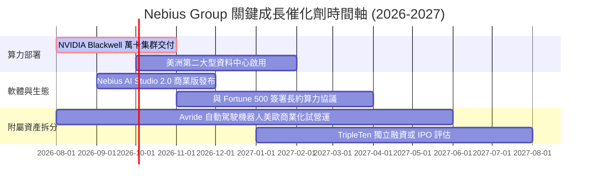

### 9.2 TAM 市場規模分析

```
╔══════════════════════════════════════════════════════════════════╗
║               Nebius 可尋址市場規模 (TAM) 預測                    ║
╠══════════════════════════════════════════════════════════════════╣
║  全球 AI 雲端算力市場 (2028E TAM):  $150.0B                      ║
║  Nebius 目標滲透率 (5%-8%):          $7.5B – $12.0B 營收潛力      ║
║                                                                  ║
║  全球 EdTech 職業培訓 TAM:          $15.0B                       ║
║  TripleTen 潛在貢獻:                $300M – $500M 營收          ║
╚══════════════════════════════════════════════════════════════════╝
```

### 9.3 成長驅動力結構圖

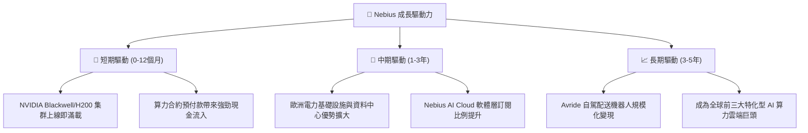

---

## 10. 風險矩陣

### 10.1 風險評分矩陣

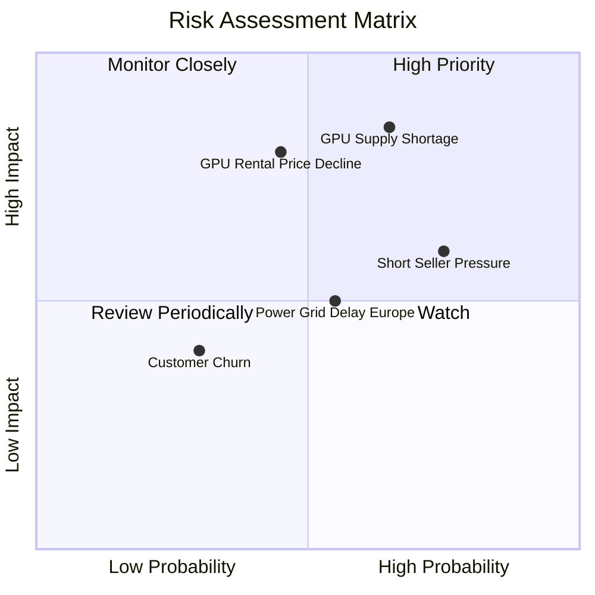

### 10.2 風險清單詳細分析

| # | 風險項目 | 發生機率 | 財務衝擊 | 風險評分 | 緩解措施與監控指標 |
|---|----------|----------|----------|----------|--------------------|
| 1 | 🔴 **GPU 租賃價格下跌** | 中 (45%) | 高 (-25% 營利) | 🔴 **8.2/10** | 轉向長約（1-3 年期）鎖定價格，提高 Nebius AI Studio 軟體層服務比例。 |
| 2 | 🔴 **短線做空壓力與高 Beta** | 高 (75%) | 中 (-15% 股價) | 🔴 **7.8/10** | 保持高現金透明度，28.0% 高賣空比率可能在利多時引發軋空。 |
| 3 | 🟡 **歐洲電力與網格交期延誤** | 中 (55%) | 中 (-10% 產能) | 🟡 **6.5/10** | 跨國多元化布局（芬蘭、法國、美洲資料中心平行推進）。 |
| 4 | 🟡 **GPU 晶片供應鏈受阻** | 中 (40%) | 高 (-20% 營收) | 🟡 **6.0/10** | 與 NVIDIA 保持頂級 Tier-1 夥伴關係，優先獲得配額。 |

---

## 11. 投資建議

### 11.1 最終綜合評級雷達圖

```
╔══════════════════════════════════════════════════════════════╗
║                 Nebius Group 最終綜合評估                    ║
╠══════════════════════════════════════════════════════════════╣
║ 成長展望   9.5/10  ▓▓▓▓▓▓▓▓▓▓▓▓▓▓▓▓▓▓▓░  ★★███ (頂級)    ║
║ 資產負債   8.5/10  ▓▓▓▓▓▓▓▓▓▓▓▓▓▓▓▓░░░░  ★★██☆ (堅實)    ║
║ 護城河     7.0/10  ▓▓▓▓▓▓▓▓▓▓▓▓▓░░░░░░░  ★★██☆ (中高)    ║
║ 當前獲利   5.0/10  ▓▓▓▓▓▓▓▓▓▓░░░░░░░░░░  ★★☆☆☆ (轉型中)  ║
║ 估值安全感 5.0/10  ▓▓▓▓▓▓▓▓▓▓░░░░░░░░░░  ★★☆☆☆ (已充份反映)║
╠══════════════════════════════════════════════════════════════╣
║ 🏆 綜合評分：7.1 / 10  ｜  建議評級：🟡 謹慎買入／持有       ║
╚══════════════════════════════════════════════════════════════╝
```

### 11.2 目標價與隱含報酬率

| 情境 | 目標價 | 相對當前股價 ($193.23) 報酬率 | 機率權重 | 核心觸發條件 |
|------|--------|--------------------------------|----------|--------------|
| 🔴 **悲觀情境** | **$120.00** | **-37.9%** | 20% | GPU 算力價格大幅下挫，Q2'26 營收爆冷下滑 |
| 🟡 **基準情境** | **$215.00** | **+11.3%** | 60% | 營收符合預期，Blackwell 集群順利交貨營運 |
| 🟢 **樂觀情境** | **$310.00** | **+60.4%** | 20% | AI 算力持續供不應求，空頭平倉引發軋空行情 |

### 11.3 買入時機與觸發因素

```
╔══════════════════════════════════════════════════════════════════╗
║                  ✅ 買入觸發因素 Checklist                      ║
╠══════════════════════════════════════════════════════════════════╣
║                                                                  ║
║  立即分批買入條件（目前已滿足 2/3）：                            ║
║  ✅ 季度營收維持 50%+ QoQ 超高成長速度                           ║
║  ✅ 現金及等價物 > $8.0B，無短期流動性焦慮                        ║
║  ☐ 股價回檔至建議買入區間（$130.00 – $160.00）                   ║
║                                                                  ║
║  加碼觸發條件（出現以下任一）：                                  ║
║  ☐ 季度營業利益率（Operating Margin）首次翻正                    ║
║  ☐ 宣布與超大型 Enterprise 簽署 3 年期以上百億級算力合約         ║
║                                                                  ║
║  停損/減碼觸發條件（出現以下任一）：                              ║
║  ☐ 單季毛利率大幅跌破 60.0%                                      ║
║  ☐ 現金消耗速度過快且未認列相應營收（Capex 效益低下）            ║
╚══════════════════════════════════════════════════════════════════╝
```

### 11.4 投資人適配度分析

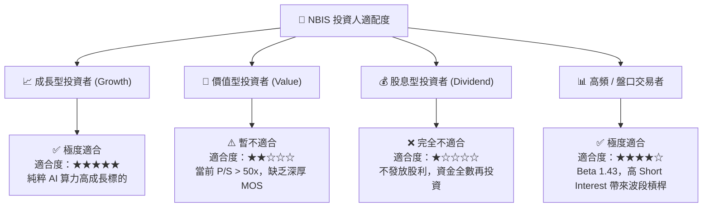

### 11.5 每季財報監控清單（Quarterly Watch List）

| 監控指標 | 門檻值（合格） | 觸發加碼門檻 | 觸發減碼/停損門檻 |
|----------|----------------|--------------|-------------------|
| **單季營收 (Quarterly Rev)** | > $450M (Q2 2026E) | > $550M | < $380M (成長停滯) |
| **毛利率 (Gross Margin)** | ≥ 70.0% | ≥ 75.0% | < 60.0% (價格戰爆發) |
| **營業利益 (Operating Income)**| 虧損收窄至 -$80M 內 | 實現盈虧平衡 (>$0) | 虧損擴大 > -$200M |
| **現金及短期投資** | > $7.0B | > $9.0B | < $4.0B (資金燒盡) |

### 11.6 反面論證：什麼會證明論點錯誤（What Would Change My Mind）

```
╔══════════════════════════════════════════════════════════════════╗
║              ⚠️ 論點失效條件（Disconfirming Evidence）           ║
╠══════════════════════════════════════════════════════════════════╣
║  本投資論點在下列情況成立時應重新檢視或退場：                    ║
║                                                                  ║
║  ☐ 核心 AI 雲端算力營收連續兩季 QoQ 成長率 < 15.0%               ║
║  ☐ GPU 租賃市場出現過剩，導致 Nebius 毛利率大幅收縮 > 15 pp       ║
║  ☐ 每年高達數十億美元的 Capex 無法轉化為自由現金流 (ROIC < WACC) ║
║  ☐ 監管機構對歐洲/美洲資料中心電力使用施加嚴格限制               ║
║  ☐ 出現替代性 ASIC 晶片導致 NVIDIA 架構 GPU 算力需求急劇萎縮     ║
╚══════════════════════════════════════════════════════════════════╝
```

---

> **免責聲明**：本報告由 AI 輔助機構級研究框架自動生成，僅供學術研究與投資參考，不構成任何買賣建議。投資有風險，入市需謹慎。