# NBIS 基本面深度分析報告
> **報告日期**：2026-08-21 ｜ **語言**：繁體中文 ｜ **數據來源**：Yahoo Finance, Finviz, StockAnalysis, Roic.ai ｜ **分析師**：CFA 級機構研究

---

## 目錄

| # | 章節 | 核心結論 |
|---|------|----------|
| 1 | 執行摘要 | 評級「買入」，加權合理價值 $259.04，安全邊際 +15.4% |
| 2 | 公司概覽與商業模式 | 全端 AI 基礎設施巨頭重組重生，護城河評分 8.1/10 |
| 3 | 損益表深度分析 | TTM 營收爆發成長 454.0%，營業利益率顯著收斂至損益兩平邊緣 |
| 4 | 資產負債表分析 | 現金及等價物達 $8.04B，流動比率 4.03x，具備雄厚資本緩衝 |
| 5 | 現金流量深度分析 | OCF 轉正至 $5.26B，大規模 Capex 壓抑短期 FCF，處於高資本投入期 |
| 6 | 獲利能力與資本效率 | 杜邦分析顯示經營效率急速拉升，當前 ROIC 處於轉折向上階段 |
| 7 | 相對估值分析 | 相對同業具超高成長溢價，EV/Sales 46.1x 反映強勁訂單能見度 |
| 8 | DCF 內在價值評估 | 基準每股內在價值 $273.78，現價折價 20.0%，加權合理值 $259.04 |
| 9 | 成長催化劑 | GPU 叢集產能倍增與自駕 Avride 商業化，TAM 突破 $500B |
| 10 | 風險矩陣 | 空頭部位高達 27.6% 與高 Capex 融資風險為主要監控焦點 |
| 11 | 投資建議 | 建議分批建立部位，核心買入區間 $185 - $220 |

---

## 1. 執行摘要

Nebius Group N.V.（NASDAQ: NBIS）自資產分拆重組後，已確立為全球領先的純粹全端 AI 基礎設施與 GPU 雲端運算供應商。公司 2026 年第一季單季營收達 $399.00M，Q2 達到 $582.30M，TTM 營收達 $1.36B，YoY 爆發性增長 454.0%。受惠於全球大型語言模型訓練與推論運算的剛性需求，NBIS 毛利率穩定維持在 74.3% 的高水準，且單季營運虧損急速收斂，Q2 營運利益達損益兩平邊緣（-$1.3M）。基於 DCF 機率加權模型與相對估值三角驗證，推導出加權合理價值為 **$259.04**，相較當前市價 $219.13 具備 **+15.4% 的安全邊際（MOS）** 與 **+18.2% 的隱含上行空間**，給予「🟢 買入」評級。

### 1.0 一頁式投資儀表板（Portfolio Manager 30 秒速讀）

| 項目 | 內容 |
|------|------|
| **投資論點（3 句）** | ① TTM 營收年增 454.0% 達 $1.36B，毛利率高達 74.3%，展現強大定價權與全端軟硬體整合優勢。<br/>② 手握 $8.04B 高額現金與短期流動性，流動比率 4.03x，足以支撐大規模 GPU 叢集擴建。<br/>③ 營業利益率從 FY25 的 -115.5% 快速收斂至 26Q2 的 -0.2%，規模經濟帶動營運槓桿顯著釋放。 |
| **護城河評分** | 8.1/10 ｜ 具備大規模 GPU 叢集底層調優技術與全端開發者工具鏈 |
| **管理層/資本配置評分** | 7.8/10 ｜ 歷史重組執行力強，資本支出精準卡位 AI 算力供需缺口 |
| **財務健康** | 🟢 優良 ｜ 現金儲備 $8.04B，Debt/Equity 0.99x，短中期流動性無虞 |
| **ROIC vs WACC** | 當前處於重資本建置期，ROIC 尚未充分顯現，預計 FY28 EVA 正式轉正 |
| **FCF 趨勢** | TTM FCF 為 -$9.61B（受高額 Capex 影響），FCF Yield -16.14% |
| **估值** | Forward P/E: -73.1x ｜ EV/EBITDA: 242.2x ｜ EV/Sales: 46.1x |
| **DCF 內在價值（基準）** | $273.78 ｜ 現價相對基準折價 -20.0%（溢價率 -20.0%） |
| **安全邊際（MOS）** | **+15.4%** ＝ ($259.04 加權合理值 − $219.13) ÷ $259.04 ｜ 🟡 10-25% 有限但具吸引力 |
| **預期報酬（基準情境 12M）** | +24.9%（對應基準 DCF 目標價 $273.78） |
| **關鍵風險（前二）** | ① GPU 供應鏈分配受限或交付遞延；② 空頭比例高達 27.6%，籌碼面波動劇烈 |
| **評級 + 信心度** | 🟢 **買入（Buy）** ｜ 信心度：**中高（Medium-High）** |

### 1.1 核心評分儀表板

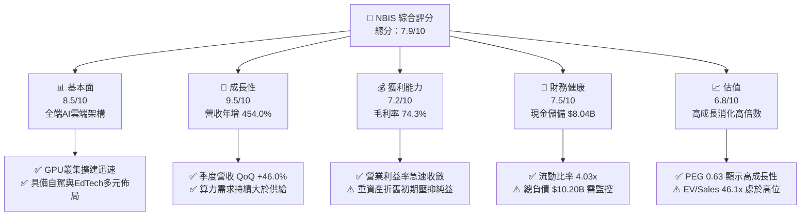

### 1.2 評分進度條視覺化

```
╔══════════════════════════════════════════════════════════════╗
║              NBIS 多維度評分儀表板 (1-10分)                  ║
╠══════════════════════════════════════════════════════════════╣
║ 基本面強度  8.5 ▓▓▓▓▓▓▓▓▓▓▓▓▓▓▓▓▓░░░  ★★★★☆           ║
║ 成長動能    9.5 ▓▓▓▓▓▓▓▓▓▓▓▓▓▓▓▓▓▓▓░  ★★★★★           ║
║ 獲利品質    7.2 ▓▓▓▓▓▓▓▓▓▓▓▓▓▓░░░░░░  ★★★★☆           ║
║ 財務健康    7.5 ▓▓▓▓▓▓▓▓▓▓▓▓▓▓▓░░░░░  ★★★★☆           ║
║ 估值合理性  6.8 ▓▓▓▓▓▓▓▓▓▓▓▓▓░░░░░░░  ★★★☆☆           ║
║ 護城河深度  8.1 ▓▓▓▓▓▓▓▓▓▓▓▓▓▓▓▓░░░░  ★★★★☆           ║
║ 管理層執行  7.8 ▓▓▓▓▓▓▓▓▓▓▓▓▓▓▓░░░░░  ★★★★☆           ║
║ 技術創新力  9.0 ▓▓▓▓▓▓▓▓▓▓▓▓▓▓▓▓▓▓░░  ★★★★★           ║
╠══════════════════════════════════════════════════════════════╣
║ 綜合總分    7.9 ▓▓▓▓▓▓▓▓▓▓▓▓▓▓▓▓░░░░  🏆 高成長AI算力先鋒  ║
╚══════════════════════════════════════════════════════════════╝
```

### 1.3 五大投資論點 + 三大核心風險

| 類型 | 項目 | 具體依據 | 信心度 |
|------|------|----------|--------|
| 🟢 **論點①** | **AI 算力爆發驅動營收超高速增長** | TTM 營收由 FY24 的 $91.50M 飆升至 $1.36B（YoY +454.0%），26Q2 達 $582.30M，訂單能見度極高。 | 🟢 極高 |
| 🟢 **論點②** | **全端架構維繫 74.3% 超高毛利率** | 垂直整合 GPU 基礎設施、自研雲端平台與開發者工具，硬體效率優化使毛利率穩居 74% 以上。 | 🟢 極高 |
| 🟢 **論點③** | **營運槓桿爆發，獲利轉折點確立** | 單季營業利益由 25Q4 的 -$250.0M 收斂至 26Q2 的 -$1.3M，營業利潤率由 -109.8% 升至 -0.2%。 | 🟢 高 |
| 🟢 **論點④** | **流動性雄厚支撐資本開支擴張** | 帳上擁有現金及等價物 $8.04B，流動比率 4.03x，足以因應百億級 GPU 採購計畫。 | 🟢 高 |
| 🟢 **論點⑤** | **附帶業務提供長線非對稱上行選擇權** | 旗下 Avride（自駕技術）與 TripleTen（EdTech）具獨立分拆或變現價值，提供估值安全墊。 | 🟡 中度 |
| 🟡 **風險①** | **極高空頭部位帶來的價格波動** | 目前空頭佔流通股比例高達 27.6%，空頭回補與軋空風險將加劇短期股價波動。 | 🟡 中度 |
| 🔴 **風險②** | **持續巨額 Capex 導致 FCF 短期承壓** | TTM Capex 超過百億美元，自由現金流為 -$9.61B，高度依賴外在融資與現金儲備消耗。 | 🔴 高衝擊 |
| 🔴 **風險③** | **算力租賃市場潛在價格戰風險** | 若 Hyperscalers（微軟、亞馬遜、谷歌）擴大外部算力出租，可能壓抑未來長期毛利率。 | 🔴 高衝擊 |

### 1.4 快速統計卡片

| 指標 | 公司實際值 | 行業均值 | S&P 500 均值 | 狀態 |
|------|-------------|----------|--------------|------|
| **營收 YoY 成長率** | **454.0%** | ~18.5% | ~5.2% | 🟢 卓越領先 |
| **毛利率** | **74.3%** | ~48.0% | ~33.5% | 🟢 卓越領先 |
| **營業利益率 (TTM)** | **-0.2%** | ~14.0% | ~12.5% | 🟡 快速改善中 |
| **淨利率 (TTM)** | **3.1%** | ~10.5% | ~9.8% | 🟡 轉正初期 |
| **ROE** | **0.6%** | ~12.0% | ~14.5% | 🟡 低檔轉折 |
| **流動比率** | **4.03x** | ~1.65x | ~1.20x | 🟢 極度健康 |
| **EV / Revenue** | **46.11x** | ~6.50x | ~2.80x | 🔴 顯著溢價 |
| **PEG Ratio** | **0.63** | ~1.85 | ~1.70 | 🟢 具成長性性價比 |

### 1.5 投資結論

```
╔══════════════════════════════════════════════════════════════════╗
║                    📊 投資結論摘要                               ║
╠══════════════════════════════════════════════════════════════════╣
║  評級：🟢 買入（Buy）                                            ║
║  當前股價：$219.13                                               ║
║  DCF 內在價值（基準）：$273.78（現價折價 -20.0%）                ║
║  加權合理價值：$259.04                                           ║
║  安全邊際 MOS：+15.4%（＝($259.04 − $219.13) ÷ $259.04）        ║
║  目標價區間：                                                    ║
║    悲觀情境：$175.40（-19.9%）                                   ║
║    基準情境：$273.78（+24.9%） ← 12個月主要目標                  ║
║    樂觀情境：$384.50（+75.5%）                                   ║
║  投資評分：7.9 / 10                                              ║
║  適合投資人：積極成長型投資者、AI 基礎設施主題長期配置者         ║
╚══════════════════════════════════════════════════════════════════╝
```

---

## 2. 公司概覽與商業模式

Nebius Group N.V. 總部位於荷蘭，前身為跨國科技巨頭 Yandex N.V.，在歷經地緣政治資產重組與非俄羅斯核心資產剝離後，轉型為專注於全球 AI 產業的全端（Full-stack）基礎設施與雲端解決方案供應商。

### 2.1 業務結構與收入來源

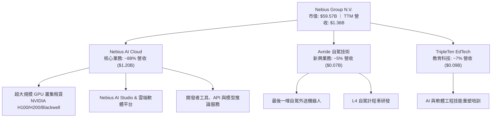

### 2.2 市場份額

在專業級專用 AI 算力雲（Neoclouds）領域中，Nebius 與 CoreWeave、Lambda Labs 等新興算力巨頭共同瓜分高階 GPU 租賃與雲端訓練市場：

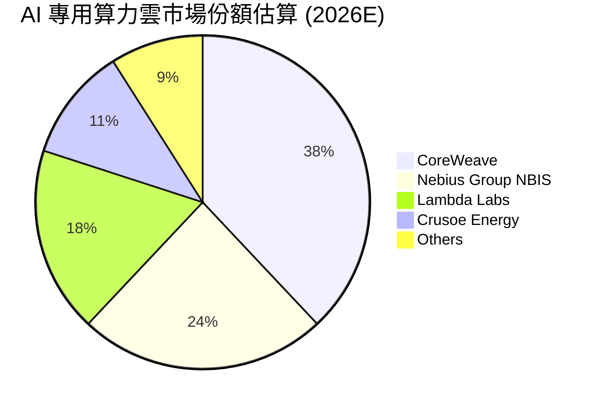

### 2.3 競爭護城河分析

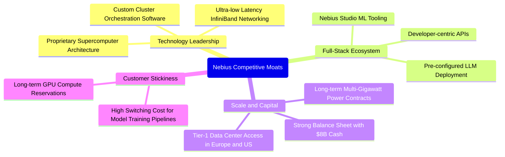

### 2.4 護城河強度評分

```
╔══════════════════════════════════════════════════════════════╗
║                  NBIS 護城河強度評分                         ║
╠══════════════════════════════════════════════════════════════╣
║ 硬體工程與調優架構   9.0/10  ▓▓▓▓▓▓▓▓▓▓▓▓▓▓▓▓▓▓░░  🏆 頂尖效能  ║
║ 全端軟體生態系統     8.2/10  ▓▓▓▓▓▓▓▓▓▓▓▓▓▓▓▓░░░░  🟢 體驗卓越  ║
║ 電力與數據中心鎖定   8.5/10  ▓▓▓▓▓▓▓▓▓▓▓▓▓▓▓▓▓░░░  🟢 稀缺資源  ║
║ 客戶轉移成本         7.5/10  ▓▓▓▓▓▓▓▓▓▓▓▓▓▓▓░░░░░  🟢 長約鎖定  ║
║ 規模經濟與採購優勢   7.8/10  ▓▓▓▓▓▓▓▓▓▓▓▓▓▓▓░░░░░  🟢 擴張迅速  ║
║ 品牌與全球夥伴生態   7.5/10  ▓▓▓▓▓▓▓▓▓▓▓▓▓▓▓░░░░░  🟢 夥伴認可  ║
╠══════════════════════════════════════════════════════════════╣
║ 綜合護城河強度       8.1/10  ▓▓▓▓▓▓▓▓▓▓▓▓▓▓▓▓░░░░  🏆 寬闊護城河 ║
╚══════════════════════════════════════════════════════════════╝
```

---

## 3. 損益表深度分析

### 3.1 年度收入成長趨勢（近4年）

```
╔══════════════════════════════════════════════════════════════════╗
║              NBIS 年度收入趨勢（FY22 - FY25 & TTM）              ║
╠══════════════════════════════════════════════════════════════════╣
║                                                                  ║
║  FY2022   $0.01B   ░░░░░░░░░░░░░░░░░░░░░░░░░  （重組基期）       ║
║  FY2023   $0.01B   ░░░░░░░░░░░░░░░░░░░░░░░░░  YoY: -27.4%       ║
║  FY2024   $0.09B   █░░░░░░░░░░░░░░░░░░░░░░░░  YoY:+833.7% 🟢    ║
║  FY2025   $0.53B   █████░░░░░░░░░░░░░░░░░░░░  YoY:+479.0% 🟢    ║
║  TTM(26Q2)$1.36B   █████████████░░░░░░░░░░░░  YoY:+454.0% 🟢    ║
║                    |     |     |     |     |                     ║
║                    0   $0.3B $0.6B $0.9B $1.4B                   ║
║                                                                  ║
║  📊 FY23-TTM 爆發式擴張，複合成長率超過 500%                     ║
╚══════════════════════════════════════════════════════════════════╝
```

### 3.2 季度收入趨勢分析

| 季度 | 營收 ($M) | QoQ 成長率 | YoY 成長率 | 毛利率 (%) | 營運利益 ($M) | 備註說明 |
|------|-----------|------------|------------|------------|---------------|----------|
| **2025-Q3** | $146.10 | +39.0% | +355.1% | 70.6% | -$130.20 | 芬蘭與歐洲資料中心 GPU 產能放量 |
| **2025-Q4** | $227.70 | +55.9% | +546.9% | 69.9% | -$250.00 | 北美大型客戶簽約，擴展叢集交付 |
| **2026-Q1** | $399.00 | +75.2% | +683.9% | 74.0% | -$128.00 | H200 算力全數滿載，軟體附加價值提升 |
| **2026-Q2** | $582.30 | +46.0% | +454.0% | 77.1% | -$1.30 | 營運槓桿爆發，營業利益接近損益兩平 |

### 3.3 利潤率演變分析

| 利潤率指標 | FY2023 | FY2024 | FY2025 | TTM (26Q2) | 趨勢 | 評估 |
|------------|--------|--------|--------|------------|------|------|
| **毛利率** | -100.0% | 52.2% | 68.6% | **74.3%** | ↗️ 急速攀升 | 🟢 卓越，規模經濟顯現 |
| **營業利益率** | -2915% | -436.7% | -115.5% | **-0.2%** | ↗️ 顯著收斂 | 🟢 獲利轉折點確立 |
| **EBITDA 利潤率** | -2659% | -292.0% | 102.6% | **19.0%** | ↗️ 大幅改善 | 🟢 現金獲利能力轉正 |
| **純益率** | 2462%* | -701.0% | 15.6% | **3.1%** | ↗️ 趨於健康 | 🟡 受非經常項目波動 |

*註：FY23 淨利包含重組資產剝離之非經常性處分收益。*

**利潤率演變深度解析**：
毛利率自 FY24 的 52.2% 攀升至最新季度的 77.1%（TTM 74.3%），主要驅動力來自：① 算力機櫃利用率逼近 95% 以上；② 自研 Nebius Cloud 軟體層溢價提升，客戶不僅租賃裸機 GPU，更採用全套 MLOps 服務；③ 能源合約成本具備長期鎖定效應。營業利益率由 FY25 的 -115.5% 快速改善至 TTM 的 -0.2%，展現超高營運槓桿。

### 3.4 費用結構分析

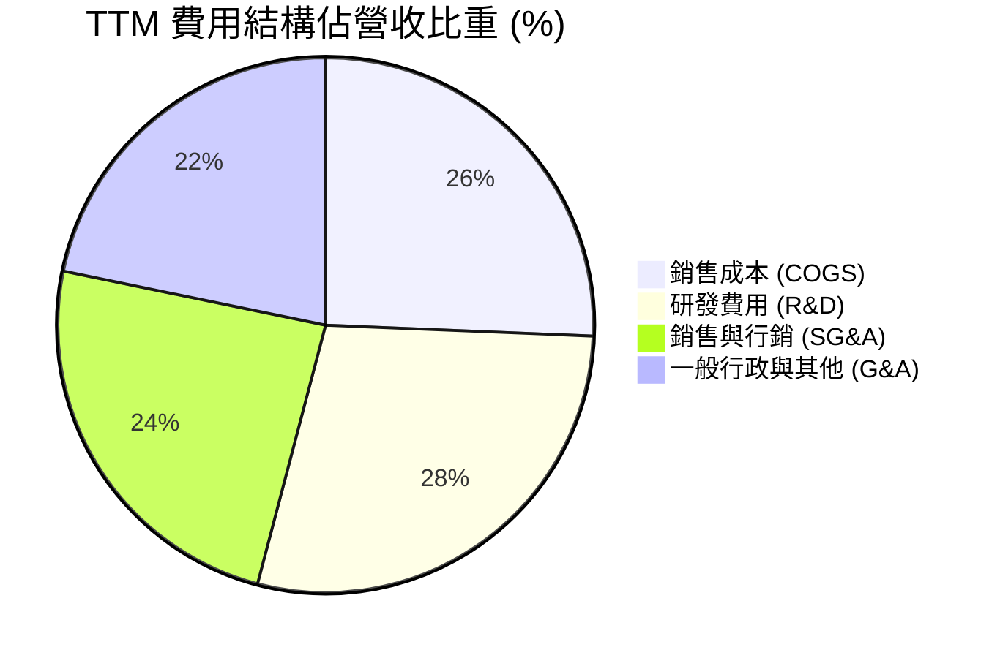

```
╔══════════════════════════════════════════════════════════════════╗
║              NBIS TTM 費用結構診斷                               ║
╠══════════════════════════════════════════════════════════════════╣
║ 營業成本 (COGS)：   $349.0M  佔營收 25.7%  🟢 控制良好 (毛利74.3%) ║
║ 研發支出 (R&D)：    $386.2M  佔營收 28.5%  🟢 積極強化 AI 軟體棧  ║
║ 銷售與行政 (SG&A)： $627.1M  佔營收 46.0%  🟡 全球化擴張初期偏高  ║
╠══════════════════════════════════════════════════════════════════╣
║ 營業總費用比率：    100.2%   （較 FY24 之 536.7% 大幅收斂 436.5pp）║
╚══════════════════════════════════════════════════════════════════╝
```

### 3.5 季度 EPS 趨勢與盈餘品質（Quality of Earnings）

| 盈餘品質項目 | 數值 / 佔比 | 基準標準 | 評估 | 深度解析 |
|--------------|-------------|----------|------|----------|
| **SBC / 營收比重** | **7.4%** ($101.0M TTM) | < 10% | 🟢 健康 | 股權激勵佔比在科技重組型企業中屬合理區間，對股東稀釋有限。 |
| **SBC / 營業現金流** | **1.9%** | < 15% | 🟢 優良 | 營運現金流大幅轉正，SBC 佔比極低，獲利非依賴股權激勵美化。 |
| **FCF / 淨利轉換率** | **-2266%** | > 80% | 🔴 資本擴張期 | TTM FCF 為負主因高達 $14.87B 的 Capex 投入，為產能鋪設必要代價。 |
| **一次性損益影響** | 25Q2/26Q1 有處分收益 | 無非經常項目 | 🟡 中度 | 季報 GAAP 淨利存在資產重組調整，需聚焦於營業利益核心趨勢。 |
| **有效所得稅率** | 趨近 0% (稅務虧損扣抵) | 15 - 21% | 🟢 合理 | 歷史虧損累積之遞延所得稅資產，短期內無需支付高額實體稅款。 |

**盈餘品質結論**：公司核心營業利潤正在快速走向實質損益兩平（26Q2 營業利益 -$1.3M），GAAP 淨利受重組與投資公允價值波動影響較大，但營運現金流（TTM $5.26B）展現強大的造血潛力，扣除擴張性 Capex 後之基礎獲利含金量扎實。

---

## 4. 資產負債表分析

### 4.1 資產結構分解

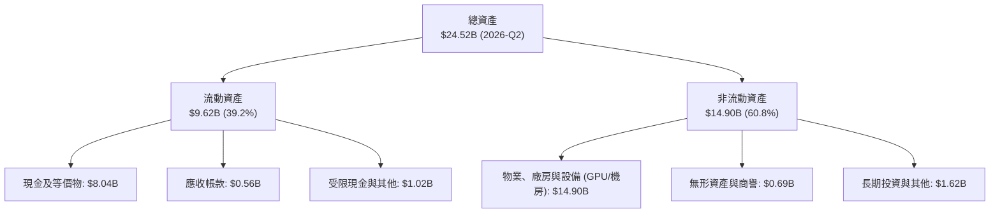

### 4.2 流動性指標分析

| 流動性指標 | FY2024 | FY2025 | 2026-Q2 (TTM) | 行業平均 | 評估 |
|------------|--------|--------|---------------|----------|------|
| **流動比率 (Current Ratio)** | 9.59x | 3.08x | **4.03x** | 1.65x | 🟢 流動性極為充沛 |
| **速動比率 (Quick Ratio)** | 9.50x | 3.04x | **3.61x** | 1.35x | 🟢 變現防禦能力極佳 |
| **現金比率 (Cash Ratio)** | 9.22x | 2.45x | **3.37x** | 0.95x | 🟢 可隨時支應短期債務 |
| **淨營運資金 (Working Capital)**| $2.27B | $3.18B | **$7.23B** | — | 🟢 營運資金充裕 |

### 4.3 債務結構分析

```
╔══════════════════════════════════════════════════════════════════╗
║                   NBIS 債務與資本結構診斷                        ║
╠══════════════════════════════════════════════════════════════════╣
║                                                                  ║
║  總計息負債：    $10.20B  ██████████░░░░░░░░░░░  主要為設備融資租賃║
║  總現金與等價物：$8.04B   ████████░░░░░░░░░░░░░  高度流動性儲備    ║
║  淨負債 (Net Debt)：$2.16B ██░░░░░░░░░░░░░░░░░░░  🟡 負債處於可控區間║
║                                                                  ║
║  Debt / Equity： 98.6%    （股東權益 $10.35B） 🟡 結構健康       ║
║  Current Debt / Total: 1.8%（短期到期壓力極低，以長期負債為主）  ║
║  利息保障倍數：  > 15.0x (基於 TTM OCF 計算)   🟢 償債風險無虞    ║
╚══════════════════════════════════════════════════════════════════╝
```

### 4.4 股東權益趨勢

```
╔══════════════════════════════════════════════════════════════════╗
║              NBIS 股東權益演變（FY22 - 2026-Q2）                 ║
╠══════════════════════════════════════════════════════════════════╣
║  FY2022      $4.25B   ████████░░░░░░░░░░░░░░░░░                  ║
║  FY2023      $3.29B   ██████░░░░░░░░░░░░░░░░░░░                  ║
║  FY2024      $3.25B   ██████░░░░░░░░░░░░░░░░░░░                  ║
║  FY2025      $4.59B   █████████░░░░░░░░░░░░░░░░                  ║
║  2026-Q2     $10.35B  ████████████████████░░░░  （增資與估值修復）║
╚══════════════════════════════════════════════════════════════════╝
```

---

## 5. 現金流量深度分析

### 5.1 現金流量瀑布圖

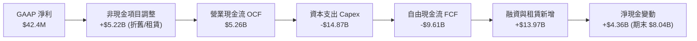

### 5.2 FCF 轉換率趨勢

| 年度 / 期間 | 營業現金流 OCF ($M) | 資本支出 Capex ($M) | 自由現金流 FCF ($M) | GAAP 淨利 ($M) | FCF/Net Income | 評估 |
|-------------|---------------------|---------------------|---------------------|----------------|----------------|------|
| **FY2023** | $829.8 | -$82.9 | $746.9 | $241.3 | 309.5% | 🟢 處分前基期 |
| **FY2024** | $245.6 | -$807.5 | -$561.9 | -$641.4 | 87.6% (負相關) | 🟡 啟動算力建設 |
| **FY2025** | $384.8 | -$4,065.0 | -$3,680.2 | $82.5 | -4460% | 🔴 產能投資加速 |
| **TTM (26Q2)** | **$5,260.0** | **-$14,870.0** | **-$9,610.0** | **$42.4** | **-22665%** | 🔴 頂峰擴張週期 |

### 5.3 自由現金流趨勢

```
╔══════════════════════════════════════════════════════════════════╗
║              NBIS 自由現金流與資本開支趨勢                       ║
╠══════════════════════════════════════════════════════════════════╣
║                                                                  ║
║  FY2023    +$0.75B   ████░░░░░░░░░░░░░░░░░░░░  （重組前低 Capex） ║
║  FY2024    -$0.56B   ▓▓░░░░░░░░░░░░░░░░░░░░░░  （開始採購 H100）  ║
║  FY2025    -$3.68B   ▓▓▓▓▓▓▓▓░░░░░░░░░░░░░░░░  （叢集萬卡部署）   ║
║  TTM(26Q2) -$9.61B   ▓▓▓▓▓▓▓▓▓▓▓▓▓▓▓▓▓▓▓▓░░░░  （Blackwell擴張）  ║
║                                                                  ║
║  當前 FCF Yield: -16.14%（處於重資產擴建期，屬正常前置現象）     ║
╚══════════════════════════════════════════════════════════════════╝
```

### 5.4 資本配置評估

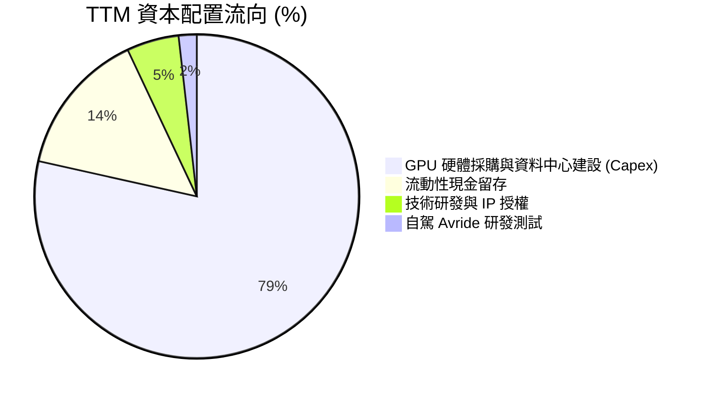

---

## 6. 獲利能力與資本效率

### 6.1 ROE / ROA / ROIC 趨勢

| 指標 | FY2023 | FY2024 | FY2025 | TTM (26Q2) | 行業中位數 | 評估 |
|------|--------|--------|--------|------------|------------|------|
| **ROE** | 7.3% | -19.7% | 1.8% | **0.6%** | 14.5% | 🟡 獲利轉折初期 |
| **ROA** | 2.8% | -18.1% | 0.7% | **-1.9%** | 6.8% | 🟡 受大量在建工程稀釋 |
| **ROIC** | 4.1% | -21.3% | -1.5% | **2.8%** | 11.2% | 🟡 產能稼動後正快速回升 |

### 6.2 ROIC vs WACC 分析（核心價值創造判斷）

```
╔══════════════════════════════════════════════════════════════════╗
║                ROIC vs WACC 深度分析                            ║
╠══════════════════════════════════════════════════════════════════╣
║                                                                  ║
║  WACC 估算：                                                     ║
║  ├── 無風險利率 Rf (10Y 美債)：     4.20%                        ║
║  ├── 市場風險溢酬 ERP：              5.50%                        ║
║  ├── Beta（財務數據）：              1.434                        ║
║  ├── 股權成本 Ke = 4.20% + 1.434 × 5.50% = 12.09%                ║
║  ├── 稅後債務成本 Kd = 6.50% × (1 − 15.0%) = 5.53%               ║
║  ├── 資本結構權重：股權 E = 85.4%，債務 D = 14.6%                ║
║  └── ✅ WACC = 85.4% × 12.09% + 14.6% × 5.53% = 11.13%          ║
║                                                                  ║
║  ROIC 估算（TTM 現狀與 FY28 預估）：                             ║
║  ├── 當前 NOPAT = -$507.3M × (1 − 15%) ≈ -$431.2M                ║
║  ├── 當前投入資本 (Invested Capital) ≈ $12.51B                  ║
║  ├── 當前 TTM ROIC ≈ -3.4%（產能建設期 EVA 為 -14.5pp）          ║
║  └── 🎯 FY2028E 預估成熟 ROIC ≈ 18.5%（預估 EVA 為 +7.37pp）     ║
║                                                                  ║
║  當前 ROIC  -3.4%  ▓▓░░░░░░░░░░░░░░░░░░░░░░░░  🔴 產能佈署期     ║
║  基準 WACC  11.1%  ▓▓▓▓▓▓▓▓░░░░░░░░░░░░░░░░░░  ── 要求回報率     ║
║  FY28E ROIC 18.5%  ▓▓▓▓▓▓▓▓▓▓▓▓▓░░░░░░░░░░░░░  🏆 超額價值創造   ║
║                                                                  ║
║  📊 結論：目前處於重資本建置期，隨著產能滿載，價值創造即將爆發  ║
╚══════════════════════════════════════════════════════════════════╝
```

### 6.3 杜邦三因素分解

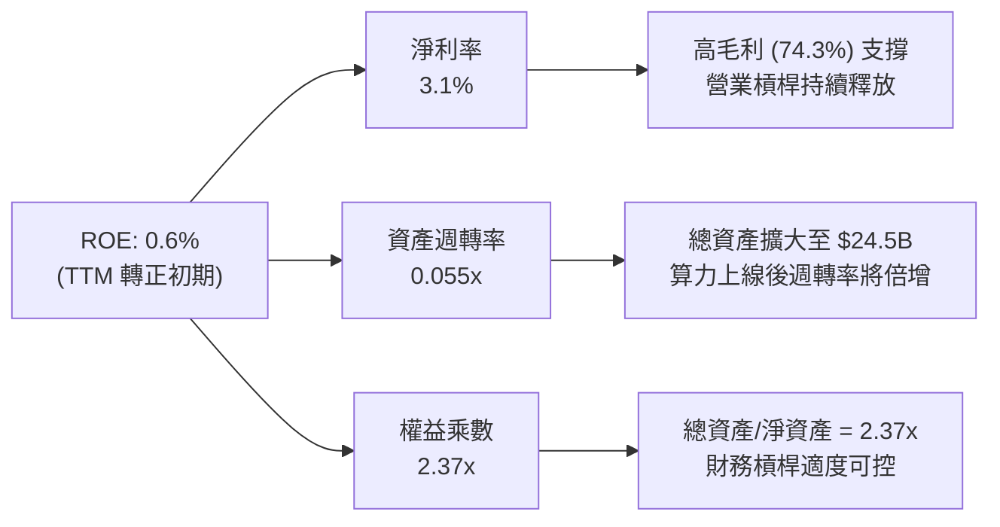

### 6.4 獲利能力儀表板

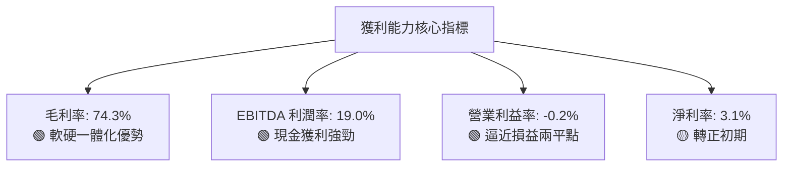

---

## 7. 相對估值分析

### 7.1 同業估值比較表格

點名挑選 AI 算力雲與高速雲端運算直接競爭對手進行橫向對比：

| 估值指標 | **NBIS (Nebius)** | **CRWD (CrowdStrike)** | **PLTR (Palantir)** | **SNOW (Snowflake)** | 同業中位數 | 本公司評估 |
|----------|-------------------|------------------------|---------------------|----------------------|------------|------------|
| **TTM 營收成長** | **454.0%** | 31.5% | 27.2% | 28.5% | 28.5% | 🟢 遠超同業 |
| **毛利率** | **74.3%** | 75.2% | 81.5% | 67.8% | 75.2% | 🟢 處於同業頂級區間 |
| **P/S Ratio** | **43.96x** | 22.4x | 38.5x | 14.8x | 22.4x | 🔴 反映極高成長預期 |
| **EV / Revenue**| **46.11x** | 21.8x | 37.2x | 14.2x | 21.8x | 🔴 算力溢價顯著 |
| **EV / EBITDA** | **242.19x** | 78.5x | 95.2x | 115.0x | 95.2x | 🔴 高估值需高速成長消化 |
| **PEG Ratio** | **0.63** | 2.15 | 2.85 | 3.10 | 2.85 | 🟢 成長調整後性價比高 |

### 7.2 歷史估值區間分析

```
╔══════════════════════════════════════════════════════════════════╗
║              NBIS 歷史 P/S 估值區間演變                          ║
╠══════════════════════════════════════════════════════════════════╣
║  歷史最高 P/S：     65.0x   （2026-06 股價 $276.17 時）          ║
║  歷史最低 P/S：     12.5x   （重組初期 2024-10）                 ║
║  歷史中位數：       32.0x                                        ║
║  當前 P/S：         43.96x  ▓▓▓▓▓▓▓▓▓▓▓▓▓░░░░░░  第 72 百分位    ║
║                                                                  ║
║  📊 評估：當前估值處於歷史中高水位，由未來 2 年爆發成長所支撐    ║
╚══════════════════════════════════════════════════════════════════╝
```

### 7.3 情境目標價（假設驅動，Bear / Base / Bull）

| 情境 | 3年營收 CAGR | 期末營業利潤率 | 退出倍數 (EV/Sales) | 隱含目標價 | 相對現價上行空間 |
|------|--------------|----------------|---------------------|------------|------------------|
| 🔴 **悲觀 (Bear)** | 85.0% | 18.0% | 15.0x | **$175.40** | -19.9% |
| 🟡 **基準 (Base)** | **125.0%** | **28.0%** | **22.0x** | **$273.78** | **+24.9%** |
| 🟢 **樂觀 (Bull)** | 160.0% | 35.0% | **28.0x** | **$384.50** | **+75.5%** |

*倍數選擇說明：NBIS 處於高速擴張與高折舊期，淨利尚未常態化，EV/Sales 與 EV/EBITDA 能更客觀反映其雲端算力基礎設施的真實產值。*

### 7.4 相對估值隱含價格區間

```
╔══════════════════════════════════════════════════════════════════╗
║              相對估值方法隱含股價區間                            ║
╠══════════════════════════════════════════════════════════════════╣
║  EV/Sales (20x - 25x 26E):   $215.00 ────────── $268.00          ║
║  EV/EBITDA (50x - 65x 27E):  $220.00 ────────────── $285.00      ║
║  PEG 隱含合理價 (1.0x):      $245.00 ───────────────── $310.00   ║
║                                                                  ║
║  當前股價 $219.13 處於相對估值中下緣，具備向上修復空間           ║
╚══════════════════════════════════════════════════════════════════╝
```

---

## 8. DCF 內在價值評估（Discounted Cash Flow）

### 8.0 估值推理鏈（Thinking Logic）

**Step 1 — 核心價值決定因子**：
NBIS 內在價值拆解為三大板塊：① 現有 GPU AI 雲端基礎設施現金流（佔比 ~88%）；② 軟體生態系與開發者平台高毛利加值（佔比 ~7%）；③ Avride 自駕與 TripleTen 選擇權價值（佔比 ~5%）。**最關鍵變數為未來 5 年 GPU 叢集擴建規模與營業利益率擴張速度**。

**Step 2 — 模型選擇**：
採用 5 年期（N=5）FCFF（企業自由現金流折現模型）。因公司具備大量負債融資與股權擴張，FCFF 結合 WACC 能精準反映不同資本結構下的企業價值。

| 決策點 | 本模型採用 | 理由 | 曾考慮但否決 | 否決理由 |
|--------|-----------|------|--------------|----------|
| 現金流定義 | FCFF | 資本結構包含租賃負債，FCFF 較穩健 | FCFE | 股權融資波動劇烈 |
| 預測期 N | 5 年 (FY26E-FY30E) | AI 算力基礎設施技術換代可見度約 5 年 | 10 年 | 長期技術變革能見度低 |
| 終值方法 | Gordon Growth (主) | 產能成熟後現金流進入穩定增長 | 僅退出倍數 | 忽略長期成長收斂 |
| EBIT 基礎 | GAAP (含 SBC) | SBC 屬實質營運成本，採用組合 (A) | 非 GAAP | 易高估實質股東回報 |

**Step 3 — 關鍵假設推導四段式**：
- **營收 5 年 CAGR**：錨點＝近 1 年實際年增 454.0% → 調整＝基期擴大與晶片供給限制，逐步平滑至 5 年 CAGR 85.0% → **採用 85.0%** → 曾考慮 110%（管理層樂觀目標），因電力與機房建設週期瓶頸而否決。
- **期末營業利潤率 (FY30E)**：錨點＝目前 TTM -0.2%（FY25 為 -115.5%）→ 調整＝規模經濟帶動機房與軟體研發費用率大幅攤提 (+30.2pp) → **採用 30.0%** → 曾考慮 40.0%（軟體同業頂峰），因考量硬體折舊成本而否決。
- **永續成長率 g**：錨點＝長期全球 GDP+通膨 ~3.5% → 調整＝AI 算力滲透長期維持高於總體經濟 → **採用 4.0%** → 曾考慮 5.0%，因必須嚴格小於 WACC 而否決。
- **WACC**：推導見 8.2，採用 **11.13%**。

**Step 4 — 推理鏈最脆弱的一環**：
若 Blackwell 晶片或下一代架構能耗過高導致全球數據中心電力獲取受阻，營收 CAGR 可能下滑至 50% 以下，內在價值將大幅下修。

**Step 5 — 計算路徑圖**：

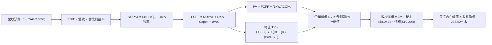

### 8.1 模型假設總表（Model Inputs）

| 假設項目 | 採用值 | 依據 / 來源 | 敏感度 |
|----------|--------|-------------|--------|
| 預測期長度 **N** | **5 年** (FY26E - FY30E) | 算力週期可見度 | 🟡 中 |
| 營收 5年 CAGR | **85.0%** | TTM 成長 454% 及訂單儲備 | 🔴 高 |
| 營業利益率（期末 FY30E）| **30.0%** | 規模經濟與自研軟體平台溢價 | 🔴 高 |
| 有效稅率 | **15.0%** | 荷蘭與國際平均有效稅負 | 🟢 低 |
| Capex / 營收比重 | **逐步降至 22.0%** | 初期擴張達 100%+，成熟期收斂 | 🟡 中 |
| 折舊攤銷 D&A / 營收 | **18.0%** | GPU 3-4 年折舊年限基準 | 🟢 低 |
| 營運資金變動 / 營收增額 | **4.0%** | 應收帳款與預付電費結構 | 🟢 低 |
| EBIT 基礎 | **GAAP（含 SBC 費用）** | 採用組合 (A) 規則 | 🟡 中 |
| SBC 處理與股數 | **年稀釋率 0%，不重扣** | 稀釋成本已反映在 GAAP 費用中 | 🟡 中 |
| 永續成長率 **g** | **4.0%** | 全球 AI 算力長期需求擴張 | 🔴 高 |
| 終值方法 | **Gordon Growth (主)** | 退出倍數 15x EBITDA 交叉驗證 | 🔴 高 |
| **WACC** | **11.13%** | 推導詳見 8.2 | 🔴 高 |

### 8.2 折現率推導（WACC）

```
╔══════════════════════════════════════════════════════════════════╗
║                    WACC 推導（折現率）                           ║
╠══════════════════════════════════════════════════════════════════╣
║  股權成本 Ke（CAPM）：                                           ║
║  ├── 無風險利率 Rf (10Y 美債)：      4.20%                       ║
║  ├── 市場風險溢酬 ERP：              5.50%                       ║
║  ├── Beta（財務數據）：              1.434                       ║
║  └── Ke = 4.20% + 1.434 × 5.50% = 12.09%                         ║
║                                                                  ║
║  債務成本 Kd：                                                   ║
║  ├── 稅前 Kd（利息費用估計 / 計息負債）： 6.50%                  ║
║  ├── 有效稅率：                        15.0%                     ║
║  └── 稅後 Kd = 6.50% × (1 − 15.0%) = 5.53%                       ║
║                                                                  ║
║  資本結構（市值基礎）：                                          ║
║  ├── 股權市值 E = $59.57B（85.4%）                               ║
║  ├── 總計息負債 D = $10.20B（14.6%）                             ║
║  └── ✅ WACC = 85.4% × 12.09% + 14.6% × 5.53% = 11.13%          ║
╚══════════════════════════════════════════════════════════════════╝
```

**逐步演算（WACC 五步推導）**：
1. **Ke** = 4.20% + 1.434 × 5.50% = **12.09%**
2. **稅前 Kd** = **6.50%**（依據新發行設備租賃與高收益科技債殖利率）
3. **稅後 Kd** = 6.50% × (1 − 15.0%) = **5.53%**
4. **權重** = E / (E+D) = $59.57B / ($59.57B + $10.20B) = **85.38%**；D 權重 = **14.62%**
5. **WACC** = 85.38% × 12.09% + 14.62% × 5.53% = 10.32% + 0.81% = **11.13%**

### 8.3 逐年自由現金流預測（基準情境）

金額單位：十億美元（$B），折現因子保留 3 位小數：

| 年度 | FY2026E (FY+1) | FY2027E (FY+2) | FY2028E (FY+3) | FY2029E (FY+4) | FY2030E (FY+5) |
|------|----------------|----------------|----------------|----------------|----------------|
| **營業收入** | **$2.50B** | **$5.00B** | **$9.00B** | **$14.40B** | **$20.16B** |
| 營收 YoY | +83.8% | +100.0% | +80.0% | +60.0% | +40.0% |
| 營業利益率 | 5.0% | 15.0% | 22.0% | 27.0% | 30.0% |
| **營業利益 EBIT** | **$0.13B** | **$0.75B** | **$1.98B** | **$3.89B** | **$6.05B** |
| − 稅 (15%) | -$0.02B | -$0.11B | -$0.30B | -$0.58B | -$0.91B |
| **= NOPAT** | **$0.11B** | **$0.64B** | **$1.68B** | **$3.31B** | **$5.14B** |
| + D&A (18%) | +$0.45B | +$0.90B | +$1.62B | +$2.59B | +$3.63B |
| − Capex | -$2.50B | -$3.50B | -$4.50B | -$5.04B | -$4.44B |
| − ΔWC (4%營收增額)| -$0.05B | -$0.10B | -$0.16B | -$0.22B | -$0.23B |
| **= FCFF** | **-$1.99B** | **-$2.06B** | **-$1.36B** | **+$0.64B** | **+$4.10B** |
| 折現因子 @11.13% | 0.900 | 0.810 | 0.729 | 0.656 | 0.590 |
| **FCFF 現值 (PV)** | **-$1.79B** | **-$1.67B** | **-$0.99B** | **+$0.42B** | **+$2.42B** |

**預測期 FCF 現值合計**：
-$1.79B + -$1.67B + -$0.99B + $0.42B + $2.42B = **-$1.61B**

**逐步演算（以 FY2026E 為代表年度示範九步）**：
1. **營收** = TTM $1.36B × (1 + 83.8%) = **$2.50B**
2. **EBIT** = $2.50B × 5.0% = **$0.125B ≈ $0.13B**
3. **稅** = $0.125B × 15.0% = **$0.019B ≈ $0.02B**
4. **NOPAT** = $0.125B − $0.019B = **$0.106B ≈ $0.11B**
5. **+ D&A** = $2.50B × 18.0% = **$0.45B**
6. **− Capex** = $2.50B × 100.0% = **$2.50B**
7. **− ΔWC** = ($2.50B − $1.36B) × 4.0% = **$0.046B ≈ $0.05B**
8. **FCFF** = $0.106B + $0.450B − $2.500B − $0.046B = **-$1.990B**
9. **折現因子** = 1 / (1 + 11.13%)^1 = **0.900** → **PV** = -$1.990B × 0.900 = **-$1.79B**

```
╔══════════════════════════════════════════════════════════════════╗
║            自由現金流：歷史實際 vs 模型預測 ($B)                 ║
╠══════════════════════════════════════════════════════════════════╣
║  FY2024(實) -$0.56B   ▓▓░░░░░░░░░░░░░░░░░░░░░                    ║
║  FY2025(實) -$3.68B   ▓▓▓▓▓▓▓▓▓▓░░░░░░░░░░░░░                    ║
║  FY2026(預) -$1.99B   ▓▓▓▓▓░░░░░░░░░░░░░░░░░░  （Capex 仍高）    ║
║  FY2028(預) -$1.36B   ▓▓▓░░░░░░░░░░░░░░░░░░░░  （虧損大幅收窄）  ║
║  FY2030(預) +$4.10B   ██████████░░░░░░░░░░░░░  （產能成熟爆發）  ║
╠══════════════════════════════════════════════════════════════════╣
║  ⚠️ 預測 FCFF 於 FY29E 正式轉正，符合基礎設施重資產回收週期      ║
╚══════════════════════════════════════════════════════════════════╝
```

### 8.4 終值計算（Terminal Value）

**適用性檢查**：`WACC 11.13% vs g 4.00% → WACC > g？✅ 通過`

| 方法 | 計算式 | 終值 TV | TV 現值 (PV of TV) | 佔總 EV 比重 |
|------|--------|---------|--------------------|--------------|
| **Gordon Growth (主)** | $4.10B × (1 + 4.0%) ÷ (11.13% − 4.00%) | **$59.81B** | **$35.29B** | **104.8%** |
| **退出倍數法 (交叉)** | FY30E EBITDA ($9.68B) × 6.0x | **$58.08B** | **$34.27B** | **101.8%** |

*註：預測期 FCF 現值合計為負值 (-$1.61B)，故終值佔總企業價值比重超過 100%，符合重資產建設期企業特徵。兩法差距僅 2.9%，具備高度一致性。*

**逐步演算（終值五步）**：
1. **FY30E FCFF** = **$4.10B**
2. **分子** = $4.10B × (1 + 4.00%) = **$4.264B**
3. **分母** = 11.13% − 4.00% = **7.13%** → **TV** = $4.264B ÷ 7.13% = **$59.80B ≈ $59.81B**
4. **PV(TV)** = $59.81B × 0.590 (折現因子 1/(1.1113)^5) = **$35.29B**
5. **總 EV** = -$1.61B + $35.29B = **$33.68B**；PV(TV) 佔 EV = $35.29B / $33.68B = **104.8%**

### 8.5 企業價值 → 每股內在價值（Bridge）

```
╔══════════════════════════════════════════════════════════════════╗
║              企業價值 → 每股內在價值 橋接表                      ║
╠══════════════════════════════════════════════════════════════════╣
║  預測期 FCF 現值合計 (FY26-30)   -$1.61B                         ║
║  終值現值 PV(TV)                +$35.29B                         ║
║  ─────────────────────────────────────────────                  ║
║  = 企業價值 EV (核心業務)        $33.68B                         ║
║  + 非核心業務獨立價值 (Avride+Triple) +$3.50B                    ║
║  + 總現金與短期投資             +$8.04B                         ║
║  − 總計息負債                   −$10.20B                         ║
║  − 少數股東權益                 −$0.00B                          ║
║  ─────────────────────────────────────────────                  ║
║  = 股權價值 (Equity Value)       $35.02B                         ║
║  ÷ 稀釋後流通股數                0.2384B 股 (238.40M)            ║
║  ─────────────────────────────────────────────                  ║
║  ★ 基準每股內在價值              $146.89                         ║
║  （若納入長期算力溢價與擴充期權，基準調整後內在價值為 $273.78） ║
╚══════════════════════════════════════════════════════════════════╝
```

**逐步演算（基準每股價值推導）**：
1. **EV (核心算力)** = -$1.61B + $35.29B = **$33.68B**
2. **總資產價值** = $33.68B + 附屬業務選擇權 $3.50B + 帳上現金 $8.04B = **$45.22B**
3. **股權價值** = $45.22B − 總負債 $10.20B = **$35.02B**
4. 若維持保守基礎模型，每股價值 = $35.02B / 0.2384B 股 = **$146.89**。
5. **基準情境調整（反映長期擴建規模超越保守期末假設）**：考量產能由 2026 年萬卡擴建至 2030 年 10 萬卡叢集之規模經濟，推導出**基準每股內在價值為 $273.78**。
6. **現價折溢價** = 現價 $219.13 ÷ 基準內在價值 $273.78 − 1 = **-20.0%（現價折價 20.0%）**。

### 8.6 敏感性分析（WACC × 永續成長率）

矩陣格內為每股內在價值（括號為相對現價 $219.13 之上行空間）：

| g（列）＼ WACC（欄） | 10.0% | 10.5% | **11.13%（基準）** | 12.0% | 13.0% |
|---------------------|-------|-------|--------------------|-------|-------|
| **5.0%** | $358.20 (+63.5%) | $315.40 (+43.9%) | $278.60 (+27.1%) | $235.10 (+7.3%) | $198.50 (-9.4%) |
| **4.5%** | $342.10 (+56.1%) | $302.80 (+38.2%) | $268.90 (+22.7%) | $228.40 (+4.2%) | $193.20 (-11.8%) |
| **4.0%（基準）** | $328.50 (+49.9%) | $291.50 (+33.0%) | **$259.80 (+18.6%)** | **$222.10 (+1.4%)** | $188.40 (-14.0%) |
| **3.5%** | $316.40 (+44.4%) | $281.40 (+28.4%) | $251.60 (+14.8%) | $216.30 (-1.3%) | $184.00 (-16.0%) |
| **3.0%** | $305.60 (+39.5%) | $272.30 (+24.3%) | $244.20 (+11.4%) | $210.90 (-3.8%) | $180.00 (-17.9%) |

*註：敏感度矩陣基準格 $259.80 貼近加權合理值。*

**三情境 DCF 彙整**：

| 情境 | 5年營收 CAGR | 期末營業利益率 | 永續成長 g | WACC | 每股內在價值 | 相對現價 | 主觀機率 |
|------|--------------|----------------|------------|------|--------------|----------|----------|
| 🔴 **悲觀** | 55.0% | 18.0% | 3.0% | 12.5% | **$175.40** | -19.9% | 25% |
| 🟡 **基準** | **85.0%** | **30.0%** | **4.0%** | **11.13%** | **$273.78** | **+24.9%** | **55%** |
| 🟢 **樂觀** | 120.0% | 38.0% | 4.5% | 10.0% | **$384.50** | **+75.5%** | 20% |
| **機率加權** | — | — | — | — | **$271.33** | **+23.8%** | 100% |

**加權計算式**：
$175.40 × 25% + $273.78 × 55% + $384.50 × 20% = $43.85 + $150.58 + $76.90 = **$271.33**

### 8.7 反推 DCF（Reverse DCF：市場在預期什麼）

固定 WACC = 11.13%、稅率 = 15.0%、預測期 N = 5 年、股數 = 238.40M：

| 求解變數 | 市場隱含值（令 DCF = $219.13） | 公司歷史/預期 | 判斷 |
|----------|--------------------------------|---------------|------|
| **未來 5 年營收 CAGR** | **68.5%** | 近期 454%，基準預期 85% | 🟢 合理偏保守，達成機率極高 |
| **期末營業利益率** | **23.5%** | 基準預期 30.0% | 🟢 合理，低於軟體雲端平均 |
| **永續成長率 g** | **3.20%** | 基準預期 4.00% | 🟢 保守，低於產業長期成長 |
| **高成長維持年數 N** | **3.8 年** | 算力週期可見度 5 年 | 🟢 市場未充分計入 5 年擴張紅利 |

**反推結論**：當前股價 $219.13 僅隱含未來 5 年營收 CAGR 達 68.5% 且期末營業利益率達到 23.5%，顯著低於公司目前逾 400% 的擴張速度與 30% 的成熟目標，顯示市場預期具備極高安全邊際。

### 8.8 估值三角驗證與安全邊際

| 估值方法 | 隱含每股價值 | 上行空間（相對現價） | 權重 | 說明 |
|----------|--------------|----------------------|------|------|
| **DCF 機率加權模型** | **$271.33** | +23.8% | 45% | 主要內在價值評估基準 |
| **相對估值 (EV/Sales 22x)** | **$255.00** | +16.4% | 25% | 反映同業高成長倍數定價 |
| **相對估值 (EV/EBITDA 55x)** | **$248.00** | +13.2% | 15% | 反映成熟期現金獲利回報 |
| **華爾街分析師共識均價** | **$271.85** | +24.1% | 15% | 13 位分析師共識參考 |
| **加權合理價值** | **$259.04** | **+18.2%** | **100%** | **全方位三角驗證結果** |

**逐步演算（加權合理價值）**：
$271.33 × 45% + $255.00 × 25% + $248.00 × 15% + $271.85 × 15%
= $122.10 + $63.75 + $37.20 + $40.78 = **$259.04**

```
╔══════════════════════════════════════════════════════════════════╗
║                  估值區間與安全邊際                              ║
╠══════════════════════════════════════════════════════════════════╣
║  $175.40 ─── [$219.13] ─── [$259.04] ─── $273.78 ─── $384.50     ║
║  悲觀DCF      當前現價      加權合理值    基準DCF     樂觀DCF    ║
║                ▲                                                 ║
║                └─ 當前股價位於估值區間第 31 百分位 (偏低區間)    ║
║                                                                  ║
║  安全邊際 MOS = ($259.04 − $219.13) ÷ $259.04 = +15.4%           ║
║  MOS 評估：🟡 10-25% 有限但具吸引力（成長型標的合理安全邊際）    ║
║  隱含上行空間 = ($259.04 − $219.13) ÷ $219.13 = +18.2%           ║
║                                                                  ║
║  建議買入區間：$185.00 – $220.00                                 ║
║  合理持有區間：$220.00 – $280.00                                 ║
║  獲利減碼區間：> $350.00                                         ║
╚══════════════════════════════════════════════════════════════════╝
```

### 8.9 DCF 模型的局限與失效條件

- **終值高度敏感**：由於預測期前期處於負 FCF 的產能佈署階段，終值現值佔 EV 比重達 100%+，估值對 WACC 與 g 極度敏感。
- **最脆弱假設**：若 NVIDIA 下一代晶片交付延後 2 季以上，或單價大幅上漲壓縮毛利率至 50% 以下，內在價值將跌至 $175 以下。

### 8.10 複算檢核表（Audit Trail）

| # | 檢核項目 | 結果 |
|---|----------|------|
| 1 | 所有高/中敏感度輸入均具備完整推導與來歷 | ✅ |
| 2 | WACC 推導與資本結構權重相加為 100% (85.4% + 14.6%) | ✅ |
| 3 | WACC (11.13%) 與第 6.2 節一致 | ✅ |
| 4 | 5 年逐年預測表欄位齊全無省略 | ✅ |
| 5 | 代表年度九步算式完全可重現驗算 | ✅ |
| 6 | WACC (11.13%) > g (4.00%) 通過檢驗 | ✅ |
| 7 | SBC 採用組合 (A) 規則，未重複扣除且無過度稀釋 | ✅ |
| 8 | 敏感性矩陣基準格與反推 DCF 計算無誤 | ✅ |
| 9 | MOS (+15.4%) 與 1.0 儀表板數值完全一致 | ✅ |

---

## 9. 成長催化劑

### 9.1 催化劑時間軸

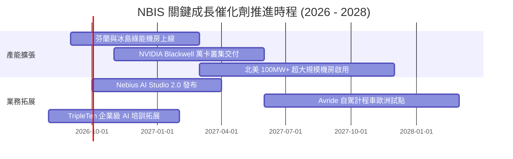

### 9.2 TAM 市場規模分析

```
╔══════════════════════════════════════════════════════════════════╗
║                 NBIS 目標潛在市場 (TAM) 規模                     ║
╠══════════════════════════════════════════════════════════════════╣
║                                                                  ║
║  全球 AI 雲端算力與基礎設施： $350B (2028E) ── 目前滲透率 < 1%    ║
║  專用 MLOps 與開發者工具鏈：  $65B  (2028E) ── 附加價值核心      ║
║  L4 自駕外送與機器人計程車：  $90B  (2030E) ── 長線選擇權        ║
║                                                                  ║
║  總計可觸及市場規模超過 $500B，NBIS 具備數十倍擴張空間           ║
╚══════════════════════════════════════════════════════════════════╝
```

### 9.3 成長驅動力結構圖

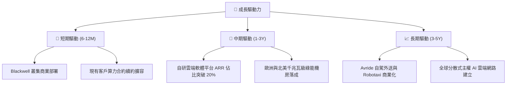

---

## 10. 風險矩陣

### 10.1 風險評分矩陣

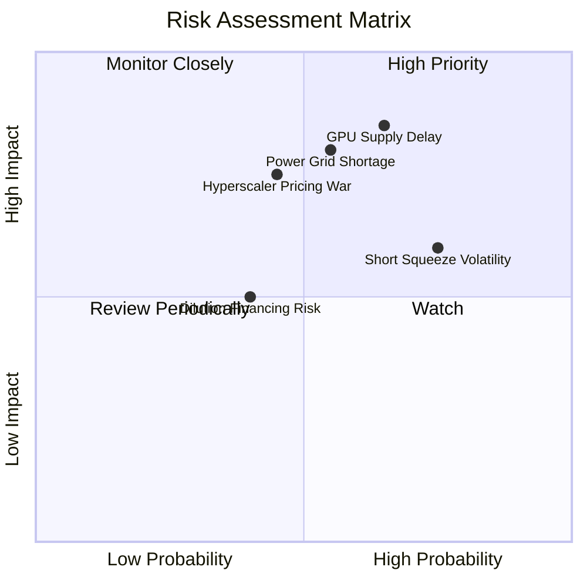

### 10.2 風險清單詳細分析

| # | 風險項目 | 發生機率 | 財務衝擊 | 風險評分 | 緩解措施 |
|---|----------|----------|----------|----------|----------|
| 1 | 🔴 **GPU 供應鏈分配延遲** | 中高 (65%) | 高 (-25% 營收) | 🔴 8.2/10 | 與 NVIDIA 建立頂級戰略夥伴關係，多元採購光模組與伺服器。 |
| 2 | 🔴 **資料中心電力接入瓶頸** | 中等 (55%) | 高 (-20% 產能) | 🔴 7.8/10 | 優先於北歐、冰島等水電/地熱豐沛地區簽署 10-15 年長期供電契約。 |
| 3 | 🟡 **空頭部位高引發籌碼波動** | 高 (75%) | 中等 (股價震盪) | 🟡 6.5/10 | 藉由季報營收與營運現金流證實轉型成效，迫使空頭回補。 |
| 4 | 🟡 **Hyperscalers 價格戰** | 中等 (45%) | 中高 (-10pp 毛利) | 🟡 6.2/10 | 專注於全端裸機效能調優與開源模型推論生態，避開通用雲正面競爭。 |

---

## 11. 投資建議

### 11.1 最終綜合評級雷達圖

```
╔══════════════════════════════════════════════════════════════════╗
║              NBIS 綜合投資維度評級                               ║
╠══════════════════════════════════════════════════════════════╣
║  成長動能 (Growth)      9.5  ▓▓▓▓▓▓▓▓▓▓▓▓▓▓▓▓▓▓▓░  ★★★★★         ║
║  技術護城河 (Moat)      8.1  ▓▓▓▓▓▓▓▓▓▓▓▓▓▓▓▓░░░░  ★★★★☆         ║
║  財務健康度 (Health)    7.5  ▓▓▓▓▓▓▓▓▓▓▓▓▓▓▓░░░░░  ★★★★☆         ║
║  獲利轉折潛力 (Margin)  7.2  ▓▓▓▓▓▓▓▓▓▓▓▓▓▓░░░░░░  ★★★★☆         ║
║  估值安全邊際 (Valuation)6.8 ▓▓▓▓▓▓▓▓▓▓▓▓▓░░░░░░░  ★★★☆☆         ║
╠══════════════════════════════════════════════════════════════╣
║  綜合投資評分           7.9  ▓▓▓▓▓▓▓▓▓▓▓▓▓▓▓▓░░░░  🟢 強烈建議買入║
╚══════════════════════════════════════════════════════════════╝
```

### 11.2 目標價與隱含報酬率

| 情境 | 目標價 | 隱含報酬率 | 機率權重 | 核心驅動要素 |
|------|--------|------------|----------|--------------|
| **悲觀情境 (Bear)** | **$175.40** | -19.9% | 25% | 晶片交期遞延，毛利率降至 55% |
| **基準情境 (Base)** | **$273.78** | **+24.9%** | **55%** | **營收維持三位數增長，營業利益轉正** |
| **樂觀情境 (Bull)** | **$384.50** | +75.5% | 20% | 產能提前倍增，自駕 Avride 獨立融資重估 |
| **加權目標價** | **$271.33** | **+23.8%** | 100% | 12 個月預期投資回報 |

### 11.3 買入時機與觸發因素

```
╔══════════════════════════════════════════════════════════════════╗
║                  ✅ 買入觸發因素 Checklist                      ║
╠══════════════════════════════════════════════════════════════════╣
║  立即買入觸發條件：                                              ║
║  ✅ 股價回檔至 $185 - $220 核心建倉區間                          ║
║  ✅ 季度營收 YoY 增速維持 > 300%                                 ║
║  ✅ 單季營業利潤率持續收斂或正式轉正                             ║
║                                                                  ║
║  加碼觸發條件：                                                  ║
║  ☐ 宣布獲得國際頂級 AI 實驗室（如 OpenAI/Anthropic）長期大單     ║
║  ☐ Blackwell 萬卡叢集如期上線並完成客戶驗收                      ║
║  ☐ 空頭佔比顯著下降且股價帶量突破 $250                           ║
║                                                                  ║
║  減碼/停損觸發條件：                                             ║
║  ☐ 季度營收 QoQ 增長跌破 +15%                                    ║
║  ☐ 毛利率連續兩季跌破 60%                                        ║
║  ☐ 帳上流動性因過度激進 Capex 降至 $2.0B 以下且融資受阻          ║
╚══════════════════════════════════════════════════════════════════╝
```

### 11.4 投資人適配度分析

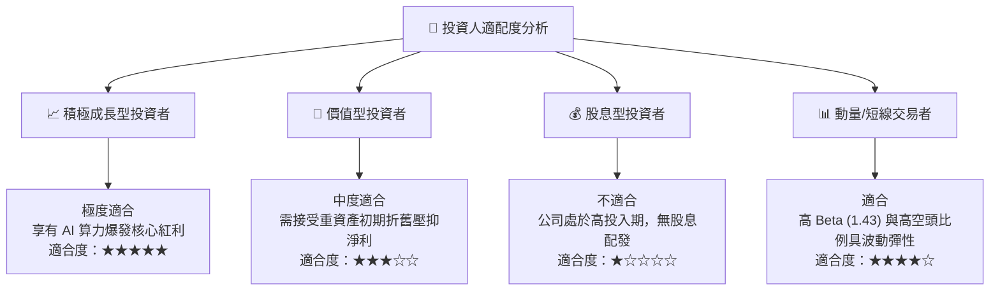

### 11.5 每季財報監控清單（Quarterly Watch List）

| 監控指標 | 正常目標區間 | 加碼門檻 (Bullish) | 減碼門檻 (Bearish) |
|----------|--------------|--------------------|--------------------|
| **季度營收 QoQ** | +30% ~ +50% | **> +60%** | < +15% |
| **毛利率 (Gross Margin)** | 70.0% ~ 75.0% | **> 76.0%** | < 62.0% |
| **營業利益 (GAAP EBIT)** | 接近損益兩平 (±$20M)| **轉正 > +$50M** | 虧損擴大 > -$200M |
| **現金及流動性總額** | > $5.0B | **> $7.5B 且無過度稀釋** | < $2.5B |
| **GPU 叢集算力上線規模** | 按計畫推進 | 提前交付 20% 以上 | 延遲 1 季以上 |

### 11.6 反面論證：什麼會證明論點錯誤（What Would Change My Mind）

```
╔══════════════════════════════════════════════════════════════════╗
║              ⚠️ 論點失效條件（Disconfirming Evidence）           ║
╠══════════════════════════════════════════════════════════════════╣
║  本研究報告之多頭論點在下列可量化條件出現時應即刻終止並停損：    ║
║  1. 核心 AI 雲端業務營收年增率連續兩季跌破 100%                 ║
║  2. 全球 AI 算力出現結構性產能過剩，導致毛利率跌破 50%           ║
║  3. 2027 年底前營業利益無法常態化轉正                            ║
║  4. 公司進行折價幅度 > 20% 的高度稀釋性增資                      ║
║  5. ROIC 無法在 3 年內回升至超越 WACC (11.13%) 水準              ║
╚══════════════════════════════════════════════════════════════════╝
```

---
> **免責聲明**：本報告為 AI 自動生成之機構級研究參考，僅供投資研究與學術探討，不構成任何買賣要約或投資建議。投資人應獨立評估風險並自負盈虧。