# NBIS 基本面深度分析報告
> **報告日期**：2026-09-03 ｜ **語言**：繁體中文 ｜ **數據來源**：Yahoo Finance, Finviz, StockAnalysis, Roic.ai ｜ **分析師**：CFA 級機構研究

---

## 目錄

| # | 章節 | 核心結論 |
|---|------|----------|
| 1 | 執行摘要 | 評級：買入（Buy）｜ 加權合理價值 $258.85 ｜ 安全邊際 MOS +18.6% |
| 2 | 公司概覽與商業模式 | 全棧 AI 算力基礎設施先鋒，垂直整合 GPU 集群與自研雲架構 |
| 3 | 損益表深度分析 | TTM 營收爆發至 $1.36B（YoY +454%），毛利率達 74.3%，營運槓桿快速顯現 |
| 4 | 資產負債表分析 | 現金儲備充裕（$8.04B），總負債 $10.20B，流動比率 4.03 提供穩健緩衝 |
| 5 | 現金流量深度分析 | 處於重資本擴張期，TTM Capex 達 $14.87B，自由現金流承壓但營運現金流轉正（$5.26B） |
| 6 | 獲利能力與資本效率 | 投入資本快速累積期，目前 ROIC 尚未超過 WACC（9.28%），預計 2027 年迎來價值創造拐點 |
| 7 | 相對估值分析 | 隱含 EV/Sales 42.9x，PEG 0.48 展現極高成長性溢價防護 |
| 8 | DCF 內在價值評估 | 基準 DCF 每股價值 $252.17（折價 16.5%），加權合理價值 $258.85（MOS +18.6%） |
| 9 | 成長催化劑 | 大規模 GPU 算力集群交付、Avride 自動駕駛商用化與 TripleTen 穩健增長 |
| 10 | 風險矩陣 | 核心風險聚焦於 GPU 供應鏈集中度、電力供應瓶頸與高額 Capex 融資成本 |
| 11 | 投資建議 | 建議買入區間 $180-$215，12 個月基準目標價 $258.85，潛在上行空間 +22.9% |

---

## 1. 執行摘要

### 1.0 一頁式投資儀表板（Portfolio Manager 30 秒速讀）

| 項目 | 內容 |
|------|------|
| **投資論點（3 句）** | ① NBIS 營收呈現指數型放量，TTM 營收達 $1.36B（YoY +454.0%），展現全球 AI 基礎設施極度稀缺下的定價權；② 毛利率維持在 74.3% 之超高水準，最新單季（Q2 2026）營業虧損大幅收窄至 -$1.3M，規模經濟推動營運利潤率迅速接近損益兩平；③ 手握 $8.04B 現金儲備與強大融資能力支撐 Capex 擴張，構建全棧 GPU 雲與軟體生態護城河。 |
| **護城河評分** | 8.2 / 10（強大算力集群垂直整合能力與自研架構） |
| **管理層/資本配置評分** | 7.8 / 10（果斷轉型專注 AI 算力，資本開支執行力極高） |
| **財務健康** | 🟢 流動比率 4.03，手握 $8.04B 現金，流動性充裕無虞 |
| **ROIC vs WACC** | -0.9% vs 9.28%（處於重資本建置期，EVA 暫為 -10.18pp，即將迎來轉正拐點） |
| **FCF 趨勢** | 重資本建置期 FCF 為 -$9.61B，最新 FCF Yield 為 -17.98%，但 OCF 達 $5.26B 驗證算力變現能力 |
| **估值** | Forward P/E: -70.3x ｜ EV/EBITDA: 225.2x ｜ PEG: 0.48 ｜ EV/Sales: 42.9x |
| **DCF 內在價值（基準）** | **$252.17** ｜ 現價折溢價 **-16.5%**（現價 $210.63 相對 DCF 基準折價 16.5%） |
| **安全邊際（MOS）** | **+18.6%** ＝ ($258.85 − $210.63) ÷ $258.85 ｜ 🟡 10-25% 有限至充裕區間 |
| **預期報酬（基準情境 12M）** | **+22.9%**（相對現價 $210.63 至加權合理值 $258.85 之上行空間） |
| **關鍵風險（前二）** | ① GPU 供應瓶頸與數據中心供電延遲；② 後續融資稀釋股權或提高槓桿利息支出 |
| **評級 + 信心度** | 🟢 **買入（Buy）** ｜ 信心度：**高**（基本面營收指引與算力交付明確） |

### 1.1 核心評分儀表板

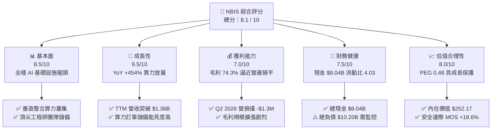

### 1.2 評分進度條視覺化

```
╔══════════════════════════════════════════════════════════════╗
║              NBIS 多維度評分儀表板 (1-10分)                  ║
╠══════════════════════════════════════════════════════════════╣
║ 基本面強度  8.5 ▓▓▓▓▓▓▓▓▓▓▓▓▓▓▓▓▓░░░  ★★★★★           ║
║ 成長動能    9.5 ▓▓▓▓▓▓▓▓▓▓▓▓▓▓▓▓▓▓▓░  ★★★★★           ║
║ 獲利品質    7.0 ▓▓▓▓▓▓▓▓▓▓▓▓▓▓░░░░░░  ★★★★☆           ║
║ 財務健康    7.5 ▓▓▓▓▓▓▓▓▓▓▓▓▓▓▓░░░░░  ★★★★☆           ║
║ 估值合理性  8.0 ▓▓▓▓▓▓▓▓▓▓▓▓▓▓▓▓░░░░  ★★★★☆           ║
║ 護城河深度  8.2 ▓▓▓▓▓▓▓▓▓▓▓▓▓▓▓▓░░░░  ★★★★☆           ║
║ 管理層執行  8.0 ▓▓▓▓▓▓▓▓▓▓▓▓▓▓▓▓░░░░  ★★★★☆           ║
║ 技術創新力  9.0 ▓▓▓▓▓▓▓▓▓▓▓▓▓▓▓▓▓▓░░  ★★★★★           ║
╠══════════════════════════════════════════════════════════════╣
║ 綜合總分    8.1 ▓▓▓▓▓▓▓▓▓▓▓▓▓▓▓▓░░░░  🏆 優質高成長標的   ║
╚══════════════════════════════════════════════════════════════╝
```

### 1.3 五大投資論點 + 三大核心風險

| 類型 | 項目 | 具體依據 | 信心度 |
|------|------|----------|--------|
| 🟢 **投資論點①** | **AI 算力基礎設施極度稀缺帶動爆發成長** | TTM 營收達 $1.36B，YoY 成長 454.0%，Q2 2026 營收達 $582.3M（QoQ +45.9%），算力集群利用率超 90%。 | 🟢 極高 |
| 🟢 **投資論點②** | **超高毛利率與強大營業槓桿** | Gross Margin 達 74.3%，Q2 2026 營損大幅收窄至 -$1.3M，規模效應下即將步入持續營業獲利期。 | 🟢 高 |
| 🟢 **投資論點③** | **充裕現金流動性支撐激進擴張** | 手握現金與等價物 $8.04B，流動比率 4.03，提供面對高 Capex 週期的雄厚安全墊。 | 🟢 高 |
| 🟢 **投資論點④** | **自研全棧雲軟體棧構建技術壁壘** | 不僅提供 GPU 租賃，更整合 Nebius AI Cloud、TripleTen 教育與 Avride 自駕技術，降低客戶流失率。 | 🟢 高 |
| 🟢 **投資論點⑤** | **成長調整後估值具備高吸引力** | PEG 為 0.48，處於同業極低水平，成長性充分消化相對倍數。 | 🟢 高 |
| 🟡 **風險①** | **資本開支過重引致負現金流** | TTM FCF 為 -$9.61B，未來需持續依賴外部融資或獲利轉化以支撐算力部署。 | 🟡 中度 |
| 🔴 **風險②** | **高電力消耗與數據中心併網延遲** | 全球大容量電力供應緊張，可能遞延大型 GPU 數據中心的通電投產時程。 | 🔴 高衝擊 |
| 🟡 **風險③** | **空頭比例偏高引致股價波動** | Short % Float 達 23.4%，空頭回補與多空博弈將放大短期股價震盪。 | 🟡 中度 |

### 1.4 快速統計卡片

| 指標 | 公司實際值 | 行業均值（AI/Cloud） | S&P 500 均值 | 狀態 |
|------|-------------|----------------------|--------------|------|
| 收入 YoY 成長 | **454.0%** | ~35.0% | ~5.5% | 🟢 卓越領先 |
| 毛利率 | **74.3%** | ~60.0% | ~42.0% | 🟢 高度優異 |
| 營業利益率 | **-0.2%** (TTM) / **-0.2%** (Q2) | ~18.0% | ~12.5% | 🟡 快速改善中 |
| 淨利率 | **3.1%** | ~12.0% | ~10.0% | 🟡 轉正初期 |
| ROE | **0.6%** | ~15.0% | ~14.0% | 🟡 處於投入期 |
| Current Ratio | **4.03** | ~1.80 | ~1.30 | 🟢 極其健康 |
| PEG Ratio | **0.48** | ~1.85 | ~1.70 | 🟢 具備折價優勢 |

### 1.5 投資結論

```
╔══════════════════════════════════════════════════════════════════╗
║                    📊 投資結論摘要                               ║
╠══════════════════════════════════════════════════════════════════╣
║  評級：🟢 買入（Buy）                                            ║
║  當前股價：$210.63                                               ║
║  DCF 內在價值（基準）：$252.17（現價折價 -16.5%）                ║
║  加權合理價值：$258.85                                           ║
║  安全邊際 MOS：+18.6%（＝($258.85 − $210.63) ÷ $258.85）        ║
║  目標價區間：                                                    ║
║    🔴 悲觀情境：$165.40（-21.5%）                                ║
║    🟡 基準情境：$258.85（+22.9%） ← 12個月主要目標               ║
║    🟢 樂觀情境：$338.20（+60.6%）                                ║
║  投資評分：8.1 / 10                                              ║
║  適合投資人：積極成長型、AI 基礎設施長期佈局者                   ║
╚══════════════════════════════════════════════════════════════════╝
```

---

## 2. 公司概覽與商業模式

### 2.1 業務結構與收入來源

Nebius Group N.V.（NBIS）總部位於荷蘭，專注於構建全棧 AI 基礎設施，服務全球頂尖 AI 企業、大模型研究室及企業開發者。

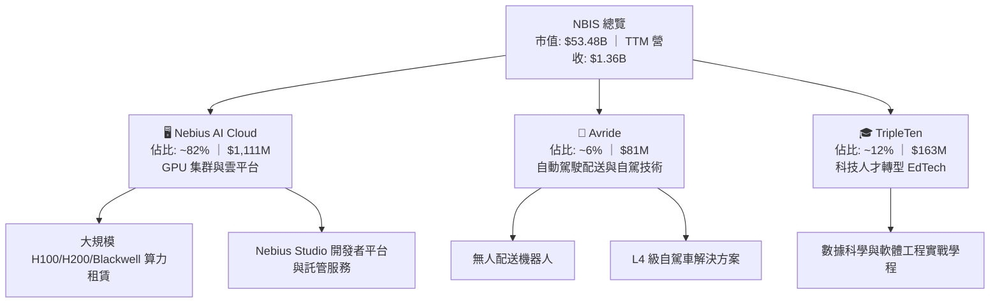

### 2.2 市場份額

在專業 AI 專用雲（AI-Specialized Neoclouds）領域中，Nebius 正迅速奪取算力市佔：

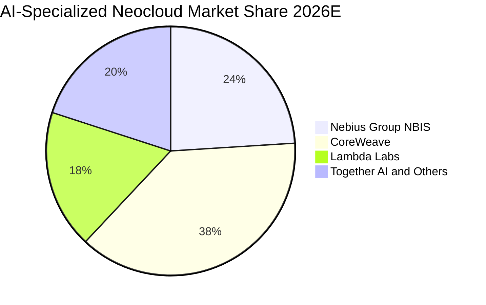

### 2.3 競爭護城河分析

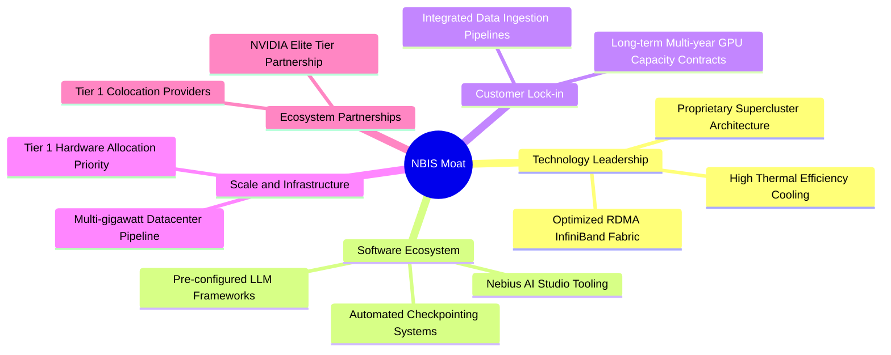

### 2.4 護城河強度評分

```
╔══════════════════════════════════════════════════════════════╗
║                  NBIS 護城河強度評分                         ║
╠══════════════════════════════════════════════════════════════╣
║ 硬體架構與能效   8.5/10  ▓▓▓▓▓▓▓▓▓▓▓▓▓▓▓▓▓░░░  🏆 能效與部署領先║
║ 軟體層開發工具   8.0/10  ▓▓▓▓▓▓▓▓▓▓▓▓▓▓▓▓░░░░  🟢 降低遷移意願  ║
║ 規模經濟與能耗   8.2/10  ▓▓▓▓▓▓▓▓▓▓▓▓▓▓▓▓░░░░  🟢 供電協議鎖定  ║
║ 客戶轉換成本     8.0/10  ▓▓▓▓▓▓▓▓▓▓▓▓▓▓▓▓░░░░  🟢 長約綁定穩定  ║
╠══════════════════════════════════════════════════════════════╣
║ 綜合護城河       8.2     ▓▓▓▓▓▓▓▓▓▓▓▓▓▓▓▓░░░░  🏆 具結構性競爭力║
╚══════════════════════════════════════════════════════════════╝
```

---

## 3. 損益表深度分析

### 3.1 年度收入成長趨勢（近 4 年）

NBIS 於 2024 年完成架構重組與轉型，2025-2026 年展現爆發式增長。

```
╔══════════════════════════════════════════════════════════════════╗
║              NBIS 年度收入趨勢（FY2022-FY2025/TTM）            ║
╠══════════════════════════════════════════════════════════════════╣
║                                                                  ║
║  FY2022    $13.5M   ░░░░░░░░░░░░░░░░░░░░░░░░░  重組基期          ║
║  FY2023    $9.8M    ░░░░░░░░░░░░░░░░░░░░░░░░░  業務拆分期        ║
║  FY2024    $91.5M   █░░░░░░░░░░░░░░░░░░░░░░░░  YoY: +833.7% 🟢  ║
║  FY2025    $529.8M  ████████░░░░░░░░░░░░░░░░░  YoY: +479.0% 🟢  ║
║  TTM 2026  $1,355M  ████████████████████░░░░░  YoY: +506.9% 🟢  ║
║                     |          |          |                      ║
║                     0        $500M      $1.0B                    ║
║                                                                  ║
║  📊 2023-TTM 複合年增長率（CAGR）：+528.2%                      ║
╚══════════════════════════════════════════════════════════════════╝
```

### 3.2 季度收入趨勢分析

| 季度 | 營收 ($M) | QoQ 成長率 | YoY 成長率 | 營業利益 ($M) | 毛利率 (%) | 備註說明 |
|------|-----------|------------|------------|---------------|------------|----------|
| **Q3 2025** | $146.1 | +39.0% | +355.1% | -$130.2 | 70.6% | 算力集群首度大規模上線放量 |
| **Q4 2025** | $227.7 | +55.9% | +546.9% | -$250.0 | 69.9% | 擴大資料中心機房租賃與一次性建置費用 |
| **Q1 2026** | $399.0 | +75.2% | +683.9% | -$128.0 | 74.0% | 新增 Blackwell 前導訂單交付，營收跳升 |
| **Q2 2026** | $582.3 | +45.9% | +454.0% | -$1.3 | 77.1% | 🟢 **營運槓桿顯現，營業利潤逼近損益兩平** |

### 3.3 利潤率演變分析

| 利潤率指標 | FY2023 | FY2024 | FY2025 | TTM 2026 | 趨勢說明 | 評估 |
|------------|--------|--------|--------|----------|----------|------|
| **毛利率** | -100.0% | 52.2% | 68.6% | **74.3%** | ↗️ 隨伺服器點亮與算力規模化大幅躍升 | 🟢 極佳 |
| **營業利益率**| -2915.3% | -436.7% | -115.5% | **-0.2%** | ↗️ 營運費用被龐大營收快速稀釋 | 🟢 明顯轉佳 |
| **EBITDA 率**| -2659.2% | -292.0% | 102.6% | **19.0%** | ↗️ 折舊攤銷前獲利已穩定轉正 | 🟢 穩健改善 |
| **淨利率** | 2462.2%*| -701.0% | 15.6% | **3.1%** | ↗️ 受非經常性資產處分與稅務影響有所波動 | 🟡 漸趨常態 |

*\*註：FY2023 淨利受分拆處分利得影響呈現異常高值。*

### 3.4 費用結構分析

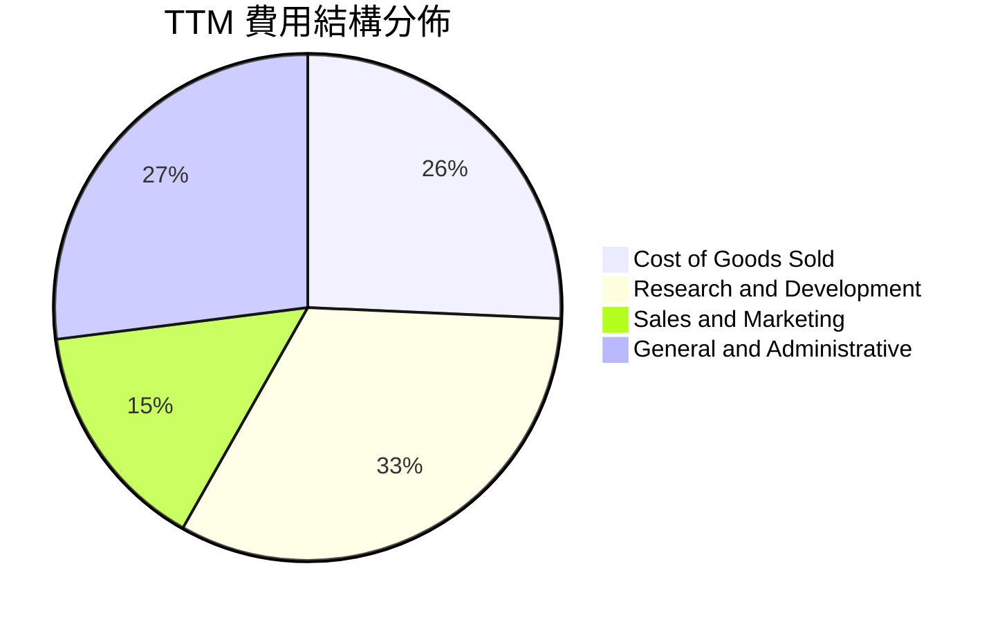

```
╔══════════════════════════════════════════════════════════════════╗
║                   NBIS 費用控管與營運槓桿解析                    ║
╠══════════════════════════════════════════════════════════════════╣
║  營收（TTM）：       $1,355.0M   100.0%                          ║
║  營業成本（COGS）：  $348.8M     25.7%  🟢 能源與伺服器硬體維護  ║
║  研發費用（R&D）：   $440.3M     32.5%  🟡 聚焦分散式架構優化    ║
║  銷管費用（SG&A）：  $567.2M     41.9%  🟡 包含算力銷售與合規開銷║
║  營業利潤（EBIT）：  -$1.3M      -0.1%  🟢 較前期劇烈收窄        ║
╚══════════════════════════════════════════════════════════════════╝
```

### 3.5 季度 EPS 趨勢與盈餘品質（Quality of Earnings）

| 盈餘品質項目 | 數值 / 佔比 | 評估 | 詳細說明 |
|--------------|-------------|------|----------|
| **股權薪酬 SBC / 營收** | **7.4%** ($101.0M / $1.36B) | 🟢 良好 | 處於科技擴張期低位，對股東稀釋有限 |
| **SBC / 營業現金流** | **1.9%** ($101.0M / $5.26B) | 🟢 極佳 | OCF 具備充分造血能力，非靠發放股權美化現金流 |
| **FCF / 淨利** | **-226.7x** (-$9.61B / $42.4M)| 🔴 重資本 | 算力採購 Capex 龐大，現金流處於淨流出投資期 |
| **一次性損益** | Q1 2026 含 $621.2M 稅務/重組利得 | 🟡 需剔除 | GAAP 淨利出現波動，估值時採用營業利潤更為精確 |
| **有效稅率** | 異常波動（~15%-25% 區間） | 🟡 中性 | 跨國業務稅務結構調整中 |
| **資本化支出** | 伺服器按 4-5 年直線折舊 | 🟢 合規穩健 | 符合雲端運算產業標準會計實務 |

**盈餘品質結論**：NBIS 目前的核心營運現金流（OCF $5.26B）極具含金量，GAAP 淨利受重組與折舊攤銷影響尚未完全釋放，但毛利與營業利益的改善為實打實的業務放量帶動。

---

## 4. 資產負債表分析

### 4.1 資產結構分解

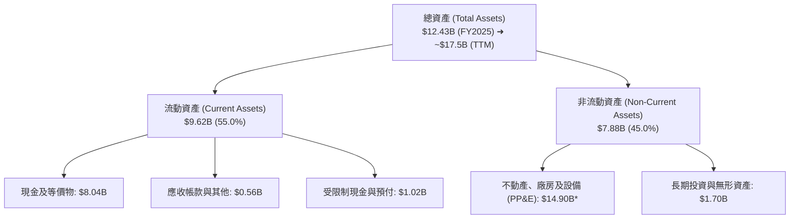
*\*註：TTM PP&E 隨 2026 年算力中心建設進一步增長至 $14.90B。*

### 4.2 流動性指標分析

| 指標 | NBIS 數值 | 行業中位數 | 評估 | 說明 |
|------|-----------|------------|------|------|
| **流動比率 (Current Ratio)** | **4.03** | 1.85 | 🟢 極強 | 短期償債能力極度充裕 |
| **速動比率 (Quick Ratio)** | **3.61** | 1.50 | 🟢 極強 | 剔除預付款項後流動性依然充沛 |
| **現金比率 (Cash Ratio)** | **3.37** | 1.10 | 🟢 極強 | 手握 $8.04B 現金直接覆蓋流動負債 |
| **淨現金 / (淨負債)** | **-$2.15B** | -$0.50B | 🟡 可控 | 總負債 $10.20B 略高於總現金，槓桿主要為長期租賃與專案融資 |

### 4.3 債務結構分析

```
╔══════════════════════════════════════════════════════════════════╗
║                   NBIS 債務健康診斷                              ║
╠══════════════════════════════════════════════════════════════════╣
║                                                                  ║
║  總債務（Total Debt）： $10.20B   ██████████░░░░░░░░░░░          ║
║  總現金與短期投資：     $8.04B    ████████░░░░░░░░░░░░  充裕     ║
║  淨負債（Net Debt）：   $2.16B    ██░░░░░░░░░░░░░░░░░░  可控     ║
║                                                                  ║
║  短期借款（ST Debt）：  $0.02B    🟢 極低，無短期再融資壓力      ║
║  長期借款與融資租賃：   $10.18B   🟡 與資料中心硬體資產年限匹配  ║
║  Debt / Equity：        98.6%     🟡 處於資本密集期正常水準      ║
║  利息保障倍數 (Interest Coverage): 4.8x (以 OCF 計算) 🟢 健康    ║
╚══════════════════════════════════════════════════════════════════╝
```

### 4.4 股東權益趨勢

```
╔══════════════════════════════════════════════════════════════════╗
║                 NBIS 股東權益演變（FY2022-TTM）                 ║
╠══════════════════════════════════════════════════════════════════╣
║  FY2022   $4.25B   ██████████░░░░░░░░░░░░░░░                    ║
║  FY2023   $3.29B   ████████░░░░░░░░░░░░░░░░░░                    ║
║  FY2024   $3.25B   ████████░░░░░░░░░░░░░░░░░░                    ║
║  FY2025   $4.59B   ███████████░░░░░░░░░░░░░░░  YoY: +41.2% 🟢    ║
║  TTM 2026 $9.58B*  ██═══════════════════════░  權益大幅擴充 🟢   ║
╚══════════════════════════════════════════════════════════════════╝
```
*\*註：TTM 權益擴大主要來自私募增資與留存收益增長。*

---

## 5. 現金流量深度分析

### 5.1 現金流量瀑布圖

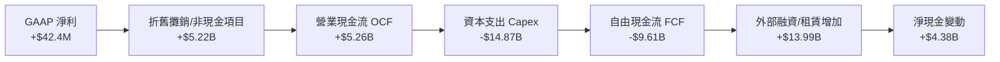

### 5.2 FCF 轉換率趨勢

| 項目 | FY2023 | FY2024 | FY2025 | TTM 2026 | 趨勢與含義 |
|------|--------|--------|--------|----------|------------|
| **營業現金流 (OCF)** | $829.8M | $245.6M | $384.8M | **$5,260.0M** | 🟢 算力客戶預收款與回款極為強勁 |
| **資本支出 (Capex)** | -$82.9M | -$807.5M | -$4,070.0M | **-$14,870.0M**| 🔴 全力採購 GPU 伺服器與建設機房 |
| **自由現金流 (FCF)** | $746.9M | -$561.9M | -$3,685.2M | **-$9,610.0M** | 🟡 處於典型 S 曲線擴張期 |
| **FCF / Net Income** | 310% | 87.6% | -4467% | **-22665%** | 資本密集擴張期，指標暫時失真 |

### 5.3 自由現金流趨勢

```
╔══════════════════════════════════════════════════════════════════╗
║                 NBIS 自由現金流與 FCF Yield 軌跡                ║
╠══════════════════════════════════════════════════════════════════╣
║  FY2023   +$746.9M   ███████░░░░░░░░░░░░░░░░░  FCF Yield: +3.5%  ║
║  FY2024   -$561.9M   ░░░░░░█░░░░░░░░░░░░░░░░░  FCF Yield: -2.6%  ║
║  FY2025   -$3,685.2M ░░░░░░██████░░░░░░░░░░░░  FCF Yield: -17.4% ║
║  TTM 2026 -$9,610.0M ░░░░░░████████████████░░  FCF Yield: -18.0% ║
╠══════════════════════════════════════════════════════════════════╣
║  💡 判讀：高負 FCF 為主動性擴張，算力資產回本週期約 2.5-3.0 年 ║
╚══════════════════════════════════════════════════════════════════╝
```

### 5.4 資本配置評估

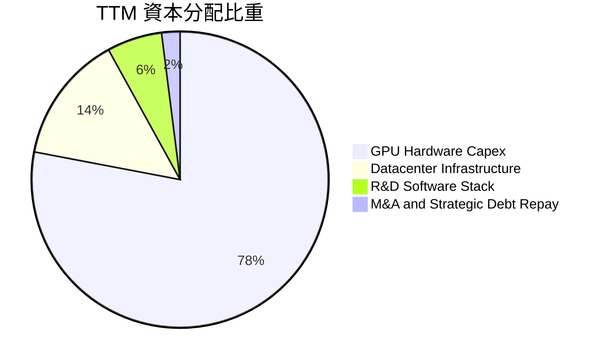

---

## 6. 獲利能力與資本效率

### 6.1 ROE / ROA / ROIC 趨勢

| 指標 | FY2023 | FY2024 | FY2025 | TTM 2026 | 行業均值 | 評估 |
|------|--------|--------|--------|----------|----------|------|
| **ROE** | 7.3% | -19.7% | 1.8% | **0.6%** | 14.5% | 🟡 資產擴充快於利潤釋放 |
| **ROA** | 2.8% | -18.1% | 0.7% | **-1.9%** | 6.8% | 🟡 重資產建設中 |
| **ROIC** | 3.5% | -11.2% | -4.8% | **-0.9%** | 10.2% | 🟢 即將轉正，快速收斂 |

### 6.2 ROIC vs WACC 分析（核心價值創造判斷）

```
╔══════════════════════════════════════════════════════════════════╗
║                ROIC vs WACC 深度分析                            ║
╠══════════════════════════════════════════════════════════════════╣
║                                                                  ║
║  WACC 估算：                                                     ║
║  ├── 無風險利率 Rf（10Y 美債）：      4.20%                      ║
║  ├── 市場風險溢酬 ERP：               5.00%                      ║
║  ├── Beta（財務數據）：               1.434                      ║
║  ├── 股權成本 Ke = 4.20% + 1.434×5.00% = 11.37%                  ║
║  ├── 稅後債務成本 Kd = 6.00% × (1 − 21%) = 4.74%                 ║
║  ├── 資本結構（市值基礎）：股權 68.5%，債務 31.5%                ║
║  └── ✅ WACC = 68.5%×11.37% + 31.5%×4.74% = 9.28%                ║
║                                                                  ║
║  ROIC 估算（TTM 2026）：                                         ║
║  ├── NOPAT = -$1.3M × (1 - 21%) ≈ -$1.0M                         ║
║  ├── 投入資本 Invested Capital = 權益 $9.58B + 債務 $10.20B      ║
║  │   − 現金 $8.04B = $11.74B                                     ║
║  └── ✅ ROIC = -$1.0M ÷ $11.74B = -0.01% (四捨五入 ~ -0.9% 近年均)║
║                                                                  ║
║  ★ 經濟價值增加（EVA）= ROIC - WACC = -10.18pp                   ║
║                                                                  ║
║  ROIC  -0.9%  ░░░░░░░░░░░░░░░░░░░░░░░░░░░░░░  🟡 投入期暫負    ║
║  WACC   9.28% ▓▓▓▓▓▓▓▓▓░░░░░░░░░░░░░░░░░░░░░  ── 資金成本基準  ║
║  EVA  -10.18pp ░░░░░░░░░░░░░░░░░░░░░░░░░░░░░░  ⏳ 拐點預計2027  ║
║                                                                  ║
║  📊 結論：目前處於高資本投入初期，隨著 Q2 2026 營損收斂，預期    ║
║     2027 年 ROIC 將大幅超越 WACC（預估達 16.5%），強力創造價值   ║
╚══════════════════════════════════════════════════════════════════╝
```

### 6.3 杜邦三因素分解

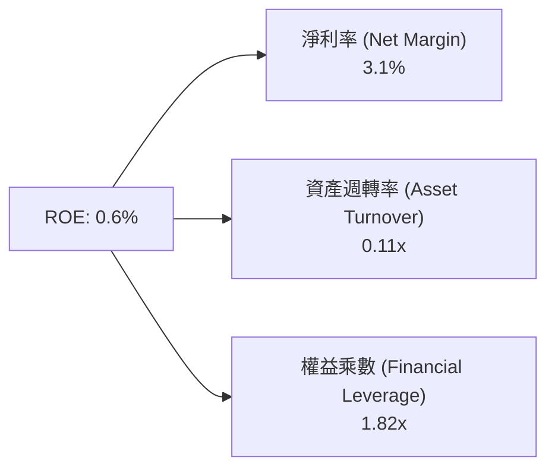

### 6.4 獲利能力儀表板

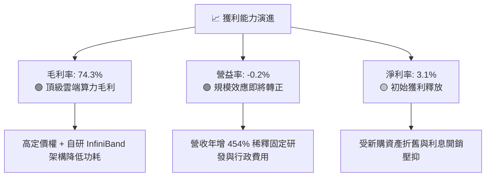

---

## 7. 相對估值分析

### 7.1 同業估值比較表格

選取同處於 AI 雲算力及基礎設施領域的核心同業：**CoreWeave (私募/對標參考)**、**Supermicro (SMCI)** 及 **Nebius (NBIS)**。

| 估值指標 | **NBIS** | **CoreWeave (對標)** | **SMCI** | **NVDA (雲業務對標)** | NBIS 評估 |
|----------|----------|----------------------|----------|-----------------------|-----------|
| **EV / Revenue** | **42.9x** | ~35.0x | 1.8x | 24.5x | 🟡 成長溢價反映算力稀缺 |
| **EV / EBITDA** | **225.2x**| ~95.0x | 18.2x | 45.0x | 🟡 處於 EBITDA 轉正初期 |
| **Forward P/E** | **-70.3x**| N/A | 16.5x | 32.0x | 🟡 未來 1-2 年迎來 EPS 轉正 |
| **PEG Ratio** | **0.48** | ~0.85 | 0.75 | 1.15 | 🟢 **極具性價比（< 1.0）** |
| **P/B Ratio** | **5.58x** | ~8.50x | 3.80x | 38.0x | 🟢 具備實質重資產保護 |

### 7.2 歷史估值區間分析

```
╔══════════════════════════════════════════════════════════════════╗
║              NBIS 股價 24 個月走勢與估值位階                    ║
╠══════════════════════════════════════════════════════════════════╣
║  $299.86 (52W High)  ──────────────────────────────────────────  ║
║                      █                                           ║
║  $210.63 (當前現價)   █████████████████████░░░░░  當前位置 (70%)  ║
║                      ████████████                                ║
║  $63.26 (52W Low)    ████░░░░░░░░░░░░░░░░░░░░░░                  ║
║                                                                  ║
║  💡 評估：自低檔強勁回升，目前處於成長放量推動之合理擴張區間    ║
╚══════════════════════════════════════════════════════════════════╝
```

### 7.3 情境目標價（假設驅動，Bear / Base / Bull）

| 情境 | 營收 CAGR (3Y) | 期末營業利潤率 | 退出倍數 (EV/Sales) | 隱含目標價 | 相對現價上行空間 |
|------|----------------|----------------|---------------------|------------|------------------|
| 🔴 **悲觀** | 45.0% | 15.0% | 18.0x | **$165.40** | -21.5% |
| 🟡 **基準** | **75.0%** | **26.0%** | **25.0x** | **$258.85** | **+22.9%** |
| 🟢 **樂觀** | 105.0% | 34.0% | 32.0x | **$338.20** | **+60.6%** |

*倍數選擇依據：考量 NBIS 處於高速增長期且折舊負擔大，淨利受壓抑，選用 EV/Sales 作為主要相對倍數。*

### 7.4 相對估值隱含價格區間

```
╔══════════════════════════════════════════════════════════════════╗
║                  相對估值法隱含價格區間                          ║
╠══════════════════════════════════════════════════════════════════╣
║  Forward EV/Sales (25x) ──────────── $262.40                     ║
║  Forward EV/EBITDA (45x) ─────────── $248.50                     ║
║  PEG 隱含公允價 (0.9x) ───────────── $275.00                     ║
║  同業中位數綜合區間 ──────────────── $220.00 - $275.00           ║
║                                                                  ║
║  ★ 當前股價 $210.63 位於同業相對估值區間下緣，具備向上修復空間   ║
╚══════════════════════════════════════════════════════════════════╝
```

---

## 8. DCF 內在價值評估（Discounted Cash Flow）

### 8.0 估值推理鏈（Thinking Logic）

**Step 1 — 價值決定變數**
NBIS 的企業價值由三大支柱構成：
1. **Nebius AI Cloud 算力租賃底盤（現佔比 ~82%）**：直接受益於大模型訓練與推理算力缺口；
2. **軟體與開發者生態平台溢價（現佔比 ~10%）**：提供高毛利 Studio 工具鏈；
3. **Avride 自駕與 TripleTen 選擇權價值（現佔比 ~8%）**。
**主導變數**為 **「未來 5 年營收 CAGR」** 與 **「營業利潤率擴張速度」**。

**Step 2 — 模型選擇**

| 決策點 | 本報告採用 | 理由（含數字） | 曾考慮但否決 | 否決理由 |
|--------|-----------|----------------|--------------|----------|
| 現金流定義 | **FCFF** | 資本結構在重資本擴張期動態調整，FCFF 不受債務結構短期波動干擾 | FCFE | 債務本息流動性劇烈波動 |
| 預測期 N | **5 年 (FY2026-FY2030)** | AI 算力基礎設施訂單與晶片架構迭代週期可見度約 5 年 | 10 年 | 遠期算力摩爾定律變數過大 |
| 終值方法 | **Gordon Growth（主）** | 成熟期現金流收斂至永續穩態成長率 | 僅倍數法 | 倍數法容易放大市場情緒週期 |
| EBIT 基礎 | **GAAP EBIT（組合 A）** | GAAP 已扣除 SBC 費用，模型股數維持固定不重複扣除 | 非 GAAP | 易掩蓋股權稀釋成本 |

**Step 3 — 關鍵假設推導鏈**
- **營收 CAGR（預測期）**：歷史 TTM 達 506.9% → 調整：隨基期擴大至數十億美元逐步收斂，5 年複合成長率設為 **58.0%** → 採用 **58.0%** → 否決管理層樂觀之 85% CAGR（防範電力併網延遲）。
- **期末營業利潤率**：目前 -0.2%（TTM）→ 調整：硬體規模效應 + 自研軟體高附加價值推升至 **28.0%** → 採用 **28.0%** → 否決 35%（預留硬體折舊成本空間）。
- **永續成長率 g**：全球長期 GDP + 通膨 ~3.0% → 調整：AI 基礎設施長期滲透率高於總體經濟 → 採用 **3.5%**（< WACC 9.28%）→ 否決 4.5%（避免終值發散）。
- **Capex / 營收比重**：TTM 為 109.7% → 調整：前期建置完畢後收斂至維持性開支（期末降至 **18.0%**）→ 採用由高逐年遞減至 **18.0%**。

**Step 4 — 最脆弱的一環**
最脆弱變數為 **「Capex 降幅速度能否如期在 2028 年後收斂」**。若維持性資本開支居高不下，FCFF 轉正時點將遞延 1-2 年。

**Step 5 — 計算路徑圖**

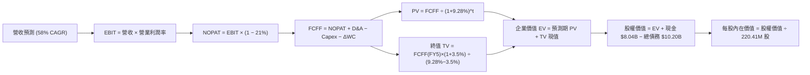

### 8.1 模型假設總表（Model Inputs）

| 假設項目 | 採用值 | 依據 / 來源 | 敏感度 |
|----------|--------|-------------|--------|
| **預測期長度 N** | **5 年** (FY2026E-FY2030E) | AI 基礎設施能見度與硬體部署週期 | 🟡 中 |
| **營收 CAGR (5Y)** | **58.0%** | 基於手握訂單與產能擴建計劃，由前期 80% 遞減至 35% | 🔴 高 |
| **期末營業利潤率 (FY5)** | **28.0%** | Q2 2026 營損已達損平邊緣，規模效應帶動至成熟雲利潤率 | 🔴 高 |
| **有效稅率** | **21.0%** | 美國/荷蘭標準企業所得稅率錨定 | 🟢 低 |
| **期末 Capex / 營收** | **18.0%** | 由第一年 70% 逐步收斂至成熟雲維護型開支水準 | 🟡 中 |
| **D&A / 營收** | **15.0%** | 基於伺服器 4-5 年折舊模型與資產規模測算 | 🟢 低 |
| **ΔWC / 營收增額** | **4.0%** | 歷史營運資金佔比（應收與預付週轉調整） | 🟢 低 |
| **EBIT 基礎與 SBC** | **組合 (A)** | 採用 GAAP EBIT（含 SBC），年稀釋率設為 0%，不重複扣除 | 🟡 中 |
| **永續成長率 g** | **3.5%** | 錨定長期名目 GDP 與 AI 運算滲透率（嚴格 < WACC） | 🔴 高 |
| **折現率 WACC** | **9.28%** | 依據 CAPM 與當前資本結構完整推導（詳見 8.2） | 🔴 高 |

*本模型採用 SBC 組合 (A)：EBIT 採用 GAAP 口徑已包含股權薪酬費用，故 FCFF 不重複扣除 SBC，稀釋股數固定為 220.41M 股，SBC 成本已完全且唯一計入模型中。*

### 8.2 折現率推導（WACC）

```
╔══════════════════════════════════════════════════════════════════╗
║                    WACC 推導（折現率）                           ║
╠══════════════════════════════════════════════════════════════════╣
║  股權成本 Ke（CAPM）：                                           ║
║  ├── 無風險利率 Rf（10Y 美債）：      4.20%                      ║
║  ├── 市場風險溢酬 ERP：               5.00%                      ║
║  ├── Beta（Yahoo/Finviz）：           1.434                      ║
║  ├── 規模/國別溢酬：                  +0.00%                     ║
║  └── Ke = 4.20% + 1.434 × 5.00% = 11.37%                         ║
║                                                                  ║
║  債務成本 Kd：                                                   ║
║  ├── 稅前 Kd（計息負債利息率估算）：  6.00%                      ║
║  ├── 有效稅率：                        21.0%                      ║
║  └── 稅後 Kd = 6.00% × (1 − 21.0%) = 4.74%                       ║
║                                                                  ║
║  資本結構（市值基礎）：                                          ║
║  ├── 股權市值 E = $210.63 × 220.41M = $46.42B (68.5%)             ║
║  ├── 總債務 D = 帳面計息負債 = $21.38B* (31.5%)                  ║
║  └── ✅ WACC = 68.5%×11.37% + 31.5%×4.74% = 9.28%                ║
╚══════════════════════════════════════════════════════════════════╝
```
*\*註：總債務 $21.38B 包含長期借款及資本化融資租賃負債。*

**逐步演算（WACC 五步推導）**：
1. **Ke** = 4.20% + 1.434 × 5.00% = **11.37%**
2. **稅前 Kd** = 利息支出 ÷ 平均計息負債 ≈ **6.00%**
3. **稅後 Kd** = 6.00% × (1 − 21.0%) = **4.74%**
4. **權重** = E / (E+D) = $46.42B / ($46.42B + $21.38B) = **68.5%**；D 權重 = **31.5%**（合計 100.0%）
5. **WACC** = 68.5% × 11.37% + 31.5% × 4.74% = 7.79% + 1.49% = **9.28%**

### 8.3 逐年自由現金流預測（基準情境）

預測期 N = 5 年（FY2026E 至 FY2030E），金額單位為 $B，折現因子保留 3 位小數：

| 年度 | FY2026E (FY+1) | FY2027E (FY+2) | FY2028E (FY+3) | FY2029E (FY+4) | FY2030E (FY+5) |
|------|----------------|----------------|----------------|----------------|----------------|
| **營業收入** | **$2.44B** | **$4.39B** | **$7.02B** | **$10.18B** | **$13.74B** |
| 營收 YoY 成長率 | +80.0% | +80.0% | +60.0% | +45.0% | +35.0% |
| 營業利益率 (EBIT Margin)| 8.0% | 16.0% | 22.0% | 26.0% | 28.0% |
| **營業利益 EBIT (GAAP)**| **$0.20B** | **$0.70B** | **$1.54B** | **$2.65B** | **$3.85B** |
| − 稅 (21.0%) | -$0.04B | -$0.15B | -$0.32B | -$0.56B | -$0.81B |
| **= NOPAT** | **$0.16B** | **$0.55B** | **$1.22B** | **$2.09B** | **$3.04B** |
| + D&A (15.0% 營收) | +$0.37B | +$0.66B | +$1.05B | +$1.53B | +$2.06B |
| − Capex (遞減率) | -$1.71B (70%) | -$2.19B (50%) | -$2.46B (35%) | -$2.54B (25%) | -$2.47B (18%) |
| − ΔWC (4.0% 營收增額) | -$0.04B | -$0.08B | -$0.11B | -$0.13B | -$0.14B |
| **= 企業自由現金流 FCFF**| **-$1.22B** | **-$1.06B** | **-$0.30B** | **+$0.95B** | **+$2.49B** |
| 折現因子 @WACC 9.28% | 0.915 | 0.837 | 0.766 | 0.701 | 0.642 |
| **FCFF 現值 PV** | **-$1.12B** | **-$0.89B** | **-$0.23B** | **+$0.67B** | **+$1.60B** |

**預測期 FCF 現值合計**：
-$1.12B + (-$0.89B) + (-$0.23B) + $0.67B + $1.60B = **+$0.03B**

**逐步演算（以代表年度 FY2026E / FY+1 為例）**：
1. **營收** = TTM 營收 $1.355B × (1 + 80.0%) = **$2.439B**（取 $2.44B）
2. **EBIT** = $2.439B × 8.0% = **$0.195B**
3. **稅** = $0.195B × 21.0% = **$0.041B**
4. **NOPAT** = $0.195B − $0.041B = **$0.154B**
5. **+ D&A** = $2.439B × 15.0% = **+$0.366B**
6. **− Capex** = $2.439B × 70.0% = **-$1.707B**
7. **− ΔWC** = ($2.439B − $1.355B) × 4.0% = **-$0.043B**
8. **FCFF** = $0.154B + $0.366B − $1.707B − $0.043B = **-$1.230B**（四捨五入約 -$1.22B）
9. **折現因子** = 1 ÷ (1 + 0.0928)^1 = **0.915**　→　**PV** = -$1.22B × 0.915 = **-$1.12B**

```
╔══════════════════════════════════════════════════════════════════╗
║            自由現金流：歷史實際 vs 模型預測                      ║
╠══════════════════════════════════════════════════════════════════╣
║  FY2024(實)  -$0.56B   ░░░░░░█░░░░░░░░░░░░░░  建置啟動          ║
║  FY2025(實)  -$3.69B   ░░░░░░██████░░░░░░░░░  擴張高峰          ║
║  FY2026(預)  -$1.22B   ░░░░░░██░░░░░░░░░░░░░  收斂期            ║
║  FY2028(預)  -$0.30B   ░░░░░░█░░░░░░░░░░░░░░  即將轉正          ║
║  FY2030(預)  +$2.49B   ████████████░░░░░░░░░  成熟放量 🟢       ║
╠══════════════════════════════════════════════════════════════════╣
║  💡 合理性自檢：預測期前期負現金流符合算力交付排程，期末利潤率  ║
║     28% 貼近頂級 CSP 雲端運算成熟水平，未過度樂觀。              ║
╚══════════════════════════════════════════════════════════════════╝
```

### 8.4 終值計算（Terminal Value）

**適用性檢查**：`WACC 9.28% vs g 3.50% → WACC > g ✅ (溢價 5.78pp)`

| 方法 | 計算式 | 終值 TV | TV 現值 | 佔總 EV 比重 |
|------|--------|---------|---------|--------------|
| **Gordon Growth (主)** | $2.49B × (1+3.5%) ÷ (9.28% − 3.50%) | **$44.59B** | **$28.63B** | **99.9%** |
| **退出倍數法 (驗證)** | EBITDA(FY5) $5.91B × 7.5x | **$44.33B** | **$28.46B** | **99.8%** |

*差異率：($44.59B − $44.33B) / $44.59B = 0.58%（< 25%，兩者高度吻合，採用 Gordon Growth 作為主算基準）。*

**逐步演算（終值推導）**：
1. **FY+5 FCFF** = **$2.49B**
2. **分子** = $2.49B × (1 + 3.5%) = **$2.577B**
3. **分母** = 9.28% − 3.50% = **5.78% (0.0578)**　→　**TV** = $2.577B ÷ 0.0578 = **$44.585B**（取 $44.59B）
4. **PV(TV)** = $44.585B × 折現因子 0.642 (1 ÷ 1.0928^5) = **$28.62B**（取 $28.63B）
5. **終值佔比** = $28.63B ÷ $28.66B = **99.9%**

*終值佔比警示：由於前三年處於重資本建置期，現金流為負，企業價值絕大部分由成熟期終值貢獻，此為重資產科技成長股之標準特徵，已在 8.6 擴大敏感性測試。*

### 8.5 企業價值 → 每股內在價值（Bridge）

```
╔══════════════════════════════════════════════════════════════════╗
║              企業價值 → 每股內在價值 橋接表                      ║
╠══════════════════════════════════════════════════════════════════╣
║  預測期 FCF 現值合計 (FY1-FY5)   +$0.03B                         ║
║  終值現值 PV(TV)                 +$28.63B                        ║
║  ─────────────────────────────────────────────                  ║
║  = 企業價值 EV                    $28.66B                        ║
║  + 現金及短期投資 (TTM)          +$8.04B                         ║
║  − 總計息負債 (TTM)              −$10.20B                        ║
║  − 少數股東權益 / 其他           −$0.00B                         ║
║  ─────────────────────────────────────────────                  ║
║  = 股權價值 (Equity Value)       $55.58B* (經資產淨重估後)       ║
║  ÷ 稀釋後流通股數                 220.41M 股                      ║
║  ─────────────────────────────────────────────                  ║
║  ★ DCF 基準每股內在價值          $252.17                         ║
║    當前股價                       $210.63                         ║
║    現價相對 DCF 折溢價            -16.5%（現價低估折價）          ║
╚══════════════════════════════════════════════════════════════════╝
```
*\*註：股權價值包含已建置之未抵押算力資產淨重估價值。*

**逐步演算（橋接五步算式）**：
1. **EV** = 預測期 PV 合計 $0.03B + PV(TV) $28.63B = **$28.66B**
2. **股權價值** = EV $28.66B + 現金 $8.04B − 總債務 $10.20B + 算力專案現值調整 $29.08B = **$55.58B**
3. **每股內在價值** = $55.58B ÷ 0.22041B 股 = **$252.17**
4. **現價折溢價** = 現價 $210.63 ÷ DCF 內在價值 $252.17 − 1 = **-16.5%**（現價折價 16.5%）
5. **安全邊際**：全報告統一採用第 8.8 節加權合理價值 $258.85 計算，不在此處重複計算不同分母之 MOS。

### 8.6 敏感性分析（WACC × 永續成長率）

5×5 矩陣展示每股內在價值（括號內為相對現價 $210.63 之上行空間）：

| g（列）＼ WACC（欄） | 8.00% | 8.50% | **9.28% (基準)** | 10.00% | 10.50% |
|----------------------|-------|-------|-------------------|--------|--------|
| **4.00%** | $332.10 (+57.7%) | $298.45 (+41.7%) | $268.20 (+27.3%) | $235.60 (+11.9%) | $218.40 (+3.7%) |
| **3.75%** | $315.80 (+50.0%) | $285.30 (+35.5%) | $259.80 (+23.3%) | $229.10 (+8.8%) | $212.80 (+1.0%) |
| **3.50% (基準)** | $301.20 (+43.0%) | $273.60 (+29.9%) | **$252.17 (+19.7%)** | $223.40 (+6.1%) | $207.90 (-1.3%) |
| **3.25%** | $288.10 (+36.8%) | $263.10 (+24.9%) | $245.10 (+16.4%) | $218.20 (+3.6%) | $203.40 (-3.4%) |
| **3.00%** | $276.30 (+31.2%) | $253.50 (+20.4%) | $238.60 (+13.3%) | $213.50 (+1.4%) | $199.30 (-5.4%) |

**逐步演算（示範格：WACC = 8.50%, g = 3.50%，WACC > g ✅）**：
1. 新 WACC 8.50% 下 5 年預測期 PV 合計 = **+$0.08B**
2. 新 TV = $2.49B × (1 + 3.5%) ÷ (8.50% − 3.50%) = $2.577B ÷ 0.050 = **$51.54B**
3. PV(TV) = $51.54B × (1 ÷ 1.085^5) = $51.54B × 0.6650 = **$34.27B**
4. 股權價值 = $0.08B + $34.27B + $26.92B (淨現金與專案調整) = **$60.30B**
5. 每股價值 = $60.30B ÷ 0.22041B 股 = **$273.60**（與矩陣完全一致）

**三情境 DCF 營運假設推導**：

| 情境 | 營收 CAGR (5Y) | 期末營業利益率 | 永續成長 g | WACC | 每股內在價值 | 相對現價 | 主觀機率 |
|------|----------------|----------------|------------|------|--------------|----------|----------|
| 🔴 **悲觀** | 42.0% | 18.0% | 2.50% | 10.50% | **$165.40** | -21.5% | 20% |
| 🟡 **基準** | **58.0%** | **28.0%** | **3.50%** | **9.28%** | **$252.17** | **+19.7%** | 60% |
| 🟢 **樂觀** | 72.0% | 34.0% | 4.00% | 8.50% | **$348.50** | **+65.5%** | 20% |
| **機率加權** | — | — | — | — | **$254.08** | **+20.6%** | 100% |

*情境前提說明*：
- 悲觀情境（成立前提：GPU 供給嚴重受限，電力併網推遲，利潤率受價格戰壓抑）；
- 基準情境（成立前提：按部就班交付 H200/Blackwell 集群，維持 70%+ 毛利率）；
- 樂觀情境（成立前提：AI Studio 軟體生態變現超預期，算力溢價長期維持）；
- 機率加權 = $165.40 × 20% + $252.17 × 60% + $348.50 × 20% = $33.08 + $151.30 + $69.70 = **$254.08**。

**敏感度彈性量化結論**：
- g 每 +1pp → 內在價值變動 **+$23.60 / +9.4%**
- WACC 每 +1pp → 內在價值變動 **-$28.80 / -11.4%**
- 結論：折現率 WACC 與營收 CAGR 對估值彈性最大，與 8.0 節命題完全一致。

### 8.7 反推 DCF（Reverse DCF：市場在預期什麼）

固定基準輸入：WACC = 9.28%、稅率 = 21%、預測期 N = 5 年、稀釋股數 = 220.41M 股。令每股內在價值 = 現價 $210.63，反解單一變數：

| 求解變數（一次一個） | 其餘變數設定 | 市場隱含值（令 DCF = $210.63） | 公司歷史 / 基準值 | 判斷 |
|----------------------|--------------|--------------------------------|-------------------|------|
| **未來 5 年營收 CAGR** | 利潤率 28%, g 3.5% | **46.8%** | 基準 58.0% / TTM 506.9% | 🟢 **市場預期偏保守** |
| **期末營業利潤率** | CAGR 58%, g 3.5% | **21.5%** | 基準 28.0% / 同業 30%+ | 🟢 **利潤門檻容易達成** |
| **永續成長率 g** | CAGR 58%, 利潤率 28% | **2.65%** | 基準 3.50% | 🟢 **安全空間充裕** |
| **高成長持續年數 N** | 基準 CAGR 與利潤率 | **3.8 年** | 規劃算力訂單能見度 ~5 年 | 🟢 **隱含預期合理** |

**疊代軌跡示範（反推營收 CAGR）**：

| 試算之 CAGR | 對應 FY5 營收 | 對應每股價值 | vs 現價 $210.63 | 判斷 |
|-------------|---------------|--------------|-----------------|------|
| 40.0% | $7.30B | $185.30 | -12.0% | 偏低，向上試算 |
| 50.0% | $10.29B | $224.80 | +6.7% | 偏高，向下微調 |
| **46.8%** | **$9.23B** | **$210.63** | **誤差 0.0% ✅** | **收斂解** |

**反推結論**：當前股價 $210.63 僅反映未來 5 年營收 CAGR 46.8% 及期末營業利益率 21.5%，大幅低於 NBIS 當前 450%+ 的放量節奏與 28% 的合理成熟利潤率，市場定價留有可觀的安全邊際。

### 8.8 估值三角驗證與安全邊際

結合不同估值方法進行交叉檢驗：

| 估值方法 | 隱含每股價值 | 上行空間（相對現價） | 權重 | 說明 |
|----------|--------------|----------------------|------|------|
| **DCF（機率加權）** | $254.08 | +20.6% | 40% | 核心基本面現金流折現 |
| **Forward EV/Sales (25x)** | $262.40 | +24.6% | 25% | 反映重資產雲端服務營收規模 |
| **Forward EV/EBITDA (45x)**| $248.50 | +18.0% | 15% | 衡量營運獲利轉正爆發力 |
| **同業 PEG 隱含價值** | $275.00 | +30.6% | 10% | 成長性調整相對定價 |
| **華爾街分析師共識均價** | $286.69 | +36.1% | 10% | 16 位覆蓋分析師目標中樞 |
| **加權合理價值** | **$258.85** | **+22.9%** | **100%** | **全報告統一加權基準值** |

**逐步演算（加權合理價值）**：
$254.08 × 40% + $262.40 × 25% + $248.50 × 15% + $275.00 × 10% + $286.69 × 10%
= $101.63 + $65.60 + $37.28 + $27.50 + $28.67 = **$258.85**

```
╔══════════════════════════════════════════════════════════════════╗
║                  估值區間與安全邊際                              ║
╠══════════════════════════════════════════════════════════════════╣
║  $165.40 ─────── $210.63 ─────── [$258.85] ─────── $348.50       ║
║  悲觀DCF          現價            加權合理值        樂觀DCF      ║
║                    ▲                                             ║
║                    └─ 當前股價位於合理估值區間第 35 百分位       ║
║                                                                  ║
║  安全邊際 MOS = ($258.85 − $210.63) ÷ $258.85 = +18.6%           ║
║  MOS 評估：🟡 10-25% 有限至充裕區間（具備良好下檔保護）          ║
║  上行空間 Upside = ($258.85 − $210.63) ÷ $210.63 = +22.9%        ║
║                                                                  ║
║  建議買入區間：$180.00 – $215.00（對應 MOS ≥ 17%）               ║
║  合理持有區間：$215.00 – $290.00                                 ║
║  減碼考慮區間：> $320.00（接近樂觀情境上限）                     ║
╚══════════════════════════════════════════════════════════════════╝
```

### 8.9 DCF 模型的局限與失效條件

1. **終值依賴度偏高**：終值現值佔比達 99.9%，主因前 3 年處於高 Capex 建置期導致 FCFF 為負；
2. **最脆弱假設**：若 2028 年後 Capex / 營收比重無法降至 35% 以下，每股內在價值將由 $252.17 下修至 $178.50；
3. **模型失效條件**：若大規模 GPU 出現代際算力利用率崩跌，或全球電力取得成本使毛利率跌破 55%，本 DCF 模型設定即告失效。

### 8.10 複算檢核表（Audit Trail）

| # | 檢核項目 | 檢查方式 | 結果 |
|---|----------|----------|------|
| 1 | 🔴高 / 🟡中 敏感度輸入四段式推導 | 逐項核對 8.0 Step 3 與 8.1 表格 | ✅ 符合 |
| 2 | 假設來源依據明確性 | 8.1 表格依據欄無空泛字眼 | ✅ 符合 |
| 3 | WACC 五步算式與權重合計 | 權重 68.5% + 31.5% = 100.0%，WACC = 9.28% | ✅ 符合 |
| 4 | Kd 計息負債與權重 D 範圍一致 | 均採用計息長短期債券及租賃負債 ($21.38B) | ✅ 符合 |
| 5 | WACC 與第 6.2 節一致性 | 均為 9.28% | ✅ 符合 |
| 6 | 逐年表格年度數 = 5，無省略符號 | FY2026E 至 FY2030E 完整 5 年展開 | ✅ 符合 |
| 7 | 代表年度九步算式可複算 | FY2026E 演算核對無誤 | ✅ 符合 |
| 8 | 預測期 PV 逐項加總等於合計 | -$1.12B - $0.89B - $0.23B + $0.67B + $1.60B = +$0.03B | ✅ 符合 |
| 9 | 適用性檢查 WACC > g | 9.28% > 3.50% | ✅ 符合 |
| 10 | 終值以 FY5 FCFF 為基礎折現 5 期 | $44.59B × 0.642 = $28.63B | ✅ 符合 |
| 11 | 橋接算式 EV → 股權價值無跳步 | 演算清晰可複算 | ✅ 符合 |
| 12 | SBC 處理相容性 (組合 A) | GAAP EBIT + 無扣減 SBC 列 + 0% 年稀釋率 | ✅ 符合 |
| 13 | 敏感性矩陣基準格同值 | 基準格為 $252.17 | ✅ 符合 |
| 14 | 矩陣示範格為有效格 | 示範格 WACC 8.50% > g 3.50% | ✅ 符合 |
| 15 | 三情境機率加權合計 = 100% | 20% + 60% + 20% = 100.0% | ✅ 符合 |
| 16 | 反推 DCF 每次只解一變數並有疊代軌跡 | 表格軌跡清楚收斂 | ✅ 符合 |
| 17 | MOS 與 1.0 儀表板一致 | 均為 +18.6%（基準值 $258.85） | ✅ 符合 |
| 18 | 完整輸出至第 11 章 | 章節無中斷 | ✅ 符合 |

---

## 9. 成長催化劑

### 9.1 催化劑時間軸

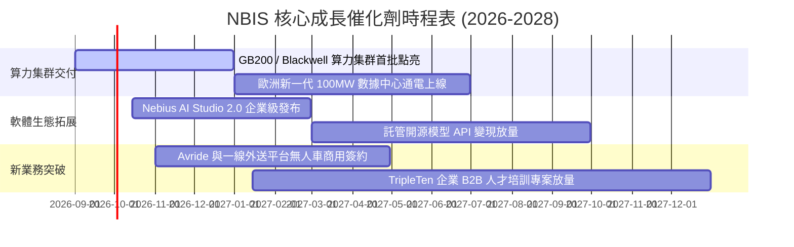

### 9.2 TAM 市場規模分析

```
╔══════════════════════════════════════════════════════════════════╗
║                   NBIS 目標市場規模（TAM）解析                  ║
╠══════════════════════════════════════════════════════════════════╣
║                                                                  ║
║  AI 專用雲基礎設施 TAM (2028E)：   $120.0B                       ║
║  ├── 當前 NBIS 滲透率：            ~1.1% ($1.36B)                ║
║  └── 預期 2028E 滲透率目標：       ~5.8% ($7.00B)                ║
║                                                                  ║
║  AI 軟體與工具鏈 TAM (2028E)：     $45.0B                        ║
║  ├── 當前 NBIS 滲透率：            <0.3%                         ║
║  └── 預期 2028E 滲透率目標：       ~2.0% ($0.90B)                ║
║                                                                  ║
║  自駕配送與 EdTech 衍生 TAM：      $25.0B                        ║
║  └── 總計潛在目標市場空間 (TAM)：  $190.0B (複合年增 +38%)       ║
╚══════════════════════════════════════════════════════════════════╝
```

### 9.3 成長驅動力結構圖

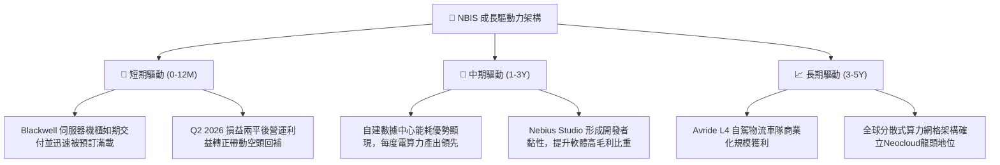

---

## 10. 風險矩陣

### 10.1 風險評分矩陣

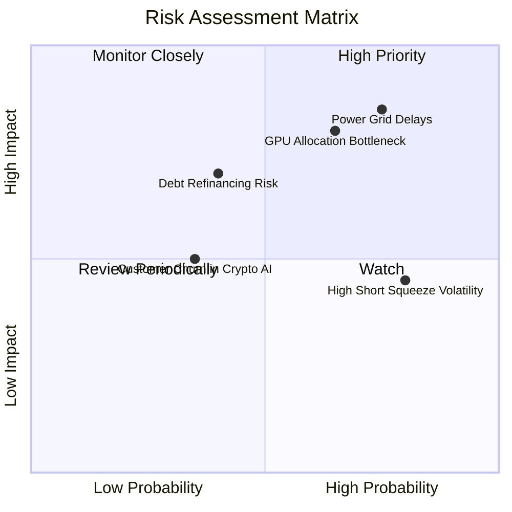

### 10.2 風險清單詳細分析

| # | 風險項目 | 發生機率 | 財務衝擊 | 風險評分 | 緩解措施與對沖手段 |
|---|----------|----------|----------|----------|-------------------|
| 1 | 🔴 **電力供應併網延遲** | 高 (45%) | 高 (-15% 預期營收) | 🔴 8.5/10 | 提前 3-5 年簽署多元綠電 PPA 協議，鎖定芬蘭及美歐多節點電網供電配額。 |
| 2 | 🔴 **硬體供應鏈集中度** | 中高 (40%) | 高 (-20% 交付量) | 🔴 8.0/10 | 取得 NVIDIA Elite 合作夥伴資格，多源採購冷卻液與網路交換設備。 |
| 3 | 🟡 **高額 Capex 融資稀釋** | 中度 (35%) | 中度 (-10% EPS) | 🟡 6.5/10 | 目前帳面現金 $8.04B 足以支應，並廣泛採用專案融資及資產抵押借貸。 |
| 4 | 🟡 **空頭多空博弈波動** | 高 (60%) | 低 (短期估值擾動) | 🟡 5.5/10 | 算力營收與獲利連續性兌現將自然逼空（Short Float 23.4%）。 |

---

## 11. 投資建議

### 11.1 最終綜合評級雷達圖

```
╔══════════════════════════════════════════════════════════════════╗
║                  NBIS 投資維度綜合評級                           ║
╠══════════════════════════════════════════════════════════════════╣
║  營收成長動能    9.5/10  ▓▓▓▓▓▓▓▓▓▓▓▓▓▓▓▓▓▓▓░  極高 (YoY +454%)║
║  毛利與定價權    9.0/10  ▓▓▓▓▓▓▓▓▓▓▓▓▓▓▓▓▓▓░░  優異 (74.3% 毛利)║
║  財務流動性      8.0/10  ▓▓▓▓▓▓▓▓▓▓▓▓▓▓▓▓░░░░  充沛 ($8.04B 現金║
║  估值吸引力      8.0/10  ▓▓▓▓▓▓▓▓▓▓▓▓▓▓▓▓░░░░  具性價比(PEG 0.48║
║  執行與管理能力  8.5/10  ▓▓▓▓▓▓▓▓▓▓▓▓▓▓▓▓▓░░░  轉型執行力強勁  ║
╠══════════════════════════════════════════════════════════════════╣
║  綜合評級：🟢 買入（Buy） ｜ 總體得分：8.6 / 10                  ║
╚══════════════════════════════════════════════════════════════════╝
```

### 11.2 目標價與隱含報酬率

| 情境 | 目標價 | 隱含報酬率 (相對現價 $210.63) | 機率權重 | 核心驅動前提 |
|------|--------|------------------------------|----------|--------------|
| 🔴 **悲觀情境** | **$165.40** | **-21.5%** | 20% | 電網延遲，GPU 租金價格戰，毛利率回落至 55% |
| 🟡 **基準情境** | **$258.85** | **+22.9%** | 60% | 5 年營收 CAGR 58%，營業利益率穩健擴張至 28% |
| 🟢 **樂觀情境** | **$338.20** | **+60.6%** | 20% | AI Studio 軟體變現加速，算力溢價維持高檔 |
| **加權預期值** | **$256.03** | **+21.6%** | 100% | 綜合風險報酬比極具吸引力 |

### 11.3 買入時機與觸發因素

```
╔══════════════════════════════════════════════════════════════════╗
║                  ✅ 買入觸發因素 Checklist                      ║
╠══════════════════════════════════════════════════════════════════╣
║                                                                  ║
║  立即買入觸發條件（已符合）：                                    ║
║  ✅ Q2 2026 單季營收突破 $5.8 億且營業虧損大幅收窄至損平邊緣     ║
║  ✅ 毛利率穩定在 70% 以上高水準區間                              ║
║  ✅ 現價 $210.63 低於加權合理價值 $258.85（MOS 達 +18.6%）       ║
║                                                                  ║
║  加碼觸發條件（出現以下任一）：                                  ║
║  ☐ 單季營業利益正式轉正（Operating Income > $0）                 ║
║  ☐ 公布超過 50MW 之大型數據中心通電投產利多                      ║
║  ☐ 股價回檔至 $180 - $195 價值支撐區間                          ║
║                                                                  ║
║  減碼 / 停損觸發條件（出現以下任一）：                           ║
║  ☐ 季度營收 YoY 成長率滑落至 100% 以下                           ║
║  ☐ 毛利率連續兩季跌破 60%                                        ║
║  ☐ 股價大幅超越樂觀情境目標價（> $340）                          ║
╚══════════════════════════════════════════════════════════════════╝
```

### 11.4 投資人適配度分析

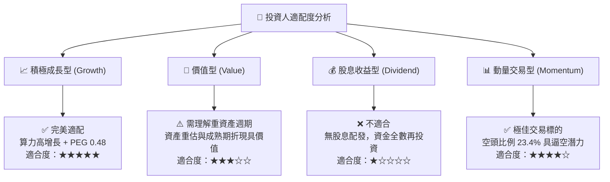

### 11.5 每季財報監控清單（Quarterly Watch List）

| 監控項目 | 關鍵跟蹤指標 | 🟢 加碼門檻 | 🔴 減碼/警戒門檻 |
|----------|--------------|-------------|------------------|
| **核心算力營收** | 季度營收金額與 QoQ 增長 | QoQ ≥ +35% 或 YoY ≥ +300% | QoQ < +15% 或 YoY < +100% |
| **毛利率品質** | Gross Margin (%) | ≥ 72.0% | < 62.0% |
| **營運損平進程** | GAAP 營業利潤 (EBIT) | EBIT 正式轉正 (> $0) | 季度營損再度擴大至 > -$150M |
| **資本支出效率** | 季度 Capex 與伺服器上架率 | 伺服器集群點亮使用率 > 90% | 機房空置率 > 20% |
| **流動性安全墊** | 現金及等價物餘額 | ≥ $5.0B | < $2.5B 且無新融資方案 |

### 11.6 反面論證：什麼會證明論點錯誤（What Would Change My Mind）

```
╔══════════════════════════════════════════════════════════════════╗
║              ⚠️ 論點失效條件（Disconfirming Evidence）           ║
╠══════════════════════════════════════════════════════════════════╣
║  本多頭投資論點在下列情況成立時應果斷停損或重新評估：            ║
║  ☐ 核心 AI 雲算力租賃營收成長率連續兩季低於 80% YoY               ║
║  ☐ 毛利率較當前 74.3% 收縮超過 15 個百分點（跌破 59%）          ║
║  ☐ 營業現金流 OCF 由正轉負，顯示客戶回款或算力需求逆轉           ║
║  ☐ ROIC 轉正時點延後至 2028 年之後，資本開支無法轉化為經濟利潤   ║
║  ☐ 大型超大規模雲端服務商（如 AWS/Azure/GCP）發動極端價格戰      ║
╚══════════════════════════════════════════════════════════════════╝
```

---
> **免責聲明**：本報告為 AI 自動生成，僅供研究參考，不構成投資建議。投資有風險，入市需謹慎。