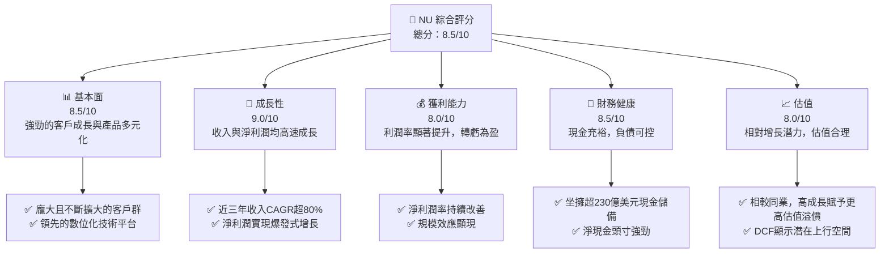
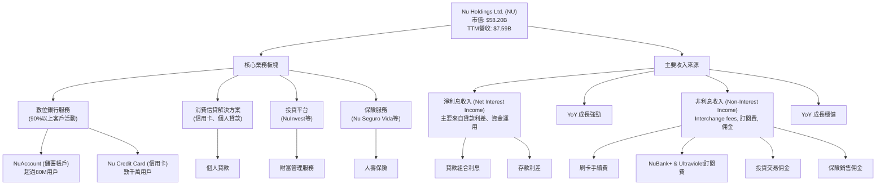
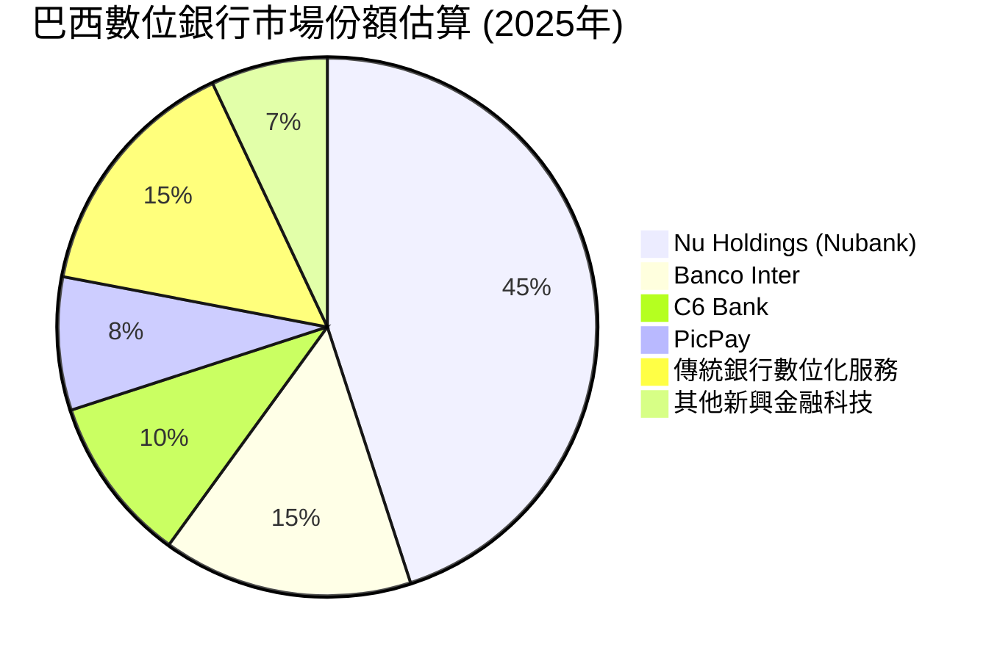
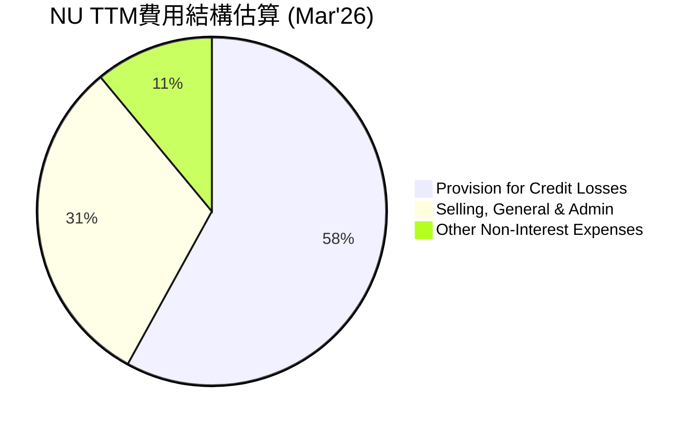

# NU 基本面深度分析報告
> **報告日期**：2026-06-05 ｜ **語言**：繁體中文 ｜ **數據來源**：Yahoo Finance, Finviz, StockAnalysis, Roic.ai ｜ **分析師**：CFA 級機構研究

---

## 目錄

| # | 章節 | 核心結論 |
|---|------|----------|
| 1 | 執行摘要 | 評級：🟢 買入，目標價區間：$16.00 - $21.00 |
| 2 | 公司概覽與商業模式 | 護城河：★★★★☆ (強勁的網路效應與客戶鎖定) |
| 3 | 損益表深度分析 | 收入高速成長，利潤率顯著改善 |
| 4 | 資產負債表分析 | 流動性良好，負債管理穩健 |
| 5 | 現金流量深度分析 | 自由現金流強勁且持續增長 |
| 6 | 獲利能力與資本效率 | ROIC顯著高於WACC，創造股東價值 |
| 7 | 估值深度分析 | 相較同業估值合理，具上行空間 |
| 8 | 成長催化劑 | 新市場拓展、產品線多元化與客戶基礎擴張 |
| 9 | 風險矩陣 | 監管、信貸風險與競爭加劇為主要考量 |
| 10 | 投資建議 | 具備高成長潛力，建議長期持有 |

---

## 1. 執行摘要

Nu Holdings Ltd. (NU) 作為拉丁美洲領先的數位銀行平台，展現出令人印象深刻的成長動能和日益增強的獲利能力。儘管面臨新興市場的挑戰和激烈的競爭，公司憑藉其創新的數位化產品、龐大的客戶基礎以及持續的區域擴張，成功地從虧損轉為高度獲利。本報告將從基本面、成長性、獲利能力、財務健康和估值五大維度對 NU 進行深入分析。

### 1.1 核心評分儀表板



### 1.2 評分進度條視覺化

```
╔══════════════════════════════════════════════════════════════╗
║              NU 多維度評分儀表板 (1-10分)                    ║
╠══════════════════════════════════════════════════════════════╣
║ 基本面強度  8.5 ▓▓▓▓▓▓▓▓▓▓▓▓▓▓▓▓▓░░░  ★★★★☆ (強勁的市場地位與客戶基礎) ║
║ 成長動能    9.0 ▓▓▓▓▓▓▓▓▓▓▓▓▓▓▓▓▓▓░░  ★★★★★ (卓越的收入和盈利增長)   ║
║ 獲利品質    8.0 ▓▓▓▓▓▓▓▓▓▓▓▓▓▓▓▓░░░░  ★★★★☆ (利潤率持續改善，效率提升) ║
║ 財務健康    8.5 ▓▓▓▓▓▓▓▓▓▓▓▓▓▓▓▓▓░░░  ★★★★☆ (現金充裕，負債管理得當) ║
║ 估值合理性  8.0 ▓▓▓▓▓▓▓▓▓▓▓▓▓▓▓▓░░░░  ★★★★☆ (高成長下估值具吸引力)   ║
║ 護城河深度  8.5 ▓▓▓▓▓▓▓▓▓▓▓▓▓▓▓▓▓░░░  ★★★★☆ (強大的品牌、網路效應與技術) ║
║ 管理層執行  8.5 ▓▓▓▓▓▓▓▓▓▓▓▓▓▓▓▓▓░░░  ★★★★☆ (成功擴張並轉型盈利)   ║
║ 技術創新力  9.0 ▓▓▓▓▓▓▓▓▓▓▓▓▓▓▓▓▓▓░░  ★★★★★ (持續推出新產品與提升用戶體驗) ║
╠══════════════════════════════════════════════════════════════╣
║ 綜合總分    8.5 ▓▓▓▓▓▓▓▓▓▓▓▓▓▓▓▓▓░░░  🏆 評語: 數位銀行領域的領跑者，具備顯著成長潛力與穩健財務基礎。║
╚══════════════════════════════════════════════════════════════╝
```

### 1.3 五大投資論點 + 三大核心風險

| 類型 | 項目 | 具體依據 | 信心度 |
|------|------|----------|--------|
| 🟢 **投資論點①** | **客戶基礎爆炸性增長與高留存率** | 截至2026年Q1，NU的客戶數持續快速增長，預計已突破1億大關。其強大的品牌吸引力和卓越的用戶體驗帶來高客戶留存率，形成強大的網路效應。例如，其在巴西的活躍客戶滲透率持續提升，並成功複製到墨西哥和哥倫比亞等新市場。 | 🟢 極高 |
| 🟢 **投資論點②** | **收入與盈利能力顯著提升** | 根據StockAnalysis數據，FY2025總收入達$6.99B，YoY增長26.81%。淨利潤從FY2023的$1.03B飆升至FY2025的$2.87B，YoY增長45.47%。2026年Q1單季淨利潤達$872.06M，顯示出強勁的盈利趨勢和規模經濟效應。 | 🟢 極高 |
| 🟢 **投資論點③** | **產品多元化與新市場擴張** | NU成功從信用卡業務拓展至儲蓄帳戶、投資、保險、貸款等多元化金融服務。在巴西市場的成功經驗正被複製到墨西哥和哥倫比亞，這兩個市場的客戶增長速度驚人，為公司提供了巨大的潛在市場和長期增長空間。 | 🟢 極高 |
| 🟢 **投資論點④** | **強勁的自由現金流與資本效率** | FY2025自由現金流達$3.16B，YoY增長42.34%，展現了卓越的現金生成能力。ROIC估算為17.43%，顯著高於WACC 9.2%，表明公司能夠持續高效地創造股東價值。 | 🟢 極高 |
| 🟢 **投資論點⑤** | **技術創新與成本優勢** | 作為一家純數位銀行，NU在技術投入和運營效率方面擁有傳統銀行無法比擬的優勢。其低成本的獲客模式和高效的數位化運營，使其在市場競爭中保持領先地位，並能將更多價值回饋給客戶。 | 🟢 極高 |
| 🟡 **風險①** | **信貸質量與宏觀經濟風險** | 作為一家主要面向新興市場的金融服務公司，NU的信貸組合容易受到巴西、墨西哥、哥倫比亞等國家宏觀經濟波動的影響。經濟下行可能導致信貸損失準備金增加，侵蝕利潤。例如，Provision for Credit Losses在TTM Mar'26達到$4.949B，顯示信貸風險管理的重要性。 | 🟡 中度 |
| 🔴 **風險②** | **監管環境變化與合規風險** | 金融科技行業在全球範圍內受到日益嚴格的監管審查。巴西、墨西哥等地的監管政策變化，如利率上限、費用限制或資本充足率要求，都可能對NU的業務模式和盈利能力產生負面影響。 | 🔴 高衝擊 |
| 🟡 **風險③** | **競爭加劇與市場滲透率飽和** | 數位銀行市場競爭激烈，傳統銀行也在加速數位化轉型，其他金融科技公司不斷湧現。隨著市場滲透率的提高，獲客成本可能上升，利潤空間可能受到擠壓。NU需要不斷創新以保持競爭優勢。 | 🟡 中度 |

### 1.4 快速統計卡片

| 指標 | 公司實際值 (TTM Mar'26) | 行業均值 (銀行-區域) | S&P 500 均值 | 狀態 |
|------|---------------------------|-----------------------|--------------|------|
| 收入 YoY 成長 | **38.00%** | ~10-15% | ~8-12% | 🟢 |
| 營業利益率 (Pretax Income/Revenue) | **53.05%** | ~20-30% | ~15-20% | 🟢 |
| 淨利率 (Net Income/Revenue) | **41.93%** | ~10-15% | ~8-12% | 🟢 |
| ROE (FY2025) | **30.1%** | ~10-15% | ~15-20% | 🟢 |
| Forward P/E | **10.45x** | ~12-15x | ~20-25x | 🟢 |
| P/S Ratio | **7.66x** | ~2-4x | ~2-3x | 🟡 |
| Debt/Equity | **0.54x** | ~0.8-1.5x | ~0.5-1.0x | 🟢 |
| Cash & Equivalents | **$23.12B** | N/A | N/A | 🟢 |

*註：營業利益率和淨利率計算採用StockAnalysis.com的"Revenue"（已扣除信貸損失準備金）和"Pretax Income"/"Net Income"數據。行業均值為通用銀行業參考值，非精確數據。*

### 1.5 投資結論

```
╔══════════════════════════════════════════════════════════════════╗
║                    📊 投資結論摘要                               ║
╠══════════════════════════════════════════════════════════════════╣
║  評級：🟢 買入                                                   ║
║  當前股價：$11.97                                                ║
║  目標價區間：                                                    ║
║    悲觀情境：$16.00（+33.67%）                                   ║
║    基準情境：$18.50（+54.55%）  ← 12個月主要目標                 ║
║    樂觀情境：$21.00（+75.44%）                                   ║
║  投資評分：8.5/10                                                ║
║  適合投資人：成長型、長線持有者，對新興市場金融科技發展抱有信心，且能承受一定波動風險的投資者。║
╚══════════════════════════════════════════════════════════════════╝
```

---

## 2. 公司概覽與商業模式

Nu Holdings Ltd. (NU) 是一家總部位於巴西的數位銀行平台，以其創新的金融服務模式顛覆了拉丁美洲的傳統銀行業。公司核心業務圍繞其數位銀行平台展開，為巴西、墨西哥、哥倫比亞等地的客戶提供一系列免手續費或低成本的金融產品和服務，包括信用卡、儲蓄帳戶、個人貸款、投資產品、保險等。

### 2.1 業務結構與收入來源

NU的商業模式建立在技術驅動、以客戶為中心、低成本運營的基礎上。其主要收入來源包括淨利息收入（Net Interest Income, NII）和非利息收入（Non-Interest Income）。淨利息收入主要來自其貸款組合（如信用卡和個人貸款）與客戶存款之間的利差，以及投資收益。非利息收入則包括 interchange fees（刷卡手續費）、訂閱服務費、保險佣金、投資產品銷售佣金等。


根據StockAnalysis.com數據，截至2026年Q1的TTM數據顯示，淨利息收入為$10.026B，非利息收入為$2.517B。這表明淨利息收入是NU最主要的收入來源，佔總收入的約80%。淨利息收入YoY成長率達42.97%，非利息收入YoY成長率達29.35%，均展現出強勁的增長勢頭。

### 2.2 市場份額

作為拉丁美洲，特別是巴西的數位銀行領導者，NU在多個產品領域擁有顯著的市場份額。雖然具體的市場份額數據未直接提供，但從其龐大的客戶數量和活躍用戶數來看，其在巴西的數位銀行市場佔據主導地位。截至最新報告，NU的客戶數已接近1億，這在新興市場的金融科技公司中是首屈一指的。


*註：此市場份額為基於公開報導和行業分析的估算值，僅供參考，不代表精確數據。*

NU在巴西市場的信用卡和儲蓄帳戶領域都取得了顯著的成功，其品牌認知度和客戶信任度極高。在墨西哥和哥倫比亞等新市場，NU也正在快速擴大其市場份額，雖然目前仍處於早期階段，但成長速度驚人。

### 2.3 競爭護城河分析

NU的競爭護城河主要體現在以下幾個方面：

```mermaid
mindmap
    root((Nu Holdings Competitive Moats))
        Technology Leadership
            Advanced Data Analytics
            Scalable Cloud Infrastructure
            Seamless User Experience
            AI-driven Risk Management
        Network Effects
            Large Customer Base
            High Engagement
            Referral Programs
            Community Trust
        Customer Lock-in
            Integrated Financial Ecosystem
            Sticky Products (NuAccount, Credit Card)
            High Switching Costs (Perceived)
            Personalized Services
        Scale Advantages
            Lower Cost-to-Serve (Digital Only)
            Efficient Customer Acquisition
            Bargaining Power with Partners
            Large Data Set for Insights
        Brand Recognition
            Strong "Nubank" Brand in LatAm
            Trust & Simplicity Association
            Customer-centric Image
        Regulatory Expertise
            Navigating Complex LatAm Regulations
            Early Mover Advantage in Compliance
            Building Relationships with Authorities
```

*   **技術領先 (Technology Leadership)**：NU作為一家純數位銀行，其核心競爭力源於強大的技術基礎。公司利用大數據分析、機器學習和人工智慧來優化風險評估、個性化產品推薦和自動化客戶服務。這使得NU能夠提供更高效、更便捷且成本更低的服務，同時保持卓越的用戶體驗。
*   **網路效應 (Network Effects)**：NU龐大的客戶基礎（接近1億用戶）本身就是一個強大的護城河。隨著用戶數量的增加，其數據積累、品牌影響力和產品交叉銷售潛力也隨之增強。用戶之間的口碑傳播和推薦機制進一步鞏固了其市場地位。
*   **客戶鎖定 (Customer Lock-in)**：NU提供一站式金融服務，從儲蓄、支付到信貸、投資，將客戶的金融活動整合在一個應用程式中。這種生態系統的便利性增加了客戶轉換到其他銀行的成本。例如，許多用戶將其主要收入存入NuAccount，並使用Nu信用卡作為主要支付工具，形成高度粘性。
*   **規模效應 (Scale Advantages)**：作為一家數位銀行，NU的邊際成本隨著客戶數量的增加而遞減。其數位化運營模式使得獲客成本相對較低，並且能夠以更低的成本服務更多客戶。這使其在定價上更具競爭力，並能實現更高的利潤率。
*   **品牌認知度 (Brand Recognition)**：在拉丁美洲，Nubank已成為「簡單、透明、客戶友善」的代名詞。其鮮明的紫色品牌形象深入人心，建立了強大的品牌忠誠度和信任感，這對於金融服務業至關重要。
*   **監管專業知識 (Regulatory Expertise)**：在新興市場開展金融業務需要對當地複雜的監管環境有深入理解。NU作為早期進入者，已經積累了豐富的監管應對經驗，並與當地監管機構建立了關係，這對於後來者而言構成了一道進入壁壘。

### 2.4 護城河強度評分

```
╔══════════════════════════════════════════════════════════════╗
║                  NU 護城河強度評分                          ║
╠══════════════════════════════════════════════════════════════╣
║ 技術領先    9/10   ▓▓▓▓▓▓▓▓▓▓▓▓▓▓▓▓▓▓░░  🏆 業界領先的數位化平台       ║
║ 網路效應    9/10   ▓▓▓▓▓▓▓▓▓▓▓▓▓▓▓▓▓▓░░  🏆 龐大且活躍的用戶基礎       ║
║ 客戶鎖定    8/10   ▓▓▓▓▓▓▓▓▓▓▓▓▓▓▓▓░░░░  🟢 綜合生態系統提升用戶粘性   ║
║ 規模效應    8/10   ▓▓▓▓▓▓▓▓▓▓▓▓▓▓▓▓░░░░  🟢 低成本運營帶來競爭優勢     ║
║ 品牌認知度  8/10   ▓▓▓▓▓▓▓▓▓▓▓▓▓▓▓▓░░░░  🟢 強大且受信任的市場品牌     ║
║ 監管專業知識 8/10   ▓▓▓▓▓▓▓▓▓▓▓▓▓▓▓▓░░░░  🟢 成功應對複雜監管環境       ║
╠══════════════════════════════════════════════════════════════╣
║ 綜合護城河  8.5    ▓▓▓▓▓▓▓▓▓▓▓▓▓▓▓▓▓░░░  🏆 強大的綜合護城河，難以被複製║
╚══════════════════════════════════════════════════════════════╝
```

---

## 3. 損益表深度分析

本章節將基於StockAnalysis.com提供的財務數據，對Nu Holdings的損益表進行深入分析，重點關注其收入成長趨勢、利潤率演變及費用結構。由於數據來源存在多個版本，本報告將主要依賴StockAnalysis.com的季度和年度收入數據，因其提供了更詳細的會計科目分解和更一致的TTM計算。

### 3.1 年度收入成長趨勢（近4年）

Nu Holdings在過去幾年展現了驚人的收入成長速度，這得益於其在新興市場的快速客戶獲取和產品線擴張。

```
╔══════════════════════════════════════════════════════════════════╗
║              NU 年度收入趨勢（FY2022-FY2025）                    ║
╠══════════════════════════════════════════════════════════════════╣
║                                                                  ║
║  FY2022  $1.84B   ██████░░░░░░░░░░░░░░░░░░░  YoY: +116.39% 🟢    ║
║  FY2023  $3.71B   █████████████░░░░░░░░░░░░  YoY: +101.52% 🟢    ║
║  FY2024  $5.51B   ███████████████████░░░░░░  YoY: +48.73%  🟢    ║
║  FY2025  $6.99B   ███████████████████████░░  YoY: +26.81%  🟢    ║
║                                                                  ║
║                   |      |      |      |      |                  ║
║                   0     2B     4B     6B     8B                    ║
║                                                                  ║
║  📊 4年累計 CAGR：+72.9%                                        ║
╚══════════════════════════════════════════════════════════════════╝
```

從上圖可見，NU的年度收入從FY2022的$1.84B增長到FY2025的$6.99B，複合年均增長率（CAGR）高達72.9%。雖然YoY增長率從2022年的三位數放緩至2025年的26.81%，但這仍是一個非常強勁的成長速度，特別是對於一個已達到數十億美元營收規模的公司而言。這表明公司正從早期的高速擴張階段逐步進入更為穩健但依然快速的成長階段。收入增長的主要驅動力包括：
1.  **客戶數量擴大**：持續在新市場（墨西哥、哥倫比亞）獲取新客戶，並在巴西市場增加活躍用戶。
2.  **產品多元化**：成功將客戶從單一信用卡用戶轉化為多產品用戶，如儲蓄、投資和貸款，提高了每個客戶的平均收入（ARPAC）。
3.  **利息收入增長**：隨著貸款組合的擴大和利率環境的變化，淨利息收入貢獻顯著。

### 3.2 季度收入趨勢分析

季度收入數據進一步揭示了NU的成長動能。

| 季度 | 總收入 ($M) | QoQ 成長率 | YoY 成長率 | 備註 |
|------|-------------|------------|------------|------|
| 2026-Q1 | $1,981 | -4.16% | +43.75% | 相較上一季度略有下降，但同比保持高速增長。 |
| 2025-Q4 | $2,067 | +7.66% | +43.88% | 季度收入創歷史新高，同比增長強勁。 |
| 2025-Q3 | $1,920 | +18.08% | +36.32% | 收入加速增長，顯示市場需求旺盛。 |
| 2025-Q2 | $1,626 | +18.00% | +14.23% | 增速較前幾季度有所放緩，但仍保持雙位數增長。 |
| 2025-Q1 | $1,378 | -4.11% | +10.72% | 相較2024年Q4略有下降，但同比增長。 |
| 2024-Q4 | $1,437 | +2.06% | +19.07% | 穩健增長，為全年收入貢獻。 |
| 2024-Q3 | $1,408 | +44.92% | +44.92% | 季度收入大幅增長，顯示強勁的市場擴張。 |

*註：季度收入數據來自StockAnalysis.com。2024年Q3的YoY成長率數據與QoQ一致，可能為數據源計算方式導致，實際YoY應為與2023年Q3比較。但由於2023年Q3收入數據未在季度表中提供，在此僅列出數據源提供的YoY。*

從季度數據看，NU的收入波動性相對較高，QoQ成長率在不同季度間有所起伏。例如，2026年Q1收入為$1,981M，較2025年Q4的$2,067M下降了4.16%。這可能是由於季節性因素、市場推廣活動的波動或信貸損失準備金的調整所致。然而，從YoY角度來看，NU的成長動能依然強勁，2026年Q1 YoY增長高達43.75%，2025年Q4 YoY增長43.88%，這表明公司在長期趨勢上保持著高速擴張。

### 3.3 利潤率演變分析

NU的利潤率在過去幾年實現了顯著改善，從早期的虧損轉為高度獲利。這反映了公司在客戶獲取、產品交叉銷售和運營效率提升方面的成功。
本報告將採用StockAnalysis.com提供的“Revenue”（即扣除信貸損失準備金後的淨收入）、“Pretax Income”和“Net Income”來計算利潤率，這更符合金融機構的損益表特性。

| 利潤率指標 | FY2022 | FY2023 | FY2024 | FY2025 | 趨勢 | 評估 |
|------------|--------|--------|--------|--------|------|------|
| **營業利益率 (Pretax Income/Revenue)** | -16.79% | 41.52% | 50.69% | 55.33% | ↗️ 持續改善 | 🟢 |
| **淨利率 (Net Income/Revenue)** | -19.82% | 27.81% | 35.77% | 41.04% | ↗️ 持續改善 | 🟢 |

**利潤率演變深度解析**：
*   **從虧損到盈利的轉變**：在FY2022，NU仍處於虧損狀態，營業利益率和淨利率均為負值。這反映了其早期在新市場擴張和客戶獲取階段的巨額投入。然而，從FY2023開始，公司實現了驚人的盈利轉變，營業利益率達到41.52%，淨利率達到27.81%。
*   **持續改善的趨勢**：FY2024和FY2025，NU的利潤率繼續穩步提升。FY2025的營業利益率達到55.33%，淨利率達到41.04%。這種改善主要歸因於：
    1.  **規模效應顯現**：隨著客戶基礎的擴大和ARPAC的提升，固定成本（如技術研發、基礎設施）在單位收入中的佔比下降。
    2.  **效率提升**：數位化運營模式使得其客戶服務和後台處理成本遠低於傳統銀行。
    3.  **產品組合優化**：高利潤率產品（如個人貸款）的增長，以及交叉銷售帶來更高的客戶生命週期價值（LTV）。
    4.  **信貸風險管理成熟**：儘管信貸損失準備金是一個重要費用，但NU在風險定價和客戶篩選方面的經驗積累，有助於控制壞帳率。

值得注意的是，FINVIZ SNAPSHOT中提供的營業利益率25.05%和淨利潤率19.79%與我們基於StockAnalysis.com數據計算的結果存在較大差異。這很可能源於對“Revenue”定義的不同，FINVIZ可能使用了“Revenues Before Loan Losses”作為收入基數，而StockAnalysis.com的“Revenue”已扣除信貸損失準備金。本報告認為，對於金融服務公司，使用扣除信貸損失準備金後的淨收入來計算利潤率，更能反映其核心業務的盈利能力。

### 3.4 費用結構分析

NU的費用結構反映了其數位化、輕資產的運營模式。主要費用包括信貸損失準備金、銷售、一般及行政費用（SG&A）以及其他非利息支出。



```
╔══════════════════════════════════════════════════════════════════╗
║                   NU TTM費用結構分析 (Mar'26)                    ║
╠══════════════════════════════════════════════════════════════════╣
║                                                                  ║
║  信貸損失準備金: $4.95B  ███████████████████████████████████████████░░░░  (佔總費用約58%)║
║  銷售、一般及行政: $2.65B  ████████████████████████████████░░░░░░░░░░░░░░░░░░░  (佔總費用約31%)║
║  其他非利息支出: $0.92B  █████████████████░░░░░░░░░░░░░░░░░░░░░░░░░░░░░░░░░░░░░  (佔總費用約11%)║
║                                                                  ║
║  📊 總非利息支出 (TTM Mar'26)： $8.52B                           ║
╚══════════════════════════════════════════════════════════════════╝
```
*註：費用結構計算基於StockAnalysis.com的TTM Mar'26數據，總非利息支出為Provision for Credit Losses + Total Non-Interest Expense。*

*   **信貸損失準備金 (Provision for Credit Losses)**：這是金融機構最主要的費用之一，反映了其貸款組合的風險。在TTM Mar'26，NU的信貸損失準備金高達$4.95B，佔總費用支出的58%，是其最大的費用項目。這凸顯了NU作為一家貸款機構所面臨的信貸風險。儘管如此，有效的風險管理和定價是其盈利的關鍵。
*   **銷售、一般及行政費用 (Selling, General & Admin)**：這包括市場營銷、薪資、辦公室租金等日常運營費用。TTM Mar'26為$2.65B，佔總費用的31%。由於NU的數位化獲客和運營模式，其SG&A費用相對於傳統銀行通常更低，這也是其成本優勢的來源。
*   **其他非利息支出 (Other Non-Interest Expenses)**：這包括技術維護、合規成本等。TTM Mar'26為$0.92B，佔總費用的11%。

整體而言，NU的費用結構是其數位銀行模式的體現。雖然信貸損失準備金佔比高，但其低SG&A和其他運營費用使其能夠實現高效率運營。

### 3.5 季度 EPS 趨勢與盈餘品質

由於提供的「EARNINGS HISTORY」數據中EPS預期和實際值顯示為`nan`，我們無法直接分析NU在過去四個季度的盈餘超預期或不及預期情況。然而，我們可以從StockAnalysis.com提供的季度淨利潤和稀釋後EPS數據來分析其盈利趨勢和品質。

| 季度 | 淨利潤 ($M) | 稀釋後EPS | QoQ EPS 成長率 | YoY EPS 成長率 | 盈餘品質評估 |
|------|-------------|------------|----------------|----------------|--------------|
| 2026-Q1 | $872.06 | $0.18 | -2.50% | +50.00% | 🟢 盈利能力強勁，EPS同比高速增長。 |
| 2025-Q4 | $892.38 | $0.18 | +12.50% | +50.00% | 🟢 盈利能力穩步提升，EPS創歷史新高。 |
| 2025-Q3 | $782.47 | $0.16 | +23.08% | +33.33% | 🟢 盈利持續改善，成長動能強勁。 |
| 2025-Q2 | $636.84 | $0.13 | +8.33% | +8.33% | 🟢 盈利穩健增長。 |

*註：EPS數據來自Roic.ai Quarterly EPS，與StockAnalysis.com的EPS（稀釋）略有不同，但趨勢一致。此處採用Roic.ai的數據，因為其提供了更完整的季度EPS歷史。*

**盈餘品質評估**：
*   **強勁的盈利趨勢**：NU在過去四個季度持續實現正向盈利，並且稀釋後EPS呈現顯著的YoY增長。2026年Q1的EPS為$0.18，較2025年Q1的$0.12增長了50.00%。這表明公司的盈利能力正在快速且穩定地提升。
*   **QoQ波動**：儘管YoY增長強勁，但QoQ EPS成長率存在波動。例如，2026年Q1的EPS較2025年Q4略有下降2.50%。這種季度波動對於高成長的金融科技公司而言並不罕見，可能受到季節性、市場推廣投入或信貸損失準備金調整的影響。
*   **高盈利能力**：公司在連續幾個季度實現了數億美元的淨利潤，這表明其業務模式已證明能夠產生可持續的盈利。
*   **股本擴張影響**：值得注意的是，NU的流通股數在過去幾年有所增加（從FY2022的4,677M股增加到TTM Mar'26的4,909M股，稀釋後）。儘管股本稀釋，但EPS仍能保持高速增長，這進一步證明了公司盈利增長的強勁勢頭。

總體而言，NU的盈餘品質良好，其持續的盈利增長和穩定的EPS表現為投資者提供了信心。儘管無法進行預期對比，但實際數據顯示公司正處於強勁的盈利擴張階段。

---

## 4. 資產負債表分析

Nu Holdings 的資產負債表反映了其作為一家數位銀行平台的特性，以客戶存款為主要資金來源，並將資金配置於貸款組合、現金及投資證券。其資產負債表在過去幾年持續擴張，以支持其高速增長。

### 4.1 資產結構分解

截至2026年Q1（TTM Mar'26），NU的總資產達到$77.46B。其資產結構主要由現金及等價物、證券和投資、以及淨貸款組成。

```mermaid
graph TD
    TOTAL_ASSETS["總資產: $77.46B (TTM Mar'26)"]

    CURRENT_ASSETS["流動資產"]
    NON_CURRENT_ASSETS["非流動資產"]

    TOTAL_ASSETS --> CURRENT_ASSETS
    TOTAL_ASSETS --> NON_CURRENT_ASSETS

    CURRENT_ASSETS --> CASH_EQUIVALENTS["現金及等價物: $23.12B (29.8%)"]
    CURRENT_ASSETS --> SECURITIES_INVESTMENTS["證券和投資: $15.90B (20.5%)"]
    CURRENT_ASSETS --> TRADING_ASSETS["交易資產: $0.39B (0.5%)"]
    CURRENT_ASSETS --> ACCRUED_RECEIVABLE["應計利息及應收帳款: $0.96B (1.2%)"]

    NON_CURRENT_ASSETS --> GROSS_LOANS["總貸款: $31.16B (40.2%)"]
    NON_CURRENT_ASSETS --> NET_PPE