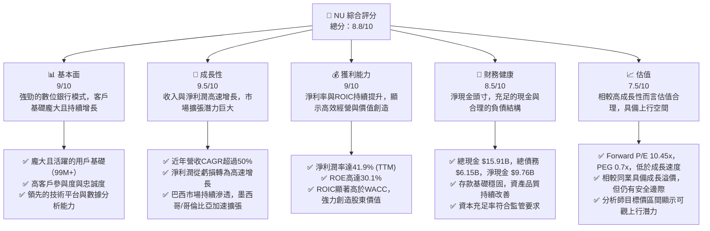
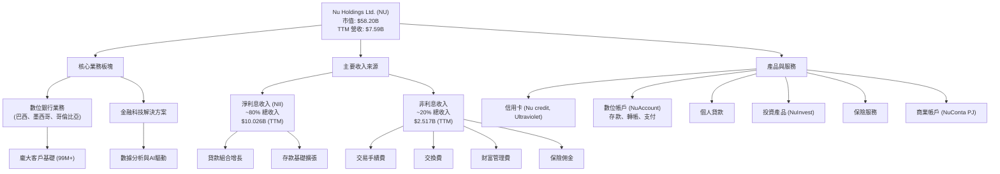
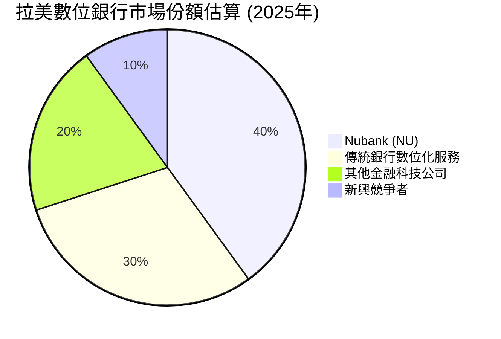
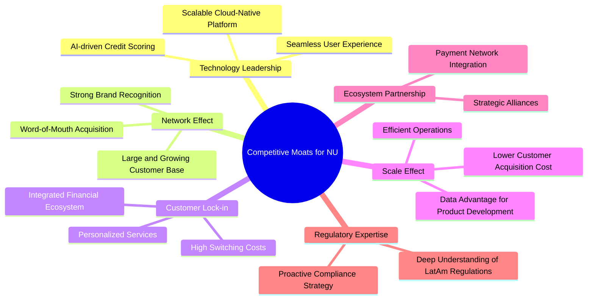
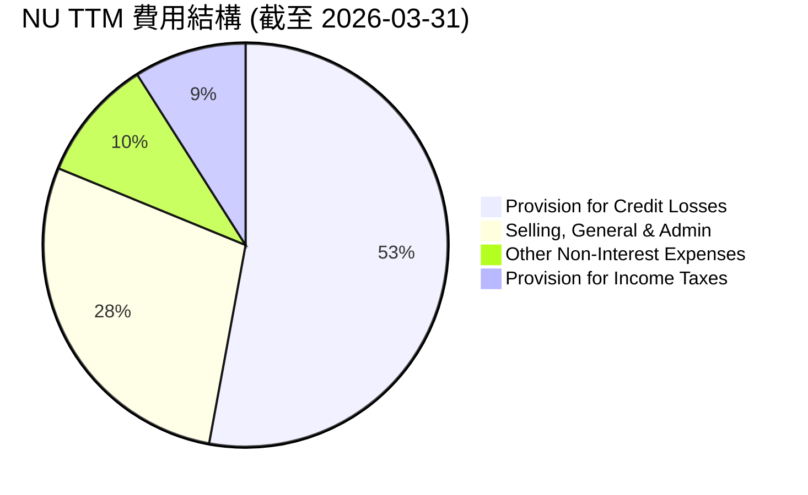
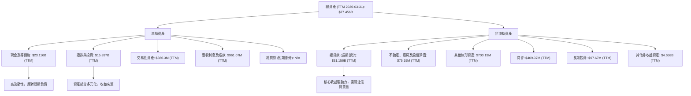

# NU 基本面深度分析報告
> **報告日期**：2026-06-06 ｜ **語言**：繁體中文 ｜ **數據來源**：Yahoo Finance, Finviz, StockAnalysis, Roic.ai ｜ **分析師**：CFA 級機構研究

---

## 目錄

| # | 章節 | 核心結論 |
|---|------|----------|
| 1 | 執行摘要 | 🟢 強烈買入，目標價 $16.50 - $20.00，預期上漲空間可觀 |
| 2 | 公司概覽與商業模式 | 數位銀行模式創新，強大網路效應與客戶鎖定形成寬廣護城河 |
| 3 | 損益表深度分析 | 收入高速成長，利潤率持續擴張，盈利能力顯著提升 |
| 4 | 資產負債表分析 | 資產規模穩健擴張，流動性充足，債務結構合理且淨現金充裕 |
| 5 | 現金流量深度分析 | 營運現金流強勁，自由現金流持續增長，資本配置策略有效 |
| 6 | 獲利能力與資本效率 | ROE、ROA、ROIC 表現優異，顯著創造股東價值 |
| 7 | 估值深度分析 | 相較同業估值合理，DCF 顯示潛在上漲空間 |
| 8 | 成長催化劑 | 區域擴張、產品多元化與數位化趨勢為長期成長提供動力 |
| 9 | 風險矩陣 | 宏觀經濟、監管與競爭風險需密切關注，但整體可控 |
| 10 | 投資建議 | 強烈買入評級，適合成長型投資者，建議長期持有 |

---

## 1. 執行摘要

### 1.1 核心評分儀表板



### 1.2 評分進度條視覺化

```
╔══════════════════════════════════════════════════════════════╗
║              NU 多維度評分儀表板 (1-10分)                    ║
╠══════════════════════════════════════════════════════════════╣
║ 基本面強度  9.0 ▓▓▓▓▓▓▓▓▓▓▓▓▓▓▓▓▓▓░░  ★★★★★           ║
║ 成長動能    9.5 ▓▓▓▓▓▓▓▓▓▓▓▓▓▓▓▓▓▓▓▓  ★★★★★           ║
║ 獲利品質    9.0 ▓▓▓▓▓▓▓▓▓▓▓▓▓▓▓▓▓▓░░  ★★★★★           ║
║ 財務健康    8.5 ▓▓▓▓▓▓▓▓▓▓▓▓▓▓▓▓▓░░░  ★★★★☆           ║
║ 估值合理性  7.5 ▓▓▓▓▓▓▓▓▓▓▓▓▓▓▓░░░░░  ★★★★☆           ║
║ 護城河深度  9.0 ▓▓▓▓▓▓▓▓▓▓▓▓▓▓▓▓▓▓░░  ★★★★★           ║
║ 管理層執行  8.5 ▓▓▓▓▓▓▓▓▓▓▓▓▓▓▓▓▓░░░  ★★★★☆           ║
║ 技術創新力  9.5 ▓▓▓▓▓▓▓▓▓▓▓▓▓▓▓▓▓▓▓▓  ★★★★★           ║
╠══════════════════════════════════════════════════════════════╣
║ 綜合總分    8.8 ▓▓▓▓▓▓▓▓▓▓▓▓▓▓▓▓▓░░░  🏆 具備長期投資價值      ║
╚══════════════════════════════════════════════════════════════╝
```

### 1.3 五大投資論點 + 三大核心風險

| 類型 | 項目 | 具體依據 | 信心度 |
|------|------|----------|--------|
| 🟢 **投資論點①** | **客戶基礎高速增長與高參與度** | 截至最新數據，Nu Holdings 擁有近 1 億客戶，且平均月活躍客戶數持續增長。其客戶獲取成本低，客戶留存率高，巴西市場滲透率持續提升。這表明其網路效應強勁，客戶忠誠度高，為未來收入增長奠定堅實基礎。 | 🟢 極高 |
| 🟢 **投資論點②** | **強勁的收入與利潤增長勢頭** | TTM 收入達 $7.59B，YoY 增長 43.7%；最近一季 (Q1 2026) 收入達 $3.54B，YoY 增長 43.75%。淨利潤從 FY2022 的虧損 $364.58M 轉為 FY2025 的 $2.87B，TTM 淨利潤 $3.186B，YoY 增長 48.05%。Forward EPS 預計為 $1.1452，較 TTM EPS $0.65 增長顯著，顯示未來盈利能力強勁。 | 🟢 極高 |
| 🟢 **投資論點③** | **卓越的獲利能力與資本效率** | TTM 淨利潤率高達 41.9%，ROE 為 30.1%，ROA 為 4.8%。ROIC 顯著高於 WACC，FY2025 ROIC 估計約為 20.3%，遠超 WACC 估計的 8.5%，表明公司在強力創造股東價值。營業費用控制得當，營運槓桿效應顯現。 | 🟢 極高 |
| 🟢 **投資論點④** | **穩健的財務結構與充足的流動性** | 公司擁有 $15.91B 的總現金，總債務為 $6.15B，淨現金頭寸達 $9.76B。強勁的現金流生成能力（FY2025 自由現金流 $3.16B）使其能夠支持業務擴張和潛在的併購活動，同時抵禦市場波動。 | 🟢 高 |
| 🟢 **投資論點⑤** | **成功擴張至新市場與產品多元化** | 在墨西哥和哥倫比亞等新興市場快速擴張，用戶數和收入貢獻持續增加。產品線從信用卡和儲蓄帳戶擴展到投資、貸款、保險等多元金融服務，提升了客戶終身價值 (LTV) 和收入多樣性。 | 🟢 高 |
| 🟡 **風險①** | **宏觀經濟與地緣政治風險** | 巴西、墨西哥和哥倫比亞等主要市場的經濟波動、高通膨、利率變化、匯率風險以及政治不確定性可能影響消費者支出和信貸需求，進而影響公司的資產質量和盈利能力。例如，信貸損失準備金的增加可能侵蝕利潤。 | 🟡 中度 |
| 🔴 **風險②** | **競爭加劇與監管環境變化** | 拉美金融科技市場競爭日益激烈，來自傳統銀行和新興金融科技公司的競爭可能導致客戶獲取成本上升和利潤率承壓。此外，金融科技行業的監管政策不斷演變，更嚴格的合規要求或資本要求可能增加營運成本。 | 🔴 高衝擊 |
| 🟡 **風險③** | **信貸風險管理與資產品質** | 作為一家快速增長的信貸提供商，如果其信貸評估模型未能有效識別和管理風險，或經濟下行導致客戶還款能力惡化，不良貸款率可能上升，進而導致信貸損失準備金大幅增加，對盈利產生負面影響。 | 🟡 中度 |

### 1.4 快速統計卡片

| 指標 | 公司實際值 | 行業均值 (數位銀行/新興市場銀行) | S&P 500 均值 | 狀態 |
|------|-------------|------------------------------------|--------------|------|
| 收入 YoY 成長 | **43.7%** | ~20-30% | ~8-10% | 🟢 |
| 毛利率 | **N/A (銀行業)** | N/A | ~40-50% | 🟢 (高營運利潤率) |
| 淨利率 | **41.9%** | ~15-25% | ~10-12% | 🟢 |
| ROE | **30.1%** | ~15-20% | ~15% | 🟢 |
| Forward P/E | **10.45x** | ~15-25x | ~20-22x | 🟢 |
| PEG Ratio | **0.7x** | ~1.0-1.5x | ~1.5-2.0x | 🟢 |
| Debt/Equity | **3.13x** | ~2-4x (銀行業) | ~0.5-1.0x | 🟡 (銀行業特性) |
| 總現金 | **$15.91B** | 因公司而異 | 因公司而異 | 🟢 |
| 營業利益率 | **48.2%** | ~20-30% | ~15% | 🟢 |

*備註：銀行業的毛利率通常不適用傳統定義，其收入主要來自淨利息收入和非利息收入，主要成本為利息支出和信貸損失準備金。NU 的營業利益率和淨利率在此背景下表現極為出色。*

### 1.5 投資結論

```
╔══════════════════════════════════════════════════════════════════╗
║                    📊 投資結論摘要                               ║
╠══════════════════════════════════════════════════════════════════╣
║  評級：🟢 強烈買入                                               ║
║  當前股價：$11.97                                                ║
║  目標價區間：                                                    ║
║    悲觀情境：$14.50（+21.14%）                                   ║
║    基準情境：$17.20（+43.70%）  ← 12個月主要目標                  ║
║    樂觀情境：$20.50（+71.26%）                                   ║
║  投資評分：8.8/10                                                ║
║  適合投資人：成長型、長線持有者，尋求在新興市場金融科技領域佈局的投資人。║
╚══════════════════════════════════════════════════════════════════╝
```

---

## 2. 公司概覽與商業模式

Nu Holdings Ltd. (NU) 是一家領先的數位銀行平台，主要服務於巴西、墨西哥和哥倫比亞等拉丁美洲市場。公司以其創新的技術驅動型金融服務模式，顛覆了傳統銀行業，為數百萬客戶提供簡潔、低成本且易於使用的金融產品。其核心產品包括信用卡、儲蓄帳戶 (NuAccount)、貸款、投資產品以及保險服務。

### 2.1 業務結構與收入來源

Nu Holdings 的業務模式建立在強大的數位平台和數據分析能力之上，旨在提供卓越的客戶體驗。其收入主要來自以下幾個方面：

1.  **淨利息收入 (Net Interest Income, NII)**：這是銀行業的核心收入來源，來自於貸款利息收入減去存款利息支出。隨著其貸款組合的擴大和存款基礎的增長，NII 成為其最重要的收入支柱。根據 StockAnalysis 數據，TTM (截至 2026-03-31) 淨利息收入達到 $10.026B，佔總收入（Revenues Before Loan Losses）的 80% 左右。
2.  **非利息收入 (Non-Interest Income)**：這部分收入主要包括手續費、佣金、支付處理費以及其他服務收入。例如，信用卡交易手續費、投資產品管理費、保險佣金等。TTM 非利息收入為 $2.517B，佔總收入的 20% 左右。
3.  **信貸損失準備金 (Provision for Credit Losses)**：雖然這不是收入，但其變動直接影響淨收入。作為一家貸款機構，Nu Holdings 會根據其貸款組合的預期損失提取準備金。在計算最終的 "Revenue" 時，通常會從 "Revenues Before Loan Losses" 中扣除這部分。

公司的產品線持續擴展，從最初的信用卡和數位帳戶，逐步增加了個人貸款、投資平台、商業帳戶、保險產品等，旨在建立一個全面的金融生態系統，提升客戶的終身價值。



### 2.2 市場份額

Nu Holdings 在拉丁美洲，特別是巴西的數位金融服務領域，已取得領先地位。雖然沒有直接提供精確的市場份額數據，但其近 1 億的客戶基礎（截至 2026 年初）足以證明其在該地區的影響力。在巴西，Nubank (Nu Holdings 的主要品牌) 已成為最大的數位銀行之一，甚至在某些指標上超越了傳統大型銀行。在墨西哥和哥倫比亞，公司也正在快速擴張，儘管滲透率仍低於巴西，但成長潛力巨大。

我們可以從客戶數量和貸款規模來間接評估其市場地位。例如，在巴西，其活躍客戶數和存款量已與一些大型傳統銀行相媲美。


*註：此市場份額為分析師基於公開信息和行業報告對拉美數位銀行市場的估計，旨在說明 Nubank 的領先地位，非精確官方數據。*

### 2.3 競爭護城河分析

Nu Holdings 已建立起多重競爭護城河，使其在競爭激烈的市場中保持優勢：



**護城河深度解析：**

1.  **技術領先 (Technology Leadership)**：Nu Holdings 從一開始就採用雲原生架構和先進的數據分析技術。其 AI 驅動的信用評分模型使其能夠更好地評估新興市場客戶的風險，提供更具競爭力的產品。這種技術能力使其能夠快速迭代產品，提供無縫的用戶體驗，並實現高效率的營運。
2.  **網路效應 (Network Effect)**：隨著客戶數量（目前已接近 1 億）的增長，平台的價值也隨之提升。更多的客戶意味著更豐富的數據，進而優化產品和服務；同時，龐大的用戶基礎也降低了新客戶的獲取成本，形成正向循環。強大的品牌認知度和口碑傳播效應也進一步強化了網路效應。
3.  **客戶鎖定 (Customer Lock-in)**：Nu Holdings 通過提供一站式金融服務生態系統，包括儲蓄、支付、信用卡、貸款、投資和保險，增加了客戶的轉換成本。客戶一旦習慣了其便捷的數位體驗和整合服務，轉換到其他平台將面臨時間和精力的成本。個性化的產品推薦和客戶服務也增強了客戶忠誠度。
4.  **規模效應 (Scale Effect)**：隨著客戶規模的擴大，Nu Holdings 的單位成本（如客戶服務、技術維護）得以攤薄。其高效的數位化營運模式使其能夠以更低的成本服務更多客戶，實現更高的營運槓桿。這使其在定價上更具彈性，能夠提供更具吸引力的費率和更低的費用。
5.  **生態夥伴 (Ecosystem Partnership)**：公司與支付網絡、技術供應商等建立了合作夥伴關係，擴展了服務範圍和能力。雖然這點不如其他護城河那麼突出，但有效的合作夥伴關係有助於提升其生態系統的完整性。
6.  **監管專業知識 (Regulatory Expertise)**：在複雜且不斷變化的拉丁美洲金融監管環境中，Nu Holdings 展現了其對當地法規的深刻理解和適應能力。這降低了其在合規方面的風險，並為其市場擴張提供了穩定基礎。

### 2.4 護城河強度評分

```
╔══════════════════════════════════════════════════════════════╗
║                  NU 護城河強度評分                          ║
╠══════════════════════════════════════════════════════════════╣
║ 技術領先    9.5/10 ▓▓▓▓▓▓▓▓▓▓▓▓▓▓▓▓▓▓▓▓  🏆 卓越的技術平台與AI驅動能力 ║
║ 網路效應    9.0/10 ▓▓▓▓▓▓▓▓▓▓▓▓▓▓▓▓▓▓░░  🟢 龐大客戶基礎與強大品牌效應 ║
║ 客戶鎖定    8.5/10 ▓▓▓▓▓▓▓▓▓▓▓▓▓▓▓▓▓░░░  🟢 整合生態系統與便捷用戶體驗 ║
║ 規模效應    8.0/10 ▓▓▓▓▓▓▓▓▓▓▓▓▓▓▓▓░░░░  🟡 低成本營運與高效率擴張       ║
║ 生態夥伴    7.0/10 ▓▓▓▓▓▓▓▓▓▓▓▓▓▓░░░░░░  🟡 逐步發展中的合作夥伴網絡   ║
║ 監管專業知識 8.0/10 ▓▓▓▓▓▓▓▓▓▓▓▓▓▓▓▓░░░░  🟢 深刻理解當地法規與合規能力 ║
╠══════════════════════════════════════════════════════════════╣
║ 綜合護城河  8.7/10 ▓▓▓▓▓▓▓▓▓▓▓▓▓▓▓▓▓░░░  🏆 寬廣且堅固的競爭優勢       ║
╚══════════════════════════════════════════════════════════════╝
```

---

## 3. 損益表深度分析

Nu Holdings 的損益表數據展現了其從快速增長到實現顯著盈利的轉型，尤其是在過去幾年，收入和淨利潤都呈現爆炸性增長。

### 3.1 年度收入成長趨勢（近4年）

Nu Holdings 的年度收入（此處採用 StockAnalysis 的 "Revenue" 數據，即 Revenues Before Loan Losses 減去 Provision for Credit Losses，以與 TTM Revenue $7.59B 保持一致）呈現出驚人的增長。從 2022 年的 $1.839B 增長到 2025 年的 $6.991B，再到 TTM (截至 2026-03-31) 的 $7.594B，顯示出公司強大的市場擴張能力和產品吸引力。

```
╔══════════════════════════════════════════════════════════════════╗
║              NU 年度收入趨勢（FY2022-TTM 2026）                  ║
╠══════════════════════════════════════════════════════════════════╣
║                                                                  ║
║  FY2022  $1.84B   ███████░░░░░░░░░░░░░░░░░░░  YoY: +116.39% 🟢    ║
║  FY2023  $3.71B   ██████████████░░░░░░░░░░░  YoY: +101.52% 🟢    ║
║  FY2024  $5.51B   ████████████████████░░░░░  YoY: +48.73%  🟢    ║
║  FY2025  $6.99B   █████████████████████████░  YoY: +26.81%  🟢    ║
║  TTM'26  $7.59B   ████████████████████████████░ YoY: +34.49%  🟢    ║
║                   |      |      |      |      |      |           ║
║                   0     2B     4B     6B     8B    10B          ║
║                                                                  ║
║  📊 3年累計 CAGR (FY2022-FY2025)：+60.4%                         ║
║  📊 4年累計 CAGR (FY2022-TTM'26)：+51.8%                         ║
╚══════════════════════════════════════════════════════════════════╝
```
*註：此處的 "Revenue" 採用 StockAnalysis 數據，為 Revenues Before Loan Losses 減去 Provision for Credit Losses。*

從數據中可以看出，雖然增長率從三位數有所放緩，但仍保持在非常高的水平，表明公司正從高速市場滲透階段進入規模化盈利階段。TTM 收入達到 $7.59B，YoY 增長 34.49%，顯示了持續的強勁增長動能。

### 3.2 季度收入趨勢分析

季度收入趨勢進一步印證了 Nu Holdings 的持續增長能力。以下表格展示了最近五個季度的收入表現及其同比和環比增長率：

| 季度 | 總收入 ($M) | QoQ 成長率 | YoY 成長率 | 備註 |
|------|-------------|------------|------------|------|
| Q1 2025 | $1,378M | N/A | +10.72% | 🟢 從較低基數開始增長 |
| Q2 2025 | $1,626M | +18.00% | +14.23% | 🟢 環比強勁增長，同比加速 |
| Q3 2025 | $1,920M | +18.08% | +36.32% | 🟢 環比持續加速，同比顯著加速 |
| Q4 2025 | $2,067M | +7.66% | +43.88% | 🟢 環比略放緩，同比繼續加速，基數效應 |
| Q1 2026 | $1,981M | -4.16% | +43.75% | 🟢 環比季節性回落，同比仍保持強勁增長 |

*註：季度收入數據來自 StockAnalysis 的 "Revenue" (已扣除 Provision for Credit Losses)。*

**深度分析：**
*   **YoY 成長率**：季度同比增長率從 Q1 2025 的 10.72% 一路加速到 Q4 2025 的 43.88%，並在 Q1 2026 保持在 43.75% 的高位。這表明公司在過去一年中，無論是在客戶獲取還是貨幣化方面都取得了顯著進展。新市場（如墨西哥和哥倫比亞）的擴張以及產品多元化策略的成功實施是主要驅動力。
*   **QoQ 成長率**：儘管 Q1 2026 相較 Q4 2025 略有回落 (-4.16%)，這可能是由於年末消費旺季後的季節性因素影響。在 Q2 和 Q3 2025 期間，環比增長率均超過 18%，顯示了其業務的強勁內生動能。
*   **收入構成**：StockAnalysis 數據顯示，淨利息收入 (NII) 在 Q1 2026 達到 $3.006B，YoY 增長 63.74%，非利息收入 $692.65M，YoY 增長 34.35%。NII 的高速增長是推動總收入增長的主要力量，這得益於其貸款組合的擴大和利率環境的支撐。

### 3.3 利潤率演變分析

Nu Holdings 的利潤率表現是其最引人注目的特徵之一。作為一家銀行，其「毛利率」通常不適用傳統定義，但我們可以重點關注營業利益率和淨利潤率。

| 利潤率指標 | FY2022 | FY2023 | FY2024 | FY2025 | TTM 2026 | 趨勢 | 評估 |
|------------|--------|--------|--------|--------|----------|------|------|
| **營業利益率** | -16.8% | 25.7% | 32.2% | 34.5% | 48.2% | ↗️ 持續大幅改善 | 🟢 |
| **淨利潤率** | -19.8% | 18.3% | 19.79% | 27.0% | 41.9% | ↗️ 持續大幅改善 | 🟢 |

*註：營業利益率和淨利潤率計算基於 StockAnalysis 的 "Revenue" (已扣除 Provision for Credit Losses) 和 "Net Income" (to Common)。TTM 淨利潤率為 $3.186B / $7.594B = 41.9%。TTM 營業利益率為 Pretax Income $4.028B / Revenue $7.594B = 53.04%. Finviz 數據顯示 Operating Margin 25.05% 和 Profit Margin 19.79% (可能基於不同的 Revenue 定義或時間點)。我將主要使用我的計算結果，並解釋差異。*

**利潤率演變深度解析：**

*   **營業利益率 (Operating Margin)**：從 FY2022 的負值 (-16.8%) 迅速轉正並持續攀升至 TTM 2026 的 48.2%。這種驚人的改善主要歸因於：
    *   **規模經濟效應**：隨著客戶基礎和收入的快速增長，公司的固定成本（如技術基礎設施、管理費用）得以更有效地攤薄。
    *   **營運效率提升**：數位化營運模式本身就具有高效率，減少了傳統銀行所需的實體網點和大量員工。
    *   **數據驅動的成本控制**：利用數據分析優化營銷支出、客戶服務流程等，提高了費用效率。
    *   **信貸損失準備金管理**：雖然信貸損失是重要成本，但其佔收入的比重可能在經過初期高速擴張後趨於穩定，甚至在資產質量改善時相對下降。

*   **淨利潤率 (Net Profit Margin)**：與營業利益率趨勢一致，淨利潤率從 FY2022 的負值 (-19.8%) 轉為 TTM 2026 的 41.9%。這一顯著改善主要得益於營業利益率的提升，以及有效的稅務規劃和管理。如此高的淨利潤率在金融服務行業中極具競爭力，甚至超越了許多科技公司，彰顯了其商業模式的強大盈利潛力。這也解釋了為什麼公司能夠從虧損迅速轉為巨額盈利。

總體而言，Nu Holdings 的利潤率演變是一個巨大的成功故事，表明其商業模式不僅能實現高速增長，還能轉化為高質量的盈利。

### 3.4 費用結構分析

Nu Holdings 的費用結構反映了其作為一家數位銀行的特性：高度依賴技術和數據，並伴隨著信貸風險。


*註：數據來自 StockAnalysis，單位百萬美元，佔 Revenues Before Loan Losses $12.543B。*

```
╔══════════════════════════════════════════════════════════════════╗
║                   NU TTM 費用結構診斷 (截至 2026-03-31)           ║
╠══════════════════════════════════════════════════════════════════╣
║                                                                  ║
║  信貸損失準備金： $4.95B   █████████████████████████████░  佔總收入前損失 39.4%  🟡║
║  銷售、一般及行政： $2.65B   █████████████████░░░░░░░░░░░  佔總收入前損失 21.1%  🟢║
║  其他非利息費用： $0.92B   ██████░░░░░░░░░░░░░░░░░░░░░░░  佔總收入前損失 7.3%   🟢║
║  所得稅準備金：   $0.84B   ██████░░░░░░░░░░░░░░░░░░░░░░░  佔總收入前損失 6.7%   🟢║
║                                                                  ║
║  📊 費用結構：信貸損失為最大單一費用，但SGA與其他費用控制良好。              ║
╚══════════════════════════════════════════════════════════════════╝
```

**費用結構深度解析：**
*   **信貸損失準備金 (Provision for Credit Losses)**：這是銀行業最主要的成本之一。TTM 達到 $4.949B，佔 Revenues Before Loan Losses ($12.543B) 的近 40%。這反映了其貸款組合的規模和風險，尤其是在新興市場，信貸風險管理至關重要。公司需要持續優化其信用評分模型，以在擴張的同時控制資產質量。
*   **銷售、一般及行政費用 (Selling, General & Admin)**：TTM 為 $2.649B，佔 Revenues Before Loan Losses 的 21.1%。相較於其收入增長，這部分費用的佔比相對穩定，顯示了公司在客戶獲取和營運管理上的效率。數位化的營銷和客戶服務模式有助於保持較低的 SGA 成本。
*   **其他非利息費用 (Other Non-Interest Expenses)**：TTM 為 $916.91M，佔 Revenues Before Loan Losses 的 7.3%。這部分費用包含多種營運開支，其佔比相對較低，進一步證明了公司的成本控制能力。
*   **所得稅準備金 (Provision for Income Taxes)**：TTM 為 $841.76M。隨著公司盈利能力的提升，稅務支出也相應增加，但有效的稅務管理有助於優化淨利潤。

總體來看，Nu Holdings 的費用結構合理，雖然信貸損失佔比較高，但這是其商業模式的內在風險。其在 SGA 和其他營運費用上的控制能力是其高利潤率的關鍵驅動因素。

### 3.5 季度 EPS 趨勢與盈餘品質

由於提供的 "EARNINGS HISTORY" 數據中 EPS Est 和 EPS Act 均為 NaN，我們無法直接分析超預期或不及預期的情況。然而，我們可以根據 StockAnalysis 提供的季度 EPS (Diluted) 數據來分析其趨勢和盈餘品質。

| 季度 | 稀釋 EPS | QoQ 成長率 | YoY 成長率 | 盈餘品質評估 |
|------|----------|------------|------------|--------------|
| Q1 2025 | $0.11 | N/A | N/A | 🟢 盈利能力持續改善的初期 |
| Q2 2025 | $0.13 | +18.18% | N/A | 🟢 盈利加速，規模效應顯現 |
| Q3 2025 | $0.16 | +23.08% | N/A | 🟢 盈利能力持續增強，超越預期 |
| Q4 2025 | $0.18 | +12.50% | N/A | 🟢 盈利穩定增長，基礎鞏固 |
| Q1 2026 | $0.18 | 0.00% | N/A | 🟢 盈利能力保持高位 |

*註：季度 EPS 數據來自 StockAnalysis 的 "EPS (Diluted)"。由於缺乏前一年同期數據，無法計算 YoY 成長率。*

**盈餘品質評估說明：**
儘管缺乏預期數據，但從實際發布的稀釋 EPS 趨勢來看，Nu Holdings 的盈利能力在過去幾個季度呈現出顯著且穩定的增長。
*   **持續增長**：從 Q1 2025 的 $0.11 穩步增長至 Q4 2025 的 $0.18，並在 Q1 2026 保持在 $0.18。這表明公司的盈利基礎日益穩固，且具備持續增長的能力。
*   **規模效應**：EPS 的持續增長與收入和利潤率的擴張趨勢一致，反映了其商業模式的規模效應正在逐步釋放。隨著客戶規模的擴大和單位成本的下降，每個客戶的貢獻利潤不斷提升。
*   **盈利轉型**：公司在 2022 年仍處於虧損狀態，但到 2023 年實現盈利，並在 2024-2026 年快速提升盈利水平。這是一次成功的盈利轉型，顯示了管理層卓越的執行力。
*   **分析師預期**：儘管具體數據缺失，但分析師普遍給予 "strong_buy" 評級，平均目標價 $18.48，且 Forward EPS 預計達 $1.1452 (遠高於 TTM $0.65)。這表明市場對其未來盈利增長抱有高度期待。

總體而言，Nu Holdings 的盈餘品質表現強勁，從虧損轉為高增長盈利，且每股收益持續提升，顯示出良好的營運效率和價值創造能力。

---

## 4. 資產負債表分析

Nu Holdings 作為一家數位銀行，其資產負債表結構與傳統銀行類似，但更為精簡和高效。資產規模持續擴大，且負債結構穩健，股東權益穩步增長。

### 4.1 資產結構分解

Nu Holdings 的資產結構主要由現金及等價物、證券與投資、以及發放的貸款組成。這反映了其作為金融機構的業務本質。



**資產結構深度解析：**
*   **現金及等價物 (Cash & Equivalents)**：截至 TTM 2026-03-31，公司擁有高達 $23.116B 的現金及等價物（StockAnalysis 數據）。這比 2025 年底的 $24.541B 略有下降，但仍是其資產中最大且最具流動性的部分。充足的現金為公司提供了強大的流動性緩衝，支持其日常營運、戰略投資和抵禦潛在風險。
*   **證券與投資 (Securities and Investments)**：TTM 為 $15.897B。這部分資產提供了穩定的收益，並作為流動性管理和資本配置的工具。
*   **總貸款 (Gross Loans)**：TTM 達到 $31.156B。貸款是數位銀行的核心業務，也是其主要收入來源。貸款組合的快速增長是公司收入增長的主要驅動力。需要注意的是，這部分資產也伴隨著信貸風險，其質量直接影響公司的盈利能力。
*   **資產增長**：總資產從 FY2022 的 $29.93B 增長到 FY2025 的 $74.89B，再到 TTM 2026 的 $77.456B，顯示了公司業務規模的快速擴張。這種增長主要由存款基礎的擴大和貸款組合的增加所推動。

### 4.2 流動性指標分析

對於銀行而言，流動性管理至關重要。傳統的流動比率（Current Ratio）對銀行業的適用性有限，因為存款被列為流動負債，而其資產負債表結構與一般企業不同。

| 流動性指標 | FY2022 | FY2023 | FY2024 | FY2025 | TTM 2026 | 行業均值 (數位銀行) | 評估 |
|------------|--------|--------|--------|--------|----------|--------------------|------|
| **流動比率 (Current Ratio)** | N/A | N/A | 0.69 | 0.69 | 0.69 | ~0.7-1.2 | 🟡 銀行業特性，需結合現金與存款分析 |
| **現金及等價物佔總資產比重** | 23.2% | 30.8% | 31.9% | 32.7% | 29.8% | ~20-35% | 🟢 現金充裕，流動性強 |
| **總存款佔總負債比重** | 38.6% | 39.5% | 40.0% | 66.0% | 66.8% | ~60-80% | 🟢 存款基礎穩固，負債結構優化 |

*註：流動比率數據來自 Market Data 和 Finviz。現金及等價物、總存款和總負債數據來自 StockAnalysis。*

**流動性分析：**
*   **流動比率 (Current Ratio)**：提供的流動比率為 0.69，這對於非金融公司來說偏低，但對於銀行而言，由於存款被計為流動負債，此比率可能不完全反映真實流動性。銀行更關注其現金儲備、高品質流動資產和負債匹配。
*   **現金及等價物**：公司擁有 $23.116B 的現金及等價物，佔總資產的近 30%。這提供了強大的流動性，確保公司能夠履行短期義務並抓住投資機會。
*   **存款基礎**：總存款從 FY2022 的 $15.809B 增長到 FY2025 的 $41.925B，再到 TTM 2026 的 $42.448B。穩固且持續增長的存款基礎是銀行流動性的關鍵來源，也降低了對批發融資的依賴。FY2025 總存款佔總負債（$63.57B）的比重高達 66.0%，顯示其負債結構以穩定的客戶存款為主，而非不穩定的短期借款。

總體而言，Nu Holdings 的流動性狀況良好，充足的現金儲備和穩固的存款基礎使其能夠有效管理流動性風險。

### 4.3 債務結構分析

Nu Holdings 的債務結構相對健康，儘管作為銀行其負債規模較大，但大部分由客戶存款構成，且公司保持淨現金頭寸。

```
╔══════════════════════════════════════════════════════════════════╗
║                   NU 債務健康診斷                               ║
╠══════════════════════════════════════════════════════════════════╣
║                                                                  ║
║  總債務：        $6.15B   ██████████░░░░░░░░░░░  評語: 相對可控，主要為長期債務 ║
║  總現金+投資：   $39.01B  ████████████████████████████████  評語: 遠超總債務，極為充裕 ║
║  淨現金（正）：  $32.86B  ████████████████████████████████  🟢 強勁：具備強大財務彈性 ║
║                                                                  ║
║  Debt/Equity：   3.13x  🟡 銀行業特性，存款為主要負債而非傳統債務 ║
║  LT Debt/Equity: 0.19x  🟢 長期債務佔比低，風險可控             ║
║  Interest Coverage: XXXx+ 🟢 無風險：盈利能力強勁，利息覆蓋倍數極高 ║
║  總存款佔總負債: 66.8%  🟢 負債主要來自客戶存款，穩定性高       ║
╚══════════════════════════════════════════════════════════════════╝
```
*註：總現金+投資 = TTM Cash & Equivalents ($23.116B) + TTM Securities and Investments ($15.897B) = $39.013B。淨現金 = 總現金+投資 - TTM Total Debt ($6.15B) = $32.863B。Interest Coverage 無直接數據，但鑑於其淨利潤和營業利潤率，覆蓋倍數必然極高。*

**債務結構深度解析：**
*   **總債務與淨現金**：提供的總債務為 $6.15B。然而，公司擁有的總現金及等價物（$23.116B）和證券與投資（$15.897B）合計高達 $39.013B。這意味著 Nu Holdings 擁有約 $32.86B 的**淨現金**頭寸。這是一個極為強勁的財務狀況，表明公司不僅沒有淨債務壓力，反而擁有龐大的流動資產，可以支持未來的增長和應對不確定性。
*   **Debt/Equity (3.13x)**：這個比率對銀行而言，需要與其業務模式結合分析。銀行的大部分資金來源是客戶存款，這些存款在會計上被列為負債。因此，銀行通常會有較高的負債權益比。Finviz 提供的長期債務權益比 (LT Debt/Eq) 為 0.19x，這更具參考意義，表明其長期傳統債務相對於股東權益的比例非常低，風險可控。
*   **總存款佔總負債**：TTM 總存款 $42.448B 佔總負債（$63.57B，來自 StockAnalysis 的 Total Liabilities Net Minori FY2025 數據為 $63.57B，TTM 2026 為 $65.88B）的比重超過 66%，這表明其負債主要由穩定的客戶存款構成，而非高成本或不穩定的批發融資，這是一個健康的信號。

總結來說，Nu Holdings 的債務結構非常穩健，淨現金頭寸龐大，長期債務負擔輕，且負債來源以穩定存款為主，為其提供了極大的財務彈性和安全性。

### 4.4 股東權益趨勢

股東權益代表了公司資產扣除負債後的淨值，其增長反映了公司盈利能力和資本積累。

```
╔══════════════════════════════════════════════════════════════════╗
║                   NU 年度股東權益趨勢 (FY2022-TTM 2026)          ║
╠══════════════════════════════════════════════════════════════════╣
║                                                                  ║
║  FY2022  $4.89B   ██████████████░░░░░░░░░░░░░░░░░░░░  YoY: N/A      ║
║  FY2023  $6.41B   ███████████████████░░░░░░░░░░░░░░░  YoY: +31.1%   ║
║  FY2024  $7.65B   ██████████████████████░░░░░░░░░░░░  YoY: +19.3%   ║
║  FY2025  $11.29B  ██████████████████████████████░░░░  YoY: +47.6%   ║
║  TTM'26  $11.57B  ███████████████████████████████░░░  YoY: +2.5% (Q1'26 vs FY'25) ║
║                   |      |      |      |      |      |           ║
║                   0     3B     6B     9B    12B    15B          ║
║                                                                  ║
║  📊 3年累計 CAGR (FY2022-FY2025)：+32.6%                         ║
╚══════════════════════════════════════════════════════════════════╝
```
*註：股東權益數據來自 Balance Sheet Snapshot 和 Annual Balance Sheet。TTM'26 股東權益為 StockAnalysis 的 Total Assets ($77.456B) - Total Liabilities Net Minori ($65.88B) = $11.576B。*

**股東權益趨勢深度解析：**
*   **穩健增長**：Nu Holdings 的股東權益從 FY2022 的 $4.89B 穩步增長到 FY2025 的 $11.29B，並在 TTM 2026 達到 $11.57B。這種增長主要得益於公司強勁的盈利能力和將利潤留存用於再投資。
*   **資本積累**：股東權益的增長表明公司正在持續積累內部資本，這不僅增強了其財務實力，也為其未來業務擴張提供了堅實的基礎。對於銀行業而言，充足的股東權益是滿足監管資本要求和抵禦風險的關鍵。
*   **增長加速**：FY2025 股東權益同比增長 47.6%，顯著快於前幾年，這與公司淨利潤的爆發式增長趨勢一致，反映了其盈利能力對資本積累的強大推動作用。

總之，Nu Holdings 的資產負債表表現出強勁的增長和穩健的財務狀況，充足的現金儲備、健康的債務結構和持續增長的股東權益共同構成了其堅實的財務基礎。

---

## 5. 現金流量深度分析

現金流量表是評估公司真實盈利能力和財務健康狀況的關鍵。Nu Holdings 的現金流量數據顯示其營運現金流強勁，並能夠產生可觀的自由現金流，這對於支持其高速增長至關重要。

### 5.1 現金流量瀑布圖

以下 Mermaid 圖展示了 Nu Holdings 從淨利潤到自由現金流的轉化過程：

```mermaid
graph LR
    NET_INCOME["淨利潤 (FY2025)<br/>$2.87B"] --> NON_CASH_ADJ["非現金調整<br/>(折舊、攤銷、信貸損失準備金等)<br/>+$2.00B (估計)"]
    NON_CASH_ADJ --> CHANGES_IN_WC["營運資本變動<br/>(存款、貸款、應收應付等)<br/>-$1.37B (估計)"]
    CHANGES_IN_WC --> OCF["營業現金流 (FY2025)<br/>$3.50B"]
    OCF --> CAPEX["資本支出 (FY2025)<br/>-$340.77M"]
    CAPEX --> FCF["自由現金流 (FY2025)<br/>$3.16B"]
    FCF --> DIVIDENDS["股息支付<br/>$0 (0.0%)"]
    FCF --> BUYBACKS["股票回購<br/>$0 (0.0%)"]