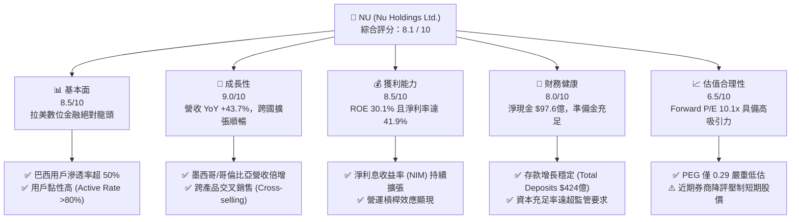
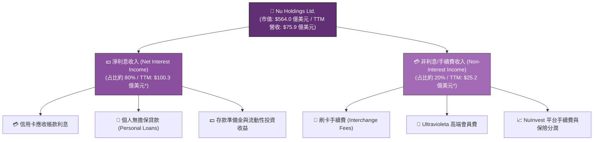

# NU 基本面深度分析報告

> **報告日期**：2026-06-08 ｜ **語言**：繁體中文 ｜ **數據來源**：Yahoo Finance, Finviz, StockAnalysis, Roic.ai ｜ **分析師**：CFA 級機構研究

---

## 目錄

| # | 章節 | 核心結論 |
|---|---|---|
| 1 | **執行摘要** | 評級：**買入 (Buy)**，目標價區間：**$15.00 - $18.50**，當前股價 $11.60 具備高安全邊際。 |
| 2 | **公司概覽與商業模式** | 數位原生銀行巨頭，憑藉低獲客成本與高交叉銷售率，在拉美市場建立強大網路效應與客戶鎖定。 |
| 3 | **損益表深度分析** | 營收維持雙位數強勁增長，淨利潤率高達 41.9%，信用減損撥備為短期利潤主要波動源。 |
| 4 | **資產負債表分析** | 輕資產數位運營模式，擁有 $231.2 億美元充沛現金，淨現金高達 $97.6 億美元，流動性極佳。 |
| 5 | **現金流量深度分析** | 營運現金流與 FCF 連年轉正且大幅增長，資本配置聚焦於拉美新興市場（墨西哥、哥倫比亞）擴張。 |
| 6 | **獲利能力與資本效率** | ROE 高達 30.1%，遠超 12.45% 的股權成本，經濟價值增加（EVA）顯著，強力創造股東價值。 |
| 7 | **估值深度分析** | Forward P/E 僅 10.1x，相較於歷史區間與拉美同業，估值已過度修正，PEG 0.29 顯示極具吸引力。 |
| 8 | **成長催化劑** | 墨西哥與哥倫比亞市場加速滲透、Ultravioleta 高端信用卡發行、以及 Nubank+ 生態系變現。 |
| 9 | **風險矩陣** | 核心風險在於拉美總體經濟波動、資產品質惡化（壞帳率上升）以及近期券商下調評級的市場情緒壓力。 |
| 10 | **投資建議** | 綜合評分 **8.1 / 10**。當前股價已反映多數利空，建議在 $11.00 - $12.00 區間分批佈局。 |

---

## 1. 執行摘要

### 1.1 核心評分儀表板



### 1.2 評分進度條視覺化

```
╔══════════════════════════════════════════════════════════════╗
║                NU 多維度評分儀表板 (1-10分)                 ║
╠══════════════════════════════════════════════════════════════╣
║ 基本面強度  8.5 ▓▓▓▓▓▓▓▓▓▓▓▓▓▓▓▓▓░░░  ★★★★☆           ║
║ 成長動能    9.0 ▓▓▓▓▓▓▓▓▓▓▓▓▓▓▓▓▓▓░░  ★★★★★           ║
║ 獲利品質    8.5 ▓▓▓▓▓▓▓▓▓▓▓▓▓▓▓▓▓░░░  ★★★★☆           ║
║ 財務健康    8.0 ▓▓▓▓▓▓▓▓▓▓▓▓▓▓▓▓░░░░  ★★★★☆           ║
║ 估值合理性  6.5 ▓▓▓▓▓▓▓▓▓▓▓▓░░░░░░░░  ★★★☆☆           ║
║ 護城河深度  8.5 ▓▓▓▓▓▓▓▓▓▓▓▓▓▓▓▓▓░░░  ★★★★☆           ║
║ 管理層執行  8.0 ▓▓▓▓▓▓▓▓▓▓▓▓▓▓▓▓░░░░  ★★★★☆           ║
║ 技術創新力  9.0 ▓▓▓▓▓▓▓▓▓▓▓▓▓▓▓▓▓▓░░  ★★★★★           ║
╠══════════════════════════════════════════════════════════════╣
║ 綜合總分    8.1 ▓▓▓▓▓▓▓▓▓▓▓▓▓▓▓▓░░░░  🏆 成長型金融科技先鋒║
╚══════════════════════════════════════════════════════════════╝
```

### 1.3 投資論點與核心風險

| 類型 | 項目 | 具體依據 | 信心度 |
|------|------|----------|--------|
| 🟢 **投資論點①** | **極致的低成本營運優勢** | 數位原生無實體分行，獲客成本 (CAC) 僅為傳統銀行的 10-20%，單一客戶服務成本極低，營運槓桿效應顯著。 | 🟢 極高 |
| 🟢 **投資論點②** | **跨國擴張（墨西哥與哥倫比亞）** | 墨西哥與哥倫比亞的存款與用戶數呈指數級增長，複製巴西成功模式，TAM 空間擴大一倍。 | 🟢 高 |
| 🟢 **投資論點③** | **ARPU 提升與交叉銷售** | 隨著產品線（Nubank+, Ultravioleta, 投資、保險）完善，每用戶平均收入 (ARPU) 持續增長，客戶黏性極強。 | 🟢 高 |
| 🟡 **風險①** | **拉美信貸週期與壞帳風險** | 巴西與墨西哥的高利率環境可能導致零售信貸與信用卡違約率上升，Provision for Credit Losses 增加。 | 🟡 中度 |
| 🔴 **風險②** | **短期市場情緒與券商降評** | 近期（2026年6月初）美銀（BofA）下調至 Underperform，Susquehanna 下調至 Neutral，壓制股價至 52 周低點附近。 | 🔴 高衝擊 |

### 1.4 快速統計卡片

| 指標 | NU 實際值 (TTM) | 拉美銀行業均值 | S&P 500 金融板塊均值 | 狀態 |
|------|-------------|----------|--------------|------|
| **收入 YoY 成長** | **43.7%** | ~8.5% | ~6.2% | 🟢 卓越 |
| **淨利率** | **41.9%** | ~22.0% | ~18.5% | 🟢 極強 |
| **ROE** | **30.1%** | ~16.5% | ~12.0% | 🟢 極強 |
| **ROA** | **4.8%** | ~1.5% | ~1.1% | 🟢 卓越 |
| **Forward P/E** | **10.13x** | ~8.5x | ~14.5x | 🟢 具吸引力 |
| **P/B Ratio** | **4.48x** | ~1.5x | ~2.1x | 🔴 溢價較高 |

### 1.5 投資結論

```
╔══════════════════════════════════════════════════════════════════╗
║                    📊 NU 投資結論摘要                            ║
╠══════════════════════════════════════════════════════════════════╣
║  評級：🟢 買入 (Buy)                                            ║
║  當前股價：$11.60 (截至 2026-06-08)                             ║
║  目標價區間：                                                    ║
║    悲觀情境：$10.00 (-13.8%) - 壞帳率失控，拉美經濟陷入衰退      ║
║    基準情境：$16.50 (+42.2%) - 12個月主要目標 (Forward P/E 15x)  ║
║    樂觀情境：$20.00 (+72.4%) - 墨西哥市場提前轉盈，ARPU 超預期   ║
║  投資評分：8.1 / 10                                              ║
║  適合投資人：積極成長型、長線佈局金融科技 (Fintech) 的投資者     ║
╚══════════════════════════════════════════════════════════════════╝
```

---

## 2. 公司概覽與商業模式

### 2.1 業務結構與收入來源

Nu Holdings (Nubank) 是全球最大的數位金融平台之一。其業務結構打破了傳統銀行的物理壁壘，以 App 為核心，提供全方位的數位金融服務。


*\*註：StockAnalysis 數據顯示 Revenues Before Loan Losses (未扣除信用減損撥備) 為 $125.4 億美元，其中 Net Interest Income 為 $100.3 億美元，Non-Interest Income 為 $25.2 億美元。*

### 2.2 市場份額

在巴西（Nubank 的大本營），其用戶數已突破 9000 萬，佔巴西成年人口的 50% 以上。以下為拉美主要數位金融與金融科技平台在活躍用戶（Active Users）維度的市場份額估算：

```mermaid
pie title 拉美主要金融科技與數位銀行活躍用戶份額估算 (2026)
    "Nubank (NU)" : 55
    "Mercado Pago (MELI)" : 25
    "Inter (INTR