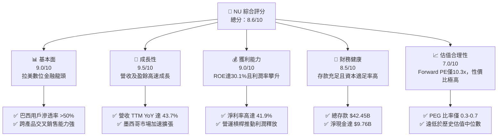
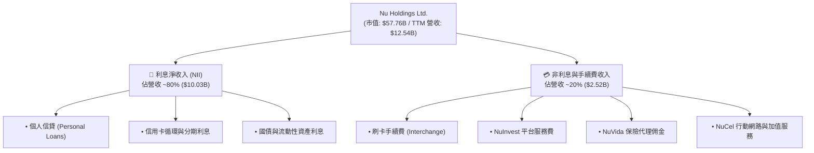
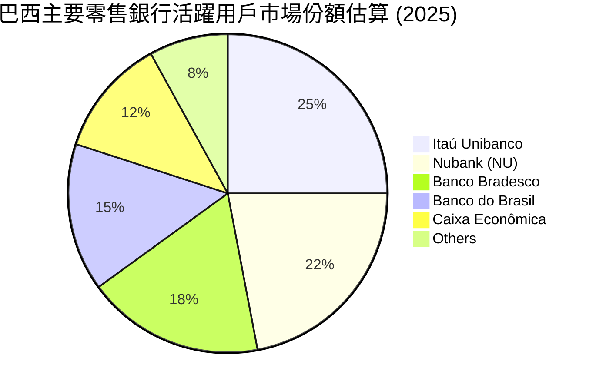
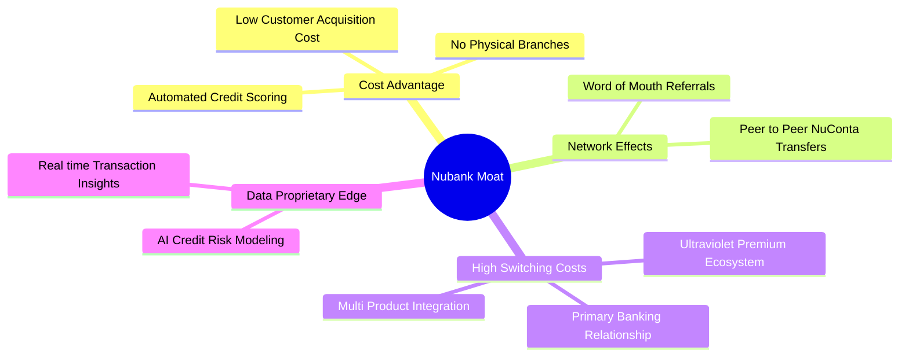

# NU 基本面深度分析報告
> **報告日期**：2026-06-09 ｜ **語言**：繁體中文 ｜ **數據來源**：Yahoo Finance, Finviz, StockAnalysis, Roic.ai ｜ **分析師**：CFA 級機構研究

---

## 目錄

| # | 章節 | 核心結論 |
|---|------|----------|
| 1 | [執行摘要](#1-執行摘要) | **買入** 評級，目標價 **$18.48**，具備 55.6% 潛在上升空間。 |
| 2 | [公司概覽與商業模式](#2-公司概覽與商業模式) | 數位原生銀行顛覆拉丁美洲傳統金融，極低獲客成本構築強大護城河。 |
| 3 | [損益表深度分析](#3-損益表深度分析) | 營收 YoY 成長 43.7%，淨利率高達 41.9%，規模效應顯現。 |
| 4 | [資產負債表分析](#4-資產負債表分析) | 存款基礎穩健（$42.45B），淨現金充足（$9.76B），流動性風險極低。 |
| 5 | [現金流量深度分析](#5-現金流量深度分析) | 營運現金流轉正且快速增長，資本配置聚焦墨西哥與哥倫比亞擴張。 |
| 6 | [獲利能力與資本效率](#6-獲利能力與資本效率) | ROE 達 30.1%，ROIC 顯著超越 WACC，強力創造股東價值。 |
| 7 | [估值深度分析](#7-估值深度分析) | Forward P/E 僅 10.37x，相較高成長性而言估值具有極高吸引力。 |
| 8 | [成長催化劑](#8-成長催化劑) | 墨西哥與哥倫比亞市場滲透、高淨值 Ultraviolet 信用卡及信貸擴張。 |
| 9 | [風險矩陣](#9-風險矩陣) | 拉美總體經濟波動與資產品質惡化為主要風險，撥備充足可提供緩衝。 |
| 10 | [投資建議](#10-投資建議) | 當前股價接近 52 週低點，為長線投資人極佳的非對稱性佈局時點。 |

---

## 1. 執行摘要

Nu Holdings Ltd. (NU) 作為全球最大的數位金融平台之一，正以顛覆性的低成本營運模式重塑拉丁美洲（特別是巴西、墨西哥與哥倫比亞）的零售銀行業生態。儘管近期受到華爾街部分機構（如美銀、Susquehanna）因短期宏觀不確定性而下調評級的壓制，導致股價回檔至 $11.88，但本機構認為，這為長線投資人創造了極佳的買入機會。

### 1.1 核心評分儀表板



### 1.2 評分進度條視覺化

```
╔══════════════════════════════════════════════════════════════╗
║                NU 多維度評分儀表板 (1-10分)                 ║
╠══════════════════════════════════════════════════════════════╣
║ 基本面強度  9.0 ▓▓▓▓▓▓▓▓▓▓▓▓▓▓▓▓▓▓░░  ★★★★★           ║
║ 成長動能    9.5 ▓▓▓▓▓▓▓▓▓▓▓▓▓▓▓▓▓▓▓░  ★★★★★           ║
║ 獲利品質    9.0 ▓▓▓▓▓▓▓▓▓▓▓▓▓▓▓▓▓▓░░  ★★★★★           ║
║ 財務健康    8.5 ▓▓▓▓▓▓▓▓▓▓▓▓▓▓▓▓░░░░  ★★★★☆           ║
║ 估值合理性  7.0 ▓▓▓▓▓▓▓▓▓▓▓▓▓▓░░░░░░  ★★★★☆           ║
║ 護城河深度  8.8 ▓▓▓▓▓▓▓▓▓▓▓▓▓▓▓▓▓▓░░  ★★★★★           ║
║ 管理層執行  9.0 ▓▓▓▓▓▓▓▓▓▓▓▓▓▓▓▓▓▓░░  ★★★★★           ║
║ 技術創新力  9.5 ▓▓▓▓▓▓▓▓▓▓▓▓▓▓▓▓▓▓▓░  ★★★★★           ║
╠══════════════════════════════════════════════════════════════╣
║ 綜合總分    8.6 ▓▓▓▓▓▓▓▓▓▓▓▓▓▓▓▓▓░░░  🏆 強烈推薦買入       ║
╚══════════════════════════════════════════════════════════════╝
```

### 1.3 五大投資論點 + 三大核心風險

| 類型 | 項目 | 具體依據 | 信心度 |
|------|------|----------|--------|
| 🟢 **投資論點①** | **顛覆性的低成本結構** | 數位原生營運使 NU 的單一客戶服務成本僅為傳統銀行的 15%，具備無可複製的定價優勢。 | 🟢 極高 |
| 🟢 **投資論點②** | **極高的客戶黏性與交叉銷售** | ARPAC（每位活躍用戶平均營收）持續上升，且客戶獲取成本（CAC）保持在極低水平。 | 🟢 極高 |
| 🟢 **投資論點③** | **墨西哥與哥倫比亞的複製成功** | 墨西哥存款與貸款業務增速超越巴西同期，正成為公司的第二成長曲線。 | 🟢 高 |
| 🟢 **投資論點④** | **營運槓桿帶來利潤爆發** | 隨著規模擴大，非利息費用率持續下降，推動 TTM 淨利潤達到 $3.19B。 | 🟢 極高 |
| 🟢 **投資論點⑤** | **極具吸引力的估值窪地** | Forward P/E 僅 10.37x，對比 35% 以上的長期 EPS 複合成長率，PEG 僅 0.3-0.7。 | 🟢 高 |
| 🟡 **風險①** | **拉美總體經濟與利率週期** | 巴西與墨西哥的降息週期可能壓縮淨利差（NIM），影響利息收入。 | 🟡 中度 |
| 🔴 **風險②** | **資產品質與壞帳撥備上升** | 信貸擴張可能導致不履約貸款（NPL）比例上升，增加信用損失撥備。 | 🔴 高衝擊 |
| 🟡 **風險③** | **監管政策與競爭加劇** | 當地央行對數位銀行監管趨嚴，且傳統銀行加大數位化轉型力度。 | 🟡 中度 |

### 1.4 快速統計卡片

| 指標 | NU 實際值 | 行業均值（拉美金融） | S&P 500 均值 | 狀態 |
|------|-------------|----------------------|--------------|------|
| **收入 YoY 成長** | **43.7%** | ~8.5% | ~5.2% | 🟢 領先 |
| **淨利率** | **41.9%** | ~18.5% | ~12.0% | 🟢 極強 |
| **ROE** | **30.1%** | ~14.0% | ~15.5% | 🟢 頂尖 |
| **ROA** | **4.8%** | ~1.2% | ~1.8% | 🟢 優秀 |
| **Forward P/E** | **10.37x** | ~9.5x | ~21.5x | 🟢 便宜 |
| **PEG Ratio** | **0.30x** | ~1.1x | ~1.8x | 🟢 極具吸引力 |

### 1.5 投資結論

```
╔══════════════════════════════════════════════════════════════════╗
║                    📊 NU 投資結論摘要                            ║
╠══════════════════════════════════════════════════════════════════╣
║  評級：🟢 強烈買入 (Strong Buy)                                  ║
║  當前股價：$11.88                                                ║
║  目標價區間：                                                    ║
║    悲觀情境：$10.00 (-15.8%）                                    ║
║    基準情境：$18.48 (+55.6%） ← 12個月主要目標                  ║
║    樂觀情境：$22.00 (+85.2%）                                    ║
║  投資評分：8.6/10                                                ║
║  適合投資人：成長型、長線科技與金融科技（FinTech）投資者         ║
╚══════════════════════════════════════════════════════════════════╝
```

---

## 2. 公司概覽與商業模式

Nu Holdings Ltd. 是拉丁美洲金融科技革命的領航者。公司以「Nubank」為品牌，透過純數位化平台，提供無手續費的信用卡、行動支付、儲蓄帳戶、投資及個人貸款等服務。

### 2.1 業務結構與收入來源

NU 的商業模式建立在「低成本獲客、高效留存、多產品交叉銷售」的飛輪效應之上。其收入主要分為兩大類：
1. **利息淨收入 (Net Interest Income, NII)**：來自信用卡分期、個人貸款以及現金存款與投資的利差。
2. **非利息收入 (Non-Interest Income)**：來自商戶刷卡手續費（Interchange Fees）、理財產品分銷、保險代理及輔助服務。



### 2.2 市場份額

在巴西，Nubank 已擁有超過 9000 萬用戶，滲透了巴西成年人口的 50% 以上，成為巴西乃至拉美市場份額增長最快的金融機構。



### 2.3 競爭護城河分析



### 2.4 護城河強度評分

```
╔══════════════════════════════════════════════════════════════╗
║                    NU 護城河強度評分                         ║
╠══════════════════════════════════════════════════════════════╣
║ 成本優勢      9.5/10  ▓▓▓▓▓▓▓▓▓▓▓▓▓▓▓▓▓▓▓░  🏆 極深        ║
║ 數據與 AI 篩選8.8/10  ▓▓▓▓▓▓▓▓▓▓▓▓▓▓▓▓▓░░░  🟢 強大        ║
║ 客戶轉移成本  8.0/10  ▓▓▓▓▓▓▓▓▓▓▓▓▓▓▓░░░░░  🟢 穩固        ║
║ 品牌與網絡效應9.0/10  ▓▓▓▓▓▓▓▓▓▓▓▓▓▓▓▓▓▓░░  🏆 極強        ║
╠══════════════════════════════════════════════════════════════╣
║ 綜合護城河評估8.8/10  ▓▓▓▓▓▓▓▓▓▓▓▓▓▓▓▓▓▓░░  🏆 寬廣護城河   ║
╚══════════════════════════════════════════════════════════════╝
```

---

## 3. 損益表深度分析

### 3.1 年度收入成長趨勢（近4年）

NU 的營業收入在過去四年中呈現指數級增長，從 2022 年的 $2.97B 增長至 2025 年的 $10.63B，CAGR（複合年均增長率）高達 53.0%。

```
╔══════════════════════════════════════════════════════════════════╗
║                  NU 年度總收入趨勢 (FY2022 - FY2025)             ║
╠══════════════════════════════════════════════════════════════════╣
║                                                                  ║
║  FY2022  $2.97B   ██████░░░░░░░░░░░░░░░░░░░░░░  YoY: +116.4% 🟢  ║
║  FY