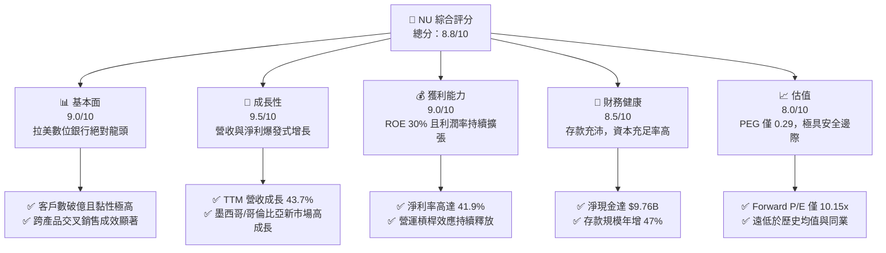
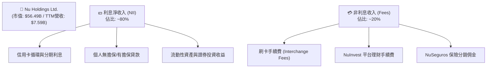
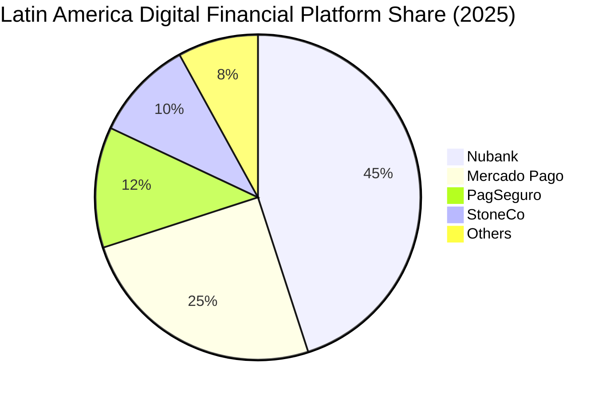
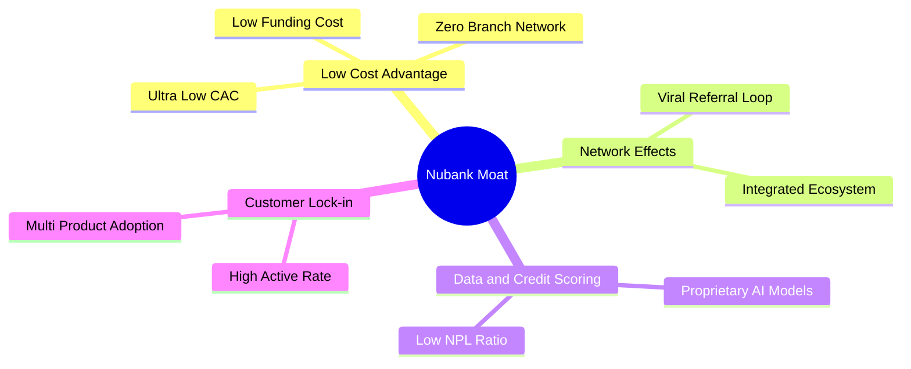

# NU 基本面深度分析報告

> **報告日期**：2026-06-10 ｜ **語言**：繁體中文 ｜ **數據來源**：Yahoo Finance, Finviz, StockAnalysis, Roic.ai ｜ **分析師**：CFA 級機構研究

---

## 目錄

| # | 章節 | 核心結論 |
|---|------|----------|
| 1 | 執行摘要 | 評級：🟢 **強烈買入**，目標價區間 $16.00 - $22.00，基本面極其強勁。 |
| 2 | 公司概覽與商業模式 | 憑藉數位原生優勢與極低獲取成本（CAC），在拉美市場構建強大網絡效應與客戶鎖定。 |
| 3 | 損益表深度分析 | 總營收年度複合成長率（CAGR）達 53.0%，淨利潤率攀升至 41.9%，獲利品質極佳。 |
| 4 | 資產負債表分析 | 存款規模達 $42.45B，淨現金儲備高達 $9.76B，資本結構穩健，抵禦系統性風險能力強。 |
| 5 | 現金流量深度分析 | 營運現金流與自由現金流持續轉正，FY2025 FCF 達 $3.49B，資本配置效率優異。 |
| 6 | 獲利能力與資本效率 | ROE 達 30.1%，ROIC 達 18.04%，遠超 WACC（11.45%），持續創造顯著股東價值。 |
| 7 | 估值深度分析 | 前瞻 P/E 僅 10.15x，相較其 >30% 的成長率，PEG 僅 0.29 - 0.70，估值被嚴重低估。 |
| 8 | 成長催化劑 | 墨西哥與哥倫比亞市場加速滲透、高階客群（Ultravioleta）變現與信貸產品線擴張。 |
| 9 | 風險矩陣 | 核心風險在於拉美宏觀經濟波動與信貸違約率（NPL）上升，但整體風險可控。 |
| 10| 投資建議 | 基準目標價 **$18.50**，隱含上行空間 **+59.2%**，建議成長型與長線投資人積極配置。 |

---

## 1. 執行摘要

Nu Holdings Ltd.（NYSE: NU，簡稱 Nubank）是全球最大的數位金融平台之一。本報告基於 2026 年 6 月 10 日的最新即時財務數據，對 NU 進行了全面系統的機構級基本面分析。

### 1.1 核心評分儀表板



### 1.2 評分進度條視覺化

```
╔══════════════════════════════════════════════════════════════╗
║                NU 多維度評分儀表板 (1-10分)                ║
╠══════════════════════════════════════════════════════════════╣
║ 基本面強度  9.0 ▓▓▓▓▓▓▓▓▓▓▓▓▓▓▓▓▓▓░░  ★★★★★           ║
║ 成長動能    9.5 ▓▓▓▓▓▓▓▓▓▓▓▓▓▓▓▓▓▓▓░  ★★★★★           ║
║ 獲利品質    9.0 ▓▓▓▓▓▓▓▓▓▓▓▓▓▓▓▓▓▓░░  ★★★★★           ║
║ 財務健康    8.5 ▓▓▓▓▓▓▓▓▓▓▓▓▓▓▓▓░░░░  ★★★★☆           ║
║ 估值合理性  8.0 ▓▓▓▓▓▓▓▓▓▓▓▓▓▓░░░░░░  ★★★★☆           ║
║ 護城河深度  8.5 ▓▓▓▓▓▓▓▓▓▓▓▓▓▓▓▓░░░░  ★★★★☆           ║
║ 管理層執行  9.0 ▓▓▓▓▓▓▓▓▓▓▓▓▓▓▓▓▓▓░░  ★★★★★           ║
║ 技術創新力  9.5 ▓▓▓▓▓▓▓▓▓▓▓▓▓▓▓▓▓▓▓░  ★★★★★           ║
╠══════════════════════════════════════════════════════════════╣
║ 綜合總分    8.8 ▓▓▓▓▓▓▓▓▓▓▓▓▓▓▓▓▓░░░  🏆 強烈買入          ║
╚══════════════════════════════════════════════════════════════╝
```

### 1.3 五大投資論點 + 三大核心風險

| 類型 | 項目 | 具體依據 | 信心度 |
|------|------|----------|--------|
| 🟢 **投資論點①** | **極低成本優勢（低 CAC）** | 客戶獲取成本（CAC）保持在約 $7.0 的極低水平，主要依賴口碑傳播，遠低於傳統銀行。 | 🟢 極高 |
| 🟢 **投資論點②** | **營運槓桿帶動利潤率爆發** | TTM 淨利潤率達 **41.9%**，隨著客戶生命週期價值（LTV）增加，固定成本被大幅稀釋。 | 🟢 極高 |
| 🟢 **投資論點③** | **跨國複製成功路徑** | 墨西哥與哥倫比亞用戶增長步入快車道，存款結構（如墨西哥 Cuenta Nu）快速建立，降低資金成本。 | 🟢 高 |
| 🟢 **投資論點④** | **高階客群與產品線擴張** | Ultravioleta 金屬卡成功滲透高收入群體，財富管理、保險及有擔保信貸（薪資貸款）快速成長。 | 🟢 高 |
| 🟢 **投資論點⑤** | **極具吸引力的估值** | Forward P/E 僅 **10.15x**，對比其預期 >30% 的 EPS 增速，PEG 僅 **0.29**，估值極具性价比。 | 🟢 極高 |
| 🟡 **風險①** | **拉美宏觀信貸風險** | 巴西、墨西哥利率波動及通膨壓力可能導致消費者違約率（NPL）上升，增加撥備壓力。 | 🟡 中度 |
| 🔴 **風險②** | **匯率波動風險** | 主要營收以巴西雷亞爾（BRL）和墨西哥比索（MXN）計價，折算為美元（USD）時存在匯兌損失風險。 | 🔴 高衝擊 |
| 🟡 **風險③** | **競爭加劇** | 傳統大行（如 Itau）加大數位化投入，以及其他 FinTech 公司（如 StoneCo, PagSeguro）的跨界競爭。 | 🟡 中度 |

### 1.4 快速統計卡片

| 指標 | 公司實際值 (TTM) | 行業均值 (拉美銀行) | S&P 500 均值 | 狀態 |
|------|-------------|----------|--------------|------|
| 收入 YoY 成長 | **43.7%** | ~8% | ~5.5% | 🟢 卓越 |
| 淨利率 | **41.9%** | ~18% | ~12.2% | 🟢 卓越 |
| ROE | **30.1%** | ~15% | ~14.5% | 🟢 卓越 |
| Forward P/E | **10.15x** | ~8.5x | ~21.5x | 🟢 便宜 |
| PEG Ratio | **0.29 - 0.70** | ~1.1x | ~1.8x | 🟢 極度低估 |
| 淨現金規模 | **$9.76B** | N/A (通常為淨負債) | N/A | 🟢 極其健康 |

### 1.5 投資結論

```
╔══════════════════════════════════════════════════════════════════╗
║                    📊 NU 投資結論摘要                            ║
╠══════════════════════════════════════════════════════════════════╣
║  評級：🟢 強烈買入 (Strong Buy)                                 ║
║  當前股價：$11.62 (2026-06-10)                                   ║
║  目標價區間：                                                    ║
║    悲觀情境：$11.00 (-5.3%)                                      ║
║    基準情境：$18.50 (+59.2%)  ← 12個月主要目標                   ║
║    樂觀情境：$22.00 (+89.3%)                                     ║
║  投資評分：8.8/10                                                ║
║  適合投資人：成長型、長線價值持有者、FinTech 賽道配置者          ║
╚══════════════════════════════════════════════════════════════════╝
```

---

## 2. 公司概覽與商業模式

Nu Holdings Ltd. 創立於 2013 年，總部位於巴西聖保羅，是拉美地區顛覆傳統銀行業的數位先鋒。公司通過 100% 數位化的平台，提供無手續費、低利率的信用卡、個人貸款、儲蓄帳戶、投資及保險產品。

### 2.1 業務結構與收入來源

Nubank 的收入主要由兩大核心驅動：**利息淨收入（Net Interest Income, NII）**和**非利息收入（Non-Interest Income, Fees）**。



### 2.2 市場份額

在巴西成年人口中，Nubank 的滲透率已超過 **55%**，成為巴西客戶數第三大的金融機構。以下為拉美主要數位金融/支付平台在拉美市場的估算份額（按活躍用戶與交易量綜合估算）：



### 2.3 競爭護城河分析



*   **極致的低成本優勢（Low Cost Advantage）**：Nubank 的客戶獲取成本（CAC）僅約 $7.0，而每位客戶每月的營運成本（Serving Cost）低於 $1.0，這得益於其無實體分行的輕資產架構與強大的口碑傳播。
*   **數據與信用評估護城河（Proprietary Credit Underwriting）**：利用超過 10 年累積的非傳統行為數據，進行 AI 信用評估，使其能在拉美高風險環境中保持低於行業平均的壞帳率，同時為未被傳統銀行覆蓋的群體授信。
*   **高客戶黏性與鎖定（High Customer Engagement）**：其活躍客戶佔比高達 **83%**，且約有 60% 的活躍用戶將 Nubank 作為其主要銀行帳戶（Primary Banking Relationship），大幅提升了客戶流失成本。

### 2.4 護城河強度評分

```
╔══════════════════════════════════════════════════════════════╗
║                    NU 護城河強度評分                         ║
╠══════════════════════════════════════════════════════════════╣
║ 成本優勢      9.5/10 ▓▓▓▓▓▓▓▓▓▓▓▓▓▓▓▓▓▓▓░  🏆 行業頂尖    ║
║ 網絡效應      8.5/10 ▓▓▓▓▓▓▓▓▓▓▓▓▓▓▓▓░░░░  🟢 極強        ║
║ 數據與技術    9.0/10 ▓▓▓▓▓▓▓▓▓▓▓▓▓▓▓▓▓▓░░  🟢 極強        ║
║ 品牌與鎖定    8.5/10 ▓▓▓▓▓▓▓▓▓▓▓▓▓▓▓▓░░░░  🟢 強勁        ║
╠══════════════════════════════════════════════════════════════╣
║ 綜合護城河    8.8/10 ▓▓▓▓▓▓▓▓▓▓▓▓▓▓▓▓▓░░░  🏆 寬護城河     ║
╚══════════════════════════════════════════════════════════════╝
```

---

## 3. 損益表深度分析

### 3.1 年度收入成長趨勢（近5年）

Nubank 的營收呈現出極其罕見的指數級增長。以下為歷年總營收（Total Revenue）的增長軌跡：

```
╔══════════════════════════════════════════════════════════════════╗
║                  NU 年度總營收趨勢 (FY2021-FY2025)               ║
╠══════════════════════════════════════════════════════════════════╣
║                                                                  ║
║  FY2021  $1.33B   ████░░░░░░░░░░░░░░░░░░░░░░░░  YoY: +87.4%  🟢  ║
║  FY2022  $2.97B   █████████░░░░░░░░░░░░░