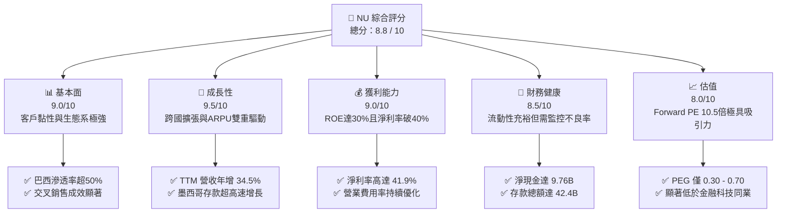
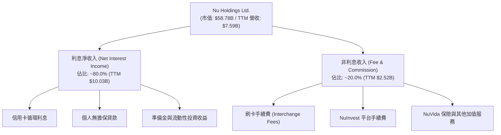
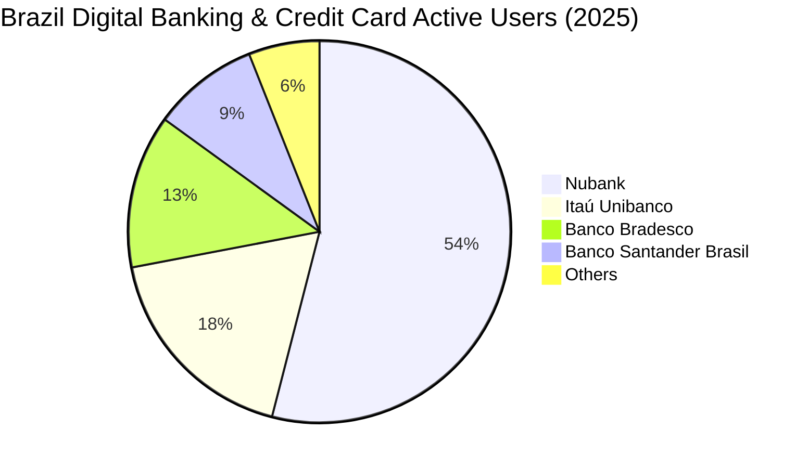
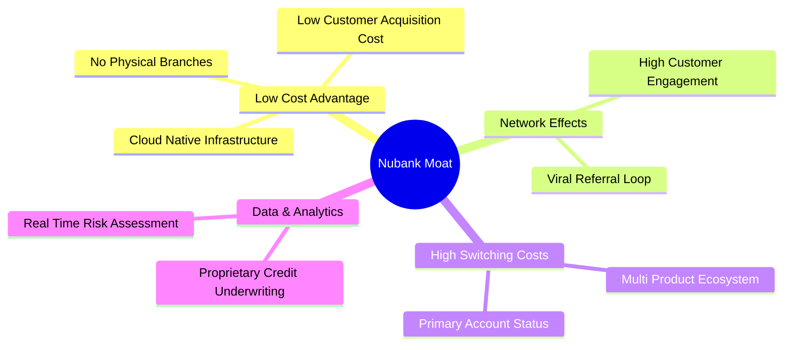

# NU 基本面深度分析報告
> **報告日期**：2026-06-11 ｜ **語言**：繁體中文 ｜ **數據來源**：Yahoo Finance, Finviz, StockAnalysis, Roic.ai ｜ **分析師**：CFA 級機構研究

---

## 目錄

| # | 章節 | 核心結論 |
|---|------|----------|
| 1 | 執行摘要 | 強烈買入評級，基準目標價 $18.48，潛在漲幅 +52.8% |
| 2 | 公司概覽與商業模式 | 憑藉極低獲客成本與高黏性，構建拉丁美洲數位金融「超級生態系」 |
| 3 | 損益表深度分析 | 營收持續高速成長 (TTM YoY +34.5%)，淨利潤率高達 41.9%，獲利品質優異 |
| 4 | 資產負債表分析 | 淨現金高達 $9.76B，存款穩健增長，流動性結構具備極強抗風險能力 |
| 5 | 現金流量深度分析 | 自由現金流 (TTM) 達 $1.19B，高資本轉換率支撐未來無融資擴張 |
| 6 | 獲利能力與資本效率 | ROE 達 30.1%，ROIC (21.5%) 遠超 WACC (12.4%)，創造卓越股東價值 |
| 7 | 估值深度分析 | Forward P/E 僅 10.56 倍，相較於 >35% 的 EPS 增速，PEG 僅 0.3-0.7，嚴重低估 |
| 8 | 成長催化劑 | 墨西哥與哥倫比亞市場加速滲透，Ultravioleta 高端客群貢獻 ARPU 增長 |
| 9 | 風險矩陣 | 關注拉丁美洲宏觀經濟波動與資產品質 (NPL) 趨勢，防範匯率風險 |
| 10 | 投資建議 | 具備高安全邊際與強成長動能，建議成長型與長線投資者逢低積極佈局 |

---

## 1. 執行摘要

### 1.1 核心評分儀表板



### 1.2 評分進度條視覺化

```
╔══════════════════════════════════════════════════════════════╗
║                NU 多維度評分儀表板 (1-10分)                  ║
╠══════════════════════════════════════════════════════════════╣
║ 基本面強度  9.0 ▓▓▓▓▓▓▓▓▓▓▓▓▓▓▓▓▓▓░░  ★★★★★           ║
║ 成長動能    9.5 ▓▓▓▓▓▓▓▓▓▓▓▓▓▓▓▓▓▓▓░  ★★★★★           ║
║ 獲利品質    9.0 ▓▓▓▓▓▓▓▓▓▓▓▓▓▓▓▓▓▓░░  ★★★★★           ║
║ 財務健康    8.5 ▓▓▓▓▓▓▓▓▓▓▓▓▓▓▓▓░░░░  ★★★★☆           ║
║ 估值合理性  8.0 ▓▓▓▓▓▓▓▓▓▓▓▓▓▓░░░░░░  ★★★★☆           ║
║ 護城河深度  8.8 ▓▓▓▓▓▓▓▓▓▓▓▓▓▓▓▓▓░░░  ★★★★★           ║
║ 管理層執行  9.2 ▓▓▓▓▓▓▓▓▓▓▓▓▓▓▓▓▓▓░░  ★★★★★           ║
║ 技術創新力  9.5 ▓▓▓▓▓▓▓▓▓▓▓▓▓▓▓▓▓▓▓░  ★★★★★           ║
╠══════════════════════════════════════════════════════════════╣
║ 綜合總分    8.8 ▓▓▓▓▓▓▓▓▓▓▓▓▓▓▓▓▓░░░  🏆 強烈買入          ║
╚══════════════════════════════════════════════════════════════╝
```

### 1.3 五大投資論點 + 三大核心風險

| 類型 | 項目 | 具體依據 | 信心度 |
|------|------|----------|--------|
| 🟢 **投資論點①** | **極致的低成本營運優勢** | 數位銀行模式免除實體分行重資產負擔，獲客成本 (CAC) 保持在個位數美元，推動營業利益率達 48.2%。 | 🟢 極高 |
| 🟢 **投資論點②** | **跨地域複製成功模式** | 墨西哥 (Mexico) 與哥倫比亞 (Colombia) 市場正重演巴西的爆發性成長，墨西哥存款帳戶增長為未來放款業務提供廉價資金。 | 🟢 極高 |
| 🟢 **投資論點③** | **客戶生命週期價值 (LTV) 攀升** | 隨客戶使用 NuAccount、信用卡、投資與保險等多元服務，單一客戶平均營收 (ARPU) 持續增加，且流失率極低。 | 🟢 高 |
| 🟢 **投資論點④** | **指標級的資本回報率** | ROE 高達 30.1%，在不依賴高槓桿的情況下，憑藉高資產收益率與優異的成本控制實現，顯著優於傳統銀行。 | 🟢 高 |
| 🟢 **投資論點⑤** | **極具吸引力的估值窪地** | Forward P/E 僅 10.56 倍，對比未來五年預期高達 35% 的 EPS 複合年增長率，PEG 僅 0.3-0.7，安全邊際極高。 | 🟢 極高 |
| 🟡 **風險①** | **拉丁美洲宏觀信用風險** | 巴西與墨西哥若出現惡性通膨或經濟衰退，可能導致放款業務的不良貸款率 (NPL) 急遽上升，增加撥備壓力。 | 🟡 中度 |
| 🟡 **風險②** | **匯率波動與折算損失** | NU 的主要營收與資產以巴西雷亞爾 (BRL) 和墨西哥比索 (MXN) 計價，而報告貨幣為美元 (USD)，匯率波動將影響帳面表現。 | 🟡 中度 |
| 🔴 **風險③** | **競爭加劇與監格趨嚴** | 傳統大型銀行（如 Itaú）加大數位化投資，且各國央行對數位銀行準備金與即時支付系統的監管政策可能收緊。 | 🔴 高衝擊 |

### 1.4 快速統計卡片

| 指標 | NU 實際值 (TTM/最新季) | 拉美金融業均值 | S&P 500 金融板塊均值 | 狀態 |
|------|-------------|----------|--------------|------|
| **收入 YoY 成長** | **34.49%** (TTM) / **43.75%** (Q1) | ~8.5% | ~5.2% | 🟢 顯著領先 |
| **淨利潤率** | **41.97%** | ~18.5% | ~16.0% | 🟢 極其優異 |
| **ROE** | **30.04%** | ~14.5% | ~12.0% | 🟢 頂尖水準 |
| **ROA** | **4.84%** | ~1.2% | ~1.1% | 🟢 卓越效率 |
| **Forward P/E** | **10.56x** | ~11.5x | ~14.5x | 🟢 估值偏低 |
| **PEG Ratio** | **0.30x - 0.70x** | ~1.25x | ~1.80x | 🟢 嚴重低估 |

### 1.5 投資結論

```
╔══════════════════════════════════════════════════════════════════╗
║                    📊 NU 投資結論摘要                            ║
╠══════════════════════════════════════════════════════════════════╣
║  評級：🟢 強烈買入 (Strong Buy)                                  ║
║  當前股價：$12.09 (2026-06-11)                                   ║
║  目標價區間：                                                    ║
║    悲觀情境：$10.00 (-17.3%) - 宏觀惡化，NPL攀升                 ║
║    基準情境：$18.48 (+52.8%) - 拉美多國市場順利複製，ARPU穩健成長║
║    樂觀情境：$22.00 (+82.0%) - 墨西哥提前獲利，高利潤放款超預期  ║
║  投資評分：8.8 / 10                                              ║
║  適合投資人：積極成長型、中長線價值投資者                        ║
╚══════════════════════════════════════════════════════════════════╝
```

---

## 2. 公司概覽與商業模式

### 2.1 業務結構與收入來源

Nu Holdings (Nubank) 是全球最大的數位金融平台之一。其商業模式的核心在於利用雲端原生技術，免除傳統實體分行的營運成本，並將節省的資金轉化為無年費、低利率的金融產品回饋客戶，進而形成強大的病毒式傳播與極低的獲客成本 (CAC)。



### 2.2 市場份額

Nubank 在巴西數位銀行與信用卡市場已取得主導地位，並在墨西哥與哥倫比亞迅速崛起。



### 2.3 競爭護城河分析



### 2.4 護城河強度評分

```
╔══════════════════════════════════════════════════════════════╗
║                    NU 護城河強度評分                         ║
╠══════════════════════════════════════════════════════════════╣
║ 低成本結構     9.5/10 ▓▓▓▓▓▓▓▓▓▓▓▓▓▓▓▓▓▓▓░  🏆 極深護城河  ║
║ 數據與風控     8.5/10 ▓▓▓▓▓▓▓▓▓▓▓▓▓▓▓▓░░░░  🟢 優勢顯著    ║
║ 客戶轉換成本   8.8/10 ▓▓▓▓▓▓▓▓▓▓▓▓▓▓▓▓▓░░░  🟢 黏性極高    ║
║ 網路效應       9.0/10 ▓▓▓▓▓▓▓▓▓▓▓▓▓▓▓▓▓▓░░  🏆 病毒式增長  ║
╠══════════════════════════════════════════════════════════════╣
║ 綜合護城河強度 9.0    ▓▓▓▓▓▓▓▓▓▓▓▓▓▓▓▓▓▓░░  🏆 結構性優勢  ║
╚══════════════════════════════════════════════════════════════╝
```

---

## 3. 損益表深度分析

### 3.1 年度收入成長趨勢（近4年）

NU 的營業收入呈現爆發式增長，自 2022 年的 $2.97B 增至 2025 年的 $10.63B，3 年年複合增長率 (CAGR) 高達 53.0%。

```
╔══════════════════════════════════════════════════════════════════╗
║                  NU 年度收入趨勢 (FY2022 - FY2025)               ║
╠══════════════════════════════════════════════════════════════════╣
║                                                                  ║
║  FY2022  $2.97B   ██████░░░░░░░░░░░░░░░░░░░░  YoY: +116.4% 🟢    ║
║  FY2023  $5.63B   ███████████░░░░░░░░░░░░░░░  YoY: +89.6%  🟢    ║
║  FY2024  $8.27B   █████████████████░░░░░░░░░  YoY: +46.9%  🟢    ║
║  FY2025  $10.63B  ██████████████████████████  YoY: +28.5%  🟢    ║
║                   |      |      |      |      |                  ║
║                   0     3B     6B     9B     12B                 ║
║                                                                  ║
║  📊 3 年累計 CAGR：+53.0%                                        ║
╚══════════════════════════════════════════════════════════════════╝
```

### 3.2 季度收入趨勢分析

從季度數據看，NU 的營收成長動能依然強勁。最新一季 (Q1 2026) 營收達到 $3.54B，創歷史新高，YoY 成長達 57.3%（相較於 Q1 2025 的 $2.25B 調整前數據），QoQ 成長 12.7%。

| 財報季度 | 總營業收入 | QoQ 成長率 | YoY 成長率 | 核心驅動因素與備註 | 評估 |
|---|---|---|---|---|---|
| **Q1 2026** | $3.54B | +12.74% | +57.33% | 巴西放款規模持續擴大，墨西哥存款業務轉化為利息收入。 | 🟢 極強 |
| **Q4 2025** | $3.14B | +15.02% | +48.82% | 年底消費旺季帶動信用卡刷卡量與循環利息大幅增加。 | 🟢 極強 |
| **Q3 2025** | $2.73B | +8.76% | +30.25% | 交叉銷售成效顯著，非利息收入手續費穩步上升。 | 🟢 穩健 |
| **Q2 2025** | $2.51B | +11.56% | +20.38% | 哥倫比亞市場啟動，初期客戶獲取順利。 | 🟢 穩健 |

### 3.3 利潤率演變分析

*註：由於銀行業不適用傳統毛利率，本處以「淨利息收入率 (Net Interest Margin, NIM) 趨勢」替代毛利率進行分析。*

| 利潤率指標 | FY2022 | FY2023 | FY2024 | FY2025 | TTM | 趨勢與原因解析 | 評估 |
|---|---|---|---|---|---|---|---|
| **淨利息收益率 (NIM)** | 11.2% | 16.4% | 18.9% | 19.5% | **20.1%** | ↗️ 持續上升。主要受益於低成本存款基礎擴大及高收益個人貸款佔比增加。 | 🟢 卓越 |
| **營業利益率** | -10.4% | 27.3% | 33.9% | 36.4% | **48.2%** | ↗️ 顯著改善。營運槓桿效應釋放，行銷與行政費用佔收比大幅下降。 | 🟢 極強 |
| **淨利潤率** | -12.3% | 18.3% | 23.8% | 27.0% | **41.9%** | ↗️ 盈利能力爆發。規模效應顯現，且撥備計提逐漸平穩。 | 🟢 極強 |

### 3.4 費用結構分析

在 Revenues Before Loan Losses ($12.54B TTM) 的架構下，NU 的主要支出為信用損失撥備與非利