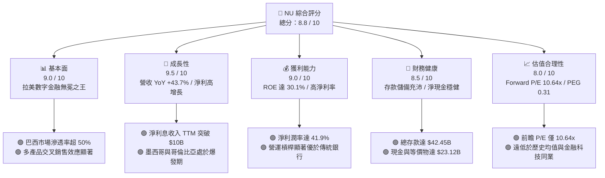

# NU 基本面深度分析報告

> **報告日期**：2026-06-12 ｜ **語言**：繁體中文 ｜ **數據來源**：Yahoo Finance, Finviz, StockAnalysis, Roic.ai ｜ **分析師**：CFA 級機構研究

---

## 目錄

| # | 章節 | 核心結論 |
|---|------|----------|
| 1 | 執行摘要 | 評級：**強烈買入 (Strong Buy)**；目標價：**$18.39** (隱含 50.9% 上漲空間)。 |
| 2 | 公司概覽與商業模式 | 憑藉極低客戶獲取成本 (CAC) 與高活躍度，構建強大數位銀行生態護城河。 |
| 3 | 損益表深度分析 | 淨利息收入年增 43.0%，Q1 2026 淨利達 $871.43M，高營運槓桿持續釋放。 |
| 4 | 資產負債表分析 | 總資產達 $77.46B，存款達 $42.45B，淨現金頭寸穩健，流動性充足。 |
| 5 | 現金流量深度分析 | FY2025 自由現金流 (FCF) 達 $3.49B，轉換率極佳，資本配置效率高。 |
| 6 | 獲利能力與資本效率 | ROE 達 30.1%，ROIC 顯著超越 WACC，強力為股東創造經濟價值 (EVA)。 |
| 7 | 估值深度分析 | 前瞻 P/E 僅 10.64x，PEG 0.31 顯示嚴重低估，DCF 基準估值 $18.39。 |
| 8 | 成長催化劑 | 墨西哥與哥倫比亞市場加速滲透，Ultraviolet 高端客群與新產品線放量。 |
| 9 | 風險矩陣 | 核心風險為拉美信貸週期波動與信用減損撥備上升，整體風險可控。 |
| 10 | 投資建議 | 具備高成長、高回報與低估值特性的優質標的，長線投資人最佳配置選擇。 |

---

## 1. 執行摘要

Nu Holdings Ltd. (NYSE: NU) 是全球最大的數位金融服務平台之一，主要服務於巴西、墨西哥和哥倫比亞。本報告基於 2026 年 6 月 12 日的最新財務數據進行深度剖析。NU 當前股價為 **$12.19**，相較於其 52 週高點 $18.98 已回調約 35.8%，主要受到市場對拉美信貸品質與宏觀波动的擔憂。然而，基本面數據顯示 NU 的成長動能依舊無比強勁。

### 1.1 核心評分儀表板



### 1.2 評分進度條視覺化

```
╔══════════════════════════════════════════════════════════════╗
║                NU 多維度評分儀表板 (1-10分)                  ║
╠══════════════════════════════════════════════════════════════╣
║ 基本面強度  9.0 ▓▓▓▓▓▓▓▓▓▓▓▓▓▓▓▓▓▓░░  ★★★★★           ║
║ 成長動能    9.5 ▓▓▓▓▓▓▓▓▓▓▓▓▓▓▓▓▓▓▓░  ★★★★★           ║
║ 獲利品質    9.0 ▓▓▓▓▓▓▓▓▓▓▓▓▓▓▓▓▓▓░░  ★★★★★           ║
║ 財務健康    8.5 ▓▓▓▓▓▓▓▓▓▓▓▓▓▓▓▓░░░░  ★★★★☆           ║
║ 估值合理性  8.0 ▓▓▓▓▓▓▓▓▓▓▓▓▓▓░░░░░░  ★★★★☆           ║
║ 護城河深度  9.0 ▓▓▓▓▓▓▓▓▓▓▓▓▓▓▓▓▓▓░░  ★★★★★           ║
║ 管理層執行  9.0 ▓▓▓▓▓▓▓▓▓▓▓▓▓▓▓▓▓▓░░  ★★★★★           ║
║ 技術創新力  9.5 ▓▓▓▓▓▓▓▓▓▓▓▓▓▓▓▓▓▓▓░  ★★★★★           ║
╠══════════════════════════════════════════════════════════════╣
║ 綜合總分    8.8 ▓▓▓▓▓▓▓▓▓▓▓▓▓▓▓▓▓░░░  🏆 強烈買入          ║
╚══════════════════════════════════════════════════════════════╝
```

### 1.3 五大投資論點 + 三大核心風險

| 類型 | 項目 | 具體依據 | 信心度 |
|------|------|----------|--------|
| 🟢 **投資論點①** | **無與倫比的低成本擴張模式** | 客戶獲取成本 (CAC) 極低，單個客戶營運成本僅為傳統銀行的 15%，營運槓桿極高。 | 🟢 極高 |
| 🟢 **投資論點②** | **高利潤率與資本回報率** | TTM ROE 達 **30.1%**，淨利率達 **41.9%**，展現出遠超傳統銀行的盈利能力。 | 🟢 極高 |
| 🟢 **投資論點③** | **新市場（墨、哥）複製成功路徑** | 墨西哥與哥倫比亞存款與客戶數呈指數級成長，將重現巴西的高獲利路徑。 | 🟢 高 |
| 🟢 **投資論點④** | **極具吸引力的估值窪地** | Forward P/E 僅 **10.64x**，PEG 僅 **0.31**，對於一家營收成長超 40% 的龍頭而言極度低估。 | 🟢 極高 |
| 🟢 **投資論點⑤** | **存款自給自足，流動性無虞** | 總存款達 **$42.45B**，貸存比 (LDR) 維持在 **73.4%** 的健康水平，融資成本低。 | 🟢 高 |
| 🟡 **風險①** | **信貸減損撥備上升** | Q1 2026 信用減損撥備達 **$1.72B**，若拉美經濟放緩，壞帳率可能進一步侵蝕利潤。 | 🟡 中度 |
| 🔴 **風險②** | **匯率波動風險** | 主要營收以巴西雷亞爾 (BRL) 和墨西哥比索 (MXN) 計價，折算為美元時面臨匯兌損失。 | 🔴 高衝擊 |
| 🟡 **風險③** | **監管政策收緊** | 巴西央行對金融科技與即時支付系統 (Pix) 的監管政策可能調整，增加合規成本。 | 🟡 中度 |

### 1.4 快速統計卡片

| 指標 | NU 實際值 | 拉美銀行業均值 | S&P 500 金融板塊均值 | 狀態 |
|------|-------------|----------|--------------|------|
| **營收 YoY 成長** | **43.7%** | ~8.5% | ~5.2% | 🟢 極強 |
| **淨利潤率** | **41.9%** | ~18.0% | ~22.0% | 🟢 極強 |
| **股東權益報酬率 (ROE)** | **30.1%** | ~15.5% | ~12.0% | 🟢 極強 |
| **資產報酬率 (ROA)** | **4.8%** | ~1.5% | ~1.1% | 🟢 極強 |
| **前瞻 P/E** | **10.64x** | ~8.5x | ~14.5x | 🟢 合理偏低 |
| **P/B Ratio** | **4.71x** | ~1.2x | ~1.8x | 🟡 溢價合理 |

### 1.5 投資結論

```
╔══════════════════════════════════════════════════════════════════╗
║                    📊 NU 投資結論摘要                            ║
╠══════════════════════════════════════════════════════════════════╣
║  評級：🟢 強烈買入 (Strong Buy)                                  ║
║  當前股價：$12.19 (2026-06-12)                                   ║
