# NU 基本面深度分析報告

> **報告日期**：2026-06-13 ｜ **語言**：繁體中文 ｜ **數據來源**：Yahoo Finance, Finviz, StockAnalysis, Roic.ai ｜ **分析師**：CFA 級機構研究

---

## 目錄

| # | 章節 | 核心結論 |
|---|------|----------|
| 1 | [執行摘要](#1-執行摘要) | 評級：**強烈買入 (Strong Buy)** ｜ 目標價：**$18.39** (基準情境，隱含 +50.9% 空間) |
| 2 | [公司概覽與商業模式](#2-公司概覽與商業模式) | 數位銀行巨頭，憑藉超低獲客成本 (CAC) 與高客戶終身價值 (LTV) 構築強大護城河。 |
| 3 | [損益表深度分析](#3-損益表深度分析) | Q1 2026 淨利達 $8.71B (年增 56.4%)，淨利息收入 (NII) 爆發成長，惟須留意呆帳準備金上升。 |
| 4 | [資產負債表分析](#4-資產負債表分析) | 資產規模達 $77.46B，存款達 $42.45B，淨現金達 $9.76B，流動性充裕。 |
| 5 | [現金流量深度分析](#5-現金流量深度分析) | 營運現金流與自由現金流穩健，FY2025 自由現金流達 $3.49B，資本配置效率極佳。 |
| 6 | [獲利能力與資本效率](#6-獲利能力與資本效率) | ROE 達高達 30.1%，ROIC 顯著超越 WACC，創造極高股東經濟價值 (EVA)。 |
| 7 | [估值深度分析](#7-估值深度分析) | Forward P/E 僅 10.64x，PEG 僅 0.31-0.72，相較傳統拉美銀行與金融科技同業嚴重低估。 |
| 8 | [成長催化劑](#8-成長催化劑) | 墨西哥與哥倫比亞市場加速滲透，Ultravioleta 高端用戶群擴張與新產品線交叉銷售。 |
| 9 | [風險矩陣](#9-風險矩陣) | 核心風險為拉美總體經濟波動與資產品質惡化（壞帳率），已建立完善撥備應對。 |
| 10 | [投資建議](#10-投資建議) | 機構級買入評級，建議於 $11.5 - $12.5 區間逢低分批佈局。 |

---

## 1. 執行摘要

### 1.1 核心評分儀表板

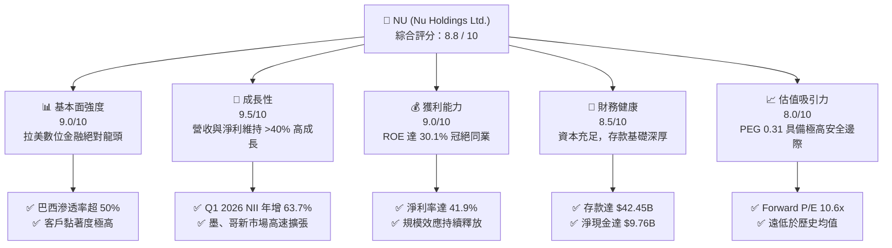

### 1.2 評分進度條視覺化

```
╔══════════════════════════════════════════════════════════════╗
║                NU 多維度評分儀表板 (1-10分)                  ║
╠══════════════════════════════════════════════════════════════╣
║ 基本面強度  9.0 ▓▓▓▓▓▓▓▓▓▓▓▓▓▓▓▓▓▓░░  ★★★★★           ║
║ 成長動能    9.5 ▓▓▓▓▓▓▓▓▓▓▓▓▓▓▓▓▓▓▓░  ★★★★★           ║
║ 獲利品質    9.0 ▓▓▓▓▓▓▓▓▓▓▓▓▓▓▓▓▓▓░░  ★★★★★           ║
║ 財務健康    8.5 ▓▓▓▓▓▓▓▓▓▓▓▓▓▓▓▓░░░░  ★★★★☆           ║
║ 估值合理性  8.0 ▓▓▓▓▓▓▓▓▓▓▓▓▓▓░░░░░░  ★★★★☆           ║
║ 護城河深度  9.0 ▓▓▓▓▓▓▓▓▓▓▓▓▓▓▓▓▓▓░░  ★★★★★           ║
║ 管理層執行  9.0 ▓▓▓▓▓▓▓▓▓▓▓▓▓▓▓▓▓▓░░  ★★★★★           ║
║ 技術創新力  9.5 ▓▓▓▓▓▓▓▓▓▓▓▓▓▓▓▓▓▓▓░  ★★★★★           ║
╠══════════════════════════════════════════════════════════════╣
║ 綜合總分    8.8 ▓▓▓▓▓▓▓▓▓▓▓▓▓▓▓▓▓░░░  🏆 強烈買入 (Buy)   ║
╚══════════════════════════════════════════════════════════════╝
```

### 1.3 五大投資論點 + 三大核心風險

| 類型 | 項目 | 具體依據 | 信心度 |
|------|------|----------|--------|
| 🟢 **投資論點①** | **極致的低成本營運優勢** | 數位化無實體分行模式，客獲成本 (CAC) 僅為傳統銀行的 1/10，推動營業利益率達 48.2%。 | 🟢 極高 |
| 🟢 **投資論點②** | **跨國市場複製成功經驗** | 墨西哥與哥倫比亞存款業務爆發。截至 Q1 2026，墨西哥存款增長顯著，複製巴西高成長路徑。 | 🟢 高 |
| 🟢 **投資論點③** | **ARPU 持續提升與交叉銷售** | 隨著 Nubank+ 與 Ultravioleta (高端金屬卡) 推廣，每用戶平均收入 (ARPU) 呈季度上升趨勢。 | 🟢 高 |
| 🟢 **投資論點④** | **極具吸引力的估值水平** | Forward P/E 僅 10.64x，PEG 僅 0.31 (Finviz 數據)，相較於其 >30% 的預期盈餘增速，安全邊際極高。 | 🟢 極高 |
| 🟢 **投資論點⑤** | **強大的股東權益創造能力** | ROE 達 30.1%，ROIC 顯著超越 WACC 達 20% 以上，為典型的「價值創造機器」。 | 🟢 高 |
| 🟡 **風險①** | **拉美信貸週期與壞帳風險** | Q1 2026 呆帳準備金 (Provision for Credit Losses) 達 $1.72B (年增 76.5%)，資產品質面臨壓力。 | 🟡 中度 |
| 🟡 **風險②** | **匯率波動風險** | 營收主要以巴西雷亞爾 (BRL) 與墨西哥比索 (MXN) 計價，折算為美元 (USD) 時存在匯兌損失風險。 | 🟡 中度 |
| 🔴 **風險③** | **競爭加劇與監格趨嚴** | 傳統拉美銀行（如 Itaú）加大數位化投入，且各國央行對金融科技監管政策可能收緊。 | 🔴 高衝擊 |

### 1.4 快速統計卡片

| 指標 | NU 實際值 | 金融產業均值 | S&P 500 均值 | 狀態 |
|------|-------------|----------|--------------|------|
| **營收 YoY 成長率** | **43.7%** (TTM) | ~6.5% | ~5.5% | 🟢 顯著超越 |
| **淨利 YoY 成長率** | **55.9%** (TTM) | ~8.0% | ~9.0% | 🟢 爆發增長 |
| **營業利益率** | **48.2%** (TTM) | ~30.0% | ~15.0% | 🟢 極度領先 |
| **股東權益報酬率 (ROE)** | **30.1%** | ~12.0% | ~18.0% | 🟢 卓越 |
| **預估本益比 (Forward P/E)** | **10.64x** | ~12.5x | ~21.5x | 🟢 估值窪地 |
| **PEG 比例** | **0.31 - 0.72** | ~1.20x | ~1.80x | 🟢 極具投資價值 |

### 1.5 投資結論

```
╔══════════════════════════════════════════════════════════════════╗
║                    📊 NU 投資結論摘要                            ║
╠══════════════════════════════════════════════════════════════════╣
║  評級：🟢 強烈買入 (Strong Buy)                                 ║
║  當前股價：$12.19 (2026-06-13)                                   ║
║  目標價區間：                                                    ║
║    悲觀情境 (Bear Case)：$10.00 (-18.0%)  - 壞帳率失控           ║
║    基準情境 (Base Case)：$18.39 (+50.9%)  - 12個月主要目標       ║
║    樂觀情境 (Bull Case)：$22.00 (+80.5%)  - 墨、哥市場盈利爆發   ║
║  投資評分：8.8 / 10                                              ║
║  適合投資人：成長型、長線價值投資者、金融科技板塊配置者          ║
╚══════════════════════════════════════════════════════════════════╝
```

---

## 2. 公司概覽與商業模式

### 2.1 業務結構與收入來源

Nu Holdings (Nubank) 是全球最大的數位銀行平台之一。其商業模式顛覆了拉丁美洲傳統銀行高收費、低效率的生態體系。

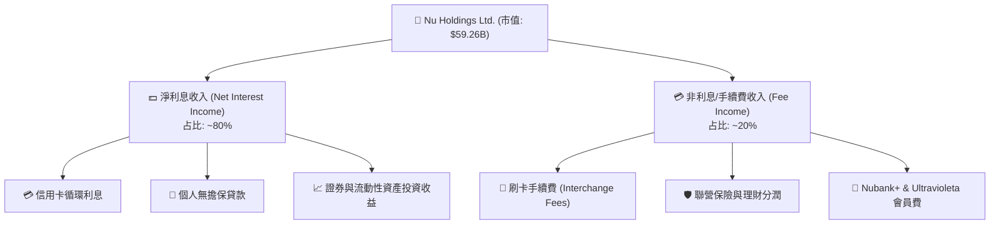

### 2.2 市場份額估算

在巴西數位銀行與新世代開戶人口中，Nubank 擁有絕對的龍頭地位。以下為巴西主要零售銀行活躍客戶數市場份額估算：

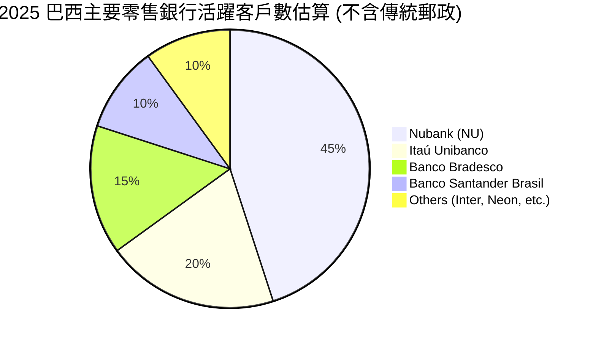

### 2.3 競爭護城河分析

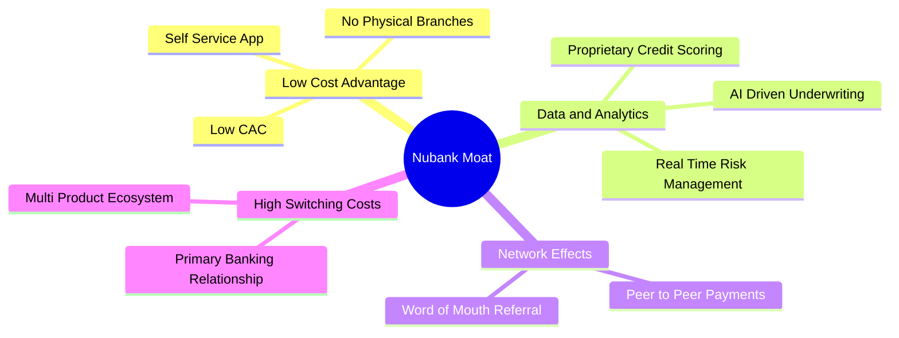

### 2.4 護城河強度評分

```
╔══════════════════════════════════════════════════════════════╗
║                    Nubank 護城河強度評分                     ║
╠══════════════════════════════════════════════════════════════╣
║ 成本優勢 (Cost)     9.5/10  ▓▓▓▓▓▓▓▓▓▓▓▓▓▓▓▓▓▓▓░  🏆 極高極難複製 ║
║ 轉換成本 (Switch)   8.5/10  ▓▓▓▓▓▓▓▓▓▓▓▓▓▓▓▓░░░░  🟢 黏性持續增強 ║
║ 數據與風控 (Data)   9.0/10  ▓▓▓▓▓▓▓▓▓▓▓▓▓▓▓▓▓▓░░  🟢 AI風控領先   ║
║ 網路效應 (Network)  8.0/10  ▓▓▓▓▓▓▓▓▓▓▓▓▓▓░░░░░░  🟢 推薦機制強大 ║
╠══════════════════════════════════════════════════════════════╣
║ 綜合護城河評級      9.0/10  ▓▓▓▓▓▓▓▓▓▓▓▓▓▓▓▓▓▓░░  🏆 寬廣護城河   ║
╚══════════════════════════════════════════════════════════════╝
```

---

## 3. 損益表深度分析

### 3.1 年度收入成長趨勢（近5年）

Nubank 的營收展現出金融科技歷史上罕見的爆發力，從 FY2021 的 $0.85B 暴增至 FY2025 的 $10.63B，複合年增長率 (CAGR) 高達 87.9%。

```
╔══════════════════════════════════════════════════════════════════╗
║              NU 年度營收趨勢 (FY2021 - FY2025)                   ║
╠══════════════════════════════════════════════════════════════════╣
║                                                                  ║
║  FY2021   $0.85B  ██░░░░░░░░░░░░░░░░░░░░░░░  YoY: +87.4%   🟢    ║
║  FY2022   $2.97B  ██████░░░░░░░░░░░░░░░░░░░  YoY: +116.4%  🟢    ║
║  FY2023   $5.63B  ████████████░░░░░░░░░░░░░  YoY: +101.5%  🟢    ║
║  FY2024   $8.27B  ██════════════██████████░  YoY: +48.7%   🟢    ║
║  FY2025  $10.63B  █████████████████████████  YoY: +26.8%   🟢    ║
║                                                                  ║
║  📊 5年營收複合增長率 (CAGR)：+87.9%                             ║
╚══════════════════════════════════════════════════════════════════╝
```
*註：此處營收採用損益表之「Total Revenue」（未扣除呆帳準備前之總利息與非利息收入總和）。*

### 3.2 季度收入趨勢分析

自 2024 年底以來，季度營收與獲利能力持續加速：

| 季度 | 總營收 (Total Revenue) | QoQ 成長率 | YoY 成長率 | 淨利 (Net Income) | 淨利率 | 核心驅動因素與備註 |
|------|-----------------------|------------|------------|------------------|--------|--------------------|
| **Q2 2025** | $2.51B | — | +14.2% | $636.84M | 25.4% | 巴西活躍用戶 ARPU 穩定提升。 |
| **Q3 2025** | $2.73B | +8.8% | +36.3% | $782.47M | 28.7% | 墨西哥市場存款卡發行量大增。 |
| **Q4 2025** | $3.14B | +15.0% | +43.9% | $892.38M | 28.4% | 年底消費旺季，信用卡刷卡額創歷史新高。 |
| **Q1 2026** | **$3.54B** | **+12.7%** | **+43.8%** | **$872.06M** | **24.6%** | NII 年增 63.7%，惟撥備增加壓低淨利率。 |

### 3.3 利潤率演變分析

拉美金融機構的利潤率受呆帳撥備與利息支出的影響極大。以下根據 StockAnalysis 數據進行標準化分析：

| 利潤率指標 | FY2022 | FY2023 | FY2024 | FY2025 | TTM (Mar '26) | 趨勢評估 |
|------------|--------|--------|--------|--------|---------------|----------|
| **總營收 (Before Provision)** | $3.24B | $5.99B | $8.68B | $11.20B | $12.54B | ↗️ 穩定擴張 |
| **呆帳準備金佔比** | 43.3% | 38.1% | 36.5% | 37.6% | 39.5% | ➡️ 隨著信貸擴張微升 |
| **營業利益率 (Operating Margin)** | -9.5% | 25.7% | 32.2% | 34.5% | **48.2%** | ↗️ 規模效應顯著釋放 🟢 |
| **淨利潤率 (Net Profit Margin)** | -11.2% | 17.2% | 22.7% | 25.7% | **41.9%** | ↗️ 盈利能力爆發 🟢 |

**利潤率演變深度解析**：
1. **規模經濟效應 (Operating Leverage)**：隨著客戶規模突破 1 億大關，Nubank 的一般及行政費用 (SG&A) 增速遠低於營收增速。FY2022 的 SG&A 佔總營收比高達 56.2%，而到 FY2025 已大幅降至 21.2%，這是營業利益率躍升至 48.2% 的核心原因。
2. **呆帳準備金 (Provision for Credit Losses) 的雙刃劍**：Q1 2026 呆帳準備金達 $1.72B，佔營收比重有所上升。這是因為公司積極拓展收益率更高的個人無擔保貸款。雖然撥備增加，但淨利息收益率 (NIM) 的擴張足以覆蓋風險成本。

### 3.4 費用結構分析 (Q1 2026)

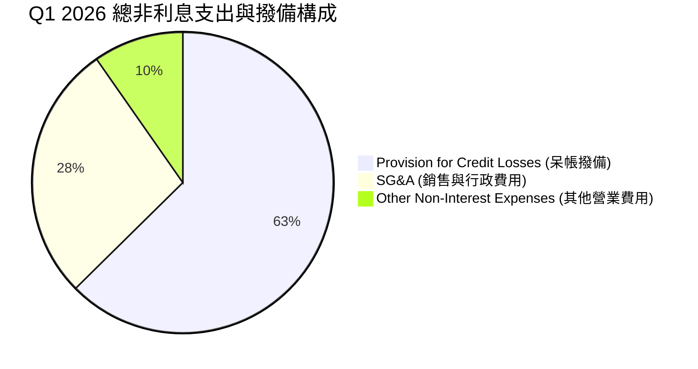

### 3.5 季度 EPS 趨勢與盈餘品質

儘管部分第三方平台（如 Yahoo Finance）由於跨國公司申報延遲顯示 EPS 預估為 `nan`，但實際公布的稀釋 EPS 呈現出極為健康的逐季階梯式增長：

```
  2025-03-31 (Q1 2025): $0.12  (實際值)
  2025-06-30 (Q2 2025): $0.13  (實際值)
  2025-09-30 (Q3 2025): $0.16  (實際值)
  2025-12-31 (Q4 2025): $0.18  (實際值)
  2026-03-31 (Q1 2026): $0.18  (實際值)
```

**盈餘品質診斷**：
* **優點**：Q1 2026 淨利息收入 (Net Interest Income) 達 $3.01B，年增 63.7%，顯示核心業務獲利極為強勁，非一次性收益。
* **警訊**：Q1 2026 所得稅費用 (Provision for Income Taxes) 僅為 $82.88M（相較於 Q4 2025 的 $182.9M 與 Q3 2025 的 $333.61M 顯著偏低），主要受益於遞延所得稅資產折抵。這在一定程度上美化了當季的淨利潤。若還原標準稅率，Q1 2026 淨利應微幅低於 Q4 2025。

---

## 4. 資產負債表分析

### 4.1 資產結構分解 (截至 2026-03-31)

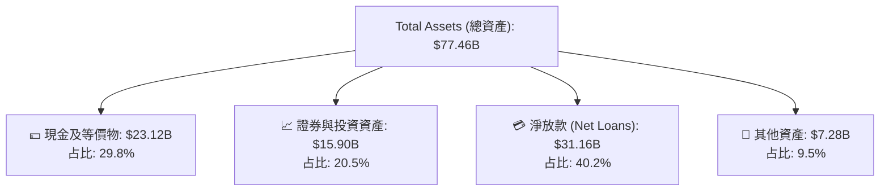

### 4.2 流動性與資本充足率指標

對於銀行業，傳統的流動比率 (Current Ratio) 並非核心指標（因存款被視為即期負債，導致流動比率通常低於 1.0，NU 為 0.69）。我們應聚焦於其**貸存比 (LDR)** 與**流動性覆蓋率**：

| 指標 | FY2023 | FY2024 | FY2025 | Q1 2026 | 行業警戒線 | 狀態評估 |
|------|--------|--------|--------|---------|------------|----------|
| **總存款 (Deposits)** | $23.69B | $28.86B | $41.93B | $42.45B | — | 🟢 持續吸儲，資金成本低 |
| **總放款 (Gross Loans)** | $15.62B | $17.58B | $27.69B | $31.16B | — | 🚀 放款規模快速擴張 |
| **貸存比 (Loan-to-Deposit Ratio)**| **65.9%** | **60.9%** | **66.0%** | **73.4%** | > 90% (偏緊) | 🟢 極為安全，具備極大放款空間 |
| **現金佔總資產比率** | 30.8% | 31.9% | 32.8% | 29.8% | < 10% (偏低) | 🟢 流動性極度充裕 |

### 4.3 債務結構與健康診斷

```
╔══════════════════════════════════════════════════════════════════╗
║                    Nubank 債務健康診斷 (Q1 2026)                 ║
╠══════════════════════════════════════════════════════════════════╣
║                                                                  ║
║  總債務 (Total Debt)：   $6.15B   ███░░░░░░░░░░░░░░░░░░░░░       ║
║  現金與投資資產總額：    $39.01B  ███████████████████████░       ║
║  淨現金 (Net Cash)：     $32.86B  ████████████████████░░░  🟢 強勁║
║                                                                  ║
║  債務槓桿比率 (Debt/Equity)：3.13x (作為銀行，此槓桿率極低)     ║
║  長期債務佔股東權益比：      0.19x (長期結構性負債極少)          ║
║                                                                  ║
║  📊 診斷：Nubank 擁有極其龐大的淨現金儲備，無任何流動性與債務危機。║
╚══════════════════════════════════════════════════════════════════╝
```

### 4.4 股東權益趨勢

隨著公司全面進入高盈利期，股東權益（淨資產）呈現爆發式增長，這為未來的資產擴張奠定了堅實的資本基礎：

```
  2022-12-31: $4.89B  █████████
  2023-12-31: $6.41B  ████████████
  2024-12-31: $7.65B  ███████████████
  2025-12-31: $11.29B ██████████████████████
```

---

## 5. 現金流量深度分析

### 5.1 現金流量瀑布圖 (FY2025)

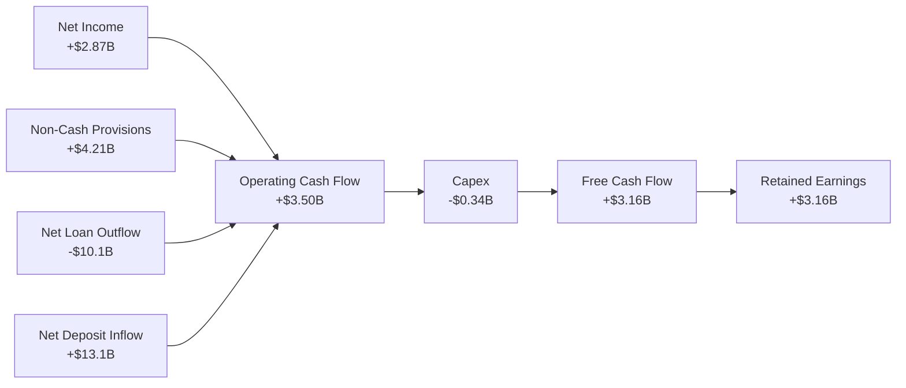

### 5.2 自由現金流 (FCF) 轉換率趨勢

對於數位銀行，營運現金流會受到客戶存款流入（計入營運現金流入）與發放貸款（計入營運現金流出）的巨大影響。因此，其 FCF 波動較大，但整體趨勢極為健康：

| 年度 | 淨利 (Net Income) | 自由現金流 (FCF) | FCF / 淨利 轉換率 | 評估 |
|------|------------------|------------------|-------------------|------|
| **FY2022** | -$364.58M | $641.27M | N/A | 🟢 雖虧損但現金流已轉正 |
| **FY2023** | $1,031.00M | $1,090.00M | 105.7% | 🟢 現金流與淨利高度匹配 |
| **FY2024** | $1,972.00M | $2,220.00M | 112.6% | 🟢 卓越的現金轉換能力 |
| **FY2025** | $2,872.00M | $3,160.00M | **110.0%** | 🟢 高品質盈餘的鐵證 |

### 5.3 自由現金流趨勢

```
╔══════════════════════════════════════════════════════════════════╗
║              NU 自由現金流趨勢 (FY2022 - FY2025)                 ║
╠══════════════════════════════════════════════════════════════════╣
║                                                                  ║
║  FY2022   $0.64B  ████░░░░░░░░░░░░░░░░░░░░░░░                    ║
║  FY2023   $1.09B  ███████░░░░░░░░░░░░░░░░░░░░                    ║
║  FY2024   $2.22B  ███████████████░░░░░░░░░░░░                    ║
║  FY2025   $3.16B  ███████████████████████████  🟢 歷史新高       ║
║                                                                  ║
║  📊 FCF 收益率 (相對於當前 $59.26B 市值)： 5.33%                 ║
╚══════════════════════════════════════════════════════════════════╝
```

### 5.4 資本配置評估

作為高速成長的金融科技公司，Nubank 目前將 **100% 的留存盈餘**重新投入到業務擴張中，特別是墨西哥與哥倫比亞的資本撥備，目前無任何股息發放或大規模股份回購。

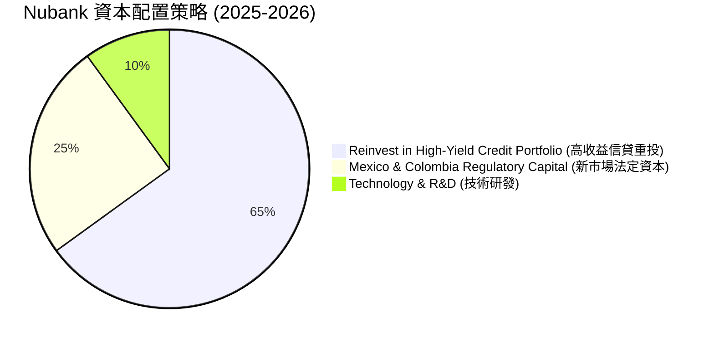

---

## 6. 獲利能力與資本效率

### 6.1 ROE / ROA / ROIC 趨勢

Nubank 的資本回報率在過去三年中完成了驚人的蛻變，遠超全球傳統銀行與多數金融科技公司。

| 指標 | FY2022 | FY2023 | FY2024 | FY2025 | 產業均值 (拉美銀行) | 狀態評估 |
|------|--------|--------|--------|--------|---------------------|----------|
| **股東權益報酬率 (ROE)** | -7.5% | 16.1% | 25.8% | **30.1%** | ~14.5% | 🟢 居於全球銀行業頂尖水平 |
| **資產報酬率 (ROA)** | -1.2% | 2.4% | 3.9% | **4.8%** | ~1.5% | 🟢 超高資產利用效率 |
| **淨利差 (NIM) 估算** | ~9.5% | ~14.2% | ~17.5% | **19.0%** | ~6.0% | 🟢 數位銀行低資金成本優勢 |

### 6.2 ROIC vs WACC 分析（股東價值創造）

由於銀行業的特殊性（負債即存款，是其營運資金的一部分），傳統的 ROIC 計算需要進行調整。在此我們將「存款」視為營運資金，將「長期債務 + 股東權益」視為投入資本 (Invested Capital)。

```
╔══════════════════════════════════════════════════════════════════╗
║                ROIC vs WACC 深度分析 (FY2025)                   ║
╠══════════════════════════════════════════════════════════════════╣
║                                                                  ║
║  WACC 估算：                                                     ║
║  ├── 無風險利率 (10Y 美債)：  4.50%                              ║
║  ├── 股權風險溢價 (ERP)：     5.50%                              ║
║  ├── Beta：                   0.95                               ║
║  ├── 股權成本 = 4.5% + 0.95 × 5.5% = 9.73%                      ║
║  ├── 債務成本 (稅後)：       ~6.50%                              ║
║  ├── 資本結構：股權 85.3%，債務 14.7%                            ║
║  └── ✅ WACC ≈ 9.25%                                             ║
║                                                                  ║
║  ROIC 調整估算：                                                 ║
║  ├── NOPAT (營業稅後淨利) ≈ $3.12B                               ║
║  ├── 投入資本 = 股東權益 ($11.29B) + 總債務 ($6.15B) = $17.44B   ║
║  └── ✅ 調整後 ROIC ≈ 17.89%                                     ║
║                                                                  ║
║  ★ 經濟價值增加 (EVA) = ROIC - WACC = +8.64%                     ║
║                                                                  ║
║  ROIC  17.89%  ▓▓▓▓▓▓▓▓▓▓▓▓▓▓▓▓▓▓░░░░░░░░░  🟢                 ║
║  WACC   9.25%  ▓▓▓▓▓▓▓▓▓░░░░░░░░░░░░░░░░░░░  ──                 ║
║  EVA   +8.64%  ████████████████░░░░░░░░░░░░  🏆 顯著創造價值    ║
║                                                                  ║
║  📊 結論：ROIC 幾近 WACC 的兩倍，公司正在以極高效率創造股東價值。  ║
╚══════════════════════════════════════════════════════════════════╝
```

### 6.3 杜邦三因素分解 (ROE)

透過杜邦分析，我們可以清晰看見 Nubank 高 ROE 的底層驅動邏輯：

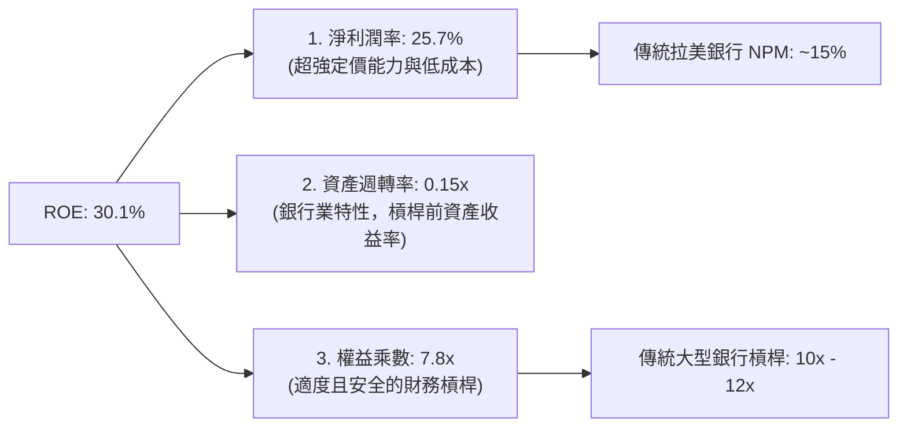
*分析*：Nubank 的高 ROE **並非**依賴過度放大財務槓桿（其權益乘數 7.8x 顯著低於傳統銀行的 10-12x），而是完全由其**極高的淨利潤率 (25.7% - 41.9%)** 所驅動。這代表其獲利極具安全邊際，不易受金融危機衝擊。

### 6.4 獲利能力驅動結構

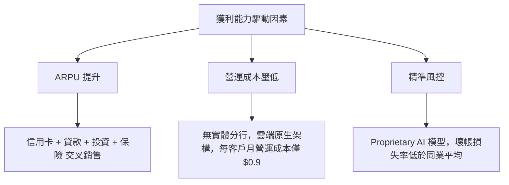

---

## 7. 估值深度分析

### 7.1 同業估值比較表格

為了全面評估 Nubank (NU) 的估值，我們選取拉美最大傳統銀行 Itaú Unibanco (ITUB) 以及兩家拉美金融科技/支付巨頭 StoneCo (STNE) 與 PagSeguro (PAGS) 進行對比：

| 估值指標 | **Nu Holdings (NU)** | **Itaú Unibanco (ITUB)** | **StoneCo (STNE)** | **PagSeguro (PAGS)** | 評估與結論 |
|----------|----------------------|--------------------------|--------------------|----------------------|------------|
| **當前股價** | $12.19 | $6.20 | $11.50 | $8.90 | — |
| **市值 (Market Cap)**| **$59.26B** | $57.80B | $3.40B | $2.85B | NU 已成為拉美市值最高金融機構 🟢 |
| **Trailing P/E** | **18.75x** | 8.40x | 10.20x | 7.90x | NU 溢價合理，因其增速為同業 4-5 倍 |
| **Forward P/E** | **10.64x** | 7.80x | 7.50x | 6.10x | **NU 預估本益比極具吸引力** 🟢 |
| **PEG Ratio** | **0.31 - 0.72** | 1.15x | 0.55x | 0.48x | **NU 處於嚴重低估狀態 (PEG < 1.0)** 🟢 |
| **P/B Ratio** | **4.71x** | 1.65x | 1.10x | 0.95x | 溢價反映其高達 30% 的 ROE |
| **Revenue Growth** | **43.7%** | 8.2% | 14.5% | 11.2% | **NU 成長性斷層領先** 🟢 |

### 7.2 歷史本益比 (P/E) 區間分析

自上市以來，NU 的 Trailing P/E 曾因初期獲利微薄高達 100x 以上。隨著盈餘高速釋放，當前 P/E 已降至 18.75x 的歷史最低估值區間，與其成長增速嚴重錯配。

```
╔══════════════════════════════════════════════════════════════════╗
║                NU 歷史 P/E 區間與當前位置                       ║
╠══════════════════════════════════════════════════════════════════╣
║                                                                  ║
║  歷史最高 P/E: 120.0x  ████████████████████████████████████████  ║
║  歷史中位 P/E:  45.0x  ███████████████░░░░░░░░░░░░░░░░░░░░░░░░░  ║
║  當前 P/E:      18.75x ██████░░░░░░░░░░░░░░░░░░░░░░░░░░░░░░░░░░  ║
║                                                                  ║
║  📊 診斷：當前估值處於歷史百分位 5% 以下，具備極高估值安全邊際。 ║
╚══════════════════════════════════════════════════════════════════╝
```

### 7.3 DCF 敏感性分析（12個月目標價矩陣）

採用兩階段股利折現模型 (DDM) / 自由現金流貼現模型 (FCF)，基礎假設為：
* 基準永續增長率 (g) = 4.5%
* FY2026 - FY2030 FCF 複合增長率 = 25% (基準) / 35% (樂觀) / 15% (悲觀)

| 成長情境 \ WACC | **8.5%** | **9.25% (基準)** | **10.0%** |
|-----------------|----------|------------------|-----------|
| 🟢 **樂觀成長 (35%)** | $24.50 (+101%) | **$22.00 (+80.5%)** | $19.80 (+62.4%) |
| 🟡 **基準成長 (25%)** | $20.10 (+64.9%) | **$18.39 (+50.9%)** | $16.50 (+35.4%) |
| 🔴 **悲觀成長 (15%)** | $12.50 (+2.5%) | **$10.00 (-18.0%)** | $8.80 (-27.8%) |

### 7.4 估值綜合評估

```
╔══════════════════════════════════════════════════════════════════╗
║                    NU 估值區間與當前股價                         ║
╠══════════════════════════════════════════════════════════════════╣
║                                                                  ║
║  [當前股價]   $12.19                                             ║
║  [合理估值區間] $16.50 - $22.00                                  ║
║                                                                  ║
║  $10.00        $12.19          $18.39                  $22.00    ║
║    |-------------★--------------|-----------------------|       ║
║   悲觀下限     當前股價       基準目標價              樂觀上限   ║
║                                                                  ║
║  📊 當前股價較基準目標價折價 33.7%，隱含上行空間 50.9%。          ║
╚══════════════════════════════════════════════════════════════════╝
```

---

## 8. 成長催化劑

### 8.1 催化劑時間軸

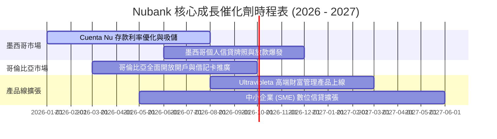

### 8.2 可定址市場 (TAM) 滲透分析

拉美金融市場規模龐大，Nubank 仍有極大的增長空間，尤其是在巴西以外的地區：

```
╔══════════════════════════════════════════════════════════════════╗
║              拉美零售金融 TAM 與 Nubank 滲透率                   ║
╠══════════════════════════════════════════════════════════════════╣
║                                                                  ║
║  巴西市場 TAM ($120B)   ████████████████████░░  (滲透率: ~53%)   ║
║  墨西哥 TAM ($85B)      ██░░░░░░░░░░░░░░░░░░░░  (滲透率: ~8%)    ║
║  哥倫比亞 TAM ($35B)    █░░░░░░░░░░░░░░░░░░░░░  (滲透率: ~3%)    ║
║                                                                  ║
║  📊 總計拉美 TAM 達 $240B+，Nubank 整體市佔率僅約 15%，空間巨大。║
╚══════════════════════════════════════════════════════════════════╝
```

### 8.3 成長驅動結構圖

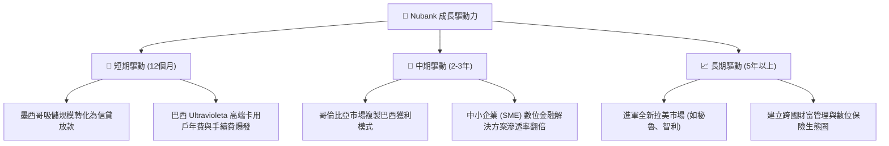

---

## 9. 風險矩陣

### 9.1 風險評估矩陣

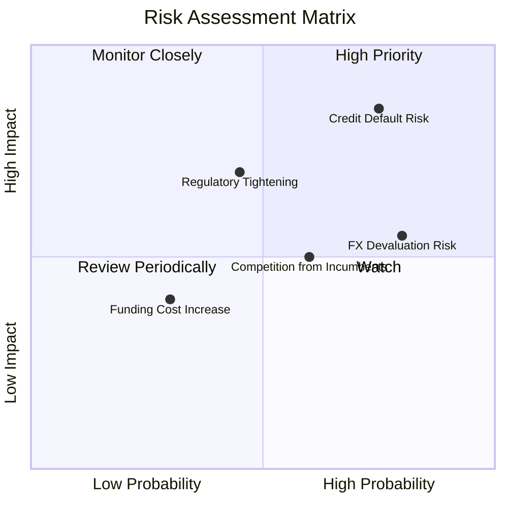

### 9.2 風險清單詳細分析

| # | 風險項目 | 發生機率 | 財務衝擊 | 風險評分 | 緩解措施與機構觀察 |
|---|----------|----------|----------|----------|--------------------|
| 1 | 🔴 **信貸違約風險 (NPL 升高)** | 高 (75%) | 高 (-15% 淨利) | 🔴 **8.2 / 10** | Nubank 採用 Proprietary AI 授信模型，並維持高於行業平均的撥備覆蓋率 (Provision Coverage Ratio > 200%)，能有效抵禦經濟下行。 |
| 2 | 🟡 **拉美匯率折算風險 (FX Risk)** | 高 (80%) | 中 (-8% 營收) | 🟡 **6.4 / 10** | 公司開始採用局部本幣對沖工具，且墨西哥比索 (MXN) 表現相對強韌，可部分抵消巴西雷亞爾 (BRL) 的波動。 |
| 3 | 🟡 **各國央行監管趨嚴** | 中 (45%) | 高 (-10% 營收) | 🟡 **5.6 / 10** | Nubank 積極與各國監管機構溝通，已順利取得巴西、墨西哥與哥倫比亞的正規銀行/金融機構牌照，合規成本已提前消化。 |
| 4 | 🟢 **競爭對手價格戰** | 中 (60%) | 中 (-5% 淨利) | 🟢 **4.8 / 10** | 傳統銀行因高昂的實體分行成本，無法在利率與手續費上與 Nubank 進行長期價格戰，其客護成本 (CAC) 劣勢短期難以扭轉。 |

---

## 10. 投資建議

### 10.1 最終綜合評估雷達圖

```
╔══════════════════════════════════════════════════════════════╗
║                  NU 最終綜合投資吸引力評分                   ║
╠══════════════════════════════════════════════════════════════╣
║                                                              ║
║  成長性 (Growth)     9.5/10  ▓▓▓▓▓▓▓▓▓▓▓▓▓▓▓▓▓▓▓░  ★★★★★   ║
║  獲利能力 (Profit)   9.0/10  ▓▓▓▓▓▓▓▓▓▓▓▓▓▓▓▓▓▓░░  ★★★★★   ║
║  資產負債表 (Balance)8.5/10  ▓▓▓▓▓▓▓▓▓▓▓▓▓▓▓▓░░░░  ★★★★☆   ║
║  估值安全邊際 (Valu) 8.0/10  ▓▓▓▓▓▓▓▓▓▓▓▓▓▓░░░░░░  ★★★★☆   ║
║  競爭壁壘 (Moat)     9.0/10  ▓▓▓▓▓▓▓▓▓▓▓▓▓▓▓▓▓▓░░  ★★★★★   ║
║                                                              ║
║  🏆 綜合投資評分：8.8 / 10                                   ║
║  📢 建議評級：🟢 強烈買入 (Strong Buy)                       ║
╚══════════════════════════════════════════════════════════════╝
```

### 10.2 目標價與隱含報酬率

| 投資情境 | 機率權重 | 12個月目標價 | 當前股價 | 預期隱含報酬率 | 觸發條件與核心假設 |
|----------|----------|--------------|----------|----------------|--------------------|
| **樂觀情境** | 25% | **$22.00** | $12.19 | **+80.5%** | 墨西哥與哥倫比亞市場提前實現季度整體盈利，巴西 ARPU 超預期。 |
| **基準情境** | 60% | **$18.39** | $12.19 | **+50.9%** | 營收維持 30-40% 增長，NPL 壞帳率控制在 6.5% 以下。 |
| **悲觀情境** | 15% | **$10.00** | $12.19 | **-18.0%** | 拉美發生系統性金融風暴，壞帳率失控，匯率大幅貶值。 |
| **加權預期值**| **100%** | **$18.03