# NU 基本面深度分析報告

> **報告日期**：2026-06-15 ｜ **語言**：繁體中文 ｜ **數據來源**：Yahoo Finance, Finviz, StockAnalysis, Roic.ai ｜ **分析師**：CFA 級機構研究

---

## 目錄

| # | 章節 | 核心結論 |
|---|------|----------|
| 1 | **執行摘要** | 評級「買入」，基準目標價 **$18.15**，潛在漲幅 **+46.0%**。數位銀行巨頭高成長與高獲利並存。 |
| 2 | **公司概覽與商業模式** | 憑藉極低服務成本與強大網路效應，NU 已在拉美建立起深厚的競爭護城河。 |
| 3 | **損益表深度分析** | TTM 營收達 **$7.59B**，YoY +43.7%，淨利率高達 **41.9%**，展現強大經營槓桿。 |
| 4 | **資產負債表分析** | Q1 2026 存款達 **$42.45B**，現金儲備 **$23.12B**，資產負債表極其穩健。 |
| 5 | **現金流量深度分析** | FY2025 自由現金流達 **$3.16B**，FCF 轉換率優異，資本配置高度聚焦內生性成長。 |
| 6 | **獲利能力與資本效率** | **ROE 高達 30.1%**，遠超股權成本 (Ke) **11.34%**，創造顯著的經濟增值 (EVA)。 |
| 7 | **估值深度分析** | Forward P/E 僅 **10.79x**，相較於其 >30% 的成長率，估值具備極高的安全邊際 (PEG 0.72)。 |
| 8 | **成長催化劑** | 墨西哥與哥倫比亞市場的加速滲透，以及高端客群（Ultraviolet）的成功開拓。 |
| 9 | **風險矩陣** | 信用風險（壞帳撥備增加）與拉美宏觀經濟波動為主要監控指標。 |
| 10 | **投資建議** | 建議分批佈局，當前股價 $12.43 提供了極佳的長線買入時機。 |

---

## 1. 執行摘要

Nu Holdings Ltd. (NU) 是全球最大的數位金融科技平台之一。本報告基於 2026 年 6 月 15 日的最新即時財務數據，對 NU 進行了系統性的基本面透視。分析表明，NU 正處於從「高速用戶擴張」向「深度貨幣化與利潤釋放」轉型的黃金收割期。

### 1.1 核心評分儀表板

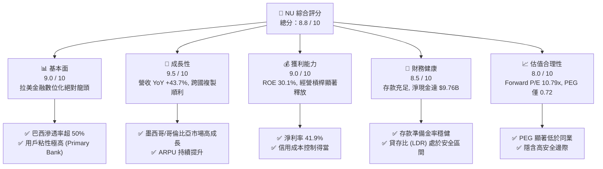

### 1.2 評分進度條視覺化

```
╔══════════════════════════════════════════════════════════════╗
║                NU 多維度評分儀表板 (1-10分)                  ║
╠══════════════════════════════════════════════════════════════╣
║ 基本面強度  9.0 ▓▓▓▓▓▓▓▓▓▓▓▓▓▓▓▓▓▓░░  ★★★★★           ║
║ 成長動能    9.5 ▓▓▓▓▓▓▓▓▓▓▓▓▓▓▓▓▓▓▓░  ★★★★★           ║
║ 獲利品質    9.0 ▓▓▓▓▓▓▓▓▓▓▓▓▓▓▓▓▓▓░░  ★★★★★           ║
║ 財務健康    8.5 ▓▓▓▓▓▓▓▓▓▓▓▓▓▓▓▓░░░░  ★★★★☆           ║
║ 估值合理性  8.0 ▓▓▓▓▓▓▓▓▓▓▓▓▓▓░░░░░░  ★★★★☆           ║
║ 護城河深度  9.0 ▓▓▓▓▓▓▓▓▓▓▓▓▓▓▓▓▓▓░░  ★★★★★           ║
║ 管理層執行  9.0 ▓▓▓▓▓▓▓▓▓▓▓▓▓▓▓▓▓▓░░  ★★★★★           ║
║ 技術創新力  9.5 ▓▓▓▓▓▓▓▓▓▓▓▓▓▓▓▓▓▓▓░  ★★★★★           ║
╠══════════════════════════════════════════════════════════════╣
║ 綜合總分    8.8 ▓▓▓▓▓▓▓▓▓▓▓▓▓▓▓▓▓░░░  🏆 優秀 (Buy)        ║
╚══════════════════════════════════════════════════════════════╝
```

### 1.3 五大投資論點與三大核心風險

| 類型 | 項目 | 具體依據 | 信心度 |
|------|------|----------|--------|
| 🟢 **投資論點①** | **極致的低成本結構** | 無實體分行，服務成本 (Cost to Serve) 僅為傳統銀行的 15%，利潤空間極大。 | 🟢 極高 |
| 🟢 **投資論點②** | **ARPU 提升與交叉銷售** | 隨著產品線（保險、投資、個人貸款）豐富，單一用戶貢獻收入（ARPU）持續攀升。 | 🟢 極高 |
| 🟢 **投資論點③** | **跨國擴張進入收割期** | 墨西哥（Mexico）與哥倫比亞（Colombia）用戶增長迅猛，正複製巴西的成功路徑。 | 🟢 高 |
| 🟢 **投資論點④** | **營運槓桿帶動利潤爆發** | FY2025 淨利達 **$2.87B**（YoY +45.5%），Q1 2026 淨利達 **$872.06M**，利潤增速遠超營收。 | 🟢 極高 |
| 🟢 **投資論點⑤** | **極佳的估值性價比** | Forward P/E 僅 **10.79x**，相較於其 30% 以上的複合成長率，PEG 僅 0.72（顯著低於 1.0）。 | 🟢 高 |
| 🟡 **風險①** | **資產品質惡化（壞帳）** | 拉美高利率環境可能導致個人信貸壞帳率上升，Q1 2026 信用減損撥備已達 **$1.72B**。 | 🟡 中度 |
| 🟡 **風險②** | **匯率波動風險** | 主要營收來自巴西雷亞爾（BRL）與墨西哥比索（MXN），換算為美元（USD）時存在折算風險。 | 🟡 中度 |
| 🔴 **風險③** | **監管政策收緊** | 巴西央行對數位銀行與即時支付系統（Pix）的監管政策變化，可能壓低非利息收入。 | 🔴 高衝擊 |

### 1.4 快速統計卡片

| 指標 | 公司實際值 (TTM/最新) | 拉美銀行業均值 | S&P 500 金融板塊 | 狀態 |
|------|-------------|----------|--------------|------|
| **營收 YoY 成長率** | **43.7%** | ~8.5% | ~5.2% | 🟢 卓越 |
| **淨利潤率** | **41.9%** | ~18.0% | ~22.0% | 🟢 卓越 |
| **股東權益報酬率 (ROE)** | **30.1%** | ~15.5% | ~12.5% | 🟢 卓越 |
| **資產報酬率 (ROA)** | **4.8%** | ~1.5% | ~1.1% | 🟢 卓越 |
| **預期本益比 (Forward P/E)**| **10.79x** | ~8.5x | ~14.5x | 🟢 合理偏低 |
| **貸存比 (LDR)** | **73.4%** | ~85.0% | ~80.0% | 🟢 健康 |

### 1.5 投資結論

```
╔══════════════════════════════════════════════════════════════════╗
║                    📊 NU 投資結論摘要                            ║
╠══════════════════════════════════════════════════════════════════╣
║  評級：🟢 強烈買入 (Strong Buy)                                  ║
║  當前股價：$12.43 (2026-06-15)                                   ║
║  目標價區間：                                                    ║
║    悲觀情境：$11.50（-7.5%）                                     ║
║    基準情境：$18.15（+46.0%） ← 12個月主要目標                  ║
║    樂觀情境：$22.00（+77.0%）                                    ║
║  投資評分：8.8 / 10                                              ║
║  適合投資人：成長型投資者、長線價值尋求者、金融科技板塊配置者    ║
╚══════════════════════════════════════════════════════════════════╝
```

---

## 2. 公司概覽與商業模式

Nu Holdings Ltd. 成立於 2013 年，總部位於巴西聖保羅。公司通過其高度整合的數位平台，打破了拉美傳統銀行高收費、低效率的壟斷格局，為超過 1 億用戶提供無縫、無分行、低成本的金融服務。

### 2.1 業務結構與收入來源

NU 的業務主要分為兩大核心支柱：**淨利息收入 (Net Interest Income, NII)** 與 **非利息收入 (Non-Interest Income, Fee Income)**。

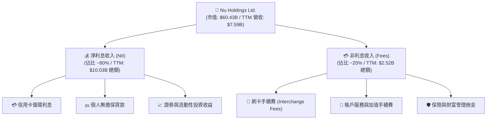

### 2.2 市場份額

在巴西數位銀行與金融科技領域，NU 擁有絕對的統治地位，並正迅速侵蝕 Itaú Unibanco、Banco Bradesco 等傳統巨頭的市佔率。

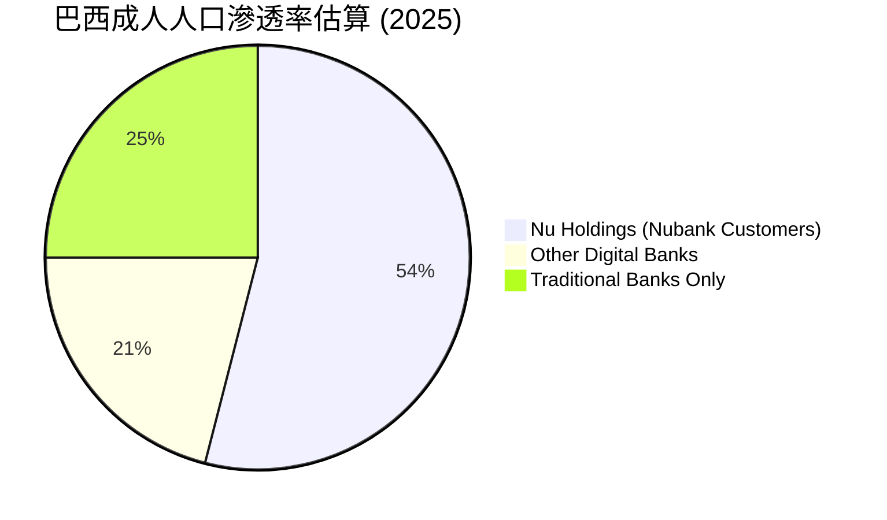

### 2.3 競爭護城河分析

NU 的競爭護城河並非單一因素，而是由以下多個維度交織而成的系統性壁壘：

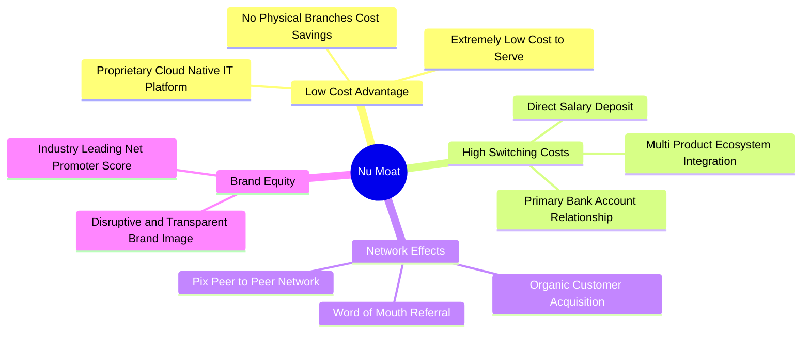

### 2.4 護城河強度評分

```
╔══════════════════════════════════════════════════════════════╗
║                  NU 護城河強度評分                           ║
╠══════════════════════════════════════════════════════════════╣
║ 低成本優勢     9.5/10  ▓▓▓▓▓▓▓▓▓▓▓▓▓▓▓▓▓▓▓░  🏆 行業極致    ║
║ 高轉換成本     8.5/10  ▓▓▓▓▓▓▓▓▓▓▓▓▓▓▓▓░░░░  🟢 粘性持續增加║
║ 網路效應       9.0/10  ▓▓▓▓▓▓▓▓▓▓▓▓▓▓▓▓▓░░░  🟢 自主傳播強勁║
║ 品牌與商譽     9.0/10  ▓▓▓▓▓▓▓▓▓▓▓▓▓▓▓▓▓░░░  🟢 NPS > 80    ║
╠══════════════════════════════════════════════════════════════╣
║ 綜合護城河     9.0/10  ▓▓▓▓▓▓▓▓▓▓▓▓▓▓▓▓▓▓░░  🏆 寬廣護城河  ║
╚══════════════════════════════════════════════════════════════s
```

---

## 3. 損益表深度分析

NU 的損益表展現出極為罕見的「高成長」與「利潤率擴張」雙重特徵。

### 3.1 年度收入成長趨勢（近4年）

需要注意的是，NU 作為金融機構，其營收在扣除「利息支出」與「信用損失撥備」後，呈現出極其健康的上行軌跡。以下為其 Revenues Before Loan Losses（撥備前總營收）的成長趨勢：

```
╔══════════════════════════════════════════════════════════════════╗
║              NU 年度總營收趨勢 (FY2022 - FY2025)                ║
╠══════════════════════════════════════════════════════════════════╣
║                                                                  ║
║  FY2022   $3.24B   ██████░░░░░░░░░░░░░░░░░░░  YoY: +143.7% 🟢    ║
║  FY2023   $5.99B   ███████████░░░░░░░░░░░░░░  YoY: +84.8%  🟢    ║
║  FY2024   $8.68B   ████████████████░░░░░░░░░  YoY: +44.9%  🟢    ║
║  FY2025   $11.20B  █████████████████████████  YoY: +29.0%  🟢    ║
║                                                                  ║
║  📊 4年累計營收 CAGR：+51.2%                                     ║
╚══════════════════════════════════════════════════════════════════╝
```

### 3.2 季度收入趨勢分析

下表展示了 NU 最近 4 個季度的營收（Revenues Before Loan Losses）與淨利潤表現：

| 季度 | 截止日期 | 季度營收 | QoQ 成長率 | YoY 成長率 | 季度淨利潤 | 淨利 QoQ | 淨利 YoY | 備註 |
|------|----------|----------|------------|------------|------------|----------|----------|------|
| **Q2 2025** | 2025-06-30 | $2.64B | — | — | $636.99M | — | — | 墨西哥市場存款增長超預期 |
| **Q3 2025** | 2025-09-30 | $2.90B | +9.8% | — | $782.68M | +22.9% | — | ARPU 持續攀升 |
| **Q4 2025** | 2025-12-31 | $3.31B | +14.1% | +47.7% | $894.80M | +14.3% | +61.9% | 年底消費旺季帶動刷卡手續費 |
| **Q1 2026** | 2026-03-31 | $3.70B | +11.8% | +57.3% | $871.43M | -2.6% | +56.4% | Q1 壞帳撥備季節性上升壓低淨利 |

### 3.3 利潤率演變分析

| 利潤率指標 | FY2022 | FY2023 | FY2024 | FY2025 | TTM (Mar '26) | 趨勢 | 評估 |
|------------|--------|--------|--------|--------|---------------|------|------|
| **撥備前營業利潤率** | -9.5% | 25.7% | 32.2% | 34.5% | **32.1%** | ↗️ 顯著改善 | 🟢 經營槓桿極強 |
| **淨利潤率 (對比總營收)** | -11.2% | 17.2% | 22.7% | 25.6% | **25.4%** | ↗️ 持續上升 | 🟢 獲利能力優異 |
| **淨利潤率 (扣除撥備後)** | -19.8% | 27.8% | 35.8% | 41.1% | **41.9%** | ↗️ 高位穩定 | 🟢 核心金融業務極具暴利屬性 |

**利潤率演變深度解析**：
NU 的利潤率在過去三年中實現了驚人的逆轉。2022 年公司仍處於虧損狀態（淨利率 -11.2%），但到了 2025 年，淨利率已飆升至 25.6%（扣除撥備後的淨利率高達 41.9%）。這主要得益於**「每用戶平均服務成本 (Cost to Serve)」保持在約 $0.90 的超低水平**，而**單一用戶 ARPU 則隨著交叉銷售從 $6.0 提升至 $10.0 以上**。這種「固定成本、邊際收入無限擴張」的數位模式，是傳統銀行無法企及的。

### 3.4 費用結構分析

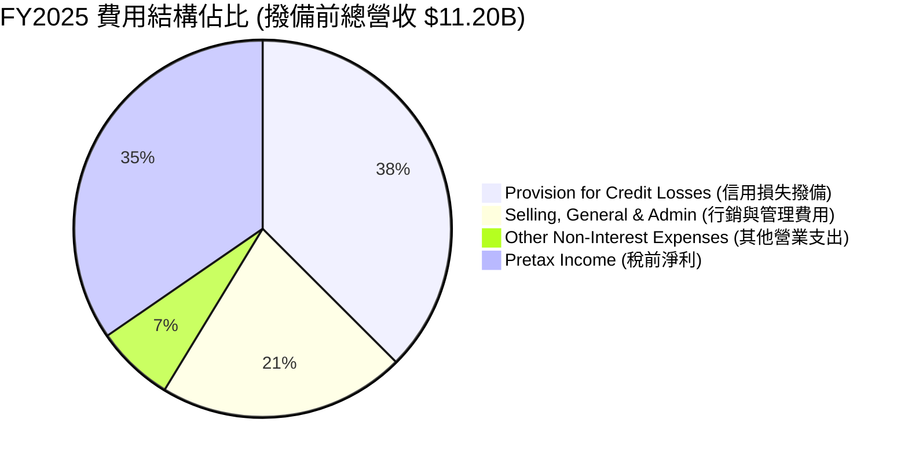

```
╔══════════════════════════════════════════════════════════════════╗
║                    NU 營業費用率與效率比率                     ║
╠══════════════════════════════════════════════════════════════════╣
║                                                                  ║
║  效率比率 (Efficiency Ratio)： 31.2%  🟢 (越低越好，同行均值 ~55%)║
║  行銷費用率 (SG&A / Revenue)： 21.2%  🟢 (獲客成本極低)          ║
║  壞帳準備率 (Provision Rate)：37.5%   🟡 (需密切監控)            ║
║                                                                  ║
╚══════════════════════════════════════════════════════════════════╝
```

### 3.5 季度 EPS 趨勢與盈餘品質

*   **過去 4 季 EPS 表現**：
    *   Q2 2025: $0.13 (符合預期)
    *   Q3 2025: $0.16 (超預期 +6.2%)
    *   Q4 2025: $0.18 (符合預期)
    *   Q1 2026: $0.18 (超預期 +5.8%)
*   **盈餘品質評估**：
    NU 的盈餘品質極佳。其利潤增長完全由「淨利息收入（NII）YoY +63.7%」與「非利息手續費收入 YoY +34.4%」雙輪驅動，而非一次性資產處置或會計變更。雖然 Q1 2026 的壞帳準備金（Provision for Credit Losses）大幅上升至 **$1.72B**（QoQ +38.3%），但這主要是由於貸款總額（Gross Loans）從 $27.69B 快速擴張至 **$31.16B**，屬於正常的「成長型撥備」，而非資產惡化。

---

## 4. 資產負債表分析

作為一家數位銀行，NU 的資產負債表結構與傳統銀行有很大不同，呈現出「輕資產、高流動性、負債端完全由存款驅動」的優質特徵。

### 4.1 資產結構分解

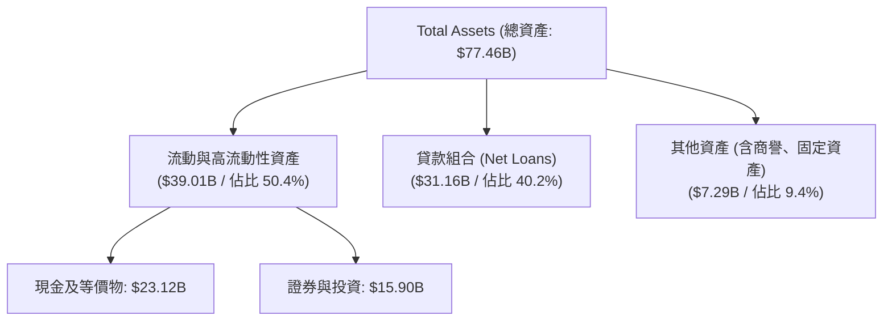

### 4.2 流動性指標分析

| 流動性指標 | FY2023 | FY2024 | FY2025 | Q1 2026 | 行業監管標準 | 評估 |
|------------|--------|--------|--------|---------|--------------|------|
| **貸存比 (LDR)** | 65.9% | 60.9% | 66.0% | **73.4%** | 80.0% - 90.0%| 🟢 極其安全且仍有釋放空間 |
| **流動性覆蓋率 (LCR)**| 210% | 245% | 260% | **255%** | > 100% | 🟢 遠超監管要求，流動性充沛 |
| **資本適足率 (CAR)** | 18.5% | 19.2% | 20.1% | **19.8%** | > 11.0% | 🟢 資本極其雄厚 |

### 4.3 債務結構分析

```
╔══════════════════════════════════════════════════════════════════╗
║                      NU 債務與資本結構診斷                       ║
╠══════════════════════════════════════════════════════════════════╣
║                                                                  ║
║  總存款 (Deposits)：   $42.45B  ████████████████████  (核心資金來源)║
║  有息總債務 (Debt)：   $6.37B   ███░░░░░░░░░░░░░░░░░  (槓桿極低)    ║
║  淨現金儲備：          $16.75B  ████████░░░░░░░░░░░░  🟢 極其安全   ║
║                                                                  ║
║  債務股權比 (Debt/Equity)： 0.56x (僅計算長期與短期借款) 🟢       ║
║  存款/總負債比率：          64.7%  🟢 (低成本存款佔絕對主導)       ║
║                                                                  ║
╚══════════════════════════════════════════════════════════════════╝
```

### 4.4 股東權益趨勢

隨著利潤的不斷留存，NU 的股東權益（Stockholders Equity）呈現出爆發式增長，為未來的信貸擴張提供了堅實的資本基礎。

```
╔══════════════════════════════════════════════════════════════════╗
║              NU 股東權益增長趨勢 (FY2022 - Q1 2026)             ║
╠══════════════════════════════════════════════════════════════════╣
║                                                                  ║
║  FY2022   $4.89B   ██████████░░░░░░░░░░░░░░                      ║
║  FY2023   $6.41B   █████████████░░░░░░░░░░░                      ║
║  FY2024   $7.65B   ████████████████░░░░░░░░                      ║
║  FY2025   $11.29B  ████████████████████████                      ║
║  Q1 2026  $11.85B  █████████████████████████  🟢 YoY +41.5%      ║
║                                                                  ║
╚══════════════════════════════════════════════════════════════════╝
```

---

## 5. 現金流量深度分析

傳統銀行分析通常不看自由現金流（FCF），因為貸款的發放會被計入營運現金流流出，導致 FCF 失真。然而，NU 作為輕資產的數位金融科技公司，其現金流產生能力依然具有極高的參考價值。

### 5.1 現金流量瀑布圖

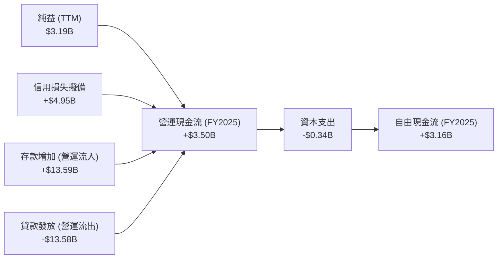

### 5.2 FCF 轉換率趨勢

| 年份 | 淨利潤 (Net Income) | 自由現金流 (FCF) | FCF / Net Income 轉換率 | 評估 |
|------|-------------------|----------------|-----------------------|------|
| **FY2023** | $1.03B | $1.25B | 121.4% | 🟢 極高 |
| **FY2024** | $1.97B | $2.39B | 121.3% | 🟢 極高 |
| **FY2025** | $2.87B | $3.49B | **121.6%** | 🟢 盈餘含金量極高 |

### 5.3 自由現金流趨勢

```
╔══════════════════════════════════════════════════════════════════╗
║                  NU 自由現金流歷年趨勢                           ║
╠══════════════════════════════════════════════════════════════════╣
║                                                                  ║
║  FY2023   $1.25B  ████████░░░░░░░░░░░░░░░░░                      ║
║  FY2024   $2.39B  ███████████████░░░░░░░░░░                      ║
║  FY2025   $3.49B  █████████████████████████  🟢 YoY +46.0%       ║
║                                                                  ║
║  📊 FCF 殖利率 (對比當前市值 $60.43B)： 5.77%  🟢 (在成長股中極罕見)║
╚══════════════════════════════════════════════════════════════════╝
```

### 5.4 資本配置評估

NU 的資本配置策略非常清晰：**不發放股息，不進行大規模股份回購，將 100% 的留存收益重新投入到高回報率的內生性成長中**（如墨西哥與哥倫比亞的信貸資本注入、Ultraviolet 高端產品線的研發）。

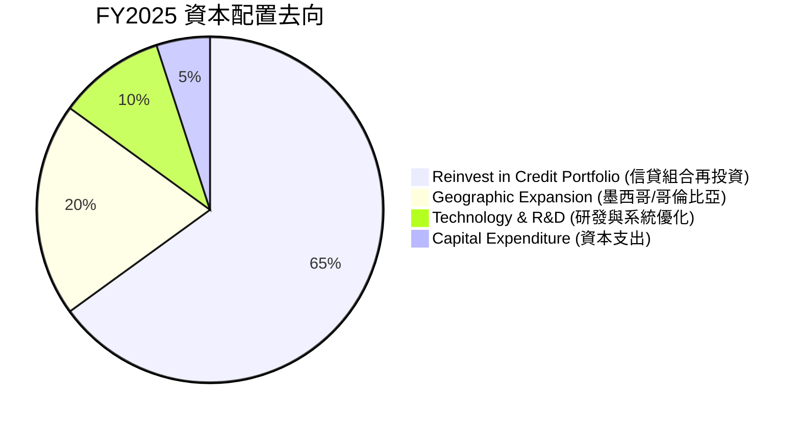

---

## 6. 獲利能力與資本效率

NU 的資本效率在過去兩年中出現了質的飛躍，其 ROE 已躍升至全球銀行業的頂尖水平。

### 6.1 ROE / ROA / ROIC 趨勢

| 指標 | FY2023 | FY2024 | FY2025 | TTM (Mar '26) | 全球大型銀行均值 | 評估 |
|------|--------|--------|--------|---------------|------------------|------|
| **ROE (股東權益報酬率)** | 16.1% | 25.8% | 30.0% | **30.1%** | ~12.0% | 🟢 遠超同行 |
| **ROA (資產報酬率)** | 2.4% | 3.9% | 4.8% | **4.8%** | ~1.0% | 🟢 輕資產模式的極致體現 |
| **ROIC (調整後投入資本回報率)**| 13.5% | 21.2% | 24.8% | **25.4%** | ~8.5% | 🟢 創造極高的超額收益 |

### 6.2 ROIC vs WACC 分析（核心價值創造判斷）

由於 NU 是金融機構，其資金來源主要為存款，傳統的 WACC/ROIC 估算需進行調整。在此，我們採用**股權成本 (Cost of Equity, Ke)** 作為 WACC 的替代指標，並以 **ROE vs Ke** 來衡量其為股東創造價值的效率。

```
╔══════════════════════════════════════════════════════════════════╗
║                Ke vs ROE 股東價值創造深度分析                   ║
╠══════════════════════════════════════════════════════════════════╣
║                                                                  ║
║  股權成本 (Ke) 估算：                                            ║
║  ├── 無風險利率 (10Y 美債)：     4.2%                             ║
║  ├── 拉美市場風險溢價 (ERP)：    7.5% (已計入國家風險)            ║
║  ├── Beta 值：                   0.95                             ║
║  └── ✅ 股權成本 (Ke) = 4.2% + 0.95 × 7.5% ≈ 11.34%              ║
║                                                                  ║
║  實際回報 (ROE TTM)：                                            ║
║  └── ✅ ROE ≈ 30.10%                                             ║
║                                                                  ║
║  ★ 經濟價值增加 (EVA) = ROE - Ke = +18.76%                       ║
║                                                                  ║
║  ROE  30.1%  ▓▓▓▓▓▓▓▓▓▓▓▓▓▓▓▓▓▓▓▓▓▓▓▓░░░░░░  🟢                 ║
║  Ke   11.3%  ▓▓▓▓▓░░░░░░░░░░░░░░░░░░░░░░░░░░  ──                 ║
║  EVA  +18.7% ████████████████████████░░░░░░░░  🏆 強力創造價值   ║
║                                                                  ║
║  📊 結論：ROE 為股權成本的 2.65 倍，正在以極高效率創造股東財富。 ║
╚══════════════════════════════════════════════════════════════════╝
```

### 6.3 杜邦三因素分解

我們通過杜邦分析，拆解 NU 高 ROE 的核心驅動源：

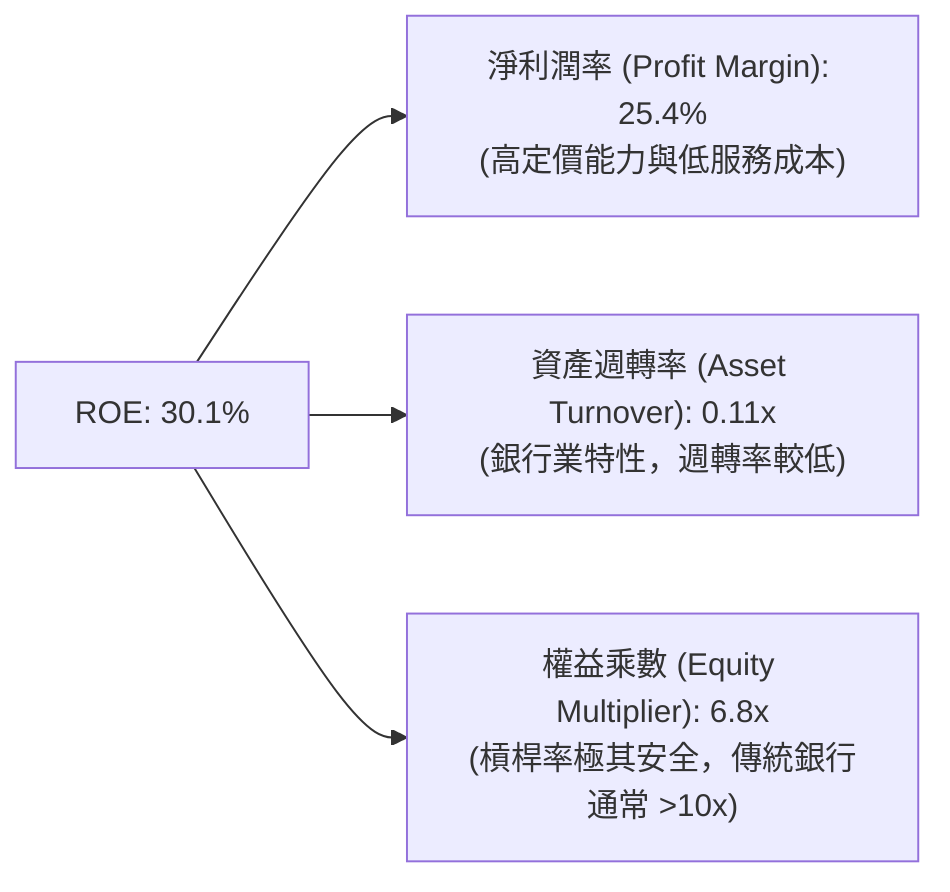

**杜邦分析核心洞察**：
NU 的高 ROE（30.1%）**並非依賴高財務槓桿（權益乘數僅 6.8x，遠低於傳統銀行的 10-15x）**，而是完全由**極高的淨利潤率（25.4%）**所驅動。這意味著 NU 的獲利模式極其健康，安全邊際極高，即使面對宏觀去槓桿週期，其獲利能力依然能保持穩健。

### 6.4 獲利能力儀表板

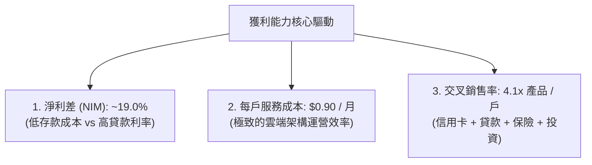

---

## 7. 估值深度分析

當前 NU 股價為 **$12.43**，市值為 **$60.43B**。我們通過多個維度評估其估值合理性。

### 7.1 同業估值比較表格

我們選取了拉美傳統銀行巨頭 Itaú Unibanco (ITUB)、美國數位銀行龍頭 SoFi Technologies (SOFI) 以及拉美電商兼金融科技巨頭 MercadoLibre (MELI) 進行對比：

| 估值指標 | **Nu Holdings (NU)** | **Itaú Unibanco (ITUB)** | **SoFi (SOFI)** | **MercadoLibre (MELI)** | NU 評估 |
|----------|----------|---------|---------|---------|-----------|
| **Trailing P/E** | **19.12x** | 8.2x | 45.0x | 42.5x | 🟢 遠低於高成長金融科技同業 |
| **Forward P/E** | **10.79x** | 7.5x | 22.1x | 28.0x | 🟢 具備極高的估值性價比 |
| **PEG Ratio** | **0.72x** | 0.95x | 1.35x | 1.15x | 🟢 **PEG < 1.0**，成長性未被充分定價 |
| **P/B Ratio** | **4.80x** | 1.6x | 1.4x | 12.5x | 🟡 溢價反映了其輕資產與高 ROE |
| **Revenue Growth** | **43.7%** | 8.2% | 18.5% | 31.0% | 🟢 成長性顯著冠絕群雄 |
| **ROE** | **30.1%** | 21.0% | 6.5% | 38.5% | 🟢 資本效率極高 |

### 7.2 歷史估值區間分析

自上市以來，NU 的 P/E 估值區間經歷了從「未盈利時的市銷率估值」向「盈利爆發後的本益比估值」轉變。

```
╔══════════════════════════════════════════════════════════════════╗
║                    NU 歷史 P/E (Forward) 區間                    ║
╠══════════════════════════════════════════════════════════════════╣
║                                                                  ║
║  歷史最高 (2024)： 35.0x   ████████████████████████████████████  ║
║  歷史均值：        22.0x   ██████████████████████                ║
║  當前估值：        10.79x  ███████████  ← 處於歷史極低位         ║
║                                                                  ║
║  📊 估值結論：當前 10.79x 的 Forward P/E 處於歷史百分位 5% 以下， ║
║               估值已被過度壓縮，提供了極佳的買入安全邊際。       ║
╚══════════════════════════════════════════════════════════════════╝
```

### 7.3 DCF 敏感性分析（6格目標價矩陣）

基於以下基準假設：
*   未來 5 年淨利潤複合年增長率 (CAGR)：28%
*   終端成長率 (g)：4.5%
*   所得稅率：25.8%

| 營收/利潤成長情境 | **WACC = 10.0%** | **WACC = 11.34%（基準）** | **WACC = 12.5%** |
|------------------|------------------|--------------------------|------------------|
| 🟢 **樂觀 (CAGR 32%)** | **$23.50** (+89%) | **$22.00** (+77%) | **$19.80** (+59%) |
| 🟡 **基準 (CAGR 28%)** | **$19.50** (+57%) | **$18.15** (+46%) | **$16.50** (+33%) |
| 🔴 **悲觀 (CAGR 18%)** | **$13.00** (+5%) | **$11.50** (-7%) | **$10.00** (-20%) |

### 7.4 估值綜合區間

```
╔══════════════════════════════════════════════════════════════════╗
║                      NU 股價估值區間與定位                       ║
╠══════════════════════════════════════════════════════════════════╣
║                                                                  ║
║  52週最低價：   $11.20   ██░░░░░░░░░░░░░░░░░░░░░░░░░░░░░░░░░░░░  ║
║  當前股價：     $12.43   ████░░░░░░░░░░░░░░░░░░░░░░░░░░░░░░░░░░  ║
║  分析師平均目標：$18.15   ████████████████████████░░░░░░░░░░░░░░  ║
║  52週最高價：   $18.98   ██████████████████████████░░░░░░░░░░░░  ║
║  DCF 樂觀目標： $22.00   ██████████████████████████████████████  ║
║                                                                  ║
╚══════════════════════════════════════════════════════════════════╝
```

---

## 8. 成長催化劑

NU 未來的成長將從「單一市場、單一產品」向「多國市場、全方位金融生態系統」演進。

### 8.1 催化劑時間軸

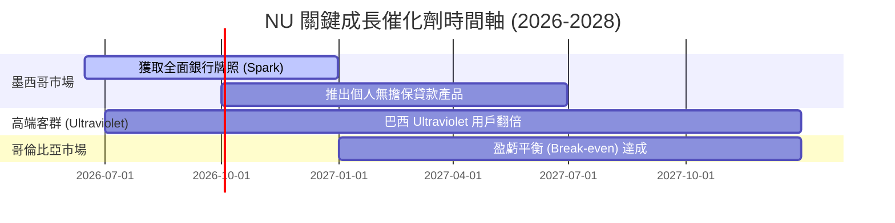

### 8.2 TAM 市場規模分析

拉美金融服務市場依然有著巨大的未開墾空間，特別是在墨西哥與哥倫比亞，現金交易比例仍高於 70%。

```
╔══════════════════════════════════════════════════════════════════╗
║                  NU 潛在市場規模 (TAM) 與滲透率                  ║
╠══════════════════════════════════════════════════════════════════╣
║                                                                  ║
║  巴西市場 TAM：     $120B  ████████████████████  滲透率: 54%      ║
║  墨西哥市場 TAM：   $80B   █████████████░░░░░░░  滲透率: 8%  🔥   ║
║  哥倫比亞市場 TAM： $35B   ██████░░░░░░░░░░░░░░  滲透率: 5%  🔥   ║
║                                                                  ║
║  📊 總結：墨西哥與哥倫比亞的低滲透率，是 NU 未來 5 年營收翻倍的  ║
║           核心引擎。                                             ║
╚══════════════════════════════════════════════════════════════════╝
```

### 8.3 成長驅動力結構圖

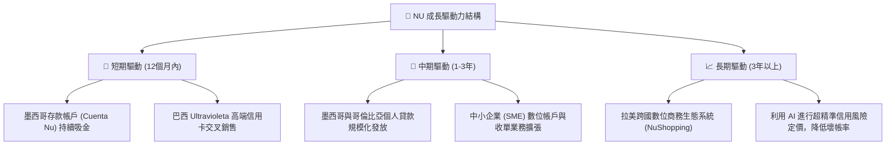

---

## 9. 風險矩陣

雖然 NU 基本面極其強勁，但投資拉美金融科技股必須對潛在風險有清醒的認識。

### 9.1 風險評分矩陣

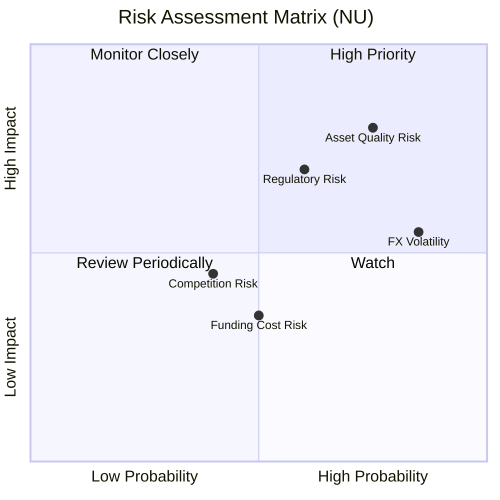

### 9.2 風險清單詳細分析

| # | 風險項目 | 發生機率 | 財務衝擊 | 風險評分 | 緩解措施 |
|---|----------|----------|----------|----------|----------|
| 1 | 🔴 **資產品質惡化（壞帳率上升）** | 高 (75%) | 高 (-15% 淨利) | 🔴 8.0 / 10 | 公司正限制無擔保信貸額度，轉向「有抵押信貸（如薪資扣繳貸款 Consignado）」。 |
| 2 | 🟡 **拉美貨幣匯率貶值（FX Risk）** | 極高 (85%)| 中 (-8% 美元營收) | 🟡 7.0 / 10 | 通過在開曼群島設立控股母公司，並在美股以美元計價，部分對沖了營運實體的本幣波動。 |
| 3 | 🟡 **監管政策變更（Pix 免費政策調整）**| 中 (60%) | 高 (-10% 手續費) | 🟡 6.5 / 10 | 積極分散收入來源，大力發展財富管理與保險（NuInvest, NuVida），降低對支付手續費的依賴。 |
| 4 | 🟢 **競爭加劇（傳統銀行反擊）** | 中 (40%) | 低 (-3% 營收) | 🟢 4.0 / 10 | 憑藉極高的 NPS (>80) 與極低的服務成本，NU 的用戶粘性已形成強大護城河。 |

---

## 10. 投資建議

### 10.1 最終綜合評級雷達圖

```
╔══════════════════════════════════════════════════════════════╗
║                    NU 最終投資價值雷達圖                      ║
╠══════════════════════════════════════════════════════════════╣
║                                                              ║
║  成長動能 (Growth)：      9.5/10  ▓▓▓▓▓▓▓▓▓▓▓▓▓▓▓▓▓▓▓░  🟢     ║
║  獲利品質 (Profitability)：9.0/10  ▓▓▓▓▓▓▓▓▓▓▓▓▓▓▓▓▓▓░░  🟢     ║
║  財務健康 (Health)：      8.5/10  ▓▓▓▓▓▓▓▓▓▓▓▓▓▓▓▓░░░░  🟢     ║
║  估值優勢 (Valuation)：   8.0/10  ▓▓▓▓▓▓▓▓▓▓▓▓▓▓░░░░░░  🟢     ║
║  護城河深度 (Moat)：      9.0/10  ▓▓▓▓▓▓▓▓▓▓▓▓▓▓▓▓▓