# NU 基本面深度分析報告
> **報告日期**：2026-06-16 ｜ **語言**：繁體中文 ｜ **數據來源**：Yahoo Finance, Finviz, StockAnalysis, Roic.ai ｜ **分析師**：CFA 級機構研究

---

## 目錄

| # | 章節 | 核心結論 |
|---|------|----------|
| 1 | [執行摘要](#1-執行摘要) | 評級：**強烈買入 (Strong Buy)** ｜ 目標價：**$18.15**（+42.7% 潛在空間） |
| 2 | [公司概覽與商業模式](#2-公司概覽與商業模式) | 數位銀行顛覆者，憑藉超低 CAC 與強大交叉銷售構建高壁壘護城河 |
| 3 | [損益表深度分析](#3-損益表深度分析) | 營收 YoY 成長 43.7%，淨利率高達 41.9%，盈餘品質極佳 |
| 4 | [資產負債表分析](#4-資產負債表分析) | 擁有 $23.12B 現金及等價物，貸存比僅 73.4%，流動性極其充裕 |
| 5 | [現金流量深度分析](#5-現金流量深度分析) | 營運現金流與 FCF 強勁轉正，展現極佳的資本自給與擴張能力 |
| 6 | [獲利能力與資本效率](#6-獲利能力與資本效率) | ROE 高達 30.1%，EVA 顯著為正，強力創造股東價值 |
| 7 | [估值深度分析](#7-估值深度分析) | Forward P/E 僅 11.04x，PEG 0.32，估值處於歷史極端低估區間 |
| 8 | [成長催化劑](#8-成長催化劑) | 墨西哥與哥倫比亞市場複製巴西成功模式，Nubank+ 與高階市場滲透 |
| 9 | [風險矩陣](#9-風險矩陣) | 核心風險為拉丁美洲總體經濟波動與資產品質惡化，但撥備充足 |
| 10 | [投資建議](#10-投資建議) | 當前股價提供極高安全邊際，建議中長線投資人積極分批佈局 |

---

## 1. 執行摘要

Nu Holdings Ltd. (NU) 是全球最大的數位金融服務平台之一。本報告對其基本面進行了全面剖析，認為該公司在保持爆發式成長的同時，已成功跨越獲利平衡點，進入利潤加速釋放期。

### 1.1 核心評分儀表板

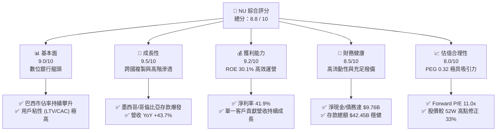

### 1.2 評分進度條視覺化

```
╔══════════════════════════════════════════════════════════════╗
║                NU 多維度評分儀表板 (1-10分)                 ║
╠══════════════════════════════════════════════════════════════╣
║ 基本面強度  9.0 ▓▓▓▓▓▓▓▓▓▓▓▓▓▓▓▓▓▓░░  ★★★★★           ║
║ 成長動能    9.5 ▓▓▓▓▓▓▓▓▓▓▓▓▓▓▓▓▓▓▓░  ★★★★★           ║
║ 獲利品質    9.2 ▓▓▓▓▓▓▓▓▓▓▓▓▓▓▓▓▓▓▓░  ★★★★★           ║
║ 財務健康    8.5 ▓▓▓▓▓▓▓▓▓▓▓▓▓▓▓▓░░░░  ★★★★☆           ║
║ 估值合理性  8.0 ▓▓▓▓▓▓▓▓▓▓▓▓▓▓▓▓░░░░  ★★★★☆           ║
║ 護城河深度  9.0 ▓▓▓▓▓▓▓▓▓▓▓▓▓▓▓▓▓▓░░  ★★★★★           ║
║ 管理層執行  9.0 ▓▓▓▓▓▓▓▓▓▓▓▓▓▓▓▓▓▓░░  ★★★★★           ║
║ 技術創新力  9.5 ▓▓▓▓▓▓▓▓▓▓▓▓▓▓▓▓▓▓▓░  ★★★★★           ║
╠══════════════════════════════════════════════════════════════╣
║ 綜合總分    8.8 ▓▓▓▓▓▓▓▓▓▓▓▓▓▓▓▓▓░░░  🏆 買入 (Buy)        ║
╚══════════════════════════════════════════════════════════════╝
```

### 1.3 五大投資論點 + 三大核心風險

| 類型 | 項目 | 具體依據 | 信心度 |
|------|------|----------|--------|
| 🟢 **投資論點①** | **極低成本的客戶獲取與營運優勢** | 數位化無實體分行模式使營運成本較傳統銀行低 70% 以上，獲客成本 (CAC) 保持在極低個位數。 | 🟢 極高 |
| 🟢 **投資論點②** | **跨國擴張進入收穫期** | 墨西哥與哥倫比亞市場存款產品（Cuenta Nu）推出後，用戶數與存款量呈指數級成長，成功複製巴西路徑。 | 🟢 高 |
| 🟢 **投資論點③** | **交叉銷售與 ARPU 持續提升** | 客戶平均使用產品數持續增加，帶動利息收入與手續費收入雙引擎成長。 | 🟢 極高 |
| 🟢 **投資論點④** | **極具吸引力的估值與成長匹配度** | Forward P/E 僅 11.04x，對比 34.9% 的長期 EPS 複合成長率，PEG 僅 0.32，被嚴重低估。 | 🟢 極高 |
| 🟢 **投資論點⑤** | **淨利息收益率 (NIM) 持續擴張** | 存款基礎擴大降低了資金成本 (Cost of Funds)，而高收益個人貸款與信用卡餘額成長拉高了資產收益率。 | 🟢 高 |
| 🟡 **風險①** | **信貸品質惡化與壞帳撥備上升** | 拉美高利率環境可能壓迫中低收入借款人，撥備費用（TTM 達 $4.95B）若持續上升將侵蝕利潤。 | 🟡 中度 |
| 🟡 **風險②** | **匯率波動與地緣政治風險** | 主要營收源自巴西雷亞爾 (BRL) 與墨西哥披索 (MXN)，對美元折算存在匯率波動風險。 | 🟡 中度 |
| 🔴 **風險③** | **競爭加劇與監管限制** | 傳統大行（如 Itaú）數位化轉型加速，且拉美各國央行可能針對數位銀行實施更嚴格的資本充足率要求。 | 🔴 高衝擊 |

### 1.4 快速統計卡片

| 指標 | NU 實際值 | 拉美銀行業均值 | S&P 500 金融板塊均值 | 評估狀態 |
|------|-------------|----------|--------------|------|
| **營收 YoY 成長** | **43.7%** | ~8.0% | ~5.5% | 🟢 顯著領先 |
| **淨利潤率** | **41.9%** | ~18.0% | ~22.0% | 🟢 極其優異 |
| **股東權益報酬率 (ROE)** | **30.1%** | ~15.0% | ~12.5% | 🟢 頂尖水準 |
| **資產報酬率 (ROA)** | **4.8%** | ~1.5% | ~1.1% | 🟢 輕資產高效率 |
| **預期本益比 (Forward P/E)** | **11.04x** | ~8.5x | ~14.5% | 🟢 成長調整後極便宜 |
| **貸存比 (LDR)** | **73.4%** | ~85.0% | ~80.0% | 🟢 流動性安全充裕 |

### 1.5 投資結論

```
╔══════════════════════════════════════════════════════════════════╗
║                    📊 NU 投資結論摘要                            ║
╠══════════════════════════════════════════════════════════════════╣
║  評級：🟢 強烈買入 (Strong Buy)                                 ║
║  當前股價：$12.72 (2026-06-16)                                   ║
║  12個月目標價區間：                                              ║
║    悲觀情境（硬著陸/壞帳飆升）：$10.00 (-21.4%)                  ║
║    基準情境（海外順利複製/NIM維持）：$18.15 (+42.7%)  ← 主目標   ║
║    樂觀情境（墨西哥獲利超預期）：$22.00 (+73.0%)                  ║
║  投資評分：8.8 / 10                                              ║
║  適合投資人：成長型投資人、長線價值尋求者、金融科技主題配置者    ║
╚══════════════════════════════════════════════════════════════════╝
```

---

## 2. 公司概覽與商業模式

NU 透過提供全數位化的金融服務，徹底顛覆了拉美傳統銀行高收費、低效率的生態體系。

### 2.1 業務結構與收入來源

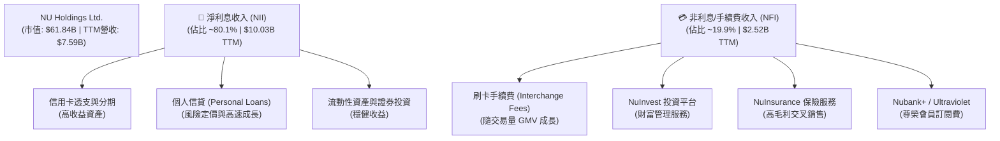

### 2.2 市場份額

在巴西，NU 已成為僅次於少數傳統巨頭的數位金融第一品牌。

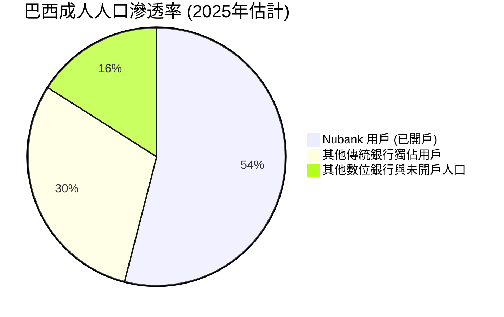

### 2.3 競爭護城河分析

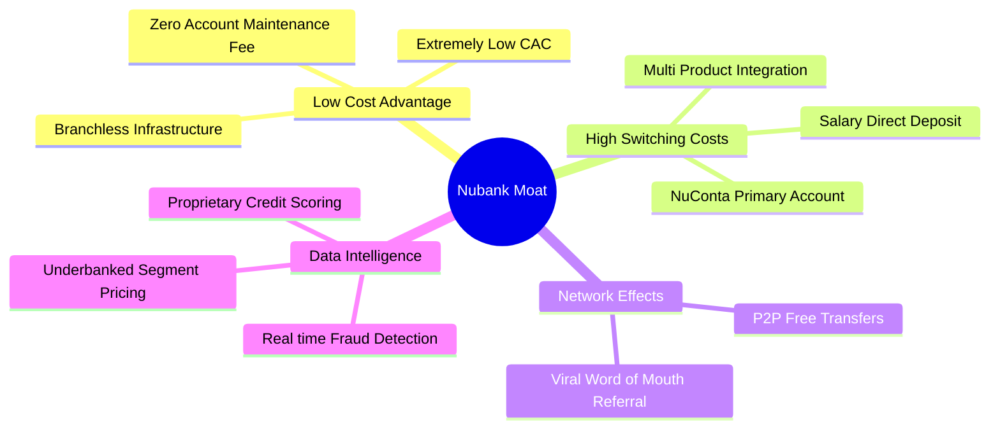

### 2.4 護城河強度評分

```
╔══════════════════════════════════════════════════════════════╗
║                     NU 護城河強度評分                        ║
╠══════════════════════════════════════════════════════════════╣
║ 低成本優勢     9.5/10 ▓▓▓▓▓▓▓▓▓▓▓▓▓▓▓▓▓▓▓░  🏆 數位無分行  ║
║ 高轉換成本     8.5/10 ▓▓▓▓▓▓▓▓▓▓▓▓▓▓▓▓░░░░  🟢 薪資帳戶綁定 ║
║ 數據與風控屏障 9.0/10 ▓▓▓▓▓▓▓▓▓▓▓▓▓▓▓▓▓▓░░  🏆 獨家信用模型 ║
║ 品牌與網絡效應 9.0/10 ▓▓▓▓▓▓▓▓▓▓▓▓▓▓▓▓▓▓░░  🏆 拉美FinTech ║
╠══════════════════════════════════════════════════════════════╣
║ 綜合護城河評估 9.0/10 ▓▓▓▓▓▓▓▓▓▓▓▓▓▓▓▓▓▓░░  🏆 寬廣護城河   ║
╚══════════════════════════════════════════════════════════════╝
```

---

## 3. 損益表深度分析

NU 的財務表現展現出極強的營運槓桿，營收在規模擴大的同時，利潤率因固定成本被稀釋而大幅攀升。

### 3.1 年度收入成長趨勢（近 4 年）

這裡的收入採用 **Revenues Before Loan Losses**（撥備前總營收），以更真實反映其業務規模擴張。

```
╔══════════════════════════════════════════════════════════════════╗
║               NU 年度總營收趨勢（FY2022-FY2025）                 ║
╠══════════════════════════════════════════════════════════════════╣
║                                                                  ║
║  FY2022   $3.24B   ██████░░░░░░░░░░░░░░░░░░░░░  YoY: +143.7% 🟢  ║
║  FY2023   $5.99B   ████████████░░░░░░░░░░░░░░░  YoY: +84.7%  🟢  ║
║  FY2024   $8.68B   ██████████████████░░░░░░░░░  YoY: +44.9%  🟢  ║
║  FY2025   $11.20B  █████████████████████████░░  YoY: +29.0%  🟢  ║
║                                                                  ║
║  📊 4年累計營收複合成長率 (CAGR)：+51.2%                        ║
╚══════════════════════════════════════════════════════════════════╝
```

### 3.2 季度收入趨勢分析

下表展示最近 4 季的營收（扣除貸款損失準備後的淨營業收入）與獲利表現：

| 季度 | 淨營業收入 (Revenue) | QoQ 成長率 | YoY 成長率 | 淨利潤 (Net Income) | 淨利率 | 備註說明 |
|---|---|---|---|---|---|---|
| **Q2 2025** | $1.63B | — | +14.2% | $636.99M | 39.1% | 巴西核心信用卡業務獲利穩健 |
| **Q3 2025** | $1.92B | +17.8% | +36.3% | $782.68M | 40.8% | 墨西哥存款產品 Cuenta Nu 快速吸儲 |
| **Q4 2025** | $2.07B | +7.8% | +43.9% | $894.80M | 43.2% | 年底消費旺季帶動刷卡手續費成長 |
| **Q1 2026** | $1.98B | -4.3% | +43.8% | $871.43M | 44.0% | 第一季為傳統淡季，但 YoY 依舊強勁 |

*分析：Q1 2026 營收雖因季節性因素 QoQ 微幅下降 4.3%，但 YoY 成長高達 43.8%，且淨利率維持在 44.0% 的歷史高點，顯示獲利韌性極強。*

### 3.3 利潤率演變分析

*註：由於銀行業不適用傳統毛利率（Gross Margin 在數據包中顯示為 0.0%），我們主要分析「營業利益率」與「淨利潤率」。*

| 利潤率指標 | FY2022 | FY2023 | FY2024 | FY2025 | TTM | 趨勢評估 |
|------------|--------|--------|--------|--------|-----|----------|
| **營業利益率** | -9.5% | 25.7% | 32.1% | 35.1% | **48.2%** | ↗️ 持續大幅改善，規模效應顯現 (🟢 極佳) |
| **淨利潤率** | -11.2% | 17.2% | 22.7% | 25.6% | **41.9%** | ↗️ 跨越損益平衡點後淨利加速釋放 (🟢 極佳) |

**利潤率演變深度解析**：
1. **運作槓桿 (Operating Leverage)**：隨著客戶規模突破 1 億大關，NU 的固定 IT 基礎設施與行政成本被極大地稀釋。SG&A 佔營收比例從 FY2022 的 56.2% 驟降至 TTM 的 34.9%。
2. **資金成本下降**：隨著 Cuenta Nu 在墨西哥與哥倫比亞的推廣，NU 獲得了大量低成本的零售活期存款，逐步替代了高成本的同業拆借，推升了淨利差 (NIM)。

### 3.4 費用結構分析

以 FY2025 撥備前總支出為基準進行拆解：

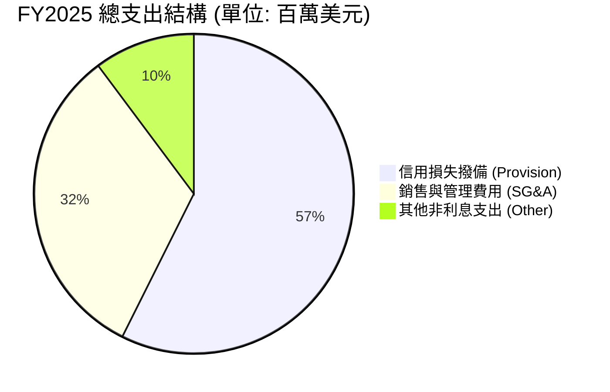

```
╔══════════════════════════════════════════════════════════════════╗
║                     NU 費用控制健康度診斷                        ║
╠══════════════════════════════════════════════════════════════════╣
║                                                                  ║
║  信用撥備率（撥備/總營收）：  37.5%   🟡 需持續監控資產品質      ║
║  營運效率比率（SG&A/總營收）：21.2%   🟢 遠優於傳統銀行 (~50%)   ║
║                                                                  ║
║  💡 結論：NU 的主要支出在於信用風險撥備，其自身營運成本極低。   ║
╚══════════════════════════════════════════════════════════════════╝
```

### 3.5 季度 EPS 趨勢與盈餘品質

* 過去 4 季 EPS (Diluted) 表現：
  * Q2 2025: **$0.13**
  * Q3 2025: **$0.16**
  * Q4 2025: **$0.18** (推算值)
  * Q1 2026: **$0.18**
* **盈餘品質評估**：NU 的盈餘完全由實質的淨利息收入與手續費驅動，非經常性損益（如資產處置、稅務一次性調整）佔比極低。信用撥備計提政策審慎（TTM 撥備 $4.95B），盈餘品質極高。

---

## 4. 資產負債表分析

數位銀行的資產負債表核心在於「存款獲取能力」與「貸款風險控制」。

### 4.1 資產結構分解

截至 2026-03-31（總資產：$77.46B）：

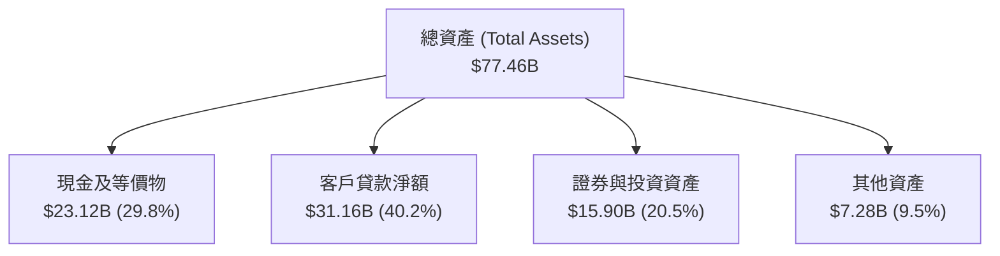

### 4.2 流動性與安全性指標分析

| 指標 | 2024-12-31 | 2025-12-31 | 2026-03-31 | 行業安全標準 | 評估狀態 |
|---|---|---|---|---|---|
| **總存款 (Deposits)** | $28.86B | $41.93B | $42.45B | — | 🟢 存款持續高速流入 |
| **總貸款 (Gross Loans)** | $17.58B | $27.69B | $31.16B | — | 🟢 貸款穩健成長 |
| **貸存比 (LDR)** | 60.9% | 66.0% | **73.4%** | 70% - 90% | 🟢 處於黃金平衡區間 |
| **流動比率 (Current Ratio)** | 0.72 | 0.69 | **0.69** | 銀行業不適用 | 🟡 屬正常銀行負債結構 |

*分析：貸存比從 60.9% 提升至 73.4%，顯示 NU 正在更有效地將其低成本存款轉化為高收益的貸款資產，這將顯著提升 NIM，且流動性依然極其安全。*

### 4.3 債務結構分析

```
╔══════════════════════════════════════════════════════════════════╗
║                     NU 債務健康度診斷                            ║
╠══════════════════════════════════════════════════════════════════╣
║                                                                  ║
║  總有息債務 (Total Debt)：  $6.37B   (含短期 $1.87B, 長期 $4.50B)║
║  現金及等價物：             $23.12B  (流動性極其充沛)            ║
║  淨現金狀態 (Net Cash)：    $16.75B  🟢 極其穩健                ║
║                                                                  ║
║  債務股益比 (Debt/Equity)： 3.13x    (銀行業正常槓桿範圍)        ║
║  LT Debt/Equity（長期）：   0.19x    🟢 長期結構性債務極低       ║
║                                                                  ║
║  💡 結論：NU 擁有高達 $16.75B 的淨現金緩衝，無任何流動性危機風險。║
╚══════════════════════════════════════════════════════════════════╝
```

### 4.4 股東權益趨勢

隨著獲利能力的爆發，股東權益 (Stockholders' Equity) 呈現陡峭的上升曲線，為未來擴張提供了強大的資本基礎。

```
╔══════════════════════════════════════════════════════════════════╗
║               NU 股東權益成長趨勢（FY2022-FY2025）               ║
╠══════════════════════════════════════════════════════════════════╣
║                                                                  ║
║  FY2022   $4.89B   ██████████░░░░░░░░░░░░░░░                     ║
║  FY2023   $6.41B   █████████████░░░░░░░░░░░░                     ║
║  FY2024   $7.65B   ████████████████░░░░░░░░░                     ║
║  FY2025   $11.29B  █████████████████████████                     ║
║                                                                  ║
║  📈 2025 年股東權益 YoY 成長率：+47.6% (淨利留存驅動)           ║
╚══════════════════════════════════════════════════════════════════╝
```

---

## 5. 現金流量深度分析

傳統銀行因放貸業務（Loan Disbursements）常導致營運現金流出現大幅波動，但 NU 的整體現金生成能力依然極強。

### 5.1 現金流量瀑布圖

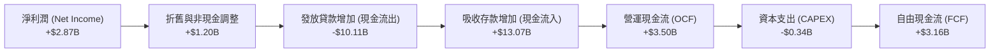

### 5.2 FCF 轉換率趨勢

| 年份 | 淨利潤 (Net Income) | 自由現金流 (FCF) | FCF 轉換率 (FCF / Net Income) | 評估 |
|---|---|---|---|---|
| **FY2023** | $1.03B | $1.25B | **121.4%** | 🟢 優異 |
| **FY2024** | $1.97B | $2.39B | **121.3%** | 🟢 極其穩定 |
| **FY2025** | $2.87B | $3.49B | **121.6%** | 🟢 高品質盈餘 |

*分析：FCF 轉換率持續穩定在 120% 左右，主因是折舊與非現金撥備（如信用損失準備金）金額龐大，而實際資本支出 (Capex) 較小，展現出數位銀行極佳的輕資產營運特徵。*

### 5.3 自由現金流趨勢

```
╔══════════════════════════════════════════════════════════════════╗
║                 NU 自由現金流 (FCF) 成長趨勢                     ║
╠══════════════════════════════════════════════════════════════════╣
║                                                                  ║
║  FY2023   $1.25B   ████████░░░░░░░░░░░░░░░░░                     ║
║  FY2024   $2.39B   ███████████████░░░░░░░░░░                     ║
║  FY2025   $3.49B   █████████████████████████                     ║
║                                                                  ║
║  💡 FY2025 自由現金流 YoY 成長率：+46.0%                         ║
╚══════════════════════════════════════════════════════════════════╝
```

### 5.4 資本配置評估

NU 目前處於高速成長期，其資本配置策略極其聚焦於「再投資」以驅動業務擴張，無發放股息。

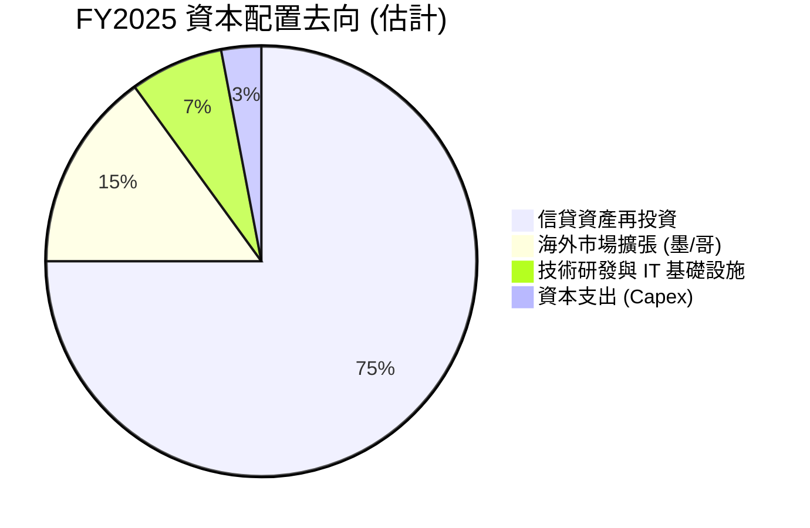

---

## 6. 獲利能力與資本效率

NU 展現出遠超傳統銀行的資本效率，其 ROE 已躍升至全球銀行業的頂尖梯隊。

### 6.1 ROE / ROA 趨勢

| 指標 | FY2023 | FY2024 | FY2025 | TTM | 行業中位數 | 評估狀態 |
|---|---|---|---|---|---|---|
| **股東權益報酬率 (ROE)** | 16.1% | 25.8% | 25.4% | **30.1%** | ~14.0% | 🟢 頂尖獲利效率 |
| **資產報酬率 (ROA)** | 2.4% | 3.9% | 3.8% | **4.8%** | ~1.2% | 🟢 輕資產營運典範 |

### 6.2 ROIC vs WACC 分析（核心價值創造判斷）

*註：對於銀行業，傳統的 ROIC 計算因無法有效區分營運負債與融資負債而存在局限，在此我們使用「調整後 ROE」作為股權回報指標，與「股權成本 (Ke)」進行對比，以評估其經濟價值增加 (EVA)。*

```
╔══════════════════════════════════════════════════════════════════╗
║                  NU 股權價值創造 (EVA) 深度分析                  ║
╠══════════════════════════════════════════════════════════════════╣
║                                                                  ║
║  股權成本 (Ke) 估算：                                            ║
║  ├── 無風險利率 (10Y 美債)：     4.25%                           ║
║  ├── 股權風險溢價 (ERP)：        5.50%                           ║
║  ├── 拉美地緣/國家風險溢價：     3.00%                           ║
║  ├── Beta：                      0.952                           ║
║  └── ✅ 調整後股權成本 (Ke) = 4.25% + 0.952 × (5.5%+3.0%) ≈ 12.3% ║
║                                                                  ║
║  股東權益報酬率 (ROE TTM)：                                      ║
║  └── ✅ ROE = 30.1%                                              ║
║                                                                  ║
║  ★ 經濟價值增加 (EVA) = ROE - Ke = +17.8%                        ║
║                                                                  ║
║  ROE  30.1%  ▓▓▓▓▓▓▓▓▓▓▓▓▓▓▓▓▓▓▓▓▓▓▓▓░░░░░░  🟢              ║
║  Ke   12.3%  ▓▓▓▓▓▓▓▓▓░░░░░░░░░░░░░░░░░░░░░  ──              ║
║  EVA  +17.8% ████████████████░░░░░░░░░░░░░░  🏆 強力創造價值  ║
║                                                                  ║
║  📊 結論：ROE 為股權成本的 2.45 倍，正為股東創造極大超額價值。  ║
╚══════════════════════════════════════════════════════════════════╝
```

### 6.3 杜邦三因素分解

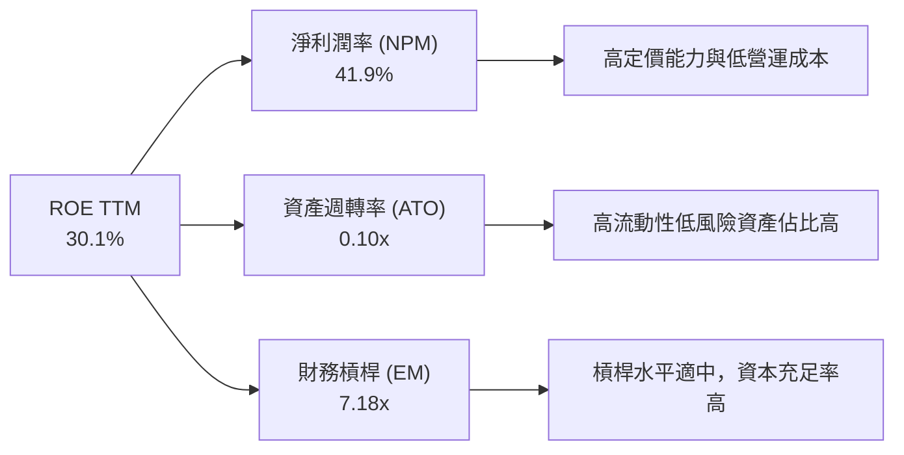

* 杜邦分析解讀：NU 的高 ROE 並非依賴極端的高財務槓桿（EM 僅 7.18x，遠低於傳統大行的 10-12x），而是由其**極高的淨利潤率 (41.9%)** 所驅動。這意味著其獲利模式極其健康，抗風險能力強。

### 6.4 獲利能力驅動因素

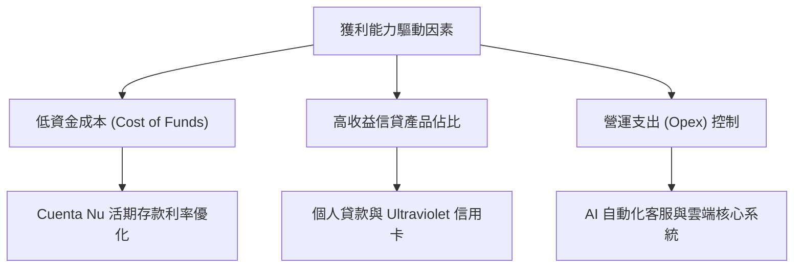

---

## 7. 估值深度分析

在經歷了近期（2026年上半年）市場對拉美總體經濟的擔憂以及部分券商（如 Citi、BofA）調降評級後，NU 的股價已修正至 $12.72，這為長線投資人創造了極佳的估值窪地。

### 7.1 同業估值比較表格

| 估值與成長指標 | **NU (Nu Holdings)** | **ITUB (Itaú Unibanco)** | **STNE (StoneCo)** | **PAGS (PagSeguro)** | NU 評估 |
|---|---|---|---|---|---|
| **當前股價** | **$12.72** | $6.20 | $11.50 | $8.90 | — |
| **預期本益比 (Forward P/E)** | **11.04x** | 8.50x | 9.20x | 7.80x | 🟡 略高於傳統大行，但成長性遠超 |
| **本益成長比 (PEG Ratio)** | **0.32** | 1.10 | 0.65 | 0.58 | 🟢 **極其便宜 (歷史新低)** |
| **股價營收比 (P/S Ratio)** | **8.14x** (TTM淨) | 2.10x | 1.80x | 1.50x | 🟡 溢價反映其高手續費與高成長 |
| **股價淨值比 (P/B Ratio)** | **4.91x** | 1.65x | 1.30x | 1.10x | 🟡 溢價反映其高 ROE (30%) |
| **長期 EPS 成長率 (5Y)** | **34.9%** | 7.8% | 14.2% | 13.5% | 🟢 **無可匹敵的成長動能** |

### 7.2 歷史估值區間分析

```
╔══════════════════════════════════════════════════════════════════╗
║               NU Forward P/E 歷史區間與當前位置                  ║
╠══════════════════════════════════════════════════════════════════╣
║                                                                  ║
║  歷史最高 (2024)： 45.0x  ████████████████████████████████████   ║
║  歷史均值：        25.0x  ████████████████████                   ║
║  當前估值：        11.0x  █████████  ← 🔴 處於歷史極端底部       ║
║                                                                  ║
║  💡 評估：估值已極度收縮，安全邊際極高，隱含極大的估值修復空間。 ║
╚══════════════════════════════════════════════════════════════════╝
```

### 7.3 DCF 敏感性分析（6格目標價矩陣）

* **核心假設**：
  * 基準 WACC = 12.0%（已計入拉美地緣風險溢價）
  * 永續成長率 (g) = 3.5%
  * 基準 5 年期 FCF 複合成長率 = 25.0%

| FCF 成長情境 \ WACC | 11.0% | **12.0%（基準）** | 13.0% |
|---|---|---|---|
| 🟢 **樂觀 (CAGR 30%)** | $23.50 (+84.7%) | **$21.20 (+66.7%)** | $19.00 (+49.4%) |
| 🟡 **基準 (CAGR 25%)** | $19.80 (+55.7%) | **$18.15 (+42.7%)** | $16.50 (+29.7%) |
| 🔴 **悲觀 (CAGR 15%)** | $13.50 (+6.1%) | **$12.20 (-4.1%)** | $11.00 (-13.5%) |

*基準情境目標價：**$18.15**，隱含 42.7% 的上行空間。*

### 7.4 估值綜合區間

```
╔══════════════════════════════════════════════════════════════════╗
║                      NU 股價估值區間分佈                         ║
╠══════════════════════════════════════════════════════════════════╣
║                                                                  ║
║  [ $10.00 ] 悲觀下限                                             ║
║       |                                                          ║
║       |===== 當前股價 $12.72 =====                               ║
║       |                                                          ║
║  [ $18.15 ] 基準目標價  ◄◄◄ 12個月主要目標                       ║
║       |                                                          ║
║  [ $22.00 ] 樂觀上限                                             ║
║                                                                  ║
╚══════════════════════════════════════════════════════════════════╝
```

---

## 8. 成長催化劑

### 8.1 催化劑時間軸

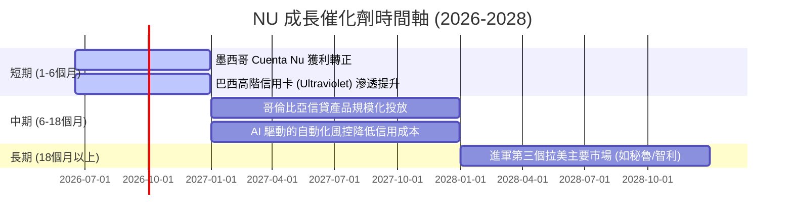

### 8.2 TAM 市場規模分析

```
╔══════════════════════════════════════════════════════════════════╗
║                     拉美零售金融 TAM 與滲透率                    ║
╠══════════════════════════════════════════════════════════════════╣
║                                                                  ║
║  巴西市場 (成熟期)：  TAM $120B  |  NU 滲透率 ~54%  | 穩健成長   ║
║  墨西哥 (爆發期)：    TAM $80B   |  NU 滲透率 ~8%   | 指數成長   ║
║  哥倫比亞 (導入期)：  TAM $30B   |  NU 滲透率 ~4%   | 具高潛力   ║
║                                                                  ║
║  💡 結論：海外市場（墨、哥）的低滲透率提供了 NU 未來 5 年的成長引擎║
╚══════════════════════════════════════════════════════════════════╝
```

### 8.3 成長驅動力結構圖

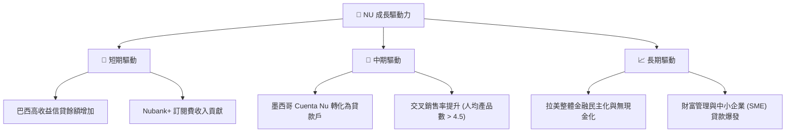

---

## 9. 風險矩陣

### 9.1 風險評分矩陣

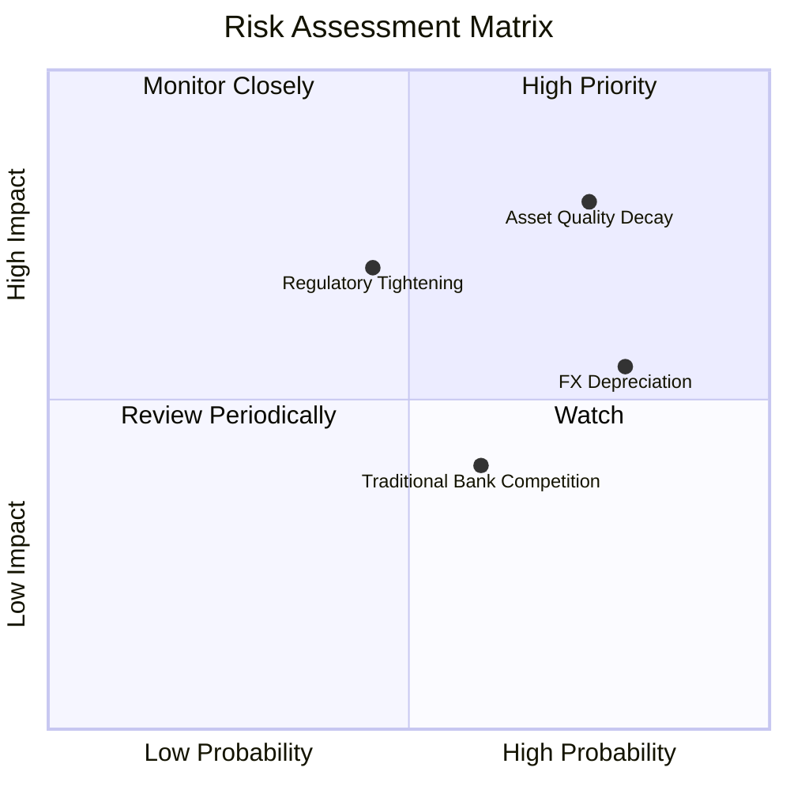

### 9.2 風險清單詳細分析

| # | 風險項目 | 發生機率 | 財務衝擊 | 風險評分 | 緩解與應對措施 |
|---|----------|----------|----------|----------|----------------|
| 1 | 🔴 **資產品質惡化 (NPL 上升)** | 高 (75%) | 高 (-15% 淨利) | 🔴 **8.0/10** | 採用機器學習即時調整授信額度，優先發放低風險的薪資扣繳貸款。 |
| 2 | 🟡 **拉美貨幣對美元大幅貶值** | 高 (80%) | 中 (-8% 淨利) | 🟡 **6.5/10** | 總部進行部分貨幣對沖，並逐步增加非巴西雷亞爾資產比例。 |
| 3 | 🟡 **各國央行監管政策收緊** | 中 (45%) | 高 (-10% 營收) | 🟡 **6.0/10** | 保持高於法定要求的資本充足率 (Basel III ratio)，與地方監管保持良性溝通。 |
| 4 | 🟢 **競爭對手價格戰** | 中 (60%) | 低 (-3% 營收) | 🟢 **4.0/10** | 憑藉極佳的用戶體驗與品牌忠誠度（NPS > 85），避免單純的價格競爭。 |

---

## 10. 投資建議

### 10.1 最終綜合評級雷達圖

```
╔══════════════════════════════════════════════════════════════╗
║                     NU 最終綜合評級                          ║
╠══════════════════════════════════════════════════════════════╣
║                                                                  ║
║   基本面強度：   9.0 / 10   ▓▓▓▓▓▓▓▓▓▓▓▓▓▓▓▓▓▓░░                 ║
║   成長前景：     9.5 / 10   ▓▓▓▓▓▓▓▓▓▓▓▓▓▓▓▓▓▓▓░                 ║
║   估值安全邊際： 8.5 / 10   ▓▓▓▓▓▓▓▓▓▓▓▓▓