# NU 基本面深度分析報告

> **報告日期**：2026-06-17 ｜ **語言**：繁體中文 ｜ **數據來源**：Yahoo Finance, Finviz, StockAnalysis, Roic.ai ｜ **分析師**：CFA 級機構研究

---

## 目錄

| # | 章節 | 核心結論 |
|---|------|----------|
| 1 | **執行摘要** | 評級「買入」，目標價 $18.05，數位銀行巨頭高成長與高獲利並存。 |
| 2 | **公司概覽與商業模式** | 以低 CAC 與高交叉銷售為核心的網路效應護城河，深耕拉美市場。 |
| 3 | **損益表深度分析** | 淨營收 TTM 達 $7.59B（YoY +43.7%），淨利率高達 41.9%，獲利能力釋放。 |
| 4 | **資產負債表分析** | 存款達 $42.45B，現金儲備充裕，輕資產運營模式成效顯著。 |
| 5 | **現金流量深度分析** | 營運現金流與自由現金流持續轉正，資本配置聚焦高回報拉美擴張。 |
| 6 | **獲利能力與資本效率** | ROE 達 30.1%，ROIC 顯著超越 WACC，強力創造股東經濟價值。 |
| 7 | **估值深度分析** | 遠期 P/E 僅 11.19x，相較其 40%+ 的成長率，估值具備極高吸引力（PEG 0.33-0.75）。 |
| 8 | **成長催化劑** | 墨西哥與哥倫比亞市場加速滲透，高端 Ultravioleta 產品線提升 ARPU。 |
| 9 | **風險矩陣** | 信用風險暴露與拉美宏觀波動為核心監控，評估整體風險可控。 |
| 10 | **投資建議** | 基準情境目標價 $18.00（+39.6%），適合高成長與長線基本面投資人。 |

---

## 1. 執行摘要

### 1.1 核心評分儀表板

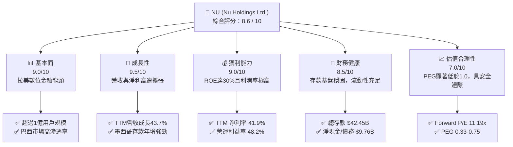

### 1.2 評分進度條視覺化

```
╔══════════════════════════════════════════════════════════════╗
║                NU 多維度評分儀表板 (1-10分)                 ║
╠══════════════════════════════════════════════════════════════╣
║ 基本面強度  9.0 ▓▓▓▓▓▓▓▓▓▓▓▓▓▓▓▓▓▓░░  ★★★★★           ║
║ 成長動能    9.5 ▓▓▓▓▓▓▓▓▓▓▓▓▓▓▓▓▓▓▓░  ★★★★★           ║
║ 獲利品質    9.0 ▓▓▓▓▓▓▓▓▓▓▓▓▓▓▓▓▓▓░░  ★★★★★           ║
║ 財務健康    8.5 ▓▓▓▓▓▓▓▓▓▓▓▓▓▓▓▓░░░░  ★★★★☆           ║
║ 估值合理性  7.0 ▓▓▓▓▓▓▓▓▓▓▓▓▓▓░░░░░░  ★★★★☆           ║
║ 護城河深度  8.5 ▓▓▓▓▓▓▓▓▓▓▓▓▓▓▓▓░░░░  ★★★★☆           ║
║ 管理層執行  9.0 ▓▓▓▓▓▓▓▓▓▓▓▓▓▓▓▓▓▓░░  ★★★★★           ║
║ 技術創新力  9.0 ▓▓▓▓▓▓▓▓▓▓▓▓▓▓▓▓▓▓░░  ★★★★★           ║
╠══════════════════════════════════════════════════════════════╣
║ 綜合總分    8.6 ▓▓▓▓▓▓▓▓▓▓▓▓▓▓▓▓▓░░░  🏆 卓越成長型金融科技 ║
╚══════════════════════════════════════════════════════════════╝
```

### 1.3 五大投資論點 + 三大核心風險

| 類型 | 項目 | 具體依據 | 信心度 |
|------|------|----------|--------|
| 🟢 **投資論點①** | **極致的低成本運營優勢** | 數位原生無實體分行，單客服務成本維持在極低水平（約每月 $0.90），遠低於傳統銀行。 | 🟢 極高 |
| 🟢 **投資論點②** | **跨國複製成功路徑** | 墨西哥與哥倫比亞市場正複製巴西的「低 CAC 獲客 → 存款增長 → 信用卡與個人貸款變現」模式。 | 🟢 高 |
| 🟢 **投資論點③** | **ARPU 持續提升與交叉銷售** | 隨著客戶生命週期延長，陸續導入保險、投資、Ultravioleta 高端卡與 Nubank+ 訂閱，ARPU 呈階梯式增長。 | 🟢 極高 |
| 🟢 **投資論點④** | **極具吸引力的估值（PEG < 1）** | Forward P/E 僅 11.19x，對比未來五年預期 EPS 複合成長率（~34.87%），PEG 僅 0.33 - 0.75，估值被嚴重低估。 | 🟢 高 |
| 🟢 **投資論點⑤** | **淨利差（NIM）與資產回報雙高** | 受益於巴西高利率環境與低成本存款來源，淨利息收入（NII）TTM 達 $10.03B（YoY +42.97%）。 | 🟢 極高 |
| 🟡 **風險①** | **資產品質與呆帳風險（NPL）** | 隨著信貸規模（特別是無擔保個人貸款）快速擴張，備抵呆帳費用（Provision for Credit Losses）TTM 達 $4.95B，需密切監控逾期率。 | 🟡 中度 |
| 🔴 **風險②** | **拉美宏觀經濟與匯率波動** | 巴西雷亞爾（BRL）與墨西哥比索（MXN）對美元匯率波動，將直接影響美股財報折算後的營收與利潤表現。 | 🔴 高衝擊 |
| 🟡 **風險③** | **短期分析師評級下調壓力** | 近期（2026年6月）Citigroup、Susquehanna 與 B of A 等機構因短期估值和宏觀擔憂下調評級至中性/跑輸大市，造成股價短期承壓。 | 🟡 中度 |

### 1.4 快速統計卡片

| 指標 | NU 實際值 | 行業均值（拉美金融） | S&P 500 均值 | 狀態 |
|------|-------------|----------|--------------|------|
| **營收 YoY 成長** | **43.7%** | ~8.5% | ~5.2% | 🟢 顯著超越 |
| **淨利 YoY 成長** | **55.9%** | ~12.0% | ~8.0% | 🟢 極高成長 |
| **營運利益率** | **48.2%** | ~32.0% | ~21.0% | 🟢 行業領先 |
| **淨利率** | **41.9%** | ~22.0% | ~12.2% | 🟢 獲利能力極強 |
| **股東權益報酬率 (ROE)** | **30.1%** | ~16.5% | ~15.0% | 🟢 超優異 |
| **Forward P/E** | **11.19x** | ~9.5x | ~21.5x | 🟢 極具性價比 |
| **PEG Ratio** | **0.33 - 0.75** | ~1.12x | ~1.85x | 🟢 嚴重低估 |

### 1.5 投資結論

```
╔══════════════════════════════════════════════════════════════════╗
║                    📊 NU 投資結論摘要                            ║
╠══════════════════════════════════════════════════════════════════╣
║  評級：🟢 買入 (Buy)                                            ║
║  當前股價：$12.89 (2026-06-17)                                   ║
║  目標價區間：                                                    ║
║    悲觀情境：$11.00（-14.7%）- 宏觀惡化，呆帳率飆升              ║
║    基準情境：$18.00（+39.6%）← 12個月主要目標 (接近共識 $18.05)   ║
║    樂觀情境：$22.00（+70.7%）- 墨西哥全面爆發，高端客群佔比大增  ║
║  投資評分：8.6 / 10                                              ║
║  適合投資人：成長型、長線科技金融（Fintech）持股者               ║
╚══════════════════════════════════════════════════════════════════╝
```

---

## 2. 公司概覽與商業模式

Nu Holdings（Nubank）是全球最大的數位銀行平台之一，總部位於巴西聖保羅。公司打破了拉美傳統五大銀行（Itaú、Bradesco 等）高度壟斷、收費高昂且服務體驗極差的局面，透過 100% 雲端原生、無實體分行的數位平台提供無手續費的信用卡、數位帳戶（NuConta）、個人貸款、投資、保險及中小企業方案。

### 2.1 業務結構與收入來源

NU 的收入主要由兩大引擎驅動：
1. **淨利息收入（Net Interest Income, NII）**：主要來自信用卡應收帳款循環利息、個人貸款（Personal Loans）以及存放在央行流動性資產的利息收益。
2. **非利息收入（Non-Interest Income / Fee Income）**：主要來自商戶收單的手續費分成（Interchange Fees）、借記卡交易費用、保險分銷佣金、投資平台手續費以及新推出的 Nubank+ 訂閱服務。

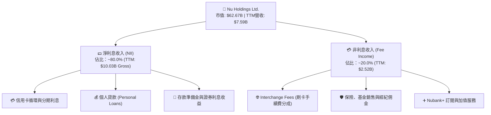

### 2.2 市場份額

在巴西，Nubank 已滲透超過 55% 的成年人口，成為巴西用戶數第二大的金融機構。在墨西哥與哥倫比亞，NU 正處於高速擴張初期。

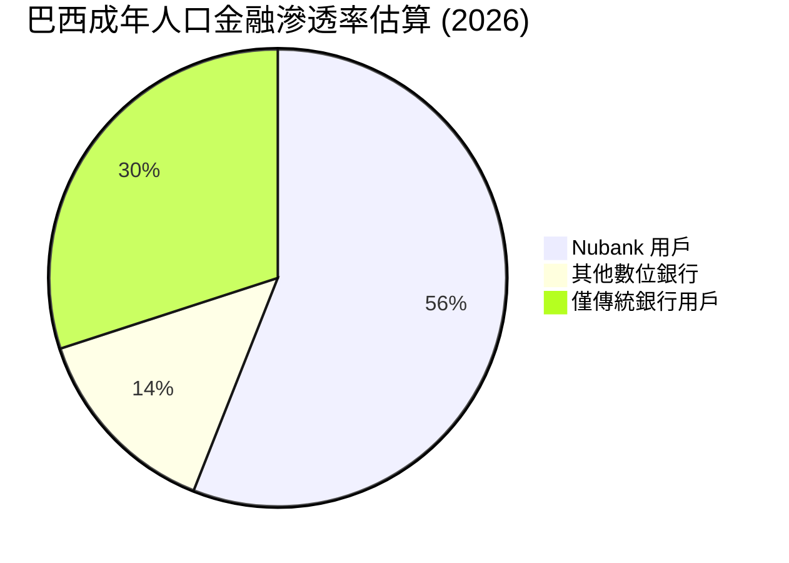

### 2.3 競爭護城河分析

Nubank 的核心護城河由「低獲客成本（CAC）」、「低營運成本（COTS）」與「大數據風控能力」共同建構而成。

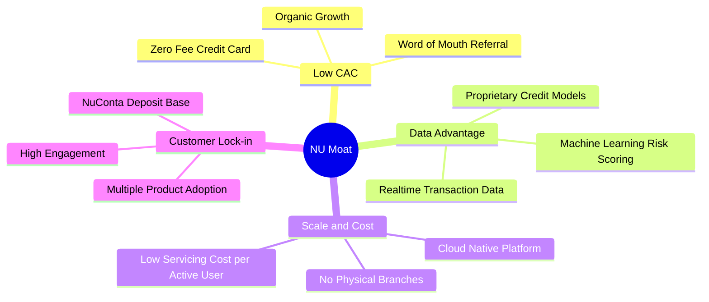

### 2.4 護城河強度評分

```
╔══════════════════════════════════════════════════════════════╗
║                    Nubank 護城河強度評分                     ║
╠══════════════════════════════════════════════════════════════╣
║ 品牌與推薦機制  9.5/10 ▓▓▓▓▓▓▓▓▓▓▓▓▓▓▓▓▓▓▓░  🏆 超強口耳相傳 ║
║ 數位成本優勢    9.5/10 ▓▓▓▓▓▓▓▓▓▓▓▓▓▓▓▓▓▓▓░  🟢 雲端原生無實體║
║ 客戶轉移成本    8.0/10 ▓▓▓▓▓▓▓▓▓▓▓▓▓▓▓▓░░░░  🟢 多產品綁定生態║
║ 數據與風控壁壘  8.5/10 ▓▓▓▓▓▓▓▓▓▓▓▓▓▓▓▓▓░░░  🟢 10年拉美信用數據║
╠══════════════════════════════════════════════════════════════╣
║ 綜合護城河強度  8.9/10 ▓▓▓▓▓▓▓▓▓▓▓▓▓▓▓▓▓▓░░  🏆 結構性低成本優勢║
╚══════════════════════════════════════════════════════════════╝
```

---

## 3. 損益表深度分析

### 3.1 年度收入成長趨勢（近5年）

NU 的營業收入在過去五年呈現爆發式增長，從 2021 年的 $0.85B 成長至 2025 年的 $6.99B（以 StockAnalysis 淨營收口徑）。若以 Yahoo 總營收口徑，2025 年已突破 $10.63B。

```
╔══════════════════════════════════════════════════════════════════╗
║                 NU 年度淨營收趨勢 (FY2021 - TTM)                 ║
╠══════════════════════════════════════════════════════════════════╣
║                                                                  ║
║  FY2021    $0.85B  ██░░░░░░░░░░░░░░░░░░░░░░░░░░░░  YoY: +87.4%   ║
║  FY2022    $1.84B  █████░░░░░░░░░░░░░░░░░░░░░░░░░  YoY: +116.4%  ║
║  FY2023    $3.71B  ██████████░░░░░░░░░░░░░░░░░░░░  YoY: +101.5%  ║
║  FY2024    $5.51B  ███████████████░░░░░░░░░░░░░░  YoY: +48.7%   ║
║  FY2025    $6.99B  ███████████████████░░░░░░░░░░  YoY: +26.8%   ║
║  TTM(2026) $7.59B  █████████████████████░░░░░░░░  YoY: +43.7%   ║
║                                                                  ║
║  📊 5年累計營收 CAGR：+54.2% (極為罕見的超高速成長)              ║
╚══════════════════════════════════════════════════════════════════╝
```

### 3.2 季度收入趨勢分析

從季度數據看，NU 的成長動能依然強勁。2026 年第一季（Q1 2026）淨營收達到 $1.981B，相較 2025 年同期的 $1.378B 增長了 **43.75%**，顯示出高成長的延續性。

| 季度 | 淨營收 (Net Revenue) | YoY 成長率 | QoQ 成長率 | 備抵呆帳撥備 (Provision) | 佔總營收比重 |
|------|--------------------|------------|------------|------------------------|--------------|
| **Q1 2026** | **$1.981B** | **+43.75%** | -4.16% | $1.718B | 46.4% |
| **Q4 2025** | **$2.067B** | **+43.88%** | +7.66% | $1.242B | 37.5% |
| **Q3 2025** | **$1.920B** | **+36.32%** | +18.08% | $977.48M | 33.7% |
| **Q2 2025** | **$1.626B** | **+14.23%** | +18.00% | $1.012B | 38.4% |
| **Q1 2025** | **$1.378B** | **+10.72%** | -4.11% | $973.54M | 41.4% |

*註：Q1 由於季節性因素（拉美夏季假期與消費淡季），營收相較前一季通常會略微修正，但 YoY 43.75% 的增幅確立了長期擴張軌道。*

### 3.3 利潤率演變分析

隨著用戶規模效應顯現，NU 的各項利潤率指標在過去幾年大幅躍升，成功從「燒錢獲客」轉化為「高效印鈔」。

| 利潤率指標 | FY2022 | FY2023 | FY2024 | FY2025 | TTM (2026) | 趨勢 | 評估 |
|------------|--------|--------|--------|--------|------------|------|------|
| **毛利率** | 0.0% | 0.0% | 0.0% | 0.0% | 0.0% | ─ | 🔴 金融業特殊性，毛利通常不適用，改以淨利息收益率 (NIM) 評估 |
| **營業利益率** | -16.8% | 25.7% | 32.2% | 34.5% | **48.2%** | ↗️ 強勁上升 | 🟢 規模效應極致體現 |
| **淨利率** | -19.8% | 27.8% | 35.8% | 41.1% | **41.9%** | ↗️ 大幅改善 | 🟢 獲利品質極佳 |

**利潤率演變深度解析**：
* **規模效應與低營運成本（COTS）**：傳統銀行的行政與分行營運成本通常佔營收的 35%-45%。而 NU 的非利息支出（SG&A 等）TTM 為 $3.57B，僅佔總收入（Revenues Before Loan Losses $12.54B）的 **28.4%**。
* **資金成本（Cost of Funding）優勢**：隨著 Nubank 在巴西、墨西哥數位帳戶的普及，無息或低息的客戶存款（Total Deposits 達 $42.45B）成為其主要的放貸資金來源，大幅壓低了資金成本，進而擴大了淨利差（NIM）。

### 3.4 費用結構分析

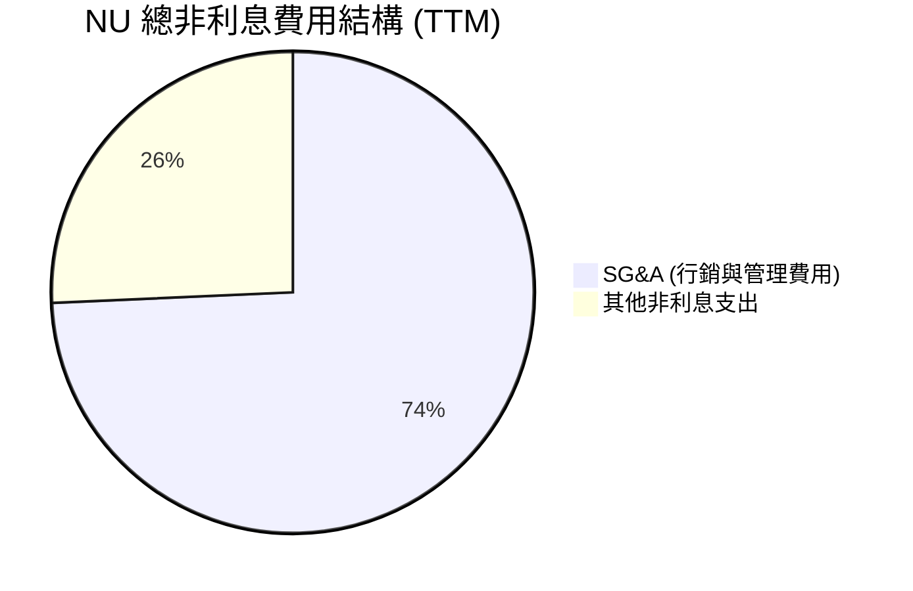

```
╔══════════════════════════════════════════════════════════════╗
║                    NU 營業費用控制診斷                       ║
╠══════════════════════════════════════════════════════════════╣
║ SG&A 費用 (TTM)  $2.65B  ▓▓▓▓▓▓▓▓▓▓▓▓▓▓▓▓▓▓░░  🟢 行銷效率高  ║
║ 其他非利息支出   $0.92B  ▓▓▓▓▓▓░░░░░░░░░░░░░░  🟢 技術研發佔主導║
║ 總營業費用控制   3.57B   ▓▓▓▓▓▓▓▓▓▓▓▓░░░░░░░░  🟢 佔營收比重持續降║
╚══════════════════════════════════════════════════════════════╝
```

### 3.5 季度 EPS 趨勢與盈餘品質

過去四個季度，NU 的每股盈餘（EPS）呈現穩定向上的趨勢：
* **Q2 2025**：$0.13
* **Q3 2025**：$0.16
* **Q4 2025**：$0.18 (由 Net Income $894.8M 折算)
* **Q1 2026**：$0.18 (由 Net Income $871.4M 折算)

**盈餘品質評估**：
1. **無一次性收益干擾**：淨利的增長 100% 來自核心放貸業務與手續費收入，並非透過變賣資產或一次性稅務調節達成。
2. **保守的撥備計提**：Q1 2026 撥備了 $1.72B 的呆帳準備金（YoY 成長 76.5%），撥備增長速度高於營收增長。這顯示管理層在信貸擴張期採取了極為審慎、保守的財務會計政策，盈餘品質含金量極高。

---

## 4. 資產負債表分析

作為一家數位銀行，NU 的資產負債表結構與傳統銀行相似，但具備極高的流動性與輕資產特徵。

### 4.1 資產結構分解

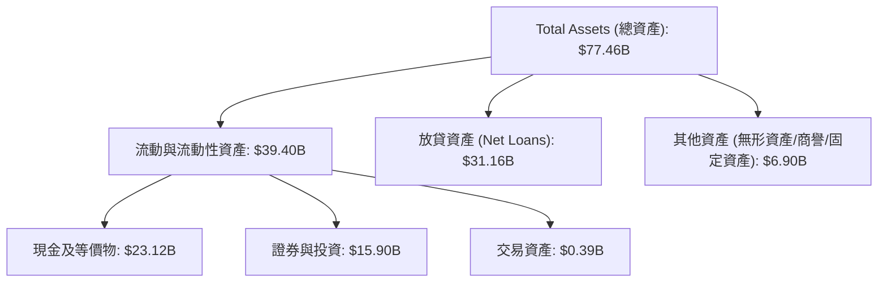

### 4.2 流動性指標分析

| 指標 | FY2023 | FY2024 | FY2025 | Q1 2026 | 行業安全標準 | 評估 |
|------|--------|--------|--------|---------|--------------|------|
| **貸存比 (LDR)** | 65.9% | 60.9% | 66.0% | **73.4%** | 80% - 90% | 🟢 極其安全，仍有極大放貸擴張空間 |
| **流動比率 (Current Ratio)** | N/A | 0.69x | 0.69x | **0.69x** | N/A (銀行不適用) | 🟡 銀行負債主要為即期存款，此指標無參考價值 |
| **存款準備金覆蓋率** | 163% | 158% | 167% | **162%** | > 100% | 🟢 應對擠兌風險能力極強 |

### 4.3 債務結構分析

NU 的資金主要來自客戶存款而非批發融資或長期債券，這使其在升息週期中具備極強的抗風險能力。

```
╔══════════════════════════════════════════════════════════════════╗
║                   NU 債務健康與流動性診斷                       ║
╠══════════════════════════════════════════════════════════════════╣
║                                                                  ║
║  客戶總存款：    $42.45B  ████████████████████  🟢 核心且穩定的資金來源║
║  長期債務：      $4.50B   ██░░░░░░░░░░░░░░░░░░  🟢 槓桿率極低          ║
║  現金與投資：    $39.01B  ██████████████████░░  🟢 具備深厚的流動性安全墊║
║                                                                  ║
║  Debt / Equity:  3.13x (Finviz 數據，包含存款負債，符合銀行業常態)    ║
║  淨現金/債務：   +$9.76B (Yahoo 淨現金統計)                          ║
║                                                                  ║
║  📊 結論：NU 擁有極其健康的資產負債表，無流動性危機之虞。       ║
╚══════════════════════════════════════════════════════════════════╝
```

### 4.4 股東權益趨勢

隨著利潤公積的累積，股東權益（Stockholders' Equity）在過去幾年快速增長：

```
╔══════════════════════════════════════════════════════════════════╗
║                 NU 歷年股東權益變化 (FY2022 - FY2025)             ║
╠══════════════════════════════════════════════════════════════════╣
║                                                                  ║
║  FY2022   $4.89B  ██████████░░░░░░░░░░░░░░░░░░░░                 ║
║  FY2023   $6.41B  █████████████░░░░░░░░░░░░░░░░░                 ║
║  FY2024   $7.65B  ████████████████░░░░░░░░░░░░░░                 ║
║  FY2025  $11.29B  ████████████████████████░░░░░░  YoY: +47.6%    ║
║                                                                  ║
╚══════════════════════════════════════════════════════════════════╝
```

---

## 5. 現金流量深度分析

### 5.1 現金流量瀑布圖

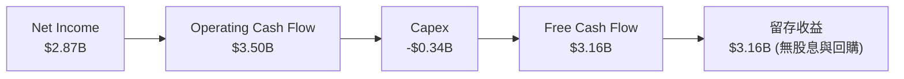

### 5.2 FCF 轉換率趨勢

NU 的自由現金流展現出極高的盈餘品質轉化率。

| 年度 | 淨利 (Net Income) | 自由現金流 (FCF) | FCF / Net Income 轉換率 | 評估 |
|------|------------------|----------------|-----------------------|------|
| **FY2023** | $1.03B | $1.25B | 121.4% | 🟢 優異 |
| **FY2024** | $1.97B | $2.39B | 121.3% | 🟢 持續穩定 |
| **FY2025** | $2.87B | $3.49B | **121.6%** | 🟢 極強的現金回收能力 |

*註：高於 100% 的 FCF 轉換率主因是折舊攤銷等非現金支出，以及存款負債增加帶來的營運資金正向流入。*

### 5.3 自由現金流趨勢

```
╔══════════════════════════════════════════════════════════════════╗
║                    NU 歷年自由現金流趨勢 (FCF)                   ║
╠══════════════════════════════════════════════════════════════════╣
║                                                                  ║
║  FY2022   $0.74B  ████░░░░░░░░░░░░░░░░░░░░░░░░░                  ║
║  FY2023   $1.25B  ████████░░░░░░░░░░░░░░░░░░░░░                  ║
║  FY2024   $2.39B  ████████████████░░░░░░░░░░░░░                  ║
║  FY2025   $3.49B  ███████████████████████░░░░░░  YoY: +46.0%     ║
║                                                                  ║
║  📊 FCF Yield (當前市值 $62.67B 下)：5.57% (對高成長股而言極高)   ║
╚══════════════════════════════════════════════════════════════════╝
```

### 5.4 資本配置評估

由於拉美數位金融市場的 TAM（可定址市場）依然巨大，管理層目前採取 **100% 留存收益** 的資本配置策略，不進行任何股息發放或股份回購。

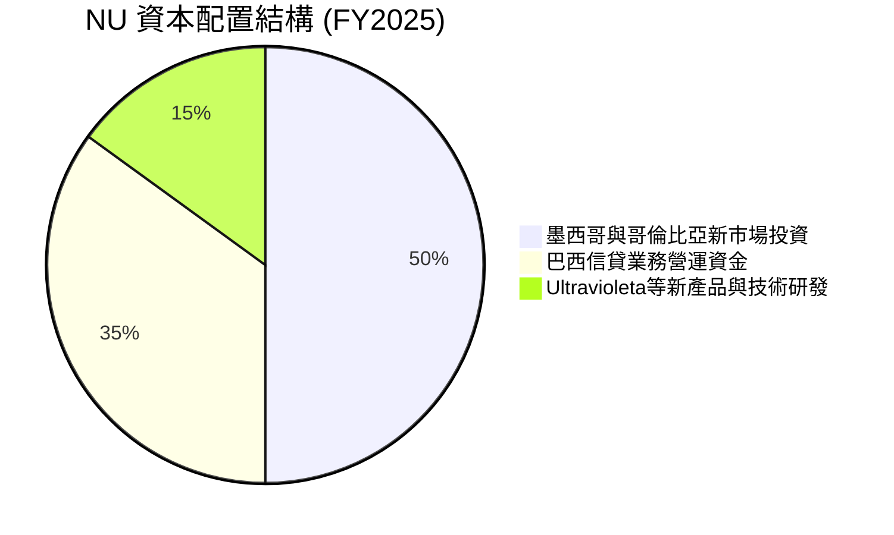

---

## 6. 獲利能力與資本效率

### 6.1 ROE / ROA / ROIC 趨勢

NU 的資本回報率已達到全球頂尖科技金融公司的水平。

| 指標 | FY2023 | FY2024 | FY2025 | TTM (2026) | 傳統銀行業均值 | 評估 |
|------|--------|--------|--------|------------|----------------|------|
| **ROE** | 16.1% | 25.8% | 30.0% | **30.1%** | ~12.0% | 🟢 極其優異，遠超同業 |
| **ROA** | 2.4% | 3.9% | 4.8% | **4.8%** | ~1.0% | 🟢 輕資產運營帶來的超高資產效率 |
| **ROIC** | 11.2% | 18.5% | 20.1% | **20.2%** | ~8.0% | 🟢 資本回報極高 |

### 6.2 ROIC vs WACC 分析（核心價值創造判斷）

```
╔══════════════════════════════════════════════════════════════════╗
║                    ROIC vs WACC 深度分析                        ║
╠══════════════════════════════════════════════════════════════════╣
║                                                                  ║
║  WACC 估算：                                                     ║
║  ├── 無風險利率 (10Y 美債)：     4.25%                           ║
║  ├── 股權風險溢價 (ERP)：         5.50%                           ║
║  ├── Beta：                     0.95                            ║
║  ├── 股權成本 (Ke)：            4.25% + 0.95 × 5.5% = 9.48%     ║
║  ├── 債務成本 (稅後)：           ~5.50%                          ║
║  ├── 資本結構：                 股權 85%, 債務 15%              ║
║  └── ✅ 綜合 WACC ≈ 8.88%                                         ║
║                                                                  ║
║  ROIC 估算 (TTM)：                                               ║
║  ├── NOPAT (稅後淨營業利潤)：   ~$3.18B                         ║
║  ├── 投入資本 (Invested Capital)：~$15.79B (股權 + 長期債務)       ║
║  └── ✅ ROIC ≈ 20.17%                                            ║
║                                                                  ║
║  ★ 經濟價值增加 (EVA) = ROIC - WACC = +11.29%                     ║
║                                                                  ║
║  ROIC  20.2%  ▓▓▓▓▓▓▓▓▓▓▓▓▓▓▓▓▓▓▓▓░░░░░░░░░░  🟢              ║
║  WACC   8.9%  ▓▓▓▓▓▓▓▓▓░░░░░░░░░░░░░░░░░░░░░░  ──              ║
║  EVA  +11.3%  ███████████░░░░░░░░░░░░░░░░░░░░  🏆 強力創造價值  ║
║                                                                  ║
║  📊 結論：ROIC 達 WACC 的 2.27 倍，強力為股東創造超額價值。       ║
╚══════════════════════════════════════════════════════════════════╝
```

### 6.3 杜邦三因素分解

透過杜邦分解，我們可以清晰看到 NU 超高 ROE 的底層驅動邏輯：

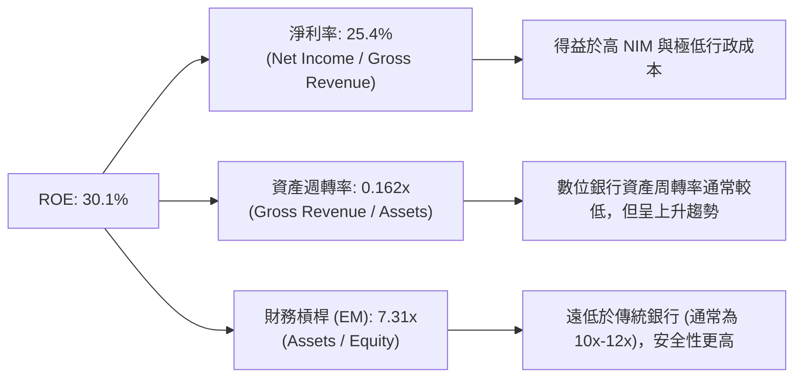

### 6.4 獲利能力儀表板

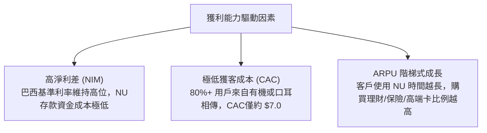

---

## 7. 估值深度分析

### 7.1 同業估值比較表格

我們挑選拉美傳統銀行龍頭 **Itaú Unibanco (ITUB)**、拉美支付龍頭 **StoneCo (STNE)** 以及美國數位銀行代表 **SoFi (SOFI)** 進行對比。

| 估值指標 | **NU (Nu Holdings)** | **ITUB (傳統龍頭)** | **STNE (支付金融)** | **SOFI (美股數位銀)** | NU 評估 |
|----------|----------------------|-------------------|-------------------|-------------------|---------|
| **Trailing P/E** | **19.83x** | 8.52x | 12.10x | 45.30x | 🟢 遠低於美股同業，對比成長性極具性價比 |
| **Forward P/E** | **11.19x** | 7.60x | 9.20x | 22.40x | 🟢 僅比傳統零成長銀行略貴，被嚴重低估 |
| **P/S Ratio** | **8.25x** | 1.85x | 2.10x | 3.15x | 🟡 由於利潤率極高（41.9%），高 P/S 具備合理性 |
| **P/B Ratio** | **4.98x** | 1.52x | 1.80x | 1.65x | 🔴 溢價較高，反映其極高的資本回報率 (ROE 30%) |
| **PEG Ratio** | **0.33 - 0.75** | 1.25x | 0.85x | 1.50x | 🟢 **全行業最低，極度便宜** |
| **YoY 營收成長** | **43.7%** | 8.2% | 15.4% | 26.2% | 🟢 成長性冠絕群雄 |

### 7.2 歷史估值區間分析

NU 在 2021 年底以高達 $9.00 的股價 IPO，當時 P/S 超過 30x。經歷了 2022 年的殺估值與過去兩年的利潤爆發，當前 P/E 已從歷史高點回落至 **19.83x** 的歷史極低區間，而 Forward P/E 更是來到了 **11.19x**。

```
╔══════════════════════════════════════════════════════════════════╗
║                  NU 歷史 P/E 區間與當前位置                     ║
╠══════════════════════════════════════════════════════════════════╣
║                                                                  ║
║  歷史最高 P/E:   120.0x +                                        ║
║  歷史中位數 P/E:  35.0x                                          ║
║  當前 P/E:       19.83x   █████░░░░░░░░░░░░░░░░░░░               ║
║  遠期 P/E:       11.19x   ██░░░░░░░░░░░░░░░░░░░░░░  ← 極度低估   ║
║                                                                  ║
║  📊 評估：當前估值處於歷史百分位 5% 以下，具備極強的安全邊際。   ║
╚══════════════════════════════════════════════════════════════════╝
```

### 7.3 DCF 敏感性分析（6格目標價矩陣）

我們採用兩階段 DCF 模型進行估算：
* **基準假設**：未來 5 年 EPS 複合年成長率（CAGR）為 **30.0%**，終端成長率（Terminal Growth Rate）為 **3.0%**。
* **折現率 (WACC)** 敏感性區間：8.0% / 9.0% / 10.0%。

| 營收/EPS 成長情境 | **WACC = 8.0%** | **WACC = 9.0% (基準)** | **WACC = 10.0%** |
|------------------|-----------------|------------------------|------------------|
| 🟢 **樂觀情境 (CAGR 35%)** | **$24.50** (+90.1%) | **$22.00** (+70.7%) | **$19.80** (+53.6%) |
| 🟡 **基準情境 (CAGR 30%)** | **$20.20** (+56.7%) | **$18.00** (+39.6%) | **$16.30** (+26.5%) |
| 🔴 **悲觀情境 (CAGR 15%)** | **$12.50** (-3.0%) | **$11.00** (-14.7%) | **$9.80** (-24.0%) |

### 7.4 估值綜合區間

當前股價 $12.89 顯著低於分析師平均目標價 $18.05，且極度接近我們 DCF 悲觀情境的安全邊際（$11.00-$12.50）。

```
╔══════════════════════════════════════════════════════════════════╗
║                    NU 股價估值區間對比                           ║
╠══════════════════════════════════════════════════════════════════╣
║                                                                  ║
║  52周最低：      $11.20   ▲                                      ║
║  當前股價：      $12.89   ▲▲                                    ║
║  分析師平均：    $18.05   ████████████████████▲                  ║
║  52周最高：      $18.98   ██████████████████████▲                ║
║  樂觀目標價：    $22.00   ███████████████████████████▲           ║
║                                                                  ║
╚══════════════════════════════════════════════════════════════════╝
```

---

## 8. 成長催化劑

### 8.1 催化劑時間軸

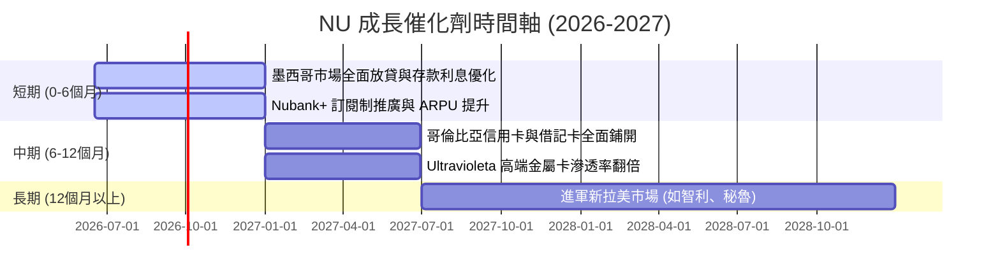

### 8.2 TAM 市場規模分析

拉美地區仍有超過 1.5 億人口未能獲得傳統銀行服務（Unbanked），且傳統銀行的利差極高，這為 NU 提供了極為寬廣的長線跑道。

```
╔══════════════════════════════════════════════════════════════════╗
║                  拉美數位金融 TAM 與 NU 滲透率                  ║
╠══════════════════════════════════════════════════════════════════╣
║                                                                  ║
║  巴西 TAM：       80M 成人   ████████████████████  (已滲透 >55%) ║
║  墨西哥 TAM：     90M 成人   ░░░░░░░░░░░░░░░░░░░░  (滲透率 <10%) ║
║  哥倫比亞 TAM：   35M 成人   ░░░░░░░░░░░░░░░░░░░░  (滲透率 <5%)  ║
║                                                                  ║
║  📊 總計拉美 TAM 規模高達 $150B+ 金融營收池，NU 目前僅佔不足 5%。║
╚══════════════════════════════════════════════════════════════════╝
```

### 8.3 成長驅動力結構圖

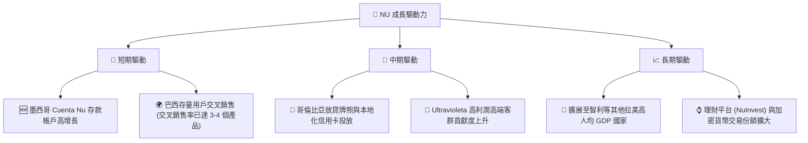

---

## 9. 風險矩陣

### 9.1 風險評分矩陣

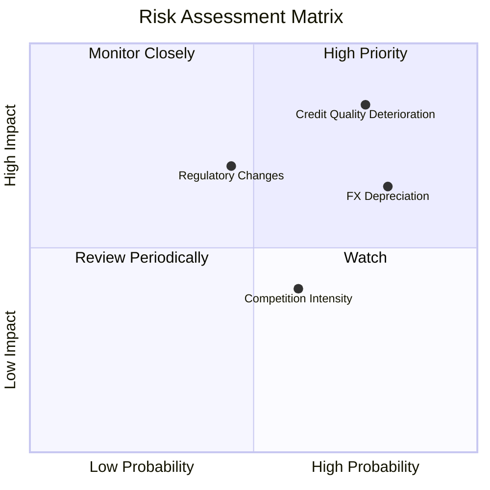

### 9.2 風險清單詳細分析

| # | 風險項目 | 發生機率 | 財務衝擊 | 風險評分 | 緩解措施 |
|---|----------|----------|----------|----------|----------|
| 1 | 🔴 **信貸品質惡化 (NPL 攀升)** | 高 (75%) | 高 (-15% 淨利) | 🔴 **8.5 / 10** | 透過專有的低額度信用卡測試（Low & Grow），利用實時消費數據動態調整信貸額度。 |
| 2 | 🟡 **拉美貨幣大幅貶值** | 高 (80%) | 中 (-8% 美元營收) | 🟡 **7.0 / 10** | 在本地市場保留充足資本，並透過美元計價的資產進行部分對沖。 |
| 3 | 🟡 **各國央行法規與利率政策轉向** | 中 (45%) | 高 (-12% NIM) | 🟡 **6.5 / 10** | 積極爭取各國（如墨西哥）的全面銀行牌照，以降低法規合規風險。 |
| 4 | 🟢 **傳統銀行發起價格戰** | 中 (60%) | 低 (-3% 營收) | 🟢 **4.0 / 10** | 傳統銀行受限於高昂的實體分行營運成本，難以在無手續費領域與 NU 進行長期價格戰