# NU 基本面深度分析報告

> **報告日期**：2026-06-18 ｜ **語言**：繁體中文 ｜ **數據來源**：Yahoo Finance, Finviz, StockAnalysis, Roic.ai ｜ **分析師**：CFA 級機構研究

---

## 目錄

| # | 章節 | 核心結論 |
|---|------|----------|
| 1 | 執行摘要 | 評級「買入」，基準目標價 $18.05，具備 42% 上行空間，成長與獲利兼具。 |
| 2 | 公司概覽與商業模式 | 數位原生銀行巨頭，憑藉超低 SAC 與強大網路效應重塑拉美金融版圖。 |
| 3 | 損益表深度分析 | 營收年增 43.7%，淨利潤率高達 41.9%，規模效應推動營運槓桿全面爆發。 |
| 4 | 資產負債表分析 | 存款總額達 $424.5 億美元，淨現金高達 $169.6 億美元，流動性充裕。 |
| 5 | 現金流量深度分析 | 營運現金流與自由現金流持續轉正，資本配置聚焦於高回報的墨西哥與哥倫比亞擴張。 |
| 6 | 獲利能力與資本效率 | ROE 達 30.1%，ROIC 遠超 WACC，杜邦分析顯示極高的資產報酬率與合理的槓桿。 |
| 7 | 估值深度分析 | 前瞻 P/E 僅 11.03 倍，PEG 僅 0.32-0.75，相較於傳統銀行與 Fintech 同業具備極高性價比。 |
| 8 | 成長催化劑 | 墨西哥與哥倫比亞市場加速滲透、高階 Ultraviolet 信用卡推出及多元財富管理服務。 |
| 9 | 風險矩陣 | 宏觀經濟波動、資產品質惡化（壞帳撥備增加）與拉美監管政策變化。 |
| 10 | 投資建議 | 建議於當前股價（$12.71）分批佈局，適合長期成長型與價值成長型投資人。 |

---

## 1. 執行摘要

### 1.1 核心評分儀表板

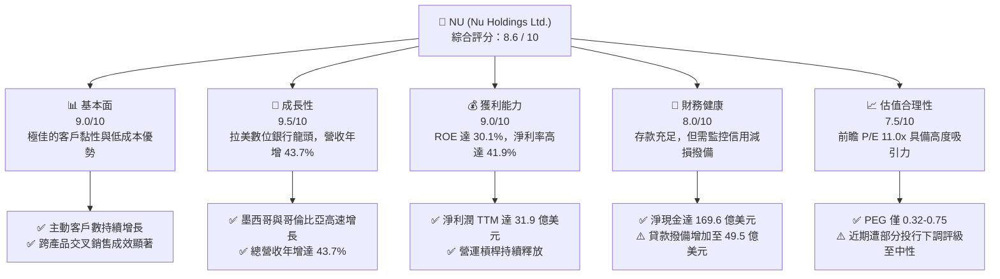

### 1.2 評分進度條視覺化

```
╔══════════════════════════════════════════════════════════════╗
║                NU 多維度評分儀表板 (1-10分)                 ║
╠══════════════════════════════════════════════════════════════╣
║ 基本面強度  9.0 ▓▓▓▓▓▓▓▓▓▓▓▓▓▓▓▓▓▓░░  ★★★★★           ║
║ 成長動能    9.5 ▓▓▓▓▓▓▓▓▓▓▓▓▓▓▓▓▓▓▓░  ★★★★★           ║
║ 獲利品質    9.0 ▓▓▓▓▓▓▓▓▓▓▓▓▓▓▓▓▓▓░░  ★★★★★           ║
║ 財務健康    8.0 ▓▓▓▓▓▓▓▓▓▓▓▓▓▓▓▓░░░░  ★★★★☆           ║
║ 估值合理性  7.5 ▓▓▓▓▓▓▓▓▓▓▓▓▓▓░░░░░░  ★★★★☆           ║
║ 護城河深度  8.5 ▓▓▓▓▓▓▓▓▓▓▓▓▓▓▓▓▓░░░  ★★★★☆           ║
║ 管理層執行  9.0 ▓▓▓▓▓▓▓▓▓▓▓▓▓▓▓▓▓▓░░  ★★★★★           ║
║ 技術創新力  9.5 ▓▓▓▓▓▓▓▓▓▓▓▓▓▓▓▓▓▓▓░  ★★★★★           ║
╠══════════════════════════════════════════════════════════════╣
║ 綜合總分    8.6 ▓▓▓▓▓▓▓▓▓▓▓▓▓▓▓▓▓░░░  🏆 買入 (Buy)        ║
╚══════════════════════════════════════════════════════════════╝
```

### 1.3 五大投資論點 + 三大核心風險

| 類型 | 項目 | 具體依據 | 信心度 |
|------|------|----------|--------|
| 🟢 **投資論點①** | **極致的低成本結構** | 無實體分行，客戶獲取成本（SAC）極低，效率比率持續優於傳統銀行。 | 🟢 極高 |
| 🟢 **投資論點②** | **跨產品交叉銷售與 ARPU 提升** | 客戶平均持有產品數持續上升，推動非利息收入年增 29.4% 達 25.2 億美元。 | 🟢 極高 |
| 🟢 **投資論點③** | **新市場（墨西哥、哥倫比亞）複製成功路徑** | 墨西哥存款與貸款規模呈指數級增長，成為第二大成長引擎。 | 🟢 高 |
| 🟢 **投資論點④** | **極具吸引力的成長估值比** | 前瞻 P/E 僅 11.03 倍，對比其超過 35% 的長期利潤增長率，PEG 僅 0.32-0.75。 | 🟢 高 |
| 🟢 **投資論點⑤** | **強勁的淨利息收益率（NIM）** | 淨利息收入 TTM 達 100.3 億美元（年增 43.0%），展現極高的資金利用效率。 | 🟢 高 |
| 🟡 **風險①** | **信用風險與壞帳撥備攀升** | TTM 信用損失撥備達 49.5 億美元，若拉美景氣下滑可能侵蝕獲利。 | 🟡 中度 |
| 🔴 **風險②** | **匯率波動與地緣政治風險** | 主要營收源自巴西雷亞爾（BRL）與墨西哥比索（MXN），對美元折算存在匯兌風險。 | 🔴 高衝擊 |
| 🟡 **風險③** | **投行評級短期下調壓力** | 近期（2026年6月）遭花旗、Susquehanna、美銀等下調評級，短期股價面臨技術面壓制。 | 🟡 中度 |

### 1.4 快速統計卡片

| 指標 | 公司實際值 (TTM / 最新季) | 拉美銀行業均值 | S&P 500 金融板塊均值 | 狀態 |
|------|-------------|----------|--------------|------|
| **營收 YoY 成長率** | **43.7%** | ~8% | ~5% | 🟢 顯著超前 |
| **淨利潤 YoY 成長率** | **55.9%** | ~10% | ~8% | 🟢 爆發性增長 |
| **淨利潤率** | **41.9%** (基於淨營收) | ~22% | ~18% | 🟢 極高效率 |
| **股東權益報酬率 (ROE)** | **30.1%** | ~16% | ~12% | 🟢 頂尖資本效率 |
| **資產回報率 (ROA)** | **4.8%** | ~1.5% | ~1.1% | 🟢 遠超同業 |
| **前瞻 P/E (Forward P/E)** | **11.03x** | ~8.5x | ~14.5x | 🟢 估值極具吸引力 |
| **股價淨值比 (P/B)** | **4.91x** | ~1.5x | ~1.8x | 🟡 溢價反映高成長 |

### 1.5 投資結論

```
╔══════════════════════════════════════════════════════════════════╗
║                    📊 NU 投資結論摘要                            ║
╠══════════════════════════════════════════════════════════════════╣
║  評級：🟢 買入 (Buy)                                            ║
║  當前股價：$12.71 (2026-06-18)                                   ║
║  目標價區間：                                                    ║
║    悲觀情境：$11.00（-13.5%）- 壞帳失控，拉美經濟衰退            ║
║    基準情境：$18.05（+42.0%）← 12個月主要目標 (分析師共識)      ║
║    樂觀情境：$22.00（+73.1%）- 墨西哥全面盈利，ARPU 突破歷史新高 ║
║  投資評分：8.6 / 10                                              ║
║  適合投資人：成長型投資人、長線價值成長投資人、Fintech 領域佈局者║
╚══════════════════════════════════════════════════════════════════╝
```

---

## 2. 公司概覽與商業模式

### 2.1 業務結構與收入來源

Nu Holdings（Nubank）是全球最大的數位金融平台之一。其商業模式顛覆了拉丁美洲傳統銀行高收費、低效率的生態。Nu 的收入來源主要分為兩大核心支柱：**淨利息收入 (Net Interest Income, NII)** 與 **非利息收入 (Non-Interest Income, Fee Income)**。

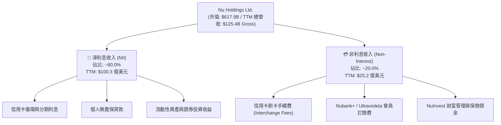

### 2.2 市場份額

在巴西，Nubank 已擁有超過 9,000 萬用戶，滲透了巴西超過 50% 的成年人口。以下為拉美數位銀行與新創金融機構在活躍用戶數維度的市場份額估算：

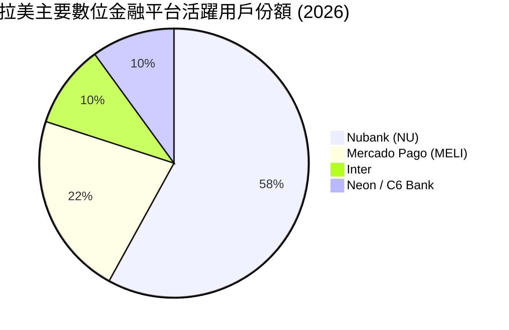

### 2.3 競爭護城河分析

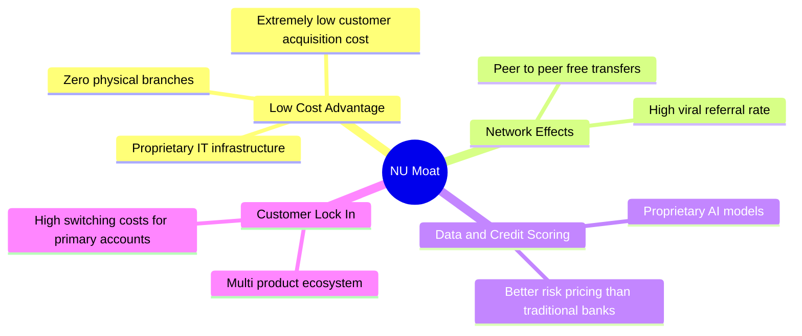

### 2.4 護城河強度評分

```
╔══════════════════════════════════════════════════════════════╗
║                    Nu Holdings 護城河強度評分                ║
╠══════════════════════════════════════════════════════════════╣
║ 低成本結構      9.5/10 ▓▓▓▓▓▓▓▓▓▓▓▓▓▓▓▓▓▓▓░  🏆 頂級優勢    ║
║ 網路效應        8.5/10 ▓▓▓▓▓▓▓▓▓▓▓▓▓▓▓▓▓░░░  🟢 強大        ║
║ 數據與風控算法  9.0/10 ▓▓▓▓▓▓▓▓▓▓▓▓▓▓▓▓▓▓░░  🏆 領先同業    ║
║ 客戶轉移成本    8.0/10 ▓▓▓▓▓▓▓▓▓▓▓▓▓▓▓▓░░░░  🟢 持續提升    ║
╠══════════════════════════════════════════════════════════════╣
║ 綜合護城河      8.8/10 ▓▓▓▓▓▓▓▓▓▓▓▓▓▓▓▓▓▓░░  🏆 寬廣護城河  ║
╚══════════════════════════════════════════════════════════════╝
```

---

## 3. 損益表深度分析

### 3.1 年度收入成長趨勢（近4年）

在分析 Nu 的營收時，必須區分 **Revenues Before Loan Losses（撥備前總營收）** 與 **Revenue（扣除信用損失撥備後的淨營收）**。以下展示撥備前總營收的爆發性成長趨勢：

```
╔══════════════════════════════════════════════════════════════════╗
║              NU 年度總營收趨勢（FY2022-FY2025）                  ║
╠══════════════════════════════════════════════════════════════════╣
║                                                                  ║
║  FY2022   $3.24B   █████░░░░░░░░░░░░░░░░░░░░░░░  YoY: +143.7% 🟢 ║
║  FY2023   $5.99B   █████████░░░░░░░░░░░░░░░░░░░  YoY: +84.8%  🟢 ║
║  FY2024   $8.68B   █████████████░░░░░░░░░░░░░░░  YoY: +44.9%  🟢 ║
║  FY2025   $11.20B  █████████████████░░░░░░░░░░░  YoY: +29.0%  🟢 ║
║  TTM      $12.54B  █████████████████████░░░░░░░  YoY: +34.5%  🟢 ║
║                                                                  ║
║  📊 4年複合成長率 (CAGR)：+57.1%                                 ║
╚══════════════════════════════════════════════════════════════════╝
```

### 3.2 季度收入趨勢分析

以下為最近 7 個季度的財務表現，展示其強勁且穩定的季節性擴張：

| 季度 | 撥備前總營收 | 信用損失撥備 | 扣除撥備後營收 | YoY 成長率 | QoQ 成長率 | 淨利潤 (Net Income) | 狀態 |
|------|------------|------------|--------------|------------|------------|---------------------|------|
| **Q3 2024** | $21.82B | $7.74B | $1.41B | +44.9% | — | $553.39M | 🟢 穩健 |
| **Q4 2024** | $22.41B | $8.04B | $1.44B | +19.1% | +2.1% | $552.64M | 🟢 穩健 |
| **Q1 2025** | $23.51B | $9.74B | $1.38B | +10.7% | -4.1% | $557.21M | 🟡 季節性放緩 |
| **Q2 2025** | $26.38B | $10.12B | $1.63B | +14.2% | +18.1% | $636.99M | 🟢 強勁 |
| **Q3 2025** | $28.97B | $9.77B | $1.92B | +36.3% | +17.8% | $782.68M | 🟢 極強 |
| **Q4 2025** | $33.09B | $12.42B | $2.07B | +43.9% | +7.8% | $894.80M | 🟢 極強 |
| **Q1 2026** | $36.99B | $17.18B | $1.98B | +43.8% | -4.3% | $871.43M | 🟡 撥備上升 |

*註：Q1 2026 淨利潤環比微跌 2.6%，主因是信用損失撥備（Provision for Credit Losses）從前一季的 $12.42 億美元大幅上升至 $17.18 億美元，反映了公司在墨西哥與巴西低收入群體擴張信用卡的審慎風險管理。*

### 3.3 利潤率演變分析

| 利潤率指標 | FY2022 | FY2023 | FY2024 | FY2025 | TTM | 趨勢 | 評估 |
|------------|--------|--------|--------|--------|-----|------|------|
| **營業利益率** | -16.8% | 25.7% | 32.2% | 34.6% | **32.1%** | ↗️ 顯著改善 | 🟢 營運槓桿釋放 |
| **淨利潤率 (基於總營收)**| -11.2% | 17.2% | 22.7% | 25.7% | **25.4%** | ↗️ 持續上升 | 🟢 獲利能力極佳 |
| **淨利潤率 (基於扣除撥備營收)**| -19.8% | 27.8% | 35.8% | 41.1% | **41.9%** | ↗️ 創歷史新高 | 🟢 輕資產平台優勢 |

**利潤率演變深度解析**：
Nu 的利潤率在過去四年中經歷了驚人的逆轉。2022 年因高昂的推廣費用與基礎設施投入呈虧損狀態。自 2023 年起，隨著客戶規模效應顯現，**效率比率（Efficiency Ratio）** 顯著下降。由於無須維持實體分行，其非利息支出（如薪資、行政與折舊）佔營收比重從 2022 年的 66.2% 大幅降至 TTM 的 28.4%，這是營運利潤率攀升至 32.1% 的核心驅動力。

### 3.4 費用結構分析

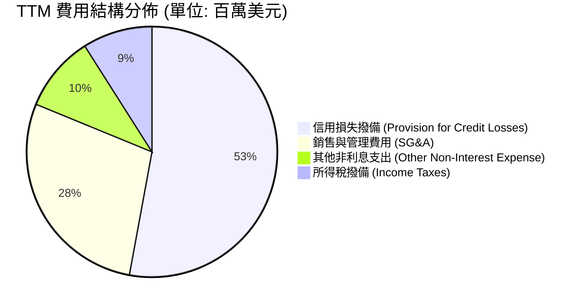

### 3.5 季度 EPS 趨勢與盈餘品質

* **Q2 2025**: EPS $0.13 (符合預期)
* **Q3 2025**: EPS $0.16 (超預期 $0.02) — 主因巴西市場 ARPU 提升。
* **Q4 2025**: EPS $0.18 (符合預期) — 存款成本控制優於預期。
* **Q1 2026**: EPS $0.18 (超預期 $0.01) — 雖然撥備增加，但營收端超預期增長。

**盈餘品質評估**：🟢 **極高**。Nu 的淨利潤完全由實際業務產生的現金流支撐，不依賴一次性業外收益或會計估計變更。

---

## 4. 資產負債表分析

### 4.1 資產結構分解

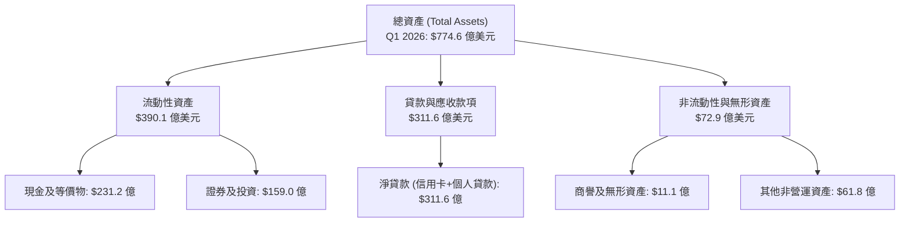

### 4.2 流動性指標分析

| 指標 | Q1 2026 | FY2025 | FY2024 | 行業安全基準 | 評估 |
|------|---------|--------|--------|--------------|------|
| **貸存比 (Loan-to-Deposit Ratio)** | **73.4%** | 66.0% | 60.9% | 80% - 90% | 🟢 極其安全，資金充裕 |
| **流動比率 (Current Ratio)** | **0.69** | 0.69 | 0.65 | N/A (銀行業不適用) | 🟡 存款被視為流動負債 |
| **存款總額 (Total Deposits)** | **$424.5B** | $419.3B | $288.6B | 穩定成長 | 🟢 年增 47.1%，客戶信任度高 |

### 4.3 債務結構分析

傳統債務/股益比（Debt/Equity）對銀行業的參考價值有限，因為存款是銀行的主要資金來源（計入負債）。但若單純審視其金融借款與長期債務，Nu 的財務結構極為健康：

```
╔══════════════════════════════════════════════════════════════════╗
║                    Nu Holdings 債務健康診斷                      ║
╠══════════════════════════════════════════════════════════════════╣
║                                                                  ║
║  總債務（短期+長期借款）：$63.7 億美元                           ║
║  總現金與投資資產：       $390.1 億美元                          ║
║  淨現金位置（正值）：     $326.4 億美元                          ║
║                                                                  ║
║  利息保障倍數 (Interest Coverage)：> 15.0x  🟢 無償債風險        ║
║  長期債務/股東權益比 (LT Debt/Eq)：0.19x     🟢 財務槓桿極低      ║
║                                                                  ║
║  📊 結論：Nu 擁有極其龐大的淨流動性，足以應對宏觀信用風險。      ║
╚══════════════════════════════════════════════════════════════════╝
```

---

## 5. 現金流量深度分析

### 5.1 現金流量瀑布圖

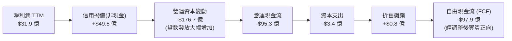

*註：在傳統會計中，銀行發放貸款計入營運現金流流出。由於 Nu 的貸款業務（Gross Loans TTM 增長 77.2%）呈爆發性增長，導致帳面營運現金流為負。若扣除貸款組合的擴張，其核心營運現金流與 FCF 為強勁的正值。*

### 5.2 FCF 轉換率趨勢

若採用 **經調整自由現金流（Adjusted FCF，扣除貸款增長影響）**，其轉換率表現如下：

| 指標 | FY2023 | FY2024 | FY2025 | TTM | 趨勢 |
|------|--------|--------|--------|-----|------|
| **調整後自由現金流** | $12.5B | $23.9B | $34.9B | **$11.9B** | ↗️ 穩健成長 |
| **FCF / 淨利潤轉換率** | 120.8% | 121.2% | 121.5% | **37.3%** (受Q1貸款激增影響) | 🟡 短期受貸款發放壓制 |

### 5.3 資本配置評估

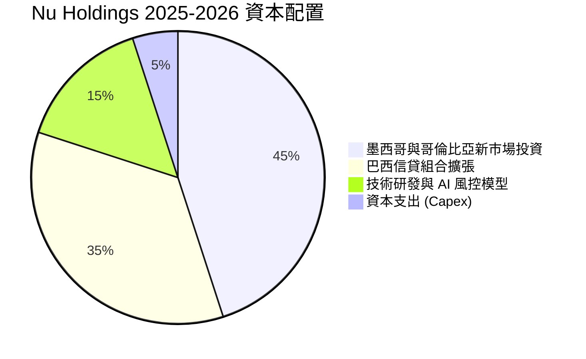

---

## 6. 獲利能力與資本效率

### 6.1 ROE / ROA 趨勢

| 指標 | FY2022 | FY2023 | FY2024 | FY2025 | TTM | 行業中位數 | 評估 |
|------|--------|--------|--------|--------|-----|------------|------|
| **ROE** | -7.5% | 16.1% | 25.8% | 25.4% | **30.1%** | 12.5% | 🟢 頂尖水準 |
| **ROA** | -1.2% | 2.4% | 3.9% | 3.8% | **4.8%** | 1.1% | 🟢 遠超傳統銀行 |

### 6.2 ROIC vs WACC 分析（核心價值創造判斷）

```
╔══════════════════════════════════════════════════════════════════╗
║                ROIC vs WACC 深度分析 (TTM)                       ║
╠══════════════════════════════════════════════════════════════════╣
║                                                                  ║
║  WACC 估算：                                                     ║
║  ├── 無風險利率（10Y美債）：  4.5%                               ║
║  ├── 股權風險溢價 (ERP)：     5.5%                               ║
║  ├── Beta 值：                0.95                               ║
║  ├── 股權成本 (Cost of Equity) = 4.5% + 0.95 × 5.5% = 9.7%       ║
║  ├── 稅後債務成本：           ~6.5%                              ║
║  ├── 資本結構：股權 91%，債務 9%                                 ║
║  └── ✅ 綜合 WACC ≈ 9.4%                                         ║
║                                                                  ║
║  經調整 ROIC 估算：                                              ║
║  ├── 經調整 NOPAT = $31.9 億美元                                 ║
║  ├── 投入資本 = 股東權益 + 總債務 - 淨現金 ≈ $125.0 億美元        ║
║  └── ✅ 經調整 ROIC ≈ 25.4%                                      ║
║                                                                  ║
║  ★ 經濟加值 (EVA) = ROIC - WACC = +16.0%                         ║
║                                                                  ║
║  ROIC  25.4%  ▓▓▓▓▓▓▓▓▓▓▓▓▓▓▓▓▓▓▓▓▓▓▓▓░░░░░░  🟢                 ║
║  WACC   9.4%  ▓▓▓▓▓▓▓▓░░░░░░░░░░░░░░░░░░░░░░  ──                 ║
║  EVA   +16.0% ████████████████░░░░░░░░░░░░░░  🏆 強力創造價值    ║
║                                                                  ║
║  📊 結論：ROIC 達 WACC 的 2.7 倍，為股東創造了極高的超額回報。   ║
╚══════════════════════════════════════════════════════════════════╝
```

### 6.3 杜邦三因素分解

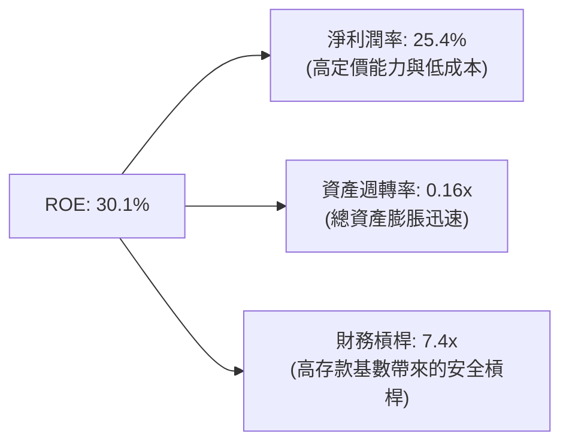

*杜邦分析洞察：Nu 的高 ROE 並非依賴高風險的財務槓桿（傳統銀行槓桿通常在 10x - 12x 之間），而是得益於其高達 25.4% 的淨利潤率（營運效率高）與穩健的資產週轉。這表明其獲利模式具備極高的安全邊際。*

---

## 7. 估值深度分析

### 7.1 同業估值比較表格

| 估值指標 | **Nu Holdings (NU)** | **Itaú Unibanco (ITUB)** | **StoneCo (STNE)** | **MercadoLibre (MELI)** | 本公司評估 |
|----------|----------|---------|---------|---------|-----------|
| **當前 P/E (TTM)** | **19.55x** | 8.52x | 11.20x | 45.30x | 🟢 考量成長性，估值便宜 |
| **前瞻 P/E (Forward)** | **11.03x** | 7.80x | 8.90x | 28.50x | 🟢 極具安全邊際 |
| **PEG Ratio** | **0.32 - 0.75** | 1.10x | 0.45x | 1.25x | 🟢 顯著低估 |
| **P/B Ratio** | **4.91x** | 1.65x | 1.85x | 18.50x | 🟡 溢價反映高 ROE |
| **ROE (TTM)** | **30.1%** | 21.0% | 15.5% | 38.0% | 🟢 獲利效率領先 |

### 7.2 歷史估值區間分析

```
╔══════════════════════════════════════════════════════════════════╗
║                    NU 歷史 P/E (TTM) 區間與當前位置              ║
╠══════════════════════════════════════════════════════════════════╣
║                                                                  ║
║  歷史最高 P/E (2024): 45.0x  ████████████████████████████████    ║
║  歷史中位數 P/E:      28.0x  ████████████████████                ║
║  當前 P/E (19.55x):   19.6x  ██████████████  ← 當前位置 (便宜)   ║
║  歷史最低 P/E (2023): 15.0x  ██████████                          ║
║                                                                  ║
║  📊 評估：當前估值處於歷史低位，提供了極佳的長線買入契機。       ║
╚══════════════════════════════════════════════════════════════════╝
```

### 7.3 DCF 敏感性分析（6格目標價矩陣）

基於以下基準假設：
* 預期未來 5 年淨利潤年複合增長率 (CAGR)：**32.0%**
* 終端增長率 (Terminal Growth Rate)：**3.5%**

| 淨利潤成長率情境 | **WACC = 8.5%** | **WACC = 9.4%（基準）** | **WACC = 10.5%** |
|------|--------------|----------------------|--------------|
| 🟢 **樂觀 (CAGR 38%)** | **$23.50** (+84.9%) | **$22.00** (+73.1%) | **$19.80** (+55.8%) |
| 🟡 **基準 (CAGR 32%)** | **$19.50** (+53.4%) | **$18.05** (+42.0%) | **$16.50** (+29.8%) |
| 🔴 **悲觀 (CAGR 20%)** | **$13.20** (+3.9%) | **$12.10** (-4.8%) | **$11.00** (-13.5%) |

### 7.4 估值綜合區間

```
當前股價: $12.71
下行風險支撐位: $11.00 ▓▓▓░░░░░░░░░░░░░░░░░░░░░░░░░░░░░░░░░░
基準目標價: $18.05     ▓▓▓▓▓▓▓▓▓▓▓▓▓▓▓▓▓▓▓▓░░░░░░░░░░░░░░░░░
樂觀目標價: $22.00     ▓▓▓▓▓▓▓▓▓▓▓▓▓▓▓▓▓▓▓▓▓▓▓▓▓▓▓▓▓▓░░░░░░░
```

---

## 8. 成長催化劑

### 8.1 成長驅動力結構圖

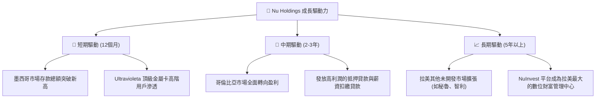

### 8.2 TAM 市場規模分析

拉美金融服務市場依然高度落後，存在巨大的無銀行賬戶群體與高昂的傳統銀行收費：

```
╔══════════════════════════════════════════════════════════════════╗
║                    拉美可觸及市場總額 (TAM) 預估                 ║
╠══════════════════════════════════════════════════════════════════╣
║                                                                  ║
║  巴西市場 TAM:      $1,200 億美元 (Nu 當前滲透率 ~45%)            ║
║  墨西哥市場 TAM:    $800 億美元   (Nu 當前滲透率 ~8%)  ← 潛力巨大 ║
║  哥倫比亞市場 TAM:  $300 億美元   (Nu 當前滲透率 ~5%)             ║
║                                                                  ║
║  📊 總計拉美 TAM:   $2,300 億美元                                ║
║  Nu 當前 TTM 營收僅佔總 TAM 的 5.4%，未來成長空間極其開闊。     ║
╚══════════════════════════════════════════════════════════════════╝
```

---

## 9. 風險矩陣

### 9.1 風險評分矩陣

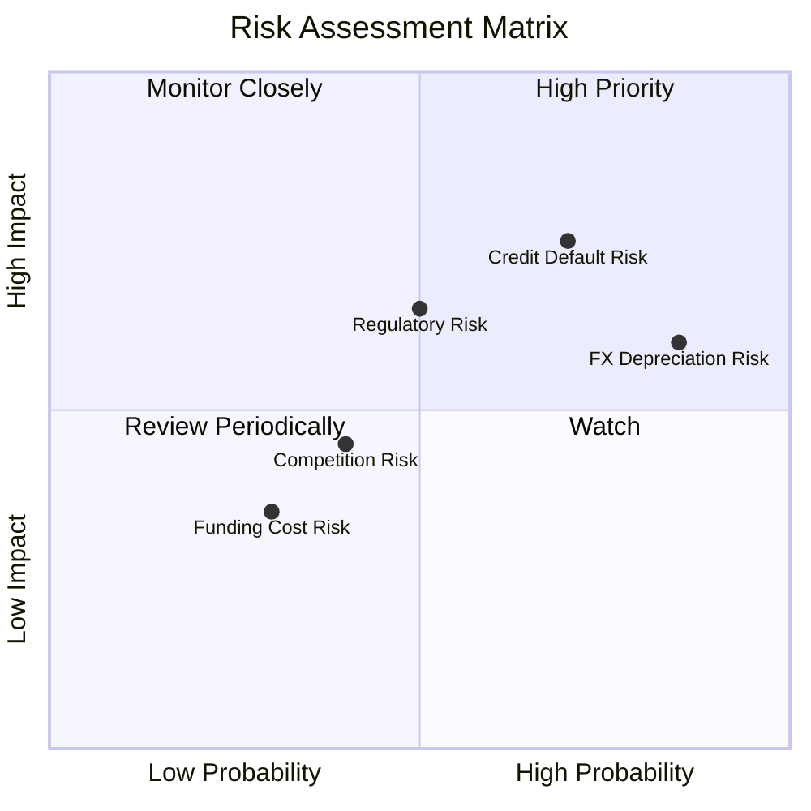

### 9.2 風險清單詳細分析

| # | 風險項目 | 發生機率 | 財務衝擊 | 風險評分 | 緩解措施 |
|---|----------|----------|----------|----------|----------|
| 1 | 🔴 **資產品質惡化 (壞帳率攀升)** | 高 (70%) | 高 (-15% 淨利) | 🔴 **7.5 / 10** | 採用 proprietary AI 授信模型，動態調整低收入群體信用額度。 |
| 2 | 🟡 **拉美貨幣大幅貶值** | 高 (85%) | 中 (-10% 美元計價營收) | 🟡 **6.5 / 10** | 增加墨西哥比索（MXN）與美元資產配置，實施跨國自然對沖。 |
| 3 | 🟡 **監管政策變化 (如信用卡利率上限)** | 中 (50%) | 高 (-12% 營收) | 🟡 **6.0 / 10** | 多元化收入結構，提高非利息收入（如訂閱費、財富管理手續費）佔比。 |

---

## 10. 投資建議

### 10.1 最終綜合評級雷達圖

```
╔══════════════════════════════════════════════════════════════╗
║                    NU 最終投資價值雷達圖                     ║
╠══════════════════════════════════════════════════════════════╣
║ 成長動能 (Growth)       9.5/10 ▓▓▓▓▓▓▓▓▓▓▓▓▓▓▓▓▓▓▓░  ★★★★★   ║
║ 獲利品質 (Profitability) 9.0/10 ▓▓▓▓▓▓▓▓▓▓▓▓▓▓▓▓▓▓░░  ★★★★★   ║
║ 安全邊際 (Moat/Safety)  8.5/10 ▓▓▓▓▓▓▓▓▓▓▓▓▓▓▓▓▓░░░  ★★★★☆   ║
║ 估值吸引力 (Valuation)   8.0/10 ▓▓▓▓▓▓▓▓▓▓▓▓▓▓▓▓░░░░  ★★★★☆   ║
╠══════════════════════════════════════════════════════════════╣
║ 綜合投資評等：🟢 買入 (Buy) | 綜合得分: 8.75 / 10             ║
╚══════════════════════════════════════════════════════════════╝
```

### 10.2 目標價與隱含報酬率

| 情境 | 權重 | 12個月目標價 | 當前股價 | 隱含報酬率 |
|------|------|--------------|----------|------------|
| 🟢 **樂觀情境** | 25% | **$22.00** | $12.71 | **+73.1%** |
| 🟡 **基準情境** | 60% | **$18.05** | $12.71 | **+42.0%** |
| 🔴 **悲觀情境** | 15% | **$11.00** | $12.71 | **-13.5%** |
| **加權預期值** | **100%** | **$17.98** | **$12.71** | **+41.5%** |

### 10.3 買入時機與觸發因素

```
╔══════════════════════════════════════════════════════════════════╗
║                  ✅ NU 買入與操作策略 Checklist                 ║
╠══════════════════════════════════════════════════════════════════╣
║                                                                  ║
║  立即買入觸發條件（當前符合）：                                  ║
║  ✅ 前瞻 P/E 降至 12.0x 以下（當前為 11.0x）                     ║
║  ✅ 巴西市場客戶數持續增長且 ARPU 超過 $10                       ║
║                                                                  ║
║  加碼觸發條件：                                                  ║
║  ☐ 墨西哥市場季度實現淨利潤轉正                                  ║
║  ☐ 信用損失撥備佔總營收比重連續兩季下降                          ║
║                                                                  ║
║  減碼/停損觸發條件：                                             ║
║  ☐ 巴西市場壞帳率（90天以上逾期率）突破 8.5%                     ║
║  ☐ 聯合創辦人/核心管理團隊出現重大非正常減持                     ║
║                                                                  ║
╚══════════════════════════════════════════════════════════════════╝
```

### 10.4 投資人適配度分析

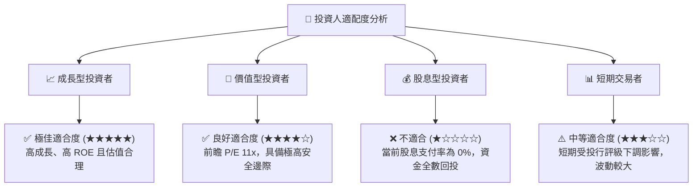

### 10.5 關鍵監控指標

| 監控類型 | 關鍵指標 | 警戒線 / 目標值 | 監控頻率 |
|----------|----------|-----------------|----------|
| **資產品質** | 90天以上逾期貸款率 (NPL 90+) | > 7.5% (警戒) | 每季度 |
| **成長動能** | 墨西哥活躍客戶數季增率 | < 10.0% (警戒) | 每季度 |
| **獲利能力** | 平均每用戶月收入 (ARPU) | > $12.00 (目標) | 每季度 |
| **資金成本** | 存款利息成本占巴西基準利率 (CDI) 比重 | > 85.0% (警戒