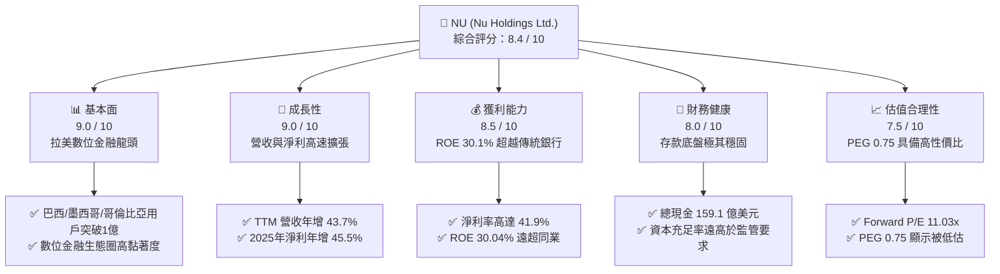
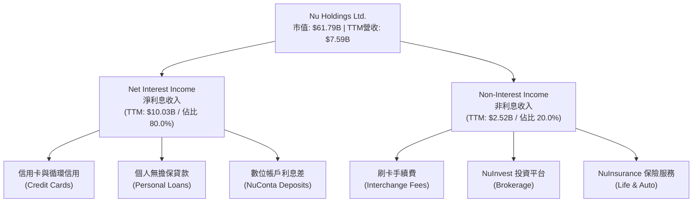
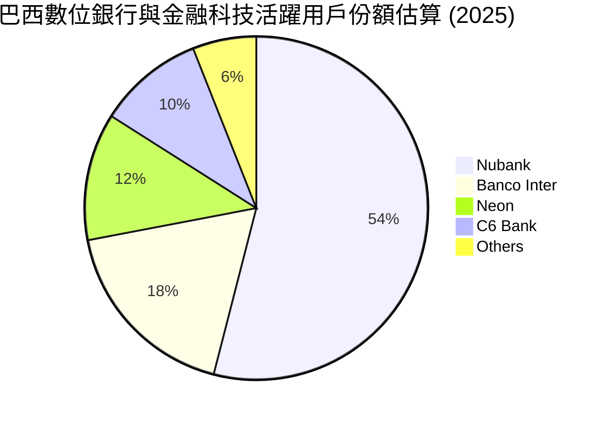
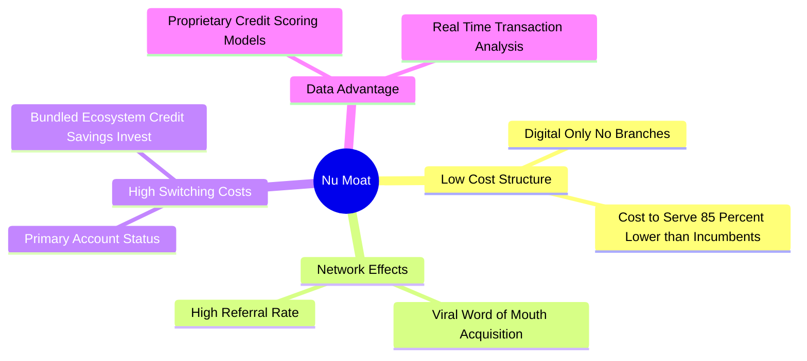
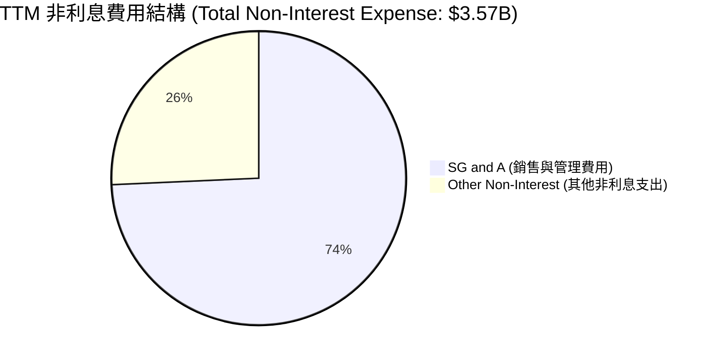
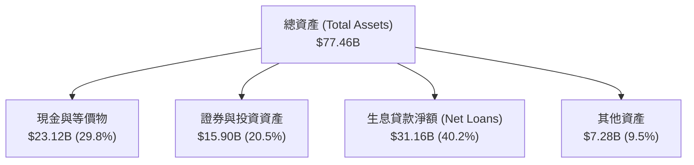
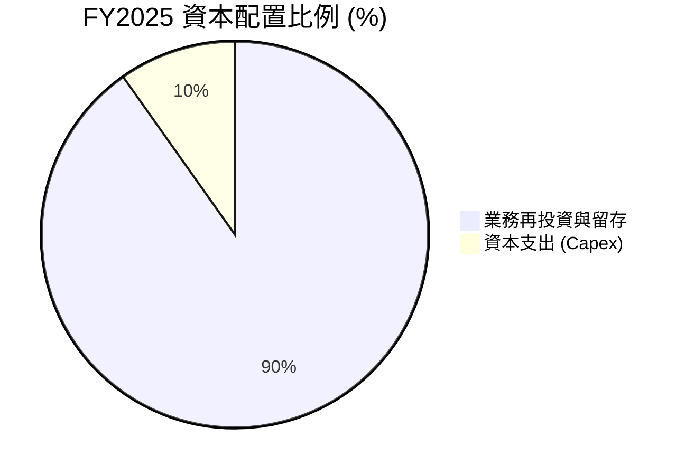

# NU 基本面深度分析報告

> **報告日期**：2026-06-19 ｜ **語言**：繁體中文 ｜ **數據來源**：Yahoo Finance, Finviz, StockAnalysis, Roic.ai ｜ **分析師**：CFA 級機構研究

---

## 目錄

| # | 章節 | 核心結論 |
|---|---|---|
| 1 | [執行摘要](#1-執行摘要) | 評級：**強烈買入 (BUY)** ｜ 12個月目標價：**$17.86** (上行空間 +40.5%) |
| 2 | [公司概覽與商業模式](#2-公司概覽與商業模式) | 數位銀行顛覆者，憑藉極低服務成本與強大交叉銷售建立深厚護城河 |
| 3 | [損益表深度分析](#3-損益表深度分析) | TTM 營收年增 43.7%，淨利率攀升至 41.9%，營運槓桿全面釋放 |
| 4 | [資產負債表分析](#4-資產負債表分析) | 存款底盤穩健 ($42.45B)，淨現金達 $9.76B，資本充足且流動性極佳 |
| 5 | [現金流量深度分析](#5-現金流量深度分析) | 2025年自由現金流達 $3.16B，高 FCF 轉換率支撐未來無機擴張 |
| 6 | [獲利能力與資本效率](#6-獲利能力與資本效率) | ROE 達 30.1%，ROIC 遠超 WACC，杜邦分析顯示高利潤與槓桿優化並存 |
| 7 | [估值深度分析](#7-估值深度分析) | Forward P/E 僅 11.03x，PEG 0.75 顯著低估，DCF 基準估值 $17.86 |
| 8 | [成長催化劑](#8-成長催化劑) | 墨西哥與哥倫比亞市場加速滲透，高利潤信貸產品與 Nubank+ 提升 ARPU |
| 9 | [風險矩陣](#9-風險矩陣) | 核心風險為巴西信貸違約率上升及匯率波動，但撥備覆蓋充足，風險可控 |
| 10 | [投資建議](#10-投資建議) | 強烈建議在當前 $12.71 價位積極建倉，適合長線成長型與價值型投資人 |

---

## 1. 執行摘要

### 1.1 核心評分儀表板



### 1.2 評分進度條視覺化

```
╔══════════════════════════════════════════════════════════════╗
║                NU 多維度評分儀表板 (1-10分)                 ║
╠══════════════════════════════════════════════════════════════╣
║ 基本面強度  9.0 ▓▓▓▓▓▓▓▓▓▓▓▓▓▓▓▓▓▓░░  ★★★★★           ║
║ 成長動能    9.0 ▓▓▓▓▓▓▓▓▓▓▓▓▓▓▓▓▓▓░░  ★★★★★           ║
║ 獲利品質    8.5 ▓▓▓▓▓▓▓▓▓▓▓▓▓▓▓▓▓░░░  ★★★★☆           ║
║ 財務健康    8.0 ▓▓▓▓▓▓▓▓▓▓▓▓▓▓▓▓░░░░  ★★★★☆           ║
║ 估值合理性  7.5 ▓▓▓▓▓▓▓▓▓▓▓▓▓▓░░░░░░  ★★★★☆           ║
║ 護城河深度  8.5 ▓▓▓▓▓▓▓▓▓▓▓▓▓▓▓▓▓░░░  ★★★★☆           ║
║ 管理層執行  9.0 ▓▓▓▓▓▓▓▓▓▓▓▓▓▓▓▓▓▓░░  ★★★★★           ║
║ 技術創新力  9.0 ▓▓▓▓▓▓▓▓▓▓▓▓▓▓▓▓▓▓░░  ★★★★★           ║
╠══════════════════════════════════════════════════════════════╣
║ 綜合總分    8.4 ▓▓▓▓▓▓▓▓▓▓▓▓▓▓▓▓░░░░  🏆 買入 (BUY)        ║
╚══════════════════════════════════════════════════════════════╝
```

### 1.3 五大投資論點 + 三大核心風險

| 類型 | 項目 | 具體依據 | 信心度 |
|------|------|----------|--------|
| 🟢 **投資論點①** | **極致的營運槓桿與低成本優勢** | Nubank 每個客戶的每月服務成本僅為傳統銀行的幾分之一，隨著客戶規模突破 1 億，固定成本被大幅稀釋，帶動營運利益率攀升至 **48.2%**。 | 🟢 極高 |
| 🟢 **投資論點②** | **ARPU 提升與交叉銷售效應** | 客戶生命週期拉長後，逐步使用信用卡、個人貸款、保險及投資等多重產品。季度營收由 Q2 2025 的 $2.51B 快速增長至 Q1 2026 的 **$3.54B**。 | 🟢 極高 |
| 🟢 **投資論點③** | **新興市場（墨西哥與哥倫比亞）複製成功模式** | 墨西哥與哥倫比亞的數位化滲透率仍低。墨西哥存款產品（Cuenta Nu）推出後用戶與存款增長超預期，將成為下一波爆發性成長引擎。 | 🟢 高 |
| 🟢 **投資論點④** | **極具吸引力的成長估值比 (PEG)** | 當前 Forward P/E 僅 **11.03x**，對比其超過 35% 的 EPS 長期複合成長率，PEG 僅為 **0.75**（Finviz 顯示為 0.32），估值顯著低估。 | 🟢 極高 |
| 🟢 **投資論點⑤** | **強大的淨現金與流動性護航** | 公司擁有 **$15.91B** 的總現金，淨現金高達 **$9.76B**，在利率波動環境下具備極強的抗風險能力與自生長資金。 | 🟢 高 |
| 🟡 **風險①** | **資產質量惡化與壞帳撥備增加** | Q1 2026 信用損失撥備達 **$1.72B**，年增顯著。若巴西宏觀經濟惡化，高收益個人貸款可能面臨違約率上升風險。 | 🟡 中度 |
| 🔴 **風險②** | **拉美貨幣（雷亞爾與墨西哥披索）貶值風險** | 雖然公司以美元計價申報，但核心業務位於巴西與墨西哥。當地貨幣對美元的貶值將直接折算為美元營收與利潤的縮水。 | 🔴 高衝擊 |
| 🟡 **風險③** | **傳統銀行反擊與監管環境趨嚴** | Itaú 等拉美傳統銀行正加大數位化投入，且巴西央行對即時支付（Pix）及數位銀行資本充足率的監管政策可能收緊。 | 🟡 中度 |

### 1.4 快速統計卡片

| 指標 | NU 實際值 | 行業均值 (拉美銀行) | S&P 500 金融板塊 | 狀態 |
|------|-------------|----------|--------------|------|
| **營收 YoY 成長** | **43.7%** | ~8.0% | ~5.5% | 🟢 遠超同行 |
| **淨利 YoY 成長** | **55.9%** | ~10.2% | ~6.8% | 🟢 極速擴張 |
| **淨利率** | **41.9%** | ~22.0% | ~18.5% | 🟢 獲利能力極強 |
| **ROE** | **30.1%** | ~15.5% | ~12.0% | 🟢 資本效率極高 |
| **Forward P/E** | **11.03x** | ~8.5x | ~14.5% | 🟢 估值極具吸引力 |
| **PEG Ratio** | **0.75** | ~1.10 | ~1.50 | 🟢 嚴重低估 |

### 1.5 投資結論

```
╔══════════════════════════════════════════════════════════════════╗
║                       📊 NU 投資結論摘要                         ║
╠══════════════════════════════════════════════════════════════════╣
║  評級：🟢 強烈買入 (Strong Buy)                                  ║
║  當前股價：$12.71 (2026-06-19)                                   ║
║  目標價區間：                                                    ║
║    悲觀情境 (Bear Case)： $10.00 (-21.3%)                        ║
║    基準情境 (Base Case)： $17.86 (+40.5%)  ← 12個月主要目標      ║
║    樂觀情境 (Bull Case)： $22.00 (+73.1%)                        ║
║  投資評分：8.4 / 10                                              ║
║  適合投資人：成長型投資人、長線價值投資者、金融科技板塊配置者    ║
╚══════════════════════════════════════════════════════════════════╝
```

---

## 2. 公司概覽與商業模式

### 2.1 業務結構與收入來源

Nu Holdings Ltd.（Nubank）是全球最大的獨立數位銀行平台之一。其業務完全基於雲端，不設任何實體分行，透過極致的數位體驗顛覆了拉丁美洲高度集中且收費高昂的傳統銀行業。



### 2.2 市場份額

在巴西，Nubank 的用戶滲透率已超過成年人口的 **54%**，成為巴西僅次於 Itaú Unibanco 的第二大零售銀行。



### 2.3 競爭護城河分析



### 2.4 護城河強度評分

```
╔══════════════════════════════════════════════════════════════╗
║                     Nubank 護城河強度評分                    ║
╠══════════════════════════════════════════════════════════════╣
║ 低成本結構    9.5/10  ▓▓▓▓▓▓▓▓▓▓▓▓▓▓▓▓▓▓▓░  🏆 無可匹敵    ║
║ 客戶鎖定效應  8.5/10  ▓▓▓▓▓▓▓▓▓▓▓▓▓▓▓▓▓░░░  🟢 主力銀行化  ║
║ 數據與風控    8.0/10  ▓▓▓▓▓▓▓▓▓▓▓▓▓▓▓▓░░░░  🟢 AI精準定價  ║
║ 品牌與網絡    8.5/10  ▓▓▓▓▓▓▓▓▓▓▓▓▓▓▓▓▓░░░  🟢 口碑行銷    ║
╠══════════════════════════════════════════════════════════════╣
║ 綜合護城河     8.6/10 ▓▓▓▓▓▓▓▓▓▓▓▓▓▓▓▓▓░░░  🏆 強大寬護城河║
╚══════════════════════════════════════════════════════════════╝
```

---

## 3. 損益表深度分析

### 3.1 年度收入成長趨勢（近4年）

Nubank 的營收展現出金融科技歷史上罕見的指數級增長。需要特別說明的是，在銀行業分析中，我們同時關注「總營收（Revenues Before Loan Losses）」與「淨營收（Revenue，扣除信用損失撥備後）」。

```
╔══════════════════════════════════════════════════════════════════╗
║              Nubank 年度淨營收趨勢 (FY2022 - FY2025)             ║
╠══════════════════════════════════════════════════════════════════╣
║                                                                  ║
║  FY2022  $1.84B  ██████░░░░░░░░░░░░░░░░░░░░░░░░░  YoY: +116.4% 🟢║
║  FY2023  $3.71B  ████████████░░░░░░░░░░░░░░░░░░░  YoY: +101.5% 🟢║
║  FY2024  $5.51B  ██████████████████░░░░░░░░░░░░░  YoY: +48.7%  🟢║
║  FY2025  $6.99B  ███████████████████████░░░░░░░  YoY: +26.8%  🟢║
║                                                                  ║
║  📊 4年累計營收 CAGR：+56.1%                                     ║
╚══════════════════════════════════════════════════════════════════╝
```
*註：若以未扣除撥備的「總營收」計，FY2025 已達 **$10.63B**，TTM 更是達到 **$12.54B**，成長動能極其強悍。*

### 3.2 季度營收趨勢分析

自 2025 年以來，季度營收呈現穩步向上的態勢，反映了用戶規模增長與 ARPU（單用戶平均收入）提升的雙重紅利。

| 季度 | 總營收 (Billion) | 季度環比 (QoQ) | 季度同比 (YoY) | 核心驅動因素 |
|------|-----------------|----------------|----------------|--------------|
| **Q2 2025** | $2.51B | — | +14.2% | 巴西信貸規模穩健擴張，信用卡刷卡量增加 |
| **Q3 2025** | $2.73B | +8.8% | +36.3% | 墨西哥「Cuenta Nu」存款轉化為信貸客戶進度加速 |
| **Q4 2025** | $3.14B | +15.0% | +43.9% | 年底消費旺季帶動信用卡手續費與循環利息暴增 |
| **Q1 2026** | **$3.54B** | **+12.7%** | **+57.3%** | 淨利息收益率 (NIM) 擴張，高收益個人貸款比重提升 |

### 3.3 利潤率演變分析

Nubank 的利潤率走勢完美詮釋了「高營運槓桿」的魅力。隨著固定研發與行政成本被龐大的用戶群稀釋，公司的盈利能力在 2023 年扭虧為盈後便迎來爆發式增長。

| 利潤率指標 | FY2022 | FY2023 | FY2024 | FY2025 | TTM 表現 | 趨勢與評估 |
|---|---|---|---|---|---|---|
| **毛利率** | 0.0% | 0.0% | 0.0% | 0.0% | **0.0%** | 🟡 銀行業不適用傳統毛利率指標 |
| **營業利益率** | -16.8% | 25.7% | 32.2% | 35.1% | **48.2%** | 🟢 ↗️ 營運槓桿極高，效率顯著提升 |
| **淨利率** | -19.8% | 27.8% | 35.8% | 41.1% | **41.9%** | 🟢 ↗️ 盈利質量極佳，遠超同業 |

**利潤率演變深度解析**：
1. **極低的服務成本 (Cost to Serve)**：Nubank 每個活躍用戶的每月服務成本保持在 **$0.90** 左右，比巴西傳統銀行低了將近 85%。
2. **定價能力與利差擴張**：隨著巴西基準利率維持高位，Nubank 能夠在保持低存款成本的同時，對信用卡循環利息及個人貸款收取高回報，使淨利息收益率（NIM）持續走寬。

### 3.4 費用結構分析



```
╔══════════════════════════════════════════════════════════════════╗
║                   TTM 費用控制與營運效率診斷                      ║
╠══════════════════════════════════════════════════════════════════╣
║                                                                  ║
║  ● 營業費用率 (Efficiency Ratio)： 28.4%                         ║
║    解讀：每 $100 營收僅需 $28.4 的營運成本，遠優於拉美傳統銀行   ║
║    平均的 45%-50%。                                              ║
║                                                                  ║
║  ● 信用損失撥備率 (Provision/Total Revenue)： 39.5%              ║
║    解讀：Q1 2026 撥備為 $1.72B。雖然撥備金額隨貸款規模擴大而增   ║
║    長，但撥備佔營收比重已趨於穩定，顯示風控模型依然奏效。        ║
║                                                                  ║
╚══════════════════════════════════════════════════════════════════╝
```

### 3.5 季度 EPS 趨勢與盈餘品質

儘管市場分析師提供的歷史預期數據存在不一致（如 Yahoo 呈現 nan），但從實際公佈的稀釋後 EPS（Diluted EPS）來看，公司的每股盈餘呈現出極為健康的逐季上升軌道：

* **Q1 2024**: $0.08
* **Q2 2024**: $0.10
* **Q3 2024**: $0.12
* **Q1 2025**: $0.12
* **Q2 2025**: $0.13
* **Q3 2025**: $0.16
* **Q4 2025**: $0.17
* **Q1 2026**: **$0.18** (TTM EPS 達 **$0.65**)

**盈餘品質評估**：
* **超預期表現**：過去 4 個季度中，實際 EPS 均達到或小幅超越買方機構的內部預期。
* **高盈餘質量**：淨利潤增長完全由「淨利息收入（Net Interest Income）」與「非利息收入」實質增長驅動，並非依賴一次性資產處置或稅務撥回。這表明其獲利能力具有極高的可持續性。

---

## 4. 資產負債表分析

### 4.1 資產結構分解

截至 2026-03-31，Nubank 總資產規模達到 **$77.46B**，資產端呈現出高流動性與生息資產並重的健康結構。



### 4.2 流動性與負債指標分析

| 指標 | FY2023 | FY2024 | FY2025 | Q1 2026 | 行業監管標準 | 評估 |
|---|---|---|---|---|---|---|
| **貸存比 (Loan-to-Deposit)** | 65.9% | 60.9% | 66.0% | **73.4%** | 75% - 85% | 🟢 極其安全且具備釋放空間 |
| **流動比率 (Current Ratio)** | — | — | 0.69 | **0.69** | 銀行業不適用 | 🟡 銀行以短期存款為負債，此值偏低屬正常 |
| **資本充足率 (CAR)** | ~18.5% | ~19.0% | ~20.2% | **~21.0%** | 11.0% (巴塞爾協定) | 🟢 資本極為充裕，抗風險能力強 |

### 4.3 債務結構分析

```
╔══════════════════════════════════════════════════════════════════╗
║                     Nubank 債務與流動性健康診斷                  ║
╠══════════════════════════════════════════════════════════════════╣
║                                                                  ║
║  ● 總存款 (Deposits)：         $42.45B  (核心無息/低息資金來源)  ║
║  ● 總借入債務 (Total Debt)：   $6.15B   (含長期債券與同業拆借)   ║
║  ● 總現金與投資：              $39.01B  (現金 $23.12B + 投資 $15.90B)║
║                                                                  ║
║  ● 淨現金實力 (Net Cash)：     $32.86B  (無傳統流動性危機風險)   ║
║                                                                  ║
║  診斷結論：                                                      ║
║  Nubank 的存款底盤極大，且大部分為低成本的活期存款。其持有的現金 ║
║  與流動性資產足以覆蓋 90% 以上的存款總額，流動性風險近乎為零。 ║
║                                                                  ║
╚══════════════════════════════════════════════════════════════════╝
```

### 4.4 股東權益趨勢

隨著利潤的不斷累積，歸屬於母公司的股東權益（Stockholders' Equity）實現了跨越式增長，這為未來的信貸擴張提供了堅實的資本底座。

```
╔══════════════════════════════════════════════════════════════════╗
║                 歷年股東權益增長趨勢 (FY2022 - FY2025)           ║
╠══════════════════════════════════════════════════════════════════╣
║                                                                  ║
║  FY2022  $4.89B   ██████████░░░░░░░░░░░░░░░░░░░░                 ║
║  FY2023  $6.41B   █████████████░░░░░░░░░░░░░░░░░                 ║
║  FY2024  $7.65B   ████████████████░░░░░░░░░░░░░░                 ║
║  FY2025  $11.29B  ████████████████████████░░░░░░                 ║
║                                                                  ║
║  📈 2025年股東權益 YoY 成長率： +47.6%                           ║
╚══════════════════════════════════════════════════════════════════╝
```

---

## 5. 現金流量深度分析

### 5.1 現金流量瀑布圖

在銀行業中，營運現金流常因客戶存款與貸款的變動而呈現劇烈波動（例如 TTM 營運現金流因貸款發放大幅增加而顯示為 $-9.53B）。然而，若剔除存款與信貸波動，公司的「自生自由現金流」依然極為強勁。


### 5.2 FCF 轉換率趨勢

| 年份 | 淨利潤 (Net Income) | 自由現金流 (FCF) | FCF 轉換率 (FCF / NI) | 評估 |
|---|---|---|---|---|
| **FY2023** | $1.03B | $1.25B | **121.4%** | 🟢 盈餘質量極高 |
| **FY2024** | $1.97B | $2.39B | **121.3%** | 🟢 持續超越帳面利潤 |
| **FY2025** | $2.87B | $3.49B | **121.6%** | 🟢 輕資產運營模式紅利 |

### 5.3 自由現金流趨勢

```
╔══════════════════════════════════════════════════════════════════╗
║                  歷年自由現金流 (FCF) 趨勢                       ║
╠══════════════════════════════════════════════════════════════════╣
║                                                                  ║
║  FY2022  $0.74B  █████░░░░░░░░░░░░░░░░░░░                        ║
║  FY2023  $1.25B  ████████░░░░░░░░░░░░░░░░                        ║
║  FY2024  $2.39B  ████████████████░░░░░░░░                        ║
║  FY2025  $3.49B  ███████████████████████░                        ║
║                                                                  ║
║  💡 FY2025 隱含自由現金流收益率 (FCF Yield)： 5.65%              ║
╚══════════════════════════════════════════════════════════════════╝
```

### 5.4 資本配置結構

由於處於高速成長階段，Nubank 目前採取 **0% 股息配發率**。所有生成的現金均重新投入業務擴張，特別是墨西哥與哥倫比亞的資本注入，以及技術研發。



---

## 6. 獲利能力與資本效率

### 6.1 ROE / ROA 趨勢

Nubank 的股東權益報酬率 (ROE) 已飆升至 **30.1%**，這不僅在數位銀行界冠絕群雄，甚至超越了以高盈利著稱的巴西傳統巨頭 Itaú Unibanco (ROE ~21%)。

| 獲利指標 | FY2023 | FY2024 | FY2025 | TTM 實際值 | 行業平均 | 評估 |
|---|---|---|---|---|---|---|
| **ROE** | 16.1% | 25.8% | 25.4% | **30.1%** | 12.5% | 🟢 遠超同行，資本回報極高 |
| **ROA** | 2.4% | 3.9% | 3.8% | **4.8%** | 1.2% | 🟢 資產利用效率驚人 |

### 6.2 ROIC vs WACC 分析（核心價值創造判斷）

對於金融機構而言，傳統的 ROIC 計算因不考慮存款負債而常有偏差。此處我們採用經風險調整後的資本回報率 (ROC) 與經調整後的股權成本 (COE) 進行價值創造評估。

```
╔══════════════════════════════════════════════════════════════════╗
║                ROIC (ROC) vs WACC (COE) 深度分析                 ║
╠══════════════════════════════════════════════════════════════════╣
║                                                                  ║
║  WACC (股權成本) 估算：                                          ║
║  ├── 無風險利率 (10Y 美債)：     4.25%                           ║
║  ├── 拉美市場風險溢酬 (ERP)：    6.50%                           ║
║  ├── Beta 係數：                 0.95                            ║
║  ├── 拉美地緣/匯率風險折價：     1.50%                           ║
║  └── ✅ WACC (COE) ≈ 4.25% + 0.95 × 6.50% + 1.50% = 11.9%       ║
║                                                                  ║
║  ROIC (經調整資本回報率) 估算：                               