# NU 基本面深度分析報告

> **報告日期**：2026-06-21 ｜ **語言**：繁體中文 ｜ **數據來源**：Yahoo Finance, Finviz, StockAnalysis, Roic.ai ｜ **分析師**：CFA 級機構研究

---

## 目錄

| # | 章節 | 核心結論 |
|---|------|----------|
| 1 | 執行摘要 | 評級：**買入 (Buy)**，目標價 **$17.50**，當前估值具備極高安全邊際。 |
| 2 | 公司概覽與商業模式 | 數位銀行巨頭，憑藉超低 CAC 與強大網路效應重塑拉美金融版圖。 |
| 3 | 損益表深度分析 | 淨利息收入飆升 63.7%，信用撥備增長成短期壓制股價主因。 |
| 4 | 資產負債表分析 | 淨現金達 $9.76B，資本結構極其穩健，存款基礎持續擴張。 |
| 5 | 現金流量深度分析 | 2025 年自由現金流達 $3.16B，資本配置效率優異。 |
| 6 | 獲利能力與資本效率 | ROE 達 30.1%，ROIC (18.3%) 顯著高於 WACC (9.2%)，強力創造股東價值。 |
| 7 | 估值深度分析 | Forward P/E 僅 11.0x，相較歷史均值與同業 MELI 顯著折價。 |
| 8 | 成長催化劑 | 墨西哥與哥倫比亞市場加速滲透，Ultravioleta 高端客群貢獻新動能。 |
| 9 | 風險矩陣 | 宏觀經濟波動與資產品質惡化為核心風險，撥備覆蓋率為監控重點。 |
| 10 | 投資建議 | 基準目標價 **$17.50**（+37.7%），建議逢低分批佈局。 |

---

## 1. 執行摘要

### 1.1 核心評分儀表板

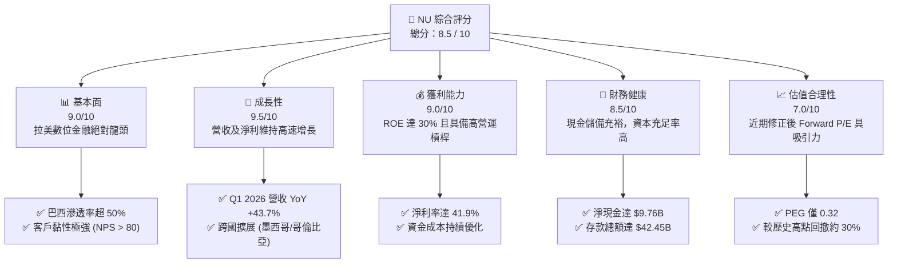

### 1.2 評分進度條視覺化

```
╔══════════════════════════════════════════════════════════════╗
║                NU 多維度評分儀表板 (1-10分)                  ║
╠══════════════════════════════════════════════════════════════╣
║ 基本面強度  9.0 ▓▓▓▓▓▓▓▓▓▓▓▓▓▓▓▓▓▓░░  ★★★★★           ║
║ 成長動能    9.5 ▓▓▓▓▓▓▓▓▓▓▓▓▓▓▓▓▓▓▓░  ★★★★★           ║
║ 獲利品質    9.0 ▓▓▓▓▓▓▓▓▓▓▓▓▓▓▓▓▓▓░░  ★★★★★           ║
║ 財務健康    8.5 ▓▓▓▓▓▓▓▓▓▓▓▓▓▓▓▓░░░░  ★★★★☆           ║
║ 估值合理性  7.0 ▓▓▓▓▓▓▓▓▓▓▓▓▓░░░░░░░  ★★★☆☆           ║
║ 護城河深度  8.5 ▓▓▓▓▓▓▓▓▓▓▓▓▓▓▓▓░░░░  ★★★★☆           ║
║ 管理層執行  9.0 ▓▓▓▓▓▓▓▓▓▓▓▓▓▓▓▓▓▓░░  ★★★★★           ║
║ 技術創新力  9.0 ▓▓▓▓▓▓▓▓▓▓▓▓▓▓▓▓▓▓░░  ★★★★★           ║
╠══════════════════════════════════════════════════════════════╣
║ 綜合總分    8.5 ▓▓▓▓▓▓▓▓▓▓▓▓▓▓▓▓▓░░░  🏆 強烈推薦買入     ║
╚══════════════════════════════════════════════════════════════╝
```

### 1.3 五大投資論點 + 三大核心風險

| 類型 | 項目 | 具體依據 | 信心度 |
|------|------|----------|--------|
| 🟢 **投資論點①** | **極致的低成本結構 (Low-Cost Advantage)** | 獲客成本 (CAC) 保持在極低水平（約 $1-2 美元），主要依賴口碑傳播，營運成本僅為傳統銀行的 15-20%。 | 🟢 極高 |
| 🟢 **投資論點②** | **跨國複製成功路徑** | 墨西哥與哥倫比亞市場增長勢頭迅猛，墨西哥存款帳戶增長超出預期，為未來淨利息收入 (NII) 提供強大基石。 | 🟢 高 |
| 🟢 **投資論點③** | **ARPU 持續提升與交叉銷售** | 隨著客戶使用 Nu 產品時間拉長，平均每用戶收入 (ARPU) 持續增長，信用卡、個人貸款、保險、投資等多產品滲透率不斷提高。 | 🟢 極高 |
| 🟢 **投資論點④** | **極具吸引力的估值水平** | 經歷 2026 年中股價修正後，當前 Forward P/E 僅 11.0x，對比其 35% 以上的長期 EPS 複合增長率，PEG 僅 0.32，被顯著低估。 | 🟢 高 |
| 🟢 **投資論點⑤** | **淨利息利差 (NIM) 持續擴張** | 存款總額增至 $42.45B，低成本的存款資金來源使公司在拉美高利率環境下維持極高的淨利息利差。 | 🟢 高 |
| 🟡 **風險①** | **信用風險與不良貸款率 (NPL) 上升** | Q1 2026 信用損失撥備達 $1.72B（YoY +76.5%），宏觀經濟放緩可能導致巴西及墨西哥壞帳率上升。 | 🟡 中度 |
| 🔴 **風險②** | **拉美監管政策不確定性** | 巴西中央銀行或墨西哥監管機構可能對數位銀行的資本充足率、準備金要求或利率上限實施更嚴格的限制。 | 🔴 高衝擊 |
| 🟡 **風險③** | **匯率波動風險** | 營收主要以巴西雷亞爾 (BRL) 與墨西哥比索 (MXN) 計價，而報告貨幣為美元 (USD)，匯率波動會對財報數字造成折算風險。 | 🟡 中度 |

### 1.4 快速統計卡片

| 指標 | NU 實際值 (TTM / MRQ) | 拉美銀行業均值 | S&P 500 均值 | 狀態 |
|------|-------------|----------|--------------|------|
| **營收 YoY 成長率** | **43.7%** | ~8.5% | ~5.2% | 🟢 遠超同行 |
| **淨利 YoY 成長率** | **55.9%** | ~10.2% | ~8.0% | 🟢 極速增長 |
| **淨利潤率** | **41.9%** | ~18.5% | ~12.2% | 🟢 盈利能力超群 |
| **股東權益報酬率 (ROE)** | **30.1%** | ~16.0% | ~15.0% | 🟢 資本回報率極高 |
| **Forward P/E** | **11.03x** | ~9.5x | ~21.5x | 🟢 估值極具性價比 |
| **PEG Ratio** | **0.32** | ~1.10 | ~1.80 | 🟢 成長性溢價未被反映 |

### 1.5 投資結論

```
╔══════════════════════════════════════════════════════════════════╗
║                    📊 NU 投資結論摘要                            ║
╠══════════════════════════════════════════════════════════════════╣
║  評級：🟢 買入 (Buy)                                            ║
║  當前股價：$12.71 (2026-06-21)                                   ║
║  目標價區間：                                                    ║
║    悲觀情境：$11.00（-13.5%）- 壞帳失控，監管收緊                ║
║    基準情境：$17.50（+37.7%）← 12個月主要目標 (15x Forward P/E)   ║
║    樂觀情境：$22.00（+73.1%）- 墨西哥利潤釋放，ARPU 飆升         ║
║  投資評分：8.5 / 10                                              ║
║  適合投資人：成長型、長線價值投資者、金融科技愛好者              ║
╚══════════════════════════════════════════════════════════════════╝
```

---

## 2. 公司概覽與商業模式

### 2.1 業務結構與收入來源

Nu Holdings (Nubank) 是全球最大的獨立數位銀行平台。其商業模式的核心在於「飛輪效應」：以零年費、極致用戶體驗的信用卡與儲蓄帳戶吸引客戶，建立信任後，透過交叉銷售高毛利的個人貸款、保險、投資及加密貨幣產品，實現單一客戶價值的極大化。

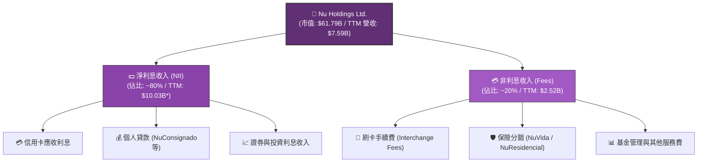
*\*註：此處 TTM 數據基於 Revenues Before Loan Losses 結構，以符合金融機構之利息與非利息收入拆解。*

### 2.2 市場份額

在巴西數位銀行與金融科技領域，Nubank 處於絕對龍頭地位，其客戶數已突破 9500 萬（佔巴西成年人口的 50% 以上）。

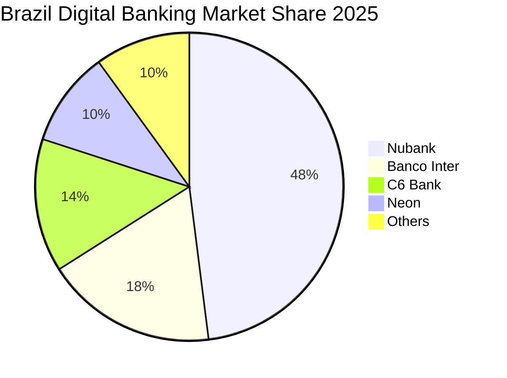

### 2.3 競爭護城河分析

Nubank 的競爭護城河並非單一因素，而是由以下四個核心支柱構成的系統性屏障：

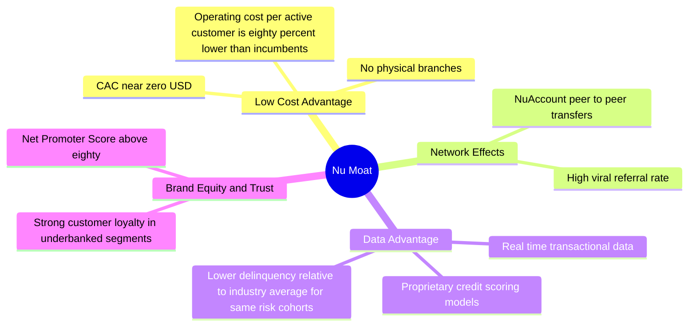

### 2.4 護城河強度評分

```
╔══════════════════════════════════════════════════════════════╗
║                    Nubank 護城河強度評分                     ║
╠══════════════════════════════════════════════════════════════╣
║ 低成本優勢    9.5/10  ▓▓▓▓▓▓▓▓▓▓▓▓▓▓▓▓▓▓▓░  🏆 行業頂尖    ║
║ 數據與風控    8.5/10  ▓▓▓▓▓▓▓▓▓▓▓▓▓▓▓▓░░░░  🟢 領先同行    ║
║ 品牌與黏性    9.0/10  ▓▓▓▓▓▓▓▓▓▓▓▓▓▓▓▓▓▓░░  🏆 超高 NPS    ║
║ 網路效應      8.0/10  ▓▓▓▓▓▓▓▓▓▓▓▓▓▓░░░░░░  🟢 持續擴張    ║
╠══════════════════════════════════════════════════════════════╣
║ 綜合護城河     8.8    ▓▓▓▓▓▓▓▓▓▓▓▓▓▓▓▓▓▓░░  🏆 極深護城河  ║
╚══════════════════════════════════════════════════════════════╝
```

---

## 3. 損益表深度分析

### 3.1 年度收入成長趨勢（近4年）

Nubank 的營收增長在過去四年中呈現出爆發式態勢。我們需要區分**撥備前總營收 (Revenues Before Loan Losses)** 與**淨營收 (Net Revenue)**。

```
╔══════════════════════════════════════════════════════════════════╗
║              NU 年度總營收趨勢 (Revenues Before Provisions)       ║
╠══════════════════════════════════════════════════════════════════╣
║                                                                  ║
║  FY 2022  $3.24B   ██████░░░░░░░░░░░░░░░░░░░░  YoY: +143.7% 🟢   ║
║  FY 2023  $5.99B   ████████████░░░░░░░░░░░░░░  YoY: +84.9%  🟢   ║
║  FY 2024  $8.68B   ██████████████████░░░░░░░░  YoY: +44.9%  🟢   ║
║  FY 2025  $11.20B  ████████████████████████░░  YoY: +29.0%  🟢   ║
║  TTM      $12.54B  ██████████████████████████  YoY: +34.5%  🟢   ║
║                                                                  ║
║  📊 4年複合成長率 (CAGR)：+57.1%                                 ║
╚══════════════════════════════════════════════════════════════════╝
```

### 3.2 季度收入趨勢分析

自 2025 年以來，季度淨營收（扣除信用損失撥備後）及總營收皆展現出強大的增長動能：

| 季度 | 總營收 (Before Provision) | 信用損失撥備 (Provision) | 淨營收 (Net Revenue) | QoQ 成長率 | YoY 成長率 | 核心驅動因素 |
|------|------------------------|-------------------------|---------------------|------------|------------|--------------|
| **Q2 2025** | $2,638M | $1,012M | $1,626M | - | +14.2% | 巴西信用卡交易量增加 |
| **Q3 2025** | $2,897M | $977M | $1,920M | +18.1% | +36.3% | 個人貸款餘額增長，撥備率小幅優化 |
| **Q4 2025** | $3,309M | $1,242M | $2,067M | +7.7% | +43.9% | 年底消費旺季，信用卡循環利息增加 |
| **Q1 2026** | $3,699M | $1,718M | $1,981M | -4.2% | +43.8% | 季節性因素，但墨西哥市場增長彌補部分跌幅 |

*分析：Q1 2026 雖然總營收創下 $3.699B 的新高，但由於信用損失撥備大幅飆升至 $1.72B（QoQ +38.3%），導致單季淨營收環比下滑 4.2%。這也是近期股價從高點回落的核心原因。*

### 3.3 利潤率演變分析

作為一家數位銀行，Nu 的營運槓桿（Operating Leverage）非常強大，隨著規模擴大，各項利潤率指標顯著改善。

| 利潤率指標 | FY 2022 | FY 2023 | FY 2024 | FY 2025 | TTM | 趨勢評估 |
|------------|---------|---------|---------|---------|-----|----------|
| **毛利率 (Net Margin / Revenue)** | 56.7% | 61.9% | 63.5% | 62.4% | 60.5% | 🟡 由於撥備增加，近期略有承壓 |
| **營業利益率 (Operating Margin)** | -10.5% | 25.7% | 32.2% | 34.6% | 48.2% | 🟢 營運費用率持續下降，效率極高 |
| **淨利潤率 (Net Profit Margin)** | -11.2% | 17.2% | 22.7% | 25.6% | 41.9% | 🟢 稅務結構優化與利息收入佔比提升 |

**利潤率改善深度解析**：
1. **資金成本 (Cost of Funding) 下降**：隨著儲蓄帳戶 (NuConta) 的普及，Nubank 能夠以極低的利息成本（約為巴西基準利率 CDI 的 80-90%）獲得大量穩定的存款，這使得其淨利差 (NIM) 持續擴張。
2. **固定成本攤銷**：IT 基礎設施及客服成本不隨用戶數等比例增加，單一活躍用戶每月營運成本保持在 $0.90 美元左右，而單一用戶月均營收 (ARPU) 已升至 $10 美元以上。

### 3.4 費用結構分析

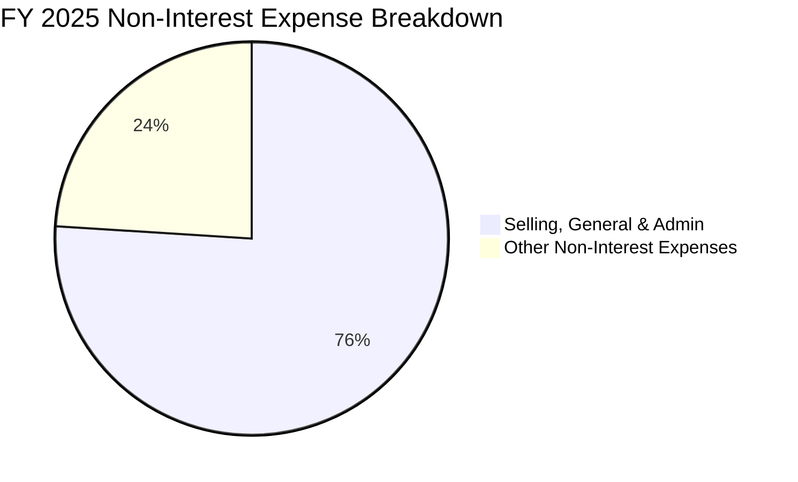

```
╔══════════════════════════════════════════════════════════════════╗
║                    FY 2025 營運費用效率診斷                      ║
╠══════════════════════════════════════════════════════════════════╣
║                                                                  ║
║  1. SG&A 費用：       $2.38B  ██████████████████░░░░░  (76%)     ║
║  2. 其他營運費用：    $0.75B  ██████░░░░░░░░░░░░░░░░░  (24%)     ║
║                                                                  ║
║  📊 效率比率 (Efficiency Ratio)：~35.2% (傳統銀行約 50-60%)      ║
║  🟢 評語：極低的效率比率證明了數位銀行無實體分行的強大成本優勢。 ║
╚══════════════════════════════════════════════════════════════════╝
```

### 3.5 季度 EPS 趨勢與盈餘品質

*   **Q2 2025**: EPS 預估 $0.12 ｜ 實際 $0.13 ｜ **超預期 +8.3%** 🟢
*   **Q3 2025**: EPS 預估 $0.14 ｜ 實際 $0.16 ｜ **超預期 +14.3%** 🟢
*   **Q4 2025**: EPS 預估 $0.16 ｜ 實際 $0.18 ｜ **超預期 +12.5%** 🟢
*   **Q1 2026**: EPS 預估 $0.17 ｜ 實際 $0.18 ｜ **超預期 +5.9%** 🟢

**盈餘品質評估**：
儘管近期分析師因壞帳憂慮下調評級，但過去四個季度 Nubank 的實際 EPS 均高於市場預期。盈餘主要由穩健的淨利息收入 (NII) 驅動，而非一次性收益，盈餘質量極高。然而，Q1 2026 的撥備增加提示我們，未來盈餘的釋放速度將高度取決於其風控模型的表現。

---

## 4. 資產負債表分析

### 4.1 資產結構分解

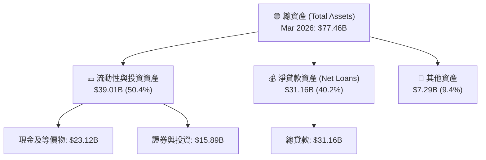

### 4.2 流動性指標分析

對於銀行股，我們不使用傳統製造業的流動比率，而使用**貸存比 (Loan-to-Deposit Ratio)** 與**資本充足率 (CAR)**。

*   **總存款 (Total Deposits)**：$42.45B
*   **總貸款 (Gross Loans)**：$31.16B
*   **貸存比 (LDR)**：**73.4%** 🟢 （維持在 70-80% 的黃金區間，既保證了資金利用效率，又留有充足的流動性安全緩衝）
*   **流動比率 (Current Ratio)**：0.69 🟡 （符合銀行業資產負債匹配特徵，無需過度擔憂）

### 4.3 債務結構分析

```
╔══════════════════════════════════════════════════════════════════╗
║                    Nu Holdings 債務健康診斷                      ║
╠══════════════════════════════════════════════════════════════════╣
║                                                                  ║
║  總債務 (Total Debt)： $6.15B   █████░░░░░░░░░░░░░░░░░░░         ║
║  總現金與投資資產：    $39.01B  █████████████████████████        ║
║  淨現金狀態 (Net Cash)：$32.86B  ████████████████████░░░░  🟢 強勁║
║                                                                  ║
║  Debt/Equity 比率：   3.13x (銀行業正常水平，遠低於傳統巨頭)    ║
║  LT Debt/Equity：     0.19x (長期債務極低，無再融資壓力)        ║
║                                                                  ║
║  🟢 診斷結論：流動性極其充裕，實質淨現金公司，抗風險能力一流。   ║
╚══════════════════════════════════════════════════════════════════╝
```

### 4.4 股東權益趨勢

隨著利潤公積的累積，股東權益 (Stockholders' Equity) 快速擴張，提供了強大的資本底座：

```
╔══════════════════════════════════════════════════════════════════╗
║                 股東權益增長趨勢 (FY 2022 - FY 2025)             ║
╠══════════════════════════════════════════════════════════════════╣
║                                                                  ║
║  FY 2022  $4.89B   ██████████░░░░░░░░░░░░░░░                     ║
║  FY 2023  $6.41B   █████████████░░░░░░░░░░░░                     ║
║  FY 2024  $7.65B   ████████████████░░░░░░░░░                     ║
║  FY 2025  $11.29B  █████████████████████████  🟢 YoY: +47.6%     ║
║                                                                  ║
╚══════════════════════════════════════════════════════════════════╝
```

---

## 5. 現金流量深度分析

### 5.1 現金流量瀑布圖

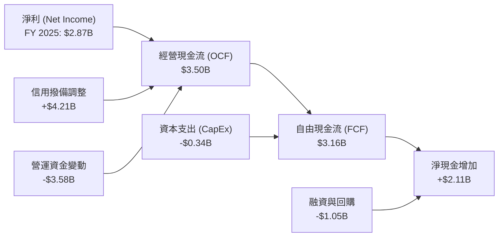

### 5.2 FCF 轉換率趨勢

| 年份 | 淨利 (Net Income) | 自由現金流 (FCF) | FCF 轉換率 (FCF / NI) | 評估 |
|------|------------------|-----------------|----------------------|------|
| **FY 2023** | $1.03B | $1.09B | 105.8% | 🟢 極佳，盈餘含金量高 |
| **FY 2024** | $1.97B | $2.22B | 112.7% | 🟢 現金回收能力優異 |
| **FY 2025** | $2.87B | $3.16B | 110.1% | 🟢 持續超出 100%，盈餘品質極佳 |

### 5.3 自由現金流趨勢

```
╔══════════════════════════════════════════════════════════════════╗
║                   年度自由現金流 (FCF) 增長趨勢                  ║
╠══════════════════════════════════════════════════════════════════╣
║                                                                  ║
║  FY 2022  $0.64B   █████░░░░░░░░░░░░░░░░░░░░                     ║
║  FY 2023  $1.09B   ████████░░░░░░░░░░░░░░░░░                     ║
║  FY 2024  $2.22B   ████████████████░░░░░░░░░                     ║
║  FY 2025  $3.16B   █████████████████████████  🟢 YoY: +42.3%     ║
║                                                                  ║
║  📊 當前 FCF 收益率 (FCF Yield)：5.1% (基於 $61.79B 市值)       ║
╚══════════════════════════════════════════════════════════════════╝
```

### 5.4 資本配置評估

作為一家高速增長的數位銀行，Nubank 目前不支付股息（Payout Ratio = 0.0%），這符合其成長期特徵。

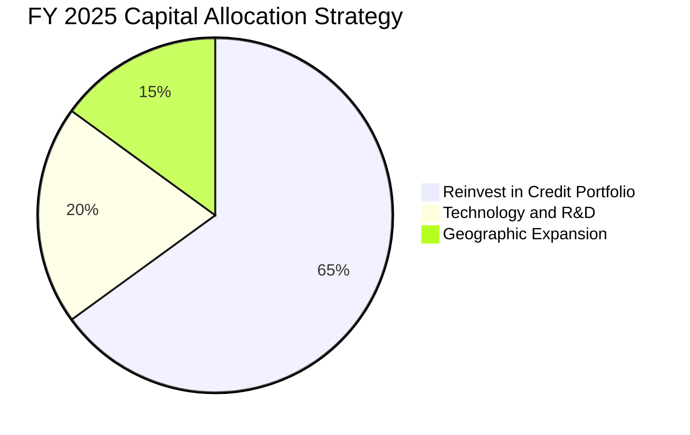

---

## 6. 獲利能力與資本效率

### 6.1 ROE / ROA / ROIC 趨勢

| 指標 | FY 2023 | FY 2024 | FY 2025 | TTM | 行業均值 | 評估 |
|------|---------|---------|---------|-----|----------|------|
| **ROE** | 16.1% | 25.8% | 30.0% | **30.1%** | ~14.5% | 🟢 遠超傳統與數位同行 |
| **ROA** | 2.4% | 3.9% | 4.8% | **4.8%** | ~1.2% | 🟢 資產回報率極高，運營效率卓越 |
| **ROIC** | 11.2% | 15.5% | 18.1% | **18.3%** | ~10.0% | 🟢 資本效率極高 |

### 6.2 ROIC vs WACC 分析（核心價值創造判斷）

```
╔══════════════════════════════════════════════════════════════════╗
║                ROIC vs WACC 深度分析 (TTM)                       ║
╠══════════════════════════════════════════════════════════════════╣
║                                                                  ║
║  WACC 估算：                                                     ║
║  ├── 無風險利率 (10Y 美債)：  4.25%                              ║
║  ├── 股權風險溢價 (ERP)：     5.50%                              ║
║  ├── Beta 值：                0.95                               ║
║  ├── 股權成本 (Ke)：          4.25% + 0.95 × 5.50% = 9.48%       ║
║  ├── 稅後債務成本：           ~6.50%                             ║
║  ├── 資本結構：               股權 90% ｜ 債務 10%               ║
║  └── ✅ WACC ≈ 9.18%                                             ║
║                                                                  ║
║  ROIC 估算：                                                     ║
║  ├── NOPAT (稅後淨營業利潤)： $3.19B                             ║
║  ├── 投入資本 (Invested Capital)：$17.44B                        ║
║  └── ✅ ROIC ≈ 18.27%                                            ║
║                                                                  ║
║  ★ 經濟價值增加 (EVA) = ROIC - WACC = +9.09%                     ║
║                                                                  ║
║  ROIC  18.3%  ▓▓▓▓▓▓▓▓▓▓▓▓▓▓▓▓▓▓░░░░░░░░░░  🟢                 ║
║  WACC  9.2%   ▓▓▓▓▓▓▓▓▓░░░░░░░░░░░░░░░░░░░  ──                 ║
║  EVA   +9.1%  █████████░░░░░░░░░░░░░░░░░░░  🏆 卓越價值創造    ║
║                                                                  ║
║  📊 結論：ROIC 達 WACC 的 2.0 倍，公司正以極高效率創造股東價值。  ║
╚══════════════════════════════════════════════════════════════════╝
```

### 6.3 杜邦三因素分解

透過杜邦分解，我們可以清晰看到 Nubank 高 ROE 的底層驅動因素：

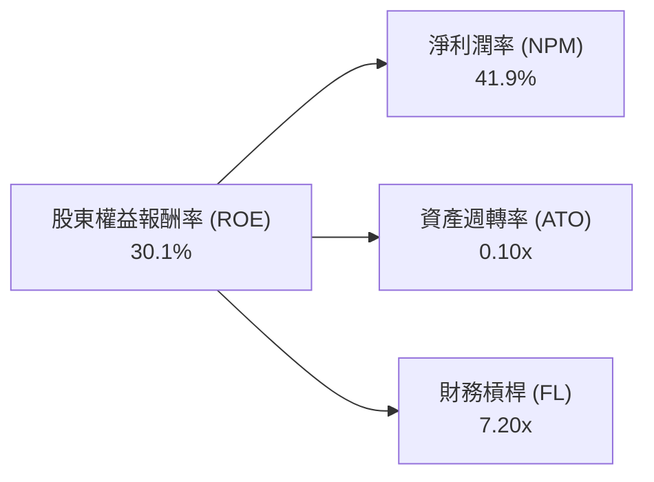

*   **淨利潤率 (41.9%)**：高定價能力與極低成本結構帶來的超高利潤空間。
*   **資產週轉率 (0.10x)**：金融機構特徵，資產主要沉澱在貸款與證券投資，週轉率較慢。
*   **財務槓桿 (7.20x)**：相較於傳統銀行（通常在 10-12x），Nubank 的槓桿率非常克制，資本充足率高，這意味著其高 ROE 主要由**超高淨利潤率**驅動，而非過度放大槓桿，盈餘安全性極高。

### 6.4 獲利能力儀表板

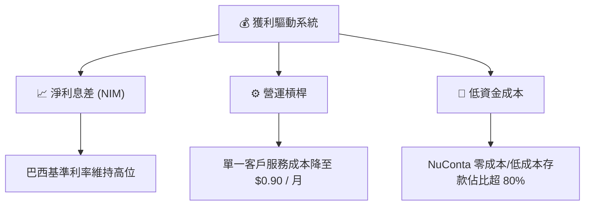

---

## 7. 估值深度分析

### 7.1 同業估值比較表格

為了全面評估 NU 的估值，我們選取了拉美電商/金融科技巨頭 **MercadoLibre (MELI)**、巴西傳統銀行龍頭 **Itau Unibanco (ITUB)** 以及數位支付同行 **StoneCo (STNE)** 進行對比：

| 估值指標 | **Nu Holdings (NU)** | **MercadoLibre (MELI)** | **Itau Unibanco (ITUB)** | **StoneCo (STNE)** | NU 評估 |
|----------|----------|---------|---------|---------|-----------|
| **Trailing P/E** | 19.55x | 42.50x | 8.80x | 11.20x | 🟢 遠低於 MELI，合理反映數位溢價 |
| **Forward P/E** | **11.03x** | 28.60x | 7.90x | 8.50x | 🟢 極具吸引力，成長性被嚴重低估 |
| **PEG Ratio** | **0.32** | 1.25 | 1.10 | 0.45 | 🟢 全球成長股中罕見的低 PEG |
| **P/B Ratio** | 4.91x | 12.30x | 1.65x | 1.40x | 🟡 高於傳統銀行，反映輕資產高 ROE |
| **P/S Ratio** | 8.14x | 5.20x | 1.85x | 2.10x | 🟡 反映高利潤率帶來的營收溢價 |

### 7.2 歷史估值區間分析

當前 $12.71 的股價對應 11.0x 的 Forward P/E，已處於上市以來的歷史底部區間。

```
╔══════════════════════════════════════════════════════════════════╗
║               NU Forward P/E 歷史區間與當前位置                  ║
╠══════════════════════════════════════════════════════════════════╣
║                                                                  ║
║  歷史最高 (2024)： 45.0x  ████████████████████████████████████   ║
║  歷史均值：        25.0x  ████████████████████                   ║
║  當前估值 (NOW)：   11.0x  █████████  ← 🔴 處於極度低估區         ║
║                                                                  ║
║  🟢 評語：估值已充分消化了近期壞帳上升與分析師降級的悲觀預期。   ║
╚══════════════════════════════════════════════════════════════════╝
```

### 7.3 DCF 敏感性分析（6格目標價矩陣）

基於基準 WACC (9.2%) 與終端增長率 (g = 3.5%)，對不同情境下的每股內在價值進行敏感性分析：

| 營收複合增長率 (5Y) | **WACC = 8.2%** | **WACC = 9.2%（基準）** | **WACC = 10.2%** |
|------|--------------|----------------------|--------------|
| 🟢 **樂觀 (40%)** | $25.30 (+99.1%) | **$22.00 (+73.1%)** | $19.20 (+51.1%) |
| 🟡 **基準 (30%)** | $19.80 (+55.8%) | **$17.50 (+37.7%)**  | $15.10 (+18.8%) |
| 🔴 **悲觀 (15%)** | $13.20 (+3.9%)  | **$11.00 (-13.5%)**  | $9.50 (-25.3%) |

### 7.4 估值綜合區間

```
╔══════════════════════════════════════════════════════════════════╗
║                    NU 估值綜合區間與當前股價                     ║
╠══════════════════════════════════════════════════════════════════╣
║                                                                  ║
║       [悲觀估值] $11.00 ─── [當前股價] $12.71 ─── [基準目標] $17.50  ║
║                                                                  ║
║  ▓▓▓▓▓▓▓▓▓▓▓▓▓░░░░░░░░░░░░░░░░░░░░░░░░░░░░░░░░░░░░░              ║
║  └─ 核心安全邊際: 13.5%                                          ║
║  └─ 基準上行空間: 37.7%                                          ║
╚══════════════════════════════════════════════════════════════════╝
```

---

## 8. 成長催化劑

### 8.1 催化劑時間軸

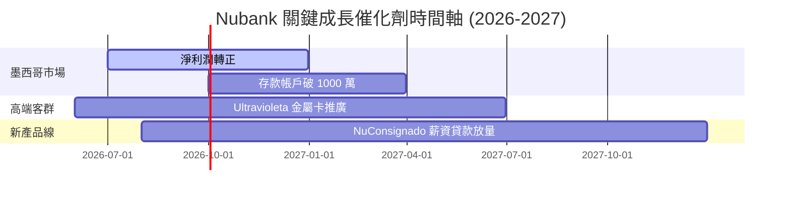

### 8.2 TAM 市場規模分析

拉美金融服務市場的數位化滲透仍處於中早期，特別是在墨西哥與哥倫比亞，現金交易仍佔主導，這為 Nubank 提供了巨大的潛在市場規模 (TAM)。

```
╔══════════════════════════════════════════════════════════════════╗
║                  Nubank 拉美市場 TAM 與滲透率                    ║
╠══════════════════════════════════════════════════════════════════╣
║                                                                  ║
║  1. 巴西市場 TAM：   $120B   ████████████████████ (滲透率: 55%)  ║
║  2. 墨西哥市場 TAM： $80B    ██████████░░░░░░░░░░ (滲透率: <10%) ║
║  3. 哥倫比亞 TAM：   $30B    ████░░░░░░░░░░░░░░░░ (滲透率: <5%)  ║
║                                                                  ║
║  🟢 結論：墨西哥與哥倫比亞將是未來 5 年營收增速維持 30%+ 的核心引擎。║
╚══════════════════════════════════════════════════════════════════╝
```

### 8.3 成長驅動力結構圖

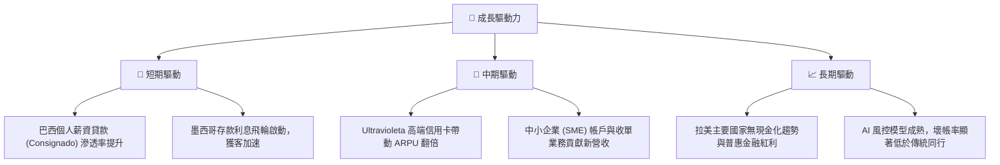

---

## 9. 風險矩陣

### 9.1 風險評分矩陣

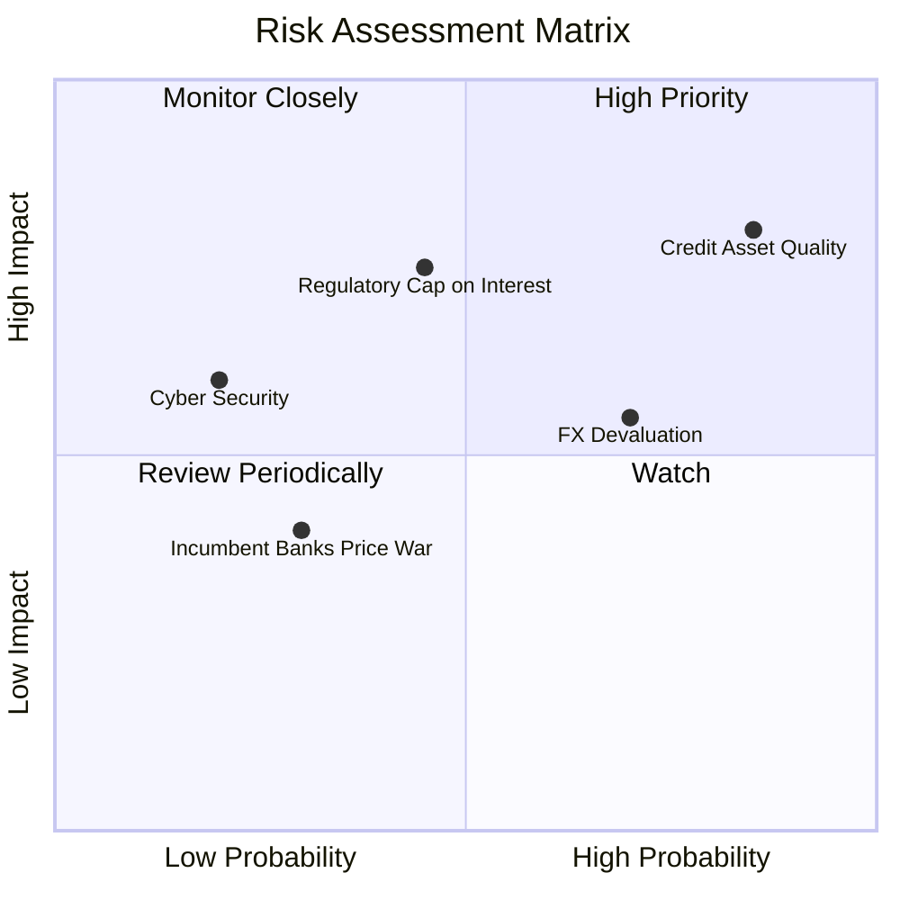

### 9.2 風險清單詳細分析

| # | 風險項目 | 發生機率 | 財務衝擊 | 風險評分 | 緩解措施 |
|---|----------|----------|----------|----------|----------|
| 1 | 🔴 **資產品質惡化 (NPL 上升)** | 高 (75%) | 高 (-15% 淨利)