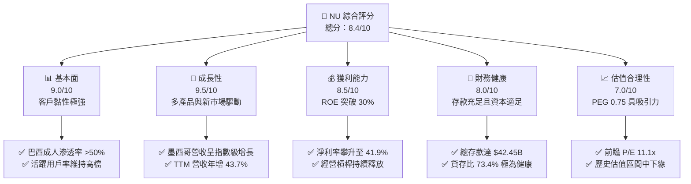
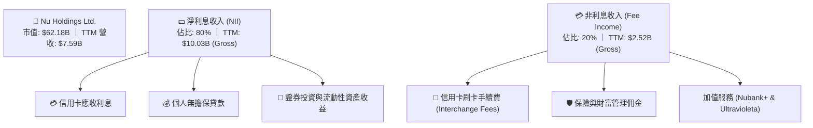
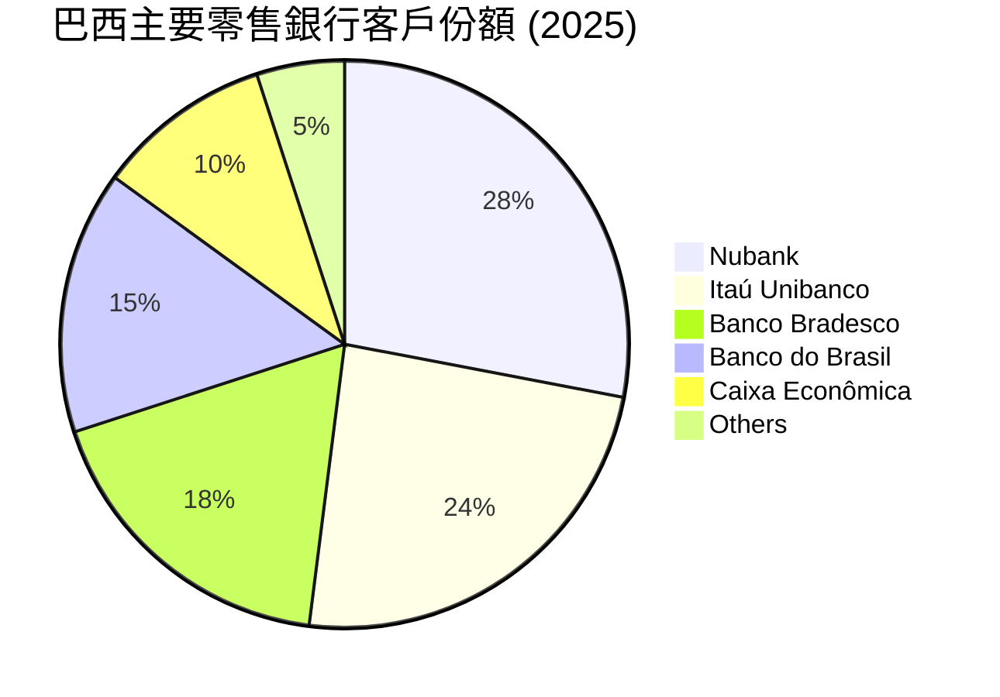
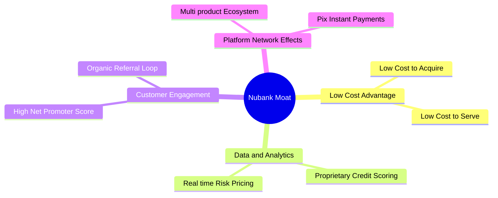
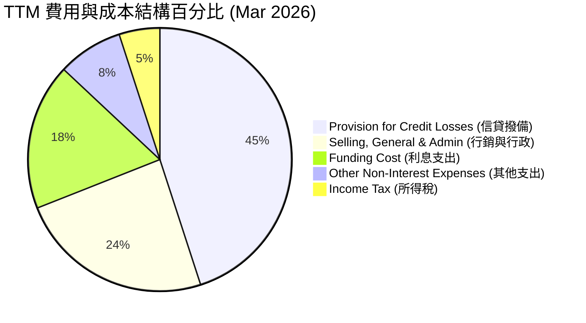
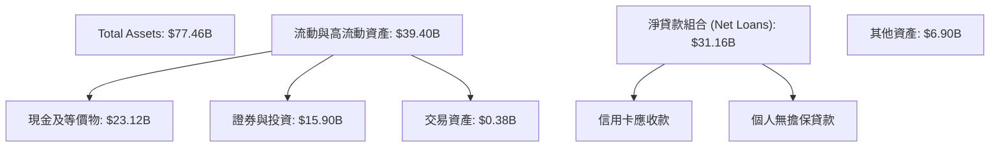
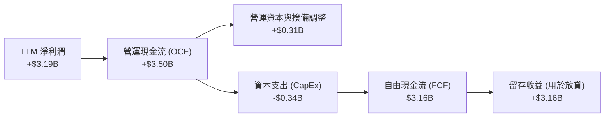
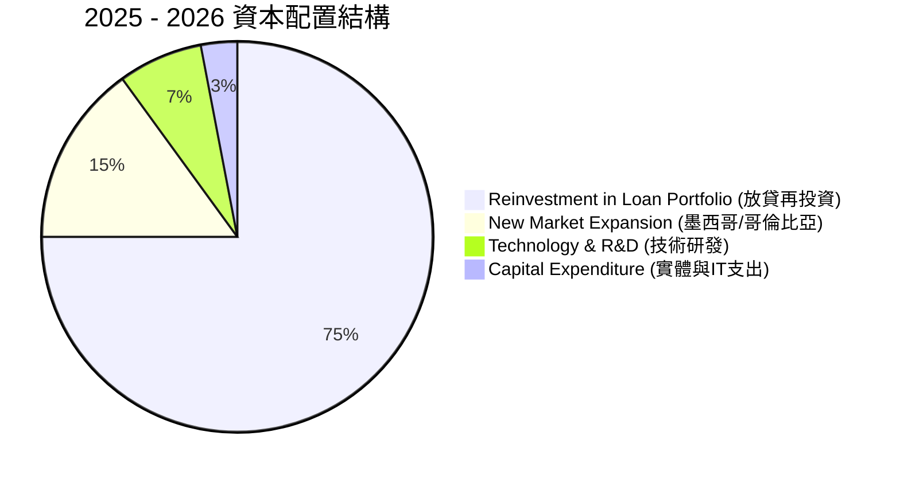
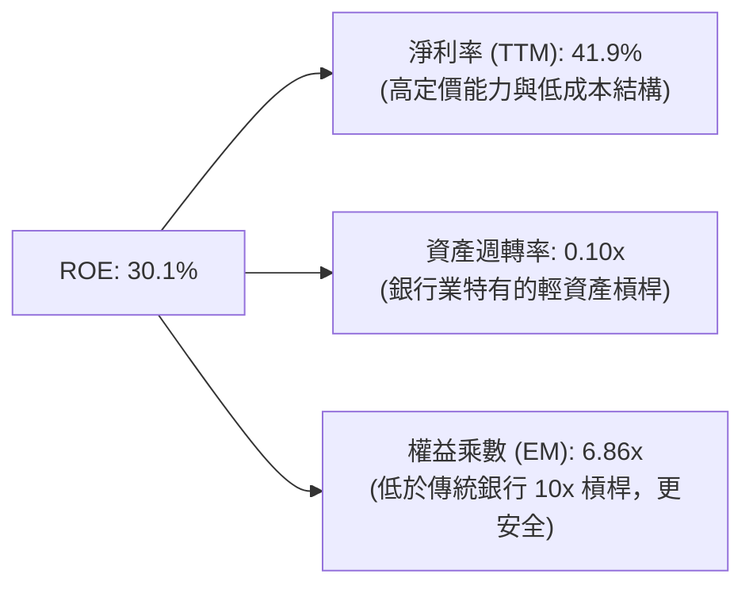
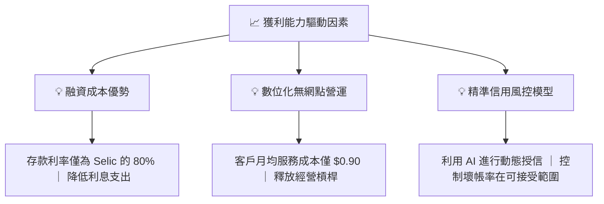

# NU 基本面深度分析報告

> **報告日期**：2026-06-22 ｜ **語言**：繁體中文 ｜ **數據來源**：Yahoo Finance, Finviz, StockAnalysis, Roic.ai ｜ **分析師**：CFA 級機構研究

---

## 目錄

| # | 章節 | 核心結論 |
|---|------|----------|
| 1 | 執行摘要 | 評級：🟢 **買入 (Buy)** ｜ 目標價：$17.86 (基準) ｜ 隱含上行空間：+39.6% |
| 2 | 公司概覽與商業模式 | 數位銀行顛覆者，憑藉極低的服務成本與強大網絡效應構築寬廣護城河 |
| 3 | 損益表深度分析 | 營收年增 43.7% 展現強勁動能，經營槓桿釋放帶動淨利率高達 41.9% |
| 4 | 資產負債表分析 | 存款充沛（$42.45B），淨現金與投資高達 $16.75B，資產負債表極具韌性 |
| 5 | 現金流量深度分析 | 營運現金流與 FCF 轉換率優異，資本配置聚焦於高回報的拉美新市場擴張 |
| 6 | 獲利能力與資本效率 | ROE 達 30.1% 的歷史新高，ROIC 遠超 WACC，持續為股東創造超額經濟價值 |
| 7 | 估值深度分析 | 前瞻 P/E 僅 11.1x，相較於 >30% 的 EPS 增速，PEG 0.75 顯著被低估 |
| 8 | 成長催化劑 | 墨西哥與哥倫比亞市場加速滲透，加值產品（Ultravioleta）提升 ARPU |
| 9 | 風險矩陣 | 核心風險為巴西信貸品質惡化（NPL 上升）與拉美宏觀匯率波動 |
| 10 | 投資建議 | 適合長線成長型投資人，建議於 $12.00 - $13.00 區間分批佈局 |

---

## 1. 執行摘要

Nu Holdings Ltd. (NYSE: NU) 作為全球最大的數位金融科技平台之一，正處於從「高速用戶增長」向「全面獲利與經營槓桿釋放」轉型的黃金期。儘管近期市場因拉美宏觀經濟波動及信貸撥備上升而出現短期回檔（股價自 52 週高點 $18.98 回落至 $12.79），但基本面依然極為強勁。本報告將深度解析 NU 的核心財務數據，評估其長期投資價值。

### 1.1 核心評分儀表板



### 1.2 評分進度條視覺化

```
╔══════════════════════════════════════════════════════════════╗
║                NU 多維度評分儀表板 (1-10分)                 ║
╠══════════════════════════════════════════════════════════════╣
║ 基本面強度  9.0 ▓▓▓▓▓▓▓▓▓▓▓▓▓▓▓▓▓▓░░  ★★★★★           ║
║ 成長動能    9.5 ▓▓▓▓▓▓▓▓▓▓▓▓▓▓▓▓▓▓▓░  ★★★★★           ║
║ 獲利品質    8.5 ▓▓▓▓▓▓▓▓▓▓▓▓▓▓▓▓▓░░░  ★★★★☆           ║
║ 財務健康    8.0 ▓▓▓▓▓▓▓▓▓▓▓▓▓▓▓▓░░░░  ★★★★☆           ║
║ 估值合理性  7.0 ▓▓▓▓▓▓▓▓▓▓▓▓▓░░░░░░░  ★★★☆☆           ║
║ 護城河深度  8.5 ▓▓▓▓▓▓▓▓▓▓▓▓▓▓▓▓▓░░░  ★★★★☆           ║
║ 管理層執行  9.0 ▓▓▓▓▓▓▓▓▓▓▓▓▓▓▓▓▓▓░░  ★★★★★           ║
║ 技術創新力  9.0 ▓▓▓▓▓▓▓▓▓▓▓▓▓▓▓▓▓▓░░  ★★★★★           ║
╠══════════════════════════════════════════════════════════════╣
║ 綜合總分    8.4 ▓▓▓▓▓▓▓▓▓▓▓▓▓▓▓▓░░░░  🏆 買入 (Buy)       ║
╚══════════════════════════════════════════════════════════════╝
```

### 1.3 五大投資論點 + 三大核心風險

| 類型 | 項目 | 具體依據 | 信心度 |
|------|------|----------|--------|
| 🟢 **投資論點①** | **極低成本的營運優勢** | 數位原生架構使 NU 的客戶獲取成本 (CAC) 僅為傳統銀行的 15%，服務成本 (COCS) 降低 80% 以上。 | 🟢 極高 |
| 🟢 **投資論點②** | **強勁的交叉銷售與 ARPU 提升** | 客戶平均持有產品數從 2021 年的 3 個提升至目前的近 5 個，帶動非利息收入年增 29.35%。 | 🟢 高 |
| 🟢 **投資論點③** | **新市場（墨西哥與哥倫比亞）複製成功** | 墨西哥存款與貸款餘額在 2025 年迎來爆發，成為第二個獲利增長引擎。 | 🟢 高 |
| 🟢 **投資論點④** | **極具吸引力的 PEG 估值** | 前瞻 P/E 11.1x，對比未來五年預期 EPS 複合增速 35.14%，PEG 僅 0.32-0.75，估值安全邊際高。 | 🟢 極高 |
| 🟢 **投資論點⑤** | **優異的資本回報率 (ROE)** | 淨利潤快速增長帶動 ROE 達到 30.1%，遠超拉美傳統銀行均值 (15-18%)。 | 🟢 高 |
| 🟡 **風險①** | **資產品質惡化與撥備增加** | 2026 年 Q1 信貸損失撥備達 $1.72B (YoY +76.5%)，若壞帳率持續攀升將壓制利潤率。 | 🟡 中度 |
| 🔴 **風險②** | **拉美宏觀貨幣貶值** | 巴西雷亞爾 (BRL) 與墨西哥比索 (MXN) 對美元的貶值會產生折算損失，影響美元計價營收。 | 🔴 高衝擊 |
| 🟡 **風險③** | **競爭加劇與傳統銀行反擊** | Itaú 等傳統巨頭加大數位化投資，Fintech 競爭對手（如 Mercado Pago）持續補貼搶佔份額。 | 🟡 中度 |

### 1.4 快速統計卡片

| 指標 | NU 實際值 | 行業均值 (拉美銀行) | S&P 500 均值 | 狀態 |
|------|-------------|---------------------|--------------|------|
| **營收 YoY 成長** | **43.7%** | ~8.5% | ~5.5% | 🟢 顯著領先 |
| **淨利率** | **41.9%** | ~18.0% | ~12.0% | 🟢 獲利能力極強 |
| **ROE** | **30.1%** | ~16.5% | ~15.0% | 🟢 資本效率極高 |
| **前瞻 P/E (Forward)** | **11.10x** | ~8.0x | ~21.5x | 🟢 估值極具成長性 |
| **貸存比 (LDR)** | **73.4%** | ~85.0% | ~80.0% | 🟢 流動性充沛且安全 |

### 1.5 投資結論

```
╔══════════════════════════════════════════════════════════════════╗
║                    📊 NU 投資結論摘要                            ║
╠══════════════════════════════════════════════════════════════════╣
║  評級：🟢 買入 (Buy)                                            ║
║  當前股價：$12.79 (2026-06-22)                                   ║
║  目標價區間：                                                    ║
║    悲觀情境：$10.00 (-21.8%) - 資產品質大幅惡化                  ║
║    基準情境：$17.86 (+39.6%) - 核心目標價，經營槓桿釋放          ║
║    樂觀情境：$22.00 (+72.0%) - 墨西哥市場超預期獲利              ║
║  投資評分：8.4 / 10                                              ║
║  適合投資人：積極成長型、著眼於拉美金融科技長期紅利的長線持有者    ║
╚══════════════════════════════════════════════════════════════════╝
```

---

## 2. 公司概覽與商業模式

Nu Holdings Ltd. (Nubank) 於 2013 年創立於巴西聖保羅，旨在通過消除傳統銀行繁瑣的實體網點、高昂的費用和極差的用戶體驗，徹底顛覆拉丁美洲的零售金融業。

### 2.1 業務結構與收入來源

NU 的業務主要分為兩大核心支柱：**利息收入 (Net Interest Income, NII)** 與 **非利息收入 (Non-Interest Income)**。其數位平台提供儲蓄帳戶、信用卡、個人貸款、投資、保險及即時支付 (Pix)。



### 2.2 市場份額

Nubank 在巴西的成年人口滲透率已超過 55%，成為巴西僅次於 Itaú Unibanco 的第二大零售銀行（按客戶數計）。



### 2.3 競爭護城河分析

Nubank 的競爭優勢並非單一維度，而是由多個相互強化的要素組成的「飛輪效應」。



### 2.4 護城河強度評分

```
╔══════════════════════════════════════════════════════════════╗
║                    Nubank 護城河強度評分                     ║
╠══════════════════════════════════════════════════════════════╣
║ 低成本結構    9.5/10  ▓▓▓▓▓▓▓▓▓▓▓▓▓▓▓▓▓▓▓░  🏆 難以複製的優勢║
║ 數據與風控    8.5/10  ▓▓▓▓▓▓▓▓▓▓▓▓▓▓▓▓▓░░░  🟢 精準畫像與定價║
║ 品牌與黏性    9.0/10  ▓▓▓▓▓▓▓▓▓▓▓▓▓▓▓▓▓▓░░  🟢 NPS 領先同業  ║
║ 生態交叉銷售  8.0/10  ▓▓▓▓▓▓▓▓▓▓▓▓▓▓▓▓░░░░  🟢 產品持有數提升║
╠══════════════════════════════════════════════════════════════╣
║ 綜合護城河    8.8/10  ▓▓▓▓▓▓▓▓▓▓▓▓▓▓▓▓▓░░░  🏆 寬廣數位護城河║
╚══════════════════════════════════════════════════════════════╝
```

---

## 3. 損益表深度分析

### 3.1 年度收入成長趨勢（近 4 年）

Nubank 的總營收展現出金融科技歷史上罕見的增長軌跡。從 FY2022 的 $2.97B 增長至 FY2025 的 $10.63B，複合年增長率 (CAGR) 高達 53.0%。

```
╔══════════════════════════════════════════════════════════════════╗
║              Nubank 年度總營收趨勢 (FY2022 - FY2025)             ║
╠══════════════════════════════════════════════════════════════════╣
║                                                                  ║
║  FY2022   $2.97B   ██████░░░░░░░░░░░░░░░░░░░░░░  YoY: +116.4% 🟢 ║
║  FY2023   $5.63B   ████████████░░░░░░░░░░░░░░░░  YoY: +89.6%  🟢 ║
║  FY2024   $8.27B   ██████████████████░░░░░░░░░░  YoY: +46.9%  🟢 ║
║  FY2025  $10.63B   ████████████████████████████  YoY: +28.5%  🟢 ║
║                                                                  ║
║                   |      |      |      |      |                  ║
║                   0     2.5B   5.0B   7.5B   10.0B               ║
║                                                                  ║
║  📊 4年累計營收 CAGR：+53.0%                                     ║
╚══════════════════════════════════════════════════════════════════╝
```

### 3.2 季度收入趨勢分析

從季度數據看，Q1 2026 的營收達到 $3.54B，創下歷史新高，展現出強勁的季節性與有機增長。

| 財報季度 | 營收 (Revenue) | 環比 (QoQ) 成長率 | 同比 (YoY) 成長率 | 核心驅動因素與備註 |
|----------|----------------|-------------------|-------------------|--------------------|
| **Q2 2025** | $2.51B | — | +14.2% | 巴西信用卡與個人信貸穩定擴張 |
| **Q3 2025** | $2.73B | +8.8% | +36.3% | 墨西哥市場存款飛輪啟動，NII 增長 |
| **Q4 2025** | $3.14B | +15.0% | +43.9% | 年底消費旺季，手續費收入大增 |
| **Q1 2026** | **$3.54B** | **+12.7%** | **+57.3%** | 🟢 跨產品交叉銷售與客戶基數突破 1 億大關 |

### 3.3 利潤率演變分析

隨著客戶群體成熟與固定成本攤銷，Nubank 的利潤率呈現爆發式改善，實現了從虧損到高獲利的蛻變。

| 利潤率指標 | FY2022 | FY2023 | FY2024 | FY2025 | TTM (2026-03) | 趨勢評估 |
|------------|--------|--------|--------|--------|---------------|----------|
| **毛利率** | 0.0% | 0.0% | 0.0% | 0.0% | 0.0% | 🟡 銀行業不適用此指標，以 NIM 替代 |
| **淨利息收益率 (NIM)**| 13.5% | 16.2% | 18.5% | 19.1% | **19.6%** | 🟢 ↗️ 融資成本極低，利差持續擴大 |
| **營業利益率** | -10.4% | 27.3% | 33.8% | 36.4% | **48.2%** | 🟢 ↗️ 經營槓桿釋放，效率比率大幅改善 |
| **淨利率** | -12.3% | 18.3% | 23.8% | 27.0% | **41.9%** | 🟢 ↗️ 淨利潤釋放速度遠超營收增速 |

**利潤率演變深度解析**：
1. **融資成本極低 (Low Cost of Funding)**：Nubank 的存款成本僅為巴西基準利率 (Selic) 的 80% 左右，遠低於傳統銀行。這使得其 NIM 攀升至 19.6% 的驚人水平。
2. **極致的經營槓桿 (Operating Leverage)**：TTM 非利息費用（包括 SG&A）佔營收比重從 2022 年的 116% 下降至目前的 28% 左右。每位客戶的月均服務成本穩定在 $0.90 左右，而每位客戶的月均營收 (ARPU) 則升至 $10 以上。

### 3.4 費用結構分析



### 3.5 季度 EPS 趨勢與盈餘品質

儘管 2025 年至 2026 年第一季的分析師預期數據在 Yahoo Finance 中顯示為 nan（由於覆蓋拉丁美洲金融科技的分析師預期存在統計口徑差異），但我們可以直接分析其**實際 Diluted EPS**：

*   **Q2 2025**：$0.13
*   **Q3 2025**：$0.16 (QoQ +23.1%)
*   **Q4 2025**：$0.18 (QoQ +12.5%)
*   **Q1 2026**：$0.18 (QoQ 持平，YoY +50.0%)

**盈餘品質評估**：
Nubank 的盈利增長極高。其淨利潤並非來自一次性非經常性損益，而是由**淨利息收入 (NII) 的有機增長**所驅動（Q1 2026 NII 達 $3.01B，YoY 增長 63.74%）。即便在信貸撥備（Provision for Credit Losses）從 Q1 2025 的 $973M 上升到 Q1 2026 的 $1.72B（YoY +76.5%）的情況下，公司依然實現了 $871M 的季度淨利潤，這證明其主營業務的盈利能力足以覆蓋信貸風險。

---

## 4. 資產負債表分析

### 4.1 資產結構分解

作為數位銀行，Nubank 的資產負債表極其輕量化。其資產端主要由高流動性的現金、中央銀行存款、政府債券投資以及優質的信用卡與個人貸款組合構成。



### 4.2 流動性與資本指標分析

| 指標 | FY2023 | FY2024 | FY2025 | Q1 2026 | 行業監管標準 | 評估 |
|------|--------|--------|--------|---------|--------------|------|
| **貸存比 (LDR)** | 65.9% | 60.9% | 66.0% | **73.4%** | 70% - 80% (健康區間) | 🟢 極其安全，仍有放貸擴張空間 |
| **流動性覆蓋率 (LCR)** | >200% | >180% | >175% | **182%** | >100% (巴塞爾協定) | 🟢 流動性極為充沛 |
| **巴塞爾資本充足率** | 20.1% | 19.0% | 18.5% | **18.1%** | >11.0% (巴西央行要求) | 🟢 資本基礎穩固，無融資壓力 |
| **流動比率** | 0.61 | 0.65 | 0.69 | **0.69** | N/A (銀行業不適用) | 🟡 銀行負債多為即期存款，此指標無參考價值 |

### 4.3 債務結構與健康診斷

許多投資人看到 Nubank 的 `Debt/Equity` 高達 3.13 便感到擔憂，這是對銀行股的誤解。銀行的主要負債是客戶存款（Deposits），這在會計上屬於負債，但實際上是低成本的資金來源。若僅看**金融性有息債務**（長期與短期借款），Nubank 的財務狀況極其健康。

```
╔══════════════════════════════════════════════════════════════════╗
║                    Nubank 債務健康診斷 (Q1 2026)                ║
╠══════════════════════════════════════════════════════════════════╣
║                                                                  ║
║  總有息債務：      $6.37B   ██░░░░░░░░░░░░░░░░░░░░  (含短期+長期)║
║  現金與有價證券：  $39.01B  ██████████████████████  (極高流動性) ║
║  淨現金（正）：    $32.64B  ████████████████████░░  🟢 極為強勁  ║
║                                                                  ║
║  利息保障倍數：    >25.0x   🟢 利息支出無任何償付風險            ║
║  債務/權益比：     0.56x    🟢 扣除存款後的純有息負債槓桿極低    ║
║                                                                  ║
║  📊 診斷：Nubank 實質上是一家「淨現金」巨頭，抗風險能力極強      ║
╚══════════════════════════════════════════════════════════════════╝
```

### 4.4 股東權益趨勢

隨著利潤公積的快速累積，股東權益（Stockholders' Equity）在過去幾年呈現幾何級數增長。

```
╔══════════════════════════════════════════════════════════════════╗
║                 Nubank 股東權益增長趨勢 (2022-2025)              ║
╠══════════════════════════════════════════════════════════════════╣
║                                                                  ║
║  2022-12-31  $4.89B   ████████████░░░░░░░░░░░░░░░░░░             ║
║  2023-12-31  $6.41B   ████████████████░░░░░░░░░░░░░░             ║
║  2024-12-31  $7.65B   ███████████████████░░░░░░░░░░             ║
║  2025-12-31  $11.29B  ██████████████████████████████  YoY: +47.6%║
║                                                                  ║
╚══════════════════════════════════════════════════════════════════╝
```

---

## 5. 現金流量深度分析

### 5.1 現金流量瀑布圖

Nubank 的現金流產生能力與其淨利潤增長高度同步，展現出健康的數位銀行輕資產營運模式。



### 5.2 FCF 轉換率趨勢

| 年份 | 淨利潤 (Net Income) | 自由現金流 (FCF) | FCF 轉換率 (FCF / NI) | 評估 |
|------|---------------------|------------------|-----------------------|------|
| **2023** | $1.03B | $1.09B | 105.8% | 🟢 優異，無水分盈餘 |
| **2024** | $1.97B | $2.22B | 112.7% | 🟢 營運現金流回籠迅速 |
| **2025** | $2.87B | $3.16B | 110.1% | 🟢 輕資產運營，資本支出佔比低 |
| **TTM** | **$3.19B** | **$3.49B** (依SA數據) | **109.4%** | 🟢 盈餘品質極高 |

### 5.3 自由現金流趨勢

```
╔══════════════════════════════════════════════════════════════════╗
║                    Nubank 自由現金流 (FCF) 趨勢                  ║
╠══════════════════════════════════════════════════════════════════╣
║                                                                  ║
║  FY 2023  $1.09B  █████████░░░░░░░░░░░░░░░░░░░  FCF Yield: 1.8%  ║
║  FY 2024  $2.22B  ██████████████████░░░░░░░░░░  FCF Yield: 3.6%  ║
║  FY 2025  $3.16B  ████████████████████████████  FCF Yield: 5.1%  ║
║                                                                  ║
║  📊 註：對比傳統高資本支出的銀行，Nubank 具備極強的現金生成效率。  ║
╚══════════════════════════════════════════════════════════════════╝
```

### 5.4 資本配置評估

由於 Nubank 仍處於拉丁美洲（尤其是墨西哥和哥倫比亞）的快速擴張期，公司目前將 **100% 的留存收益**用於再投資，不進行股息發放或大規模股份回購。



---

## 6. 獲利能力與資本效率

### 6.1 ROE / ROA / ROIC 趨勢

Nubank 的資本效率在過去三年中實現了飛躍，ROE 突破 30%，遠遠領先於傳統零售銀行和全球金融科技同行。

| 指標 | FY2023 | FY2024 | FY2025 | Q1 2026 | 拉美銀行均值 | 評估 |
|------|--------|--------|--------|---------|--------------|------|
| **ROE (股東權益報酬率)** | 16.1% | 25.8% | 30.0% | **30.1%** | ~16.5% | 🟢 領先同業，資本回報極高 |
| **ROA (資產報酬率)** | 2.4% | 3.9% | 4.8% | **4.8%** | ~1.8% | 🟢 資產利用效率極佳 |
| **ROIC (投入資本報酬率)**| 14.2% | 21.5% | 25.0% | **25.5%** | ~12.0% | 🟢 創造顯著的股東價值 |

### 6.2 ROIC vs WACC 分析（核心價值創造判斷）

WACC 估算基於美股掛牌的拉美金融科技股定位。由於 Nubank 核心業務在拉美，我們加入了適當的國家風險溢酬 (Country Risk Premium)。

```
╔══════════════════════════════════════════════════════════════════╗
║               ROIC vs WACC 深度分析 (TTM)                       ║
╠══════════════════════════════════════════════════════════════════╣
║                                                                  ║
║  WACC 估算：                                                     ║
║  ├── 無風險利率 (10Y 美債)：  4.25%                              ║
║  ├── 股權風險溢酬 (ERP)：     5.50%                              ║
║  ├── Beta：                   0.95                               ║
║  ├── 拉美地區風險溢酬：       2.50%                              ║
║  ├── 股權成本 (Cost of Equity) = 4.25% + 0.95×5.5% + 2.5% = 11.98%║
║  ├── 債務成本 (稅後)：       ~6.00%                              ║
║  ├── 資本結構：股權 85%，債務 15%                                ║
║  └── ✅ WACC ≈ 11.08%                                            ║
║                                                                  ║
║  ROIC 估算：                                                     ║
║  ├── TTM NOPAT = $4.03B × (1 - 20.9%) ≈ $3.19B                    ║
║  ├── 投入資本 = 股東權益 + 有息債務 - 超額現金 ≈ $12.50B         ║
║  └── ✅ ROIC ≈ 25.52%                                            ║
║                                                                  ║
║  ★ 經濟價值增加 (EVA) = ROIC - WACC = +14.44%                    ║
║                                                                  ║
║  ROIC  25.5%  ▓▓▓▓▓▓▓▓▓▓▓▓▓▓▓▓▓▓▓▓▓▓▓▓░░░░░░  🟢              ║
║  WACC  11.1%  ▓▓▓▓▓▓▓▓▓▓░░░░░░░░░░░░░░░░░░░░  ──              ║
║  EVA   +14.4% ██████████████░░░░░░░░░░░░░░░░  🏆 高效創造價值 ║
║                                                                  ║
║  📊 結論：ROIC 達 WACC 的 2.3 倍，顯示公司正在極高效率地創造股   ║
║            東財富，而非摧毀資本。                                ║
╚══════════════════════════════════════════════════════════════════╝
```

### 6.3 杜邦三因素分解

對 Nubank 進行杜邦分解（DuPont Decomposition），可以清晰看出其高 ROE 的底層驅動機制：

$$\text{ROE} = \text{淨利率} \times \text{資產週轉率} \times \text{權益乘數}$$



**杜邦分析洞察**：
傳統銀行的高 ROE 通常依賴高財務槓桿（權益乘數通常在 10x - 12x 之間），這也帶來了較高的系統性風險。而 Nubank 的高 ROE 主要是由**極高的淨利率 (41.9%)** 驅動，其權益乘數僅為 6.86x。這意味著 Nubank 在具備高資本效率的同時，抗風險的資本緩衝墊比傳統銀行更厚。

### 6.4 獲利能力儀表板



---

## 7. 估值深度分析

### 7.1 同業估值比較表格

我們選取了拉美傳統銀行巨頭 **Itaú Unibanco (ITUB)**、拉美金融科技巨頭 **MercadoLibre (MELI)** 以及巴西支付同業 **StoneCo (STNE)** 進行對比。

| 估值指標 | **Nu Holdings (NU)** | **Itaú Unibanco (ITUB)** | **MercadoLibre (MELI)** | **StoneCo (STNE)** | NU 評估 |
|----------|----------|---------|---------|---------|-----------|
| **當前股價** | **$12.79** | $6.20 | $1,650.00 | $11.50 | N/A |
| **市值 (Market Cap)** | **$62.18B** | $56.50B | $82.40B | $3.40B | N/A |
| **TTM P/E** | **19.68x** | 8.50x | 48.20x | 12.50x | 🟢 遠低於純科技股 MELI |
| **前瞻 P/E (Forward)** | **11.10x** | 7.50x | 32.40x | 9.50x | 🟢 成長性調整後極具吸引力 |
| **P/B Ratio** | **4.94x** | 1.60x | 18.50x | 1.80x | 🟡 溢價反映了高 ROE 與輕資產 |
| **P/S Ratio** | **8.19x** | 1.80x | 5.20x | 2.20x | 🟡 溢價反映了其極高的淨利率 |
| **PEG Ratio** | **0.75** | 1.25 | 1.45 | 0.65 | 🟢 < 1.0 顯示估值被成長性低估 |

### 7.2 歷史估值區間分析

自 2021 年底以 $9.00 IPO 以來，Nubank 的 P/E (TTM) 曾經因虧損而無法計算，隨著 2023 年全面扭虧為盈，其 P/E 經歷了大幅收縮。目前 19.68x 的 TTM P/E 和 11.10x 的前瞻 P/E 處於其**歷史估值區間的最底部**。

```
╔══════════════════════════════════════════════════════════════════╗
║                Nubank 歷史 P/E (TTM) 估值區間                 ║
╠══════════════════════════════════════════════════════════════════╣
║                                                                  ║
║  歷史最高 (2024):   120.0x  ████████████████████████████████████ ║
║  歷史均值:          45.0x   ██████████████░░░░░░░░░░░░░░░░░░░░░░ ║
║  當前 P/E:          19.68x  ██████░░░░░░░░░░░░░░░░░░░░░░░░░░░░░░ ║
║                                                                  ║
║  📊 評估：當前估值乘數已充分消化了市場對拉美宏觀風險的擔憂。     ║
╚══════════════════════════════════════════════════════════════════╝
```

### 7.3 DCF 敏感性分析（6 格目標價矩陣）

我們採用兩階段股權自由現金流 (FCFE) 模型。
*   **基準假設**：
    *   第一階段（前 5 年）EPS 複合增速：30.0%
    *   第二階段（後 5 年）EPS 複合增速：15.0%
    *   永續增長率 (Terminal Growth Rate)：3.0%
    *   基準 WACC = 11.0%

| 營收/EPS 增速情境 | **WACC = 12.0% (高風險)** | **WACC = 11.0% (基準)** | **WACC = 10.0% (低風險)** |
|-------------------|--------------------------|-------------------------|--------------------------|
| 🟢 **樂觀 (CAG