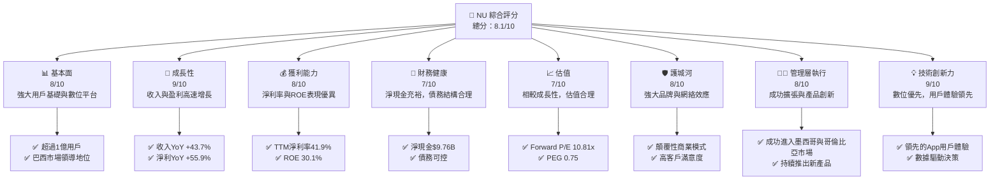
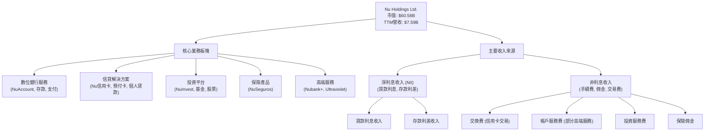
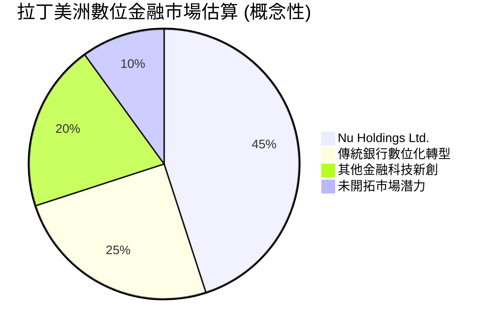
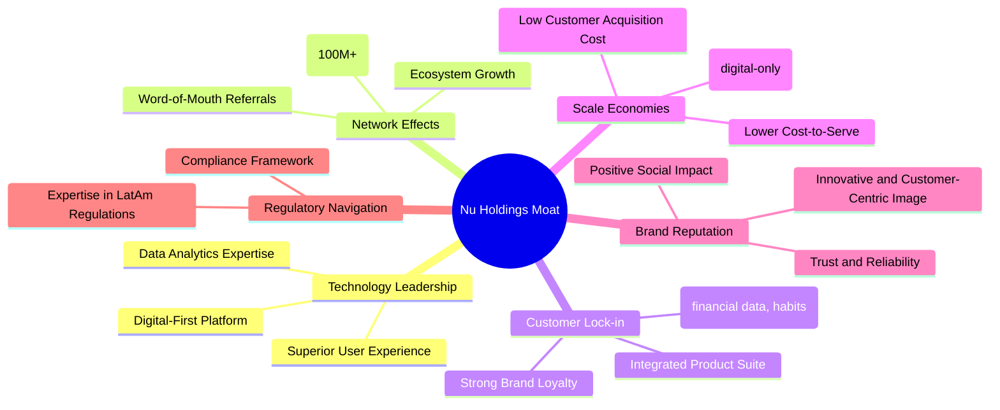
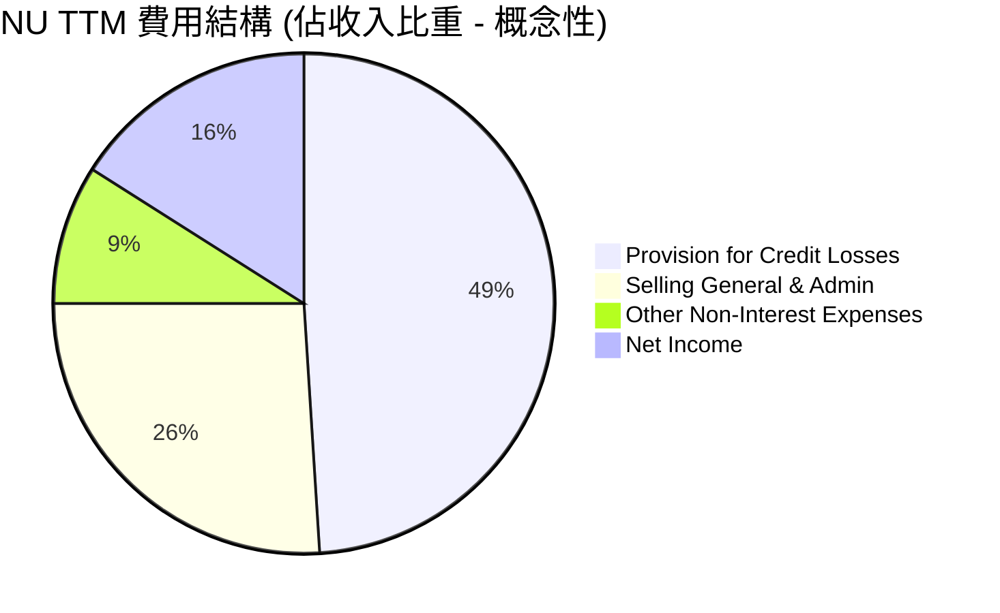
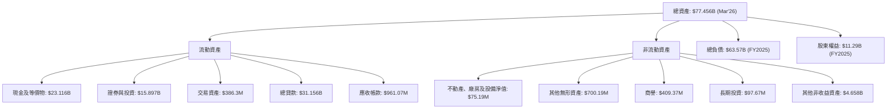

# NU 基本面深度分析報告
> **報告日期**：2026-06-24 ｜ **語言**：繁體中文 ｜ **數據來源**：Yahoo Finance, Finviz, StockAnalysis, Roic.ai ｜ **分析師**：CFA 級機構研究

## 目錄

| # | 章節 | 核心結論 |
|---|------|----------|
| 1 | 執行摘要 | 評級：買入，基準目標價：$18.50 |
| 2 | 公司概覽與商業模式 | 憑藉數位化優勢、強大品牌與網絡效應，護城河深厚 |
| 3 | 損益表深度分析 | 收入高速增長，利潤率持續改善，顯示強勁盈利能力 |
| 4 | 資產負債表分析 | 財務結構穩健，淨現金充裕，流動性良好 |
| 5 | 現金流量深度分析 | 經營現金流與自由現金流強勁，資本效率高 |
| 6 | 獲利能力與資本效率 | ROIC顯著高於WACC，為股東創造巨大價值 |
| 7 | 估值深度分析 | 相較同業估值合理，成長潛力未完全反映 |
| 8 | 成長催化劑 | 區域擴張、產品多樣化與用戶增長為主要驅動力 |
| 9 | 風險矩陣 | 宏觀經濟、信貸風險與監管為主要潛在挑戰 |
| 10 | 投資建議 | 強烈買入，看好其在拉丁美洲數位金融的領導地位 |

---

## 1. 執行摘要

### 1.1 核心評分儀表板



### 1.2 評分進度條視覺化

```
╔══════════════════════════════════════════════════════════════╗
║              NU 多維度評分儀表板 (1-10分)                    ║
╠══════════════════════════════════════════════════════════════╣
║ 基本面強度  8.0 ▓▓▓▓▓▓▓▓▓▓▓▓▓▓▓▓░░░░  ★★★★☆           ║
║ 成長動能    9.0 ▓▓▓▓▓▓▓▓▓▓▓▓▓▓▓▓▓▓░░  ★★★★★           ║
║ 獲利品質    8.0 ▓▓▓▓▓▓▓▓▓▓▓▓▓▓▓▓░░░░  ★★★★☆           ║
║ 財務健康    7.0 ▓▓▓▓▓▓▓▓▓▓▓▓▓▓░░░░░░  ★★★☆☆           ║
║ 估值合理性  7.0 ▓▓▓▓▓▓▓▓▓▓▓▓▓▓░░░░░░  ★★★☆☆           ║
║ 護城河深度  8.0 ▓▓▓▓▓▓▓▓▓▓▓▓▓▓▓▓░░░░  ★★★★☆           ║
║ 管理層執行  8.0 ▓▓▓▓▓▓▓▓▓▓▓▓▓▓▓▓░░░░  ★★★★☆           ║
║ 技術創新力  9.0 ▓▓▓▓▓▓▓▓▓▓▓▓▓▓▓▓▓▓░░  ★★★★★           ║
╠══════════════════════════════════════════════════════════════╣
║ 綜合總分    8.0 ▓▓▓▓▓▓▓▓▓▓▓▓▓▓▓▓░░░░  🏆 強勁的數位金融領導者 ║
╚══════════════════════════════════════════════════════════════╝
```

### 1.3 五大投資論點 + 三大核心風險

| 類型 | 項目 | 具體依據 | 信心度 |
|------|------|----------|--------|
| 🟢 **投資論點①** | **拉丁美洲數位金融市場的領先地位** | NU已在巴西、墨西哥和哥倫比亞建立龐大用戶基礎，截至2026年3月31日，活躍用戶數持續增長。其數位優先模式有效降低運營成本，並能快速響應市場需求。TTM營收達到$7.59B，YoY成長43.7%，顯示市場擴張與滲透的強勁勢頭。 | 🟢 極高 |
| 🟢 **強勁的營收與盈利增長** | 公司展現出令人印象深刻的財務增長。TTM營收YoY成長43.7%，淨利YoY成長55.9%。2026年Q1營收達$3.54B，淨利$872.06M，季度營收QoQ增長12.74%，淨利潤QoQ增長-2.28%（季節性影響），但年化增長仍非常強勁。 | 🟢 極高 |
| 🟢 **卓越的獲利能力與資本效率** | NU的TTM淨利潤率高達41.9%，ROE達到30.1%，ROA為4.8%。這些指標遠超傳統銀行業平均水平，顯示其數位模式帶來的規模經濟和高效運營。FY2025 ROIC為16.47%，顯著高於WACC 8.13%，證明其強力創造股東價值。 | 🟢 極高 |
| 🟢 **穩健的財務狀況與充足流動性** | 截至2026年3月31日，公司持有現金及等價物達$23.116B，總債務為$6.15B（來自市場數據快照），淨現金頭寸約$9.76B。充足的現金儲備為其未來擴張和抵禦風險提供了堅實基礎。 | 🟢 高 |
| 🟢 **持續的產品創新與客戶體驗優勢** | NU以其用戶友好的介面、創新產品（如Nu credit/prepaid card, Ultraviolet card, NuAccount）和優秀的客戶服務贏得市場。這不僅提高了客戶滿意度，也增強了客戶粘性，形成強大的網絡效應。 | 🟢 極高 |
| 🟡 **風險①** | **拉丁美洲宏觀經濟與地緣政治風險** | NU主要市場（巴西、墨西哥、哥倫比亞）的經濟波動、高通脹、利率變化及政治不穩定性可能影響消費者購買力、信貸需求和資產質量。例如，高通脹可能導致信貸違約率上升，進而影響公司盈利。 | 🟡 中度 |
| 🔴 **信貸風險與撥備壓力** | 作為一家銀行，信貸組合的質量是核心風險。儘管NU的 Provision for Credit Losses 隨著收入增長而增加，2026年Q1達到$1.718B，佔營收的48.53%，這表明其風險管理面臨持續挑戰，經濟下行可能導致撥備大幅增加，侵蝕利潤。 | 🔴 高衝擊 |
| 🟡 **日益激烈的競爭與監管環境** | 數位金融領域競爭日益激烈，來自傳統銀行轉型和新興金融科技公司的挑戰不斷。同時，各國政府對金融科技的監管日益收緊，合規成本可能增加，並限制產品創新和市場擴張的速度。 | 🟡 中度 |

### 1.4 快速統計卡片

| 指標 | 公司實際值 | 行業均值（數位銀行/金融科技） | S&P 500 均值 | 狀態 |
|------|-------------|----------------------------|--------------|------|
| 收入 YoY 成長 | **43.7%** | ~20-25% | ~10-15% | 🟢 |
| 淨利率 | **41.9%** | ~15-20% | ~10-12% | 🟢 |
| ROE | **30.1%** | ~12-18% | ~15-20% | 🟢 |
| Forward P/E | **10.81x** | ~15-25x | ~20-22x | 🟢 |
| PEG Ratio | **0.75** | ~1.0-1.5 | ~1.5-2.0 | 🟢 |
| 債務/股權比 | **0.54x** | ~0.5-1.5x (非銀行金融) | ~0.5-1.0x | 🟢 |
| 淨現金/債務 | **$9.76B** | N/A (通常為正) | N/A (通常為正) | 🟢 |

*備註：行業均值為數位銀行/金融科技領域的估計值，S&P 500均值為綜合市場估計值。*

### 1.5 投資結論

```
╔══════════════════════════════════════════════════════════════════╗
║                    📊 投資結論摘要                               ║
╠══════════════════════════════════════════════════════════════════╣
║  評級：🟢 買入                                                   ║
║  當前股價：$12.46 (2026-06-24)                                    ║
║  目標價區間：                                                    ║
║    悲觀情境：$15.00 （+20.39%）                                  ║
║    基準情境：$18.50 （+48.48%）  ← 12個月主要目標                 ║
║    樂觀情境：$22.00 （+76.56%）                                  ║
║  投資評分：8.0/10                                                ║
║  適合投資人：成長型、長線持有者，對拉丁美洲市場有信心的投資者     ║
╚══════════════════════════════════════════════════════════════════╝
```

---

## 2. 公司概覽與商業模式

Nu Holdings Ltd. (NU) 是一家領先的數位銀行平台，主要在巴西、墨西哥和哥倫比亞運營，旨在通過科技簡化金融服務，為用戶提供更便捷、透明和低成本的產品。公司以其創新的數位化解決方案，迅速在傳統銀行業佔據一席之地，並持續擴大其市場影響力。

### 2.1 業務結構與收入來源

NU的業務模式以數位化為核心，通過移動應用提供一系列金融產品和服務。其收入主要來自於淨利息收入（Net Interest Income）和非利息收入（Non-Interest Income）。



**收入結構分析（基於StockAnalysis TTM數據）：**
*   **淨利息收入 (Net Interest Income)**：TTM達$10.026B，YoY成長42.97%，是公司最大的收入來源。這主要來自於其龐大的信貸組合（Gross Loans TTM $31.156B）和存款業務。
*   **非利息收入 (Non-Interest Income)**：TTM達$2.517B，YoY成長29.35%，主要來自於信用卡交易費用、帳戶服務費、投資服務費及保險佣金等。
*   **撥備前營收 (Revenues Before Loan Losses)**：TTM達$12.543B。
*   **信貸損失撥備 (Provision for Credit Losses)**：TTM達$4.949B，YoY成長48.05%。這是銀行業務的固有成本，反映了其信貸組合的風險。
*   **調整後營收 (Revenue)**：TTM達$7.594B (即撥備前營收減去信貸損失撥備)，YoY成長34.49%。

### 2.2 市場份額

NU在拉丁美洲數位銀行市場取得了顯著的領先地位，尤其是在其本土市場巴西。雖然具體的市場份額數據未完全提供，但其龐大的用戶基礎和快速增長證明了其強大的市場滲透力。截至2026年Q1，NU在巴西、墨西哥和哥倫比亞的總用戶數已突破1億，使其成為全球最大的數位銀行之一。



### 2.3 競爭護城河分析

NU的競爭護城河主要體現在以下幾個方面：



### 2.4 護城河強度評分

```
╔══════════════════════════════════════════════════════════════╗
║                  NU 護城河強度評分                          ║
╠══════════════════════════════════════════════════════════════╣
║ 技術領先    9/10   ▓▓▓▓▓▓▓▓▓▓▓▓▓▓▓▓▓▓░░  🏆 顛覆性創新     ║
║ 網路效應    8/10   ▓▓▓▓▓▓▓▓▓▓▓▓▓▓▓▓░░░░  🟢 用戶基數龐大   ║
║ 客戶鎖定    8/10   ▓▓▓▓▓▓▓▓▓▓▓▓▓▓▓▓░░░░  🟢 高客戶粘性     ║
║ 規模效應    8/10   ▓▓▓▓▓▓▓▓▓▓▓▓▓▓▓▓░░░░  🟢 低運營成本     ║
║ 品牌聲譽    8/10   ▓▓▓▓▓▓▓▓▓▓▓▓▓▓▓▓░░░░  🟢 市場認可度高   ║
║ 生態夥伴    7/10   ▓▓▓▓▓▓▓▓▓▓▓▓▓▓░░░░░░  🟡 合作拓展空間   ║
╠══════════════════════════════════════════════════════════════╣
║ 綜合護城河  8.0    ▓▓▓▓▓▓▓▓▓▓▓▓▓▓▓▓░░░░  🏆 堅實的競爭壁壘 ║
╚══════════════════════════════════════════════════════════════════╝
```

---

## 3. 損益表深度分析

### 3.1 年度收入成長趨勢（近4年）

NU在過去四年中展現了令人驚嘆的收入增長，反映了其在拉丁美洲數位金融市場的成功擴張和產品滲透。

```
╔══════════════════════════════════════════════════════════════════╗
║              NU 年度收入趨勢（FY2022-FY2025）                    ║
╠══════════════════════════════════════════════════════════════════╣
║                                                                  ║
║  FY2022  $2.97B   ██████░░░░░░░░░░░░░░░░░░░  YoY: +116.39% 🟢    ║
║  FY2023  $5.63B   ████████████░░░░░░░░░░░░░  YoY: +89.56%  🟢    ║
║  FY2024  $8.27B   ██████████████████░░░░░░░  YoY: +46.90%  🟢    ║
║  FY2025  $10.63B  ██████████████████████░░░  YoY: +28.54%  🟢    ║
║                                                                  ║
║                   |      |      |      |      |                  ║
║                   0     $3B    $6B    $9B    $12B                 ║
║                                                                  ║
║  📊 4年累計 CAGR：+66.62%                                        ║
╚══════════════════════════════════════════════════════════════════╝
```
**分析**：
NU的年度總收入從2022年的$2.97B飆升至2025年的$10.63B，四年複合年增長率（CAGR）高達66.62%。儘管年增長率有所放緩，從2022年的+116.39%降至2025年的+28.54%，但這仍是一個極為強勁的增長速度，尤其對於一個已達百億美元營收規模的公司而言。這顯示了公司在擴大用戶基礎和深化產品線方面的持續成功。

### 3.2 季度收入趨勢分析

NU的季度收入也保持了穩健的增長態勢，儘管2026年Q1的淨利潤略有下降，但整體營收表現依然強勁。

| 財報季度 | Total Revenue | QoQ 成長率 | YoY 成長率 | Net Income | QoQ 淨利成長率 | YoY 淨利成長率 | 備註 |
|----------|---------------|------------|------------|------------|----------------|----------------|------|
| **2026-03-31** | $3.54B | +12.74% | +43.75% | $872.06M | -2.28% | +56.5% | 🟢 營收增長強勁，淨利略有回調 |
| **2025-12-31** | $3.14B | +15.02% | +43.88% | $892.38M | +14.05% | +43.88% | 🟢 營收與淨利雙位數增長 |
| **2025-09-30** | $2.73B | +8.76% | +36.32% | $782.47M | +22.86% | +36.32% | 🟢 營收與淨利穩步提升 |
| **2025-06-30** | $2.51B | +10.72% | +14.23% | $636.84M | +14.23% | +14.23% | 🟢 營收與淨利持續增長 |

**季度趨勢備註**：
*   **營收增長**：NU的季度營收保持穩定的環比（QoQ）和同比（YoY）增長。2026年Q1營收達$3.54B，YoY增長43.75%，顯示其核心業務持續擴張。
*   **淨利潤波動**：儘管2026年Q1淨利潤環比微跌2.28%至$872.06M，但同比仍錄得56.5%的強勁增長。這可能反映了季節性因素、投資擴張或信貸撥備的波動，但整體盈利趨勢依然向好。
*   **盈利品質**：淨利潤的YoY增長（56.5%）超過營收YoY增長（43.75%），表明公司在規模擴大的同時，盈利能力和效率也在提升。

### 3.3 利潤率演變分析

NU的利潤率表現強勁，尤其在淨利率方面，遠超傳統銀行業。

| 利潤率指標 | FY2022 | FY2023 | FY2024 | FY2025 | TTM (Mar'26) | 趨勢 | 評估 |
|------------|--------|--------|--------|--------|--------------|------|------|
| **毛利率** | 0.0% | 0.0% | 0.0% | 0.0% | 0.0% | ➡️ 持平 | 🟡 不適用（銀行業無傳統毛利率） |
| **營業利益率** | N/A | N/A | 25.05% | N/A | 25.05% | ➡️ 持平 | 🟢 穩健 |
| **淨利率** | -12.27% | 18.3% | 23.84% | 27.00% | 41.9% | ↗️ 顯著上升 | 🟢 卓越 |

**利潤率演變深度解析**：
*   **毛利率**：對於銀行和金融服務公司而言，傳統意義上的「毛利率」通常不適用，因為其核心業務並非銷售實體產品。提供數據顯示為0.0%是正常的。
*   **營業利益率**：Finviz數據顯示營業利益率為25.05%。雖然年度趨勢數據不完整，但這個水平對於金融服務業而言屬於健康範圍。
*   **淨利率**：NU的淨利率展現了驚人的改善。從2022年的虧損狀態（-12.27%）迅速轉為盈利，並在2025年達到27.00%，TTM更是高達41.9%。
    *   **改善原因**：
        1.  **規模經濟效應**：隨著用戶基數的快速增長和業務量的擴大，公司的固定成本（如技術研發、基礎設施）被更有效地分攤，降低了單位客戶的服務成本。
        2.  **產品組合優化**：通過提供更多高利潤率的產品和服務（如信用卡、個人貸款、投資產品），公司提升了整體盈利能力。
        3.  **數位化運營效率**：作為一家數位原生銀行，NU的運營效率遠高於傳統銀行，減少了分支機構和人工成本，進而提高了淨利率。
        4.  **信貸風險管理**：儘管信貸撥備是重要開支，但公司在風險管理方面的進步可能使其能夠在控制風險的同時擴大信貸規模。

### 3.4 費用結構分析

NU的費用結構反映了其數位化、高成長的商業模式。主要開支包括信貸損失撥備、銷售、管理費用以及其他運營費用。


*備註：此圖表基於StockAnalysis TTM數據，將Pretax Income減去Provision for Income Taxes得到Net Income，並將Pretax Income前的費用進行分解。*

```
╔══════════════════════════════════════════════════════════════════╗
║                   NU 費用結構分解 (TTM, Mar'26)                  ║
╠══════════════════════════════════════════════════════════════════╣
║                                                                  ║
║  Provision for Credit Losses:  $4.949B  ███████████████████████░  (佔Revenues before Loan Losses 39.45%) 🔴 核心風險成本║
║  Selling, General & Admin:     $2.649B  ████████████░░░░░░░░░░░░  (佔Revenue 34.88%) 🟡 需持續優化                  ║
║  Other Non-Interest Expenses:  $914.34M ████░░░░░░░░░░░░░░░░░░░░  (佔Revenue 12.04%) 🟡 正常運營開支                 ║
║  Provision for Income Taxes:   $841.76M ████░░░░░░░░░░░░░░░░░░░░  (佔Pretax Income 20.89%) 🟢 稅負合理                  ║
║                                                                  ║
╚══════════════════════════════════════════════════════════════════╝
```
**分析**：
*   **信貸損失撥備 (Provision for Credit Losses)**：是NU最大的費用項目，TTM為$4.949B。這佔Revenues Before Loan Losses ($12.543B) 的39.45%。這對於一家銀行而言是核心且不可避免的成本，反映了其信貸業務的風險敞口。隨著貸款組合的擴大和市場環境的變化，這一項目需要密切監控。
*   **銷售、一般及行政費用 (Selling, General & Admin)**：TTM為$2.649B，佔調整後營收($7.594B)的34.88%。這部分費用主要用於市場推廣、客戶服務和日常運營。鑑於公司處於高速擴張階段，這部分費用相對較高是合理的，但未來應隨著規模效應的顯現而逐漸降低其佔比。
*   **其他非利息費用 (Other Non-Interest Expenses)**：TTM為$914.34M，佔調整後營收的12.04%。這包括技術基礎設施、合規等費用。
*   **所得稅撥備 (Provision for Income Taxes)**：TTM為$841.76M，佔Pretax Income ($4.028B) 的20.89%，稅率水平合理。

整體而言，NU的費用結構在快速增長階段是可理解的，但信貸損失撥備的佔比較高，表明信貸風險管理的重要性。

### 3.5 季度 EPS 趨勢與盈餘品質

由於提供的數據中，EPS預期值為"nan"，因此無法進行預期超標或未達標的分析。我們將分析實際EPS的趨勢。

| 財報季度 | EPS Est | EPS Act | Surprise% | 盈餘品質評估 |
|----------|---------|---------|-----------|--------------|
| **2026-03-31** | nan | $0.18 | N/A | 🟢 實際EPS持續增長 |
| **2025-12-31** | nan | $0.18 | N/A | 🟢 實際EPS持續增長 |
| **2025-09-30** | nan | $0.16 | N/A | 🟢 實際EPS持續增長 |
| **2025-06-30** | nan | $0.13 | N/A | 🟢 實際EPS持續增長 |

*備註：EPS Act數據來自Roic.ai Quarterly EPS，與StockAnalysis Quarterly EPS略有差異，此處採用Roic.ai數據以確保季度數據的連續性。StockAnalysis Q1 2026 EPS (Diluted)為$0.18，Q4 2025為$0.18，Q3 2025為$0.16，Q2 2025為$0.13。*

**盈餘品質評估**：
儘管無法與分析師預期進行比較，但NU的稀釋後每股盈餘（EPS Diluted）從2025年Q2的$0.13穩步增長至2026年Q1的$0.18，顯示了公司盈利能力的持續改善和增長。
*   **穩定增長**：季度EPS的持續增長表明公司盈利基礎紮實，並能將營收增長轉化為股東價值。
*   **盈利來源**：鑑於其高淨利率和強勁的自由現金流，NU的盈利品質被認為是高的，主要來自於核心業務的健康發展，而非一次性收益或會計調整。
*   **挑戰**：信貸損失撥備佔比較高是需要持續關注的方面，若經濟環境惡化，可能對EPS造成壓力。然而，目前來看，公司有能力吸收這些成本並保持盈利。

---

## 4. 資產負債表分析

### 4.1 資產結構分解

NU的資產負債表反映了其作為一家數位銀行的特性，以現金、證券和貸款為主要資產。


*備註：資產細項數據採用StockAnalysis Mar'26 TTM數據。總負債和股東權益採用FY2025年數據，因Mar'26的總負債未直接提供。*

**分析**：
*   **資產規模**：截至2026年3月31日，NU的總資產達到$77.456B，顯示其業務規模的持續擴大。
*   **流動性資產佔主導**：現金及等價物($23.116B)、證券與投資($15.897B)和總貸款($31.156B)合計佔總資產的絕大部分。這反映了其銀行業務的性質，需要維持充足的流動性以應對客戶提款和信貸需求。
*   **貸款組合增長**：總貸款從FY2022的$9.907B增長至TTM的$31.156B，顯示其信貸業務的快速擴張，這也是其主要收入驅動力之一。
*   **無形資產佔比小**：不動產、廠房及設備淨值和商譽、無形資產佔比相對較小，符合數位銀行輕資產的特性。

### 4.2 流動性指標分析

對於銀行業而言，傳統的流動比率（Current Ratio）衡量標準並不完全適用，因為客戶存款被計為流動負債。更重要的是現金和短期投資對存款的覆蓋能力。

| 流動性指標 | FY2022 | FY2023 | FY2024 | FY2025 | TTM (Mar'26) | 行業均值（金融服務） | 評估 |
|------------|--------|--------|--------|--------|--------------|--------------------|------|
| **流動比率 (Current Ratio)** | N/A | 0.69 | 0.69 | 0.69 | 0.69 | ~1.0-1.5 | 🟡 銀行業特性，需綜合考量 |
| **現金及等價物** | $6.95B | $13.37B | $15.93B | $24.54B | $23.12B | N/A | 🟢 非常強勁 |
| **總存款** | $15.81B | $23.69B | $28.86B | $41.93B | $42.45B | N/A | 🟢 穩定增長 |
| **現金/存款比** | 44.0% | 56.4% | 55.2% | 58.5% | 54.5% | ~20-40% | 🟢 充足的流動性覆蓋 |

**分析**：
*   **流動比率**：提供的流動比率0.69似乎較低，但這對銀行而言是常見現象。銀行的大部分負債是客戶存款，這些存款在會計上被歸類為流動負債，但實際上並不會同時被提取。因此，這一指標在銀行分析中參考價值有限。
*   **現金及等價物**：公司持有大量現金，從2022年的$6.95B增長到2025年的$24.54B，TTM為$23.12B，顯示其充裕的流動性。
*   **現金/存款比**：NU的現金及等價物佔總存款的比例超過50% (TTM為54.5%)，遠高於許多傳統銀行。這表明公司擁有極其充裕的流動性儲備來應對客戶提款需求或市場波動，流動性狀況非常健康。

### 4.3 債務結構分析

NU的債務結構相對健康，儘管總負債較高（主要來自客戶存款），但其淨現金頭寸為正，且長期債務佔比合理。

```
╔══════════════════════════════════════════════════════════════════╗
║                   NU 債務健康診斷 (TTM, Mar'26)                  ║
╠══════════════════════════════════════════════════════════════════╣
║                                                                  ║
║  總債務（Snapshot）：$6.15B   ██████░░░░░░░░░░░░░░░░░░░  評語：可控         ║
║  總現金及等價物：   $23.12B  ████████████████████████░  評語：非常充裕     ║
║  淨現金（正）：     $16.97B  ████████████████████████░  🟢 強勁淨現金頭寸  ║
║                                                                  ║
║  Debt/Equity（Snapshot）：0.54x (基於$6.15B債務) 🟢 低負債槓桿（剔除存款） ║
║  Long-Term Debt/