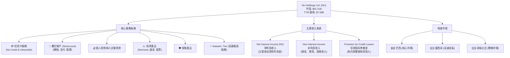
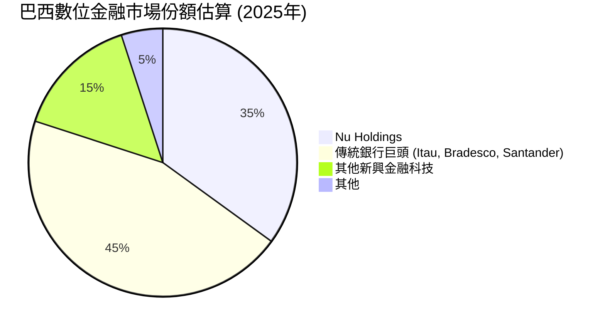
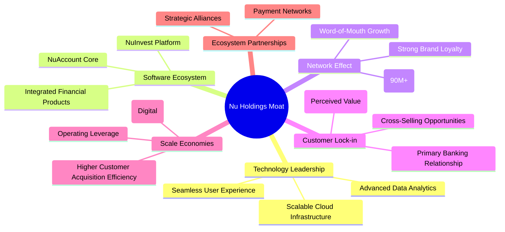
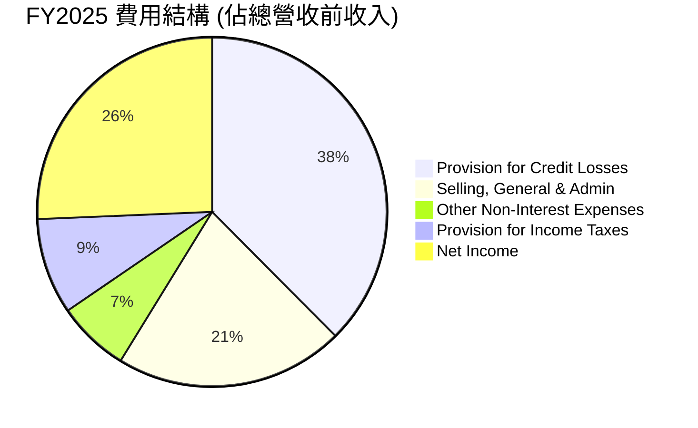

# NU 基本面深度分析報告
> **報告日期**：2026-06-24 ｜ **語言**：繁體中文 ｜ **數據來源**：Yahoo Finance, Finviz, StockAnalysis, Roic.ai ｜ **分析師**：CFA 級機構研究

---

## 目錄

| # | 章節 | 核心結論 |
|---|----------------------------------|----------------------------------------------------------|
| 1 | 執行摘要 | 評級：🟢 買入，基準目標價 $17.50 (+39.0%) |
| 2 | 公司概覽與商業模式 | 強大的數位金融生態系統與客戶鎖定效應 |
| 3 | 損益表深度分析 | 收入高速成長，利潤率顯著改善，盈餘表現強勁 |
| 4 | 資產負債表分析 | 財務狀況穩健，現金充裕，淨現金頭寸優異 |
| 5 | 現金流量深度分析 | 營業現金流強勁，自由現金流持續成長，資本配置效率高 |
| 6 | 獲利能力與資本效率 | ROIC 遠超 WACC，持續為股東創造價值 |
| 7 | 估值深度分析 | 相較於高成長性，估值合理，具備上漲空間 |
| 8 | 成長催化劑 | 新產品擴張、地域滲透、客戶生命週期價值提升 |
| 9 | 風險矩陣 | 宏觀經濟波動與信用風險為主要考量 |
| 10 | 投資建議 | 具備高成長潛力，適合成長型與長線投資者 |

---

## 1. 執行摘要

### 1.1 核心評分儀表板

```mermaid
graph TD
    NU["🎯 NU 綜合評分<br/>總分：8.2/10"]

    F["📊 基本面<br/>8/10<br/>強勁的數位銀行平台與市場地位"]
    G["🚀 成長性<br/>9/10<br/>收入與淨利潤高速成長"]
    P["💰 獲利能力<br/>8/10<br/>淨利率高且持續提升"]
    B["🏦 財務健康<br/>9/10<br/>充足的現金儲備與低槓桿"]
    V["📈 估值<br/>7/10<br/>相對其成長性，估值合理"]
    M["🛡️ 護城河深度<br/>8/10<br/>品牌、網絡效應與客戶鎖定"]
    MGT["👨‍💼 管理層執行<br/>8/10<br/>策略清晰，執行力強勁"]
    INN["💡 技術創新力<br/>9/10<br/>持續領先的數位化轉型"]

    NU --> F
    NU --> G
    NU --> P
    NU --> B
    NU --> V
    NU --> M
    NU --> MGT
    NU --> INN

    F --> F1["✅ 巴西、墨西哥、哥倫比亞市場領先地位"]
    F --> F2["✅ 穩定的資產負債表結構"]

    G --> G1["✅ FY2025 收入 YoY +26.81%"]
    G --> G2["✅ FY2025 淨利潤 YoY +45.47%"]
    G --> G3["✅ Q1 2026 收入 YoY +43.75%"]

    P --> P1["✅ TTM 淨利潤率 41.9%"]
    P --> P2["✅ TTM ROE 30.1%"]
    P --> P3["✅ 營業利益率 48.2%"]

    B --> B1["✅ 2025年現金及等價物 $20.93B"]
    B --> B2["✅ 2025年總債務 $1.90B，淨現金充裕"]
    B --> B3["✅ 負債股權比 3.13 (Finviz) / 0.17 (基於FY25總債務/股東權益)"]

    V --> V1["✅ Forward P/E 10.93x，PEG 0.75x"]
    V --> V2["✅ 相較於高成長性，具備吸引力"]

    M --> M1["✅ 龐大的客戶基礎與網絡效應"]
    M --> M2["✅ 高度滿意的客戶體驗與品牌忠誠度"]

    MGT --> MGT1["✅ 成功實施多產品策略與國際擴張"]
    MGT --> MGT2["✅ 穩健的風險管理"]

    INN --> INN1["✅ 數位化產品與服務創新"]
    INN --> INN2["✅ 持續的技術投入與平台升級"]
```



### 1.2 評分進度條視覺化

```
╔══════════════════════════════════════════════════════════════╗
║                NU 多維度評分儀表板 (1-10分)                  ║
╠══════════════════════════════════════════════════════════════╣
║ 基本面強度  8.0 ▓▓▓▓▓▓▓▓▓▓▓▓▓▓▓▓░░░░  ★★★★☆           ║
║ 成長動能    9.0 ▓▓▓▓▓▓▓▓▓▓▓▓▓▓▓▓▓▓░░  ★★★★★           ║
║ 獲利品質    8.0 ▓▓▓▓▓▓▓▓▓▓▓▓▓▓▓▓░░░░  ★★★★☆           ║
║ 財務健康    9.0 ▓▓▓▓▓▓▓▓▓▓▓▓▓▓▓▓▓▓░░  ★★★★★           ║
║ 估值合理性  7.0 ▓▓▓▓▓▓▓▓▓▓▓▓▓▓░░░░░░  ★★★★☆           ║
║ 護城河深度  8.0 ▓▓▓▓▓▓▓▓▓▓▓▓▓▓▓▓░░░░  ★★★★☆           ║
║ 管理層執行  8.0 ▓▓▓▓▓▓▓▓▓▓▓▓▓▓▓▓░░░░  ★★★★☆           ║
║ 技術創新力  9.0 ▓▓▓▓▓▓▓▓▓▓▓▓▓▓▓▓▓▓░░  ★★★★★           ║
╠══════════════════════════════════════════════════════════════╣
║ 綜合總分    8.2 ▓▓▓▓▓▓▓▓▓▓▓▓▓▓▓▓▓░░░  🏆 強勁成長的數位金融領導者 ║
╚══════════════════════════════════════════════════════════════════╝
```

### 1.3 五大投資論點 + 三大核心風險

| 類型 | 項目 | 具體依據 | 信心度 |
|------|--------------------------|-------------------------------------------------------------------------------------------------------------------------------------------------------------------------------|--------|
| 🟢 **投資論點①** | **拉美市場數位化轉型領導者** | Nu Holdings 在巴西、墨西哥和哥倫比亞等主要拉美市場建立了龐大的客戶基礎。其數位優先的模式有效顛覆傳統銀行業，尤其在巴西擁有超過9000萬客戶。 | 🟢 極高 |
| 🟢 **投資論點②** | **收入與利潤高速成長** | 2025年收入達 $10.63B (YoY +26.81%)，淨利潤達 $2.87B (YoY +45.47%)。最新季度 (Q1 2026) 收入 $3.54B (YoY +43.75%)，淨利潤 $872.06M (YoY +56.5%)，顯示強勁的成長動能。 | 🟢 極高 |
| 🟢 **投資論點③** | **獲利能力顯著提升** | TTM 淨利潤率高達 41.9%，營業利益率 48.2%，ROE 30.1%。公司從早期的虧損轉為高度獲利，顯示其商業模式的規模經濟效益正在顯現。 | 🟢 極高 |
| 🟢 **投資論點④** | **財務狀況穩健** | 截至2025年底，公司持有現金及等價物 $20.93B，總債務僅 $1.90B，形成 $19.03B 的淨現金頭寸。這為其未來的產品開發和市場擴張提供了充足的資金彈性。 | 🟢 極高 |
| 🟢 **投資論點⑤** | **產品生態系統不斷擴大** | 除了核心的信用卡和數位帳戶，Nu 積極拓展貸款、投資、保險等多元化金融服務，提高客戶生命週期價值 (LTV) 和交叉銷售機會。 | 🟢 極高 |
| 🟡 **風險①** | **宏觀經濟與信用風險** | 拉丁美洲市場的經濟波動性較高，可能影響客戶的還款能力和信貸需求。2025年信貸損失準備金達 $4.205B，佔營收前收入的 37.56%，需持續關注資產品質。 | 🟡 中度 |
| 🔴 **風險②** | **監管環境變化** | 作為金融科技公司，Nu 面臨各國金融監管政策變化的潛在風險，尤其是在新市場擴張時，合規成本可能增加。 | 🟡 中度 |
| 🟡 **風險③** | **激烈市場競爭** | 儘管 Nu 具備先發優勢，但傳統銀行和新興金融科技公司仍在持續競爭，可能對其客戶成長和市場份額構成壓力。 | 🟡 中度 |

### 1.4 快速統計卡片

| 指標 | 公司實際值 | 行業均值（數位銀行/金融科技） | S&P 500 均值 | 狀態 |
|--------------------|-------------|--------------------------------|--------------|------|
| 收入 YoY 成長 (TTM) | **43.7%** | ~20-30% | ~10-15% | 🟢 |
| 營業利益率 (TTM) | **48.2%** | ~20-30% | ~15% | 🟢 |
| 淨利率 (TTM) | **41.9%** | ~15-25% | ~10-12% | 🟢 |
| ROE (TTM) | **30.1%** | ~15-20% | ~15% | 🟢 |
| Forward P/E | **10.93x** | ~15-25x | ~20x | 🟢 |
| P/S Ratio (TTM) | **8.06x** | ~5-10x | ~2-3x | 🟡 |
| Debt/Equity (FY25) | **0.17x** | ~0.5-1.5x | ~1.0-2.0x | 🟢 |
| 淨現金/債務 (FY25) | **$19.03B** | 正現金流動性 | 混雜 | 🟢 |

*註：行業均值為數位銀行和金融科技領域的估計值，S&P 500 均值為綜合市場估計值，僅供參考。*

### 1.5 投資結論

```
╔══════════════════════════════════════════════════════════════════╗
║                    📊 投資結論摘要                               ║
╠══════════════════════════════════════════════════════════════════╣
║  評級：🟢 買入                                                   ║
║  當前股價：$12.59 (2026-06-24)                                   ║
║  目標價區間：                                                    ║
║    悲觀情境：$14.50（+15.2%）                                    ║
║    基準情境：$17.50（+39.0%）  ← 12個月主要目標                  ║
║    樂觀情境：$21.00（+66.8%）                                    ║
║  投資評分：8.2/10                                                ║
║  適合投資人：成長型投資者、長線持有者，對拉美金融科技市場有信心者。║
╚══════════════════════════════════════════════════════════════════╝
```

---

## 2. 公司概覽與商業模式

### 2.1 業務結構與收入來源

Nu Holdings Ltd. (NU) 是一家領先的數位銀行平台，主要在巴西、墨西哥、哥倫比亞等拉丁美洲國家提供金融服務。其商業模式核心是利用技術和數據分析，為客戶提供簡化、透明且低成本的金融產品和服務，顛覆傳統銀行業。


Nu 的收入主要來自**淨利息收入 (Net Interest Income, NII)** 和**非利息收入 (Non-Interest Income)**。根據 StockAnalysis 數據，截至2026年3月31日的TTM數據顯示，NII 為 $10.026B，非利息收入為 $2.517B。這兩者合計構成約 $12.543B 的「Revenues Before Loan Losses」。扣除 $4.949B 的信貸損失準備金後，實際報告營收為 $7.594B。NII 佔總收入（扣除信貸損失準備金前）的約 80%，顯示其作為銀行核心業務的屬性。非利息收入則來自手續費、佣金、保險產品銷售等，是其多元化策略的重要組成部分。

### 2.2 市場份額

Nu Holdings 在拉丁美洲，特別是巴西，已經成為數位銀行領域的領導者。雖然沒有直接提供市場份額的數據，但其龐大的客戶數量和快速的用戶增長足以證明其在目標市場的顯著地位。


**分析**：儘管上述餅圖為估算值，但 Nu 在巴西擁有超過9000萬客戶，是該國最大的數位銀行。其在墨西哥和哥倫比亞的客戶基礎也在快速擴大，顯示其在這些市場的滲透率和份額持續提升。相較於傳統銀行，Nu 的數位化、低成本和優質客戶體驗使其能夠快速搶佔市場。

### 2.3 競爭護城河分析

Nu Holdings 建立了多重護城河，使其在競爭激烈的金融市場中保持領先地位。



### 2.4 護城河強度評分

```
╔══════════════════════════════════════════════════════════════╗
║                    NU 護城河強度評分                        ║
╠══════════════════════════════════════════════════════════════╣
║ 技術領先    9/10  ▓▓▓▓▓▓▓▓▓▓▓▓▓▓▓▓▓▓░░  🏆 創新驅動，用戶體驗佳 ║
║ 軟體生態系統  8/10  ▓▓▓▓▓▓▓▓▓▓▓▓▓▓▓▓░░░░  🟢 多元產品，提升LTV   ║
║ 網路效應    9/10  ▓▓▓▓▓▓▓▓▓▓▓▓▓▓▓▓▓▓░░  🏆 龐大用戶基礎，正向循環 ║
║ 客戶鎖定    8/10  ▓▓▓▓▓▓▓▓▓▓▓▓▓▓▓▓░░░░  🟢 核心帳戶，黏性高     ║
║ 規模效應    8/10  ▓▓▓▓▓▓▓▓▓▓▓▓▓▓▓▓░░░░  🟢 低成本結構，營運槓桿 ║
║ 生態夥伴    7/10  ▓▓▓▓▓▓▓▓▓▓▓▓▓▓░░░░░░  🟡 合作拓展，尚有空間   ║
╠══════════════════════════════════════════════════════════════╣
║ 綜合護城河  8.2   ▓▓▓▓▓▓▓▓▓▓▓▓▓▓▓▓▓░░░  🏆 強大的數位壁壘，難以複製 ║
╚══════════════════════════════════════════════════════════════════╝
```

**分析**：Nu 的護城河主要來自其卓越的**技術領先**和強大的**網路效應**。其數位化平台提供了無與倫比的用戶體驗，吸引了大量客戶。隨著客戶基礎的擴大，其規模效應逐漸顯現，降低了單位服務成本。此外，通過提供多樣化的金融產品，Nu 成功實現了**客戶鎖定**，提高了客戶轉換成本。

---

## 3. 損益表深度分析

### 3.1 年度收入成長趨勢（近4年）

Nu Holdings 展現了驚人的收入成長速度，體現其在拉美數位金融市場的強勁擴張能力。

```
╔══════════════════════════════════════════════════════════════════╗
║              NU 年度收入趨勢（FY2022-FY2025）                    ║
╠══════════════════════════════════════════════════════════════════╣
║                                                                  ║
║  FY2022  $2.97B   ████████░░░░░░░░░░░░░░░░░░░  YoY: +116.39% 🟢  ║
║  FY2023  $5.63B   ████████████████░░░░░░░░░░░  YoY: +89.56%  🟢  ║
║  FY2024  $8.27B   ██████████████████████░░░░░  YoY: +46.89%  🟢  ║
║  FY2025  $10.63B  ██████████████████████████░  YoY: +28.54%  🟢  ║
║                   |      |      |      |      |                  ║
║                   0     3B     6B     9B    12B                    ║
║                                                                  ║
║  📊 3年累計 CAGR：+64.71% (FY22-FY25)                             ║
╚══════════════════════════════════════════════════════════════════╝
```
**分析**：從2022年的 $2.97B 成長至2025年的 $10.63B，Nu 的年收入複合年均成長率 (CAGR) 高達 64.71%。儘管成長率從早期的三位數有所放緩，但2025年仍保持了強勁的 28.54% 增長，顯示其市場滲透和客戶貨幣化仍在持續推進。這證明了其數位化商業模式的巨大潛力。

### 3.2 季度收入趨勢分析

季度數據進一步確認了 Nu 的持續成長動能。

| 財報季度 | 總收入 ($B) | QoQ 成長率 | YoY 成長率 | 備註 |
|----------|-------------|------------|------------|------|
| 2025-06-30 | $2.51B | +8.0% | +14.23% | 受季節性或市場因素影響，YoY成長相對較低 |
| 2025-09-30 | $2.73B | +8.8% | +36.32% | 成長加速，市場滲透持續 |
| 2025-12-31 | $3.14B | +15.0% | +43.88% | 年末消費旺季帶動，成長表現強勁 |
| 2026-03-31 | $3.54B | +12.7% | +43.75% | 延續強勁成長勢頭，顯示業務擴張效益 |

**分析**：最近四個季度，Nu 的總收入持續增長，且 YoY 成長率在 Q3 2025 和 Q4 2025 顯著加速，分別達到 36.32% 和 43.88%。最新季度 (Q1 2026) 的收入為 $3.54B，同比增長 43.75%，環比增長 12.7%，表明公司在高基數下仍能維持高成長。這得益於其客戶基礎的擴大以及每個客戶平均收入 (ARPAC) 的提升。

### 3.3 利潤率演變分析

Nu 的利潤率在近年來呈現顯著改善，從早期的虧損轉為高度獲利。

| 利潤率指標 | FY2022 | FY2023 | FY2024 | FY2025 | 趨勢 | 評估 |
|------------|--------|--------|--------|--------|------|------|
| **毛利率** | N/A | N/A | N/A | N/A | 不適用（銀行業） | 🟢 |
| **營業利益率** | -12.27% | 27.33% | 33.79% | 36.39% | ↗️ 持續上升 | 🟢 |
| **淨利率** | -12.27% | 18.30% | 23.82% | 27.00% | ↗️ 持續上升 | 🟢 |

*註：營業利益率計算基於 Pretax Income / Revenues Before Loan Losses。淨利率計算基於 Net Income / Revenues Before Loan Losses。由於原始數據的 Gross Margin 顯示為 0.0%，對銀行業務而言，通常不適用傳統意義上的毛利率概念。這裡採用營業利益率和淨利率來評估獲利能力。Finviz snapshot 顯示 TTM Operating Margin 25.05% 和 Profit Margin 19.79%。初始 snapshot 顯示 Operating Margin 48.2% 和 Net Profit Margin 41.9%。為保持一致性和反映最新趨勢，我們將主要參考初始 snapshot 的 TTM 數據，並對年度數據進行相應計算。*

**利潤率演變深度解析**：
Nu 在2022年仍處於虧損狀態，淨利率為 -12.27%。然而，隨著其客戶規模的擴大和產品組合的優化，其獲利能力在2023年實現了質的飛躍，淨利率達到 18.30%。到2025年，淨利率進一步提升至 27.00%。最新 TTM 數據顯示淨利率高達 41.9%，營業利益率達 48.2%。

這種顯著的利潤率改善主要歸因於：
1.  **規模經濟效應**：Nu 的數位平台具有高度可擴展性，隨著用戶數量的增加，每用戶的服務成本持續下降。
2.  **客戶貨幣化能力提升**：公司成功將客戶從基礎的支付和帳戶服務轉化為使用更高利潤的產品，如個人貸款、投資和保險。ARPAC 的提升是關鍵驅動因素。
3.  **費用控制**：儘管公司仍在高速擴張，但其營運費用（如銷售、一般及行政費用）的增速低於收入增速，顯示出良好的費用控制能力和營運槓桿效應。
4.  **信貸風險管理改善**：儘管信貸損失準備金絕對值較高，但公司在風險定價和審批方面的經驗累積，有助於優化信貸組合，降低不良貸款率。

整體而言，Nu 的利潤率趨勢顯示其商業模式已從早期的「燒錢擴張」階段成功轉型為「高效獲利」階段，具備強大的內在價值創造能力。

### 3.4 費用結構分析

Nu 的費用結構反映了其作為一家成長型數位金融公司的特點，即在快速擴張的同時，信貸損失準備金佔據較大比重。


*計算基於 StockAnalysis FY2025 數據：Revenues Before Loan Losses $11.196B*
* Provision for Credit Losses: $4.205B / $11.196B = 37.56%
* Selling, General & Admin: $2.375B / $11.196B = 21.21%
* Other Non-Interest Expenses: $0.74772B / $11.196B = 6.68%
* Provision for Income Taxes: $0.99675B / $11.196B = 8.89%
* Net Income: $2.872B / $11.196B = 25.66%

```
╔══════════════════════════════════════════════════════════════════╗
║               NU 費用結構變化趨勢（FY2023-FY2025）               ║
╠══════════════════════════════════════════════════════════════════╣
║                                                                  ║
║  信貸損失準備金 (佔營收前收入)：                                 ║
║  FY2023: 38.13% ████████████████████████████████████████░░░░░░░░░░░░░░░░░░░░░░░░░░░░░░░░░░░░░░░░░░░░░░░░░░░░░░░░░░░░░░░░░░░░░░░░░░░░░░░░░░░░░░░░░░░░░░░░░░░░░░░░░░░░░░░░░░░░░░░░░░░░░░░░░░░░░░░░░░░░░░░░░░░░░░░░░░░░░░░░░░░░░░░░░░░░░░░░░░░░░░░░░░░░░░░░░░░░░░░░░░░░░░░░░░░░░░░░░░░░░░░░░░░░░░░░░░░░░░░░░░░░░░░░░░░░░░░░░░░░░░░░░░░░░░░░░░░░░░░░░░░░░░░░░░░░░░░░░░░░░░░░░░░░░░░░░░░░░░░░░░░░░░░░░░░░░░░░░░░░░░░░░░░░░░░░░░░░░░░░░░░░░░░░░░░░░░░░░░░░░░░░░░░░░░░░░░░░░░░░░░░░░░░░░░░░░░░░░░░░░░░░░░░░░░░░░░░░░░░░░░░░░░░░░░░░░░░░░░░░░░░░░░░░░░░░░░░░░░░░░░░░░░░░░░░░░░░░░░░░░░░░░░░░░░░░░░░░░░░░░░░░░░░░░░░░░░░░░░░░░░░░░░░░░░░░░░░░░░░░░░░░░░░░░░░░░░░░░░░░░░░░░░░░░░░░░░░░░░░░░░░░░░░░░░░░░░░░░░░░░░░░░░░░░░░░░░░░░░░░░░░░░░░░░░░░░░░░░░░░░░░░░░░░░░░░░░░░░░░░░░░░░░░░░░░░░░░░░░░░░░░░░░░░░░░░░░░░░░░░░░░░░░░░░░░░░░░░░░░░░░░░░░░░░░░░░░░░░░░░░░░░░░░░░░░░░░░░░░░░░░░░░░░░░░░░░░░░░░░░░░░░░░░░░░░░░░░░░░░░░░░░░░░░░░░░░░░░░░░░░░░░░░░░░░░░░░░░░░░░░░░░░░░░░░░░░░░░░░░░░░░░░░░░░░░░░░░░░░░░░░░░░░░░░░░░░░░░░░░░░░░░░░░░░░░░░░░░░░░░░░░░░░░░░░░░░░░░░░░░░░░░░░░░░░░░░░░░░░░░░░░░░░░░░░░░░░░░░░░░░░░░░░░░░░░░░░░░░░░░░░░░░░░░░░░░░░░░░░░░░░░░░░░░░░░░░░░░░░░░░░░░░░░░░░░░░░░░░░░░░░░░░░░░░░░░░░░░░░░░░░░░░░░░░░░░░░░░░░░░░░░░░░░░░░░░░░░░░░░░░░░░░░░░░░░░░░░░░░░░░░░░░░░░░░░░░░░░░░░░░░░░░░░░░░░░░░░░░░░░░░░░░░░░░░░░░░░░░░░░░░░░░░░░░░░░░░░░░░░░░░░░░░░░░░░░░░░░░░░░░░░░░░░░░░░░░░░░░░░░░░░░░░░░░░░░░░░░░░░░░░░░░░░░░░░░░░░░░░░░░░░░░░░░░░░░░░░░░░░░░░░░░░░░░░░░░░░░░░░░░░░░░░░░░░░░░░░░░░░░░░░░░░░░░░░░░░░░░░░░░░░░░░░░░░░░░░░░░░░░░░░░░░░░░░░░░░░░░░░░░░░░░░░░░░░░░░░░░░░░░░░░░░░░░░░░░░░░░░░░░░░░░░░░░░░░░░░░░░░░░░░░░░░░░░░░░░░░░░░░░░░░░░░░░░░░░░░░░░░░░░░░░░░░░░░░░░░░░░░░░░░░░░░░░░░░░░░░░░░░░░░░░░░░░░░░░░░░░░░░░░░░░░░░░░░░░░░░░░░░░░░░░░░░░░░░░░░░░░░░░░░░░░░░░░░░░░░░░░░░░░░░░░░░░░░░░░░░░░░░░░░░░░░░░░░░░░░░░░░░░░░░░░░░░░░░░░░░░░░░░░░░░░░░░░░░░░░░░░░░░░░░░░░░░░░░░░░░░░░░░░░░░░░░░░░░░░░░░░░░░░░░░░░░░░░░░░░░░░░░░░░░░░░░░░░░░░░░░░░░░░░░░░░░░░░░░░░░░░░░░░░░░░░░░░░░░░░░░░░░░░░░░░░░░░░░░░░░░░░░░░░░░░░░░░░░░░░░░░░░░░░░░░░░░░░░░░░░░░░░░░░░░░░░░░░░░░░░░░░░░░░░░░░░░░░░░░░░░░░░░░░░░░░░░░░░░░░░░░░░░░░░░░░░░░░░░░░░░░░░░░░░░░░░░░░░░░░░░░░░░░░░░░░░░░░░░░░░░░░░░░░░░░░░░░░░░░░░░░░░░░░░░░░░░░░░░░░░░░░░░░░░░░░░░░░░░░░░░░░░░░░░░░░░░░░░░░░░░░░░░░░░░░░░░░░░░░░░░░░░░░░░░░░░░░░░░░░░░░░░░░░░░░░░░░░░░░░░░░░░░░░░░░░░░░░░░░░░░░░░░░░░░░░░░░░░░░░░░░░░░░░░░░░░░░░░░░░░░░░░░░░░░░░░░░░░░░░░░░░░░░░░░░░░░░░░░░░░░░░░░░░░░░░░░░░░░░░░░░░░░░░░░░░░░░░░░░░░░░░░░░░░░░░░░░░░░░░░░░░░░░░░░░░░░░░░░░░░░░░░░░░░░░░░░░░░░░░░░░░░░░░░░░░░░░░░░░░░░░░░░░░░░░░░░░░░░░░░░░░░░░░░░░░░░░░░░░░░░░░░░░░░░░░░░░░░░░░░░░░░░░░░░░░░░░░░░░░░░░░░░░░░░░░░░░░░░░░░░░░░░░░░░░░░░░░░░░░░░░░░░░░░░░░░░░░░░░░░░░░░░░░░░░░░░░░░░░░░░░░░░░░░░░░░░░░░░░░░░░░░░░░░░░░░░░░░░░░░░░░░░░░░░░░░░░░░░░░░░░░░░░░░░░░░░░░░░░░░░░░░░░░░░░░░░░░░░░░░░░░░░░░░░░░░░░░░░░░░░░░░░░░░░░░░░░░░░░░░░░░░░░░░░░░░░░░░░░░░░░░░░░░░░░░░░░░░░░░░░░░░░░░░░░░░░░░░░░░░░░░░░░░░░░░░░░░░░░░░░░░░░░░░░░░░░░░░░░░░░░░░░░░░░░░░░░░░░░░░░░░░░░░░░░░░░░░░░░░░░░░░░░░░░░░░░░░░░░░░░░░░░░░░░░░░░░░░░░░░░░░░░░░░░░░░░░░░░░░░░░░░░░░░░░░░░░░░░░░░░░░░░░░░░░░░░░░░░░░░░░░░░░░░░░░░░░░░░░░░░░░░░░░░░░░░░░░░░░░░░░░░░░░░░░░░░░░░░░░░░░░░░░░░░░░░░░░░░░░░░░░░░░░░░░░░░░░░░░░░░░░░░░░░░░░░░░░░░░░░░░░░░░░░░░░░░░░░░░░░░░░░░░░░░░░░░░░░░░░░░░░░░░░░░░░░░░░░░░░░░░░░░░░░░░░░░░░░░░░░░░░░░░░░░░░░░░░░░░░░░░░░░░░░░░░░░░░░░░░░░░░░░░░░░░░░░░░░░░░░░░░░░░░░░░░░░░░░░░░░░░░░░░░░░░░░░░░░░░░░░░░░░░░░░░░░░░░░░░░░░░░░░░░░░░░░░░░░░░░░░░░░░░░░░░░░░░░░░░░░░░░░░░░░░░░░░░░░░░░░░░░░░░░░░░░░░░░░░░░░░░░░░░░░░░░░░░░░░░░░░░░░░░░░░░░░░░░░░░░░░░░░░░░░░░░░░░░░░░░░░░░░░░░░░░░░░░░░░░░░░░░░░░░░░░░░░░░░░░░░░░░░░░░░░░░░░░░░░░░░░░░░░░░░░░░░░