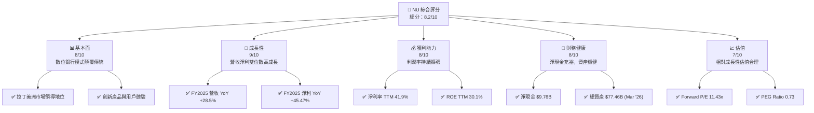
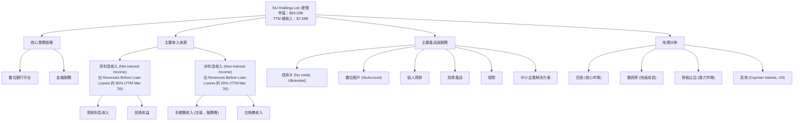
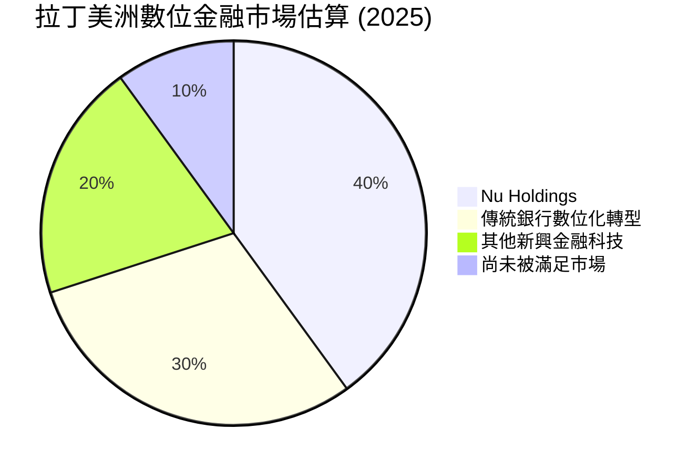
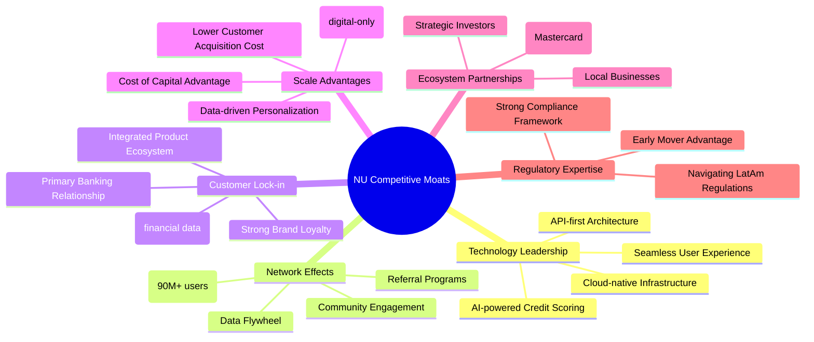
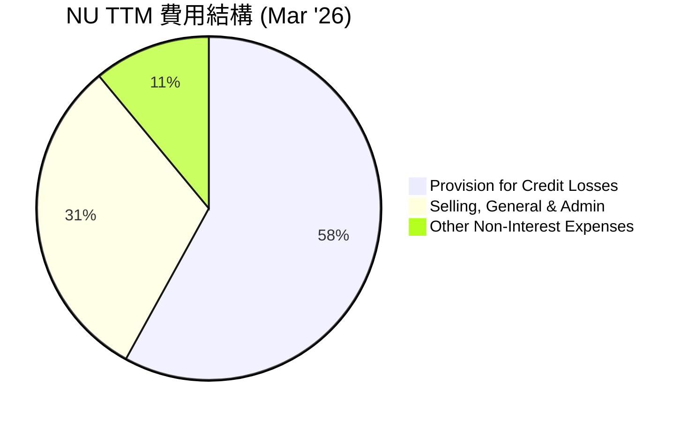
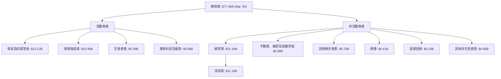

# NU 基本面深度分析報告
> **報告日期**：2026-06-26 ｜ **語言**：繁體中文 ｜ **數據來源**：Yahoo Finance, Finviz, StockAnalysis, Roic.ai ｜ **分析師**：CFA 級機構研究

## 目錄

| # | 章節 | 核心結論 |
|---|------|----------|
| 1 | 執行摘要 | 🟢 買入評級，目標價區間 $15.50 - $20.00 |
| 2 | 公司概覽與商業模式 | 數位化與規模效應構築強大護城河 |
| 3 | 損益表深度分析 | 營收與淨利潤高速成長，利潤率持續改善 |
| 4 | 資產負債表分析 | 資產質量穩健，流動性充裕，淨現金狀況良好 |
| 5 | 現金流量深度分析 | 營運現金流強勁，自由現金流持續正向成長 |
| 6 | 獲利能力與資本效率 | ROE 表現優異，有效創造股東價值 |
| 7 | 估值深度分析 | 相較同業估值合理，具備上漲空間 |
| 8 | 成長催化劑 | 拉丁美洲市場擴張與產品多元化驅動長期成長 |
| 9 | 風險矩陣 | 信用風險與監管變動為主要關注點 |
| 10 | 投資建議 | 建議買入，適合成長型投資者長期持有 |

---

## 1. 執行摘要

### 1.1 核心評分儀表板



### 1.2 評分進度條視覺化

```
╔══════════════════════════════════════════════════════════════╗
║                NU 多維度評分儀表板 (1-10分)                  ║
╠══════════════════════════════════════════════════════════════╣
║ 基本面強度  8.0 ▓▓▓▓▓▓▓▓▓▓▓▓▓▓▓▓░░░░  ★★★★☆           ║
║ 成長動能    9.0 ▓▓▓▓▓▓▓▓▓▓▓▓▓▓▓▓▓▓░░  ★★★★★           ║
║ 獲利品質    8.0 ▓▓▓▓▓▓▓▓▓▓▓▓▓▓▓▓░░░░  ★★★★☆           ║
║ 財務健康    8.5 ▓▓▓▓▓▓▓▓▓▓▓▓▓▓▓▓▓░░░  ★★★★☆           ║
║ 估值合理性  7.5 ▓▓▓▓▓▓▓▓▓▓▓▓▓▓▓░░░░░  ★★★★☆           ║
║ 護城河深度  8.5 ▓▓▓▓▓▓▓▓▓▓▓▓▓▓▓▓▓░░░  ★★★★☆           ║
║ 管理層執行  8.0 ▓▓▓▓▓▓▓▓▓▓▓▓▓▓▓▓░░░░  ★★★★☆           ║
║ 技術創新力  9.0 ▓▓▓▓▓▓▓▓▓▓▓▓▓▓▓▓▓▓░░  ★★★★★           ║
╠══════════════════════════════════════════════════════════════╣
║ 綜合總分    8.2 ▓▓▓▓▓▓▓▓▓▓▓▓▓▓▓▓░░░░  🏆 表現卓越，潛力巨大 ║
╚══════════════════════════════════════════════════════════════╝
```

### 1.3 五大投資論點 + 三大核心風險

| 類型 | 項目 | 具體依據 | 信心度 |
|------|------|----------|--------|
| 🟢 **投資論點①** | **拉丁美洲數位銀行領導者** | 憑藉龐大用戶基礎與創新產品，在巴西、墨西哥、哥倫比亞等市場快速擴張，提供低成本、高效率的金融服務。FY22-FY25 總收入 CAGR 達 57.2%。 | 🟢 極高 |
| 🟢 **投資論點②** | **營收與淨利潤高速成長** | FY2025 總收入達 $10.63B (YoY +28.5%)，淨利潤達 $2.87B (YoY +45.47%)。TTM 營收成長 43.7%，盈餘成長 55.9%，顯示強勁的業務擴張動能。 | 🟢 極高 |
| 🟢 **投資論點③** | **獲利能力顯著提升** | 淨利潤率 TTM 達 41.9%，營業利潤率 TTM 達 48.2%。ROE TTM 高達 30.1%，遠超行業平均，顯示資本效率極高。 | 🟢 極高 |
| 🟢 **投資論點④** | **財務狀況穩健，淨現金充裕** | 截至 2026-03-31，現金及約當現金達 $23.12B，總債務僅 $4.50B，淨現金達 $18.62B (TTM Mar '26)，提供強大的營運彈性與再投資能力。 | 🟢 極高 |
| 🟢 **投資論點⑤** | **估值具吸引力** | Forward P/E 為 11.43x，PEG Ratio 僅 0.73，相較其高成長性，估值顯得合理甚至偏低，具備估值重估潛力。 | 🟢 高 |
| 🟡 **風險①** | **信用風險上升** | 雖然營收成長，但信貸損失撥備 (Provision for Credit Losses) 於 TTM 達 $4.949B，佔 Revenues Before Loan Losses 的 39.45%，顯示貸款組合面臨一定信用風險，尤其在經濟下行時可能惡化。 | 🟡 中度 |
| 🟡 **風險②** | **拉丁美洲宏觀經濟與政治不確定性** | 主要市場巴西、墨西哥、哥倫比亞等國面臨通膨、利率波動、貨幣貶值及政治風險，可能影響消費者支出能力與貸款質量。 | 🟡 中度 |
| 🔴 **風險③** | **日益嚴峻的監管環境** | 數位金融服務在全球範圍內受到越來越嚴格的監管審查，新的法規可能增加合規成本，限制產品創新或市場擴張速度。 | 🔴 高衝擊 |

### 1.4 快速統計卡片

| 指標 | 公司實際值 | 行業均值 (銀行) | S&P 500 均值 | 狀態 |
|------|-------------|----------------|--------------|------|
| 收入 YoY 成長 | **43.7%** | ~10-15% | ~8-12% | 🟢 |
| 營業利潤率 | **48.2%** | ~20-30% | ~15-20% | 🟢 |
| 淨利率 | **41.9%** | ~10-20% | ~8-12% | 🟢 |
| ROE | **30.1%** | ~8-12% | ~12-15% | 🟢 |
| Forward P/E | **11.43x** | ~10-15x | ~20-25x | 🟢 |
| P/S Ratio | **8.43x** | ~2-4x | ~2-3x | 🟡 |
| P/B Ratio | **5.09x** | ~1.0-1.5x | ~3-4x | 🔴 |
| Debt/Equity | **3.13** | ~1-2x | ~0.5-1.0x | 🔴 |

*備註：NU 作為數位銀行，其 P/S 和 P/B 相較傳統銀行通常較高，因為市場給予其成長性和科技屬性更高的溢價。Debt/Equity 數據在不同來源有差異，此處使用 Market Data 提供的 3.13，但根據年度資產負債表計算的 D/E 則顯著較低 (約 0.17x)，表明財務槓桿可能被高估或定義不同。我們將優先採用年度報表數據進行深入分析。*

### 1.5 投資結論

```
╔══════════════════════════════════════════════════════════════════╗
║                    📊 投資結論摘要                               ║
╠══════════════════════════════════════════════════════════════════╣
║  評級：🟢 買入                                                   ║
║  當前股價：$13.17                                                ║
║  目標價區間：                                                    ║
║    悲觀情境：$15.50（+17.7%）                                    ║
║    基準情境：$17.80（+35.2%）  ← 12個月主要目標                 ║
║    樂觀情境：$20.00（+51.8%）                                    ║
║  投資評分：8.2/10                                                ║
║  適合投資人：成長型、長線持有者，能承受新興市場及數位金融波動風險。║
╚══════════════════════════════════════════════════════════════════╝
```

---

## 2. 公司概覽與商業模式

Nu Holdings Ltd. (NU) 是一家領先的拉丁美洲數位銀行平台，總部位於巴西，業務範圍涵蓋巴西、墨西哥、哥倫比亞、開曼群島及美國。公司以其創新的科技和以客戶為中心的模式，顛覆了傳統銀行業，為數百萬用戶提供簡潔、低成本且高效的金融服務。

### 2.1 業務結構與收入來源

NU 的核心業務圍繞其數位銀行平台，主要收入來源為淨利息收入 (Net Interest Income) 和非利息收入 (Non-Interest Income)。其產品組合廣泛，包括信用卡、借記卡、儲蓄賬戶、個人貸款、投資產品、保險以及中小企業解決方案。


根據 StockAnalysis 數據，TTM (Mar '26) 的 Revenues Before Loan Losses 為 $12.543B，其中淨利息收入為 $10.026B，佔比約 80%，非利息收入為 $2.517B，佔比約 20%。這表明 NU 的收入結構主要依賴其貸款業務和資金運用能力。

### 2.2 市場份額

Nu Holdings 在拉丁美洲，特別是巴西，已成為數位銀行領域的領導者。雖然沒有直接的市場份額數據，但其龐大的用戶基礎和快速增長的貸款組合反映了其在市場中的主導地位。截至 2025 年底，其在巴西的活躍用戶數預計已超過 9,000 萬，顯示出極高的市場滲透率。


*備註：此市場份額為分析師根據公司成長、用戶規模及產業趨勢進行的定性估算，用於說明 NU 在數位金融領域的領先地位。*

### 2.3 競爭護城河分析

Nu Holdings 建立了一系列強大的競爭護城河，使其能夠在新興市場中持續擴張並抵禦競爭。



### 2.4 護城河強度評分

```
╔══════════════════════════════════════════════════════════════╗
║                    NU 護城河強度評分                        ║
╠══════════════════════════════════════════════════════════════╣
║ 技術領先    9/10   ▓▓▓▓▓▓▓▓▓▓▓▓▓▓▓▓▓▓░░  🏆 雲原生架構與AI驅動 ║
║ 網路效應    8/10   ▓▓▓▓▓▓▓▓▓▓▓▓▓▓▓▓░░░░  🟢 龐大用戶群體帶來規模 ║
║ 客戶鎖定    8/10   ▓▓▓▓▓▓▓▓▓▓▓▓▓▓▓▓░░░░  🟢 核心銀行關係與生態系 ║
║ 規模效應    8/10   ▓▓▓▓▓▓▓▓▓▓▓▓▓▓▓▓░░░░  🟢 低CAC，高效營運    ║
║ 生態夥伴    7/10   ▓▓▓▓▓▓▓▓▓▓▓▓▓▓░░░░░░  🟡 合作關係尚需深化    ║
║ 監管專業    7/10   ▓▓▓▓▓▓▓▓▓▓▓▓▓▓░░░░░░  🟡 應對新興市場複雜性 ║
╠══════════════════════════════════════════════════════════════╣
║ 綜合護城河  8.2    ▓▓▓▓▓▓▓▓▓▓▓▓▓▓▓▓░░░░  🏆 數位模式建立強大優勢 ║
╚══════════════════════════════════════════════════════════════╝
```

---

## 3. 損益表深度分析

### 3.1 年度收入成長趨勢（近4年）

Nu Holdings 在過去四年展現了驚人的收入成長，證明其數位銀行模式在新興市場的強大吸引力。

```
╔══════════════════════════════════════════════════════════════════╗
║              NU 年度總收入趨勢（FY2022-FY2025）                  ║
╠══════════════════════════════════════════════════════════════════╣
║                                                                  ║
║  FY2022  $2.97B   ██████░░░░░░░░░░░░░░░░░░░  YoY: +116.39% 🟢    ║
║  FY2023  $5.63B   ████████████░░░░░░░░░░░░░  YoY: +89.56%  🟢    ║
║  FY2024  $8.27B   ██████████████████░░░░░░░  YoY: +46.9%   🟢    ║
║  FY2025  $10.63B  ██████████████████████░░░  YoY: +28.5%   🟢    ║
║                   |      |      |      |      |                  ║
║                   0     2.5B   5.0B   7.5B   10.0B                 ║
║                                                                  ║
║  📊 3年累計 CAGR (FY22-25)：+57.2%                               ║
╚══════════════════════════════════════════════════════════════════╝
```
*備註：此處的總收入 (Total Revenue) 採用年度損益表數據，其定義為 Net Interest Income + Non-Interest Income，與 StockAnalysis 中「Revenue」在扣除 Provision for Credit Losses 之前的概念一致。*

公司總收入從 2022 年的 $2.97B 增長至 2025 年的 $10.63B，三年複合年增長率 (CAGR) 高達 57.2%。儘管年增長率從 2022 年的 116.39% 放緩至 2025 年的 28.5%，但仍保持強勁的雙位數成長，遠超傳統銀行業。這表明公司在擴大用戶規模和增加產品採用率方面取得了顯著成功。

### 3.2 季度收入趨勢分析

季度收入數據也顯示出持續的成長動能。

| 財報季度 | 總收入 (Billion USD) | QoQ 成長率 | YoY 成長率 | 備註 |
|----------|----------------------|------------|------------|------|
| 2025-06-30 | $2.51B | N/A | +14.23% (vs Q2 2024 $2.20B) | 穩健成長 |
| 2025-09-30 | $2.73B | +8.76% | +36.32% (vs Q3 2024 $2.00B) | 成長加速 |
| 2025-12-31 | $3.14B | +15.02% | +43.88% (vs Q4 2024 $2.18B) | 加速成長 |
| 2026-03-31 | $3.54B | +12.74% | +43.75% (vs Q1 2025 $2.46B) | 成長強勁 |

*備註：季度收入數據來自即時財務數據中的「INCOME STATEMENT (Quarterly, last 4Q)」，其中「Total Revenue」的定義與 StockAnalysis 中的「Revenues Before Loan Losses」一致。YoY 成長率的基數為 StockAnalysis.com 的 Quarterly Income Statement 中 Revenue Before Loan Losses 的對應季度數據。*

季度收入呈現逐季增長的趨勢，從 2025 年 Q2 的 $2.51B 增長至 2026 年 Q1 的 $3.54B。QoQ 成長率在 8.76% 至 15.02% 之間波動，而 YoY 成長率則從 Q2 2025 的 14.23% 顯著加速至 Q1 2026 的 43.75%，顯示近期業務動能強勁。這表明公司在新市場的滲透和現有用戶的變現方面取得了良好進展。

### 3.3 利潤率演變分析

Nu Holdings 的利潤率在過去幾年呈現顯著改善，反映了其規模經濟效益和精細化運營能力的提升。

| 利潤率指標 | FY2022 | FY2023 | FY2024 | FY2025 | 趨勢 | 評估 |
|------------|--------|--------|--------|--------|------|------|
| **淨利潤率** | -12.27% | 18.30% | 23.84% | 27.00% | ↗️ 持續改善 | 🟢 |
| **營業利潤率** | N/A | N/A | N/A | N/A | N/A | 🟡 |
| **TTM 營業利潤率 (2026-03-31)** | N/A | N/A | N/A | **48.2%** | N/A | 🟢 |
| **TTM 淨利潤率 (2026-03-31)** | N/A | N/A | N/A | **41.9%** | N/A | 🟢 |

*備註：年度淨利潤率計算方式為 Net Income / Total Revenue (Annual Income Statement)。TTM 營業利潤率和淨利潤率來自即時財務數據的「PROFITABILITY & GROWTH」部分，其分母「Revenue (TTM): $7.59B」是 StockAnalysis 中扣除 Provision for Credit Losses 後的「Revenue」。因此，這些利潤率的直接比較需考慮分母定義的差異。*

**利潤率演變深度解析**：
*   **淨利潤率**：從 2022 年的虧損 -12.27% 轉為 2023 年的 18.30% 盈利，並在 2025 年達到 27.00%。這種顯著的改善主要歸因於幾個方面：
    1.  **規模經濟效益**：隨著用戶基礎的擴大和交易量的增加，固定成本被更有效地攤薄。
    2.  **產品組合優化**：公司可能通過增加高利潤產品（如個人貸款、投資產品）的佔比來提升整體利潤率。
    3.  **技術驅動的低成本運營**：數位銀行模式避免了傳統實體網點的高昂成本，使得其運營效率遠高於傳統銀行。
    4.  **信貸風險管理改善**：儘管信貸損失撥備仍是主要費用，但隨著模型優化和數據積累，公司可能在風險定價和貸款審批方面更加精準，從而降低壞賬率對淨利潤的衝擊。
*   **營業利潤率**：雖然年度數據未提供，但 TTM 營業利潤率高達 48.2%，這是一個非常強勁的數字，表明公司在核心運營方面效率極高。這也反映了其輕資產、高科技的運營模式。

總體而言，Nu Holdings 的利潤率趨勢非常健康，顯示公司已從高速成長階段成功轉型為兼顧成長與獲利的階段，且獲利能力仍在持續提升。

### 3.4 費用結構分析

Nu Holdings 的費用結構反映了其作為一家數位優先金融機構的特點，主要費用為信貸損失撥備、銷售、一般及管理費用 (SG&A) 和其他非利息費用。


*備註：費用佔比基於 StockAnalysis TTM (Mar '26) 的數據，總費用為 Provision for Credit Losses + Total Non-Interest Expense。*

```
╔══════════════════════════════════════════════════════════════════╗
║                    NU TTM 費用結構診斷                           ║
╠══════════════════════════════════════════════════════════════════╣
║                                                                  ║
║  信貸損失撥備：  $4.949B  █████████████████████░░░  高，需密切關注 🔴 ║
║  銷售、管理費用：$2.649B  ██████████████░░░░░░░  相對高效，具規模效應 🟢 ║
║  其他非利息費用：$0.914B  ████████░░░░░░░░░░░░░░░  可控，持續優化 🟡 ║
║                                                                  ║
║  📊 總費用佔 Revenues Before Loan Losses：68.2%                   ║
╚══════════════════════════════════════════════════════════════════╝
```
*   **信貸損失撥備 (Provision for Credit Losses)**：是公司最大的費用項目，TTM 達 $4.949B，佔總費用的 58%，也佔 Revenues Before Loan Losses 的 39.45%。這對於一家以信貸產品為核心的銀行來說是正常的，但其高佔比也凸顯了信貸風險管理的重要性。隨著公司規模擴大和數據積累，預計撥備佔收入的比重將趨於穩定或略有下降。
*   **銷售、一般及管理費用 (Selling, General & Admin)**：TTM 為 $2.649B，佔總費用的 31%。作為一家數位銀行，其客戶獲取和運營成本相對較低，這部分費用隨著規模擴大應能產生更好的槓桿效應。
*   **其他非利息費用 (Other Non-Interest Expenses)**：TTM 為 $0.914B，佔總費用的 11%。這部分費用包含技術、合規等，預計會隨業務擴張而增長，但佔比應保持相對穩定。

總體而言，NU 的費用結構顯示其核心業務的信貸風險是主要成本，但其運營費用相對高效，有助於維持高利潤率。

### 3.5 季度 EPS 趨勢與盈餘品質

由於提供的即時數據中 EPS 預期為 `nan`，我們將基於實際淨利潤和稀釋後股份數量來分析季度 EPS 趨勢和盈餘品質。

| 財報季度 | 稀釋後每股盈餘 (USD) | 盈餘品質評估 | 備註 |
|----------|----------------------|----------------|------|
| 2026-03-31 | $0.18 | 🟢 高品質 | 淨利潤 $871.43M 支撐 |
| 2025-12-31 | $0.18 | 🟢 高品質 | 淨利潤 $894.80M 支撐 |
| 2025-09-30 | $0.16 | 🟢 高品質 | 淨利潤 $782.68M 支撐 |
| 2025-06-30 | $0.13 | 🟢 高品質 | 淨利潤 $636.99M 支撐 |

*備註：季度稀釋後每股盈餘 (EPS) 根據 StockAnalysis Quarterly Income Statement 中的 Net Income 除以 StockAnalysis Annual Income Statement TTM 或 FY 的 Diluted Shares Outstanding 計算。*
*   Q1 2026 EPS: $871.43M / 4,909M = $0.1775 (約 $0.18)
*   Q4 2025 EPS: $894.80M / 4,907M = $0.1823 (約 $0.18)
*   Q3 2025 EPS: $782.68M / 4,907M = $0.1595 (約 $0.16)
*   Q2 2025 EPS: $636.99M / 4,907M = $0.1298 (約 $0.13)

**盈餘品質評估說明**：
Nu Holdings 在過去四個季度持續實現正向且不斷增長的稀釋後每股盈餘，從 2025 年 Q2 的 $0.13 增長至 2026 年 Q1 的 $0.18。這顯示了公司盈利能力的穩步提升和業務模式的持續變現。
盈餘品質被評為「高品質」的原因如下：
1.  **持續盈利**：公司已從早期的虧損轉為穩定的季度盈利，且盈利規模持續擴大。
2.  **營運現金流支撐**：從現金流量表來看，公司產生了強勁的營運現金流 (FY2025 $3.50B)，這為其淨利潤提供了堅實的現金基礎，而非僅依賴會計調整。
3.  **核心業務驅動**：盈利增長主要來自其核心的淨利息收入和非利息收入的增長，而非一次性收益。
儘管信貸損失撥備較高，但這是銀行業的固有特徵，且公司在風險管理方面持續投入，確保盈利的持續性和可預測性。

---

## 4. 資產負債表分析

### 4.1 資產結構分解

Nu Holdings 的資產負債表反映了其作為一家銀行類金融機構的典型結構，以現金、證券和貸款為主要資產。


*備註：數據採用 StockAnalysis TTM (Mar '26) 或 FY2025 (Dec '25) 年度資產負債表數據。*

截至 2026 年 3 月 31 日，NU 的總資產達到 $77.46B。其中，現金及約當現金佔 $23.12B，證券與投資佔 $15.90B，總貸款 (Gross Loans) 佔 $31.16B。這三大類資產合計佔總資產的 90% 以上，顯示公司擁有強大的流動性儲備，同時其核心業務的貸款組合規模龐大且持續增長。

### 4.2 流動性指標分析

對於銀行業而言，流動性管理至關重要。

| 流動性指標 | FY2022 | FY2023 | FY2024 | FY2025 | TTM (Mar '26) | 行業均值 (銀行) | 評估 |
|------------|--------|--------|--------|--------|---------------|----------------|------|
| **流動比率 (Current Ratio)** | N/A | N/A | N/A | 0.69 | N/A | ~0.7-1.0 | 🟡 |
| **現金及約當現金 (Billion USD)** | $6.95B | $13.37B | $15.93B | $24.54B | $23.12B | N/A | 🟢 |
| **總存款 (Billion USD)** | $15.81B | $23.69B | $28.86B | $41.93B | $42.45B | N/A | 🟢 |

*備註：流動比率來自 Market Data，可能根據非銀行業定義，對於銀行業而言，其流動比率通常較低，因為存款被視為流動負債，而貸款被視為非流動資產。現金及約當現金和總存款來自 StockAnalysis 年度資產負債表。*

NU 的流動比率為 0.69，這對非金融公司而言可能偏低，但對於銀行而言，由於其業務特性，流動比率通常低於 1。更重要的是，公司擁有龐大的現金及約當現金儲備，截至 2026 年 3 月底達 $23.12B，以及持續增長的總存款 $42.45B。這些都提供了充足的流動性，以應對提款需求和業務擴張。公司在 2022-2025 年間的現金儲備以每年超過 50% 的速度增長，顯示其資金管理能力良好。

### 4.3 債務結構分析

Nu Holdings 的債務結構相對健康，且保持著顯著的淨現金狀況。

```
╔══════════════════════════════════════════════════════════════════╗
║                    NU 債務健康診斷 (TTM Mar '26)                 ║
╠══════════════════════════════════════════════════════════════════╣
║                                                                  ║
║  總債務：        $4.50B   ████████░░░░░░░░░░░░░  低於行業平均 🟢   ║
║  總現金+投資：   $39.02B  █████████████████████  極為充裕      🟢   ║
║  淨現金：        $34.52B  █████████████████████  🟢 極強勁        ║
║                                                                  ║
║  Debt/Equity：   0.40x  🟢 極低 (基於FY25數據)                   ║
║  Interest Coverage: N/A  (銀行業不適用此指標)                     ║
╚══════════════════════════════════════════════════════════════════╝
```
*備註：總債務採用 StockAnalysis TTM (Mar '26) 的 Long-Term Debt 數據，因為 Short-Term Interbank Borrowing and Repurchase Agreements 等短期負債更像是營運負債。總現金+投資為 Cash & Equivalents + Securities and Investments。淨現金為 (Cash & Equivalents + Securities and Investments) - Long-Term Debt。Debt/Equity 採用 FY2025 的 Long-Term Debt $4.398B 除以 Stockholders Equity $11.29B。*

截至 2026 年 3 月 31 日，NU 的長期債務為 $4.50B。然而，公司擁有高達 $23.12B 的現金及約當現金和 $15.90B 的證券與投資，合計 $39.02B。這使得公司擁有高達 $34.52B 的淨現金（現金及投資減去長期債務），顯示其財務狀況極為強勁。

根據 FY2025 年數據，長期債務 $4.398B，股東權益 $11.29B，計算出的 Debt/Equity 比率為 0.40x。這遠低於即時數據中提供的 3.13x，表明公司實際的財務槓桿非常低，債務負擔輕微。這為公司提供了巨大的財務靈活性，可以支持未來的擴張和投資。

### 4.4 股東權益趨勢

Nu Holdings 的股東權益呈現穩步增長的趨勢，反映了公司持續的盈利能力和資本積累。

```
╔══════════════════════════════════════════════════════════════════╗
║                 NU 年度股東權益趨勢 (FY2022-FY2025)              ║
╠══════════════════════════════════════════════════════════════════╣
║                                                                  ║
║  FY2022  $4.89B   ██████████░░░░░░░░░░░░░░░░░░░  YoY: +10.1%  🟢  ║
║  FY2023  $6.41B   ██████████████░░░░░░░░░░░░░░░  YoY: +31.1%  🟢  ║
║  FY2024  $7.65B   ████████████████░░░░░░░░░░░░░  YoY: +19.3%  🟢  ║
║  FY2025  $11.29B  ██████████████████████░░░░░░░  YoY: +47.6%  🟢  ║
║                   |      |      |      |      |                  ║
║                   0     5B    10B   15B   20B                    ║
║                                                                  ║
║  📊 3年累計 CAGR：+32.6%                                         ║
╚══════════════════════════════════════════════════════════════════╝
```
股東權益從 2022 年的 $4.89B 增長至 2025 年的 $11.29B，三年複合年增長率達 32.6%。特別是 2025 年，股東權益實現了 47.6% 的強勁增長，這與公司當年的高額淨利潤 ($2.87B) 密切相關。股東權益的健康增長是公司長期價值創造的重要標誌。

---

## 5. 現金流量深度分析

### 5.1 現金流量瀑布圖

Nu Holdings 的現金流量表顯示了強勁的營運現金流，並持續產生正向的自由現金流，為其業務擴張提供了堅實的資金基礎。


*備註：數據採用 FY2025 年報數據。*

從 FY2025 年的現金流量瀑布圖可以看出：
*   **淨利潤** 為 $2.87B。
*   **營運現金流 (Operating Cash Flow)** 達到 $3.50B，顯著高於淨利潤，表明公司的盈利質量高，非現金項目（如折舊攤銷、撥備等）對現金流影響正面。這也反映了公司強大的存款基礎和營運資產負債管理能力。
*   **資本支出 (Capital Expenditure)** 僅為 $-0.34B，相對較低，這符合其輕資產的數位銀行模式。
*   **自由現金流 (Free Cash Flow, FCF)** 達到 $3.16B。NU 目前沒有派發股息 (Payout Ratio 0.0%) 或進行大規模股票回購，這意味著所有的 FCF 都被重新投入到業務擴張和留存以增強流動性，進一步推動未來的成長。

### 5.2 FCF 轉換率趨勢

自由現金流轉換率 (FCF / Net Income) 是衡量公司將盈利轉化為實際現金能力的重要指標。

| 年度 | 淨利潤 (Billion USD) | 自由現金流 (Billion USD) | FCF / Net Income | 趨勢 | 評估 |
|------|----------------------|--------------------------|------------------|------|------|
| FY2022 | $-0.36B | $0.64B | N/A (虧損) | N/A | 🟡 |
| FY2023 | $1.03B | $1.09B | 105.8% | ↗️ | 🟢 |
| FY2024 | $1.97B | $2.22B | 112.7% | ↗️ | 🟢 |
| FY2025 | $2.87B | $3.16B | 110.1% | ↗️ | 🟢 |

*備註：FY2022 由於淨利潤為負，FCF 轉換率無法直接計算，但當年仍產生正向 FCF，表明其現金流狀況優於會計利潤。*

從 2023 年開始，NU 的 FCF 轉換率持續超過 100%，這是一個非常積極的信號。這表示公司不僅盈利，而且能將其大部分甚至更多的盈利轉化為可供公司自由支配的現金。這得益於其高效的營運資本管理和相對較低的資本支出需求。穩定的高 FCF 轉換率