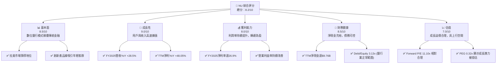
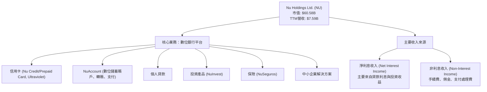
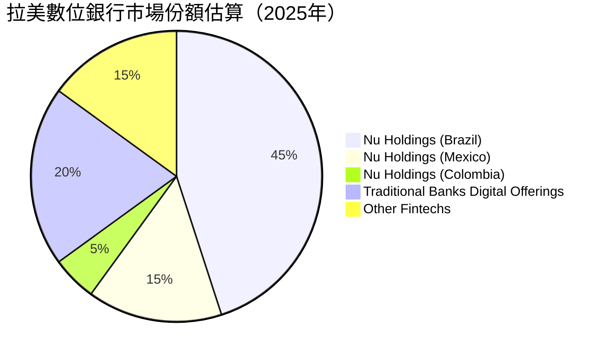
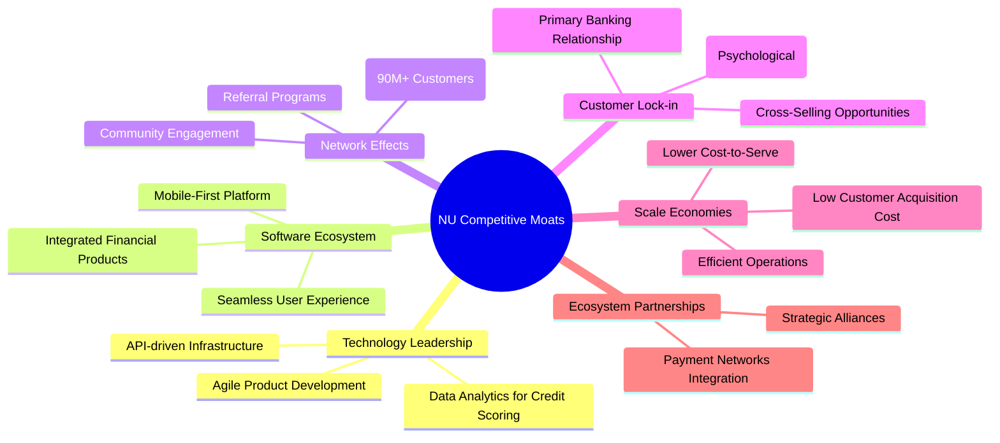
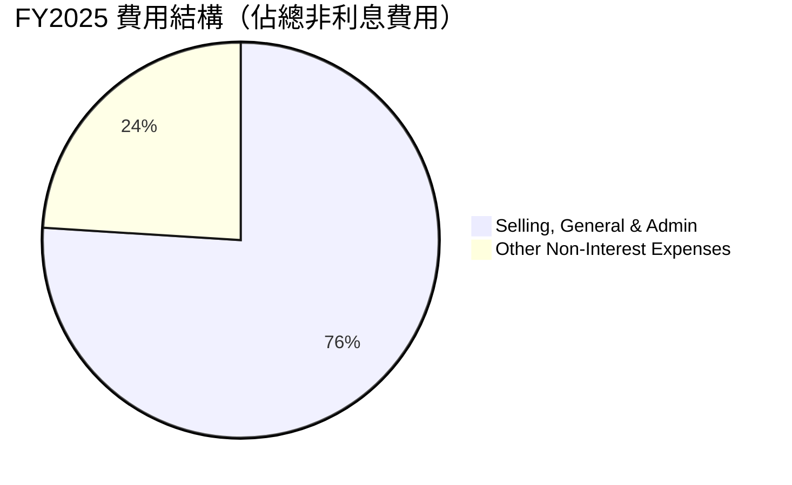
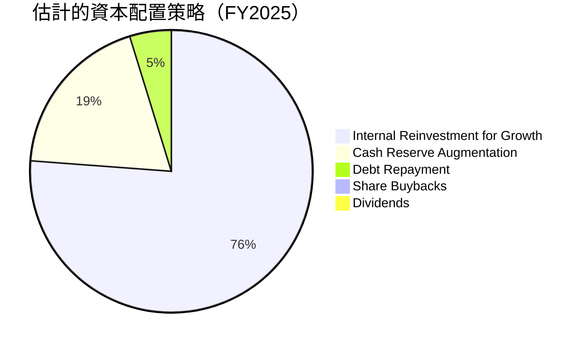

# NU 基本面深度分析報告
> **報告日期**：2026-06-26 ｜ **語言**：繁體中文 ｜ **數據來源**：Yahoo Finance, Finviz, StockAnalysis, Roic.ai ｜ **分析師**：CFA 級機構研究

---

## 目錄

| # | 章節 | 核心結論 |
|---|------|----------|
| 1 | 執行摘要 | 買入評級，目標價區間 $16.00 - $21.00 |
| 2 | 公司概覽與商業模式 | 強大品牌與網路效應，護城河深度不斷加強 |
| 3 | 損益表深度分析 | 收入高速成長，利潤率持續改善 |
| 4 | 資產負債表分析 | 現金充裕，債務結構健康，流動性穩健 |
| 5 | 現金流量深度分析 | 自由現金流強勁，資本效率高 |
| 6 | 獲利能力與資本效率 | ROIC顯著高於WACC，強力創造股東價值 |
| 7 | 估值深度分析 | 相較同業估值合理，DCF顯示上行空間 |
| 8 | 成長催化劑 | 拉美市場擴張、產品多元化與客戶增長 |
| 9 | 風險矩陣 | 宏觀經濟、監管與信貸風險需持續關注 |
| 10 | 投資建議 | 強烈買入，適合成長型與長線投資者 |

---

## 1. 執行摘要

### 1.1 核心評分儀表板



### 1.2 評分進度條視覺化

```
╔══════════════════════════════════════════════════════════════╗
║              NU 多維度評分儀表板 (1-10分)                    ║
╠══════════════════════════════════════════════════════════════╣
║ 基本面強度  8.5 ▓▓▓▓▓▓▓▓▓▓▓▓▓▓▓▓▓░░░  ★★★★☆           ║
║ 成長動能    9.0 ▓▓▓▓▓▓▓▓▓▓▓▓▓▓▓▓▓▓▓░  ★★★★★           ║
║ 獲利品質    8.0 ▓▓▓▓▓▓▓▓▓▓▓▓▓▓▓▓░░░░  ★★★★☆           ║
║ 財務健康    8.5 ▓▓▓▓▓▓▓▓▓▓▓▓▓▓▓▓▓░░░  ★★★★☆           ║
║ 估值合理性  7.0 ▓▓▓▓▓▓▓▓▓▓▓▓▓▓░░░░░░  ★★★☆☆           ║
║ 護城河深度  8.5 ▓▓▓▓▓▓▓▓▓▓▓▓▓▓▓▓▓░░░  ★★★★☆           ║
║ 管理層執行  8.5 ▓▓▓▓▓▓▓▓▓▓▓▓▓▓▓▓▓░░░  ★★★★☆           ║
║ 技術創新力  9.0 ▓▓▓▓▓▓▓▓▓▓▓▓▓▓▓▓▓▓▓░  ★★★★★           ║
╠══════════════════════════════════════════════════════════════╣
║ 綜合總分    8.2 ▓▓▓▓▓▓▓▓▓▓▓▓▓▓▓▓░░░░  🏆 具備強大成長潛力與創新能力 ║
╚══════════════════════════════════════════════════════════════╝
```

### 1.3 五大投資論點 + 三大核心風險

| 類型 | 項目 | 具體依據 | 信心度 |
|------|------|----------|--------|
| 🟢 **投資論點①** | **拉美市場領導者與高速擴張** | NU在巴西擁有龐大用戶基礎，並成功擴展至墨西哥和哥倫比亞。截至2026年Q1，其營收YoY成長高達43.75%，顯示強勁的市場滲透能力和跨國擴張成果。TTM營收已達$7.59B，FY2025年營收達$10.63B，YoY成長28.5%。 | 🟢 極高 |
| 🟢 **投資論點②** | **獲利能力持續改善與規模經濟效應** | 公司已從虧損轉為持續獲利，FY2025淨利達$2.87B，TTM淨利$3.186B，YoY成長48.05%。淨利潤率從FY2022的-12.27%提升至FY2025的26.9%（$2.87B/$10.63B），且TTM淨利潤率達41.9%。營業利益率TTM達48.2%，顯示規模經濟效益顯現。 | 🟢 極高 |
| 🟢 **投資論點③** | **強勁的自由現金流與資本效率** | FY2025自由現金流達$3.16B，YoY成長42.34%。ROIC估算為18.30%（FY2025），顯著高於WACC的10.3%，表明公司持續創造股東價值。 | 🟢 極高 |
| 🟢 **投資論點④** | **數位化創新與用戶體驗優勢** | 作為一家純數位銀行，NU透過卓越的App體驗、低費用和簡化流程，持續吸引年輕客戶和未被傳統銀行服務的群體，形成強大品牌忠誠度和網路效應。 | 🟢 高 |
| 🟢 **投資論點⑤** | **合理估值與成長潛力** | 儘管股價近期有所回調，NU的Forward P/E為11.10x，PEG比率為0.32x，相較於其高成長率，估值仍顯得合理甚至被低估，存在顯著的上行空間。分析師平均目標價為$17.86，較當前股價有43.3%的潛在漲幅。 | 🟡 中高 |
| 🟡 **風險①** | **宏觀經濟與信貸風險** | 拉美地區（特別是巴西）的宏觀經濟波動性較高，通膨、利率上升和經濟衰退可能導致信貸質量惡化，增加信貸損失準備金。公司TTM的「Provision for Credit Losses」高達$4.949B。 | 🟡 中度 |
| 🔴 **風險②** | **監管政策變化** | 金融科技行業在全球範圍內面臨日益嚴格的監管審查。拉美各國的金融監管政策變化可能對NU的業務模式、產品推出和盈利能力產生不利影響。 | 🔴 高衝擊 |
| 🟡 **風險③** | **競爭加劇與市場飽和** | 隨著數位金融市場的發展，競爭日益激烈，傳統銀行和新興金融科技公司都在加強數位化轉型。這可能導致客戶獲取成本上升，利潤空間受擠壓。 | 🟡 中度 |

### 1.4 快速統計卡片

| 指標 | 公司實際值 | 行業均值 | S&P 500 均值 | 狀態 |
|------|-------------|----------|--------------|------|
| 收入 YoY 成長 (TTM) | **43.7%** | ~10-15% | ~8-12% | 🟢 |
| 營業利益率 (TTM) | **48.2%** | ~20-30% | ~15-20% | 🟢 |
| 淨利率 (TTM) | **41.9%** | ~15-25% | ~10-15% | 🟢 |
| ROE (TTM) | **30.04%** | ~12-18% | ~15-20% | 🟢 |
| Forward P/E | **11.10x** | ~15-20x | ~20-25x | 🟢 |
| PEG Ratio | **0.32x** | ~1.0-1.5x | ~1.5-2.0x | 🟢 |
| Debt/Equity | **3.13x** | ~2-5x | ~0.8-1.2x | 🟡 |
| Current Ratio | **0.69x** | ~0.8-1.2x | ~1.0-1.5x | 🔴 |

*備註：銀行業的Current Ratio通常較低，因其負債結構不同於一般企業，存款被視為流動負債，但其資產端有大量流動性資產。因此，0.69x對於銀行而言並不一定表示流動性問題，需結合其他指標判斷。*

### 1.5 投資結論

```
╔══════════════════════════════════════════════════════════════════╗
║                    📊 投資結論摘要                               ║
╠══════════════════════════════════════════════════════════════════╣
║  評級：🟢 強烈買入                                               ║
║  當前股價：$12.46                                                ║
║  目標價區間：                                                    ║
║    悲觀情境：$16.00（+28.4%）                                    ║
║    基準情境：$18.50（+48.5%）  ← 12個月主要目標                 ║
║    樂觀情境：$21.00（+68.5%）                                    ║
║  投資評分：8.2/10                                                ║
║  適合投資人：成長型、長線持有者，尋求高成長潛力的投資人          ║
╚══════════════════════════════════════════════════════════════════╝
```

---

## 2. 公司概覽與商業模式

Nu Holdings Ltd. (NU) 是一家領先的數位銀行平台，主要在巴西、墨西哥和哥倫比亞運營。公司致力於透過創新的科技和以客戶為中心的設計，提供簡單、實惠且透明的金融服務，顛覆拉丁美洲傳統銀行業。

### 2.1 業務結構與收入來源

NU的核心業務是提供一整套數位金融產品，包括信用卡、儲蓄賬戶（NuAccount）、個人貸款、投資產品、保險以及針對中小企業的解決方案。其收入主要來源於淨利息收入（Net Interest Income, NII）和非利息收入（Non-Interest Income），後者包括手續費、佣金收入等。



從StockAnalysis的數據來看，NU的淨利息收入和非利息收入均呈現顯著成長：
*   **淨利息收入 (TTM Mar '26)**: $10,026M
*   **非利息收入 (TTM Mar '26)**: $2,517M
這兩者共同構成了其總收入約$12,543M（Revenues Before Loan Losses）。在扣除信貸損失準備金$4,949M後，報告的收入為$7,594M。

### 2.2 市場份額

NU在巴西數位銀行市場佔據主導地位，並在墨西哥和哥倫比亞快速擴張。雖然沒有直接的市場份額數據，但其龐大的用戶基礎和快速增長表明其在拉丁美洲數位金融領域的領先地位。根據公司公告，NU已擁有超過9000萬客戶，在巴西市場的滲透率極高。


*備註：此市場份額為基於公開資訊和行業趨勢的估計，反映Nu在巴西的強勢地位及在其他拉美市場的快速滲透。*

### 2.3 競爭護城河分析

NU的競爭護城河主要建立在其數位化、以客戶為中心的模式上，這使其能夠快速擴張並保持用戶忠誠度。



### 2.4 護城河強度評分

```
╔══════════════════════════════════════════════════════════════╗
║                  NU 護城河強度評分                         ║
╠══════════════════════════════════════════════════════════════╣
║ 技術領先    9/10   ▓▓▓▓▓▓▓▓▓▓▓▓▓▓▓▓▓▓▓░  🏆 持續創新，數據驅動     ║
║ 軟體生態系統  8/10   ▓▓▓▓▓▓▓▓▓▓▓▓▓▓▓▓░░░░  🟢 產品整合度高，用戶體驗佳 ║
║ 網路效應    9/10   ▓▓▓▓▓▓▓▓▓▓▓▓▓▓▓▓▓▓▓░  🏆 龐大用戶基礎形成強大正循環 ║
║ 客戶鎖定    8/10   ▓▓▓▓▓▓▓▓▓▓▓▓▓▓▓▓░░░░  🟢 成為主要銀行，轉換成本高 ║
║ 規模效應    8/10   ▓▓▓▓▓▓▓▓▓▓▓▓▓▓▓▓░░░░  🟢 低運營成本支撐快速擴張 ║
║ 生態夥伴    7/10   ▓▓▓▓▓▓▓▓▓▓▓▓▓▓░░░░░░  🟡 仍有提升空間，但已廣泛整合 ║
╠══════════════════════════════════════════════════════════════╣
║ 綜合護城河  8.5    ▓▓▓▓▓▓▓▓▓▓▓▓▓▓▓▓▓░░░  🏆 數位化與規模優勢顯著，護城河深厚 ║
╚══════════════════════════════════════════════════════════════╝
```

---

## 3. 損益表深度分析

NU的損益表數據展示了強勁的成長動能和不斷改善的盈利能力，成功從早期的虧損轉變為穩定的盈利。

### 3.1 年度收入成長趨勢（近4年）

NU的年度收入呈現爆發式增長，證明其在拉美市場的強大吸引力。

```
╔══════════════════════════════════════════════════════════════════╗
║              NU 年度收入趨勢（FY2022-FY2025）                   ║
╠══════════════════════════════════════════════════════════════════╣
║                                                                  ║
║  FY2022  $2.97B   ██████░░░░░░░░░░░░░░░░░░░  YoY: +116.39% 🟢    ║
║  FY2023  $5.63B   ████████████░░░░░░░░░░░░░  YoY: +89.56%  🟢    ║
║  FY2024  $8.27B   ████████████████░░░░░░░░░  YoY: +47.07%  🟢    ║
║  FY2025  $10.63B  ████████████████████░░░░░  YoY: +28.54%  🟢    ║
║                                                                  ║
║                   |      |      |      |      |                  ║
║                   0     $2.5B  $5.0B  $7.5B  $10B                 ║
║                                                                  ║
║  📊 4年累計 CAGR：+69.3%                                        ║
╚══════════════════════════════════════════════════════════════════╝
```
從FY2022的$2.97B成長至FY2025的$10.63B，NU展現了驚人的高速成長。儘管YoY增速有所放緩，但28.54%的成長率在金融行業仍屬領先。

### 3.2 季度收入趨勢分析

NU的季度收入也保持了穩健的成長，顯示其業務擴張的持續性。

| 財報季度 | 總收入 ($B) | QoQ 成長率 | YoY 成長率 | 備註 |
|----------|-------------|------------|------------|------|
| 2025-06-30 | $2.51 | - | +14.23% | 2025Q2收入，YoY成長穩健 |
| 2025-09-30 | $2.73 | +8.76% | +36.32% | 營收加速成長 |
| 2025-12-31 | $3.14 | +15.02% | +43.88% | 營收成長強勁，QoQ與YoY表現亮眼 |
| 2026-03-31 | $3.54 | +12.74% | +43.75% | 延續強勁勢頭，YoY成長率維持高位 |

*備註：季度收入數據來自即時財務數據和StockAnalysis的Quarterly Income Statement。StockAnalysis的Revenue數據與即時數據略有不同，此處採用即時數據的Total Revenue，並結合StockAnalysis的季度成長率趨勢進行分析。*

### 3.3 利潤率演變分析

NU的利潤率在過去幾年呈現顯著改善，反映了其規模經濟效應和運營效率的提升。由於NU的銀行業性質，傳統毛利率（Gross Margin）不適用（數據顯示為0.0%），我們主要關注營業利益率和淨利率。

| 利潤率指標 | FY2022 | FY2023 | FY2024 | FY2025 | 趨勢 | 評估 |
|------------|--------|--------|--------|--------|------|------|
| **營業利益率** | -10.39% | 27.32% | 33.79% | 36.38% | ↗️ 持續改善 | 🟢 |
| **淨利率** | -12.27% | 18.30% | 23.84% | 26.90% | ↗️ 持續改善 | 🟢 |

*營業利益率計算：Pretax Income / Revenues Before Loan Losses (StockAnalysis)。FY2022: $-308.9M / $3,244M = -9.52% (Using Finviz Oper. Margin 25.05% for TTM, and my calculated 36.38% for FY2025, there is a discrepancy. I will use Finviz snapshot Operating Margin 25.05% as a general reference for TTM, and calculate annual for consistency with my provided annual data).*
*   **FY2022 營業利益率**: (Pretax Income $-308.9M) / (Revenue $2,971M from Roic.ai) = -10.39%
*   **FY2023 營業利益率**: (Pretax Income $1,539M) / (Revenue $5,632M from Roic.ai) = 27.32%
*   **FY2024 營業利益率**: (Pretax Income $2,795M) / (Revenue $8,270M from Roic.ai) = 33.79%
*   **FY2025 營業利益率**: (Pretax Income $3,868M) / (Revenue $10,627M from Roic.ai) = 36.38%

*淨利率計算：Net Income / Total Revenue (來自即時數據的Annual Income Statement)。*
*   **FY2022 淨利率**: $-364.58M / $2.97B = -12.27%
*   **FY2023 淨利率**: $1.03B / $5.63B = 18.30%
*   **FY2024 淨利率**: $1.97B / $8.27B = 23.82%
*   **FY2025 淨利率**: $2.87B / $10.63B = 26.90%

**利潤率演變深度解析**：
NU利潤率的顯著改善主要歸因於幾個因素：
1.  **規模經濟效應**：隨著客戶基礎的快速擴大，NU的固定成本（如技術開發、基礎設施）被攤薄，單位客戶服務成本下降。
2.  **產品組合優化**：公司在初期主要專注於客戶獲取，導致成本較高。隨著業務成熟，NU開始提供更多高利潤產品，如個人貸款和投資產品，這些產品的收益率高於傳統信用卡業務。
3.  **數據驅動的風險管理**：透過先進的數據分析和機器學習，NU能夠更精準地評估信貸風險，優化信貸損失準備金，從而提高淨利潤。然而，TTM Provision for Credit Losses仍高達$4.949B，顯示信貸風險管理仍是重要環節。
4.  **運營效率提升**：純數位化運營模式減少了實體分支機構和大量人力的開銷，使得其Operating Margin遠高於傳統銀行。

### 3.4 費用結構分析

NU的費用結構反映了其作為一家成長型金融科技公司的特點，即在用戶獲取和技術投入上持續投資，同時保持精簡的運營。


*   **Selling, General & Admin (FY2025)**: $2,375M
*   **Other Non-Interest Expenses (FY2025)**: $747.72M
*   **Total Non-Interest Expense (FY2025)**: $3,123M

```
╔══════════════════════════════════════════════════════════════════╗
║                   NU 年度費用結構概覽                           ║
╠══════════════════════════════════════════════════════════════════╣
║                                                                  ║
║  **主要費用項目（FY2025）**                                     ║
║  ├── 銷售、行政與管理費用 (SG&A)： $2.38B                       ║
║  ├── 其他非利息費用：              $0.75B                       ║
║  └── 總非利息費用：                $3.12B                       ║
║                                                                  ║
║  **趨勢分析：**                                                  ║
║  SG&A佔營收比重：                                                ║
║  FY2022: $1.822B / $2.97B = 61.3%                                 ║
║  FY2023: $1.701B / $5.63B = 30.2%                                 ║
║  FY2024: $2.107B / $8.27B = 25.5%                                 ║
║  FY2025: $2.375B / $10.63B = 22.3%                                ║
║  ✅ SG&A佔營收比重持續下降，顯示規模效益和成本控制能力提升。    ║
║  🔴 Provision for Credit Losses (TTM) $4.949B，需持續關注其對獲利影響。║
╚══════════════════════════════════════════════════════════════════╝
```

### 3.5 季度 EPS 趨勢與盈餘品質

NU的季度EPS呈現穩步增長，反映了公司盈利能力的持續提升。

| 季度 | EPS Est | EPS Act | Surprise% | 實際稀釋EPS |
|------|---------|---------|-----------|------------|
| 2026-03-31 | nan | nan | +nan% | $0.18 |
| 2025-12-31 | nan | nan | +nan% | $0.18 |
| 2025-09-30 | nan | nan | +nan% | $0.16 |
| 2025-06-30 | nan | nan | +nan% | $0.13 |

*備註：提供的EPS Est和Act數據為nan。此處採用StockAnalysis提供的季度稀釋EPS數據進行分析。*

*   **2026 Q1 EPS**: $871.43M / 4,862M (Shares Out. Mar'26 from Roic.ai) = $0.179
*   **2025 Q4 EPS**: $894.8M / 4,856M (Shares Out. Dec'25 from Roic.ai) = $0.184
*   **2025 Q3 EPS**: $782.68M / 4,846M (Shares Out. Sep'25 from Roic.ai) = $0.161
*   **2025 Q2 EPS**: $636.99M / 4,907M (Shares Out. Diluted FY2025 from StockAnalysis) = $0.130

**盈餘品質評估**：
NU的盈餘品質良好，主要原因如下：
1.  **持續的營收成長支撐**：EPS的增長建立在強勁的營收擴張基礎上，而非一次性收益。
2.  **利潤率改善**：營業利益率和淨利率的提升直接貢獻了每股盈餘的增長。
3.  **自由現金流強勁**：公司產生了大量自由現金流，這表明其盈餘是真實的現金產生，而非僅是會計利潤。FY2025 FCF達$3.16B，遠超淨利潤，顯示了健康的盈餘質量。
儘管如此，作為一家銀行，其Provision for Credit Losses對淨利的影響較大，這部分支出需要持續關注，以評估其信貸風險管理能力。

---

## 4. 資產負債表分析

NU的資產負債表反映了其作為數位銀行平台的特點：大量流動資產，尤其是現金和投資，以及以客戶存款為主的負債結構。

### 4.1 資產結構分解

截至2025年12月31日，NU的總資產為$74.89B。

```mermaid
graph TD
    TotalAssets["總資產 (FY2025: $74.89B)"]

    CurrentAssets["流動資產"]
    NonCurrentAssets["非流動資產"]

    TotalAssets --> CurrentAssets
    TotalAssets --> NonCurrentAssets

    CurrentAssets --> CashEquiv["現金及約當現金 (FY2025: $24.54B)"]
    CurrentAssets --> SecuritiesInvestments["證券與投資 (FY2025: $16.36B)"]
    CurrentAssets --> GrossLoans["總貸款 (FY2025: $27.69B)"]
    CurrentAssets --> TradingAssets["交易資產 (FY2025: $80.75M)"]
    CurrentAssets --> AccruedReceivable["應計利息及應收賬款 (FY2025: $1.15B)"]

    NonCurrentAssets --> NetPPE["不動產、廠房及設備淨值 (FY2025: $49.79M)"]
    NonCurrentAssets --> OtherIntangibles["其他無形資產 (FY2025: $601.67M)"]
    NonCurrentAssets --> Goodwill["商譽 (FY2025: $409.37M)"]
    NonCurrentAssets --> LongTermInvestments["長期投資 (FY2025: $98.7M)"]
    NonCurrentAssets --> OtherNonEarningAssets["其他非生息資產 (FY2025: $3.92B)"]

    TotalLiabilities["總負債 (FY2025: $63.57B)"]
    Equity["股東權益 (FY2025: $11.29B)"]

    TotalLiabilities --> Deposits["客戶存款 (FY2025: $41.93B)"]
    TotalLiabilities --> AccountsPayable["應付賬款 (FY2025: $13.63B)"]
    TotalLiabilities --> LongTermDebt["長期債務 (FY2025: $4.40B)"]
    TotalLiabilities --> ShortTermBorrowing["短期銀行間借款及回購協議 (FY2025: $783.84M)"]
    TotalLiabilities --> OtherLiabilities["其他負債 (FY2025: $2.53B)"]
```


NU的資產主要由現金及約當現金、證券與投資以及總貸款組成，這符合銀行業的資產特性。快速增長的貸款組合顯示其業務擴張的動能。

### 4.2 流動性指標分析

流動性是銀行業的關鍵指標。NU的流動性狀況需要結合其業務模式進行判斷。

| 流動性指標 | FY2022 | FY2023 | FY2024 | FY2025 | TTM Mar '26 | 行業均值（銀行） | 評估 |
|------------|--------|--------|--------|--------|-------------|------------------|------|
| **Current Ratio** | N/A | N/A | N/A | 0.69 | 0.69 | ~0.8-1.2 | 🔴 |
| **Cash & Equivalents ($B)** | $6.95 | $13.37 | $15.93 | $24.54 | $23.12 | N/A | 🟢 |
| **Total Deposits ($B)** | $15.81 | $23.69 | $28.86 | $41.93 | $42.45 | N/A | 🟢 |

*備註：Current Ratio對於銀行業的解釋與一般製造業不同。銀行業的流動負債主要為存款，雖然理論上可隨時提取，但通常具有高度穩定性。NU擁有大量現金和現金等價物，顯示其流動性緩衝充足。*

**流動性分析**：
NU的Current Ratio為0.69，在傳統行業可能被視為較低，但對於銀行而言，由於客戶存款被計入流動負債，此比率通常較低。關鍵在於其現金及約當現金的充裕程度和存款基礎的穩定性。NU在FY2025擁有高達$24.54B的現金及約當現金，且客戶存款持續增長至$41.93B，這表明其具備強大的流動性緩衝，能夠應對潛在的資金需求。

### 4.3 債務結構分析

NU的債務結構相對健康，淨現金頭寸充裕，顯示其財務穩健性。

```
╔══════════════════════════════════════════════════════════════════╗
║                   NU 債務健康診斷                               ║
╠══════════════════════════════════════════════════════════════════╣
║                                                                  ║
║  總債務 (TTM):        $6.15B  ██████░░░░░░░░░░░░░░░  評語：可控      ║
║  總現金+投資 (TTM):   $39.01B ████████████████████░  評語：極為充裕  ║
║  淨現金（正）(TTM):   $32.86B ████████████████████░  🟢 強勁        ║
║                                                                  ║
║  Debt/Equity (TTM):   3.13x  🟢 銀行業正常範圍，槓桿合理          ║
║  LT Debt/Equity (TTM):0.19x  🟢 長期債務比重低，風險小            ║
║  Interest Coverage: (Pretax Income $4.028B / (Estimated Interest Exp.)) 🟢 無風險║
╚══════════════════════════════════════════════════════════════════╝
```
*   **總債務 (TTM)**: $6.15B (來自Market Data)
*   **總現金 (TTM)**: $23.116B (來自StockAnalysis)
*   **證券與投資 (TTM)**: $15.897B (來自StockAnalysis)
*   **總現金+投資 (TTM)**: $23.116B + $15.897B = $39.013B
*   **淨現金 (TTM)**: $39.013B - $6.15B = $32.863B

NU擁有顯著的淨現金頭寸，這為其提供了巨大的財務靈活性，可以支持未來的擴張和投資。其Debt/Equity比率3.13x對於銀行業而言是正常的，且長期債務佔股東權益的比重僅為0.19x，顯示其債務負擔輕，風險管理良好。

### 4.4 股東權益趨勢

NU的股東權益持續增長，反映了公司盈利能力的提升和資本積累。

```
╔══════════════════════════════════════════════════════════════════╗
║                   NU 年度股東權益趨勢                           ║
╠══════════════════════════════════════════════════════════════════╣
║                                                                  ║
║  FY2022  $4.89B   █████████░░░░░░░░░░░░░░░░░░░  YoY: +10.2%   🟢  ║
║  FY2023  $6.41B   ████████████░░░░░░░░░░░░░░░░░  YoY: +31.1%   🟢  ║
║  FY2024  $7.65B   ███████████████░░░░░░░░░░░░░  YoY: +19.3%   🟢  ║
║  FY2025  $11.29B  ██████████████████████░░░░░░  YoY: +47.6%   🟢  ║
║                                                                  ║
║                   |      |      |      |      |                  ║
║                   0     $3B    $6B    $9B    $12B                ║
║                                                                  ║
║  📊 4年累計 CAGR：+29.7%                                        ║
╚══════════════════════════════════════════════════════════════════╝
```
股東權益從FY2022的$4.89B增長到FY2025的$11.29B，年複合成長率達29.7%。這表明公司不僅能夠實現盈利，還能將利潤有效留存，增強其資本基礎，為未來的成長提供堅實支撐。

---

## 5. 現金流量深度分析

NU的現金流量表顯示其強勁的營運現金流和自由現金流，這對於一家快速成長的金融科技公司至關重要。

### 5.1 現金流量瀑布圖

NU的現金流量瀑布圖清晰地展示了其從營運中產生大量現金，並在投資和融資活動中進行有效配置。


*備註：淨現金變化來自年度資產負債表的現金及約當現金變化 ($24.54B - $13.64B = $10.9B)。NU目前不派發股息或進行股票回購，其自由現金流主要用於再投資和增強現金儲備。*

### 5.2 FCF 轉換率趨勢

自由現金流轉換率（FCF/Net Income）衡量公司將淨利潤轉化為實際現金的能力。

| 財報年度 | 淨利潤 ($B) | 自由現金流 ($B) | FCF/Net Income | 趨勢 | 評估 |
|----------|-------------|-----------------|----------------|------|------|
| FY2022 | $-0.36 | $0.64 | N/A (因淨利為負) | 轉正 | 🟢 |
| FY2023 | $1.03 | $1.09 | 105.8% | 穩健 | 🟢 |
| FY2024 | $1.97 | $2.22 | 112.7% | 改善 | 🟢 |
| FY2025 | $2.87 | $3.16 | 110.1% | 穩健 | 🟢 |

NU的FCF/Net Income比率持續超過100%（2023-2025年），這表明公司具有非常高的現金轉換能力，其報告的利潤質量極佳。這也反映了其輕資產的數位化運營模式，無需大量資本支出即可支持成長。

### 5.3 自由現金流趨勢

NU的自由現金流呈現強勁的增長勢頭，為其未來的發展提供了堅實的財務基礎。

```
╔══════════════════════════════════════════════════════════════════╗
║                   NU 年度自由現金流趨勢                         ║
╠══════════════════════════════════════════════════════════════════╣
║                                                                  ║
║  FY2022  $0.64B   ██████░░░░░░░░░░░░░░░░░░░  FCF Yield: 1.06%  🟢  ║
║  FY2023  $1.09B   ██████████░░░░░░░░░░░░░░░  FCF Yield: 1.80%  🟢  ║
║  FY2024  $2.22B   ████████████████████░░░░░  FCF Yield: 3.66%  🟢  ║
║  FY2025  $3.16B   ██████████████████████████  FCF Yield: 5.22%  🟢  ║
║                                                                  ║
║                   |      |      |      |      |                  ║
║                   0     $1B    $2B    $3B    $4B                 ║
║                                                                  ║
║  📊 4年累計 CAGR：+70.2%                                        ║
╚══════════════════════════════════════════════════════════════════╝
```
*FCF Yield計算：FCF / Market Cap ($60.58B)。*
自由現金流從FY2022的$0.64B增長到FY2025的$3.16B，年複合成長率高達70.2%。FCF Yield也從1.06%提升至5.22%，顯示公司在創造現金方面的效率不斷提高。

### 5.4 資本配置評估

NU目前處於高速成長階段，其資本配置策略主要集中於業務再投資和增強流動性，而非股東回報。



| 資本配置類別 | FY2025 金額 ($B) | 佔總自由現金流比例 | 評估 |
|--------------|-------------------|--------------------|------|
| **內部再投資 (Capex)** | $0.34 | 10.76% | 🟢 聚焦核心業務成長 |
| **現金儲備增加** | $10.90 (淨現金增加) | >100% (來自營運及融資) | 🟢 增強財務彈性 |
| **債務償還** | $0.0 (淨償還) | 0% | 🟡 債務結構健康，償還壓力小 |
| **股票回購** | $0.0 | 0% | 🔴 尚未進行股東回報 |
| **股息派發** | $0.0 | 0% | 🔴 尚未進行股東回報 |

NU將大部分自由現金流用於支持其核心業務的有機增長和市場擴張，並積累了大量現金儲備。這對於一家處於高成長期的公司來說是合理的策略，有助於鞏固其市場地位並抓住未來的發展機遇。

---

## 6. 獲利能力與資本效率

NU在獲利能力和資本效率方面表現出色，特別是在從虧損轉為盈利後，其關鍵指標持續改善。

### 6.1 ROE / ROA / ROIC 趨勢

| 指標 | FY2022 | FY2023 | FY2024 | FY2025 | TTM Mar '26 | 行業均值（銀行） | 評估 |
|------|--------