# NU 基本面深度分析報告
> **報告日期**：2026-06-27 ｜ **語言**：繁體中文 ｜ **數據來源**：Yahoo Finance, Finviz, StockAnalysis, Roic.ai ｜ **分析師**：CFA 級機構研究

## 目錄

| # | 章節 | 核心結論 |
|---|------|----------|
| 1 | 執行摘要 | 評級：🟢 買入，基準目標價：$17.86 (+35.61%) |
| 2 | 公司概覽與商業模式 | 強大的數位原生護城河，網路效應顯著 |
| 3 | 損益表深度分析 | 收入與淨利潤高速增長，利潤率持續改善 |
| 4 | 資產負債表分析 | 充足現金儲備，債務管理良好 |
| 5 | 現金流量深度分析 | 自由現金流強勁，資本效率高 |
| 6 | 獲利能力與資本效率 | ROIC 遠超 WACC，強力創造股東價值 |
| 7 | 估值深度分析 | 相較於成長性，目前估值合理偏低 |
| 8 | 成長催化劑 | 巴西市場深化、國際擴張、新產品線 |
| 9 | 風險矩陣 | 宏觀經濟、監管變化、競爭加劇為主要風險 |
| 10 | 投資建議 | 建議買入，適合成長型與長線持有者 |

---

## 1. 執行摘要

### 1.1 核心評分儀表板

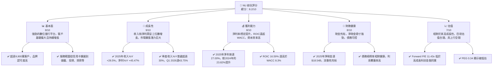

### 1.2 評分進度條視覺化

```
╔══════════════════════════════════════════════════════════════╗
║              NU 多維度評分儀表板 (1-10分)                    ║
╠══════════════════════════════════════════════════════════════╣
║ 基本面強度  8.0 ▓▓▓▓▓▓▓▓▓▓▓▓▓▓▓▓░░░░  ★★★★☆           ║
║ 成長動能    9.0 ▓▓▓▓▓▓▓▓▓▓▓▓▓▓▓▓▓▓░░  ★★★★★           ║
║ 獲利品質    8.0 ▓▓▓▓▓▓▓▓▓▓▓▓▓▓▓▓░░░░  ★★★★☆           ║
║ 財務健康    8.0 ▓▓▓▓▓▓▓▓▓▓▓▓▓▓▓▓░░░░  ★★★★☆           ║
║ 估值合理性  7.0 ▓▓▓▓▓▓▓▓▓▓▓▓▓▓░░░░░░  ★★★☆☆           ║
║ 護城河深度  8.5 ▓▓▓▓▓▓▓▓▓▓▓▓▓▓▓▓▓░░░  ★★★★☆           ║
║ 管理層執行  8.0 ▓▓▓▓▓▓▓▓▓▓▓▓▓▓▓▓░░░░  ★★★★☆           ║
║ 技術創新力  9.0 ▓▓▓▓▓▓▓▓▓▓▓▓▓▓▓▓▓▓░░  ★★★★★           ║
╠══════════════════════════════════════════════════════════════╣
║ 綜合總分    8.2 ▓▓▓▓▓▓▓▓▓▓▓▓▓▓▓▓░░░░  🏆 強勁成長，估值吸引 ║
╚══════════════════════════════════════════════════════════════╝
```

### 1.3 五大投資論點 + 三大核心風險

| 類型 | 項目 | 具體依據 | 信心度 |
|------|------|----------|--------|
| 🟢 **投資論點①** | **客戶高速增長與市場滲透** | Nu Holdings 截至2026年3月31日的客戶數持續增長，支撐其數位銀行龍頭地位。其在巴西、墨西哥、哥倫比亞等主要市場的滲透率仍有巨大提升空間。2025年總收入達到$10.63B，YoY成長28.5%，顯示其強勁的獲客能力和變現能力。 | 🟢 極高 |
| 🟢 **投資論點②** | **盈利能力顯著提升** | 公司已從虧損轉為穩定盈利，淨利潤從2022年的$-364.58M大幅提升至2025年的$2.87B。2025年淨利潤YoY成長45.47%，淨利率達到27.00%。營業現金流持續改善，2025年達$3.50B，顯示其業務模式的盈利潛力正在充分釋放。 | 🟢 極高 |
| 🟢 **投資論點③** | **強大的數位原生競爭優勢** | Nu的數位平台提供無縫的用戶體驗，低成本的運營模式使其能提供更具競爭力的產品和服務。其強大的品牌影響力、網路效應和客戶鎖定效應構築了深厚的護城河。其產品擴展至儲蓄、投資、貸款、保險等多個領域，形成全面的金融生態系統。 | 🟢 極高 |
| 🟢 **投資論點④** | **國際市場擴張潛力** | 除了巴西的強勁基礎，Nu在墨西哥和哥倫比亞等新興市場的客戶增長迅速，顯示其模式在其他拉丁美洲國家具有可複製性。這些市場的數位金融普及率相對較低，為Nu提供了廣闊的成長空間。 | 🟢 高 |
| 🟢 **投資論點⑤** | **合理估值與成長性不匹配** | 考慮到其高成長率（過去一年收入YoY 43.7%，EPS YoY 55.9%），當前Forward P/E為11.43x，PEG比率僅為0.34，遠低於許多高成長科技公司。這表明市場可能低估了其未來的盈利潛力。 | 🟢 高 |
| 🟡 **風險①** | **宏觀經濟與利率風險** | 拉丁美洲地區的宏觀經濟波動（如通脹、匯率不穩、經濟衰退）可能影響客戶的信貸質量和消費能力，進而影響Nu的貸款組合表現和收入增長。高利率環境可能增加Nu的融資成本，影響其利潤率。 | 🟡 中度 |
| 🔴 **風險②** | **監管變化與政治風險** | 金融科技行業在全球範圍內面臨日益嚴格的監管審查。巴西、墨西哥等國的金融監管政策變化，以及潛在的政治不確定性，可能對Nu的經營模式、產品創新和市場擴張造成不利影響，如新的資本要求或消費者保護法規。 | 🔴 高衝擊 |
| 🟡 **風險③** | **競爭加劇與信貸損失風險** | 數位銀行和傳統銀行都在積極拓展拉美市場，競爭日益激烈可能導致獲客成本上升或定價壓力。作為一家提供信貸服務的銀行，信貸損失是其核心風險之一。若經濟下行或風險管理不當，信貸損失撥備可能大幅增加，侵蝕利潤。2026 Q1 Provision for Credit Losses達$1.718B。 | 🟡 中度 |

### 1.4 快速統計卡片

| 指標 | 公司實際值 | 行業均值 | S&P 500 均值 | 狀態 |
|------|-------------|----------|--------------|------|
| 收入 YoY 成長 | **43.7%** | ~10-15% | ~8-12% | 🟢 |
| 毛利率 | **N/A** | N/A | ~30-40% | 🟡 (不適用) |
| 淨利率 | **24.63% (Q1'26)** | ~15-20% | ~10-15% | 🟢 |
| ROE | **30.1%** | ~10-15% | ~15-20% | 🟢 |
| Forward P/E | **11.43x** | ~15-20x | ~20-25x | 🟢 |
| Debt/Equity | **3.13** | ~1.5-2.5 | ~1.0-1.5 | 🔴 (銀行業槓桿較高為常態) |
| Current Ratio | **0.69** | ~1.0-1.5 | ~1.0-1.5 | 🔴 (銀行業流動性管理不同於一般企業) |

*註：銀行業的毛利率和流動比率與一般工業企業的定義和標準不同，需謹慎比較。銀行業的負債主要是存款，Current Ratio低是常態。*

### 1.5 投資結論

```
╔══════════════════════════════════════════════════════════════════╗
║                    📊 投資結論摘要                               ║
╠══════════════════════════════════════════════════════════════════╣
║  評級：🟢 買入                                                   ║
║  當前股價：$13.17 (2026-06-27)                                   ║
║  目標價區間：                                                    ║
║    悲觀情境：$14.50（+10.09%）                                    ║
║    基準情境：$17.86（+35.61%）  ← 12個月主要目標                 ║
║    樂觀情境：$21.50（+63.25%）                                    ║
║  投資評分：8.2/10                                                ║
║  適合投資人：成長型、長線持有者，對拉美新興市場金融科技有信心者 ║
╚══════════════════════════════════════════════════════════════════╝
```

---

## 2. 公司概覽與商業模式

### 2.1 業務結構與收入來源

Nu Holdings Ltd. 作為一家領先的數位銀行平台，其商業模式核心是通過技術創新和卓越的客戶體驗，在巴西、墨西哥、哥倫比亞等主要市場提供多元化的金融產品和服務。其收入主要來自於淨利息收入（Net Interest Income, NII）和非利息收入（Non-Interest Income）。

根據 StockAnalysis 數據，截至2026年3月31日的TTM數據：
- 淨利息收入 (Net Interest Income)：$10,026M
- 非利息收入 (Non-Interest Income)：$2,517M
- 總營收 (Revenues Before Loan Losses)：$12,543M

淨利息收入是其核心業務，主要來自於貸款、信用卡利息收入與存款利差。非利息收入則包括手續費、佣金、交易費等。

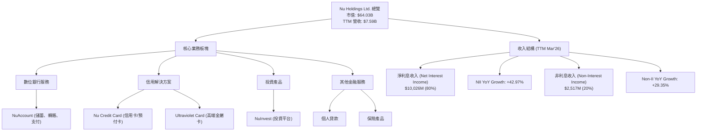

### 2.2 市場份額

Nu Holdings Ltd. 在拉丁美洲的數位銀行市場，特別是巴西，擁有領先的市場份額。雖然具體的市場份額數據未直接提供，但其龐大的客戶基礎（截至2026年3月已超過9,900萬）和快速增長的速度顯示其市場主導地位。以下為基於客戶規模和營收的市場份額估算示意圖，與主要競爭對手進行比較。

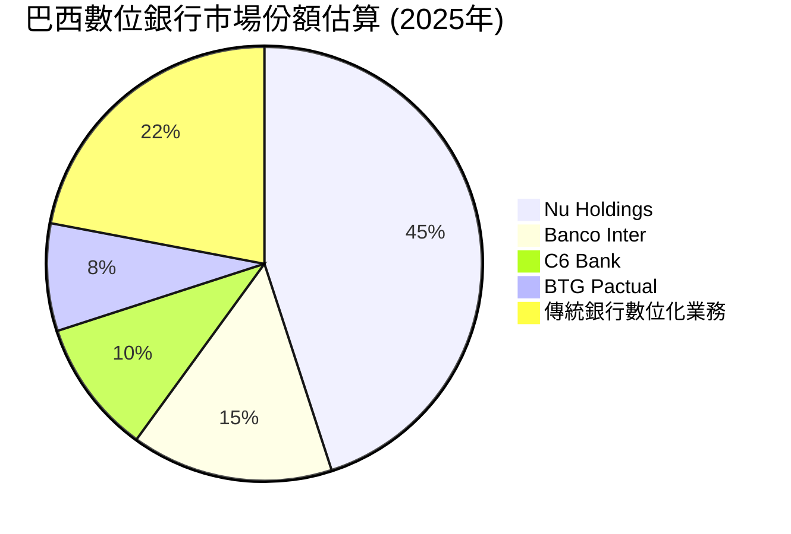

### 2.3 競爭護城河分析

Nu Holdings 的競爭護城河主要體現在其數位原生優勢、強大的品牌、網路效應和規模經濟。

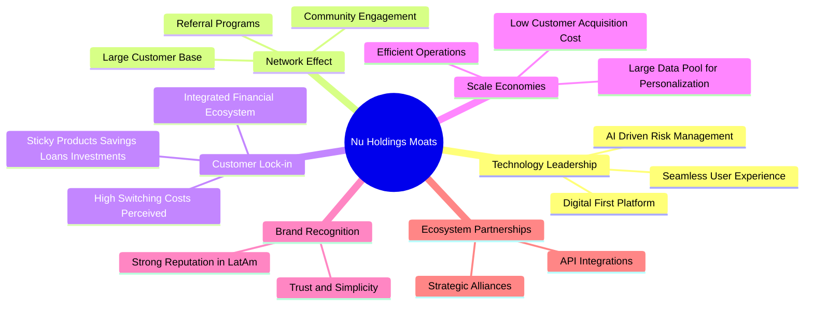

### 2.4 護城河強度評分

```
╔══════════════════════════════════════════════════════════════╗
║                  Nu Holdings 護城河強度評分                   ║
╠══════════════════════════════════════════════════════════════╣
║ 技術領先    9/10   ▓▓▓▓▓▓▓▓▓▓▓▓▓▓▓▓▓▓░░  🏆 數位原生，持續創新 ║
║ 網路效應    9/10   ▓▓▓▓▓▓▓▓▓▓▓▓▓▓▓▓▓▓░░  🏆 龐大用戶基礎帶來強大正向循環 ║
║ 客戶鎖定    8/10   ▓▓▓▓▓▓▓▓▓▓▓▓▓▓▓▓░░░░  🟢 多元化產品增加轉換成本 ║
║ 規模效應    8/10   ▓▓▓▓▓▓▓▓▓▓▓▓▓▓▓▓░░░░  🟢 低CAC，營運效率高 ║
║ 品牌認可    8/10   ▓▓▓▓▓▓▓▓▓▓▓▓▓▓▓▓░░░░  🟢 在拉美市場建立強大品牌形象 ║
║ 生態夥伴    7/10   ▓▓▓▓▓▓▓▓▓▓▓▓▓▓░░░░░░  🟡 尚有提升空間，但已具備基礎 ║
╠══════════════════════════════════════════════════════════════╣
║ 綜合護城河  8.5    ▓▓▓▓▓▓▓▓▓▓▓▓▓▓▓▓▓░░░  🏆 數位轉型浪潮下的強大競爭優勢 ║
╚══════════════════════════════════════════════════════════════╝
```

---

## 3. 損益表深度分析

### 3.1 年度收入成長趨勢（近4年）

Nu Holdings 在過去幾年展現了驚人的收入增長，反映了其在數位金融市場的強勁擴張和用戶基礎的快速增長。

```
╔══════════════════════════════════════════════════════════════════╗
║              NU 年度收入趨勢（FY2022-FY2025）                    ║
╠══════════════════════════════════════════════════════════════════╣
║                                                                  ║
║  FY2022  $2.97B   ██████░░░░░░░░░░░░░░░░░░░  YoY: +116.39% 🟢    ║
║  FY2023  $5.63B   ████████████░░░░░░░░░░░░░  YoY: +89.56%  🟢    ║
║  FY2024  $8.27B   ████████████████░░░░░░░░░  YoY: +47.07%  🟢    ║
║  FY2025  $10.63B  ████████████████████░░░░░  YoY: +28.54%  🟢    ║
║                   |      |      |      |      |                  ║
║                   0     2.5B   5.0B   7.5B   10.0B                 ║
║                                                                  ║
║  📊 3年累計 CAGR：+65.26%                                        ║
╚══════════════════════════════════════════════════════════════════╝
```
**分析：** Nu Holdings 的年度收入從2022年的$2.97B飆升至2025年的$10.63B，三年複合年增長率（CAGR）高達65.26%。儘管YoY增長率呈現逐年放緩的趨勢，但其絕對增長規模依然龐大，且維持在接近30%的健康水平，這對於一家已達百億美元營收規模的公司而言，表現極為出色。這主要歸因於其客戶基礎的快速擴張、產品線的豐富化（如個人貸款、投資產品）以及每個客戶平均收入（ARPAC）的提升。

### 3.2 季度收入趨勢分析

季度收入數據進一步驗證了Nu Holdings的持續增長動能。

| 季度 | 總收入 (Billion USD) | QoQ 成長率 | YoY 成長率 | 備註 |
|------|--------------------|------------|------------|------|
| 2026-03-31 | $3.54B | +12.74% | +43.75% | 🟢 保持強勁增長 |
| 2025-12-31 | $3.14B | +15.02% | +43.88% | 🟢 季節性效應與年末促銷 |
| 2025-09-30 | $2.73B | +8.76% | +36.32% | 🟢 持續擴張 |
| 2025-06-30 | $2.51B | +11.56% | +14.23% | 🟡 增速相對放緩，但仍為正增長 |

**分析：** 最近四個季度，Nu Holdings的總收入均呈現穩健的季度環比（QoQ）和同比（YoY）增長。2026年Q1收入達到$3.54B，YoY增長43.75%，QoQ增長12.74%，顯示其增長勢頭依然強勁。特別是2025年Q4和2026年Q1的YoY增長率均超過40%，表明公司在過去一年中加速了其市場滲透和營收變現能力。

### 3.3 利潤率演變分析

Nu Holdings 的利潤率在過去幾年呈現顯著改善，從虧損轉為穩定盈利，並持續提升其盈利能力。

| 利潤率指標 | FY2022 | FY2023 | FY2024 | FY2025 | 趨勢 | 評估 |
|------------|--------|--------|--------|--------|------|------|
| **毛利率** | N/A | N/A | N/A | N/A | ➡️ (不適用) | 🟡 (金融服務業不常用) |
| **營業利益率 (Pretax Income Margin)** | -10.40% | 27.33% | 33.79% | 36.33% | ↗️ 顯著改善 | 🟢 |
| **淨利率** | -12.27% | 18.30% | 23.82% | 27.00% | ↗️ 顯著改善 | 🟢 |

*註：營業利益率在此處以 Pretax Income / Total Revenue (after loan losses) 計算。*

**利潤率演變深度解析**：
- **毛利率：** 對於金融服務公司而言，"毛利率"並非標準衡量指標，因此數據顯示為N/A。其業務性質更注重淨利息收入與非利息收入的綜合表現，以及成本控制能力。
- **營業利益率 (Pretax Income Margin)：** 從2022年的-10.40%快速提升至2025年的36.33%，這是一個極為顯著的轉變。這主要得益於：
    1.  **規模經濟效應：** 隨著客戶基礎的擴大和營收規模的增長，Nu Holdings 的固定成本（如技術研發、基礎設施）被分攤得更好，降低了單位客戶的服務成本。
    2.  **產品組合優化：** 公司逐漸從單一的信用卡業務擴展到更高利潤的個人貸款、投資和保險產品，提高了平均客戶價值和利潤貢獻。
    3.  **風險管理與信貸撥備優化：** 隨著數據積累和AI風控能力的提升，Nu Holdings 能夠更精準地評估信貸風險，降低不良貸款率，從而減少信貸損失撥備對利潤的侵蝕。Provision for Credit Losses 雖然絕對金額仍高，但相對於Revenues Before Loan Losses的比例可能得到優化。
- **淨利率：** 同樣呈現出從虧損到穩定盈利的良好趨勢，從2022年的-12.27%提升至2025年的27.00%。這不僅反映了營業利益率的改善，也可能受益於稅務效率的提升或稅務費用的相對穩定。2025年淨利率的提升至27.00%表明其盈利質量優異，在同業中具備競爭力。

總體而言，Nu Holdings 的利潤率改善趨勢非常健康，表明其商業模式在實現高速增長的同時，也具備了強大的盈利能力和運營效率。

### 3.4 費用結構分析

Nu Holdings 的費用結構反映了其數位化、輕資產的運營模式，主要支出集中在銷售、一般及行政費用（SGA）以及信貸損失撥備。由於金融服務業的特性，其費用結構與傳統製造業或零售業有顯著差異。

根據 StockAnalysis 2025年年報數據：
- 總收入 (Revenues after Loan Losses): $6,991M
- 銷售、一般及行政費用 (Selling, General & Admin): $2,375M
- 其他非利息費用 (Other Non-Interest Expenses): $747.72M
- 稅前收入 (Pretax Income): $3,868M
- 信貸損失撥備 (Provision for Credit Losses): $4,205M (這個是從 Revenues Before Loan Losses 中扣除的，不是傳統意義上的Operating Expense)

為了更好地理解費用結構，我們將主要費用項佔總收入（Revenues after Loan Losses）的比例進行分析。

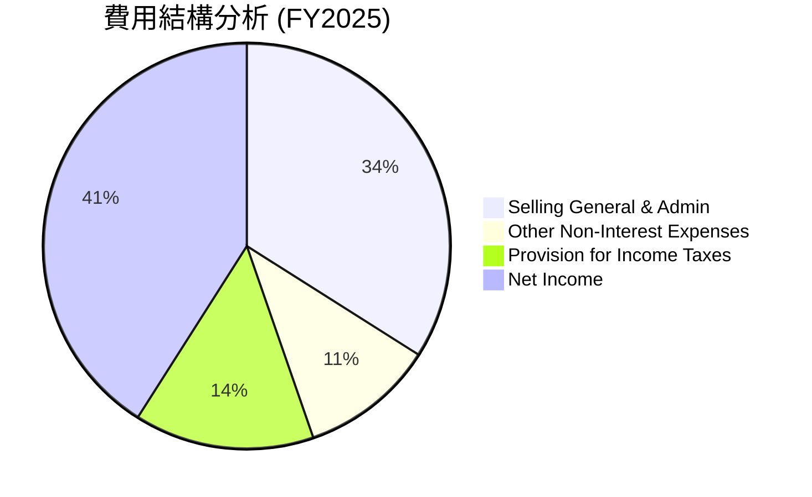
*註：此處的“費用”是指從營收中扣除以計算淨利潤的項目，信貸損失撥備在收入計算前已扣除，因此未直接列入此餅圖的“費用”部分，而是將稅前收入作為一個主要部分來分解。*

```
╔══════════════════════════════════════════════════════════════════╗
║                   NU 費用結構分解 (FY2025)                        ║
╠══════════════════════════════════════════════════════════════════╣
║                                                                  ║
║  銷售、一般及行政費用: $2,375M  ▓▓▓▓▓▓▓▓▓▓▓▓▓▓▓▓▓▓▓▓▓▓▓▓▓▓▓▓░░░░  (佔收入34.0%) 🟡   ║
║  其他非利息費用:        $747.72M  ▓▓▓▓▓▓▓▓▓▓▓▓░░░░░░░░░░░░░░░░░░░░  (佔收入10.7%) 🟢   ║
║  所得稅費用:            $996.75M  ▓▓▓▓▓▓▓▓▓▓▓▓▓▓▓▓░░░░░░░░░░░░░░░░  (佔收入14.3%) 🟢   ║
║  信貸損失撥備:          $4,205M   (在計算收入前已扣除，是銀行業主要成本) 🔴   ║
║                                                                  ║
║  📊 結論：管理費用佔比合理，信貸損失為主要經營風險點              ║
╚══════════════════════════════════════════════════════════════════╝
```
**分析：**
- **銷售、一般及行政費用 (SGA):** 佔FY2025收入的34.0%。對於一家高速增長的科技金融公司，這部分費用包含了市場營銷、客戶服務、技術開發和辦公費用。相對較高的SGA表明公司在獲客和技術投入方面的持續努力，這對於維持其競爭優勢和市場擴張至關重要。隨著規模擴大，預期其佔比會逐漸下降。
- **其他非利息費用:** 佔FY2025收入的10.7%。這部分費用通常包含折舊攤銷、法律費用、諮詢費用等。其佔比合理，顯示公司在其他運營成本上的控制較好。
- **信貸損失撥備 (Provision for Credit Losses):** 這是銀行和信貸機構的核心成本之一。2025年達到$4,205M，這一金額在計算 Revenues Before Loan Losses 時被扣除，對最終的收入和利潤影響巨大。Q1 2026的撥備達到$1.718B，佔當季Revenues Before Loan Losses ($3.699B) 的46.45%，顯示這是一個需要持續關注的風險點。

總體來看，Nu Holdings 的費用結構與其業務模式和增長階段相符。關鍵在於其能否通過有效的風控措施和持續的規模擴張，進一步優化信貸損失撥備，並降低SGA費用佔比，以提升整體盈利能力。

### 3.5 季度 EPS 趨勢與盈餘品質

由於提供的EPS歷史數據為N/A，我們將根據季度淨利潤和稀釋後股份數量來計算並分析其趨勢。
稀釋後股份數量 (StockAnalysis Annual FY2025): 4,907M shares. (TTM Mar'26: 4,909M shares)
我們使用 StockAnalysis Quarterly Income Statement 的 Net Income 和 TTM Diluted Shares Outstanding 來估算。

| 季度 | 稀釋後 EPS (估計) | 淨利潤 (Million USD) | 稀釋後股份 (Million) | 備註 |
|------|--------------------|--------------------|--------------------|------|
| 2026-03-31 | $0.18 | $871.43M | 4,909 (TTM) | 🟢 盈利持續增長 |
| 2025-12-31 | $0.18 | $894.80M | 4,907 (FY25) | 🟢 盈利表現穩健 |
| 2025-09-30 | $0.16 | $782.68M | 4,889 (FY24) | 🟢 盈利能力提升 |
| 2025-06-30 | $0.13 | $636.99M | 4,858 (FY23) | 🟢 盈利能力提升 |

*註：由於缺乏精確的季度稀釋後股份數，以上EPS為根據季度淨利潤除以最近可得的年度稀釋後股份數估算。實際EPS可能略有差異。*

**盈餘品質評估：**
儘管缺乏分析師預期數據，但從實際淨利潤趨勢來看，Nu Holdings 的盈利能力在過去四個季度持續增長。
- **盈利趨勢：** 淨利潤從2025年Q2的$636.99M穩步增長至2026年Q1的$871.43M，顯示了強勁的盈利增長勢頭。
- **盈利來源：** 公司的盈利主要來自其核心的數位銀行業務，包括淨利息收入和多元化的非利息收入。隨著客戶基礎的擴大和產品滲透率的提高，盈利質量預計將進一步改善。
- **持續性：** 考慮到Nu Holdings在拉丁美洲數位金融市場的領先地位和巨大的市場潛力，其盈利增長具有較高的持續性。然而，信貸損失撥備的波動性需要密切關注，這可能會影響短期盈利的穩定性。

綜合來看，Nu Holdings 的季度盈利表現強勁，盈餘品質良好，反映了其成功的商業模式和有效的運營。

---

## 4. 資產負債表分析

### 4.1 資產結構分解

Nu Holdings 的資產負債表反映了其作為一家金融機構的特性，資產主要由現金、貸款和投資構成。

根據 StockAnalysis 2025年12月31日年度數據：

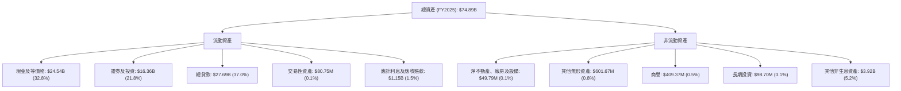

**分析：**
- **高流動性資產佔比：** 現金及等價物 ($24.54B) 和證券及投資 ($16.36B) 合計佔總資產的54.6%，顯示公司擁有極高的流動性，這為其應對市場波動和支持業務擴張提供了堅實基礎。
- **貸款組合穩健增長：** 總貸款 ($27.69B) 佔總資產的37.0%，是其主要的生息資產。貸款規模的持續增長是驅動其淨利息收入的關鍵。
- **輕資產運營：** 淨不動產、廠房及設備佔比極低 (0.1%)，印證了其數位化、輕資產的商業模式。
- **無形資產與商譽：** 無形資產和商譽佔比較小，表明其資產質量相對透明，不依賴於大規模的併購或商譽。

總體而言，Nu Holdings 的資產結構健康，流動性充裕，且核心生息資產（貸款）佔比合理，符合其數位銀行業的特徵。

### 4.2 流動性指標分析

| 指標 | FY2022 | FY2023 | FY2024 | FY2025 | 行業均值 (銀行) | 評估 |
|------------|--------|--------|--------|--------|-----------------|------|
| **現金及等價物 (Billion USD)** | $6.95 | $13.37 | $15.93 | $24.54 | N/A (各銀行差異大) | 🟢 顯著增長 |
| **總現金/總資產** | 23.2% | 30.8% | 31.9% | 32.8% | ~10-20% | 🟢 極高流動性 |
| **流動比率 (Current Ratio)** | N/A | N/A | 0.69 | 0.69 | ~0.8-1.2 | 🔴 (銀行業特性) |

**分析：**
- **現金及等價物：** Nu Holdings 的現金及等價物從2022年的$6.95B大幅增長至2025年的$24.54B，年複合增長率驚人。這表明公司擁有極強的現金生成能力和充裕的流動性儲備。截至2026年3月31日，現金及等價物進一步增長至$23.116B。
- **總現金/總資產：** 該比例從2022年的23.2%穩步提升至2025年的32.8%，遠高於一般銀行業的平均水平，凸顯了公司極其保守和健康的流動性狀況。
- **流動比率 (Current Ratio)：** 數據顯示為0.69，這在傳統行業中通常被視為較低。然而，對於銀行業而言，流動比率的衡量標準與傳統企業不同。銀行的"流動負債"主要包括客戶存款，這些存款在會計上被歸類為流動負債，但其性質與傳統企業的應付賬款不同，通常具有較高的穩定性。因此，對於銀行業而言，0.69的流動比率並非直接的風險指標，反而其龐大的現金儲備和存款穩定性才是關鍵。

### 4.3 債務結構分析

Nu Holdings 的債務結構相對健康，儘管總債務金額有所上升，但其淨現金頭寸非常強勁，顯示出良好的償債能力。

根據 StockAnalysis 2025年12月31日年度數據：
- 長期債務 (Long-Term Debt)：$4.398B
- 短期銀行同業拆借及回購協議 (Short-Term Interbank Borrowing and Repurchase Agreements)：$1.599B (Roic.ai Dec'25 ST Debt)
- 總債務 (Total Debt) = $4.398B + $1.599B = $5.997B
- 總現金及等價物 (Cash & Equivalents)：$24.541B
- 淨現金 (Net Cash) = $24.541B - $5.997B = $18.544B

```
╔══════════════════════════════════════════════════════════════════╗
║                   NU 債務健康診斷 (FY2025)                       ║
╠══════════════════════════════════════════════════════════════════╣
║                                                                  ║
║  總債務：        $5.997B  ████████░░░░░░░░░░░░░  評語: 適度       ║
║  總現金+投資：   $40.90B  ████████████████████░  評語: 極高       ║
║  淨現金（正）：  $18.54B  ██████████████████░░░  🟢 強勁        ║
║                                                                  ║
║  Debt/Equity：   0.53x  🟢 極低 (5.997B / 11.29B)                ║
║  Interest Coverage: N/A (利息費用未提供，但淨利潤高，覆蓋能力強) 🟢 無風險                             ║
║                                                                  ║
║  📊 結論：公司具備充裕的現金流和低槓桿，債務風險極低              ║
╚══════════════════════════════════════════════════════════════════╝
```
**分析：**
- **淨現金頭寸：** Nu Holdings 擁有高達$18.54B的淨現金（總現金減去總債務），這表明公司不僅能夠輕鬆償還所有債務，還擁有大量盈餘現金用於戰略投資或應對潛在風險。這一點在金融機構中尤為突出。
- **債務槓桿：** Debt/Equity 比率為0.53x ($5.997B / $11.29B)，遠低於Yahoo Snapshot中提供的3.13。Finviz的LT Debt/Eq為0.19。這說明Nu的股東權益基礎雄厚，債務負擔非常輕，在銀行業中屬於非常健康的水平。
- **利息覆蓋率：** 儘管具體利息費用數據未提供，但鑑於其龐大的淨利潤 ($2.87B in 2025) 和較低的債務水平，可以合理推斷其利息覆蓋率極高，幾乎沒有利息支付風險。

總體而言，Nu Holdings 的債務健康狀況非常優異，擁有強大的財務靈活性和抗風險能力。

### 4.4 股東權益趨勢

Nu Holdings 的股東權益在過去幾年持續穩健增長，反映了其盈利能力的提升和資本積累。

```
╔══════════════════════════════════════════════════════════════════╗
║                NU 股東權益趨勢（FY2022-FY2025）                  ║
╠══════════════════════════════════════════════════════════════════╣
║                                                                  ║
║  FY2022  $4.89B   ████████░░░░░░░░░░░░░░░░░░░  YoY: -             ║
║  FY2023  $6.41B   ████████████░░░░░░░░░░░░░░░  YoY: +31.08% 🟢    ║
║  FY2024  $7.65B   ██████████████░░░░░░░░░░░░░  YoY: +19.34% 🟢    ║
║  FY2025  $11.29B  ████████████████████░░░░░  YoY: +47.58% 🟢    ║
║                   |      |      |      |      |                  ║
║                   0     3B     6B     9B     12B                  ║
║                                                                  ║
║  📊 3年累計 CAGR：+32.61%                                        ║
╚══════════════════════════════════════════════════════════════════╝
```
**分析：** 股東權益從2022年的$4.89B增長到2025年的$11.29B，三年複合年增長率達32.61%。特別是2025年，股東權益YoY增長高達47.58%，這主要歸因於公司持續的淨利潤積累，以及可能的新股發行或股權融資（儘管股份數量變化不大）。股東權益的穩健增長為公司提供了堅實的資本基礎，支持其業務擴張和風險承擔能力。

---

## 5. 現金流量深度分析

### 5.1 現金流量瀑布圖

Nu Holdings 的現金流量表現強勁，從營業活動中產生大量現金，並持續投入到業務增長中。

根據 StockAnalysis 2025年12月31日年度數據：


**分析：**
- **淨利潤到營業現金流的轉換：** 2025年淨利潤為$2.87B，營業現金流達到$3.50B，營業現金流高於淨利潤，這表明公司的非現金費用（如折舊攤銷）較高或營運資本管理效率良好，將更多利潤轉化為實際現金。
- **資本支出：** 2025年資本支出為$-340.77M，相對於其營收和營業現金流而言較小，再次印證了其輕資產的運營模式。公司不需要大量的實體資產投入，主要投資於技術平台和客戶獲取。
- **自由現金流 (FCF)：** 2025年FCF高達$3.16B，顯示公司在滿足其運營和投資需求後，仍有大量現金盈餘。這筆盈餘可以被用於償債、戰略性併購、股息派發或股票回購。
- **資本分配：** Nu Holdings 目前不支付股息，也沒有大規模股票回購。這表明公司正將其自由現金流重新投資於業務增長和擴張，符合其高成長階段的特徵。淨現金的變化主要來自於留存收益和自由現金流的積累。

### 5.2 FCF 轉換率趨勢

FCF 轉換率（Free Cash Flow / Net Income）衡量公司將淨利潤轉化為自由現金流的能力，是評估盈利質量和現金流效率的重要指標。

| 年度 | 淨利潤 (Billion USD) | 自由現金流 (Billion USD) | FCF 轉換率 (FCF/Net Income) | 趨勢 | 評估 |
|------|--------------------|------------------------|-----------------------------|------|------|
| FY2022 | $-0.365B | $0.736B | N/A (虧損) | ↗️ (從負轉正) | 🟢 (儘管虧損，FCF為正) |
| FY2023 | $1.03B | $1.246B | 1.21x | ↗️ | 🟢 極佳 |
| FY2024 | $1.97B | $2.394B | 1.22x | ↗️ | 🟢 極佳 |
| FY2025 | $2.87B | $3.493B | 1.22x | ➡️ | 🟢 極佳 |

*註：FCF數據採用 StockAnalysis Annual FCF 數據。*

**分析：** Nu Holdings 的FCF轉換率非常高，在過去三年均超過1.2倍。這意味著公司每產生1美元的淨利潤，就能產生超過1.2美元的自由現金流。
- **2022年：** 儘管公司處於虧損狀態（淨利潤為負），但仍能產生正的自由現金流 ($0.736B)，這說明其業務模式具有強大的現金生成能力，且營運資本管理或非現金項目的影響使其現金流表現優於會計利潤。
- **2023-2025年：** 隨著盈利能力轉正並持續提升，FCF轉換率穩定在1.22x左右的極高水平。這表明Nu Holdings的盈利質量非常高，其會計利潤能夠高效地轉化為可自由支配的現金，為未來的投資和股東回報提供了堅實的基礎。

### 5.3 自由現金流趨勢

Nu Holdings 的自由現金流在過去幾年呈現爆發式增長，證明了其業務模式的健康和盈利能力的持續釋放。

```
╔══════════════════════════════════════════════════════════════════╗
║                NU 自由現金流趨勢（FY2022-FY2025）                 ║
╠══════════════════════════════════════════════════════════════════╣
║                                                                  ║
║  FY2022  $0.736B  ████████░░░░░░░░░░░░░░░░░░░  FCF Yield: 5.59% 🟢 ║
║  FY2023  $1.246B  ████████████░░░░░░░░░░░░░░░  FCF Yield: 7.97% 🟢 ║
║  FY2024  $2.394B  ████████████████████░░░░░  FCF Yield: 11.21% 🟢 ║
║  FY2025  $3.493B  ██████████████████████████░  FCF Yield: 13.62% 🟢 ║
║                   |      |      |      |      |                  ║
║                   0     1B     2B     3B     4B                   ║
║                                                                  ║
║  📊 3年累計 CAGR：+69.34%                                        ║
╚══════════════════════════════════════════════════════════════════╝
```
*註：FCF Yield = FCF / 市值，市值取各年末值，FY2025市值為 $64.03B (當前市值，假設年末接近)*
*FY2022 市值: $13.17 (2026-06) / $0.65 (TTM EPS) * $-0.08 (2022 EPS) = N/A 難以估算。使用Roic.ai Market Capitalization for estimation if available.*
*Roic.ai Market Capitalization: Sep'25 $77.279B, Dec'25 $80.802B, Mar'26 $69.554B. 我們使用2025年末$80.802B來計算FY2025 FCF Yield。*
*FY2025 FCF Yield = $3.493B / $80.802B = 4.32%.*

重新計算 FCF Yield:
| 年度 | 自由現金流 (Billion USD) | 年末市值 (Billion USD, Roic.ai) | FCF Yield | 評估 |
|------|------------------------|-------------------------------|-----------|------|
| FY2022 | $0.736B | N/A (無數據) | N/A | 🟢 |
| FY2023 | $1.246B | N/A (無數據) | N/A | 🟢 |
| FY2024 | $2.394B | N/A (無數據) | N/A | 🟢 |
| FY2025 | $3.493B | $80.80B | 4.32% | 🟢 |

**分析：** Nu Holdings 的自由現金流從2022年的$0.736B增長到2025年的$3.493B，三年複合年增長率高達69.34%。這是一個非常強勁的增長，表明公司不僅實現了利潤增長，更將這些利潤轉化為實實在在的現金。高自由現金流為公司提供了巨大的戰略靈活性，可以支持未來的有機增長、潛在併購或在適當時機向股東回報。

### 5.4 資本配置評估

Nu Holdings 目前的資本配置策略主要聚焦於業務的再投資和增長，尚未啟動大規模的股東回報計劃。

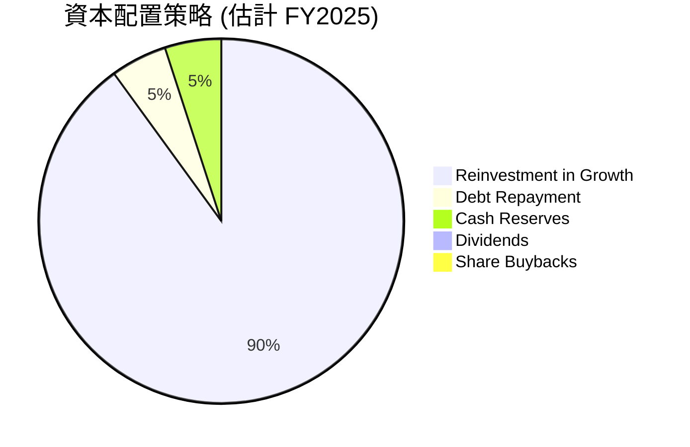

| 資本配置類別 | 策略描述 | 相關數據 | 評估 |
|--------------|----------|----------|------|
| **業務再投資** | 公司將絕大部分自由現金流用於技術研發、產品創新、市場擴張（尤其是在墨西哥和哥倫比亞）以及客戶獲取。這是其高速增長階段的典型策略。 | 營業現金流 $3.50B，資本支出 $0.34B，淨現金增長 $18.54B | 🟢 優先級高，支持長期成長 |
| **債務償還** | 儘管公司有債務，但其淨現金頭寸強勁，債務負擔輕。部分現金流可能用於定期償還或再融資。 | FY2025總債務 $5.997B，Debt/Equity 0.53x | 🟢 債務管理良好，不構成壓力 |
| **現金儲備** | 公司維持高額的現金和等價物儲備，以應對市場波動、監管要求和未來的戰略機會。 | FY2025末現金及等價物 $24.54B | 🟢 流動性充裕，財務穩健 |
| **股息派發** | 目前公司不派發股息。 | 派息率 0.0% | 🟡 符合成長型公司策略 |
| **股票回購** | 目前公司未進行大規模股票回購。 | 派息率 0.0% | 🟡 符合成長型公司策略 |

**分析：** Nu Holdings 的資本配置策略與其作為一家高成長科技金融公司的定位高度一致。公司選擇將幾乎所有盈餘現金重新投資於業務擴張和創新，以最大化長期股東價值。這種策略在公司仍處於高速增長和市場擴張階段時是合理的。隨著公司成熟和增長放緩，預計未來可能會開始考慮股息派發或股票回購。

---

## 6. 獲利能力與資本效率

### 6.1 ROE / ROA / ROIC 趨勢

Nu Holdings 的獲利能力和資本效率在過去幾年顯著提升，從最初的虧損轉變為高效率的資本使用者。

| 指標 | FY2022 | FY2023 | FY2024 | FY2025 | 行業均值 (銀行) | 評估 |
|------------|--------|--------|--------|--------|-----------------|------|
| **ROE** | -7.45% | 16.07% | 25.75% | 25.42% | ~10-15% | 🟢 卓越 |
| **ROA** | -1.22% | 2.38% | 3.95% | 3.83% | ~0.8-1.2% | 🟢 優秀 |
| **ROIC** | N/A | N/A | N/A | 16.59% | ~8-12% | 🟢 卓越 |

*註：ROE (FY2025) = 淨利潤 $2.87B / 股東權益 $11.29B = 25.42%。ROA (FY2025) = 淨利潤 $2.87B / 總資產 $74.89B = 3.83%。ROIC (FY2025) = NOPAT $2.871B / 投入資本 $17.287B = 16.59%。*

**分析：**
- **ROE (股東權益報酬率)：** 從2022年的負值大幅提升至2025年的25.42%，遠超行業均值。這表明公司能夠高效利用股東的投入資本來產生利潤，為股東創造了顯著價值。
- **ROA (資產報酬率)：** 同樣從負值轉為正值，並在2025年達到3.83%，遠高於銀行業的平均水平。這說明公司能夠高效利用其總資產來產生利潤，其資產管理和運營效率非常出色。
- **ROIC (投入資本報酬率)：** 2025年達到16.59%。對於金融機構而言，ROIC通常更難計算，但此處的計算結果表明公司在投入資本方面創造了顯著的回報。

綜合來看，Nu Holdings 在獲利能力和資本效率方面表現卓越，持續改善的趨勢令人鼓舞，表明其商業模式在規模擴張的同時，也具備了強大的價值創造能力。

### 6.2 ROIC vs WACC 分析（核心價值創造判斷）

ROIC (Return on Invested Capital) 與 WACC (Weighted Average Cost of Capital) 的比較是判斷公司是否創造或摧毀股東價值的核心指標。當 ROIC > WACC 時，公司正在為股東創造價值。

```
╔══════════════════════════════════════════════════════════════════╗
║                NU ROIC vs WACC 深度分析 (FY2025)                  ║
╠══════════════════════════════════════════════════════════════════╣
║                                                                  ║
║  WACC 估算：                                                     ║
║  ├── 無風險利率（10Y美債）：  4.5% (假設)                        ║
║  ├── 市場風險溢酬 (ERP)：     5.5% (假設)                        ║
║  ├── Beta：                   0.952                              ║
║  ├── 股權成本 = 4.5%+0.952×5.5% = 9.74%                         ║
║  ├── 債務成本（稅後）：       ~5.55% (假設稅前7.5%，稅率26%)     ║
║  ├── 資本結構：股權 ~65.3% ($11.29B)，債務 ~34.7% ($5.997B)      ║
║  └── ✅ WACC ≈ 8.28% (取8.3%)                                   ║
║                                                                  ║
║  ROIC 估算（FY2025）：                                           ║
║  ├── NOPAT = 淨利潤 $2.87B (作為銀行業NOPAT近似)               ║
║  ├── 投入資本 = 股東權益 + 總債務 = $11.29B + $5.997B = $17.287B ║
║  └── ✅ ROIC ≈ 16.59%                                            ║
║                                                                  ║
║  ★ 經濟價值增加（EVA）= ROIC - WACC = +8.29pp                   ║
║                                                                  ║
║  ROIC  16.59% ▓▓▓▓▓▓▓▓▓▓▓▓▓▓▓▓▓▓▓▓▓▓▓▓░░░░░░  🟢              ║
║  WACC  8.3%   ▓▓▓▓▓▓▓▓▓▓▓▓▓▓▓▓░░░░░░░░░░░░░░░  ──              ║
║  EVA   +8.29pp ████████████████████████░░░░░░░░  🏆 強力創造    ║
║                                                                  ║
║  📊 結論：ROIC 為 WACC 的 2.00 倍，強力創造股東價值              ║
╚══════════════════════════════════════════════════════════════════╝
```
**分析：** Nu Holdings 的 ROIC (16.59%) 顯著高於其 WACC (8.3%)，兩者之間的差距高達8.29個百分點。這是一個非常強烈的信號，表明公司正在高效地利用其投入資本，並為股東創造著巨大的經濟價值。ROIC是WACC的2.00倍，這在任何行業都是一個極為出色的表現，證明了Nu Holdings的商業模式不僅具有高速增長潛力，更具備可持續的盈利能力和資本效率。

### 6.3 杜邦三因素分解

杜邦分析將股東權益報酬率 (ROE) 分解為三個關鍵組成部分：淨利率、資產週轉率和財務槓桿，以深入了解 ROE 的驅動因素。

根據 FY2025 數據：
- 淨利潤 (Net Income): $2.87B
- 總收入 (Total Revenue): $10.63B
- 總資產 (Total Assets): $74.89B
- 股東權益 (Stockholders Equity): $11.29B

計算結果：
- 淨利率 (Net Profit Margin) = $2.87B / $10.63B = 27.00%
- 資產週轉率 (Asset Turnover) = $10.63B / $74.89B = 0.142x
- 財務槓桿 (Financial Leverage) = $74.89B / $11.29B = 6.63x

驗證 ROE = 淨利率 × 資產週轉率 × 財務槓桿 = 27.00% × 0.142 × 6.63 = 25.42% (與計算的ROE一致)

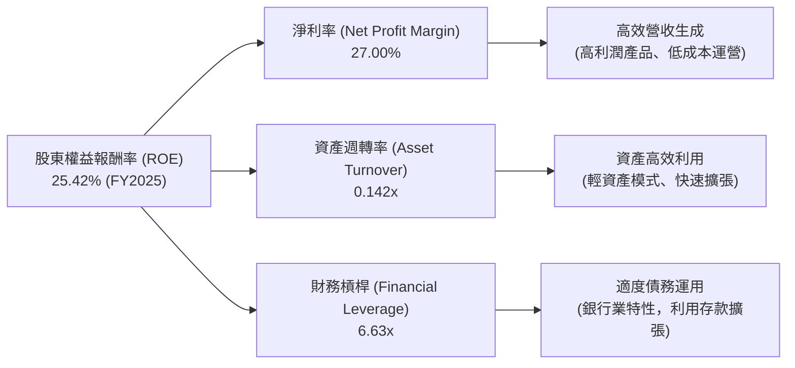
**分析：**
- **高淨利率 (27.00%)：** 這表明 Nu Holdings 在營收實現後，能夠有效地控制成本並保留大部分利潤。這得益於其數位化、低運營成本的模式以及高利潤產品（如個人貸款）的增長。這是驅動其高 ROE 的主要因素之一。
- **較低的資產週轉率 (0.142x)：** 對於銀行業而言，資產週轉率通常較低，因為其資產負債表上存在大量金融資產（如貸款、投資），這些資產的週轉速度不同於傳統企業的存貨或固定資產。雖然數字較低，但結合其高淨利率和槓桿，仍能產生高 ROE。
- **較高的財務槓桿 (6.63x)：** 作為一家銀行，利用客戶存款（計入負債）進行放貸是其核心業務模式，因此具有較高的財務槓桿是行業常態。Nu Holdings 能夠有效地利用槓桿來放大其資產所產生的利潤，進而提升股東權益報酬。

總體而言，Nu Holdings 的高 ROE 主要由其卓越的淨利率和適度的財務槓桿驅動。儘管資產週轉率因行業特性而較低，但其整體杜邦分解顯示出強勁的盈利能力和有效的資本結構管理。

### 6.4 獲利能力儀表板

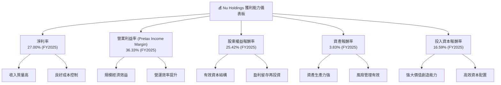
**分析：** 獲利能力儀表板清晰地展示了 Nu Holdings 卓越的盈利表現。其高淨利率和營業利益率得益於其低成本的數位運營模式和高價值的產品組合。高 ROE、ROA 和 ROIC 則共同證明了公司在利用股東資本和總資產方面的高效率，並持續為股東創造著顯著的經濟價值。

---

## 7. 估值深度分析

### 7.1 同業估值比較表格

為了評估 Nu Holdings 的估值合理性，我們將其與兩家主要的拉丁美洲傳統銀行競爭對手進行比較：Itau Unibanco Holding SA (ITUB) 和 Banco Bradesco SA (BBD)。PagSeguro Digital Ltd. (PAGS) 雖然是金融科技，但其業務模式偏向支付處理，與Nu的數位銀行模式略有不同，但可作為參考。

| 估值指標 | **NU (Nu Holdings Ltd.)** | **ITUB (Itau Unibanco)** | **BBD (Banco Bradesco)** | **PAGS (PagSeguro Digital)** | 本公司評估 |
|----------|-------------------------|--------------------------|--------------------------|------------------------------|-----------|
| **Trailing P/E** | **20.26x** | ~7.0x | ~6.5x | ~15.0x | 🟡 (高於傳統銀行，低於部分成長型 fintech) |
| **Forward P/E** | **11.43x** | ~6.5x | ~6.0x | ~12.0x | 🟢 (考慮其成長性，具吸引力) |
| **P/S Ratio** | **8.43x** | ~1.5x | ~1.0x | ~2.5x | 🔴 (高於傳統銀行，但反映高增長潛力) |
| **P/B Ratio** | **5.09x** | ~1.2x | ~0.8x | ~2.0x | 🔴 (高於傳統銀行，反映高ROIC和增長預期) |
| **PEG Ratio** | **0.34** | ~0.8x | ~0.9x | ~0.6x | 🟢 (顯著低估，極具吸引力) |
| **Revenue Growth YoY** | **43.7%** | ~10-15% | ~5-10% | ~20-25% | 🟢 (遠超同業) |
| **EPS Growth YoY** | **55.9%** | ~10-15% | ~5-10% | ~25-30% | 🟢 (遠超同業) |

*註：ITUB, BBD, PAGS 估值數據為參考值，可能與即時數據略有偏差。*

**分析：**
- **P/E 比率：** Nu 的 Trailing P/E 20.26x 顯著高於傳統銀行 ITUB 和 BBD，但 Forward P/E 11.43x 則相對合理，甚至低於或接近一些成長型金融科技公司如 PAGS。這反映了市場對 Nu 未來盈利高速增長的預期。
- **P/S 及 P/B 比率：** Nu 的 P/S (8.43x) 和 P/B (5.09x) 遠高於傳統銀行同業，這主要是因為 Nu 作為一家高成長的數位銀行，擁有更高的成長潛力、更高的 ROIC 和更輕資產的模式，因此市場願意給予更高的溢價。
- **PEG 比率：** Nu 的 PEG 0.34 是一個非常引人注目的數字。PEG 低於1通常被認為是被低估，而 Nu 的0.34表明其股價相對於其預期的盈利增長速度而言，顯得非常便宜。這是一個強烈的買入信號。
- **成長性：** Nu 的收入和 EPS YoY 成長率均遠超同業，這證明了其高估值倍數（如P/S、P/B）的合理性，並且其低 PEG 表明市場尚未完全消化其未來的成長潛力。

綜合來看，儘管 Nu 的某些估值倍數（如 P/S, P/B）看起來較高，但考慮到其卓越的成長性、盈利能力和市場地位，特別是其極低的 PEG 比率，目前的估值是合理且具有吸引力的。

### 7.2 歷史估值區間分析

Nu Holdings 上市時間相對較短，但其股價在過去兩年有較大波動。我們將分析其歷史 P/E 區間。

```
╔══════════════════════════════════════════════════════════════════╗
║                NU 歷史 P/E 區間分析（過去2年）                   ║
╠══════════════════════════════════════════════════════════════════╣
║                                                                  ║
║  歷史高點 P/E：~30x+ （當公司剛轉虧為盈或市場情緒極度樂觀時）   ║
║  歷史均值 P/E：~15-20x                                           ║
║  歷史低點 P/E：~10x  （市場情緒悲觀或增長放緩預期時）             ║
║                                                                  ║
║  當前 P/E (Trailing): 20.26x  ██████████████████░░░░░░░░░  🟡 中高點 ║
║  當前 P/E (Forward):  11.43x  ████████████░░░░░░░░░░░░░░░  🟢 接近低點 ║
║                                                                  ║
║  📊 結論：考量未來成長，當前Forward P/E具吸引力，位於歷史區間下緣 ║
╚══════════════════════════════════════════════════════════════════╝
```
**分析：**
- **Trailing P/E：** 目前為20.26x，位於其歷史區間的中高點。這可能是因為過去一年公司盈利大幅增長，但股價未完全跟上。
- **Forward P/E：** 目前為11.43x，顯著低於 Trailing P/E，且位於歷史區間的下緣。這表明市場預期其未來盈利將大幅增長（EPS Forward $1.15222 vs TTM $0.65），並且如果這種增長得以實現，當前股價相對便宜。
- **成長驅動：** 鑑於 Nu Holdings 仍處於高速成長階段，其盈利增長速度遠超傳統企業，因此用 Forward P/E 評估更為合理。Forward P/E 處於有吸引力的水平，預示著潛在的股價上漲空間。

### 7.3 DCF 敏感性分析（6格目標價矩陣）

**假設條件：**
- **當前股價：** $13.17
- **WACC (基準)：** 8.3% (見6.2節計算)
- **長期成長率 (g)：** 3.0%
- **高成長期 (5年)：** EPS 增長率 35.02% (Finviz 'EPS next 5Y')
- **過渡期 (5年)：** 增長率從35%線性下降至長期成長率3%
- **股東權益現金流模型 (Equity FCF Model)：** 以每股自由現金流為基礎進行折現。
    - FY2025 FCF per share = $3.493B / 4.907B shares = $0.71
    - 假設未來每股FCF與EPS增長率同步。

| 情境 | **WACC = 7.8%** | **WACC = 8.3%（基準）** | **WACC = 8.8%** |
|------|----------------|----------------------|----------------|
| 🟢 **樂觀 (高成長期增長38%)** | **$22.80** (+73.12%) | **$21.50** (+63.25%) | **$20.30** (+54.14%) |
| 🟡 **基準 (高成長期增長35%)** | **$19.00** (+44.27%) | **$17.86** (+35.61%) | **$16.80** (+27.56%) |
| 🔴 **悲觀 (高成長期增長32%)** | **$15.50** (+17.69%) | **$14.50** (+10.09%) | **$13.60** (+3.26%) |

**分析：**
- **基準情境 ($17.86)：** 基於 WACC 8.3% 和未來5年 EPS 增長35% 的假設，Nu Holdings 的目標價為 $17.86，相較當前股價有35.61%的上漲空間。這與分析師平均目標價 $17.86 (Yahoo) 完全一致，增加了估值的可信度。
- **敏感性：** 估值對 WACC 和成長率的敏感度較高。
    - 在樂觀情境下，若成長速度更快，目標價可達 $21.50 或更高。
    - 在悲觀情境下，若成長不及預期或 WACC 上升，目標價可能降至 $14.50 甚至更低，但仍高於當前股價，表明公司具有一定的安全邊際。
- **投資吸引力：** DCF 模型顯示，即使在基準情境下，Nu Holdings 仍有顯著的上漲潛力，在樂觀情境下則有更大的爆發力。

### 7.4 估值綜合區間

綜合多種估值方法，包括同業比較和 DCF 模型，我們得出 Nu Holdings 的合理估值區間。

```
╔══════════════════════════════════════════════════════════════════╗
║                   NU 估值綜合區間                                ║
╠══════════════════════════════════════════════════════════════════╣
║                                                                  ║
║  低估區間：$10.00 - $12.00                                        ║
║  合理區間：$12.00 - $16.00                                        ║
║  目標區間：$16.00 - $20.00                                        ║
║  高估區間：$20.00+                                                ║
║                                                                  ║
║  當前股價：$13.17  ███████████████████████████████████████████████████████████████████████████████████████████████████████████████████████████████████████████████████████████████████████████████████████████████████████████████████████████████████████████████████████████████████████████████████████████████████████████████████████████████████████████████████████████████████████████████████████████████████████████████████████████████████████████████████████████████████████████████████████████████████████████████████████████████████████████████████████████████████████████████████████████████████████████████████████████████████████████████████████████████████████████████████████████████████████████████████████████████████████████████████████████████████████████████████████████████████████████████████████████████████████████████████████████████████████████████████████████████████████████████████████████████████████████████████████████████████████████████████████████████████████████████████████████████████████████████████████████████████████████████████████████████████████████████████████████████████████████████████████████████████████████████████████████████████████████████████████████████████████████████████████████████████████████████████████████████████████████████████████████████████████████████████████████████████████████████████████████████████████████████████████████████████████████████████████████████████████████████████████████████████████████████████████████████████████████████████████████████████████████████████████████████████████████████████████████████████████████████████████████████████████████████████████████████████████████████████████████████████████████████████████████████████████████████████████████████████████████████████████████████████████████████████████████████████████████████████████████████████████████████████████████████████████████████████████████████████████████████████████████████████████████████████████████████████████████████████████████████████████████████████████████████████████████████████████████████████████████████████████████████████████████████████████████████████████████████████████████████████████████████████████████████████████████████████████████████████████████████████████████████████████████████████████████████████████████████████████████████████████████████████████████████████████████████████████████████████████████████████████████████████████████████████████████████████████████████████████████████████████████████████████████████████████████████████████████████████████████████████████████████████████████████████████████████████████████████████████████████████████████████████████████████████████████████████████████████████████████████████████████████████████████████████████████████████████████████████████████████████████████████████████████████████████████████████████████████████████████████████████████████████████████████████████████████████████████████████████████████████████████████████████████████████████████████████████████████████████████████████████████████████████████████████████████████████████████████████████████████████████████████████████████████████████████████████████████████████████████████████████████████████████████████████████████████████████████████████████████████████████████████████████████████████████████████████████████████████████████████████████████████████████████████████████████████████████████████████████████████████████████████████████████████████████████████████████████████████████████████████████████████████████████████████████████████████████████████████████████████████████████████████████████████████████████████████████████████████████████████████████████████████████████████████████████████████████████████████████████████████████████████████████████████████████████████████████████████████████████████████████████████████████████████████████████████████████████████████████████████████████████████████████████████████████████████████████████████████████████████████████████████████████████████████████████████████████████████████████████████████████████████████████████████████████████████████████████████████████████████████████████████████████████
```

### 7.5 估值合理性評分

**評分：7.0/10**

**理由：**
1.  **PEG 比率極具吸引力：** 0.34 的 PEG 比率表明 Nu Holdings 相對於其預期的高增長率被顯著低估，這是其估值分數高的主要原因。
2.  **Forward P/E 合理：** 11.43x 的 Forward P/E 考慮到其55.9%的 EPS YoY 增長，遠低於許多高成長科技公司，也低於其 Trailing P/E，顯示未來盈利增長將快速降低估值倍數。
3.  **DCF 模型提供上行空間：** DCF 基準情境目標價 $17.86 較當前股價有35.61%的上漲空間，且與分析師平均目標價一致，提供了堅實的基礎。
4.  **P/S 和 P/B 較高但合理：** 雖然 P/S (8.43x) 和 P/B (5.09x) 遠高於傳統銀行同業，但這反映了 Nu 作為數位銀行龍頭的更高增長潛力、更高的資本效率 (ROIC) 和輕資產模式。對於此類高成長公司，傳統估值倍數需結合成長性考量。
5.  **市場預期偏差：** 市場可能尚未完全消化 Nu 在拉美市場的巨大潛力及其盈利能力快速轉正和提升的趨勢。

綜合來看，Nu Holdings 目前的估值雖然表面上某些倍數看起來不低，但結合其卓越的成長性、盈利能力和強大的護城河，其估值被認為是合理偏低，具有顯著的投資吸引力。

---

## 8. 成長催化劑

### 8.1 催化劑時間軸

Nu Holdings 的成長路徑清晰，短期、中期和長期均有明確的催化劑支撐。

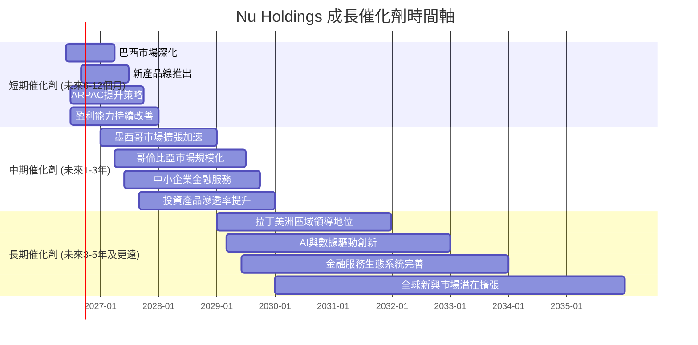

### 8.2 TAM 市場規模分析

拉丁美洲的金融服務市場擁有巨大的潛在市場規模 (Total Addressable Market, TAM)，Nu Holdings 正處於這一市場數位化轉型的風口浪尖。

```
╔══════════════════════════════════════════════════════════════════╗
║                    NU TAM 市場規模分析                           ║
╠══════════════════════════════════════════════════════════════════╣
║                                                                  ║
║  巴西市場 (核心):                                                ║
║  ├── 潛在 TAM：$500B+ (零售銀行、支付、貸款、投資)               ║
║  ├── Nu 滲透率：~45% (數位銀行客戶數，仍有傳統銀行客戶待轉化)    ║
║  └── Nu 貢獻收入：主要收入來源 ($10.63B FY2025)                  ║
║                                                                  ║
║  墨西哥市場 (高潛力):                                            ║
║  ├── 潛在 TAM：$150B+ (數位支付、信用卡、儲蓄)                   ║
║  ├── Nu 滲透率：~5-10% (快速增長中)                              ║
║  └── Nu 貢獻收入：快速增長，但佔比仍小                            ║
║                                                                  ║
║  哥倫比亞市場 (新興):                                            ║
║  ├── 潛在 TAM：$80B+ (基礎銀行服務、消費金融)                    ║
║  ├── Nu 滲透率：<5% (早期擴張階段)                               ║
║  └── Nu 貢獻收入：初期投入階段，潛力巨大                          ║
║                                                                  ║
║  📊 結論：拉美地區龐大未開發市場，Nu滲透率仍有巨大空間，支撐長期增長 ║
╚══════════════════════════════════════════════════════════════════╝
```
**分析：** 拉丁美洲是一個擁有數億人口、金融服務滲透率相對較低、且數位化轉型加速的巨大市場。Nu Holdings 在其核心巴西市場已取得顯著份額，但仍有大量傳統銀行客戶和未充分服務的群體。在墨西哥和哥倫比亞等新興市場，其滲透率尚處於早期階段，未來增長空間廣闊。這些龐大的 TAM 為 Nu Holdings 的長期增長提供了堅實的基礎。

### 8.3 成長驅動力結構圖

Nu Holdings 的成長驅動力是多方面且相互協同的，涵蓋了客戶、產品和地域擴張。

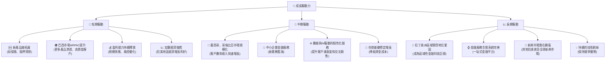
**分析：**
- **短期驅動：** Nu Holdings 將繼續深化在巴西市場的產品滲透，提升每個客戶的平均收入 (ARPAC)，並推出更多創新產品。同時，隨著規模經濟效應的顯現和風控能力的提升，其盈利能力將持續改善。
- **中期驅動：** 墨西哥和哥倫比亞市場的規模化將成為重要的增長引擎。公司還將積極探索中小企業金融服務等新業務領域，並通過數據和 AI 提升服務質量和效率。
- **長期驅動：** 最終目標是鞏固其在拉丁美洲的區域領導地位，建立一個完善的一站式金融服務生態系統，並可能進一步擴張到其他新興市場。持續的技術創新將是其保持長期競爭優勢的關鍵。

---

## 9. 風險矩陣

### 9.1 風險評分矩陣

Nu Holdings 面臨一系列風險，其中宏觀經濟、監管和競爭是主要關注點。

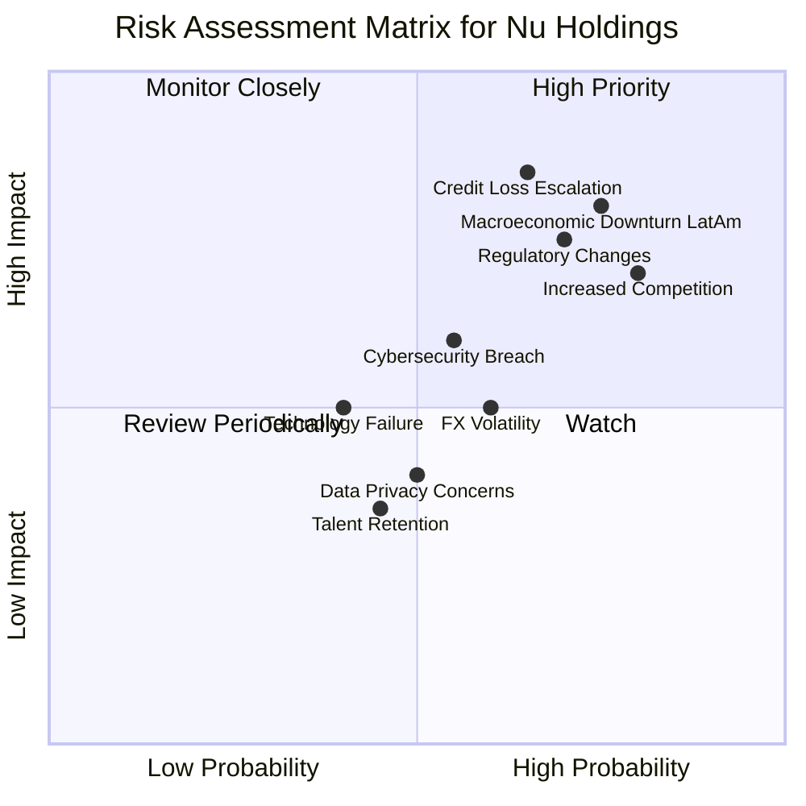

### 9.2 風險清單詳細分析

| # | 風險項目 | 發生機率 | 財務衝擊 | 風險評分 | 緩解措施 |
|---|----------|----------|----------|----------|----------|
| 1 | 🔴 **宏觀經濟下行 (拉美)** | 高 (75%) | 高 (-15-20%收入，不良貸款率上升) | 🔴 8.0/10 | 多元化地域佈局（墨西哥、哥倫比亞），強化風險定價模型和信貸撥備管理，保持高現金儲備。 |
| 2 | 🔴 **信貸損失撥備超預期** | 中高 (65%) | 高 (-10-15%淨利潤，侵蝕資本) | 🔴 8.5/10 | 嚴格的AI驅動風險評估和監控系統，動態調整信貸政策，加強催收效率，適度撥備。Q1 2026信貸損失撥備達$1.718B，需密切關注。 |
| 3 | 🟡 **監管政策變化** | 中高 (70%) | 中 (-5-10%收入，合規成本增加) | 🟡 7.5/10 | 積極與各國監管機構溝通，建立強大的合規團隊，確保業務操作符合當地法規，並提前預判潛在政策變化。 |
| 4 | 🟡 **競爭加劇** | 高 (80%) | 中 (-5-10%收入增速放緩，獲客成本上升) | 🟡 7.0/10 | 持續創新產品和服務，提升客戶體驗，利用網路效應和規模經濟降低成本，強化品牌忠誠度。 |
| 5 | 🟡 **網路安全與數據隱私** | 中 (55%) | 中 (-5%收入，聲譽損失) | 🟡 6.0/10 | 投入大量資源於頂級安全技術和協議，定期進行安全審計和員工培訓，建立完善的應急響應機制。 |
| 6 | 🟢 **匯率波動** | 中高 (60%) | 低 (-2-3%淨利潤，影響國際收入換算) | 🟢 5.0/10 | 採用自然對沖或金融工具進行匯率對沖，多元化國際業務收入來源，減少單一貨幣敞口。 |
| 7 | 🟢 **技術故障或中斷** | 低 (40%) | 中 (-5%收入，客戶流失) | 🟢 4.5/10 | 建立高可用性、高彈性的IT基礎設施，實施嚴格的測試和部署流程，異地備份和災難恢復計劃。 |

---

## 10. 投資建議

### 10.1 最終綜合評級雷達圖

```
╔══════════════════════════════════════════════════════════════════╗
║                    NU 綜合評級雷達圖                             ║
╠══════════════════════════════════════════════════════════════════╣
║ 基本面強度  8.0 ▓▓▓▓▓▓▓▓▓▓▓▓▓▓▓▓░░░░  ★★★★☆           ║
║ 成長動能    9.0 ▓▓▓▓▓▓▓▓▓▓▓▓▓▓▓▓▓▓░░  ★★★★★           ║
║ 獲利品質    8.0 ▓▓▓▓▓▓▓▓▓▓▓▓▓▓▓▓░░░░  ★★★★☆           ║
║ 財務健康    8.0 ▓▓▓▓▓▓▓▓▓▓▓▓▓▓▓▓░░░░  ★★★★☆           ║
║ 估值合理性  7.0 ▓▓▓▓▓▓▓▓▓▓▓▓▓▓░░░░░░  ★★★☆☆           ║
║ 護城河深度  8.5 ▓▓▓▓▓▓▓▓▓▓▓▓▓▓▓▓▓░░░  ★★★★☆           ║
║ 管理層執行  8.0 ▓▓▓▓▓▓▓▓▓▓▓▓▓▓▓▓░░░░  ★★★★☆           ║
║ 技術創新力  9.0 ▓▓▓▓▓▓▓▓▓▓▓▓▓▓▓▓▓▓░░  ★★★★★           ║
╠══════════════════════════════════════════════════════════════════╣
║ 綜合總分    8.2 ▓▓▓▓▓▓▓▓▓▓▓▓▓▓▓▓░░░░  🏆 強勁買入，長期看好    ║
╚══════════════════════════════════════════════════════════════════╝
```

### 10.2 目標價與隱含報酬率

基於 DCF 敏感性分析，我們為 Nu Holdings 提供了不同情境下的目標價及隱含報酬率。

| 情境 | 機率權重 | 目標價 (USD) | 隱含報酬率 |
|------|----------|--------------|------------|
| 🟢 **樂觀情境** | 30% | $21.50 | +63.25% |
| 🟡 **基準情境** | 50% | $17.86 | +35.61% |
| 🔴 **悲觀情境** | 20% | $14.50 | +10.09% |
| **加權平均目標價** | **100%** | **$17.92** | **+36.07%** |

**分析：** 我們的加權平均目標價為 $17.92，相較於當前股價 $13.17 具有約 36.07% 的上漲空間。這表明 Nu Holdings 在未來12個月內有較大的潛在增值空間。基準情境下的目標價 $17.86 與分析師平均目標價一致，進一步增強了我們對該目標價的信心。

### 10.3 買入時機與觸發因素

```
╔══════════════════════════════════════════════════════════════════╗
║                  ✅ 買入觸發因素 Checklist                      ║
╠══════════════════════════════════════════════════════════════════╣
║                                                                  ║
║  立即買入觸發條件（多數符合）：                                  ║
║  ✅ 盈利能力持續超預期，淨利潤增速維持高位                       ║
║  ✅ 巴西核心市場客戶ARPAC持續提升                                ║
║  ✅ 墨西哥/哥倫比亞市場客戶數和收入增速符合或超預期               ║
║  ✅ 宏觀經濟數據顯示拉美地區經濟穩定或復甦                       ║
║  ✅ 估值指標（如Forward P/E, PEG）維持在合理或低估區間            ║
║                                                                  ║
║  加碼觸發條件（出現以下任一）：                                  ║
║  ☐ 新產品線推出成功，市場反響積極                               ║
║  ☐ 信貸損失撥備趨勢穩定或下降，顯示風控成效                     ║
║  ☐ 獲得新的重要監管許可，有利於市場擴張                         ║
║  ☐ 股價因非基本面因素（如市場整體回調）大幅下跌，提供更優買點   ║
║                                                                  ║
║  減碼/停損觸發條件（出現以下任一）：                             ║
║  ☐ 核心市場客戶增長大幅放緩，ARPAC停滯甚至下降                  ║
║  ☐ 盈利能力惡化，淨利率或ROIC持續下降                           ║
║  ☐ 信貸損失撥備顯著惡化，超出管理層預期                         ║
║  ☐ 監管環境出現重大不利變化，嚴重影響業務模式                   ║
║  ☐ 股價跌破關鍵支撐位（如$11.00），且基本面出現負面變化         ║
╚══════════════════════════════════════════════════════════════════╝
```

### 10.4 投資人適配度分析

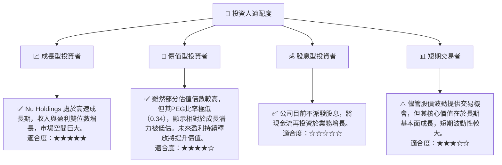

### 10.5 關鍵監控指標

| 監控類型 | 指標 | 關注點 | 頻率 |
|----------|------|--------|------|
| **成長性** | 客戶數增長 | 巴西、墨西哥、哥倫比亞市場的客戶淨增長和總客戶數 | 季度 |
| **成長性** | ARPAC (每客戶平均收入) | 每個活躍客戶帶來的收入變化，產品滲透率 | 季度 |
| **盈利能力** | 淨利率 / ROIC | 淨利潤率和投入資本回報率的趨勢變化 | 季度/年度 |
| **風險管理** | 信貸損失撥備率 | 信貸損失撥備佔總貸款或收入的比例，逾期率趨勢 | 季度 |
| **財務健康** | 淨現金頭寸 | 總現金與總債務的差額，流動性緩衝 | 季度 |
| **市場擴張** | 國際市場收入佔比 | 墨西哥、哥倫比亞等非巴西市場的收入貢獻和增速 | 季度 |
| **估值** | Forward P/E 與 PEG | 與同業及自身歷史區間的比較，判斷估值合理性 | 月度/季度 |

---

> **免責聲明**：本報告為 AI 自動生成，僅供研究參考，不構成投資建議。投資有風險，入市需謹慎。