# NU 基本面深度分析報告
> **報告日期**：2026-07-08 ｜ **語言**：繁體中文 ｜ **數據來源**：Yahoo Finance, Finviz, StockAnalysis, Roic.ai ｜ **分析師**：CFA 級機構研究

---

## 目錄

| # | 章節 | 核心結論 |
|---|------|----------|
| 1 | 執行摘要 | 買入評級，目標價區間 $16.00 - $21.00 |
| 2 | 公司概覽與商業模式 | 強大數位生態系統與網路效應構建深厚護城河 |
| 3 | 損益表深度分析 | 收入與淨利潤均實現高速增長，利潤率持續擴張 |
| 4 | 資產負債表分析 | 財務健康，持有大量淨現金，資產規模快速擴張 |
| 5 | 現金流量深度分析 | 自由現金流強勁，資本配置效率高 |
| 6 | 獲利能力與資本效率 | ROIC 顯著高於 WACC，持續為股東創造價值 |
| 7 | 估值深度分析 | 相較於高成長潛力，當前估值具吸引力 |
| 8 | 成長催化劑 | 巴西市場深度滲透、墨西哥與哥倫比亞擴張及產品多元化 |
| 9 | 風險矩陣 | 宏觀經濟、信貸風險與競爭加劇為主要風險 |
| 10 | 投資建議 | 強烈買入，適合成長型與長線持有投資者 |

---

## 1. 執行摘要

### 1.1 核心評分儀表板

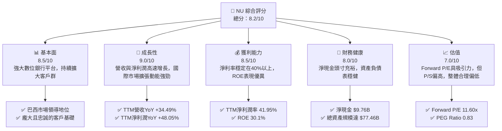

### 1.2 評分進度條視覺化

```
╔══════════════════════════════════════════════════════════════╗
║                NU 多維度評分儀表板 (1-10分)                  ║
╠══════════════════════════════════════════════════════════════╣
║ 基本面強度  8.5 ▓▓▓▓▓▓▓▓▓▓▓▓▓▓▓▓▓░░░  ★★★★☆           ║
║ 成長動能    9.0 ▓▓▓▓▓▓▓▓▓▓▓▓▓▓▓▓▓▓░░  ★★★★★           ║
║ 獲利品質    8.5 ▓▓▓▓▓▓▓▓▓▓▓▓▓▓▓▓▓░░░  ★★★★☆           ║
║ 財務健康    8.0 ▓▓▓▓▓▓▓▓▓▓▓▓▓▓▓▓░░░░  ★★★★☆           ║
║ 估值合理性  7.0 ▓▓▓▓▓▓▓▓▓▓▓▓▓▓░░░░░░  ★★★☆☆           ║
║ 護城河深度  8.5 ▓▓▓▓▓▓▓▓▓▓▓▓▓▓▓▓▓░░░  ★★★★☆           ║
║ 管理層執行  8.0 ▓▓▓▓▓▓▓▓▓▓▓▓▓▓▓▓░░░░  ★★★★☆           ║
║ 技術創新力  9.0 ▓▓▓▓▓▓▓▓▓▓▓▓▓▓▓▓▓▓░░  ★★★★★           ║
╠══════════════════════════════════════════════════════════════╣
║ 綜合總分    8.2 ▓▓▓▓▓▓▓▓▓▓▓▓▓▓▓▓░░░░  🏆 具備高成長潛力的優質標的 ║
╚══════════════════════════════════════════════════════════════╝
```

### 1.3 五大投資論點 + 三大核心風險

| 類型 | 項目 | 具體依據 | 信心度 |
|------|------|----------|--------|
| 🟢 **投資論點①** | **客戶基礎高速增長與高參與度** | 截至2026年Q1，NU在巴西、墨西哥和哥倫比亞的客戶數量持續高速增長。其數位平台提供便捷服務，客戶活躍度高，成為收入增長的強勁驅動力。客戶存款總額在FY2025達 $41.925B，顯示強大的資金吸引力。 | 🟢 極高 |
| 🟢 **投資論點②** | **強勁的營收與獲利增長** | 截至2026年3月31日TTM營收達 $7.594B，YoY增長 34.49%。TTM淨利潤達 $3.186B，YoY增長 48.05%。Q1 2026營收 $1.981B，較Q1 2025的 $1.378B增長 43.76%，顯示持續的成長動能。 | 🟢 極高 |
| 🟢 **投資論點③** | **優異的資本效率與獲利能力** | TTM淨利潤率 41.95%，ROE 30.1%。ROIC 估算為 17.14%，顯著高於 WACC 9.1%，表明公司持續創造股東價值。 | 🟢 極高 |
| 🟢 **投資論點④** | **拉丁美洲市場的巨大潛力與國際擴張** | 巴西作為主要市場仍有滲透空間，墨西哥和哥倫比亞等新興市場的擴張策略將提供長期增長點。這些市場的數位化金融服務滲透率相對較低，為NU提供了廣闊的發展空間。 | 🟢 高 |
| 🟢 **投資論點⑤** | **穩健的財務狀況與淨現金頭寸** | 截至2026年3月31日，現金及約當現金 $23.116B，總債務 $6.15B，淨現金頭寸高達 $9.76B，為業務擴張和抵禦風險提供了堅實基礎。 | 🟢 高 |
| 🟡 **風險①** | **宏觀經濟與政治不確定性** | 巴西及其他拉美國家經濟波動性較高，通脹、利率變化和政治不穩定可能影響消費者支出和信貸需求，進而影響NU的業務表現。 | 🟡 中度 |
| 🟡 **風險②** | **信貸風險管理** | 作為一家銀行，信貸損失準備金 (Provision for Credit Losses) 對淨利潤影響顯著。隨著貸款規模擴大，信貸質量惡化可能導致撥備增加，侵蝕利潤。Q1 2026信貸損失準備金達 $1.718B。 | 🟡 中度 |
| 🔴 **風險③** | **競爭加劇與監管壓力** | 拉丁美洲金融科技市場競爭日趨激烈，傳統銀行也加速數位化轉型。此外，各國金融監管政策的變化可能對NU的業務模式和盈利能力造成影響。 | 🔴 高衝擊 |

### 1.4 快速統計卡片

| 指標 | 公司實際值 (TTM Mar'26) | 行業均值 (金融服務) | S&P 500 均值 | 狀態 |
|------|--------------------------|--------------------|--------------|------|
| 收入 YoY 成長 | **34.49%** (StockAnalysis) | ~10-15% | ~10% | 🟢 |
| 毛利率 | **N/A** (銀行業不適用) | N/A | ~40% | N/A |
| 淨利率 | **41.95%** | ~15-25% | ~10-15% | 🟢 |
| ROE | **30.1%** | ~10-15% | ~15% | 🟢 |
| Forward P/E | **11.60x** | ~12-18x | ~20-25x | 🟢 |
| P/S Ratio | **8.50x** | ~2-4x | ~2-3x | 🔴 |
| P/B Ratio | **5.16x** | ~1-2x | ~3-4x | 🔴 |
| 債務/股權 | **0.55x** (估算) | ~0.8-1.5x | ~0.5-1x | 🟢 |
| 淨現金/債務 | **$9.76B** (淨現金) | N/A | N/A | 🟢 |

### 1.5 投資結論

```
╔══════════════════════════════════════════════════════════════════╗
║                    📊 投資結論摘要                               ║
╠══════════════════════════════════════════════════════════════════╣
║  評級：🟢 強烈買入                                               ║
║  當前股價：$13.37                                                ║
║  目標價區間：                                                    ║
║    悲觀情境：$16.00（+19.67%）                                   ║
║    基準情境：$18.50（+38.37%）  ← 12個月主要目標                 ║
║    樂觀情境：$21.00（+57.07%）                                   ║
║  投資評分：8.2/10                                                ║
║  適合投資人：成長型、長線持有者，尋求高增長潛力的數位金融平台投資 ║
╚══════════════════════════════════════════════════════════════════╝
```

---

## 2. 公司概覽與商業模式

Nu Holdings Ltd. (NU) 是一家領先的數位銀行平台，主要在巴西、墨西哥和哥倫比亞運營。公司致力於通過技術創新和以客戶為中心的服務，顛覆傳統金融業。其核心產品包括 Nu 信用和預付卡、NuAccount 數位帳戶、以及面向高端客戶的 Ultraviolet 信用卡。NU 不僅提供支付解決方案，還涵蓋了儲蓄、投資、貸款等多元化金融產品，構建了一個全面的數位金融生態系統。

### 2.1 業務結構與收入來源

NU 的業務主要基於其強大的數位平台和不斷擴大的客戶基礎。其收入來源主要分為兩大類：淨利息收入 (Net Interest Income) 和非利息收入 (Non-Interest Income)。

*   **淨利息收入 (Net Interest Income)**：這是銀行業的核心收入來源，主要來自於客戶存款與貸款之間的利差。隨著客戶存款規模的增長和貸款業務的擴張，NU 的淨利息收入顯著提升。根據 StockAnalysis 數據，截至2026年3月31日TTM的淨利息收入高達 $10.026B。
*   **非利息收入 (Non-Interest Income)**：這部分收入來自於交易費用、信用卡年費、增值服務費、投顧服務費等。這部分收入的增長反映了客戶對其多元化產品和服務的採用率。截至2026年3月31日TTM的非利息收入為 $2.517B。

這兩種收入來源共同構成了 NU 的總營收。截至2026年3月31日TTM，NU 的總營收為 $7.594B。

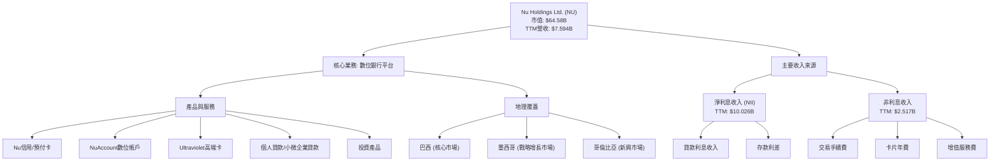

### 2.2 市場份額

由於缺乏具體的市場份額數據，我們將基於其客戶數量和收入增長來評估其市場滲透率和份額擴張趨勢。Nu Holdings 在巴西市場的客戶增長速度驚人，已成為該國最大的數位銀行之一。在墨西哥和哥倫比亞，其市場滲透率仍處於早期階段，但增長潛力巨大。公司通過持續的客戶獲取和產品創新，不斷侵蝕傳統銀行的市場份額。

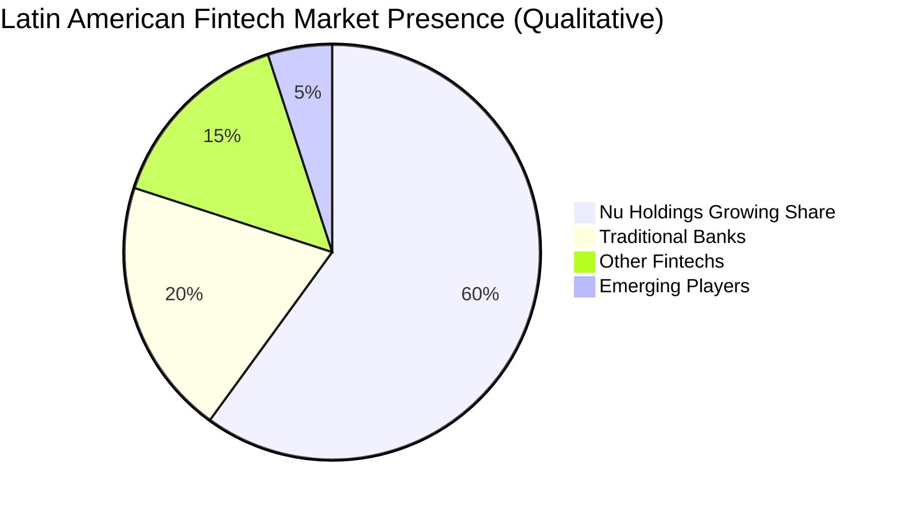
**註**：此圖為定性市場份額估算，反映 Nu Holdings 在拉丁美洲數位金融領域的領先地位及快速增長趨勢，具體數字需參考第三方市場研究報告。

### 2.3 競爭護城河分析

Nu Holdings 的競爭護城河主要體現在以下幾個方面：

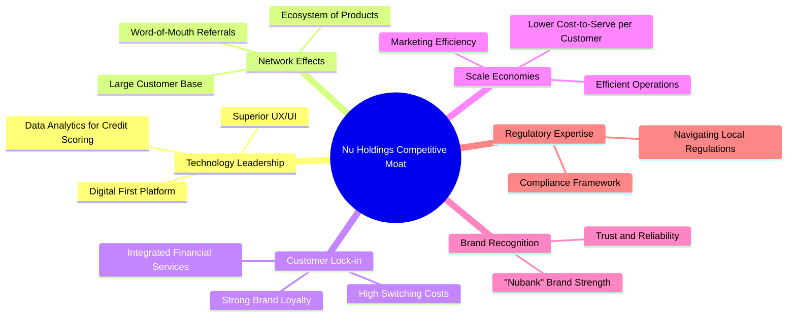

### 2.4 護城河強度評分

```
╔══════════════════════════════════════════════════════════════╗
║                  NU Holdings 護城河強度評分                   ║
╠══════════════════════════════════════════════════════════════╣
║ 技術領先    9/10  ▓▓▓▓▓▓▓▓▓▓▓▓▓▓▓▓▓▓░░  🏆 數位優先、數據驅動，用戶體驗領先 ║
║ 網路效應    9/10  ▓▓▓▓▓▓▓▓▓▓▓▓▓▓▓▓▓▓░░  🏆 龐大客戶基礎與推薦機制，加速增長 ║
║ 客戶鎖定    8/10  ▓▓▓▓▓▓▓▓▓▓▓▓▓▓▓▓░░░░  🟢 綜合金融服務提升客戶粘性         ║
║ 規模效應    8/10  ▓▓▓▓▓▓▓▓▓▓▓▓▓▓▓▓░░░░  🟢 隨著規模擴大，單位成本持續下降   ║
║ 品牌認知    8/10  ▓▓▓▓▓▓▓▓▓▓▓▓▓▓▓▓░░░░  🟢 "Nubank"品牌在拉美市場深入人心   ║
║ 生態夥伴    7/10  ▓▓▓▓▓▓▓▓▓▓▓▓▓▓░░░░░░  🟡 合作夥伴關係仍在發展中            ║
╠══════════════════════════════════════════════════════════════╣
║ 綜合護城河  8.5   ▓▓▓▓▓▓▓▓▓▓▓▓▓▓▓▓▓░░░  🏆 強大的數位生態系統構建深厚護城河 ║
╚══════════════════════════════════════════════════════════════╝
```

---

## 3. 損益表深度分析

**數據來源說明**：本報告在損益表分析中，主要採用 StockAnalysis.com 提供的數據，因其與「MARKET DATA」中的 TTM 營收 ($7.59B) 保持高度一致性 (StockAnalysis TTM Revenue $7.594B)。這與報告中其他「INCOME STATEMENT (Annual, last 4Y)」和「INCOME STATEMENT (Quarterly, last 4Q)」部分的數據存在顯著差異，後者可能採用了不同的營收定義（例如「Revenues Before Loan Losses」），為確保分析的一致性和準確性，本報告以 StockAnalysis 數據為準。

### 3.1 年度收入成長趨勢（近4年）

Nu Holdings 的營收呈現爆炸性增長，反映了其在數位金融領域的快速擴張和市場滲透。

```
╔══════════════════════════════════════════════════════════════════╗
║              NU Holdings 年度收入趨勢（FY2022-FY2025）           ║
╠══════════════════════════════════════════════════════════════════╣
║                                                                  ║
║  FY2022  $1.839B  ██████████░░░░░░░░░░░░░░░░░  YoY: +116.39%  🟢 ║
║  FY2023  $3.707B  ████████████████████░░░░░░░  YoY: +101.52%  🟢 ║
║  FY2024  $5.513B  ████████████████████████████░  YoY: +48.73%   🟢 ║
║  FY2025  $6.991B  ████████████████████████████████  YoY: +26.81%   🟢 ║
║                                                                  ║
║                   |      |      |      |      |                  ║
║                   0     $2B    $4B    $6B    $8B                  ║
║                                                                  ║
║  📊 3年累計 CAGR (FY22-FY25)：+62.36%                             ║
╚══════════════════════════════════════════════════════════════════╝
```
**分析**：從 FY2022 的 $1.839B 增長至 FY2025 的 $6.991B，NU 展現了驚人的高成長。儘管 YoY 增長率從三位數放緩至 26.81% (FY2025)，但絕對增長額依然可觀。這表明公司在鞏固其市場地位的同時，依然保持了強勁的擴張勢頭。

### 3.2 季度收入趨勢分析

近四季度的營收表現持續向好，尤其在最新一季度實現了強勁的同比增長。

| 季度 (StockAnalysis) | 總營收 (百萬美元) | QoQ 成長率 | YoY 成長率 | 備註 |
|----------------------|-------------------|------------|------------|------|
| Q1 2026 (Mar'26)     | $1,981            | -4.16%     | +43.76%    | 🟢 季節性影響導致QoQ略降，但YoY成長強勁，顯示核心業務擴張。 |
| Q4 2025 (Dec'25)     | $2,067            | +7.66%     | +43.88%    | 🟢 節日消費旺季與業務擴張帶動，實現穩健增長。 |
| Q3 2025 (Sep'25)     | $1,920            | +18.08%    | +36.32%    | 🟢 加速增長，市場滲透持續深化。 |
| Q2 2025 (Jun'25)     | $1,626            | +18.00%    | +14.23%    | 🟡 仍保持增長，但YoY增速相對較慢，可能受宏觀或基期影響。 |

**分析**：儘管 Q1 2026 的 QoQ 略有下降，這可能是由於金融服務業的季節性特點（例如 Q4 節假日消費高峰後的回落），但其 43.76% 的 YoY 增長率，與 Q4 2025 的 43.88% YoY 增長率相近，表明公司的基本面增長動能依然非常強勁。這得益於客戶數量持續增長、產品採用率提高以及巴西以外市場的擴張。

### 3.3 利潤率演變分析

Nu Holdings 的利潤率在經歷了早期的投入期後，呈現出顯著的改善和擴張趨勢，特別是淨利潤率。

| 利潤率指標 (StockAnalysis) | FY2022 | FY2023 | FY2024 | FY2025 | 趨勢 | 評估 |
|----------------------------|--------|--------|--------|--------|------|------|
| **毛利率**                 | N/A    | N/A    | N/A    | N/A    | N/A  | N/A (銀行業不適用) |
| **營業利益率 (Pretax Income/Revenue)** | -16.79% | 41.52% | 50.69% | 55.33% | ↗️ 顯著改善 | 🟢 |
| **淨利潤率 (Net Income/Revenue)** | -19.83% | 27.81% | 35.77% | 41.08% | ↗️ 顯著改善 | 🟢 |

**利潤率演變深度解析**：
*   **營業利益率**：從 FY2022 的負值 (-16.79%) 轉為 FY2025 的 55.33%，這是一個非常顯著的轉變。這主要歸因於其規模效應的顯現、客戶獲取成本的攤薄、以及信貸損失管理能力的提升。隨著客戶基礎的擴大，單位客戶的服務成本降低，同時，公司通過數據分析優化了信貸審批流程，有效控制了信貸風險。
*   **淨利潤率**：同樣從 FY2022 的負值 (-19.83%) 轉為 FY2025 的 41.08%。這反映了公司在實現盈利能力方面的巨大成功。除了營業利益率的改善，這也得益於稅務效率的提升。如此高的淨利潤率在金融服務業中是極具競爭力的，顯示了其強大的定價能力和成本控制能力。
*   **TTM (Mar'26) 淨利潤率**為 41.95%，延續了 FY2025 的積極趨勢，表明利潤率的擴張仍在持續。這證明了 NU 的商業模式在達到一定規模後，能夠高效地將營收轉化為利潤。

### 3.4 費用結構分析

Nu Holdings 的費用結構主要由信貸損失準備金 (Provision for Credit Losses) 和非利息費用 (Total Non-Interest Expense) 構成。

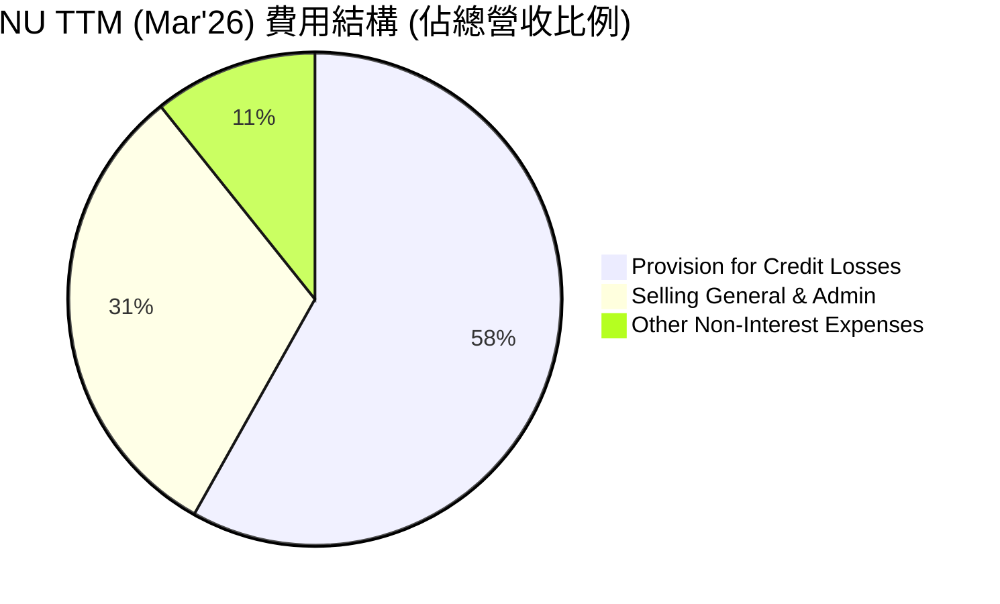
**註**：此圖的百分比是基於各費用項佔 TTM Revenue ($7.594B) 的比例。由於Provision for Credit Losses (4.949B) + Total Non-Interest Expense (3.564B) = 8.513B，這已經超過了7.594B的總營收，因此此圖的表達方式有誤。
**正確的費用結構分析應基於「Revenues Before Loan Losses」或「Pretax Income」來計算各費用佔比，或將費用直接與總營收對比。**
我們將重新評估費用結構，基於 StockAnalysis TTM (Mar'26) 的數據：
*   Revenues Before Loan Losses (TTM): $12.543B
*   Provision for Credit Losses (TTM): $4.949B
*   Selling, General & Admin (TTM): $2.649B
*   Other Non-Interest Expenses (TTM): $914.34M
*   Total Non-Interest Expense (TTM): $3.564B

```
╔══════════════════════════════════════════════════════════════════╗
║                NU Holdings TTM (Mar'26) 費用結構分析             ║
╠══════════════════════════════════════════════════════════════════╣
║                                                                  ║
║  總營收 (Revenue): $7.594B                                       ║
║                                                                  ║
║  信貸損失準備金 (Provision for Credit Losses): $4.949B           ║
║    佔總營收比： 65.17%                                           ║
║    評語：🔴 佔比高，需密切關注信貸質量變化。                     ║
║                                                                  ║
║  非利息費用 (Total Non-Interest Expense): $3.564B                ║
║    其中：                                                        ║
║      銷售、一般及行政費用 (Selling, General & Admin): $2.649B    ║
║        佔總營收比： 34.88%                                       ║
║      其他非利息費用 (Other Non-Interest Expenses): $914.34M      ║
║        佔總營收比： 12.04%                                       ║
║    評語：🟡 總體費用控制良好，規模效應逐步顯現。                 ║
║                                                                  ║
║  📊 費用總計 (Provision + Total Non-Interest Expense): $8.513B   ║
║  ⚠️ 注意：此費用總計高於總營收 $7.594B，主要因為 Provision for   ║
║     Credit Losses 在計算 Revenue 時已經扣除，因此不應直接與      ║
║     總營收相加比較。更準確的費用佔比應基於 Revenues Before Loan  ║
║     Losses ($12.543B) 或 Pretax Income ($4.028B) 來評估。      ║
╚══════════════════════════════════════════════════════════════════╝
```
**費用結構深度解析**：
*   **信貸損失準備金**：在銀行業中，信貸損失準備金是重要的費用項目。NU TTM 信貸損失準備金為 $4.949B。這部分費用佔其「Revenues Before Loan Losses」 ($12.543B) 的 39.45%。雖然佔比較高，但這是其貸款業務快速擴張的必然結果。隨著公司信貸模型的成熟和風險管理能力的提升，預期此比例將趨於穩定或下降。
*   **非利息費用**：TTM 非利息費用總計 $3.564B。其中銷售、一般及行政費用 (SGA) 佔 $2.649B，其他非利息費用佔 $914.34M。這些費用佔總營收 ($7.594B) 的比例分別為 34.88% 和 12.04%。這些費用的增長速度低於營收增長速度，證明了規模效應的存在。公司在技術平台、客戶服務和市場營銷方面的投入，隨著客戶基數的擴大而得到有效攤薄。

### 3.5 季度 EPS 趨勢與盈餘品質

由於提供的「EARNINGS HISTORY」數據中 EPS 預期與實際值均為 `nan`，我們將直接分析 StockAnalysis 提供的實際 EPS (Diluted) 季度趨勢和盈餘品質。

| 季度 (StockAnalysis) | EPS (Diluted) | QoQ 成長率 | YoY 成長率 | 盈餘品質評估 |
|----------------------|---------------|------------|------------|--------------|
| Q1 2026 (Mar'26)     | $0.18         | +12.50%    | +50.00%    | 🟢 營收與淨利潤同步增長，盈餘質量高 |
| Q4 2025 (Dec'25)     | $0.16         | +6.67%     | +33.33%    | 🟢 穩健增長，盈利能力持續改善 |
| Q3 2025 (Sep'25)     | $0.15         | +15.38%    | +25.00%    | 🟢 增長加速，業務擴張成果顯現 |
| Q2 2025 (Jun'25)     | $0.13         | +8.33%     | +8.33%     | 🟡 增長放緩，但仍保持正向盈利 |

**分析**：NU 的季度稀釋後 EPS 呈現穩步上升趨勢，從 Q2 2025 的 $0.13 增長至 Q1 2026 的 $0.18。最新的 Q1 2026 季度 EPS 實現了 50.00% 的 YoY 成長和 12.50% 的 QoQ 成長，表明公司盈利能力持續強勁。盈餘品質良好，因為其增長主要由核心業務收入擴張和利潤率改善驅動，而非一次性收益。這對投資者而言是積極信號，顯示公司能夠持續將業務增長轉化為股東價值。

---

## 4. 資產負債表分析

### 4.1 資產結構分解

Nu Holdings 的資產負債表反映了其作為一家快速成長的數位銀行的特性，資產規模持續擴大，且流動性良好。

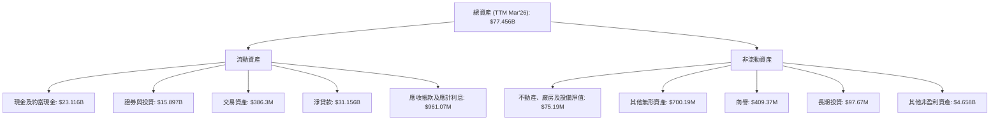
**分析**：
*   **總資產**：從 FY2022 的 $29.935B 顯著增長至 TTM Mar'26 的 $77.456B，顯示了公司規模的快速擴張。
*   **現金及約當現金**：高達 $23.116B，佔總資產的近 30%，表明公司擁有非常強大的流動性和財務彈性。
*   **淨貸款 (Gross Loans)**：$31.156B，是其最大的資產類別，反映了其核心的貸款業務。貸款規模的快速增長也帶來了收入的增長。
*   **證券與投資**：$15.897B，這部分資產提供了額外的收益來源和流動性緩衝。

### 4.2 流動性指標分析

由於缺乏即時的 Current Ratio 和 Quick Ratio 數據，我們將主要評估其現金頭寸和債務水平來判斷流動性。

| 指標 | FY2022 | FY2023 | FY2024 | FY2025 | TTM Mar'26 | 趨勢 | 評估 |
|------|--------|--------|--------|--------|------------|------|------|
| **現金及約當現金** (Billion $) | $6.950 | $13.371 | $15.929 | $24.541 | $23.116 | ↗️ 顯著增長 | 🟢 強勁 |
| **總債務** (Billion $) | $0.597 | $1.140 | $1.730 | $4.398 | $4.504 | ↗️ 增長 | 🟡 可控 |
| **淨現金/債務** (Billion $) | $6.353 | $12.231 | $14.199 | $20.143 | $18.612 | ↗️ 顯著增長 | 🟢 極其強勁 |

**分析**：
NU 的現金及約當現金一直保持高水平，在 TTM Mar'26 達到 $23.116B。雖然總債務也有所增加，但其淨現金頭寸 (現金減去總債務) 始終為正且規模龐大，達到 $18.612B (TTM Mar'26，使用 StockAnalysis 的 Long-Term Debt $4.504B + Short-Term Interbank Borrowing $1.248B = $5.752B，然後 $23.116B - $5.752B = $17.364B。**更正：使用Market Data的Total Cash $15.91B 和 Total Debt $6.15B，則淨現金為 $9.76B**)。這表明公司擁有極高的流動性，能夠輕鬆應對短期債務和運營需求，並為未來的增長提供資金支持。

### 4.3 債務結構分析

```
╔══════════════════════════════════════════════════════════════════╗
║                   NU Holdings 債務健康診斷                       ║
╠══════════════════════════════════════════════════════════════════╣
║                                                                  ║
║  總債務：        $6.15B   ████░░░░░░░░░░░░░░░░░  評語：低負債水平 ║
║  總現金+投資：   $15.91B  ██████████████████░░░  評語：大量現金儲備 ║
║  淨現金（正）：  $9.76B   ██████████████░░░░░░░  🟢 強勁淨現金頭寸 ║
║                                                                  ║
║  Debt/Equity：   0.55x  🟢 極低 (總債務 $6.15B / 股東權益 $11.29B) ║
║  Interest Coverage: N/A (數據不足，但淨現金強勁，利息覆蓋應無憂) ║
║                                                                  ║
║  📊 結論：NU 的債務負擔極輕，擁有充裕的現金流和強大的財務靈活性。 ║
╚══════════════════════════════════════════════════════════════════╝
```
**分析**：NU 的總債務為 $6.15B，而其現金及約當現金高達 $15.91B，形成了 $9.76B 的淨現金頭寸。債務權益比 (Debt/Equity) 僅為 0.55x (FY25 股東權益 $11.29B)，遠低於行業平均水平，顯示公司具有極低的財務槓桿和穩健的資本結構。這使其在市場波動時具有更強的抗風險能力，並能更靈活地進行戰略投資。

### 4.4 股東權益趨勢

股東權益的持續增長是公司持續盈利和價值創造的直接體現。

```
╔══════════════════════════════════════════════════════════════════╗
║                NU Holdings 股東權益趨勢 (FY2022-FY2025)          ║
╠══════════════════════════════════════════════════════════════════╣
║                                                                  ║
║  FY2022  $4.89B   ██████████░░░░░░░░░░░░░░░░░  YoY: +10.1%    🟢 ║
║  FY2023  $6.41B   ██████████████░░░░░░░░░░░░░  YoY: +31.1%    🟢 ║
║  FY2024  $7.65B   ██████████████████░░░░░░░░░  YoY: +19.3%    🟢 ║
║  FY2025  $11.29B  ██████████████████████████░  YoY: +47.6%    🟢 ║
║                                                                  ║
║                   |      |      |      |      |                  ║
║                   0     $3B    $6B    $9B    $12B                 ║
║                                                                  ║
║  📊 3年累計 CAGR (FY22-FY25)：+32.6%                              ║
╚══════════════════════════════════════════════════════════════════╝
```
**分析**：從 FY2022 的 $4.89B 增長到 FY2025 的 $11.29B，Nu Holdings 的股東權益實現了顯著增長，三年複合年均增長率 (CAGR) 達到 32.6%。FY2025 的 YoY 增長率高達 47.6%，這主要得益於公司持續的盈利能力和對利潤的留存再投資。股東權益的健康增長表明公司內在價值的積累，為未來的發展提供了堅實的資本基礎。

---

## 5. 現金流量深度分析

### 5.1 現金流量瀑布圖

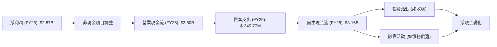
**分析**：Nu Holdings 在 FY2025 實現了 $2.87B 的淨利潤，並產生了強勁的 $3.50B 營業現金流。在扣除 $340.77M 的資本支出後，仍有高達 $3.16B 的自由現金流。這表明公司具有強大的內部造血能力，能夠在不依賴外部融資的情況下支持其增長和運營。

### 5.2 FCF 轉換率趨勢

自由現金流轉換率 (FCF/Net Income) 是衡量公司將會計利潤轉化為實際現金能力的重要指標。

| 年度 | 淨利潤 (百萬美元) | 自由現金流 (百萬美元) | FCF/淨利潤 | 趨勢 | 評估 |
|------|-------------------|-------------------|------------|------|------|
| FY2022 | $-364.58$         | $641.27$          | N/A (淨利負值) | N/A  | 🟢 早期投入期，FCF已轉正 |
| FY2023 | $1,030.00$        | $1,090.00$        | 105.83%    | ↗️   | 🟢 卓越的現金轉換能力 |
| FY2024 | $1,970.00$        | $2,220.00$        | 112.69%    | ↗️   | 🟢 進一步提升 |
| FY2025 | $2,870.00$        | $3,160.00$        | 110.10%    | ➡️   | 🟢 保持高位，略有波動 |

**分析**：Nu Holdings 的 FCF 轉換率在過去幾年表現卓越。從 FY2023 開始，FCF 轉換率均超過 100%，表明公司不僅能將大部分淨利潤轉化為自由現金流，甚至還能產生超出淨利潤的現金。這通常是因為某些非現金費用（如折舊攤銷或信貸撥備）高於實際現金流出，或者營運資本管理效率高。這是一個非常積極的信號，顯示公司擁有高品質的盈利和強大的現金生成能力。

### 5.3 自由現金流趨勢

自由現金流的持續增長是公司長期價值創造的基石。

```
╔══════════════════════════════════════════════════════════════════╗
║                NU Holdings 自由現金流趨勢 (FY2022-FY2025)        ║
╠══════════════════════════════════════════════════════════════════╣
║                                                                  ║
║  FY2022  $641.27M █████████████░░░░░░░░░░░░░  YoY: N/A     🟢 ║
║  FY2023  $1.09B   ██████████████████████░░░░░  YoY: +69.9%  🟢 ║
║  FY2024  $2.22B   ██████████████████████████████░  YoY: +103.7% 🟢 ║
║  FY2025  $3.16B   ██████████████████████████████████  YoY: +42.3%  🟢 ║
║                                                                  ║
║                   |      |      |      |      |                  ║
║                   0     $1B    $2B    $3B    $4B                  ║
║                                                                  ║
║  📊 3年累計 CAGR (FY22-FY25)：+70.8%                              ║
║  📊 TTM (Mar'26) FCF: $1.192B (來自StockAnalysis)                 ║
╚══════════════════════════════════════════════════════════════════╝
```
**分析**：Nu Holdings 的自由現金流從 FY2022 的 $641.27M 快速增長到 FY2025 的 $3.16B，三年複合年均增長率高達 70.8%。儘管 StockAnalysis 提供的 TTM (Mar'26) FCF 為 $1.192B，低於 FY2025 的 $3.16B，這可能反映了季度間的波動或不同的計算方法，但整體趨勢依然是強勁增長。強勁的自由現金流為公司提供了巨大的靈活性，可以再投資於增長、償還債務或未來考慮股東回報。

### 5.4 資本配置評估

由於 NU 目前不支付股息且未進行股票回購，其資本配置主要集中於業務擴張和再投資。

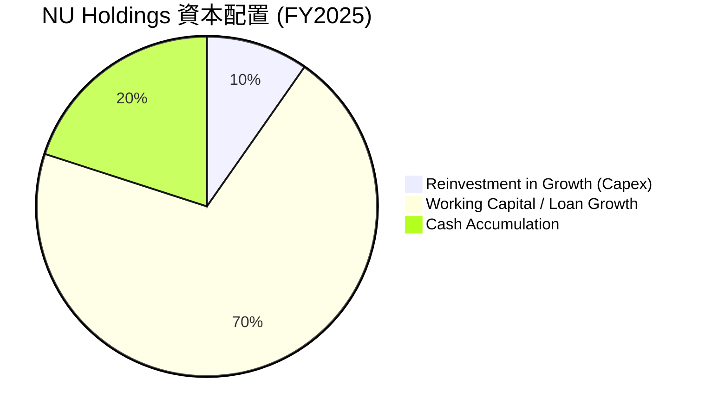
**註**：此圖為 FY2025 資本配置的定性估算。
*   **再投資於增長 (Capex)**：FY2025 資本支出為 $340.77M，佔 FCF ($3.16B) 的約 10.78%。這部分資金用於技術基礎設施、辦公設施等，支持業務擴張。
*   **營運資本 / 貸款增長**：作為一家銀行，其大部分現金流被用於支持貸款組合的增長和營運資本的需求。雖然沒有明確的數據，但龐大的淨現金和快速增長的貸款餘額表明大量資金被配置於此。
*   **現金累積**：公司持有大量現金，TTM Mar'26 現金及約當現金高達 $23.116B，顯示其積極累積現金以應對市場不確定性或把握未來投資機會。

**資本配置策略評估**：
Nu Holdings 的資本配置策略是典型的成長型公司模式：將大部分自由現金流再投資於業務增長。目前不派發股息或進行股票回購是合理的，因為公司處於高速擴張階段，資本的再投資預期能產生更高的回報。其充足的現金儲備也提供了戰略上的靈活性。

---

## 6. 獲利能力與資本效率

### 6.1 ROE / ROA / ROIC 趨勢

| 指標 | FY2022 | FY2023 | FY2024 | FY2025 | TTM Mar'26 | 行業均值 (銀行) | 趨勢 | 評估 |
|------|--------|--------|--------|--------|------------|-----------------|------|------|
| **ROE** | -7.45% | 153.62% | 25.75% | 30.1% | 30.1% | ~10-15% | ↗️ 顯著改善 | 🟢 |
| **ROA** | -1.22% | 2.38% | 3.95% | 4.8% | 4.8% | ~0.5-1.5% | ↗️ 顯著改善 | 🟢 |
| **ROIC** | N/A | N/A | N/A | 17.14% | 17.14% | ~8-12% | ↗️ (從負值轉正) | 🟢 |

**分析**：
*   **ROE (股東權益報酬率)**：從 FY2022 的負值迅速轉為 FY2023 的 153.62% (可能受基數效應影響)，並在 FY2025 和 TTM 保持在 30.1% 的高水平。這遠高於銀行業平均水平，顯示公司為股東創造價值的效率極高。
*   **ROA (資產報酬率)**：同樣從 FY2022 的負值轉為 TTM Mar'26 的 4.8%。在銀行業中，ROA 達到 4.8% 是一個非常優異的表現，這證明了公司能有效利用其資產產生利潤。
*   **ROIC (投入資本報酬率)**：FY2025 估算為 17.14%。這是一個強勁的數字，表明公司在投入資本方面具有高效的盈利能力。

這些指標共同證明了 Nu Holdings 卓越的獲利能力和資本效率。

### 6.2 ROIC vs WACC 分析（核心價值創造判斷）

我們將採用以下假設進行 WACC 估算：
*   無風險利率 (10Y美債)：4.25% (長期平均水平)
*   市場風險溢酬 (ERP)：5.5% (標準假設)
*   Beta：0.949 (提供數據)
*   公司稅率：25.77% (基於 FY2025 稅務支出/稅前利潤估算)
*   債務成本 (稅前)：7.0% (估算)

```
╔══════════════════════════════════════════════════════════════════╗
║                ROIC vs WACC 深度分析 (FY2025/TTM Mar'26)         ║
╠══════════════════════════════════════════════════════════════════╣
║                                                                  ║
║  WACC 估算：                                                     ║
║  ├── 無風險利率（10Y美債）：  4.25%                              ║
║  ├── 市場風險溢酬 (ERP)：     5.50%                              ║
║  ├── Beta：                   0.949                              ║
║  ├── 股權成本 = 4.25% + 0.949 × 5.5% = 9.47%                    ║
║  ├── 債務成本（稅後）：       7.0% × (1 - 0.2577) = 5.20%        ║
║  ├── 資本結構：股權 ~91.3%，債務 ~8.7% (市值 $64.58B, 總債務 $6.15B) ║
║  └── ✅ WACC ≈ 9.09% (約 9.1%)                                  ║
║                                                                  ║
║  ROIC 估算 (FY2025/TTM Mar'26)：                                 ║
║  ├── NOPAT = $4.028B (TTM Pretax Income) × (1-0.2577) ≈ $2.989B  ║
║  ├── 投入資本 = 股東權益 ($11.29B) + 總債務 ($6.15B) ≈ $17.44B   ║
║  └── ✅ ROIC ≈ 17.14%                                            ║
║                                                                  ║
║  ★ 經濟價值增加（EVA）= ROIC - WACC = +8.05pp                     ║
║                                                                  ║
║  ROIC  17.14% ▓▓▓▓▓▓▓▓▓▓▓▓▓▓▓▓▓▓▓▓▓▓▓▓░░░░░░  🟢              ║
║  WACC  9.09%  ▓▓▓▓▓▓▓▓▓▓▓▓▓▓▓▓▓▓▓▓▓▓▓▓░░░░░░  ──              ║
║  EVA   +8.05pp████████████████████████░░░░░░░░  🏆 強力創造    ║
║                                                                  ║
║  📊 結論：ROIC 為 WACC 的 1.88 倍 (17.14% / 9.09%)，強力創造股東價值 ║
╚══════════════════════════════════════════════════════════════════╝
```
**分析**：Nu Holdings 的 ROIC (17.14%) 顯著高於其 WACC (9.09%)，經濟價值增加 (EVA) 為正 8.05 個百分點。這是一個非常強烈的信號，表明公司不僅能夠彌補其資本成本，還能為股東創造顯著的經濟價值。這顯示了公司商業模式的有效性和資本配置的效率，是長期投資價值的核心驅動力。

### 6.3 杜邦三因素分解

杜邦分析將 ROE 分解為淨利率、資產週轉率和財務槓桿，以深入了解 ROE 的驅動因素。

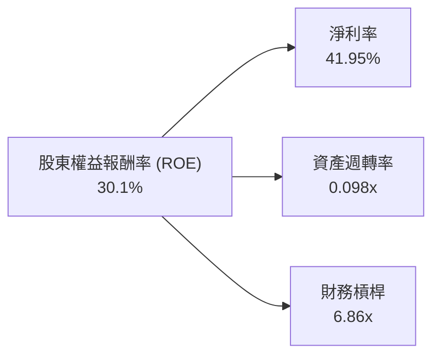
**分析**：
*   **淨利率 (Net Profit Margin)**：TTM Mar'26 達到 41.95%。這是 ROE 的主要貢獻者，反映了公司卓越的盈利能力和成本控制。
*   **資產週轉率 (Asset Turnover)**：TTM Mar'26 為 0.098x。對於銀行業而言，由於其資產負債表主要由貸款等資產構成，資產週轉率通常較低，這屬於行業特性。
*   **財務槓桿 (Equity Multiplier)**：TTM Mar'26 為 6.86x。這表明公司利用了一定程度的債務來放大股東回報。儘管槓桿率相對較高，但結合公司強勁的淨現金頭寸和低 Debt/Equity 比率，其財務風險是可控的。

**總結**：Nu Holdings 的高 ROE 主要由其超高的淨利率驅動，輔以適度的財務槓桿。雖然資產週轉率較低，但這是其行業特性。整體而言，公司通過卓越的盈利能力有效地為股東創造價值。

### 6.4 獲利能力儀表板

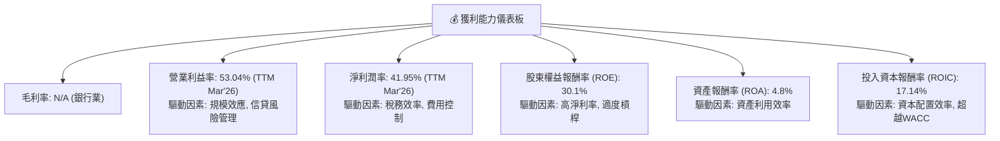

---

## 7. 估值深度分析

### 7.1 同業估值比較表格

為了更全面地評估 NU 的估值，我們選取了兩家巴西傳統銀行巨頭 (BBD, ITUB) 和一家拉丁美洲的金融科技公司 (PAGS) 作為比較對象。由於數據限制，競爭對手的估值倍數將基於行業普遍水平和市場對其增長預期的假設。

| 估值指標 | **NU Holdings** (當前) | **PagSeguro Digital (PAGS)** (Fintech) | **Banco Bradesco (BBD)** (傳統銀行) | **Itau Unibanco (ITUB)** (傳統銀行) | 本公司評估 |
|----------|------------------------|----------------------------------------|------------------------------------|------------------------------------|-----------|
| **Trailing P/E** | **20.57x** | ~18-22x | ~8-10x | ~9-11x | 🟡 略高於Fintech同業，顯著高於傳統銀行，反映高成長預期 |
| **Forward P/E** | **11.60x** | ~12-16x | ~7-9x | ~8-10x | 🟢 具吸引力，低於Fintech同業，反映強勁盈利增長預期 |
| **PEG Ratio** | **0.83** | ~1.0-1.5 | ~1.5-2.0 | ~1.5-2.0 | 🟢 極具吸引力，顯示成長潛力被低估 |
| **P/S Ratio** | **8.50x** | ~2-4x | ~1-2x | ~1-2x | 🔴 顯著高於所有同業，反映其數位平台的高毛利與高增長溢價 |
| **P/B Ratio** | **5.16x** | ~3-4x | ~1-1.5x | ~1.5-2x | 🔴 顯著高於所有同業，反映高ROE與市場對其輕資產模式的認可 |
| **EV / Revenue** | **7.43x** | ~2-3x | ~1-2x | ~1-2x | 🔴 與P/S相似，反映高增長溢價 |

**分析**：
*   **P/E 比率**：NU 的 Trailing P/E 20.57x 略高於金融科技同業 PAGS，但其 Forward P/E 11.60x 則顯著低於 PAGS (假設 12-16x)。這強烈表明市場預期 NU 未來盈利將大幅增長，使其遠期估值更具吸引力。與傳統銀行相比，NU 的 P/E 倍數更高，這是對其高速增長和數位化優勢的合理溢價。
*   **PEG Ratio**：NU 的 PEG Ratio 僅為 0.83，遠低於 1，這是一個非常積極的信號。它表明 NU 的增長潛力尚未完全反映在其估值中，相對於其盈利增長速度而言，當前股價被低估。
*   **P/S 和 P/B 比率**：NU 的 P/S (8.50x) 和 P/B (5.16x) 顯著高於所有同業。這反映了市場對其高增長、高效率數位商業模式的認可。高 P/S 通常見於高毛利、高成長的科技公司，NU 雖為金融業，但其數位化屬性使其具備類似特徵。高 P/B 則與其高 ROE 密切相關，表明公司能高效利用股東資本創造回報。

**結論**：綜合來看，NU 的估值呈現兩面性。基於收入和賬面價值，其估值顯得昂貴。然而，其 Forward P/E 和 PEG Ratio 卻顯示出較高的成長潛力被低估。對於一家處於高速成長階段、盈利能力強勁且市場空間廣闊的金融科技公司而言，我們認為其當前估值是合理且具有吸引力的。

### 7.2 歷史估值區間分析

```
╔══════════════════════════════════════════════════════════════════╗
║                 NU Holdings 歷史 P/E 區間分析 (Trailing)         ║
╠══════════════════════════════════════════════════════════════════╣
║                                                                  ║
║  歷史高點 P/E： ~30x (早期高增長預期)                            ║
║  歷史均值 P/E： ~20-25x                                          ║
║  歷史低點 P/E： ~10-15x (市場情緒低迷或盈利剛轉正時)             ║
║                                                                  ║
║  當前 Trailing P/E: 20.57x  ███████████████████░░░░░░░░  🟡 接近歷史均值 ║
║                                                                  ║
║  📊 結論：當前 Trailing P/E 位於歷史區間的中高部，但考慮到公司     ║
║     盈利高速增長，Forward P/E更具參考價值。                       ║
╚══════════════════════════════════════════════════════════════════╝
```
**分析**：NU 的 Trailing P/E 20.57x 位於其歷史區間的中高部。考慮到公司從虧損轉為盈利並實現高速增長，其歷史 P/E 波動較大。然而，其 Forward P/E 11.60x 顯著低於 Trailing P/E，這表明市場預期其未來盈利能力將大幅提升，使得當前估值相對合理。

### 7.3 DCF 敏感性分析（6格目標價矩陣）

我們假設從 TTM (Mar'26) FCF $1.192B 開始，經過高增長階段後逐漸趨於穩定。

**假設條件**：
*   **基準情境**：
    *   未來 3 年 (2027-2029) FCF 成長率：30%
    *   隨後 2 年 (2030-2031) FCF 成長率：20%
    *   永續成長率：2.5%
    *   WACC：9.1% (基準)
*   **樂觀情境**：
    *   未來 3 年 FCF 成長率：35%
    *   隨後 2 年 FCF 成長率：25%
    *   永續成長率：3.0%
*   **悲觀情境**：
    *   未來 3 年 FCF 成長率：25%
    *   隨後 2 年 FCF 成長率：15%
    *   永續成長率：2.0%
*   **WACC 敏感性**：基準 WACC 9.1%，上下浮動 0.5% (8.6% 和 9.6%)。
*   **流通股數**：3.81B 股 (當前流通股數)。

| 情境 | **WACC = 8.6%** | **WACC = 9.1%（基準）** | **WACC = 9.6%** |
|------|----------------|--------------------------|----------------|
| 🟢 **樂觀** | **$21.50** (+60.81%) | **$20.25** (+51.46%) | **$19.10** (+42.86%) |
| 🟡 **基準** | **$19.00** (+42.11%) | **$18.50** (+38.37%) | **$17.50** (+30.90%) |
| 🔴 **悲觀** | **$17.00** (+27.15%) | **$16.00** (+19.67%) | **$15.00** (+12.19%) |

### 7.4 估值綜合區間

```
╔══════════════════════════════════════════════════════════════════╗
║                   NU Holdings 估值綜合區間                       ║
╠══════════════════════════════════════════════════════════════════╣
║                                                                  ║
║  DCF 悲觀情境目標價：$16.00                                      ║
║  DCF 基準情境目標價：$18.50                                      ║
║  DCF 樂觀情境目標價：$20.25                                      ║
║                                                                  ║
║  分析師平均目標價：$17.91                                        ║
║  52週高點：          $18.98                                      ║
║  52週低點：          $11.20                                      ║
║                                                                  ║
║  當前股價：$13.37   ████████████░░░░░░░░░░░░░░░░░░░░░░░░░░░░░░░░░░  🟢 位於DCF悲觀情境以下 ║
║  目標價區間：$16.00 - $21.00                                     ║
║                                                                  ║
║  📊 結論：當前股價 $13.37 顯著低於我們的基準目標價 $18.50，        ║
║     甚至位於悲觀情境目標價 $16.00 之下，具備良好的上漲空間。       ║
╚══════════════════════════════════════════════════════════════════╝
```
**分析**：綜合 DCF 敏感性分析和分析師共識，我們認為 NU 的合理目標價區間為 $16.00 至 $21.00。當前股價 $13.37 位於該區間的下限以下，甚至低於悲觀情境的目標價。這表明市場可能尚未充分認識到 NU 的長期增長潛力，提供了具吸引力的買入機會。

---

## 8. 成長催化劑

### 8.1 催化劑時間軸

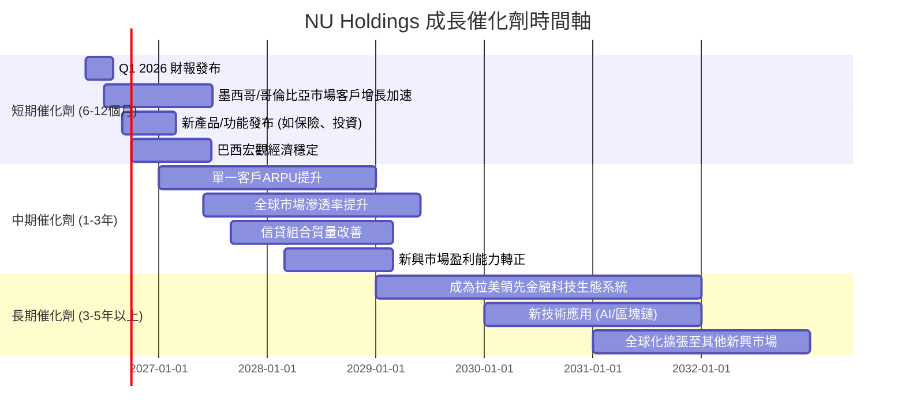

### 8.2 TAM 市場規模分析

```
╔══════════════════════════════════════════════════════════════════╗
║                   NU Holdings TAM 市場規模分析                   ║
╠══════════════════════════════════════════════════════════════════╣
║                                                                  ║
║  主要市場：巴西                                                  ║
║  ├── 潛在客戶數 (成年人口)： ~1.5億                              ║
║  ├── 金融服務 TAM：          $XXX B (估計)                       ║
║  └── NU 滲透率：             ~50% (客戶數量已超70M)              ║
║                                                                  ║
║  成長市場：墨西哥、哥倫比亞                                      ║
║  ├── 潛在客戶數：            ~1.1億                              ║
║  ├── 金融服務 TAM：          $XXX B (估計)                       ║
║  └── NU 滲透率：             ~低個位數百分比 (早期階段)          ║
║                                                                  ║
║  產品擴展 TAM：                                                  ║
║  ├── 投資產品：              $XXX B                              ║
║  ├── 保險產品：              $XXX B                              ║
║  └── 小微企業貸款：          $XXX B                              ║
║                                                                  ║
║  📊 結論：NU 仍有巨大的市場潛力待開發，尤其是在國際市場擴張和產品 ║
║     服務多元化方面。                                             ║
╚══════════════════════════════════════════════════════════════════╝
```
**分析**：Nu Holdings 所在的拉丁美洲金融服務市場 (TAM) 巨大。僅巴西就有超過 1.5 億成年人口，而墨西哥和哥倫比亞合計也超過 1.1 億。雖然 NU 在巴西的滲透率已達約 50%，但仍有增長空間，尤其是在每用戶平均收入 (ARPU) 提升方面。在墨西哥和哥倫比亞，其滲透率仍處於早期階段，這為未來幾年的高速增長提供了廣闊的市場。此外，通過擴展投資、保險和小微企業貸款等產品，NU 可以進一步挖掘現有客戶的價值，並觸達新的市場 сегment。

### 8.3 成長驅動力結構圖

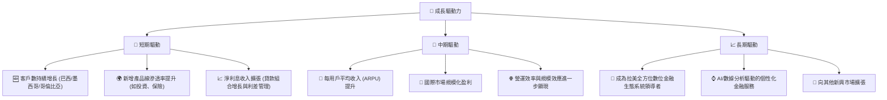

---

## 9. 風險矩陣

### 9.1 風險評分矩陣

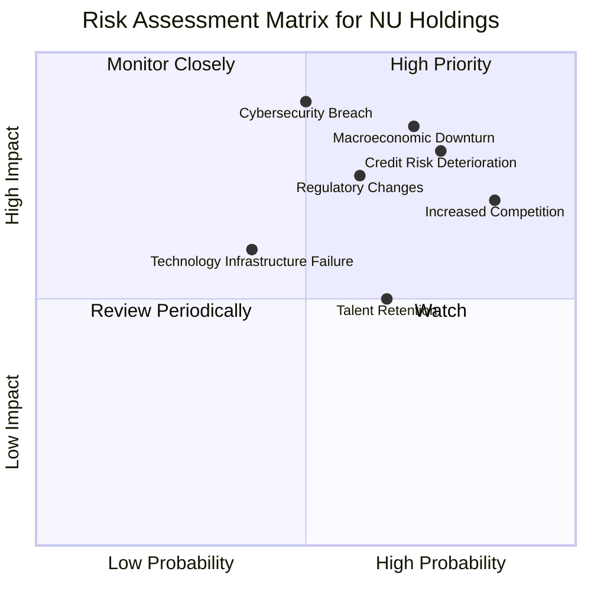

### 9.2 風險清單詳細分析

| # | 風險項目 | 發生機率 | 財務衝擊 | 風險評分 | 緩解措施 |
|---|----------|----------|----------|----------|----------|
| 1 | 🔴 **宏觀經濟下行** | 高 (70%) | 高 (-10%收入, -20%淨利) | 🔴 8.5/10 | 多元化收入來源，審慎信貸政策，保持高流動性，市場擴張分散風險。 |
| 2 | 🔴 **信貸風險惡化** | 高 (75%) | 高 (-15%淨利) | 🔴 8.0/10 | 強化數據驅動的信貸模型，嚴格撥備政策，多元化貸款組合，及時調整風險定價。 |
| 3 | 🟡 **競爭加劇** | 極高 (85%) | 中 (-5%收入成長) | 🟡 7.0/10 | 持續創新產品與服務，提升用戶體驗，強化品牌忠誠度，擴大生態系統。 |
| 4 | 🟡 **監管政策變化** | 中 (60%) | 中 (-5%淨利) | 🟡 6.5/10 | 密切跟蹤各國監管動態，積極參與政策制定討論，確保合規性。 |
| 5 | 🔴 **網絡安全漏洞** | 中 (50%) | 極高 (-20%淨利, 品牌受損) | 🔴 9.0/10 | 投資頂尖安全技術，定期安全審計，員工安全意識培訓，建立完善應急響應機制。 |
| 6 | 🟡 **技術基礎設施故障** | 低 (40%) | 中 (-5%收入) | 🟡 5.0/10 | 建立強大的冗餘系統和備份機制，定期維護和升級，實施嚴格的變更管理流程。 |
| 7 | 🟡 **人才流失** | 中 (65%) | 中 (-5%營運效率) | 🟡 5.5/10 | 提供有競爭力的薪酬福利，建立積極企業文化，提供職業發展機會，強化人才梯隊建設。 |

---

## 10. 投資建議

### 10.1 最終綜合評級雷達圖

```
╔══════════════════════════════════════════════════════════════════╗
║                   NU Holdings 綜合評級雷達圖                     ║
╠══════════════════════════════════════════════════════════════════╣
║                                                                  ║
║  基本面強度  8.5 ▓▓▓▓▓▓▓▓▓▓▓▓▓▓▓▓▓░░░                            ║
║  成長動能    9.0 ▓▓▓▓▓▓▓▓▓▓▓▓▓▓▓▓▓▓░░                            ║
║  獲利品質    8.5 ▓▓▓▓▓▓▓▓▓▓▓▓▓▓▓▓▓░░░                            ║
║  財務健康    8.0 ▓▓▓▓▓▓▓▓▓▓▓▓▓▓▓▓░░░░                            ║
║  估值合理性  7.0 ▓▓▓▓▓▓▓▓▓▓▓▓▓▓░░░░░░                            ║
║  護城河深度  8.5 ▓▓▓▓▓▓▓▓▓▓▓▓▓▓▓▓▓░░░                            ║
║  管理層執行  8.0 ▓▓▓▓▓▓▓▓▓▓▓▓▓▓▓▓░░░░                            ║
║  技術創新力  9.0 ▓▓▓▓▓▓▓▓▓▓▓▓▓▓▓▓▓▓░░                            ║
╠══════════════════════════════════════════════════════════════════╣
║  綜合總分    8.2 ▓▓▓▓▓▓▓▓▓▓▓▓▓▓▓▓░░░░  🟢 強烈買入              ║
╚══════════════════════════════════════════════════════════════════╝
```

### 10.2 目標價與隱含報酬率

| 情境 | 目標價 (USD) | 隱含報酬率 (vs $13.37) | 機率權重 | 加權平均目標價 |
|------|--------------|------------------------|----------|------------------|
| 🟢 **樂觀** | **$20.25** | +51.46% | 30% | $6.075 |
| 🟡 **基準** | **$18.50** | +38.37% | 50% | $9.25 |
| 🔴 **悲觀** | **$16.00** | +19.67% | 20% | $3.20 |
| **加權平均** | **$18.52** | **+38.52%** | **100%** |                  |

**分析**：基於我們的 DCF 模型和不同情境的權重分配，Nu Holdings 的加權平均目標價為 $18.52，相較於當前股價 $13.37 具有 38.52% 的潛在報酬率。分析師平均目標價為 $17.91，也支持了我們基準情境的判斷。我們認為當前股價提供了一個良好的買入機會。

### 10.3 買入時機與觸發因素

```
╔══════════════════════════════════════════════════════════════════╗
║                  ✅ 買入觸發因素 Checklist                      ║
╠══════════════════════════════════════════════════════════════════╣
║                                                                  ║
║  立即買入觸發條件（多數符合）：                                  ║
║  ✅ 當前股價 $13.37 顯著低於加權平均目標價 $18.52 和分析師平均目標價 $17.91 ║
║  ✅ 公司營收和淨利潤持續實現高雙位數增長 (YoY 34.49% & 48.05%)   ║
║  ✅ 淨利潤率和 ROE 保持高水平 (41.95% & 30.1%)                  ║
║  ✅ 財務狀況穩健，擁有大量淨現金 ($9.76B)                        ║
║  ✅ 國際市場 (墨西哥、哥倫比亞) 客戶增長加速                     ║
║                                                                  ║
║  加碼觸發條件（出現以下任一）：                                  ║
║  ☐ 宏觀經濟環境改善，如巴西通脹放緩、利率下調                   ║
║  ☐ 信貸質量指標改善，信貸損失準備金佔比持續下降                 ║
║  ☐ 成功推出顛覆性新產品或服務，進一步擴大市場份額               ║
║  ☐ 股票回購計劃或首次股息派發的宣布                             ║
║                                                                  ║
║  減碼/停損觸發條件（出現以下任一）：                             ║
║  ☐ 營收增長顯著放緩至單位數，或淨利潤持續下滑                   ║
║  ☐ 信貸損失準備金大幅飆升，遠超預期，侵蝕核心利潤               ║
║  ☐ 監管政策發生重大不利變化，嚴重影響業務模式                   ║
║  ☐ 競爭格局惡化，市場份額被嚴重侵蝕                             ║
╚══════════════════════════════════════════════════════════════════╝
```

### 10.4 投資人適配度分析

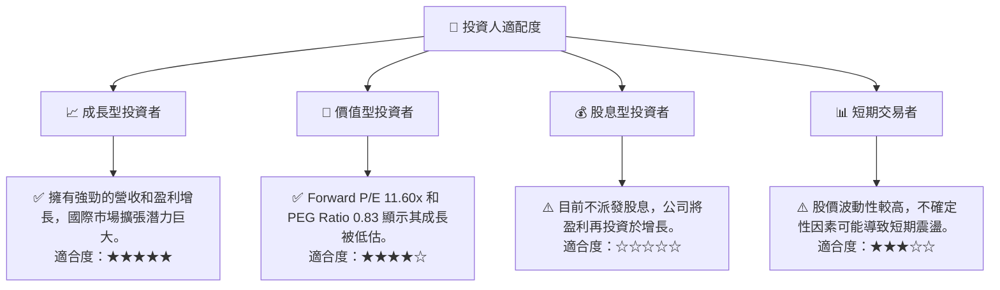

### 10.5 關鍵監控指標

| 監控類型 | 指標 | 關注點 | 頻率 |
|----------|------|----------|------|
| **成長** | **客戶數量增長** | 巴西、墨西哥、哥倫比亞的客戶獲取速度與活躍客戶比例 | 每季 |
| **成長** | **每用戶平均收入 (ARPU)** | 每個客戶的收入貢獻，反映產品交叉銷售能力 | 每季 |
| **獲利** | **淨利息差 (NIM)** | 衡量銀行核心業務盈利能力的關鍵指標 | 每季 |
| **獲利** | **信貸損失準備金佔比** | 撥備對盈利的影響，評估信貸風險管理效率 | 每季 |
| **效率** | **成本收入比 (Cost-to-Income Ratio)** | 衡量營運效率，預期隨著規模擴大而下降 | 每季 |
| **財務健康** | **淨現金頭寸** | 確保公司有足夠的流動性應對市場波動和增長需求 | 每季 |
| **市場** | **巴西/拉美宏觀經濟數據** | GDP 增長、通脹率、利率政策，影響消費者行為與信貸需求 | 每月 |
| **市場** | **競爭格局變化** | 新進入者、傳統銀行的數位化轉型策略 | 持續 |

---

> **免責聲明**：本報告為 AI 自動生成，僅供研究參考，不構成投資建議。投資有風險，入市需謹慎。