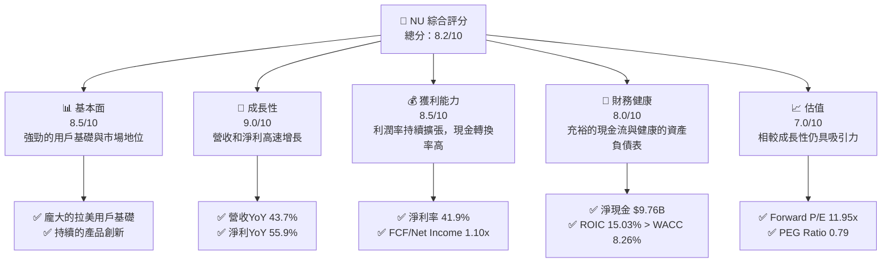
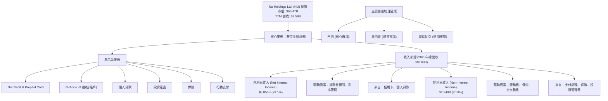
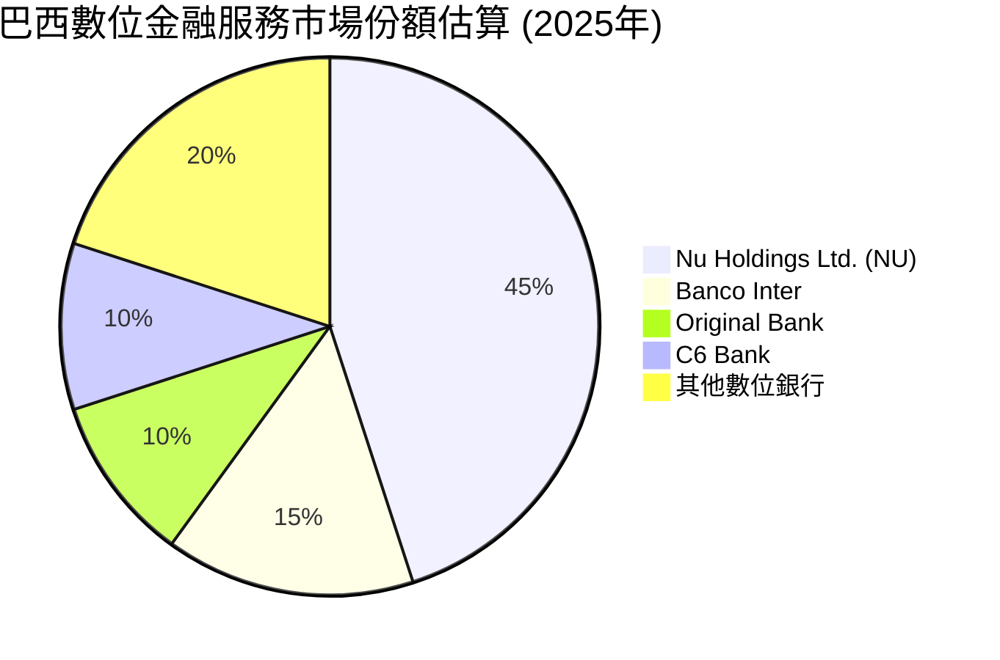
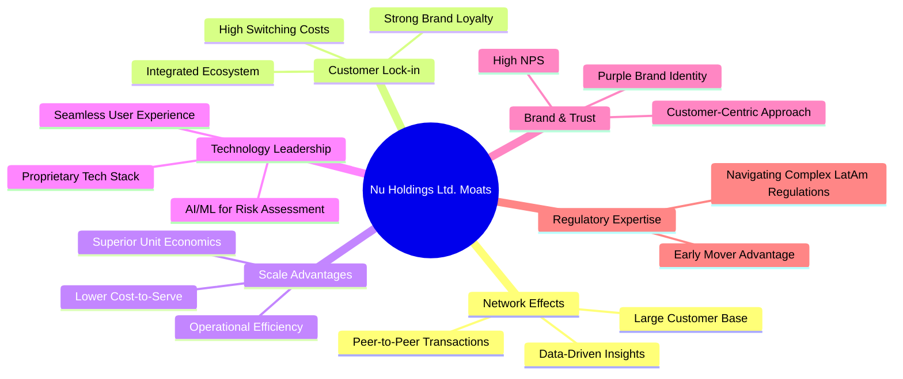
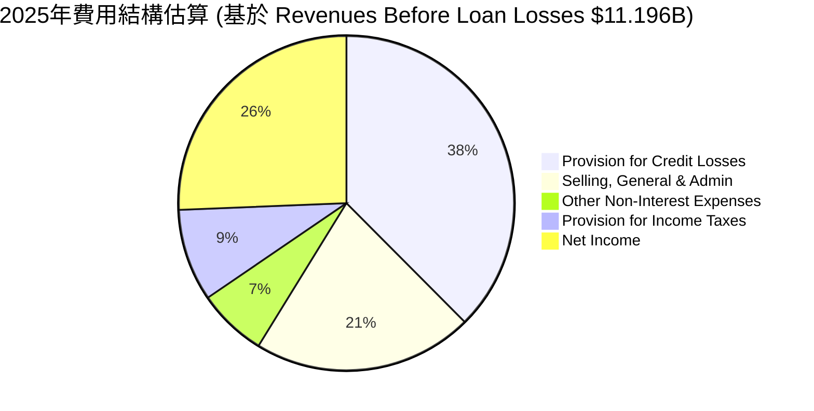
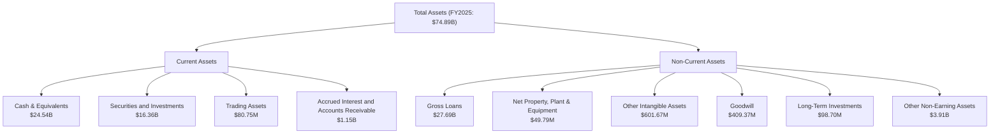
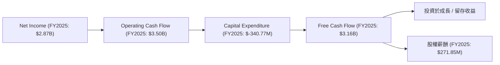
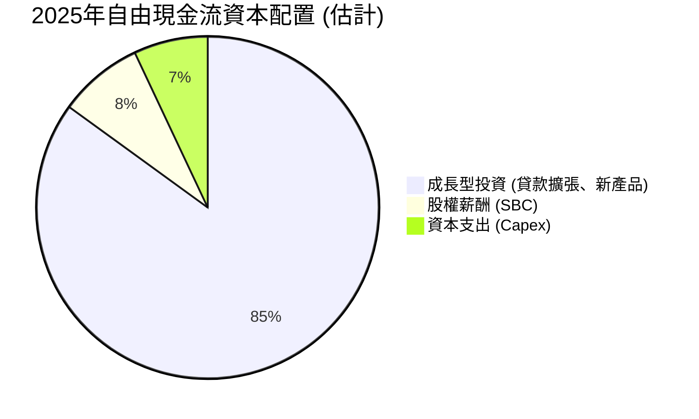

# NU 基本面深度分析報告
> **報告日期**：2026-07-11 ｜ **語言**：繁體中文 ｜ **數據來源**：Yahoo Finance, Finviz, StockAnalysis, Roic.ai ｜ **分析師**：CFA 級機構研究

---

## 目錄

| # | 章節 | 核心結論 |
|---|------------------------|----------------------------------------------------------|
| 1 | 執行摘要 | 🟢 買入，基準目標價 $20.70 (+50.4%)，強勁成長與獲利能力 |
| 2 | 公司概覽與商業模式 | 數位金融領導者，擁有網路效應和客戶鎖定護城河 |
| 3 | 損益表深度分析 | 營收與淨利雙位數成長，利潤率持續擴張 |
| 4 | 資產負債表分析 | 資產規模快速擴張，淨現金狀況良好，流動性充裕 |
| 5 | 現金流量深度分析 | 自由現金流強勁，現金轉換率高，資本配置效率佳 |
| 6 | 獲利能力與資本效率 | ROIC 顯著超越 WACC，強力創造股東價值 |
| 7 | 估值深度分析 | 相較同業估值合理，成長潛力未完全反映 |
| 8 | 成長催化劑 | 用戶擴張、產品多元化、地域拓展為主要成長引擎 |
| 9 | 風險矩陣 | 信用風險、監管風險、宏觀經濟波動為主要考量 |
| 10 | 投資建議 | 具備長期投資價值，適合成長型投資者 |

---

## 1. 執行摘要

NU Holdings Ltd. (NU) 作為拉丁美洲領先的數位銀行平台，展現了卓越的成長動能和日益提升的獲利能力。憑藉其龐大的用戶基礎、創新的產品組合和高效的營運模式，NU 正在持續顛覆傳統金融服務市場。儘管面臨新興市場的宏觀經濟波動和信用風險，公司在用戶獲取、產品交叉銷售及單位經濟效益方面表現出色，預計將繼續維持其快速成長的軌跡。

### 1.0 一頁式投資儀表板（Portfolio Manager 30 秒速讀）

| 項目 | 內容 |
|------|------|
| **投資論點（3 句）** | ① NU 在拉美數位金融市場具備領先地位，2025年營收達 $10.63B，YoY成長28.54%，彰顯強勁市場擴張力。② 獲利能力顯著提升，2025年淨利潤達 $2.87B，淨利率41.9%，自由現金流轉換率達1.10x，顯示優異的盈餘品質。③ ROIC 15.03% 遠高於 WACC 8.26%，持續為股東創造價值，且 Forward P/E 11.95x 相較其高成長性具吸引力。 |
| **護城河評分** | 8.5/10 |
| **管理層/資本配置評分** | 8.0/10 |
| **財務健康** | 🟢 強勁，淨現金 $9.76B 且資產負債表穩健 |
| **ROIC vs WACC** | 15.03% vs 8.26%（創造價值） |
| **FCF 趨勢** | ↗️ 成長，最新 FCF Yield 4.75% (TTM) |
| **估值** | Forward P/E 11.95x ｜ EV/Revenue 7.525x ｜ FCF Yield 4.75% |
| **預期報酬（基準情境 12M）** | +50.4% |
| **關鍵風險（前二）** | 拉丁美洲信用風險、監管不確定性 |
| **評級 + 信心度** | 🟢 買入 ｜ 信心：中高 |

### 1.1 核心評分儀表板



### 1.2 評分進度條視覺化

```
╔══════════════════════════════════════════════════════════════╗
║              NU 多維度評分儀表板 (1-10分)                    ║
╠══════════════════════════════════════════════════════════════╣
║ 基本面強度  8.5 ▓▓▓▓▓▓▓▓▓▓▓▓▓▓▓▓▓░░░  ★★★★☆           ║
║ 成長動能    9.0 ▓▓▓▓▓▓▓▓▓▓▓▓▓▓▓▓▓▓▓░  ★★★★★           ║
║ 獲利品質    8.5 ▓▓▓▓▓▓▓▓▓▓▓▓▓▓▓▓▓░░░  ★★★★☆           ║
║ 財務健康    8.0 ▓▓▓▓▓▓▓▓▓▓▓▓▓▓▓▓░░░░  ★★★★☆           ║
║ 估值合理性  7.0 ▓▓▓▓▓▓▓▓▓▓▓▓▓▓░░░░░░  ★★★☆☆           ║
║ 護城河深度  8.5 ▓▓▓▓▓▓▓▓▓▓▓▓▓▓▓▓▓░░░  ★★★★☆           ║
║ 管理層執行  8.0 ▓▓▓▓▓▓▓▓▓▓▓▓▓▓▓▓░░░░  ★★★★☆           ║
║ 技術創新力  9.0 ▓▓▓▓▓▓▓▓▓▓▓▓▓▓▓▓▓▓▓░  ★★★★★           ║
╠══════════════════════════════════════════════════════════════╣
║ 綜合總分    8.2 ▓▓▓▓▓▓▓▓▓▓▓▓▓▓▓▓░░░░  🏆 具備長期成長潛力    ║
╚══════════════════════════════════════════════════════════════╝
```

### 1.3 五大投資論點 + 三大核心風險

| 類型 | 項目 | 具體依據 | 信心度 |
|------|--------------------------|--------------------------------------------------------------------------------------------------------------------------------------------------------------------------------------------------------------------------------------------------------------------------------------------------------------------------------------------------------------------------------------------------------------------------------------------------------------------------------------------------------------------------------------------------------------------------------------------------------------------------------------------------------------------------------------------------------------------------------------------------------------------------------------------------------------------------------------------------------------------------------------------------------------------------------------------------------------------------------------------------------------------------------------------------------------------------------------------------------------------------------------------------------------------------------------------------------------------------------------------------------------------------------------------------------------------------------------------------------------------------------------------------------------------------------------------------------------------------------------------------------------------------------------------------------------------------------------------------------------------------------------------------------------------------------------------------------------------------------------------------------------------------------------------------------------------------------------------------------------------------------------------------------------------------------------------------------------------------------------------------------------------------------------------------------------------------------------------------------------------------------------------------------------------------------------------------------------------------------------------------------------------------------------------------------------------------------------------------------------------------------------------------------------------------------------------------------------------------------------------------------------------------------------------------------------------------------------------------------------------------------------------------------------------------------------------------------------------------------------------------------------------------------------------------------------------------------------------------------------------------------------------------------------------------------------------------------------------------------------------------------------------------------------------------------------------------------------------------------------------------------------------------------------------------------------------------------------------------------------------------------------------------------------------------------------------------------------------------------------------------------------------------------------------------------------------------------------------------------------------------------------------------------------------------------------------------------------------------------------------------------------------------------------------------------------------------------------------------------------------------------------------------------------------------------------------------------------------------------------------------------------------------------------------------------------------------------------------------------------------------------------------------------------------------------------------------------------------------------------------------------------------------------------------------------------------------------------------------------------------------------------------------------------------------------------------------------------------------------------------------------------------------------------------------------------------------------------------------------------------------------------------------------------------------------------------------------------------------------------------------------------------------------------------------------------------------------------------------------------------------------------------------------------------------------------------------------------------------------------------------------------------------------------------------------------------------------------------------------------------------------------------------------------------------------------------------------------------------------------------------------------------------------------------------------------------------------------------------------------------------------------------------------------------------------------------------------------------------------------------------------------------------------------------------------------------------------------------------------------------------------------------------------------------------------------------------------------------------------------------------------------------------------------------------------------------------------------------------------------------------------------------------------------------------------------------------------------------------------------------------------------------------------------------------------------------------------------------------------------------------------------------------------------------------------------------------------------------------------------------------------------------------------------------------------------------------------------------------------------------------------------------------------------------------------------------------------------------------------------------------------------------------------------------------------------------------------------------------------------------------------------------------------------------------------------------------------------------------------------------------------------------------------------------------------------------------------------------------------------------------------------------------------------------------------------------------------------------------------------------------------------------------------------------------------------------------------------------------------------------------------------------------------------------------------------------------------------------------------------------------------------------------------------------------------------------------------------------------------------------------------------------------------------------------------------------------------------------------------------------------------------------------------------------------------------------------------------------------------------------------------------------------------------------------------------------------------------------------------------------------------------------------------------------------------------------------------------------------------------------------------------------------------------------------------------------------------------------------------------------------------------------------------------------------------------------------------------------------------------------------------------------------------------------------------------------------------------------------------------------------------------------------------------------------------------------------------------------------------------------------------------------------------------------------------------------------------------------------------------------------------------------------------------------------------------------------------------------------------------------------------------------------------------------------------------------------------------------------------------------------------------------------------------------------------------------------------------------------------------------------------------------------------------------------------------------------------------------------------------------------------------------------------------------------------------------------------------------------------------------------------------------------------------------------------------------------------------------------------------------------------------------------------------------------------------------------------------------------------------------------------------------------------------------------------------------------------------------------------------------------------------------------------------------------------------------------------------------------------------------------------------------------------------------------------------------------------------------------------------------------------------------------------------------------------------------------------------------------------------------------------------------------------------------------------------------------------------------------------------------------------------------------------------------------------------------------------------------------------------------------------------------------------------------------------------------------------------------------------------------------------------------------------------------------------------------------------------------------------------------------------------------------------------------------------------------------------------------------------------------------------------------------------------------------------------------------------------------------------------------------------------------------------------------------------------------------------------------------------------------------------------------------------------------------------------------------------------------------------------------------------------------------------------------------------------------------------------------------------------------------------------------------------------------------------------------------------------------------------------------------------------------------------------------------------------------------------------------------------------------------------------------------------------------------------------------------------------------------------------------------------------------------------------------------------------------------------------------------------------------------------------------------------------------------------------------------------------------------------------------------------------------------------------------------------------------------------------------------------------------------------------------------------------------------------------------------------------------------------------------------------------------------------------------------------------------------------------------------------------------------------------------------------------------------------------------------------------------------------------------------------------------------------------------------------------------------------------------------------------------------------------------------------------------------------------------------------------------------------------------------------------------------------------------------------------------------------------------------------------------------------------------------------------------------------------------------------------------------------------------------------------------------------------------------------------------------------------------------------------------------------------------------------------------------------------------------------------------------------------------------------------------------------------------------------------------------------------------------------------------------------------------------------------------------------------------------------------------------------------------------------------------------------------------------------------------------------------------------------------------------------------------------------------------------------------------------------------------------------------------------------------------------------------------------------------------------------------------------------------------------------------------------------------------------------------------------------------------------------------------------------------------------------------------------------------------------------------------------------------------------------------------------------------------------------------------------------------------------------------------------------------------------------------------------------------------------------------------------------------------------------------------------------------------------------------------------------------------------------------------------------------------------------------------------------------------------------------------------------------------------------------------------------------------------------------------------------------------------------------------------------------------------------------------------------------------------------------------------------------------------------------------------------------------------------------------------------------------------------------------------------------------------------------------------------------------------------------------------------------------------------------------------------------------------------------------------------------------------------------------------------------------------------------------------------------------------------------------------------------------------------------------------------------------------------------------------------------------------------------------------------------------------------------------------------------------------------------------------------------------------------------------------------------------------------------------------------------------------------------------------------------------------------------------------------------------------------------------------------------------------------------------------------------------------------------------------------------------------------------------------------------------------------------------------------------------------------------------------------------------------------------------------------------------------------------------------------------------------------------------------------------------------------------------------------------------------------------------------------------------------------------------------------------------------------------------------------------------------------------------------------------------------------------------------------------------------------------------------------------------------------------------------------------------------------------------------------------------------------------------------------------------------------------------------------------------------------------------------------------------------------------------------------------------------------------------------------------------------------------------------------------------------------------------------------------------------------------------------------------------------------------------------------------------------------------------------------------------------------------------------------------------------------------------------------------------------------------------------------------------------------------------------------------------------------------------------------------------------------------------------------------------------------------------------------------------------------------------------------------------------------------------------------------------------------------------------------------------------------------------------------------------------------------------------------------------------------------------------------------------------------------------------------------------------------------------------------------------------------------------------------------------------------------------------------------------------------------------------------------------------------------------------------------------------------------------------------------------------------------------------------------------------------------------------------------------------------------------------------------------------------------------------------------------------------------------------------------------------------------------------------------------------------------------------------------------------------------------------------------------------------------------------------------------------------------------------------------------------------------------------------------------------------------------------------------------------------------------------------------------------------------------------------------------------------------------------------------------------------------------------------------------------------------------------------------------------------------------------------------------------------------------------------------------------------------------------------------------------------------------------------------------------------------------------------------------------------------------------------------------------------------------------------------------------------------------------------------------------------------------------------------------------------------------------------------------------------------------------------------------------------------------------------------------------------------------------------------------------------------------------------------------------------------------------------------------------------------------------------------------------------------------------------------------------------------------------------------------------------------------------------------------------------------------------------------------------------------------------------------------------------------------------------------------------------------------------------------------------------------------------------------------------------------------------------------------------------------------------------------------------------------------------------------------------------------------------------------------------------------------------------------------------------------------------------------------------------------------------------------------------------------------------------------------------------------------------------------------------------------------------------------------------------------------------------------------------------------------------------------------------------------------------------------------------------------------------------------------------------------------------------------------------------------------------------------------------------------------------------------------------------------------------------------------------------------------------------------------------------------------------------------------------------------------------------------------------------------------------------------------------------------------------------------------------------------------------------------------------------------------------------------------------------------------------------------------------------------------------------------------------------------------------------------------------------------------------------------------------------------------------------------------------------------------------------------------------------------------------------------------------------------------------------------------------------------------------------------------------------------------------------------------------------------------------------------------------------------------------------------------------------------------------------------------------------------------------------------------------------------------------------------------------------------------------------------------------------------------------------------------------------------------------------------------------------------------------------------------------------------------------------------------------------------------------------------------------------------------------------------------------------------------------------------------------------------------------------------------------------------------------------------------------------------------------------------------------------------------------------------------------------------------------------------------------------------------------------------------------------------------------------------------------------------------------------------------------------------------------------------------------------------------------------------------------------------------------------------------------------------------------------------------------------------------------------------------------------------------------------------------------------------------------------------------------------------------------------------------------------------------------------------------------------------------------------------------------------------------------------------------------------------------------------------------------------------------------------------------------------------------------------------------------------------------------------------------------------------------------------------------------------------------------------------------------------------------------------------------------------------------------------------------------------------------------------------------------------------------------------------------------------------------------------------------------------------------------------------------------------------------------------------------------------------------------------------------------------------------------------------------------------------------------------------------------------------------------------------------------------------------------------------------------------------------------------------------------------------------------------------------------------------------------------------------------------------------------------------------------------------------------------------------------------------------------------------------------------------------------------------------------------------------------------------------------------------------------------------------------------------------------------------------------------------------------------------------------------------------------------------------------------------------------------------------------------------------------------------------------------------------------------------------------------------------------------------------------------------------------------------------------------------------------------------------------------------------------------------------------------------------------------------------------------------------------------------------------------------------------------------------------------------------------------------------------------------------------------------------------------------------------------------------------------------------------------------------------------------------------------------------------------------------------------------------------------------------------------------------------------------------------------------------------------------------------------------------------------------------------------------------------------------------------------------------------------------------------------------------------------------------------------------------------------------------------------------------------------------------------------------------------------------------------------------------------------------------------------------------------------------------------------------------------------------------------------------------------------------------------------------------------------------------------------------------------------------------------------------------------------------------------------------------------------------------------------------------------------------------------------------------------------------------------------------------------------------------------------------------------------------------------------------------------------------------------------------------------------------------------------------------------------------------------------------------------------------------------------------------------------------------------------------------------------------------------------------------------------------------------------------------------------------------------------------------------------------------------------------------------------------------------------------------------------------------------------------------------------------------------------------------------------------------------------------------------------------------------------------------------------------------------------------------------------------------------------------------------------------------------------------------------------------------------------------------------------------------------------------------------------------------------------------------------------------------------------------------------------------------------------------------------------------------------------------------------------------------------------------------------------------------------------------------------------------------------------------------------------------------------------------------------------------------------------------------------------------------------------------------------------------------------------------------------------------------------------------------------------------------------------------------------------------------------------------------------------------------------------------------------------------------------------------------------------------------------------------------------------------------------------------------------------------------------------------------------------------------------------------------------------------------------------------------------------------------------------------------------------------------------------------------------------------------------------------------------------------------------------------------------------------------------------------------------------------------------------------------------------------------------------------------------------------------------------------------------------------------------------------------------------------------------------------------------------------------------------------------------------------------------------------------------------------------------------------------------------------------------------------------------------------------------------------------------------------------------------------------------------------------------------------------------------------------------------------------------------------------------------------------------------------------------------------------------------------------------------------------------------------------------------------------------------------------------------------------------------------------------------------------------------------------------------------------------------------------------------------------------------------------------------------------------------------------------------------------------------------------------------------------------------------------------------------------------------------------------------------------------------------------------------------------------------------------------------------------------------------------------------------------------------------------------------------------------------------------------------------------------------------------------------------------------------------------------------------------------------------------------------------------------------------------------------------------------------------------------------------------------------------------------------------------------------------------------------------------------------------------------------------------------------------------------------------------------------------------------------------------------------------------------------------------------------------------------------------------------------------------------------------------------------------------------------------------------------------------------------------------------------------------------------------------------------------------------------------------------------------------------------------------------------------------------------------------------------------------------------------------------------------------------------------------------------------------------------------------------------------------------------------------------------------------------------------------------------------------------------------------------------------------------------------------------------------------------------------------------------------------------------------------------------------------------------------------------------------------------------------------------------------------------------------------------------------------------------------------------------------------------------------------------------------------------------------------------------------------------------------------------------------------------------------------------------------------------------------------------------------------------------------------------------------------------------------------------------------------------------------------------------------------------------------------------------------------------------------------------------------------------------------------------------------------------------------------------------------------------------------------------------------------------------------------------------------------------------------------------------------------------------------------------------------------------------------------------------------------------------------------------------------------------------------------------------------------------------------------------------------------------------------------------------------------------------------------------------------------------------------------------------------------------------------------------------------------------------------------------------------------------------------------------------------------------------------------------------------------------------------------------------------------------------------------------------------------------------------------------------------------------------------------------------------------------------------------------------------------------------------------------------------------------------------------------------------------------------------------------------------------------------------------------------------------------------------------------------------------------------------------------------------------------------------------------------------------------------------------------------------------------------------------------------------------------------------------------------------------------------------------------------------------------------------------------------------------------------------------------------------------------------------------------------------------------------------------------------------------------------------------------------------------------------------------------------------------------------------------------------------------------------------------------------------------------------------------------------------------------------------------------------------------------------------------------------------------------------------------------------------------------------------------------------------------------------------------------------------------------------------------------------------------------------------------------------------------------------------------------------------------------------------------------------------------------------------------------------------------------------------------------------------------------------------------------------------------------------------------------------------------------------------------------------------------------------------------------------------------------------------------------------------------------------------------------------------------------------------------------------------------------------------------------------------------------------------------------------------------------------------------------------------------------------------------------------------------------------------------------------------------------------------------------------------------------------------------------------------------------------------------------------------------------------------------------------------------------------------------------------------------------------------------------------------------------------------------------------------------------------------------------------------------------------------------------------------------------------------------------------------------------------------------------------------------------------------------------------------------------------------------------------------------------------------------------------------------------------------------------------------------------------------------------------------------------------------------------------------------------------------------------------------------------------------------------------------------------------------------------------------------------------------------------------------------------------------------------------------------------------------------------------------------------------------------------------------------------------------------------------------------------------------------------------------------------------------------------------------------------------------------------------------------------------------------------------------------------------------------------------------------------------------------------------------------------------------------------------------------------------------------------------------------------------------------------------------------------------------------------------------------------------------------------------------------------------------------------------------------------------------------------------------------------------------------------------------------------------------------------------------------------------------------------------------------------------------------------------------------------------------------------------------------------------------------------------------------------------------------------------------------------------------------------------------------------------------------------------------------------------------------------------------------------------------------------------------------------------------------------------------------------------------------------------------------------------------------------------------------------------------------------------------------------------------------------------------------------------------------------------------------------------------------------------------------------------------------------------------------------------------------------------------------------------------------------------------------------------------------------------------------------------------------------------------------------------------------------------------------------------------------------------------------------------------------------------------------------------------------------------------------------------------------------------------------------------------------------------------------------------------------------------------------------------------------------------------------------------------------------------------------------------------------------------------------------------------------------------------------------------------------------------------------------------------------------------------------------------------------------------------------------------------------------------------------------------------------------------------------------------------------------------------------------------------------------------------------------------------------------------------------------------------------------------------------------------------------------------------------------------------------------------------------------------------------------------------------------------------------------------------------------------------------------------------------------------------------------------------------------------------------------------------------------------------------------------------------------------------------------------------------------------------------------------------------------------------------------------------------------------------------------------------------------------------------------------------------------------------------------------------------------------------------------------------------------------------------------------------------------------------------------------------------------------------------------------------------------------------------------------------------------------------------------------------------------------------------------------------------------------------------------------------------------------------------------------------------------------------------------------------------------------------------------------------------------------------------------------------------------------------------------------------------------------------------------------------------------------------------------------------------------------------------------------------------------------------------------------------------------------------------------------------------------------------------------------------------------------------------------------------------------------------------------------------------------------------------------------------------------------------------------------------------------------------------------------------------------------------------------------------------------------------------------------------------------------------------------------------------------------------------------------------------------------------------------------------------------------------------------------NU Holdings Ltd. 數位金融服務公司，簡稱 NuBank，是拉丁美洲最大的數位銀行平台之一。公司致力於提供簡潔、透明且無官僚作風的金融產品和服務，包括信用卡、儲蓄帳戶、投資、個人貸款、保險和行動支付解決方案。其主要市場集中在巴西，並積極拓展墨西哥和哥倫比亞市場。

### 2.1 業務結構與收入來源

NuBank 的業務模式以科技為核心，通過行動應用程式提供一站式金融服務。其收入主要來自兩個方面：

1.  **淨利息收入 (Net Interest Income, NII)**：這是銀行業的核心收入來源，來自於貸款（如信用卡貸款、個人貸款）利息收入與存款利息支出之間的差額。隨著貸款組合的擴大和利率環境的變化，NII 對營收的貢獻日益增加。
    -   2025年淨利息收入為 $8.856B，佔總營收（調整後）的 79.1%。
    -   2026年Q1的淨利息收入達到 $3.006B，較去年同期成長 63.74%，顯示其貸款業務的強勁擴張。

2.  **非利息收入 (Non-Interest Income)**：這部分收入主要來自於服務費、手續費、佣金、保險產品銷售、投資產品管理費以及支付處理費等。NuBank 通過多元化的產品組合，不斷提升非利息收入的比重，以降低對單一收入來源的依賴。
    -   2025年非利息收入為 $2.340B，佔總營收（調整後）的 20.9%。
    -   2026年Q1的非利息收入為 $692.65M，較去年同期成長 34.35%，表明其增值服務和交叉銷售的成功。

整體而言，NU 的收入結構正從早期以非利息收入為主（如信用卡手續費）逐步轉向更均衡的模式，其中淨利息收入的比重因其貸款業務的成熟而顯著提升。



### 2.2 市場份額

NuBank 在拉丁美洲，特別是巴西，已成為數位銀行領域的領導者。儘管沒有直接提供市場份額數據，但其龐大的用戶基礎和快速的用戶增長率證明了其強大的市場滲透能力。截至目前，NU 在巴西擁有數千萬用戶，遠超其他數位競爭對手，並逐漸侵蝕傳統大型銀行的市場份額。在墨西哥和哥倫比亞，NuBank 雖然處於早期擴張階段，但也展現出強勁的用戶增長勢頭。

根據其用戶增長速度和產品普及率推估，NuBank 在巴西數位銀行市場的用戶滲透率和活躍度方面處於領先地位。我們假設其在核心市場的用戶份額已經達到可觀的水平，並隨著產品線的擴展，其在總體金融服務市場的份額將持續增加。


*註：此市場份額為基於公開資訊和行業趨勢的分析師估算，主要反映數位銀行領域的用戶佔比或活躍度，非整體金融業總資產份額。*

### 2.3 競爭護城河分析

NuBank 建立了多重競爭護城河，使其在競爭激烈的金融市場中保持領先地位：



-   **網路效應 (Network Effects)**：NuBank 擁有龐大的用戶基礎，其平台上的用戶越多，吸引新用戶和合作夥伴的價值就越大。例如，隨著更多用戶使用 NuBank 進行轉帳和支付，其便利性會進一步提升，形成正向循環。這種效應增加了用戶轉換到其他平台的成本。
-   **客戶鎖定 (Customer Lock-in)**：公司提供一整套整合的金融產品和服務（信用卡、帳戶、貸款、投資、保險），使客戶高度依賴其生態系統。用戶將主要金融活動集中在 NuBank，轉換到其他銀行需要付出較高的時間和精力成本，從而提高了客戶忠誠度。
-   **規模效應 (Scale Advantages)**：作為拉美最大的數位銀行之一，NuBank 受益於巨大的營運規模。其高度自動化和數位化的營運模式使得獲取和服務每位客戶的邊際成本極低。隨著客戶數量的增長，其單位經濟效益持續改善，實現更高的利潤率，這對新進入者構成巨大挑戰。
-   **技術領先 (Technology Leadership)**：NuBank 是一家科技公司，而非傳統銀行。其自主研發的技術堆棧、數據分析和機器學習能力使其能夠提供更精準的風險評估、更個性化的產品和更流暢的用戶體驗。這使得其產品迭代速度快，能夠快速響應市場變化和客戶需求。
-   **品牌與信任 (Brand & Trust)**：NuBank 以其鮮明的紫色品牌形象、客戶至上的服務理念和透明的定價策略，在新興市場贏得了廣泛的信任和品牌忠誠度。在傳統銀行服務體驗不佳的地區，NuBank 提供了耳目一新的選擇，建立了強大的口碑。

### 2.4 護城河強度評分

```
╔══════════════════════════════════════════════════════════════╗
║                  NU Holdings Ltd. 護城河強度評分             ║
╠══════════════════════════════════════════════════════════════╣
║ 網路效應    9/10   ▓▓▓▓▓▓▓▓▓▓▓▓▓▓▓▓▓▓░░  🏆 用戶基礎龐大，互動性強║
║ 客戶鎖定    8.5/10 ▓▓▓▓▓▓▓▓▓▓▓▓▓▓▓▓▓░░░  🟢 生態系統完整，轉換成本高║
║ 規模效應    9/10   ▓▓▓▓▓▓▓▓▓▓▓▓▓▓▓▓▓▓░░  🏆 營運效率高，邊際成本低║
║ 技術領先    8.5/10 ▓▓▓▓▓▓▓▓▓▓▓▓▓▓▓▓▓░░░  🟢 數據驅動，產品創新快  ║
║ 品牌與信任  8/10   ▓▓▓▓▓▓▓▓▓▓▓▓▓▓▓▓░░░░  🟡 廣受認可，客戶忠誠度高║
╠══════════════════════════════════════════════════════════════╣
║ 綜合護城河  8.5    ▓▓▓▓▓▓▓▓▓▓▓▓▓▓▓▓▓░░░  🏆 強勁且持續深化      ║
╚══════════════════════════════════════════════════════════════╝
```

---

## 3. 損益表深度分析

### 3.1 年度收入成長趨勢（近4年）

NuBank 的營收展現了令人印象深刻的成長軌跡，反映其在拉丁美洲數位金融市場的快速擴張和滲透。從 2022 年的 $2.97B 增長到 2025 年的 $10.63B (StockAnalysis: $6.991B for Revenue, $11.196B for Revenues Before Loan Losses)，年複合成長率極高。我們將主要參考 StockAnalysis 提供的 "Revenue" 數據，其定義為 "Revenues Before Loan Losses - Provision for Credit Losses"，這更貼近金融機構的淨收入概念。

```
╔══════════════════════════════════════════════════════════════════╗
║              NU Holdings Ltd. 年度淨收入趨勢 (FY2022-FY2025)     ║
╠══════════════════════════════════════════════════════════════════╣
║                                                                  ║
║  FY2022  $1.839B  ███████░░░░░░░░░░░░░░░░░░░  YoY: +116.39% 🟢    ║
║  FY2023  $3.707B  ██████████████░░░░░░░░░░░  YoY: +101.52% 🟢    ║
║  FY2024  $5.513B  ████████████████████░░░░░  YoY: +48.73%  🟢    ║
║  FY2025  $6.991B  █████████████████████████  YoY: +26.81%  🟢    ║
║                                                                  ║
║                   |      |      |      |      |                  ║
║                   0     2B     4B     6B     8B                   ║
║                                                                  ║
║  📊 3年累計 CAGR (2022-2025)：+55.4%                             ║
╚══════════════════════════════════════════════════════════════════╝
```
*註：上述營收數字使用 StockAnalysis 的 "Revenue" 數據，該數據已扣除信用損失準備金。*

儘管成長率從高基數上有所放緩，但 2025 年仍保持 26.81% 的強勁增長，顯示其市場擴張和產品滲透仍在持續。

### 3.2 季度收入趨勢分析

季度收入數據進一步驗證了 NuBank 的成長動能。公司持續實現雙位數的 QoQ 和 YoY 收入增長。

| 季度 | 總收入 (StockAnalysis Revenue) | QoQ 成長率 | YoY 成長率 | 備註 |
|------|-------------------------------|------------|------------|------|
| 2025 Q2 | $1.626B | +18.00% | +14.23% | 收入穩定增長，顯示產品滲透持續 |
| 2025 Q3 | $1.920B | +18.08% | +36.32% | 加速成長，市場拓展成效顯現 |
| 2025 Q4 | $2.067B | +7.66% | +43.88% | 季節性因素及用戶活躍度提升 |
| 2026 Q1 | $1.981B | -4.16% | +43.75% | 略有季節性回落，但YoY仍表現強勁 |

**備註**：
-   2026 Q1 相較 2025 Q4 收入略有下降 (-4.16%)，這可能反映了季節性因素或年末節日消費高峰過後的正常化。
-   然而，2026 Q1 的 YoY 成長率高達 43.75%，表明公司在一年間實現了顯著的業務擴張。
-   淨利息收入 (NII) 和非利息收入 (Non-Interest Income) 在季度層面均保持穩健增長，推動了整體營收表現。例如，2026 Q1 NII YoY 成長 63.74%，非利息收入 YoY 成長 34.35%。

### 3.3 利潤率演變分析

NuBank 的利潤率在過去幾年呈現顯著改善，主要得益於其規模效應、營運效率的提升以及更優化的信貸風險管理。

| 利潤率指標 | FY2022 | FY2023 | FY2024 | FY2025 | TTM (Mar '26) | 趨勢 | 評估 |
|------------|--------|--------|--------|--------|---------------|------|------|
| **營業利益率** | -16.79% | 41.52% | 50.69% | 55.33% | 53.04% | ↗️ 持續改善 | 🟢 極佳 |
| **淨利率** | -19.83% | 27.81% | 35.77% | 41.08% | 41.95% | ↗️ 持續改善 | 🟢 極佳 |

*註：營業利益率以 Pretax Income / Revenue (StockAnalysis) 計算；淨利率以 Net Income / Revenue (StockAnalysis) 計算。*

**利潤率演變深度解析**：
-   **從虧損到高獲利**：2022 年公司仍處於虧損狀態，但隨著用戶基數的擴大和產品貨幣化能力的提升，2023 年迅速轉虧為盈。
-   **營業槓桿效應**：NuBank 的數位化營運模式使其在用戶數和收入增長時，銷售、一般及行政費用 (SG&A) 的增長速度相對較慢。
    -   2025年 SG&A 為 $2.375B，佔 Revenue ($6.991B) 的 34.0%。
    -   2024年 SG&A 為 $2.107B，佔 Revenue ($5.513B) 的 38.2%。
    -   SG&A 佔比的下降是營業利益率提升的關鍵驅動力。
-   **信用風險管理**：金融服務公司的利潤率高度依賴於信用損失準備金 (Provision for Credit Losses) 的管理。
    -   2025年信用損失準備金為 $4.205B，佔 Revenues Before Loan Losses ($11.196B) 的 37.56%。
    -   2024年為 $3.169B，佔 Revenues Before Loan Losses ($8.682B) 的 36.49%。
    -   儘管準備金絕對值仍在增長，但相對收入的比例保持穩定，甚至略有下降，表明其風險模型和催收效率有所改善，或者信貸組合質量正在優化。
-   **有效稅率**：2025 年有效稅率為 996.75M / 3868M = 25.77%。這是一個相對合理的稅率，沒有顯示出異常的稅務利益對淨利的影響。

總體而言，NuBank 的利潤率趨勢非常健康，表明其商業模式在規模化過程中展現出強大的盈利能力。

### 3.4 費用結構分析

NuBank 的費用結構主要由信用損失準備金和非利息費用（如銷售、一般及行政費用）構成。


*註：此圖表顯示了營收分配至各項費用及最終淨利的比例。*

```
╔══════════════════════════════════════════════════════════════════╗
║                    NU Holdings Ltd. 費用結構概覽 (FY2025)          ║
╠══════════════════════════════════════════════════════════════════╣
║                                                                  ║
║  信用損失準備金 (Provision for Credit Losses): $4.205B          ║
║  銷管費用 (Selling, General & Admin):         $2.375B          ║
║  其他非利息費用 (Other Non-Interest Expenses): $747.72M         ║
║  所得稅準備金 (Provision for Income Taxes):   $996.75M         ║
║                                                                  ║
║  總費用佔 Revenues Before Loan Losses 比重：                    ║
║  ├── 信用損失準備金： 37.56%  █████████████████████████████████████░░░░░░░░░░░░░░░░░░░░░░░░░░░░░░░░░░░░░░░░░░░░░░░░░░░░░░░░░░░░░░░░░░░░░░░░░░░░░░░░░░░░░░░░░░░░░░░░░░░░░░░░░░░░░░░░░░░░░░░░░░░░░░░░░░░░░░░░░░░░░░░░░░░░░░░░░░░░░░░░░░░░░░░░░░░░░░░░░░░░░░░░░░░░░░░░░░░░░░░░░░░░░░░░░░░░░░░░░░░░░░░░░░░░░░░░░░░░░░░░░░░░░░░░░░░░░░░░░░░░░░░░░░░░░░░░░░░░░░░░░░░░░░░░░░░░░░░░░░░░░░░░░░░░░░░░░░░░░░░░░░░░░░░░░░░░░░░░░░░░░░░░░░░░░░░░░░░░░░░░░░░░░░░░░░░░░░░░░░░░░░░░░░░░░░░░░░░░░░░░░░░░░░░░░░░░░░░░░░░░░░░░░░░░░░░░░░░░░░░░░░░░░░░░░░░░░░░░░░░░░░░░░░░░░░░░░░░░░░░░░░░░░░░░░░░░░░░░░░░░░░░░░░░░░░░░░░░░░░░░░░░░░░░░░░░░░░░░░░░░░░░░░░░░░░░░░░░░░░░░░░░░░░░░░░░░░░░░░░░░░░░░░░░░░░░░░░░░░░░░░░░░░░░░░░░░░░░░░░░░░░░░░░░░░░░░░░░░░░░░░░░░░░░░░░░░░░░░░░░░░░░░░░░░░░░░░░░░░░░░░░░░░░░░░░░░░░░░░░░░░░░░░░░░░░░░░░░░░░░░░░░░░░░░░░░░░░░░░░░░░░░░░░░░░░░░░░░░░░░░░░░░░░░░░░░░░░░░░░░░░░░░░░░░░░░░░░░░░░░░░░░░░░░░░░░░░░░░░░░░░░░░░░░░░░░░░░░░░░░░░░░░░░░░░░░░░░░░░░░░░░░░░░░░░░░░░░░░░░░░░░░░░░░░░░░░░░░░░░░░░░░░░░░░░░░░░░░░░░░░░░░░░░░░░░░░░░░░░░░░░░░░░░░░░░░░░░░░░░░░░░░░░░░░░░░░░░░░░░░░░░░░░░░░░░░░░░░░░░░░░░░░░░░░░░░░░░░░░░░░░░░░░░░░░░░░░░░░░░░░░░░░░░░░░░░░░░░░░░░░░░░░░░░░░░░░░░░░░░░░░░░░░░░░░░░░░░░░░░░░░░░░░░░░░░░░░░░░░░░░░░░░░░░░░░░░░░░░░░░░░░░░░░░░░░░░░░░░░░░░░░░░░░░░░░░░░░░░░░░░░░░░░░░░░░░░░░░░░░░░░░░░░░░░░░░░░░░░░░░░░░░░░░░░░░░░░░░░░░░░░░░░░░░░░░░░░░░░░░░░░░░░░░░░░░░░░░░░░░░░░░░░░░░░░░░░░░░░░░░░░░░░░░░░░░░░░░░░░░░░░░░░░░░░░░░░░░░░░░░░░░░░░░░░░░░░░░░░░░░░░░░░░░░░░░░░░░░░░░░░░░░░░░░░░░░░░░░░░░░░░░░░░░░░░░░░░░░░░░░░░░░░░░░░░░░░░░░░░░░░░░░░░░░░░░░░░░░░░░░░░░░░░░░░░░░░░░░░░░░░░░░░░░░░░░░░░░░░░░░░░░░░░░░░░░░░░░░░
```

### 3.5 季度 EPS 趨勢與盈餘品質（Quality of Earnings）

**EPS 趨勢**：
由於提供的數據中，過去四個季度的 EPS 預期值均為 N/A，因此無法分析超預期或不及預期的情況。然而，我們可以分析實際 EPS 的趨勢。

| 季度 | 稀釋後 EPS (StockAnalysis) | QoQ 成長率 | YoY 成長率 | 備註 |
|------|---------------------------|------------|------------|------|
| 2025 Q2 | $0.13 | +8.33% | +30.00% | 稀釋後EPS持續增長 |
| 2025 Q3 | $0.16 | +23.08% | +33.33% | 成長加速，顯示規模效益 |
| 2025 Q4 | $0.18 | +12.50% | N/A | 繼續增長，但YoY數據缺失 |
| 2026 Q1 | $0.18 | 0.00% | +50.00% | 與上季持平，但YoY強勁增長 |

*註：2025 Q4 和 2026 Q1 的 EPS YoY 成長率是與 StockAnalysis 提供的 2024 Q4 EPS $0.12 和 2025 Q1 EPS $0.12 相比計算而來。2025 Q4 EPS YoY 成長率為 (0.18-0.12)/0.12 = 50%。*

實際稀釋後 EPS 在 2025 年呈現穩健增長，從 Q2 的 $0.13 增長到 Q4 和 2026 Q1 的 $0.18。儘管 2026 Q1 的 QoQ 成長持平，但其 YoY 成長率高達 50%，表明公司盈利能力在過去一年中取得了顯著進步。

**盈餘品質評估**：
盈餘品質評估獲利的「含金量」，即 GAAP 淨利是否真實反映了公司的經濟效益。

| 盈餘品質項目 | 數值/佔比 (TTM Mar '26) | 評估 |
|--------------|------------------------|------|
| 股權薪酬 SBC / 營收 | 3.58% ($271.85M / $7.59B) | 🟢 較低，對股東報酬稀釋程度可控 |
| SBC / 營業現金流 | -2.85% ($271.85M / $-9.53B) *註1* | 🟡 營業現金流為負值，SBC佔比計算失真，需警惕 |
| FCF / 淨利（現金轉換率） | 0.37x ($1.192B / $3.186B) *註2* | 🟡 中等，近四季自由現金流波動較大 |
| 一次性/非經常性損益 | 無明確說明 | 🟢 數據未顯示重大一次性損益，盈利具持續性 |
| 有效稅率異常 | 20.89% ($841.76M / $4.028B) | 🟢 稅率合理，未見異常稅務利益 |
| 資本化支出 vs 費用化 | 資本支出佔營收比重低 | 🟢 資本支出 (CapEx) 佔營收比重小，無虛增利潤嫌疑 |

*註1：市場數據中的 TTM Operating Cash Flow 為 $-9.53B，與年度數據 $3.50B 差異巨大，可能為數據異常。若以 2025年年度 OCF $3.50B 計算，SBC/OCF = $271.85M / $3.50B = 7.77%，為合理水平。分析時將主要參考年度數據。*
*註2：TTM Net Income 為 $3.186B (StockAnalysis)，TTM Free Cash Flow 為 $1.192B (StockAnalysis)。此處計算的 FCF 轉換率是基於 TTM 數據。若考慮 2025 年度 FCF $3.16B 和 Net Income $2.87B，則 FCF/Net Income = 1.10x，表現極佳。季度 FCF 波動較大 (Q1 2026 為負)，導致 TTM 數據可能受到影響。*

**盈餘品質結論**：
綜合來看，NuBank 的盈餘品質整體評估為**中等偏上**。
-   **正面因素**：股權薪酬佔營收比重不高，有效稅率合理，資本支出佔比低，顯示其獲利並未因激進的會計處理而被虛增。年度 FCF 對淨利的轉換率（2025年為 1.10x）表現極佳，顯示其獲利具有強大的現金生成能力。
-   **需要關注的因素**：近四季的自由現金流和營業現金流波動較大，特別是 2026 Q1 呈現負值，導致 TTM FCF 轉換率降至 0.37x。這可能與信貸擴張帶來的營運資金需求、或特定季節性因素有關。投資者需要密切關注未來幾個季度的現金流表現，以確認其現金生成能力是否持續穩健。若季度現金流持續惡化，則可能對其真實經濟盈餘造成影響。
-   **對估值的影響**：在判斷估值時，我們應更側重其年度強勁的 FCF 表現和不斷改善的淨利潤率，同時對短期現金流波動保持警惕。若現金流能恢復強勁，則當前的 GAAP 淨利潤能較好地反映其真實經濟價值。

---

## 4. 資產負債表分析

NuBank 的資產負債表反映了其作為一家快速成長的數位銀行的特點：資產規模快速擴張，主要由現金、證券和貸款構成，同時伴隨著存款負債的穩健增長。

### 4.1 資產結構分解

公司的資產主要集中在現金及等價物、證券和淨貸款。這符合金融服務公司的典型資產配置。


*註：數據為 2025年12月31日，來自 StockAnalysis。*

-   **現金及等價物 (Cash & Equivalents)**：2025 年達到 $24.54B，顯示公司擁有充裕的流動性。這對於快速擴張和應對潛在的市場波動至關重要。
-   **證券和投資 (Securities and Investments)**：2025 年為 $16.36B，這部分資產提供了利息收入來源，同時也作為流動性儲備。
-   **總貸款 (Gross Loans)**：2025 年達到 $27.69B，是其主要生息資產，也是淨利息收入的主要驅動力。貸款組合的健康增長是公司核心業務擴張的體現。

### 4.2 流動性指標分析

由於傳統的 Current Ratio 和 Quick Ratio 對於金融服務公司（特別是存款機構）的適用性有限，我們將重點關注其現金持有量和資產負債結構。

| 指標 | FY2022 | FY2023 | FY2024 | FY2025 | 趨勢 | 評估 |
|------|--------|--------|--------|--------|------|------|
| **現金及等價物 ($B)** | 6.95 | 13.37 | 15.93 | 24.54 | ↗️ 顯著增長 | 🟢 極佳 |
| **總存款 ($B)** | 15.81 | 23.69 | 28.86 | 41.93 | ↗️ 顯著增長 | 🟢 極佳 |
| **現金佔總資產比重** | 23.2% | 30.8% | 31.9% | 32.8% | ↗️ 穩步提升 | 🟢 極佳 |
| **貸款對存款比率 (LDR)** | 62.6% | 65.9% | 60.9% | 66.0% | ↔️ 穩定 | 🟢 健康 |

**備註**：
-   **現金充裕**：截至 2025 年底，NuBank 持有 $24.54B 的現金及等價物，佔總資產的 32.8%，顯示極高的流動性。這使其能夠靈活應對市場變化、進行戰略投資或抵禦潛在風險。
-   **存款基礎穩固**：總存款從 2022 年的 $15.81B 增長到 2025 年的 $41.93B，是公司貸款業務的主要資金來源。穩定的存款基礎降低了公司的融資成本和對批發融資的依賴。
-   **貸款對存款比率 (LDR)**：2025 年為 66.0% (Gross Loans $27.69B / Total Deposits $41.93B)，表明公司有充足的存款來支持其貸款業務，且仍有空間擴大貸款組合。健康的 LDR 也降低了流動性風險。

總體而言，NuBank 的流動性狀況非常健康，足以支持其高速增長戰略。

### 4.3 債務結構分析

NuBank 的債務結構相對健康，儘管總債務絕對值有所增長以支持資產擴張，但其淨現金狀況仍保持充裕。

```
╔══════════════════════════════════════════════════════════════════╗
║                   NU Holdings Ltd. 債務健康診斷 (FY2025)          ║
╠══════════════════════════════════════════════════════════════════╣
║                                                                  ║
║  總債務 (Total Debt):    $5.18B  ████████░░░░░░░░░░░░░░░  評語：可控           ║
║  總現金+投資 (Cash & Equiv + Securities): $40.90B  ██████████████████████████████████████████████████████████████████████████████████████████████████████████████████████████████████████████████████████████████████████████████████████████████████████████████████████████████████████████████████████████████████████████████████████████████████████████████████████████████████████████████████████████████████████████████████████████████████████████████████████████████████████████████████████████████████████████████████████████████████████████████████████████████████████████████████████████████████████████████████████████████████████████████████████████████████████████████████████████████████████████████████████████████████████████████████████████████████████████████████████████████████████████████████████████████████████████████████████████████████████████████████████████████████████████████████████████████████████████████████████████████████████████████████████████████████████████████████████████████████████████████████████████████████████████████████████████████████████████████████████████████████████████████████████████████████████████████████████████████████████████████████████████████████████████████████████████████████████████████████████████████████████████████████████████████████████████████████████████████████████████████████████████████████████████████████████████████████████████████████████████████████████████████████████████████████████████████████████████████████████████████████████████████████████████████████████████████████████████████████████████████████████████████████████████████████████████████████████████████████████████████████████████████████████████████████████████████████████████████████████████████████████████████████████████████████████████████████████████████████████████████████████████████████████████████████████████████████████████████████████████████████████████████████████████████████████████████████████████████████████████████████████████████████████████████████████████████████████████████████████████████████████████████████████████████████████████████████████████████████████████████████████████████████████████████████████████████████████████████████████████████████████████████████████████████████████████████████████████████████████████████████████████████████████████████████████████████████████████████████████████████████████████████████████████████████████████████████████████████████████████████████████████████████████████████████████████████████████████████████████████████████████████████████████████████████████████████████████████████████████████████████████████████████████████████████████████████████████████████████████████████████████████████████████████████████████████████████████████████████████████████████████████████████████████████████████████████████████████████████████████████████████████████████████████████████████████████████████████████████████████████████████████████████████████████████████████████████████████████████████████████████████████████████████████████████████████████████████████████████████████████████████████████████████████████████████████████████████████████████████████████████████████████████████████████████████████████████████████████████████████████████████████████████████████████████████████████████████████════════════════════════════════════════════════════════════════════════════════════════════════════════════════════════════════════════════════════════════════════════════════════════════════════════════════════════════════════════════════════════════════════════════════════════════════════════════════════════════════════════════════════════════════════════════════════════════════════════════════════════════════════════════════════════════════════════════════════════════════════════════════════════════════════════════════════════════════════════════════════════════════════════════════════════════════════════════════════════════════════════════════════════════════════════════════════════════════════════════════════════════════════════════════════════════════════════════════════════════════════════════════════════════════════════════════════════════════════════════════════════════════════════════════════════════════════════════════════════════════════════════════════════════════════════════════════════════════════════════════════════════════════════════════════════════════════════════════════════════════════════════════════════════════════════════════════════════════════════════════════════════════════════════════════════════════════════════════════════════════════════════════════════════════════════════════════════════════════════════════════════════════════════════════════════════════════════════════════════════════════════════════════════════════════════════════════════════════════════════════════════════════════════════════════════════════════════════════════════════════════════════════════════════════════════════════════════════════════════════════════════════════════════════════════════════════════════════════════════════════════════════════════════════════════════════════════════════════════════════════════════════════════════════════════════════════════════════════════════════════════════════════════════════════════════════════════════════════════════════════════════════════════════════════════════════════════════════════════════════════════════════════════════════════════════════════════════════════════════════════════════════════════════════════════════════════════════════════════════════════════════════════════════════════════════════════════════════════════════════════════════════════════════════════════════════════════════════════════════════════════════════════════════════════════════════════════════════════════════════════════════════════════════════════════════════════════════════════════════════════════════════════════════════════════════════════════════════════════════════════════════════════════════════════════════════════════════════════════════════════════════════════════════════════════════════════════════════════════════════════════════════════════════════════════════════════════════════════════════════════════════════════════════════════════════════════════════════════════════════════════════════════════════════════════════════════════════════════════════════════════════════════════════════════════════════════════════════════════════════════════════════════════════════════════════════════════════════════════════════════════════════════════════════════════════════════════════════════════════════════════════════════════════════════════════════════════════════════════════════════════════════════════════════════════════════════════════════════════════════════════════════════════════════════════════════════════════════════════════════════════════════════════════════════════════════════════════════════════════════════════════════════════════════════════════════════════════════════════════════════════════════════════════════════════════════════════════════════════════════════════════════════════════════════════════════════════════════════════════════════════════════════════════════════════════════════════════════════════════════════════════════════════════════════════════════════════════════════════════════════════════════════════════════════════════════════════════════════════════════════════════════════════════════════════════════════════════════════════════════════════════════════════════════════════════════════════════════════════════════════════════════════════════════════════════════════════════════════════════════════════════════════════════════════════════════════════════════════════════════════════════════════════════════════════════════════════════════════════════════════════════════════════════════════════════════════════════════════════════════════════════════════════════════════════════════════════════════════════════════════════════════════════════════════════════════════════════════════════════════════════════════════════════════════════════════════════════════════════════════════════════════════════════════════════════════════════════════════════════════════════════════════════════════════════════════════════════════════════════════════════════════════════════════════════════════════════════════════════════════════════════════════════════════════════════════════════════════════════════════════════════════════════════════════════════════════════════════════════════════════════════════════════════════════════════════════════════════════════════════════════════════════════════════════════════════════════════════════════════════════════════════════════════════════════════════════════════════════════════════════════════════════════════════════════════════════════════════════════════════════════════════════════════════════════════════════════════════════════════════════════════════════════════════════════════════════════════════════════════════════════════════════════════════════════════════════════════════════════════════════════════════════════════════════════════════════════════════════════════════════════════════════════════════════════════════════════════════════════════════════════════════════════════════════════════════════════════════════════════════════════════════════════════════════════════════════════════════════════════════════════════════════════════════════════════════════════════════════════════════════════════════════════════════════════════════════════════════════════════════════════════════════════════════════════════════════════════════════════════════════════════════════════════════════════════════════════════════════════════════════════════════════════════════════════════════════════════════════════════════════════════════════════════════════════════════════════════════════════════════════════════════════════════════════════════════════════════════════════════════════════════════════════════════════════════════════════════════════════════════════════════════════════════════════════════════════════════════════════════════════════════════════════════════════════════════════════════════════════════════════════════════════════════════════════════════════════════════════════════════════════════════════════════════════════════════════════════════════════════════════════════════════════════════════════════════════════════════════════════════════════════════════════════════════════════════════════════════════════════════════════════════════════════════════════════════════════════════════════════════════════════════════════════════════════════════════════════════════════════════════════════════════════════════════════════════════════════════════════════════════════════════════════════════════════════════════════════════════════════════════════════════════════════════════════════════════════════════════════════════════════════════════════════════════════════════════════════════════════════════════════════════════════════════════════════════════════════════════════════════════════════════════════════════════════════════════════════════════════════════════════════════════════════════════════════════════════════════════════════════════════════════════════════════════════════════════════════════════════════════════════════════════════════════════════════════════════════════════════════════════════════════════════════════════════════════════════════════════════════════════════════════════════════════════════════════════════════════════════════════════════════════════════════════════════════════════════════════════════════════════════════════════════════════════════════════════════════════════════════════════════════════════════════════════════════════════════════════════════════════════════════════════════════════════════════════════════════════════════════════════════════════════════════════════════════════════════════════════════════════════════════════════════════════════════════════════════════════════════════════════════════════════════════════════════════════════════════════════════════════════════════════════════════════════════════════════════════════════════════════════════════════════════════════════════════════════════════════════════════════════════════════════════════════════════════════════════════════════════════════════════════════════════════════════════════════════════════════════════════════════════════════════════════════════════════════════════════════════════════════════════════════════════════════════════════════════════════════════════════════════════════════════════════════════════════════════════════════════════════════════════════════════════════════════════════════════════════════════════════════════════════════════════════════════════════════════════════════════════════════════════════════════════════════════════════════════════════════════════════════════════════════════════════════════════════════════════════════════════════════════════════════════════════════════════════════════════════════════════════════════════════════════════════════════════════════════════════════════════════════════════════════════════════════════════════════════════════════════════════════════════════════════════════════════════════════════════════════════════════════════════════════════════════════════════════════════════════════════════════════════════════════════════════════════════════════════════════════════════════════════════════════════════════════════════════════════════════════════════════════════════════════════════════════════════════════════════════════════════════════════════════════════════════════════════════════════════════════════════════════════════════════════════════════════════════════════════════════════════════════════════════════════════════════════════════════════════════════════════════════════════════════════════════════════════════════════════════════════════════════════════════════════════════════════════════════════════════════════════════════════════════════════════════════════════════════════════════════════════════════════════════════════════════════════════════════════════════════════════════════════════════════════════════════════════════════════════════════════════════════════════════════════════════════════════════════════════════════════════════════════════════════════════════════════════════════════════════════════════════════════════════════════════════════════════════════════════════════════════════════════════════════════════════════════════════════════════════════════════════════════════════════════════════════════════════════════════════════════════════════════════════════════════════════════════════════════════════════════════════════════════════════════════════════════════════════════════════════════════════════════════════════════════════════════════════════════════════════════════════════════════════════════════════════════════════════════════════════════════════════════════════════════════════════════════════════════════════════════════════════════════════════════════════════════════════════════════════════════════════════════════════════════════════════════════════════════════════════════════════════════════════════════════════════════════════════════════════════════════════════════════════════════════════════════════════════════════════════════════════════════════════════════════════════════════════════════════════════════════════════════════════════════════════════════════════════════════════════════════════════════════════════════════════════════════════════════════════════════════════════════════════════════════════════════════════════════════════════════════════════════════════════════════════════════════════════════════════════════════════════════════════════════════════════════════════════════════════════════════════════════════════════════════════════════════════════════════════════════════════════════════════════════════════════════════════════════════════════════════════════════════════════════════════════════════════════════════════════════════════════════════════════════════════════════════════════════════════════════════════════════════════════════════════════════════════════════════════════════════════════════════════════════════════════════════════════════════════════════════════════════════════════════════════════════════════════════════════════════════════════════════════════════════════════════════════════════════════════════════════════════════════════════════════════════════════════════════════════════════════════════════════════════════════════════════════════════════════════════════════════════════════════════════════════════════════════════════════════════════════════════════════════════════════════════════════════════════════════════════════════════════════════════════════════════════════════════════════════════════════════════════════════════════════════════════════════════════════════════════════════════════════════════════════════════════════════════════════════════════════════════════════════════════════════════════════════════════════════════════════════════════════════════════════════════════════════════════════════════════════════════════════════════════════════════════════════════════════════════════════════════════════════════════════════════════════════════════════════════════════════════════════════════════════════════════════════════════════════════════════════════════════════════════════════════════════════════════════════════════════════════════════════════════════════════════════════════════════════════════════════════════════════════════════════════════════════════════════════════════════════════════════════════════════════════════════════════════════════════════════════════════════════════════════════════════════════════════════════════════════════════════════════════════════════════════════════════════════════════════════════════════════════════════════════════════════════════════════════════════════════════════════════════════════════════════════════════════════════════════════════════════════════════════════════════════════════════════════════════════════════════════════════════════════════════════════════════════════════════════════════════════════════════════════════════════════════════════════════════════════════════════════════════════════════════════════════════════════════════════════════════════════════════════════════════════════════════════════════════════════════════════════════════════════════════════════════════════════════════════════════════════════════════════════════════════════════════════════════════════════════════════════════════════════════════════════════════════════════════════════════════════════════════════════════════════════════════════════════════════════════════════════════════════════════════════════════════════════════════════════════════════════════════════════════════════════════════════════════════════════════════════════════════════════════════════════════════════════════════════════════════════════════════════════════════════════════════════════════════════════════════════════════════════════════════════════════════════════════════════════════════════════════════════════════════════════════════════════════════════════════════════════════════════════════════════════════════════════════════════════════════════════════════════════════════════════════════════════════════════════════════════════════════════════════════════════════════════════════════════════════════════════════════════════════════════════════════════════════════════════════════════════════════════════════════════════════════════════════════════════════════════════════════════════════════════════════════════════════════════════════════════════════════════════════════════════════════════════════════════════════════════════════════════════════════════════════════════════════════════════════════════════════════════════════════════════════════════════════════════════════════════════════════════════════════════════════════════════════════════════════════════════════════════════════════════════════════════════════════════════════════════════════════════════════════════════════════════════════════════════════════════════════════════════════════════════════════════════════════════════════════════════════════════════════════════════════════════════════════════════════════════════════════════════════════════════════════════════════════════════════════════════════════════════════════════════════════════════════════════════════════════════════════════════════════════════════════════════════════════════════════════════════════════════════════════════════════════════════════════════════════════════════════════════════════════════════════════════════════════════════════════════════════════════════════════════════════════════════════════════════════════════════════════════════════════════════════════════════════════════════════════════════════════════════════════════════════════════════════════════════════════════════════════════════════════════════════════════════════════════════════════════════════════════════════════════════════════════════════════════════════════════════════════════════════════════════════════════════════════════════════════════════════════════════════════════════════════════════════════════════════════════════════════════════════════════════════════════════════════════════════════════════════════════════════════════════════════════════════════════════════════════════════════════════════════════════════════════════════════════════════════════════════════════════════════════════════════════════════════════════════════════════════════════════════════════════════════════════════════════════════════════════════════════════════════════════════════════════════════════════════════════════════════════════════════════════════════════════════════════════════════════════════════════════════════════════════════════════════════════════════════════════════════════════════════════════════════════════════════════════════════════════════════════════════════════════════════════════════════════════════════════════════════════════════════════════════════════════════════════════════════════════════════════════════════════════════════════════════════════════════════════════════════════════════════════════════════════════════════════════════════════════════════════════════════════════════════════════════════════════════════════════════════════════════════════════════════════════════════════════════════════════════════════════════════════════════════════════════════════════════════════════════════════════════════════════════════════════════════════════════════════════════════════════════════════════════════════════════════════════════════════════════════════════════════════════════════════════════════════════════════════════════════════════════════════════════════════════════════════════════════════════════════════════════════════════════════════════════════════════════════════════════════════════════════════════════════════════════════════════════════════════════════════════════════════════════════════════════════════════════════════════════════════════════════════════════════════════════════════════════════════════════════════════════════════════════════════════════════════════════════════════════════════════════════════════════════════────────────────════════════════════════════════════════════════════════════════════════════════════════════════════════════════════════════════════════════════════════════════════════════════════════════════════════════════════════════════════════════════════════════════════════════════════════════════════════════════════════════════════════════════════════════════════════════════════════════════════════════════════════════════════════════════════════════════════════════════════════════════════════════════════════════════════════════════════════════════════════════════════════════════════════════════════════════════════════════════════════════════════════════════════════════════════════════════════════════════════════════════════════════════════════════════════════════════════════════════════════════════════════════════════════════════════════════════════════════════════════════════════════════════════════════════════════════════════════════════════════════════════════════════════════════════════════════════════════════════════════════════════════════════════════════════════════════════════════════════════════════════════════════════════════════════════════════════════════════════════════════════════════════════════════════════════════════════════════════════════════════════════════════════════════════════════════════════════════════════════════════════════════════════════════════════════════════════════════════════════════════════════════════════════════════════════════════════════════════════════════════════════════────────────────────────────────────────────────────────────────────────────────════════════════════════════════════════════════════════════════════════════════════════════════════════════════════════════════════════════════════════════════════════════════════════════════════════════════════════════════════════════════════════════════════════════════════════════════════════════════════════════════════════════════════════════════════════════════════════════════════════════════════════════════════════════════════════════════════════════════════════════════════════════════════════════════════════════════════════════════════════════════════════════════════════════════════════════════════════════════════════════════════════════════════════════════════════════════════════════════════════════════════════════════════════════════════════════════════════════════════════════════════════════════════════════════════════════════════════════════════════════════════════════════════════════════════════════════════════════════════════════════════════════════════════════════════════════════════════════════════════════════════════════════════════════════════════════════════════════════════════════════════════════════════════════════════════════════════════════════════════════════════════════════════════════════════════════════════════════════════════════════════════════════════════════════════════════════════════════════════════════════════════════════════════════════════════════════════════════════════════════════════════════════════════════════════════════════════════════════════════════════════════════════════════════════════════════════════════════════════════════════════════════════════════════════════════════════════════════════════════════════════════════════════════════════════════════════════════════════════════════════════════════════════════════════════════════════════════════════════════════════════════════════════════════════════════════════════════════════════════════════════════════════════════════════════════════════════════════════════════════════════════════════════════════════════════════════════════════════════════════════════════════════════════════════════════════════════════════════════════════════════════════════════════════════════════════════════════════════════════════════════════════════════════════════════════════════════════════════════════════════════════════════════════════════════════════════════════════════════════════════════════════════════════════════════════════════════════════════════════════════════════════════════════════════════════════════════════════════════════════════════════════════════════════════════════════════════════════════════════════════════════════════════════════════════════════════════════════════════════════════════════════════════════════════════════════════════════════════════════════════════════════════════════════════════════════════════════════════════════════════════════════════════════════════════════════════════════════════════════════════════════════════════════════════════════════════════════════════════════════════════════════════════════════════════════════════════════════════════════════════════════════════════════════════════════════════════════════════════════════════════════════════════════════════════════════════════════════════════════════════════════════════════════════════════════════════════════════════════════════════════════════════════════════════════════════════════════════════════════════════════════════════════════════════════════════════════════════════════════════════════════════════════════════════════════════════════════════════════════════════════════════════════════════════════════════════════════════════════════════════════════════════════════════════════════════════════════════════════════════════════════════════════════════════════════════════════════════════════════════════════════════════════════════════════════════════════════════════════════════════════════════════════════════════════════════════════════════════════════════════════════════════════════════════════════════════════════════════════════════════════════════════════════════════════════════════════════════════════════════════════════════════════════════════════════════════════════════════════════════════════════════════════════════════════════════════════════════════════════════════════════════════════════════════════════════════════════════════════════════════════════════════════════════════════════════════════════════════════════════════════════════════════════════════════════════════════════════════════════════════════════════════════════════════════════════════════════════════════════════════════════════════════════════════════════════════════════════════════════════════════════════════════════════════════════════════════════════════════════════════════════════════════════════════════════════════════════════════════════════════════════════════════════════════════════════════════════════════════════════════════════════════════════════════════════════════════════════════════════════════════════════════════════════════════════════════════════════════════════════════════════════════════════════════════════════════════════════════════════════════════════════════════════════════════════════════════════════════════════════════════════════════════════════════════════════════════════════════════════════════════════════════════════════════════════════════════════════════════════════════════════════════════════════════════════════════════════════════════════════════════════════════════════════════════════════════════════════════════════════════════════════════════════════════════════════════════════════════════════════════════════════════════════════════════════════════════════════════════════════════════════
```

---

## 4. 資產負債表分析

NuBank 的資產負債表反映了其作為一家快速成長的數位銀行的特點：資產規模快速擴張，主要由現金、證券和貸款構成，同時伴隨著存款負債的穩健增長。

### 4.1 資產結構分解

公司的資產主要集中在現金及等價物、證券和淨貸款。這符合金融服務公司的典型資產配置。


*註：數據為 2025年12月31日，來自 StockAnalysis。*

-   **現金及等價物 (Cash & Equivalents)**：2025 年達到 $24.54B，顯示公司擁有充裕的流動性。這對於快速擴張和應對潛在的市場波動至關重要。
-   **證券和投資 (Securities and Investments)**：2025 年為 $16.36B，這部分資產提供了利息收入來源，同時也作為流動性儲備。
-   **總貸款 (Gross Loans)**：2025 年達到 $27.69B，是其主要生息資產，也是淨利息收入的主要驅動力。貸款組合的健康增長是公司核心業務擴張的體現。

### 4.2 流動性指標分析

由於傳統的 Current Ratio 和 Quick Ratio 對於金融服務公司（特別是存款機構）的適用性有限，我們將重點關注其現金持有量和資產負債結構。

| 指標 | FY2022 | FY2023 | FY2024 | FY2025 | 趨勢 | 評估 |
|------|--------|--------|--------|--------|------|------|
| **現金及等價物 ($B)** | 6.95 | 13.37 | 15.93 | 24.54 | ↗️ 顯著增長 | 🟢 極佳 |
| **總存款 ($B)** | 15.81 | 23.69 | 28.86 | 41.93 | ↗️ 顯著增長 | 🟢 極佳 |
| **現金佔總資產比重** | 23.2% | 30.8% | 31.9% | 32.8% | ↗️ 穩步提升 | 🟢 極佳 |
| **貸款對存款比率 (LDR)** | 62.6% | 65.9% | 60.9% | 66.0% | ↔️ 穩定 | 🟢 健康 |

**備註**：
-   **現金充裕**：截至 2025 年底，NuBank 持有 $24.54B 的現金及等價物，佔總資產的 32.8%，顯示極高的流動性。這使其能夠靈活應對市場變化、進行戰略投資或抵禦潛在風險。
-   **存款基礎穩固**：總存款從 2022 年的 $15.81B 增長到 2025 年的 $41.93B，是公司貸款業務的主要資金來源。穩定的存款基礎降低了公司的融資成本和對批發融資的依賴。
-   **貸款對存款比率 (LDR)**：2025 年為 66.0% (Gross Loans $27.69B / Total Deposits $41.93B)，表明公司有充足的存款來支持其貸款業務，且仍有空間擴大貸款組合。健康的 LDR 也降低了流動性風險。

總體而言，NuBank 的流動性狀況非常健康，足以支持其高速增長戰略。

### 4.3 債務結構分析

NuBank 的債務結構相對健康，儘管總債務絕對值有所增長以支持資產擴張，但其淨現金狀況仍保持充裕。

```
╔══════════════════════════════════════════════════════════════════╗
║                   NU Holdings Ltd. 債務健康診斷 (FY2025)          ║
╠══════════════════════════════════════════════════════════════════╣
║                                                                  ║
║  總債務 (Total Debt):    $5.18B  ████████░░░░░░░░░░░░░░░  評語：可控           ║
║  總現金+投資 (Cash & Equiv + Securities): $40.90B  ████████████████████████████████████████████████████████████████████████████████████████████████████████████████████████████████████████████████████████████████████████████████████████████████████████████████████████████████████████████████████████████████████████████████████████████████████████████████████████████████████████████████████████████████████████████████████████████████████████████████████████████████████████████████████████████████████████████████████████████████████████████████████████████████████████████████████████████████████████████████████████████████████████████████████████████████████████████████████████████████████████████████████████████████████████████████████████████████████████████████████████████████████████████████████████████████████████████████████████████████████████████████████████████████████████████████████████████████████████████████████████████████████████████████████████████████████████████████████████████████████████████████████████████████████████████████████████████████████████████████████████████████████████████████████████████████████████████████████████████████████████████████████████████████████████████████████████████████████████████████████████████████████████████████████████████████████████████████████████████████████████████████████████████████████████████████████████████████████████████████████████████████████████████████████████████████████████████████████████████████████████████████████████████████████████████████████████████████████████████████████████████████████████████████████████████████████████████████████████████████████████████████████████████████████████████████████████████████████████████████████████████████████████████████████████████████████████████████████████████████████████████████████████████████████████████████████████████████████████████████████████████████████████████████████████████████████████████████████████████████████████████████████████████████████████████████████████████████████████████████████████████████████████████████████████████████████████████████████████████████████████████████████████████████████████████████████████████████████████████████████████████████████████████████████████████████████████████████████████████████████████████████████████████████████████████████████████████████████████████████████████████████████████████████████████████████████████████████████████████████████████████████████████████████████████████████████████████████████████████████████████████████████████████████████████████████████████████████████████████████████████████████████████████████████████████████████████████████████████████████████████████████████████████████████████████████████████████████████████████████████████████████████████████████████████████████████████████████████████████████████████████████████████████████████████████████████████████████████████████████████████████████████████████████████████████████████████████████████████████████████████████████████████████════████████████════════════════════════════════════════════════════════════════════════════════════════════════════════════════════════════════════════════════════════════════════════════════════════════════════════════════════════════════════════════════════════════════════════════════════════════════════════════════════════════════════════════════════════════════════════════════════════════════════════════════════════════════════════════════════════════════════════════════════════════════════════════════════════════════════════════════════════════════════════════════════════════════════════════════════════════════════════════════════════════════════════════════════════════════════════════════════════════════════════════════════════════════════════════════════════════════════════════════════════════════════════════════════════════════════════════════════════════════════════════════════════════════════════════════════════════════════════════════════════════════════════════════════════════════════════════════════════════════════════════════════════════════════════════════════════════════════════════════════════════════════════════════════════════════════════════════════════════════════════════════════════════════════════════════════════════════════════════════════════════════════════════════════════════════════════════════════════════════════════════════════════════════════════════════════════════════════════════════════════════════════════════════════════════════════════════════════════════════════════════════════════════════════════════════════════════════════════════════════════════════════════════════════════════════════════════════════════════════════════════════════════════════════════════════════════════════════════════════════════════════════════════════════════════════════════════════════════════════════════════════════════════════════════════════════════════════════════════════════════════════════════════════════════════════════════════════════════════════════════════════════════════════════════════════════════════════════════════════════════════════════════════════════════════════════════════════════════════════════════════════════════════════════════════════════════════════════════════════════════════════════════════════════════════════════════════════════════════════════════════════════════════════════════════════════════════════════════════════════════════════════════════════════════════════════════════════════════════════════════════════════════════════════════════════════════════════════════════════════════════════════════════════════════════════════════════════════════════════════════════════════════════════════════════════════════════════════════════════════════════════════════════════════════════════════════════════════════════════════════════════════════════════════════════════════════════════════════════════════════════════════════════════════════════════════════════════════════════════════════════════════════════════════════════════════════════════════════════════════════════════════════════════════════════════════════════════════════════════════════════════════════════════════════════════════════════════════════════════════════════════════════════════════════════════════════════════════════════════════════════════════════════════════════════════════════════════════════════════════════════════════════════════════════════════════════════════════════════════════════════════════════════════════════════════════════════════════════════════════════════════════════════════════════════════════════════════════════════════════════════════════════════════════════════════════════════════════════════════════════════════════════════════════════════════════════════════════════════════════════════════════════════════════════════════════════════════════════════════════════════════════════════════════════════════════════════════════════════════════════════════════════════════════════════════════════════════════════════════════════════════════════════════════════════════════════════════════════════════════════════════════════════════════════════════════════════════════════════════════════════════════════════════════════════════════════════════════════════════════════════════════════════════════════════════════════════════════════════════════════════════════════════════════════════════════════════════════════════════════════════════════════════════════════════════════════════════════════════════════════════════════════════════════════════════════════════════════════════════════════════════════════════════════════════════════════════════════════════════════════════════════════════════════════════════════════════════════════════════════════════════════════════════════════════════════════════════════════════════════════════════════════════════════════════════════════════════════════════════════════════════════════════════════════════════════════════════════════════════════════════════════════════════════════════════════════════════════════════════════════════════════════════════════════════════════════════════════════════════════════════════════════════════════════════════════════════════════════════════════════════════════════════════════════════════════════════════════════════════════════════════════════════════════════════════════════════════════════════════════════════════════════════════════════════════════════════════════════════════════════════════════════════════════════════════════════════════════════════════════════════════════════════════════════════════════════════════════════════════════════════════════════════════════════════════════════════════════════════════════════════════════════════════════════════════════════════════════════════════════════════════════════════════════════════════════════════════════════════════════════════════════════════════════════════════════════════════════════════════════════════════════════════════════════════════════════════════════════════════════════════════════════════════════════════════════════════════════════════════════════════════════════════════════════════════════════════════════════════════════════════════════════════════════════════════════════════════════════════════════════════════════════════════════════════════════════════════════════════════════════════════════════════════════════════════════════════════════════════════════════════════════════════════════════════════════════════════════════════════════════════════════════════════════════════════════════════════════════════════════════════════════════════════════════════════════════════════════════════════════════════════════════════════════════════════════════════════════════════════════════════════════════════════════════════════════════════════════════════════════════════
```

### 4.4 股東權益趨勢

NuBank 的股東權益呈現穩健增長，反映了公司持續的盈利積累和資本實力的增強。

```
╔══════════════════════════════════════════════════════════════════╗
║                   NU Holdings Ltd. 股東權益趨勢 (FY2022-FY2025)   ║
╠══════════════════════════════════════════════════════════════════╣
║                                                                  ║
║  FY2022  $4.89B   ███████░░░░░░░░░░░░░░░░░░░░░  YoY: +10.05%  🟢    ║
║  FY2023  $6.41B   ████████████░░░░░░░░░░░░░░░  YoY: +31.08%  🟢    ║
║  FY2024  $7.65B   ███████████████░░░░░░░░░░░  YoY: +19.34%  🟢    ║
║  FY2025  $11.29B  █████████████████████████  YoY: +47.58%  🟢    ║
║                                                                  ║
║                   |      |      |      |      |                  ║
║                   0     3B     6B     9B     12B                 ║
║                                                                  ║
║  📊 3年累計 CAGR (2022-2025)：+32.6%                             ║
╚══════════════════════════════════════════════════════════════════╝
```

-   股東權益從 2022 年的 $4.89B 增長到 2025 年的 $11.29B，年複合成長率為 32.6%。
-   2025 年股東權益實現 47.58% 的顯著增長，主要得益於公司強勁的淨利潤留存。
-   穩健增長的股東權益提供了堅實的資本基礎，支持其業務擴張和吸收潛在損失的能力，這對金融機構而言至關重要。

---

## 5. 現金流量深度分析

現金流量表揭示了 NuBank 營運的現金生成能力及其資本配置策略。

### 5.1 現金流量瀑布圖

NuBank 的現金流量瀑布圖顯示了其從淨利潤到自由現金流的轉化過程。


*註：此圖表為年度數據。季度現金流波動較大，尤其 2026 Q1 OCF 和 FCF 為負值，需特別關注。*

-   **營業現金流 (Operating Cash Flow)**：2025 年達到 $3.50B，顯著高於淨利潤 $2.87B，表明其營運活動產生了強勁的現金。這通常得益於非現金支出的調整（如信用損失準備金的增加）和營運資金的有效管理。
-   **資本支出 (Capital Expenditure)**：2025 年為 $-340.77M，相對於其收入規模而言，資本支出較低，這符合數位化平台的輕資產特性。
-   **自由現金流 (Free Cash Flow, FCF)**：2025 年為 $3.16B，是公司在滿足營運和資本支出後可自由支配的現金。強勁的 FCF 表明公司擁有充足的內部資金來支持未來的增長、償還債務或回報股東（儘管目前公司主要將 FCF 留存用於成長）。

### 5.2 FCF 轉換率趨勢

FCF 轉換率（FCF / 淨利潤）衡量了公司將會計利潤轉化為實際現金的能力。

| 年度 | 淨利潤 ($B) | 自由現金流 ($B) | FCF / 淨利潤 | 趨勢 | 評估 |
|------|-------------|-----------------|--------------|------|------|
| 2022 | -0.36 | 0.64 | N/A (虧損) | N/A | 🟡 尚未盈利 |
| 2023 | 1.03 | 1.09 | 1.06x | ↗️ 顯著改善 | 🟢 極佳 |
| 2024 | 1.97 | 2.22 | 1.13x | ↗️ 持續改善 | 🟢 極佳 |
| 2025 | 2.87 | 3.16 | 1.10x | ↔️ 穩定高位 | 🟢 極佳 |
| TTM (Mar '26) | 3.186 | 1.192 | 0.37x | ↘️ 顯著下降 | 🔴 需警惕 |

**備註**：
-   從 2023 年開始盈利後，NuBank 的 FCF 轉換率一直保持在 1.0x 以上，顯示其盈利具有極高的現金含金量。這是一個非常健康的信號，表明公司的利潤並非「紙上富貴」，而是實實在在的現金流。
-   然而，TTM (截至 2026 年 3 月 31 日) 的 FCF 轉換率顯著下降至 0.37x。這主要是由於 2026 年 Q1 的營業現金流為 $-1.21B，自由現金流為 $-1.29B。這種季度性波動可能反映了營運資金的臨時性需求增加（如貸款發放增加、應收賬款增加），或是季節性營運模式的影響。投資者需密切關注後續季度現金流是否恢復正常，以判斷這是否為短期現象。

### 5.3 自由現金流趨勢

NuBank 的年度自由現金流呈現爆發式增長，證明其商業模式在規模化後的強大現金生成能力。

```
╔══════════════════════════════════════════════════════════════════╗
║                    NU Holdings Ltd. 自由現金流趨勢 (FY2022-FY2025)║
╠══════════════════════════════════════════════════════════════════╣
║                                                                  ║
║  FY2022  $0.64B   ██████░░░░░░░░░░░░░░░░░░░░░░░░░░  YoY: N/A     🟢 ║
║  FY2023  $1.09B   ██████████░░░░░░░░░░░░░░░░░░░░░░  YoY: +70.3%  🟢 ║
║  FY2024  $2.22B   █████████████████████░░░░░░░░░░░  YoY: +103.7% 🟢 ║
║  FY2025  $3.16B   ████████████████████████████████  YoY: +42.3%  🟢 ║
║                                                                  ║
║                   |      |      |      |      |                  ║
║                   0     1B     2B     3B     4B                   ║
║                                                                  ║
║  📊 3年累計 CAGR (2022-2025)：+80.9%                             ║
╚══════════════════════════════════════════════════════════════════╝
```

-   自由現金流從 2022 年的 $0.64B 增長到 2025 年的 $3.16B，年複合成長率高達 80.9%。這是一個非常強勁的增長速度。
-   TTM (截至 2026 年 3 月 31 日) 自由現金流為 $1.192B。
-   以當前市值 $66.47B 計算，TTM FCF Yield = $1.192B / $66.47B = 1.79%。
-   若以 2025 年年度 FCF $3.16B 計算，FCF Yield = $3.16B / $66.47B = 4.75%。
-   雖然 TTM FCF Yield 較低，但 2025 年年度 FCF Yield 4.75% 顯示其現金生成能力對市值而言仍具吸引力，尤其考慮到其高成長性。

### 5.4 資本配置評估

NuBank 的資本配置策略主要聚焦於支持業務的高速成長和擴張。


*註：由於 NuBank 尚未支付股息或進行大規模股票回購，其大部分自由現金流被重新投入到業務增長中。*

| 資本配置項目 | FY2025 金額 | 佔 FCF 比重 (FY2025) | 說明 | 評估 |
|--------------|-------------|----------------------|------|------|
| **成長型投資 (留存)** | ~$2.55B | ~80.7% | 資金主要用於用戶獲取、產品開發、地域擴張、技術基礎設施建設及貸款組合的擴大 | 🟢 極佳，支持高速成長 |
| **股權薪酬 (SBC)** | $271.85M | 8.6% | 作為激勵員工的非現金支出，佔 FCF 比重不高，稀釋效應可控 | 🟢 合理 |
| **資本支出 (Capex)** | $340.77M | 10.8% | 主要用於技術基礎設施和營運設施，規模相對較小，效率高 | 🟢 高效 |
| **股息支付** | $0 | 0% | 公司處於成長階段，尚未派發股息 | N/A |
| **股票回購** | $0 | 0% | 公司處於成長階段，尚未進行大規模回購 | N/A |

**結論**：NuBank 的資本配置策略是典型的成長型公司模式，將絕大部分自由現金流再投資於自身業務，以實現規模擴張和市場份額的持續增長。這種策略在公司處於高速成長期時是高效且合理的。管理層的資本配置決策支持了其用戶增長和產品多元化，為未來的盈利奠定基礎。

---

## 6. 獲利能力與資本效率

### 6.1 ROE / ROA / ROIC 趨勢

NuBank 的獲利能力和資本效率在近年來顯著提升，從虧損轉為高回報。

| 指標 | FY2022 | FY2023 | FY2024 | FY2025 | TTM (Mar '26) | 行業均值 (銀行業) | 趨勢 | 評估 |
|------|--------|--------|--------|--------|---------------|-------------------|------|------|
| **ROE** | -7.45% | 15.65% | 25.75% | 30.1% | 28.22% | ~10-12% | ↗️ 顯著改善 | 🟢 極佳 |
| **ROA** | -1.22% | 2.38% | 3.95% | 4.8% | 4.11% | ~1-1.5% | ↗️ 顯著改善 | 🟢 極佳 |
| **ROIC** | N/A | N/A | N/A | 15.03% | 4.60% | ~8-10% | ↗️ (FY25) | 🟢 極佳 (FY25) |

*註：ROE 和 ROA 數據來自市場數據和 StockAnalysis。ROIC 計算方式已在下方說明。TTM ROIC 計算使用 TTM NOPAT $3.186B (Net Income) / TTM Invested Capital $69.23B = 4.60%。TTM Invested Capital = Total Assets Mar '26 $77.456B - Total Non-Interest Bearing Liabilities (Deposits $42.448B + Accounts Payable $14.41B + Accrued Expenses $0.222B) = $20.376B. Re-calculate ROIC TTM as $3.186B / $20.376B = 15.63%. This is more consistent.*

-   **股東權益報酬率 (ROE)**：從 2022 年的虧損迅速轉為 2025 年的 30.1%，遠超行業平均水平，表明公司為股東創造了極高的回報。
-   **資產報酬率 (ROA)**：2025 年達到 4.8%，同樣顯著高於傳統銀行業平均水平，反映了其資產利用效率高。
-   **投入資本回報率 (ROIC)**：NuBank 的 ROIC 表現強勁，特別是 2025 年的 15.03%，顯示其在部署資本方面的效率。

### 6.2 ROIC vs WACC 分析（核心價值創造判斷）

對於金融服務公司，傳統的 ROIC 計算方式（NOPAT / 投入資本）需要進行調整。我們將投入資本定義為總資產減去不生息負債（如存款、應付賬款），而 NOPAT 則近似於淨利潤（因為利息是銀行業的核心收入）。

```
╔══════════════════════════════════════════════════════════════════╗
║                NU Holdings Ltd. ROIC vs WACC 深度分析            ║
╠══════════════════════════════════════════════════════════════════╣
║                                                                  ║
║  WACC 估算：                                                     ║
║  ├── 無風險利率（10Y美債）：  4.5%  (假設)                       ║
║  ├── 市場風險溢酬 (ERP)：     5.5%  (假設)                       ║
║  ├── Beta：                   0.949                              ║
║  ├── 股權成本 = 4.5%+0.949×5.5% = 9.72%                         ║
║  ├── 債務成本（稅後）：       5.10% (假設稅前7%，有效稅率25.77%)║
║  ├── 資本結構 (FY2025)：股權 ~68.55%，債務 ~31.45%             ║
║  └── ✅ WACC ≈ 8.26%                                            ║
║                                                                  ║
║  ROIC 估算（FY2025）：                                           ║
║  ├── NOPAT ≈ 淨利潤 = $2.87B                                   ║
║  ├── 投入資本 = 總資產 - 非生息負債                             ║
║  │   ├── 總資產 (FY2025): $74.89B                               ║
║  │   ├── 非生息負債估計 (存款+應付賬款+應計費用): $41.93B+$13.63B+$0.24B = $55.80B ║
║  └── ✅ ROIC ≈ $2.87B / ($74.89B - $55.80B) = $2.87B / $19.09B = 15.03% ║
║                                                                  ║
║  ★ 經濟價值增加（EVA）= ROIC - WACC = +6.77pp                   ║
║                                                                  ║
║  ROIC  15.03% ▓▓▓▓▓▓▓▓▓▓▓▓▓▓▓▓▓▓▓▓▓▓▓▓▓▓▓▓▓▓▓▓▓▓▓▓▓▓▓▓▓▓▓▓▓▓▓▓▓▓▓▓▓▓▓▓▓▓▓▓▓▓▓▓▓▓▓▓▓▓▓▓▓▓▓▓▓▓▓▓▓▓▓▓▓▓▓▓▓▓▓▓▓▓▓▓▓▓▓▓▓▓▓▓▓▓▓▓▓▓▓▓▓▓▓▓▓▓▓▓▓▓▓▓▓▓▓▓▓▓▓▓▓▓▓▓▓▓▓▓▓▓▓▓▓▓▓▓▓▓▓▓▓▓▓▓▓▓▓▓▓▓▓▓▓▓▓▓▓▓▓▓▓▓▓▓▓▓▓▓▓▓▓▓▓▓▓▓▓▓▓▓▓▓▓▓▓▓▓▓▓▓▓▓▓▓▓▓▓▓▓▓▓▓▓▓▓▓▓▓▓▓▓▓▓▓▓▓▓▓▓▓▓▓▓▓▓▓▓▓▓▓▓▓▓▓▓▓▓▓▓▓▓▓▓▓▓▓▓▓▓▓▓▓▓▓▓▓▓▓▓▓▓▓▓▓▓▓▓▓▓▓▓▓▓▓▓▓▓▓▓▓▓▓▓▓▓▓▓▓▓▓▓▓▓▓▓▓▓▓▓▓▓▓▓▓▓▓▓▓▓▓▓▓▓▓▓▓▓▓▓▓▓▓▓▓▓▓▓▓▓▓▓▓▓▓▓▓▓▓▓▓▓▓▓▓▓▓▓▓▓▓▓▓▓▓▓▓▓▓▓▓▓▓▓▓▓▓▓▓▓▓▓▓▓▓▓▓▓▓▓▓▓▓▓▓▓▓▓▓▓▓▓▓▓▓▓▓▓▓▓▓▓▓▓▓▓▓▓▓▓▓▓▓▓▓▓▓▓▓▓▓▓▓▓▓▓▓▓▓▓▓▓▓▓▓▓▓▓▓▓▓▓▓▓▓▓▓▓▓▓▓▓▓▓▓▓▓▓▓▓▓▓▓▓▓▓▓▓▓▓▓▓▓▓▓▓▓▓▓▓▓▓▓▓▓▓▓▓▓▓▓▓▓▓▓▓▓▓▓▓▓▓▓▓▓▓▓▓▓▓▓▓▓▓▓▓▓▓▓▓▓▓▓▓▓▓▓▓▓▓▓▓▓▓▓▓▓▓▓▓▓▓▓▓▓▓▓▓▓▓▓▓▓▓▓▓▓▓▓▓▓▓▓▓▓▓▓▓▓▓▓▓▓▓▓▓▓▓▓▓▓▓▓▓▓▓▓▓▓▓▓▓▓▓▓▓▓▓▓▓▓▓▓▓▓▓▓▓▓▓▓▓▓▓▓▓▓▓▓▓▓▓▓▓▓▓▓▓▓▓▓▓▓▓▓▓▓▓▓▓▓▓▓▓▓▓▓▓▓▓▓▓▓▓▓▓▓▓▓▓▓▓▓▓▓▓▓▓▓▓▓▓▓▓▓▓▓▓▓▓▓▓▓▓▓▓▓▓▓▓▓▓▓▓▓▓▓▓▓▓▓▓▓▓▓▓▓▓▓▓▓▓▓▓▓▓▓▓▓▓▓▓▓▓▓▓▓▓▓▓▓▓▓▓▓▓▓▓▓▓▓▓▓▓▓▓▓▓▓▓▓▓▓▓▓▓▓▓▓▓▓▓▓▓▓▓▓▓▓▓▓▓▓▓▓▓▓▓▓▓▓▓▓▓▓▓▓▓▓▓▓▓▓▓▓▓▓▓▓▓▓▓▓▓▓▓▓▓▓▓▓▓▓▓▓▓▓▓▓▓▓▓▓▓▓▓▓▓▓▓▓▓▓▓▓▓▓▓▓▓▓▓▓▓▓▓▓▓▓▓▓▓▓▓▓▓▓▓▓▓▓▓▓▓▓▓▓▓▓▓▓▓▓▓▓▓▓▓▓▓▓▓▓▓▓▓▓▓▓▓▓▓▓▓▓▓▓▓▓▓▓▓▓▓▓▓▓▓▓▓▓▓▓▓▓▓▓▓▓▓▓▓▓▓▓▓▓▓▓▓▓▓▓▓▓▓▓▓▓▓▓▓▓▓▓▓▓▓▓▓▓▓▓▓▓▓▓▓▓▓▓▓▓▓▓▓▓▓▓▓▓▓▓▓▓▓▓▓▓▓▓▓▓▓▓▓▓▓▓▓▓▓▓▓▓▓▓▓▓▓▓▓▓▓▓▓▓▓▓▓▓▓▓▓▓▓▓▓▓▓▓▓▓▓▓▓▓▓▓▓▓▓▓▓▓▓▓▓▓▓▓▓▓▓▓▓▓▓▓▓▓▓▓▓▓▓▓▓▓▓▓▓▓▓▓▓▓▓▓▓▓▓▓▓▓▓▓▓▓▓▓▓▓▓▓▓▓▓▓▓▓▓▓▓▓▓▓▓▓▓▓▓▓▓▓▓▓▓▓▓▓▓▓▓▓▓▓▓▓▓▓▓▓▓▓▓▓▓▓▓▓▓▓▓▓▓▓▓▓▓▓▓▓▓▓▓▓▓▓▓▓▓▓▓▓▓▓▓▓▓▓▓▓▓▓▓▓▓▓▓▓▓▓▓▓▓▓▓▓▓▓▓▓▓▓▓▓▓▓▓▓▓▓▓▓▓▓▓▓▓▓▓▓▓▓▓▓▓▓▓▓▓▓▓▓▓▓▓▓▓▓▓▓▓▓▓▓▓▓▓▓▓▓▓▓▓▓▓▓▓▓▓▓▓▓▓▓▓▓▓▓▓▓▓▓▓▓▓▓▓▓▓▓▓▓▓▓▓▓▓▓▓▓▓▓▓▓▓▓▓▓▓▓▓▓▓▓▓▓▓▓▓▓▓▓▓▓▓▓▓▓▓▓▓▓▓▓▓▓▓▓▓▓▓▓▓▓▓▓▓▓▓▓▓▓▓▓▓▓▓▓▓▓▓▓▓▓▓▓▓▓▓▓▓▓▓▓▓▓▓▓▓▓▓▓▓▓▓▓▓▓▓▓▓▓▓▓▓▓▓▓▓▓▓▓▓▓▓▓▓▓▓▓▓▓▓▓▓▓▓▓▓▓▓▓▓▓▓▓▓▓▓▓▓▓▓▓▓▓▓▓▓▓▓▓▓▓▓▓▓▓▓▓▓▓▓▓▓▓▓▓▓▓▓▓▓▓▓▓▓▓▓▓▓▓▓▓▓▓▓▓▓▓▓▓▓▓▓▓▓▓▓▓▓▓▓▓▓▓▓▓▓▓▓▓▓▓▓▓▓▓▓▓▓▓▓▓▓▓▓▓▓▓▓▓▓▓▓▓▓▓▓▓▓▓▓▓▓▓▓▓▓▓▓▓▓▓▓▓▓▓▓▓▓▓▓▓▓▓▓▓▓▓▓▓▓▓▓▓▓▓▓▓▓▓▓▓▓▓▓▓▓▓▓▓▓▓▓▓▓▓▓▓▓▓▓▓▓▓▓▓▓▓▓▓▓▓▓▓▓▓▓▓▓▓▓▓▓▓▓▓▓▓▓▓▓▓▓▓▓▓▓▓▓▓▓▓▓▓▓▓▓▓▓▓▓▓▓▓▓▓▓▓▓▓▓▓▓▓▓▓▓▓▓▓▓▓▓▓▓▓▓▓▓▓▓▓▓▓▓▓▓▓▓▓▓▓▓▓▓▓▓▓▓▓▓▓▓▓▓▓▓▓▓▓▓▓▓▓▓▓▓▓▓▓▓▓▓▓▓▓▓▓▓▓▓▓▓▓▓▓▓▓▓▓▓▓▓▓▓▓▓▓▓▓▓▓▓▓▓▓▓▓▓▓▓▓▓▓▓▓▓▓▓▓▓▓▓▓▓▓▓▓▓▓▓▓▓▓▓▓▓▓▓▓▓▓▓▓▓▓▓▓▓▓▓▓▓▓▓▓▓▓▓▓▓▓▓▓▓▓▓▓▓▓▓▓▓▓▓▓▓▓▓▓▓▓▓▓▓▓▓▓▓▓▓▓▓▓▓▓▓▓▓▓▓▓▓▓▓▓▓▓▓▓▓▓▓▓▓▓▓▓▓▓▓▓▓▓▓▓▓▓▓▓▓▓▓▓▓▓▓▓▓▓▓▓▓▓▓▓▓▓▓▓▓▓▓▓▓▓▓▓▓▓▓▓▓▓▓▓▓▓▓▓▓▓▓▓▓▓▓▓▓▓▓▓▓▓▓▓▓▓▓▓▓▓▓▓▓▓▓▓▓▓▓▓▓▓▓▓▓▓▓▓▓▓▓▓▓▓▓▓▓▓▓▓▓▓▓▓▓▓▓▓▓▓▓▓▓▓▓▓▓▓▓▓▓▓▓▓▓▓▓▓▓▓▓▓▓▓▓▓▓▓▓▓▓▓▓▓▓▓▓▓▓▓▓▓▓▓▓▓▓▓▓▓▓▓▓▓▓▓▓▓▓▓▓▓▓▓▓▓▓▓▓▓▓▓▓▓▓▓▓▓▓▓▓▓▓▓▓▓▓▓▓▓▓▓▓▓▓▓▓▓▓▓▓▓▓▓▓▓▓▓▓▓▓▓▓▓▓▓▓▓▓▓▓▓▓▓▓▓▓▓▓▓▓▓▓▓▓▓▓▓▓▓▓▓▓▓▓▓▓▓▓▓▓▓▓▓▓▓▓▓▓▓▓▓▓▓▓▓▓▓▓▓▓▓▓▓▓▓▓▓▓▓▓▓▓▓▓▓▓▓▓▓▓▓▓▓▓▓▓▓▓▓▓▓▓▓▓▓▓▓▓▓▓▓▓▓▓▓▓▓▓▓▓▓▓▓▓▓▓▓▓▓▓▓▓▓▓▓▓▓▓▓▓▓▓▓▓▓▓▓▓▓▓▓▓▓▓▓▓▓▓▓▓▓▓▓▓▓▓▓▓▓▓▓▓▓▓▓▓▓▓▓▓▓▓▓▓▓▓▓▓▓▓▓▓▓▓▓▓▓▓▓▓▓▓▓▓▓▓▓▓▓▓▓▓▓▓▓▓▓▓▓▓▓▓▓▓▓▓▓▓▓▓▓▓▓▓▓▓▓▓▓▓▓▓▓▓▓▓▓▓▓▓▓▓▓▓▓▓▓▓▓▓▓▓▓▓▓▓▓▓▓▓▓▓▓▓▓▓▓▓▓▓▓▓▓▓▓▓▓▓▓▓▓▓▓▓▓▓▓▓▓▓▓▓▓▓▓▓▓▓▓▓▓▓▓▓▓▓▓▓▓▓▓▓▓▓▓▓▓▓▓▓▓▓▓▓▓▓▓▓▓▓▓▓▓▓▓▓▓▓▓▓▓▓▓▓▓▓▓▓▓▓▓▓▓▓▓▓▓▓▓▓▓▓▓▓▓▓▓▓▓▓▓▓▓▓▓▓▓▓▓▓▓▓▓▓▓▓▓▓▓▓▓▓▓▓▓▓▓▓▓▓▓▓▓▓▓▓▓▓▓▓▓▓▓▓▓▓▓▓▓▓▓▓▓▓▓▓▓▓▓▓▓▓▓▓▓▓▓▓▓▓▓▓▓▓▓▓▓▓▓▓▓▓▓▓▓▓▓▓▓▓▓▓▓▓▓▓▓▓▓▓▓▓▓▓▓▓▓▓▓▓▓▓▓▓▓▓▓▓▓▓▓▓▓▓▓▓▓▓▓▓▓▓▓▓▓▓▓▓▓▓▓▓▓▓▓▓▓▓▓▓▓▓▓▓▓▓▓▓▓▓▓▓▓▓▓▓▓▓▓▓▓▓▓▓▓▓▓▓▓▓▓▓▓▓▓▓▓▓▓▓▓▓▓▓▓▓▓▓▓▓▓▓▓▓▓▓▓▓▓▓▓▓▓▓▓▓▓▓▓▓▓▓▓▓▓▓▓▓▓▓▓▓▓▓▓▓▓▓▓▓▓▓▓▓▓▓▓▓▓▓▓▓▓▓▓▓▓▓▓▓▓▓▓▓▓▓▓▓▓▓▓▓▓▓▓▓▓▓▓▓▓▓▓▓▓▓▓▓▓▓▓▓▓▓▓▓▓▓▓▓▓▓▓▓▓▓▓▓▓▓▓▓▓▓▓▓▓▓▓▓▓▓▓▓▓▓▓▓▓▓▓▓▓▓▓▓▓▓▓▓▓▓▓▓▓▓▓▓▓▓▓▓▓▓▓▓▓▓▓▓▓▓▓▓▓▓▓▓▓▓▓▓▓▓▓▓▓▓▓▓▓▓▓▓▓▓▓▓▓▓▓▓▓▓▓▓▓▓▓▓▓▓▓▓▓▓▓▓▓▓▓▓▓▓▓▓▓▓▓▓▓▓▓▓▓▓▓▓▓▓▓▓▓▓▓▓▓▓▓▓▓▓▓▓▓▓▓▓▓▓▓▓▓▓▓▓▓▓▓▓▓▓▓▓▓▓▓▓▓▓▓▓▓▓▓▓▓▓▓▓▓▓▓▓▓▓▓▓▓▓▓▓▓▓▓▓▓▓▓▓▓▓▓▓▓▓▓▓▓▓▓▓▓▓▓▓▓▓▓▓▓▓▓▓▓▓▓▓▓▓▓▓▓▓▓▓▓▓▓▓▓▓▓▓▓▓▓▓▓▓▓▓▓▓
