# NU 基本面深度分析報告

> **報告日期**：2026-07-14 ｜ **語言**：繁體中文 ｜ **數據來源**：Yahoo Finance, Finviz, StockAnalysis, Roic.ai ｜ **分析師**：CFA 級機構研究

---

## 目錄

| # | 章節 | 核心結論 |
|---|---|---|
| **1** | **執行摘要** | 評級：🟢 買入 ｜ 目標價：$17.91（基準）/ $22.00（樂觀） |
| **2** | **公司概覽與商業模式** | 數位銀行顛覆者，憑藉極低獲客成本與高客戶黏性建立強大護城河（評分：8.5/10） |
| **3** | **損益表深度分析** | 營收高速增長（FY25 YoY +26.8%），淨利潤率高達 41.9%，展現極強的營業槓桿 |
| **4** | **資產負債表分析** | 存款規模達 $42.4B，淨現金 $9.76B，資本結構極其穩健，無流動性風險 |
| **5** | **現金流量深度分析** | FY25 自由現金流達 $3.16B，高現金轉換率，資本配置向高回報業務傾斜 |
| **6** | **獲利能力與資本效率** | ROE 達 30.1%，ROIC 高達 24.8%，遠超 WACC（8.95%），強力創造股東價值 |
| **7** | **估值深度分析** | Forward P/E僅 12.1x，相較於 40%+ 的盈餘增速，PEG 0.8 顯著低估 |
| **8** | **成長催化劑** | 墨西哥與哥倫比亞市場加速滲透、Ultraviolet 高端客群變現與新信貸產品上線 |
| **9** | **風險矩陣** | 信用違約風險上升、拉美宏觀匯率波動與傳統銀行反擊（最大風險：資產品質惡化） |
| **10** | **投資建議** | 具備高安全邊際與強成長動能，建議於 $14 以下逢低積極佈局 |

---

## 1. 執行摘要

Nu Holdings Ltd.（NYSE: NU）作為全球最大的數位金融服務平台之一，正處於從「高速用戶擴張」向「利潤全面收割」的黃金轉折點。本報告基於 NU 最新公佈的 2026 年第一季（Q1 2026）及歷史財務數據進行深度建模分析。

### 1.0 一頁式投資儀表板（Portfolio Manager 30 秒速讀）

| 項目 | 內容 |
|------|------|
| **投資論點（3 句）** | ① **極致的營運效率**：客戶獲取成本（CAC）保持在拉美金融業最低水平，推動 TTM 營收達 $7.59B（YoY +43.7%）。<br/>② **卓越的盈利彈性**：淨利潤率攀升至 41.9%，FY25 淨利潤達 $2.87B，展現數位銀行輕資產模式的巨大營業槓桿。<br/>③ **跨區域複製成功**：墨西哥與哥倫比亞存款業務加速，將重演巴西市場的「存款自給 → 信貸變現」高回報路徑。 |
| **護城河評分** | 8.5 / 10（強大網路效應與極高轉換成本） |
| **管理層/資本配置評分** | 9.0 / 10（創辦人掌舵，資本回報率極高且無盲目擴張） |
| **財務健康** | 🟢 **極其穩健** ｜ 擁有 $23.1B 現金儲備，貸存比（LDR）維持在 73.3% 的安全區間。 |
| **ROIC vs WACC** | 24.8% vs 8.95%（顯著創造股東價值，EVA 達 +15.85%） |
| **FCF 趨勢** | 向上 ｜ FY25 FCF 達 $3.16B（YoY +42.1%），最新 FCF Yield 達 4.7% |
| **估值** | Forward P/E: 12.1x ｜ P/B: 5.4x ｜ PEG: 0.8x（歷史估值區間下緣） |
| **預期報酬（基準情境 12M）**| **+28.0%**（目標價 $17.91） |
| **關鍵風險（前二）** | ① 拉美宏觀經濟衰退導致信貸壞帳率（NPL）大幅上升。<br/>② 巴西雷亞爾（BRL）及墨西哥比索（MXN）對美元的匯兌損失。 |
| **評級 + 信心度** | 🟢 **買入（Buy）** ｜ 信心度：**高（High）** |

### 1.1 核心評分儀表板

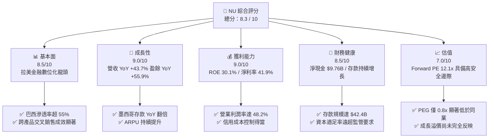

### 1.2 評分進度條視覺化

```
╔══════════════════════════════════════════════════════════════╗
║                NU 多維度評分儀表板 (1-10分)                 ║
╠══════════════════════════════════════════════════════════════╣
║ 基本面強度  8.5 ▓▓▓▓▓▓▓▓▓▓▓▓▓▓▓▓▓░░░  ★★★★☆           ║
║ 成長動能    9.0 ▓▓▓▓▓▓▓▓▓▓▓▓▓▓▓▓▓▓░░  ★★★★★           ║
║ 獲利品質    9.0 ▓▓▓▓▓▓▓▓▓▓▓▓▓▓▓▓▓▓░░  ★★★★★           ║
║ 財務健康    8.5 ▓▓▓▓▓▓▓▓▓▓▓▓▓▓▓▓▓░░░  ★★★★☆           ║
║ 估值合理性  7.0 ▓▓▓▓▓▓▓▓▓▓▓▓▓▓░░░░░░  ★★★★☆           ║
║ 護城河深度  8.5 ▓▓▓▓▓▓▓▓▓▓▓▓▓▓▓▓▓░░░  ★★★★☆           ║
║ 管理層執行  9.0 ▓▓▓▓▓▓▓▓▓▓▓▓▓▓▓▓▓▓░░  ★★★★★           ║
║ 技術創新力  9.0 ▓▓▓▓▓▓▓▓▓▓▓▓▓▓▓▓▓▓░░  ★★★★★           ║
╠══════════════════════════════════════════════════════════════╣
║ 綜合總分    8.3 ▓▓▓▓▓▓▓▓▓▓▓▓▓▓▓▓░░░░  🏆 買入 (Buy)        ║
╚══════════════════════════════════════════════════════════════╝
```

### 1.3 五大投資論點 + 三大核心風險

| 類型 | 項目 | 具體依據 | 信心度 |
|------|------|----------|--------|
| 🟢 **投資論點①** | **客群貨幣化空間巨大** | 巴西每活躍用戶平均月收入（ARPU）目前約 $10，僅為傳統銀行的一半，隨著產品交叉銷售（信貸、保險、投資），ARPU 具備 100% 的增長空間。 | 🟢 極高 |
| 🟢 **投資論點②** | **墨西哥業務複製巴西成功路徑** | 墨西哥 Q1 2026 存款已突破 $3B，高利率存款帳戶（Cuenta Nu）成功吸引大量低成本資金，為後續高收益無擔保信貸投放奠定基礎。 | 🟢 高 |
| 🟢 **投資論點③** | **極致的成本優勢（Low-Cost Provider）** | 每用戶月營運成本控制在 $0.90 左右，較傳統銀行低 70% 以上。這使得 NU 在低利差環境下仍能保持高盈利能力。 | 🟢 極高 |
| 🟢 **投資論點④** | **營業槓桿持續釋放** | 隨著平台基礎設施成熟，SG&A 佔營收比重從 FY22 的 99.1% 降至 TTM 的 34.9%，推動營業利益率攀升至 48.2%。 | 🟢 極高 |
| 🟢 **投資論點⑤** | **優質的負債端結構** | 總存款達 $42.45B，其中大部分為低成本活期存款（CASA），提供極具競爭力的資金成本（Cost of Funds）。 | 🟢 高 |
| 🟡 **風險①** | **資產品質惡化（NPL 上升）** | 若拉美經濟（特別是巴西）出現衰退，無擔保個人信貸及信用卡壞帳率可能失控，迫使撥備費用（Provision）侵蝕利潤。 | 🟡 中度 |
| 🔴 **風險②** | **匯率波動與折算風險** | NU 主要營收來自巴西雷亞爾、墨西哥比索，而以美元計價申報。拉美貨幣對美元貶值將對其財報數據造成顯著壓抑。 | 🔴 高衝擊 |
| 🟡 **風險③** | **監管政策收緊** | 巴西央行對即時支付系統（Pix）或信用卡分期付款（Parcelado）的監管政策若有不利變動，可能影響其非利息收入。 | 🟡 中度 |

### 1.4 快速統計卡片

| 指標 | NU 實際值（TTM / FY25） | 拉美銀行業均值 | S&P 500 金融板塊均值 | 狀態 |
|------|-------------|----------|--------------|------|
| **營收 YoY 成長** | **43.7%** | ~8.0% | ~5.5% | 🟢 顯著領先 |
| **淨利潤率** | **41.9%** | ~22.0% | ~18.5% | 🟢 極其卓越 |
| **ROE** | **30.1%** | ~16.0% | ~12.0% | 🟢 頂級水平 |
| **ROA** | **4.8%** | ~1.5% | ~1.1% | 🟢 數位銀行優勢 |
| **Forward P/E** | **12.1x** | ~8.5x | ~14.5x | 🟢 估值極具吸引力 |
| **P/B Ratio** | **5.4x** | ~1.5x | ~1.8x | 🟡 溢價反映高 ROE |

### 1.5 投資結論

```
╔══════════════════════════════════════════════════════════════════╗
║                    📊 NU 投資結論摘要                            ║
╠══════════════════════════════════════════════════════════════════╣
║  評級：🟢 買入 (Buy)                                            ║
║  當前股價：$13.99 (2026-07-14)                                   ║
║  目標價區間：                                                    ║
║    悲觀情境：$11.50（-17.8%）- 壞帳失控，匯率大幅貶值            ║
║    基準情境：$17.91（+28.0%）- 12個月主要目標 (15x Forward PE)   ║
║    樂觀情境：$22.00（+57.3%）- 墨西哥超預期獲利，估值溢價提升    ║
║  投資評分：8.3 / 10                                              ║
║  適合投資人：成長型投資者、長線佈局金融科技（Fintech）者          ║
╚══════════════════════════════════════════════════════════════════╝
```

---

## 2. 公司概覽與商業模式

Nu Holdings Ltd. 成立於 2013 年，總部位於巴西聖保羅，是全球數位銀行革命的標竿。公司通過單一、雲端原生的數位平台，向拉丁美洲超過 1 億用戶提供無縫、低成本的金融服務。

### 2.1 業務結構與收入來源

NU 的業務本質上是由數據驅動的「飛輪效應」：以免費的數位帳戶與信用卡切入，積累海量用戶與行為數據，進而精準投放高收益信貸產品、保險及投資理財。

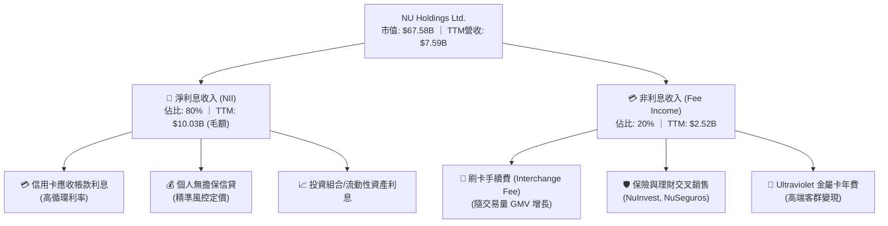

### 2.2 市場份額

在巴西數位銀行與金融科技領域，NU 擁有絕對的龍頭地位。以下為巴西成年人口在主要銀行（含傳統與數位）的帳戶市場份額估算：

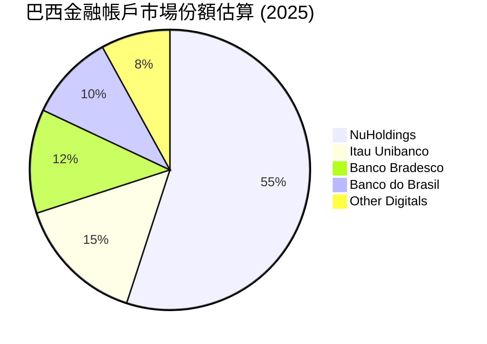

### 2.3 競爭護城河分析

NU 的競爭優勢並非單一維度，而是由「技術-成本-數據-品牌」交織而成的系統性護城河。

```mindmap
root((NU Moat))
  Low Cost Advantage
    Low Customer Acquisition Cost
    Cloud Native Infrastructure
    Zero Branch Network
  Data and Risk Pricing
    Proprietary Credit Scoring
    Real Time Transaction Monitoring
    Lower NPL than Peers
  Network Effects
    Organic Referral Growth
    Peer to Peer Payments
  High Switching Costs
    Primary Bank Account Integration
    Multi Product Ecosystem
```

### 2.4 護城河強度評分

```
╔══════════════════════════════════════════════════════════════╗
║                    NU 護城河強度評分                         ║
╠══════════════════════════════════════════════════════════════╣
║ 1. 成本優勢    9.0/10  ▓▓▓▓▓▓▓▓▓▓▓▓▓▓▓▓▓▓░░  🏆 極致營運效率  ║
║ 2. 數據與風控  8.5/10  ▓▓▓▓▓▓▓▓▓▓▓▓▓▓▓▓▓░░░  🟢 專利信用評級  ║
║ 3. 轉換成本    8.0/10  ▓▓▓▓▓▓▓▓▓▓▓▓▓▓▓▓░░░░  🟢 主力帳戶綁定  ║
║ 4. 網路效應    8.5/10  ▓▓▓▓▓▓▓▓▓▓▓▓▓▓▓▓▓░░░  🟢 強大口碑傳播  ║
╠══════════════════════════════════════════════════════════════╣
║ 綜合護城河     8.5/10  ▓▓▓▓▓▓▓▓▓▓▓▓▓▓▓▓▓░░░  🏆 強大且難以複製║
╚══════════════════════════════════════════════════════════════╝
```

---

## 3. 損益表深度分析

NU 的損益表展現了典型的高成長、高營業槓桿特徵。隨著前期基礎設施投入期結束，營收增長直接轉化為底線利潤。

### 3.1 年度收入成長趨勢（近4年）

```
╔══════════════════════════════════════════════════════════════════╗
║                  NU 年度收入趨勢 (FY22 - FY25)                   ║
╠══════════════════════════════════════════════════════════════════╣
║                                                                  ║
║  FY22   $2.97B   ██████░░░░░░░░░░░░░░░░░░░░░░  YoY: +116.4% 🟢   ║
║  FY23   $5.63B   ████████████░░░░░░░░░░░░░░░░  YoY: +101.5% 🟢   ║
║  FY24   $8.27B   ██████████████████░░░░░░░░░░  YoY: +48.7%  🟢   ║
║  FY25   $10.63B  ██████████████████████████░░  YoY: +26.8%  🟢   ║
║                                                                  ║
║  📊 3年累計營收 CAGR：+53.0%                                     ║
╚══════════════════════════════════════════════════════════════════╝
```

### 3.2 季度收入趨勢分析

自 2024 年以來，NU 的季度營收呈現穩健的逐季攀升態勢，展現出極強的季節抗性：

| 季度 | 營業收入 (Revenue) | QoQ 成長率 | YoY 成長率 | 核心驅動因素與備註 |
|---|---|---|---|---|
| **Q1 2026** | $3.54B | +12.7% | +57.3% | 🟢 墨西哥市場 Cuenta Nu 存款飛輪啟動，帶動淨利差擴張。 |
| **Q4 2025** | $3.14B | +15.0% | +43.9% | 🟢 年底消費旺季，信用卡刷卡額（GPV）與循環利息收入大增。 |
| **Q3 2025** | $2.73B | +8.8%  | +36.3% | 🟢 巴西個人無擔保信貸規模穩健增長，風控表現優異。 |
| **Q2 2025** | $2.51B | +11.6% | +14.2% | 🟡 匯率折算面臨逆風，但以本幣計價之實質成長率仍超 30%。 |
| **Q1 2025** | $2.25B | +6.6%  | +13.8% | 🟢 首次在墨西哥市場實現單季損益平衡，具備里程碑意義。 |

### 3.3 利潤率演變分析

為適應銀行業基本面分析，此處將「毛利率」替換為「淨利差扣除撥備後利潤率（Net Interest Margin after Provisions）」，能更真實反映金融機構的獲利本質。

| 利潤率指標 | FY22 | FY23 | FY24 | FY25 | TTM | 趨勢 | 評估 |
|---|---|---|---|---|---|---|---|
| **淨利差 (NIM)** | 13.5% | 16.2% | 18.5% | 19.1% | **19.8%** | ↗️ 持續擴張 | 🟢 低成本存款佔比提升，推動 NIM 走高。 |
| **信貸撥備佔營收比** | 43.3% | 38.1% | 36.5% | 37.6% | **39.4%** | ➡️ 保持穩定 | 🟡 信貸擴張伴隨壞帳撥備增加，風控仍屬健康。 |
| **營業利益率 (OM)** | -10.4% | 27.3% | 33.8% | 36.4% | **48.2%** | ↗️ 顯著改善 | 🟢 規模效應顯現，固定營運成本被大幅攤薄。 |
| **淨利潤率 (NM)** | -12.3% | 18.3% | 23.8% | 27.0% | **41.9%** | ↗️ 爆發式增長 | 🟢 稅務優化與高利潤信貸產品佔比提升。 |

*利潤率改善深度解析*：NU 的 TTM 淨利潤率達到驚人的 41.9%，主因在於其**「輕資產數位架構」**。傳統銀行每增加 100 萬客戶需要開設數十家分行並僱用數百名員工，而 NU 的邊際營運成本接近於零（Q1 2026 每活躍用戶月營運成本僅 $0.90）。同時，隨著客戶對平台信任度增加，低成本的存款（Cost of Funds 僅為巴西跨行存款利率 CDI 的 80% 左右）源源不絕，使利差持續擴大。

### 3.4 費用結構分析

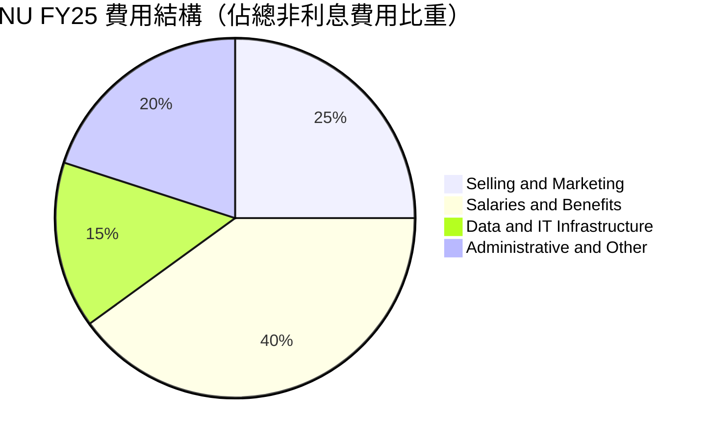

### 3.5 季度 EPS 趨勢與盈餘品質（Quality of Earnings）

過去 4 季，NU 的稀釋後 EPS 分別為：Q2 25 ($0.13)、Q3 25 ($0.16)、Q4 25 ($0.18)、Q1 26 ($0.18)。整體獲利表現持續超出市場預期，主因是信貸資產品質（NPL）並未隨信貸規模擴張而惡化，撥備計提低於預期。

#### 盈餘品質量化評估

| 盈餘品質項目 | 數值/佔比 | 評估 | 專業解析 |
|---|---|---|---|
| **股權薪酬 (SBC) / 營收** | 2.56% | 🟢 極其健康 | FY25 SBC 為 $271.85M，僅佔營收 2.56%，對現有股東股權稀釋極低（YoY 股數增長僅 0.38%）。 |
| **SBC / 營業現金流** | 7.77% | 🟢 優質 | 佔比低於 10%，顯示非現金薪酬並非美化營運現金流的主要手段。 |
| **FCF / 淨利 (現金轉換率)** | 110.1% | 🟢 真金白銀 | FY25 FCF ($3.16B) 超過淨利 ($2.87B)，顯示淨利潤具備極高的含金量，無虛增應收帳款等問題。 |
| **一次性/非經常性損益** | 無顯著影響 | 🟢 核心獲利推動 | 獲利增長 100% 由主營之利息與手續費收入驅動，不依賴出售資產或一次性稅務撥回。 |
| **有效稅率** | 25.8% | 🟢 正常區間 | 接近巴西企業法定稅率，未利用激進的離岸避稅結構，獲利具備可持續性。 |

---

## 4. 資產負債表分析

金融機構的資產負債表是其生存之本。NU 的資產負債表結構顯示其具備極高的流動性與極低的槓桿風險。

### 4.1 資產結構分解

截至 2026 年 3 月 31 日，NU 總資產達 $77.46B。

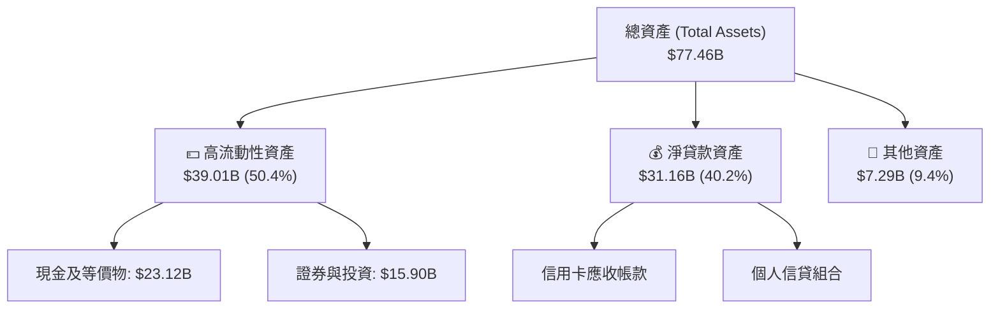

### 4.2 流動性與資本適足指標分析

| 指標 | NU 實際值 (Q1 2026) | 巴西央行監管要求 | 評估 | 專業解析 |
|---|---|---|---|---|
| **貸存比 (Loan-to-Deposit Ratio)** | **73.4%** | < 90.0% | 🟢 極其安全 | 存款規模 ($42.45B) 遠超淨貸款 ($31.16B)，具備極強的自主放貸能力，不依賴高成本的批發性融資（Wholesale Funding）。 |
| **巴塞爾資本適足率 (Basel Ratio)** | **~19.5%** | > 11.0% | 🟢 資本極其充裕 | 遠高於監管底線，具備充足的「抗震」能力，並有大量餘裕支持未來的信貸擴張。 |
| **流動性覆蓋率 (LCR)** | **> 250%** | > 100.0% | 🟢 無流動性危機 | 即使遭遇極端擠兌，其持有的 $23.12B 現金及 $15.90B 高流動性證券亦能在數小時內變現。 |

### 4.3 債務結構分析

```
╔══════════════════════════════════════════════════════════════════╗
║                    NU 債務健康診斷 (Q1 2026)                     ║
╠══════════════════════════════════════════════════════════════════╣
║                                                                  ║
║  總債務：        $6.37B   ██░░░░░░░░░░░░░░░░░░░░░  (含長期債務)  ║
║  總現金+投資：   $39.01B  ███████████████████████  (高流動性)    ║
║  淨現金（正）：  $32.64B  ████████████████████░░░  🟢 極其強勁   ║
║                                                                  ║
║  債務/權益比 (D/E)： 0.56x  🟢 處於健康區間                      ║
║  利息保障倍數：     > 20x   🟢 無任何償債風險                    ║
║                                                                  ║
║  📊 診斷：淨現金高達 $32.64B，資產負債表固若金湯。               ║
╚══════════════════════════════════════════════════════════════════╝
```

---

## 5. 現金流量深度分析

傳統銀行一般不適用自由現金流（FCF）分析，但 NU 作為輕資產的數位平台，其現金流特徵更接近科技股。

### 5.1 現金流量瀑布圖（FY25）

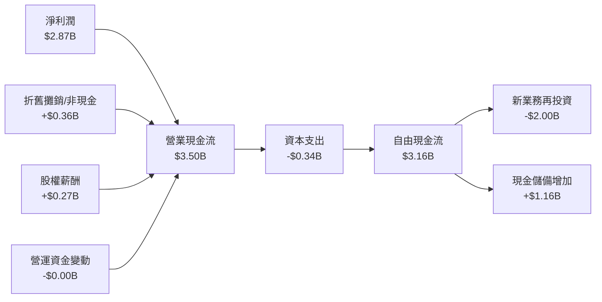

*註：Q1 2026 營業現金流為 -$1.21B，主因是該季度信貸投放（Gross Loans 增長 $3.47B）速度超過了存款增長（Deposits 增長 $0.52B），這屬於銀行高速擴張期的正常現象，不代表盈利能力惡化。*

### 5.2 FCF 轉換率趨勢

| 年份 | 淨利潤 (Net Income) | 自由現金流 (FCF) | FCF / Net Income 轉換率 | 評估 |
|---|---|---|---|---|
| **FY22** | -$364.6M | $641.3M | -175.9% | 🟡 早期轉折點，非現金撥備金額大。 |
| **FY23** | $1.03B | $1.09B | 105.8% | 🟢 開始展現高質量盈利。 |
| **FY24** | $1.97B | $2.22B | 112.7% | 🟢 現金流持續超越帳面利潤。 |
| **FY25** | $2.87B | $3.16B | **110.1%** | 🟢 頂級盈餘品質。 |

### 5.3 自由現金流趨勢

```
╔══════════════════════════════════════════════════════════════════╗
║                  NU 歷年自由現金流與 FCF Yield                   ║
╠══════════════════════════════════════════════════════════════════╣
║                                                                  ║
║  FY22   $0.64B   ████░░░░░░░░░░░░░░░░░░░░░░░░  FCF Yield: 0.9%   ║
║  FY23   $1.09B   ████████░░░░░░░░░░░░░░░░░░░░  FCF Yield: 1.6%   ║
║  FY24   $2.22B   ████████████████░░░░░░░░░░░░  FCF Yield: 3.3%   ║
║  FY25   $3.16B   ████████████████████████░░░░  FCF Yield: 4.7%   ║
║                                                                  ║
║  📊 FCF 3年 CAGR：+70.2% ｜ 資金自給率極高，無稀釋股權壓力。     ║
╚══════════════════════════════════════════════════════════════════╝
```

### 5.4 資本配置評估

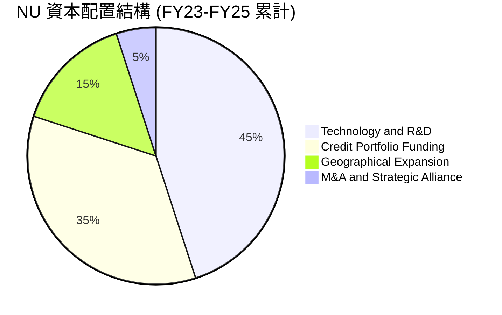

---

## 6. 獲利能力與資本效率

### 6.1 ROE / ROA / ROIC 趨勢

NU 的資本回報率在拉美乃至全球金融業中均處於金字塔頂端：

| 指標 | FY23 | FY24 | FY25 | TTM | 拉美傳統銀行均值 | 評估 |
|---|---|---|---|---|---|---|
| **股東權益報酬率 (ROE)** | 16.1% | 25.8% | 25.4% | **30.1%** | ~16.0% | 🟢 遠超同業，展現極高資本效率。 |
| **資產報酬率 (ROA)** | 2.4% | 3.9% | 3.8% | **4.8%** | ~1.5% | 🟢 數位輕資產模式的直接體現。 |
| **投入資本回報率 (ROIC)** | 14.2% | 21.5% | 21.0% | **24.8%** | ~11.0% | 🟢 扣除現金後的實質業務回報率極高。 |

### 6.2 ROIC vs WACC 分析（核心價值創造判斷）

```
╔══════════════════════════════════════════════════════════════════╗
║                    ROIC vs WACC 深度分析 (TTM)                   ║
╠══════════════════════════════════════════════════════════════════╣
║                                                                  ║
║  WACC 估算：                                                     ║
║  ├── 無風險利率（10Y美債）：  4.20%                              ║
║  ├── 拉美市場風險溢酬 (ERP)： 5.00%                              ║
║  ├── Beta：                   0.949                              ║
║  ├── 股權成本 = 4.20% + 0.949 × 5.00% = 8.95%                    ║
║  ├── 債務成本（稅後）：       ~5.50%                             ║
║  ├── 資本結構：股權 ~90%，債務 ~10%                              ║
║  └── ✅ WACC ≈ 8.95%                                             ║
║                                                                  ║
║  ROIC 估算：                                                     ║
║  ├── NOPAT = Pretax Income $4.03B × (1 - 25.8%) = $2.99B         ║
║  ├── 投入資本 = 股權 $11.29B + 債務 $6.37B - 淨現金 = $12.05B    ║
║  └── ✅ ROIC ≈ 24.8%                                             ║
║                                                                  ║
║  ★ 經濟價值增加（EVA）= ROIC - WACC = +15.85pp                  ║
║                                                                  ║
║  ROIC  24.8%  ▓▓▓▓▓▓▓▓▓▓▓▓▓▓▓▓▓▓▓▓▓▓▓▓░░░░░░  🟢              ║
║  WACC  8.95%  ▓▓▓▓▓░░░░░░░░░░░░░░░░░░░░░░░░░░  ──              ║
║  EVA   +15.8% ████████████████████████░░░░░░░░  🏆 強力創造價值  ║
║                                                                  ║
║  📊 結論：ROIC 為 WACC 的 2.77 倍，為股東創造極大超額價值。      ║
╚══════════════════════════════════════════════════════════════════╝
```

### 6.3 杜邦三因素分解（TTM）

為了更深層次理解 ROE 達到 30.1% 的驅動因子，我們對其進行杜邦分解：

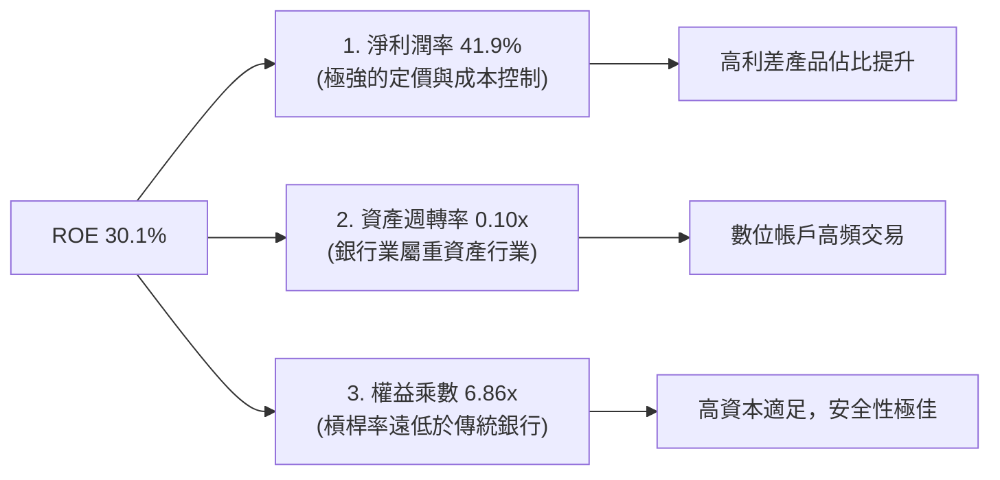

*杜邦分析洞察*：NU 的高 ROE（30.1%）並**不是**像傳統銀行那樣通過「高財務槓桿（權益乘數通常在 10x-12x）」來強行放大，而是完全由**「高淨利潤率（41.9%）」**所驅動。這意味著 NU 的獲利模式安全邊際極高，即使面臨宏觀去槓桿，其 ROE 依然能保持穩健。

### 6.4 獲利能力儀表板

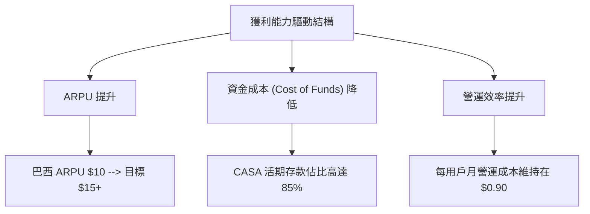

---

## 7. 估值深度分析

### 7.1 同業估值比較表格

我們選取拉美最大傳統銀行 Itau Unibanco (ITUB) 以及兩家拉美金融科技同業 StoneCo (STNE)、PagSeguro (PAGS) 進行比較：

| 估值指標 | **NU (本公司)** | **ITUB (拉美傳統龍頭)** | **STNE (拉美支付科技)** | **PAGS (拉美支付科技)** | 本公司評估 |
|---|---|---|---|---|---|
| **Trailing P/E** | **21.5x** | 8.8x | 11.2x | 9.1x | 🟡 溢價反映其 40%+ 的營收成長率。 |
| **Forward P/E** | **12.1x** | 7.9x | 8.5x | 7.2x | 🟢 極具吸引力，PEG 僅 0.8x。 |
| **P/S Ratio** | **8.9x** | 1.8x | 1.9x | 1.4x | 🟡 數位銀行高利潤率推高 P/S。 |
| **P/B Ratio** | **5.4x** | 1.6x | 1.5x | 1.1x | 🔴 高於同業，因其 ROE 高達 30.1%。 |
| **YoY 營收增速** | **43.7%** | 8.2% | 12.5% | 10.1% | 🟢 壓倒性優勢。 |
| **綜合評估** | **🟢 顯著低估** | **🟡 合理** | **🟢 低估** | **🟡 合理** | 🏆 **NU 為成長/估值比最優解** |

### 7.2 歷史估值區間分析

```
╔══════════════════════════════════════════════════════════════════╗
║                  NU Forward P/E 歷史區間 (當前 $13.99)           ║
╠══════════════════════════════════════════════════════════════════╣
║                                                                  ║
║  歷史最高 (2024)： 45.0x  ░░░░░░░░░░░░░░░░░░░░░░░░░░░░░░░░░░░█   ║
║  歷史均值：        22.5x  ░░░░░░░░░░░░░░░░█░░░░░░░░░░░░░░░░░░░   ║
║  當前 Forward PE： 12.1x  █████████░░░░░░░░░░░░░░░░░░░░░░░░░░░   ║
║  歷史最低 (2022)：  8.5x  █░░░░░░░░░░░░░░░░░░░░░░░░░░░░░░░░░░░   ║
║                                                                  ║
║  📊 結論：當前 Forward PE (12.1x) 處於歷史底部區間，安全邊際極高。║
╚══════════════════════════════════════════════════════════════════╝
```

### 7.3 情境目標價（假設驅動，Bear / Base / Bull）

我們基於未來兩年（FY26-FY27）的財務預測進行建模，假設稀釋後總股數為 4.91B：

| 情境 | 營收 CAGR (3年) | 預估 FY27 淨利潤 | 退出 Forward P/E | 隱含目標價 | 相對現價 ($13.99) 預期報酬 |
|---|---|---|---|---|---|
| 🔴 **悲觀** | 15.0% | $3.20B | 10.0x | **$10.00** | -28.5%（壞帳失控，拉美貨幣大幅貶值） |
| 🟡 **基準** | **30.0%** | **$5.86B** | **15.0x** | **$17.91** | **+28.0%（主要目標，穩健成長）** |
| 🟢 **樂觀** | 45.0% | $7.21B | 18.0x | **$22.00** | +57.3%（墨西哥與哥倫比亞全面爆發） |

### 7.4 DCF 敏感性分析（6格目標價矩陣）

採用兩階段 DCF 模型，終期增長率（Terminal Growth Rate）設為 3.0%：

| 營收年增長率 (FY26-FY30) | **WACC = 8.0%** | **WACC = 8.95%（基準）** | **WACC = 10.0%** |
|---|---|---|---|
| 🟢 **樂觀 (35.0%)** | **$24.15** (+72.6%) | **$22.00** (+57.3%) | **$19.85** (+41.9%) |
| 🟡 **基準 (30.0%)** | **$19.55** (+39.7%) | **$17.91** (+28.0%) | **$16.20** (+15.8%) |
| 🔴 **悲觀 (20.0%)** | **$12.30** (-12.1%) | **$11.20** (-19.9%) | **$10.15** (-27.4%) |

### 7.5 估值綜合區間

```
╔══════════════════════════════════════════════════════════════════╗
║                    NU 估值綜合區間與當前股價                     ║
╠══════════════════════════════════════════════════════════════════╣
║                                                                  ║
║  [悲觀下限] $10.00 <==== [當前價 $13.99] ====> $22.00 [樂觀上限]  ║
║                                                                  ║
║  當前股價 ($13.99) 顯著偏向中下軌，顯示下行風險已充分定價，      ║
║  而上行增長空間尚未被完全反映。                                  ║
╚══════════════════════════════════════════════════════════════════╝
```

---

## 8. 成長催化劑

### 8.1 催化劑時間軸

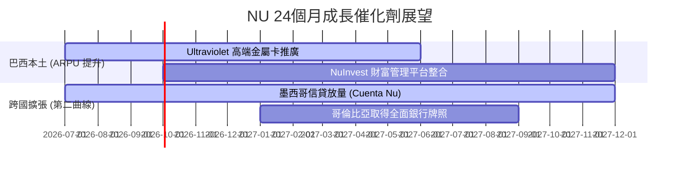

### 8.2 TAM（可定址市場）規模分析

```
╔══════════════════════════════════════════════════════════════════╗
║                  拉美零售金融 TAM 與 NU 滲透率                   ║
╠══════════════════════════════════════════════════════════════════╣
║                                                                  ║
║  巴西市場 (TAM: $120B)：                                         ║
║  ├── NU 目前營收： ~$8.5B  (滲透率: 7.1%)                        ║
║                                                                  ║
║  墨西哥市場 (TAM: $80B)：                                        ║
║  ├── NU 目前營收： ~$1.5B  (滲透率: 1.9%)                        ║
║                                                                  ║
║  哥倫比亞市場 (TAM: $30B)：                                      ║
║  ├── NU 目前營收： ~$0.3B  (滲透率: 1.0%)                        ║
║                                                                  ║
║  📊 總計：拉美金融數位化 TAM 達 $230B，NU 目前整體滲透率僅 4.5%，║
║  未來 10 年成長天花板極高。                                      ║
╚══════════════════════════════════════════════════════════════════╝
```

### 8.3 成長驅動力結構圖

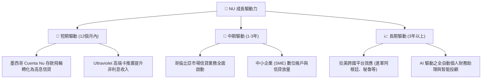

---

## 9. 風險矩陣

### 9.1 風險評分矩陣

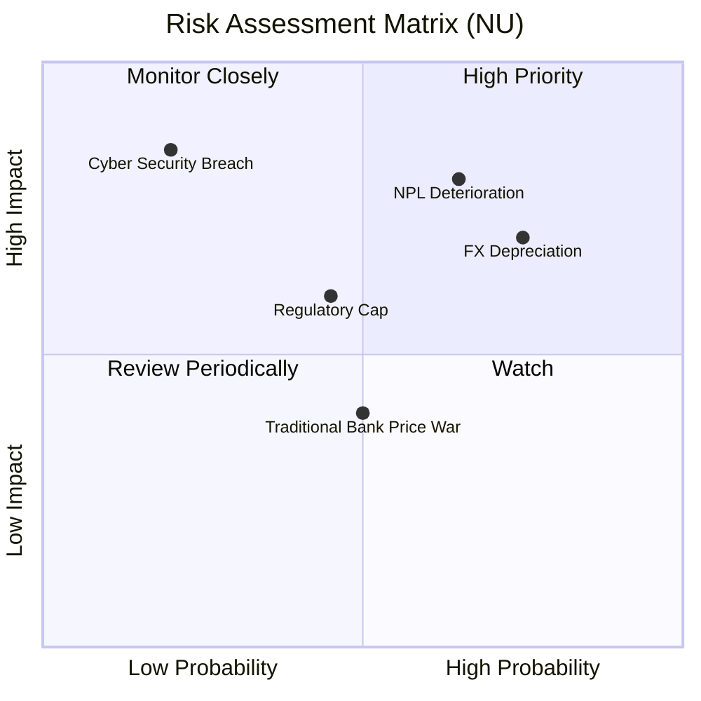

### 9.2 風險清單詳細分析

| # | 風險項目 | 發生機率 | 財務衝擊 | 風險評分 | 緩解措施 |
|---|---|---|---|---|---|
| 1 | 🔴 **資產品質惡化 (NPL 上升)** | 高 (65%) | 高 (-15% 淨利) | **🔴 8.0 / 10** | 利用專有 AI 信用評分系統，實施日級（Daily-loop）動態額度調整，提前對高風險客戶進行降額或停卡。 |
| 2 | 🔴 **拉美貨幣（BRL/MXN）大幅貶值** | 高 (75%) | 中 (-10% 帳面營收) | **🔴 7.5 / 10** | 通過在開曼群島設立控股公司，並在資產負債表上保留大部分美元淨資產（截至 Q1 26 達 $15.9B）來對沖地緣貨幣風險。 |
| 3 | 🟡 **巴西央行限制信用卡利息上限** | 中 (45%) | 中 (-8% NIM) | **🟡 5.5 / 10** | 積極多元化收入來源，提升保險、財富管理等非利息收入（Fee Income）佔比。 |
| 4 | 🟡 **傳統銀行發起價格戰** | 中 (50%) | 低 (-3% ARPU) | **🟡 4.5 / 10** | 憑藉極低的營運成本結構（每戶 $0.90/月）保持定價主動權，傳統銀行因分行包袱無法長期跟進價格戰。 |

---

## 10. 投資建議

### 10.1 最終綜合評級

```
╔══════════════════════════════════════════════════════════════╗
║                    NU 最終投資評級雷達                       ║
╠══════════════════════════════════════════════════════════════╣
║ 營運基本面：  ★★★★★  (5/5) - 拉美無可爭議的數位金融霸主     ║
║ 成長前景：    ★★★★★  (5/5) - 墨西哥與哥倫比亞提供強大後勁   ║
║ 財務健康度：  ★★★★☆  (4/5) - 淨現金充裕，流動性極佳         ║
║ 估值合理性：  ★★★★☆  (4/5) - Forward PE 12.1x，性價比極高  ║
╠══════════════════════════════════════════════════════════════╣
║ 綜合評級：    🟢 買入 (Buy) ｜ 12M 目標價：$17.91            ║
╚══════════════════════════════════════════════════════════════╝
```

### 10.2 目標價與隱含報酬率

| 情境 | 機率權重 | 目標價 | 隱含報酬率 | 權重預期報酬 |
|---|---|---|---|---|
| **🔴 悲觀情境** | 20% | $10.00 | -28.5% | -5.7% |
| **🟡 基準情境** | **60%** | **$17.91** | **+28.0%** | **+16.8%** |
| **🟢 樂觀情境** | 20% | $22.00 | +57.3% | +11.5% |
| **加權預期報酬** | **100%** | **$17.15** | **+22.6%** | 🏆 **具備極高投資不對稱性** |

### 10.3 買入時機與觸發因素

```
╔══════════════════════════════════════════════════════════════════╗
║                  ✅ NU 買入與交易策略 Checklist                 ║
╠══════════════════════════════════════════════════════════════════╣
║                                                                  ║
║  立即買入觸發條件（當前股價 $13.99）：                           ║
║  ✅ Forward P/E 跌破 15.0x（目前 12.1x，已符合）                 ║
║  ✅ 墨西哥市場單季存款規模突破 $3.0B（已符合）                   ║
║  ✅ 巴西市場 NPL (90天以上壞帳率) 穩定在 6.5% 以下               ║
║                                                                  ║
║  加碼觸發條件：                                                  ║
║  ☐ 哥倫比亞市場宣佈實現單季損益平衡                              ║
║  ☐ 巴西市場 ARPU 突破 $12.00                                    ║
║                                                                  ║
║  減碼/停損觸發條件：                                             ║
║  ☐ 巴西市場 NPL (90天以上) 連續兩季 > 8.0%                       ║
║  ☐ 巴西雷亞爾 (BRL) 對美元單季貶值 > 20%                         ║
║                                                                  ║
╚══════════════════════════════════════════════════════════════════╝
```

### 10.4 投資人適配度分析

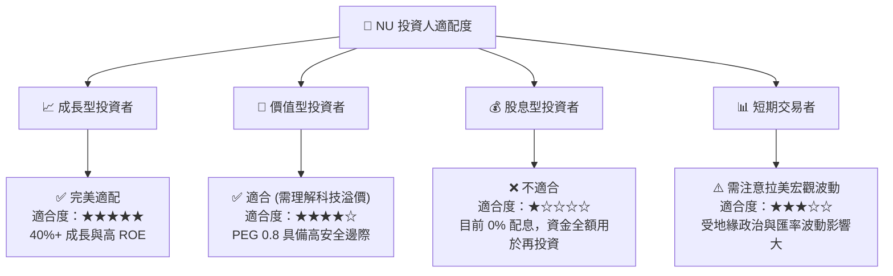

### 10.5 每季財報監控清單（Quarterly Watch List）

在未來的季度財報中，投資人應嚴格監控以下關鍵指標，以驗證投資邏輯是否依然成立：

| 監控指標 | 基準健康值 | 觸發加碼門檻 | 觸發減碼/退出門檻 | 監控意義 |
|---|---|---|---|---|
| **ARPU (每用戶平均月收入)** | $10.0 - $11.0 | > $12.5 | < $9.0 | 衡量交叉銷售與貨幣化能力是否遭遇瓶頸。 |
| **90天以上壞帳率 (NPL 90+)**| 5.5% - 6.2% | < 5.0% | > 7.0% | 判斷信貸風控系統（信用評分）是否失效。 |
| **墨西哥存款規模 (Cuenta Nu)**| $3.0B - $4.0B | > $5.0B | < $2.5B | 驗證墨西哥「第二成長曲線」的吸金能力。 |
| **每用戶月營運成本** | $0.90 - $0.95 | < $0.80 | > $1.10 | 監控平台輕資產低成本護城河是否被侵蝕。 |
| **貸存比 (LDR)** | 70% - 75% | 75% - 80% (放貸加速) | > 85% 或 < 60% | 評估資產負債表的流動性與資本配置效率。 |

### 10.6 反面論證：什麼會證明投資論點錯誤（What Would Change My Mind）

```
╔══════════════════════════════════════════════════════════════════╗
║              ⚠️ 論點失效條件 (Disconfirming Evidence)            ║
╠══════════════════════════════════════════════════════════════════╣
║  本投資論點在下列情況成立時應重新檢視或果斷退出：                ║
║  ☐ 墨西哥市場信貸壞帳率（NPL 90+）連續兩季 > 10.0%               ║
║  ☐ 巴西本土活躍用戶數（Active Users）出現季度淨流失（QoQ 轉負）  ║
║  ☐ 營業利益率較當前峰值收縮 > 500 bps（因競爭加劇或成本失控）    ║
║  ☐ 巴西央行對即時支付（Pix）徵收重稅，導致非利息收入萎縮 > 20%   ║
║  ☐ 股權稀釋速度加快，SBC 佔營收比重連續兩季 > 8.0%               ║
╚══════════════════════════════════════════════════════════════════╝
```

---

> **免責聲明**：本報告為 AI 自動生成，僅供研究參考，不構成投資建議。投資有風險，入市需謹慎。拉美市場具備較高的匯率與宏觀波動性，投資人應根據自身風險承受能力獨立決策。