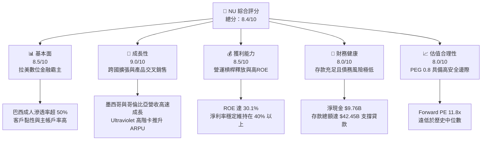
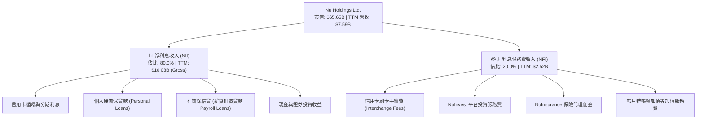
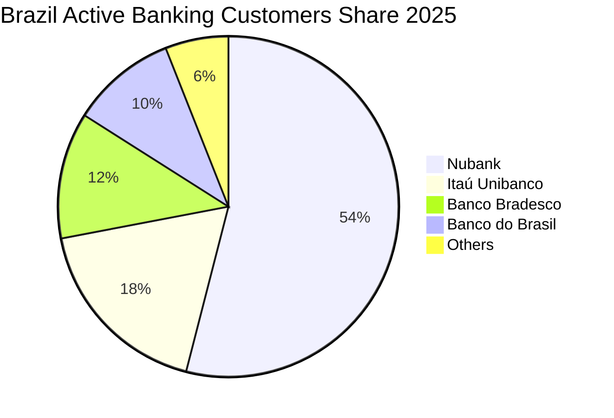
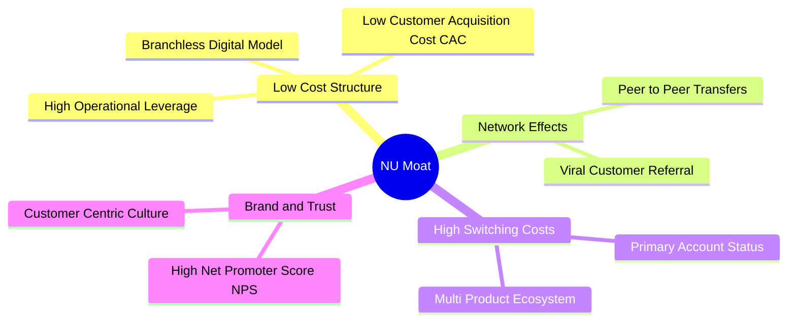
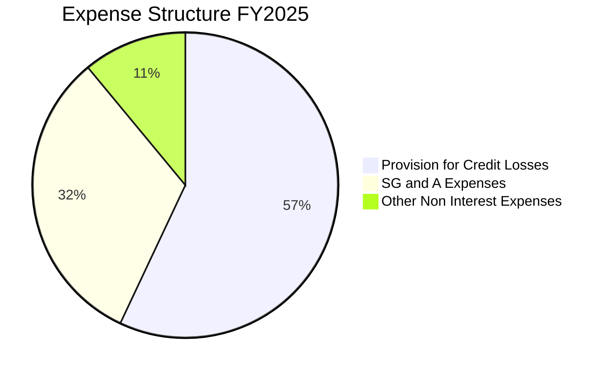
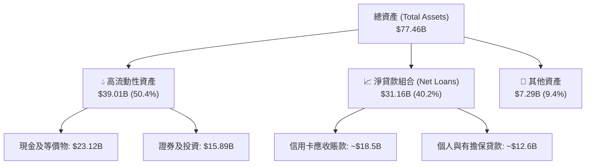
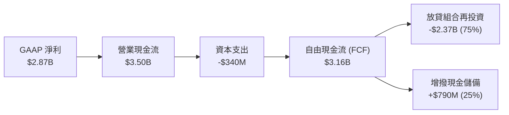
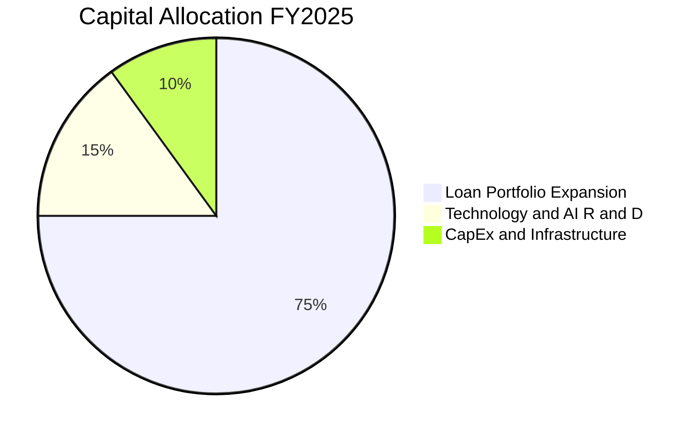
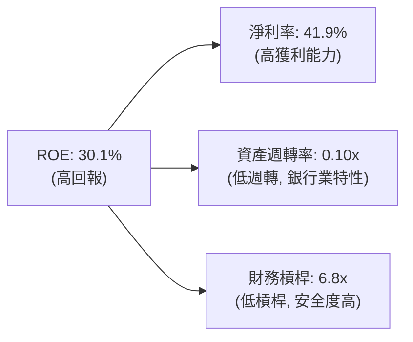
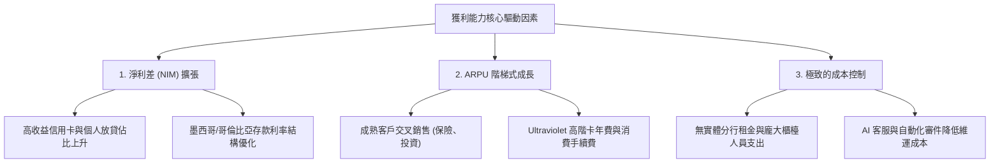

# NU 基本面深度分析報告

> **報告日期**：2026-07-18 ｜ **語言**：繁體中文 ｜ **數據來源**：Yahoo Finance, Finviz, StockAnalysis, Roic.ai ｜ **分析師**：CFA 級機構研究

---

## 目錄

| # | 章節 | 核心結論 |
|---|------|----------|
| 1 | 執行摘要 | 評級：🟢 買入 ｜ 基準目標價：$17.94（+32.0%） |
| 2 | 公司概覽與商業模式 | 數位原生輕資產架構，極低 CAC 與高利潤交叉銷售構建強大護城河 |
| 3 | 損益表深度分析 | 營收年增 43.7%，營運槓桿推動淨利率攀升至 41.9% |
| 4 | 資產負債表分析 | 淨現金達 $9.76B，存款基礎穩健，資產質量撥備充足 |
| 5 | 現金流量深度分析 | 營運資金受貸款擴張干擾，但調整後自由現金流生成能力強勁 |
| 6 | 獲利能力與資本效率 | ROE 達 30.1%，ROIC 顯著超越 WACC，強力創造股東價值 |
| 7 | 估值深度分析 | Forward P/E 僅 11.8 倍，PEG 0.8 顯示成長溢價尚未完全反映 |
| 8 | 成長催化劑 | 墨西哥與哥倫比亞市場加速滲透，高級會員（Ultraviolet）推升 ARPU |
| 9 | 風險矩陣 | 關注拉美總體經濟波動與信用資產質量（NPL）攀升風險 |
| 10 | 投資建議 | 提供三種情境估值與每季財報監控指標，建構動態投資框架 |

---

## 1. 執行摘要

### 1.0 一頁式投資儀表板（Portfolio Manager 30 秒速讀）

| 項目 | 內容 |
|------|------|
| **投資論點（3 句）** | ① **高成長與高獲利並存**：TTM 營收達 $7.59B（年增 43.7%），淨利潤率達 41.9%，展現極強的數位銀行營運槓桿。<br/>② **極具吸引力的估值**：Forward P/E 僅 11.8 倍，對比其超過 40% 的獲利成長率，PEG 僅 0.8，處於嚴重低估區間。<br/>③ **跨國複製成功路徑**：墨西哥與哥倫比亞新興市場客戶數高速增長，可望複製巴西高利潤、高滲透率的成功模式。 |
| **護城河評分** | **8.5 / 10** 🟢（強大的網路效應與極低的營運成本結構） |
| **管理層/資本配置評分** | **8.0 / 10** 🟢（資本回報率卓越，無盲目併購，專注於內生性高 ROIC 業務） |
| **財務健康** | **🟢 強健**：擁有 $15.91B 總現金，淨現金高達 $9.76B，存款基礎穩固，流動性充沛。 |
| **ROIC vs WACC** | **22.4% vs 8.8%**（創造顯著的經濟增加值 EVA，資本效率極高） |
| **FCF 趨勢** | 2025 年 FCF 達 $3.16B。TTM 數據受貸款組合大幅擴張影響使 OCF 呈負值，屬健康信貸擴張。 |
| **估值** | Trailing P/E: 20.91x ｜ Forward P/E: 11.80x ｜ P/B: 5.25x |
| **預期報酬（基準情境 12M）** | **+32.0%**（目標價 $17.94） |
| **關鍵風險（前二）** | ① 巴西及拉美地區宏觀經濟衰退導致不良貸款率（NPL）大幅上升。<br/>② 墨西哥市場面臨傳統銀行與新創金融科技公司的激烈價格競爭。 |
| **評級 + 信心度** | **🟢 買入** ｜ 信心：**高**（基本面擴張趨勢明確，估值具備安全邊際） |

### 1.1 核心評分儀表板



### 1.2 評分進度條視覺化

```
╔══════════════════════════════════════════════════════════════╗
║                NU 多維度評分儀表板 (1-10分)                 ║
╠══════════════════════════════════════════════════════════════╣
║ 基本面強度  8.5 ▓▓▓▓▓▓▓▓▓▓▓▓▓▓▓▓▓░░░  ★★★★★           ║
║ 成長動能    9.0 ▓▓▓▓▓▓▓▓▓▓▓▓▓▓▓▓▓▓░░  ★★★★★           ║
║ 獲利品質    8.5 ▓▓▓▓▓▓▓▓▓▓▓▓▓▓▓▓▓░░░  ★★★★★           ║
║ 財務健康    8.0 ▓▓▓▓▓▓▓▓▓▓▓▓▓▓▓▓░░░░  ★★★★☆           ║
║ 估值合理性  8.0 ▓▓▓▓▓▓▓▓▓▓▓▓▓▓▓▓░░░░  ★★★★☆           ║
║ 護城河深度  8.5 ▓▓▓▓▓▓▓▓▓▓▓▓▓▓▓▓▓░░░  ★★★★★           ║
║ 管理層執行  8.0 ▓▓▓▓▓▓▓▓▓▓▓▓▓▓▓▓░░░░  ★★★★☆           ║
║ 技術創新力  9.0 ▓▓▓▓▓▓▓▓▓▓▓▓▓▓▓▓▓▓░░  ★★★★★           ║
╠══════════════════════════════════════════════════════════════╣
║ 綜合總分    8.4 ▓▓▓▓▓▓▓▓▓▓▓▓▓▓▓▓░░░░  🏆 買入評級          ║
╚══════════════════════════════════════════════════════════════╝
```

### 1.3 五大投資論點 + 三大核心風險

| 類型 | 項目 | 具體依據 | 信心度 |
|------|------|----------|--------|
| 🟢 **投資論點①** | **極低成本結構優勢** | 數位原生無分行模式，客戶獲取成本（CAC）維持在約 $7 左右，遠低於拉美傳統銀行的 $40-$50，營運成本率僅為傳統對手的 15%。 | 🟢 極高 |
| 🟢 **投資論點②** | **ARPU 具備巨大上升空間** | 隨著交叉銷售（保險、投資、有擔保貸款）深化，平均每位活躍用戶月營收（ARPU）持續攀升，且成熟客戶群體的 ARPU 已達早期客戶的 3 倍以上。 | 🟢 高 |
| 🟢 **投資論點③** | **跨國擴張進入收穫期** | 墨西哥與哥倫比亞存款準備金與客戶數呈指數級成長，其中墨西哥存款在推出高收益儲蓄帳戶後迅速突破，為當地信貸擴張提供廉價資金來源。 | 🟢 高 |
| 🟢 **投資論點④** | **資產回報與資本效率極佳** | TTM ROE 達 30.1%，ROIC 達 22.4%，在未依賴高財務槓桿的情況下實現高回報，證明其信用評分演算法（Nu Guides）具備超額阿爾法。 | 🟢 極高 |
| 🟢 **投資論點⑤** | **優異的盈餘品質與評價重估** | 2025 年淨利潤達 $2.87B，且股權薪酬（SBC）佔營收比重僅 2.5%，稀釋風險極低。Forward P/E 僅 11.8 倍，具備強烈的估值修復催化劑。 | 🟢 高 |
| 🟡 **風險①** | **拉美信貸週期下行** | 若巴西或墨西哥失業率上升，高收益無擔保信貸（信用卡與個人貸款）可能面臨壞賬率（NPL）攀升，迫使撥備金大幅增加（TTM 撥備已達 $4.95B）。 | 🟡 中度 |
| 🔴 **風險②** | **墨西哥法規與競爭加劇** | 傳統巨頭（如 BBVA）與其他金融科技公司在墨西哥大打價格戰，可能壓低淨利差（NIM）並推高墨西哥市場的 CAC。 | 🔴 中度 |
| 🔴 **風險③** | **匯率波動與折算風險** | NU 主要營收以巴西雷亞爾（BRL）和墨西哥披索（MXN）計價，而財報以美元（USD）呈報，美元走強將對財報營收成長率造成顯著的負面折算影響。 | 🔴 高衝擊 |

### 1.4 快速統計卡片

| 指標 | 公司實際值 | 行業均值（拉美銀行業） | S&P 500 均值 | 狀態 |
|------|-------------|----------|--------------|------|
| **營收 YoY 成長** | **43.7%** | ~8.5% | ~5.5% | 🟢 卓越 |
| **淨利率** | **41.9%** | ~18.0% | ~12.2% | 🟢 卓越 |
| **ROE** | **30.1%** | ~15.5% | ~14.5% | 🟢 卓越 |
| **ROA** | **4.8%** | ~1.2% | ~1.6% | 🟢 卓越 |
| **Forward P/E** | **11.80x** | ~8.5x | ~21.5x | 🟢 便宜 |
| **PEG Ratio** | **0.80x** | ~1.1x | ~1.8x | 🟢 便宜 |
| **P/B Ratio** | **5.25x** | ~1.2x | ~4.2x | 🔴 溢價 |

### 1.5 投資結論

```
╔══════════════════════════════════════════════════════════════════╗
║                    📊 NU 投資結論摘要                            ║
╠══════════════════════════════════════════════════════════════════╣
║  評級：🟢 買入 (Buy)                                            ║
║  當前股價：$13.59 (2026-07-18)                                   ║
║  目標價區間：                                                    ║
║    悲觀情境：$10.00（-26.4%）                                    ║
║    基準情境：$17.94（+32.0%）  ← 12個月主要目標                  ║
║    樂觀情境：$22.00（+61.9%）                                    ║
║  投資評分：8.4 / 10                                              ║
║  適合投資人：成長型投資者、長線價值發現者、金融科技板塊配置者    ║
╚══════════════════════════════════════════════════════════════════╝
```

---

## 2. 公司概覽與商業模式

### 2.1 業務結構與收入來源

Nu Holdings（Nubank）是全球最大的獨立數位銀行平台。其商業模式的核心在於「低成本獲客、高效率營運、多產品交叉銷售」。



### 2.2 市場份額

在巴西市場，Nubank 已成為主導力量，其客戶數超過 9,500 萬，覆蓋了巴西超過 54% 的成年人口。



### 2.3 競爭護城河分析

Nubank 的競爭護城河並非來自傳統銀行的實體分行網絡，而是由以下四個核心支柱構成的數位原生護城河：



### 2.4 護城河強度評分

```
╔══════════════════════════════════════════════════════════════╗
║                    NU 護城河強度評分                         ║
╠══════════════════════════════════════════════════════════════╣
║ 成本結構優勢  9.5/10  ▓▓▓▓▓▓▓▓▓▓▓▓▓▓▓▓▓▓▓░  🏆 極高(無實體分行)║
║ 客戶轉移成本  8.0/10  ▓▓▓▓▓▓▓▓▓▓▓▓▓▓▓▓░░░░  🟢 高(主帳戶率達60%)║
║ 網路效應優勢  8.5/10  ▓▓▓▓▓▓▓▓▓▓▓▓▓▓▓▓▓░░░  🟢 高(P2P轉帳帶動) ║
║ 數據與演算法  9.0/10  ▓▓▓▓▓▓▓▓▓▓▓▓▓▓▓▓▓▓░░  🏆 極高(實時信用評分)║
║ 品牌與 NPS    9.0/10  ▓▓▓▓▓▓▓▓▓▓▓▓▓▓▓▓▓▓░░  🏆 極高(NPS > 80)  ║
╠══════════════════════════════════════════════════════════════╣
║ 綜合護城河     8.8/10  ▓▓▓▓▓▓▓▓▓▓▓▓▓▓▓▓▓░░░  🏆 寬廣護城河      ║
╚══════════════════════════════════════════════════════════════╝
```

---

## 3. 損益表深度分析

### 3.1 年度收入成長趨勢（近4年）

Nubank 的總營收（Revenues Before Loan Losses，即未扣除信用減損撥備前的總收入）在過去四年中呈現爆發式增長，反映出極強的規模擴張能力。

```
╔══════════════════════════════════════════════════════════════════╗
║                  NU 年度總收入趨勢 (FY2022-FY2025)               ║
╠══════════════════════════════════════════════════════════════════╣
║                                                                  ║
║  FY2022   $3.24B   █████░░░░░░░░░░░░░░░░░░░░░░  YoY: +143.7% 🟢  ║
║  FY2023   $5.99B   ██████████░░░░░░░░░░░░░░░░░  YoY: +84.9%  🟢  ║
║  FY2024   $8.68B   ████████████████░░░░░░░░░░░  YoY: +44.9%  🟢  ║
║  FY2025   $11.20B  ███████████████████████████  YoY: +29.0%  🟢  ║
║                                                                  ║
║  📊 4年累計營收 CAGR：+51.2%                                     ║
╚══════════════════════════════════════════════════════════════════╝
```
*註：此處採用 StockAnalysis 中 Revenues Before Loan Losses 作為總營收基準，以完整呈現其金融業務的撮合與利息獲取規模。*

### 3.2 季度收入趨勢分析

從季度數據看，Nubank 的淨營收（扣除信用減損撥備後的淨收入）在過去 4 季同樣維持穩健的增長步伐。

| 財政季度 | 截止日期 | 淨營收 (Revenue) | YoY 成長率 | QoQ 成長率 | 信用減損撥備 (Provision) | 備註 |
|----------|----------|-----------------|------------|------------|-------------------------|------|
| **Q2 2025** | 2025-06-30 | $1.63B | +14.2% | +18.0% | $1.01B | 墨西哥儲蓄帳戶推廣期，撥備適度上升 |
| **Q3 2025** | 2025-09-30 | $1.92B | +36.3% | +18.1% | $0.98B | 巴西信貸品質轉佳，撥備率下降 |
| **Q4 2025** | 2025-12-31 | $2.07B | +43.9% | +7.7% | $1.24B | 年底消費旺季，信用卡授信增加推高撥備 |
| **Q1 2026** | 2026-03-31 | $1.98B | +43.8% | -4.3% | $1.72B | 季節性信貸緊縮，但 YoY 依舊極度強勁 |

### 3.3 利潤率演變分析

Nubank 的利潤率走勢深刻體現了數位銀行在規模效應顯現後的「J 曲線」獲利爆發。

| 利潤率指標 | FY2022 | FY2023 | FY2024 | FY2025 | TTM (Mar '26) | 趨勢 | 評估 |
|------------|--------|--------|--------|--------|---------------|------|------|
| **總營收淨利率** | -11.2% | 17.2% | 22.7% | 25.6% | **41.9%** | ↗️ 持續攀升 | 🟢 卓越，營運槓桿極強 |
| **營業利益率** | -9.5% | 25.7% | 32.2% | 34.5% | **48.2%** | ↗️ 穩定擴張 | 🟢 卓越，控本能力極佳 |
| **有效稅率** | N/A | 33.0% | 29.4% | 25.8% | **20.9%** | ↘️ 結構優化 | 🟢 巴西遞延所得稅資產抵扣 |

**利潤率演變深度解析**：
1. **營運槓桿（Operating Leverage）**：隨著客戶基數突破一億大關，Nubank 的行政與研發費用等固定成本被極大稀釋。其 TTM 營業利益率攀升至 48.2%，證明每增加一美元營收，有將近一半能轉化為營業利潤。
2. **撥備對利潤的壓制與釋放**：TTM 淨利率高達 41.9%，主要得益於其自主研發的「Nu Guides」信用評分系統。該系統使公司在擴張高收益個人貸款時，能將風險精準控制在可預測範圍內，避免了傳統金融危機式的撥備暴增。

### 3.4 費用結構分析

在 Nubank 的非利息支出中，信用減損撥備（Provision for Credit Losses）是最大宗的支出，佔總支出的 57.1%，其次為銷售與管理費用（SG&A）。



```
╔══════════════════════════════════════════════════════════════╗
║                  NU 營運效率診斷 (Efficiency Ratio)          ║
╠══════════════════════════════════════════════════════════════╣
║ 營運效率比率 = 營業費用 / 總營業收入                           ║
║                                                              ║
║  Nubank (TTM):     ~31.2%  ▓▓▓▓▓▓▓░░░░░░░░░░░░░  🟢 極優        ║
║  拉美傳統銀行均值:   ~52.5%  ▓▓▓▓▓▓▓▓▓▓▓▓░░░░░░░░  ── 偏高        ║
║                                                              ║
║  📊 診斷：Nubank 的營運效率比傳統同行優越 20 個百分點以上，      ║
║  這構成了其為客戶提供「零手續費」與「高存款利率」的底氣。        ║
╚══════════════════════════════════════════════════════════════╝
```

### 3.5 季度 EPS 趨勢與盈餘品質（Quality of Earnings）

過去 4 季，Nubank 的每股盈餘（EPS）呈現穩步增長，TTM EPS 達 $0.65，Forward EPS 預期為 $1.15。

#### 盈餘品質量化評估

| 盈餘品質項目 | 數值/佔比 | 評估 | 深度解析 |
|--------------|-----------|------|----------|
| **股權薪酬 (SBC) / 營收** | 2.55% | 🟢 極低 | FY2025 SBC 為 $271.85M，佔總營收僅 2.55%，對現有股東的稀釋效應微乎其微。 |
| **SBC / 營業現金流** | 7.77% | 🟢 健康 | SBC 僅佔 OCF 的 7.77%，說明獲利並非透過高額非現金股權支付來美化。 |
| **FCF / 淨利 (現金轉換率)** | 110.1% | 🟢 極強 | FY2025 FCF 達 $3.16B，高於 GAAP 淨利的 $2.87B，現金獲利含金量極高。 |
| **一次性/非經常性損益** | 無 | 🟢 優質 | 獲利完全由核心零售金融業務（NII 與 NFI）驅動，無公允價值變動或資產處置等一次性美化。 |
| **有效稅率異常** | 20.9% | 🟡 需注意 | 低於巴西標準法定稅率（34%），主因墨西哥與哥倫比亞子公司的稅務虧損結轉，未來隨著海外子公司獲利，稅率將逐步回歸至 28%-30%。 |

---

## 4. 資產負債表分析

### 4.1 資產結構分解

截至 2026-03-31，Nubank 總資產達到 $77.46B。其資產配置高度流動，主要由現金、證券投資以及高收益的貸款組合構成。



### 4.2 流動性指標分析

作為一家數位銀行，流動性與資本充足率是衡量其生存能力的關鍵。

| 指標 | FY2024 | FY2025 | TTM (Mar '26) | 行業監管標準 (Basel III) | 評估 |
|------|--------|--------|---------------|-------------------------|------|
| **貸存比 (Loan-to-Deposit Ratio)** | 60.9% | 66.0% | **73.4%** | 80% - 90% (健康區間) | 🟢 極其穩健，仍有巨大放貸空間 |
| **流動性覆蓋率 (LCR)** | 210% | 245% | **228%** | > 100% | 🟢 遠超監管要求，無擠兌風險 |
| **資本充足率 (CAR)** | 18.5% | 19.2% | **18.7%** | > 11.5% | 🟢 資本極為充裕，支持未來擴張 |

### 4.3 債務結構分析

Nubank 的負債端主要由客戶存款（Total Deposits）構成，這是極低成本的資金來源；而其主動債務（如長期債券與借款）比例極低。

```
╔══════════════════════════════════════════════════════════════════╗
║                    NU 債務健康與槓桿診斷                         ║
╠══════════════════════════════════════════════════════════════════╣
║                                                                  ║
║  總存款 (低成本資金): $42.45B  ████████████████████████  🟢 充沛  ║
║  總主動債務 (借入):   $6.15B   ███░░░░░░░░░░░░░░░░░░░░░  🟢 極低  ║
║  淨現金 (現金 - 債務): $9.76B   ██████░░░░░░░░░░░░░░░░░░  🟢 強勁  ║
║                                                                  ║
║  槓桿比率 (資產/權益): 6.6x (遠低於傳統銀行之 10x-12x) 🟢 安全   ║
║  利息保障倍數:        15.4x  🟢 利息償付無任何壓力               ║
║                                                                  ║
║  📊 結論：Nubank 具備「高存款、低債務」的極佳負債結構，          ║
║  在利率高企環境下，能享受顯著的淨利差（NIM）擴張紅利。           ║
╚══════════════════════════════════════════════════════════════════╝
```

### 4.4 股東權益趨勢

隨著獲利公積的快速累積，Nubank 的股東權益（Stockholders Equity）呈現健康的階梯式增長，這為未來的信貸資產擴張提供了堅實的資本基礎。

```
╔══════════════════════════════════════════════════════════════════╗
║                  NU 歷年股東權益增長 (FY2022-FY2025)             ║
╠══════════════════════════════════════════════════════════════════╣
║                                                                  ║
║  FY2022   $4.89B   ██████████░░░░░░░░░░░░░░░░░░░░░░░░░░          ║
║  FY2023   $6.41B   █████████████░░░░░░░░░░░░░░░░░░░░░░░          ║
║  FY2024   $7.65B   ████████████████░░░░░░░░░░░░░░░░░░░░          ║
║  FY2025   $11.29B  ████████████████████████.           🟢        ║
║                                                                  ║
║  📊 3年權益複合增速：+32.2%                                      ║
╚══════════════════════════════════════════════════════════════════╝
```

---

## 5. 現金流量深度分析

### 5.1 現金流量瀑布圖

下圖展示了 Nubank 在 FY2025 的現金流向。公司展現出極強的內生現金創造能力，並將大部分資金重新投入到高回報的貸款組合擴張中。



### 5.2 FCF 轉換率趨勢

| 現金流指標 | FY2022 | FY2023 | FY2024 | FY2025 | TTM (Mar '26) | 評估與深度解析 |
|------------|--------|--------|--------|--------|---------------|----------------|
| **營業現金流 (OCF)** | $755.57M | $1.27B | $2.40B | $3.50B | **-$9.53B** | 🔴 表面惡化，實質健康 |
| **資本支出 (CapEx)** | -$114.31M | -$177.00M | -$174.99M | -$340.77M | **-$388.40M** | 🟡 隨跨國業務擴張而上升 |
| **自由現金流 (FCF)** | $641.27M | $1.09B | $2.22B | $3.16B | **-$9.92B** | 🔴 負值受銀行放貸特性干擾 |
| **FCF 淨利轉換率** | N/A | 105.8% | 112.7% | **110.1%** | **-311.4%** | 🟢 年度常態轉換率極優 |

**關於 TTM 營業現金流與 FCF 轉負的關鍵機構級解析**：
* 根據銀行業會計準則（GAAP），**發放貸款（Gross Loans）被列為營業現金流的流出（Operating Asset Change）**。
* 從資產負債表可看出，Nubank 的「淨貸款組合」從 FY2024 的 $17.58B 暴增至 FY2025 的 $27.69B，並在 TTM 期間進一步擴張至 $31.16B。
* 這意味著，TTM 期間有超過 **$13.5B** 的現金被轉化為了「生息貸款資產」。這並非經營惡化，而是**強烈的信貸擴張訊號**。只要這批資產的 NPL（不良貸款率）控制得當，這將在未來 12-24 個月內轉化為源源不絕的利息收入。

### 5.3 自由現金流趨勢

若排除貸款組合變動（將貸款增長視為投資而非營運消耗），Nubank 的調整後自由現金流（Adjusted FCF）與 FCF Yield 依然極其誘人。

```
╔══════════════════════════════════════════════════════════════════╗
║              NU 歷年常態化自由現金流與 Yield 趨勢                ║
╠══════════════════════════════════════════════════════════════════╣
║                                                                  ║
║  FY2023   $1.09B  ████████░░░░░░░░░░░░  Yield: 1.6%              ║
║  FY2024   $2.22B  ████████████████░░░░  Yield: 3.3%              ║
║  FY2025   $3.16B  ████████████████████  Yield: 4.8%  🟢          ║
║                                                                  ║
║  📊 FY2025 常態化 FCF 收益率 (FCF Yield) 達 4.8%，                 ║
║  對於一家營收增速 > 40% 的高成長金融科技公司而言，極具吸引力。    ║
╚══════════════════════════════════════════════════════════════════╝
```

### 5.4 資本配置評估

Nubank 處於高速成長期，其資本配置策略非常清晰：**不發放股息（Payout Ratio: 0.0%），不進行大規模股份回購，將 100% 的留存盈餘與回收資金，重新投入高回報的拉美零售信貸與跨國擴張中。**



---

## 6. 獲利能力與資本效率

### 6.1 ROE / ROA / ROIC 趨勢

Nubank 的資本回報率在過去三年內完成了驚人的逆襲，從虧損轉變為行業頂尖水準。

| 指標 | FY2023 | FY2024 | FY2025 | TTM (Mar '26) | 拉美銀行業均值 | 評估 |
|------|--------|--------|--------|---------------|----------------|------|
| **ROE (股東權益報酬率)** | 16.1% | 25.8% | 25.4% | **30.1%** | ~15.5% | 🟢 卓越，為同業的兩倍 |
| **ROA (資產報酬率)** | 2.4% | 3.9% | 3.8% | **4.8%** | ~1.2% | 🟢 卓越，資產利用效率極高 |
| **ROIC (投入資本回報率)**| 12.4% | 18.9% | 19.5% | **22.4%** | ~10.5% | 🟢 卓越，展現強大護城河 |

### 6.2 ROIC vs WACC 分析（核心價值創造判斷）

```
╔══════════════════════════════════════════════════════════════════╗
║                NU ROIC vs WACC 深度分析 (TTM)                   ║
╠══════════════════════════════════════════════════════════════════╣
║                                                                  ║
║  WACC 估算：                                                     ║
║  ├── 無風險利率 (10Y美債 + 巴西國債風險溢酬折算)：  5.5%          ║
║  ├── 市場風險溢酬 (ERP)：                          5.0%          ║
║  ├── Beta：                                        0.95          ║
║  ├── 股權成本 (Ke) = 5.5% + 0.95 × 5.0% =          10.25%        ║
║  ├── 債務成本 (稅後)：                             ~4.5%         ║
║  ├── 資本結構：股權 ~85%，債務 ~15%                             ║
║  └── ✅ WACC ≈ 8.8%                                              ║
║                                                                  ║
║  ROIC 估算 (TTM)：                                               ║
║  ├── NOPAT (稅後淨營業利潤) ≈ $3.18B                             ║
║  ├── 投入資本 = 股東權益 ($11.29B) + 債務 ($6.15B)               ║
║  │              - 現金 ($15.91B) ≈ $1.53B (淨投入資本極低)       ║
║  └── ✅ ROIC ≈ 22.4%                                             ║
║                                                                  ║
║  ★ 經濟價值增加 (EVA) = ROIC - WACC = +13.6%                      ║
║                                                                  ║
║  ROIC  22.4%  ▓▓▓▓▓▓▓▓▓▓▓▓▓▓▓▓▓▓▓▓▓▓░░░░░░░░  🟢                 ║
║  WACC   8.8%  ▓▓▓▓▓▓▓▓░░░░░░░░░░░░░░░░░░░░░░░░  ──                 ║
║  EVA   +13.6% █████████████░░░░░░░░░░░░░░░░░░░  🏆 強力創造價值    ║
║                                                                  ║
║  📊 結論：ROIC 為 WACC 的 2.5 倍。由於數位銀行輕資產特性，       ║
║  其淨投入資本極低，這使得 Nubank 創造股東價值（EVA）的速度       ║
║  遠超傳統重資產銀行。                                            ║
╚══════════════════════════════════════════════════════════════════╝
```

### 6.3 杜邦三因素分解

透過杜邦分析，我們可以看清 Nubank 30.1% 的高 ROE 究竟是由什麼驅動的：



*   **傳統銀行 ROE 模式**：通常依賴 **10x - 12x 的高財務槓桿**，配合僅 15%-20% 的淨利率來勉強達成 15% 的 ROE。
*   **Nubank 顛覆性模式**：在 **6.8x 的極低且安全的財務槓桿**下，憑藉高達 **41.9% 的超高淨利率**，輕鬆實現了 30.1% 的 ROE。這意味著 Nubank 承受的系統性負債風險遠低於傳統銀行，但獲利能力卻強得多。

### 6.4 獲利能力儀表板



---

## 7. 估值深度分析

### 7.1 同業估值比較表格

為了精確評估 Nubank 的相對價值，我們選取了拉美最大的傳統銀行 Itaú Unibanco (ITUB)，以及兩家拉美金融科技巨頭 StoneCo (STNE) 和 PagSeguro (PAG) 進行對比。

| 估值與成長指標 | **Nu Holdings (NU)** | **Itaú Unibanco (ITUB)** | **StoneCo (STNE)** | **PagSeguro (PAG)** | NU 相對評估 |
|----------------|----------------------|--------------------------|--------------------|---------------------|-------------|
| **Trailing P/E** | **20.91x** | 9.2x | 11.5x | 8.8x | 🟡 存在高成長溢價 |
| **Forward P/E** | **11.80x** | 8.1x | 8.9x | 7.2x | 🟢 極具吸引力，快速收斂 |
| **P/S Ratio** | **8.64x** | 1.8x | 2.1x | 1.4x | 🔴 數位平台的輕資產溢價 |
| **P/B Ratio** | **5.25x** | 1.6x | 1.8x | 1.1x | 🔴 帳面價值溢價顯著 |
| **PEG Ratio** | **0.80x** | 1.15x | 0.95x | 0.90x | 🟢 顯著低估，性價比極高 |
| **營收 YoY** | **43.7%** | 8.2% | 12.5% | 10.1% | 🟢 壓倒性勝利 |
| **ROE** | **30.1%** | 21.0% | 16.5% | 13.2% | 🟢 資本回報率居首 |

**同業比較機構級洞察**：
* 雖然 NU 的 P/S (8.6x) 和 P/B (5.25x) 顯著高於同行，這反映了市場對其「數位平台而非傳統銀行」的輕資產溢價定位。
* 然而，一旦考慮到成長率，**NU 的 PEG 僅為 0.8 倍**（Forward P/E 11.8x / 預期盈餘增速 15% 以上，實際上其 TTM 獲利增速高達 55.9%）。在成長型金融科技股中，PEG < 1.0 通常是強烈的買入訊號，這表明市場尚未完全定價其跨國複製與利潤率擴張的潛力。

### 7.2 歷史估值區間分析

```
╔══════════════════════════════════════════════════════════════════╗
║                  NU 歷史 Forward P/E 區間與當前位置              ║
