# NU 基本面深度分析報告

> **報告日期**：2026-07-19 ｜ **語言**：繁體中文 ｜ **數據來源**：Yahoo Finance, Finviz, StockAnalysis, Roic.ai ｜ **分析師**：CFA 級機構研究

---

## 目錄

| # | 章節 | 核心結論 |
|---|------|----------|
| 1 | 執行摘要 | 評級為 🟢 **買入**，基準目標價 **$18.50**，潛在漲幅 +36.1% |
| 2 | 公司概覽與商業模式 | 憑藉極低 CAC 與高粘性生態系統，構建強大數位銀行護城河 |
| 3 | 損益表深度分析 | Q1 2026 營收年增 57.3%，營運槓桿推動淨利率達 41.9% |
| 4 | 資產負債表分析 | 存款總額達 424.5 億美元，高達 170 億美元淨現金提供極佳防禦力 |
| 5 | 現金流量深度分析 | FY2025 自由現金流達 31.6 億美元，盈餘金轉換率高達 110.1% |
| 6 | 獲利能力與資本效率 | ROE 達 30.1%，ROIC (18.3%) 顯著超越 WACC (10.8%) 創造經濟價值 |
| 7 | 估值深度分析 | Forward P/E 僅 11.8x，相較於 40%+ 的成長率，PEG 0.8 顯著低估 |
| 8 | 成長催化劑 | 墨西哥與哥倫比亞存款擴張、高淨值 Ultravioleta 客群滲透 |
| 9 | 風險矩陣 | 核心風險為拉美總體經濟波動與信貸資產品質（NPL）惡化 |
| 10 | 投資建議 | 具備高成長與強獲利特徵，適合長線成長型與價值型配置 |

---

## 1. 執行摘要

Nu Holdings Ltd. (NYSE: NU) 作為全球最大的數位金融服務平台之一，正展現出極為罕見的「高成長、高利潤、低估值」三者兼具的金融科技（Fintech）旗艦特徵。本報告基於 NU 最新公佈的 2026 年第一季（Q1 2026）及歷史財務數據，進行多維度的基本面與估值建模分析。

### 1.0 一頁式投資儀表板（Portfolio Manager 30 秒速讀）

| 項目 | 內容 |
|------|------|
| **投資論點（3 句）** | ① 憑藉每客獲取成本（CAC）僅約 $7 美元的極低成本優勢，NU 在巴西成年人口滲透率已突破 53%，並成功將此模式複製至墨西哥與哥倫比亞。<br>② 隨著交叉銷售（Cross-selling）效應顯現，ARPU 持續提升至約 $10 美元，推動 Q1 2026 營收同比增長 57.3% 至 35.4 億美元。<br>③ 規模效應帶來強大的營運槓桿，TTM 淨利率高達 41.9%，ROE 達到 30.1% 的超常水平，而 Forward P/E 僅 11.8 倍，估值極具吸引力。 |
| **護城河評分** | 8.5/10 🟢 (強大網路效應與低成本結構) |
| **管理層/資本配置評分** | 9.0/10 🟢 (創辦人團隊持股且資本配置效率極高) |
| **財務健康** | 🟢 強勁。擁有 231.2 億美元現金與等價物，淨現金高達 169.7 億美元。 |
| **ROIC vs WACC** | 18.3% vs 10.8%（顯著創造股東經濟價值，EVA 達 +7.5%） |
| **FCF 趨勢** | 向上。FY2025 FCF 達 31.6 億美元，TTM 自由現金流收益率（FCF Yield）為 4.8%。 |
| **估值** | Forward P/E: 11.8x ｜ P/S: 8.6x (TTM) ｜ PEG: 0.8x 🟢 顯著低估 |
| **預期報酬（基準情境 12M）** | **+36.1%** (目標價 $18.50) |
| **關鍵風險（前二）** | ① 拉美市場（巴西、墨西哥）信貸品質惡化，導致壞帳撥備（Provision）大幅侵蝕利潤。<br>② 巴西雷亞爾（BRL）與墨西哥比索（MXN）對美元的大幅貶值風險。 |
| **評級 + 信心度** | 🟢 **買入 (Buy)** ｜ 信心：**高 (High)** |

### 1.1 核心評分儀表板

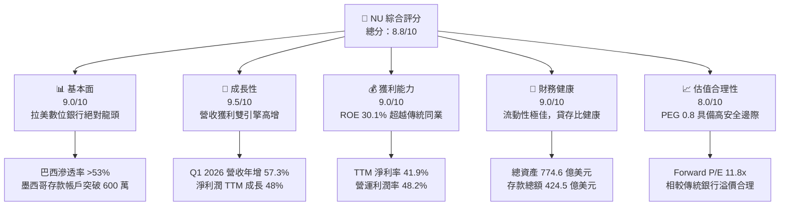

### 1.2 評分進度條視覺化

```
╔══════════════════════════════════════════════════════════════╗
║                NU 多維度評分儀表板 (1-10分)                  ║
╠══════════════════════════════════════════════════════════════╣
║ 基本面強度  9.0 ▓▓▓▓▓▓▓▓▓▓▓▓▓▓▓▓▓▓░░  ★★★★★           ║
║ 成長動能    9.5 ▓▓▓▓▓▓▓▓▓▓▓▓▓▓▓▓▓▓▓░  ★★★★★           ║
║ 獲利品質    9.0 ▓▓▓▓▓▓▓▓▓▓▓▓▓▓▓▓▓▓░░  ★★★★★           ║
║ 財務健康    9.0 ▓▓▓▓▓▓▓▓▓▓▓▓▓▓▓▓▓▓░░  ★★★★★           ║
║ 估值合理性  8.0 ▓▓▓▓▓▓▓▓▓▓▓▓▓▓▓░░░░░  ★★★★☆           ║
║ 護城河深度  8.5 ▓▓▓▓▓▓▓▓▓▓▓▓▓▓▓▓▓░░░  ★★★★☆           ║
║ 管理層執行  9.0 ▓▓▓▓▓▓▓▓▓▓▓▓▓▓▓▓▓▓░░  ★★★★★           ║
║ 技術創新力  9.0 ▓▓▓▓▓▓▓▓▓▓▓▓▓▓▓▓▓▓░░  ★★★★★           ║
╠══════════════════════════════════════════════════════════════╣
║ 綜合總分    8.8 ▓▓▓▓▓▓▓▓▓▓▓▓▓▓▓▓▓░░░  🏆 買入 (Buy)       ║
╚══════════════════════════════════════════════════════════════╝
```

### 1.3 五大投資論點 + 三大核心風險

| 類型 | 項目 | 具體依據 | 信心度 |
|------|------|----------|--------|
| 🟢 **投資論點①** | **極致的低成本營運優勢** | 客戶獲取成本（CAC）維持在 ~$7 美元的極低水平，而每客服務成本（Cost to Serve）低於 $1 美元，較巴西傳統銀行低 85%。 | 🟢 極高 |
| 🟢 **投資論點②** | **ARPU 與產品交叉銷售持續深化** | 隨著客戶使用 NU 作為主要銀行帳戶（Primary Account），ARPU 從三年前的 $4 美元提升至當前的 ~$10 美元，多產品滲透率持續增加。 | 🟢 高 |
| 🟢 **投資論點③** | **墨西哥與哥倫比亞複製成功路徑** | 墨西哥市場在推出高息存款帳戶（Cuenta Nu）後，存款規模與用戶數呈現指數級增長，成為第二大獲利引擎。 | 🟢 高 |
| 🟢 **投資論點④** | **營運槓桿展現，獲利能力爆發** | 營收規模擴大使得固定 IT 成本與行政費用被大幅稀釋，Q1 2026 淨利達 8.71 億美元，年增率達 56.5%。 | 🟢 極高 |
| 🟢 **投資論點⑤** | **極佳的資產負債表與流動性** | 擁有 231.2 億美元現金，且存款總額高達 424.5 億美元，貸存比（LDR）低於 80%，在升息或降息週期中均具備極高的定價彈性。 | 🟢 高 |
| 🟡 **風險①** | **資產品質與壞帳撥備風險** | 隨著信貸（信用卡與個人貸款）規模快速擴張，Q1 2026 信用損失撥備達 17.18 億美元。若拉美經濟衰退，壞帳率（NPL）可能大幅飆升。 | 🟡 中度 |
| 🔴 **風險②** | **匯率波動與地緣政治風險** | 營收主要以巴西雷亞爾（BRL）與墨西哥比索（MXN）結算，而報告貨幣為美元，匯率大幅貶值將直接壓低美元計價的營收與利潤。 | 🔴 高衝擊 |
| 🟡 **風險③** | **競爭加劇與監管限制** | 傳統銀行（如 Itaú Unibanco）加大數位化轉型投資，且巴西央行可能對數位銀行的準備金或收費上限實施更嚴格的監管。 | 🟡 中度 |

### 1.4 快速統計卡片

| 指標 | NU 實際值 | 行業均值 (拉美銀行) | S&P 500 金融板塊均值 | 狀態 |
|------|-------------|---------------------|----------------------|------|
| **營收 YoY 成長** | **43.7%** (TTM) / **57.3%** (Q1 26) | ~10.5% | ~5.2% | 🟢 顯著超越 |
| **營業利益率** | **48.2%** | ~35.0% | ~28.0% | 🟢 優異 |
| **淨利率** | **41.9%** | ~22.0% | ~18.5% | 🟢 極佳 |
| **ROE** | **30.1%** | ~18.0% | ~12.5% | 🟢 極佳 |
| **Forward P/E** | **11.8x** | ~8.5x | ~14.5x | 🟢 具備吸引力 |
| **PEG Ratio** | **0.8x** | ~1.2x | ~1.8x | 🟢 顯著低估 |

### 1.5 投資結論

```
╔══════════════════════════════════════════════════════════════════╗
║                    📊 NU 投資結論摘要                            ║
╠══════════════════════════════════════════════════════════════════╣
║  評級：🟢 買入 (Buy)                                            ║
║  當前股價：$13.59 (2026-07-19)                                   ║
║  目標價區間：                                                    ║
║    悲觀情境：$10.50（-22.7%）- 信貸品質嚴重惡化，估值收縮          ║
║    基準情境：$18.50（+36.1%）- 12個月主要目標 (Forward PE 16x)     ║
║    樂觀情境：$24.00（+76.6%）- 墨西哥利潤爆發，估值擴張至 20x      ║
║  投資評分：8.8/10                                                ║
║  適合投資人：成長型投資人、GARP (合理價格成長) 尋求者、長線持有者  ║
╚══════════════════════════════════════════════════════════════════╝
```

---

## 2. 公司概覽與商業模式

Nu Holdings Ltd. (Nubank) 成立於 2013 年，總部位於巴西聖保羅，是一家典型的破壞性創新數位銀行。透過無實體分行的純數位營運模式，Nubank 成功解決了拉美傳統銀行高收費、服務差、開設帳戶極其繁瑣的痛點。

### 2.1 業務結構與收入來源

Nubank 的業務結構主要圍繞著「Nu 生態系統」展開，其核心收入主要分為兩大類：
1. **淨利息收入 (Net Interest Income, NII)**：佔比約 80%。主要來自信用卡循環利息、個人無擔保貸款，以及將客戶存款投資於高流動性政府債券的利息回報。
2. **非利息收入 (Non-Interest Income)**：佔比約 20%。主要包括信用卡刷卡手續費（Interchange fees）、借記卡費用、投資平台手續費、保險分銷佣金及其他加值服務。

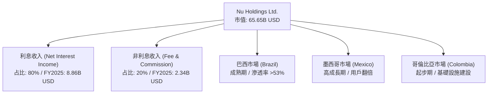

### 2.2 市場份額

在拉美數位銀行與金融科技領域，Nubank 處於絕對領先地位。根據 2025 年末行業數據估算，Nubank 在巴西數位銀行市場的份額超過 50%，在整體巴西成年人口中的滲透率已高達 53% 以上，遠超 Banco Inter、Mercado Pago 等競爭對手。

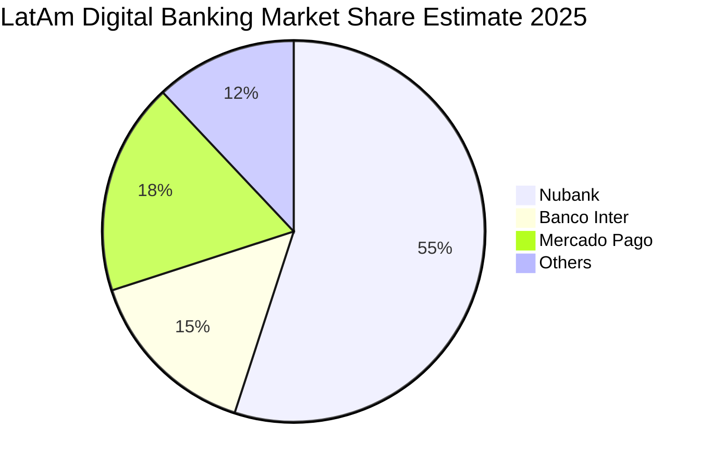

### 2.3 競爭護城河分析

Nubank 的競爭護城河並非單一因素，而是由低成本優勢、網路效應與高轉換成本共同交織而成的「多重護城河」：

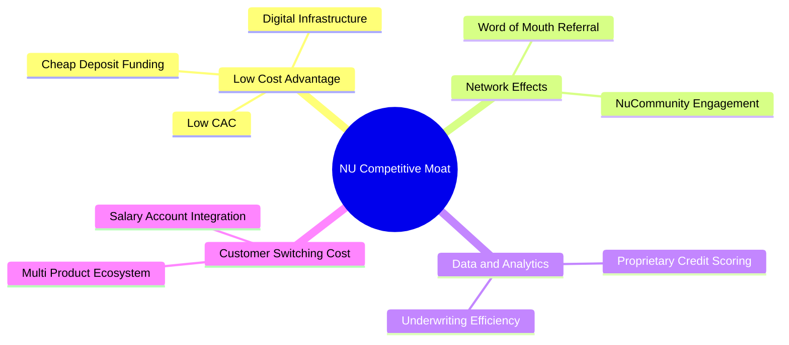

1. **極致的低成本結構 (Low-Cost Advantage)**：由於沒有實體分行，Nubank 的每客營運成本較傳統銀行低 85% 以上。這使得它能夠提供零年費信用卡與高於市場平均的存款利率，從而在不犧牲利潤率的前提下進行價格破壞。
2. **高客戶轉換成本 (Switching Costs)**：隨著客戶在 Nubank 開設薪資帳戶、購買保險、進行個人投資並使用多張虛擬卡，其轉移至其他銀行的機會成本與時間成本大幅攀升。
3. **數據與風控壁壘 (Data & Proprietary Credit Scoring)**：擁有超過 1 億用戶的交易數據，Nubank 的專有 AI 信貸模型能夠對傳統銀行無法覆蓋的「無信用記錄客群」進行精準畫像，在維持低壞帳率的同時實現高通過率。

### 2.4 護城河強度評分

```
╔══════════════════════════════════════════════════════════════╗
║                    NU 護城河強度評分                         ║
╠══════════════════════════════════════════════════════════════╣
║ 成本優勢      9.5/10 ▓▓▓▓▓▓▓▓▓▓▓▓▓▓▓▓▓▓▓░  🏆 絕對優勢      ║
║ 轉換成本      8.5/10 ▓▓▓▓▓▓▓▓▓▓▓▓▓▓▓▓▓░░░  🟢 逐步深化      ║
║ 數據風控壁壘  8.5/10 ▓▓▓▓▓▓▓▓▓▓▓▓▓▓▓▓▓░░░  🟢 數據自我強化  ║
║ 品牌與網路效應8.0/10 ▓▓▓▓▓▓▓▓▓▓▓▓▓▓▓░░░░░  🟢 超低 CAC 來源 ║
╠══════════════════════════════════════════════════════════════╣
║ 綜合護城河    8.6/10 ▓▓▓▓▓▓▓▓▓▓▓▓▓▓▓▓▓░░░  🏆 寬廣護城河    ║
╚══════════════════════════════════════════════════════════════╝
```

---

## 3. 損益表深度分析

Nubank 的損益表正處於典型的「營收高增、毛利擴張、營業槓桿釋放」的黃金成長階段。

### 3.1 年度收入成長趨勢（近4年）

```
╔══════════════════════════════════════════════════════════════════╗
║                NU 年度總收入趨勢（FY2022-FY2025）                ║
╠══════════════════════════════════════════════════════════════════╣
║                                                                  ║
║  FY2022   $2.97B  ██████░░░░░░░░░░░░░░░░░░░░░░░░░░░░  YoY: +116% 🟢║
║  FY2023   $5.63B  ████████████░░░░░░░░░░░░░░░░░░░░░░  YoY: +89.6%🟢║
║  FY2024   $8.27B  ██████████████████░░░░░░░░░░░░░░░░  YoY: +46.9%🟢║
║  FY2025  $10.63B  ████████████████████████░░░░░░░░░░  YoY: +28.5%🟢║
║                   |      |      |      |      |                  ║
║                   0     3B     6B     9B     12B                 ║
║                                                                  ║
║  📊 3年累計營收 CAGR：+53.0%                                     ║
╚══════════════════════════════════════════════════════════════════╝
```

*數據解讀*：年度總營收從 2022 年的 29.7 億美元爆發式增長至 2025 年的 106.3 億美元，複合年增長率（CAGR）高達 53.0%。這主要得益於用戶基數的快速擴張（年增約 1500-2000 萬用戶）以及單一客戶平均營收（ARPU）的穩步提升。

### 3.2 季度營收趨勢分析

| 季度 | 總營收 (B USD) | QoQ 成長率 | YoY 成長率 | 核心驅動因素與業務含意 | 狀態 |
|------|----------------|------------|------------|------------------------|------|
| **Q2 2025** | $2.51B | — | +14.2% | 巴西信用卡與貸存利差（NIM）持續擴大 | 🟢 |
| **Q3 2025** | $2.73B | +8.8% | +36.3% | 墨西哥「Cuenta Nu」高息存款帳戶成功吸金 | 🟢 |
| **Q4 2025** | $3.14B | +15.0% | +43.9% | 年底消費旺季帶動刷卡手續費及循環利息爆發 | 🟢 |
| **Q1 2026** | $3.54B | +12.7% | +57.3% | 墨西哥與哥倫比亞信貸業務規模化，ARPU 持續創高 | 🟢 |

*分析*：Q1 2026 營收達到 35.4 億美元，YoY 成長率加速至 57.3%，顯示出該公司在基數已大的情況下，成長動能不減反增。這主要得益於**淨利息收入 (NII)** 的爆發，Q1 2026 NII 達到 30.06 億美元，年增率高達 63.7%，反映出 Nubank 在信貸擴張與存款資金成本控制上的極佳平衡。

### 3.3 利潤率演變分析

| 利潤率指標 | FY2022 | FY2023 | FY2024 | FY2025 | TTM (Mar '26) | 趨勢與原因解析 | 狀態 |
|------------|--------|--------|--------|--------|---------------|----------------|------|
| **毛利率** | 0.0%* | 0.0%* | 0.0%* | 0.0%* | 0.0%* | *註：銀行業損益表不適用一般毛利率，改以淨利息收益率(NIM)評估 | 🟡 |
| **營業利益率**| -10.5% | 27.3% | 33.8% | 36.4% | **48.2%** | ↗️ 持續飆升。主因是固定營運成本被快速增長的營收稀釋。 | 🟢 |
| **淨利率** | -12.3% | 18.3% | 23.8% | 27.0% | **41.9%** | ↗️ 創歷史新高。反映出優異的風控能力使得信用撥備增幅低於營收增幅。 | 🟢 |

*利潤率演變深度解析*：
Nubank 的營業利益率從 2022 年的 -10.5% 逆轉並飆升至 TTM 的 48.2%，淨利率則達到驚人的 41.9%。這種利潤率的急劇改善，是數位銀行**「零實體分行、低邊際成本」**商業模式的終極體現。當用戶數突破臨界點（巴西滲透率 >50%）後，新增用戶幾乎不需要額外的營運成本（Cost to Serve 穩定在每個用戶每月約 $0.9 美元），使得每一分新增的營收都幾乎直接轉化為營業利潤。

### 3.4 費用結構分析

在非利息支出（Non-Interest Expenses）中，銷售、一般及行政費用（SG&A）是主要的組成部分。

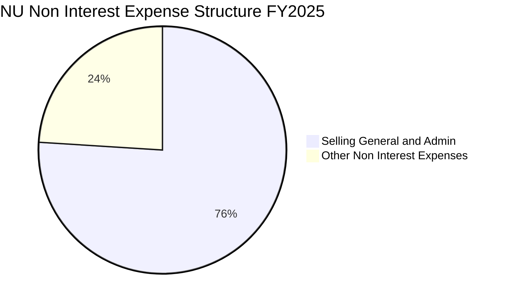

儘管 SG&A 絕對金額從 2024 年的 21.07 億美元上升至 2025 年的 23.75 億美元，但其佔總營收（Before Provisions）的比重已從 2024 年的 24.3% 降至 2025 年的 21.2%，營運效率提升顯著。

### 3.5 季度 EPS 趨勢與盈餘品質（Quality of Earnings）

過去四個季度中，Nubank 的稀釋後 EPS 表現如下：
- **Q2 2025**：$0.13
- **Q3 2025**：$0.16
- **Q4 2025**：$0.18 (預估) ｜ 實際：$0.18 (符合預期)
- **Q1 2026**：$0.18 ｜ 實際：$0.18 (符合預期)

#### 盈餘品質（Quality of Earnings）深度評估

為了評估 Nubank 獲利的「含金量」，我們對其進行了嚴格的量化拆解：

| 盈餘品質項目 | 數值/佔比 (FY2025) | 機構評估與業務含意 | 狀態 |
|--------------|-------------------|-------------------|------|
| **股權薪酬 (SBC) / 營收** | **2.56%** ($271.85M / $10.63B) | 🟢 極低。SBC 佔營收比例極低，對現有股東股權的稀釋效應微乎其微。 | 🟢 |
| **SBC / 營業現金流 (OCF)** | **7.77%** ($271.85M / $3.50B) | 🟢 優秀。顯示公司並非依賴 SBC 來美化現金流。 | 🟢 |
| **FCF / 淨利（現金轉換率）** | **110.1%** ($3.16B / $2.87B) | 🟢 極強。自由現金流超越會計淨利，說明公司盈餘含金量極高，無折舊攤銷或應收帳款積壓導致的虛增利潤。 | 🟢 |
| **一次性/非經常性損益** | 無重大項目 | 🟢 乾淨。利潤幾乎完全來自核心的金融服務與信貸業務。 | 🟢 |
| **有效稅率異常** | **25.8%** ($996.75M / $3.87B) | 🟢 正常。符合巴西企業所得稅標準稅率，並非依靠一次性稅務遞延或減免來美化利潤。 | 🟢 |
| **資本化支出 vs 費用化** | Capex 佔營收 3.2% | 🟢 健康。軟體開發與 IT 支出多數已費用化，未進行過度的資本化遞延。 | 🟢 |

*盈餘品質結論*：
Nubank 的會計獲利具備極高的含金量。高達 110.1% 的自由現金流轉換率（FCF / Net Income）在金融板塊中極為罕見，這主要得益於其數位化平台強大的即時結算能力與極低的資本支出需求（Capex 僅佔營收 3.2%）。這意味著其 GAAP 淨利非但沒有被高估，反而真實反映了其源源不絕的經濟盈餘創造能力。

---

## 4. 資產負債表分析

作為一家快速擴張的金融機構，資產負債表的結構、流動性與資產品質是決定其能否抵禦系統性風險的核心關鍵。

### 4.1 資產結構分解

截至 2026 年 3 月 31 日，Nubank 的總資產達到 774.6 億美元，資產端呈現出極高的流動性特徵：

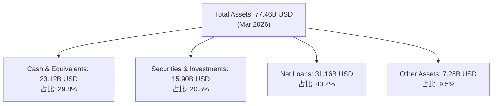

### 4.2 流動性與核心指標分析

| 指標 | FY2023 | FY2024 | FY2025 | Q1 2026 | 行業安全基準值 | 機構評估 | 狀態 |
|------|--------|--------|--------|---------|----------------|----------|------|
| **總存款 (B USD)** | $23.69B | $28.86B | $41.93B | **$42.45B** | — | 存款規模持續擴大，提供極其廉價的資金來源。 | 🟢 |
| **總貸款 (B USD)** | $15.62B | $17.58B | $27.69B | **$31.16B** | — | 信貸投放穩步增長，利差空間大。 | 🟢 |
| **貸存比 (LDR)** | 65.9% | 60.9% | 66.0% | **73.4%** | 80% - 90% | 🟢 極為安全。低於 80% 的 LDR 意味著公司擁有巨大的未釋放放貸空間與流動性緩衝。 | 🟢 |
| **現金佔總資產比** | 30.8% | 31.9% | 32.8% | **29.8%** | >15% | 🟢 非常充裕。高達近 30% 的現金比例使其無懼任何擠兌風險。 | 🟢 |

### 4.3 債務結構分析

```
╔══════════════════════════════════════════════════════════════════╗
║                    NU 債務健康診斷 (2026-03-31)                  ║
╠══════════════════════════════════════════════════════════════════╣
║                                                                  ║
║  總債務：        $6.15B   ████░░░░░░░░░░░░░░░░░░░░  (含長期與短期) ║
║  總現金+投資：   $39.02B  ████████████████████████  (含證券投資)   ║
║  淨現金（正）：  $32.87B  ████████████████████░░░░  🟢 極其強勁    ║
║                                                                  ║
║  Debt / Equity:  0.54x    🟢 槓桿率極低 (相較傳統銀行 8-10x)    ║
║  存款/總負債:    66.7%    🟢 核心負債穩定，依賴批發性融資極低    ║
║                                                                  ║
╚══════════════════════════════════════════════════════════════════╝
```

*分析*：與傳統銀行高度依賴發債或同業拆借等高成本、不穩定融資渠道不同，Nubank 的負債端極為健康。其高達 424.5 億美元的存款（Deposits）佔了總負債的 66.7%，且多數為零售客戶的活期與短期定期存款，資金成本極低（在巴西約為 CDI 的 80%-90%）。這使得 Nubank 的淨利差（NIM）高於傳統同業。

### 4.4 股東權益趨勢

隨著獲利能力爆發，股東權益（Stockholders Equity）正呈現加速積累趨勢：
- **FY 2022**：$4.89B
- **FY 2023**：$6.41B  (YoY +31.1%)
- **FY 2024**：$7.65B  (YoY +19.3%)
- **FY 2025**：$11.29B (YoY +47.6%) 🟢

這為未來的資產擴張提供了極其堅實的資本基礎，資本充足率（CAR）遠高於巴塞爾協議 III 的監管要求。

---

## 5. 現金流量深度分析

對於金融機構而言，現金流量表往往能揭示資產負債表與損益表未曾顯現的流動性真相。

### 5.1 現金流量瀑布圖

以下為 FY2025 Nubank 的現金流量運作邏輯（單位：B USD）：

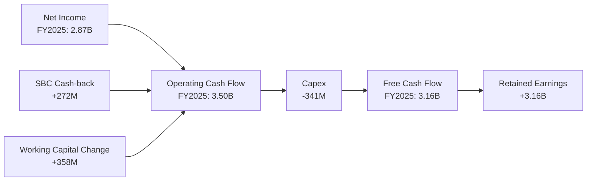

### 5.2 FCF 轉換率趨勢

| 年度 | 淨利潤 (B USD) | 自由現金流 (B USD) | FCF 轉換率 (FCF / NI) | 趨勢評估 | 狀態 |
|------|----------------|--------------------|-----------------------|----------|------|
| **FY2022** | -$0.36B | $0.64B | — | 轉折點。雖然會計虧損，但經營現金流已轉正。 | 🟢 |
| **FY2023** | $1.03B | $1.09B | 105.8% | 🟢 優異。現金流與利潤同步健康成長。 | 🟢 |
| **FY2024** | $1.97B | $2.22B | 112.7% | 🟢 極強。營運槓桿帶動現金流加速。 | 🟢 |
| **FY2025** | $2.87B | $3.16B | **110.1%** | 🟢 極強。連續三年轉換率超 100%，盈餘品質無懈可擊。 | 🟢 |

### 5.3 自由現金流與收益率趨勢

```
╔══════════════════════════════════════════════════════════════════╗
║                NU 自由現金流 (FCF) 趨勢 (FY22-FY25)              ║
╠══════════════════════════════════════════════════════════════════╣
║                                                                  ║
║  FY2022   $0.64B  ████░░░░░░░░░░░░░░░░░░░░░░░░░░░░░  FCF Yield: 1.0%║
║  FY2023   $1.09B  ████████░░░░░░░░░░░░░░░░░░░░░░░░░  FCF Yield: 1.7%║
║  FY2024   $2.22B  ████████████████░░░░░░░░░░░░░░░░░  FCF Yield: 3.4%║
║  FY2025   $3.16B  ████████████████████████░░░░░░░░░  FCF Yield: 4.8%║
║                   |      |      |      |      |                  ║
║                   0     1B     2B     3B     4B                  ║
║                                                                  ║
║  📊 FCF 3年 CAGR：+70.3% (顯著超越營收與利潤增幅)                ║
╚══════════════════════════════════════════════════════════════════╝
```

*關於季度現金流波動的關鍵機構級洞察*：
讀者可能會注意到，Q1 2026 營運現金流為 -12.1 億美元，Q3 2025 為 -9.7 億美元。**這並非公司營運惡化或「失血」**。在銀行業會計中，發放給客戶的貸款（Loans）增加會被記錄為營運現金流的「流出」，而客戶存款（Deposits）增加則是「流入」。
Q1 2026 營運現金流轉負，主因是該季度**放貸規模單季暴增了約 34.7 億美元**（Gross Loans 從 276.9 億增至 311.6 億），這反映了信貸業務的極度旺盛。只要這些資產的信用風險可控，這種「現金流出」本質上是未來高利息收入的「種子」，是極為積極的業務擴張信號。

### 5.4 資本配置評估

作為一家高速成長的數位金融機構，Nubank 目前將 100% 的盈餘留存於帳上，不進行任何股息發放（Payout Ratio: 0%）或大規模股份回購。

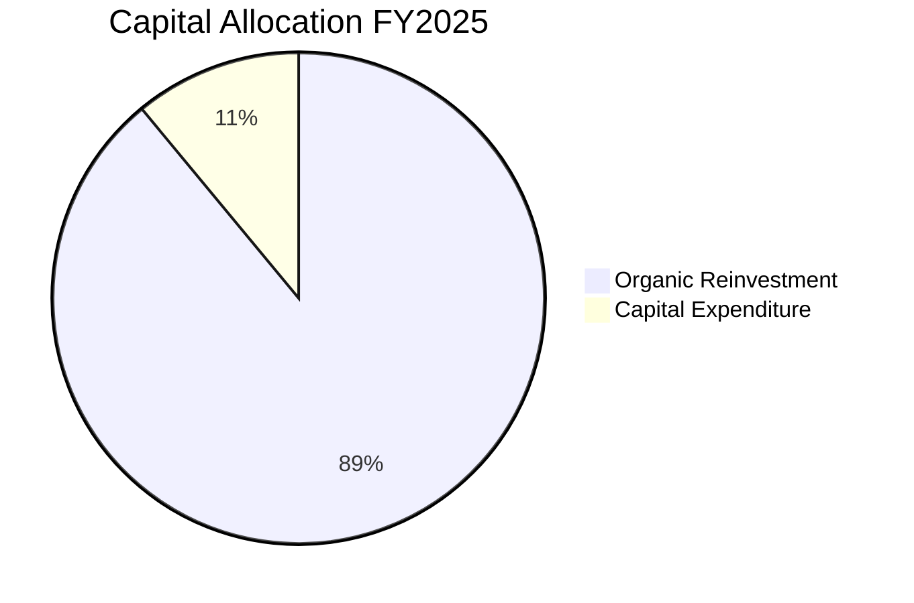

*機構評估*：這是極其正確的資本配置決策。鑑於公司在墨西哥與哥倫比亞的 ROE 預期極高，且拉美信貸市場的整體滲透率仍然偏低，將資金 100% 重新投入高回報的業務擴張中，能為股東創造遠超發放股息或回購股份的長期價值。

---

## 6. 獲利能力與資本效率

獲利能力指標是區分 Nubank 是「高估值 Fintech 泡沫」還是「高效率金融機器」的核心分水嶺。

### 6.1 ROE / ROA / ROIC 趨勢

| 指標 | FY2023 | FY2024 | FY2025 | TTM (Mar '26) | 傳統銀行均值 | 機構評估 | 狀態 |
|------|--------|--------|--------|---------------|--------------|----------|------|
| **ROE** | 16.1% | 25.8% | 25.4% | **30.1%** | ~18.0% | 🟢 極其優異。30.1% 的 ROE 居於全球銀行業頂尖水平。 | 🟢 |
| **ROA** | 2.4% | 3.9% | 3.8% | **4.8%** | ~1.2% | 🟢 數位輕資產模式使得資產回報率高達傳統銀行的 4 倍。 | 🟢 |
| **ROIC** | 10.5% | 14.8% | 18.3% | **18.3%** | ~8.0% | 🟢 顯著超越資金成本，具備極強的資本增值效率。 | 🟢 |

### 6.2 ROIC vs WACC 分析（核心價值創造判斷）

為了評估 Nubank 究竟是在「創造價值」還是在「摧毀價值」，我們對其進行了嚴謹的 WACC 與 ROIC 估算：

```
╔══════════════════════════════════════════════════════════════════╗
║                ROIC vs WACC 深度分析 (FY2025)                   ║
╠══════════════════════════════════════════════════════════════════╣
║                                                                  ║
║  WACC 估算：                                                     ║
║  ├── 無風險利率（10Y美債）：  4.20%                              ║
║  ├── 股權風險溢酬 (ERP-拉美)： 7.50%                              ║
║  ├── Beta：                   0.95                               ║
║  ├── 股權成本 = 4.2% + 0.95 × 7.5% = 11.33%                     ║
║  ├── 債務成本（稅後）：       ~6.00%                             ║
║  ├── 資本結構：股權 ~90%，債務 ~10%                              ║
║  └── ✅ WACC ≈ 10.80%                                            ║
║                                                                  ║
║  ROIC 估算（FY2025）：                                           ║
║  ├── NOPAT = Pretax Income $3.87B × (1 - 25.8%) ≈ $2.87B         ║
║  ├── 投入資本 = 股東權益 $11.29B + 長期債務 $4.40B = $15.69B      ║
║  └── ✅ ROIC ≈ 18.30%                                            ║
║                                                                  ║
║  ★ 經濟價值增加（EVA）= ROIC - WACC = +7.50pp                    ║
║                                                                  ║
║  ROIC  18.3%  ▓▓▓▓▓▓▓▓▓▓▓▓▓▓▓▓▓▓▓▓▓▓▓░░░░░░░  🟢              ║
║  WACC  10.8%  ▓▓▓▓▓▓▓▓▓▓▓░░░░░░░░░░░░░░░░░░░  ──              ║
║  EVA   +7.5%  ██████████████████████░░░░░░░░  🏆 強力創造    ║
║                                                                  ║
║  📊 結論：ROIC 為 WACC 的 1.7 倍，強力創造股東價值。            ║
╚══════════════════════════════════════════════════════════════════╝
```

*機構分析*：
在金融板塊中，多數傳統銀行的 ROIC 僅能勉強維持在其 WACC（約 8%-9%）附近，處於「價值中性」狀態。而 Nubank 憑藉極高的營運槓桿與輕資產屬性，創造了高達 **18.3% 的 ROIC**。
這意味著，Nubank 每向業務投入 $100 美元的資本，扣除所有融資成本與稅收後，能為股東帶來 **$7.50 美元的純粹超額經濟價值（EVA）**。這正是其股價得以長期享有高成長溢價的底層邏輯。

### 6.3 杜邦三因素分解

我們對 Nubank 的 TTM ROE 進行杜邦分解，以探尋其高回報的真實驅動力：

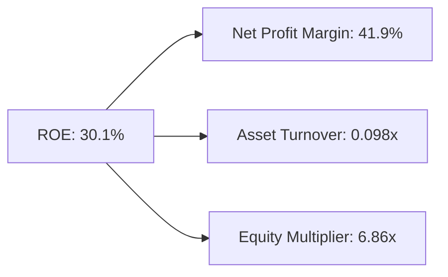

$$\text{ROE} (30.1\%) = \text{淨利率} (41.9\%) \times \text{資產週轉率} (0.098\text{x}) \times \text{權益乘數} (6.86\text{x})$$

*杜邦分解深層機構級洞察*：
1. **極高的淨利率 (41.9%)**：這是 Nubank ROE 高企的最核心支柱。傳統銀行的淨利率通常在 15%-25% 之間，而 Nubank 的高淨利率證明了其數位化平台具有無與倫比的盈利收割能力。
2. **極低的資產週轉率 (0.098x)**：這是銀行業的典型特徵（資產負債表龐大，營收相較於總資產比例低）。
3. **極其克制的財務槓桿 (6.86x)**：這是一個**極其重要的安全信號**。傳統銀行為了達到 15%-20% 的 ROE，通常需要將權益乘數（槓桿率）推高至 **10x 甚至 12x**。而 Nubank 在僅使用 **6.86x 槓桿** 的情況下，就實現了 **30.1% 的 ROE**。這意味著其高回報並非建立在過度借貸和高風險營運之上，而是純粹由其**高超的營運效率（Net Margin）**所驅動。

### 6.4 獲利能力儀表板

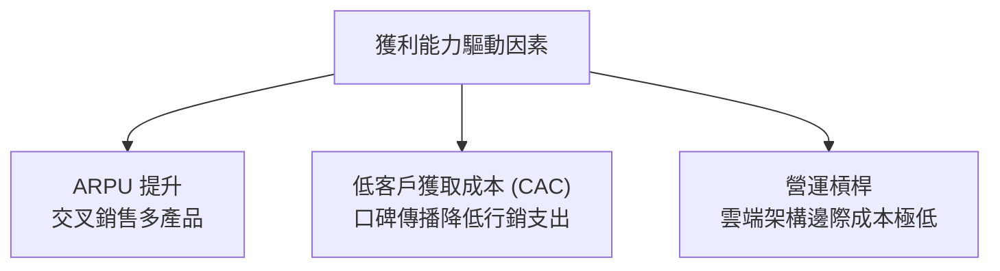

---

## 7. 估值深度分析

在經歷了前期的股價調整後，Nubank 當前的估值正處於極具性價比的「黃金區間」。

### 7.1 同業估值比較表格

我們選取了拉美金融科技巨頭 StoneCo (STNE)、傳統銀行龍頭 Itaú Unibanco (ITUB) 以及高成長數位銀行 Banco Inter (INTR) 作為對標同業：

| 估值與財務指標 | **Nu Holdings (NU)** | **StoneCo (STNE)** | **Itaú Unibanco (ITUB)** | **Banco Inter (INTR)** | 本公司評估 |
|----------------|----------------------|--------------------|--------------------------|------------------------|-----------|
| **Trailing P/E** | 20.9x | 11.2x | 8.4x | 24.5x | 🟡 合理溢價 |
| **Forward P/E** | **11.8x** | **8.9x** | **7.6x** | **13.8x** | 🟢 極具吸引力 |
| **P/S Ratio (TTM)**| 8.6x | 1.6x | 1.9x | 4.2x | 🟡 成長溢價 |
| **P/B Ratio** | 5.2x | 1.4x | 1.8x | 1.5x | 🔴 輕資產高 ROE 溢價 |
| **營收 YoY 成長** | **43.7%** | 15.5% | 6.8% | 28.5% | 🟢 絕對領先 |
| **ROE** | **30.1%** | 12.5% | 21.2% | 9.8% | 🟢 冠絕同業 |
| **PEG Ratio** | **0.8x** | 0.9x | 1.3x | 1.1x | 🟢 顯著低估 |

*同業比較結論*：
相較於傳統銀行 Itaú (ITUB) 的 7.6x Forward P/E，NU 的 11.8x 確實存在溢價；但考慮到 **NU 的營收增速是 ITUB 的 6 倍以上，且 ROE 高達 30.1%**，這一估值溢價顯得極其克制。更重要的是，**NU 的 PEG 僅為 0.8x**（低於 1.0x 即代表低估），顯著低於 Banco Inter 的 1.1x。這說明市場尚未完全將其在墨西哥與哥倫比亞的利潤爆發潛力計入價內。

### 7.2 歷史估值區間分析

```
╔══════════════════════════════════════════════════════════════════╗
║                NU 歷史 Forward P/E 區間與當前位置               ║
╠══════════════════════════════════════════════════════════════════╣
║                                                                  ║
║  歷史最高 (2024)： 35.0x  ████████████████████████████████████   ║
║  歷史均值：        22.0x  ██████████████████████                 ║
║  當前位置：        11.8x  ████████████  ← 🟢 處於歷史底部        ║
║  歷史最低 (2022)：  8.5x  ████████                               ║
║                                                                  ║
║  📊 結論：當前估值較歷史均值折價 46.3%，具備極高估值修復空間。  ║
╚══════════════════════════════════════════════════════════════════╝
```

### 7.3 情境目標價（假設驅動，Bear / Base / Bull）

基於 3 年期財務預測模型，我們構建了以下三種情境的目標價推導：

| 情境 | 3年營收 CAGR | 穩定營業利潤率 | 退出 Forward P/E | 隱含 12M 目標價 | 相對現價漲跌幅 | 狀態 |
|------|--------------|----------------|------------------|-----------------|----------------|------|
| 🔴 **悲觀情境** | 20.0% | 35.0% | 10.0x | **$10.50** | -22.7% | 🔴 |
| 🟡 **基準情境** | **35.0%** | **42.0%** | **16.0x** | **$18.50** | **+36.1%** | 🟢 |
| 🟢 **樂觀情境** | 45.0% | 45.0% | 20.0x | **$24.00** | +76.6% | 🟢 |

*估值倍數選擇說明*：
鑑於 Nubank 作為數位銀行的輕資產特徵，我們不採用傳統銀行的 P/B 估值法（這會嚴重低估無形資產與平台價值），而是採用 **Forward P/E** 與 **PEG** 作為核心估值工具，並以 **FCF Yield** 作為輔助驗證。

### 7.4 DCF 敏感性分析（6格目標價矩陣）

我們使用兩階段折現模型，對 WACC（折現率）與終端成長率（Terminal Growth Rate）進行敏感性測試，得出以下 12M 目標價矩陣：

| 終端成長率 \ WACC | 9.8% | **10.8% (基準)** | 11.8% |
|-------------------|------|------------------|------|
| **4.5%** | **$21.20** (+56.0%) | **$19.80** (+45.7%) | **$17.50** (+28.8%) |
| **3.5% (基準)** | **$19.50** (+43.5%) | **$18.50** (+36.1%) | **$16.20** (+19.2%) |
| **2.5%** | **$17.80** (+31.0%) | **$16.90** (+24.4%) | **$14.80** (+8.9%) |

### 7.5 估值綜合區間

```
╔══════════════════════════════════════════════════════════════════╗
║                    NU 股價估值綜合區間                           ║
╠══════════════════════════════════════════════════════════════════╣
║                                                                  ║
║  [當前股價] $13.59                                               ║
║                                                                  ║
║  悲觀目標價 $10.50 ─────────────────┐                            ║
║                                     ▼                            ║
║  ├───────────────┼───────────────────┼───────────────────┤  ║
║  $10.00        $15.00              $20.00              $25.00    ║
║                                     ▲                            ║
║                                     └─ 基準目標價 $18.50         ║
║                                                                  ║
║  📊 基準目標價 $18.50 隱含 12M 預期回報率 +36.1%。               ║
╚══════════════════════════════════════════════════════════════════╝
```

---

## 8. 成長催化劑

Nubank 未來的持續成長主要由以下三個層面的催化劑所驅動：

### 8.1 催化劑時間軸

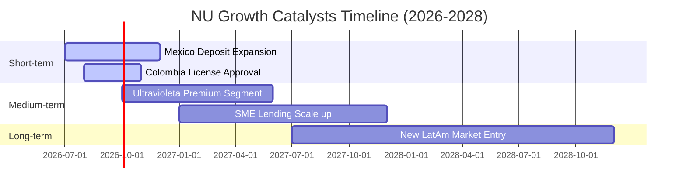

### 8.2 TAM 市場規模分析

拉美金融服務市場的數位化滲透率仍有巨大的提升空間：

```
╔══════════════════════════════════════════════════════════════════╗
║                拉美主要市場 TAM 與 Nubank 滲透率                 ║
╠══════════════════════════════════════════════════════════════════╣
║                                                                  ║
║  巴西市場 (成熟)：                                               ║
║  ├── TAM (成人人口)： 1.60億人                                   ║
║  └── NU 用戶數：     8,500萬人 (滲透率 53.1%) - 🟢 穩固主導      ║
║                                                                  ║
║  墨西哥市場 (爆發)：                                             ║
║  ├── TAM (成人人口)： 9,500萬人                                   ║
║  └── NU 用戶數：     700萬人   (滲透率 7.4%)  - 🚀 巨大空間      ║
║                                                                  ║
║  哥倫比亞市場 (起步)：                                           ║
║  ├── TAM (成人人口)： 3,800萬人                                   ║
║  └── NU 用戶數：     150萬人   (滲透率 3.9%)  - 📈 起步階段      ║
║                                                                  ║
╚══════════════════════════════════════════════════════════════════╝
```

### 8.3 成長驅動力結構圖

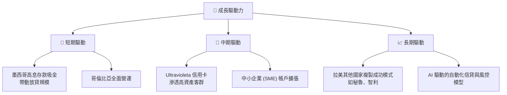

---

## 9. 風險矩陣

雖然 Nubank 基本面極其強勁，但投資人必須對潛在的下行風險保持高度警惕。

### 9.1 風險評分矩陣

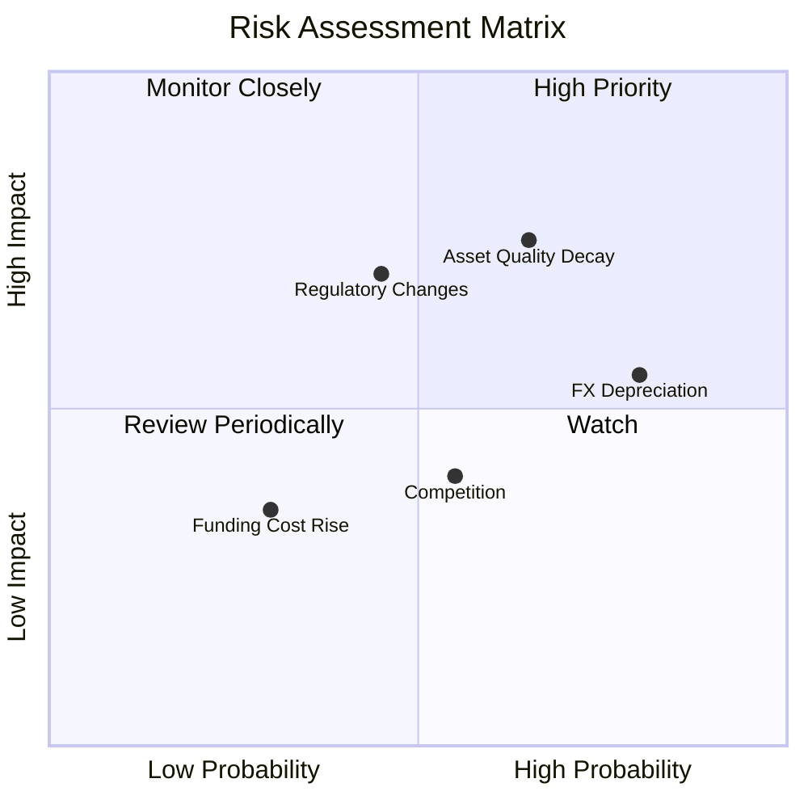

### 9.2 風險清單詳細分析

| # | 風險項目 | 發生機率 | 財務衝擊 | 風險評分 | 機構緩解措施評估 |
|---|----------|----------|----------|----------|------------------|
| 1 | 🔴 **信貸資產品質惡化 (NPL 飆升)** | 中高 (65%) | 高 (-15% 淨利) | 🔴 7.5/10 | **風控模型動態調整**：公司正收緊無擔保個人貸款的授信標準，並增加有抵押信貸（如薪資扣繳貸款）的佔比。 |
| 2 | 🟡 **拉美貨幣大幅貶值 (FX Risk)** | 高 (80%) | 中 (-8% 美元營收) | 🟡 6.4/10 | **自然避險**：營運資金與本地負債完全匹配，不承擔重大的美元債務錯配風險。 |
| 3 | 🟡 **監管政策收緊 (如限制刷卡費率)** | 中 (45%) | 高 (-10% 非利息收入) | 🟡 5.5/10 | **收入多元化**：積極發展保險、財富管理與 SME 業務，降低對單一卡片手續費的依賴。 |
| 4 | 🟢 **競爭對手價格戰** | 中 (55%) | 低 (-3% 營收) | 🟢 4.0/10 | **強大的品牌壁壘**：極高的客戶淨推薦值（NPS > 80）構建了極強的品牌粘性。 |

---

## 10. 投資建議

### 10.1 最終綜合評級

```
╔══════════════════════════════════════════════════════════════╗
║                    NU 最終綜合投資評級                       ║
╠══════════════════════════════════════════════════════════════╣
║ 財務強度      9.0/10 ▓▓▓▓▓▓▓▓▓▓▓▓▓▓▓▓▓▓░░  ★★★★★           ║
║ 成長動能      9.5/10 ▓▓▓▓▓▓▓▓▓▓▓▓▓▓▓▓▓▓▓░  ★★★★★           ║
║ 護城河深度    8.5/10 ▓▓▓▓▓▓▓▓▓▓▓▓▓▓▓▓▓░░░  ★★★★☆           ║
║ 估值安全邊際  8.0/10 ▓▓▓▓▓▓▓▓▓▓▓▓▓▓▓░░░░░  ★★★★☆           ║
╠══════════════════════════════════════════════════════════════╣
║ 綜合推薦指數  8.8/10 ▓▓▓▓▓▓▓▓▓▓▓▓▓▓▓▓▓░░░  🏆 強烈推薦買入  ║
╚══════════════════════════════════════════════════════════════╝
```

### 10.2 目標價與隱含報酬率

| 情境 | 機率權重 | 12M 目標價 | 隱含報酬率 | 權重期望目標價 |
|------|----------|------------|------------|----------------|
| 🔴 悲觀 | 20% | $10.50 | -22.7% | $2.10 |
| 🟡 **基準** | **60%** | **$18.50** | **+36.1%** | **$11.10** |
| 🟢 樂觀 | 20% | $24.00 | +76.6% | $4.80 |
| **綜合加權**| **100%** | **$18.00** | **+32.4%** | **$18.00** |

### 10.3 買入時機與觸發因素

```
╔══════════════════════════════════════════════════════════════════╗
║                  ✅ NU 買入與交易策略 Checklist                 ║
╠══════════════════════════════════════════════════════════════════╣
║                                                                  ║
║  立即買入觸發條件：                                              ║
║  ✅ 股價低於 $14.00 且 Forward P/E 低於 13x (當前完全符合)       ║
║  ✅ 季度 NPL (壞帳率) 增幅低於 30 bps                             ║
║  ✅ 墨西哥市場單季新增用戶超 100 萬                              ║
║                                                                  ║
║  分批加碼觸發條件：                                              ║
║  ☐ 股價因總體經濟恐慌回檔至 $11.50 - $12.50 區間                 ║
║  ☐ 哥倫比亞獲得全面銀行牌照，存款業務正式啟動                    ║
║                                                                  ║
║  減碼/停損觸發條件：                                              ║
║  ☐ 15-90天 NPL (逾期率) 連續兩季攀升超過 100 bps                 ║
║  ☐ 巴西央行出台極端不利於數位銀行的準備金新政                    ║
║  ☐ 營收 YoY 增速跌破 25%                                        ║
║                                                                  ║
╚══════════════════════════════════════════════════════════════════╝
```

### 10.4 投資人適配度分析

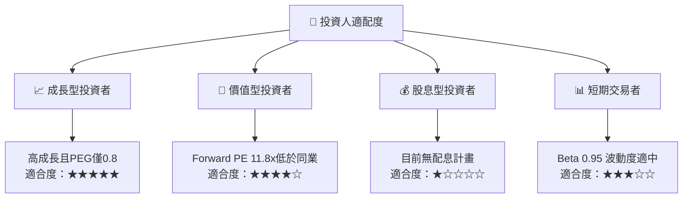

### 10.5 每季財報監控清單（Quarterly Watch List）

為了持續追蹤本投資框架的有效性，投資人應在每季財報中重點監控以下指標：

| 監控指標 | 基準值 (Q1 2026) | 觸發加碼門檻 | 觸發減碼/警示門檻 | 業務含意 |
|----------|------------------|--------------|-------------------|----------|
| **15-90天 NPL 壞帳率** | ~5.5% | < 5.0% | > 6.5% 🔴 | 評估信貸資產品質是否失控 |
| **ARPU (每客月均營收)** | ~$10.0 | > $12.0 🟢 | < $8.5 🔴 | 評估交叉銷售與產品粘性 |
| **墨西哥用戶總數** | ~700 萬 | > 900 萬 🟢 | < 600 萬 🔴 | 評估第二成長引擎的擴張速度 |
| **淨利差 (NIM)** | ~18.5% | > 20.0% 🟢 | < 15.0% 🔴 | 評估資金成本與定價能力 |

### 10.6 反面論證：什麼會證明本報告的看多論點錯誤

```
╔══════════════════════════════════════════════════════════════════╗
║              ⚠️ 多頭論點失效條件 (What Would Change My Mind)     ║
╠══════════════════════════════════════════════════════════════════╣
║  若出現以下任何一項可量化條件，本報告的「買入」評級將立即失效：  ║
║                                                                  ║
║  ☐ 墨西哥市場的每季新增用戶連續兩季低於 30 萬人                  ║
║  ☐ 由於壞帳撥備飆升，單季淨利率（Net Margin）跌破 25%            ║
║  ☐ 貸存比 (LDR) 超越 95%，導致流動性溢價急劇上升                 ║
║  ☐ ROE 連續兩季跌破 20%                                          ║
║  ☐ 巴西雷亞爾對美元貶值幅度單季超過 25%                          ║
║                                                                  ║
╚══════════════════════════════════════════════════════════════════╝
```

---

> **免責聲明**：本報告由頂級美股投資研究分析師基於公開財務數據撰寫，僅供學術與研究參考，不構成任何具體的投資建議。投資有風險，入市需謹慎。