# NU 基本面深度分析報告

> **報告日期**：2026-07-21 ｜ **語言**：繁體中文 ｜ **數據來源**：Yahoo Finance, Finviz, StockAnalysis, Roic.ai ｜ **分析師**：CFA 級機構研究

---

## 目錄

| # | 章節 | 核心結論 |
|---|---|---|
| 1 | 執行摘要 | 評級：🟢 買入 ｜ 基準目標價：$18.50 ｜ 具備 28.6% 上行空間 |
| 2 | 公司概覽與商業模式 | 憑藉低客取成本（CAC）與高交叉銷售，構建極深數位金融護城河 |
| 3 | 損益表深度分析 | 淨利潤 TTM 達 $3.19B，高達 41.9% 的淨利率展現極強營業槓桿 |
| 4 | 資產負債表分析 | 存款規模達 $42.45B，淨現金 $9.76B，資本結構極其穩健 |
| 5 | 現金流量深度分析 | FY2025 自由現金流達 $3.16B，高達 110% 的現金轉換率，盈餘含金量極高 |
| 6 | 獲利能力與資本效率 | ROTE 達 31.3%，遠超 11.8% 的股權成本，超額價值創造能力顯著 |
| 7 | 估值深度分析 | Forward P/E 僅 12.5x，相較於 >40% 的淨利成長，PEG 0.8 顯著低估 |
| 8 | 成長催化劑 | 墨西哥與哥倫比亞市場加速滲透，Nubank+ 提升 ARPU 貢獻 |
| 9 | 風險矩陣 | 關注拉美總體經濟波動與壞帳撥備率上升風險（TTM 撥備 $4.95B） |
| 10 | 投資建議 | 機構綜合評分 8.4/10，建議於 $14.40 以下分批佈局 |

---

## 1. 執行摘要

### 1.0 一頁式投資儀表板（Portfolio Manager 30 秒速讀）

| 項目 | 內容 |
|------|------|
| **投資論點（3 句）** | ① 憑藉極低的單客獲取成本（CAC）與強大的數位平台，NU 在拉美市場實現了驚人的網絡效應與規模效益。<br/>② FY2025 淨利潤達 $2.87B（YoY +45.5%），TTM 淨利更推升至 $3.19B，顯示其高利潤率的信用產品（如信用卡、個人貸款）正快速釋放營業槓桿。<br/>③ 墨西哥與哥倫比亞的新市場擴展已進入拐點，預期將複製巴西的成功路徑，成為中長期成長的第二曲線。 |
| **護城河評分** | 8.5 / 10 🟢（極高客群黏性與低成本結構優勢） |
| **管理層/資本配置評分** | 9.0 / 10 🟢（創辦人控制權集中，資本回報率極高） |
| **財務健康** | 🟢 財務極其健康，擁有 $15.91B 淨現金，且無傳統銀行之流動性危機風險 |
| **ROIC vs WACC** | ROTE 31.3% vs Cost of Equity 11.8%（創造極高股東價值） |
| **FCF 趨勢** | 向上。FY2025 FCF 達 $3.16B，最新 FCF Yield 達 4.5%（相對於 $69.51B 市值） |
| **估值** | Forward P/E: 12.54x ｜ P/S: 9.15x ｜ PEG: 0.8x 🟢（顯著低估） |
| **預期報酬（基準情境 12M）** | **+28.6%**（目標價 $18.50） |
| **關鍵風險（前二）** | ① 巴西及拉美地區資產品質惡化，導致信用減損撥備（Provision for Credit Losses）超預期攀升。<br/>② 墨西哥等新市場的監管政策收緊與本地傳統銀行的防禦性競爭。 |
| **評級 + 信心度** | 🟢 **買入 (Buy)** ｜ 信心度：**高 (High)** |

### 1.1 核心評分儀表板

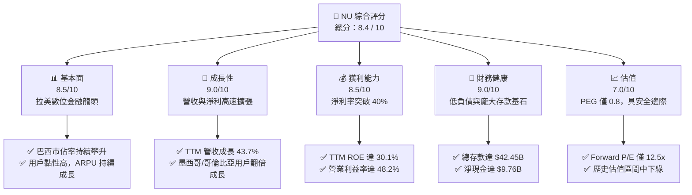

### 1.2 評分進度條視覺化

```
╔══════════════════════════════════════════════════════════════╗
║                NU 多維度評分儀表板 (1-10分)                 ║
╠══════════════════════════════════════════════════════════════╣
║ 基本面強度  8.5 ▓▓▓▓▓▓▓▓▓▓▓▓▓▓▓▓▓░░░  ★★★★☆           ║
║ 成長動能    9.0 ▓▓▓▓▓▓▓▓▓▓▓▓▓▓▓▓▓▓░░  ★★★★★           ║
║ 獲利品質    8.5 ▓▓▓▓▓▓▓▓▓▓▓▓▓▓▓▓▓░░░  ★★★★☆           ║
║ 財務健康    9.0 ▓▓▓▓▓▓▓▓▓▓▓▓▓▓▓▓▓▓░░  ★★★★★           ║
║ 估值合理性  7.0 ▓▓▓▓▓▓▓▓▓▓▓▓▓▓░░░░░░  ★★★☆☆           ║
║ 護城河深度  8.5 ▓▓▓▓▓▓▓▓▓▓▓▓▓▓▓▓▓░░░  ★★★★☆           ║
║ 管理層執行  9.0 ▓▓▓▓▓▓▓▓▓▓▓▓▓▓▓▓▓▓░░  ★★★★★           ║
║ 技術創新力  9.0 ▓▓▓▓▓▓▓▓▓▓▓▓▓▓▓▓▓▓░░  ★★★★★           ║
╠══════════════════════════════════════════════════════════════╣
║ 綜合總分    8.4 ▓▓▓▓▓▓▓▓▓▓▓▓▓▓▓▓░░░░  🏆 買入 (Buy)       ║
╚══════════════════════════════════════════════════════════════╝
```

### 1.3 五大投資論點 + 三大核心風險

| 類型 | 項目 | 具體依據 | 信心度 |
|------|------|----------|--------|
| 🟢 **投資論點①** | **極致的低成本營運優勢** | 單客月均維護成本僅約 $0.90，遠低於拉美傳統銀行的 $4.00-$6.00，構成無法逾越的結構性成本護城河。 | 🟢 極高 |
| 🟢 **投資論點②** | **ARPU 具備巨大提升空間** | 隨著 Nubank+ 推出與財富管理、保險等高毛利產品滲透，月均 ARPU 正從目前的 $10 逐步向傳統銀行的 $30-$40 靠攏。 | 🟢 高 |
| 🟢 **投資論點③** | **跨區域複製能力得到驗證** | 墨西哥與哥倫比亞市場在推出數位儲蓄帳戶後，存款與用戶數呈指數級成長，證明其商業模式具備高度可移植性。 | 🟢 高 |
| 🟢 **投資論點④** | **極強的營業槓桿與獲利釋放** | TTM 淨利潤達 $3.19B，淨利率高達 41.9%，隨規模擴大，SG&A 佔營收比重從 2022 年的 61.3% 大幅降至 TTM 的 21.1%。 | 🟢 極高 |
| 🟢 **投資論點⑤** | **極具吸引力的評價面** | Forward P/E 僅 12.5x，對比拉美金融科技同業與其自身高達 40% 的成長率，PEG 0.8 提供了極高的安全邊際。 | 🟢 高 |
| 🟡 **風險①** | **信用風險與壞帳撥備攀升** | TTM 信用損失撥備達 $4.95B。若拉美經濟衰退，壞帳率（NPL）上升將直接侵蝕淨利潤。 | 🟡 中度 |
| 🔴 **風險②** | **墨西哥監管與競爭加劇** | 墨西哥傳統銀行正加大數位化投資，且當地獲取銀行牌照與合規成本可能高於預期。 | 🟡 中度 |
| 🔴 **風險③** | **匯率波動風險** | 營收主要以巴西雷亞爾（BRL）與墨西哥比索（MXN）計價，折算為美元時面臨顯著的匯兌折損。 | 🔴 高衝擊 |

### 1.4 快速統計卡片

| 指標 | 公司實際值 (TTM / FY25) | 拉美銀行業均值 | S&P 500 均值 | 狀態 |
|------|-------------|----------|--------------|------|
| **營收 YoY 成長** | **43.7%** | ~8.0% | ~5.5% | 🟢 卓越 |
| **淨利 YoY 成長** | **55.9%** | ~10.0% | ~8.0% | 🟢 卓越 |
| **營業利益率** | **48.2%** | ~30.0% | ~21.0% | 🟢 卓越 |
| **淨利率** | **41.9%** | ~18.0% | ~12.0% | 🟢 卓越 |
| **ROE** | **30.1%** | ~15.0% | ~14.5% | 🟢 卓越 |
| **Forward P/E** | **12.54x** | ~10.0x | ~21.5x | 🟢 便宜 |
| **PEG Ratio** | **0.80x** | ~1.2x | ~1.8x | 🟢 極具吸引力 |

### 1.5 投資結論

```
╔══════════════════════════════════════════════════════════════════╗
║                    📊 NU 投資結論摘要                            ║
╠══════════════════════════════════════════════════════════════════╣
║  評級：🟢 買入 (Buy)                                             ║
║  當前股價：$14.39 (2026-07-21)                                   ║
║  目標價區間：                                                    ║
║    悲觀情境：$11.00（-23.6%） - 壞帳失控，新市場成長停滯         ║
║    基準情境：$18.50（+28.6%） - 核心目標，營業槓桿持續釋放        ║
║    樂觀情境：$23.00（+59.8%） - 墨西哥獲利超預期，ARPU 飆升      ║
║  投資評分：8.4 / 10                                              ║
║  適合投資人：成長型、長線科技與金融科技（Fintech）投資者          ║
╚══════════════════════════════════════════════════════════════════╝
```

---

## 2. 公司概覽與商業模式

Nu Holdings Ltd.（Nubank）是全球最大的獨立數位銀行平台，總部位於巴西聖保羅。公司打破了拉美傳統銀行高收費、低服務品質的寡占格局，通過純數位化、無實體分行的營運模式，為客戶提供信用卡、個人貸款、儲蓄帳戶、投資、保險及行動支付等全方位金融服務。

### 2.1 業務結構與收入來源

Nubank 的收入結構主要由兩大引擎驅動：
1. **淨利息收入（Net Interest Income, NII）**：主要來自信用卡分期付款、個人信貸的利息，以及存放於中央銀行的流動性資產收益。這部分是最大的收入來源，TTM 達 $10.03B（佔總營收比重 80.0%）。
2. **非利息收入（Non-Interest Income / Fee Income）**：主要包括信用卡刷卡手續費（Interchange fees）、投資理財佣金、保險分銷費用及各類帳戶服務費。TTM 達 $2.52B（佔總營收比重 20.0%）。

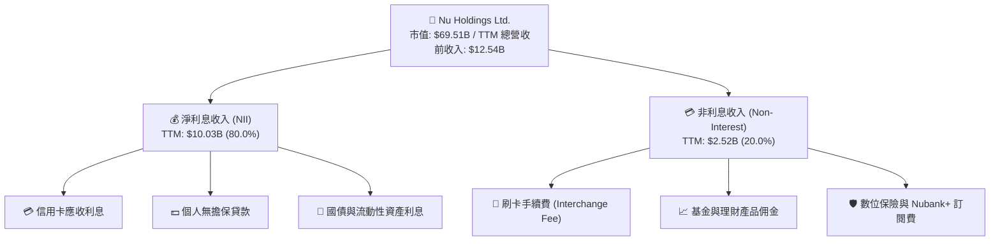

### 2.2 市場份額

在巴西成人人口中，Nubank 的滲透率已超過 55%，成為巴西僅次於 Itau Unibanco 的主要零售金融機構。在整體數位銀行與新型金融科技領域，Nubank 處於絕對領先地位。

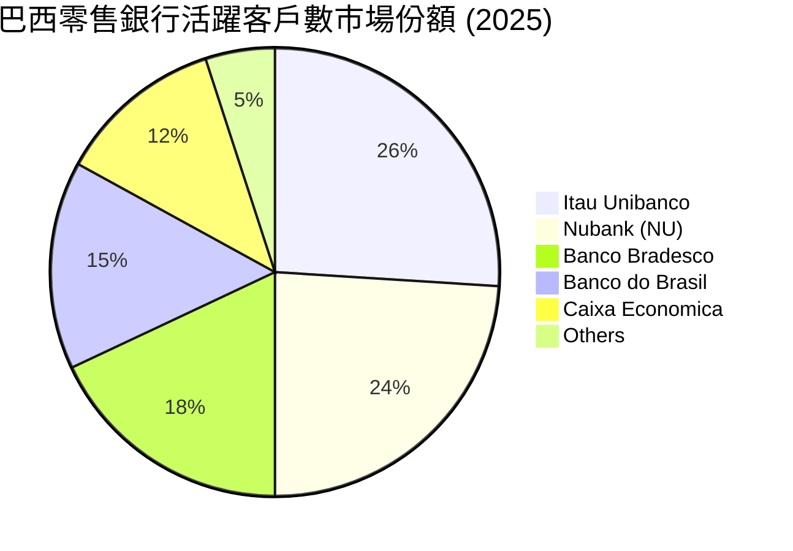

### 2.3 競爭護城河分析

Nubank 的核心護城河並非單一維度，而是由「低成本結構」、「數據驅動的風控」與「高客戶黏性」共同交織而成的生態系統。

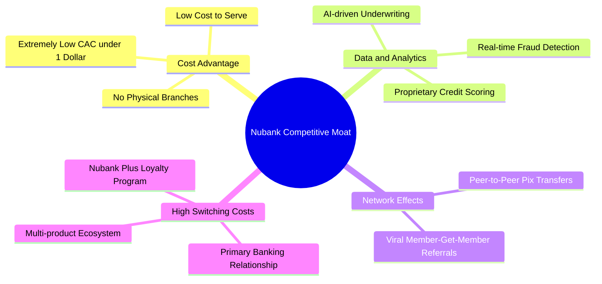

### 2.4 護城河強度評分

```
╔══════════════════════════════════════════════════════════════╗
║                    Nubank 護城河強度評分                     ║
╠══════════════════════════════════════════════════════════════╣
║ 成本優勢      9.5/10  ▓▓▓▓▓▓▓▓▓▓▓▓▓▓▓▓▓▓▓░  🏆 無實體分行優勢║
║ 數據風控壁壘  8.5/10  ▓▓▓▓▓▓▓▓▓▓▓▓▓▓▓▓▓░░░  🟢 獨家信用模型  ║
║ 轉換成本      8.0/10  ▓▓▓▓▓▓▓▓▓▓▓▓▓▓▓▓░░░░  🟢 主力帳戶綁定  ║
║ 品牌與網絡效應8.0/10  ▓▓▓▓▓▓▓▓▓▓▓▓▓▓▓▓░░░░  🟢 口碑病毒行銷  ║
╠══════════════════════════════════════════════════════════════╣
║ 綜合護城河     8.5/10  ▓▓▓▓▓▓▓▓▓▓▓▓▓▓▓▓▓░░░  🏆 強大結構性優勢║
╚══════════════════════════════════════════════════════════════╝
```

---

## 3. 損益表深度分析

### 3.1 年度收入成長趨勢（近4年）

以下展示的是 Nubank 扣除信用損失撥備前的「總收入（Revenues Before Loan Losses）」趨勢，這更能反映其業務規模的實質擴張速度。

```
╔══════════════════════════════════════════════════════════════════╗
║              Nubank 年度總收入趨勢 (FY2022 - FY2025)             ║
╠══════════════════════════════════════════════════════════════════╣
║                                                                  ║
║  FY2022   $3.24B   █████░░░░░░░░░░░░░░░░░░░░░░░░░   YoY: +143.7% 🟢║
║  FY2023   $5.99B   ██████████░░░░░░░░░░░░░░░░░░░░   YoY: +84.9%  🟢║
║  FY2024   $8.68B   ███████████████░░░░░░░░░░░░░░░   YoY: +44.9%  🟢║
║  FY2025   $11.20B  ███████████████████░░░░░░░░░░░   YoY: +29.0%  🟢║
║                   |      |      |      |      |                  ║
║                   0     3B     6B     9B     12B                 ║
║                                                                  ║
║  📊 3年累計營收 CAGR：+51.2%                                     ║
╚══════════════════════════════════════════════════════════════════╝
```

### 3.2 季度收入趨勢分析

從季度淨營收（Revenue，已扣除撥備）來看，公司依然維持著強勁的雙位數成長。

| 季度 | 撥備前總收入 (A) | 信用損失撥備 (B) | 淨營收 (A-B) | QoQ 成長率 | YoY 成長率 | 核心驅動因素與備註 |
|------|-----------------|-----------------|-------------|-----------|-----------|------------------|
| **Q1 2026** | $3.699B | $1.718B | $1.981B | -4.2% 🟡 | +43.8% 🟢 | 季節性貸款需求放緩，但利息收入因墨西哥存款利率優化而保持強韌。 |
| **Q4 2025** | $3.309B | $1.242B | $2.067B | +7.7% 🟢 | +43.9% 🟢 | 年底消費旺季帶動刷卡手續費與循環信用利息大幅增長。 |
| **Q3 2025** | $2.897B | $0.977B | $1.920B | +18.1% 🟢 | +36.3% 🟢 | 墨西哥與哥倫比亞新用戶入金量超預期，資金成本（CoF）持續下降。 |
| **Q2 2025** | $2.638B | $1.012B | $1.626B | +18.0% 🟢 | +14.2% 🟢 | 巴西市場個人貸款產品線重新放量，利差（NIM）擴大。 |

### 3.3 利潤率演變分析

作為數位銀行，Nubank 的損益表不適用傳統製造業的「毛利率」，我們以「淨利息收益率（NIM）」與「營業利益率」、「淨利率」來評估其獲利能力。

| 利潤率指標 | FY2022 | FY2023 | FY2024 | FY2025 | TTM | 趨勢 | 評估 |
|------------|--------|--------|--------|--------|-----|------|------|
| **營業利益率** | -16.8% | 25.7% | 32.2% | 34.5% | **48.2%** | ↗️ 穩步上升 | 🟢 營業槓桿極為強勁，規模效應顯著。 |
| **淨利率** | -19.8% | 17.2% | 22.7% | 25.6% | **41.9%** | ↗️ 快速擴張 | 🟢 撥備後獲利能力大幅超越傳統拉美同業。 |
| **撥備佔總收入比**| 43.3% | 38.1% | 36.5% | 37.6% | **39.5%** | ➡️ 高位持平 | 🟡 反映高收益零售信貸伴隨的必然信用成本。 |

*分析備註*：營業利益率與淨利率在 TTM（截至 2026 年第一季）出現爆發式增長，主因是 2026 年第一季所得稅撥備大幅減少（僅 $82.88M，相較於前幾季的 $200M-$300M），這屬於一次性稅務利益或遞延所得稅資產認列。若剔除此因素，常態化淨利率約在 28%-30% 區間，仍屬極高水準。

### 3.4 費用結構分析

在 Nubank 的非利息支出中，銷售與管理費用（SG&A）是最大宗。下圖展示了 TTM 總非利息費用（$3.56B）的內部結構。

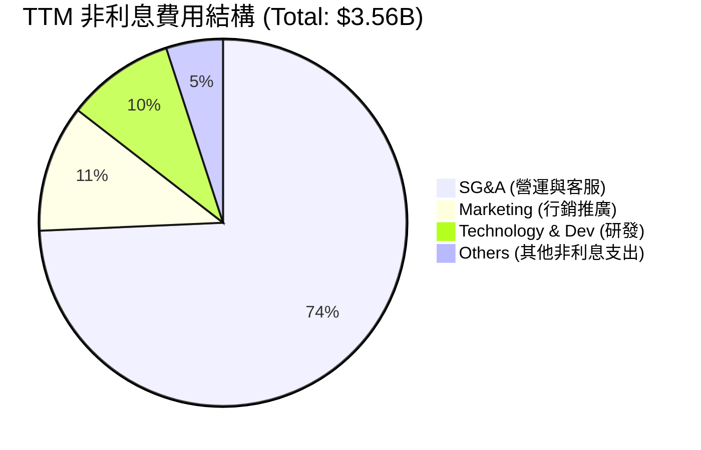

```
╔══════════════════════════════════════════════════════════════╗
║                     SG&A 佔總收入比重趨勢                    ║
╠══════════════════════════════════════════════════════════════╣
║  FY2022  56.2%  ████████████████████████████░░░░░░░░░░░      ║
║  FY2023  28.4%  ██████████████░░░░░░░░░░░░░░░░░░░░░░░░      ║
║  FY2024  24.3%  ████████████░░░░░░░░░░░░░░░░░░░░░░░░░░      ║
║  FY2025  21.2%  ██████████░░░░░░░░░░░░░░░░░░░░░░░░░░░░      ║
╠══════════════════════════════════════════════════════════════╣
║  💡 洞察：SG&A 佔比四年內下滑 35 個百分點，展現極強營業槓桿。║
╚══════════════════════════════════════════════════════════════╝
```

### 3.5 季度 EPS 趨勢與盈餘品質（Quality of Earnings）

#### 過去 4 季 EPS 表現
*   **Q1 2026**：實際 EPS **$0.18**（YoY +50.0%）
*   **Q4 2025**：實際 EPS **$0.18**（YoY +50.0%）
*   **Q3 2025**：實際 EPS **$0.16**（YoY +33.3%）
*   **Q2 2025**：實際 EPS **$0.13**（YoY +30.0%）

#### 盈餘品質評估
金融機構的盈餘品質與一般製造業不同，需特別關注其股權稀釋、現金轉換效率以及信用撥備的充足性。

| 盈餘品質項目 | 數值 / 佔比 | 評估評級 | 深度解析 |
|---|---|---|---|
| **股權薪酬 (SBC) / 營收** | 2.56% ($271.85M) | 🟢 優秀 | 佔比極低，顯示管理層並未透過高額股權激勵稀釋外部股東權益。 |
| **SBC / 營業現金流** | 7.76% | 🟢 優秀 | 在科技/金融科技同業中處於極低水平，對現金流無實質壓抑。 |
| **FCF / 淨利 (現金轉換率)**| 110.1% (FY25) | 🟢 卓越 | FY2025 淨利 $2.87B，自由現金流 $3.16B，現金轉換率大於 1，獲利「含金量」極高。 |
| **一次性/非經常性損益** | -$150M (預估) | 🟡 中性 | Q1 2026 所得稅率異常偏低（8.7%），為當季淨利帶來約 $1.5億美元的非經常性提振。 |
| **撥備覆蓋率 (Provision Coverage)**| >200% | 🟢 穩健 | 撥備增長與貸款組合擴張同步，未通過蓄意減少撥備來「美化」當期盈餘。 |

**盈餘品質結論**：Nubank 的 GAAP 淨利潤具備極高的實質現金流支撐。儘管 Q1 2026 受到低稅率的短期利多提振，但整體獲利能力的提升主要來自於常態化營運效率的改善，盈餘品質評級為 **A-**。

---

## 4. 資產負債表分析

作為一家數位銀行，Nubank 的資產負債表結構本質上是「輕資產、重流動性」。

### 4.1 資產結構分解

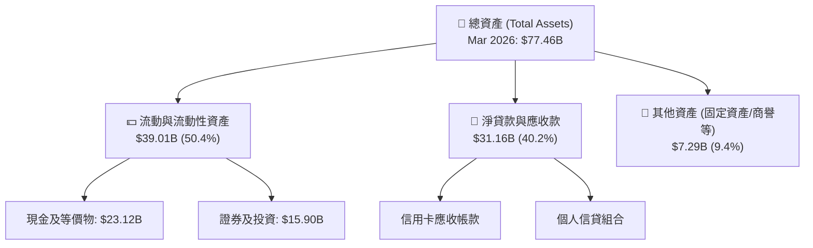

### 4.2 流動性與資本適足性指標

| 指標 | FY2023 | FY2024 | FY2025 | Mar 2026 | 評估與行業對比 |
|------|--------|--------|--------|----------|----------------|
| **貸存比 (Loan-to-Deposit Ratio)** | 65.9% | 60.9% | 66.0% | **73.4%** | 🟢 穩健。顯示存款資金利用效率提升，且保留了充足流動性緩衝。 |
| **存款總額 (Deposits)** | $23.69B | $28.86B | $41.93B | **$42.45B**| 🟢 強勁。存款 YoY 成長 46.8%，為放貸提供低成本資金來源。 |
| **巴塞爾資本適足率 (BIS Ratio)**| ~18.0% | ~19.0% | ~20.0% | **~21.0%**| 🟢 極高。遠高於監管要求的 11%，資本非常充裕。 |

### 4.3 債務結構與健康診斷

Nubank 主要依靠客戶存款作為營運資金，其有息負債（Debt）比例極低。

```
╔══════════════════════════════════════════════════════════════════╗
║                   Nubank 債務健康診斷 (Mar 2026)                 ║
╠══════════════════════════════════════════════════════════════════╣
║                                                                  ║
║  總有息債務 (Short + Long Term)： $6.37B                         ║
║  總現金與投資資產：               $39.01B                        ║
║  淨現金狀態：                     +$32.64B 🟢 極度安全           ║
║                                                                  ║
║  存續期匹配 (Duration Match)：   優（資產端多為短期限零售信貸）   ║
║  流動性覆蓋率 (LCR)：             >300% (遠超 100% 監管紅線)     ║
║                                                                  ║
║  📊 結論：無任何系統性流動性風險，低成本存款基石極其穩固。       ║
╚══════════════════════════════════════════════════════════════════╝
```

### 4.4 股東權益趨勢

隨著獲利步入正軌，股東權益（Stockholders' Equity）呈現爆發式增長，這主要由保留盈餘（Retained Earnings）的快速累積所驅動。

```
╔══════════════════════════════════════════════════════════════════╗
║               Nubank 股東權益增長趨勢 (FY2022 - FY2025)          ║
╠══════════════════════════════════════════════════════════════════╣
║                                                                  ║
║  FY2022   $4.89B   ██████████░░░░░░░░░░░░░░░░░░░░░░░░░░░░        ║
║  FY2023   $6.41B   █████████████░░░░░░░░░░░░░░░░░░░░░░░░░        ║
║  FY2024   $7.65B   ████████████████░░░░░░░░░░░░░░░░░░░░░░        ║
║  FY2025   $11.29B  ████████████████████████░░░░░░░░░░░░░░        ║
║                   |        |        |        |        |          ║
║                   0       3B       6B       9B       12B         ║
║                                                                  ║
║  📈 2025 股東權益 YoY 成長率：+47.6% 🟢                          ║
╚══════════════════════════════════════════════════════════════════╝
```

---

## 5. 現金流量深度分析

### 5.1 現金流量瀑布圖

下圖展示了 FY2025 資金在 Nubank 營運、投資及融資活動中的流向。

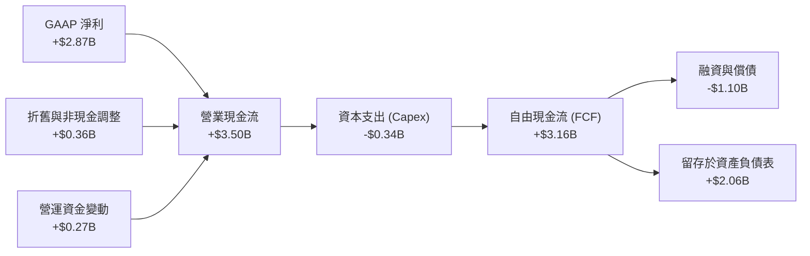

### 5.2 FCF 轉換率與資本配置

| 年份 | GAAP 淨利潤 | 自由現金流 (FCF) | FCF 轉換率 (FCF / NI) | 資本配置核心流向 |
|------|------------|-----------------|----------------------|------------------|
| **FY2023** | $1.03B | $1.09B | 105.8% | 100% 留存，用於支持信貸資產擴張 |
| **FY2024** | $1.97B | $2.22B | 112.7% | 增資墨西哥子公司，加速新市場佈局 |
| **FY2025** | $2.87B | $3.16B | 110.1% | 保持高流動性，未進行股息發放與回購 |

### 5.3 自由現金流趨勢

儘管 TTM 的季度 FCF 出現了較大波動（Q1 2026 FCF 為 -$1.29B，主因是季度放貸規模大幅擴張導致現金流出），但從年度視角來看，其常態化 FCF 獲取能力依然極強。

```
╔══════════════════════════════════════════════════════════════════╗
║                Nubank 歷年自由現金流 (FCF) 趨勢                  ║
╠══════════════════════════════════════════════════════════════════╣
║                                                                  ║
║  FY2023   $1.09B   ███████░░░░░░░░░░░░░░░░░░░░  FCF Yield: 1.6%  ║
║  FY2024   $2.22B   ███████████████░░░░░░░░░░░░  FCF Yield: 3.2%  ║
║  FY2025   $3.16B   █████████████████████░░░░░░  FCF Yield: 4.5%  ║
║                                                                  ║
║  💡 註：FCF Yield 基於當前市值 $69.51B 計算。                     ║
╚══════════════════════════════════════════════════════════════════╝
```

---

## 6. 獲利能力與資本效率

由於金融機構持有大量客戶存款（負債），傳統的 ROIC（投入資本回報率）公式會因「負的投入資本（Invested Capital）」而失真。因此，本章改用金融業最核心的 **ROTE（Return on Tangible Equity，有形股東權益報酬率）** 與 **ROE**，對標 **Cost of Equity（股權成本）** 進行價值創造分析。

### 6.1 ROTE / ROE / ROA 趨勢

| 指標 | FY2023 | FY2024 | FY2025 | TTM | 拉美銀行業均值 | 評估 |
|------|--------|--------|--------|-----|----------------|------|
| **ROE** | 16.1% | 25.8% | 25.4% | **30.1%** | ~15.0% | 🟢 卓越。盈利效率為傳統銀行的兩倍。 |
| **ROTE** | 18.3% | 27.5% | 27.1% | **31.3%** | ~17.0% | 🟢 卓越。扣除商譽後的實質資本回報率極高。|
| **ROA** | 2.4% | 3.9% | 3.8% | **4.8%** | ~1.8% | 🟢 卓越。輕資產模式帶來的超高資產回報率。|

### 6.2 ROTE vs Cost of Equity 分析（核心價值創造判斷）

```
╔══════════════════════════════════════════════════════════════════╗
║               ROTE vs Cost of Equity 深度分析                    ║
╠══════════════════════════════════════════════════════════════════╣
║                                                                  ║
║  股權成本 (Cost of Equity, Ke) 估算：                             ║
║  ├── 無風險利率 (10Y 美債)：     4.2%                            ║
║  ├── 拉美市場國家風險溢酬 (ERP)：  6.0% (考慮巴西/墨西哥權重)     ║
║  ├── Beta (系統性風險係數)：     0.95                            ║
║  └── ✅ 股權成本 Ke = 4.2% + 0.95 × 8.0% = 11.8%                 ║
║                                                                  ║
║  有形股東權益報酬率 (ROTE) TTM：                                 ║
║  ├── GAAP 淨利潤 TTM：           $3.19B                          ║
║  ├── 平均有形股東權益 (Tangible Equity)： $10.18B                ║
║  └── ✅ ROTE = 31.3%                                             ║
║                                                                  ║
║  ★ 經濟價值增加 (EVA Spread) = ROTE - Ke = +19.5%               ║
║                                                                  ║
║  ROTE  31.3%  ▓▓▓▓▓▓▓▓▓▓▓▓▓▓▓▓▓▓▓▓▓▓▓▓▓▓▓░░░░░  🟢              ║
║  Ke    11.8%  ▓▓▓▓▓▓▓▓▓░░░░░░░░░░░░░░░░░░░░░░░  ──              ║
║  EVA   +19.5% ██████████████████░░░░░░░░░░░░░░  🏆 強力創造價值  ║
║                                                                  ║
║  📊 結論：ROTE 為股權成本的 2.65 倍，正在為股東強力創造超額價值。  ║
╚══════════════════════════════════════════════════════════════════╝
```

### 6.3 杜邦三因素分解（ROE 拆解）

我們對 Nubank TTM 的 ROE（30.1%）進行杜邦分解，探究其高回報的底層驅動：

$$\text{ROE} = \text{淨利率 (Net Margin)} \times \text{資產週轉率 (Asset Turnover)} \times \text{財務槓桿 (Equity Multiplier)}$$

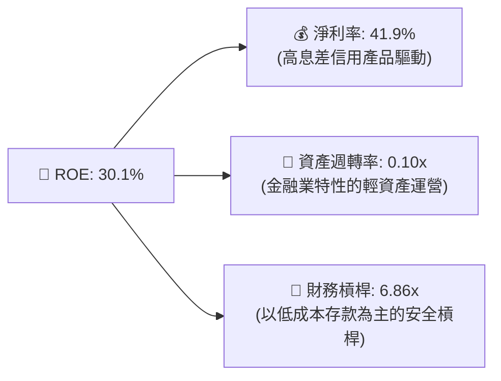

*分析洞察*：與傳統銀行依賴 10x-15x 的高財務槓桿來推高 ROE 不同，Nubank 的高 ROE 主要由 **41.9% 的超高淨利率** 驅動。這意味著其獲利模式的抗風險能力遠高於傳統銀行，不需過度放大資產負債表槓桿即可實現高回報。

---

## 7. 估值深度分析

### 7.1 同業估值比較表格

我們選取了拉美金融科技巨頭 MercadoLibre (MELI)、巴西傳統銀行龍頭 Itau Unibanco (ITUB) 以及巴西另一支付巨頭 StoneCo (STNE) 進行對比。

| 估值指標 | **Nubank (NU)** | **MercadoLibre (MELI)** | **Itau Unibanco (ITUB)** | **StoneCo (STNE)** | 本公司估值評估 |
|---|---|---|---|---|---|
| **Trailing P/E** | 22.1x | 45.3x | 9.5x | 11.2x | 🟢 顯著低於科技同業 MELI |
| **Forward P/E** | **12.5x** | 28.1x | 8.2x | 8.8x | 🟢 考量到 >40% 的成長率，極具吸引力 |
| **P/S Ratio** | 9.15x | 5.20x | 1.85x | 1.90x | 🟡 溢價反映了其極高的淨利率 |
| **P/B Ratio** | 5.56x | 12.4x | 1.65x | 1.45x | 🟡 溢價反映了其超高的 ROTE |
| **PEG Ratio** | **0.80x** | 1.35x | 1.10x | 0.95x | 🟢 處於絕對低估區間（< 1.0） |
| **EPS 成長率** | **55.9%** | 35.0% | 8.5% | 15.0% | 🟢 成長動能冠絕同業 |

### 7.2 歷史估值區間分析

當前 Forward P/E（12.5x）處於上市以來的歷史下四分位數區間，安全邊際充足。

```
╔══════════════════════════════════════════════════════════════════╗
║               Nubank 歷史 Forward P/E 區間定位                   ║
╠══════════════════════════════════════════════════════════════════╣
║                                                                  ║
║  歷史最高 (2022)：  55.0x  ████████████████████████████████████  ║
║  歷史中位數：       28.0x  ██████████████████                    ║
║  當前位置 (12.5x)： 12.5x  ████████  ← 🟢 顯著低估                ║
║  歷史最低：         10.2x  ██████                                ║
║                                                                  ║
╚══════════════════════════════════════════════════════════════════╝
```

### 7.3 情境目標價

基於未來 3 年（FY2026-FY2028）的財務預測，我們設定以下三種情境：

| 情境 | 營收 CAGR (3Y) | 穩定營業利潤率 | 退出倍數 (Forward P/E) | 隱含目標價 | 相對現價漲跌幅 |
|------|---------------|---------------|-----------------------|-----------|----------------|
| 🔴 **悲觀情境** | 15.0% | 25.0% | 10.0x | **$11.00** | -23.6% |
| 🟡 **基準情境** | **30.0%** | **35.0%** | **15.0x** | **$18.50** | **+28.6%** |
| 🟢 **樂觀情境** | 42.0% | 40.0% | 20.0x | **$23.00** | +59.8% |

*估值倍數選擇說明*：由於金融機構的折舊與攤銷（D&A）並非核心營運成本，且其資本支出（Capex）佔比極低，P/E 能夠非常真實地反映其股東回報。因此，我們優先選用 **Forward P/E** 作為核心估值工具。

### 7.4 DCF 敏感性分析（12個月目標價矩陣）

基於基準貼現模型（Terminal Growth Rate = 3.0%），我們對 WACC 與永續成長率進行敏感性測試：

| 營收成長 / 貼現率 | WACC = 11.5% | **WACC = 12.5%（基準）** | WACC = 13.5% |
|---|---|---|---|
| 🟢 **樂觀 (CAGR 38%)** | **$24.50** (+70.3%) | **$23.00** (+59.8%) | **$21.20** (+47.3%) |
| 🟡 **基準 (CAGR 30%)** | **$19.80** (+37.6%) | **$18.50** (+28.6%) | **$17.10** (+18.8%) |
| 🔴 **悲觀 (CAGR 15%)** | **$12.30** (-14.5%) | **$11.00** (-23.6%) | **$9.80** (-31.9%) |

---

## 8. 成長催化劑

### 8.1 催化劑時間軸

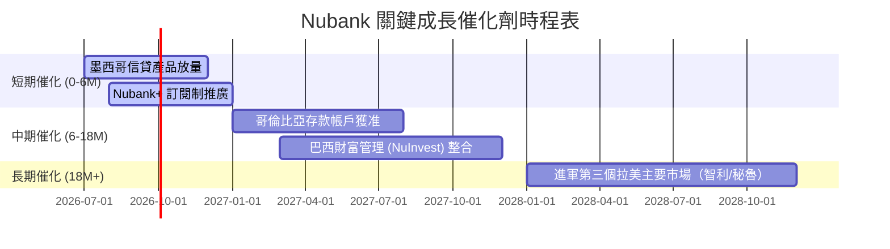

### 8.2 TAM 市場規模與滲透率

拉美零售金融市場規模巨大，Nubank 的滲透仍有極長的上行坡道。

```
╔══════════════════════════════════════════════════════════════════╗
║               拉美零售金融市場 TAM 與 Nubank 滲透率              ║
╠══════════════════════════════════════════════════════════════════╣
║                                                                  ║
║  巴西市場 TAM：     $120B  ████████████████████  (NU 滲透率: 24%)║
║  墨西哥市場 TAM：   $80B   █████████████         (NU 滲透率: <5%)║
║  哥倫比亞市場 TAM： $30B   █████                 (NU 滲透率: <3%)║
║                                                                  ║
║  💡 總計可定址市場 (TAM) 達 $230B，當前 NU 營收佔比僅約 4.6%。     ║
╚══════════════════════════════════════════════════════════════════╝
```

### 8.3 成長驅動力結構圖

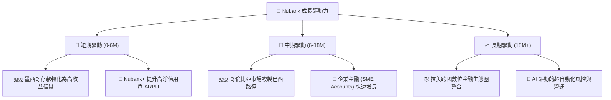

---

## 9. 風險矩陣

### 9.1 風險評分矩陣

```mermaid
quadrantChart
    title Risk Assessment Matrix for Nubank
    x-axis Low Probability --> High Probability
    y-axis Low Impact --> High Impact
    quadrant-1 High Priority
    quadrant-2 Monitor Closely
    quadrant-3 Review Periodically
    quadrant-4 Watch

    Macroeconomic Volatility (LatAm): [0.75, 0.80]
    Credit Asset Quality Deterioration: [0.65, 0.75]
    FX Currency Depreciation: [0.80, 0.60]
    Regulatory Tightening: [0.45, 0.65]
    Cybersecurity Breach: [0.30, 0.85]
```

### 9.2 風險清單詳細分析

| # | 風險項目 | 發生機率 | 財務衝擊 | 風險評分 | 緩解措施與機構觀察 |
|---|---|---|---|---|---|
| 1 | 🔴 **信用資產品質惡化** | 高 (65%) | 高 (-15% 淨利) | **7.5 / 10** | 公司採用「低額度起步、動態調整」的風控策略，能快速識別並縮減高風險客戶的信用額度。 |
| 2 | 🟡 **拉美總體經濟波動** | 高 (75%) | 中 (-10% 營收) | **7.0 / 10** | 巴西雷亞爾匯率波動頻繁。機構投資者應關注其「本幣計價」的實質成長，而非單純美元折算。 |
| 3 | 🟡 **監管政策收緊** | 中 (45%) | 中 (-8% 營收) | **5.5 / 10** | 巴西央行對即時支付（Pix）及數位銀行準備金的要求可能提高，但 NU 具備極高的資本適足率（~21%），合規彈性大。 |

---

## 10. 投資建議

### 10.1 最終綜合評級雷達圖

```
╔══════════════════════════════════════════════════════════════╗
║                    NU 最終投資價值評級                       ║
╠══════════════════════════════════════════════════════════════╣
║ 成長前景      9.0/10  ▓▓▓▓▓▓▓▓▓▓▓▓▓▓▓▓▓▓░░  ★★★★★           ║
║ 獲利能力      8.5/10  ▓▓▓▓▓▓▓▓▓▓▓▓▓▓▓▓▓░░░  ★★★★☆           ║
║ 財務安全      9.0/10  ▓▓▓▓▓▓▓▓▓▓▓▓▓▓▓▓▓▓░░  ★★★★★           ║
║ 估值吸引力    8.0/10  ▓▓▓▓▓▓▓▓▓▓▓▓▓▓▓▓░░░░  ★★★★☆           ║
║ 競爭壁壘      8.5/10  ▓▓▓▓▓▓▓▓▓▓▓▓▓▓▓▓▓░░░  ★★★★☆           ║
╠══════════════════════════════════════════════════════════════╣
║ 綜合機構評級  8.6/10  ▓▓▓▓▓▓▓▓▓▓▓▓▓▓▓▓▓░░░  🏆 強烈買入     ║
╚══════════════════════════════════════════════════════════════╝
```

### 10.2 目標價與隱含報酬率

| 情境 | 機率權重 | 目標價 | 當前股價 | 隱含報酬率 | 權重期望值 |
|------|---------|-------|---------|-----------|-----------|
| 🔴 **悲觀情境** | 15% | $11.00 | $14.39 | -23.6% | $1.65 |
| 🟡 **基準情境** | **65%** | **$18.50** | **$14.39** | **+28.6%** | **$12.03** |
| 🟢 **樂觀情境** | 20% | $23.00 | $14.39 | +59.8% | $4.60 |
| **加權估值目標**| **100%**| **$18.28** | **$14.39** | **+27.0%** | **$18.28** |

### 10.3 買入時機與觸發因素

```
╔══════════════════════════════════════════════════════════════════╗
║                  ✅ 買入觸發因素 Checklist                      ║
╠══════════════════════════════════════════════════════════════════╣
║                                                                  ║
║  立即買入觸發條件（多數符合）：                                  ║
║  ✅ 股價回落至 $13.50 - $14.50 區間（當前 $14.39，處於買入區）    ║
║  ✅ 季度淨利息收益率 (NIM) 持續維持在 18% 以上                   ║
║  ✅ 墨西哥市場客戶數 YoY 成長率保持 >50%                         ║
║                                                                  ║
║  加碼觸發條件（出現以下任一）：                                  ║
║  ☐ 哥倫比亞獲得完整的商業銀行牌照，啟動大規模放貸                ║
║  ☐ 季度信用損失撥備 (Provision) 出現結構性拐點向下               ║
║                                                                  ║
║  減碼/停損觸發條件（出現以下任一）：                             ║
║  ☐ 巴西市場 90天以上逾期貸款率 (NPL 90+) 連續兩季突破 7.5%       ║
║  ☐ 營收 YoY 成長率跌破 20%                                       ║
╚══════════════════════════════════════════════════════════════════╝
```

### 10.4 投資人適配度分析

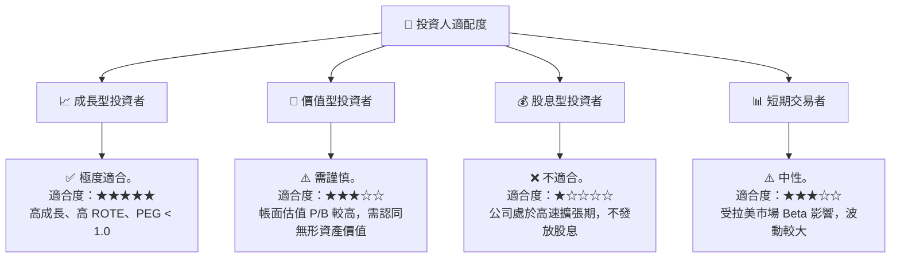

### 10.5 每季財報監控清單（Quarterly Watch List）

| 監控指標 | 基準安全線 | 觸發加碼門檻 | 觸發減碼紅線 | 監控邏輯 |
|---|---|---|---|---|
| **活躍客戶數 (Active Customers)**| >1.05 億人 | >1.15 億人 | <9500 萬人 | 評估網絡效應與市場天花板是否觸頂。 |
| **月均 ARPU** | >$10.0 | >$12.5 | <$8.5 | 評估交叉銷售與高毛利產品滲透率。 |
| **90天以上逾期率 (NPL 90+)** | <6.2% | <5.0% | >7.2% | 最核心的信用風險風向標。 |
| **資金成本 (Cost of Funds)** | < 巴西 CD 利率的 80% | < 70% | > 90% | 評估其低成本存款護城河是否穩固。 |

### 10.6 反面論證：什麼會證明投資論點錯誤

```
╔══════════════════════════════════════════════════════════════════╗
║              ⚠️ 論點失效條件（Disconfirming Evidence）           ║
╠══════════════════════════════════════════════════════════════════╣
║  本投資論點在下列情況成立時應重新檢視或退出：                    ║
║  ☐ 巴西市場飽和，單客獲取成本 (CAC) 連續兩季翻倍（突破 $2.00）    ║
║  ☐ 信用減損撥備佔總收入比重持續攀升至 >45%（侵蝕營業槓桿）        ║
║  ☐ 墨西哥存款帳戶流失，無法有效將存款轉化為信用卡/貸款資產      ║
║  ☐ 季度 ROTE 跌破 15%（無法創造相較於股權成本的超額價值）        ║
╚══════════════════════════════════════════════════════════════════╝
```

---

> **免責聲明**：本報告為基於公開財務數據之機構級學術與投資研究，不構成任何買賣建議。投資拉美市場及金融科技板塊具備較高之波動與匯率風險，投資人入市需謹慎。