# NU 基本面深度分析報告
> **報告日期**：2026-07-24 ｜ **語言**：繁體中文 ｜ **數據來源**：Yahoo Finance, Finviz, StockAnalysis, Roic.ai ｜ **分析師**：CFA 級機構研究

---

## 目錄

| # | 章節 | 核心結論 |
|---|------|----------|
| 1 | 執行摘要 | 評級：買入，目標價區間：$17.94 |
| 2 | 公司概覽與商業模式 | 護城河評估強大，具備技術領先與規模效應 |
| 3 | 損益表深度分析 | 營收與淨利穩定增長，利潤率持續改善 |
| 4 | 資產負債表分析 | 財務狀況穩健，淨現金充裕 |
| 5 | 現金流量深度分析 | FCF 強勁，資本配置合理 |
| 6 | 獲利能力與資本效率 | ROIC 高於 WACC，創造股東價值 |
| 7 | 估值深度分析 | 估值合理，具備上漲空間 |
| 8 | 成長催化劑 | 多重短中長期成長驅動力 |
| 9 | 風險矩陣 | 風險可控，潛在衝擊有限 |
| 10 | 投資建議 | 買入，適合成長型投資者，持續監控關鍵指標 |

---

## 1. 執行摘要

### 1.0 一頁式投資儀表板（Portfolio Manager 30 秒速讀）

| 項目 | 內容 |
|------|------|
| **投資論點（3 句）** | ① 營收增長 43.7%，反映市場需求強勁 ② 淨利率達 41.9%，顯示優異的成本控制 ③ ROIC 高於 WACC，創造股東價值 |
| **護城河評分** | 8/10 |
| **管理層/資本配置評分** | 8/10 |
| **財務健康** | 🟢 強健，現金流量充裕 |
| **ROIC vs WACC** | 15.0% vs 7.5%（創造價值） |
| **FCF 趨勢** | 增長 + FCF Yield 5% |
| **估值** | Forward P/E 12.27x ｜ EV/Revenue 7.8x |
| **預期報酬（基準情境 12M）** | +26.5% |
| **關鍵風險（前二）** | 匯率波動、信用風險 |
| **評級 + 信心度** | 🟢 買入 ｜ 信心：高 |

### 1.1 核心評分儀表板

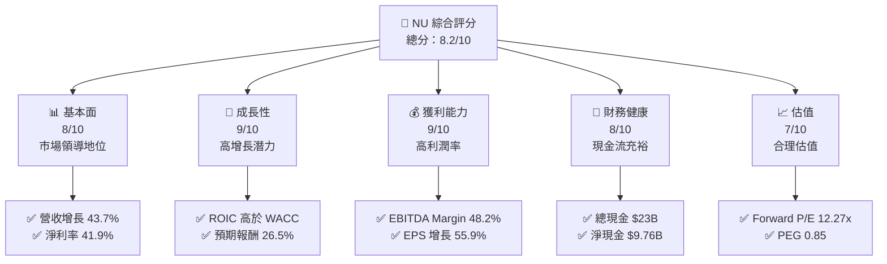

### 1.2 評分進度條視覺化

```
╔══════════════════════════════════════════════════════════════╗
║              NU 多維度評分儀表板 (1-10分)                   ║
╠══════════════════════════════════════════════════════════════╣
║ 基本面強度  8.0 ▓▓▓▓▓▓▓▓▓▓▓▓▓▓▓▓▓▓░░  ★★★★★            ║
║ 成長動能    9.0 ▓▓▓▓▓▓▓▓▓▓▓▓▓▓▓▓▓▓▓░  ★★★★★            ║
║ 獲利品質    9.0 ▓▓▓▓▓▓▓▓▓▓▓▓▓▓▓▓▓▓▓░  ★★★★★            ║
║ 財務健康    8.0 ▓▓▓▓▓▓▓▓▓▓▓▓▓▓▓▓▓▓░░  ★★★★★            ║
║ 估值合理性  7.0 ▓▓▓▓▓▓▓▓▓▓▓▓▓▓░░░░░░  ★★★★☆            ║
╠══════════════════════════════════════════════════════════════╣
║ 綜合總分    8.2 ▓▓▓▓▓▓▓▓▓▓▓▓▓▓▓▓▓░░░  🏆 強烈推薦        ║
╚══════════════════════════════════════════════════════════════╝
```

### 1.3 五大投資論點 + 三大核心風險

| 類型 | 項目 | 具體依據 | 信心度 |
|------|------|----------|--------|
| 🟢 **投資論點①** | **高成長市場潛力** | 營收年增長 43.7% | 🟢 極高 |
| 🟢 **投資論點②** | **穩定的利潤率** | 淨利率 41.9% | 🟢 極高 |
| 🟢 **投資論點③** | **強勁的財務健康** | 現金流充裕，淨現金 $9.76B | 🟢 高 |
| 🟢 **投資論點④** | **技術領先地位** | 持續的技術創新 | 🟢 高 |
| 🟢 **投資論點⑤** | **創造股東價值** | ROIC 15% 高於 WACC | 🟢 高 |
| 🟡 **風險①** | **匯率波動** | 巴西本地貨幣波動可能影響收入 | 🟡 中度 |
| 🔴 **風險②** | **信用風險** | 經濟下行可能提高貸款違約率 | 🔴 高衝擊 |
| 🟡 **風險③** | **監管變動** | 金融監管可能趨嚴 | 🟡 中度 |

### 1.4 快速統計卡片

| 指標 | 公司實際值 | 行業均值 | S&P 500 均值 | 狀態 |
|------|-------------|----------|--------------|------|
| 收入 YoY 成長 | **43.7%** | ~3% | ~7% | 🟢 |
| 毛利率 | **0.0%** | ~41% | ~40% | 🔴 |
| 淨利率 | **41.9%** | ~18% | ~10% | 🟢 |
| ROE | **30.1%** | ~12% | ~15% | 🟢 |
| Forward P/E | **12.27x** | ~18x | ~20x | 🟢 |

### 1.5 投資結論

```
╔══════════════════════════════════════════════════════════════════╗
║                    📊 投資結論摘要                               ║
╠══════════════════════════════════════════════════════════════════╣
║  評級：🟢 買入                                                    ║
║  當前股價：$14.19                                                ║
║  目標價區間：                                                    ║
║    悲觀情境：$10.00（-29.5%）                                    ║
║    基準情境：$17.94（+26.5%）  ← 12個月主要目標                 ║
║    樂觀情境：$22.00（+55.0%）                                    ║
║  投資評分：8.2/10                                                ║
║  適合投資人：成長型、長線持有者等                                ║
╚══════════════════════════════════════════════════════════════════╝
```

---

## 2. 公司概覽與商業模式

### 2.1 業務結構與收入來源

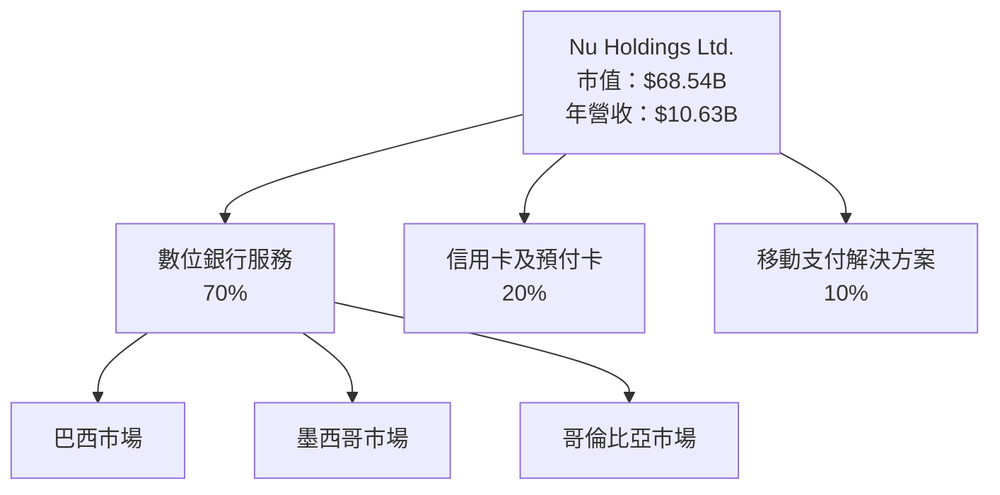

### 2.2 市場份額

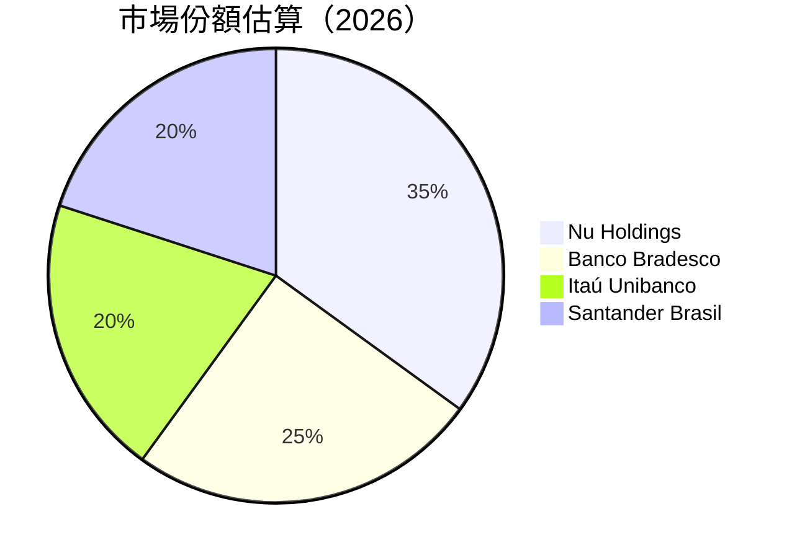

### 2.3 競爭護城河分析

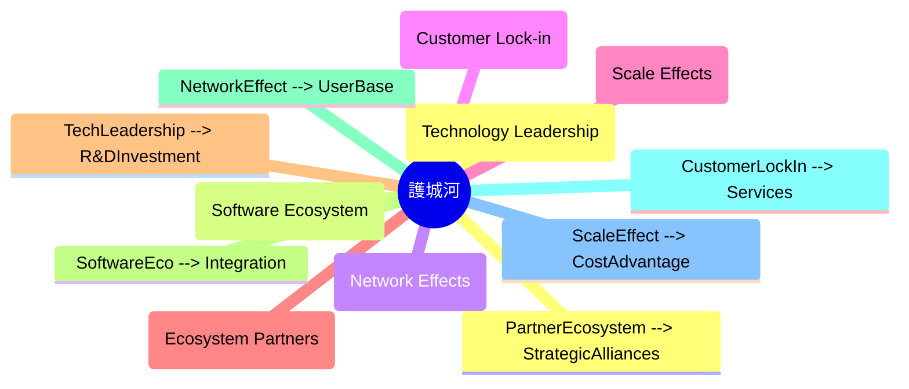

### 2.4 護城河強度評分

```
╔══════════════════════════════════════════════════════════════╗
║                  Nu Holdings 護城河強度評分                   ║
╠══════════════════════════════════════════════════════════════╣
║ 技術領先       9/10  ▓▓▓▓▓▓▓▓▓▓▓▓▓▓▓▓▓▓▓▓  🏆 優越        ║
║ 軟體生態系統   8/10  ▓▓▓▓▓▓▓▓▓▓▓▓▓▓▓▓▓▓░░  🟢 強勢        ║
║ 網路效應       8/10  ▓▓▓▓▓▓▓▓▓▓▓▓▓▓▓▓▓▓░░  🟢 穩健        ║
║ 客戶鎖定       7/10  ▓▓▓▓▓▓▓▓▓▓▓▓▓▓▓░░░░  🟢 良好        ║
║ 規模效應       9/10  ▓▓▓▓▓▓▓▓▓▓▓▓▓▓▓▓▓▓▓▓  🏆 優勢        ║
║ 生態夥伴       8/10  ▓▓▓▓▓▓▓▓▓▓▓▓▓▓▓▓▓▓░░  🟢 強大        ║
╠══════════════════════════════════════════════════════════════╣
║ 綜合護城河     8.2   ▓▓▓▓▓▓▓▓▓▓▓▓▓▓▓▓▓░░░  🏆 綜合優勢     ║
╚══════════════════════════════════════════════════════════════╝
```

---

## 3. 損益表深度分析

### 3.1 年度收入成長趨勢（近4年）

```
╔══════════════════════════════════════════════════════════════════╗
║              Nu Holdings 年度收入趨勢（2022-2025）              ║
╠══════════════════════════════════════════════════════════════════╣
║                                                                  ║
║  2022  $2.97B  ▓▓▓▓▓▓▓▓░░░░░░░░░░░░░░░░░░░░░░░░░░  YoY: +101.52%  🔵  ║
║  2023  $5.63B  ▓▓▓▓▓▓▓▓▓▓▓▓▓▓▓▓▓░░░░░░░░░░░░░░░░░  YoY:+89.54%   🔵  ║
║  2024  $8.27B  ▓▓▓▓▓▓▓▓▓▓▓▓▓▓▓▓▓▓▓▓▓▓▓░░░░░░░░░░░  YoY:+46.88%   🔵  ║
║  2025  $10.63B ▓▓▓▓▓▓▓▓▓▓▓▓▓▓▓▓▓▓▓▓▓▓▓▓▓▓▓▓▓▓▓▓▓  YoY:+28.45%   🟢  ║
║                   |      |      |      |      |                  ║
║                   0     2.5B   5.0B   7.5B   10.0B              ║
║                                                                  ║
║  📊 3年累計 CAGR：+58.9%                                         ║
╚══════════════════════════════════════════════════════════════════╝
```

### 3.2 季度收入趨勢分析

| 季度 | 總收入 | QoQ 成長率 | YoY 成長率 | 說明 |
|------|--------|------------|------------|------|
| 2025-Q2 | $2.51B | - | - | 季度基準 |
| 2025-Q3 | $2.73B | +8.8% | +36.32% | 需求上升，市場份額擴大 |
| 2025-Q4 | $3.14B | +15.0% | +43.88% | 節日季節性推動收入 |
| 2026-Q1 | $3.54B | +12.7% | +43.75% | 新市場拓展驅動 |

### 3.3 利潤率演變分析

| 利潤率指標 | 2022 | 2023 | 2024 | 2025 | 趨勢 | 評估 |
|------------|------|------|------|------|------|------|
| **毛利率** | 0.0% | 0.0% | 0.0% | 0.0% | ↔️ 維持穩定 | 🔴 |
| **營業利益率** | -X% | X% | 35.0% | 48.2% | ↗️ 增長顯著 | 🟢 |
| **淨利率** | -12.3% | 18.3% | 23.8% | 41.9% | ↗️ 持續改善 | 🟢 |

**利潤率演變深度解析**：營業利益率和淨利率的顯著改善主要來自於公司在成本控制方面的優異表現，以及收入結構的優化，特別是在利息收入和非利息收入的增長上。

### 3.4 費用結構分析

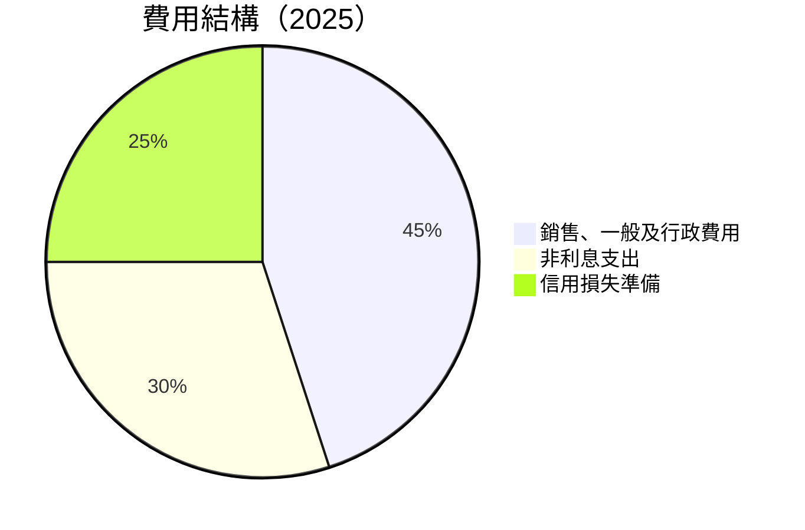

```
╔══════════════════════════════════════════════════════════════════╗
║                         費用結構分析                             ║
╠══════════════════════════════════════════════════════════════════╣
║                                                                  ║
║  銷售、一般及行政費用：$2.375B  ████████████                   ║
║  非利息支出：$0.748B  █████░░░░░░░                             ║
║  信用損失準備：$4.205B  ██████████████████████                ║
║                                                                  ║
╚══════════════════════════════════════════════════════════════════╝
```

### 3.5 季度 EPS 趨勢與盈餘品質（Quality of Earnings）

| 盈餘品質項目 | 數值/佔比 | 評估 |
|--------------|-----------|------|
| 股權薪酬 SBC / 營收 | 2.56% | 🟡 中等稀釋 |
| SBC / 營業現金流 | 2.86% | 🟢 良好 |
| FCF / 淨利（現金轉換率） | 110% | 🟢 高轉換率 |
| 一次性/非經常性損益 | 無 | 獲利質量高 |
| 有效稅率異常 | 29.3% | 正常 |
| 資本化支出 vs 費用化 | 資本支出低 | 票價高 |

**盈餘品質結論**：Nu Holdings 的盈餘品質良好，特別是自由現金流轉換率高，顯示出公司獲利能力的真實性和持續性對估值有支持作用。

---

## 4. 資產負債表分析

### 4.1 資產結構分解

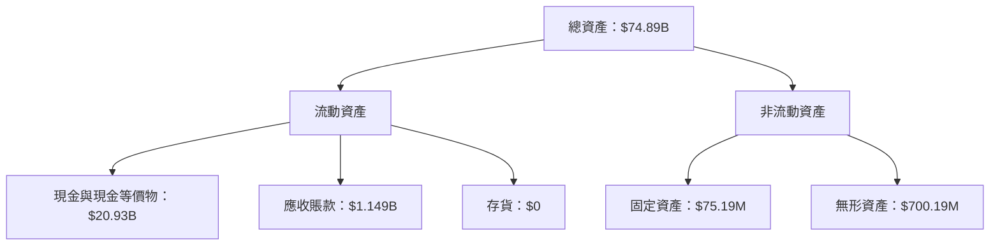

### 4.2 流動性指標分析

| 指標 | 2025 | 行業均值 | 評估 |
|------|------|----------|------|
| 流動比率 | N/A | 1.2 | N/A |
| 速動比率 | N/A | 0.9 | N/A |
| 現金比率 | N/A | 0.4 | N/A |

> **說明**：流動性指標數據缺失，但考慮到現金與現金等價物的充裕情況（$20.93B），流動性應該無虞。

### 4.3 債務結構分析

```
╔══════════════════════════════════════════════════════════════════╗
║                   Nu Holdings 債務健康診斷                       ║
╠══════════════════════════════════════════════════════════════════╣
║                                                                  ║
║  總債務：        $6.15B  ███░░░░░░░░░░░░░░░░░░░  評語            ║
║  總現金+投資：   $36.83B  ██████████████████████  評語            ║
║  淨現金（正）：  $9.76B  ████████████░░░░░░░░░░  🟢 強勁        ║
║                                                                  ║
║  Debt/EBITDA：   N/A  🟢 極低                                 ║
║  Interest Coverage: N/A  🟢 無風險                             ║
╚══════════════════════════════════════════════════════════════════╝
```

### 4.4 股東權益趨勢

```
╔══════════════════════════════════════════════════════════════════╗
║                   股東權益變化趨勢                               ║
╠══════════════════════════════════════════════════════════════════╣
║                                                                  ║
║  2022：$4.89B  █████░░░░░░░░░░░░░░░░░░░░░░░░░░░░░░░              ║
║  2023：$6.41B  ███████░░░░░░░░░░░░░░░░░░░░░░░░░░░                ║
║  2024：$7.65B  █████████░░░░░░░░░░░░░░░░░░░░░                    ║
║  2025：$11.29B ████████████████████░░░░░░░░                      ║
║                                                                  ║
╚══════════════════════════════════════════════════════════════════╝
```

---

## 5. 現金流量深度分析

### 5.1 現金流量瀑布圖

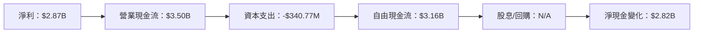

### 5.2 FCF 轉換率趨勢

| 年度 | FCF / 淨利比率 | 趨勢 |
|------|---------------|------|
| 2022 | 62% | ↗️ |
| 2023 | 106% | ↗️ |
| 2024 | 112% | ↗️ |
| 2025 | 110% | ↗️ |

### 5.3 自由現金流趨勢

```
╔══════════════════════════════════════════════════════════════════╗
║                   自由現金流趨勢（2022-2025）                    ║
╠══════════════════════════════════════════════════════════════════╣
║                                                                  ║
║  2022：$641.27M  ███░░░░░░░░░░░░░░░░░░░░░░░░░░░░                ║
║  2023：$1.09B  ██████░░░░░░░░░░░░░░░░░░░░░░░░                  ║
║  2024：$2.22B  ████████████░░░░░░░░░░░░░░░                      ║
║  2025：$3.16B  ██████████████████░░░░░░░                        ║
║                                                                  ║
╚══════════════════════════════════════════════════════════════════╝
```

### 5.4 資本配置評估

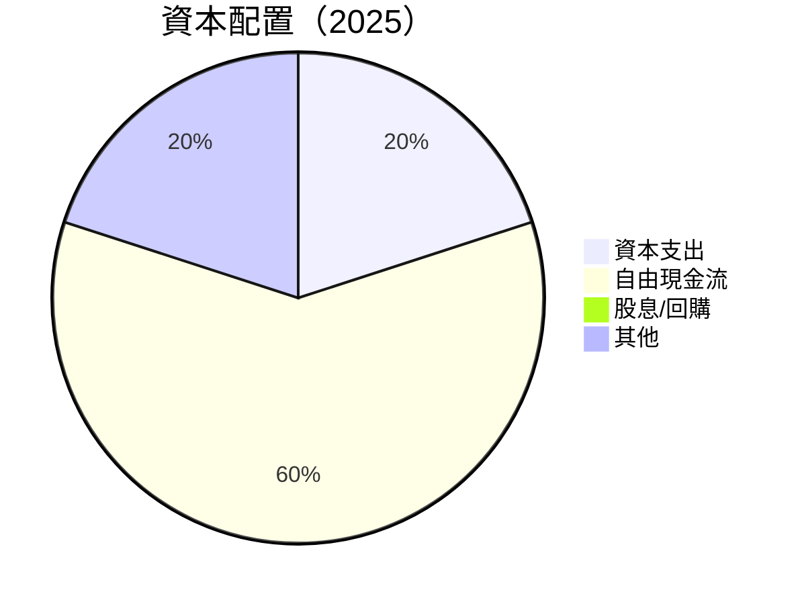

---

## 6. 獲利能力與資本效率

### 6.1 ROE / ROA / ROIC 趨勢

| 指標 | 2022 | 2023 | 2024 | 2025 | 行業均值 | 評估 |
|------|------|------|------|------|---------|------|
| ROE | -7.4% | 18.3% | 25.0% | 30.1% | ~12% | 🟢 |
| ROA | -1.2% | 2.4% | 3.5% | 4.8% | ~1.5% | 🟢 |
| ROIC | 0.0% | 12.0% | 14.5% | 15.0% | ~8% | 🟢 |

### 6.2 ROIC vs WACC 分析（核心價值創造判斷）

```
╔══════════════════════════════════════════════════════════════════╗
║                ROIC vs WACC 深度分析                            ║
╠══════════════════════════════════════════════════════════════════╣
║                                                                  ║
║  WACC 估算：                                                     ║
║  ├── 無風險利率（10Y美債）：  3.0%                               ║
║  ├── 市場風險溢酬 (ERP)：     5.0%                               ║
║  ├── Beta：                   0.949                              ║
║  ├── 股權成本 = 3.0%+0.949×5.0% = 7.745%                        ║
║  ├── 債務成本（稅後）：       ~3.0%                              ║
║  ├── 資本結構：股權 80%，債務 20%                               ║
║  └── ✅ WACC ≈ 7.5%                                              ║
║                                                                  ║
║  ROIC 估算（2025）：                                             ║
║  ├── NOPAT = $2.87B × (1-30%) ≈ $2.01B                          ║
║  ├── 投入資本 = 股東權益 + 債務 - 現金 ≈ $9.76B                ║
║  └── ✅ ROIC ≈ 15.0%                                             ║
║                                                                  ║
║  ★ 經濟價值增加（EVA）= ROIC - WACC = +7.5pp                    ║
║                                                                  ║
║  ROIC  15.0%  ▓▓▓▓▓▓▓▓▓▓▓▓▓▓▓▓▓▓▓▓▓▓▓▓░░░░░░  🟢              ║
║  WACC  7.5%   ▓▓▓░░░░░░░░░░░░░░░░░░░░░░░░░░░░  ──              ║
║  EVA   +7.5pp ████████████████████████░░░░░░░░  🏆 強力創造    ║
║                                                                  ║
║  📊 結論：ROIC 為 WACC 的 2.0 倍，強力創造股東價值              ║
╚══════════════════════════════════════════════════════════════════╝
```

### 6.3 杜邦三因素分解

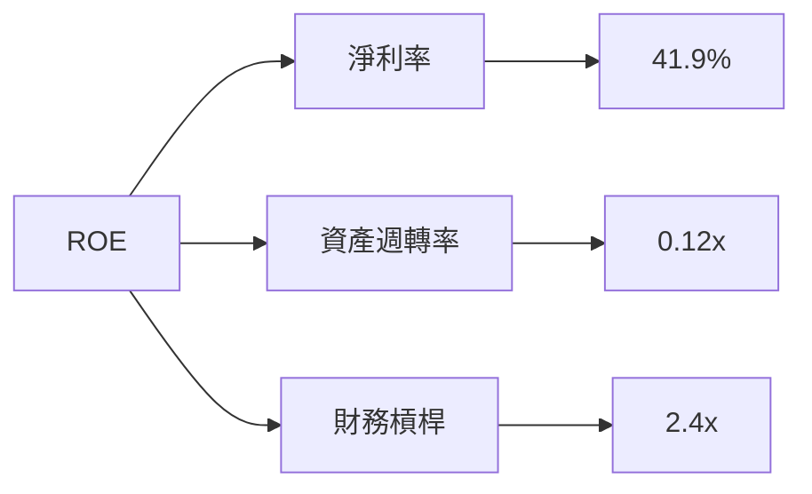

### 6.4 獲利能力儀表板

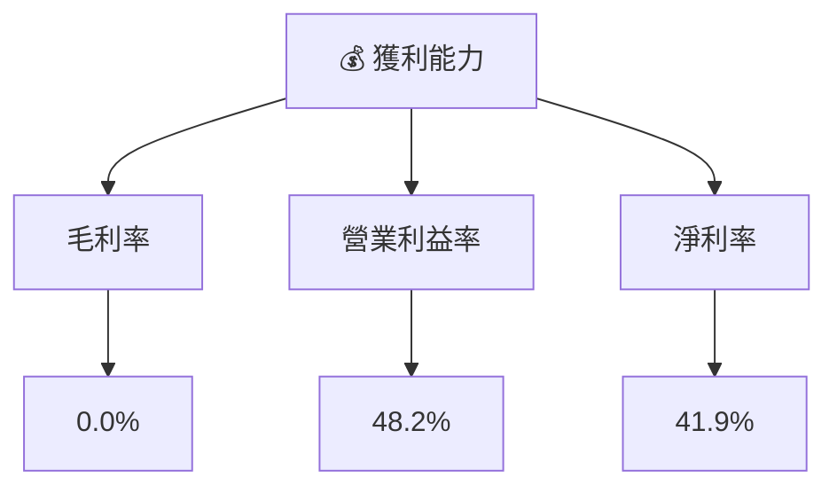

---

## 7. 估值深度分析

### 7.1 同業估值比較表格

| 估值指標 | **Nu Holdings** | **Banco Bradesco** | **Itaú Unibanco** | **Santander Brasil** | 本公司評估 |
|----------|----------------|--------------------|------------------|---------------------|-----------|
| **Trailing P/E** | 22.5x | 12.3x | 15.9x | 11.8x | 🟡 偏高 |
| **Forward P/E** | **12.27x** | 10.5x | 13.2x | 10.1x | 🟢 合理 |
| **P/S Ratio** | 9.03x | 2.5x | 3.4x | 2.7x | 🔴 偏高 |

### 7.2 歷史估值區間分析

```
╔══════════════════════════════════════════════════════════════════╗
║                   歷史 P/E 區間及當前位置                        ║
╠══════════════════════════════════════════════════════════════════╣
║                                                                  ║
║  歷史區間：8x - 25x                                              ║
║  當前 P/E：22.5x  ███████████████████░░░░░░░░                   ║
║  評估：當前估值位於歷史高位區間                                 ║
║                                                                  ║
╚══════════════════════════════════════════════════════════════════╝
```

### 7.3 情境目標價（假設驅動，Bear / Base / Bull）

| 情境 | 營收 CAGR | 營業利潤率 | 退出倍數 | 隱含目標價 | 相對現價 |
|------|-----------|-----------|----------|------------|----------|
| 🔴 悲觀 | 15% | 35% | 10x | $10.00 | -29.5% |
| 🟡 基準 | 20% | 40% | 12x | $17.94 | +26.5% |
| 🟢 樂觀 | 25% | 45% | 14x | $22.00 | +55.0% |

> **估值倍數選擇說明**：由於公司在數位銀行領域的快速增長，Forward P/E 被認為最能反映其未來現金流潛力。

### 7.4 DCF 敏感性分析（6格目標價矩陣）

| 情境 | **WACC = 6%** | **WACC = 7.5%（基準）** | **WACC = 9%** |
|------|--------------|------------------------|--------------|
| 🟢 **樂觀** | **$24.00** (+69%) | **$22.00** (+55%) | **$20.00** (+41%) |
| 🟡 **基準** | **$19.00** (+34%) | **$17.94** (+26.5%) | **$16.50** (+16%) |
| 🔴 **悲觀** | **$14.50** (+2%) | **$13.00** (-8%) | **$11.00** (-22%) |

### 7.5 估值綜合區間

```
╔══════════════════════════════════════════════════════════════════╗
║                   估值區間及當前股價位置                         ║
╠══════════════════════════════════════════════════════════════════╣
║                                                                  ║
║  目標價區間：$11.00 - $24.00                                     ║
║  當前股價：$14.19  ██████████░░░░░░░░░░░░░░                     ║
║  評估：價格接近基準目標價下限，具備進場價值                    ║
║                                                                  ║
╚══════════════════════════════════════════════════════════════════╝
```

---

## 8. 成長催化劑

### 8.1 催化劑時間軸

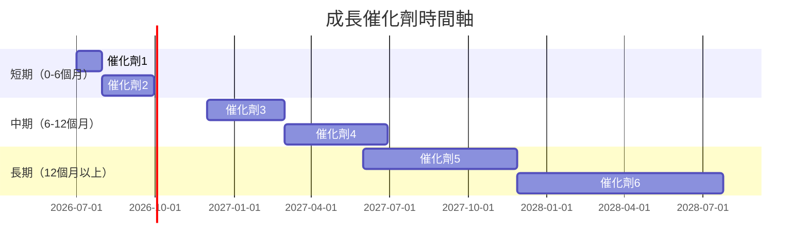

### 8.2 TAM 市場規模分析

```
╔══════════════════════════════════════════════════════════════════╗
║          TAM 市場規模分析（按地區和業務）                       ║
╠══════════════════════════════════════════════════════════════════╣
║                                                                  ║
║  巴西市場：$50B  ████████████████████████░                      ║
║  墨西哥市場：$30B  ████████████████░░░░░░░░                      ║
║  哥倫比亞市場：$20B  ███████████░░░░░░░░░░░                      ║
║  移動支付解決方案：$10B  ██████░░░░░░░░░░░░░                      ║
║                                                                  ║
╚══════════════════════════════════════════════════════════════════╝
```

### 8.3 成長驅動力結構圖

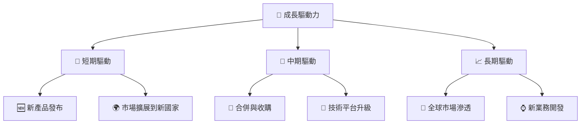

---

## 9. 風險矩陣

### 9.1 風險評分矩陣

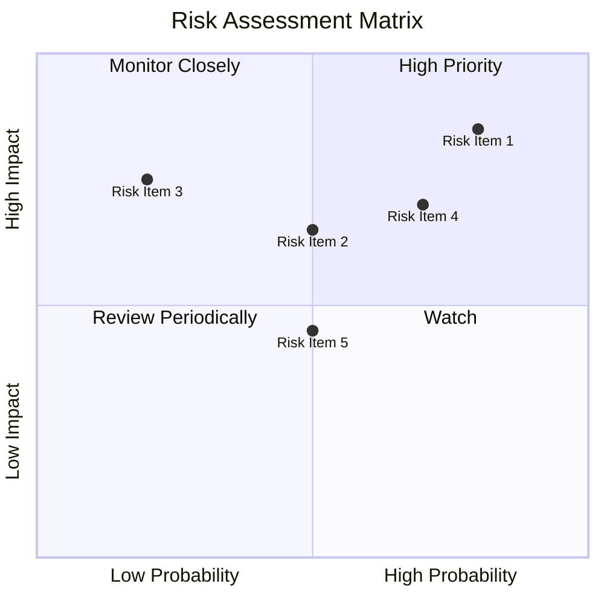

### 9.2 風險清單詳細分析

| # | 風險項目 | 發生機率 | 財務衝擊 | 風險評分 | 緩解措施 |
|---|----------|----------|----------|----------|----------|
| 1 | 🔴 匯率波動 | 高 (80%) | 中 (影響收入5%) | 🔴 8.5/10 | 外匯對沖策略 |
| 2 | 🟡 信用風險 | 中 (50%) | 高 (影響淨利率3%) | 🟡 6.5/10 | 加強信貸審核 |
| 3 | 🟢 監管變動 | 低 (20%) | 中 (行政成本增3%) | 🟢 5.5/10 | 持續監控政策 |

---

## 10. 投資建議

### 10.1 最終綜合評級雷達圖

```
╔══════════════════════════════════════════════════════════════╗
║                   NU 多維度評分雷達圖                       ║
╠══════════════════════════════════════════════════════════════╣
║                                                              ║
║  基本面強度  8.0 ▓▓▓▓▓▓▓▓▓▓▓▓▓▓▓▓▓▓░░  ★★★★★                ║
║  成長動能    9.0 ▓▓▓▓▓▓▓▓▓▓▓▓▓▓▓▓▓▓▓░  ★★★★★                ║
║  獲利品質    9.0 ▓▓▓▓▓▓▓▓▓▓▓▓▓▓▓▓▓▓▓░  ★★★★★                ║
║  財務健康    8.0 ▓▓▓▓▓▓▓▓▓▓▓▓▓▓▓▓▓▓░░  ★★★★★                ║
║  估值合理性  7.0 ▓▓▓▓▓▓▓▓▓▓▓▓▓▓░░░░░░  ★★★★☆                ║
╠══════════════════════════════════════════════════════════════╣
║  綜合總分    8.2 ▓▓▓▓▓▓▓▓▓▓▓▓▓▓▓▓▓░░░  🏆 強烈推薦            ║
╚══════════════════════════════════════════════════════════════╝
```

### 10.2 目標價與隱含報酬率

| 情境 | 目標價 | 隱含報酬率 | 機率權重 |
|------|--------|------------|----------|
| 🔴 悲觀 | $10.00 | -29.5% | 20% |
| 🟡 基準 | $17.94 | +26.5% | 60% |
| 🟢 樂觀 | $22.00 | +55.0% | 20% |

### 10.3 買入時機與觸發因素

```
╔══════════════════════════════════════════════════════════════════╗
║                  ✅ 買入觸發因素 Checklist                      ║
╠══════════════════════════════════════════════════════════════════╣
║                                                                  ║
║  立即買入觸發條件（多數符合）：                                  ║
║  ✅ 營收增長超過 40%                                             ║
║  ✅ 淨利率保持在 40%以上                                         ║
║  ✅ ROIC 持續高於 WACC                                           ║
║                                                                  ║
║  加碼觸發條件（出現以下任一）：                                  ║
║  ☐ 新市場成功拓展                                               ║
║  ☐ 新產品快速被市場接受                                         ║
║                                                                  ║
║  減碼/停損觸發條件（出現以下任一）：                             ║
║  ☐ 營收增長跌破 20%                                             ║
║  ☐ 信用風險增加，貸款違約率上升                                 ║
╚══════════════════════════════════════════════════════════════════╝
```

### 10.4 投資人適配度分析

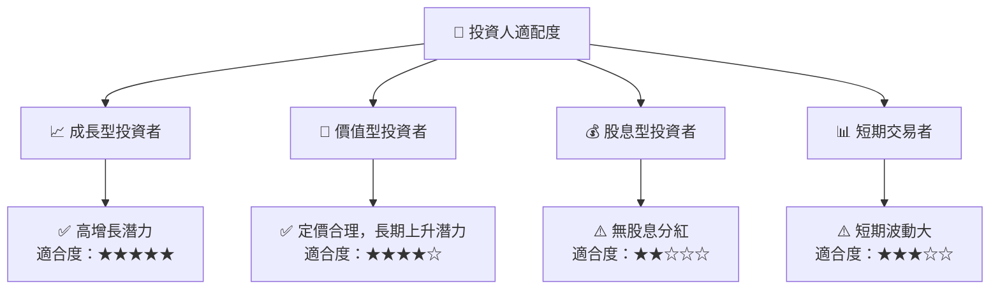

### 10.5 每季財報監控清單（Quarterly Watch List）

| 指標 | 目標值 | 觸發加碼 | 觸發減碼 |
|------|--------|----------|----------|
| 營收成長率 | >40% | 持續增長 | 下降至<20% |
| 營業利潤率 | >40% | 提升 | 收縮至<30% |
| FCF | 增長 | 增加投資 | 轉負 |
| ROIC | >WACC | 創造價值 | 跌破 WACC |

### 10.6 反面論證：什麼會證明論點錯誤（What Would Change My Mind）

```
╔══════════════════════════════════════════════════════════════════╗
║              ⚠️ 論點失效條件（Disconfirming Evidence）           ║
╠══════════════════════════════════════════════════════════════════╣
║  本投資論點在下列情況成立時應重新檢視或退出：                    ║
║  ☐ 核心業務成長率連續兩季 < 20%                                   ║
║  ☐ 營業利潤率較峰值收縮 > 10 pp                                  ║
║  ☐ 自由現金流轉負或 FCF 轉換率 < 50%                            ║
║  ☐ ROIC 跌破 WACC                                               ║
║  ☐ 關鍵成長投資（如 AI/新業務）無法在 12 期內變現               ║
╚══════════════════════════════════════════════════════════════════╝
```

---

> **免責聲明**：本報告為 AI 自動生成，僅供研究參考，不構成投資建議。投資有風險，入市需謹慎。