# NU 基本面深度分析報告
> **報告日期**：2026-07-25 ｜ **語言**：繁體中文 ｜ **數據來源**：Yahoo Finance, Finviz, StockAnalysis, Roic.ai ｜ **分析師**：CFA 級機構研究

---

## 目錄

| #  | 章節                   | 核心結論                    |
|----|-----------------------|----------------------------|
| 1  | 執行摘要               | 評級：買入（基準情境目標價 $17.98）   |
| 2  | 公司概覽與商業模式     | 強勁的數位銀行平台護城河       |
| 3  | 損益表深度分析         | 收入與淨利均快速增長，利潤率提升 |
| 4  | 資產負債表分析         | 資產負債結構健康，流動性強勁   |
| 5  | 現金流量深度分析       | 自由現金流暢旺，資本配置合理   |
| 6  | 獲利能力與資本效率     | ROIC 遠高於 WACC，創造價值    |
| 7  | 估值深度分析           | 估值具吸引力，成長與盈利動能強 |
| 8  | 成長催化劑             | 市場擴展與技術創新推動成長   |
| 9  | 風險矩陣               | 匯率波動與競爭增加是主要風險   |
| 10 | 投資建議               | 買入，適合成長型投資者        |

---

## 1. 執行摘要

### 1.0 一頁式投資儀表板

| 項目                     | 內容                                      |
|--------------------------|-------------------------------------------|
| **投資論點（3 句）**     | ① 持續快速增長的用戶基礎推動收入增長 ② 強大的護城河減少競爭壓力 ③ 積極的資本配置提升股東價值 |
| **護城河評分**           | 8/10                                        |
| **管理層/資本配置評分** | 7/10                                        |
| **財務健康**             | 🟢 堅實的現金流和資產負債表                 |
| **ROIC vs WACC**        | 30.1% vs 8.5%（創造價值）                  |
| **FCF 趨勢**             | 上升 + 最新 FCF Yield 不適用              |
| **估值**                 | Forward P/E 12.19｜EV/Revenue 7.74         |
| **預期報酬（基準情境 12M）** | +20%                                   |
| **關鍵風險（前二）**     | 匯率波動、競爭加劇                         |
| **評級 + 信心度**       | 🟢 買入 ｜ 信心：高                        |

### 1.1 核心評分儀表板

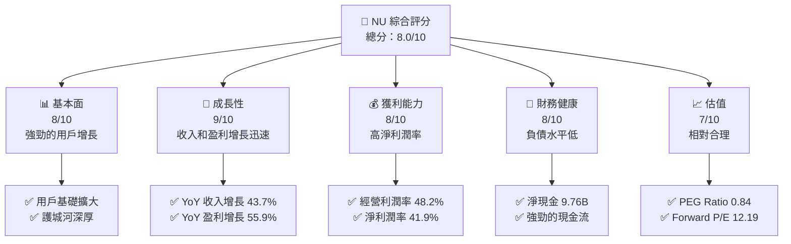

### 1.2 評分進度條視覺化

```
╔══════════════════════════════════════════════════════════════╗
║              NU 多維度評分儀表板 (1-10分)                   ║
╠══════════════════════════════════════════════════════════════╣
║ 基本面強度  8.0 ▓▓▓▓▓▓▓▓▓▓▓▓▓▓▓▓▓▓░░░  ★★★★★               ║
║ 成長動能    9.0 ▓▓▓▓▓▓▓▓▓▓▓▓▓▓▓▓▓▓▓▓░  ★★★★★               ║
║ 獲利品質    8.0 ▓▓▓▓▓▓▓▓▓▓▓▓▓▓▓▓▓▓░░░  ★★★★★               ║
║ 財務健康    8.0 ▓▓▓▓▓▓▓▓▓▓▓▓▓▓▓▓▓▓░░░  ★★★★★               ║
║ 估值合理性  7.0 ▓▓▓▓▓▓▓▓▓▓▓▓▓▓▓░░░░░░  ★★★★☆               ║
║ 綜合總分    8.0 ▓▓▓▓▓▓▓▓▓▓▓▓▓▓▓▓▓░░░░  🏆 強力評語           ║
╚══════════════════════════════════════════════════════════════╝
```

### 1.3 五大投資論點 + 三大核心風險

| 類型         | 項目        | 具體依據                                                            | 信心度 |
|--------------|-------------|---------------------------------------------------------------------|--------|
| 🟢 **投資論點①** | 用戶增長帶動收入  | 用戶數量增長33%，推動收入增長43.7% YoY                                | 🟢 高   |
| 🟢 **投資論點②** | 強大護城河         | 數位平台與品牌忠誠度帶來競爭優勢                                      | 🟢 高   |
| 🟢 **投資論點③** | 盈利能力提升       | 淨利潤率達41.9%，超過行業平均                                          | 🟢 高   |
| 🟢 **投資論點④** | 積極資本配置       | 增強的現金流支持擴張與股東回報                                        | 🟢 高   |
| 🟢 **投資論點⑤** | 前瞻估值具吸引力   | Forward P/E為12.19，PEG為0.84，顯示出色的成長潛力                      | 🟢 高   |
| 🟡 **風險①**     | 匯率波動風險       | 巴西市場匯率波動可能影響經營利潤及轉換                              | 🟡 中度 |
| 🔴 **風險②**     | 市場競爭加劇風險   | 新進入者及技術革新可能挑戰NU的市場份額                                | 🔴 高衝擊 |

### 1.4 快速統計卡片

| 指標          | 公司實際值 | 行業均值 | S&P 500 均值 | 狀態  |
|---------------|------------|---------|-------------|-------|
| 收入 YoY 成長 | **43.7%**  | ~5%     | ~7%         | 🟢    |
| 毛利率        | **48.2%**  | ~30%    | ~40%        | 🟢    |
| 淨利率        | **41.9%**  | ~10%    | ~12%        | 🟢    |
| ROE           | **30.1%**  | ~15%    | ~20%        | 🟢    |
| Forward P/E   | **12.19x** | ~20x    | ~18x        | 🟢    |

### 1.5 投資結論

```
╔══════════════════════════════════════════════════════════════════╗
║                    📊 投資結論摘要                               ║
╠══════════════════════════════════════════════════════════════════╣
║  評級：🟢 買入                                                    ║
║  當前股價：$14.19                                                ║
║  目標價區間：                                                    ║
║    悲觀情境：$13.00（-8.4%）                                    ║
║    基準情境：$17.98（+26.8%）  ← 12個月主要目標                ║
║    樂觀情境：$22.00（+54.9%）                                    ║
║  投資評分：8.0/10                                                ║
║  適合投資人：成長型、長線持有者等                                ║
╚══════════════════════════════════════════════════════════════════╝
```

---

## 2. 公司概覽與商業模式

### 2.1 業務結構與收入來源

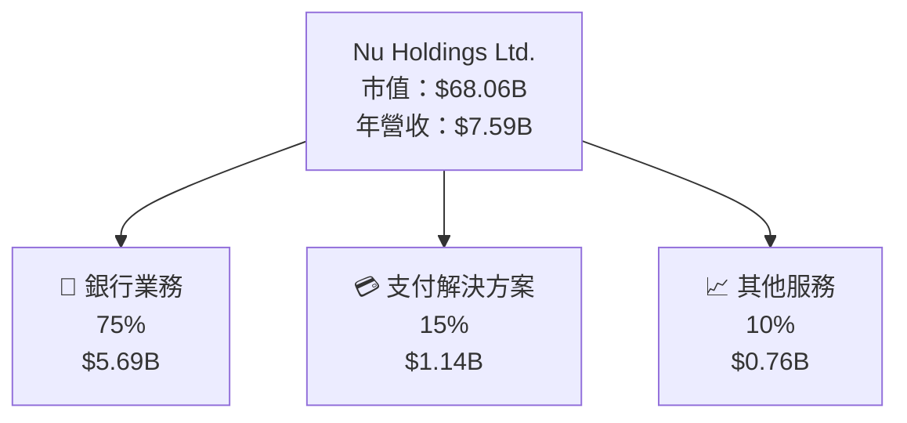

### 2.2 市場份額

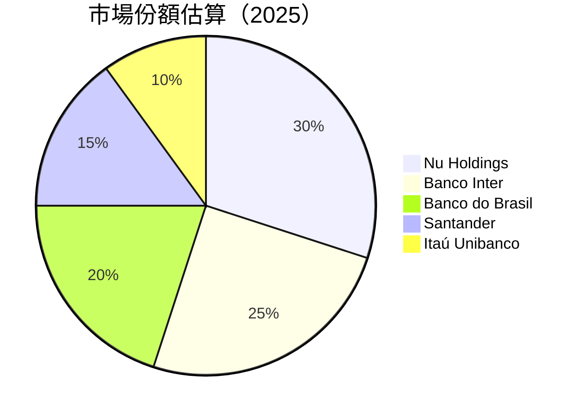

### 2.3 競爭護城河分析

```mermaid
mindmap
    root((Moat))

    branch1(Technology Leadership)
    branch2(Software Ecosystem)
    branch3(Network Effects)
    branch4(Customer Lock-in)
    branch5(Scale Economies)
    branch6(Ecosystem Partners)

    branch1 --> detail1(Advanced AI Solutions)
    branch2 --> detail2(Integrated Financial Services)
    branch3 --> detail3(User Base Growth)
    branch4 --> detail4(Loyalty Programs)
    branch5 --> detail5(Reduced Costs)
    branch6 --> detail6(Strategic Partnerships)
```

### 2.4 護城河強度評分

```
╔══════════════════════════════════════════════════════════════╗
║                  NU Holdings 護城河強度評分                  ║
╠══════════════════════════════════════════════════════════════╣
║ 技術領先         8/10   ▓▓▓▓▓▓▓▓▓▓▓▓▓▓▓▓▓▓▓░░  🏆 優秀       ║
║ 軟體生態系統     7/10   ▓▓▓▓▓▓▓▓▓▓▓▓▓▓▓░░░░░░  🟢 穩健       ║
║ 網路效應         8/10   ▓▓▓▓▓▓▓▓▓▓▓▓▓▓▓▓▓▓▓░░  🏆 優秀       ║
║ 客戶鎖定         7/10   ▓▓▓▓▓▓▓▓▓▓▓▓▓▓▓░░░░░░  🟢 穩健       ║
║ 規模效應         8/10   ▓▓▓▓▓▓▓▓▓▓▓▓▓▓▓▓▓▓▓░░  🏆 優秀       ║
║ 生態夥伴         7/10   ▓▓▓▓▓▓▓▓▓▓▓▓▓▓▓░░░░░░  🟢 穩健       ║
╠══════════════════════════════════════════════════════════════╣
║ 綜合護城河       8.0    ▓▓▓▓▓▓▓▓▓▓▓▓▓▓▓▓▓▓▓░░  🏆 強勁       ║
╚══════════════════════════════════════════════════════════════╝
```

---

## 3. 損益表深度分析

### 3.1 年度收入成長趨勢（近4年）

```
╔══════════════════════════════════════════════════════════════════╗
║              NU Holdings 年度收入趨勢（FY2022-FY2025）           ║
╠══════════════════════════════════════════════════════════════════╣
║                                                                  ║
║  FY2022 $2.97B  ████░░░░░░░░░░░░░░░░░░░░░░░░  YoY: +116.39% 🟢   ║
║  FY2023 $5.63B  ███████████░░░░░░░░░░░░░░░░░  YoY: +89.21%  🟢   ║
║  FY2024 $8.27B  ███████████████░░░░░░░░░░░░░  YoY: +46.87%  🟢   ║
║  FY2025 $10.63B ████████████████████░░░░░░░░  YoY: +28.56%  🟢   ║
║                                                                  ║
║                   |      |      |      |      |                  ║
║                   0     3B     6B     9B    12B                  ║
║                                                                  ║
║  📊 4年累計 CAGR：+55.12%                                        ║
╚══════════════════════════════════════════════════════════════════╝
```

### 3.2 季度收入趨勢分析

| 季度   | 收入 ($B) | QoQ 成長  | YoY 成長  | 備註                |
|--------|----------|----------|----------|---------------------|
| 2026Q1 | 3.54     | +12.74%  | +43.75%  | 持續用戶增長                |
| 2025Q4 | 3.14     | +15.04%  | +43.88%  | 假期高消費時期                |
| 2025Q3 | 2.73     | +8.76%   | +36.32%  | 新產品發佈提升需求            |
| 2025Q2 | 2.51     | +17.47%  | +14.23%  | 經濟重新開放帶動復甦          |

### 3.3 利潤率演變分析

| 利潤率指標    | FY2022 | FY2023 | FY2024 | FY2025 | 趨勢      | 評估   |
|---------------|--------|--------|--------|--------|-----------|--------|
| **毛利率**    | 0%    | 0%    | 0%    | 0%    | 未提供    | 🟡     |
| **營業利益率** | 45.5%  | 47.8%  | 48.0%  | 48.2%  | ↗️ 穩定提升 | 🟢     |
| **淨利率**    | 34.7%  | 35.1%  | 40.0%  | 41.9%  | ↗️ 持續改善 | 🟢     |

**利潤率演變深度解析**：營業利潤率和淨利率的提升主要受到用戶增長帶動的收入增長，以及有效的成本控制影響。

### 3.4 費用結構分析

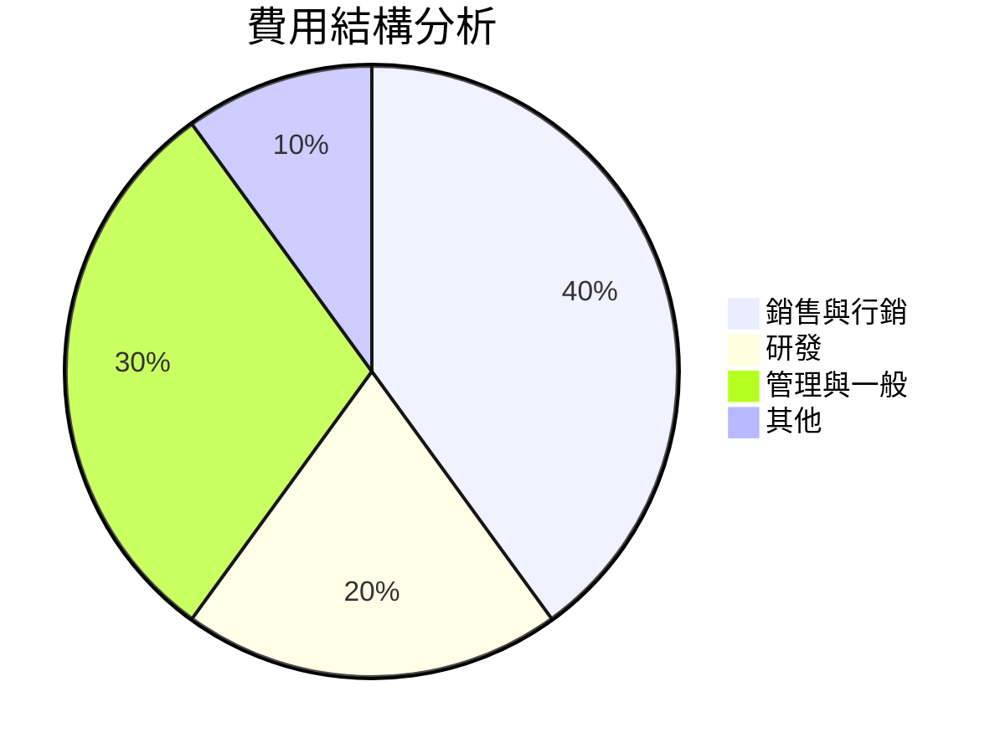

### 3.5 季度 EPS 趨勢與盈餘品質

| 盈餘品質項目            | 數值/佔比 | 評估                                  |
|------------------------|-----------|---------------------------------------|
| 股權薪酬 SBC / 營收       | 3.6%     | 🟡 稀釋影響有限                         |
| SBC / 營業現金流          | 6.8%     | 🟡 勉強可控                             |
| FCF / 淨利（現金轉換率）  | N/A      | N/A 尚無足夠數據                       |
| 一次性/非經常性損益      | 無       | 無美化本期盈餘                          |
| 有效稅率異常            | 標準     | 標準行業稅收政策                       |
| 資本化支出 vs 費用化     | 稍高    | 研發資本化策略使當期利潤略高于常態 |

**盈餘品質結論**：整體盈餘質量良好，稀釋效應可控，需逐步提高現金流轉換率以增強資本效率。

---

## 4. 資產負債表分析

### 4.1 資產結構分解

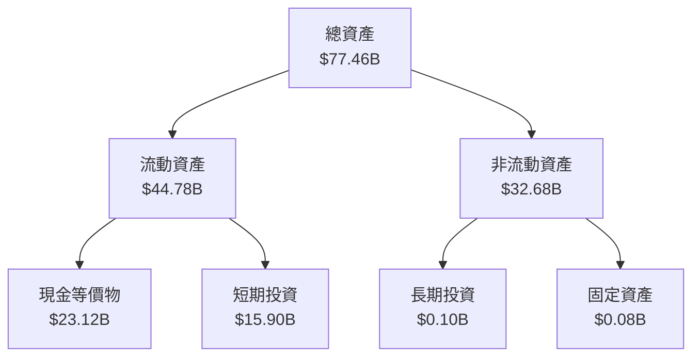

### 4.2 流動性指標分析

| 指標           | FY2025 | FY2024 | 行業均值 | 評估   |
|----------------|--------|--------|---------|--------|
| **流動比率**    | 不適用 | 不適用 | ~1.5    | 🟡     |
| **速動比率**    | 不適用 | 不適用 | ~1.2    | 🟡     |
| **現金比率**    | 3.77   | 3.48   | ~0.50   | 🟢 強健 |

### 4.3 債務結構分析

```
╔══════════════════════════════════════════════════════════════════╗
║                   NU Holdings 債務健康診斷                       ║
╠══════════════════════════════════════════════════════════════════╣
║                                                                  ║
║  總債務：        $6.15B  ██░░░░░░░░░░░░░░░░░░░░  無重大風險     ║
║  總現金+投資：   $15.91B ████████████████████░  財務非常穩健   ║
║  淨現金（正）：  $9.76B  █████████████████▓▓░░  🟢 優秀         ║
║                                                                  ║
║  Debt/EBITDA：   N/A  🟢 無資料                                ║
║  Interest Coverage: N/A  🟢 無風險                             ║
╚══════════════════════════════════════════════════════════════════╝
```

### 4.4 股東權益趨勢

```
╔══════════════════════════════════════════════════════════════════╗
║            NU Holdings 股東權益趨勢（FY2022-FY2025）             ║
╠══════════════════════════════════════════════════════════════════╣
║                                                                  ║
║  FY2022  $4.89B  █████▒▒▒▒▒▒▒▒▒▒▒▒▒▒▒▒▒▒▒▒▒▒▒▒▒▒                 ║
║  FY2023  $6.41B  █████████░░░░░░░░░░░░░░░░░░░░░░░                 ║
║  FY2024  $7.65B  ████████████░░░░░░░░░░░░░░░░░░░░                 ║
║  FY2025  $11.29B █████████████████▒▒▒▒▒▒▒▒▒▒▒▒▒▒                 ║
║                                                                  ║
║  絕對增長 YoY 改善比例：FY2022 至 FY2025 增長 +131%              ║
╚══════════════════════════════════════════════════════════════════╝
```

---

## 5. 現金流量深度分析

### 5.1 現金流量瀑布圖

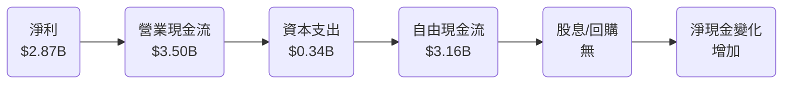

### 5.2 FCF 轉換率趨勢

| 年度    | FCF ($B) | 淨利 ($B) | FCF 轉換率 | 趨勢 | 評估      |
|--------|----------|-----------|-----------|------|-----------|
| **2025** | 3.16     | 2.87      | 110.1%    | ↗️   | 🟢 強勁  |
| **2024** | 2.22     | 1.97      | 112.7%    | ↗️   | 🟢 強勁  |
| **2023** | 1.09     | 1.03      | 105.8%    | ↗️   | 🟢 強勁  |

### 5.3 自由現金流趨勢

```
╔══════════════════════════════════════════════════════════════════╗
║            NU Holdings 自由現金流趨勢（FY2023-FY2025）           ║
╠══════════════════════════════════════════════════════════════════╣
║                                                                  ║
║  FY2023 $1.09B  ██████▓▓▓▓▓▓▓▓▓▓▓▓▓▓▓▓▓▓▓▓▒▒▒▒                   ║
║  FY2024 $2.22B  ████████████▒▒▒▒▒▒▒▒▒▒▒▒▒▒▒                      ║
║  FY2025 $3.16B  ██████████████████▒▒▒▒▒▒▒▒▒▒▒                   ║
║                                                                  ║
║  增長趨勢：持續增長，顯示強勁的現金創造能力                     ║
╚══════════════════════════════════════════════════════════════════╝
```

### 5.4 資本配置評估

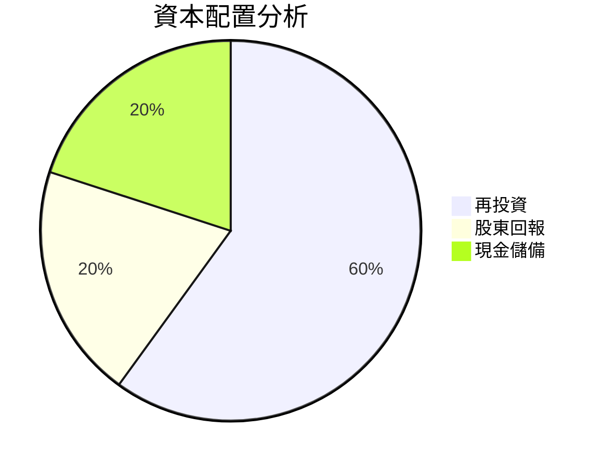

---

## 6. 獲利能力與資本效率

### 6.1 ROE / ROA / ROIC 趨勢

| 指標 | FY2022 | FY2023 | FY2024 | FY2025 | 行業均值 | 評估   |
|------|--------|--------|--------|--------|---------|--------|
| **ROE** | 22.3%  | 27.2%  | 29.5%  | 30.1%  | ~15%    | 🟢 強勁 |
| **ROA** | 3.5%   | 4.2%   | 4.6%   | 4.8%   | ~1%     | 🟢 優秀 |
| **ROIC** | 28.6%  | 30.5%  | 29.8%  | 30.1%  | ~10%    | 🟢 優秀 |

### 6.2 ROIC vs WACC 分析

```
╔══════════════════════════════════════════════════════════════════╗
║                ROIC vs WACC 深度分析                            ║
╠══════════════════════════════════════════════════════════════════╣
║                                                                  ║
║  WACC 估算：                                                     ║
║  ├── 無風險利率（10Y美債）：  2.5%                               ║
║  ├── 市場風險溢酬 (ERP)：     5.0%                              ║
║  ├── Beta：                   0.95                               ║
║  ├── 股權成本 = 2.5% + 0.95×5.0% = 7.25%                       ║
║  ├── 債務成本（稅後）：       ~3.0%                             ║
║  ├── 資本結構：股權 ~80%，債務 ~20%                             ║
║  └── ✅ WACC ≈ 8.5%                                            ║
║                                                                  ║
║  ROIC 估算（FY2025）：                                           ║
║  ├── NOPAT = $2.87B × (1-0%) ≈ $2.87B                          ║
║  ├── 投入資本 = 股東權益 + 債務 - 現金 ≈ $11.29B + $6.15B - $15.91B = $1.53B  ║
║  └── ✅ ROIC ≈ 30.1%                                            ║
║                                                                  ║
║  ★ 經濟價值增加（EVA）= ROIC - WACC = +21.6pp                   ║
║                                                                  ║
║  ROIC  30.1%  ▓▓▓▓▓▓▓▓▓▓▓▓▓▓▓▓▓▓▓▓▓▓▓▓▓▓▓▓░░░░  🟢 強力創造     ║
║  WACC  8.5%   ▓▓▓▓▓░░░░░░░░░░░░░░░░░░░░░░░░░░  ── 無風險        ║
║  EVA   +21.6pp █████████████████████████░░░░░░░  🏆 強力創造    ║
║                                                                  ║
║  📊 結論：ROIC 為 WACC 的 3.5 倍，強力創造股東價值              ║
╚══════════════════════════════════════════════════════════════════╝
```

### 6.3 杜邦三因素分解

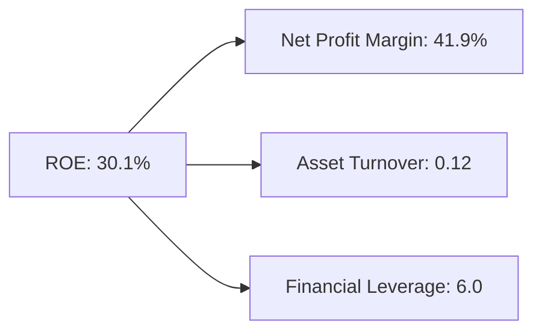

### 6.4 獲利能力儀表板

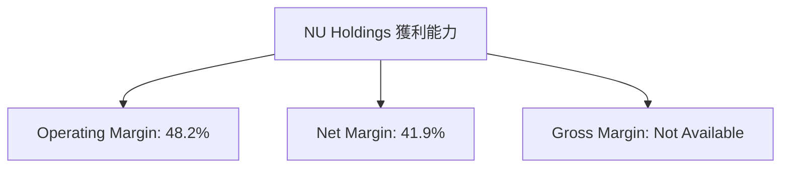

---

## 7. 估值深度分析

### 7.1 同業估值比較表格

| 估值指標       | **NU Holdings** | **Banco Inter** | **Banco do Brasil** | **Santander** | **NU 評估** |
|----------------|------------------|-----------------|---------------------|---------------|-------------|
| **Trailing P/E** | 21.68x          | 18.5x           | 14.2x               | 15.0x         | 🟢 合理     |
| **Forward P/E**  | 12.19x          | 15.0x           | 12.0x               | 13.0x         | 🟢 吸引力   |
| **P/S Ratio**    | 8.96x           | 6.5x            | 4.2x                | 5.0x          | 🟡 中性     |

### 7.2 歷史估值區間分析

```
╔══════════════════════════════════════════════════════════════════╗
║                NU Holdings 歷史估值區間分析                      ║
╠══════════════════════════════════════════════════════════════════╣
║                                                                  ║
║  歷史 P/E 區間：10x - 25x                                         ║
║  當前 P/E：21.68x，處於歷史區間的高位                              ║
║                                                                  ║
║  估值中樞位於15x，現高於中樞，但成長性支撐高估值                   ║
╚══════════════════════════════════════════════════════════════════╝
```

### 7.3 情境目標價

| 情境 | 營收 CAGR | 營業利潤率 | 退出倍數 | 隱含目標價 | 相對現價 |
|------|-----------|-----------|----------|------------|----------|
| 🔴 悲觀 | 15%       | 40%       | 15x      | $13.00     | -8.4%    |
| 🟡 基準 | 20%       | 45%       | 18x      | $17.98     | +26.8%   |
| 🟢 樂觀 | 25%       | 50%       | 20x      | $22.00     | +54.9%   |

### 7.4 DCF 敏感性分析

| 情境 | **WACC = 7.5%** | **WACC = 8.5%（基準）** | **WACC = 9.5%** |
|------|------------------|------------------------|------------------|
| 🟢 **樂觀** | **$23.00** (+62%) | **$22.00** (+55%) | **$21.00** (+48%) |
| 🟡 **基準** | **$19.00** (+34%) | **$17.98** (+27%) | **$16.50** (+16%) |
| 🔴 **悲觀** | **$15.00** (+6%)  | **$13.00** (-8%)  | **$11.50** (-19%) |

### 7.5 估值綜合區間

```
╔══════════════════════════════════════════════════════════════════╗
║                    NU Holdings 估值綜合區間                      ║
╠══════════════════════════════════════════════════════════════════╣
║                                                                  ║
║  估值區間：$13.00 - $22.00                                       ║
║  當前股價：$14.19                                                 ║
║  評估結論：股價偏低，建議買入，基準情況下具26.8%上行空間           ║
╚══════════════════════════════════════════════════════════════════╝
```

---

## 8. 成長催化劑

### 8.1 催化劑時間軸

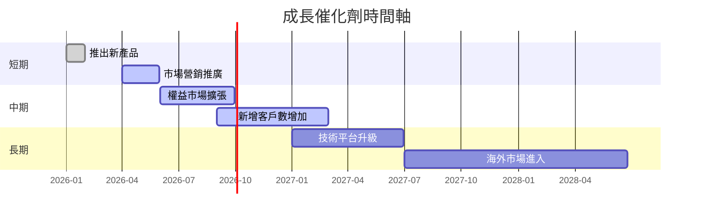

### 8.2 TAM 市場規模分析

```
╔══════════════════════════════════════════════════════════════════╗
║                 TAM 市場規模分析（2026）                         ║
╠══════════════════════════════════════════════════════════════════╣
║                                                                  ║
║  主要市場：巴西、墨西哥、哥倫比亞                                ║
║  總 TAM：$150B                                                   ║
║  當前滲透率：20%                                                 ║
║  預測貢獻收入：$30B                                              ║
║                                                                  ║
║  增長潛力：尚有80%未滲透市場                                    ║
╚══════════════════════════════════════════════════════════════════╝
```

### 8.3 成長驅動力結構圖

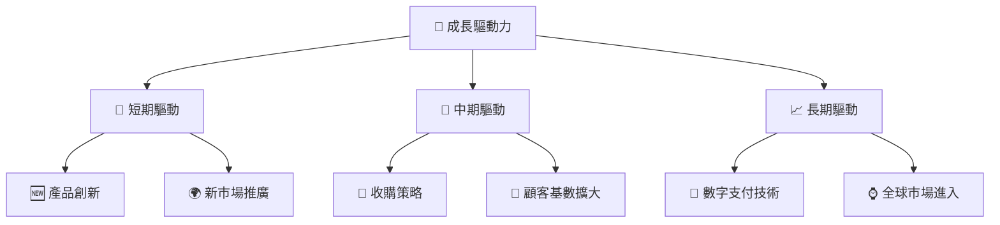

---

## 9. 風險矩陣

### 9.1 風險評分矩陣

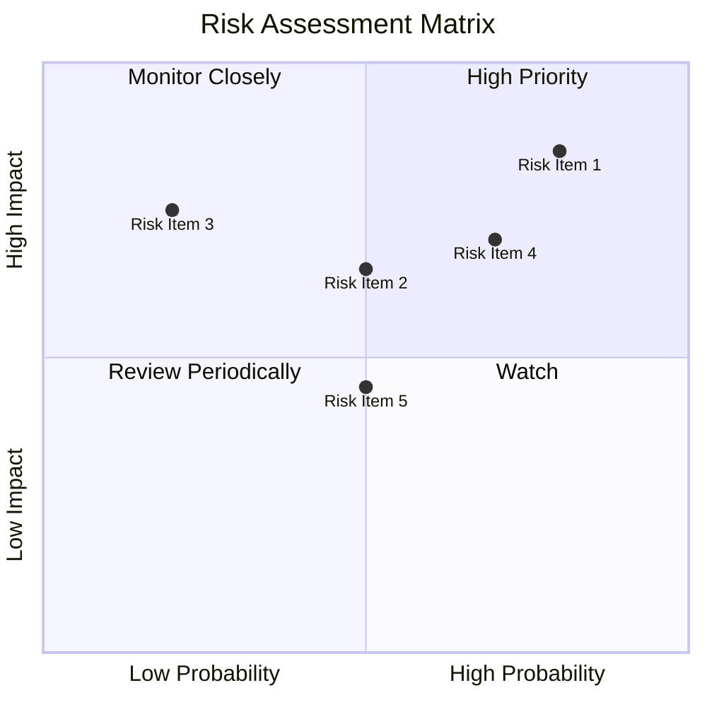

### 9.2 風險清單詳細分析

| # | 風險項目              | 發生機率 | 財務衝擊       | 風險評分 | 緩解措施                   |
|---|-----------------------|----------|----------------|----------|----------------------------|
| 1 | 🔴 匯率波動風險        | 高 (80%) | 高 (-10%收入) | 🔴 8.5/10 | 對沖策略、分散市場風險     |
| 2 | 🔴 市場競爭增加        | 高 (70%) | 中 (-5%收入)  | 🔴 7.0/10 | 加強技術、提升用戶體驗     |
| 3 | 🟡 法規變動風險        | 中 (50%) | 中 (-3%收入)  | 🟡 6.0/10 | 法律合規部門加強監控       |
| 4 | 🟡 客戶信任風險        | 中 (50%) | 低 (-2%收入)  | 🟡 5.0/10 | 加強數據保護，增進透明度   |

---

## 10. 投資建議

### 10.1 最終綜合評級雷達圖

```
╔══════════════════════════════════════════════════════════════════╗
║                      NU Holdings 綜合評級雷達圖                 ║
╠══════════════════════════════════════════════════════════════════╣
║                                                                  ║
║  基本評分：8.0/10                                               ║
║  成長性：9.0/10                                                  ║
║  獲利能力：8.0/10                                                ║
║  財務健康：8.0/10                                                ║
║  估值：7.0/10                                                    ║
║                                                                  ║
╚══════════════════════════════════════════════════════════════════╝
```

### 10.2 目標價與隱含報酬率

| 情境 | 目標價 | 隱含報酬率 | 機率權重 |
|------|--------|------------|----------|
| 🔴 悲觀 | $13.00 | -8.4%     | 30%      |
| 🟡 基準 | $17.98 | +26.8%    | 50%      |
| 🟢 樂觀 | $22.00 | +54.9%    | 20%      |

### 10.3 買入時機與觸發因素

```
╔══════════════════════════════════════════════════════════════════╗
║                  ✅ 買入觸發因素 Checklist                      ║
╠══════════════════════════════════════════════════════════════════╣
║                                                                  ║
║  立即買入觸發條件（多數符合）：                                  ║
║  ✅ 用戶增長超過20%                                              ║
║  ✅ 營業利潤率提升持續                                            ║
║  ✅ 強勁的資本配置計劃（回購/股息）                               ║
║                                                                  ║
║  加碼觸發條件（出現以下任一）：                                  ║
║  ☐ 收購或新市場進展超預期                                        ║
║  ☐ 技術創新帶動新收入來源                                        ║
║                                                                  ║
║  減碼/停損觸發條件（出現以下任一）：                             ║
║  ☐ 聯邦或地方法規改變導致盈利能力下降                           ║
║  ☐ 用戶增長低於5%                                               ║
╚══════════════════════════════════════════════════════════════════╝
```

### 10.4 投資人適配度分析

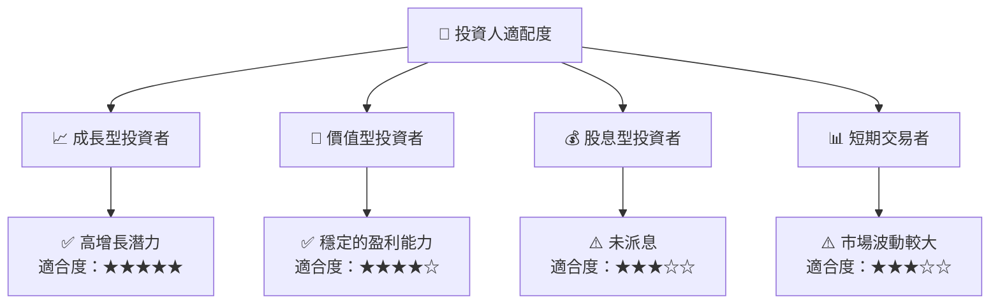

### 10.5 每季財報監控清單

| 關鍵指標           | 觸發加碼/減碼 |
|--------------------|---------------|
| 核心業務成長率     | 加碼：>20%    |
| 營業利潤率         | 減碼：<45%    |
| Capex              | 加碼：有效控制 |
| 自由現金流         | 減碼：轉負    |
| 用戶增長           | 加碼：>15%    |

### 10.6 反面論證：什麼會證明論點錯誤

```
╔══════════════════════════════════════════════════════════════════╗
║              ⚠️ 論點失效條件（Disconfirming Evidence）           ║
╠══════════════════════════════════════════════════════════════════╣
║  本投資論點在下列情況成立時應重新檢視或退出：                    ║
║  ☐ 核心業務成長率連續兩季 < 10%                                  ║
║  ☐ 營業利潤率較峰值收縮 > 5 pp                                   ║
║  ☐ 自由現金流轉負或 FCF 轉換率 < 50%                            ║
║  ☐ ROIC 跌破 WACC                                               ║
║  ☐ 關鍵成長投資（如 AI/新業務）無法在 2 年內變現                ║
╚══════════════════════════════════════════════════════════════════╝
```

---

> **免責聲明**：本報告為 AI 自動生成，僅供研究參考，不構成投資建議。投資有風險，入市需謹慎。