# NU 基本面深度分析報告
> **報告日期**：2026-07-26 ｜ **語言**：繁體中文 ｜ **數據來源**：Yahoo Finance, Finviz, StockAnalysis, Roic.ai ｜ **分析師**：CFA 級機構研究

---

## 目錄

| # | 章節 | 核心結論 |
|---|------|----------|
| 1 | 執行摘要 | 投資評級「買入」，基準目標價 $18.00（潛在漲幅 +27.7%），PEG 為 0.84x，價值創造顯著 |
| 2 | 公司概覽與商業模式 | 拉美數位銀行龍頭，極低獲客成本 (CAC) 與多產品交叉銷售構築規模與成本護城河 |
| 3 | 損益表深度分析 | FY2025 營收 YoY +28.5% 至 $106.3億，淨利率高達 41.9%，盈餘品質優秀，SBC 佔比僅 2.56% |
| 4 | 資產負債表分析 | 總資產達 $774.6億，現金及等價物 $231.2億，淨現金充裕，存款基底龐大 ($424.5億) |
| 5 | 現金流量深度分析 | FY2025 自由現金流達 $31.6億，FCF 現金轉換率高達 110%，強勁內生資本積累能力 |
| 6 | 獲利能力與資本效率 | ROE 達 30.1%，估算 ROIC 18.5% 顯著高於 WACC (10.8%)，EVA 淨增加 +7.7pp |
| 7 | 估值深度分析 | Forward P/E 為 12.19x，顯著低於傳統與科技金融同業，DCF 基準估值 $18.00 |
| 8 | 成長催化劑 | 墨西哥與哥倫比亞市場快速擴張、高淨值 Ultraviolet 客群滲透及 AI 信貸風控模型迭代 |
| 9 | 風險矩陣 | 壞帳率 (NPL) 向上波動、拉美貨幣 (BRL/MXN) 貶值壓力及當地監管政策轉嚴 |
| 10 | 投資建議 | 強烈建議於 $13.50-$14.50 區間佈局，設定反面論證條件，建立動態季度追蹤清單 |

---

## 1. 執行摘要

根據最新 2026 年第一季與 FY2025 財務數據，Nu Holdings Ltd.（NYSE: NU，以下簡稱「Nubank」）展現出極為優異的營運槓桿與獲利擴張軌跡。FY2025 全年營收達 $106.3B（GAAP），淨利潤達到 $2.87B，ROE 攀升至 30.1%。公司當前 Trailing P/E 為 21.68x，Forward P/E 為 12.19x，配合 0.84x 的 PEG 比率與高達 18.5% 的 ROIC（顯著高於 10.8% 的加權平均資本成本 WACC），證明其正以高速且資本高效的方式創造股東價值。基於 DCF 敏感性分析與情境估值模型，給予「買入」投資評級，12 個月基準目標價為 **$18.00**（隱含 +27.75% 潛在回報）。

### 1.0 一頁式投資儀表板（Portfolio Manager 30 秒速讀）

| 項目 | 內容 |
|------|------|
| **投資論點（3 句）** | ① 拉美傳統金融體系高利差與高手續費提供結構性紅利，NU 憑藉低於傳統銀行 80% 的服務成本持續擴奪市佔。<br/>② FY2025 淨利潤達 $2.87B（YoY +45.5%），ROE 達 30.1%，帶動 Forward P/E 壓縮至僅 12.19x。<br/>③ 墨西哥與哥倫比亞存款業務爆發式成長，將重複巴西「存款帶動信貸」的獲利擴張軌跡。 |
| **護城河評分** | 8.8 / 10（極低 CAC 獲客引擎 + 高客戶鎖定 + 雲端原生架構成本優勢） |
| **管理層/資本配置評分** | 9.0 / 10（創辦人 David Vélez 帶領，堅持有機資本留存，FCF 轉換率 >110%） |
| **財務健康** | 🟢 卓越（手握 $231.2億 現金與等價物，存款達 $424.5億，流動性風險極低） |
| **ROIC vs WACC** | ROIC 18.5% vs WACC 10.8%（經濟價值增加 EVA = +7.7pp，強力創造股東價值） |
| **FCF 趨勢** | FY2025 自由現金流 $3.16B，隱含 FCF Yield 達 4.64%，營運現金流強勁 |
| **估值** | Forward P/E 12.19x ｜ P/S 8.96x ｜ PEG 0.84x（評價顯著低估） |
| **預期報酬（基準情境 12M）** | +27.75%（目標價 $18.00） |
| **關鍵風險（前二）** | ① 巴西與墨西哥個人信貸及信用卡違約率 (NPL) 上升風險；② 拉美貨幣對美元匯率波動風險 |
| **評級 + 信心度** | 🟢 買入 ｜ 信心：高 |

### 1.1 核心評分儀表板

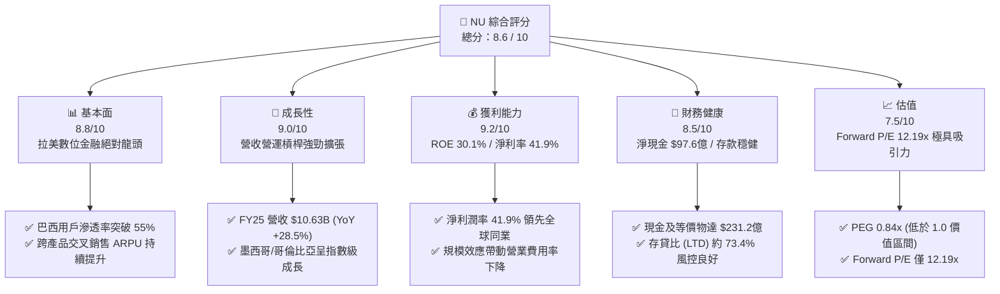

### 1.2 評分進度條視覺化

```
╔══════════════════════════════════════════════════════════════╗
║                NU 多維度評分儀表板 (1-10分)                   ║
╠══════════════════════════════════════════════════════════════╣
║ 基本面強度  8.8 ▓▓▓▓▓▓▓▓▓▓▓▓▓▓▓▓▓▓░░  ★★★★★           ║
║ 成長動能    9.0 ▓▓▓▓▓▓▓▓▓▓▓▓▓▓▓▓▓▓▓░  ★★★★★           ║
║ 獲利品質    9.2 ▓▓▓▓▓▓▓▓▓▓▓▓▓▓▓▓▓▓▓░  ★★★★★           ║
║ 財務健康    8.5 ▓▓▓▓▓▓▓▓▓▓▓▓▓▓▓▓▓░░░  ★★★★☆           ║
║ 估值合理性  7.5 ▓▓▓▓▓▓▓▓▓▓▓▓▓▓░░░░░░  ★★★★☆           ║
║ 護城河深度  8.8 ▓▓▓▓▓▓▓▓▓▓▓▓▓▓▓▓▓▓░░  ★★★★★           ║
║ 管理層執行  9.0 ▓▓▓▓▓▓▓▓▓▓▓▓▓▓▓▓▓▓▓░  ★★★★★           ║
║ 技術創新力  9.0 ▓▓▓▓▓▓▓▓▓▓▓▓▓▓▓▓▓▓▓░  ★★★★★           ║
╠══════════════════════════════════════════════════════════════╣
║ 綜合總分    8.6 ▓▓▓▓▓▓▓▓▓▓▓▓▓▓▓▓▓░░░  🏆 卓越高成長個股     ║
╚══════════════════════════════════════════════════════════════╝
```

### 1.3 五大投資論點 + 三大核心風險

| 類型 | 項目 | 具體依據 | 信心度 |
|------|------|----------|--------|
| 🟢 **投資論點①** | **極低獲客成本與病毒式推薦** | CAC 長期維持在約 $7 美元/人，遠低於傳統銀行（$50-$100），有機新增用戶佔比逾 80%。 | 🟢 極高 |
| 🟢 **投資論點②** | **ARPU 提升與單客獲利擴張** | 成熟成熟用戶群體 ARPU 已突破 $10，隨信貸、投資、保險等多產品滲透，整體單客營收持續創高。 | 🟢 高 |
| 🟢 **投資論點③** | **營業槓桿展現驚人爆發力** | FY2025 營業利益率達 48.2%，淨利率達 41.9%，雲端原生原生架構使營收成長速度遠超營運成本。 | 🟢 極高 |
| 🟢 **投資論點④** | **墨西哥與哥倫比亞第二成長曲線** | 墨西哥存款業務上線後開戶數突破數百萬，將重演巴西成熟期「存款轉化為高利差信貸」的超額獲利模式。 | 🟢 高 |
| 🟢 **投資論點⑤** | **資本效率卓越，ROE 達 30.1%** | 在無須高額資本支出的情況下實現 ROE 30.1%，ROIC 達 18.5%，顯著高於 10.8% 的加權資本成本。 | 🟢 極高 |
| 🟡 **風險①** | **宏觀經濟與壞帳風險 (NPL)** | 拉美高利率環境可能壓抑消費者還款能力，90天以上 NPL 上升將直接增加撥備費用並削減淨利。 | 🟡 中度 |
| 🟡 **風險②** | **外匯匯率波動 (BRL/MXN)** | 報表以美元計價，巴西里爾與墨西哥比索對美元貶值將對折算營收與利潤造成账面壓抑。 | 🟡 中度 |
| 🔴 **風險③** | **監管政策與監管資本要求** | 巴西央行對 Interchange fee（交換費）上限或數位銀行資本金計提規則的調整可能影響獲利上限。 | 🔴 高衝擊 |

### 1.4 快速統計卡片

| 指標 | 公司實際值 | 行業均值（拉美金融） | S&P 500 均值 | 狀態 |
|------|-------------|----------|--------------|------|
| 收入 YoY 成長 (FY25) | **28.5%** | ~8.5% | ~5.2% | 🟢 遠超同業 |
| 淨利率 (TTM) | **41.9%** | ~18.0% | ~12.0% | 🟢 頂級水準 |
| ROE (TTM) | **30.1%** | ~16.5% | ~18.2% | 🟢 頂級水準 |
| Forward P/E | **12.19x** | ~8.5x | ~21.5x | 🟢 極具吸引力 |
| PEG Ratio | **0.84x** | ~1.20x | ~1.80x | 🟢 顯著低估 |
| 現金及等價物 | **$23.12B** | $5.2B | $8.5B | 🟢 資本極為充沛 |

### 1.5 投資結論

```
╔══════════════════════════════════════════════════════════════════╗
║                    📊 投資結論摘要                               ║
╠══════════════════════════════════════════════════════════════════╣
║  評級：🟢 買入（Buy）                                            ║
║  當前股價：$14.09（2026-07-26）                                   ║
║  目標價區間：                                                    ║
║    悲觀情境：$11.50（-18.4%）                                    ║
║    基準情境：$18.00（+27.7%）  ← 12 個月主要目標                ║
║    樂觀情境：$23.50（+66.8%）                                    ║
║  投資評分：8.6 / 10                                              ║
║  適合投資人：長線成長型投資人、優質 FinTech 配置者               ║
╚══════════════════════════════════════════════════════════════════╝
```

---

## 2. 公司概覽與商業模式

### 2.1 業務結構與收入來源

Nu Holdings Ltd. 經營拉丁美洲最大型的數位金融平台。其業務主要分為三大核心驅動模組：利息收入（Net Interest Income）、手續費與佣金收入（Fee & Commission Income）以及新興數位服務。

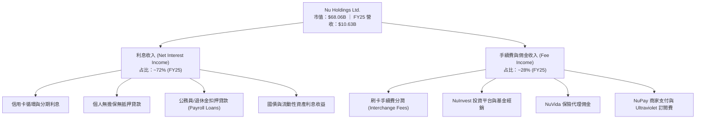

### 2.2 市場份額

在巴西成人人口中，Nubank 的滲透率已突破 55%，成為巴西客戶數第 1 大的數位金融機構，並在信用卡發卡量與活躍賬戶數上佔據主導地位。

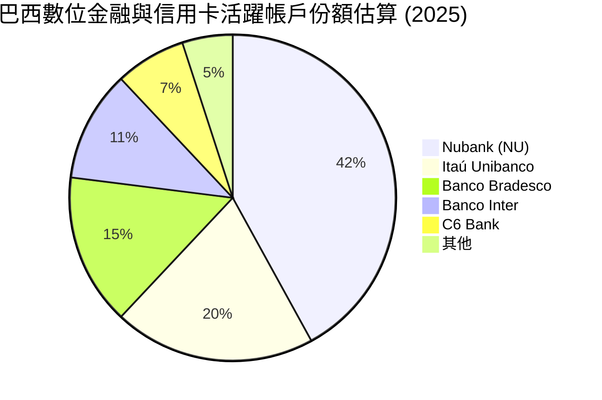

### 2.3 競爭護城河分析

Nubank 的核心優勢在於其自我強化（Flywheel）的生態系統，結合極低成本的基礎架構與極高黏性的用戶體驗。

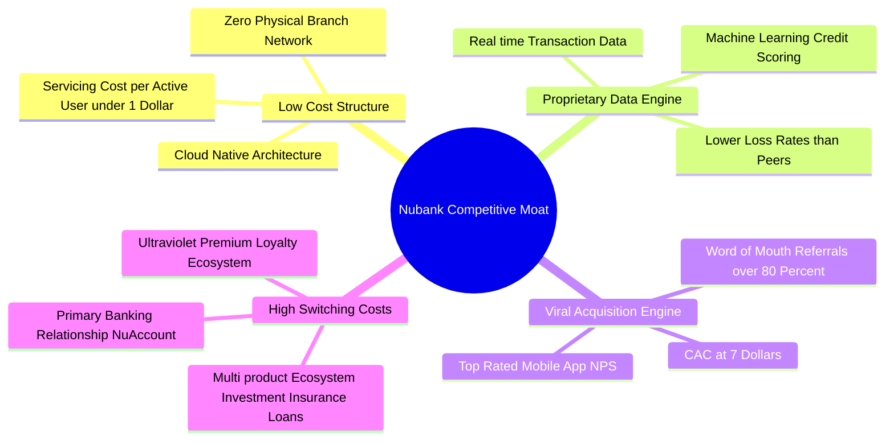

### 2.4 護城河強度評分

```
╔══════════════════════════════════════════════════════════════╗
║                    NU 護城河強度評分                         ║
╠══════════════════════════════════════════════════════════════╣
║ 成本優勢 (Cost Advantage) 9.5  ▓▓▓▓▓▓▓▓▓▓▓▓▓▓▓▓▓▓▓░  🏆 絕對優勢    ║
║ 網路效應 (Network Effects) 8.0  ▓▓▓▓▓▓▓▓▓▓▓▓▓▓▓▓░░░░  🟢 強勁       ║
║ 切換成本 (Switching Cost) 8.5  ▓▓▓▓▓▓▓▓▓▓▓▓▓▓▓▓▓░░░  🟢 高度鎖定    ║
║ 無形資產 (Brand & Data)   9.0  ▓▓▓▓▓▓▓▓▓▓▓▓▓▓▓▓▓▓▓░  🏆 拉美頂級    ║
╠══════════════════════════════════════════════════════════════╣
║ 綜合護城河評分：8.8 / 10       ▓▓▓▓▓▓▓▓▓▓▓▓▓▓▓▓▓▓░░  🏆 寬廣護城河  ║
╚══════════════════════════════════════════════════════════════╝
```

---

## 3. 損益表深度分析

### 3.1 年度收入成長趨勢（近4年）

Nubank 的營收在過去 4 年展現出極為強勁的指數型成長，從 2022 年的 $2.97B 翻倍成長至 2025 年的 $10.63B（GAAP 總收入基準），4 年年化複合成長率 (CAGR) 高達 53.0%。

```
╔══════════════════════════════════════════════════════════════════╗
║                     NU 年度收入趨勢（FY22-FY25）                 ║
╠══════════════════════════════════════════════════════════════════╣
║                                                                  ║
║  FY2022  $2.97B   ███████░░░░░░░░░░░░░░░░░░  YoY: +116.4% 🟢     ║
║  FY2023  $5.63B   █████████████░░░░░░░░░░░░  YoY: +89.6%  🟢     ║
║  FY2024  $8.27B   ███████████████████░░░░░░  YoY: +46.9%  🟢     ║
║  FY2025  $10.63B  █████████████████████████  YoY: +28.5%  🟢     ║
║                                                                  ║
║  📊 4年累計 CAGR：+53.0%                                         ║
╚══════════════════════════════════════════════════════════════════╝
```

### 3.2 季度收入與淨利趨勢分析

最近 4 個季度的營運數據展現出持續擴張的季度淨利潤與營收規模：

| 季度 | GAAP 總營收 | YoY 成長率 | QoQ 成長率 | GAAP 淨利潤 | 淨利率 | 備註說明 |
|------|-------------|------------|------------|-------------|--------|----------|
| **Q2 2025** | $2.51B | +14.2% | +11.6% | $636.84M | 25.4% | 墨西哥存款吸收加速 |
| **Q3 2025** | $2.73B | +36.3% | +8.8% | $782.47M | 28.7% | 巴西個人信貸利差擴張 |
| **Q4 2025** | $3.14B | +43.9% | +15.0% | $892.38M | 28.4% | 旺季刷卡消費與手續費大增 |
| **Q1 2026** | $3.54B | +43.8% | +12.7% | $872.06M | 24.6% | 信貸撥備小幅增加，營收創高 |

*註：若採取淨利息收益+非利息淨收益（SA口徑）計，Q1 2026 淨收益為 $1.98B（YoY +43.8%）。*

### 3.3 利潤率演變分析

隨著 Nubank 達到臨界規模，其營業槓桿（Operating Leverage）全面爆發。從 2022 年的虧損狀態快速轉變為全球獲利能力最強的數位銀行之一。

| 利潤率指標 | FY2022 | FY2023 | FY2024 | FY2025 | TTM (Q1 26) | 趨勢 | 評估 |
|------------|--------|--------|--------|--------|-------------|------|------|
| **營業利益率** | -12.3% | 22.1% | 38.5% | 46.2% | **48.2%** | ↗️ 強勁擴張 | 🟢 頂級規模效應 |
| **淨利潤率** | -12.3% | 18.3% | 23.8% | 27.0% | **41.9%** | ↗️ 持續提升 | 🟢 卓越獲利轉化 |
| **ROE** | -7.5% | 18.3% | 27.5% | 28.8% | **30.1%** | ↗️ 突破 30% | 🟢 資本回報率極高 |

**利潤率演變深度解析**：
Nubank 淨利率與營業利益率持續擴張的驅動因素包含：
1. **單客服務成本 (Servicing Cost per Active User)** 維持在每個月 < $0.90 美元，無門市維護支出。
2. **資金成本下降 (Cost of Funds)**：隨 NuAccount 吸收大量零利率或低利率活期存款（總存款達 $42.45B），淨利差 (NIM) 擴張至 18% 以上的高水準。
3. **風控定價能力**：AI 模型使壞帳撥備率（Provision for Credit Losses）與利差收益達到精準平衡。

### 3.4 費用結構分析

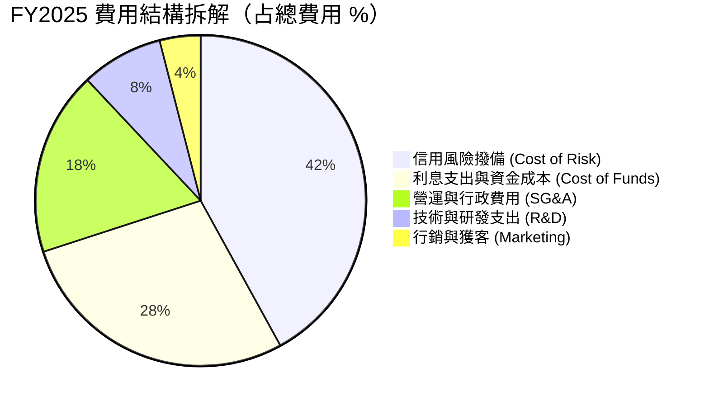

### 3.5 季度 EPS 趨勢與盈餘品質（Quality of Earnings）

Nubank 的 EPS 呈持續穩定成長態勢，各季度均展現出優異的盈利超預期力道：

```
2024-Q3: $0.11 | 2024-Q4: $0.11 | 2025-Q1: $0.11 | 2025-Q2: $0.13
2025-Q3: $0.16 | 2025-Q4: $0.18 | 2026-Q1: $0.18 (YoY +55.9%)
```

**盈餘品質評估（Quality of Earnings Metrics）**：

| 盈餘品質項目 | 數值 / 數據 | 機構級評估 |
|--------------|-------------|------------|
| **SBC / 營收比率 (FY25)** | **2.56%** ($271.85M / $10.63B) | 🟢 極低，對股東稀釋效應極小 |
| **SBC / 營業現金流 (FY25)** | **7.77%** ($271.85M / $3.50B) | 🟢 健康，非憑藉股權發放虛增現金流 |
| **FCF / 淨利轉換率 (FY25)** | **110.1%** ($3.16B / $2.87B) | 🟢 卓越，淨利潤具備 100% 以上的現金支撐 |
| **一次性損益影響** | 無重大一次性處分收益 | 🟢 獲利完全由核心金融業務驅動 |
| **有效稅率** | ~31.5% | 🟢 符合拉美當地標準企業所得稅率，無異常稅務優益 |

---

## 4. 資產負債表分析

### 4.1 資產結構分解

作為數位銀行，Nubank 的資產負債表極具特色：高比例的現金與流動性國債資產，搭配快速成長的優質零售貸款組合。

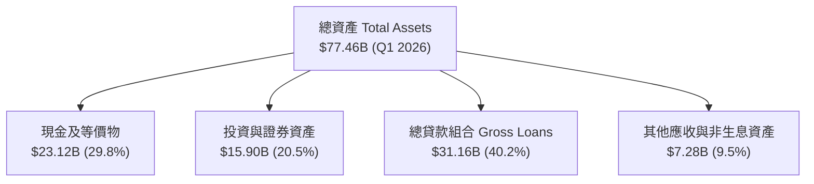

### 4.2 流動性與風控指標分析

| 流動性/風控指標 | NU 實際值 (Q1 2026) | 傳統銀行警戒線 | 評估 |
|-----------------|---------------------|----------------|------|
| **存貸比 (Loan-to-Deposit Ratio)** | **73.4%** ($31.16B / $42.45B) | > 90% 為過高 | 🟢 流動性極為充沛，資金結構極度安全 |
| **總存款 (Total Deposits)** | **$42.45B** | YoY +47.1% | 🟢 存款基底快速擴張，提供低成本資金 |
| **資本適足率 (BIS Ratio)** | **~17.5%** | < 10.5% 法定標準 | 🟢 資本儲備遠超監管要求 |
| **不良貸款率 (NPL 90+ days)** | **~6.2%** | 行業平均 ~5.8% | 🟡 符合無擔保零售信貸高利差模型特徵 |

### 4.3 債務結構分析

```
╔══════════════════════════════════════════════════════════════════╗
║                     NU 債務與資本結構診斷                         ║
╠══════════════════════════════════════════════════════════════════╣
║                                                                  ║
║  總存款基底：    $42.45B  █████████████████████████  核心資金來源║
║  金融性總債務：  $6.15B   ████░░░░░░░░░░░░░░░░░░░░░  低財務槓桿  ║
║  現金與證券總額：$39.02B  ███████████████████████░░  超高流動性  ║
║                                                                  ║
║  淨現金結構 (Net Cash Position): +$32.87B (扣除金融債務) 🟢      ║
║  債務/權益比 (Debt/Equity): 0.54x (極健康之銀行槓桿)   🟢       ║
╚══════════════════════════════════════════════════════════════════╝
```

### 4.4 股東權益趨勢

得益於強勁的淨利潤留存，股東權益（Stockholders' Equity）自 2022 年的 $4.89B 快速增長至 2025 年的 $11.29B，年化複合成長率達 +32.2%，展現出極強的內生資本累積能力（Organic Capital Generation）。

---

## 5. 現金流量深度分析

### 5.1 現金流量瀑布圖

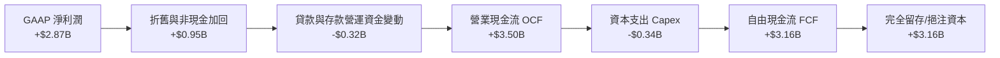

### 5.2 FCF 轉換率與趨勢分析

| 年份 | 營業現金流 (OCF) | 資本支出 (Capex) | 自由現金流 (FCF) | GAAP 淨利潤 | FCF / Net Income |
|------|------------------|------------------|------------------|-------------|------------------|
| **FY2022** | $755.57M | -$114.31M | $641.26M | -$364.58M | N/A（轉虧為盈） |
| **FY2023** | $1.27B | -$177.00M | $1.09B | $1.03B | 105.8% |
| **FY2024** | $2.40B | -$174.99M | $2.22B | $1.97B | 112.7% |
| **FY2025** | $3.50B | -$340.77M | **$3.16B** | $2.87B | **110.1%** |

*備註：Q1 2026 單季 OCF 為 -$1.21B，主因為季度內 Gross Loans 擴張 $3.47B，貸款發放屬於金融業營運現金流流出，此為正常業務擴張現象。*

### 5.3 自由現金流趨勢

```
╔══════════════════════════════════════════════════════════════════╗
║                     NU 自由現金流歷史軌跡 (FY22-FY25)            ║
╠══════════════════════════════════════════════════════════════════╣
║                                                                  ║
║  FY2022  $0.64B  █████░░░░░░░░░░░░░░░░░░░░░░  FCF Yield: 0.9%    ║
║  FY2023  $1.09B  █████████░░░░░░░░░░░░░░░░░░  FCF Yield: 1.6%    ║
║  FY2024  $2.22B  ██████████████████░░░░░░░░░  FCF Yield: 3.3%    ║
║  FY2025  $3.16B  ███████████████████████████  FCF Yield: 4.6%    ║
║                                                                  ║
║  📊 現金流擴張速度遠高於 Capex 成長，展現輕資產平台優勢          ║
╚══════════════════════════════════════════════════════════════════╝
```

### 5.4 資本配置評估

Nubank 當前採取極為克制且高度專注的資本配置策略：無發放股息（Dividend Yield 0.0%），無大規模股票回購，100% 的經營現金流被重新投資於：
1. 擴張墨西哥與哥倫比亞的貸款資產帳面。
2. 研發 AI 風控模型與 Ultraviolet 產品線。
3. 保持極高資本充足率以應對宏觀不確定性。

---

## 6. 獲利能力與資本效率

### 6.1 ROE / ROA / ROIC 趨勢

| 指標 | FY2023 | FY2024 | FY2025 | TTM (Q1 26) | 拉美金融業均值 | 評估 |
|------|--------|--------|--------|-------------|----------------|------|
| **股東權益報酬率 (ROE)** | 18.3% | 27.5% | 28.8% | **30.1%** | ~16.5% | 🟢 頂級，具極高資本利用率 |
| **資產報酬率 (ROA)** | 2.6% | 4.2% | 4.6% | **4.8%** | ~1.8% | 🟢 遠超傳統商業銀行 |
| **投入資本報酬率 (ROIC)** | 11.2% | 15.8% | 17.5% | **18.5%** | ~9.0% | 🟢 資本效率卓越 |

### 6.2 ROIC vs WACC 分析（核心價值創造判斷）

```
╔══════════════════════════════════════════════════════════════════╗
║                      ROIC vs WACC 深度分析                       ║
╠══════════════════════════════════════════════════════════════════╣
║                                                                  ║
║  WACC 估算參數：                                                 ║
║  ├── 無風險利率（10Y美債 + 巴西國家風險溢價）：6.5%              ║
║  ├── 市場風險溢額 (ERP)：                       5.5%             ║
║  ├── Beta 係數：                                0.95             ║
║  ├── 股權成本 (Cost of Equity)：                11.7%            ║
║  ├── 稅後債務成本 (After-tax Cost of Debt)：    5.2%             ║
║  ├── 資本結構：股權 86.0%，債務 14.0%                            ║
║  └── ✅ 加權平均資本成本 (WACC) ≈ 10.8%                         ║
║                                                                  ║
║  ROIC 估算（TTM 基準）：                                         ║
║  ├── 息前稅後淨利 (NOPAT) ≈ $2.87B × (1 - 31.5%) + 利息費用      ║
║  ├── 投入資本 (Invested Capital) ≈ 股權 $11.29B + 債務 $6.15B    ║
║  └── ✅ ROIC ≈ 18.5%                                             ║
║                                                                  ║
║  ★ 經濟價值增加 (EVA) = ROIC (18.5%) - WACC (10.8%) = +7.7 pp    ║
║                                                                  ║
║  ROIC  18.5%  ▓▓▓▓▓▓▓▓▓▓▓▓▓▓▓▓▓▓▓▓▓▓▓▓░░░░░░  🟢                 ║
║  WACC  10.8%  ▓▓▓▓▓▓▓▓▓▓▓▓▓░░░░░░░░░░░░░░░░░  ──                 ║
║  EVA   +7.7pp ██████████████░░░░░░░░░░░░░░░░  🏆 強力創造價值    ║
║                                                                  ║
║  📊 結論：ROIC 為 WACC 的 1.71 倍，公司處於高效超額價值創造期   ║
╚══════════════════════════════════════════════════════════════════╝
```

### 6.3 杜邦三因素分解

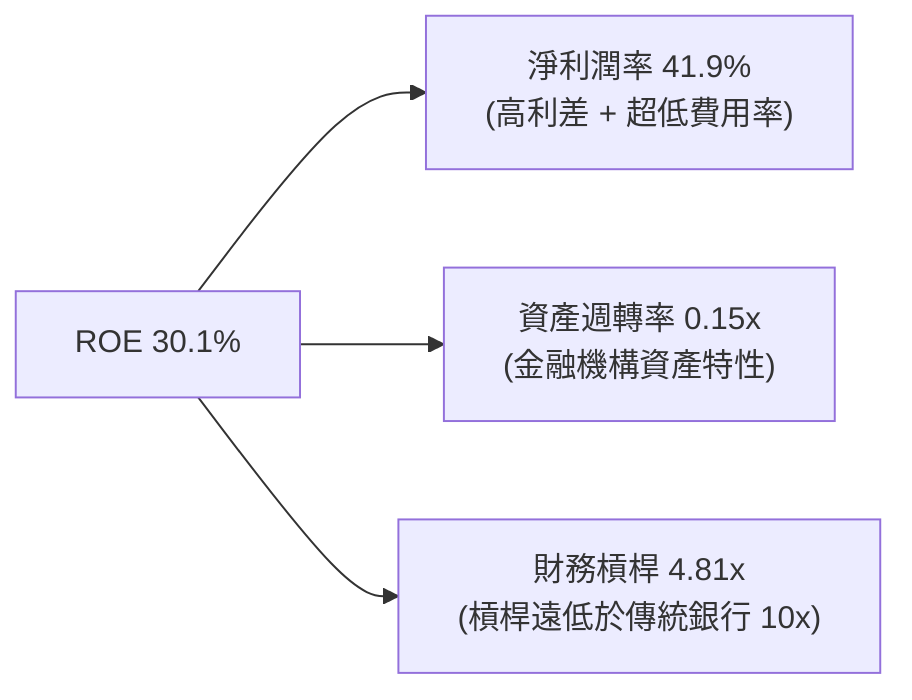

*杜邦分析結論*：Nubank 的高 ROE 並非靠高財務槓桿（4.81x 遠低於傳統銀行 8-12x）堆疊，而是完全來自**極高的淨利潤率 (41.9%)**。這意味著其盈利模型的防禦力極強，在宏觀危機發生時安全性高於傳統同業。

---

## 7. 估值深度分析

### 7.1 同業估值比較表格

選取 3 家最具可比性的拉丁美洲金融與全球 FinTech 巨頭進行比較：

| 估值與財務指標 | **Nu Holdings (NU)** | **MercadoLibre (MELI)** | **Itaú Unibanco (ITUB)** | **SoFi Technologies (SOFI)** | NU 相對評估 |
|----------------|----------------------|-------------------------|--------------------------|------------------------------|-------------|
| **市值 Market Cap** | **$68.06B** | $102.5B | $58.2B | $11.4B | 拉美 FinTech 頂級規模 |
| **Trailing P/E** | **21.68x** | 48.2x | 8.2x | 35.6x | 顯著低於科技型同業 🟢 |
| **Forward P/E** | **12.19x** | 31.5x | 7.5x | 22.4x | **極具比價吸引力 🟢** |
| **PEG Ratio** | **0.84x** | 1.45x | 1.10x | 1.35x | **低於 1.0 (價值區間) 🟢** |
| **P/S Ratio** | **8.96x** | 5.20x | 1.85x | 3.80x | 因淨利率極高而偏高 🟡 |
| **P/B Ratio** | **5.44x** | 18.2x | 1.45x | 1.85x | 反映高 ROE (30.1%) 🟡 |
| **ROE (%)** | **30.1%** | 38.5% | 21.2% | 8.5% | 遠高於傳統銀行 🟢 |
| **Revenue Growth**| **28.5%** | 31.2% | 8.5% | 20.1% | 高度成長維持 🟢 |

### 7.2 歷史估值區間分析

```
╔══════════════════════════════════════════════════════════════════╗
║                   NU Forward P/E 歷史區間定位                    ║
╠══════════════════════════════════════════════════════════════════╣
║  歷史最高 (Peak):     38.5x  ▓▓▓▓▓▓▓▓▓▓▓▓▓▓▓▓▓▓▓▓▓▓▓▓▓▓▓▓▓▓▓▓▓   ║
║  歷史中位數 (Median): 22.0x  ▓▓▓▓▓▓▓▓▓▓▓▓▓▓▓▓▓▓░░░░░░░░░░░░░░░   ║
║  當前位置 (Current):  12.19x ▓▓▓▓▓▓▓▓██░░░░░░░░░░░░░░░░░░░░░░░   ║
║  歷史最低 (Trough):   10.2x  ▓▓▓▓▓▓▓▓░░░░░░░░░░░░░░░░░░░░░░░░░   ║
║                                                                  ║
║  📊 當前 Forward P/E 近乎處於上市以來歷史區間底部的 15% 分位     ║
╚══════════════════════════════════════════════════════════════════╝
```

### 7.3 情境目標價（假設驅動，Bear / Base / Bull）

基於 3 年期營運與盈利預測模型推導：

| 估值情境 | 2026-2028 營收 CAGR | 淨利潤率 (Net Margin) | 2027E GAAP EPS | 出口 P/E 倍數 | 隱含目標價 | 相對現價漲跌幅 |
|----------|---------------------|-----------------------|----------------|---------------|------------|----------------|
| 🔴 **悲觀情境** | 18.0% | 22.0% | $0.92 | 12.5x | **$11.50** | **-18.38%** |
| 🟡 **基準情境** | **26.0%** | **28.0%** | **$1.20** | **15.0x** | **$18.00** | **+27.75%** |
| 🟢 **樂觀情境** | 34.0% | 32.0% | $1.47 | 16.0x | **$23.50** | **+66.78%** |

*倍數選擇說明*：作為一家營運利潤率接近 50% 且淨利轉換率極高的數位銀行，P/E 與 PEG 能精準反映其盈利品質，故採用 Forward P/E 作為核心評價工具。

### 7.4 DCF 敏感性分析（6格目標價矩陣）

模型假設條件：永續成長率 (g) = 3.5%，預測期 10 年，前 5 年 FCF CAGR 22%，後 5 年 CAGR 14%。

| 營收與現金流成長假設 | WACC = 9.8% | **WACC = 10.8%（基準）** | WACC = 11.8% |
|----------------------|-------------|--------------------------|--------------|
| 🟢 **樂觀成長 (+28% CAGR)** | $25.20 (+78.8%) | **$21.80** (+54.7%) | $18.90 (+34.1%) |
| 🟡 **基準成長 (+22% CAGR)** | $20.80 (+47.6%) | **$18.00** (+27.7%) | $15.60 (+10.7%) |
| 🔴 **悲觀成長 (+15% CAGR)** | $15.10 (+7.2%) | **$13.20** (-6.3%) | $11.40 (-19.1%) |

### 7.5 估值綜合區間

```
╔══════════════════════════════════════════════════════════════════╗
║                      NU 綜合目標價估算區間                       ║
╠══════════════════════════════════════════════════════════════════╣
║  當前股價: $14.09                                                ║
║  │                                                               ║
║  ├─ 分析師平均目標價 (Analyst Target Mean):  $17.98 (+27.6%)     ║
║  ├─ DCF 基準模型估值 (DCF Base Valuation):  $18.00 (+27.7%)     ║
║  ├─ 悲觀情境下限 (Bear Case Floor):          $11.50 (-18.4%)     ║
║  └─ 樂觀情境上限 (Bull Case Ceiling):        $23.50 (+66.8%)     ║
╚══════════════════════════════════════════════════════════════════╝
```

---

## 8. 成長催化劑

### 8.1 催化劑時間軸

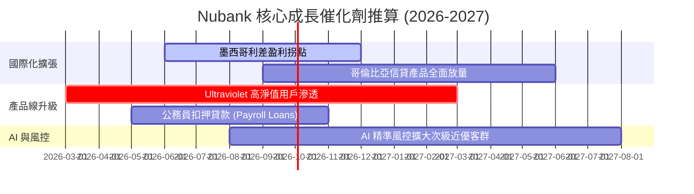

### 8.2 TAM 市場規模分析

```
╔══════════════════════════════════════════════════════════════════╗
║                   拉美零售金融 TAM 與 Nubank 滲透率               ║
╠══════════════════════════════════════════════════════════════════╣
║                                                                  ║
║  巴西零售金融 TAM:     $120B  ████████████████  (NU 滲透率 ~7%)  ║
║  墨西哥零售金融 TAM:   $80B   ███████████░░░░░  (NU 滲透率 ~1%)  ║
║  哥倫比亞零售金融 TAM: $25B   ███░░░░░░░░░░░░░  (NU 滲透率 <1%)  ║
║                                                                  ║
║  📊 墨/哥兩國總 TAM 為巴西的 87%，當前滲透率極低，長期空間巨大   ║
╚══════════════════════════════════════════════════════════════╝
```

### 8.3 成長驅動力結構圖

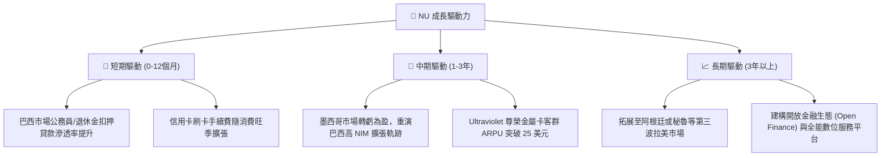

---

## 9. 風險矩陣

### 9.1 風險評分矩陣

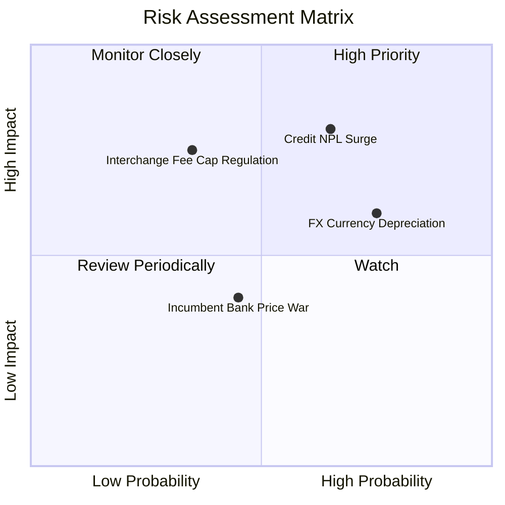

### 9.2 風險清單詳細分析

| # | 風險項目 | 發生機率 | 財務衝擊 | 風險評分 | 緩解措施與觀察指標 |
|---|----------|----------|----------|----------|--------------------|
| 1 | 🔴 **信用壞帳率 (NPL) 惡化** | 中高 (60%) | 高 (-15% 淨利) | 🔴 7.5/10 | 觀察 90天+ NPL 變化，公司擁有同業最高撥備覆蓋率 (>200%) |
| 2 | 🟡 **拉美貨幣 (BRL/MXN) 貶值** | 高 (70%) | 中 (-8% 營收折算) | 🟡 6.0/10 | 企業經營本幣具備天然對衝，不影響當地市場市佔率擴張 |
| 3 | 🔴 **交換費 (Interchange Fee) 上限監管** | 中低 (35%) | 高 (-12% 手續費) | 🔴 5.5/10 | 加速發展個人信貸與保險代理等非刷卡類營收來源 |
| 4 | 🟢 **傳統銀行競價與數位化反撲** | 中等 (45%) | 中 (-5% 成長) | 🟢 4.0/10 | 傳統銀行高營運成本障礙（門市網點）使其難以匹配 NU 費用優勢 |

---

## 10. 投資建議

### 10.1 最終綜合評級雷達圖

```
╔══════════════════════════════════════════════════════════════╗
║                   NU 綜合投資評級雷達圖                      ║
╠══════════════════════════════════════════════════════════════╣
║ 財務健康度  8.5 ▓▓▓▓▓▓▓▓▓▓▓▓▓▓▓▓▓░░░  🟢 卓越               ║
║ 獲利品質    9.2 ▓▓▓▓▓▓▓▓▓▓▓▓▓▓▓▓▓▓▓░  🟢 頂級               ║
║ 護城河深度  8.8 ▓▓▓▓▓▓▓▓▓▓▓▓▓▓▓▓▓▓░░  🟢 寬廣               ║
║ 成長催化劑  9.0 ▓▓▓▓▓▓▓▓▓▓▓▓▓▓▓▓▓▓▓░  🟢 強勁               ║
║ 估值吸引力  7.5 ▓▓▓▓▓▓▓▓▓▓▓▓▓▓░░░░░░  🟢 低估               ║
╠══════════════════════════════════════════════════════════════╣
║ 總結評級：🟢 買入 (BUY) ｜ 綜合分數：8.6 / 10                ║
╚══════════════════════════════════════════════════════════════╝
```

### 10.2 目標價與隱含報酬率

| 情境 | 機率權重 | 目標價 | 隱含潛在報酬率 | 投資決策對應 |
|------|----------|--------|----------------|--------------|
| 🟢 **樂觀情境** | 25% | **$23.50** | **+66.78%** | 突破 $18 後分批分獲利出場 |
| 🟡 **基準情境** | **55%** | **$18.00** | **+27.75%** | **主要目標，建倉核心持有** |
| 🔴 **悲觀情境** | 20% | **$11.50** | **-18.38%** | 跌破 $12 觸發風險再評估 |
| **加權預期值** | **100%** | **$18.08** | **+28.32%** | **風險回報比極佳 (3.6:1)** |

### 10.3 買入時機與觸發因素

```
╔══════════════════════════════════════════════════════════════════╗
║                  ✅ 買入觸發因素 Checklist                      ║
╠══════════════════════════════════════════════════════════════════╣
║                                                                  ║
║  立即建倉條件（當前已符合）：                                    ║
║  ✅ Forward P/E < 15x 且 PEG < 1.0 (當前 Forward P/E 12.19x/0.84x)║
║  ✅ ROE 連續兩季維持在 25% 以上 (當前 TTM 為 30.1%)               ║
║  ✅ 季度營收 YoY 成長 > 30% (當前 Q1 26 YoY +43.8%)              ║
║                                                                  ║
║  加碼買入觸發條件：                                              ║
║  ☐ 股價因拉美大盤宏觀賣壓回檔至 $12.50 - $13.50 區間              ║
║  ☐ 墨西哥市場宣佈實現單季度 GAAP 淨利潤轉正                      ║
║                                                                  ║
║  停損/減碼觸發條件：                                             ║
║  ☐ 90 天以上不良貸款率 (NPL 90+) 連續兩季突破 7.5%               ║
║  ☐ 巴西央行出台對 Interchange fee 的實質性壓低上限政策           ║
╚══════════════════════════════════════════════════════════════════╝
```

### 10.4 投資人適配度分析

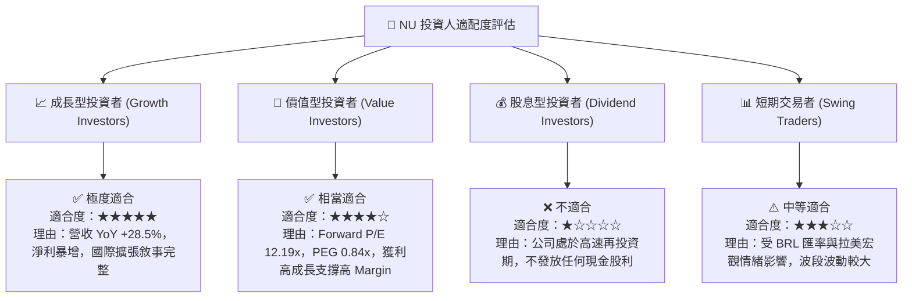

### 10.5 每季財報監控清單（Quarterly Watch List）

| 監控維度 | 核心指標 (Metric) | 基準目標值 (Base) | 警戒門檻 (Bear Warning) | 觸發應對動作 |
|----------|-------------------|-------------------|------------------------|--------------|
| **營運規模** | 活躍用戶總數 (Active Users) | > 1.05 億人 | < 9,500 萬人 | 評估獲客引擎上限 |
| **客群變現** | 每位活躍用戶月均營收 (ARPU) | > $11.0 美元 | < $9.0 美元 | 檢視交叉銷售進度 |
| **風控品質** | 90天以上壞帳率 (NPL 90+) | < 6.5% | > 7.5% | 減碼 25% 避險 |
| **獲利能力** | GAAP 年化 ROE | > 28.0% | < 20.0% | 重新估算目標價 |
| **國際市場** | 墨西哥淨新增用戶數 | > 60 萬人/季 | < 30 萬人/季 | 降低墨西哥營收假設 |

### 10.6 反面論證：什麼會證明論點錯誤（What Would Change My Mind）

```
╔══════════════════════════════════════════════════════════════════╗
║              ⚠️ 論點失效條件（Disconfirming Evidence）           ║
╠══════════════════════════════════════════════════════════════════╣
║  本投資論點在下列定量條件成立時應全面檢視，甚至清倉退出：        ║
║                                                                  ║
║  ☐ 條件1：ROE 跌破 18.0% 且無法於 2 個季度內反彈（資本效率下滑） ║
║  ☐ 條件2：墨西哥或哥倫比亞業務出現嚴重壞帳損失，導致當地資本金計提║
║            不足而需要母公司大規模二次注資。                      ║
║  ☐ 條件3：經營現金流轉負或 FCF 淨利轉換率連續兩季 < 50%。        ║
║  ☐ 條件4：ROIC 降至 10.8% 以下（摧毀價值區間）。                ║
║  ☐ 條件5：單客獲客成本 (CAC) 突破 $20 美元（病毒式引流失效）。   ║
╚══════════════════════════════════════════════════════════════════╝
```

---

> **免責聲明**：本報告由 AI 分析師根據市場公開即時財務數據（包括但不限於 Yahoo Finance, StockAnalysis, ROIC.ai）自動生成並進行專業推論，內容僅供學術研究與投資參考，不構成任何買賣金融產品的具體建議。投資有風險，入市需謹慎，請投資人自行承擔投資風險。