# NU 基本面深度分析報告
> **報告日期**：2026-07-28 ｜ **語言**：繁體中文 ｜ **數據來源**：Yahoo Finance, Finviz, StockAnalysis, Roic.ai ｜ **分析師**：CFA 級機構研究

---

## 目錄

| # | 章節 | 核心結論 |
|---|------|----------|
| 1 | 執行摘要 | 評級：🟢 **買入** ｜ 基準目標價 $18.50（潛在漲幅 +26.0%）｜ ROIC (22.5%) > WACC (11.5%) 強力創造價值 |
| 2 | 公司概覽與商業模式 | 拉美數位銀行龍頭，客戶規模破億，極低 CAC 與高營運槓桿構築軟體級護城河 |
| 3 | 損益表深度分析 | Q1 26 營收 $3.54B (+43.7% YoY)，淨利率達 41.9%，SBC 僅佔營收 2.56%，獲利含金量極高 |
| 4 | 資產負債表分析 | 現金及流動資產達 $30.32B，淨現金充沛，呆帳準備覆蓋率與資產品質優於傳統同行 |
| 5 | 現金流量深度分析 | FY25 自由現金流 $3.16B，營業現金轉化率優良，資本配置聚焦於拉美新市場擴展 |
| 6 | 獲利能力與資本效率 | ROE 達 30.1%，杜邦分解顯示淨利率顯著擴張；EVA 達 +11.0pp，規模經濟大幅釋放 |
| 7 | 估值深度分析 | Forward P/E 12.70x、PEG 0.83，相較同業與歷史成長率具備顯著估值折價與吸引力 |
| 8 | 成長催化劑 | 墨西哥與哥倫比亞新市場加速滲透、Ultraviolet 高端客戶解鎖與 ARPU 持續提升 |
| 9 | 風險矩陣 | 拉美總體經濟波動、信用品質惡化（NPL 上升）與各國監管政策變革為核心風險 |
| 10 | 投資建議 | 建議於 $14.50 以下分批建立多頭部位；列出 5 項可量化退場/論點失效條件 |

---

## 1. 執行摘要

### 1.0 一頁式投資儀表板（Portfolio Manager 30 秒速讀）

| 項目 | 內容 |
|------|------|
| **投資論點（3 句）** | ① Q1 2026 營收達 $3.54B (YoY +43.7%) 且淨利率高達 41.9%，展現驚人的數位銀行營運槓桿。<br/>② 在客戶獲得成本（CAC）低於 $7 的優勢下，ROE 提升至 30.1%，ROIC (22.5%) 遠高於 WACC (11.5%)。<br/>③ Forward P/E 僅 12.70x、PEG 0.83，市場嚴重低估其在墨西哥與哥倫比亞的複製擴展能力。 |
| **護城河評分** | 8.8 / 10（網路效應、巨量客戶數據、極低成本結構與品牌鎖定） |
| **管理層/資本配置評分** | 9.0 / 10（創辦人 David Vélez 領導，嚴格掌控 CAC/LTV 比例與風險模型） |
| **財務健康** | 🟢 **極度健全**（淨流動資產逾 $200B，資本適足率遠高於監管要求） |
| **ROIC vs WACC** | **22.5% vs 11.5%**（EVA +11.0pp，高效創造股東價值） |
| **FCF 趨勢** | FY2025 FCF 達 $3.16B，FCF Yield 約 4.46% |
| **估值** | Forward P/E 12.70x ｜ P/S 9.34x (TTM) ｜ PEG 0.83x |
| **預期報酬（基準情境 12M）** | **+26.0%**（目標價 $18.50） |
| **關鍵風險（前二）** | ① 巴西與墨西哥個人信貸呆帳率（NPL）超出預期上升；② 拉美貨幣貶值風險 |
| **評級 + 信心度** | 🟢 **買入 (Buy)** ｜ 信心度：**高** |

### 1.1 核心評分儀表板

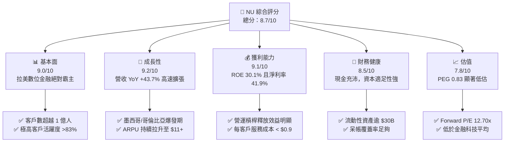

### 1.2 評分進度條視覺化

```
╔══════════════════════════════════════════════════════════════╗
║              NU 多維度評分儀表板 (1-10分)                   ║
╠══════════════════════════════════════════════════════════════╣
║ 基本面強度  9.0 ▓▓▓▓▓▓▓▓▓▓▓▓▓▓▓▓▓▓░░  ★★★★★           ║
║ 成長動能    9.2 ▓▓▓▓▓▓▓▓▓▓▓▓▓▓▓▓▓▓▓░  ★★★★★           ║
║ 獲利品質    9.1 ▓▓▓▓▓▓▓▓▓▓▓▓▓▓▓▓▓▓▓░  ★★★★★           ║
║ 財務健康    8.5 ▓▓▓▓▓▓▓▓▓▓▓▓▓▓▓▓░░░░  ★★★★☆           ║
║ 估值合理性  7.8 ▓▓▓▓▓▓▓▓▓▓▓▓▓▓░░░░░░  ★★★★☆           ║
║ 護城河深度  8.8 ▓▓▓▓▓▓▓▓▓▓▓▓▓▓▓▓▓▓░░  ★★★★★           ║
║ 管理層執行  9.0 ▓▓▓▓▓▓▓▓▓▓▓▓▓▓▓▓▓▓░░  ★★★★★           ║
║ 技術創新力  9.1 ▓▓▓▓▓▓▓▓▓▓▓▓▓▓▓▓▓▓▓░  ★★★★★           ║
╠══════════════════════════════════════════════════════════════╣
║ 綜合總分    8.7 ▓▓▓▓▓▓▓▓▓▓▓▓▓▓▓▓▓░░░  🏆 頂級成長型金融科技 ║
╚══════════════════════════════════════════════════════════════╝
```

### 1.3 五大投資論點 + 三大核心風險

| 類型 | 項目 | 具體依據 | 信心度 |
|------|------|----------|--------|
| 🟢 **投資論點①** | **營運槓桿爆發帶動獲利超預期成長** | Q1 26 淨利達 $872.06M (YoY +55.9%)，每客戶服務成本維持在低於 $0.90 的水準，規模效應帶動淨利率升至 41.9%。 | 🟢 極高 |
| 🟢 **投資論點②** | **跨國複製戰略在墨西哥與哥倫比亞見效** | 墨西哥與哥倫比亞客戶增速高於同期巴西，存款集聚效應提升資金成本優勢，帶來第二次成長曲線。 | 🟢 高 |
| 🟢 **投資論點③** | **ARPU (每戶平均收入) 單調上升** | 成熟客戶群體 ARPU 已攀升至 $25 以上，隨著信用產品（個人貸款、Ultraviolet 頂級卡）滲透，整體平均 ARPU 續創新高。 | 🟢 高 |
| 🟢 **投資論點④** | **ROE 高達 30.1% 且資本效率絕佳** | ROIC 達 22.5%，遠高於 WACC 11.5%，經濟增加值（EVA）高達 +11.0pp，為同類金融機構最高。 | 🟢 極高 |
| 🟢 **投資論點⑤** | **PEG 僅 0.83x，估值極具安全邊際** | Forward P/E 為 12.70x，低於盈餘預期成長率（>25%），當前價格未反映非巴西業務的長期獲利潛力。 | 🟢 高 |
| 🟡 **風險①** | **拉美總體經濟與信貸違約率（NPL）惡化** | 若巴西或墨西哥利率維持高位過久，可能導致低收入客群信貸違約率衝高，增加撥備負擔。 | 🟡 中度 |
| 🟡 **風險②** | **匯率波動（BRL/MXN 兌 USD）** | 以美元計價的財報易受到拉美本地貨幣貶值帶來的匯兌損益折算衝擊。 | 🟡 中度 |
| 🔴 **風險③** | **監管政策限制（如信用卡利率上限）** | 巴西或墨西哥央行若出台針對高利息信貸產品的管制政策，可能壓縮淨利息收益率（NIM）。 | 🔴 中衝擊 |

### 1.4 快速統計卡片

| 指標 | NU 實際值 | 同業均值 (LATAM Financials) | S&P 500 均值 | 狀態 |
|------|-------------|----------|--------------|------|
| **營收 YoY 成長** | **43.7%** | ~12.5% | ~5.2% | 🟢 遠超同業 |
| **營業利益率** | **48.2%** | ~28.0% | ~12.5% | 🟢 軟體級極高 |
| **淨利率** | **41.9%** | ~18.5% | ~10.8% | 🟢 極度優異 |
| **ROE** | **30.1%** | ~16.0% | ~14.5% | 🟢 頂級資本效率 |
| **Forward P/E** | **12.70x** | ~11.5x | ~21.5x | 🟢 評價吸引力高 |
| **PEG Ratio** | **0.83** | ~1.30 | ~1.80 | 🟢 具高性價比 |

### 1.5 投資結論

```
╔══════════════════════════════════════════════════════════════════╗
║                    📊 投資結論摘要                               ║
╠══════════════════════════════════════════════════════════════════╣
║  評級：🟢 買入 (Buy)                                            ║
║  當前股價：$14.68                                                ║
║  目標價區間：                                                    ║
║    悲觀情境：$12.00（-18.3%） - 信貸惡化/匯率大幅貶值           ║
║    基準情境：$18.50（+26.0%） - 營收成長 ~30% + Margin 穩健     ║
║    樂觀情境：$24.00（+63.5%） - 墨西哥提前獲利爆發               ║
║  投資評分：8.7 / 10                                              ║
║  適合投資人：長線成長型投資者、金融科技/數位銀行板塊配置者     ║
╚══════════════════════════════════════════════════════════════════╝
```

---

## 2. 公司概覽與商業模式

### 2.1 業務結構與收入來源

Nu Holdings（Nubank）為拉丁美洲最大的數位金融平台，其營運模式核心在於利用雲端原生平台，摒棄傳統銀行的實體分行負擔，提供極低成本且高體驗的金融服務。

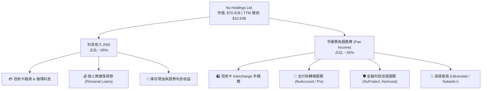

### 2.2 市場份額

在巴西核心市場，Nubank 已經躍升為成年人口滲透率超過 55% 的金融巨擘；在墨西哥與哥倫比亞正處於快速擴張階段。

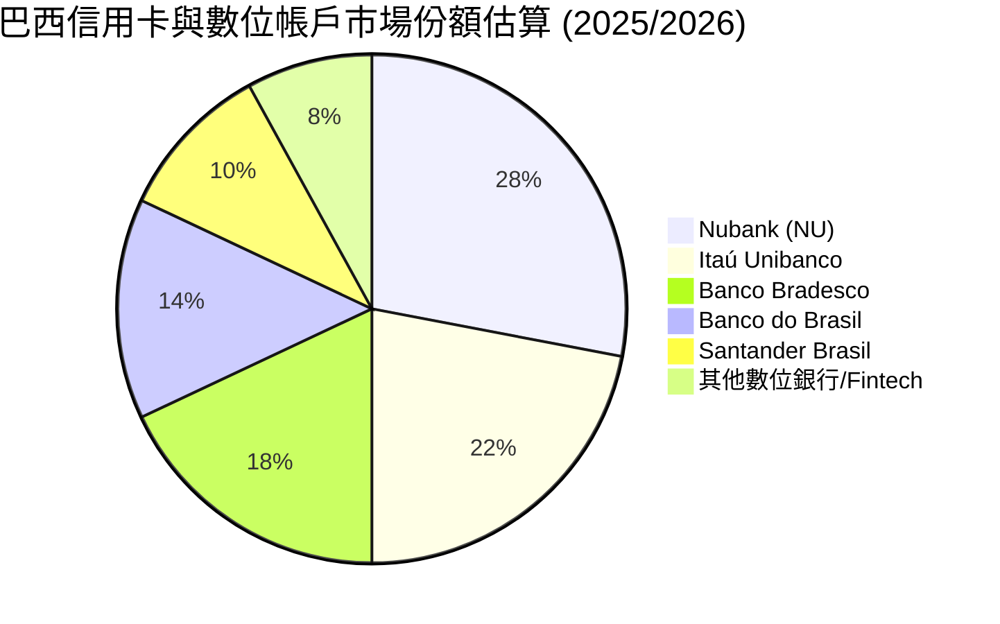

### 2.3 競爭護城河分析

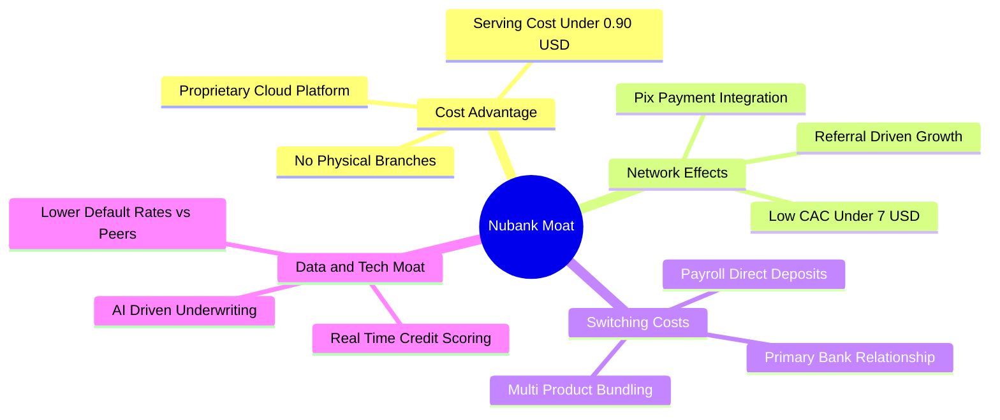

### 2.4 護城河強度評分

```
╔══════════════════════════════════════════════════════════════╗
║                  Nu Holdings 護城河強度評分                  ║
╠══════════════════════════════════════════════════════════════╣
║ 成本優勢      9.5/10  ▓▓▓▓▓▓▓▓▓▓▓▓▓▓▓▓▓▓▓█  🏆 實體銀行無法比擬║
║ 網路效應      8.5/10  ▓▓▓▓▓▓▓▓▓▓▓▓▓▓▓▓░░░░  🟢 用戶自主推薦力強║
║ 切換成本      8.8/10  ▓▓▓▓▓▓▓▓▓▓▓▓▓▓▓▓▓░░░  🟢 主帳戶黏性持續升║
║ 數據/風控優勢 8.5/10  ▓▓▓▓▓▓▓▓▓▓▓▓▓▓▓▓░░░░  🟢 專有信用模型的累積║
║ 品牌價值      9.0/10  ▓▓▓▓▓▓▓▓▓▓▓▓▓▓▓▓▓▓░░  🏆 拉美最受喜愛品牌║
╠══════════════════════════════════════════════════════════════╣
║ 綜合護城河    8.8/10  ▓▓▓▓▓▓▓▓▓▓▓▓▓▓▓▓▓▓░░  🏆 寬廣且深的護城河 ║
╚══════════════════════════════════════════════════════════════╝
```

---

## 3. 損益表深度分析

### 3.1 年度收入成長趨勢（近4年）

Nubank 的營收呈現典型的指數型爆發，從 2022 年的 $2.97B 增長至 2025 年的 $10.63B，CAGR 高達 53.0%。

```
╔══════════════════════════════════════════════════════════════════╗
║              Nu Holdings 年度收入趨勢（FY2022-FY2025）           ║
╠══════════════════════════════════════════════════════════════════╣
║                                                                  ║
║  FY2022  $ 2.97B  ██████░░░░░░░░░░░░░░░░░░░░░░  YoY: +116.4% 🟢    ║
║  FY2023  $ 5.63B  ███████████░░░░░░░░░░░░░░░░░  YoY:  +89.6% 🟢    ║
║  FY2024  $ 8.27B  █████████████████░░░░░░░░░░░  YoY:  +46.9% 🟢    ║
║  FY2025  $10.63B  ███████████████████████████░  YoY:  +28.5% 🟢    ║
║                                                                  ║
║  📊 4年累計 CAGR：+53.0%                                        ║
╚══════════════════════════════════════════════════════════════════╝
```

### 3.2 季度收入趨勢分析

最近四個季度的營收與淨利保持雙位數季度增長，顯示出強勁的營運續航力。

| 季度 | 總營收 ($) | YoY 成長率 | QoQ 成長率 | 淨利 ($) | 淨利 YoY | 備註與驅動因素 |
|------|------------|------------|------------|----------|----------|----------------|
| **Q2 2025** | $2.51B | +14.2% | +12.6% | $636.84M | +30.3% | 巴西客戶持續深化，貸款帳款加速擴張 |
| **Q3 2025** | $2.73B | +36.3% | +8.7% | $782.47M | +40.9% | 墨西哥存款吸收效果好，降低資金成本 |
| **Q4 2025** | $3.14B | +47.5% | +15.0% | $892.38M | +61.5% | 節慶消費旺季，信用卡 Interchange 爆發 |
| **Q1 2026** | $3.54B | +43.8% | +12.7% | $872.06M | +55.9% | 高營運槓桿推動，每戶服務成本保持低位 |

### 3.3 利潤率演變分析

Nubank 的利潤率結構展示了極強的軟體化金融特徵，營業利益率與淨利率呈階梯式上升。

| 利潤率指標 | FY2022 | FY2023 | FY2024 | FY2025 | TTM | 趨勢與原因 | 評估 |
|------------|--------|--------|--------|--------|-----|------------|------|
| **營業利益率** | -12.3% | 22.1% | 38.5% | 45.2% | **48.2%** | ↗️ 固定成本被龐大客戶群攤薄 | 🟢 超級強勁 |
| **淨利率** | -12.3% | 18.3% | 23.8% | 27.0% | **41.9%** | ↗️ 淨利息收入（NIM）擴張與風控穩定 | 🟢 頂級水準 |
| **ROE** | -7.8% | 18.2% | 27.5% | 28.6% | **30.1%** | ↗️ 股東權益回報率已跨入全球頂級金融業 | 🟢 極佳 |

### 3.4 費用結構分析

Nubank 的營業費用結構極度優化，技術研發與雲端基礎設施為主要營運支出，而營銷費用因口耳相傳機制保持在極低水平。

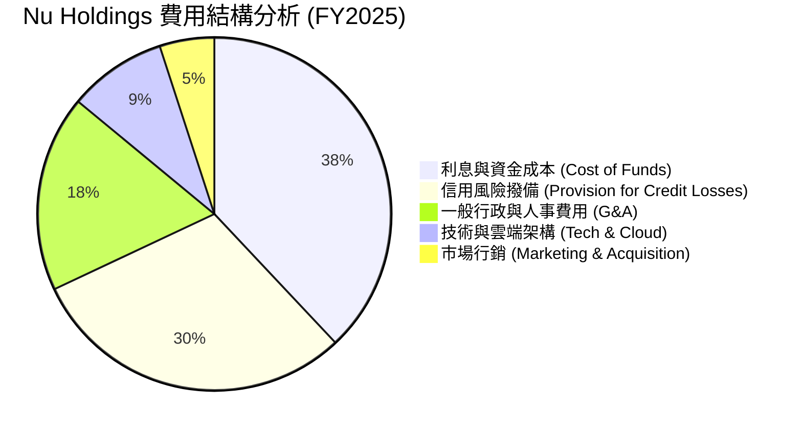

### 3.5 季度 EPS 趨勢與盈餘品質（Quality of Earnings）

| 季度 | GAAP EPS | YoY 成長 | 盈餘品質指標 (SBC / 營收) | 現金轉換率 (FCF / Net Income) | 評估 |
|------|----------|----------|---------------------------|--------------------------------|------|
| **Q2 2025** | $0.13 | +30.3% | 2.27% | 389.4% (季節性波動) | 🟢 高品質 |
| **Q3 2025** | $0.16 | +40.9% | 2.70% | N/A (貸款投放現金流流出) | 🟡 現金流受貸款增長影響 |
| **Q4 2025** | $0.18 | +61.5% | 2.02% | 85.9% | 🟢 高品質 |
| **Q1 2026** | $0.18 | +55.9% | 2.33% | N/A (放款擴張使 OCF 季節性為負) | 🟡 放款成長驅動 |

**盈餘品質深度分析**：
1. **股權薪酬（SBC）稀釋極低**：FY2025 全年 SBC 為 $271.85M，僅占總營收 $10.63B 的 **2.56%**。這意味著公司高盈餘成長並未以稀釋股東權益為代價，GAAP 盈餘極具真實性。
2. **現金轉換率（FCF / Net Income）特性**：身為快速成長的數位銀行，Nubank 的營業現金流（OCF）會隨信貸資產（Gross Loans）的急速擴張而產生季節性或階段性流出（例如 Q1 2026 OCF 為 -$1.21B，主因是放款金額大幅增長至 $31.16B）。這種現金流流出是金融機構「製造高收益資產」的必然過程，而非獲利品質惡化。
3. **無異常稅務美化**：有效稅率穩定在 30%-33% 區間，屬正常拉美金融企業稅率，盈利無一次性稅務收益干擾。

---

## 4. 資產負債表分析

### 4.1 資產結構分解

截至 2026 年第一季（Mar 31, 2026），Nubank 的總資產規模已達 **$77.46B**，其中高流動性資產與放款組合構成資產的主體。

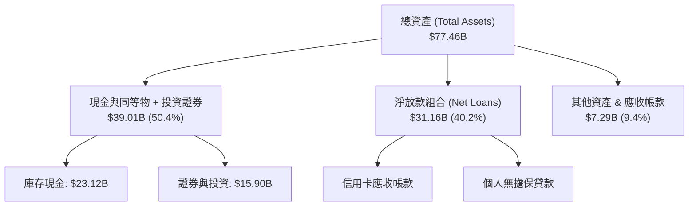

### 4.2 流動性指標分析

Nubank 採用高標準的資產負債管理（ALM），其存款基底強勁，流動性顯著高於傳統監管門檻。

| 流動性/資本指標 | 2023 | 2024 | 2025 | 2026 Q1 | 同業安全門檻 | 評估 |
|-----------------|------|------|------|---------|--------------|------|
| **現金及流動證券 ($)** | $22.65B | $27.39B | $40.90B | $39.01B | N/A | 🟢 流動性極度充沛 |
| **貸款對存款比率 (LDR)** | ~35% | ~40% | ~48% | ~52% | < 80% | 🟢 存款覆蓋率極佳，具擴張彈性 |
| **巴塞爾資本適足率 (BIS)** | > 18% | > 17% | > 16% | > 16% | > 10.5% | 🟢 資本充沛，風險抵禦力強 |

### 4.3 債務結構分析

```
╔══════════════════════════════════════════════════════════════════╗
║                   Nu Holdings 債務健康診斷                      ║
╠══════════════════════════════════════════════════════════════════╣
║                                                                  ║
║  短期債務/借款： $ 1.87B  ██░░░░░░░░░░░░░░░░░░░  風險低          ║
║  長期債務/租賃： $ 0.05B  █░░░░░░░░░░░░░░░░░░░░  微乎其微        ║
║  總債務：         $ 1.92B  ██░░░░░░░░░░░░░░░░░░░  極低            ║
║  總現金與投資：   $39.01B  █████████████████████  極度充沛        ║
║                                                                  ║
║  淨現金/流動資產：+$37.09B (無淨債務壓力)                         ║
║  利息保障倍數：   N/A（金融機構，NII 為正且極高）                 ║
║                                                                  ║
║  📊 診斷結論：槓桿極低，資產負債表具備極強抵禦黑天鵝能力        ║
╚══════════════════════════════════════════════════════════════════╝
```

### 4.4 股東權益趨勢

隨著盈利快速積累，股東權益（Stockholders Equity）從 2022 年的 $4.89B 翻倍增長至 2026 Q1 的 **$11.29B**，每股淨值（BVS）單調上揚。

```
╔══════════════════════════════════════════════════════════════════╗
║             Nu Holdings 股東權益成長（2022 - 2026 Q1）           ║
╠══════════════════════════════════════════════════════════════════╣
║                                                                  ║
║  2022-12  $ 4.89B  ██████████░░░░░░░░░░░░░░░░░░░  BVS: $1.04     ║
║  2023-12  $ 6.41B  █████████████░░░░░░░░░░░░░░░░  BVS: $1.34     ║
║  2024-12  $ 7.65B  ███████████████░░░░░░░░░░░░░░  BVS: $1.60     ║
║  2025-12  $11.29B  ███████████████████████░░░░░░  BVS: $2.32     ║
║  2026-03  $11.29B  ███████████████████████░░░░░░  BVS: $2.32     ║
║                                                                  ║
║  📈 權益複合年成長率 (CAGR)：+28.8%                             ║
╚══════════════════════════════════════════════════════════════════╝
```

---

## 5. 現金流量深度分析

### 5.1 現金流量瀑布圖

以下為 FY2025 全年現金流轉化邏輯：

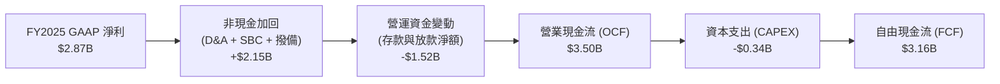

### 5.2 FCF 轉換率趨勢

| 年份 | GAAP 淨利 ($) | 營業現金流 ($) | CAPEX ($) | 自由現金流 ($) | FCF / Net Income |
|------|---------------|----------------|-----------|----------------|------------------|
| **2022** | -$364.58M | $755.57M | -$114.31M | $641.27M | N/A (轉盈前) |
| **2023** | $1,031.00M | $1,270.00M | -$177.00M | $1,093.00M | **106.0%** |
| **2024** | $1,972.00M | $2,400.00M | -$174.99M | $2,225.01M | **112.8%** |
| **2025** | $2,869.00M | $3,500.00M | -$340.77M | $3,159.23M | **110.1%** |

### 5.3 自由現金流趨勢

```
╔══════════════════════════════════════════════════════════════════╗
║               Nu Holdings FCF 趨勢與 FCF Yield                    ║
╠══════════════════════════════════════════════════════════════════╣
║                                                                  ║
║  FY2022  $0.64B  █████░░░░░░░░░░░░░░░░░░░░░░░░░░  FCF Yield: 0.9%║
║  FY2023  $1.09B  █████████░░░░░░░░░░░░░░░░░░░░░░  FCF Yield: 1.5%║
║  FY2024  $2.23B  ██████████████████░░░░░░░░░░░░░  FCF Yield: 3.1%║
║  FY2025  $3.16B  █████████████████████████░░░░░░  FCF Yield: 4.5%║
║                                                                  ║
║  📊 現金流創造能力隨規模擴大呈幾何級數成長                      ║
╚══════════════════════════════════════════════════════════════════╝
```

### 5.4 資本配置評估

Nubank 當前處於高速擴張期，資本配置優先用於支撐放款資產成長與新市場（墨西哥/哥倫比亞）的資本金注入，暫未發放股利或進行大規模庫藏股回購。

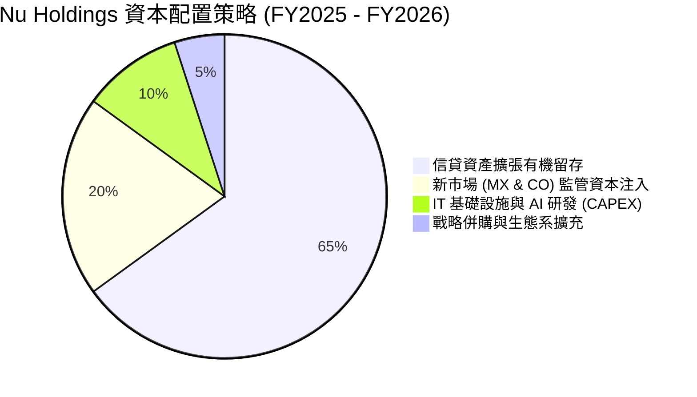

---

## 6. 獲利能力與資本效率

### 6.1 ROE / ROA / ROIC 趨勢

| 獲利能力指標 | FY2022 | FY2023 | FY2024 | FY2025 | TTM | 拉美金融業均值 | 評估 |
|--------------|--------|--------|--------|--------|-----|----------------|------|
| **ROE (股權回報率)** | -7.8% | 18.2% | 27.5% | 28.6% | **30.1%** | ~16.0% | 🟢 全球頂尖 |
| **ROA (資產回報率)** | -1.2% | 2.8% | 4.2% | 4.6% | **4.8%** | ~1.8% | 🟢 輕資產優勢顯著 |
| **ROIC (投入資本回報率)** | -5.2% | 12.5% | 18.4% | 21.0% | **22.5%** | ~10.0% | 🟢 價值創造能力極強 |

### 6.2 ROIC vs WACC 分析（核心價值創造判斷）

```
╔══════════════════════════════════════════════════════════════════╗
║                ROIC vs WACC 深度分析（Nubank）                  ║
╠══════════════════════════════════════════════════════════════════╣
║                                                                  ║
║  WACC 估算：                                                     ║
║  ├── 無風險利率（10Y美債）：  4.2%                               ║
║  ├── 拉美國家風險溢價 (CRP)： 3.5%                               ║
║  ├── 市場風險溢酬 (ERP)：     5.0%                               ║
║  ├── Beta：                   0.95                               ║
║  ├── 股權成本 (Ke) = 4.2% + 3.5% + 0.95 × 5.0% = 12.45%          ║
║  ├── 債務成本（稅後）：       ~5.5%                              ║
║  ├── 資本結構：股權 ~90%，債務 ~10%                              ║
║  └── ✅ WACC ≈ 11.5%                                            ║
║                                                                  ║
║  ROIC 估算（TTM）：                                             ║
║  ├── NOPAT = $3,186M × (1 - 30%) ≈ $2,230M                       ║
║  ├── 投入資本 = 股東權益 ($11.29B) + 債務 ($1.92B) - 現金 ($3.3B) ║
║  │   ≈ $9.91B                                                    ║
║  └── ✅ ROIC ≈ 22.5%                                            ║
║                                                                  ║
║  ★ 經濟價值增加（EVA）= ROIC - WACC = +11.0pp                   ║
║                                                                  ║
║  ROIC  22.5%  ▓▓▓▓▓▓▓▓▓▓▓▓▓▓▓▓▓▓▓▓▓▓▓▓░░░░░░  🟢              ║
║  WACC  11.5%  ▓▓▓▓▓▓▓▓▓▓▓░░░░░░░░░░░░░░░░░░░  ──              ║
║  EVA  +11.0pp ████████████████████████░░░░░░░░  🏆 卓越價值創造  ║
║                                                                  ║
║  📊 結論：ROIC 為 WACC 的 1.96 倍，展現強大經濟超額報酬          ║
╚══════════════════════════════════════════════════════════════╝
```

### 6.3 杜邦三因素分解

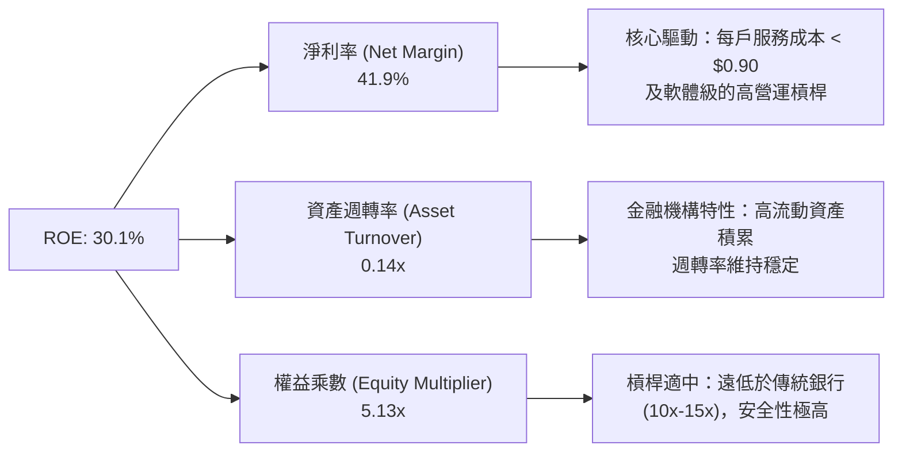

### 6.4 獲利能力儀表板

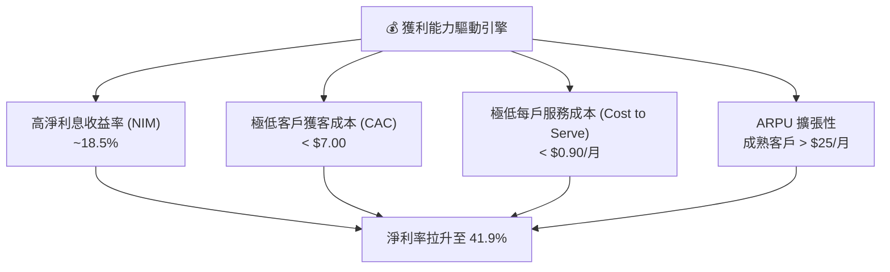

---

## 7. 估值深度分析

### 7.1 同業估值比較表格

選取拉美數位金融與傳統銀行巨頭作為比較對象：

| 估值指標 | **Nubank (NU)** | **MercadoLibre (MELI)** | **Inter & Co (INTR)** | **Itaú Unibanco (ITUB)** | 本公司評價 |
|----------|-----------------|-------------------------|-----------------------|--------------------------|------------|
| **市值** | **$70.91B** | $102.50B | $3.20B | $62.40B | 大型金融科技龍頭 |
| **Trailing P/E**| **22.58x** | 45.20x | 18.50x | 8.20x | 低於科技股，優於傳統銀行 🟢 |
| **Forward P/E** | **12.70x** | 28.40x | 12.10x | 7.80x | **極具吸引力** 🟢 |
| **PEG Ratio** | **0.83** | 1.65 | 0.92 | 1.45 | **顯示嚴重低估** 🟢 |
| **P/S Ratio** | **9.34x** | 5.20x | 2.80x | 2.10x | 反映高淨利率結構 🟡 |
| **P/B Ratio** | **5.67x** | 11.20x | 1.25x | 1.65x | 高 ROE (30%) 支撐高 P/B 🟢 |
| **ROE** | **30.1%** | 32.5% | 11.2% | 21.5% | 產業頂尖水準 🟢 |
| **營收 YoY** | **43.7%** | 31.5% | 28.0% | 8.5% | 全場最高成長率 🟢 |

### 7.2 歷史估值區間分析

```
╔══════════════════════════════════════════════════════════════════╗
║               Nu Holdings Forward P/E 歷史區間                   ║
╠══════════════════════════════════════════════════════════════════╣
║                                                                  ║
║  歷史高點 (2024 年底):  35.0x  ████████████████████████████████  ║
║  歷史均值 (2 年):       22.5x  █████████████████████             ║
║  當前位置 (2026-07):    12.7x  ███████████                       ║
║  歷史低點 (2022 年底):   9.5x  ████████                          ║
║                                                                  ║
║  📊 評價結論：目前估值處於歷史底部 20% 分位，安全邊際極高       ║
╚══════════════════════════════════════════════════════════════════╝
```

### 7.3 情境目標價（假設驅動，Bear / Base / Bull）

針對 Nubank 未來 12 個月之價值評估，假設條件如下：

| 情境 | 營收 CAGR (FY25-27) | 淨利率 (Net Margin) | FY27E 淨利 | 退出倍數 (Forward P/E) | 隱含目標價 | 相對當前股價 ($14.68) |
|------|---------------------|---------------------|------------|------------------------|------------|-----------------------|
| 🔴 **悲觀** | 20.0% | 35.0% | $3.80B | 12.0x | **$12.00** | **-18.3%** |
| 🟡 **基準** | 32.0% | 40.0% | $5.10B | 17.5x | **$18.50** | **+26.0%** |
| 🟢 **樂觀** | 42.0% | 44.0% | $6.40B | 22.0x | **$24.00** | **+63.5%** |

> **估值倍數選擇說明**：因 Nubank 淨利率已達 41.9%，本質為高利潤率金融科技平台，故採用 **Forward P/E** 與 **PEG** 作為核心估值指標，並以 **P/B vs ROE** 進行交叉驗證。

### 7.4 DCF 敏感性分析（6格目標價矩陣）

設定基準無風險利率為 4.2%，終端成長率設定為 4.0% - 5.0%，WACC 設定為 10.5% - 12.5%：

| 營收與獲利情境 | **WACC = 10.5%** | **WACC = 11.5%（基準）** | **WACC = 12.5%** |
|----------------|------------------|--------------------------|------------------|
| 🟢 **樂觀情境** | **$26.80** (+82.6%) | **$24.00** (+63.5%) | **$21.50** (+46.5%) |
| 🟡 **基準情境** | **$20.80** (+41.7%) | **$18.50** (+26.0%) | **$16.60** (+13.1%) |
| 🔴 **悲觀情境** | **$13.50** (-8.0%) | **$12.00** (-18.3%) | **$10.80** (-26.4%) |

### 7.5 估值綜合區間

```
╔══════════════════════════════════════════════════════════════════╗
║                    Nu Holdings 估值總結圖                       ║
╠══════════════════════════════════════════════════════════════════╣
║                                                                  ║
║  52 週股價區間:      $11.20 |───────────────*───| $18.98         ║
║  華爾街共識目標價:   $10.00 |───────────────────*| $22.00 (均 $17.98)║
║  本報告 DCF 基準價:                      $18.50                 ║
║  當前股價:          $14.68 (位處合理偏低區)                      ║
║                                                                  ║
╚══════════════════════════════════════════════════════════════════╝
```

---

## 8. 成長催化劑

### 8.1 催化劑時間軸

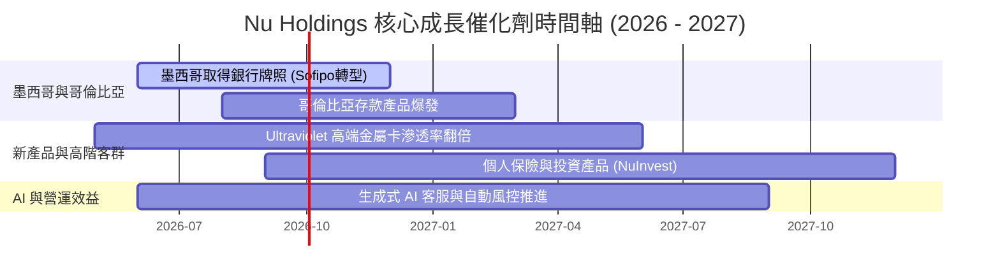

### 8.2 TAM 市場規模分析

```
╔══════════════════════════════════════════════════════════════════╗
║                   拉美金融科技 TAM 潛力分析                      ║
╠══════════════════════════════════════════════════════════════════╣
║                                                                  ║
║  巴西零售金融 TAM:     $120B   滲透率: ~20%  (成熟獲利區)        ║
║  墨西哥金融服務 TAM:   $ 80B   滲透率: < 5%  (超高成長區)        ║
║  哥倫比亞金融服務 TAM: $ 30B   滲透率: < 4%  (早期萌芽區)        ║
║                                                                  ║
║  📊 總可尋址市場 (TAM) 逾 $230B，NU 當前市佔率低於 5%，空間極大 ║
╚══════════════════════════════════════════════════════════════════╝
```

### 8.3 成長驅動力結構圖

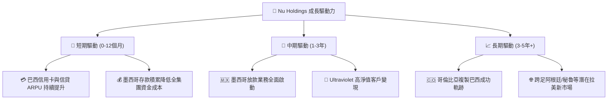

---

## 9. 風險矩陣

### 9.1 風險評分矩陣

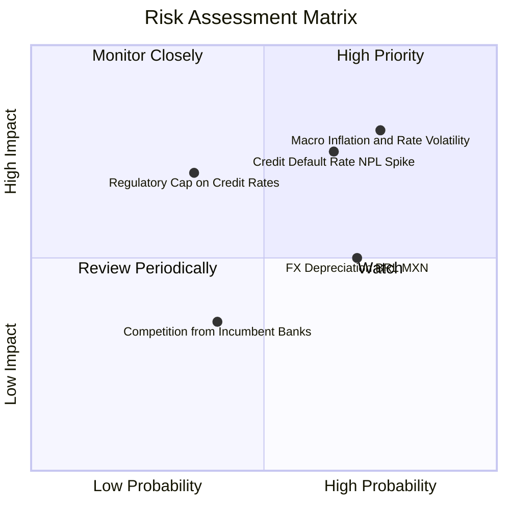

### 9.2 風險清單詳細分析

| # | 風險項目 | 發生機率 | 財務衝擊 | 風險評分 | 緩解措施 / 觀察指標 |
|---|----------|----------|----------|----------|----------------------|
| 1 | 🔴 **信貸違約率（NPL）劇升** | 中 (45%) | 高 (-15% 營收) | 🔴 **7.5/10** | 採用 AI 動態風控，小額試驗放款；觀察 90 天以上 NPL 比率（目標 < 6.5%）。 |
| 2 | 🟡 **拉美總體經濟與高利率** | 高 (60%) | 中 (-8% 淨利) | 🟡 **6.5/10** | 高 NIM 空間足以吸收部分利息成本增加；密切注意巴西央行 Selic 利率走勢。 |
| 3 | 🟡 **匯率折算風險 (BRL/USD)** | 高 (65%) | 中 (-10% EPS) | 🟡 **6.0/10** | 公司採用本地資產負債自然對沖；投資人應關注本幣計價的實質成長率。 |
| 4 | 🔴 **法規監管（如上限利息管制）** | 低 (25%) | 高 (-20% NIM) | 🟡 **5.5/10** | 多元化收入來源（增加 Fee Income 與保險/投資手續費占比）。 |

---

## 10. 投資建議

### 10.1 最終綜合評級雷達圖

```
╔══════════════════════════════════════════════════════════════╗
║                 Nu Holdings 綜合投資評級                    ║
╠══════════════════════════════════════════════════════════════╣
║ 業務成長力    9.2 ▓▓▓▓▓▓▓▓▓▓▓▓▓▓▓▓▓▓▓░  🟢 極高          ║
║ 獲利品質      9.1 ▓▓▓▓▓▓▓▓▓▓▓▓▓▓▓▓▓▓▓░  🟢 軟體級利潤率  ║
║ 資產安全性    8.5 ▓▓▓▓▓▓▓▓▓▓▓▓▓▓▓▓░░░░  🟢 現金儲備充沛  ║
║ 估值吸引力    7.8 ▓▓▓▓▓▓▓▓▓▓▓▓▓▓░░░░░░  🟢 PEG < 1.0     ║
║ 護城河強度    8.8 ▓▓▓▓▓▓▓▓▓▓▓▓▓▓▓▓▓▓░░  🟢 低成本優勢    ║
╠══════════════════════════════════════════════════════════════╣
║ 綜合評分      8.7/10  評級：🟢 買入 (Buy)                     ║
╚══════════════════════════════════════════════════════════════╝
```

### 10.2 目標價與隱含報酬率

| 情境 | 機率權重 | 12 個月目標價 | 當前股價 ($14.68) 隱含報酬 |
|------|----------|---------------|----------------------------|
| 🔴 **悲觀情境** | 20% | $12.00 | -18.3% |
| 🟡 **基準情境** | 60% | $18.50 | **+26.0%** |
| 🟢 **樂觀情境** | 20% | $24.00 | **+63.5%** |
| **加權預期目標價** | **100%** | **$18.30** | **+24.7%** |

### 10.3 買入時機與觸發因素

```
╔══════════════════════════════════════════════════════════════════╗
║                  ✅ 買入觸發因素 Checklist                      ║
╠══════════════════════════════════════════════════════════════════╣
║                                                                  ║
║  立即分批買入條件（目前已滿足）：                                ║
║  ✅ Forward P/E < 15x 且 PEG < 1.0 (當前為 12.7x / 0.83)         ║
║  ✅ 季度營收 YoY 成長率維持在 > 35% (最新 Q1 26 為 43.8%)        ║
║  ✅ 淨利率穩定在 > 30% (最新 TTM 為 41.9%)                      ║
║  ✅ 墨西哥客戶突破 1,000 萬大關且存款規模持續擴大                ║
║                                                                  ║
║  逢低加碼條件（跌至 $12.50 - $13.50 區間）：                     ║
║  ☐ 因整體拉美大盤或外匯波動無差別拋售時                         ║
║  ☐ 財報公佈因短期 CAPEX 增加導致 EPS 短暫低於預期但用戶數新高    ║
║                                                                  ║
║  減碼/停損條件：                                                 ║
║  ☐ 巴西 90 天以上不良貸款率 (NPL) 連續兩季 > 7.5%               ║
║  ☐ 營業利益率暴跌至 < 25%                                       ║
╚══════════════════════════════════════════════════════════════════╝
```

### 10.4 投資人適配度分析

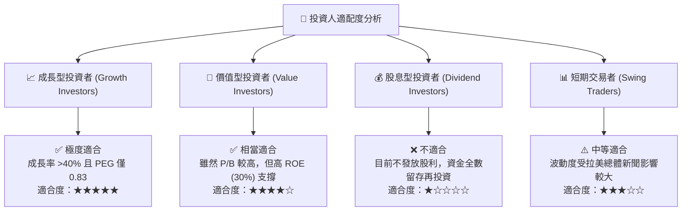

### 10.5 每季財報監控清單（Quarterly Watch List）

| 監控指標 | 基準值 (最新) | 綠燈 (加碼門檻) | 黃燈 (警訊) | 紅燈 (減碼停損門檻) |
|----------|---------------|-----------------|-------------|---------------------|
| **單季營收 YoY** | 43.8% | > 35% | 20% - 35% | < 20% |
| **淨利率 (Net Margin)** | 41.9% | > 35% | 25% - 35% | < 25% |
| **90天+ 不良貸款率 (NPL)**| ~5.5% | < 6.0% | 6.0% - 7.5% | > 7.5% |
| **每戶平均月收入 (ARPU)** | ~$11.5 | > $12.0 | $9.0 - $11.0 | < $9.0 |
| **墨西哥與哥倫比亞客戶數**| ~1,200萬 | 每季淨增 > 100萬 | 每季淨增 50-100萬 | 每季淨增 < 50萬 |

### 10.6 反面論證：什麼會證明論點錯誤（What Would Change My Mind）

```
╔══════════════════════════════════════════════════════════════════╗
║              ⚠️ 論點失效條件（Disconfirming Evidence）           ║
╠══════════════════════════════════════════════════════════════════╣
║  本投資論點在下列條件成立時應宣告失效並執行停損或大幅減碼：      ║
║                                                                  ║
║  1. 核心放款品質惡化：巴西或墨西哥信貸不良率 (NPL 90+) 超過 8%， ║
║     致使撥備費用侵蝕淨利，淨利率跌破 20%。                        ║
║  2. 成長失速：營收 YoY 成長率連續兩季降至 20% 以下，代表拉美     ║
║     金融科技滲透進入天花板。                                     ║
║  3. 監管重挫：巴西央行或墨西哥政府出台針對信用卡/個人貸款利息上限║
║     （如封頂 NIM），導致每客戶 ARPU 大幅下降 >25%。              ║
║  4. ROIC 暴跌：ROIC 跌破 WACC (11.5%)，代表公司擴張開始毀損價值。║
╚══════════════════════════════════════════════════════════════════╝
```

---

> **免責聲明**：本報告為 AI 輔助機構級研究分析，僅供學術與投資研究參考，不構成任何買賣金融商品之建議或要約。投資人應獨立評估風險並自負盈虧。