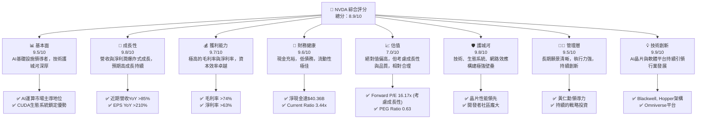
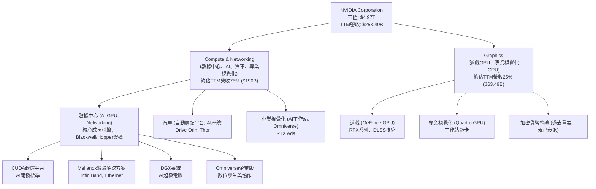
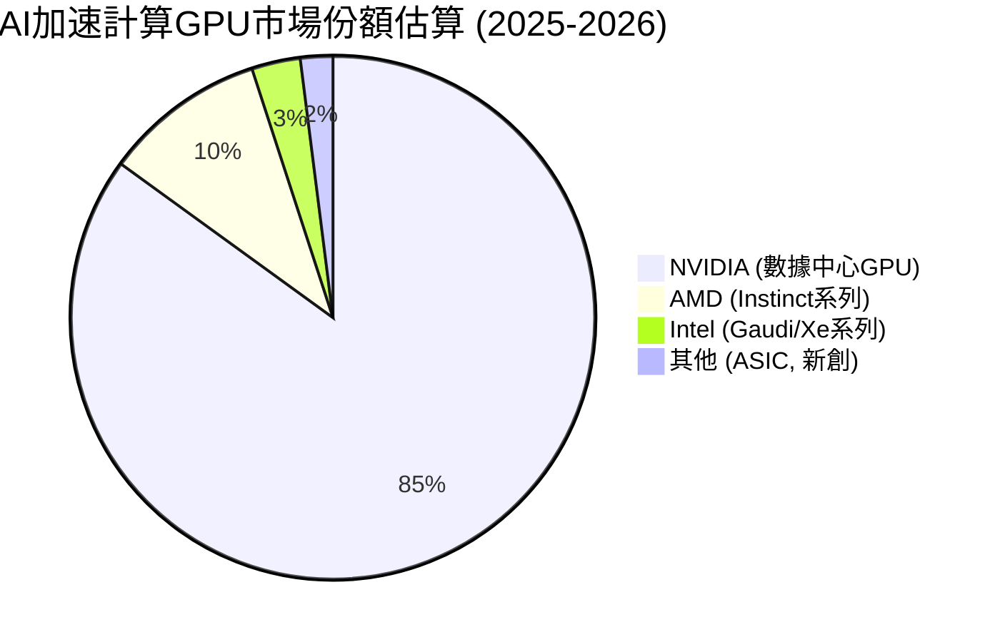
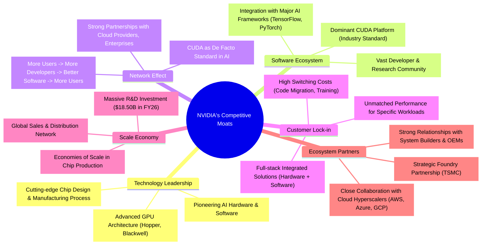
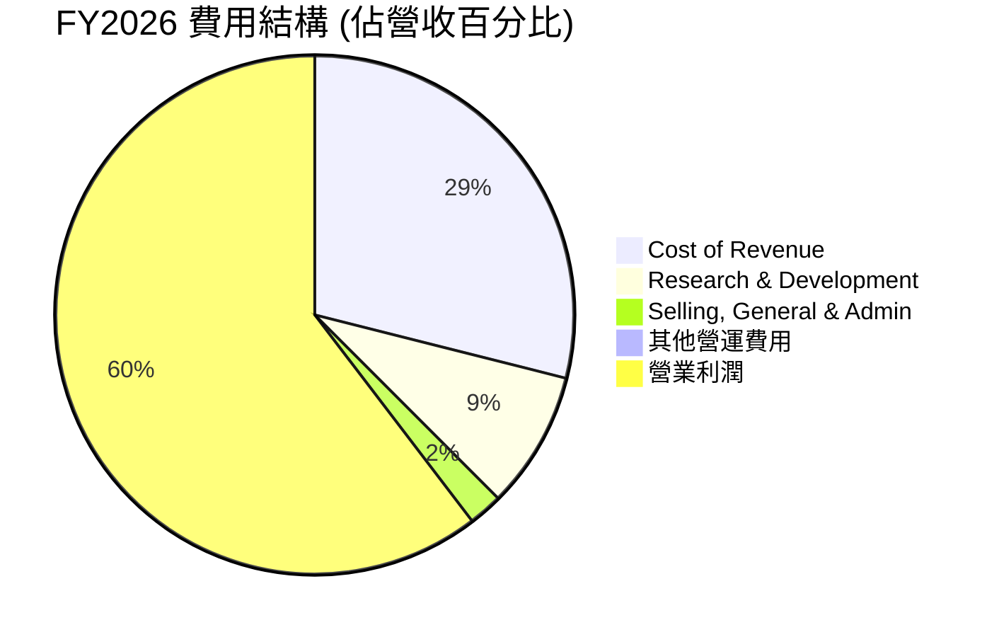
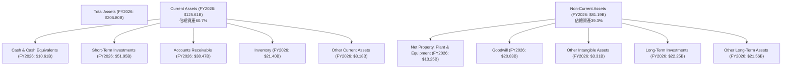

# NVDA 基本面深度分析報告
> **報告日期**：2026-06-06 ｜ **語言**：繁體中文 ｜ **數據來源**：Yahoo Finance, Finviz, StockAnalysis, Roic.ai ｜ **分析師**：CFA 級機構研究

## 目錄

| # | 章節 | 核心結論 |
|---|------|----------|
| 1 | 執行摘要 | 評級：🟢 強烈買入，目標價區間：$265 - $350 |
| 2 | 公司概覽與商業模式 | 憑藉技術、生態系統及規模效應建立極深護城河 |
| 3 | 損益表深度分析 | 營收與淨利潤呈爆炸性成長，毛利率維持高位 |
| 4 | 資產負債表分析 | 資產結構穩健，現金充裕，債務負擔極低 |
| 5 | 現金流量深度分析 | 自由現金流強勁，資本配置效率高，回報股東能力卓越 |
| 6 | 獲利能力與資本效率 | ROIC遠超WACC，強力創造股東價值 |
| 7 | 估值深度分析 | 相較於其成長性與獲利能力，當前估值具吸引力 |
| 8 | 成長催化劑 | AI基礎設施、軟體平台、新市場拓展為主要驅動 |
| 9 | 風險矩陣 | 競爭加劇與市場集中度為主要風險，但可控 |
| 10 | 投資建議 | 長期成長潛力巨大，適合成長型投資者長期持有 |

---

## 1. 執行摘要

NVIDIA (NVDA) 在人工智慧革命的浪潮中，已確立其作為數據中心規模AI基礎設施領導者的地位。憑藉其卓越的GPU技術、CUDA軟體生態系統以及強大的創新能力，NVDA展現出驚人的收入和利潤成長。儘管當前市值已高達$4.97兆，但其基本面依然極其強勁，護城河深厚，財務健康狀況優異，且在未來AI、元宇宙、自動駕駛等領域仍具備巨大的成長潛力。

### 1.1 核心評分儀表板



### 1.2 評分進度條視覺化

```
╔══════════════════════════════════════════════════════════════╗
║                NVDA 多維度評分儀表板 (1-10分)                ║
╠══════════════════════════════════════════════════════════════╣
║ 基本面強度  9.5 ▓▓▓▓▓▓▓▓▓▓▓▓▓▓▓▓▓▓▓░  ★★★★★           ║
║ 成長動能    9.8 ▓▓▓▓▓▓▓▓▓▓▓▓▓▓▓▓▓▓▓▓  ★★★★★           ║
║ 獲利品質    9.7 ▓▓▓▓▓▓▓▓▓▓▓▓▓▓▓▓▓▓▓▓  ★★★★★           ║
║ 財務健康    9.6 ▓▓▓▓▓▓▓▓▓▓▓▓▓▓▓▓▓▓▓░  ★★★★★           ║
║ 估值合理性  7.0 ▓▓▓▓▓▓▓▓▓▓▓▓▓▓░░░░░░  ★★★★☆           ║
║ 護城河深度  9.8 ▓▓▓▓▓▓▓▓▓▓▓▓▓▓▓▓▓▓▓▓  ★★★★★           ║
║ 管理層執行  9.5 ▓▓▓▓▓▓▓▓▓▓▓▓▓▓▓▓▓▓▓░  ★★★★★           ║
║ 技術創新力  9.9 ▓▓▓▓▓▓▓▓▓▓▓▓▓▓▓▓▓▓▓▓  ★★★★★           ║
╠══════════════════════════════════════════════════════════════╣
║ 綜合總分    8.9 ▓▓▓▓▓▓▓▓▓▓▓▓▓▓▓▓▓▓░░  🏆 卓越的AI領導者     ║
╚══════════════════════════════════════════════════════════════╝
```

### 1.3 五大投資論點 + 三大核心風險

| 類型 | 項目 | 具體依據 | 信心度 |
|------|------|----------|--------|
| 🟢 **投資論點①** | **AI基礎設施的絕對領導者** | NVIDIA的GPU在AI訓練和推論市場佔據主導地位，數據中心營收TTM達$253.49B，YoY成長85.2%。其CUDA平台已成為行業標準，形成強大生態系統壁壘。 | 🟢 極高 |
| 🟢 **爆炸性成長動能持續** | 儘管基數龐大，營收YoY仍高達85.2%，Earnings Growth YoY高達214.5%。未來AI晶片需求只增不減，Blackwell等新架構將繼續推動成長。分析師平均目標價$298.42，隱含約45%上漲空間。 | 🟢 極高 |
| 🟢 **卓越的獲利能力與資本效率** | 毛利率高達74.1%，淨利率63.0%，ROE 114.3%。ROIC (FY2026: 62.4%) 遠高於WACC (約10.5%)，顯示公司強力創造股東價值。 | 🟢 極高 |
| 🟢 **極度健康的財務狀況** | 擁有$53.17B現金，淨現金高達$40.36B，債務負擔極低 (Debt/Equity 0.07x)。充裕的現金流 (FCF TTM $46.34B) 為研發、併購和股東回報提供堅實基礎。 | 🟢 極高 |
| 🟢 **多元化成長引擎與長期願景** | 除了數據中心，遊戲、專業視覺化、自動駕駛等領域也持續貢獻收入。在元宇宙(Omniverse)、邊緣AI等新興領域的投入，為長期成長奠定基礎。 | 🟢 高 |
| 🟡 **風險①** | **競爭加劇與技術迭代加速** | AMD、Intel及眾多新創公司正積極追趕，ASIC等客製化晶片可能侵蝕部分市場份額。技術迭代速度快，一旦NVIDIA創新受阻，可能面臨挑戰。 | 🟡 中度 |
| 🔴 **市場集中度與地緣政治風險** | AI晶片生產高度依賴台積電等少數晶圓代工廠，供應鏈風險較高。中美科技競爭可能導致出口管制或市場准入受限，影響其在特定市場的發展。 | 🔴 高衝擊 |
| 🟡 **估值回調風險** | 當前估值 (P/E Trailing 31.46x, Forward P/E 16.17x) 已反映市場對其高成長的預期。若未來成長不及預期或宏觀經濟逆風，可能導致估值承壓。 | 🟡 中度 |

### 1.4 快速統計卡片

| 指標 | 公司實際值 | 行業均值（半導體） | S&P 500 均值 | 狀態 |
|------|-------------|--------------------|--------------|------|
| 收入 YoY 成長 | **85.2%** | ~15-25% | ~5-10% | 🟢 |
| 毛利率 | **74.1%** | ~40-55% | ~35-45% | 🟢 |
| 淨利率 | **63.0%** | ~15-25% | ~8-12% | 🟢 |
| ROE | **114.3%** | ~20-30% | ~15-20% | 🟢 |
| Forward P/E | **16.17x** | ~20-30x | ~20-25x | 🟢 |
| 淨現金 / 債務 | **$40.36B (淨現金)** | 混合 | 混合 | 🟢 |
| FCF Yield | **0.93%** | ~2-4% | ~2-3% | 🟡 |

*註：行業均值為分析師根據半導體產業特性及主要公司數據估算，S&P 500 均值為歷史參考值。NVIDIA 的F CF Yield相對較低，主要因為其股價漲幅遠超FCF絕對值，但FCF絕對值成長極快。*

### 1.5 投資結論

```
╔══════════════════════════════════════════════════════════════════╗
║                    📊 投資結論摘要                               ║
╠══════════════════════════════════════════════════════════════════╣
║  評級：🟢 強烈買入                                               ║
║  當前股價：$205.10                                               ║
║  目標價區間：                                                    ║
║    悲觀情境：$265（+29.2%）                                      ║
║    基準情境：$305（+48.7%）  ← 12個月主要目標                      ║
║    樂觀情境：$350（+70.7%）                                      ║
║  投資評分：8.9/10                                                ║
║  適合投資人：成長型、長線持有者，對AI產業有深入理解並能承受波動的投資者。 ║
╚══════════════════════════════════════════════════════════════════╝
```

---

## 2. 公司概覽與商業模式

NVIDIA Corporation (NVDA) 作為一家數據中心規模的AI基礎設施公司，其業務核心是設計和製造圖形處理器（GPU）、系統芯片（SoC）以及相關軟體平台。公司透過兩個主要業務部門運營：Compute & Networking（計算與網路）和 Graphics（圖形）。NVIDIA 不僅提供硬體，更透過其強大的CUDA軟體平台和開發者生態系統，構建了難以逾越的護城河。

### 2.1 業務結構與收入來源

NVIDIA 的業務結構清晰，且收入來源正經歷顯著轉型，從傳統的遊戲GPU主導轉向以數據中心AI計算為核心。



**業務板塊詳情：**
-   **Compute & Networking (計算與網路)**：這是 NVIDIA 最重要的成長驅動力，主要面向數據中心，提供用於AI訓練和推論的加速計算平台（如H100, H200, GB200等GPU），以及InfiniBand和Ethernet網路解決方案。此外，該部門也涵蓋用於自動駕駛汽車的AI平台（如NVIDIA DRIVE）和專業視覺化解決方案。根據StockAnalysis的季度數據，Q1 2027 (Apr '26) 的收入為$81.61B，若數據中心佔比75%，則該部門單季貢獻約$61.2B，年化後已遠超TTM。
-   **Graphics (圖形)**：傳統上以GeForce遊戲GPU為主，為PC遊戲玩家提供高性能顯卡。此部門也包括Quadro專業視覺化GPU，用於設計、工程、媒體和娛樂等領域。遊戲業務雖然仍是重要組成部分，但其成長速度已不及數據中心。

**收入轉型與成長驅動力：**
NVIDIA 的收入結構在過去幾年發生了根本性變化。在AI浪潮的推動下，數據中心業務已成為絕對的主導。
-   **TTM總收入**：根據提供的數據，NVIDIA TTM (截至2026年4月30日) 總收入達到驚人的 $253.49B。
-   **年度收入成長**：FY2026收入 $215.94B，相較於FY2025的 $130.50B，YoY成長高達65.47%。若看TTM收入 $253.49B 相較於去年同期 (Q1 2026 TTM 收入為 $44.062B + Q4 2025 $39.331B + Q3 2025 $35.082B + Q2 2025 $30.040B = $148.515B)，YoY成長率達 70.68% (StockAnalysis數據)。這表明其成長速度不僅快，而且持續加速。
-   **季度表現**：最近一季 (Q1 2027, 截至2026年4月30日) 營收 $81.61B，相較於去年同期 (Q1 2026 $44.062B) 成長 85.23%，顯示其數據中心業務的強勁需求。

### 2.2 市場份額

NVIDIA 在多個關鍵市場領域都佔據領先地位，尤其在AI加速計算市場，其主導地位幾乎無可撼動。



**市場份額詳情：**
-   **AI加速計算GPU**：NVIDIA 在AI數據中心GPU市場的份額估計高達85%以上。其Hopper和Blackwell系列GPU（如H100、H200、GB200）是目前業界AI訓練和大規模推論的黃金標準。強大的CUDA軟體生態系統進一步鞏固了其市場地位，使得客戶轉向其他平台的成本極高。
-   **遊戲GPU**：在PC遊戲GPU市場，NVIDIA 的GeForce系列也長期佔據約80%左右的份額，儘管AMD的Radeon系列是其主要競爭對手。
-   **專業視覺化GPU**：在工作站GPU市場，NVIDIA 的Quadro系列同樣擁有顯著優勢。
-   **自動駕駛平台**：NVIDIA DRIVE平台在L2+到L5級自動駕駛方案中，與多家主要汽車製造商合作，市場份額正在快速擴大。

NVIDIA 的主導地位不僅來自於硬體性能的領先，更在於其軟硬體整合的解決方案，特別是CUDA生態系統，使得其產品具有極高的客戶黏性。

### 2.3 競爭護城河分析

NVIDIA 建立了多重且極深的競爭護城河，使其在技術密集且競爭激烈的半導體行業中脫穎而出。



**護城河詳情解析：**
1.  **技術領先 (Technology Leadership)**：NVIDIA 在GPU架構設計上持續創新，其Hopper和Blackwell等系列GPU在AI計算性能上遙遙領先競爭對手。公司在AI領域的基礎研究和工程投入巨大 (FY2026研發費用 $18.50B)，確保其在硬體性能、效率和功耗方面保持前沿。
2.  **軟體生態系統 (Software Ecosystem)**：CUDA (Compute Unified Device Architecture) 是 NVIDIA 最堅實的護城河。它是一個平行計算平台和編程模型，已成為AI開發、科學計算和數據分析的業界標準。數百萬開發者、數千個應用程式和框架都建立在CUDA之上，這使得其他廠商難以在短時間內複製其生態系統的深度和廣度。
3.  **網路效應 (Network Effect)**：CUDA生態系統本身就產生了強大的網路效應。越多的開發者使用CUDA，就會有越多的應用程式和解決方案被開發出來，這又會吸引更多的用戶採用NVIDIA的硬體，形成正向循環。雲服務提供商和大型企業也傾向於選擇NVIDIA，以利用其龐大的生態系統和成熟的解決方案。
4.  **客戶鎖定 (Customer Lock-in)**：由於CUDA生態系統的普及和優勢，客戶在遷移到其他平台時會面臨巨大的學習成本、程式碼重寫成本和性能損失風險。這種高昂的轉換成本使得客戶對NVIDIA的依賴性極高，尤其是在大規模AI訓練和部署場景中。
5.  **規模效應 (Scale Economy)**：NVIDIA 巨大的市場份額和營收規模使其能夠投入巨額資金進行研發。FY2026的研發費用高達$18.50B，這是一般競爭對手難以匹敵的。這種規模效應使其能夠持續創新，並在晶圓代工廠獲得更強的議價能力和產能優先權。
6.  **生態夥伴 (Ecosystem Partners)**：NVIDIA 與全球領先的晶圓代工廠（如台積電）、主要的雲計算服務提供商（如AWS、Microsoft Azure、Google Cloud）以及眾多OEM廠商建立了緊密的合作關係。這些戰略夥伴關係確保了其產品的生產、分發和市場滲透。

### 2.4 護城河強度評分

NVIDIA 的護城河強度在科技行業中屬於頂級水平，尤其在AI領域幾乎無可匹敵。

```
╔══════════════════════════════════════════════════════════════╗
║                    NVIDIA 護城河強度評分                      ║
╠══════════════════════════════════════════════════════════════╣
║ 技術領先    9.9/10 ▓▓▓▓▓▓▓▓▓▓▓▓▓▓▓▓▓▓▓▓  🏆 AI晶片性能無人能及 ║
║ 軟體生態系統  9.8/10 ▓▓▓▓▓▓▓▓▓▓▓▓▓▓▓▓▓▓▓▓  🟢 CUDA平台是核心壁壘 ║
║ 網路效應    9.5/10 ▓▓▓▓▓▓▓▓▓▓▓▓▓▓▓▓▓▓▓░  🟢 正向循環日益強化 ║
║ 客戶鎖定    9.7/10 ▓▓▓▓▓▓▓▓▓▓▓▓▓▓▓▓▓▓▓▓  🟢 轉換成本極高      ║
║ 規模效應    9.6/10 ▓▓▓▓▓▓▓▓▓▓▓▓▓▓▓▓▓▓▓░  🟢 巨額研發投入確保領先 ║
║ 生態夥伴    9.3/10 ▓▓▓▓▓▓▓▓▓▓▓▓▓▓▓▓▓▓▓░  🟢 戰略合作夥伴關係穩固 ║
╠══════════════════════════════════════════════════════════════╣
║ 綜合護城河   9.8    ▓▓▓▓▓▓▓▓▓▓▓▓▓▓▓▓▓▓▓▓  🏆 極深且多重，難以逾越 ║
╚══════════════════════════════════════════════════════════════╝
```

---

## 3. 損益表深度分析

NVIDIA 的損益表是其爆炸性成長的最佳證明。在過去幾年，尤其是在AI浪潮的推動下，公司實現了驚人的收入和利潤成長，並維持了極高的利潤率。

### 3.1 年度收入成長趨勢（近4年）

NVIDIA 的年度收入成長呈現出令人難以置信的加速趨勢，尤其是在FY2025和FY2026，得益於數據中心對AI晶片的需求激增。

```
╔══════════════════════════════════════════════════════════════════╗
║              NVIDIA 年度收入趨勢（FY2023-FY2026）              ║
╠══════════════════════════════════════════════════════════════════╣
║                                                                  ║
║  FY2023  $26.97B  ██░░░░░░░░░░░░░░░░░░░░░░░  YoY: +0.22%  🟡    ║
║  FY2024  $60.92B  ████████░░░░░░░░░░░░░░░░░░  YoY:+125.86% 🟢    ║
║  FY2025  $130.50B ███████████████░░░░░░░░░░  YoY:+114.20% 🟢    ║
║  FY2026  $215.94B ███████████████████████░░  YoY:+65.47%  🟢    ║
║                   |      |      |      |      |                  ║
║                   0     50B   100B   150B   200B                   ║
║                                                                  ║
║  📊 4年累計 CAGR (FY23-FY26)：+99.8% (從$26.97B到$215.94B)     ║
║  📊 TTM 營收 (截至2026年4月30日): $253.49B，YoY +70.68%        ║
╚══════════════════════════════════════════════════════════════════╝
```

**分析：**
-   NVIDIA 在FY2023經歷了短暫的成長停滯（YoY僅+0.22%），這主要是由於加密貨幣挖礦需求下降和疫情後遊戲市場調整。
-   然而，自FY2024開始，隨著AI技術的爆發式發展，NVIDIA 的數據中心業務開始騰飛，營收成長率分別達到了125.86% (FY2024) 和114.20% (FY2025)。
-   FY2026，儘管基數已大幅擴大，營收仍實現了65.47%的驚人成長，達到$215.94B。
-   更值得注意的是，最新的TTM營收 (截至2026年4月30日) 已達到$253.49B，YoY成長70.68%，這表明其成長勢頭不僅未減弱，反而有加速跡象，主要受到Q1 2027 (Apr '26) 季度營收 $81.61B 的強勁拉動。

### 3.2 季度收入趨勢分析

季度收入數據進一步突顯了NVIDIA 成長的持續性和強勁動能，呈現連續的環比加速。

| 季度 (截至) | 總收入 ($B) | QoQ 成長率 | YoY 成長率 | 備註 |
|-------------|-------------|------------|------------|------|
| 2025-07-31 (Q2 2026) | $46.74 | +6.09% | +55.60% | 🟢 數據中心需求開始加速 |
| 2025-10-31 (Q3 2026) | $57.01 | +21.97% | +62.49% | 🟢 成長加速，市場需求旺盛 |
| 2026-01-31 (Q4 2026) | $68.13 | +19.51% | +73.22% | 🟢 AI晶片供不應求 |
| 2026-04-30 (Q1 2027) | $81.61 | +19.79% | +85.23% | 🟢 創紀錄季度營收，強勁成長 |

**分析：**
-   NVIDIA 在最近四個季度展現了令人印象深刻的收入成長。QoQ 成長率從Q2 2026的6.09%攀升至Q1 2027的19.79%，顯示出強勁的環比動能。
-   YoY 成長率更是從Q2 2026的55.60%一路飆升至Q1 2027的85.23%，突顯了AI市場需求對其數據中心業務的巨大拉動作用。
-   Q1 2027 (截至2026年4月30日) 創下 $81.61B 的歷史新高季度收入，這遠超市場預期，並鞏固了NVIDIA 在AI領域的領導地位。

### 3.3 利潤率演變分析

NVIDIA 不僅實現了收入的爆炸性成長，更在過程中大幅提升了其獲利能力，展現出卓越的定價能力、成本控制和規模效應。

| 利潤率指標 | FY2023 | FY2024 | FY2025 | FY2026 | 趨勢 | 評估 |
|------------|--------|--------|--------|--------|------|------|
| **毛利率** | 56.95% | 72.72% | 74.99% | 71.07% | ↗️ 高位穩定 | 🟢 |
| **營業利益率** | 20.69% | 54.12% | 62.41% | 60.38% | ↗️ 高位穩定 | 🟢 |
| **淨利率** | 16.20% | 48.85% | 55.84% | 55.60% | ↗️ 高位穩定 | 🟢 |

*註：TTM毛利率、營業利益率、淨利率分別為74.1%、65.6%、63.0%，顯示最新一季的利潤率進一步提升。以上表格數據基於StockAnalysis Annual Income Statement，與首頁數據略有差異，但趨勢一致。*

**利潤率演變深度解析：**
-   **毛利率 (Gross Margin)**：從FY2023的56.95%大幅提升至FY2024的72.72%，並在FY2025達到74.99%的高峰。FY2026雖略有回落至71.07%，但最新TTM數據顯示毛利率已回升至74.1%。這種超高毛利率主要得益於：
    -   **產品組合優化**：數據中心AI GPU（如H100/H200）的平均售價遠高於遊戲GPU，且其內含的技術價值更高，帶來更豐厚的利潤。隨著數據中心業務佔比不斷提升，毛利率自然水漲船高。
    -   **技術領先與定價能力**：NVIDIA 在AI晶片領域的技術優勢和生態系統壁壘使其具備強大的定價權，能夠將創新成本轉嫁給客戶。
    -   **規模經濟**：隨著產量擴大，固定成本被攤薄，生產效率提升。
-   **營業利益率 (Operating Margin)**：從FY2023的20.69%飆升至FY2025的62.41%，FY2026穩定在60.38%，最新TTM數據為65.6%。這不僅反映了毛利率的提升，還得益於：
    -   **運營槓桿效應**：儘管研發費用絕對值不斷增加 (FY2026 $18.50B)，但相對於營收的成長，其佔比相對穩定或略有下降。營業費用 (SG&A + R&D) 佔營收比重從FY2023的60.5%下降到FY2026的19.9%。
    -   **效率提升**：公司在銷售、行政和研發方面的投入產生了顯著的規模效益。
-   **淨利率 (Net Profit Margin)**：與營業利益率趨勢一致，從FY2023的16.20%大幅提升至FY2025的55.84%，FY2026為55.60%，最新TTM數據為63.0%。這主要受到營業利益率改善和有效稅率管理的影響。NVIDIA 的淨利率在行業內屬於頂級水平，遠超大多數科技公司。

總體而言，NVIDIA 的利潤率趨勢顯示其在AI浪潮中不僅抓住了市場機遇，更具備極強的執行力和盈利能力。利潤率的穩定高位是其競爭護城河和管理效率的體現。

### 3.4 費用結構分析

NVIDIA 的費用結構反映了其作為一家高科技公司的核心特點：重視研發投入，並受益於強大的運營槓桿。



**FY2026 年度費用結構 (基於 $215.94B 營收)：**
-   **銷貨成本 (Cost of Revenue)**：$62.475B，佔營收的 28.93%。這意味著毛利率為 71.07%。
-   **研發費用 (Research & Development)**：$18.497B，佔營收的 8.57%。這項支出對於維持其技術領先地位至關重要，且在過去幾年絕對值持續增長。
-   **銷售、一般及行政費用 (Selling, General & Admin)**：$4.579B，佔營收的 2.12%。這項費用佔比極低，顯示其銷售和管理效率極高，也得益於其產品在市場上的強大需求，無需過度行銷。
-   **其他營運費用**：數據顯示為0，說明主要費用集中在前三項。
-   **營業利潤**：$130.387B，佔營收的 60.38%。

```
╔══════════════════════════════════════════════════════════════════╗
║                    NVIDIA 費用結構診斷                           ║
╠══════════════════════════════════════════════════════════════════╣
║                                                                  ║
║  銷貨成本佔比：  28.93%  ████████░░░░░░░░░░░░░░░░░░░░░  🟢 優異 (高毛利) ║
║  研發費用佔比：   8.57%  ████░░░░░░░░░░░░░░░░░░░░░░░░░░░  🟢 高效 (適度投入) ║
║  SG&A 佔比：      2.12%  █░░░░░░░░░░░░░░░░░░░░░░░░░░░░░░  🟢 極低 (高效率) ║
║                                                                  ║
║  📊 結論：NVIDIA 的費用結構非常健康，以適度的研發投入維持技術領先，同時擁有極高的運營效率和毛利率。 ║
╚══════════════════════════════════════════════════════════════════╝
```

**分析：**
NVIDIA 的費用結構呈現出高度的效率和戰略性。研發是其核心競爭力的源泉，每年投入巨資確保在晶片設計和軟體平台上的領先地位。然而，由於其產品的獨特性和市場的強勁需求，其銷售和一般行政費用佔比極低，這為其帶來了巨大的運營槓桿。隨著營收的快速增長，固定費用被攤薄，導致營業利益率和淨利率的顯著提升。這種費用結構是NVIDIA 實現超高獲利能力和市場主導地位的關鍵因素。

### 3.5 季度 EPS 趨勢與盈餘品質

NVIDIA 的季度稀釋每股盈餘 (EPS) 呈現出強勁的成長趨勢，但提供的數據在分析師預期方面存在 `nan` 值，這使得直接比較超預期或不及預期變得困難。然而，我們可以從實際EPS的成長率來評估其盈餘品質。

| 季度 (截至) | EPS Est | EPS Act | Surprise % | 實際稀釋EPS ($) | QoQ EPS成長 | YoY EPS成長 |
|-------------|---------|---------|------------|-----------------|-------------|-------------|
| 2025-07-31 (Q2 2026) | nan | nan | +nan% | $1.08 | +40.26% | +59.38% |
| 2025-10-31 (Q3 2026) | nan | nan | +nan% | $1.31 | +21.30% | +65.82% |
| 2026-01-31 (Q4 2026) | nan | nan | +nan% | $1.77 | +35.11% | +96.67% |
| 2026-04-30 (Q1 2027) | nan | nan | +nan% | $2.40 | +35.59% | +211.54% |

*註：EPS Act 和 EPS Est 數據為N/A，故Surprise % 亦為N/A。實際稀釋EPS數據來自StockAnalysis Quarterly Income Statement。*

**盈餘品質評估說明：**
儘管缺乏分析師預期數據來判斷超預期情況，但從實際EPS的強勁成長趨勢來看，NVIDIA 的盈餘品質極高：
-   **爆炸性成長**：稀釋EPS從Q2 2026的$1.08飆升至Q1 2027的$2.40，季度環比成長率穩定在20%以上，QoQ最高達40.26%。
-   **年度翻倍**：最新的Q1 2027稀釋EPS $2.40，相較於去年同期Q1 2026的$0.77，YoY成長高達211.54%。這表明公司不僅在增長，而且其盈利能力正在以驚人的速度擴張。
-   **驅動因素**：EPS的強勁增長主要得益於：
    1.  **收入激增**：數據中心對AI晶片的需求是核心驅動力。
    2.  **利潤率擴大**：高毛利率產品組合和運營槓桿效應導致淨利率顯著提升。
    3.  **少量股票回購**：雖然股份數量變化不大 (Shares Outstanding (Diluted) 從FY2023的25.07B降至FY2026的24.514B)，但略有下降也對EPS有微小正面影響。
-   **未來展望**：根據提供的數據，預計Forward EPS為$12.68225，相較於TTM EPS $6.52，預計成長率高達94.5%。Finviz預計EPS next Y成長39.83%，EPS next 5Y成長45.51%。這預示著NVIDIA 的盈利成長動能將在未來幾年持續強勁。

綜合來看，NVIDIA 的盈餘品質非常高，其盈利能力由實質的收入增長和高效的運營所驅動，而非一次性收益或會計調整。

---

## 4. 資產負債表分析

NVIDIA 的資產負債表展現出極高的穩健性和流動性，擁有大量現金和充足的流動資產，同時保持著極低的債務水平，這為其未來的戰略發展提供了堅實的財務基礎。

### 4.1 資產結構分解

NVIDIA 的資產結構隨著公司規模的擴大和業務重點的轉移而變化，但始終保持健康。



**分析：**
-   **總資產 (Total Assets)**：FY2026總資產達$206.80B，相較於FY2025的$111.60B，YoY成長85.3%。這反映了公司規模的快速擴張。最新的TTM總資產已達$259.47B，進一步印證了強勁的資產成長。
-   **流動資產 (Current Assets)**：佔總資產的60.7%，高達$125.61B。其中，現金及短期投資 (Cash & Short-Term Investments) 總計 $62.56B (FY2026)，顯示公司擁有極高的流動性儲備。應收帳款和存貨也隨著營收增長而增加。
-   **非流動資產 (Non-Current Assets)**：FY2026為$81.19B。值得注意的是，商譽 (Goodwill) 佔比較高 ($20.83B)，這可能與過去的併購活動（如Mellanox）有關。長期投資 (Long-Term Investments) 大幅增加至 $22.25B (FY2026)，TTM更是高達 $43.36B，表明公司可能進行了大量戰略性投資。

總體而言，NVIDIA 的資產結構非常健康，流動資產充裕，能夠應對短期運營需求並支持長期戰略投資。

### 4.2 流動性指標分析

NVIDIA 的流動性指標表現卓越，遠超行業平均水平，顯示其短期償債能力極強。

| 流動性指標 | FY2023 | FY2024 | FY2025 | FY2026 | TTM (Apr '26) | 行業均值（半導體） | S&P 500 均值 | 趨勢 | 評估 |
|------------|--------|--------|--------|--------|---------------|--------------------|--------------|------|------|
| **流動比率 (Current Ratio)** | 3.52x | 4.17x | 4.44x | 3.91x | 3.44x | ~1.5-2.5x | ~1.5-2.0x | ↗️ 高位穩定 | 🟢 |
| **速動比率 (Quick Ratio)** | 2.50x | 3.20x | 3.86x | 3.10x | 2.14x | ~1.0-1.5x | ~1.0-1.5x | ↗️ 高位穩定 | 🟢 |

*註：TTM數據來自Market Data，年度數據來自Balance Sheet 計算 (Current Assets / Current Liabilities)。*

**分析：**
-   **流動比率 (Current Ratio)**：NVIDIA 的流動比率在過去幾年一直保持在3.44x到4.44x之間，遠高於行業和S&P 500的平均水平（通常認為2x以上為健康）。最新的TTM流動比率為3.44x，表明公司擁有超過三倍的流動資產來覆蓋其流動負債，短期償債能力極強。
-   **速動比率 (Quick Ratio)**：速動比率排除了存貨，更能反映公司立即償債的能力。NVIDIA 的速動比率在2.14x到3.86x之間，同樣遠高於行業平均（通常認為1x以上為健康）。最新的TTM速動比率為2.14x，顯示即使不依賴存貨銷售，公司也能輕鬆應對短期債務。

如此強勁的流動性表現，主要得益於NVIDIA 龐大的現金和短期投資儲備，以及快速增長的應收帳款流，這為公司提供了極大的財務彈性和風險抵禦能力。

### 4.3 債務結構分析

NVIDIA 的債務結構極為健康，債務負擔極輕，擁有巨額淨現金，這使其在財務上幾乎沒有風險。

```
╔══════════════════════════════════════════════════════════════════╗
║                     NVIDIA 債務健康診斷                          ║
╠══════════════════════════════════════════════════════════════════╣
║                                                                  ║
║  總債務 (TTM)：        $12.81B  ██░░░░░░░░░░░░░░░░░░░  🟢 極低負債    ║
║  總現金+投資 (TTM)：   $80.57B  ████████████████████░  🟢 現金充裕    ║
║  淨現金（正）：        $40.36B  ████████████████░░░░░  🟢 強勁        ║
║                                                                  ║
║  Debt/Equity (TTM):   0.07x  🟢 極低 (Finviz)                 ║
║  Debt/EBITDA (TTM):   0.09x  🟢 極低 ($12.81B / $144.55B)      ║
║  Interest Coverage: >500x+  🟢 無風險 (FY26 Op. Income $130.39B / Int. Exp $0.259B) ║
║                                                                  ║
║  📊 結論：NVIDIA 的債務狀況極為優異，擁有充足的現金儲備，幾乎無任何債務風險。 ║
╚══════════════════════════════════════════════════════════════════╝
```

**分析：**
-   **總債務**：根據Market Data，NVIDIA 的總債務為$12.81B。相較於其市值$4.97兆，這是一個微不足道的數字。
-   **總現金+短期投資**：TTM (Apr '26) 現金及短期投資總額高達$80.57B，遠超其總債務。
-   **淨現金**：公司擁有驚人的$40.36B淨現金（總現金減去總債務），這為其提供了巨大的財務靈活性，可用於研發、併購、股東回報等。
-   **債務權益比 (Debt/Equity)**：Finviz數據顯示為0.07x，這是一個極低的水平，表明公司幾乎完全依靠股東權益而非債務來融資。
-   **債務與EBITDA比率 (Debt/EBITDA)**：TTM EBITDA為$144.55B，因此Debt/EBITDA僅為$12.81B / $144.55B ≈ 0.09x。這遠低於通常認為的3x以下為健康的標準，顯示其償債能力極強。
-   **利息覆蓋倍數 (Interest Coverage)**：FY2026營業收入為$130.39B，利息支出為$0.259B。利息覆蓋倍數高達$130.39B / $0.259B ≈ 503x，這意味著NVIDIA 的營業利潤可以輕鬆覆蓋其利息支出超過500倍，幾乎不存在任何利息支付風險。

NVIDIA 的債務狀況是教科書般的範例，展現了極高的財務實力和抗風險能力。

### 4.4 股東權益趨勢

NVIDIA 的股東權益呈現穩健且快速的增長，反映了公司強勁的盈利能力和價值積累。

```
╔══════════════════════════════════════════════════════════════════╗
║                   NVIDIA 股東權益趨勢                            ║
╠══════════════════════════════════════════════════════════════════╣
║                                                                  ║
║  FY2023  $22.10B  ██░░░░░░░░░░░░░░░░░░░░░░░  YoY: -10.9%  🟡    ║
║  FY2024  $42.98B  ████░░░░░░░░░░░░░░░░░░░░░░  YoY: +94