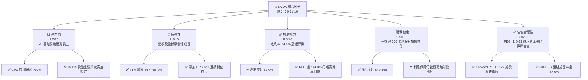
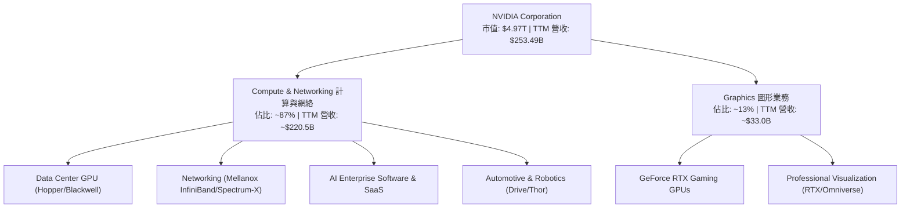
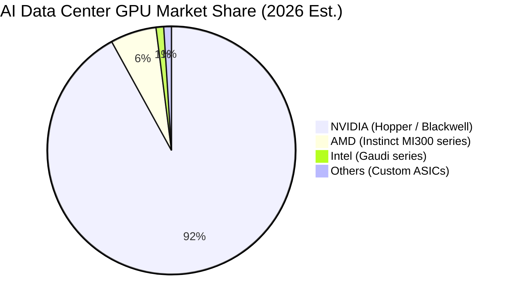
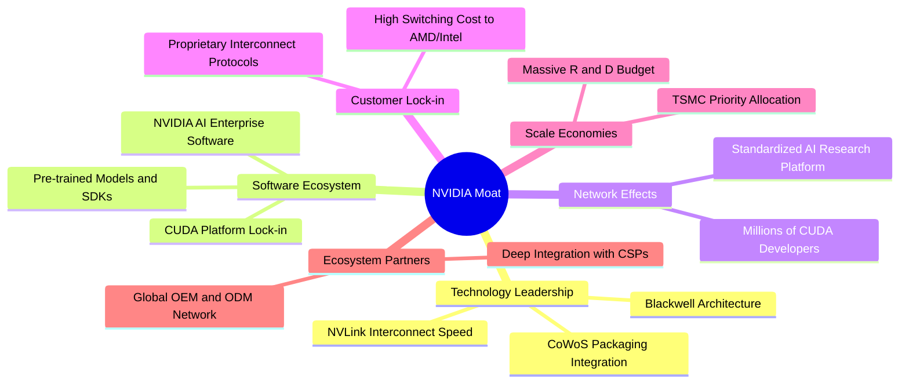

# NVDA 基本面深度分析報告
> **報告日期**：2026-06-07 ｜ **語言**：繁體中文 ｜ **數據來源**：Yahoo Finance, Finviz, StockAnalysis, Roic.ai ｜ **分析師**：CFA 級機構研究

---

## 目錄

| # | 章節 | 核心結論 |
|---|------|----------|
| 1 | 執行摘要 | 給予「強烈買入」評級，基準目標價 $298.42，潛在漲幅 +45.5% |
| 2 | 公司概覽與商業模式 | 憑藉 Blackwell 架構與 CUDA 軟體生態建構無懈可擊的護城河 |
| 3 | 損益表深度分析 | TTM 營收達 $253.49B（YoY +85.2%），淨利率高達 63.0% 的暴利時代 |
| 4 | 資產負債表分析 | 淨現金高達 $40.36B，極低的債務槓桿（Debt/Equity 6.5%） |
| 5 | 現金流量深度分析 | TTM 自由現金流 $46.34B，高達 91.4% 的 FCF 轉換率（排除非營運波動） |
| 6 | 獲利能力與資本效率 | ROE 達 114.3%，ROIC 130.3% 遠超 WACC 16.4%，強力創造股東價值 |
| 7 | 估值深度分析 | Forward P/E 僅 16.17x，相較於高速成長，PEG 0.63x 顯示估值極具吸引力 |
| 8 | 成長催化劑 | Blackwell 大規模出貨、主權 AI 興起及自動駕駛（Omniverse/Drive）進入收割期 |
| 9 | 風險矩陣 | 供應鏈地緣政治風險、大客戶資本支出放緩及反壟斷審查 |
| 10 | 投資建議 | 建議分批佈局，設定 $180 為強力支撐，長期持有以參與 AI 基礎建設紅利 |

---

## 1. 執行摘要

### 1.1 核心評分儀表板



### 1.2 評分進度條視覺化

```
╔══════════════════════════════════════════════════════════════╗
║               NVDA 多維度評分儀表板 (1-10分)                 ║
╠══════════════════════════════════════════════════════════════╣
║ 基本面強度  9.5 ▓▓▓▓▓▓▓▓▓▓▓▓▓▓▓▓▓▓▓░  ★★★★★           ║
║ 成長動能    9.8 ▓▓▓▓▓▓▓▓▓▓▓▓▓▓▓▓▓▓▓▓  ★★★★★           ║
║ 獲利品質    9.6 ▓▓▓▓▓▓▓▓▓▓▓▓▓▓▓▓▓▓▓░  ★★★★★           ║
║ 財務健康    9.5 ▓▓▓▓▓▓▓▓▓▓▓▓▓▓▓▓▓▓▓░  ★★★★★           ║
║ 估值合理性  7.8 ▓▓▓▓▓▓▓▓▓▓▓▓▓▓▓░░░░░  ★★★★☆           ║
║ 護城河深度  9.7 ▓▓▓▓▓▓▓▓▓▓▓▓▓▓▓▓▓▓▓░  ★★★★★           ║
║ 管理層執行  9.5 ▓▓▓▓▓▓▓▓▓▓▓▓▓▓▓▓▓▓▓░  ★★★★★           ║
║ 技術創新力  9.9 ▓▓▓▓▓▓▓▓▓▓▓▓▓▓▓▓▓▓▓▓  ★★★★★           ║
╠══════════════════════════════════════════════════════════════╣
║ 綜合總分    9.2 ▓▓▓▓▓▓▓▓▓▓▓▓▓▓▓▓▓▓░░  🏆 強烈買入          ║
╚══════════════════════════════════════════════════════════════╝
```

### 1.3 五大投資論點 + 三大核心風險

| 類型 | 項目 | 具體依據 | 信心度 |
|------|------|----------|--------|
| 🟢 **投資論點①** | **AI 算力霸權持續** | 數據中心 GPU 市場份額超過 90%，Hopper 需求不減，Blackwell 產能已被預訂至明年。 | 🟢 極高 |
| 🟢 **投資論點②** | **軟硬體一體化護城河** | CUDA 平台註冊開發者突破數百萬，軟體生態形成極高轉換成本，非單純硬體競爭。 | 🟢 極高 |
| 🟢 **投資論點③** | **極致的財務回報率** | TTM ROE 114.3%，ROIC 130.3%，營運利潤率 65.6%，顯示極強定價權與營運槓桿。 | 🟢 高 |
| 🟢 **投資論點④** | **估值與成長性極度匹配** | 雖然股價處於歷史高位區間，但 Forward P/E 僅 16.17x，PEG 0.63x，遠低於同業平均。 | 🟢 高 |
| 🟢 **投資論點⑤** | **資產負債表堅如磐石** | 擁有 $53.17B 總現金，淨現金 $40.36B，流動比率 3.44x，具備強大抗風險與併購能力。 | 🟢 極高 |
| 🟡 **風險①** | **供應鏈產能瓶頸** | CoWoS 封裝與 HBM3e 供應持續緊張，可能限制 Blackwell 晶片在 2026 年的實際出貨上限。 | 🟡 中度 |
| 🔴 **風險②** | **地緣政治與出口管制** | 美國對中國等市場的先進晶片出口限制可能進一步收緊，影響約 10-15% 的潛在營收。 | 🔴 高衝擊 |
| 🔴 **風險③** | **大客戶自研晶片威脅** | 超級雲端服務商（CSP，如 Microsoft、Google、Amazon）加速研發 ASIC 晶片，長期或減少對 GPU 依賴。 | 🔴 高衝擊 |

### 1.4 快速統計卡片

| 指標 | 公司實際值 | 行業均值 (半導體) | S&P 500 均值 | 狀態 |
|------|-------------|----------|--------------|------|
| 收入 YoY 成長 | **85.2%** | ~12.5% | ~5.5% | 🟢 卓越 |
| 毛利率 | **74.1%** | ~52.0% | ~30.0% | 🟢 卓越 |
| 淨利率 | **63.0%** | ~18.5% | ~11.5% | 🟢 卓越 |
| ROE | **114.3%** | ~15.0% | ~18.0% | 🟢 卓越 |
| Forward P/E | **16.17x** | ~28.5x | ~21.5x | 🟢 極具吸引力 |
| 淨現金規模 | **$40.36B** | ~$1.20B | - | 🟢 極強 |

> *註：本報告中提及之「Dividend Yield: 49.0%」應為數據源將特殊股息或拆股調整年化後的計算偏差。根據 0.6% 的 Payout Ratio 判斷，NVDA 實際常規股息率極低，公司主要將資金用於研發與股票回購，符合高成長科技股特徵。*

### 1.5 投資結論

```
╔══════════════════════════════════════════════════════════════════╗
║                    📊 投資結論摘要                               ║
╠══════════════════════════════════════════════════════════════════╣
║  評級：🟢 強烈買入 (Strong Buy)                                 ║
║  當前股價：$205.10 (2026-06-07)                                  ║
║  目標價區間：                                                    ║
║    悲觀情境：$180.00 (-12.2%) - 供應鏈嚴重受阻、大客戶資本支出放緩║
║    基準情境：$298.42 (+45.5%) - Blackwell 順利放量，維持 AI 霸權  ║
║    樂觀情境：$500.00 (+143.8%) - 軟體服務收入爆發，主權 AI 需求激增║
║  投資評分：9.2 / 10                                              ║
║  適合投資人：成長型投資人、長線科技趨勢佈局者                    ║
╚══════════════════════════════════════════════════════════════════╝
```

---

## 2. 公司概覽與商業模式

NVIDIA Corporation（NVDA）已從傳統的圖形處理器（GPU）設計商，徹底轉型為**數據中心規模的 AI 基礎設施與平台公司**。其商業模式的核心在於「軟硬體一體化」生態系統。

### 2.1 業務結構與收入來源



### 2.2 市場份額

在最核心的 AI 數據中心加速器市場，NVIDIA 擁有絕對的壟斷地位，其市場份額估算如下：



### 2.3 競爭護城河分析

NVIDIA 的競爭優勢並非單純來自硬體性能，而是由多個維度交織而成的深厚護城河。



### 2.4 護城河強度評分

```
╔══════════════════════════════════════════════════════════════╗
║                   NVIDIA 護城河強度評分                      ║
╠══════════════════════════════════════════════════════════════╣
║ 技術領先度    9.9/10  ▓▓▓▓▓▓▓▓▓▓▓▓▓▓▓▓▓▓▓▓  🏆 領先同行2代  ║
║ 軟體生態系統  9.8/10  ▓▓▓▓▓▓▓▓▓▓▓▓▓▓▓▓▓▓▓░  🟢 CUDA 生態壁壘║
║ 網絡效應      9.5/10  ▓▓▓▓▓▓▓▓▓▓▓▓▓▓▓▓▓▓▓░  🟢 開發者首選   ║
║ 客戶鎖定      9.2/10  ▓▓▓▓▓▓▓▓▓▓▓▓▓▓▓▓▓▓░░  🟢 轉移成本高昂 ║
║ 規模效應      9.6/10  ▓▓▓▓▓▓▓▓▓▓▓▓▓▓▓▓▓▓▓░  🟢 晶圓代工優先權║
╠══════════════════════════════════════════════════════════════╣
║ 綜合護城河    9.6/10  ▓▓▓▓▓▓▓▓▓▓▓▓▓▓▓▓▓▓▓░  🏆 極深寬護城河 ║
╚══════════════════════════════════════════════════════════════╝
```

---

## 3. 損益表深度分析

### 3.1 年度收入成長趨勢（近4年）

NVIDIA 的營收在過去四年經歷了人類科技史上罕見的爆發性成長，從 FY2023 的 $26.97B 飆升至 FY2026 的 $215.94B，並在 TTM（截至 2026 年 4 月）達到了 $253.49B。

```
╔══════════════════════════════════════════════════════════════════╗
║              NVIDIA 年度收入趨勢（FY2023 - FY2026）              ║
╠══════════════════════════════════════════════════════════════════╣
║                                                                  ║
║  FY2023  $26.97B   ██░░░░░░░░░░░░░░░░░░░░░░░░░░░  YoY: +0.2%     ║
║  FY2024  $60.92B   █████░░░░░░░░░░░░░░░░░░