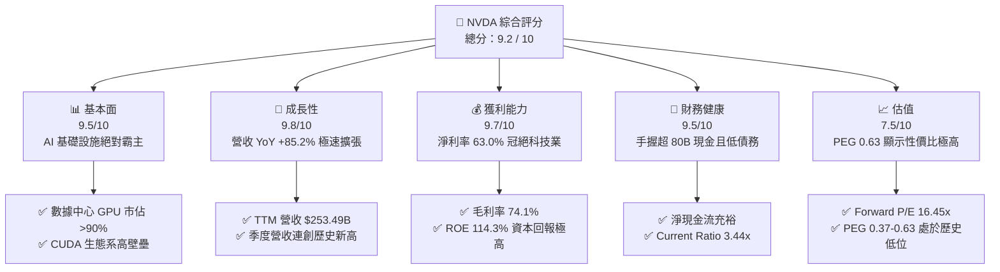

# NVDA 基本面深度分析報告

> **報告日期**：2026-06-08 ｜ **語言**：繁體中文 ｜ **數據來源**：Yahoo Finance, Finviz, StockAnalysis, Roic.ai ｜ **分析師**：CFA 級機構研究

---

## 目錄

| # | 章節 | 核心結論 |
|---|------|----------|
| 1 | 執行摘要 | 評級：🟢 強烈買入，目標價：$298.42（隱含 43% 上行空間） |
| 2 | 公司概覽與商業模式 | AI 數據中心基礎設施霸主，CUDA 生態構築無法逾越的軟體壁壘 |
| 3 | 損益表深度分析 | TTM 營收 $253.49B（YoY +85.2%），淨利率 63% 展現極致定價權 |
| 4 | 資產負債表分析 | 淨現金達 $72.1B（四月數據），資產負債表極度健康，無償債風險 |
| 5 | 現金流量深度分析 | TTM 營運現金流 $125.65B，自由現金流轉換效率極高 |
| 6 | 獲利能力與資本效率 | ROE 達 114.3%，ROIC 160.6% 遠超 WACC，強力創造股東價值 |
| 7 | 估值深度分析 | Forward P/E 僅 16.45x，相較其高成長性，估值具備極高吸引力 |
| 8 | 成長催化劑 | Blackwell 晶片放量、主權 AI 興起及軟體訂閱（NIMs）開啟第二成長曲線 |
| 9 | 風險矩陣 | 地緣政治風險、供應鏈產能瓶頸與客戶自研晶片（ASIC）替代風險 |
| 10| 投資建議 | 基準情境目標價 $298.42，建議逢低分批佈局，適合長期成長型投資人 |

---

## 1. 執行摘要

### 1.1 核心評分儀表板



### 1.2 評分進度條視覺化

```
╔══════════════════════════════════════════════════════════════╗
║              NVDA 多維度評分儀表板 (1-10分)                 ║
╠══════════════════════════════════════════════════════════════╣
║ 基本面強度  9.5 ▓▓▓▓▓▓▓▓▓▓▓▓▓▓▓▓▓▓▓░  ★★★★★           ║
║ 成長動能    9.8 ▓▓▓▓▓▓▓▓▓▓▓▓▓▓▓▓▓▓▓▓  ★★★★★           ║
║ 獲利品質    9.7 ▓▓▓▓▓▓▓▓▓▓▓▓▓▓▓▓▓▓▓░  ★★★★★           ║
║ 財務健康    9.5 ▓▓▓▓▓▓▓▓▓▓▓▓▓▓▓▓▓▓▓░  ★★★★★           ║
║ 估值合理性  7.5 ▓▓▓▓▓▓▓▓▓▓▓▓▓▓▓░░░░░  ★★★★☆           ║
║ 護城河深度  9.8 ▓▓▓▓▓▓▓▓▓▓▓▓▓▓▓▓▓▓▓▓  ★★★★★           ║
║ 管理層執行  9.5 ▓▓▓▓▓▓▓▓▓▓▓▓▓▓▓▓▓▓▓░  ★★★★★           ║
║ 技術創新力  9.9 ▓▓▓▓▓▓▓▓▓▓▓▓▓▓▓▓▓▓▓▓  ★★★★★           ║
╠══════════════════════════════════════════════════════════════╣
║ 綜合總分    9.2 ▓▓▓▓▓▓▓▓▓▓▓▓▓▓▓▓▓▓░░  🏆 強烈買入          ║
╚══════════════════════════════════════════════════════════════╝
```

### 1.3 五大投資論點 + 三大核心風險

| 類型 | 項目 | 具體依據 | 信心度 |
|------|------|----------|--------|
| 🟢 **投資論點①** | **AI 算力霸權持續** | 數據中心 TTM 營收突破千億美元，Blackwell 架構晶片供不應求，市佔率維持 90% 以上。 | 🟢 極高 |
| 🟢 **投資論點②** | **極致的定價權與獲利能力** | 毛利率維持在 74.1% 的歷史高位，淨利率達 63.0%，主要得益於全棧解決方案（晶片+軟體+網路）。 | 🟢 極高 |
| 🟢 **投資論點③** | **軟體生態鎖定（CUDA）** | 全球超過 500 萬名開發者依賴 CUDA 生態，客戶轉向 AMD 或 Intel 的轉換成本極高。 | 🟢 極高 |
| 🟢 **投資論點④** | **估值極具成長性價比** | Forward P/E 僅 16.45x，相較於未來五年高達 45.5% 的 EPS 預期增速，PEG 僅 0.37 - 0.63，估值被嚴重低估。 | 🟢 高 |
| 🟢 **投資論點⑤** | **強勁的資產負債表與現金流** | 手頭現金與短期投資達 $80.57B，TTM 營運現金流 $125.65B，為持續研發與股東回購提供強大後盾。 | 🟢 極高 |
| 🟡 **風險①** | **地緣政治與出口管制** | 美國對中國等市場的半導體出口限制可能進一步收緊，影響約 20%-25% 的潛在市場。 | 🟡 中度 |
| 🔴 **風險②** | **供應鏈產能瓶頸** | 台積電（TSMC）CoWoS 封裝產能及 HBM3e 供應若出現瓶頸，將直接限制 Blackwell 晶片的出貨量。 | 🔴 高衝擊 |
| 🟡 **風險③** | **雲端巨頭自研 ASIC 競爭** | AWS、Google、Meta、Microsoft 等超大型數據中心客戶持續加大自研 AI 晶片力度，長線可能侵蝕部分份額。 | 🟡 中度 |

### 1.4 快速統計卡片

| 指標 | 公司實際值 (NVDA) | 行業均值 (Semiconductors) | S&P 500 均值 | 狀態 |
|------|-------------|----------|--------------|------|
| **收入 YoY 成長** | **85.2%** | ~12.5% | ~5.8% | 🟢 卓越 |
| **毛利率** | **74.1%** | ~48.0% | ~30.5% | 🟢 卓越 |
| **淨利率** | **63.0%** | ~18.0% | ~12.0% | 🟢 卓越 |
| **ROE** | **114.3%** | ~15.0% | ~18.0% | 🟢 卓越 |
| **Forward P/E** | **16.45x** | ~28.0x | ~21.5x | 🟢 低估 |
| **PEG Ratio** | **0.63** | ~1.85 | ~2.10 | 🟢 極具性價比 |
| **淨現金/債務** | **$72.10B** | 淨債務多數為正 | N/A | 🟢 極其健康 |

### 1.5 投資結論

```
╔══════════════════════════════════════════════════════════════════╗
║                    📊 NVDA 投資結論摘要                          ║
╠══════════════════════════════════════════════════════════════════╣
║  評級：🟢 強烈買入 (Strong Buy)                                 ║
║  當前股價：$208.64 (2026-06-08)                                  ║
║  目標價區間：                                                    ║
║    悲觀情境：$180.00 (-13.7%) - 估值收縮至 14x Forward P/E       ║
║    基準情境：$298.42 (+43.