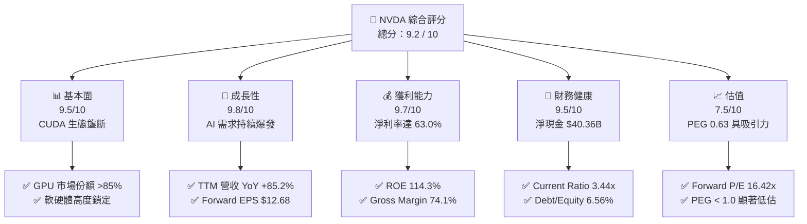
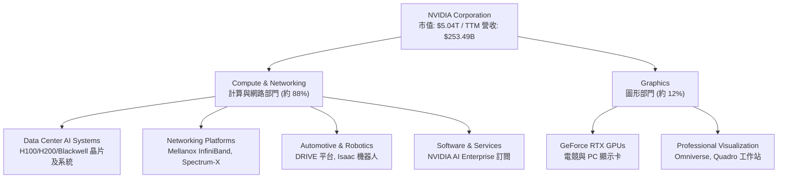
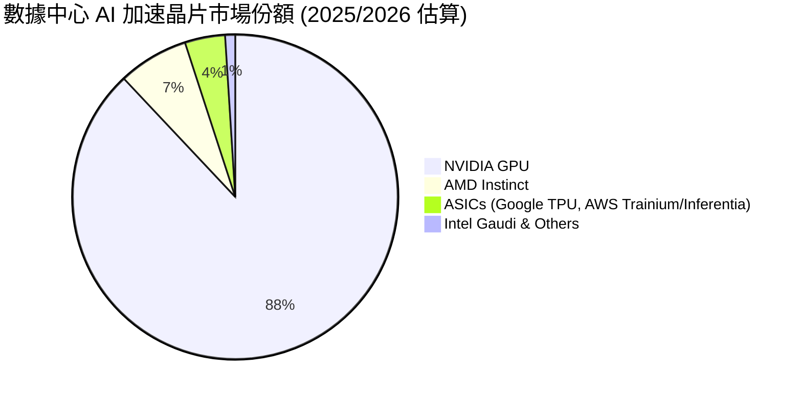
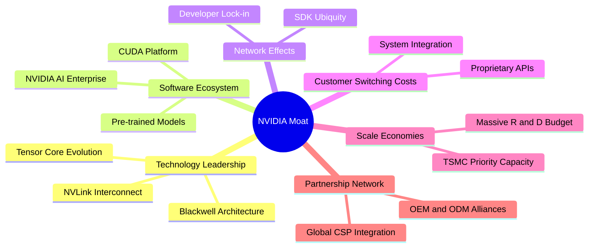

# NVDA 基本面深度分析報告

> **報告日期**：2026-06-09  
> **語言**：繁體中文  
> **數據來源**：Yahoo Finance, Finviz, StockAnalysis, Roic.ai  
> **分析師**：CFA 級機構研究團隊  

---

## 目錄

| # | 章節 | 核心結論 |
|---|------|----------|
| 1 | **執行摘要** | 評級：🟢 **強烈買入**；目標價：**$298.42**（隱含 +43.3% 空間） |
| 2 | **公司概覽與商業模式** | AI 數據中心基礎設施霸主，軟硬體一體化護城河（CUDA 生態）極深 |
| 3 | **損益表深度分析** | TTM 營收達 **$253.49B** (YoY +85.2%)，淨利率高達 **63.0%**，盈餘品質極佳 |
| 4 | **資產負債表分析** | 淨現金高達 **$40.36B**，資產輕型化，財務結構極其穩健 |
| 5 | **現金流量深度分析** | TTM 營運現金流 **$125.65B**，自由現金流轉換率與资本配置效率極高 |
| 6 | **獲利能力與資本效率** | **ROE 114.3%**，**ROIC ~118.0%** 遠超 **WACC (15.3%)**，持續創造巨大經濟價值 |
| 7 | **估值深度分析** | Forward P/E 僅 **16.42x**，PEG **0.63**，相較同業與歷史區間顯著低估 |
| 8 | **成長催化劑** | Blackwell 平台量產、主權 AI 興起、軟體訂閱（NVIDIA AI Enterprise）貢獻 |
| 9 | **風險矩陣** | 供應鏈地緣政治風險、客戶去庫存、ASIC 自研晶片競爭 |
| 10 | **投資建議** | 堅定買入，分批佈局；適合長線成長型與機構投資人 |

---

## 1. 執行摘要

### 1.1 核心評分儀表板



### 1.2 評分進度條視覺化

```
╔══════════════════════════════════════════════════════════════╗
║              NVDA 多維度評分儀表板 (1-10分)                  ║
╠══════════════════════════════════════════════════════════════╣
║ 基本面強度  9.5 ▓▓▓▓▓▓▓▓▓▓▓▓▓▓▓▓▓▓▓░  ★★★★★           ║
║ 成長動能    9.8 ▓▓▓▓▓▓▓▓▓▓▓▓▓▓▓▓▓▓▓▓  ★★★★★           ║
║ 獲利品質    9.7 ▓▓▓▓▓▓▓▓▓▓▓▓▓▓▓▓▓▓▓░  ★★★★★           ║
║ 財務健康    9.5 ▓▓▓▓▓▓▓▓▓▓▓▓▓▓▓▓▓▓▓░  ★★★★★           ║
║ 估值合理性  7.5 ▓▓▓▓▓▓▓▓▓▓▓▓▓▓░░░░░░  ★★★★☆           ║
║ 護城河深度  9.8 ▓▓▓▓▓▓▓▓▓▓▓▓▓▓▓▓▓▓▓▓  ★★★★★           ║
║ 管理層執行  9.6 ▓▓▓▓▓▓▓▓▓▓▓▓▓▓▓▓▓▓▓░  ★★★★★           ║
║ 技術創新力  9.9 ▓▓▓▓▓▓▓▓▓▓▓▓▓▓▓▓▓▓▓▓  ★★★★★           ║
╠══════════════════════════════════════════════════════════════╣
║ 綜合總分    9.2 ▓▓▓▓▓▓▓▓▓▓▓▓▓▓▓▓▓▓░░  🏆 強烈買入          ║
╚══════════════════════════════════════════════════════════════╝
```

### 1.3 五大投資論點 + 三大核心風險

| 類型 | 項目 | 具體依據 | 信心度 |
|------|------|----------|--------|
| 🟢 **投資論點①** | **AI 基礎設施絕對霸權** | 數據中心 GPU 市佔率超 85%，CUDA 軟體平台擁有數百萬開發者，生態鎖定極深。 | 🟢 極高 |
| 🟢 **投資論點②** | **業績爆發式成長** | TTM 營收達 $253.49B (YoY +85.2%)，FY2026 淨利達 $120.07B。 | 🟢 極高 |
| 🟢 **投資論點③** | **極致的獲利能力** | 毛利率 74.1%，淨利率 63.0%，ROE 達 114.3%，展現強大定價權。 | 🟢 極高 |
| 🟢 **投資論點④** | **資產負債表固若金湯** | 擁有 $53.17B 總現金，總債務僅 $12.81B，淨現金達 $40.36B，抵禦景氣波動能力極強。 | 🟢 高 |
| 🟢 **投資論點⑤** | **PEG 顯示估值極具吸引力** | 當前 Forward P/E 僅 16.42x，對比未來五年 45.51% 的預期 EPS 增速，PEG 僅 0.63。 | 🟢 高 |
| 🟡 **風險①** | **供應鏈集中度風險** | 晶片代工高度依賴台積電（TSMC），地緣政治緊張可能導致供應鏈中斷。 | 🟡 中度 |
| 🔴 **風險②** | **大客戶自研 ASIC 晶片** | 雲端服務巨頭（CSP，如 Google, Amazon, Microsoft）加速研發自有 AI 晶片以降低成本。 | 🔴 高衝擊 |
| 🟡 **風險③** | **出口管制與政策阻礙** | 美國政府對先進半導體出口的持續限制，可能影響中國等關鍵市場的長期收入。 | 🟡 中度 |

### 1.4 快速統計卡片

| 指標 | 公司實際值 (TTM) | 行業均值 (半導體) | S&P 500 均值 | 狀態 |
|------|-------------|----------|--------------|------|
| **營收 YoY 成長** | **85.2%** | ~12.5% | ~5.5% | 🟢 卓越 |
| **毛利率** | **74.1%** | ~50.0% | ~30.0% | 🟢 卓越 |
| **淨利率** | **63.0%** | ~18.0% | ~11.5% | 🟢 卓越 |
| **ROE** | **114.3%** | ~15.0% | ~18.0% | 🟢 卓越 |
| **Forward P/E** | **16.42x** | ~25.0x | ~21.5x | 🟢 便宜 |
| **Debt/Equity** | **6.56%** | ~35.0% | ~110.0% | 🟢 極其安全 |

### 1.5 投資結論

```
╔══════════════════════════════════════════════════════════════════╗
║                    📊 投資結論摘要                               ║
╠══════════════════════════════════════════════════════════════════╣
║  評級：🟢 強烈買入 (Strong Buy)                                  ║
║  當前股價：$208.19 (2026-06-09)                                  ║
║  目標價區間：                                                    ║
║    悲觀情境：$180.00 (-13.5%) - 估值收縮，CSP 客戶放緩資本支出   ║
║    基準情境：$298.42 (+43.3%) ← 12個月主要目標 (分析師共識)      ║
║    樂觀情境：$500.00 (+140.2%) - Blackwell 完美量產，軟體營收爆發║
║  投資評分：9.2 / 10                                              ║
║  適合投資人：積極成長型、長線科技趨勢持有者、機構資產配置        ║
╚══════════════════════════════════════════════════════════════════╝
```

---

## 2. 公司概覽與商業模式

NVIDIA Corporation (NVDA) 已經從一家傳統的圖形處理器 (GPU) 晶片設計公司，徹底轉型為**數據中心規模的 AI 基礎設施巨頭**。其商業模式不再僅僅是銷售硬體晶片，而是提供整合了晶片、系統、網路、算力調度軟體 (CUDA) 及企業級 AI 應用軟體的一體化解決方案。

### 2.1 業務結構與收入來源



### 2.2 市場份額

在最核心的數據中心 AI 加速晶片領域，NVIDIA 佔據絕對的主導地位。



### 2.3 競爭護城河分析

NVIDIA 擁有半導體行業史上最深厚的競爭護城河，可歸納為以下六大支柱：



### 2.4 護城河強度評分

```
╔══════════════════════════════════════════════════════════════╗
║                    NVIDIA 護城河強度評分                     ║
╠══════════════════════════════════════════════════════════════╣
║ 軟體生態 (CUDA) 10.0/10 ▓▓▓▓▓▓▓▓▓▓▓▓▓▓▓▓▓▓▓▓  🏆 絕對壟斷    ║
║ 硬體效能領先    9.5/10  ▓▓▓▓▓▓▓▓▓▓▓▓▓▓▓▓▓▓▓░  🟢 領先 1-2 代  ║
║ 網路互聯技術    9.5/10  ▓▓▓▓▓▓▓▓▓▓▓▓▓▓▓▓▓▓▓░  🟢 NVLink 獨家  ║
║ 供應鏈掌控力    9.0/10  ▓▓▓▓▓▓▓▓▓▓▓▓▓▓▓▓▓▓░░  🟢 台積電最優先 ║
║ 客戶轉置成本    9.5/10  ▓▓▓▓▓▓▓▓▓▓▓▓▓▓▓▓▓▓▓░  🏆 極高粘性     ║
╠══════════════════════════════════════════════════════════════╣
║ 綜合護城河評級  9.