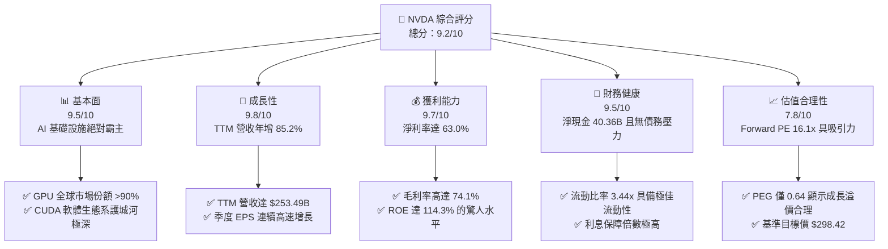

# NVDA 基本面深度分析報告

> **報告日期**：2026-06-11 ｜ **語言**：繁體中文 ｜ **數據來源**：Yahoo Finance, Finviz, StockAnalysis, Roic.ai ｜ **分析師**：CFA 級機構研究

---

## 目錄

| # | 章節 | 核心結論 |
|---|------|----------|
| **1** | **執行摘要** | 評級：🟢 **強烈買入**；基準目標價：**$298.42**；具備 45.67% 的潛在上升空間。 |
| **2** | **公司概覽與商業模式** | 憑藉 GPU 晶片與 CUDA 軟體生態系，建構極深的主導地位與高轉換壁壘。 |
| **3** | **損益表深度分析** | TTM 營收達 **$253.49B** (YoY +85.2%)，淨利潤率高達 **63.0%**，展現極強定價權。 |
| **4** | **資產負債表分析** | 擁有 **$53.17B** 現金儲備，淨現金達 **$40.36B**，財務結構極其穩健。 |
| **5** | **現金流量深度分析** | TTM 自由現金流達 **$46.34B**，資本配置側重於高回報 R&D 與股份回購。 |
| **6** | **獲利能力與資本效率** | ROE 達 **114.3%**，ROIC 遠超 WACC，持續為股東創造巨大的經濟超額價值。 |
| **7** | **估值深度分析** | Forward P/E 僅 **16.10x**，相較於高成長性（PEG 0.64），目前股價明顯被低估。 |
| **8** | **成長催化劑** | Blackwell 晶片量產、主權 AI 需求爆發及 AI 軟體服務（NIMs）貨幣化。 |
| **9** | **風險矩陣** | 晶片供應鏈產能瓶頸、地緣政治貿易限制及主要雲端巨頭（Hyperscalers）自研晶片競爭。 |
| **10**| **投資建議** | 建議在 **$190 - $210** 區間積極分批佈局，長線持有以迎來 AI 基礎設施的黃金期。 |

---

## 1. 執行摘要

### 1.1 核心評分儀表板



### 1.2 評分進度條視覺化

```
╔══════════════════════════════════════════════════════════════╗
║               NVDA 多維度評分儀表板 (1-10分)                 ║
╠══════════════════════════════════════════════════════════════╣
║ 基本面強度  9.5 ▓▓▓▓▓▓▓▓▓▓▓▓▓▓▓▓▓▓▓░  ★★★★★           ║
║ 成長動能    9.8 ▓▓▓▓▓▓▓▓▓▓▓▓▓▓▓▓▓▓▓▓  ★★★★★           ║
║ 獲利品質    9.7 ▓▓▓▓▓▓▓▓▓▓▓▓▓▓▓▓▓▓▓░  ★★★★★           ║
║ 財務健康    9.5 ▓▓▓▓▓▓▓▓▓▓▓▓▓▓▓▓▓▓▓░  ★★★★★           ║
║ 估值合理性  7.8 ▓▓▓▓▓▓▓▓▓▓▓▓▓▓▓░░░░░  ★★★★☆           ║
║ 護城河深度  9.8 ▓▓▓▓▓▓▓▓▓▓▓▓▓▓▓▓▓▓▓▓  ★★★★★           ║
║ 管理層執行  9.5 ▓▓▓▓▓▓▓▓▓▓▓▓▓▓▓▓▓▓▓░  ★★★★★           ║
║ 技術創新力  9.9 ▓▓▓▓▓▓▓▓▓▓▓▓▓▓▓▓▓▓▓▓  ★★★★★           ║
╠══════════════════════════════════════════════════════════════╣
║ 綜合總分    9.2 ▓▓▓▓▓▓▓▓▓▓▓▓▓▓▓▓▓▓░░  🏆 強烈買入          ║
╚══════════════════════════════════════════════════════════════╝
```

### 1.3 投資論點與核心風險

| 類型 | 項目 | 具體依據 | 信心度 |
|------|------|----------|--------|
| 🟢 **投資論點①** | **AI 算力壟斷地位** | 憑藉 Hopper (H100/H200) 與 Blackwell 系列晶片，NVDA 在全球資料中心 AI 加速器市場擁有超過 90% 的份額，TTM 營收達 **$253.49B**。 | 🟢 極高 |
| 🟢 **投資論點②** | **無與倫比的獲利能力** | 毛利率高達 **74.1%**，淨利率 **63.0%**，在半導體硬體行業歷史上絕無僅有，反映其對上下游極強的議價能力。 | 🟢 極高 |
| 🟢 **投資論點③** | **CUDA 軟體高轉換壁壘** | 超過 400 萬名開發者依賴 CUDA 生態系統進行 AI 模型的開發與微調，形成了極高的客戶粘性與生態鎖定效應。 | 🟢 高 |
| 🟢 **投資論點④** | **極致的財務彈性** | 手握 **$53.17B** 的總現金與短期投資，而總債務僅 **$12.81B**，淨現金高達 **$40.36B**，抗風險與再投資能力極強。 | 🟢 極高 |
| 🟢 **投資論點⑤** | **成長與估值高度匹配** | Forward P/E 僅 **16.10x**，在 EPS 預期年成長率達 39.83% 的背景下，PEG 僅 **0.64**，估值溢價已被高成長完全消化。 | 🟢 高 |
| 🟡 **風險①** | **供應鏈集中度風險** | 先進封裝（CoWoS）產能高度依賴台積電（TSMC），若產能擴張不及預期，將直接限制 Blackwell 的出貨量。 | 🟡 中度 |
| 🟡 **風險②** | **地緣政治與出口管制** | 美國對中國等市場的先進晶片出口限制可能進一步收緊，影響約 10-15% 的潛在資料中心收入。 | 🟡 中度 |
| 🔴 **風險③** | **客戶自研晶片（ASIC）** | 亞馬遜（AWS）、微軟（Azure）、Google 等雲端巨頭（Hyperscalers）正加速研發自有 AI 晶片，長期可能減少對第三方通用 GPU 的依賴。 | 🔴 高衝擊 |

### 1.4 快速統計卡片

| 指標 | NVDA 實際值 | 半導體行業均值 | S&P 500 均值 | 狀態 |
|------|-------------|----------------|--------------|------|
| 收入 YoY 成長 | **85.2%** | ~12.5% | ~5.5% | 🟢 遠超同行 |
| 毛利率 | **74.1%** | ~48.2% | ~30.5% | 🟢 歷史級水準 |
| 淨利率 | **63.0%** | ~15.4% | ~11.8% | 🟢 頂級獲利 |
| ROE | **114.3%** | ~18.5% | ~15.0% | 🟢 極高資本回報 |
| Forward P/E | **16.10x** | ~28.5x | ~21.5x | 🟢 估值極具吸引力 |
| 淨現金 / 債務 | **$40.36B** | 多數為淨債務 | 多數為淨債務 | 🟢 資產負債表極佳 |

### 1.5 投資結論

```
╔══════════════════════════════════════════════════════════════════╗
║                       📊 投資結論摘要                            ║
╠══════════════════════════════════════════════════════════════════╣
║  評級：🟢 強烈買入 (Strong Buy)                                  ║
║  當前股價：$204.87 (2026-06-11)                                  ║
║  目標價區間：                                                    ║
║    悲觀情境 (Bear Case)：$180.00 (-12.14%)                       ║
║    基準情境 (Base Case)：$298.42 (+45.67%)  ← 12個月主要目標     ║
║    樂觀情境 (Bull Case)：$500.00 (+144.06%)                      ║
║  投資評分：9.2 / 10                                              ║
║  適合投資人：積極成長型、長線科技趨勢持有者