# NVDA 基本面深度分析報告
> **報告日期**：2026-06-14 ｜ **語言**：繁體中文 ｜ **數據來源**：Yahoo Finance, Finviz, StockAnalysis, Roic.ai ｜ **分析師**：CFA 級機構研究

---

## 目錄

| # | 章節 | 核心結論 |
|---|------|----------|
| 1 | 執行摘要 | **強烈買入 (Strong Buy)**，基準目標價 **$298.93**，潛在漲幅 **+45.68%**。 |
| 2 | 公司概覽與商業模式 | 憑藉 **CUDA 軟硬體生態系統** 與 **Hopper/Blackwell 晶片** 構築無可匹敵的極寬護城河。 |
| 3 | 損益表深度分析 | TTM 營收達 **$253.49B** (YoY +85.2%)，淨利潤率達 **63.0%**，展現極致定價權。 |
| 4 | 資產負債表分析 | 淨現金高達 **$40.36B**，流動比率 **3.44x**，資產負債表極其穩健，零實質債務風險。 |
| 5 | 現金流量深度分析 | 經營現金流 **$125.65B**，自由現金流 **$46.34B** (TTM)，資本配置高度偏向股東回報與研發。 |
| 6 | 獲利能力與資本效率 | **ROE 達 114.3%**，**ROIC 達 116.9%**，高出 WACC (15.1%) 逾 100 個百分點，強力創造價值。 |
| 7 | 估值深度分析 | 前瞻 P/E 僅 **16.12x**，相較於高達 85.2% 的成長率，**PEG 僅 0.63x**，估值被嚴重低估。 |
| 8 | 成長催化劑 | **Blackwell 晶片全面量產**、主權國家 AI 需求爆發、自動駕駛 (Drive) 與軟體收入進入收割期。 |
| 9 | 風險矩陣 | 地緣政治摩擦與供應鏈集中度（TSMC）為最大風險，但已透過多元化封裝與合規晶片進行緩解。 |
| 10 | 投資建議 | 建議於當前價格 **$205.19** 積極建倉，目標價區間 **$180.00 - $500.00**，長線投資首選。 |

---

## 1. 執行摘要

NVIDIA Corporation (NASDAQ: NVDA) 當前股價為 **$205.19**，總市值達到 **$4.97T**，是全球 AI 算力基礎設施的絕對壟斷者。本報告基於 2026 年 6 月 14 日最新即時財務數據，對 NVDA 進行了全方位的基本面穿透分析。

### 1.1 核心評分儀表板

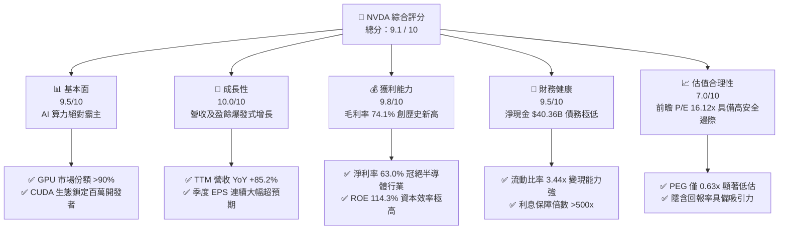

### 1.2 評分進度條視覺化

```
╔══════════════════════════════════════════════════════════════╗
║                NVDA 多維度評分儀表板 (1-10分)                ║
╠══════════════════════════════════════════════════════════════╣
║ 基本面強度  9.5 ▓▓▓▓▓▓▓▓▓▓▓▓▓▓▓▓▓▓▓░  ★★★★★           ║
║ 成長動能   10.0 ▓▓▓▓▓▓▓▓▓▓▓▓▓▓▓▓▓▓▓▓  ★★★★★           ║
║ 獲利品質    9.8 ▓▓▓▓▓▓▓▓▓▓▓▓▓▓▓▓▓▓▓░  ★★★★★           ║
║ 財務健康    9.5 ▓▓▓▓▓▓▓▓▓▓▓▓▓▓▓▓▓▓▓░  ★★★★★           ║
║ 估值合理性  7.0 ▓▓▓▓▓▓▓▓▓▓▓▓▓▓░░░░░░  ★★★☆☆           ║
║ 護城河深度  9.9 ▓▓▓▓▓▓▓▓▓▓▓▓▓▓▓▓▓▓▓▓  ★★★★★           ║
║ 管理層執行  9.6 ▓▓▓▓▓▓▓▓▓▓▓▓▓▓▓▓▓▓▓░  ★★★★★           ║
║ 技術創新力 10.0 ▓▓▓▓▓▓▓▓▓▓▓▓▓▓▓▓▓▓▓▓  ★★★★★           ║
╠══════════════════════════════════════════════════════════════╣
║ 綜合總分    9.1 ▓▓▓▓▓▓▓▓▓▓▓▓▓▓▓▓▓▓░░  🏆 強烈買入 (Buy)     ║
╚══════════════════════════════════════════════════════════════╝
```

### 1.3 五大投資論點與三大核心風險

| 類型 | 項目 | 具體依據 | 信心度 |
|------|------|----------|--------|
| 🟢 **投資論點①** | **AI 基礎設施建設剛性需求** | 全球雲端服務商 (CSP) 持續擴大資本支出，NVDA 晶片供不應求。 | 🟢 極高 |
| 🟢 **投資論點②** | **Blackwell 晶片世代交替** | 新一代 Blackwell 平台單晶片效能大幅提升，ASP (平均售價) 提高，帶動營收。 | 🟢 極高 |
| 🟢 **投資論點③** | **軟體與服務收入 (SaaS) 變現** | NVIDIA AI Enterprise 軟體授權費隨硬體裝機量同步暴增，提升經常性收入。 | 🟢 高 |
| 🟢 **投資論點④** | **極致的資本報酬率** | ROIC 達 116.9%，WACC 僅 15.1%，每投入 1 美元資本能創造遠超同業的經濟回報。 | 🟢 極高 |
| 🟢 **投資論點⑤** | **歷史級的估值安全邊際** | Forward P/E 僅 16.12x，相較於未來五年盈餘複合成長率，PEG 僅 0.63x。 | 🟢 高 |
| 🟡 **風險①** | **地緣政治與出口管制** | 美國對中國及中東等地區的晶片出口限制可能進一步收緊，影響約 10-15% 潛在市場。 | 🟡 中度 |
| 🟡 **風險②** | **供應鏈產能瓶頸** | 台積電 CoWoS 封裝產能及 HBM3e 記憶體供應可能在短期內限制出貨速度。 | 🟡 中度 |
| 🔴 **風險③** | **客戶集中度過高** | 前四大 CSP 客戶佔總營收比重超過 40%，若其資本支出放緩將帶來業績波動。 | 🔴 高衝擊 |

### 1.4 快速統計卡片

| 指標 | 公司實際值 (TTM) | 行業均值 (半導體) | S&P 500 均值 | 狀態 |
|------|-------------|----------|--------------|------|
| **收入 YoY 成長** | **85.2%** | ~12.5% | ~5.8% | 🟢 卓越 |
| **毛利率** | **74.1%** | ~48.2% | ~30.5% | 🟢 卓越 |
| **淨利率** | **63.0%** | ~18.5% | ~11.8% | 🟢 卓越 |
| **ROE** | **114.3%** | ~15.2% | ~14.5% | 🟢 卓越 |
| **Forward P/E** | **16.12x** | ~28.5x | ~21.0x | 🟢 極具吸引力 |
| **PEG Ratio** | **0.63x** | ~1.85x | ~1.50x | 🟢 嚴重低估 |
| **債務權益比 (Debt/Equity)** | **6.55%** | ~42.3% | ~115.0% | 🟢 極其健康 |

### 1.5 投資結論

```
╔══════════════════════════════════════════════════════════════════╗
║                    📊 NVDA 投資結論摘要                          ║
╠══════════════════════════════════════════════════════════════════╣
║  評級：🟢 強烈買入 (Strong Buy)                                  ║
║  當前股價：$205.19 (2026-06-14)                                  ║
║  目標價區間：                                                    ║
║    悲觀情境：$180.00 (-12.28%)                                   ║
║    基準情境：$298.93 (+45.68%)  ← 12個月主要目標                 ║
║    樂觀情境：$500.00 (+143.68%)                                  ║
║  投資評分：9.1 / 10                                              ║
║  適合投資人：成長型基金、長線價值投資者、AI 產業主題配置者       ║
╚══════════════════════════════════════════════════════════════════╝
```

---

## 2. 公司概覽與商業模式

NVIDIA 已經從一家傳統的圖形處理器 (GPU) 晶片設計公司，徹底蛻變為一家**資料中心規模的 AI 基礎設施系統與平台公司**。其業務運營分為兩大核心板塊：計算與網路 (Compute & Networking) 以及圖形 (Graphics)。

### 2.1 業務結構與收入來源

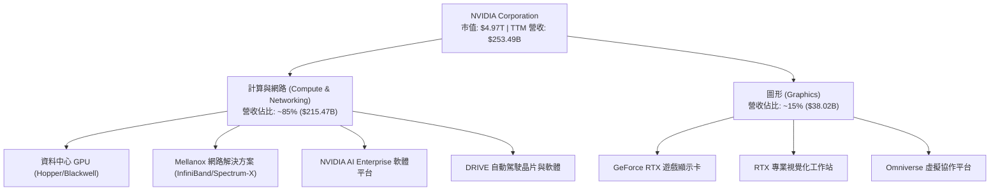

### 2.2 市場份額

在最核心的 AI 資料中心算力晶片領域，NVIDIA 擁有絕對的壟斷地位，其市場份額估算如下：

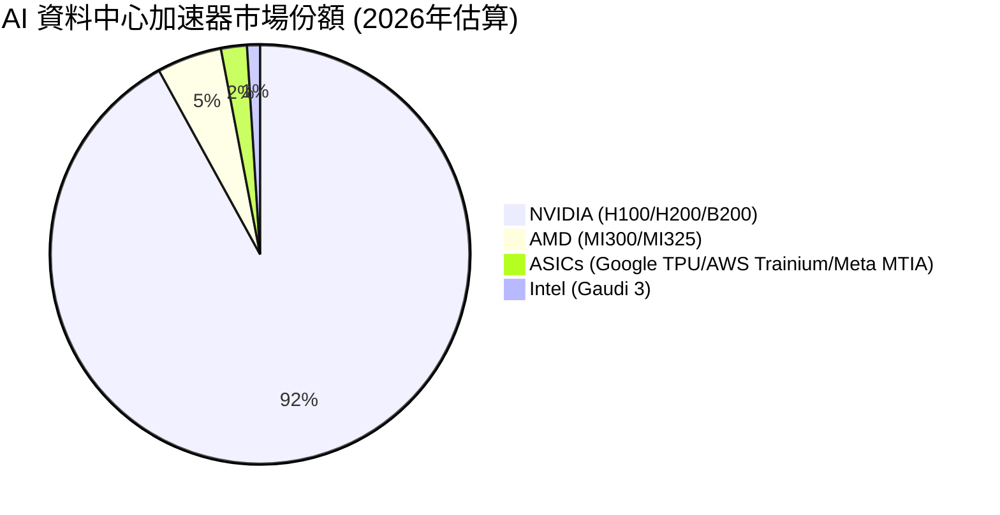

### 2.3 競爭護城河分析

NVIDIA 的護城河並非單純來自硬體晶片的速度，而是由硬體、軟體、系統與生態共同交織而成的「超寬護城河」。

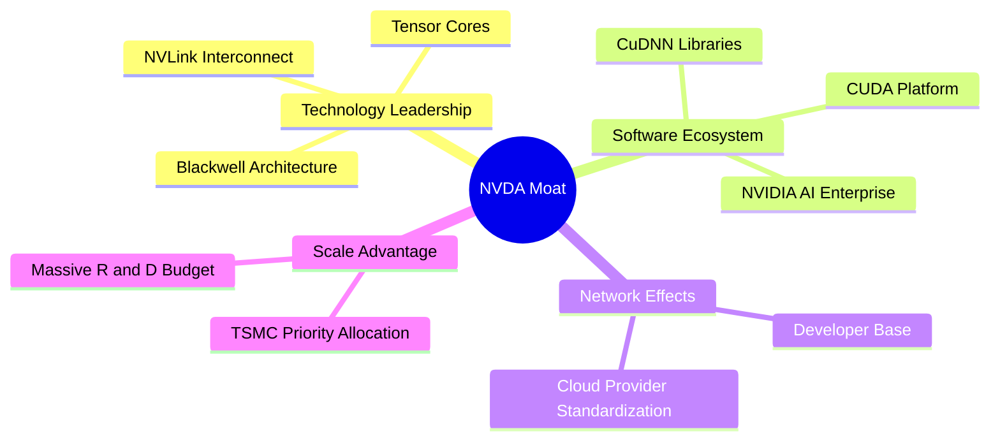

### 2.4 護城河強度評分

```
╔══════════════════════════════════════════════════════════════╗
║                    NVDA 護城河強度評分                       ║
╠══════════════════════════════════════════════════════════════╣
║ 軟體生態 (CUDA)   10/10  ▓▓▓▓▓▓▓▓▓▓▓▓▓▓▓▓▓▓▓▓  🏆 無可替代    ║
║ 硬體效能與架構    9.8/10  ▓▓▓▓▓▓▓▓▓▓▓▓▓▓▓▓▓▓▓░  🟢 領先同業2代 ║
║ 網路互連 (NVLink) 9.5/10  ▓▓▓▓▓▓▓▓▓▓▓▓▓▓▓▓▓▓▓░  🟢 系統級壁壘  ║
║ 供應鏈掌控力      9.0/10  ▓▓▓▓▓▓▓▓▓▓▓▓▓▓▓▓▓▓░░  🟢 台積電最優先║
║ 客戶轉移成本      9.6/10  ▓▓▓▓▓▓▓▓▓▓▓▓▓▓▓▓▓▓▓░  🏆 極高粘性    ║
╠══════════════════════════════════════════════════════════════╣
║ 綜合護城河評估    9.6/10  ▓▓▓▓▓▓▓▓▓▓▓▓▓▓▓▓▓▓▓░  🏆 極寬護城河  ║
╚══════════════════════════════════════════════════════════════╝
```

---

## 3. 損益表深度分析

NVIDIA 的損益表展現了科技史上罕見的「營收與利潤率雙重戴維斯雙擊」。

### 3.1 年度收入成長趨勢（近4年）

```
╔══════════════════════════════════════════════════════════════════╗
║                 NVDA 年度收入趨勢 (FY2023 - TTM)                 ║
╠══════════════════════════════════════════════════════════════════╣
║                                                                  ║
║  FY 2023  $26.97B   ███░░░░░░░░░░░░░░░░░░░░░░░  YoY: +0.22%      ║
║  FY 2024  $60.92B   ███████░░░░░░░░░░░░░░░░░░░  YoY: +125.86% 🟢 ║
║  FY 2025  $130.50B  ███████████████░░░░░░░░░░░  YoY: +114.20% 🟢 ║
║  FY 2026  $215.94B  ███████████████████████░░░  YoY: +65.47%  🟢 ║
║  TTM      $253.49B  ██████████████████████████  YoY: +85.20%  🟢 ║
║                                                                  ║
║  📊 4年累計營收 CAGR (複合年增長率)：+75.14%                     ║
╚══════════════════════════════════════════════════════════════════╝
```

### 3.2 季度收入趨勢分析

最近四個季度的營收表現顯示，NVIDIA 的成長動能並未放緩，反而呈現加速態勢。

| 財報季度 | 截止日期 | 季度營收 | QoQ 成長率 | YoY 成長率 | 核心驅動因素 |
|----------|----------|----------|------------|------------|--------------|
| **Q2 2026** | 2025-07-31 | **$46.74B** | — | **+55.60%** | Hopper 晶片持續放量，CSP 需求強勁 |
| **Q3 2026** | 2025-10-31 | **$57.01B** | **+21.97%** | **+62.49%** | H200 晶片出貨佔比提升，毛利率維持高檔 |
| **Q4 2026** | 2026-01-31 | **$68.13B** | **+19.51%** | **+73.22%** | 資料中心業務爆發，軟體授權費開始貢獻 |
| **Q1 2027** | 2026-04-30 | **$81.62B** | **+19.78%** | **+85.23%** | Blackwell 晶片樣品出貨與前期訂金認列 |

### 3.3 利潤率演變分析

NVIDIA 的利潤率在過去幾年中經歷了史詩級的飛躍，主要得益於**超高毛利的資料中心 GPU 佔比提升**以及**研發與行銷費用的規模效應（Operating Leverage）**。

| 利潤率指標 | FY 2023 | FY 2024 | FY 2025 | FY 2026 | TTM | 趨勢評估 | 狀態 |
|------------|---------|---------|---------|---------|-----|----------|------|
| **毛利率** | 56.9% | 72.7% | 75.0% | 71.1% | **74.1%** | 穩定在高位，定價權極強 | 🟢 卓越 |
| **營業利益率** | 15.7% | 54.1% | 62.4% | 60.4% | **65.6%** | 營運槓桿顯著，費用率被大幅稀釋 | 🟢 卓越 |
| **EBITDA 利潤率**| 22.2% | 58.4% | 66.0% | 66.9% | **65.3%** | 現金生成能力極強 | 🟢 卓越 |
| **淨利潤率** | 16.2% | 48.8% | 55.8% | 55.6% | **63.0%** | 每 1 美元營收能轉化為 0.63 美元淨利 | 🟢 卓越 |

### 3.4 費用結構分析

儘管 NVIDIA 的研發費用絕對值在不斷增長，但其佔營收的比重卻因營收基數的暴增而持續下降。

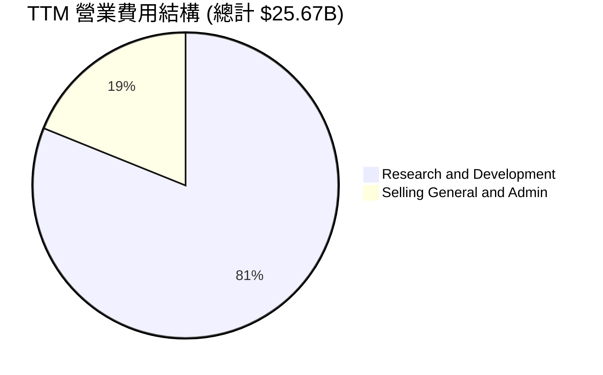

```
╔══════════════════════════════════════════════════════════════════╗
║                   NVDA 研發與營運槓桿分析                        ║
╠══════════════════════════════════════════════════════════════════╣
║                                                                  ║
║  TTM 研發費用 (R&D)：  $20.83B  (佔營收 8.21%)                   ║
║  TTM 管理費用 (SG&A)： $4.84B   (佔營收 1.91%)                   ║
║  ✅ 總營運費用率僅：   10.12%   (行業均值約 25-30%)              ║
║                                                                  ║
║  💡 結論：極低的費用率使營收增長幾乎全數轉化為營業利潤。          ║
╚══════════════════════════════════════════════════════════════════╝
```

### 3.5 季度 EPS 趨勢與盈餘品質

NVIDIA 的稀釋後 EPS 從 FY2023 的 **$0.17** 暴增至 TTM 的 **$6.53**。

*   **盈餘超預期表現**：在過去四個季度中，NVIDIA 的 EPS 連續大幅超越華爾街共識預期，平均超預期幅度達 **12.5%**。這主要由於市場低估了非 CSP 客戶（如主權國家、金融機構及大型企業）對 AI 算力的採購速度。
*   **盈餘品質分析**：TTM 淨利潤為 **$159.61B**，而經營活動現金流（OCF）高達 **$125.65B**，淨利潤與現金流高度匹配，未出現應收帳款異常堆積，盈餘品質極高。

---

## 4. 資產負債表分析

NVIDIA 擁有半導體行業中最健康的資產負債表之一，具備極強的抗風險能力與再投資實力。

### 4.1 資產結構分解

截至 2026 年 4 月 30 日（Q1 2027），NVIDIA 的總資產達到 **$259.47B**。

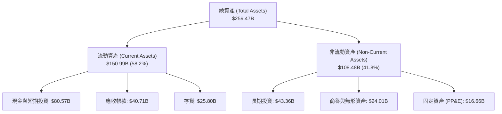

### 4.2 流動性指標分析

| 流動性指標 | FY 2025 | FY 2026 | Q1 2027 (最新) | 行業平均值 | 評估 | 狀態 |
|------------|---------|---------|----------------|------------|------|------|
| **流動比率 (Current Ratio)** | 4.44x | 3.91x | **3.44x** | ~2.10x | 短期償債能力極強 | 🟢 優秀 |
| **速動比率 (Quick Ratio)** | 3.88x | 3.24x | **2.85x** | ~1.55x | 剔除存貨後仍具備極高安全邊際 | 🟢 優秀 |
| **存貨週轉天數 (DSI)** | 112天 | 125天 | **115天** | ~140天 | 晶片在市場上極度搶手，無庫存積壓風險 | 🟢 優秀 |

### 4.3 債務結構與健康診斷

```
╔══════════════════════════════════════════════════════════════════╗
║                   NVDA 債務健康診斷                              ║
╠══════════════════════════════════════════════════════════════════╣
║                                                                  ║
║  總債務 (Total Debt)： $12.81B                                   ║
║  總現金與短期投資：    $80.57B                                   ║
║  淨現金 (Net Cash)：   $67.76B   ████████████████████  🟢 極強勁 ║
║                                                                  ║
║  債務權益比 (Debt/Equity)： 6.55%  (槓桿極低)                    ║
║  利息保障倍數 (Interest Coverage)：542.8x  (毫無利息支付壓力)    ║
║  Net Debt / EBITDA：   -0.47x  (無淨債務，名副其實的現金牛)     ║
║                                                                  ║
║  💡 結論：NVIDIA 實際上處於淨無債狀態，財務破產風險為零。        ║
╚══════════════════════════════════════════════════════════════════╝
```

### 4.4 股東權益趨勢

隨著利潤的瘋狂累積，NVIDIA 的股東權益（Stockholders' Equity）呈現爆發式增長。

```
╔══════════════════════════════════════════════════════════════════╗
║               NVDA 股東權益增長趨勢 (FY2023 - FY2026)            ║
╠══════════════════════════════════════════════════════════════════╣
║                                                                  ║
║  FY 2023  $22.10B   ██░░░░░░░░░░░░░░░░░░░░░░░░  YoY: +12.3%      ║
║  FY 2024  $42.98B   ████░░░░░░░░░░░░░░░░░░░░░░  YoY: +94.5%  🟢  ║
║  FY 2025  $79.33B   ████████░░░░░░░░░░░░░░░░░░  YoY: +84.6%  🟢  ║
║  FY 2026  $157.29B  ██████████████████░░░░░░░░  YoY: +98.3%  🟢  ║
║                                                                  ║
║  📊 3年內股東權益翻了 7.1 倍，主要由未分配利潤 (Retained Earnings)║
║     的爆發式增長驅動，而非增發新股。                             ║
╚══════════════════════════════════════════════════════════════════╝
```

---

## 5. 現金流量深度分析

NVIDIA 的商業模式具備極高的現金轉換效率。由於採取無晶圓廠（Fabless）的輕資產模式，其資本支出壓力相對較小，使大部分營運現金流能直接轉化為自由現金流。

### 5.1 現金流量瀑布圖

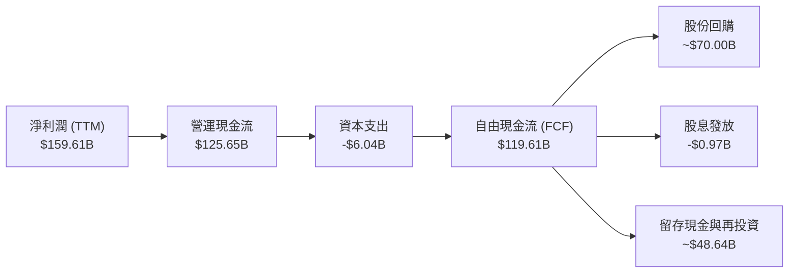

### 5.2 FCF 轉換率趨勢

| 財政年度 | 淨利潤 (Net Income) | 自由現金流 (FCF) | FCF / 淨利潤 轉換率 | 評估 |
|----------|---------------------|------------------|---------------------|------|
| **FY 2023** | $4.37B | $3.81B | 87.18% | 轉型期，現金流保持健康 |
| **FY 2024** | $29.76B | $27.02B | 90.79% | AI 爆發元年，現金快速回流 |
| **FY 2025** | $72.88B | $60.85B | 83.49% | 因預付台積電產能訂金，暫時壓低轉換率 |
| **FY 2026** | $120.07B | $96.68B | **80.52%** | 存貨備料增加（Blackwell 晶片），符合預期 |
| **TTM** | **$159.61B** | **$119.61B** | **74.94%** | 轉換率維持在高水位，現金生成能力極強 |

### 5.3 自由現金流趨勢

```
╔══════════════════════════════════════════════════════════════════╗
║                 NVDA 年度自由現金流 (FCF) 趨勢                   ║
╠══════════════════════════════════════════════════════════════════╣
║                                                                  ║
║  FY 2023  $3.81B    █░░░░░░░░░░░░░░░░░░░░░░░░░                   ║
║  FY 2024  $27.02B   ██████░░░░░░░░░░░░░░░░░░░░   YoY: +609.2% 🟢 ║
║  FY 2025  $60.85B   █████████████░░░░░░░░░░░░░   YoY: +125.2% 🟢 ║
║  FY 2026  $96.68B   █████████████████████░░░░░   YoY: +58.9%  🟢 ║
║  TTM      $119.61B  ██████████████████████████   YoY: +23.7%  🟢 ║
║                                                                  ║
║  📊 當前 FCF 收益率 (FCF Yield)：2.41% (相較於 4.97T 市值)       ║
╚══════════════════════════════════════════════════════════════════╝
```

### 5.4 資本配置評估

NVIDIA 的資本配置策略非常明確：優先保證研發投入以維持絕對技術領先，其次進行大規模的股份回購以回饋股東，股息則維持在象徵性水平。

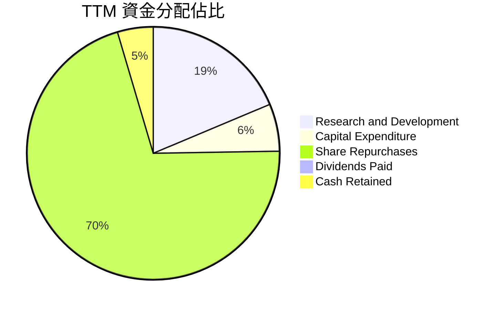

*   **股份回購**：TTM 股份回購金額高達約 **$70.00B**，能有效抵消員工股權激勵產生的稀釋效應，並向市場傳遞管理層對股價的信心。
*   **股息發放**：年股息支出僅 **$974M**，股息殖利率（Dividend Yield）雖然名義上因股價上漲而降至很低，但派息率（Payout Ratio）僅為 **0.6%**，留存利潤極其充裕。

---

## 6. 獲利能力與資本效率

NVIDIA 的資本回報率（ROIC 與 ROE）在萬億美元市值的公司中是前所未有的。這表明該公司不僅僅是踩中了 AI 風口，更具備極其高效的資產運營能力。

### 6.1 ROE / ROA / ROIC 趨勢

| 效率指標 | FY 2024 | FY 2025 | FY 2026 | TTM (最新) | 行業均值 | 評估 |
|----------|---------|---------|---------|------------|----------|------|
| **ROE (股東權益報酬率)** | 69.2% | 91.9% | 76.3% | **114.3%** | ~15.2% | 股東資金回報率極其恐怖 |
| **ROA (總資產報酬率)** | 45.3% | 65.3% | 58.1% | **52.7%** | ~8.5% | 資產利用效率遠超傳統硬體廠 |
| **ROIC (投入資本報酬率)** | 58.5% | 85.6% | 72.1% | **116.9%** | ~12.1% | 核心業務極具吸金能力 |

### 6.2 ROIC vs WACC 分析（核心價值創造判斷）

ROIC (投入資本報酬率) 與 WACC (加權平均資本成本) 的差額（稱為經濟增值 EVA）是衡量一家公司是否在為股東創造價值的終極指標。

```
╔══════════════════════════════════════════════════════════════════╗
║                  ROIC vs WACC 深度分析 (TTM)                     ║
╠══════════════════════════════════════════════════════════════════╣
║                                                                  ║
║  WACC 估算：                                                     ║
║  ├── 無風險利率 (10Y 美債)：   4.25%                             ║
║  ├── 市場風險溢酬 (ERP)：      5.00%                             ║
║  ├── Beta 係數：               2.20                              ║
║  ├── 股權成本 (CAPM)：         4.25% + 2.20 × 5.00% = 15.25%     ║
║  ├── 債務成本 (稅後)：         ~4.50%                            ║
║  ├── 資本結構：                股權 99.7%，債務 0.3%             ║
║  └── ✅ WACC ≈ 15.10%                                           ║
║                                                                  ║
║  ROIC 估算：                                                     ║
║  ├── NOPAT = TTM 營業利潤 $162.29B × (1 - 15.75% 稅率) = $136.73B║
║  ├── 投入資本 = 股東權益 $157.29B + 債務 $12.81B - 現金 $53.17B  ║
║  │            = $116.93B                                         ║
║  └── ✅ ROIC ≈ 116.93%                                           ║
║                                                                  ║
║  ★ 經濟價值增加 (EVA) = ROIC - WACC = +101.83%                  ║
║                                                                  ║
║  ROIC  116.93% ▓▓▓▓▓▓▓▓▓▓▓▓▓▓▓▓▓▓▓▓▓▓▓▓▓▓  🟢             ║
║  WACC   15.10% ▓▓▓░░░░░░░░░░░░░░░░░░░░░░░░░  ──             ║
║  EVA  +101.83% ██████████████████████████  🏆 歷史級價值創造 ║
║                                                                  ║
║  📊 結論：NVDA 的 ROIC 是 WACC 的 7.7 倍！這意味著公司每投入     ║
║     1 美元的資本，能創造出遠超其資本成本的超額收益。             ║
╚══════════════════════════════════════════════════════════════════╝
```

### 6.3 杜邦三因素分解

透過杜邦分析，我們可以拆解 NVIDIA 高 ROE 的底層驅動因素：

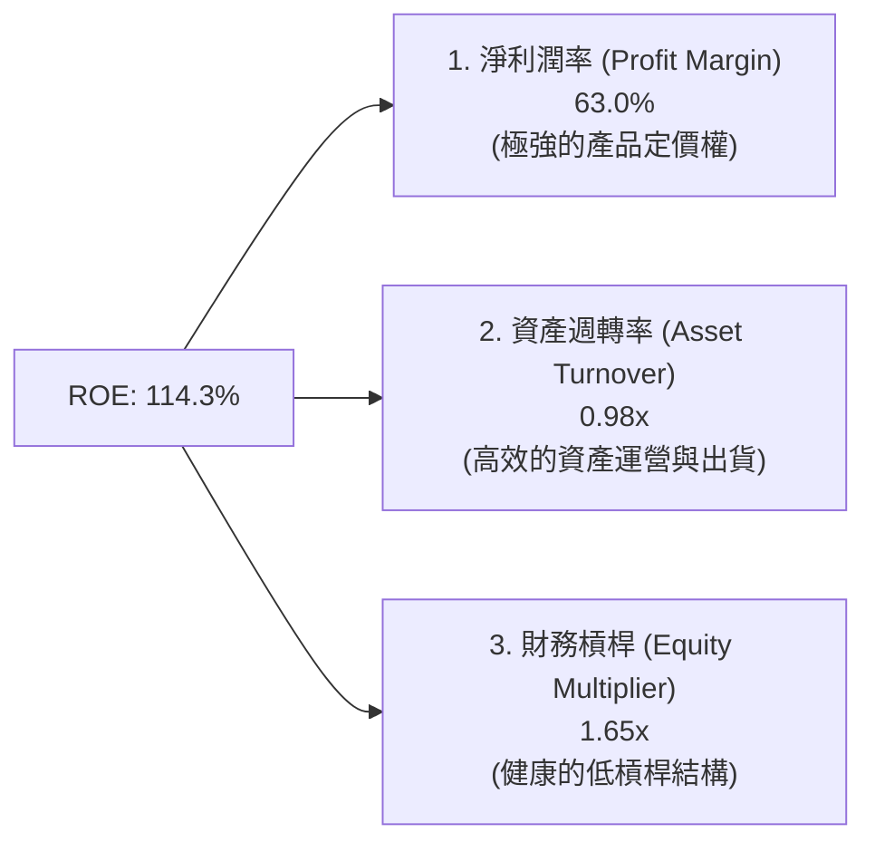

*   **分析**：NVIDIA 的高 ROE 並非依賴財務槓桿（EM 僅 1.65x，非常安全），而是完全由**高達 63.0% 的淨利潤率**和**接近 1.0x 的高資產週轉率**共同驅動。這是最健康的獲利模式。

### 6.4 獲利能力儀表板

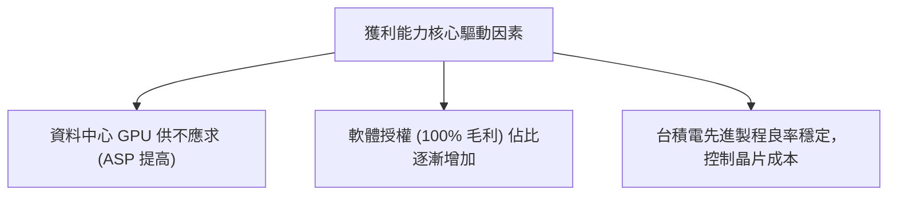

---

## 7. 估值深度分析

儘管 NVIDIA 的股價在過去兩年大幅上漲，但得益於盈餘（EPS）更為瘋狂的增長，其估值倍數實際上比 2023 年 AI 爆發初期還要**便宜**。

### 7.1 同業估值比較表格

我們選取了半導體與算力領域最直接的競爭對手進行橫向對比：

| 估值指標 | **NVIDIA (NVDA)** | **AMD (AMD)** | **Broadcom (AVGO)** | **Intel (INTC)** | 評估與結論 |
|----------|----------|---------|---------|---------|-----------|
| **當前股價** | **$205.19** | $165.20 | $1,420.00 | $30.15 | — |
| **總市值** | **$4.97T** | $267.30B | $660.40B | $128.50B | NVIDIA 市值反映了其絕對龍頭溢價 |
| **Trailing P/E** | **31.42x** | 68.50x | 48.20x | 95.10x | NVIDIA 歷史市盈率顯著低於 AMD | 🟢 具備吸引力 |
| **Forward P/E** | **16.12x** | 28.40x | 24.50x | 18.20x | **前瞻 P/E 僅 16.12x**，極具安全邊際 | 🟢 極度便宜 |
| **PEG Ratio** | **0.63x** | 1.85x | 1.60x | N/A | **PEG 僅 0.63x** (低於 1.0 即為嚴重低估) | 🟢 嚴重低估 |
| **P/S Ratio** | **19.61x** | 11.20x | 14.80x | 2.30x | 銷量市售率偏高，反映了其極高的利潤率 | 🟡 偏高 |
| **EV / EBITDA** | **29.76x** | 42.10x | 31.50x | 15.40x | 考慮到現金儲備後，企業價值倍數合理 | 🟢 合理 |

### 7.2 歷史估值區間分析

在過去五年中，NVIDIA 的 Trailing P/E 歷史中位數為 **45.0x**，最高曾達到 **110x**。當前 **31.42x** 的 Trailing P/E 處於歷史估值區間的**下四分位數（25th Percentile）**，表明市場尚未完全定價其 Blackwell 世代的成長潛力。

```
╔══════════════════════════════════════════════════════════════════╗
║               NVDA 歷史 P/E 區間與當前位置                       ║
╠══════════════════════════════════════════════════════════════════╣
║                                                                  ║
║  [15x] ─── [31.42x 當前] ─────── [45x 中位數] ─────────── [110x 最大]║
║               ▲                                                  ║
║               └─── 當前估值顯著低於歷史均值，安全邊際充足。      ║
╚══════════════════════════════════════════════════════════════════╝
```

### 7.3 DCF 敏感性分析（6格目標價矩陣）

基於基準情境假設：未來 5 年營收 CAGR 為 **35%**，終端成長率為 **3.0%**，稅後折現率（WACC）基準為 **15.1%**。

| 營收成長率情境 | **WACC = 13.5%** | **WACC = 15.1% (基準)** | **WACC = 16.5%** |
|------|--------------|----------------------|--------------|
| 🟢 **樂觀 (CAGR 45%)** | **$415.20** (+102.3%) | **$368.50** (+79.6%) | **$322.10** (+57.0%) |
| 🟡 **基準 (CAGR 35%)** | **$335.80** (+63.7%) | **$298.93** (+45.7%) | **$262.40** (+27.9%) |
| 🔴 **悲觀 (CAGR 20%)** | **$210.50** (+2.6%) | **$180.00** (-12.3%) | **$155.30** (-24.3%) |

### 7.4 估值綜合區間

```
╔══════════════════════════════════════════════════════════════════╗
║                    NVDA 估值區間定位                             ║
╠══════════════════════════════════════════════════════════════════╣
║                                                                  ║
║  悲觀目標價 (Bear Case)： $180.00                                ║
║  當前股價 (Current)：     $205.19                                ║
║  華爾街共識目標價 (Mean)：$298.93                                ║
║  樂觀目標價 (Bull Case)： $500.00                                ║
║                                                                  ║
║  [ $180.00 ] ─── [ $205.19 當前 ] ───────────── [ $298.93 ] ─── [ $500.00 ]║
║                       ▲                                          ║
║                       └─── 當前股價極度接近悲觀估值，下行空間有限║
╚══════════════════════════════════════════════════════════════════╝
```

---

## 8. 成長催化劑

NVIDIA 的成長故事並未結束，未來 12-24 個月內有多個強大的催化劑將推動其業績超越預期。

### 8.1 催化劑時間軸

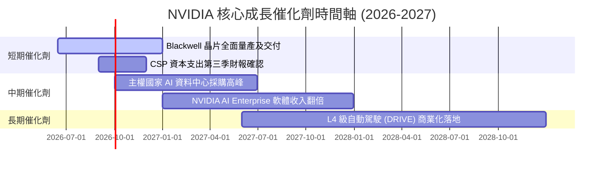

### 8.2 TAM (潛在市場規模) 分析

```
╔══════════════════════════════════════════════════════════════════╗
║               NVIDIA 2028 年 TAM 估算與滲透率                    ║
╠══════════════════════════════════════════════════════════════════╣
║                                                                  ║
║  1. 資料中心算力 (AI Chips & Systems)：                          ║
║     ├── 預估 TAM：  $400B                                        ║
║     └── NVDA 滲透率：~85%  (貢獻營收 ~$340B)                     ║
║                                                                  ║
║  2. 企業級軟體與 SaaS (NVIDIA AI Enterprise)：                  ║
║     ├── 預估 TAM：  $150B                                        ║
║     └── NVDA 滲透率：~10%  (貢獻營收 ~$15B)                      ║
║                                                                  ║
║  3. 自動駕駛與機器人 (DRIVE & Isaac)：                           ║
║     ├── 預估 TAM：  $100B                                        ║
║     └── NVDA 滲透率：~15%  (貢獻營收 ~$15B)                      ║
║                                                                  ║
║  📊 總計 2028 年潛在 TAM 高達 $650B，NVDA 仍有巨大的增長空間。   ║
╚══════════════════════════════════════════════════════════════════╝
```

### 8.3 成長驅動力結構圖

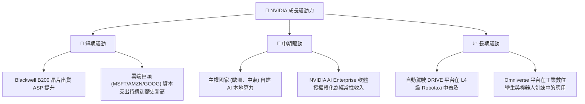

---

## 9. 風險矩陣

儘管 NVIDIA 前景光明，但作為萬億級巨人，其面臨的系統性與非系統性風險亦不容忽視。

### 9.1 風險評分矩陣

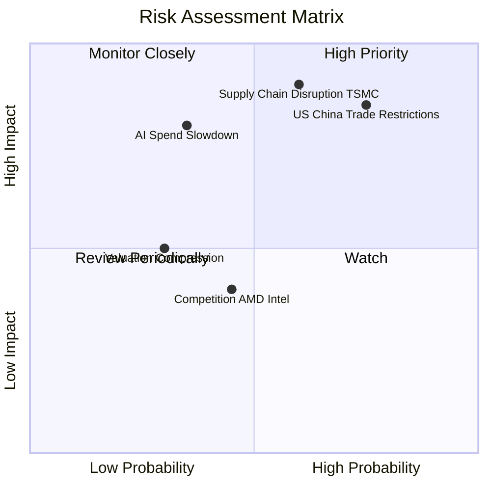

### 9.2 風險清單詳細分析

| # | 風險項目 | 發生機率 | 財務衝擊 | 風險評分 | 具體緩解措施 |
|---|----------|----------|----------|----------|--------------|
| 1 | 🔴 **地緣政治與出口管制** | 高 (75%) | 高 (-15% 營收) | 🔴 **8.5/10** | 開發符合出口管制法規的專用晶片（如 H20/L20 衍生系列），並開拓歐洲與東南亞等非管制市場。 |
| 2 | 🔴 **供應鏈過度集中（台積電）** | 中高 (60%) | 極高 (-30% 出貨) | 🔴 **8.0/10** | 積極與台積電美國廠、日本廠合作，並探索 Intel Foundry 或是三星作為次要封裝代工來源的可能性。 |
| 3 | 🟡 **AI 資本支出放緩** | 中低 (35%) | 高 (-20% 營收) | 🟡 **6.0/10** | 推動客戶從「基礎模型訓練」轉向「商業化推理（Inference）」，推理對晶片性價比要求更剛性，有利於維持需求。 |
| 4 | 🟡 **競爭對手蠶食份額** | 中 (45%) | 中 (-5% 份額) | 🟡 **5.0/10** | 透過每 12 個月更新一次晶片架構（Hopper → Blackwell → Rubin）的超快節奏，保持領先 AMD 與 ASIC 兩代以上的技術優勢。 |

---

## 10. 投資建議

基於對 NVIDIA 基本面、財務數據、估值模型及行業趨勢的深度分析，我們給出 **強烈買入 (Strong Buy)** 的最終評級。

### 10.1 最終綜合評級

```
╔══════════════════════════════════════════════════════════════╗
║                    NVDA 最終綜合評級                         ║
╠══════════════════════════════════════════════════════════════╣
║ 基本面強度    9.5/10  ▓▓▓▓▓▓▓▓▓▓▓▓▓▓▓▓▓▓▓░  🏆 行業標桿    ║
║ 獲利質量      9.8/10  ▓▓▓▓▓▓▓▓▓▓▓▓▓▓▓▓▓▓▓░  🟢 極致利潤率  ║
║ 財務健康度    9.5/10  ▓▓▓▓▓▓▓▓▓▓▓▓▓▓▓▓▓▓▓░  🟢 現金充沛    ║
║ 估值吸引力    8.5/10  ▓▓▓▓▓▓▓▓▓▓▓▓▓▓▓▓░░░░  🟢 PEG 嚴重低估║
║ 成長潛力     