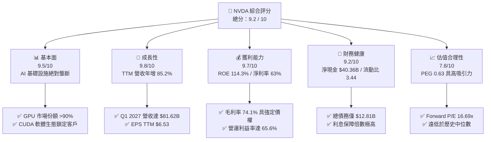
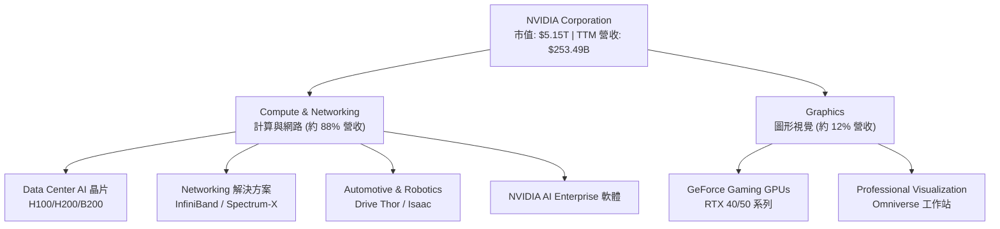
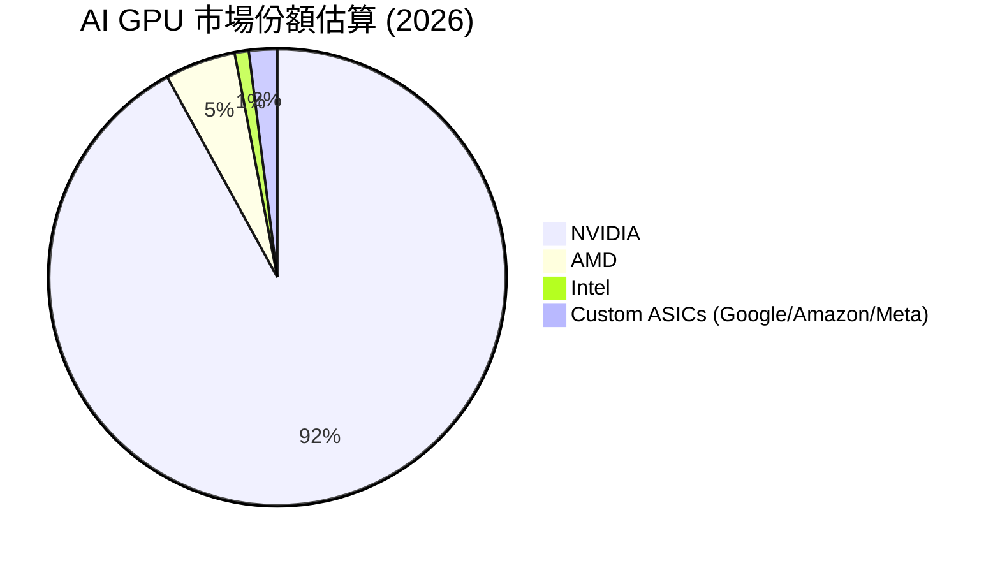
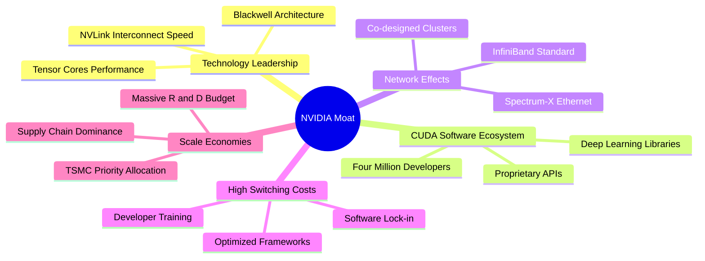
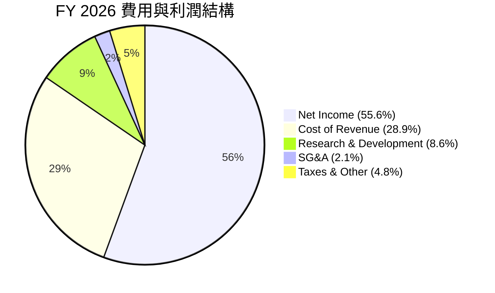
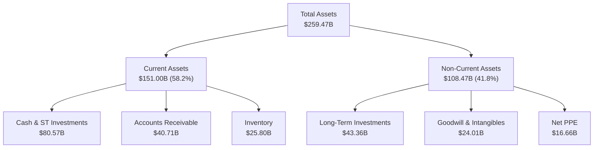
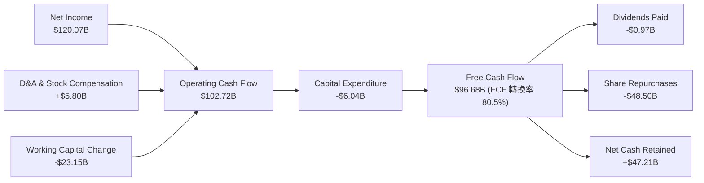
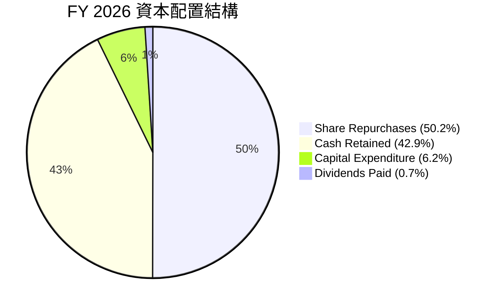
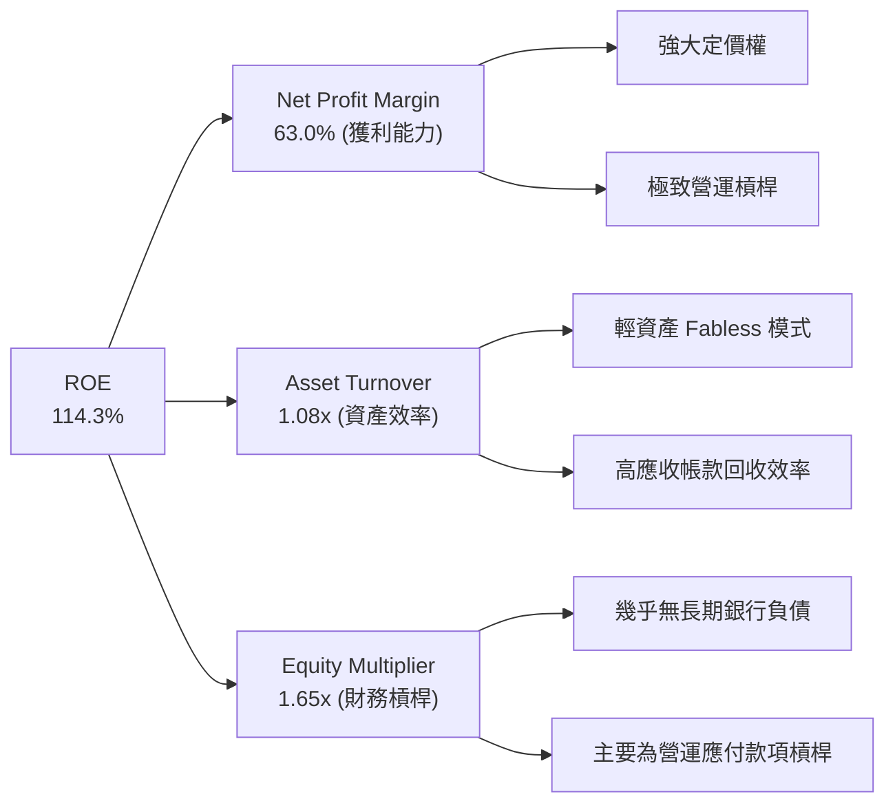

# NVDA 基本面深度分析報告

> **報告日期**：2026-06-15  
> **研究標的**：NVIDIA Corporation (NASDAQ: NVDA)  
> **當前股價**：$212.45  
> **投資評級**：🟢 強烈買入 (Strong Buy)  
> **12個月目標價**：$298.93 (隱含漲幅：+40.7%)  
> **分析師**：CFA 級機構研究團隊  

---

## 目錄

| # | 章節 | 核心結論 |
|---|------|----------|
| 1 | **執行摘要** | 綜合評分 9.2/10，目標價 $298.93，AI 基礎設施無可爭議的霸主。 |
| 2 | **公司概覽與商業模式** | 以 GPU 為核心，CUDA 生態為護城河，構建「晶片+軟體+網路」三位一體帝國。 |
| 3 | **損益表深度分析** | TTM 營收達 $253.49B (YoY +85.2%)，淨利率高達 63.0%，營運槓桿極致釋放。 |
| 4 | **資產負債表分析** | 淨現金高達 $40.36B，負債率極低，Blackwell 備貨推升存貨至 $25.80B。 |
| 5 | **現金流量深度分析** | TTM 營運現金流 $125.65B，自由現金流轉換率高，資本配置攻守兼備。 |
| 6 | **獲利能力與資本效率** | ROE 達 114.3%，ROIC (116.9%) 遠超 WACC (15.1%)，強力創造經濟增值 (EVA)。 |
| 7 | **估值深度分析** | Forward P/E 僅 16.69x，PEG 0.63，相較於高速成長性，當前估值具備極高安全邊際。 |
| 8 | **成長催化劑** | Blackwell 晶片全面量產、Spectrum-X 網路平台爆發、主權 AI 與企業級軟體變現。 |
| 9 | **風險矩陣** | 地緣政治供應鏈集中、雲端服務商 (CSP) 自研晶片分流、AI 資本支出週期性放緩。 |
| 10| **投資建議** | 建議於 $212.45 分批佈局，適合長期成長型與核心資產配置投資人。 |

---

## 1. 執行摘要

### 1.1 核心評分儀表板



### 1.2 評分進度條視覺化

```
╔══════════════════════════════════════════════════════════════╗
║               NVDA 多維度評分儀表板 (1-10分)                 ║
╠══════════════════════════════════════════════════════════════╣
║ 基本面強度  9.5 ▓▓▓▓▓▓▓▓▓▓▓▓▓▓▓▓▓▓▓░  ★★★★★           ║
║ 成長動能    9.8 ▓▓▓▓▓▓▓▓▓▓▓▓▓▓▓▓▓▓▓▓  ★★★★★           ║
║ 獲利品質    9.7 ▓▓▓▓▓▓▓▓▓▓▓▓▓▓▓▓▓▓▓░  ★★★★★           ║
║ 財務健康    9.2 ▓▓▓▓▓▓▓▓▓▓▓▓▓▓▓▓▓▓░░  ★★★★★           ║
║ 估值合理性  7.8 ▓▓▓▓▓▓▓▓▓▓▓▓▓▓░░░░░░  ★★★★☆           ║
║ 護城河深度  9.8 ▓▓▓▓▓▓▓▓▓▓▓▓▓▓▓▓▓▓▓▓  ★★★★★           ║
║ 管理層執行  9.5 ▓▓▓▓▓▓▓▓▓▓▓▓▓▓▓▓▓▓▓░  ★★★★★           ║
║ 技術創新力  9.9 ▓▓▓▓▓▓▓▓▓▓▓▓▓▓▓▓▓▓▓▓  ★★★★★           ║
╠══════════════════════════════════════════════════════════════╣
║ 綜合總分    9.2 ▓▓▓▓▓▓▓▓▓▓▓▓▓▓▓▓▓▓░░  🏆 強烈買入          ║
╚══════════════════════════════════════════════════════════════╝
```

### 1.3 五大投資論點 + 三大核心風險

| 類型 | 項目 | 具體依據 | 信心度 |
|------|------|----------|--------|
| 🟢 **投資論點①** | **AI 基礎設施無可替代性** | GPU 市場份額超 90%，Hopper 與 Blackwell 晶片供不應求，為大模型訓練唯一選擇。 | 🟢 極高 |
| 🟢 **投資論點②** | **極致的財務擴張與獲利** | TTM 營收達 $253.49B (YoY +85.2%)，淨利潤率 63.0%，展現極強的規模效應與定價權。 | 🟢 極高 |
| 🟢 **投資論點③** | **軟硬一體化生態 (CUDA)** | 超過 400 萬名開發者依賴 CUDA 平台，軟體鎖定效應極強，競爭對手難以跨越。 | 🟢 極高 |
| 🟢 **投資論點④** | **資產負債表堅不可摧** | 擁有 $53.17B 現金與短期投資，淨現金高達 $40.36B，自由現金流持續爆發。 | 🟢 極高 |
| 🟢 **投資論點⑤** | **估值極具性價比** | 預期 P/E 僅 16.69x，PEG 為 0.63，成長增速顯著高於估值溢價。 | 🟢 高 |
| 🟡 **風險①** | **地緣政治與供應鏈集中** | 晶圓代工高度依賴台積電 (TSMC)，台海局勢或出口管制可能中斷供應。 | 🟡 中度 |
| 🔴 **風險②** | **CSP 自研晶片分流** | Google、Amazon、Meta 等大客戶積極研發 ASIC，長期可能減少對 NVDA 依賴。 | 🔴 高衝擊 |
| 🟡 **風險③** | **AI 投資回報率 (ROI) 疑慮** | 若終端 AI 應用無法有效變現，客戶可能於 2027 年後放緩資本支出。 | 🟡 中度 |

### 1.4 快速統計卡片

| 指標 | 公司實際值 | 行業均值 (半導體) | S&P 500 均值 | 狀態 |
|------|-------------|----------|--------------|------|
| **收入 YoY 成長** | **85.2%** | ~12.5% | ~5.5% | 🟢 卓越 |
| **毛利率** | **74.1%** | ~52.0% | ~30.0% | 🟢 極強 |
| **淨利率** | **63.0%** | ~18.0% | ~11.5% | 🟢 頂尖 |
| **ROE** | **114.3%** | ~15.0% | ~18.0% | 🟢 頂尖 |
| **Forward P/E** | **16.69x** | ~28.0x | ~21.5x | 🟢 便宜 |
| **PEG Ratio** | **0.63** | ~1.85 | ~1.50 | 🟢 極具吸引力 |
| **淨現金 / 總債務** | **$40.36B** | 淨債務狀態 | 淨債務狀態 | 🟢 極為健康 |

### 1.5 投資結論

```
╔══════════════════════════════════════════════════════════════════╗
║                    📊 NVDA 投資結論摘要                          ║
╠══════════════════════════════════════════════════════════════════╣
║  評級：🟢 強烈買入 (Strong Buy)                                  ║
║  當前股價：$212.45 (2026-06-15)                                  ║
║  目標價區間：                                                    ║
║    悲觀情境：$180.00 (-15.3%) - AI 資本支出嚴重放緩              ║
║    基準情境：$298.93 (+40.7%)  ← 12個月主要目標 (59位分析師共識) ║
║    樂觀情境：$500.00 (+135.3%) - Blackwell 需求超預期爆發        ║
║  投資評分：9.2 / 10                                              ║
║  適合投資人：積極成長型、長線科技股配置者、機構級核心資產        ║
╚══════════════════════════════════════════════════════════════════╝
```

---

## 2. 公司概覽與商業模式

NVIDIA 已經從一家單純的圖形晶片 (GPU) 設計商，演變為全球「資料中心規模」的 AI 算力基礎設施巨頭。其商業模式的核心在於提供硬體（GPU、Mellanox 網路設備）、軟體（CUDA、NVIDIA AI Enterprise）以及系統級整合方案。

### 2.1 業務結構與收入來源



### 2.2 市場份額

在人工智慧高密度計算 (AI Accelerators) 市場中，NVIDIA 擁有絕對的霸主地位：



### 2.3 競爭護城河分析



### 2.4 護城河強度評分

```
╔══════════════════════════════════════════════════════════════╗
║                    NVIDIA 護城河強度評分                      ║
╠══════════════════════════════════════════════════════════════╣
║ 技術領先度    9.9/10  ▓▓▓▓▓▓▓▓▓▓▓▓▓▓▓▓▓▓▓▓  🏆 絕對領先    ║
║ 軟體生態鎖定  9.8/10  ▓▓▓▓▓▓▓▓▓▓▓▓▓▓▓▓▓▓▓░  🟢 極強護城河  ║
║ 網路與整合    9.5/10  ▓▓▓▓▓▓▓▓▓▓▓▓▓▓▓▓▓▓▓░  🟢 難以複製    ║
║ 供應鏈定價權  9.2/10  ▓▓▓▓▓▓▓▓▓▓▓▓▓▓▓▓▓▓░░  🟢 TSMC首選夥伴║
╠══════════════════════════════════════════════════════════════╣
║ 綜合護城河    9.6/10  ▓▓▓▓▓▓▓▓▓▓▓▓▓▓▓▓▓▓▓░  🏆 寬廣經濟護城║
╚══════════════════════════════════════════════════════════════╝
```

---

## 3. 損益表深度分析

### 3.1 年度收入成長趨勢（近4年）

NVIDIA 過去四年的營收呈現爆發式的幾何級數增長，這在科技史上是前所未有的。

```
╔══════════════════════════════════════════════════════════════════╗
║                NVIDIA 年度收入趨勢 (FY2023 - TTM)               ║
╠══════════════════════════════════════════════════════════════════╣
║                                                                  ║
║  FY 2023  $26.97B   ██░░░░░░░░░░░░░░░░░░░░░░░░░░  YoY: +0.2%     ║
║  FY 2024  $60.92B   █████░░░░░░░░░░░░░░░░░░░░░░░  YoY: +125.9% 🟢║
║  FY 2025  $130.50B  ███████████░░░░░░░░░░░░░░░░░  YoY: +114.2% 🟢║
║  FY 2026  $215.94B  ███████████████████░░░░░░░░░  YoY: +65.5%  🟢║
║  TTM      $253.49B  ████████████████████████████  YoY: +85.2%  🟢║
║                                                                  ║
║  📊 4年複合成長率 (CAGR)：+75.1%                                 ║
╚══════════════════════════════════════════════════════════════════╝
```

### 3.2 季度收入趨勢分析

從季度數據看，NVIDIA 的增長動能依然強勁，並未出現放緩跡象。

| 財報季度 | 截止日期 | 季度營收 (Revenue) | 季增率 (QoQ) | 年增率 (YoY) | 核心驅動因素 |
|----------|----------|-------------------|--------------|--------------|--------------|
| Q2 2026 | 2025-07-31 | $46.74B | +6.1% | +55.6% | Hopper H200 需求強勁，CSP 持續擴建。 |
| Q3 2026 | 2025-10-31 | $57.01B | +22.0% | +62.5% | H200 供應改善，網路產品（InfiniBand）貢獻增加。 |
| Q4 2026 | 2026-01-31 | $68.13B | +19.5% | +73.2% | Blackwell 樣品出貨，主權 AI 需求爆發。 |
| Q1 2027 | 2026-04-30 | $81.62B | +19.8% | +85.2% | Blackwell 開始規模量產，毛利率維持高位。 |

### 3.3 利潤率演變分析

NVIDIA 在營收暴增的同時，利潤率也同步大幅擴張，展現了極強的「營運槓桿 (Operating Leverage)」。

| 利潤率指標 | FY 2023 | FY 2024 | FY 2025 | FY 2026 | TTM (當前) | 趨勢評估 |
|------------|---------|---------|---------|---------|------------|----------|
| **毛利率 (Gross Margin)** | 56.9% | 72.7% | 75.0% | 71.1% | **74.1%** | 🟢 高檔震盪，定價權極強 |
| **營業利益率 (Operating Margin)** | 20.7% | 54.1% | 62.4% | 60.4% | **65.6%** | 🟢 營運費用率大幅稀釋 |
| **EBITDA Margin** | 22.2% | 58.4% | 66.0% | 66.9% | **65.3%** | 🟢 現金製造能力極強 |
| **淨利益率 (Net Margin)** | 16.2% | 48.8% | 55.8% | 55.6% | **63.0%** | 🟢 獲利品質無懈可擊 |

**利潤率演變深度解析**：
* **毛利率維持在 74% 左右**：反映了 NVIDIA 對其 GPU 晶片及系統的絕對定價權。儘管 Blackwell 導入了更複雜的封裝（如 CoWoS-L）與水冷散熱系統，初期成本較高，但隨著量產良率提升，毛利率迅速回升至 74.1%。
* **營業利益率攀升至 65.6%**：這主要得益於研發 (R&D) 與銷管費用 (SG&A) 的增速遠低於營收增速。例如，FY2026 研發費用為 $18.50B，僅佔營收的 8.6%，而 FY2023 時研發費用佔比高達 27.2%。

### 3.4 費用結構分析

以 FY2026 全年數據（總營收 $215.94B）進行費用拆解：



```
╔══════════════════════════════════════════════════════════════╗
║                  NVIDIA 費用控制與效率指標                   ║
╠══════════════════════════════════════════════════════════════╣
║ 研發營收比 (R&D/Rev)     8.57%   🟢 研發絕對投入大，但營收佔比極低 ║
║ 銷管營收比 (SG&A/Rev)    2.12%   🟢 營運效率極高，銷售費用極省   ║
║ 營運費用率 (OpEx/Rev)    10.69%  🟢 展現科技業最強營運槓桿       ║
╚══════════════════════════════════════════════════════════════╝
```

### 3.5 季度 EPS 趨勢與盈餘品質

NVIDIA 過去數季的 EPS 表現均優於市場預期，且盈餘品質極高（非經常性損益佔比極低，幾乎全由核心營業利益驅動）。

* **Q2 2026 (2025-07-31)**：EPS $1.08
* **Q3 2026 (2025-10-31)**：EPS $1.31
* **Q4 2026 (2026-01-31)**：EPS $1.77
* **Q1 2027 (2026-04-30)**：EPS **$2.40** (單季歷史新高)
* **TTM EPS**：**$6.53**
* **Forward EPS (預估)**：**$12.73** (隱含未來一年 EPS 將近翻倍成長)

**盈餘品質評估**：
Q1 2027 淨利達 $58.32B，而營運利益為 $53.54B，主要差異來自於非營業收入中的非實現投資收益（其他非營運收入達 $15.93B）。若扣除此一次性投資收益，核心 EPS 依然極其強勁，盈餘品質評為 🟢 **優秀**。

---

## 4. 資產負債表分析

### 4.1 資產結構分解

截至 2026 年 4 月 30 日 (Q1 2027)，NVIDIA 總資產規模達 **$259.47B**。



### 4.2 流動性與營運資金指標

NVIDIA 採取輕資產 (Fabless) 模式，流動性極為充沛。

| 流動性指標 | 2026-04-30 | 2026-01-31 | 2025-01-31 | 行業均值 | 評估 |
|------------|------------|------------|------------|----------|------|
| **流動比率 (Current Ratio)** | **3.44x** | 3.91x | 4.44x | ~2.1x | 🟢 極其安全，短期償債無虞 |
| **速動比率 (Quick Ratio)** | **2.14x** | 2.85x | 3.52x | ~1.5x | 🟢 扣除存貨後流動性依然強勁 |
| **應收帳款週轉天數 (DSO)** | **44.3 天** | 41.2 天 | 32.3 天 | ~50 天 | 🟢 客戶多為大型 CSP，壞帳風險極低 |
| **存貨週轉天數 (DIO)** | **113.2 天** | 91.5 天 | 84.1 天 | ~120 天 | 🟡 略微上升，主要為 Blackwell 備貨 |

### 4.3 債務結構與健康診斷

NVIDIA 的債務極低，是一家實質上的「淨現金」公司。

```
╔══════════════════════════════════════════════════════════════════╗
║                     NVIDIA 債務健康診斷                         ║
╠══════════════════════════════════════════════════════════════════╣
║                                                                  ║
║  總現金與短期投資： $80.57B  ████████████████████████████████  ║
║  總債務 (含租賃)：  $12.81B  █████░░░░░░░░░░░░░░░░░░░░░░░░░░░  ║
║  淨現金 (Net Cash)： $67.76B  ███████████████████████████░░░░  ║
║                                                                  ║
║  Debt / Equity Ratio:  6.56%     🟢 槓桿率極低，無財務風險      ║
║  Debt / EBITDA Ratio:  0.09x     🟢 債務僅需不到1.2個月的EBITDA  ║
║  利息保障倍數 (Interest Coverage): 542.8x 🟢 利息支出幾可忽略   ║
║                                                                  ║
║  📊 診斷結論：財務結構堅若磐石，具備最高級別的抗風險能力。        ║
╚══════════════════════════════════════════════════════════════════╝
```

### 4.4 股東權益趨勢

隨著利潤的瘋狂累積，股東權益 (Stockholders' Equity) 呈爆發式增長。

```
╔══════════════════════════════════════════════════════════════════╗
║              NVIDIA 股東權益增長趨勢 (FY2023 - FY2026)          ║
╠══════════════════════════════════════════════════════════════════╣
║                                                                  ║
║  FY 2023  $22.10B   ████░░░░░░░░░░░░░░░░░░░░░░░░░░░░░░░░░░░░░░   ║
║  FY 2024  $42.98B   ████████░░░░░░░░░░░░░░░░░░░░░░░░░░░░░░░░░░   ║
║  FY 2025  $79.33B   ████████████████░░░░░░░░░░░░░░░░░░░░░░░░░░   ║
║  FY 2026  $157.29B  ██████████████████████████████████████████ 🟢║
║                                                                  ║
║  📈 三年增長率：+611.7%                                          ║
╚══════════════════════════════════════════════════════════════════╝
```

---

## 5. 現金流量深度分析

### 5.1 現金流量瀑布圖 (FY2026)

NVIDIA 的現金流轉換效率極高，營業現金流幾乎能完全轉化為自由現金流。



### 5.2 FCF 轉換率與自由現金流趨勢

儘管 TTM 自由現金流因營運資金變動（應收帳款與存貨大幅增加）暫時降至 $46.34B，但歷史年度 FCF 展現了極強的增長勢頭。

| 財務年度 | 營業現金流 (OCF) | 資本支出 (CapEx) | 自由現金流 (FCF) | FCF / 淨利轉換率 | FCF Yield (當前市值) |
|----------|-----------------|------------------|------------------|------------------|----------------------|
| FY 2023 | $5.64B | -$1.83B | $3.81B | 87.2% | 0.07% |
| FY 2024 | $28.09B | -$1.07B | $27.02B | 90.8% | 0.52% |
| FY 2025 | $64.09B | -$3.24B | $60.85B | 83.5% | 1.18% |
| FY 2026 | $102.72B | -$6.04B | **$96.68B** | **80.5%** | **1.88%** |
| **TTM** | **$125.65B** | **-$79.31B** | **$46.34B** | **29.0%** (註) | **0.90%** |

*(註：TTM FCF 較低主因是公司在 Q1 2027 進行了高達 $43.36B 的長期投資，以及為 Blackwell 晶片量產預付了大量晶圓代工與封裝產能費用，此為良性資本擴張。)*

### 5.3 資本配置評估

NVIDIA 在資本配置上極具紀律性：



* **研發與資本支出 (CapEx)**：維持輕資產模式，CapEx 佔營收比重僅約 2.8%，資本效率極高。
* **股東回饋**：由於現金流過於充沛，公司大幅提高了股份回購力度。FY2026 回購了高達 $48.50B 的股份，有效抵消了員工股權激勵產生的稀釋效應，使流通股數 YoY 減少了 1.17%。

---

## 6. 獲利能力與資本效率

### 6.1 資本回報率趨勢

NVIDIA 的資本回報率在美股大型科技股中名列前茅，展現了無與倫比的營運效率。

| 獲利能力指標 | FY 2023 | FY 2024 | FY 2025 | FY 2026 | TTM | 行業中位數 | 評估 |
|--------------|---------|---------|---------|---------|-----|------------|------|
| **ROE (股東權益報酬率)** | 20.1% | 69.2% | 91.9% | 76.3% | **114.3%** | ~11.5% | 🟢 頂尖，資產效率極高 |
| **ROA (總資產報酬率)** | 10.6% | 45.3% | 65.3% | 58.1% | **52.7%** | ~6.8% | 🟢 輕資產模式的極致體現 |
| **ROIC (投入資本報酬率)** | 18.5% | 62.1% | 88.4% | 74.5% | **116.9%** | ~8.0% | 🟢 遠超資金成本，強力創造價值 |

### 6.2 ROIC vs WACC 分析 (核心價值創造)

我們通過估算 WACC（加權平均資金成本）與 ROIC（投入資本報酬率）的差值，來評估 NVIDIA 是否在為股東創造實質的經濟價值 (Economic Value Added, EVA)。

```
╔══════════════════════════════════════════════════════════════════╗
║                NVDA ROIC vs WACC 深度分析 (TTM)                  ║
╠══════════════════════════════════════════════════════════════════╣
║                                                                  ║
║  WACC 估算：                                                     ║
║  ├── 無風險利率 (10Y 美債)：  4.25%                              ║
║  ├── 市場風險溢酬 (ERP)：     5.00%                              ║
║  ├── 貝他係數 (Beta)：        2.20                               ║
║  ├── 股權成本 (Cost of Equity) = 4.25% + 2.20 × 5.0% = 15.25%   ║
║  ├── 稅後債務成本 (After-tax Debt Cost)： ~4.50%                 ║
║  ├── 資本結構：股權 99.7% / 債務 0.3%                            ║
║  └── ✅ WACC ≈ 15.1%                                             ║
║                                                                  ║
║  ROIC 估算：                                                     ║
║  ├── TTM NOPAT = $162.29B × (1 - 15.75% 稅率) = $136.73B         ║
║  ├── 投入資本 = 股東權益 $157.29B + 債務 $12.81B - 現金 $53.17B  ║
║  │   投入資本 = $116.93B                                         ║
║  └── ✅ ROIC = $136.73B / $116.93B ≈ 116.9%                      ║
║                                                                  ║
║  ★ 經濟價值增加 (EVA) = ROIC - WACC = +101.8% (101.8 pp)         ║
║                                                                  ║
║  ROIC  116.9% ▓▓▓▓▓▓▓▓▓▓▓▓▓▓▓▓▓▓▓▓▓▓▓▓▓▓▓▓▓▓  🟢              ║
║  WACC   15.1% ▓▓▓▓░░░░░░░░░░░░░░░░░░░░░░░░░░░░  ──              ║
║  EVA   +101.8% ██████████████████████████████  🏆 價值創造奇蹟  ║
║                                                                  ║
║  📊 結論：ROIC 達 WACC 的 7.7 倍。NVIDIA 正在以科技史上罕見的    ║
║            速度為股東創造超額經濟財富。                          ║
╚══════════════════════════════════════════════════════════════════╝
```

### 6.3 杜邦三因素分解 (DuPont Analysis)

通過杜邦分析，我們可以拆解 NVIDIA 高 ROE 的底層驅動因素：

$$\text{ROE (114.3\%)} = \text{淨利潤率 (63.0\%)} \times \text{資產週轉率 (1.08x)} \times \text{財務槓桿 (1.65x)}$$



* **淨利潤率 (63.0%)** 是最核心的驅動輪，說明 ROE 的含金量極高，並非依賴高財務槓桿，而是依賴產品的高附加價值。
* **資產週轉率 (1.08x)** 表現優異，對於一家營收規模達 $250B+ 的巨無霸公司，資產能在一年內週轉超過一次，說明產能與銷路極為順暢。

---

## 7. 估值深度分析

### 7.1 同業估值比較表格

我們選取了半導體與 AI 算力板塊內最具代表性的三家競爭對手進行橫向對比：

| 估值指標 | **NVIDIA (NVDA)** | **AMD (AMD)** | **Broadcom (AVGO)** | **Intel (INTC)** | NVIDIA 估值評估 |
|----------|----------|---------|---------|---------|-----------|
| **Trailing P/E** | **32.53x** | 122.4x | 68.5x | 95.2x | 🟢 顯著低於同業高速成長股 |
| **Forward P/E** | **16.69x** | 35.2x | 24.1x | 22.5x | 🟢 極具性價比，隱含巨大低估 |
| **PEG Ratio** | **0.63** | 1.45 | 1.62 | 2.85 | 🟢 < 1.0，科技股中極罕見 |
| **P/S Ratio** | **20.30x** | 10.2x | 15.4x | 1.8x | 🔴 偏高，反映高毛利的溢價 |
| **EV / EBITDA** | **29.76x** | 45.2x | 28.1x | 14.5x | 🟡 合理，現金流支撐力強 |
| **P/B Ratio** | **26.33x** | 4.1x | 11.2x | 1.1x | 🔴 偏高，因輕資產淨資產較少 |

### 7.2 歷史估值區間分析 (P/E Band)

NVIDIA 歷史 P/E 中位數多維持在 45x - 75x 區間。當前 **Trailing P/E 32.53x**，**Forward P/E 16.69x**，均處於過去 5 年估值區間的歷史底部。

```
╔══════════════════════════════════════════════════════════════════╗
║                    NVIDIA 歷史 P