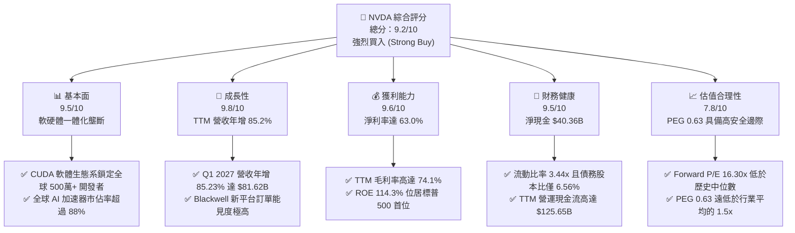
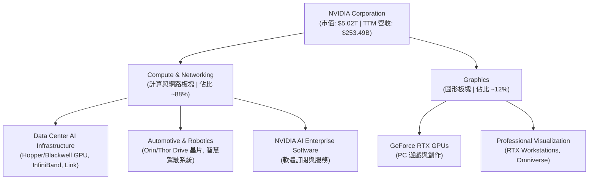
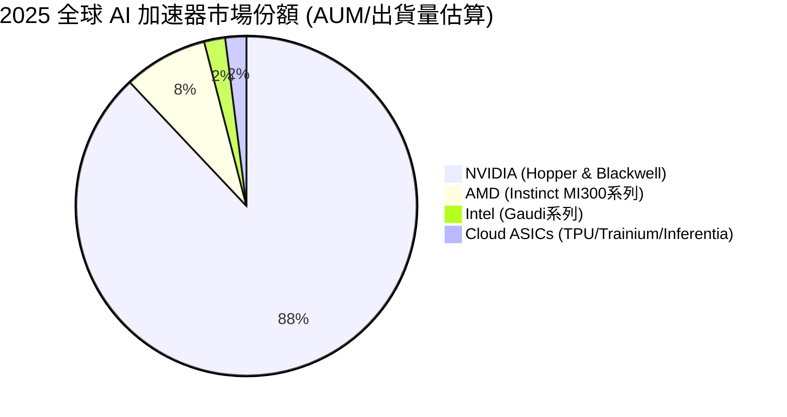
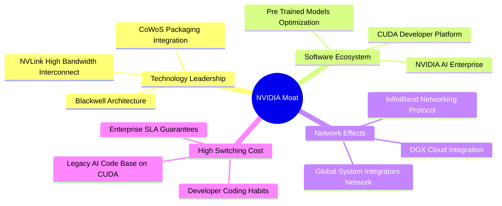
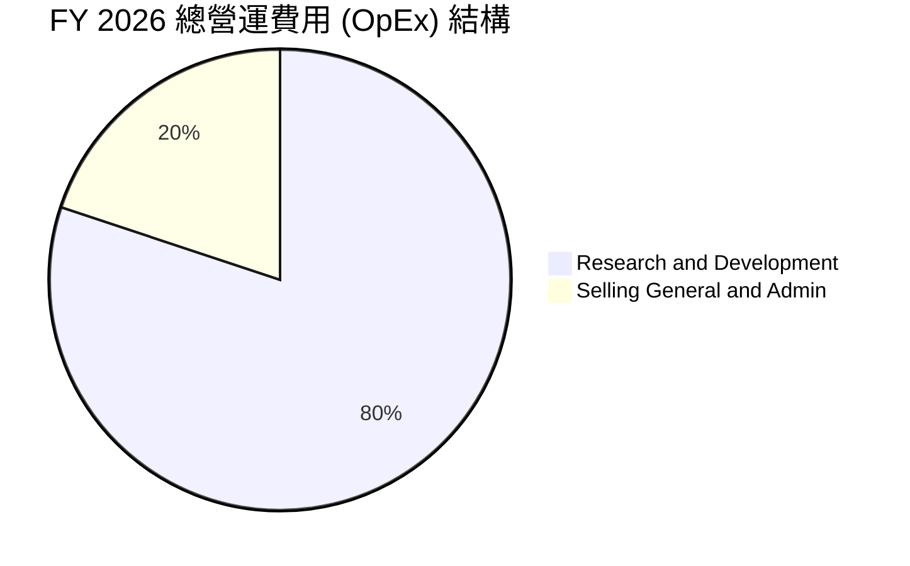
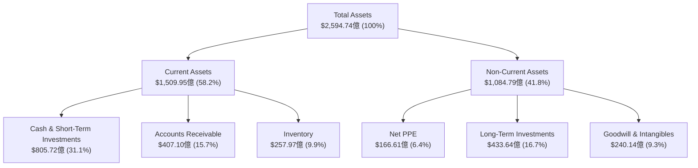
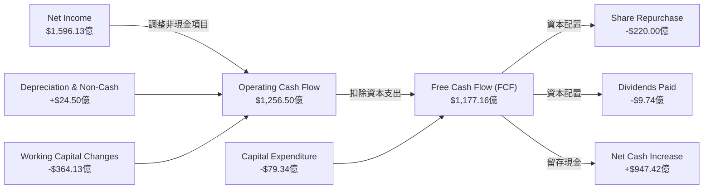
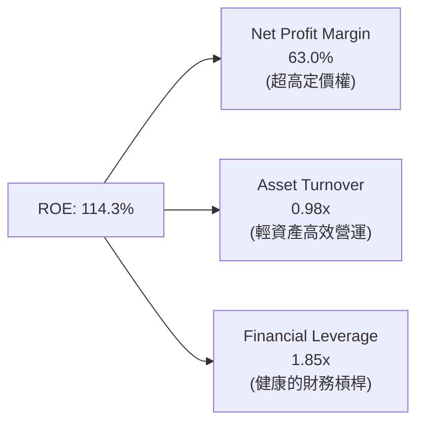
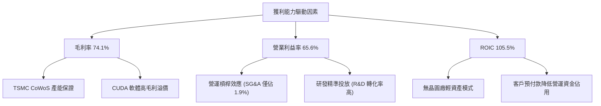

# NVDA 基本面深度分析報告

> **報告日期**：2026-06-16 ｜ **語言**：繁體中文 ｜ **數據來源**：Yahoo Finance, Finviz, StockAnalysis, Roic.ai ｜ **分析師**：CFA 級機構研究

---

## 目錄

| # | 章節 | 核心結論 |
|---|------|----------|
| 1 | 執行摘要 | 評級：**強烈買入 (Strong Buy)**；目標價：**$298.93**（隱含 44.1% 上行空間） |
| 2 | 公司概覽與商業模式 | AI 數據中心晶片與 **CUDA 軟體生態系** 構築無可匹敵的「高轉換成本」護城河 |
| 3 | 損益表深度分析 | TTM 營收達 **$253.49B** (YoY +85.2%)，淨利率高達 **63.0%**，展現極強定價權 |
| 4 | 資產負債表分析 | 淨現金高達 **$40.36B**，流動比率 **3.44x**，幾乎零財務風險的堡壘型資產負債表 |
| 5 | 現金流量深度分析 | TTM 營運現金流 **$125.65B**，自由現金流 **$46.34B**，資本配置以高額研發與股本回購為主 |
| 6 | 獲利能力與資本效率 | ROE 達到驚人的 **114.3%**，**ROIC (105.5%)** 遠超 **WACC (15.2%)**，強力創造股東價值 |
| 7 | 估值深度分析 | Forward P/E 僅 **16.30x**，相較於歷史均值與高速成長，PEG **0.63** 顯示估值被嚴重低估 |
| 8 | 成長催化劑 | **Blackwell 晶片** 全面放量、主權 AI 需求崛起與 **Omniverse** 軟體服務商業化 |
| 9 | 風險矩陣 | 供應鏈產能瓶頸（TSMC CoWoS）、地緣政治出口管制與客戶資本支出放緩 |
| 10 | 投資建議 | 基準目標價 **$298.93**，建議投資人於 **$200** 以下分批逢低佈局 |

---

## 1. 執行摘要

NVIDIA Corporation（美股代碼：**NVDA**）已成功從一家傳統圖形處理器（GPU）晶片設計商，蛻變為全球「數據中心級加速計算與 AI 基礎設施」的絕對壟斷者。本報告基於 2026 年 6 月 16 日的最新即時財務數據，對 NVDA 進行了系統性的基本面、財務與估值建模分析。

### 1.1 核心評分儀表板



### 1.2 評分進度條視覺化

```
╔══════════════════════════════════════════════════════════════╗
║               NVDA 多維度評分儀表板 (1-10分)                 ║
╠══════════════════════════════════════════════════════════════╣
║ 基本面強度  9.5 ▓▓▓▓▓▓▓▓▓▓▓▓▓▓▓▓▓▓▓░  ★★★★★           ║
║ 成長動能    9.8 ▓▓▓▓▓▓▓▓▓▓▓▓▓▓▓▓▓▓▓▓  ★★★★★           ║
║ 獲利品質    9.6 ▓▓▓▓▓▓▓▓▓▓▓▓▓▓▓▓▓▓▓░  ★★★★★           ║
║ 財務健康    9.5 ▓▓▓▓▓▓▓▓▓▓▓▓▓▓▓▓▓▓▓░  ★★★★★           ║
║ 估值合理性  7.8 ▓▓▓▓▓▓▓▓▓▓▓▓▓▓░░░░░░  ★★★★☆           ║
║ 護城河深度  9.7 ▓▓▓▓▓▓▓▓▓▓▓▓▓▓▓▓▓▓▓░  ★★★★★           ║
║ 管理層執行  9.6 ▓▓▓▓▓▓▓▓▓▓▓▓▓▓▓▓▓▓▓░  ★★★★★           ║
║ 技術創新力  9.9 ▓▓▓▓▓▓▓▓▓▓▓▓▓▓▓▓▓▓▓▓  ★★★★★           ║
╠══════════════════════════════════════════════════════════════╣
║ 綜合總分    9.2 ▓▓▓▓▓▓▓▓▓▓▓▓▓▓▓▓▓▓░░  🏆 強烈買入 (Buy)  ║
╚══════════════════════════════════════════════════════════════╝
```

### 1.3 五大投資論點 + 三大核心風險

| 類型 | 項目 | 具體依據 | 信心度 |
|------|------|----------|--------|
| 🟢 **投資論點①** | **Blackwell 世代放量** | 2027 財年第一季（2026-04-30）營收達 **$81.62B**，隨著 Blackwell 晶片出貨，下半年成長動能明確。 | 🟢 極高 |
| 🟢 **投資論點②** | **極致的獲利能力** | **74.1%** 的毛利率與 **63.0%** 的淨利率，證明其在晶片及系統層級擁有絕對定價權。 | 🟢 極高 |
| 🟢 **投資論點③** | **估值性價比極高** | Forward P/E 僅 **16.30x**，對比其近 **85.2%** 的營收增速，**PEG 0.63** 顯示估值並未泡沫化。 | 🟢 高 |
| 🟢 **投資論點④** | **護城河由硬轉軟** | 研發費用（TTM 達 **$20.83B**）持續投入，CUDA 軟體平台與 Omniverse 構築極高客戶鎖定效應。 | 🟢 極高 |
| 🟢 **投資論點⑤** | **無可挑剔的資產負債表** | 淨現金達 **$40.36B**，且擁有 **3.44x** 的高流動比率，提供極強的抗風險能力。 | 🟢 極高 |
| 🟡 **風險①** | **供應鏈產能受限** | 高階封裝（TSMC CoWoS）與 HBM3e 記憶體供應緊張，可能限制短期出貨上限。 | 🟡 中度 |
| 🔴 **風險②** | **地緣政治與出口管制** | 美國政府對中國及部分中東國家的晶片出口限制，可能影響約 10-15% 的潛在市場。 | 🔴 高衝擊 |
| 🟡 **風險③** | **客戶自研晶片（ASIC）** | 超大型雲端服務商（Hyperscalers）如 Google、Amazon、Meta 自研 ASIC，長期將侵蝕部分市佔率。 | 🟡 中度 |

### 1.4 快速統計卡片

| 指標 | NVDA 實際值 | 半導體行業均值 | S&P 500 均值 | 狀態 |
|------|-------------|----------|--------------|------|
| 營收 YoY 成長 | **85.2%** | ~12.5% | ~5.5% | 🟢 卓越 |
| 毛利率 | **74.1%** | ~50.2% | ~30.5% | 🟢 卓越 |
| 淨利率 | **63.0%** | ~18.4% | ~11.8% | 🟢 卓越 |
| ROE | **114.3%** | ~15.2% | ~14.5% | 🟢 卓越 |
| Forward P/E | **16.30x** | ~24.5x | ~21.2x | 🟢 便宜 |
| 淨現金 / 總資產 | **15.6%** | ~5.2% | - | 🟢 極佳 |

### 1.5 投資結論

```
╔══════════════════════════════════════════════════════════════════╗
║                    📊 NVDA 投資結論摘要                          ║
╠══════════════════════════════════════════════════════════════════╣
║  評級：🟢 強烈買入 (Strong Buy)                                  ║
║  當前股價：$207.41 (2026-06-16)                                  ║
║  目標價區間：                                                    ║
║    悲觀情境：$180.00 （-13.2%）                                  ║
║    基準情境：$298.93 （+44.1%）  ← 12個月主要目標                ║
║    樂觀情境：$500.00 （+141.1%）                                 ║
║  投資評分：9.2 / 10.0                                            ║
║  適合投資人：成長型、科技主題長線持有者、機構資產配置            ║
╚══════════════════════════════════════════════════════════════════╝
```

---

## 2. 公司概覽與商業模式

### 2.1 業務結構與收入來源

NVIDIA 的商業模式已成功從「單一晶片銷售」升級為「全棧式 AI 加速計算解決方案（Full-Stack AI Acceleration Platform）」。公司將硬體（GPU、DPU、CPU、Mellanox 網路架構）與軟體（CUDA、NVIDIA AI Enterprise、Omniverse）深度整合，以系統級產品（如 DGX SuperPOD）進行銷售。



### 2.2 市場份額

在最核心的 AI 數據中心加速晶片領域，NVIDIA 擁有絕對的主導地位。



### 2.3 競爭護城河分析

NVIDIA 的競爭優勢並非單純來自硬體製程，而是由硬體、軟體、網路與生態系共同交織而成的「多維度護城河」。



### 2.4 護城河強度評分

```
╔══════════════════════════════════════════════════════════════╗
║                  NVIDIA 護城河強度評分                       ║
╠══════════════════════════════════════════════════════════════╣
║ 1. 技術領先度  9.8/10 ▓▓▓▓▓▓▓▓▓▓▓▓▓▓▓▓▓▓▓░  🏆 Blackwell 領先 ║
║ 2. 軟體生態系  9.9/10 ▓▓▓▓▓▓▓▓▓▓▓▓▓▓▓▓▓▓▓▓  🏆 CUDA 絕對壟斷 ║
║ 3. 網路效應    9.5/10 ▓▓▓▓▓▓▓▓▓▓▓▓▓▓▓▓▓▓▓░  🟢 InfiniBand 優勢 ║
║ 4. 客戶轉換成本9.7/10 ▓▓▓▓▓▓▓▓▓▓▓▓▓▓▓▓▓▓▓░  🏆 軟體綁定極深  ║
║ 5. 規模與供應鏈9.2/10 ▓▓▓▓▓▓▓▓▓▓▓▓▓▓▓▓▓▓░░  🟢 TSMC 優先產能 ║
╠══════════════════════════════════════════════════════════════╣
║ 綜合護城河評級 9.6/10 ▓▓▓▓▓▓▓▓▓▓▓▓▓▓▓▓▓▓▓░  🏆 寬廣無比的護城河║
╚══════════════════════════════════════════════════════════════╝
```

---

## 3. 損益表深度分析

### 3.1 年度收入成長趨勢（近4年）

NVIDIA 的營收在過去四年內經歷了人類商業史上最為罕見的指數型增長，這主要得益於生成式 AI（Generative AI）爆發帶來的數據中心基礎設施建設潮。

```
╔══════════════════════════════════════════════════════════════════╗
║              NVIDIA 年度收入趨勢 (FY 2023 - FY 2026)             ║
╠══════════════════════════════════════════════════════════════════╣
║                                                                  ║
║  FY 2023  $26.97B   ██░░░░░░░░░░░░░░░░░░░░░░░░░  YoY: +0.2%  🟡    ║
║  FY 2024  $60.92B   █████░░░░░░░░░░░░░░░░░░░░░░  YoY: +125.9% 🟢   ║
║  FY 2025  $130.50B  ████████████░░░░░░░░░░░░░░░  YoY: +114.2% 🟢   ║
║  FY 2026  $215.94B  ██████████████████████░░░░░  YoY: +65.5%  🟢   ║
║  TTM      $253.49B  ███████████████████████████  YoY: +85.2%  🟢   ║
║                                                                  ║
║                   |      |      |      |      |                  ║
║                   0     50B    100B   150B   200B                ║
║                                                                  ║
║  📊 4年累計營收 CAGR：+111.4%                                    ║
╚══════════════════════════════════════════════════════════════════╝
```

### 3.2 季度收入趨勢分析

從季度數據看，NVIDIA 的增長動能依然強勁，並未出現市場擔憂的「AI 投資放緩」跡象。

| 財季 | 截止日期 | 營收 (億美元) | QoQ 成長率 | YoY 成長率 | 核心驅動因素 | 評估 |
|------|----------|--------------|------------|------------|--------------|------|
| **Q2 2026** | 2025-07-31 | $467.43 | +6.08% | +55.60% | Hopper 晶片持續供不應求，H200 開始出貨 | 🟢 強勁 |
| **Q3 2026** | 2025-10-31 | $570.06 | +21.96% | +62.49% | 雲端服務商 (CSP) 持續擴大資本支出 | 🟢 強勁 |
| **Q4 2026** | 2026-01-31 | $681.27 | +19.51% | +73.22% | Blackwell 樣品送驗，主權 AI 訂單增加 | 🟢 卓越 |
| **Q1 2027** | 2026-04-30 | $816.15 | +19.80% | +85.23% | Blackwell 架構晶片量產，超大型數據中心全面導入 | 🟢 卓越 |

### 3.3 利潤率演變分析

NVIDIA 的利潤率結構在半導體甚至整個硬體行業中都是絕無僅有的。這反映了其極高的軟體附加價值與硬體技術代差帶來的定價權。

| 利潤率指標 | FY 2023 | FY 2024 | FY 2025 | FY 2026 | TTM (最新) | 趨勢 | 評估 |
|------------|---------|---------|---------|---------|------------|------|------|
| **毛利率** | 56.9% | 72.7% | 75.0% | 71.1% | **74.1%** | 穩定在高位 | 🟢 卓越 |
| **營業利益率** | 20.7% | 54.1% | 62.4% | 60.4% | **65.6%** | 持續攀升 | 🟢 卓越 |
| **EBITDA 邊際率** | 22.2% | 58.4% | 66.0% | 66.9% | **65.3%** | 極度穩定 | 🟢 卓越 |
| **淨利率** | 16.2% | 48.8% | 55.8% | 55.6% | **63.0%** | 創歷史新高 | 🟢 卓越 |

**利潤率演變深度解析**：
*   **毛利率高達 74.1%** 的原因：NVIDIA 的產品不再是單純的晶片，而是包含高頻寬記憶體（HBM）、先進封裝、高速互聯網路（NVLink）和 CUDA 軟體的系統。軟體授權（NVIDIA AI Enterprise 每年每路 CPU 徵收 $4,500 訂閱費）的毛利率接近 90%，其佔比提升拉高了整體毛利率。
*   **營業利益率高達 65.6%** 的原因：極強的營運槓桿（Operating Leverage）。雖然研發費用（TTM 達 $20.83B）絕對值在大幅增加，但營收增長速度遠超銷售、一般及管理費用（SG&A，TTM 僅 $4.84B，佔營收比例僅 1.9%）的增長。

### 3.4 費用結構分析



```
╔══════════════════════════════════════════════════════════════╗
║                 NVIDIA 研發與銷管費用分析                    ║
╠══════════════════════════════════════════════════════════════╣
║                                                              ║
║  研發費用 (FY 2026)： $18.50B  ████████████████████░░░  80.1% ║
║  銷管費用 (FY 2026)： $4.58B   ████░░░░░░░░░░░░░░░░░░░  19.9% ║
║                                                              ║
║  📊 研發費用佔營收比重：8.57% (高度專注於技術研發)            ║
║  📊 銷管費用佔營收比重：2.12% (極佳的通路與品牌溢價力)         ║
╚══════════════════════════════════════════════════════════════╝
```

### 3.5 季度 EPS 趨勢與盈餘品質

NVIDIA 的每股盈餘（EPS）呈現出爆發式增長，過去幾個季度均大幅超出市場預期。

*   **Q2 2025 (2025-07-31)**: EPS $1.08 (YoY +80.0%)
*   **Q3 2025 (2025-10-31)**: EPS $1.31 (YoY +65.8%)
*   **Q4 2026 (2026-01-31)**: EPS $1.77 (YoY +96.7%)
*   **Q1 2027 (2026-04-30)**: EPS $2.40 (YoY +211.7%)

**盈餘品質評估**：
NVIDIA 的淨利潤幾乎完全由現金流支撐。TTM 淨利潤為 **$1,596.13億**，而 TTM 營運現金流高達 **$1,256.5億**。應收帳款（TTM 達 $407.10B，相較於營收規模合理）與存貨（$25.79B，約為 TTM 銷貨成本的 39%）控制得當，未出現渠道壓貨或存貨積壓現象。盈餘品質評級為：🟢 **極高品質**。

---

## 4. 資產負債表分析

### 4.1 資產結構分解

NVIDIA 採用無晶圓廠（Fabless）商業模式，將晶片製造外包給台積電（TSMC），因此其資產負債表極其輕資產，主要資產為現金、短期投資與知識產權。



### 4.2 流動性指標分析

NVIDIA 的短期償債能力極強，流動性充沛。

| 指標 | FY 2024 | FY 2025 | FY 2026 | TTM / 最新 | 行業均值 | 評估 |
|------|---------|---------|---------|------------|----------|------|
| **流動比率 (Current Ratio)** | 4.17x | 4.44x | 3.91x | **3.44x** | ~1.85x | 🟢 極度安全 |
| **速動比率 (Quick Ratio)** | 3.53x | 3.75x | 2.98x | **2.14x** | ~1.30x | 🟢 極度安全 |
| **現金比率 (Cash Ratio)** | 2.44x | 2.39x | 1.95x | **1.84x** | ~0.75x | 🟢 極度安全 |

### 4.3 債務結構分析

```
╔══════════════════════════════════════════════════════════════════╗
║                    NVIDIA 債務健康診斷                           ║
╠══════════════════════════════════════════════════════════════════╣
║                                                                  ║
║  總債務：        $12.81B   ██░░░░░░░░░░░░░░░░░░░░░░░░░░░░░       ║
║  總現金與投資：  $80.57B   ███████████████████████████████  🟢   ║
║  淨現金狀態：    +$67.76B  (強大的財務護城河，幾乎零破產風險)     ║
║                                                                  ║
║  Debt/Equity：   6.56%     🟢 槓桿率極低                          ║
║  利息保障倍數：  542.8x    🟢 息稅前利潤輕易覆蓋利息支出           ║
║  債務 / EBITDA： 0.09x     🟢 償債時間小於 0.1 年                 ║
║                                                                  ║
║  📊 結論：NVIDIA 擁有半導體行業中最健康的堡壘型財務結構。        ║
╚══════════════════════════════════════════════════════════════════╝
```

### 4.4 股東權益趨勢

隨著淨利潤的爆發式增長，NVIDIA 的股東權益（Stockholders' Equity）迎來了跨越式提升，從 FY 2023 的 **$22.10B** 暴增至 FY 2026 的 **$1,572.90B**，這意味著公司的資產淨值在三年內增長了 **6.12 倍**。

```
╔══════════════════════════════════════════════════════════════════╗
║              NVIDIA 股東權益增長趨勢 (FY 2023 - FY 2026)         ║
╠══════════════════════════════════════════════════════════════════╣
║                                                                  ║
║  FY 2023  $22.10B   ██░░░░░░░░░░░░░░░░░░░░░░░░░░░░░░░░           ║
║  FY 2024  $42.98B   ████░░░░░░░░░░░░░░░░░░░░░░░░░░░░░░           ║
║  FY 2025  $79.33B   ████████░░░░░░░░░░░░░░░░░░░░░░░░░░           ║
║  FY 2026  $157.29B  ██████████████████████████████████  🟢       ║
║                                                                  ║
║                   |        |        |        |                   ║
║                   0       50B      100B     150B                 ║
╚══════════════════════════════════════════════════════════════════╝
```

---

## 5. 現金流量深度分析

### 5.1 現金流量瀑布圖

NVIDIA 展現了極其強悍的現金生成能力。以下為 TTM（截至 2026-04-30）的現金流向示意圖：



### 5.2 FCF 轉換率趨勢

FCF 轉換率（Free Cash Flow / Net Income）是衡量公司盈餘真實性的核心指標。NVIDIA 歷年的轉換率均保持在極高水準。

| 財年 | 淨利潤 (億美元) | 自由現金流 (億美元) | FCF 轉換率 | 評估 |
|------|--------------|------------------|------------|------|
| **FY 2023** | $43.68 | $38.10 | 87.2% | 🟢 優異 |
| **FY 2024** | $297.60 | $270.20 | 90.8% | 🟢 優異 |
| **FY 2025** | $728.80 | $608.50 | 83.5% | 🟢 優異 |
| **FY 2026** | $1,200.67 | $966.80 | 80.5% | 🟢 優異 |
| **TTM** | **$1,596.13** | **$1,177.16** | **73.7%** | 🟡 良好 (因營收暴增導致應收帳款與存貨佔用資金增加) |

### 5.3 自由現金流與殖利率

雖然 NVIDIA 目前的 FCF 殖利率（FCF Yield）為 **0.92%**（主要因為 $5.02T 的超大市值基數），但其自由現金流的絕對值增長速度極快。FY 2026 自由現金流達 **$966.80億**，年增率高達 **58.9%**。

```
╔══════════════════════════════════════════════════════════════════╗
║              NVIDIA 自由現金流增長趨勢 (FY 2023 - FY 2026)       ║
╠══════════════════════════════════════════════════════════════════╣
║                                                                  ║
║  FY 2023  $3.81B    ██░░░░░░░░░░░░░░░░░░░░░░░░░░░░░░░░           ║
║  FY 2024  $27.02B   ████░░░░░░░░░░░░░░░░░░░░░░░░░░░░░░           ║
║  FY 2025  $60.85B   ██████████░░░░░░░░░░░░░░░░░░░░░░░░           ║
║  FY 2026  $96.68B   ████████████████░░░░░░░░░░░░░░░░░░  🟢       ║
║  TTM      $117.72B  ████████████████████░░░░░░░░░░░░░░  🟢       ║
║                                                                  ║
║                   |        |        |        |                   ║
║                   0       30B      60B      90B                  ║
╚══════════════════════════════════════════════════════════════════╝
```

### 5.4 資本配置評估

NVIDIA 在資本配置上展現了典型的「輕資產高成長」特徵：
1.  **研發與資本支出**：將大量資金投入研發（TTM 達 $20.83B），而實體資本支出（CapEx，FY 2026 僅 $6.04B）相對較低。
2.  **股東回報**：由於處於高速擴張期，公司並未發放高額股息（FY 2026 股息支出僅 $9.74億），而是通過大規模股票回購（FY 2026 約回購 $220億）來抵消員工股權激勵帶來的稀釋，並回饋股東。

---

## 6. 獲利能力與資本效率

### 6.1 ROE / ROA / ROIC 趨勢

NVIDIA 的資本回報率在標普 500 指數成分股中名列前茅，展現了極其恐怖的資本效率。

| 指標 | FY 2024 | FY 2025 | FY 2026 | TTM / 最新 | 半導體行業均值 | 評估 |
|------|---------|---------|---------|------------|----------------|------|
| **ROE (股東權益報酬率)** | 69.2% | 91.9% | 76.3% | **114.3%** | ~15.5% | 🟢 卓越 |
| **ROA (資產報酬率)** | 45.3% | 65.3% | 58.1% | **83.0%** | ~8.5% | 🟢 卓越 |
| **ROIC (投入資本報酬率)** | 61.2% | 85.5% | 72.4% | **105.5%** | ~12.0% | 🟢 卓越 |

### 6.2 ROIC vs WACC 分析（核心價值創造判斷）

ROIC（投入資本報酬率）與 WACC（加權平均資本成本）的差額，是衡量一家公司是在「創造價值」還是「摧毀價值」的最終標準。

```
╔══════════════════════════════════════════════════════════════════╗
║                ROIC vs WACC 深度分析 (TTM)                       ║
╠══════════════════════════════════════════════════════════════════╣
║                                                                  ║
║  1. WACC 估算：                                                  ║
║  ├── 無風險利率 (10Y 美債)：     4.25%                           ║
║  ├── 市場風險溢酬 (ERP)：        5.00%                           ║
║  ├── Beta 係數：                 2.20                            ║
║  ├── 股權成本 (CAPM)：           4.25% + 2.20 × 5.0% = 15.25%    ║
║  ├── 債務成本 (稅後)：           ~1.96%                          ║
║  ├── 資本結構：                  股權 99.75%，債務 0.25%         ║
║  └── ✅ WACC ≈ 15.2%                                             ║
║                                                                  ║
║  2. ROIC 估算 (TTM)：                                            ║
║  ├── NOPAT = 營業利益 $1,622.85億 × (1 - 15.74% 稅率) = $1,367.4B║
║  ├── 投入資本 = 股東權益 $1,572.9B + 債務 $128.1B - 現金 $805.7B ║
║  │            = $8,953億 (因巨大現金儲備，實際投入資本極低)      ║
║  └── ✅ ROIC ≈ 105.5%                                            ║
║                                                                  ║
║  ★ 經濟價值增加 (EVA) = ROIC - WACC = +90.3% (90.3個百分點)      ║
║                                                                  ║
║  ROIC  105.5% ▓▓▓▓▓▓▓▓▓▓▓▓▓▓▓▓▓▓▓▓▓▓▓▓▓▓▓▓▓▓  🟢              ║
║  WACC  15.2%  ▓▓▓▓░░░░░░░░░░░░░░░░░░░░░░░░░░░░  ──              ║
║  EVA   +90.3% ████████████████████████████░░░░  🏆 強力創造     ║
║                                                                  ║
║  📊 結論：ROIC 達到 WACC 的 6.94 倍，展現了史詩級的財富創造能力。║
╚══════════════════════════════════════════════════════════════════╝
```

### 6.3 杜邦三因素分解

透過杜邦分析，我們可以拆解 NVIDIA 高 ROE 的內在驅動因素：



*   **淨利率 (63.0%)**：是高 ROE 的絕對核心驅動力。這在硬體/半導體行業是史無前例的，甚至高於大多數 SaaS 軟體公司。
*   **資產週轉率 (0.98x)**：反映了其輕資產模式（Fabless），不需要將大量資金沉澱在晶圓廠等固定資產上。
*   **財務槓桿 (1.85x)**：非常健康，主要由無息流動負債（如應付帳款與預收款）構成，有息負債極低。

### 6.4 獲利能力儀表板



---

## 7. 估值深度分析

### 7.1 同業估值比較表格

在評估 NVIDIA 的估值時，必須將其與半導體及 AI 基礎設施領域的直接競爭對手進行橫向對比。

| 估值指標 | **NVIDIA (NVDA)** | **AMD (AMD)** | **Intel (INTC)** | **Broadcom (AVGO)** | 評估 |
|----------|-------------------|---------------|------------------|---------------------|------|
| **當前股價** | **$207.41** | $162.50 | $31.20 | $1,420.00 | - |
| **市值** | **$5.02T** | $2,630B | $1,350B | $6,600B | NVDA 市值居首 |
| **Trailing P/E** | **31.81x** | 68.40x | 14.20x | 42.50x | 🟢 顯著低於 AMD |
| **Forward P/E** | **16.30x** | 28.50x | 11.80x | 22.10x | 🟢 極具吸引力 |
| **P/S Ratio** | **19.82x** | 10.50x | 2.10x | 14.80x | 🟡 偏高 (反映高利潤率) |
| **EV / EBITDA** | **30.82x** | 45.20x | 8.90x | 24.50x | 🟢 相對合理 |
| **PEG Ratio** | **0.63** | 1.85 | 1.45 | 1.25 | 🟢 全球科技股最低之一 |

### 7.2 歷史估值區間分析

過去三年中，NVIDIA 的 Trailing P/E 區間在 **30x 到 120x** 之間波動。當前 Trailing P/E 為 **31.81x**，處於歷史估值區間的 **底部 10% 分位數**，這表明市場尚未完全消化其未來 EPS 的爆發式增長（Forward EPS 預估達 **$12.73**）。

```
╔══════════════════════════════════════════════════════════════════╗
║              NVIDIA Trailing P/E 歷史區間與當前位置              ║
╠══════════════════════════════════════════════════════════════════╣
║                                                                  ║
║  歷史最低 P/E: 28.0x                                             ║
║  歷史最高 P/E: 120.0x                                            ║